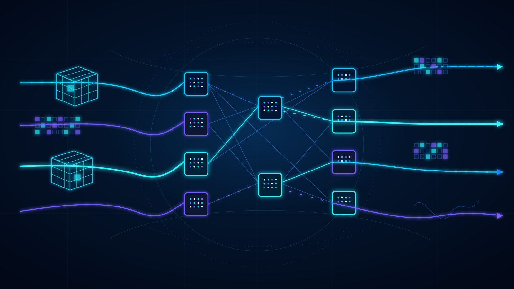

# AI Data Center Systems

AI data center networking, LLM inference, training, storage, and AI systems performance engineering study notes.

  <a href="https://ziwon.github.io/ai-data-center-systems/"><strong>Open the searchable web wiki →</strong></a>
   
  <a href="https://ziwon.github.io/ai-data-center-systems/llms.txt">llms.txt</a>
  · Planned custom domain: <code>ai-datacenter-systems.restack.tech</code>

  

## Study Tracks

- [AI Data Center Network](./ai-data-center-network/README.md): AI 데이터센터 네트워크, RDMA, InfiniBand, RoCE, Clos fabric ([스터디 홈](https://app.notion.com/p/gasidaseo/AI-Data-Center-Network-Study-34a50aec5edf8097b1d0ec9c499b3913))
- [Efficient LLM Inference Systems](./efficient-llm-inference-systems/README.md): LLM inference 성능, KV cache, batching, GPU profiling
- [CME295 Lecture Notes](./cme295/README.md): Transformer/LLM 강의 노트
- [Deep Learning for Network Engineers](./deep-learning-for-network-engineers/README.md): Deep learning model, training process, network engineering 기초
- [AI Systems Performance Engineering](./ai-system-performance-engineering/README.md): GPU, CUDA, PyTorch 기반 AI 시스템 성능 엔지니어링
- [Training](./training/README.md): MLPerf Training, distributed training, LLM/MoE/LoRA workload
- [Storage](./storage/README.md): AI workload storage, ZFS, checkpoint/data pipeline

## Talks

- [ziwon - Making DGX B200 RDMA-ready](./talks/sr-iov-with-dgx-b200/making-dgx-b200-rdma-ready.pdf): 온라인 스터디 공유용

## Labs

- [Clos Fabric Lab Series](./ai-data-center-network/clos-ebgp-lab/README.md)
- [InfiniBand Packet Analysis](./ai-data-center-network/ib-packet-analysis/README.md)
- [RDMA Read/Write Examples](./ai-data-center-network/rdma-examples/README.md)
