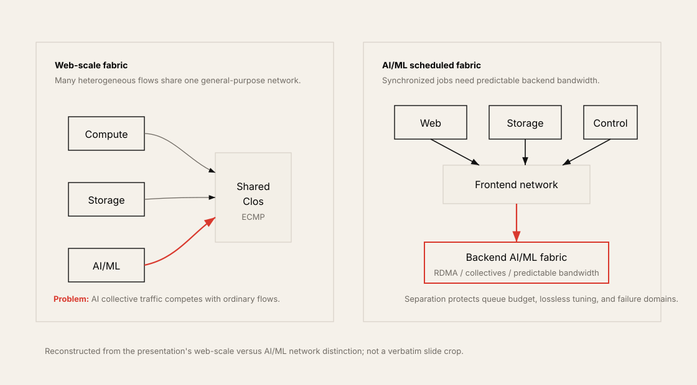
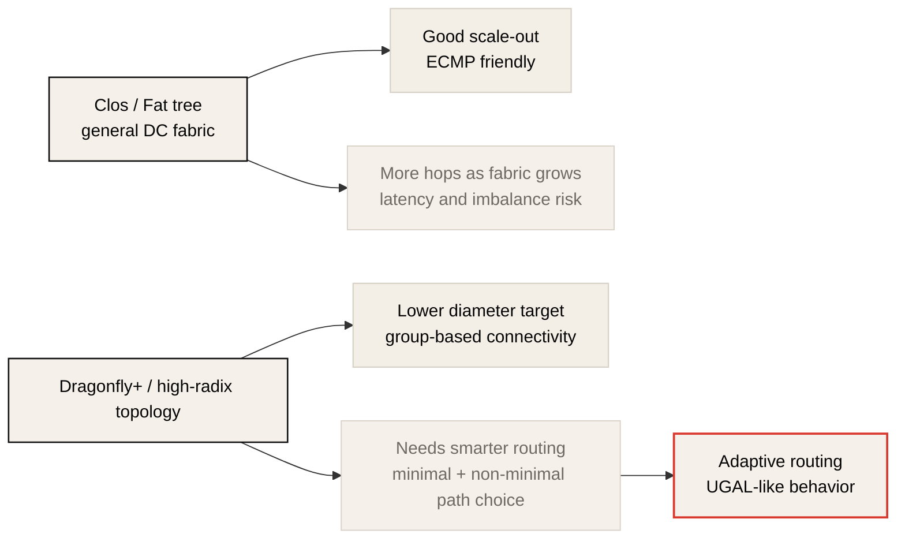

# Cloud Data Center Network의 지금과 앞으로

> Source: Masayuki Kobayashi, "クラウドデータセンターネットワークの 'いま' と 'これから'", AI/ML/HPCネットワーク分科会, 2023-06-12.
> 원본 PDF는 비출판 로컬 참조 자료이며, 이 문서는 공개 사이트용 요약과 최신 맥락 보강이다.

## 한 줄 요지

Cloud-native web-scale network는 많은 작은 TCP flow를 commodity Ethernet/Clos/ECMP로 처리하는 데 최적화되어 왔다. 그러나 AI/ML workload는 GPU 간 동기화, RDMA, collective communication, predictable bandwidth, lossless congestion control을 요구하므로 일반 frontend fabric과 분리된 backend AI fabric으로 설계해야 한다.

## 왜 이 자료가 중요한가

이 발표의 핵심은 네트워크 진화의 원인을 네트워크 자체가 아니라 computing과 storage 변화에서 찾는다는 점이다.

| Driver | Network pressure |
| --- | --- |
| 분산 machine learning | GPU 간 collective, all-to-all, job completion time 단축 |
| AI accelerator 고속화 | compute가 빨라질수록 network stall이 더 비싸짐 |
| NVMe, SCM, PMEM | storage path도 CPU를 우회하거나 network로 확장됨 |
| DPU/IPU | I/O와 security, storage, network function이 CPU 밖으로 이동 |

따라서 AI data center network는 더 이상 "서버를 연결하는 배관"이 아니다. GPU, NIC, DPU, NVMe가 data path의 주체가 되면서 network design이 compute architecture의 일부가 된다.

## CPU-centric에서 distributed/disaggregated로

기존 cloud data center는 기본적으로 CPU-centric architecture였다. Application, hypervisor, network stack, storage I/O processing이 CPU 위에서 실행되고, NIC는 CPU가 준비한 packet을 내보내는 역할에 가까웠다.

AI/ML과 high-performance storage는 이 구조를 바꾼다. GPU는 학습/추론의 주 계산 장치가 되고, NIC는 GPUDirect RDMA로 GPU memory에 직접 접근하며, DPU/IPU는 network/security/storage offload를 맡는다. NVMe storage도 network를 통해 disaggregated resource가 된다.

이 변화의 결과는 명확하다.

- CPU는 tenant application에 더 많이 남겨야 한다.
- Network stack과 storage I/O가 CPU bottleneck이 되면 안 된다.
- GPU/NIC/DPU/NVMe가 직접 data movement에 참여한다.
- Frontend service traffic과 backend AI/ML traffic은 성격이 달라진다.

## Web Scale Fabric과 AI/ML Scheduled Fabric

발표는 기존 cloud-native DC network를 web-scale fabric으로 설명한다. 이것은 commodity Ethernet switch, Clos topology, IP-based ECMP, bisection bandwidth 활용에 기반한다. Compute, storage, control traffic이 한 fabric에서 섞이며, TCP가 packet loss와 reordering을 어느 정도 흡수한다.

AI/ML fabric은 다르다. 많은 GPU가 동기화 지점에서 collective communication을 수행하고, 가장 느린 rank가 전체 job completion time을 지배한다. 개별 flow 하나의 문제가 job 전체 비용으로 증폭된다.

| Dimension | Web scale network | AI/ML network |
| --- | --- | --- |
| Flow shape | 많은 small/medium heterogeneous flow | synchronized elephant flow, collective burst |
| Transport tolerance | TCP가 loss/retransmit을 흡수 | RDMA는 loss와 congestion에 민감 |
| Main metric | aggregate service availability, average throughput | JCT, p99 collective latency, effective bandwidth |
| Load balancing | ECMP로 충분한 경우가 많음 | flowlet/DLB/adaptive routing 필요 |
| Isolation | multi-tenant sharing 중심 | job/fabric isolation이 중요 |
| Network role | general-purpose frontend fabric | scheduled backend compute fabric |

## RDMA와 packet loss 문제

일반 IP network에서는 packet drop이 TCP retransmission과 congestion control로 회복된다. 물론 성능 저하는 있지만, application은 대개 연결이 유지되는 한 복구된다.

RDMA는 다르다. RDMA queue와 NIC offload path는 kernel TCP stack처럼 유연하게 loss를 흡수하지 않는다. RoCEv2의 경우 Ethernet 위에서 RDMA를 제공하지만, 실질적으로 lossless 또는 near-lossless fabric을 만들기 위한 PFC, ECN, DCQCN tuning이 필요하다.

발표가 강조하는 포인트는 다음이다.

- RDMA retransmission은 hardware implementation에 의존한다.
- Go-Back-N 방식의 retransmission은 성능 저하를 크게 만들 수 있다.
- RDMA는 원래 lossless network 전제를 강하게 가진 통신 방식이다.
- AI/ML collective에서는 한 flow의 손실과 지연이 job 전체를 늦춘다.

## Frontend와 Backend는 분리해야 하는가

발표의 강한 주장 중 하나는 RDMA network와 non-RDMA network를 명확히 분리해야 한다는 것이다. 구축/운영 비용은 올라가지만, trade-off가 크다.

같은 fabric에 frontend web traffic, storage traffic, AI/ML collective traffic을 모두 넣으면 다음 문제가 생긴다.

- Queue budget이 충분하지 않을 수 있다.
- Lossless tuning이 일반 traffic과 충돌한다.
- RDMA flow와 TCP flow의 congestion response가 다르다.
- AI job이 일반 service traffic의 noisy neighbor가 되거나 반대로 영향을 받는다.
- 장애 domain과 운영 policy를 분리하기 어렵다.

발표는 필요한 것이 "일반 자동차와 고속도로"가 아니라 "F1 machine과 전용 course"라고 비유한다. 이 비유는 과장처럼 보일 수 있지만, AI training fabric의 목적을 잘 설명한다. 고가의 GPU를 계속 먹여 살리는 것이 목표라면, backend network는 general-purpose sharing보다 predictability를 우선해야 한다.

## Rail-optimized topology와 rack design 변화

GPU cluster에서는 rail-optimized topology가 자주 등장한다. 같은 NIC/HCA rail을 같은 leaf switch에 연결해, application이나 NCCL이 traffic path를 예측하고 최적 NIC를 선택하기 쉽게 만든다.

발표는 rack design도 바뀐다고 설명한다. 전력과 냉각 제약 때문에 GPU server rack에는 GPU와 cooling equipment가 많은 공간을 차지한다. 따라서 switch를 ToR(Top-of-Rack)에 두기보다 EoR(End-of-Row) network rack으로 모으고, server rack에는 patch panel을 두는 설계가 필요해질 수 있다.

이 관점은 최신 AI data center 설계에서도 중요하다.

- rack power density가 올라간다.
- liquid cooling 전환점이 온다.
- copper/optics cable length와 serviceability가 topology의 일부가 된다.
- network rack과 compute rack의 물리 배치가 latency, loss, 운영성에 영향을 준다.

## InfiniBand와 RoCEv2 선택 기준

발표의 구분은 실무적으로 여전히 유용하다.

| Interconnect | Fit |
| --- | --- |
| InfiniBand | 폐쇄형 cluster, ultra-low latency, mature HPC/AI collective fabric, vendor-integrated management |
| RoCEv2 | 기존 Ethernet asset 활용, cloud multi-tenancy, IP/Ethernet operational model, scale-out flexibility |

다만 2026년 기준으로는 이 구분을 업데이트해야 한다. Ethernet 쪽은 단순 commodity Ethernet이 아니라 AI fabric용 Ethernet으로 진화하고 있다. NVIDIA Spectrum-X는 AI cloud용 Ethernet platform으로 높은 effective bandwidth, performance isolation, SuperNIC, Spectrum switch, telemetry/congestion 기능을 함께 제시한다. UEC도 Ethernet-based AI/HPC communication stack을 표준화하려고 한다.

반대로 InfiniBand도 Quantum-X800 같은 세대에서 800 Gb/s port, SHARP v4, adaptive routing, telemetry-based congestion control, performance isolation을 강조한다. 따라서 선택은 "IB냐 Ethernet이냐"가 아니라 다음 질문으로 바뀐다.

- 어떤 GPU scale과 job size를 목표로 하는가?
- multi-tenant cloud인가, dedicated training cluster인가?
- 운영팀이 IB fabric과 UFM/SHARP ecosystem을 다룰 수 있는가?
- Ethernet asset, SONiC/Cumulus, existing tooling을 살려야 하는가?
- congestion control과 lossless tuning을 workload별로 검증할 수 있는가?
- vendor lock-in과 open ecosystem 사이의 trade-off를 어떻게 볼 것인가?

## Clos의 한계와 Dragonfly+/Adaptive Routing

Clos topology는 data center network의 기본 도구다. Bisection bandwidth를 확장하기 쉽고, ECMP로 여러 path를 활용할 수 있다. 대부분의 cloud workload에는 좋은 선택이다.

하지만 매우 큰 HPC/GPU 환경에서는 hop count와 latency, path imbalance, synchronized collective traffic이 문제가 될 수 있다. 발표는 이런 환경에서 Dragonfly+ topology와 adaptive routing을 검토해야 한다고 말한다.

발표의 핵심 문제 제기는 "ECMP의 편차를 줄이는 DLB만으로 충분한가?"이다. Minimal path와 non-minimal path를 동시에 활용하는 adaptive routing이 필요하고, 이를 IP routing에서 자율분산적으로 하고 싶다는 방향을 제시한다.

## 2026년 기준 업데이트

이 발표는 2023년 자료다. 방향성은 여전히 유효하지만, 다음 흐름을 함께 읽어야 한다.

| Area | 2026 update |
| --- | --- |
| AI Ethernet | Spectrum-X처럼 AI workload를 위한 Ethernet fabric이 제품화됨 |
| InfiniBand | Quantum-X800/XDR 계열에서 800G, SHARP v4, adaptive routing, telemetry-based congestion control을 강조 |
| Open Ethernet | UEC Specification 1.0이 2025년에 공개되어 AI/HPC용 Ethernet stack 표준화를 추진 |
| Rack-scale systems | NVL72, GB200/GB300, Rubin 계열에서 rack이 compute/network/cooling product boundary가 됨 |
| Co-packaged optics | 전력과 cable density 때문에 switch optics integration이 더 중요해짐 |

즉 발표의 "이제 AI/ML network가 별도 설계 대상이 된다"는 주장은 더 강해졌다. 다만 세부 구현은 2023년의 RoCE/IB 비교보다 훨씬 빠르게 변하고 있다.

## 설계 체크리스트

| Question | Why it matters |
| --- | --- |
| Frontend와 backend network를 분리하는가? | RDMA/lossless tuning과 일반 service traffic의 충돌을 줄인다. |
| GPU/NIC rail topology가 job placement와 맞는가? | NCCL path 선택과 effective bandwidth에 영향. |
| Full bisection이 필요한 job인가? | Oversubscription은 collective p99와 JCT를 망가뜨릴 수 있다. |
| PFC/ECN/DCQCN parameter를 workload별로 검증했는가? | Lossless Ethernet은 설정이 성능이다. |
| Flowlet DLB나 adaptive routing이 있는가? | ECMP hash collision과 synchronized burst를 줄인다. |
| Rack power/cooling/cabling이 topology와 맞는가? | 네트워크 설계는 물리 설비 제약을 벗어날 수 없다. |
| Storage traffic과 training traffic을 분리하는가? | Checkpoint, dataset read, RDMA collective가 서로 간섭할 수 있다. |
| Monitoring이 flow, queue, ECN/PFC, retransmission을 볼 수 있는가? | 평균 bandwidth만으로는 AI fabric 문제를 찾기 어렵다. |

## 이 레포와의 연결

| Repository topic | Connection |
| --- | --- |
| Chapter 1: Wonders in the Workload | AI workload가 network에 주는 job completion time 압력을 설명한다. |
| Chapter 3: Network Design Considerations | Frontend/backend 분리, rail topology, dedicated backend fabric 설계와 연결된다. |
| Chapter 6: Effective Load Balancing | ECMP 한계, flowlet DLB, adaptive routing 논의와 직접 연결된다. |
| Chapter 7: RoCEv2 Transport and Congestion Management | PFC, ECN, DCQCN tuning의 필요성을 설명하는 배경 자료다. |
| Chapter 8: IP Routing for AI/ML Fabrics | Dragonfly+, minimal/non-minimal path, adaptive routing 문제와 연결된다. |
| Chapter 12: Ultra Ethernet Consortium | Ethernet이 AI/HPC fabric 요구를 흡수하는 최신 흐름과 연결된다. |
| AI Systems Performance Engineering Chapter 4 | NCCL, RDMA, GPUDirect, communication overlap을 infrastructure 관점에서 이어준다. |

## 참고 자료

| Resource | Link |
| --- | --- |
| NVIDIA Spectrum-X Ethernet Platform | <https://www.nvidia.com/en-us/networking/spectrumx/> |
| NVIDIA Quantum-X800 InfiniBand Platform | <https://www.nvidia.com/en-us/networking/products/infiniband/quantum-x800/> |
| Ultra Ethernet Consortium Specification 1.0 announcement | <https://ultraethernet.org/ultra-ethernet-consortium-uec-launches-specification-1-0-transforming-ethernet-for-ai-and-hpc-at-scale/> |
| UEC homepage | <https://ultraethernet.org/> |
| Meta: RoCE networks for distributed AI training at scale | <https://engineering.fb.com/2024/08/05/data-center-engineering/roce-network-distributed-ai-training-at-scale/> |
| NVIDIA DGX H100 user guide | <https://docs.nvidia.com/dgx/dgxh100-user-guide/introduction-to-dgxh100.html> |

## 후속 질문

1. 현재 AI/ML traffic은 frontend network와 backend RDMA network가 분리되어 있는가?
2. GPU rail topology와 scheduler placement가 서로 topology-aware하게 연결되어 있는가?
3. RoCEv2 lossless tuning은 general workload, HPC workload, GPU workload별로 다른 profile을 갖는가?
4. Training job의 JCT regression이 network queue, ECN mark, PFC pause, retransmission counter와 함께 분석되는가?
5. Clos/ECMP로 충분한 scale인가, Dragonfly+/adaptive routing을 검토해야 하는 scale인가?
