# Chapter 1: Wonders in the Workload

## Table of Contents

- [AI Model Lifecycle](#ai-model-lifecycle)
  - [Data Gathering](#data-gathering)
  - [Training](#training)
  - [Inference](#inference)
  - [RAG and MCP Integration](#rag-and-mcp-integration)
  - [Monitoring and Retraining](#monitoring-and-retraining)
- [Training an AI Model](#training-an-ai-model)
  - [Collective Communication Patterns](#collective-communication-patterns)
  - [NCCL and Communication Collectives](#nccl-and-communication-collectives)
- [3D Parallelism: Data, Tensor, and Pipeline](#3d-parallelism-data-tensor-and-pipeline)
- [JCT & Tail Latency](#jct--tail-latency)
- [Understanding Traffic and RDMA](#understanding-traffic-and-rdma)
  - [Data Path vs Control Path](#data-path-vs-control-path)
  - [Data Path](#data-path)
  - [RDMA Types: InfiniBand vs RoCEv2](#rdma-types-infiniband-vs-rocev2)
  - [RDMA Protocols](#rdma-protocols)
  - [InfiniBand System Fabric](#infiniband-system-fabric)
  - [InfiniBand Communication Stack](#infiniband-communication-stack)
  - [RDMA Process](#rdma-process)
- [Questions](#questions)

## AI Model Lifecycle

The machine learning lifecycle consists of data gathering, training, inference, retrieval augmentation, monitoring, and retraining.

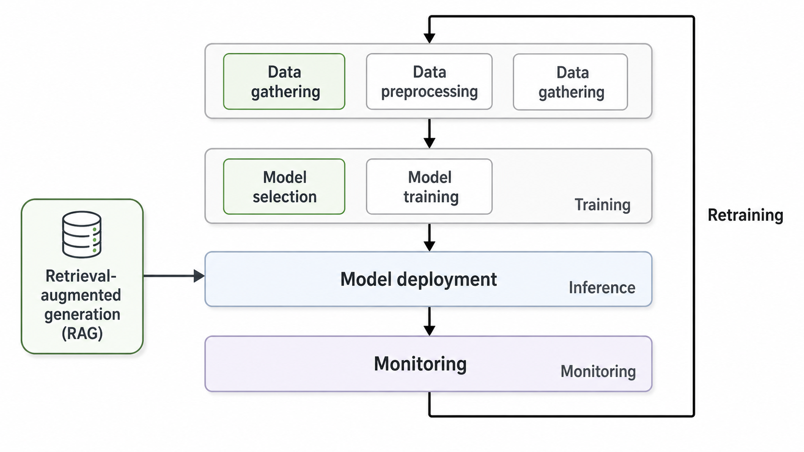

### Data Gathering
Data gathering means data collection from multiple sources, followed by data cleansing, deduplication, noise removal, and tagging. The key point is data quality and relevance. A model trained on irrelevant or low-quality data may produce inaccurate results.

### Training
Training means model selection, parameter configuration, iterative learning, accuracy validation, and parameter optimization. The model is trained on curated datasets, and its parameters are adjusted repeatedly based on the training results until the desired accuracy is achieved.

There are three major types of machine learning:
- Supervised Learning: Training with labeled data, including both inputs and expected outputs.
- Unsupervised Learning: Training with unlabeled data to discover hidden patterns or structures.
- Reinforcement Learning: Training through trial and error, using rewards and penalties to improve decision-making.

### Inference
Inference means trained model deployment for real-world use. Applications such as ChatGPT and Gemini mainly use inference when generating answers for users.

### RAG and MCP Integration
RAG and MCP integration means external knowledge retrieval and contextual enhancement during inference. The model can access recent or domain-specific information and generate more accurate and relevant responses.

### Monitoring and Retraining
Monitoring means continuous model performance tracking, accuracy evaluation, and drift detection. When performance decreases or new data becomes available, the model goes through periodic retraining to maintain accuracy.

## Training an AI Model

| Training Stage | Core Description | Practical Implication |
| --- | --- | --- |
| **Training** | Splits training data into multiple **batches** and iteratively learns from them | Processes data in batches rather than all at once, balancing GPU memory usage and training efficiency |
| **Forward Propagation** | Input data passes through the model's layers to produce a prediction | Each layer performs operations such as matrix multiplication and activation functions |
| **Error Calculation / Loss Calculation** | Compares the model's prediction against the ground truth to compute the error | The loss function quantifies how far off the model currently is |
| **Backward Propagation** | Propagates the computed error from the model's later layers back toward the earlier ones | Uses differentiation and the chain rule to determine how much each parameter contributed to the error |
| **Local Gradient Calculation** | Computes the gradient for each parameter and adjusts the weights accordingly | The optimizer uses these gradients to update the model parameters |
| **Collective Communication** | Synchronizes gradients, parameters, and activations across multiple GPUs or nodes during distributed training | xCCL libraries such as NCCL, RCCL, Gloo, and UCC handle high-speed GPU-to-GPU communication |
| **Iteration** | Repeats the cycle of forward propagation, loss calculation, backward propagation, and parameter update | Reduces loss and gradually improves model accuracy through repeated training |

### Collective Communication Patterns

| Collective Pattern | Operation | Meaning in AI Training |
| ------------------ | --------- | ---------------------- |
| **AllReduce**      | Reduces values from all ranks using an operation such as sum, min, or max, then returns the same result to every rank | The most common pattern for averaging or summing gradients computed by each GPU in Distributed Data Parallel training |
| **Broadcast**      | Copies a buffer from one root rank to all ranks | Used to distribute initial weights, configuration values, or checkpoint metadata from rank 0 to other GPUs |
| **Reduce**         | Similar to AllReduce, but only the root rank receives the reduced result | Used to aggregate results from multiple GPUs into one rank |
| **AllGather**      | Collects data from every rank and makes the complete data available to every rank | Used to reassemble distributed shards in Tensor Parallelism, ZeRO, and sharded parameter or activation layouts |
| **ReduceScatter**  | Reduces data across ranks, then splits and distributes the reduced result by rank | Used as a more efficient decomposition of AllReduce, and important in ZeRO, FSDP, and Megatron-style training |
| **AlltoAll**       | Sends different data from each rank to every other rank and receives different data from every other rank | Commonly used in Mixture-of-Experts models when routing tokens to expert GPUs |
| **Gather**         | Collects data from all ranks into a single root rank | Used to collect evaluation results, logs, or sample outputs into one rank |
| **Scatter**        | Splits data from the root rank and distributes a shard to each rank | Used to distribute data batches or shards across multiple GPUs |


> A collective call must be invoked by every rank with the same count and datatype. If this condition is violated, undefined behavior such as hangs, crashes, or data corruption can occur. This is why NCCL hang debugging usually starts by checking whether every rank entered the collective and whether the count and datatype match.

- Between Three Workers:

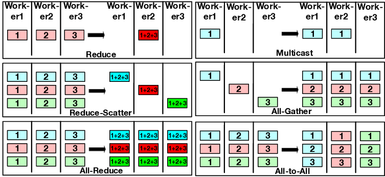

Source: [researchgate.net](https://www.researchgate.net/publication/381851266/figure/fig1/AS:11431281257581828@1719803613125/Collective-communication-patterns-between-three-workers.png)


### NCCL and Communication Collectives

#### Why Collective Communication?

In distributed AI training, many training algorithms (DDP, FSDP, ZeRO, Megatron-LM, etc.) require all GPUs to:

1. **Share model parameters/gradients** (AllReduce / ReduceScatter / AllGather)
2. **Propagate initial states** (Broadcast)
3. **Aggregate results** (Gather)

Doing these naively with point-to-point sends and receives would be extremely inefficient, especially for large models and large GPU counts. Collective communication libraries like NCCL optimize these patterns to use the network topology and GPU hardware effectively.

<p align="center" style="background-color: black; padding: 20px;">
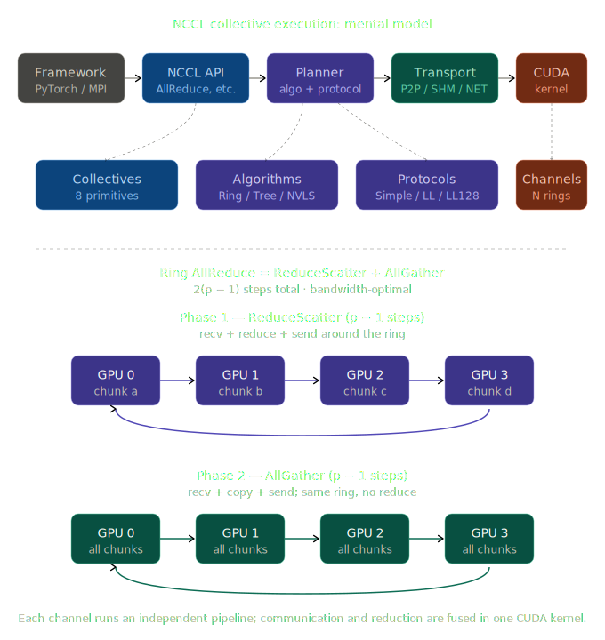
</p>

The core motivation is **scalability**. If you implement broadcast using only point-to-point communication (P2P), the root rank has to send the data sequentially to (p-1) other ranks. This makes the communication time scale linearly with the number of ranks, and the root's outgoing link becomes a bottleneck. In contrast, when you use a collective API, NCCL automatically selects an algorithm (e.g., ring, tree, NVLS, CollNet, or PAT) based on the topology, message size, and operation type. With ring-based algorithms, all links can be activated simultaneously, making the time scale nearly independent of the number of ranks.

<p align="center" style="background-color: black; padding: 20px;">
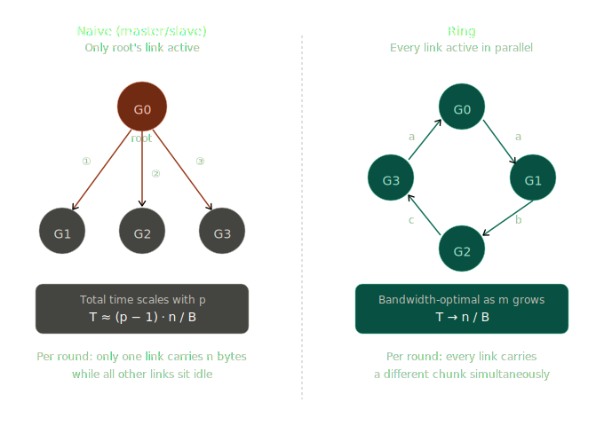
</p>


#### MPI vs NCCL
NCCL can be understood as a GPU-oriented implementation of MPI-style collective vocabulary such as AllReduce and AllGather. The key differences are:

- Execution location: MPI is a host-side library, while NCCL runs as GPU kernels. Communication and reduction are performed in a single kernel.
- Data path: MPI commonly follows a host memory to network path, while NCCL uses GPU memory to GPU memory paths through GPUDirect P2P or RDMA.


#### Pattern Combination
Every collective can be described as a combination of four basic patterns:

| Pattern | Direction | Data Form |
| --- | --- | --- |
| Broadcast | root → all | Replicates the same value |
| Scatter | root → all | Distributes different chunks |
| Gather | all → root | concat |
| Reduce | all → root | Applies an element-wise operation such as sum or max |

- AllGather = Gather + Broadcast
- AllReduce = Reduce + Broadcast, or ReduceScatter + AllGather. The latter is used by NCCL and MPICH and is directly leveraged by ZeRO-3 and FSDP.
- ReduceScatter = Reduce + Scatter
- AlltoAll = transposed Scatter × N

#### NCCL Primitives

- **8 collectives**: AllReduce, Broadcast, Reduce, AllGather, ReduceScatter, Gather, Scatter, and AlltoAll. The last three are internally implemented as grouped P2P operations, or bundled Send/Recv calls.
- **2 P2P operations**: ncclSend and ncclRecv (NCCL 2.7+).
- **6 one-sided RMA operations**: ncclPutSignal, ncclSignal, ncclWaitSignal, ncclCommWindowRegister, and related operations (NCCL 2.29.2+). These are important for KV cache transfer in disaggregated serving patterns such as separated prefill and decode.

Two-sided communication is synchronous in terms of endpoint coupling, while one-sided RMA is asynchronous.

- **Two-sided**: Even if the host call is nonblocking, both sides must issue matching calls before data can be transferred, so rendezvous coupling remains.
- **One-sided RMA**: Once the receiver registers a window, the sender can write directly through DMA and send only a signal. This naturally fits workloads that need to decouple producer and consumer timing, such as separated prefill and decode.

#### Data Path (Intra-node vs Inter-node)

- **Intra-node**: NVLink P2P → PCIe P2P → SHM through host RAM → NIC loopback
- **Inter-node**: GPU kernel → GPU vidmem → CPU proxy thread → NIC. If GPUDirect RDMA is available, the NIC can directly read from and write to GPU memory. Otherwise, data must pass through host pinned memory as a staging buffer, adding two extra PCIe crossings. This uses the same memory type as PyTorch DataLoader's `pin_memory=True`.

#### AllReduce Key Concept

Ring AllReduce consists of ReduceScatter ($p-1$ steps) followed by AllGather ($p-1$ steps), completing in $2(p-1)$ total steps. The per-GPU send volume converges to $\frac{2(p-1)K}{p} \to 2K$, which exactly matches the information-theoretic lower bound for AllReduce. This makes it **bandwidth-optimal**.

Key NCCL implementation details:

- **Single kernel design**: recv → reduce → send is handled inside one CUDA kernel and within the same thread's register set. Data does not round-trip through HBM, and kernel launch overhead is paid only once.
- **Channels**: A single collective call is split into multiple channels, or CUDA blocks, so multiple parallel rings can run at the same time. This helps saturate NVLink links and NIC FIFOs.
- **Slots (NCCL_STEPS=8)**: Each channel is further pipelined through FIFO slots. While slot 0 is being reduced, the next chunk may already be arriving in slot 1.
- **Protocols**: Simple for large messages and memory fences, LL for small messages with 8-byte atomics and roughly 25-50% bandwidth, and LL128 for 128-byte atomics and about 95% NVLink bandwidth.

#### NCCL Algorithms


Even for the same **AllReduce** call, NCCL may use different schedules depending on message size, rank count, and topology. The semantics are fixed, but the execution strategy is a separate layer. For each call, NCCL builds a cost table with 7 algorithms × 3 protocols = 21 cells and selects the cell with the lowest estimated time.

For AllReduce, only 10 of the 21 cells are actually evaluated. PAT is excluded, and NVLS, NVLSTree, and CollNet allow only the Simple protocol.

#### αβγ Cost Model

- **α**: Startup latency for one message, similar to RTT and usually measured in microseconds.
- **β**: Per-byte transfer cost, equivalent to 1 / bandwidth.
- **γ**: Per-byte reduction cost, usually small compared with β and often ignored.

One message costs α+nβ. With reduction included, the cost becomes α+nβ+nγ.

Two regimes:
- **Latency-bound (small messages)**: step count × α. Because α dominates, algorithms with logp steps are advantageous, such as Tree and PAT.
- **Bandwidth-bound (large messages)**: total transfer volume dominates. Algorithms that use all links in parallel are advantageous, such as Ring.


NCCL algorithm selection can be summarized as computing **time = lat + bytes / bw** across the 21 cells and selecting the argmin. The topology first eliminates ineligible cells, then the cost model chooses the algorithm and protocol pair.

<p align="center" style="background-color: #000000; padding: 20px;">
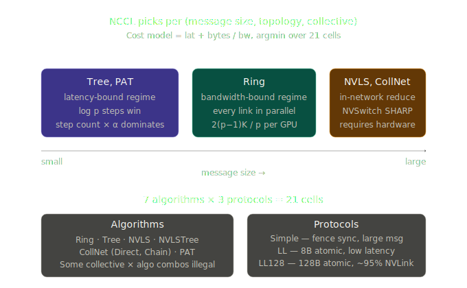
</p>

| Algorithm               | Strength | Weakness | Usually Favorable Scenario |
| ----------------------- | -------- | -------- | -------------------------- |
| **Ring**                | Strong bandwidth utilization | Latency steps increase as rank count grows | Large tensors, large gradients, bandwidth-sensitive AllReduce |
| **Tree**                | Low latency and fewer hops | May use bandwidth less efficiently than Ring for large messages | Small messages and latency-sensitive collectives |
| **NVLS / NVLink SHARP** | NVSwitch-based reduction offload | Depends on NVSwitch/NVLink hardware | Inside NVSwitch systems such as DGX/HGX |
| **CollNet / SHARP**     | Uses network or switch offload | Requires NIC, switch, or plugin support | Large-scale multi-node collectives |
| **PAT**                 | Increases parallelism by running multiple trees in parallel | Depends on newer NCCL versions and environment support | Algorithm family that may be selected in large-scale environments |

#### NCCL Protocols

**NCCL** selects among Simple, LL, and LL128 at runtime based on user settings, the collective algorithm, and internal heuristics. It considers factors such as topology, GPU architecture, and message size when choosing the algorithm-protocol pair.

Benchmark results typically show that LL and LL128 are favorable for small messages, while Simple tends to be stronger for large distributed transfers.

| Protocol   | Characteristics | Suitable Scenario |
| ---------- | --------------- | ----------------- |
| **Simple** | Large chunk oriented, maximizes bandwidth | Large messages and large gradients |
| **LL**     | Low latency with small-granularity synchronization | Small messages where latency matters |
| **LL128**  | Improves bandwidth efficiency compared with LL | Small to medium messages on high-speed interconnects |

#### NCCL Transports

| Transport   | Meaning |
| ----------- | ------- |
| **P2P**     | Direct communication between GPUs in the same node, using NVLink or PCIe P2P |
| **SHM**     | Uses host shared memory when P2P is unavailable or inefficient |
| **NET**     | Inter-node NIC/RDMA communication through InfiniBand, RoCE, or TCP |
| **CollNet** | Uses collective network offload |
| **NVLS**    | Uses NVSwitch-based reduction acceleration |


#### Conclusion

**NCCL** can be understood as three abstraction layers:

1. **Semantics layer** — The meaning of collective APIs such as AllReduce, AllGather, and AlltoAll. This matches the MPI standard.
2. **Algorithm layer** — The schedule and protocol used to execute the same semantics, such as Ring, Tree, NVLS, Simple, or LL128. The cost model selects this automatically.
3. **Kernel layer** — Multi-level channel × slot pipelining inside a single CUDA kernel, with recv → reduce → send fused inside the register set.

#### Best Practices

- DGX B200/H100

```
DDP  → AllReduce centered
FSDP → ReduceScatter + AllGather centered
TP   → AllReduce / AllGather centered
MoE  → AllToAll centered

Intra-node  → NVLink / NVSwitch / NVLS
Inter-node  → InfiniBand / RoCE / GPUDirect RDMA
NCCL Runtime → topology graph + cost model + channelization
```

- For Debug

```sh
NCCL_DEBUG=INFO
NCCL_DEBUG_SUBSYS=INIT,GRAPH,COLL,NET
```

- For Benchmark Experiment

```sh
NCCL_ALGO=Ring
NCCL_PROTO=Simple

NCCL_ALGO=Tree
NCCL_PROTO=LL

NCCL_ALGO=Ring
NCCL_PROTO=LL128
```

## 3D Parallelism: Data, Tensor, and Pipeline

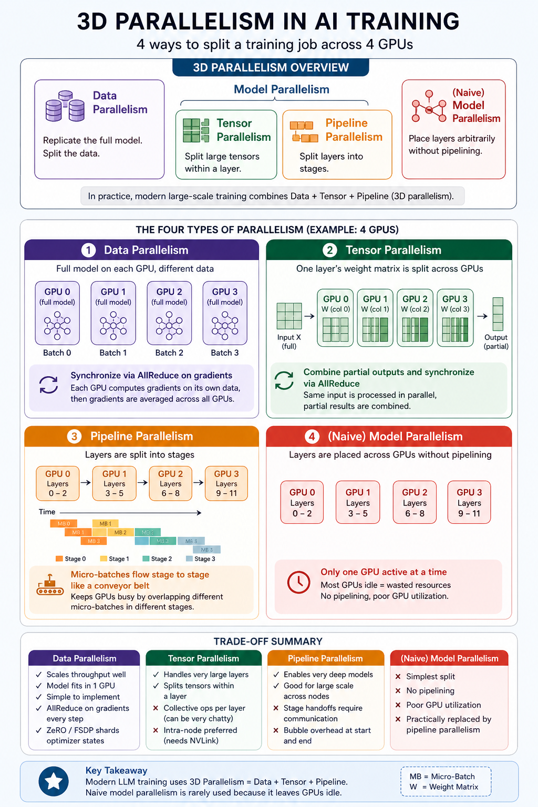

## JCT & Tail Latency

| Term | Meaning |
| ---- | ------- |
| **JCT** | The total time from when a job starts until the entire job finishes |
| **Tail latency** | The delay of the slowest subset of flows, tasks, or requests |
| **Straggler** | A slow worker, task, GPU, or network flow that creates tail latency |
| **Throughput** | The amount of work processed per unit of time |
| **GPU utilization** | The percentage of time that a GPU is performing useful computation |

## Understanding Traffic and RDMA

### Data Path vs Control Path

RDMA is often described as **kernel bypass**, but this mainly applies to the **data path**, not to the entire system. The control path still requires the CPU, kernel driver, and RDMA runtime.

| Path | What Happens | CPU / Kernel Role |
| --- | --- | --- |
| **Data path** | Actual payload movement between registered memory regions | Mostly bypassed after setup |
| **Control path** | Resource setup, memory registration, key creation, QP connection, completion handling, and teardown | Still required |

The rest of this section first compares TCP/IP and RDMA data paths, then later explains the control-path objects and steps such as PD, CQ, QP, MR, lkey, rkey, metadata exchange, and QP state transitions.

### Data Path

#### TCP/IP

When the sender calls `send()`, data usually follows this path:

1. Application memory in user space
2. Kernel entry through a system call and context switch
3. Copy into the kernel socket buffer
4. TCP layer segmentation and header generation
5. IP layer packet construction and routing
6. NIC driver transfer to the NIC through DMA
7. wire

The receiving side follows the reverse path.

The important point is that memory copies between kernel buffers and user buffers are required. Each packet also goes through a long chain of interrupt → ISR → soft IRQ → socket queue → process wakeup.

#### RDMA

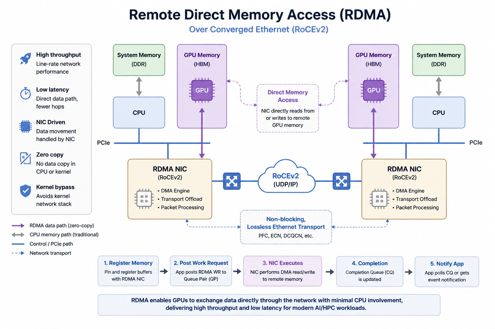

When the sender calls `ibv_post_send()` through the Verbs API:

1. The application enqueues a work request that points to a pre-registered Memory Region (MR) directly into the NIC's Queue Pair (QP).
2. The NIC reads data directly from the registered memory through DMA and sends it onto the wire.
3. The receiving NIC writes the received data directly into the peer's registered memory through DMA.
4. When the operation completes, the NIC adds an entry to the Completion Queue (CQ).

The OS kernel does not appear in the data path. This is called **kernel bypass**. RDMA also avoids extra memory copies (**zero-copy**) and does not require the receiving CPU to process data arrival (**CPU offload**).


| Category | TCP/IP | RDMA |
| -------- | ------ | ---- |
| Data path | Application → Kernel → TCP/IP stack → NIC | Application registered memory ↔ RNIC/HCA DMA |
| Kernel involvement | High | Very low in the data path |
| CPU usage | Relatively high | Low |
| Memory copy | Socket buffer copies are common | Designed for zero-copy transfer |
| Latency | Relatively high | Low |
| Generality | Very high | Requires RDMA NICs, drivers, and fabric support |
| Network requirements | Works on standard Ethernet/IP | Requires InfiniBand, RoCE, iWARP, or similar support |
| Programming model | Socket API | Verbs, queue pairs, completion queues, and memory regions |
| Failure and operations complexity | Relatively simple | More difficult to configure and debug |
| Typical use cases | Web, API, database, and service communication | AI training, HPC, distributed storage, NVMe-oF, and high-performance file services |


#### Why RDMA Is Fast

First, **kernel bypass**: TCP/IP requires system calls, kernel buffers, and TCP/IP stack processing during `send()` and `recv()`. With RDMA, once a work request is posted to a queue pair, the RNIC/HCA performs the data transfer.

Second, **zero-copy**: TCP/IP usually copies data between the application buffer and the kernel socket buffer. RDMA moves data directly from one registered memory region to another. TechTarget also describes RDMA as zero-copy networking that bypasses the kernel networking stack on both systems.

Third, **NIC offload**: RDMA NICs handle much of packetization, ordering, reliability, DMA, and completion processing in hardware. The CPU focuses on posting work requests and checking completions rather than moving data directly.

#### Main RDMA Modes: InfiniBand, RoCE, and iWARP

| Mode | Description | Characteristics |
| ---- | ----------- | --------------- |
| **InfiniBand RDMA** | RDMA over an InfiniBand fabric | Widely used in HPC and AI training; uses credit-based flow control |
| **RoCEv1** | RDMA over Ethernet layer 2 | Mostly limited to L2 domains and difficult to route |
| **RoCEv2** | RDMA over UDP/IP | Supports IP routing and is important in AI data center Ethernet fabrics |
| **iWARP** | RDMA over TCP | Less dependent on lossless Ethernet, but less common than RoCE or InfiniBand in AI/HPC environments |

InfiniBand and RoCEv2 are the most common options in AI data centers. RoCEv2 provides RDMA semantics over UDP/IP, so it can run on Ethernet fabrics. However, loss and congestion management become critical, so PFC, ECN, and DCQCN are usually part of the deployment.

#### Meaning in AI Training

In distributed training, GPUs continuously exchange gradients, activations, and parameter shards after forward and backward computation. If TCP/IP is used, the CPU and kernel stack can become bottlenecks.

With RDMA, collective communication libraries such as NCCL can exchange data quickly between GPU nodes over InfiniBand or RoCE. With GPUDirect RDMA, the NIC can directly access GPU memory without staging through host memory. Red Hat describes GPUDirect RDMA as useful for distributing GPU-accelerated workloads across a cluster.

The general difference is:

```
TCP/IP-based GPU communication
GPU memory → Host memory → Kernel TCP/IP stack → NIC
NIC → Kernel TCP/IP stack → Host memory → GPU memory

RDMA + GPUDirect RDMA
GPU memory ↔ RNIC/HCA ↔ Network ↔ RNIC/HCA ↔ GPU memory
```

RDMA is not just about having a faster network. It reduces CPU involvement, memory copies, GPU idle time, collective communication latency, and ultimately JCT.


#### Kernels in RDMA

RDMA does not make all kernel responsibilities disappear. Instead, it moves much of the data-path work from the kernel to RNIC/HCA hardware, firmware, and user-space RDMA runtimes.

| Traditional Kernel Function | Who Handles It in RDMA? |
| --- | --- |
| Reliable delivery, including retransmission, ACKs, and sequencing | NIC/HCA hardware |
| Flow control to avoid overflowing the receive buffer | NIC hardware with credit-based flow control |
| Congestion control | NIC plus network fabric mechanisms such as PFC, ECN, and DCQCN |
| Packetization and segmentation | NIC hardware |
| Header generation and validation | NIC hardware |
| Memory protection against invalid memory access | Kernel at registration time plus NIC MMU |
| Address translation from virtual to physical addresses | Kernel at registration time plus NIC IOMMU/MTT |
| Connection setup | Kernel plus user-space library during setup |
| Routing | Network fabric and switches |

RDMA shifts work from "the CPU handles everything directly" to "the NIC/HCA hardware handles the fast path."

The key change is a shift from **"the kernel participates in every packet"** to **"the system is configured once, then hardware handles the data path."** Work that used to happen per packet becomes setup-time work. The kernel remains involved in the control plane, but it is removed from the data plane.

<p align="center" style="background-color: #000000; padding: 20px;">
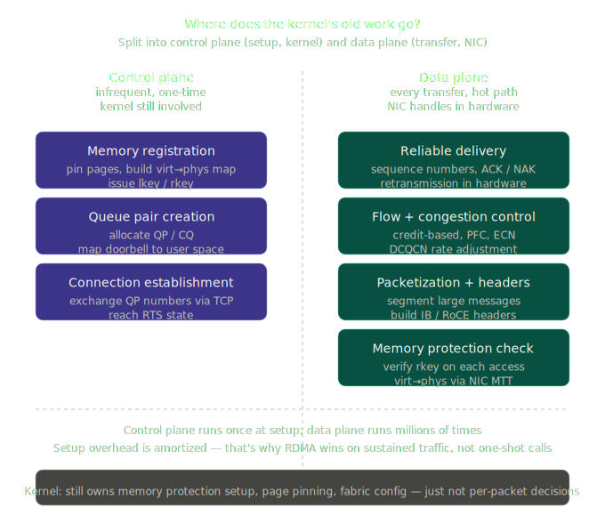
</p>

#### What the NIC Actually Offloads

##### Reliability

One of the heavy parts of TCP is ACK tracking and retransmission. In RDMA Reliable Connected (RC) mode, the NIC handles this directly:

- Assigns a Packet Sequence Number (PSN) to each packet
- Automatically sends ACK/NAK responses from the receiving NIC
- Automatically retransmits when the sending NIC does not receive an ACK
- Reorders out-of-order packets in the NIC

To support this, the NIC contains small state machines and buffers. In effect, part of a TCP-like reliability mechanism is implemented inside the NIC chip.

##### Flow Control
When the receive-side buffer fills up, the sender must stop. RDMA handles this at two layers:

- Credit-based flow control at the NIC level: The receiving NIC tells the sending NIC how many packets it can currently accept. When credits run out, the sender stops.
- Priority Flow Control (PFC) at the link level: A switch can signal that a priority queue is full and temporarily pause traffic. In RoCE deployments, this is often referred to as a lossless network.

##### Congestion Control

Like TCP Reno or Cubic, RDMA also needs congestion control. The difference is where the control runs:

- DCQCN (Data Center Quantized Congestion Notification): When ECN-marked packets arrive, the sending NIC automatically reduces its rate.
- Timely: Adjusts the rate based on RTT.
- These mechanisms are handled by NIC firmware, so the CPU is not directly involved.

##### Memory Protection

In TCP, the kernel is the gatekeeper for memory protection. In RDMA:

- When `ibv_reg_mr()` is called, the kernel pins the memory and registers the Memory Translation Table (MTT) with the NIC.
- After that, the NIC validates the remote key (`rkey`) and memory region for every RDMA request.
- Invalid keys or out-of-range accesses are blocked by NIC hardware.

Protection does not disappear. The validation responsibility moves from the kernel to the NIC. This is why RDMA NIC firmware bugs can become security vulnerabilities, and related CVEs appear from time to time.

##### Address Translation
The NIC also participates in translating virtual addresses to physical addresses. It has a small MMU-like mechanism and caches MTT entries, allowing it to perform work similar to the CPU MMU independently.

#### Trade-offs with RDMA

Benefits:

- Much lower CPU usage
- Single-digit microsecond latency
- Throughput that can approach wire rate

Costs:

- **NICs become more expensive and complex**: RDMA NICs require larger chips, more firmware, and more memory than ordinary Ethernet NICs.
- **Firmware bugs become more dangerous**: Kernel bugs can be patched through the OS, but NIC firmware updates are heavier and often require rebooting.
- **Network fabric requirements become stricter**: RoCEv2 often assumes a lossless network, so PFC and ECN must be tuned carefully. Bad configuration can lead to events such as PFC storms.
- **Kernel flexibility is reduced**: TCP can add new algorithms such as BBR through OS updates, while RDMA congestion control is tied more closely to the NIC chipset.
- **Memory pinning has a cost**: Pinning large memory regions limits the OS's ability to manage memory, compress pages, or swap.
- **Setup is expensive**: Creating QPs and registering MRs is costly, so RDMA can be inefficient for short one-off messages.

The kernel's work is not eliminated. It is split into a model where the kernel validates and configures the system once, then the NIC handles each packet quickly afterward. Memory registration and QP setup are handled by the kernel and runtime; subsequent traffic is handled by the NIC.

GPUDirect RDMA extends this model to GPU memory, allowing the NIC to read and write GPU memory directly without passing through host RAM.

### RDMA Types: InfiniBand vs RoCEv2


| Category | InfiniBand | RoCEv1 | RoCEv2 | iWARP |
| -------------- | ---------------------------------------- | ---------------------- | ----------------------------------- | -------------------------- |
| Base network | InfiniBand fabric | Ethernet L2 | UDP/IP over Ethernet | TCP/IP over Ethernet |
| Routing | IB routing | Limited to an L2 broadcast domain | Supports IP routing | Supports IP routing |
| RDMA transport | Native IB transport                      | IB transport semantics | IB transport over UDP/IP            | iWARP RDMA stack           |
| Typical use | HPC, AI training, DGX/HGX clusters | RDMA within the same L2 domain | AI Ethernet fabrics and leaf-spine RDMA | Some storage and HPC use cases |
| Strengths | Low latency, lossless fabric, RDMA-native design | Simple Ethernet RDMA | Routable and easier to integrate with Ethernet data centers | TCP/IP-based and routable |
| Weaknesses | Requires operating a dedicated fabric | Poor L3 scalability | Operational complexity around PFC, ECN, and DCQCN | Relatively uncommon in AI GPU fabrics |

### RDMA Protocols
- InfiniBand requires IB-capable switches.
- RoCEv1 introduces Ethernet framing and enables the use of commodity switches.
- RoCEv2 adds UDP/IP transport and enables routing.

<p align="center" style="background-color: white">
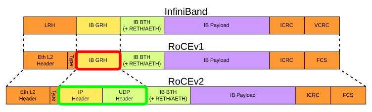
</p>

Source: [indico.cern.ch](https://indico.cern.ch/event/1483219/contributions/6347140/attachments/3007702/5302083/RoCEv2_GB_DAQ_workshop_2025_v2.pdf)

<p align="center" style="background-color: white">

</p>

#### Base Transport Header (BTH)

Key fields included in the BTH header:

- **Opcode**: Used to specify the type of RDMA operation, such as RDMA_WRITE, RDMA_READ, …
- **Destination QP**: Used to distinguish between different destination Queue Pairs for a packet.
- **Acknowledge Request**: Indicates whether the receiving end needs to return an ACK for this packet.
- **Packet Sequence Number (PSN)**: used in packet sequence tracking for reliable delivery.


#### RDMA Extended Transport Header (RETH)


#### ACK Extended Transport Header (AETH)

As explained earlier, the InfiniBand transport layer needs a way to notify the sender when reliable transmission requires acknowledgment or error reporting. This is done using the AETH extension, which contains the following fields:

- **Syndrome**: A field that contains response codes indicating success (ACK), error conditions (NAK), or receiver not ready (RNR) status, along with flow control information
- **Message Sequence Number (MSN)**: Indicates the sequence number of the most recently completed message, implying that all messages with lower sequence numbers have been successfully received

Source: https://qsysarch.com/blog/what-is-rocev2/

### InfiniBand System Fabric

IB follows a five-layer network model: Physical, Link, Network, Transport, and Application layers. Unlike traditional networks where L1 & L2 are hardware-based and L3 & L4 are software-based, IB implements L1-L4 in hardware. The IB transport layer API connects HCA NICs and CPUs, with Verbs API as the application network interface for IB, similar to the Socket API for traditional TCP/IP networks. MPI, a method library for parallelization, can be based on OFA Verbs API or TCP/IP Socket.

<p align="center">

</p>

Source: https://www.naddod.com/blog/infiniband-system-fabric-an-overview


### InfiniBand Communication Stack

The following diagram shows that in InfiniBand/RDMA, the application does not directly send packets. Instead, it submits a WQE to a QP, the Channel Adapter sends packets through the transport, network, link, and physical layers, and completion is reported through a CQE.

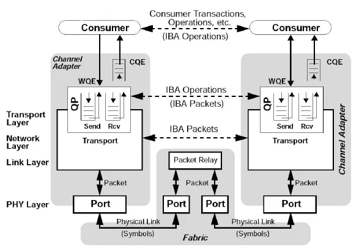

Source: https://www.researchgate.net/figure/nfiniBand-Architecture-Communication-Stack-7_fig1_242258491

In InfiniBand, every transfer starts or ends at a Channel Adapter. On a normal server, this is usually called a Host Channel Adapter (HCA). On the I/O device side, it is called a Target Channel Adapter (TCA). InfiniBand uses a switched fabric topology rather than a shared medium.

```
Consumer / Application
        ↓ Submit WQE
Queue Pair(QP): Send Queue / Receive Queue
        ↓ Channel Adapter executes
Transport Layer
        ↓ Generate IBA packet
Network / Link / PHY Layer
        ↓ Fabric / Packet Relay / Switch
Remote Channel Adapter
        ↓ Generate CQE
Remote Consumer / Application
```

#### Consumer

The consumer is the upper-layer software, such as an application, MPI, NCCL, or a storage stack.

The consumer does not create network packets directly. Through the Verbs API, it creates requests such as "send this memory there," "read remote memory," or "perform an RDMA Write." Red Hat describes InfiniBand as both a physical/link-layer protocol and an upper programming API, the InfiniBand Verbs API, and explains that this Verbs API is an implementation of RDMA technology.

#### WQE: Worker Queue Element

WQE is the command unit that tells the HCA what operation to perform. The HCA can keep multiple WQEs in a queue and process them.


| WQE Field | Meaning |
| -------------- | ------------------------------------- |
| opcode         | SEND, RDMA_READ, RDMA_WRITE, ATOMIC, and similar operations |
| local address  | Address of the local memory buffer |
| lkey           | Access key for local memory |
| remote address | Address of the remote memory |
| rkey           | Access key for remote memory |
| length         | Transfer length |
| flags          | Options such as whether signaled completion is requested |


Mellanox/NVIDIA InfiniBand training material also describes a Work Queue as a consumer/producer interface to the fabric. When the consumer creates a WQE, the Channel Adapter executes that work request.

#### QP: Queue Pair

A Queue Pair is a communication channel between two HCAs. For RDMA communication to occur, QPs must be created on both sides and connected to each other. It is a core unit of RDMA communication.

A QP usually consists of two queues.

| Queue             | Role |
| ----------------- | --------------------------------------------------------------- |
| **Send Queue**    | Submits outgoing work requests such as SEND, RDMA_READ, RDMA_WRITE, and ATOMIC |
| **Receive Queue** | Pre-posts receive buffers for incoming SEND operations |

Send and receive queues are separated because one-sided operations such as RDMA Read and Write do not necessarily use the remote Receive Queue, while SEND/RECV requires the receiver to pre-post receive buffers to the Receive Queue.

NVIDIA documentation also explains that a Completion Queue can service a send queue, a receive queue, or both, and that work queues from multiple QPs can be connected to one CQ.

#### CQ / CQE: Completion Queue / Completion Queue Element
When the Channel Adapter completes an operation, it writes a CQE into the CQ to tell the application whether the operation succeeded or failed.

```
Consumer posts WQE
        ↓
Channel Adapter executes operation
        ↓
Write CQE to Completion Queue
        ↓
Consumer polls CQ
        ↓
operation completed
```

| CQE Field | Meaning |
| ----------- | --------------------------------- |
| opcode | Operation type |
| status | Success or failure |
| wr_id | ID associated with the WQE |
| byte_count | Number of bytes transferred |
| vendor_specific | Vendor-specific extension information |

#### Channel Adapter

On servers, the Channel Adapter is usually an HCA or RNIC. It performs the following roles:

| Role | Description |
| ------------- | ------------------------------------- |
| WQE fetch | Reads work requests from the Work Queue |
| DMA | Reads from or writes to host memory or GPU memory |
| packetization | Generates IBA packets |
| transport processing | Handles PSN, ACK, retry, ordering, and related functions |
| completion generation | Writes CQEs into the CQ |
| link processing | Sends packets through the port into the fabric |

The important point is that a Channel Adapter is not just a simple NIC. It is an RDMA transport offload engine.

Because hardware creates packets and handles transport processing instead of the CPU, tail latency and CPU overhead are reduced. NVIDIA Spectrum-X NICs are representative examples.

#### Transport Layer
The Transport Layer is responsible for QPs, WQEs, packet sequencing, ACKs, retries, and message segmentation and reassembly.

In InfiniBand, a message can be split into multiple packets, and those packets together form one message. InfiniBand messages can include RDMA read/write, send/receive, atomic operations, and multicast.

In transports such as Reliable Connection (RC), the receiver acknowledges packets, and the sender updates the completion queue after receiving the ACK. NVIDIA/Mellanox InfiniBand introduction material describes the same flow: the receiver acknowledges packets, and the sender receives acknowledgments and updates the completion queue.

#### Network / Link / PHY Layer

At these layers, IBA packets are generated and transmitted through the fabric. These layers are often grouped together as the Network Layer, but they can be separated as follows:

| Layer               | Role |
| ------------------- | --------------------------------------------------- |
| **Transport Layer** | QP, operation, reliability, ordering, ACK, retry    |
| **Network Layer**   | LID/GID-based routing and forwarding between subnets |
| **Link Layer**      | local link framing, flow control, packet forwarding |
| **PHY Layer**       | Physical cables, optical/copper media, and symbol transmission |

InfiniBand uses a switched fabric topology. Processors are connected through HCAs, and peripherals can be connected through TCAs. These hardware resources are accessed through OFED drivers.

#### Packet Relay / Fabric

The Packet Relay in the middle can be understood as an InfiniBand switch or a forwarding device inside the fabric.

It is important that the packet relay does not go up to the transport layer. Switches usually do not process end-host QPs or CQEs. They handle packet forwarding and routing. The semantic meaning of an RDMA operation, such as "this is an RDMA Write" or "write to this remote memory address," is handled by the Channel Adapters on both ends.

#### AI/NCCL

When NCCL executes collectives such as AllReduce, ReduceScatter, and AllGather, the lower layers still follow this model: WQEs are posted, the HCA creates packets, and completions are checked through CQEs. Libibverbs can be viewed as the low-level API, UCX as middleware that makes it easier to use, and NCCL as a library for AI collectives.

```
NCCL / MPI / PyTorch Distributed
        ↓
libibverbs / UCX / NCCL net plugin
        ↓
QP / CQ / MR / WQE
        ↓
HCA / RNIC
        ↓
InfiniBand or RoCE fabric
        ↓
Remote HCA / RNIC
        ↓
Remote GPU or host memory
```

### RDMA Process

The RDMA process can be understood in three major stages:

```text
A. Connection / Resource Setup
        ↓
B. RDMA WRITE
        ↓
C. RDMA READ
```

#### Full Flow
<p align="center" style="background-color: black">
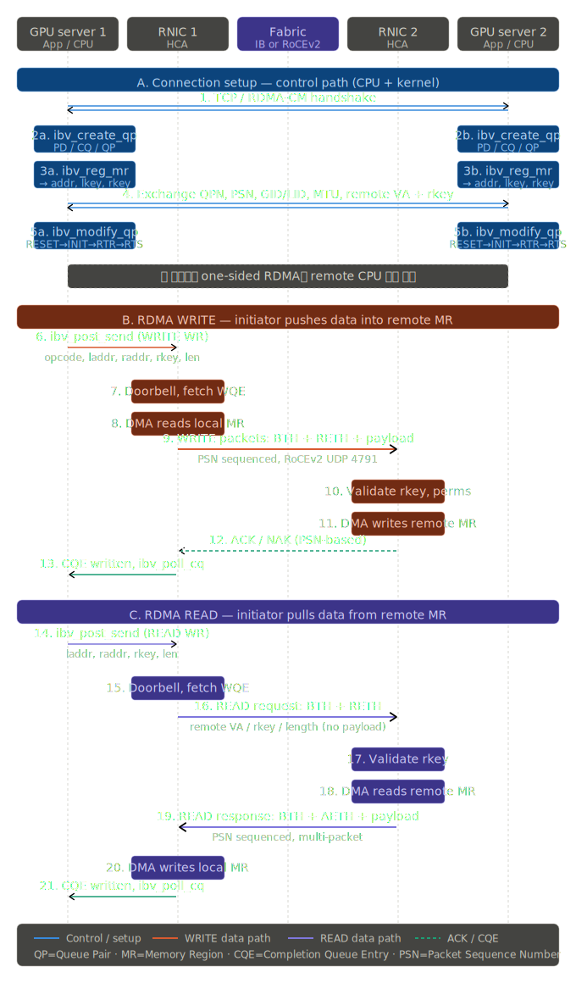
</p>

The full flow starts with connection and resource setup. This phase is not yet the high-speed data path. It is mainly handled by the **CPU, kernel driver, and RDMA library**.

First, the two servers create a control channel through a TCP socket or RDMA-CM. This channel is not meant for large data movement. It is used to exchange RDMA connection metadata.

Then each server creates the RDMA resources required for communication.

| Object | Meaning |
| ------ | ------- |
| **PD** | Protection Domain. A protection boundary that groups QPs and MRs |
| **CQ** | Completion Queue. Completed Work Request results appear here as CQEs |
| **QP** | Queue Pair. A pair of a Send Queue and a Receive Queue |
| **MR** | Memory Region. Registered memory that the RNIC can access through DMA |
| **lkey** | Key used by the local RNIC to access a local MR |
| **rkey** | Key used by a remote RNIC or remote peer to access an MR |

Each server also exchanges connection metadata:

```text
QPN       = Queue Pair Number
PSN       = Packet Sequence Number
LID/GID   = InfiniBand/RoCE address information
MTU       = Negotiated packet size
remote VA = Remote virtual address
rkey      = Remote memory access key
```

This step is critical because RDMA Read and Write directly use the **remote memory address + rkey**. The remote side must register memory and provide an rkey before one-sided RDMA can access that memory.

The QP is not immediately ready for traffic. It usually moves through the following states:

```text
RESET → INIT → RTR → RTS
```

| State | Meaning |
| ----- | ------- |
| **INIT** | Basic QP attributes are configured |
| **RTR** | Ready To Receive. Remote QP information is applied |
| **RTS** | Ready To Send. Work Requests can now be executed |

After this point, one-sided operations such as RDMA Write and RDMA Read do not require the remote CPU to participate directly in the data path.

#### Write Flow
<p align="center" style="background-color: black">
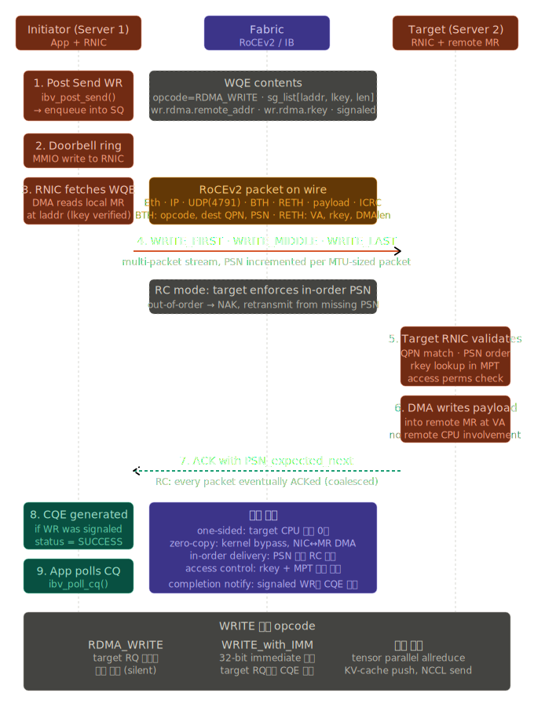
</p>

RDMA Write is a push operation. Server 1 writes data into Server 2's registered memory.

```text
Server 1 local MR
        ↓
Server 1 RNIC
        ↓ WRITE packets with payload
Fabric
        ↓
Server 2 RNIC
        ↓
Server 2 remote MR
```

1. The application posts an RDMA_WRITE Work Request to the Send Queue using `ibv_post_send()`.

```text
opcode = RDMA_WRITE
local address
lkey
length
remote address
rkey
signaled flag
```

If the `signaled` flag is enabled, a CQE is generated when the operation completes. If it is disabled, a successful operation may not produce a CQE. High-performance code often signals only some Work Requests to reduce CQ pressure.

2. After `ibv_post_send()`, the application or library rings a doorbell to notify the RNIC that a new WQE is available.

```text
App posts WQE
        ↓
Doorbell MMIO
        ↓
RNIC fetches WQE
```

From this point forward, the CPU does not copy bytes. The RNIC/HCA fetches the WQE and executes it.

3. The RNIC reads the local MR through DMA using the local address and lkey from the WQE.

```text
local address + lkey
        ↓
RNIC validates local access
        ↓
DMA read from local MR
```

This is the zero-copy property of RDMA: the CPU does not copy data from an application buffer into a kernel socket buffer.

4. The RNIC splits the data into packets and sends it through the fabric. For RoCEv2, the packet structure is roughly:

```text
Ethernet
  + IP
  + UDP(dst port 4791)
  + BTH
  + RETH
  + payload
  + ICRC
```

The key point is that an RDMA Write carries the payload in the request direction:

```text
WRITE request = header + payload
```

5. The target RNIC validates the incoming packet:

```text
QPN match?
PSN in order?
rkey valid?
remote address inside the registered MR range?
REMOTE_WRITE permission present?
```

After validation, the target RNIC writes directly into the remote MR through DMA without waking the remote CPU.

6. In Reliable Connection (RC) mode, the target RNIC returns an ACK or NAK. When the operation completes, the initiator RNIC writes a CQE into the CQ.

```text
Target RNIC writes remote MR
        ↓
ACK returned
        ↓
Initiator CQE generated
        ↓
App polls CQ
```

A normal RDMA_WRITE does not automatically notify the target application. The target memory is updated, but the target CPU may not know that it happened. If target-side notification is needed, designs often use `RDMA_WRITE_WITH_IMM`, SEND/RECV, a separate doorbell variable, or a polling protocol.

#### Read Flow
<p align="center" style="background-color: black">
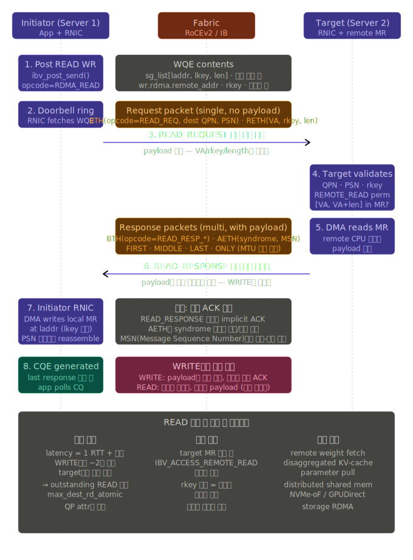
</p>

RDMA Read is a pull operation. Server 1 reads data from Server 2's registered memory.

```text
Server 1 sends READ request
        ↓
Server 2 RNIC reads remote MR
        ↓
READ response carries payload back
        ↓
Server 1 RNIC writes local MR
```

1. The application posts an RDMA_READ Work Request to the Send Queue using `ibv_post_send()`.

```text
opcode = RDMA_READ
local address
lkey
length
remote address
rkey
```

The fields look similar to RDMA Write, but the meaning is different. In Write, the local buffer is the data source. In Read, the local buffer is the destination where returned data will be stored.

2. The initiator RNIC sends a READ request packet.

```text
READ request = BTH + RETH
```

The READ request usually has no payload. Instead, it describes what to read from remote memory:

```text
remote virtual address
rkey
length
```

The request packet is small, and the actual data returns in the response direction.

3. The target RNIC validates the request:

```text
QPN match?
PSN valid?
rkey valid?
REMOTE_READ permission present?
remote address inside the registered MR range?
```

The remote MR must have been registered with `IBV_ACCESS_REMOTE_READ` for RDMA Read to succeed.

4. After validation, the target RNIC reads the remote MR through DMA.

```text
remote MR
        ↓ DMA read
target RNIC
```

The remote CPU is still not involved in the data path.

5. The READ response carries the payload back to the initiator.

```text
READ request  = header only, no payload
READ response = header + payload
```

Large reads are split into multiple response packets according to MTU. The `FIRST / MIDDLE / LAST / ONLY` flow in the diagram represents this packetization and reassembly behavior.

6. The initiator RNIC writes the READ response payload into the local MR through DMA.

```text
READ response payload
        ↓
initiator RNIC
        ↓
local MR
```

After all response packets arrive and reassembly completes, the initiator RNIC generates a CQE in the local CQ. The application observes completion with `ibv_poll_cq()`.

#### WRITE vs READ

| Category | RDMA WRITE | RDMA READ |
| -------- | ---------- | --------- |
| Data direction | initiator → target | target → initiator |
| Meaning | Push into remote memory | Pull from remote memory |
| Payload location | Payload is in the request packet | Payload is in the response packet |
| Remote CPU | Not involved | Not involved |
| Required remote MR permission | `REMOTE_WRITE` | `REMOTE_READ` |
| Completion CQE | Generated on the initiator side | Generated on the initiator side |
| Target notification | A normal Write does not notify the target | A normal Read does not notify the target |
| Latency characteristics | Relatively simple | Usually more RTT-dependent because it requires request and response |
| Example use cases | Gradient or tensor push, KV-cache push | Remote parameter fetch, KV-cache pull, remote storage read |

In one sentence: **Write sends data in the request, while Read requests data and receives it in the response.**

## Questions

[**1**](https://learning.oreilly.com/library/view/ai-data-center/9780135436370/ch01.xhtml#ques1_1a). How does the data life cycle influence AI model performance in data centers?

> In my understanding, the machine learning lifecycle starts with high-quality data gathering and preprocessing. Then, the model is trained through model selection, parameter tuning, and iterative validation. Once the model reaches the required accuracy, it is deployed for inference. In production, RAG or MCP can be integrated to provide the model with up-to-date or domain-specific context. After deployment, continuous monitoring is required to track accuracy, detect model drift, and trigger retraining when necessary.

[**2**](https://learning.oreilly.com/library/view/ai-data-center/9780135436370/ch01.xhtml#ques1_2a). Explain the iterative process of training an AI model, including the roles of forward and backward propagation.

> Training an AI model is an iterative process. First, the training data is divided into batches. During forward propagation, the model processes each batch through multiple layers and generates predictions. Then, the loss is calculated by comparing the predictions with the expected outputs. Through backward propagation, the model computes gradients using calculus and updates its parameters to reduce the error. In distributed training, collective communication libraries such as NCCL, RCCL, Gloo, and UCC synchronize data and gradients across multiple GPUs or nodes. This process is repeated many times until the model reaches the desired level of accuracy.

[**3**](https://learning.oreilly.com/library/view/ai-data-center/9780135436370/ch01.xhtml#ques1_3a). What are the main types of parallelism in AI training, and how do they address scalability challenges?

> The main types of parallelism in AI training are data parallelism, model parallelism, tensor parallelism, and pipeline parallelism. Data parallelism replicates the model across multiple GPUs and splits the training data, which improves throughput. Model parallelism splits the model itself across GPUs when the model is too large to fit into a single device. Tensor parallelism further divides large tensor operations inside each layer, such as matrix multiplications in Transformer blocks. Pipeline parallelism splits the model by layers or stages and processes micro-batches through the pipeline. In practice, large-scale LLM training often combines these methods to scale across many GPUs while managing memory, computation, and communication overhead.

[**4**](https://learning.oreilly.com/library/view/ai-data-center/9780135436370/ch01.xhtml#ques1_4a). Define job completion time (JCT) and discuss its significance in AI/ML clusters.

> Job Completion Time is the total time from when a training job starts to when the final required work finishes. In distributed AI training, the job is split across many GPUs, workers, and network flows. Even if most workers finish early, the entire job cannot complete until the slowest worker or flow finishes. Therefore, throughput improves average progress, but tail latency and stragglers determine the actual job completion time. This is why AI training networks focus heavily on reducing synchronization delay, congestion, and tail latency.

[**5**](https://learning.oreilly.com/library/view/ai-data-center/9780135436370/ch01.xhtml#ques1_5a). How does tail latency affect distributed AI training, and what architectural features help mitigate it?

> In distributed AI training, even if the average latency is low, a few slow flows or straggler GPUs can delay synchronization points such as AllReduce or checkpointing. Since the whole job cannot move forward until the slowest required work finishes, tail latency directly increases Job Completion Time. Common sources include network congestion, hardware failures, and inefficient collective communication patterns. Architectural improvements include non-blocking fabrics, congestion control algorithms, hardware offloading, and optimized collective communication patterns. These features aim to minimize synchronization delays and reduce job completion time.

[**6**](https://learning.oreilly.com/library/view/ai-data-center/9780135436370/ch01.xhtml#ques1_6a). Describe the function and benefits of RDMA in AI/ML data center networks.

> RDMA plays a critical role in AI and ML data center networks by enabling direct memory access between servers, GPUs, and network adapters with minimal CPU and kernel involvement. Instead of moving data through the traditional TCP/IP stack and kernel socket buffers, RDMA allows an RDMA-capable NIC to transfer data directly between registered memory regions. In distributed AI training, this is important because GPUs frequently exchange gradients, parameters, and activation data through collective communication operations such as AllReduce and ReduceScatter. RDMA reduces latency, improves throughput, lowers CPU overhead, enables zero-copy communication, and helps keep GPUs busy. As a result, it improves accelerator utilization and reduces overall job completion time in large-scale AI training clusters.


[**7**](https://learning.oreilly.com/library/view/ai-data-center/9780135436370/ch01.xhtml#ques1_7a). Compare InfiniBand, RoCEv2, and iWARP as RDMA transport protocols for AI/ML workloads.

> InfiniBand, RoCEv2, and iWARP are all RDMA transport options, but they fit AI and ML workloads differently. InfiniBand is a native RDMA fabric designed for very low latency, high throughput, and predictable performance. It is widely used in high-end HPC and AI training clusters where collective communication performance is critical. RoCEv2 carries RDMA over UDP/IP on Ethernet, so it provides RDMA performance while fitting into Ethernet-based data center designs. It is attractive for hyperscale AI fabrics, but it requires careful congestion control and lossless Ethernet tuning. iWARP provides RDMA over TCP/IP, which makes it routable and compatible with standard IP networks, but it is less common in modern GPU training because the AI ecosystem and collective communication optimizations are much stronger around InfiniBand and RoCEv2. In practice, I would choose InfiniBand for maximum performance and predictability, RoCEv2 for scalable Ethernet-based AI fabrics, and iWARP mainly for niche or storage-oriented RDMA-over-IP use cases.

[**8**](https://learning.oreilly.com/library/view/ai-data-center/9780135436370/ch01.xhtml#ques1_8a). What are the key requirements for AI data center fabrics to support efficient AI/ML workloads?

> The key requirement for an AI data center fabric is to keep expensive accelerators busy. Unlike traditional data center networks, AI fabrics must support massive east-west GPU-to-GPU communication with high bandwidth, low tail latency, and predictable performance. They need RDMA support through InfiniBand or RoCEv2 to reduce CPU overhead and enable direct memory movement. They also need lossless or near-lossless behavior, strong congestion control, and efficient load balancing because AI workloads generate synchronized bursts, elephant flows, and incast traffic. In addition, the fabric must provide performance isolation, deep telemetry, and resiliency, since a single slow flow, congested link, or unstable route can delay collective operations and increase job completion time. In short, an AI fabric should be optimized not only for raw bandwidth, but for low tail latency, high GPU utilization, and predictable job completion time.
