# Chapter 3: Network Design Considerations

## Table of Contents

- [Goal](#goal)
- [AI/ML Workload Processing and Fabric Types](#aiml-workload-processing-and-fabric-types)
  - [Storage Fabric](#storage-fabric)
  - [Training Fabric](#training-fabric)
  - [Inference Fabric](#inference-fabric)
- [Training Data Center Architecture](#training-data-center-architecture)
  - [Design Goals](#design-goals)
  - [GPU Server Network Ports](#gpu-server-network-ports)
- [GPU-to-Leaf Connectivity](#gpu-to-leaf-connectivity)
  - [Rail-Optimized Design, ROD](#rail-optimized-design-rod)
  - [Rows, Stripes, and 1:1 Oversubscription](#rows-stripes-and-11-oversubscription)
  - [Intra-Rail vs. Inter-Rail Communication](#intra-rail-vs-inter-rail-communication)
  - [Scaling with Three-Stage Clos](#scaling-with-three-stage-clos)
  - [Scaling with Five-Stage and Seven-Stage Clos](#scaling-with-five-stage-and-seven-stage-clos)
  - [Rail-Only Design](#rail-only-design)
  - [Rail-Unified Design, RUD](#rail-unified-design-rud)
- [Rack Design](#rack-design)
  - [Top-of-Rack](#top-of-rack)
  - [Middle-of-Row](#middle-of-row)
  - [End-of-Row](#end-of-row)
  - [Rack Design Comparison](#rack-design-comparison)
- [Scheduled Fabric and VOQ](#scheduled-fabric-and-voq)
- [Topology Choices](#topology-choices)
  - [Clos](#clos)
  - [Dragonfly](#dragonfly)
  - [Torus](#torus)
- [Inference Data Center Architecture](#inference-data-center-architecture)
- [Multi-Planar Scale-Out Architecture](#multi-planar-scale-out-architecture)
  - [Why Multi-Planar Designs Exist](#why-multi-planar-designs-exist)
  - [Breakout Cables and Packet Spraying](#breakout-cables-and-packet-spraying)
  - [Multi-Domain Designs and Super-Spines](#multi-domain-designs-and-super-spines)
  - [Cabling and Optics](#cabling-and-optics)
- [Additional Design Notes](#additional-design-notes)
  - [Design Decision Matrix](#design-decision-matrix)
  - [Scale-Up, Scale-Out, and Scale-Across](#scale-up-scale-out-and-scale-across)
  - [Oversubscription Calculation](#oversubscription-calculation)
  - [Operational Validation Checklist](#operational-validation-checklist)
  - [RoCEv2 and UEC/UET Roadmap](#rocev2-and-uecuet-roadmap)
- [Chapter Summary](#chapter-summary)
- [Key Terms](#key-terms)
- [Questions](#questions)
- [Answers](#answers)
- [References](#references)

## Goal

This chapter explains the major physical and logical design choices for AI data center networks.

The core idea is:

> AI data center design is a trade-off between performance, cost, reliability, scalability, power, cooling, and operational complexity.

The chapter focuses on these topics:

- Storage, training, and inference fabrics
- Rail-Optimized Design, ROD, and Rail-Unified Design, RUD
- GPU-to-leaf connectivity and rail design
- Rack placement for leaf switches: ToR, MoR, and EoR
- Clos, Dragonfly, and Torus topologies
- Scheduled fabric and virtual output queueing
- Multi-planar scale-out architectures

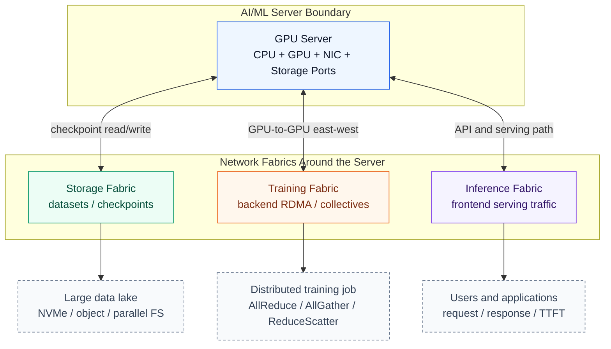

## AI/ML Workload Processing and Fabric Types

AI/ML workload processing follows three broad stages:

1. Data gathering and preprocessing
2. Model selection and training
3. Deployment and monitoring

Each stage stresses the network differently. Storage movement, training communication, and inference serving are often separated into different fabrics or at least different design domains.

| Fabric | Main Role | Typical Traffic | Main Design Concern |
| --- | --- | --- | --- |
| Storage fabric | Move data sets and checkpoints | Server-to-storage, checkpoint read/write | Low latency, high throughput, low loss |
| Training fabric | GPU-to-GPU communication | East-west RDMA, collectives | Bandwidth, latency, congestion control |
| Inference fabric | Serve trained models | User request/response, API traffic | Latency, throughput, reliability |

### Storage Fabric

The storage fabric stores gathered and preprocessed data. Small data sets may live inside the training cluster, but large data sets normally require dedicated storage infrastructure.

Important requirements:

- High throughput for data ingestion and checkpointing
- Low latency for storage access
- Low packet loss or lossless behavior
- Support for InfiniBand or Ethernet with RoCEv2
- Three-stage or five-stage Clos when Ethernet is used

### Training Fabric

The training fabric is the backend network for GPU clusters. It supports distributed training, collective communication, and east-west traffic between GPU servers.

Training fabric design is the main focus of this chapter because it directly affects GPU utilization and training time.

### Inference Fabric

The inference fabric is the production network where trained models answer requests. Its architecture is usually closer to enterprise, cloud, or telco data center networking.

Inference designs usually do not need strict rail alignment unless the model is very large and requires multi-node inference with RDMA.

---

## Training Data Center Architecture

Training data center architecture must balance several competing goals.

### Design Goals

| Goal | Meaning |
| --- | --- |
| Performance | Keep GPU-to-GPU communication fast enough that GPUs do not wait on the network |
| Cost efficiency | Control NIC, optics, switch port, cabling, and facility cost |
| Reliability | Isolate failures and avoid taking down many GPUs with one failed component |
| Scalability | Add more GPUs, rows, blocks, or fabrics without redesigning everything |

The chapter repeatedly returns to this point:

> A high-performance AI fabric is not just a bigger data center network. It must be designed around GPU topology, NIC placement, collective communication, and physical constraints.

### GPU Server Network Ports

GPU servers commonly include different classes of ports:

- GPU-facing NIC ports for training traffic
- CPU or host ports for frontend and control traffic
- Storage-mapped ports for NVMe or storage access

Modern GPU servers such as NVIDIA A100/H100-based systems often contain 8 GPUs. Each GPU may be mapped to one or more NICs, but a common cost-conscious design uses one NIC per GPU.

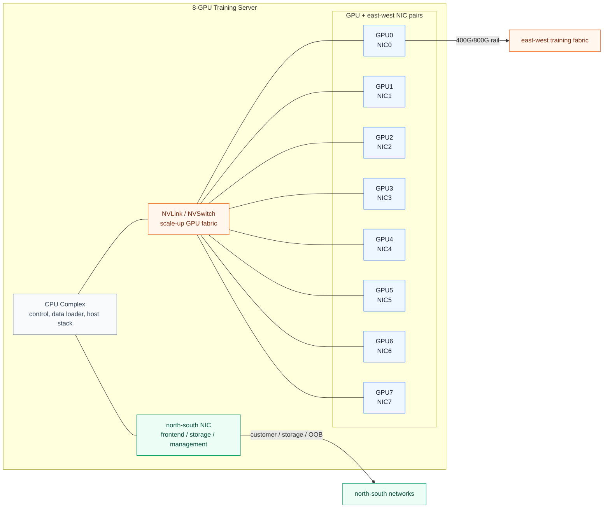

Inside a server, GPU-to-GPU communication can use high-bandwidth internal fabrics such as NVLink or NVSwitch. Once a workload spans more GPUs than fit in one server, the traffic becomes east-west data center traffic.

---

## GPU-to-Leaf Connectivity

The chapter compares two major GPU-to-leaf design styles:

| Design | Connectivity Model | Main Benefit | Main Trade-Off |
| --- | --- | --- | --- |
| ROD | One GPU/NIC connects to one dedicated rail/leaf | High performance and rail isolation | More cables, more leaf connections |
| RUD | Multiple GPUs connect to one leaf | Simpler cabling and potentially lower cost | More shared fate and path complexity |

### Rail-Optimized Design, ROD

In Rail-Optimized Design, each GPU/NIC in a server maps to a separate rail.

Example for an 8-GPU server:

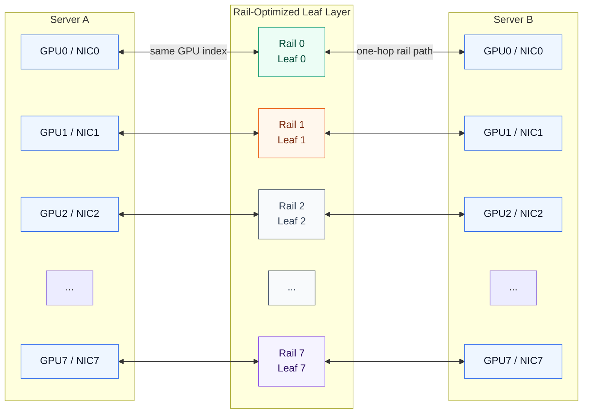

Why ROD is attractive:

- Each GPU has a predictable network path.
- Rail-local communication can be one hop.
- Faults can be isolated by rail.
- NCCL rings and trees can be aligned with GPU/NIC topology.
- It fits high-throughput AllReduce, AllGather, and ReduceScatter patterns.

### Rows, Stripes, and 1:1 Oversubscription

A set of 8 leaf switches connecting to the 8 GPU positions across servers is called a row or stripe.

For example:

- Leaf 0 connects GPU0/NIC0 from many servers.
- Leaf 1 connects GPU1/NIC1 from many servers.
- Leaf 7 connects GPU7/NIC7 from many servers.

With a 64 x 400G leaf switch:

| Port Use | Count | Bandwidth |
| --- | ---: | ---: |
| Server-facing downlinks | 32 | 12.8 Tbps |
| Spine-facing uplinks | 32 | 12.8 Tbps |
| Oversubscription | - | 1:1 |

This 1:1 ratio is important because training traffic can drive GPU NICs at very high utilization.

### Intra-Rail vs. Inter-Rail Communication

ROD gives the best latency when traffic stays within the same rail.

| Traffic Type | Example | Path | Latency |
| --- | --- | --- | --- |
| Intra-rail | Server A GPU0 to Server B GPU0 | Leaf only | Lower |
| Inter-rail | Server A GPU0 to Server B GPU3 | Leaf - spine - leaf | Higher |

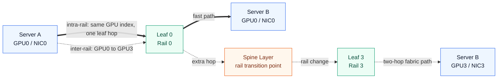

Intra-rail communication is the fast path. Inter-rail communication usually needs the spine layer and doubles the number of network hops.

### Scaling with Three-Stage Clos

For a 256-GPU cluster:

- 32 servers
- 8 GPUs per server
- 8 leaf switches
- 4 spine switches
- 64 x 400G switches

For a 512-GPU cluster:

- 64 servers
- 16 leaf switches
- 8 spine switches
- Two rows of rail-optimized leaf switches

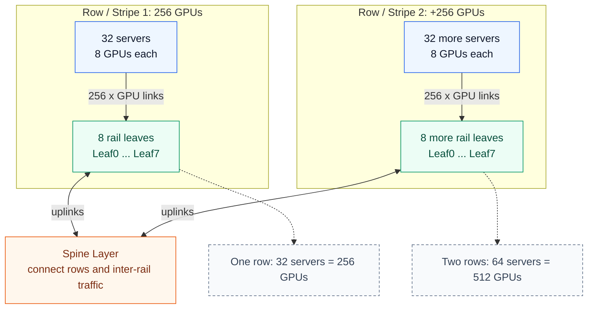

To scale further, designers can either add more spines or use chassis-based spines with higher port density. Adding many standalone spines can create management and load-balancing complexity.

### Scaling with Five-Stage and Seven-Stage Clos

Very large AI clusters may target 32K, 64K, or 128K GPUs. At that scale, a simple three-stage Clos is not enough.

The chapter describes larger designs using:

- Five-stage Clos: leaf - spine - super-spine - spine - leaf
- Seven-stage Clos for even larger fabrics
- Blocks or bricks connected through super-spines
- Chassis-based spine or super-spine systems
- Controlled oversubscription at upper layers

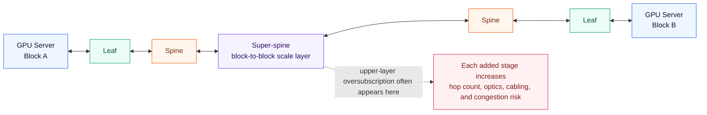

The chapter notes that some designs evaluate oversubscription at the super-spine layer, potentially up to high ratios. The trade-off is clear: higher oversubscription reduces cost and port count, but increases the likelihood of congestion and requires stronger congestion control such as DCQCN, ECN, and PFC.

#### Example: 32K GPU ROD over Multi-Stage Clos

The following example connects the ROD mental model to a 32K-class Clos design.

Assume one ROD pod contains:

- 32 GPU servers
- 8 GPUs per server
- 8 rail leaves per pod
- 256 GPUs per pod

Then:

```text
128 pods x 256 GPUs per pod = 32,768 GPUs
```

In this model, each pod preserves the ROD rule internally: GPU0/NIC0 maps to Rail 0, GPU1/NIC1 maps to Rail 1, and so on. The multi-stage Clos fabric then connects many such ROD pods through spine and super-spine layers.

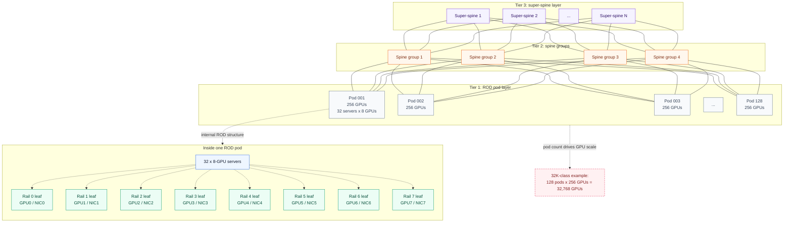

This is only a conceptual scaling model. A real design still needs concrete switch radix, oversubscription targets, cable reach, optics budget, failure domains, ECMP or adaptive load balancing behavior, and workload placement policy.

### Rail-Only Design

Rail-only design removes inter-rail communication from the external fabric.

The basic idea:

- Same-number GPUs communicate across the external rail fabric.
- Different GPU numbers communicate through the server's internal GPU switch, such as NVSwitch.
- The external fabric does not need to provide rail-to-rail paths.

Benefits:

- Lower network cost
- Simpler rail fault isolation
- Easier troubleshooting when workloads do not need inter-rail fabric communication

Limitations:

- Depends heavily on workload behavior
- Inter-rail needs must be handled inside the server
- May not fit all collective communication patterns
- Adoption and best practices are still evolving

### Rail-Unified Design, RUD

In Rail-Unified Design, multiple GPUs from the same server connect to the same leaf.

Examples:

- 8 GPUs connect to one leaf
- 4 GPUs connect to one leaf and 4 GPUs connect to another leaf
- Rails are grouped rather than strictly separated one GPU per leaf

RUD can reduce cabling complexity, but it requires the fabric to segregate rail traffic carefully.

Important implications:

- A single leaf can become a larger failure domain.
- Deterministic path forwarding becomes more important.
- Some traffic can remain one hop, but other traffic must cross the spine.
- It may be attractive when using larger chassis-based switches or when cabling simplicity matters more than strict rail isolation.

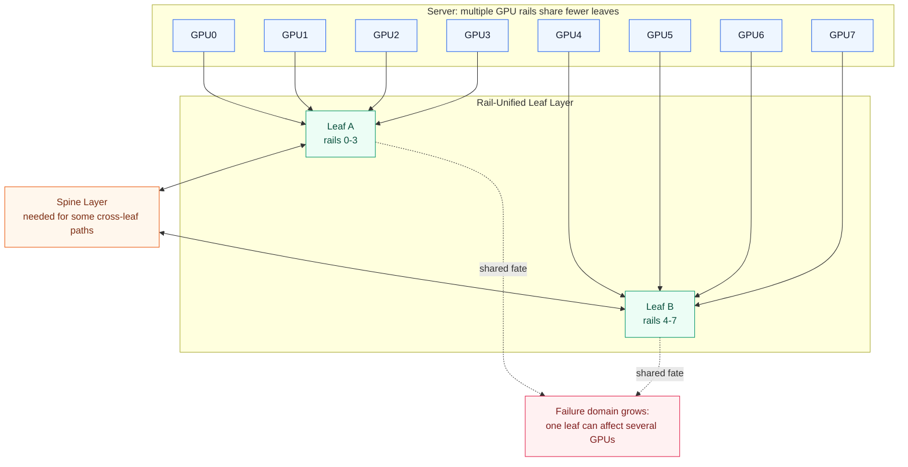

#### Example: 32K GPU RUD over Multi-Stage Clos

The same 32K-class scale can also be drawn with a RUD-style pod. The pod size does not have to change:

```text
128 pods x 256 GPUs per pod = 32,768 GPUs
```

The difference is inside the pod. Instead of mapping each GPU/NIC position to its own rail leaf, multiple GPU/NIC positions share fewer leaf groups. The example below uses two leaf groups per pod:

- Leaf group A carries GPU0-GPU3 traffic.
- Leaf group B carries GPU4-GPU7 traffic.
- Spine connectivity is still used to connect pods into the larger multi-stage Clos fabric.

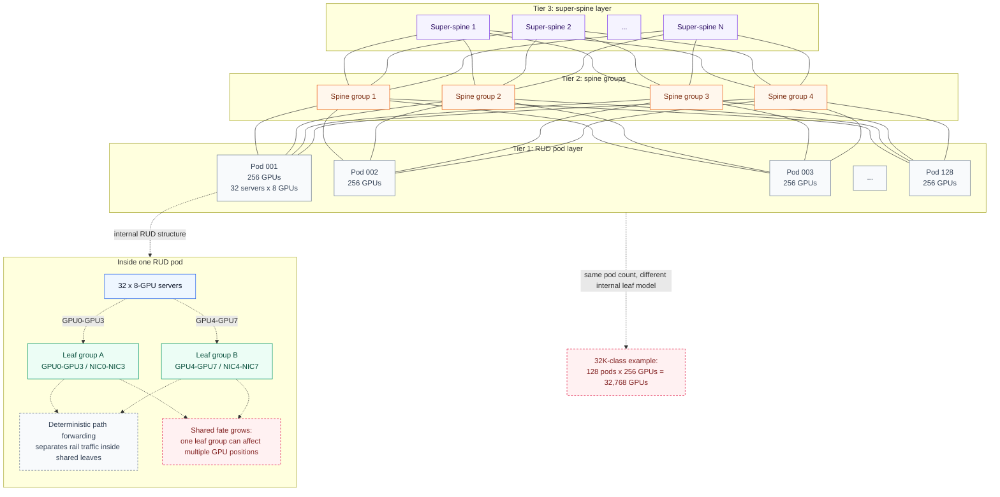

This RUD view is useful for comparing design trade-offs against the ROD example. Both examples can represent the same 32K-class GPU count, but RUD reduces the number of distinct rail-leaf groups inside a pod and therefore increases the importance of deterministic forwarding, failure-domain analysis, and congestion isolation.

---

## Rack Design

Rack design is not a cosmetic detail in AI data centers. It affects:

- Cable length
- Rack power budget
- Cooling requirement
- Switch placement
- Failure domain
- Whether DAC, AEC, AOC, or optics are practical

A typical rack is 19 inches wide and 42U tall. The chapter notes that DGX H100-class servers are large and power-dense. Four or five such systems plus network gear can push a rack into a much higher power range than traditional data centers.

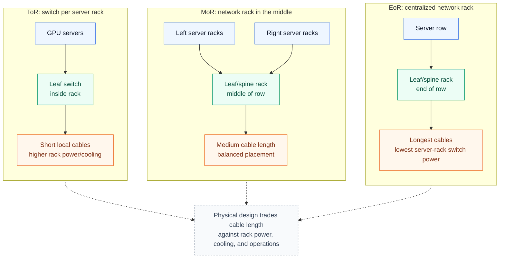

### Top-of-Rack

In a Top-of-Rack, ToR, design, the leaf switch is installed in each server rack.

Benefits:

- Shorter cable runs inside the rack
- Simpler local cabling
- Good fit for RUD
- DAC or AEC may be practical for cost savings

Trade-offs:

- More rack power consumption
- More rack cooling demand
- Switches share the same physical rack environment as servers
- ROD may still require cross-rack cabling because each server connects to multiple leaf switches

### Middle-of-Row

In a Middle-of-Row, MoR, design, leaf switches are installed in one or more racks near the middle of the server row.

Benefits:

- Server racks do not carry leaf switch power and cooling load
- Cable distances are shorter than EoR
- Leaf and spine switches can be centralized

Trade-offs:

- More cabling across racks
- More network rack space
- Cable lengths vary by server rack position

### End-of-Row

In an End-of-Row, EoR, design, leaf switches are installed at one end of the server row.

Benefits:

- Centralized network gear
- Server racks avoid switch power and cooling load
- Operationally familiar in some data center designs

Trade-offs:

- Longest cable runs
- Higher cabling complexity
- More careful planning for optics and cable types

### Rack Design Comparison

| Aspect | ToR | MoR | EoR |
| --- | --- | --- | --- |
| Leaf location | In each server rack | Middle rack(s) | End rack(s) |
| Server rack power | Higher | Lower | Lower |
| Server rack cooling | Higher | Lower | Lower |
| Cable length | Shorter locally | Medium | Longest |
| Cabling complexity | Lower for local rack, higher for ROD rails | Medium | Higher |
| Best fit | RUD, compact designs | Balanced rows | Centralized network rows |

---

## Scheduled Fabric and VOQ

Scheduled fabric is a newer architecture where the fabric behaves more like a distributed chassis.

The concept:

- Leaf switches act like line cards.
- Spine switches act like the backplane.
- Packets arriving at ingress leaves are split into small cells.
- Cells are sprayed across fabric links.
- Egress leaves reassemble cells into packets.

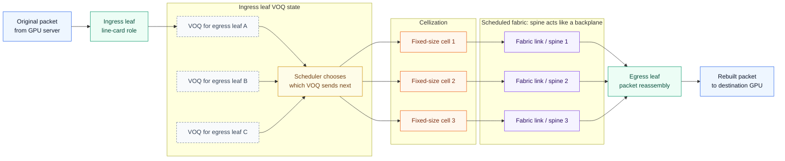

The chapter highlights virtual output queueing, VOQ, as a key concept. VOQ maintains separate virtual queues per egress destination so congestion on one output does not block unrelated traffic. Cellization is a related scheduled-fabric technique: packets are divided into fixed-size cells for scheduling across the fabric and then reassembled at the egress leaf.

Benefits:

- Better congestion handling
- Better fabric link utilization
- Reduced head-of-line blocking
- Cell spraying across multiple links
- Potential latency improvement because split/reassembly happens once across the fabric

Constraints:

- Newer architecture
- Vendor and implementation dependence
- Failure handling must be evaluated
- Congestion behavior under real workloads must be tested
- Potential lock-in at the block, brick, or pod level

---

## Topology Choices

Clos is the default topology for most AI data center fabrics. Dragonfly and Torus are useful to understand as alternatives, but they are usually considered for specific HPC-style environments, special placement models, or very controlled traffic patterns rather than general-purpose AI data centers.

| Aspect | Clos / Fat-tree | Dragonfly | Torus |
| --- | --- | --- | --- |
| Basic idea | Hierarchical leaf-spine connectivity | Dense intra-group connectivity with inter-group global links | Grid-like connectivity between neighboring nodes or racks |
| Rack-level view | Racks connect upward to spine layers | Racks form groups, and groups are connected through global links | Racks connect directly to nearby racks |
| Path length | Short and predictable | Can be designed to be very short | Depends heavily on location |
| Bandwidth | Can be non-blocking if designed that way | Sensitive to global-link placement | Strong for local traffic, weaker for distant traffic |
| Cost | High | Efficient at very large scale | Relatively low |
| Operational complexity | Lowest | High | High |
| Routing | Standard ECMP/BGP models | Adaptive or global routing is important | Dimension-order or adaptive routing |
| General DC fit | Very high | Low to medium | Low |
| HPC fit | High | Very high | High for specific workloads |
| AI training fit | Most common | Possible, but placement matters | Challenging for large LLM all-to-all patterns |
| Failure handling | Good | Complex | Possible, but operationally complex |
| Cabling | Many uplinks toward spine layers | Global-link management is important | Regular pattern, but placement is constrained |

### Clos

Clos, also called fat-tree, is the most common data center topology.

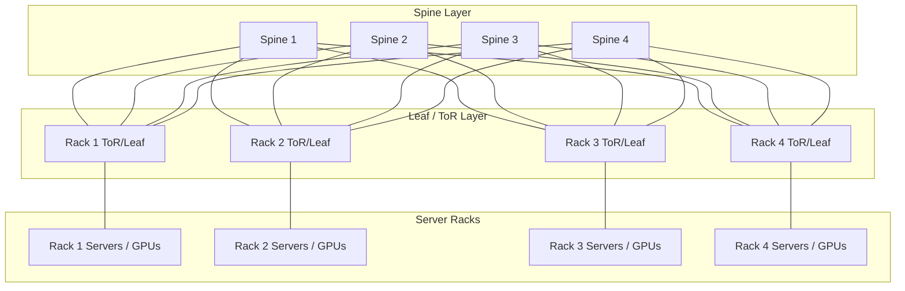

Common forms:

- Three-stage Clos: leaf - spine - leaf
- Five-stage Clos: leaf - spine - super-spine - spine - leaf
- Seven-stage Clos for larger fabrics

Why Clos is popular:

- Well understood
- Supports non-blocking designs
- Fits IP and Ethernet operational models
- Provides many equal-cost paths
- Scales by adding stages and higher-radix switches

Main limitations at AI scale:

- More stages mean more hops and more latency.
- Cabling and optics grow quickly.
- Load balancing and congestion control become harder.
- Upper layers may need oversubscription, creating congestion risk.

### Dragonfly

Dragonfly is a hierarchical topology where groups, blocks, bricks, or pods connect to each other in a mesh-like structure.


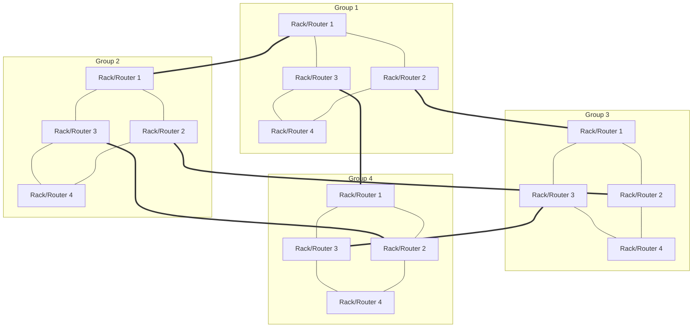

Benefits:

- Lower network diameter than very large multi-stage Clos designs
- Lower latency for some large-cluster communication patterns
- Modular growth by adding groups
- Potentially fewer links than a full multi-stage Clos at large scale
- Fault tolerance through group-level modularity

Trade-offs:

- More complex routing
- More specialized topology management
- Adaptive routing may be needed to avoid congestion
- Not as operationally familiar as Clos in many data centers

Dragonfly can use different intra-group designs, including full-graph inter-group topology or Clos-style intra-group topology.

### Torus

Torus topology connects nodes to neighbors in one, two, or three dimensions.

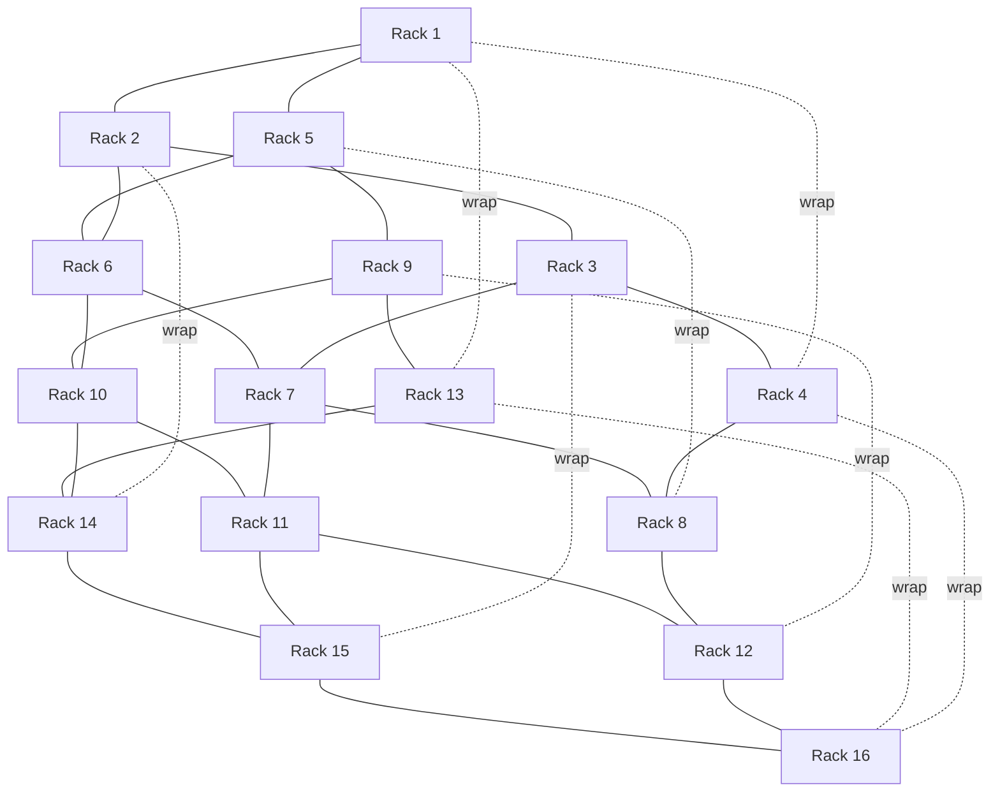

| Torus Type | Node Connectivity | Mental Model |
| --- | --- | --- |
| 1D torus | Two neighbors | Ring |
| 2D torus | Four neighbors | Grid with wrapped edges |
| 3D torus | Six neighbors | Cube with wrapped edges |

Benefits:

- Cost-effective at high scale due to lower port requirements
- Easy to scale in regular patterns
- Good for nearest-neighbor communication
- Can be used to build rail-like topologies without a traditional spine layer

Limitations:

- Less flexible for arbitrary traffic patterns
- Average latency can be higher for distant nodes
- Routing and failure handling require care
- Application placement matters more

---

## Inference Data Center Architecture

Inference uses a trained model and input data to produce results. The deployment location depends on model size and user demand.

Inference models may run:

- On mobile devices or laptops
- At edge locations
- In enterprise data centers
- In cloud data centers
- Co-located with training data centers

Most inference data centers do not require strict rail alignment because inference can often run on one GPU or a small number of GPUs. The network usually follows a Clos-based design similar to normal data center networks.

Multi-node inference is a special case. If inference spans many GPUs or nodes, RDMA and backend design choices may become relevant again.

---

## Multi-Planar Scale-Out Architecture

### Why Multi-Planar Designs Exist

Traditional three-tier networks hit practical limits when AI clusters grow toward hundreds of thousands of GPUs.

Problems with very large single-plane fabrics:

- A failure can affect a huge fabric domain.
- Five-stage designs add extra hops.
- Latency-sensitive AI workloads can suffer.
- Operational blast radius becomes large.
- Cabling and optics become difficult to manage.

Multi-planar architecture addresses this by replacing one massive backend fabric with multiple independent two-tier fabric planes.

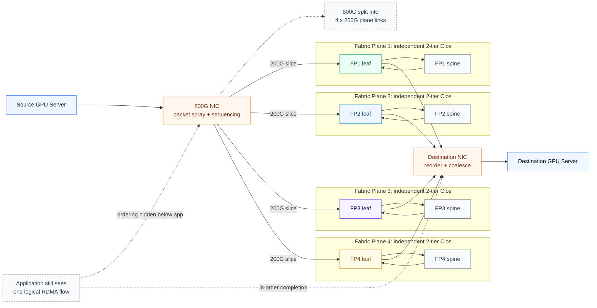

The application can still see one logical flow, while the NIC and host software distribute packets across multiple planes and reassemble them at the destination.

### Breakout Cables and Packet Spraying

The chapter gives an example where an 800G NIC breaks out into 4 x 200G links, each connected to a different fabric plane.

This creates several effects:

- One logical NIC can use multiple physical planes.
- A leaf switch can support more GPU connections.
- The NIC can spray packets across independent paths.
- The receiver NIC reorders and coalesces packets before presenting data to the application.
- RDMA still requires in-order delivery at the application layer, so reassembly is critical.

### Multi-Domain Designs and Super-Spines

Large multi-planar deployments may still need super-spines to connect multiple multi-planar domains.

Examples:

- Two fabric planes with two rails per plane
- Dual-planar domains interconnected by super-spines
- Four-plane designs where packets are sprayed across all planes

Important design points:

- Some server pairs can communicate within one plane without using super-spines.
- Other server pairs must cross the super-spine layer.
- Scheduling collective jobs with topology awareness can reduce the observed latency penalty.
- Reliability improves because multiple planes provide independent paths.

### Cabling and Optics

Multi-planar designs can increase cabling complexity because each host and ToR port may connect to multiple planes.

Mitigation options include:

- Shuffle cables to consolidate and internally map fiber bundles
- Breakout cables for NIC-to-plane connectivity
- Linear Pluggable Optics, LPO
- Linear Receive Optics, LRO

The chapter notes that LPO and LRO can reduce power by removing some or all DSP functionality from optical modules, relying more on NIC and switch SERDES capabilities. Lower optics power also reduces heat and cooling demand, freeing more facility power for GPU compute.

---

## Additional Design Notes

The PDF explains the architectural options. This section adds a more practical design lens: how to choose, calculate, validate, and track where Ethernet-based AI fabrics are going.

### Design Decision Matrix

Different AI fabric designs optimize different constraints. A good design starts by identifying the dominant constraint: JCT, cabling, fault isolation, power, optics, rack layout, or operational simplicity.

| Design | Best Fit | Avoid When | Main Risk |
| --- | --- | --- | --- |
| ROD | Large training clusters, predictable NCCL topology, strong rail isolation | Port/cabling budget is too tight | Physical complexity |
| RUD | Smaller clusters, simplified cabling, chassis or fat-leaf designs | Rail fault isolation is critical | Larger shared-fate domain |
| Rail-only | Workloads rarely need inter-rail fabric communication | Collectives frequently cross rails | Workload dependency |
| Three-stage Clos | Small to medium clusters with non-blocking leaf-spine design | Cluster scale exceeds port/radix limits | Spine count and cabling growth |
| Five-stage / Seven-stage Clos | Very large clusters such as 32K+ GPUs | Low latency is more important than raw scale | More hops and upper-layer congestion |
| Scheduled fabric | Very large, congestion-sensitive AI fabrics | Vendor lock-in or operational complexity is unacceptable | Architecture dependence |
| Multi-planar | Very large scale, higher reliability, NIC-level packet spraying | NIC/host reordering and observability are immature | Debugging complexity |

> The important question is not "Which topology is best?"
> The better question is "Which bottleneck is this design trying to remove?"

### Scale-Up, Scale-Out, and Scale-Across

AI data center networks are easier to reason about when split into three scaling domains.

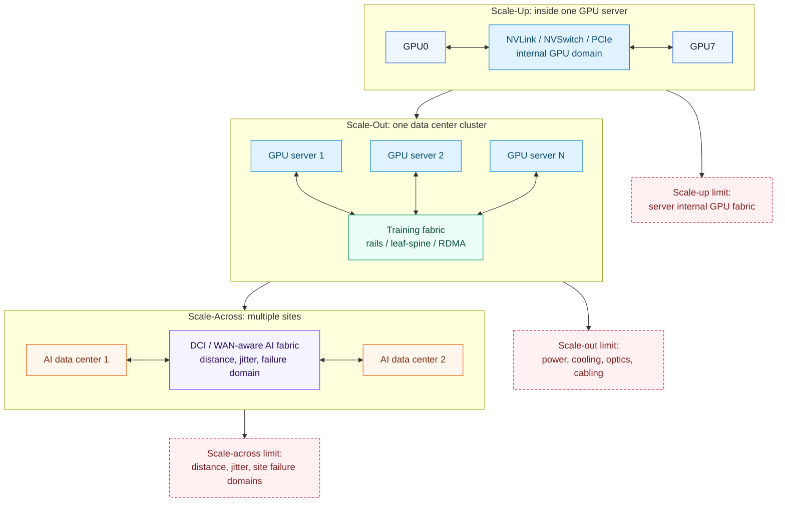

| Scale Model | Boundary | Typical Technology | Network Concern |
| --- | --- | --- | --- |
| Scale-up | Inside a GPU server or rack-scale system | NVLink, NVSwitch, PCIe | GPU locality and internal bandwidth |
| Scale-out | Across many GPU servers in one data center | InfiniBand, RoCEv2, Spectrum-X Ethernet, Clos, ROD/RUD | JCT, RDMA, congestion, rail design |
| Scale-across | Across multiple data centers or sites | DCI, WAN-aware Ethernet, distributed AI fabric | Distance, jitter, telemetry, long-distance congestion control |

Traditional AI cluster design focuses on scale-up and scale-out. As single facilities hit power, cooling, land, and capacity limits, scale-across becomes more important.

### Oversubscription Calculation

Oversubscription should be calculated explicitly for each fabric layer. AI training fabrics often target 1:1 bandwidth in the backend because synchronized GPU traffic can quickly expose bottlenecks.

```text
Server-facing bandwidth = number_of_downlinks x link_speed
Fabric-facing bandwidth = number_of_uplinks x link_speed
Oversubscription ratio  = server-facing bandwidth : fabric-facing bandwidth
```

Example with a 64-port 400G leaf:

```text
32 x 400G downlinks = 12.8 Tbps
32 x 400G uplinks   = 12.8 Tbps
Oversubscription    = 1:1
```

Example with fewer uplinks:

```text
48 x 400G downlinks = 19.2 Tbps
16 x 400G uplinks   = 6.4 Tbps
Oversubscription    = 3:1
```

In AI training, oversubscription is not just a cost optimization. It changes queue behavior, ECN marking, PFC risk, and ultimately Job Completion Time.

### Operational Validation Checklist

A design is not finished when the topology diagram looks correct. It must be validated against traffic patterns that resemble real training and inference workloads.

| Area | What to Check | Why It Matters |
| --- | --- | --- |
| NCCL performance | AllReduce, AllGather, ReduceScatter, AlltoAll benchmarks | Confirms collective communication behavior |
| Rail balance | Per-rail throughput and utilization | Finds rail hot spots and bad placement |
| Link utilization | Leaf, spine, and super-spine utilization | Confirms ECMP/DLB/packet spraying effectiveness |
| ECN | ECN marking rate and queue thresholds | Shows early congestion signals |
| PFC | Pause frame count and pause duration | Detects lossless Ethernet stress and congestion spreading |
| Drops/retransmits | Packet drops, CNPs, retransmission counters | Identifies hidden loss or transport instability |
| Tail latency | p95/p99/p999 latency during collectives | AI jobs are often gated by slowest participants |
| Failure handling | Leaf, spine, NIC, and link failure tests | Confirms blast radius and convergence behavior |
| Job placement | GPU placement vs rail/topology locality | Prevents scheduler decisions from fighting the network |
| Telemetry | Per-queue, per-flow, per-port observability | Makes congestion root cause analysis possible |

Suggested validation flow:

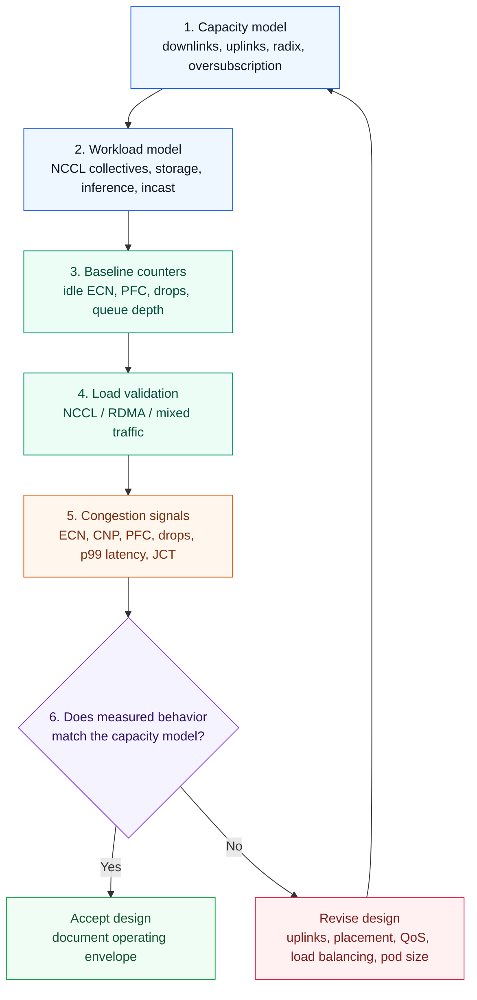

### RoCEv2 and UEC/UET Roadmap

Most Ethernet AI training fabrics today are designed around RoCEv2 plus congestion mechanisms such as ECN, PFC, CNP, and DCQCN. This works, but it also exposes several pain points at very large scale:

- ECMP can be weak when traffic has low entropy.
- PFC can prevent drops but may spread congestion.
- Ordered RDMA semantics make packet spraying harder.
- Incast and synchronized collectives can create short, intense congestion events.
- Debugging end-to-end congestion requires deep telemetry across NICs, switches, and hosts.

The Ultra Ethernet Consortium, UEC, is working on Ultra Ethernet Transport, UET, as an Ethernet-based stack optimized for AI and HPC. UEC 1.0 was announced in 2025 and focuses on open, interoperable high-performance Ethernet.

Key ideas to watch:

| Area | Direction |
| --- | --- |
| Multipathing | Packet spraying across multiple paths instead of relying only on ECMP flow hashing |
| Ordering | More flexible delivery models for workloads that can tolerate reordering |
| Congestion control | Sender and receiver mechanisms optimized for microsecond-scale AI fabrics |
| Packet trimming | Truncate packets under congestion to give fast congestion/loss signals instead of silent drops |
| Security | Transport security and isolation for hosted or multi-tenant AI environments |
| APIs | libfabric-based APIs for AI/HPC communication semantics |

> Practical view: RoCEv2 remains important for current deployments, but UEC/UET is worth tracking for future Ethernet AI fabrics because it directly targets packet spraying, congestion control, ordering, and interoperability at AI scale.

---

## Chapter Summary

AI network design requires matching the topology to the workload, scale, power budget, and operational model.

The main takeaways:

- AI data centers use different fabrics for storage, training, and inference.
- Training fabrics are dominated by GPU-to-GPU east-west traffic.
- ROD gives predictable rail alignment and strong isolation, but increases cabling and port demands.
- RUD simplifies some physical design choices, but can increase shared fate and requires careful path control.
- Rack design directly affects power, cooling, cable length, and optics choices.
- Clos remains the default topology, but extreme AI scale can require five-stage, seven-stage, chassis-based, or oversubscribed designs.
- Dragonfly and Torus can reduce hop count or port requirements for selected workloads, but increase routing and placement complexity.
- Scheduled fabric and VOQ aim to improve congestion handling and link utilization.
- Multi-planar fabrics split a huge backend network into independent planes and rely on NIC-level packet spraying and reassembly.

---

## Key Terms

| Term | Meaning |
| --- | --- |
| ROD | Rail-Optimized Design; one GPU/NIC maps to one rail/leaf |
| RUD | Rail-Unified Design; multiple GPUs may connect to one leaf |
| Rail | A network path associated with the same GPU/NIC position across servers |
| Row / Stripe | A set of leaf switches supporting multiple rails across servers |
| Intra-rail | Communication within the same GPU-number rail |
| Inter-rail | Communication between different rails, often through spine switches |
| Rail-only design | Design where the external fabric does not support inter-rail traffic |
| Clos | Leaf-spine or multi-stage fat-tree topology |
| Block / Brick | A scale unit made from rows and spines, often connected by super-spines |
| Scheduled fabric | Fabric that splits packets into cells and schedules them across links |
| VOQ | Virtual Output Queueing; separate queues per output to reduce head-of-line blocking |
| Dragonfly | Hierarchical group-based topology with mesh-like interconnects |
| Torus | Neighbor-connected topology in one, two, or three dimensions |
| Multi-planar | Design using multiple independent fabric planes for scale and reliability |
| Shuffle cable | Cabling system that bundles and internally maps fibers for large cluster connectivity |
| LPO | Linear Pluggable Optics |
| LRO | Linear Receive Optics |

## Q&A

### 1. What are the three main stages of AI/ML workload processing, and how do they map to storage, training, and inference fabrics?

At a high level, AI/ML processing has three stages: data gathering and preprocessing, model selection and training, and deployment and monitoring.

From an infrastructure point of view, these stages map to three different traffic domains. Data gathering and preprocessing primarily stress the storage fabric because large data sets must be ingested, cleaned, tagged, and later read by training jobs. Model training stresses the training fabric because GPUs exchange gradients, parameters, activations, and optimizer state through east-west RDMA traffic. Deployment and monitoring stress the inference or frontend fabric because trained models serve user requests, APIs, telemetry, and production traffic.

In an interview, I would emphasize that these fabrics should not be treated as one generic network. Storage traffic, training traffic, and inference traffic have different failure modes and performance metrics. Storage cares about sustained throughput and checkpoint reliability. Training cares about Job Completion Time, GPU utilization, congestion, and tail latency across collectives. Inference cares about request latency, throughput, availability, and sometimes Time to First Token.

The design mistake is to collapse all three domains without understanding contention. It can be acceptable in a small deployment, but at scale it becomes hard to reason about congestion, QoS, blast radius, and capacity planning.

### 2. Why does distributed training need a specialized backend fabric instead of a normal enterprise data center network?

Distributed training is dominated by synchronized east-west GPU-to-GPU communication. That traffic is high bandwidth, bursty, often long lived, and frequently tied to collective operations such as AllReduce, AllGather, ReduceScatter, and AlltoAll. A normal enterprise network is usually optimized for mixed client-server traffic, oversubscription, north-south access, and general availability. It is not usually designed to keep thousands of GPUs moving in lockstep.

The key issue is that the slowest participant can gate the whole training step. If one GPU is delayed because its flow hit a congested link, a bad ECMP hash, PFC pause, or incast event, the whole collective can slow down. That means network tail latency becomes GPU idle time, and GPU idle time becomes longer JCT.

A proper backend training fabric therefore needs high bisection bandwidth, low or controlled oversubscription, predictable rail topology, RDMA support, congestion visibility, ECN/PFC/DCQCN or equivalent mechanisms, and topology-aware job placement. It also needs operational telemetry at the queue, link, NIC, and flow level.

The practical answer is: a normal data center fabric moves packets; an AI backend fabric protects accelerator utilization.

### 3. How does Rail-Optimized Design differ from Rail-Unified Design?

Rail-Optimized Design, ROD, maps each GPU/NIC position to its own rail or leaf. In an 8-GPU server, GPU0/NIC0 connects to Rail 0, GPU1/NIC1 connects to Rail 1, and so on. Across servers, the same GPU index lands on the same rail. This gives predictable paths, strong rail isolation, and low-latency intra-rail communication.

Rail-Unified Design, RUD, groups multiple GPU/NIC connections from the same server onto fewer leaf switches. For example, GPUs 0-3 might connect to Leaf A and GPUs 4-7 to Leaf B. This can simplify cabling and reduce some physical complexity, but it increases the failure domain and requires more careful traffic segregation and deterministic path forwarding.

The trade-off is straightforward:

| Design | Optimizes For | Pays With |
| --- | --- | --- |
| ROD | Performance, rail isolation, predictable topology | More cables, ports, and rack complexity |
| RUD | Cabling simplicity and potentially lower physical cost | Larger shared fate and more path-control complexity |

If I were designing for large-scale training, I would start with ROD unless there is a strong physical, cost, or platform reason not to. If I were designing a smaller cluster or using a chassis/fat-leaf design where cabling simplicity matters more, I would evaluate RUD carefully.

### 4. Why is intra-rail communication lower latency than inter-rail communication in ROD?

Intra-rail communication stays within the same GPU index across servers. For example, Server A GPU0 to Server B GPU0 can go through Rail 0 and often only needs the rail leaf path. That is a short and predictable path.

Inter-rail communication crosses GPU indices. For example, Server A GPU0 to Server B GPU3 starts on Rail 0 but must reach Rail 3. That usually requires going up to the spine layer and then down to the destination rail. The path becomes leaf - spine - leaf instead of just leaf-local rail switching.

That extra hop matters because AI training traffic is not just sensitive to average latency. It is sensitive to synchronized delay and tail latency. A small amount of extra latency across many collective operations can accumulate into measurable JCT impact.

The operational consequence is that topology-aware placement and collective algorithm selection matter. If the scheduler places ranks without considering rail locality, it can turn what should be rail-local communication into inter-rail traffic and unnecessarily load the spine layer.

### 5. What limits the scale of a three-stage Clos fabric for large GPU clusters?

A three-stage Clos, leaf - spine - leaf, is simple and effective up to a point. The scale limit comes from switch radix, port count, uplink/downlink allocation, cabling, optics, power, and the number of equal-cost paths the fabric can manage cleanly.

For example, if a 64-port 400G leaf uses 32 ports down to servers and 32 ports up to spines, one row can support a certain number of GPU-facing links at 1:1 oversubscription. To add more GPUs, you add more rows, more leaves, and more spines. Eventually, the spine layer becomes physically and operationally large. You either run out of practical spine ports, create too many devices to manage, or introduce cabling and optics complexity that becomes hard to operate.

At large scale, the issue is not only "Can I draw the topology?" It is whether the topology can sustain collective traffic with predictable performance, whether ECMP or load balancing remains effective, whether failure domains are acceptable, and whether the physical build is feasible.

That is why designs move toward chassis-based spines, five-stage Clos, seven-stage Clos, blocks/bricks, or alternative topologies when GPU counts become very large.

### 6. Why might a five-stage or seven-stage Clos design introduce new congestion and latency concerns?

Five-stage and seven-stage Clos designs add scale by adding hierarchy. That solves port-count limits, but it also adds hops. Every extra stage adds serialization, forwarding latency, optics, cables, buffers, queues, and failure points.

The bigger concern is the upper layers. In a five-stage Clos, block-to-block traffic crosses the super-spine layer. If that layer is oversubscribed, congestion can become concentrated there. This is especially risky for AI training because collectives can create synchronized bursts across many endpoints at the same time.

There is also a placement problem. If a job fits inside one block, traffic can remain relatively local. If the job is spread across blocks, it may hit the super-spine frequently. Two jobs with the same GPU count can have different performance depending on placement.

In practice, five-stage and seven-stage designs require stronger telemetry, congestion control, job scheduling discipline, and capacity modeling. They are not bad designs, but they move the hard problem from "how do I connect enough ports?" to "how do I keep upper-stage congestion from dominating JCT?"

### 7. What are the physical trade-offs between ToR, MoR, and EoR rack designs?

The main trade-off is cable length versus rack power, cooling, and operational centralization.

Top-of-Rack, ToR, places leaf switches in the server racks. It shortens local cables and can make DAC or AEC practical, which helps cost and signal quality. The downside is that switch power and heat are inside already power-dense GPU racks. For AI racks, that matters because a few GPU servers can already push the rack close to facility limits.

Middle-of-Row, MoR, centralizes network gear near the middle of the row. It reduces switch load inside server racks while keeping cable lengths moderate. It is often a reasonable compromise, but cable planning becomes more complex than ToR.

End-of-Row, EoR, centralizes network gear at the end of the row. It keeps server racks cleaner from a switching power/cooling perspective, but cable lengths are longest and optics/cabling choices become more important.

The design decision should consider rack power budget, airflow, cable type, maximum cable length, serviceability, rail design, and failure domains. In AI data centers, physical design is part of network design. Treating cabling and cooling as an afterthought is how good logical designs become bad deployments.

### 8. How does scheduled fabric use cells and VOQ to reduce congestion problems?

Scheduled fabric treats the fabric more like a distributed chassis. The ingress leaf behaves like a line card, the spine layer behaves like a backplane, and packets are split into smaller cells before crossing the fabric. These cells can be scheduled and spread across multiple fabric links, then reassembled at the egress leaf.

Virtual Output Queueing, VOQ, is important because it avoids head-of-line blocking. Instead of one congested egress destination blocking unrelated traffic, the ingress side maintains separate queues per destination or egress. A scheduler decides when and where cells should move.

The benefit is more deterministic congestion handling and better link utilization. Instead of relying only on packet-level switching and reactive congestion signals, the fabric can schedule work across the internal fabric more deliberately.

The trade-off is complexity and dependency on specific silicon and architecture. Scheduled fabric can be very powerful for bursty AI workloads, but it must be evaluated for failure handling, observability, interoperability, and operational model. It is closer to building a distributed system than just deploying a set of independent Ethernet switches.

### 9. When might Dragonfly or Torus be considered instead of Clos?

Clos is the default because it is well understood, IP-friendly, and operationally familiar. I would consider Dragonfly or Torus only when the workload and scale justify the extra topology and routing complexity.

Dragonfly is attractive when the goal is to reduce network diameter at very large scale. It connects groups or blocks with global links and can reduce hop count compared to a very deep Clos. This can help latency and cost, but it usually requires more careful routing, adaptive path selection, and failure-domain thinking.

Torus is attractive when traffic locality is predictable. A 1D, 2D, or 3D torus can be cost-effective because each node connects to a small number of neighbors. It works well when application placement can keep communication near neighboring nodes. It is less attractive for arbitrary all-to-all traffic where distant nodes communicate frequently.

The senior-engineer answer is: do not choose Dragonfly or Torus because they look elegant. Choose them only when the application communication pattern, scheduler, routing stack, and operational team can exploit the topology. Otherwise, a well-built Clos is usually the safer design.

### 10. How does a multi-planar architecture use breakout links and NIC packet spraying to improve scale and reliability?

Multi-planar architecture splits one large backend fabric into multiple independent fabric planes. Instead of connecting a GPU server NIC to a single fabric path, the NIC can break out a high-speed port, for example 800G into 4 x 200G, and connect each breakout link to a different plane.

The NIC or host networking stack sprays packets across those planes. The destination NIC receives packets from multiple independent paths, reorders or coalesces them, and presents an in-order completion to the application. From the application perspective, it can still look like one logical RDMA flow.

This improves scale because each plane is smaller and simpler than one massive fabric. It improves reliability because a failure in one plane does not necessarily remove connectivity; it may reduce capacity while other planes continue forwarding. It can also improve load distribution because traffic is not locked to one ECMP-selected path.

The main engineering challenge is observability and correctness. Packet spraying creates reordering. Reordering requires NIC/host support. Troubleshooting now spans host software, NIC firmware, fabric planes, telemetry, and application behavior. Multi-planar designs are powerful, but they demand disciplined validation and operations.

In practice, I would validate this architecture with NCCL benchmarks, failure injection, per-plane utilization, reordering counters, ECN/PFC counters, and job-level JCT measurements before trusting it for production-scale training.

## References

- [NVIDIA Enterprise Reference Architectures](https://docs.nvidia.com/enterprise-reference-architectures/)
- [NVIDIA HGX AI Factory: Networking Logical Architecture](https://docs.nvidia.com/enterprise-reference-architectures/hgx-ai-factory/latest/network-logical-architecture.html)
- [NVIDIA HGX AI Factory: Networking Physical Topologies](https://docs.nvidia.com/enterprise-reference-architectures/hgx-ai-factory/latest/networking-physical-topologies.html)
- [Cisco Data Center Networking Blueprint for AI/ML Applications](https://www.cisco.com/c/en/us/td/docs/dcn/whitepapers/cisco-data-center-networking-blueprint-for-ai-ml-applications.html)
- [Cisco Silicon One: Evolve Your AI/ML Network](https://www.cisco.com/c/en/us/solutions/collateral/silicon-one/evolve-ai-ml-network-silicon-one.html)
- [Broadcom Jericho3-AI Fabric Announcement](https://investors.broadcom.com/news-releases/news-release-details/broadcom-unveils-industrys-highest-performance-fabric-ai)
- [Ultra Ethernet Consortium](https://ultraethernet.org/)
- [Ultra Ethernet Specification Update](https://ultraethernet.org/ultra-ethernet-specification-update/)
- [UEC Specification 1.0 Announcement](https://ultraethernet.org/ultra-ethernet-consortium-uec-launches-specification-1-0-transforming-ethernet-for-ai-and-hpc-at-scale/)
