# Chapter 7: RoCEv2 Transport and Congestion Management

## Table of Contents

- [Goal](#goal)
- [RoCEv2 in AI/ML Fabrics](#rocev2-in-aiml-fabrics)
  - [Why RoCEv2 Is Used](#why-rocev2-is-used)
  - [TCP, UDP, and RoCEv2](#tcp-udp-and-rocev2)
  - [Why Lossless Behavior Matters](#why-lossless-behavior-matters)
- [Congestion Points](#congestion-points)
  - [Local Leaf Link Congestion](#local-leaf-link-congestion)
  - [Leaf-to-Spine Link Congestion](#leaf-to-spine-link-congestion)
  - [Spine-to-Leaf Link Congestion](#spine-to-leaf-link-congestion)
  - [Leaf-to-Server Link Congestion](#leaf-to-server-link-congestion)
  - [Spine-to-Super-Spine Link Congestion](#spine-to-super-spine-link-congestion)
  - [Super-Spine-to-Spine Link Congestion](#super-spine-to-spine-link-congestion)
- [Congestion Management Toolkit](#congestion-management-toolkit)
- [Explicit Congestion Notification, ECN](#explicit-congestion-notification-ecn)
  - [ECN Bit Values](#ecn-bit-values)
  - [CNP, Congestion Notification Packet](#cnp-congestion-notification-packet)
  - [ECN Thresholds](#ecn-thresholds)
  - [ECN Limitations](#ecn-limitations)
- [Priority Flow Control, PFC](#priority-flow-control-pfc)
  - [PFC Frame Format](#pfc-frame-format)
  - [XOFF and XON](#xoff-and-xon)
  - [PFC Thresholds](#pfc-thresholds)
  - [Head-of-Line Blocking](#head-of-line-blocking)
  - [PFC Storm](#pfc-storm)
  - [PFC Watchdog](#pfc-watchdog)
- [Data Center Quantized Congestion Notification, DCQCN](#data-center-quantized-congestion-notification-dcqcn)
  - [ECN and PFC Threshold Relationship](#ecn-and-pfc-threshold-relationship)
  - [DCQCN Flow](#dcqcn-flow)
  - [What to Monitor](#what-to-monitor)
- [Source Flow Control, SFC](#source-flow-control-sfc)
  - [SFC Flow](#sfc-flow)
  - [Payload Trim and Reversed Headers](#payload-trim-and-reversed-headers)
  - [SFC Compared with ECN and PFC](#sfc-compared-with-ecn-and-pfc)
- [Congestion Signaling, CSIG](#congestion-signaling-csig)
  - [CSIG Tags and Reflection](#csig-tags-and-reflection)
  - [Path Bottleneck Metadata](#path-bottleneck-metadata)
  - [Why CSIG Matters](#why-csig-matters)
- [Mechanism Comparison](#mechanism-comparison)
- [Operational Validation Checklist](#operational-validation-checklist)
- [Chapter Summary](#chapter-summary)
- [Key Terms](#key-terms)
- [Q&A](#qa)
- [References](#references)

## Goal

This chapter explains how RoCEv2 traffic is transported across Ethernet AI fabrics and how congestion is detected, signaled, and mitigated.

The core idea is:

> RoCEv2 gives AI clusters high-throughput, low-latency RDMA over Ethernet, but Ethernet must be engineered carefully so congestion does not turn into packet loss, PFC storms, or long GPU stalls.

> When a training job reports NCCL or RDMA timeouts, also correlate GPU Xid, ECC, NVLink, PCIe, and scheduler events. The [GPU Cluster Failure Analysis](../gpu-cluster-failure-analysis/README.md) appendix covers this cross-layer workflow.

The chapter focuses on these topics:

- Why RoCEv2 uses UDP/IP for RDMA traffic
- Where congestion appears in leaf-spine and multi-stage Clos fabrics
- ECN and CNP for end-to-end congestion signaling
- PFC for hop-by-hop lossless flow control
- PFC watchdog for PFC storm detection and mitigation
- DCQCN as a RoCEv2 congestion control loop
- SFC as a flow-based source control mechanism
- CSIG as an emerging in-band congestion telemetry mechanism

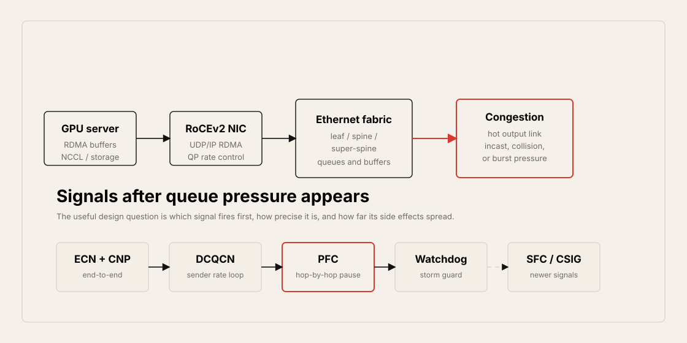

## RoCEv2 in AI/ML Fabrics

RDMA over Converged Ethernet version 2, RoCEv2, is widely used in AI/ML clusters to synchronize data between application buffers on distributed GPU servers.

RoCEv2 carries RDMA traffic over UDP/IP. This allows it to run across routed Ethernet fabrics while avoiding TCP's connection state and CPU-heavy transport behavior.

### Why RoCEv2 Is Used

RoCEv2 is attractive for AI fabrics because it provides:

- Low-latency data movement
- High throughput
- Zero-copy RDMA semantics
- Kernel bypass
- Lower CPU involvement
- Better parallel session scalability than TCP-based transport
- Fit for GPU synchronization and storage traffic such as NVMe-oF over RoCE

The trade-off is that RoCEv2 is built on UDP/IP. UDP does not provide TCP-style reliability, retransmission, or congestion window behavior. Therefore, the Ethernet fabric must provide strong congestion management.

### TCP, UDP, and RoCEv2

| Transport | Reliability Model | Congestion Behavior | AI Fabric Implication |
| --- | --- | --- | --- |
| TCP | ACKs, retransmission, windowing | Built into transport | More CPU/state overhead; not ideal for GPU RDMA fast path |
| UDP | Best effort | No built-in reliability or congestion control | Fast and simple, but loss-sensitive applications need fabric help |
| RoCEv2 | RDMA over UDP/IP | Depends on ECN, PFC, DCQCN, and NIC behavior | High performance, but needs tuned lossless or low-loss fabric |

### Why Lossless Behavior Matters

Ethernet is normally lossy. RoCEv2-based RDMA expects lossless or near-lossless behavior because packet drops can cause severe performance degradation.

Congestion can appear even in a fabric designed with no intentional oversubscription:

- Load balancing can hash several elephant flows onto one link.
- Incast can concentrate traffic toward one egress.
- Synchronized collectives can create sudden bursts.
- Storage read/write bursts can overrun server-facing links.
- Multi-stage Clos fabrics can concentrate traffic at spine or super-spine layers.

---

## Congestion Points

The chapter describes several locations where congestion can happen.

| Congestion Point | Where It Happens | Typical Cause |
| --- | --- | --- |
| Local leaf link | Inside or below one leaf | Multiple local servers send to one local target |
| Leaf-to-spine | Ingress leaf uplink | ECMP or load balancing sends many flows to one spine |
| Spine-to-leaf | Transit spine downlink | Several ingress leaves converge toward one egress leaf |
| Leaf-to-server | Egress leaf downlink | Fabric sends more than the destination NIC can receive |
| Spine-to-super-spine | Five-stage Clos uplink | Traffic converges from spine to one super-spine |
| Super-spine-to-spine | Five-stage Clos downlink | Super-spine sends too much traffic toward one spine or block |

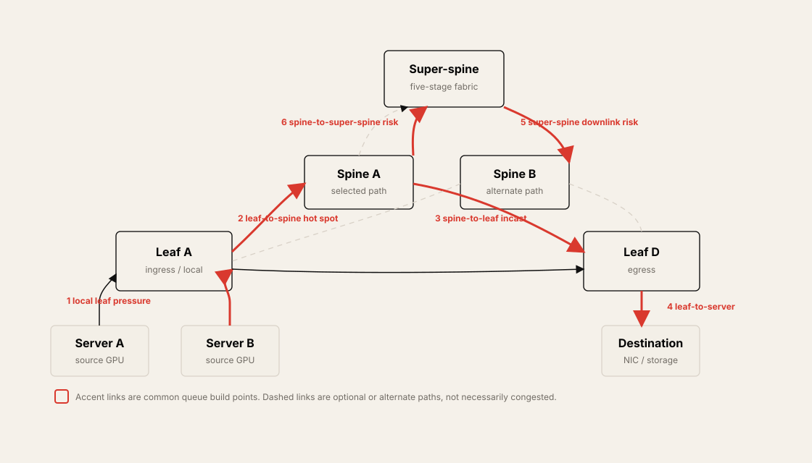

### Local Leaf Link Congestion

Local leaf congestion occurs when multiple devices connected to the same leaf send line-rate traffic to a local target, such as a storage server or GPU server.

Example:

- Server 1 sends 100G.
- Server 2 sends 100G.
- Both target a local storage server with one 100G-facing link.
- The leaf receives 200G of offered load for a 100G output.

This can trigger queue growth, ECN marking, and eventually PFC.

### Leaf-to-Spine Link Congestion

Leaf-to-spine congestion happens when multiple flows are load-balanced onto the same leaf uplink.

This is closely related to Chapter 6:

- Low entropy RoCEv2 traffic may hash poorly.
- A small number of elephant flows may collide on one ECMP member.
- Other spine uplinks may remain underused.

### Spine-to-Leaf Link Congestion

Spine-to-leaf congestion happens when several ingress leaves send traffic through the same spine toward the same egress leaf.

This is a classic incast pattern:

- Leaf A sends traffic to Leaf D.
- Leaf B sends traffic to Leaf D.
- Both flows land on Spine A.
- Spine A has one downlink toward Leaf D.

The ingress side may look balanced locally, but the transit spine downlink becomes congested.

### Leaf-to-Server Link Congestion

Leaf-to-server congestion happens at the final hop when the fabric sends more traffic than the destination NIC can receive.

This can happen when:

- Multiple source GPUs send to one destination GPU.
- Multiple storage readers or writers target one server.
- Inference aggregation sends many responses to one endpoint.
- A destination NIC is 100G while the aggregate fabric input is higher.

### Spine-to-Super-Spine Link Congestion

In a five-stage Clos, traffic may move from leaf to spine to super-spine. If several leaf domains converge on the same spine-to-super-spine link, congestion can happen there.

This is the same incast pattern lifted one stage higher in the topology.

### Super-Spine-to-Spine Link Congestion

Super-spine-to-spine congestion happens on the downlink from a super-spine toward a destination spine or block.

This is especially important in multi-stage fabrics because congestion may occur far away from the original ingress leaf. Local link quality alone may not reveal the end-to-end bottleneck.

---

## Congestion Management Toolkit

RoCEv2 fabrics use multiple mechanisms together.

| Mechanism | Layer / Scope | Main Function | Main Trade-Off |
| --- | --- | --- | --- |
| ECN | IP / end-to-end | Mark congestion and trigger CNP rate reduction | Slower than hop-by-hop pause |
| CNP | RoCEv2 notification | Tell sender which flow is congested | Arrives after marked packet reaches receiver |
| PFC | Ethernet / hop-by-hop | Pause a priority class to prevent drops | HOL blocking and PFC storms |
| PFC watchdog | Switch protection | Detect and mitigate persistent PFC storms | May drop or forward traffic during mitigation |
| DCQCN | RoCEv2 congestion control | Combine ECN/CNP and PFC into a rate-control loop | Requires careful threshold and NIC tuning |
| SFC | Source flow control | Send direct flow-level signal toward source | Newer, requires support across devices |
| CSIG | In-band telemetry | Carry bottleneck metadata in packets | Emerging, needs protocol and silicon support |

The practical model is layered:

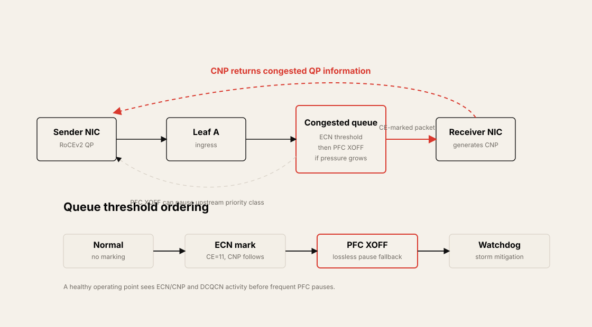

---

## Explicit Congestion Notification, ECN

Explicit Congestion Notification, ECN, is an end-to-end congestion signaling mechanism.

ECN requires:

- Sender ECN support
- Receiver ECN support
- ECN-enabled transit switches
- ECN thresholds on switch queues
- CNP behavior in the RoCEv2 endpoint

If a transit device in the path does not support ECN, end-to-end ECN behavior is broken.

### ECN Bit Values

The IP header includes DSCP and ECN bits. DSCP uses the first 6 bits for QoS or CoS marking. ECN uses the last 2 bits.

| ECN Bits | Meaning | Behavior |
| --- | --- | --- |
| `00` | Not ECN capable | Packet may be dropped under congestion |
| `01` | ECN-capable transport | Used as ECT value; also appears in RoCEv2 CNP |
| `10` | ECN-capable transport | Treated similarly to `01` from a network perspective |
| `11` | Congestion Experienced, CE | Switch marks packet instead of dropping it |

When queue usage exceeds the ECN threshold, the switch marks packets with CE, `11`, and forwards them. The receiver then sends a CNP back to the sender.

### CNP, Congestion Notification Packet

Congestion Notification Packet, CNP, is generated by the receiver or destination server.

Important properties:

- It is a RoCEv2 frame.
- It is sent back to the source when ECN-marked traffic is received.
- The chapter identifies the CNP IB BTH opcode as `129`.
- It carries destination Queue Pair information so the sender can identify the congested flow.
- The sender reduces the traffic rate for that flow.

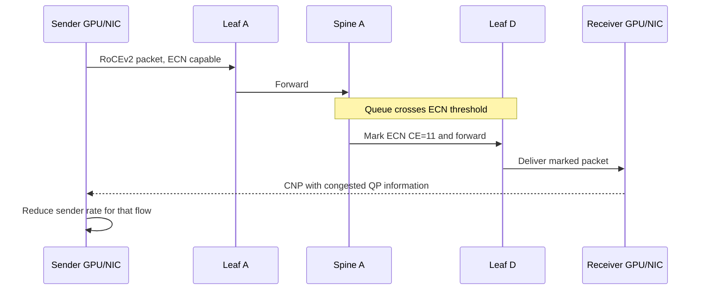

### ECN Thresholds

ECN marking is based on queue usage.

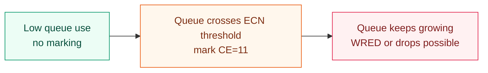

ECN threshold tuning matters:

- If the threshold is too low, the fabric may mark too aggressively and reduce throughput.
- If the threshold is too high, congestion may turn into drops before senders slow down.
- Multiple flows may share the same queue, which makes threshold tuning harder.
- Operators often monitor ECN counters and queue occupancy to refine thresholds.

### ECN Limitations

ECN is useful, but it is not instantaneous.

The delay path is:

1. Congested switch marks the packet.
2. Marked packet reaches the receiver.
3. Receiver generates CNP.
4. CNP reaches the sender.
5. Sender reduces rate.

During this delay, a burst can continue filling the queue. If the queue grows faster than ECN/CNP can react, packet drops can still occur. The chapter therefore describes ECN-enabled queues as lossy queues.

---

## Priority Flow Control, PFC

Priority Flow Control, PFC, is an Ethernet link-layer mechanism that pauses traffic for a priority class.

PFC is different from ECN:

- ECN marks packets end-to-end.
- PFC sends hop-by-hop pause frames.
- ECN targets a flow through CNP and rate reduction.
- PFC targets a whole priority or traffic class.

A queue with PFC configured is often treated as a lossless queue.

### PFC Frame Format

PFC uses Ethernet MAC control frames.

Important fields:

| Field | Meaning |
| --- | --- |
| Destination MAC | Reserved multicast or control destination |
| Source MAC | Switch that generated the PFC frame |
| EtherType | `0x8808` for MAC control |
| Opcode | PFC control opcode |
| Priority Control Vector | Which traffic classes are paused |
| Time fields | Pause duration per class |

The frame supports traffic classes `0` through `7`. For each enabled class, a time value indicates how long traffic should be paused. A time value of `0` indicates unpause.

### XOFF and XON

PFC uses two threshold concepts:

| Signal | Meaning | Trigger |
| --- | --- | --- |
| XOFF | Transmit off | Queue crosses high threshold |
| XON | Transmit on | Queue drains below low threshold |

When buffer usage crosses the XOFF threshold, the switch sends a PFC pause frame upstream. When the queue drains below the XON threshold, the switch sends an unpause signal.

The chapter's example uses a pause timer of `65535` microseconds for an XOFF frame and `0` for an XON frame.

### PFC Thresholds

PFC thresholds must leave enough headroom for traffic already in flight.

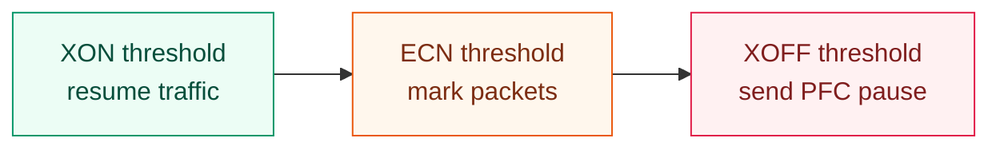

In most designs, ECN threshold is lower than PFC XOFF threshold. ECN should reduce sender rate before PFC is needed. PFC acts as a stronger loss-prevention mechanism when queues continue to grow.

### Head-of-Line Blocking

PFC pauses a priority class, not a single flow.

If Flow A causes congestion in priority class 3, PFC can pause class 3. That also pauses Flow B and Flow C in the same priority class, even if they did not cause congestion.

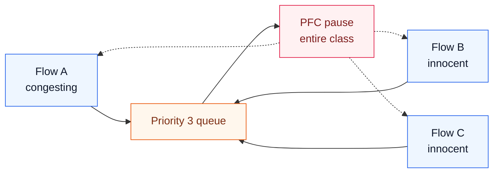

This is head-of-line, HOL, blocking. It can increase training iteration time because unrelated GPU flows wait behind the paused class.

### PFC Storm

A PFC storm happens when pause frames propagate upstream and trigger wider backpressure through the fabric.

Typical sequence:

1. A downstream switch sends excessive PFC pause frames.
2. An upstream switch pauses the class.
3. The upstream switch's own queues build.
4. It sends more PFC pause frames further upstream.
5. The pause behavior spreads and can degrade many flows.

PFC storms are dangerous in AI fabrics because a synchronized training job can be gated by the slowest path.

### PFC Watchdog

PFC watchdog detects and mitigates persistent abnormal PFC backpressure.

It has three functions:

| Function | Role |
| --- | --- |
| Detection | Monitor pause frames per port or queue and compare to thresholds |
| Mitigation | Drop or forward traffic to break storm propagation |
| Restoration | Resume normal lossless behavior when storm signals fall below threshold |

Mitigation options:

- Drop packets already in the output queue.
- Drop new packets for the affected queue or priority group.
- Drop or suppress additional PFC frames to limit propagation.
- Forward despite PFC, depending on platform policy.

Dropping is commonly used because it prevents the PFC storm from spreading, but it means the fabric is no longer strictly lossless during mitigation.

---

## Data Center Quantized Congestion Notification, DCQCN

Data Center Quantized Congestion Notification, DCQCN, is a RoCEv2 congestion control mechanism that combines ECN/CNP with PFC behavior.

The idea:

- ECN provides early end-to-end congestion signaling.
- CNP tells the sender which flow or QP should slow down.
- The sender performs rate control.
- PFC provides stronger hop-by-hop backpressure if queues keep growing.
- PFC watchdog protects against persistent PFC storm behavior.

### ECN and PFC Threshold Relationship

DCQCN normally places the ECN threshold below the PFC XOFF threshold.

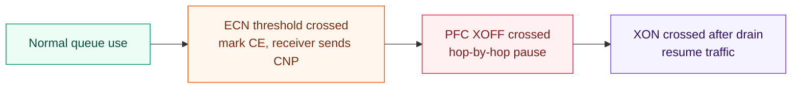

Why this ordering matters:

- ECN should react first and preserve other flows in the queue.
- PFC should be a later protection against drops.
- If PFC triggers too often, it can reduce bandwidth and create HOL blocking.
- If ECN is too high or too slow, packet drops can occur before rate control reacts.

### DCQCN Flow

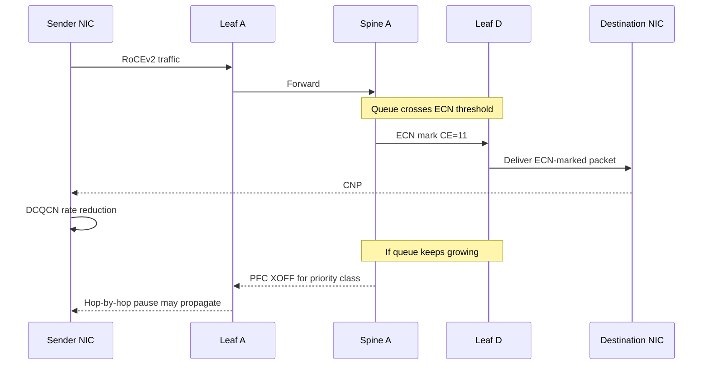

DCQCN is therefore a combined control loop:

- ECN/CNP attempts to slow the sender before loss.
- PFC prevents packet loss when buffer pressure becomes urgent.
- PFC watchdog limits damage if pause behavior becomes pathological.

### What to Monitor

Operationally, DCQCN depends on telemetry.

| Counter / Signal | Meaning |
| --- | --- |
| ECN marked packet count | How often switches mark congestion |
| CNP RX/TX count | How often receivers/senders participate in rate reduction |
| PFC RX/TX count | How often pause frames are sent or received |
| PFC storm detection count | Whether watchdog mitigation is happening |
| Queue buffer occupancy | Whether thresholds are reasonable |
| WRED/drop count | Whether ECN/PFC failed to prevent loss |
| RDMA retransmission or error counters | Whether RoCEv2 traffic is suffering loss or timeout |
| Per-priority queue usage | Whether one traffic class is dominating |

---

## Source Flow Control, SFC

Source Flow Control, SFC, is described as a newer flow-based mechanism. It is also referred to as Source PFC in the chapter.

The main idea:

> Instead of pausing a whole class hop-by-hop, the congested device sends a direct signal toward the source flow.

SFC attempts to combine some strengths of ECN and PFC:

- Faster than ECN because the congested switch sends a signal directly toward the source.
- More precise than PFC because it targets a flow rather than a whole priority class.
- Avoids some PFC side effects such as HOL blocking and storm propagation.
- Can be implemented at edge or ToR level depending on device support.

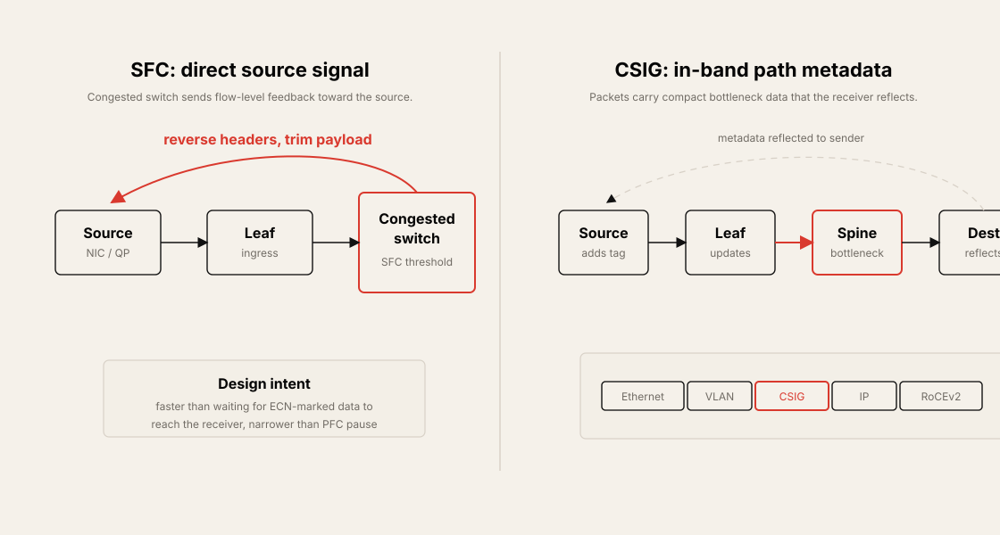

### SFC Flow

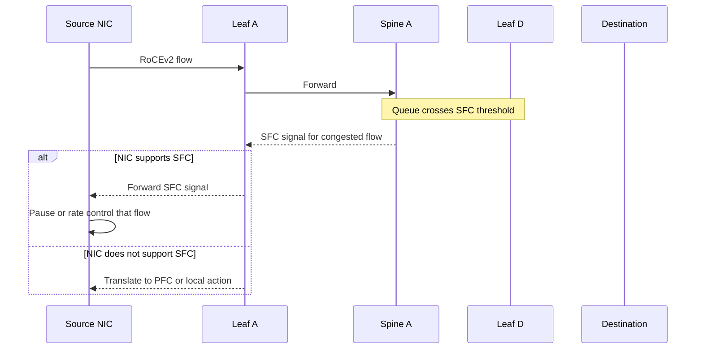

### Payload Trim and Reversed Headers

The chapter describes SFC signal creation this way:

1. A switch detects congestion on a link based on queue usage and an SFC threshold.
2. The switch creates an SFC signal for the congested flow.
3. The source and destination IP addresses are reversed.
4. The packet payload may be trimmed.
5. The signal is sent back toward the source.

This lets the source learn about congestion without waiting for the original packet to reach the destination and trigger a CNP.

### SFC Compared with ECN and PFC

| Mechanism | Signal Path | Granularity | Main Strength | Main Weakness |
| --- | --- | --- | --- | --- |
| ECN | Congested switch to receiver to sender | Flow/QP through CNP | End-to-end and flow-aware | Reaction delay |
| PFC | Hop-by-hop upstream | Priority class | Immediate lossless pause | HOL blocking and PFC storms |
| SFC | Congested switch toward source | Flow | Faster and more precise | Requires newer support |

SFC is useful because it attacks the two main drawbacks of existing mechanisms: ECN delay and PFC class-level blast radius.

---

## Congestion Signaling, CSIG

Congestion Signaling, CSIG, is an emerging IETF draft mechanism for direct, real-time, in-band congestion signaling.

CSIG uses in-band network telemetry, INT, ideas:

- Live data packets carry compact congestion metadata.
- Switches update CSIG tags along the path.
- The receiver reflects the information back to the sender.
- The sender can use the bottleneck data for rate control or path selection.

### CSIG Tags and Reflection

CSIG adds a Layer 2 tag between the Ethernet header and Layer 3 header. The chapter notes that it is structurally similar to a VLAN tag and can coexist with a VLAN tag when the CSIG tag is the last tag in the Layer 2 header.

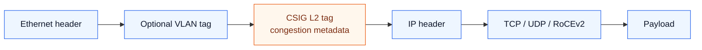

End-to-end flow:

1. Source sends a packet with CSIG support.
2. Each hop can update the CSIG tag with local bottleneck information.
3. Destination receives accumulated congestion metadata.
4. Destination reflects the information to the source.
5. Source adjusts rate or path behavior.

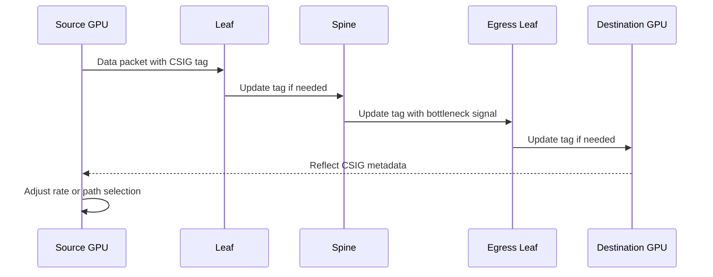

### Path Bottleneck Metadata

CSIG metadata can include:

| Metadata | Meaning |
| --- | --- |
| Bottleneck capacity | Capacity of the limiting link |
| Bottleneck stage | Leaf, spine, super-spine, or other stage |
| Device ID | Which device observed the bottleneck |
| Link identification | Uplink, downlink, or link ID |
| Quantized signal | Compact congestion value |
| Available bandwidth or queue signal | Summary of path pressure |

The point is not to expose unlimited telemetry. It is to carry a compact fixed-length summary that a sender or control loop can use quickly.

### Why CSIG Matters

CSIG may help AI fabrics because it can:

- Identify where the path bottleneck is.
- Provide in-band telemetry without a separate polling loop.
- Support better path selection.
- Inform sender-side rate control.
- Work with encrypted payloads because the signal is in a Layer 2 tag.
- Evolve beyond ECN and PFC's limited signal models.

CSIG is still new. It requires endpoint, switch, and standards support before it becomes a normal production mechanism.

---

## Mechanism Comparison

| Mechanism | Scope | Signal Direction | Granularity | Speed | Main Risk |
| --- | --- | --- | --- | --- | --- |
| ECN | End-to-end | Switch marks packet, receiver sends CNP | Flow/QP | Medium | Too slow for microbursts |
| PFC | Hop-by-hop | Downstream pauses upstream | Priority class | Fast | HOL blocking, PFC storm |
| PFC watchdog | Local switch protection | Detect and suppress abnormal pause behavior | Port/queue/class | Fast after threshold | Drops may occur during mitigation |
| DCQCN | End-to-end plus hop-by-hop | ECN/CNP rate control plus PFC fallback | Flow/QP plus class fallback | Medium to fast | Needs careful tuning |
| SFC | Congested switch to source | Direct source signal | Flow | Fast | Newer support required |
| CSIG | In-band path telemetry | Hops update tag, receiver reflects | Path/bottleneck metadata | Potentially fast | Emerging standard and support |

Recommended mental model:

| Condition | Preferred Response |
| --- | --- |
| Mild queue growth | ECN mark and CNP-driven rate reduction |
| Queue pressure continues | DCQCN sender rate control |
| Loss is imminent | PFC pause for the priority class |
| Pause behavior persists | PFC watchdog detection and mitigation |
| Need faster flow-specific control | SFC |
| Need path bottleneck telemetry | CSIG |

---

## Operational Validation Checklist

RoCEv2 congestion management must be validated under realistic AI traffic.

Checklist:

- Confirm ECN is enabled on endpoints and every transit device in the path.
- Confirm ECN thresholds are below PFC XOFF thresholds.
- Confirm PFC is enabled only on intended priorities and links.
- Validate XOFF/XON headroom against link speed, cable distance, MTU, and buffer size.
- Monitor ECN marked packet counts during NCCL and storage bursts.
- Monitor CNP RX/TX counters on NICs.
- Monitor PFC RX/TX counters per port and priority.
- Test PFC watchdog detection, mitigation, and restoration.
- Validate that watchdog mitigation behavior is acceptable for the workload.
- Check queue occupancy and WRED/drop counters.
- Check RDMA retransmission, timeout, and error counters.
- Validate leaf-to-spine, spine-to-leaf, and leaf-to-server incast cases.
- Test five-stage congestion if the fabric includes super-spines.
- Verify load balancing from Chapter 6 before increasing PFC dependence.
- Record job-level impact: GPU utilization, collective latency, p99 step time, and JCT.

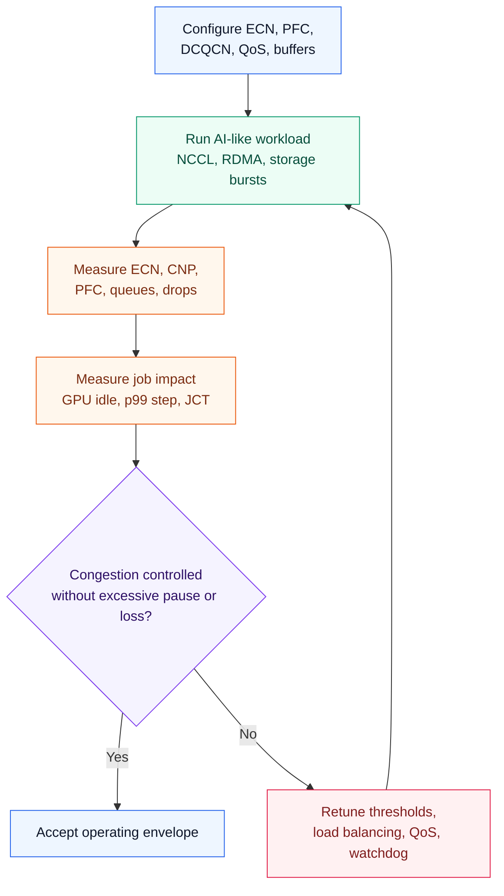

---

## Chapter Summary

RoCEv2 is a high-performance transport for AI/ML fabrics, but it depends on carefully engineered congestion management.

The main takeaways:

- RoCEv2 carries RDMA over UDP/IP and avoids TCP's CPU and state overhead.
- Ethernet is lossy by default, so RoCEv2 fabrics require ECN, PFC, DCQCN, and careful buffer tuning.
- Congestion can appear at local leaf links, leaf-spine uplinks, spine-leaf downlinks, leaf-server links, and super-spine stages.
- ECN marks congestion and relies on CNP to tell the sender to reduce rate.
- ECN is flow-aware but can be too slow for fast bursts.
- PFC prevents drops with hop-by-hop pause, but it pauses a whole priority class.
- PFC can cause head-of-line blocking and PFC storms.
- PFC watchdog detects, mitigates, and restores from abnormal pause behavior.
- DCQCN combines ECN/CNP and PFC into a RoCEv2 congestion control loop.
- ECN thresholds should normally be lower than PFC XOFF thresholds.
- SFC aims to send direct flow-level congestion signals toward the source.
- CSIG uses in-band telemetry tags to report path bottlenecks and can help future sender rate control and path selection.

---

## Key Terms

| Term | Meaning |
| --- | --- |
| RoCEv2 | RDMA over Converged Ethernet version 2; RDMA over UDP/IP |
| RDMA | Remote Direct Memory Access |
| ECN | Explicit Congestion Notification |
| ECT | ECN-Capable Transport |
| CE | Congestion Experienced |
| CNP | Congestion Notification Packet |
| PFC | Priority Flow Control |
| XOFF | Pause signal; transmit off |
| XON | Resume signal; transmit on |
| HOL blocking | Head-of-line blocking; unrelated flows wait behind a paused class |
| PFC storm | Cascading or persistent PFC pause behavior across the fabric |
| PFC watchdog | Mechanism to detect, mitigate, and restore from PFC storms |
| DCQCN | Data Center Quantized Congestion Notification |
| DSCP | Differentiated Services Code Point |
| QoS | Quality of Service |
| CoS | Class of Service |
| WRED | Weighted Random Early Detection |
| SFC | Source Flow Control |
| CSIG | Congestion Signaling |
| INT | In-band Network Telemetry |
| QP | RDMA Queue Pair |
| CNP opcode | RoCEv2 CNP BTH opcode, identified in the chapter as `129` |

## Q&A

### 1. What is RoCEv2, and why is it important for AI/ML clusters?

RoCEv2 encapsulates RDMA traffic in UDP/IP packets so RDMA can run across routed Ethernet fabrics.

It is important for AI/ML clusters because distributed training requires fast synchronization of large data chunks between GPU servers. RoCEv2 provides low latency, high throughput, and CPU bypass. The trade-off is that the Ethernet fabric must be tuned to avoid drops and uncontrolled congestion.

### 2. Where can congestion happen in a RoCEv2 AI fabric?

Congestion can happen at many points: local leaf links, leaf-to-spine uplinks, spine-to-leaf downlinks, leaf-to-server links, spine-to-super-spine links, and super-spine-to-spine links.

The common pattern is incast or flow collision. Several line-rate sources converge on one output link or one destination NIC. This can happen even if the fabric has no intentional oversubscription.

### 3. How does ECN work in RoCEv2 fabrics?

When a switch queue exceeds the ECN threshold, the switch marks packets with ECN CE bits instead of dropping them. The receiver sees the marked packet and sends a CNP back to the sender. The sender then reduces the rate for the affected flow or QP.

ECN is useful because it is flow-aware and end-to-end. Its weakness is delay: the marked packet must reach the receiver before the sender receives feedback.

### 4. What is CNP?

CNP means Congestion Notification Packet. It is a RoCEv2 notification sent by the receiver back to the sender after the receiver sees ECN-marked traffic.

The CNP identifies the congested flow or QP so the sender can reduce the rate of that specific traffic. The chapter identifies the CNP BTH opcode as `129`.

### 5. How does PFC differ from ECN?

ECN is an end-to-end marking and rate-control signal. PFC is a hop-by-hop Ethernet pause mechanism.

PFC prevents packet drops by pausing a priority class on the upstream link. It is fast, but it is coarse. It pauses the whole class, not just the congesting flow. That can create HOL blocking and PFC storms.

### 6. What are XOFF and XON?

XOFF is the PFC pause signal. It is generated when queue usage crosses the high threshold. XON is the resume signal. It is generated when queue usage drains below the lower threshold.

The XOFF/XON gap prevents the fabric from rapidly toggling pause and resume when queue usage is near the threshold.

### 7. What is a PFC storm?

A PFC storm is a cascading pause condition. A downstream device sends excessive PFC pause frames. The upstream device pauses traffic, its own queues build, and it sends pause frames further upstream.

This can spread backpressure through the fabric and stall unrelated traffic in the same priority class.

### 8. What does PFC watchdog do?

PFC watchdog monitors pause behavior and detects abnormal or persistent PFC storms. Once a threshold is exceeded, it mitigates the storm by dropping or forwarding affected traffic and suppressing further propagation. It later restores normal behavior when pause signals fall below the configured threshold.

It is a safety mechanism. It protects the fabric, but mitigation may sacrifice lossless behavior temporarily.

### 9. How does DCQCN combine ECN and PFC?

DCQCN uses ECN and CNP for early sender rate reduction. If queue usage keeps rising and crosses the PFC XOFF threshold, PFC provides hop-by-hop pause to prevent drops.

In a well-tuned fabric, ECN should usually react before PFC is needed. PFC should be a fallback, not the primary congestion control path.

### 10. Why are SFC and CSIG interesting for future AI fabrics?

SFC is interesting because it sends a direct flow-level signal from the congested device toward the source. It avoids the receiver round trip of ECN/CNP and avoids the class-level blast radius of PFC.

CSIG is interesting because it embeds compact congestion metadata in live packets. Switches can update the tag along the path, and the receiver can reflect the path bottleneck information back to the sender. This can support better rate control and path selection.

## References

- [IEEE 802.1Qbb, Priority-based Flow Control](https://1.ieee802.org/dcb/802-1qbb/)
- [IEEE 802.1Qau, Congestion Notification](https://1.ieee802.org/dcb/802-1qau/)
- [IETF draft-ravi-ippm-csig-01, Congestion Signaling](https://datatracker.ietf.org/doc/html/draft-ravi-ippm-csig-01)
