# Chapter 8: IP Routing for AI/ML Fabrics

## Table of Contents

- [Goal](#goal)
- [Why IP Routing Matters in AI Fabrics](#why-ip-routing-matters-in-ai-fabrics)
  - [Backend and Frontend Routing Domains](#backend-and-frontend-routing-domains)
  - [Dynamic IP Routing Options](#dynamic-ip-routing-options)
- [eBGP Underlay for AI Data Centers](#ebgp-underlay-for-ai-data-centers)
  - [Why eBGP Is Common](#why-ebgp-is-common)
  - [BGP Unnumbered](#bgp-unnumbered)
  - [Next-Hop Rewrite and AS-PATH](#next-hop-rewrite-and-as-path)
  - [BGP ASN Allocation](#bgp-asn-allocation)
  - [BGP ADD-PATH](#bgp-add-path)
  - [AS-PATH Strip and Replace](#as-path-strip-and-replace)
  - [BGP Link Bandwidth Extended Community](#bgp-link-bandwidth-extended-community)
  - [Minimum BGP Peers per Prefix](#minimum-bgp-peers-per-prefix)
- [BGP Deterministic Path Forwarding, BGP-DPF](#bgp-deterministic-path-forwarding-bgp-dpf)
  - [Logical Fabric Colors](#logical-fabric-colors)
  - [Rail-Optimized and Rail-Unified DPF](#rail-optimized-and-rail-unified-dpf)
  - [Session Coloring and Colored Routes](#session-coloring-and-colored-routes)
  - [EVPN-VXLAN and Underlay Color](#evpn-vxlan-and-underlay-color)
- [RIFT for Fat-Tree and Dragonfly Fabrics](#rift-for-fat-tree-and-dragonfly-fabrics)
  - [RIFT Basics](#rift-basics)
  - [Dragonfly and Dragonfly Sparse](#dragonfly-and-dragonfly-sparse)
- [IS-IS for AI Fabrics](#is-is-for-ai-fabrics)
  - [Optimal Distributed Flooding](#optimal-distributed-flooding)
  - [IS-IS FlexAlgo](#is-is-flexalgo)
  - [FlexAlgo Compared with BGP-DPF](#flexalgo-compared-with-bgp-dpf)
- [Multi-Tenancy for AI/ML Data Centers](#multi-tenancy-for-aiml-data-centers)
  - [Network-Level Multi-Tenancy](#network-level-multi-tenancy)
  - [EVPN-VXLAN Multi-Tenancy](#evpn-vxlan-multi-tenancy)
  - [Server-Level Multi-Tenancy](#server-level-multi-tenancy)
  - [Combining Server and Network Multi-Tenancy](#combining-server-and-network-multi-tenancy)
  - [Dynamic ACL-Based Multi-Tenancy](#dynamic-acl-based-multi-tenancy)
- [Extending IP Routing to the Server](#extending-ip-routing-to-the-server)
  - [Server-to-ToR eBGP](#server-to-tor-ebgp)
  - [Virtual BGP Route Reflector](#virtual-bgp-route-reflector)
- [Traffic Engineering and Telemetry](#traffic-engineering-and-telemetry)
- [Segment Routing and SRv6](#segment-routing-and-srv6)
  - [Segment Routing Basics](#segment-routing-basics)
  - [SR-MPLS vs. SRv6](#sr-mpls-vs-srv6)
  - [SRv6 Segment Routing Header](#srv6-segment-routing-header)
  - [Compressed SID and uSID](#compressed-sid-and-usid)
- [Routing Protocol Comparison](#routing-protocol-comparison)
- [Operational Validation Checklist](#operational-validation-checklist)
- [Chapter Summary](#chapter-summary)
- [Key Terms](#key-terms)
- [Q&A](#qa)
- [References](#references)

## Goal

This chapter explains routing choices for AI/ML data center fabrics.

The core idea is:

> AI fabric routing is no longer just reachability. It must support scale, fast convergence, path diversity, traffic engineering, tenant isolation, and workload-aware forwarding.

The chapter focuses on these topics:

- eBGP underlay for three-stage and five-stage Clos fabrics
- BGP unnumbered using IPv6 link-local next hops
- BGP ASN allocation and AS-PATH behavior
- BGP ADD-PATH and BGP Link Bandwidth Extended Community
- BGP Deterministic Path Forwarding, DPF
- RIFT for fat-tree and Dragonfly-style fabrics
- IS-IS flood optimization and FlexAlgo
- EVPN-VXLAN and server/GPU-level multi-tenancy
- Extending routing to GPU servers
- Controller-driven traffic engineering
- Segment Routing, SRv6, and uSID

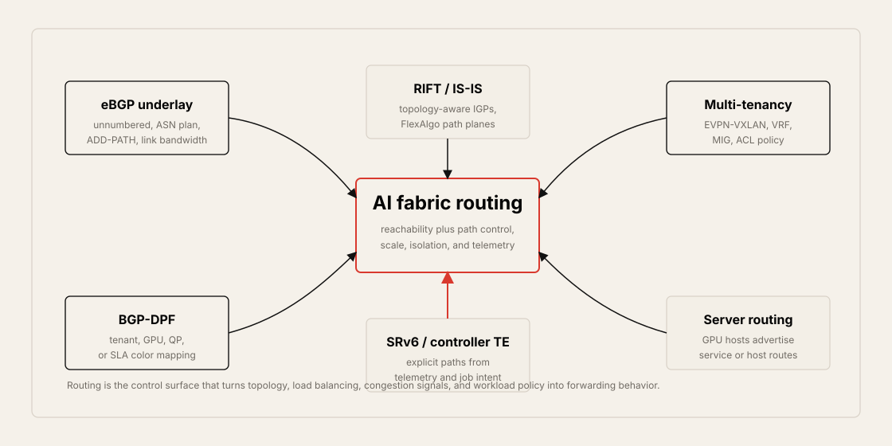

## Why IP Routing Matters in AI Fabrics

Earlier chapters covered topology, load balancing, and congestion control. Routing ties those pieces together.

In AI fabrics, the routing protocol must answer more than "Can this prefix be reached?"

It also affects:

- How quickly the fabric converges after a link or node failure
- Whether ECMP has enough usable next hops
- Whether unequal link speeds can be represented
- Whether workload or tenant traffic can be pinned to selected paths
- Whether multi-tenant overlays can be signaled
- Whether fabric topology can be exposed to controllers or adaptive routing
- Whether GPU servers can participate in routing directly

### Backend and Frontend Routing Domains

AI data centers often separate backend and frontend concerns.

| Domain | Main Traffic | Common Routing Style |
| --- | --- | --- |
| Backend training fabric | GPU/NIC east-west RDMA, RoCEv2 | Native IP eBGP, BGP-DPF, GLB, BGP link bandwidth, RIFT, IS-IS FlexAlgo |
| Frontend / inference fabric | User traffic, API serving, storage, tenant services | eBGP underlay plus EVPN-VXLAN overlay |
| Storage domain | Checkpoints, data loading, object or block storage | RoCEv2, NVMe/TCP, iSCSI, or other IP storage designs |

The same routing protocol can be used in both domains, but with different features. For example, backend eBGP may use weighted ECMP and BGP Link Bandwidth Extended Community, while frontend eBGP may carry EVPN-VXLAN services for tenant segmentation.

### Dynamic IP Routing Options

The chapter compares traditional and emerging routing choices.

| Protocol | Basic Type | Strength | Concern |
| --- | --- | --- | --- |
| eBGP | Path-vector | Scale, policy, multi-vendor adoption, loop prevention | Convergence and topology awareness need tuning |
| OSPF | Link-state IGP | Familiar, hierarchical, fast enough in many networks | Flooding, complexity, and less data center traction |
| IS-IS | Link-state IGP | Scalable, extensible TLVs, FlexAlgo, link-local behavior | Less common in enterprise/data center operations |
| RIFT | Fat-tree optimized IGP | Designed for Clos/fat-tree, fast convergence, disaggregation | Newer and less mature than BGP |
| Segment Routing | Source-routing architecture | Explicit path control and controller-driven TE | Header overhead, hardware support, operational complexity |

There is no universal best routing protocol. The right choice depends on topology, scale, operations, vendor support, convergence target, and traffic engineering needs.

---

## eBGP Underlay for AI Data Centers

eBGP is widely used for large data center fabrics, including AI fabrics, because it scales well and has strong policy controls.

Typical AI fabric use:

- Three-stage Clos: leaf - spine - leaf
- Five-stage Clos: leaf - spine - super-spine - spine - leaf
- Backend native IP fabric for GPU RDMA traffic
- Frontend underlay for EVPN-VXLAN overlays

### Why eBGP Is Common

Benefits:

- Proven at cloud scale
- Clear loop prevention through AS-PATH
- Strong route policy controls
- Works across vendors
- Supports Clos, Dragonfly-like, and full-mesh variations
- Can carry additional service families such as EVPN
- Can be automated with per-rack or per-switch ASN plans

Limitations:

- BGP was not originally designed as a link-state fabric protocol.
- Native BGP has limited link/queue awareness.
- Convergence can be slower than some IGPs.
- Large topologies require careful ASN and policy design.
- Advanced AI features often require extensions or route policies.

### BGP Unnumbered

BGP unnumbered simplifies leaf-spine peering by avoiding per-link IPv4 addressing.

The idea:

- Interfaces use IPv6 link-local addresses.
- IPv6 Neighbor Discovery discovers neighbors.
- BGP establishes TCP sessions over link-local addresses.
- IPv4 prefixes can be advertised with IPv6 link-local next hops.
- Extended Next Hop Encoding, RFC 5549, allows this behavior.

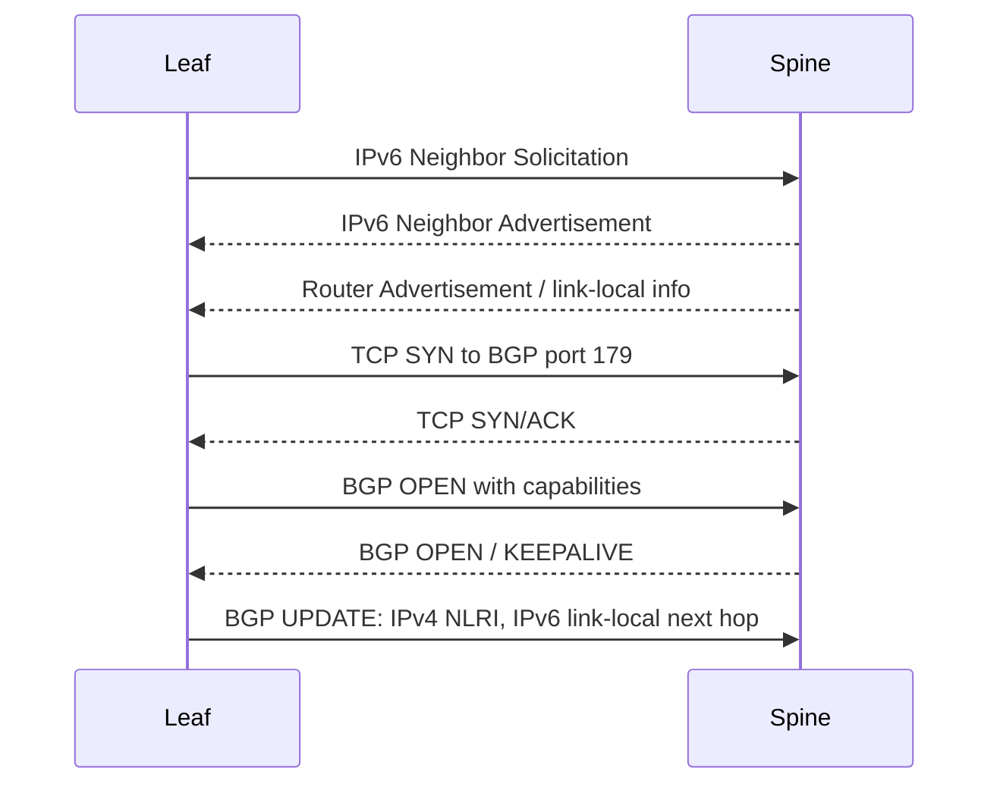

Operational benefit:

- Fewer point-to-point addresses to allocate
- Easier automation
- Less per-link configuration
- Good fit for fabrics with many leaf-spine links

### Next-Hop Rewrite and AS-PATH

In eBGP, each hop normally rewrites the next hop and adds its ASN to AS-PATH.

Example:

1. Leaf 1 originates a GPU server prefix.
2. Spine receives it and advertises it to Leaf 2.
3. Spine rewrites the next hop to itself.
4. AS-PATH is updated with the relevant AS sequence.

This behavior helps loop prevention and policy, but it must be understood when designing deterministic forwarding, maintenance policies, and failure handling.

### BGP ASN Allocation

ASN design is important in AI fabrics.

Common patterns:

| Pattern | Description | Benefit | Risk |
| --- | --- | --- | --- |
| Same ASN for all spines, unique ASN per leaf | Common eBGP Clos design | Simple loop prevention and origin identification | Requires planning for AS-PATH expectations |
| Unique ASN per spine and leaf | More granular identity | More explicit topology identity | Can create suboptimal forwarding under failures |
| iBGP with route reflectors | Same ASN across fabric | Avoids eBGP next-hop rewrite | Less common for cloud-style data center fabrics |

The chapter emphasizes that using the same ASN for spines and unique ASNs for ToR/leaf switches can help avoid suboptimal forwarding after failures because BGP loop prevention rejects routes containing repeated ASNs.

### BGP ADD-PATH

BGP normally advertises only the best path for a prefix. BGP ADD-PATH allows more than one path to be advertised.

Why this matters:

- More path diversity
- Better redundancy
- Better multipath visibility
- Useful when route reflectors or policy otherwise hide alternate paths

In AI fabrics, ADD-PATH can help preserve usable paths for GPU traffic where link diversity and rapid recovery matter.

### AS-PATH Strip and Replace

AS-PATH strip and replace normalizes AS-PATH when private ASNs are used inside the data center and routes must be exchanged with a larger core network.

Uses:

- Hide internal private ASN details from the core
- Normalize path length
- Avoid exposing tenant or fabric-internal ASN design
- Support multi-tenant or multi-domain routing boundaries

This is mainly relevant at fabric borders or when connecting to a core IP network.

### BGP Link Bandwidth Extended Community

BGP Link Bandwidth Extended Community carries bandwidth information that can be used for weighted ECMP.

Example:

| Path | Link Bandwidth | Weighting Goal |
| --- | ---: | --- |
| Path A | 400G | Lower share |
| Path B | 800G | Higher share |

If one next hop has twice the capacity, weighted ECMP can send more traffic to it. This is useful in mixed-speed fabrics or during transitions from 400G to 800G links.

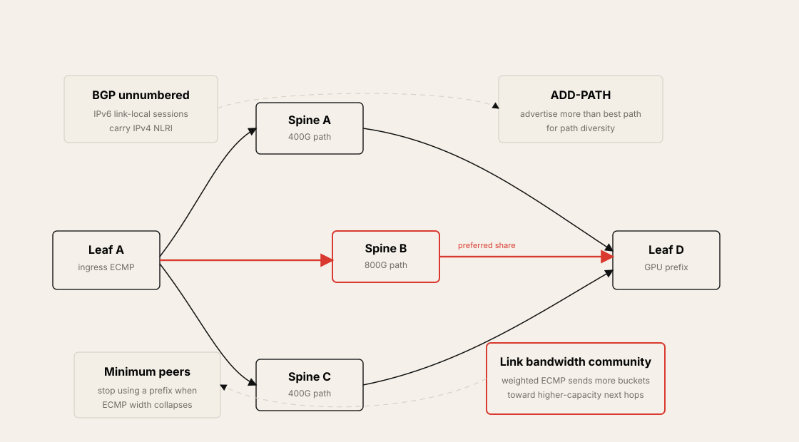

### Minimum BGP Peers per Prefix

Some designs require a minimum number of active BGP peers for a prefix to be considered usable.

Reason:

- Avoid advertising or using a destination when too few paths remain.
- Protect workload performance when ECMP width has collapsed.
- Keep GPU jobs away from partially degraded fabric areas.

This is a routing-level guardrail for performance, not just reachability.

---

## BGP Deterministic Path Forwarding, BGP-DPF

BGP Deterministic Path Forwarding, BGP-DPF, provides deterministic path selection by associating traffic with logical fabric colors.

The goal is similar to traffic engineering:

- Divide one physical fabric into logical fabrics.
- Pin selected traffic to a fabric color.
- Use GPU ID, QP, tenant, or SLA to choose a path.
- Keep elephant flows predictable.
- Improve isolation between tenants or workloads.

### Logical Fabric Colors

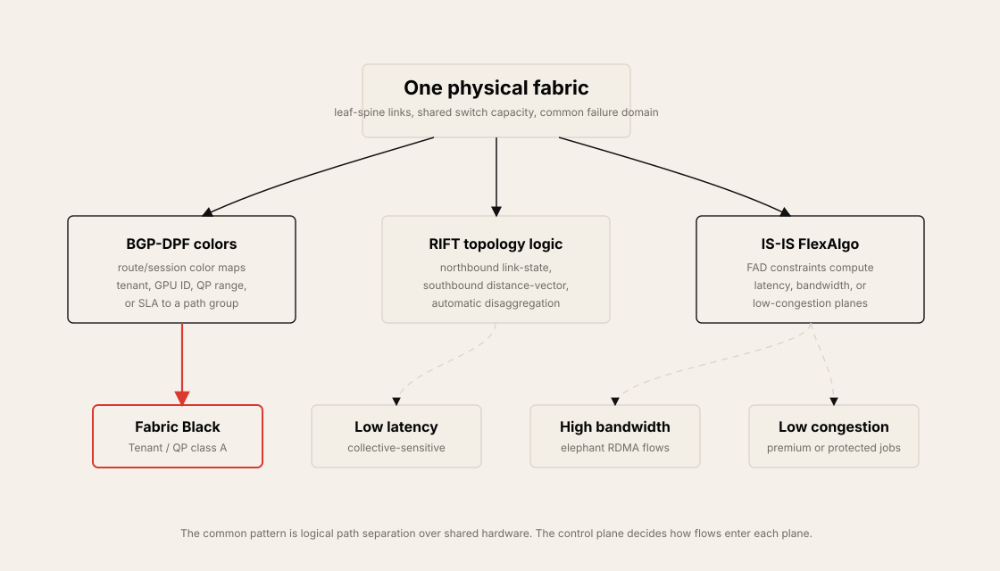

DPF can be implemented through:

- BGP communities
- Colored route advertisement
- Session coloring
- Route policy
- ASIC forwarding behavior that maps flow characteristics to a color

### Rail-Optimized and Rail-Unified DPF

BGP-DPF can be applied in both ROD and RUD designs.

| Design | DPF Use |
| --- | --- |
| Rail-Optimized Design, ROD | Each rail can carry a specific logical fabric or tenant path |
| Rail-Unified Design, RUD | GPU ID, QP, or tenant can choose a logical fabric even when rails share leaf groups |

In a RUD design, DPF becomes especially useful because multiple GPU/NIC positions may share the same physical leaf. The fabric needs a logical way to keep selected flows separated.

### Session Coloring and Colored Routes

DPF can color the BGP session or the routes carried over the session.

Session coloring:

- A BGP peer/session belongs to a color such as black or gray.
- Routes learned over that session are associated with that color.
- Forwarding can select color-specific next hops.

Colored route advertisement:

- Server or leaf advertises a prefix with color metadata.
- Fabric uses that color to select the logical path.
- A tenant or GPU workload can be mapped to a deterministic fabric.

### EVPN-VXLAN and Underlay Color

BGP-DPF can correlate overlay tenants with underlay colors.

Example:

- Tenant Black uses MAC-VRF Black.
- Tenant Gray uses MAC-VRF Gray.
- Tenant Black overlay is mapped to Underlay Fabric Black.
- Tenant Gray overlay is mapped to Underlay Fabric Gray.

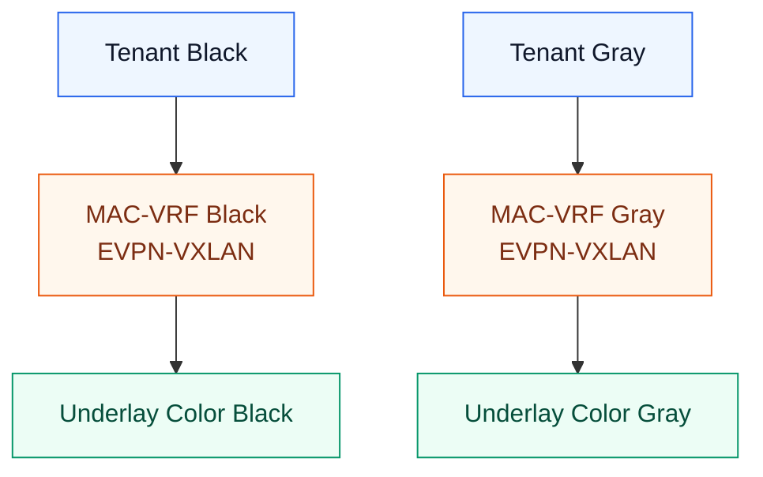

This gives both tenant isolation and path isolation.

---

## RIFT for Fat-Tree and Dragonfly Fabrics

RIFT, Routing in Fat Trees, is an IGP designed for fat-tree and Clos-like data center topologies.

### RIFT Basics

RIFT combines two propagation styles:

| Direction | Behavior |
| --- | --- |
| Northbound | Link-state flooding toward higher levels |
| Southbound | Distance-vector style routing toward lower levels |

Key benefits:

- Designed for fat-tree topology
- Fast convergence
- Automatic disaggregation on failure
- Wide ECMP and UCMP support
- Topology awareness
- Metadata advertisements
- Better fit for large Clos than general-purpose IGP flooding

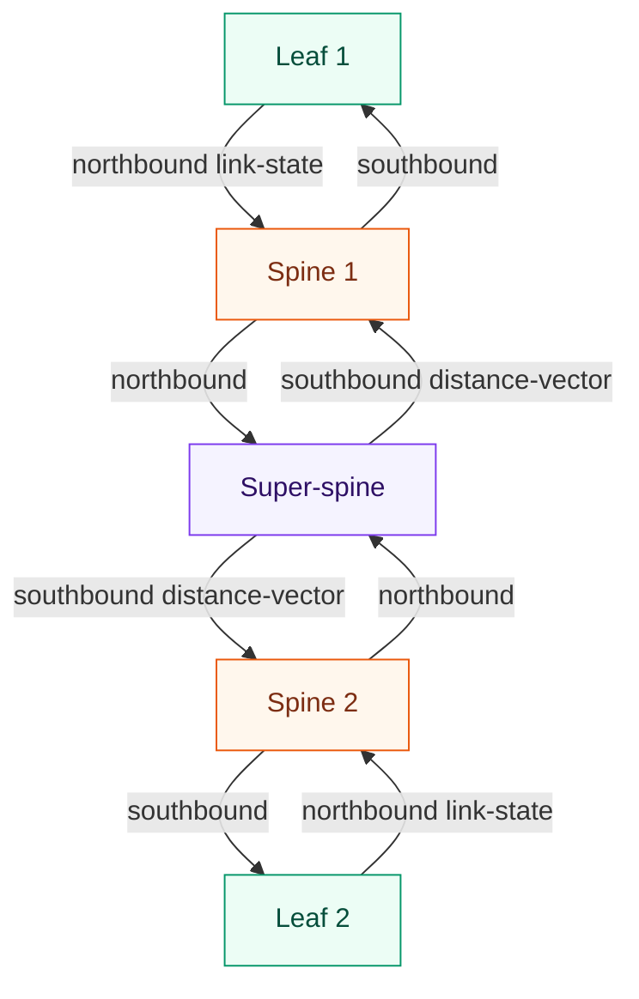

### Dragonfly and Dragonfly Sparse

The chapter discusses Dragonfly as a topology where groups connect to other groups through global links.

Benefits:

- Reduced network diameter
- Lower hop count
- Lower latency potential
- High path diversity
- Useful for HPC-like topologies

Challenges:

- Cabling complexity
- Group-to-group link planning
- Workload placement sensitivity
- Need for topology-aware routing
- Less familiar operational model than Clos

Dragonfly Sparse reduces some complexity by using leaf-spine Clos inside a group and connecting selected top-of-fabric nodes between groups.

RIFT is relevant here because it can encode topology information that traditional Clos-only assumptions may not support.

---

## IS-IS for AI Fabrics

IS-IS is a link-state IGP. The chapter presents it as an alternative to BGP and RIFT for AI backend fabrics, especially where fast convergence, dense topology optimization, and logical path computation matter.

### Optimal Distributed Flooding

Traditional link-state flooding can become expensive in dense topologies. IS-IS Optimal Distributed Flooding reduces unnecessary flooding by electing selected neighbors for update propagation.

Benefits:

- Less control-plane flooding
- Faster convergence in dense leaf-spine designs
- Reduced LSP fragment processing
- More useful as spine count grows to 32, 64, or more

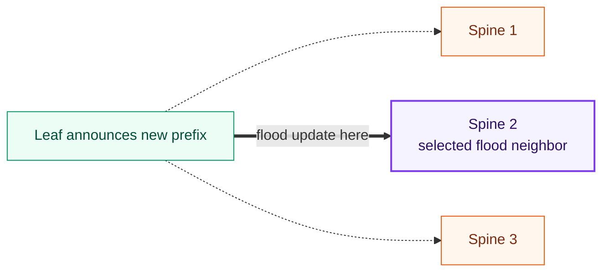

### IS-IS FlexAlgo

FlexAlgo lets IS-IS compute multiple logical topologies over the same physical fabric.

Each FlexAlgo is defined by a Flexible Algorithm Definition, FAD:

- Calculation type
- Metric type
- Constraints

Example:

| FlexAlgo | Constraint Goal | Possible Workload |
| --- | --- | --- |
| Default | Normal shortest path | General traffic |
| 128 | Low latency | Latency-sensitive collectives |
| 129 | High bandwidth | Elephant RDMA flows |
| 130 | Low congestion | Congestion-sensitive or premium workloads |

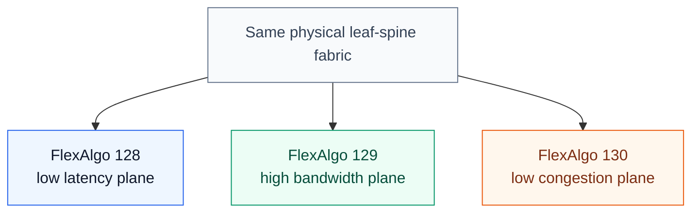

FlexAlgo can steer different AI workloads into different logical path planes without requiring SR-MPLS or SRv6 encapsulation for the basic pure-IP use case.

### FlexAlgo Compared with BGP-DPF

| Aspect | BGP-DPF | IS-IS FlexAlgo |
| --- | --- | --- |
| Control input | BGP communities, route/session colors, policy | IS-IS TLVs and FAD constraints |
| Main abstraction | Logical fabric color | Algorithm-specific topology |
| Topology awareness | Policy-driven, BGP is not native link-state | Native link-state |
| Workload mapping | Tenant, GPU ID, QP, SLA | Metric/constraint-based plane |
| Best fit | BGP-based fabrics needing deterministic colors | IGP fabrics needing path diversity and fast convergence |

---

## Multi-Tenancy for AI/ML Data Centers

Multi-tenancy appears when GPUs are shared between users, teams, customers, or services.

Reasons:

- Security isolation
- Performance isolation
- Capacity planning
- GPU-as-a-Service, GPUaaS
- Public or private cloud AI offerings
- Separate training and inference tenants

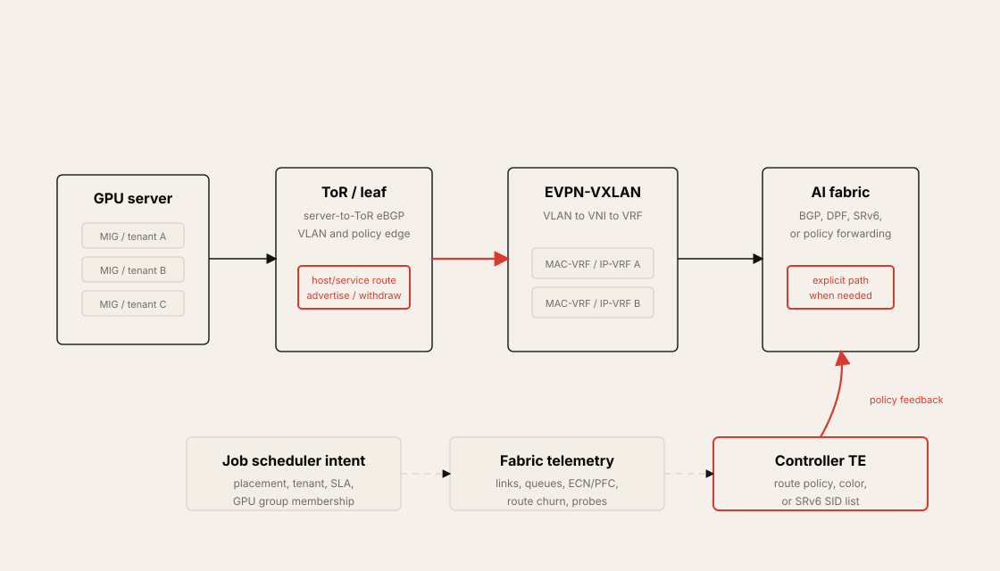

### Network-Level Multi-Tenancy

The simplest model is dedicated physical resources:

- A tenant gets a full GPU server.
- Each GPU/NIC port is connected to a rail leaf.
- Switch ports are dedicated to that tenant.

This is simple and strong from an isolation perspective, but it can waste resources if tenants do not need full servers or full rails.

### EVPN-VXLAN Multi-Tenancy

EVPN-VXLAN can segment tenant traffic using:

| Object | Role |
| --- | --- |
| VLAN | Local Layer 2 tenant mapping |
| VNI | VXLAN network identifier |
| MAC-VRF | Tenant Layer 2 forwarding instance |
| IP-VRF | Tenant Layer 3 routing instance |
| EVPN RT-2 | MAC/IP host route advertisement |
| EVPN RT-5 | IP prefix route advertisement |
| Routing VNI | Tenant L3 VXLAN tunnel identifier |

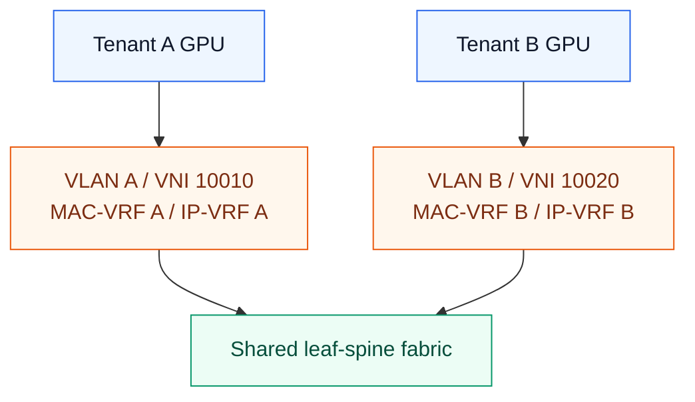

The chapter describes using RT-5 EVPN IP instances between rails and using route servers at the spine layer. Tenant routes are defined at the ToR/leaf, while spines provide EVPN route reflection or route-server behavior.

### Server-Level Multi-Tenancy

Server vendors may provide GPU-level partitioning. The chapter uses NVIDIA MIG, Multi-Instance GPU, as the example.

MIG can partition one physical GPU into multiple GPU instances. Each instance can be assigned to a different tenant or workload.

Example:

| Physical GPU | Tenant Mapping |
| --- | --- |
| MIG instance 1 | Tenant 1 |
| MIG instance 2 | Tenant 2 |
| MIG instance 3 | Tenant 3 |
| ... | ... |
| MIG instance 7 | Tenant 7 |

Inside the server, vGPU or MIG-level tenancy can be scheduled across servers with collective communication software such as NCCL or RCCL.

### Combining Server and Network Multi-Tenancy

Server-level and network-level tenancy can be combined.

Example:

- A server has seven MIG instances.
- Each MIG instance maps to a VLAN.
- The ToR leaf has seven MAC-VRFs and seven EVPN IP-level instances.
- Each tenant gets separate L2 tags, VNI, VRF, and routing policy.

This creates end-to-end tenant isolation from GPU instance to fabric path.

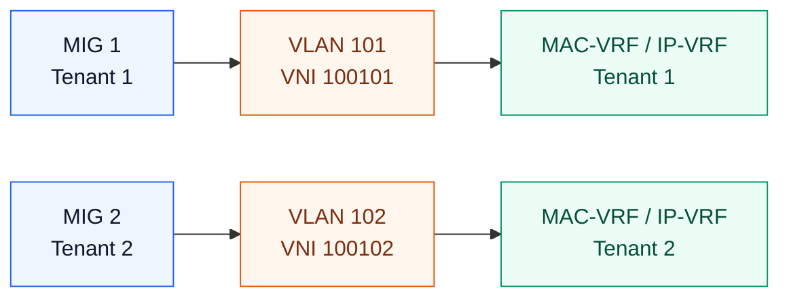

### Dynamic ACL-Based Multi-Tenancy

Another approach is dynamic ACLs on the ToR data plane, driven by a tenant profile from a system such as RADIUS.

Benefits:

- Centralized policy
- Potentially simpler than full EVPN-VXLAN in smaller designs
- Can apply tenant rules directly at the ToR

Limitations:

- TCAM scale can become a blocker.
- ACL complexity grows with tenant count.
- EVPN-VXLAN is usually more scalable for distributed tenant isolation.

---

## Extending IP Routing to the Server

The chapter also discusses extending routing to GPU servers.

Instead of treating servers as passive hosts, a GPU server can run a BGP stack and advertise prefixes to the fabric.

### Server-to-ToR eBGP

Use cases:

- Advertise service IPs from servers
- Advertise host routes or anycast services
- Improve failover through BGP withdraw
- Keep end-to-end routing protocol behavior consistent
- Avoid static host route models

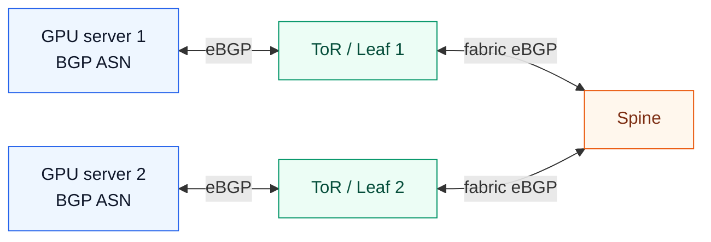

If a server-side service fails, the server can withdraw the prefix, and the fabric can stop forwarding traffic to it.

### Virtual BGP Route Reflector

At larger scale, having every server peer directly with every relevant fabric node may be too heavy.

A virtual appliance BGP route reflector can:

- Reduce peering count
- Centralize server route reflection
- Advertise server service prefixes into spines
- Provide a cleaner boundary between server routing and fabric routing

This is especially useful for service prefixes such as anycast IPs.

---

## Traffic Engineering and Telemetry

AI fabric traffic engineering can be distributed or controller-driven.

Distributed examples:

- ECMP
- DLB
- GLB
- BGP-DPF
- IS-IS FlexAlgo

For the GLB-specific use of BGP NNHN and forwarding-plane heartbeats, see [Appendix: BGP-based Underlay and GLB NNHN](../glb-nnhn-bgp-underlay/README.md).

Controller-driven examples:

- Controller receives fabric topology
- Controller receives telemetry
- Controller receives job scheduler intent
- Controller computes preferred GPU-to-GPU paths
- Controller pushes routing or policy updates

Telemetry inputs:

| Signal | Use |
| --- | --- |
| Link utilization | Avoid hot links |
| Queue occupancy | Detect congestion pressure |
| PFC/ECN counters | Detect lossless fabric stress |
| sFlow or sampled flow data | Identify traffic patterns |
| Egress BGP statistics | Understand route and next-hop use |
| Active probes | Measure end-to-end path quality |
| Job scheduler metadata | Map workload to fabric policy |

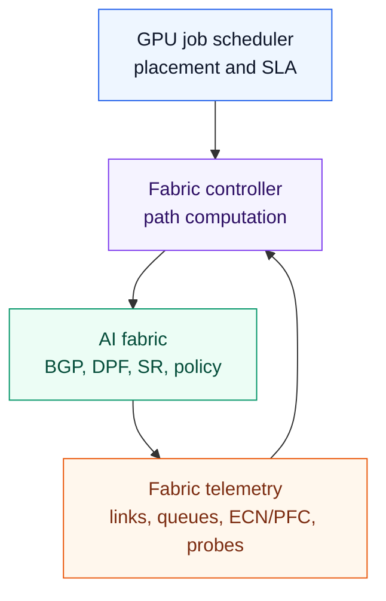

---

## Segment Routing and SRv6

Segment Routing, SR, is a source-routing architecture. The ingress node encodes path instructions in the packet, and transit nodes forward based on those instructions.

### Segment Routing Basics

Important terms:

| Term | Meaning |
| --- | --- |
| SR domain | Network where Segment Routing is enabled |
| Segment | A node, link, adjacency, or instruction |
| SID | Segment Identifier |
| Node SID | Identifier for a node |
| Adjacency SID | Identifier for a specific link or adjacency |
| Anycast SID | Shared identifier for a group of nodes |
| EPE SID | Egress Peer Engineering SID |
| SR path | Ordered list of segments from ingress to egress |


SR lets a controller compute an explicit path and install instructions at ingress rather than relying only on local ECMP choices at each hop.

### SR-MPLS vs. SRv6

| Data Plane | How It Encodes SIDs | Notes |
| --- | --- | --- |
| SR-MPLS | MPLS label stack | Common in service provider networks |
| SRv6 | IPv6 Segment Routing Header, SRH | Uses IPv6 extension header with segment list |

Control-plane information for Segment Routing can come from:

- IGP
- BGP-LS
- Controller topology database
- Path Computation Element Protocol, PCEP

### SRv6 Segment Routing Header

SRv6 uses an IPv6 extension header called the Segment Routing Header, SRH.

The SRH sits between IPv6 and upper-layer payload such as UDP/RoCEv2.

Conceptual packet:

```text
IPv6 header
SRH: segment list
UDP / RoCEv2 header
Payload
```

SRv6 SID structure can include:

| Part | Meaning |
| --- | --- |
| Locator | Identifies the node or location |
| Function | Encodes node, adjacency, or service behavior |
| Argument | Optional service or application metadata |

The chapter notes that SRv6 network programming lets the network encode a program of forwarding instructions into IPv6 packet headers.

### Compressed SID and uSID

Long SRv6 segment lists can increase packet overhead.

Compressed SID and micro-segment SRv6, uSID, reduce that overhead.

Key ideas:

- Normal SRv6 SID is 128 bits.
- uSID can encode micro-segments in smaller chunks, such as 16-bit micro-SIDs.
- uSID keeps the SRv6 programming model while reducing header size.
- This helps multi-domain or long-path deployments.

For AI fabrics, SRv6/uSID is interesting because it can support deterministic path placement, but it must still coexist with RoCEv2 lossless mechanisms such as DCQCN.

---

## Routing Protocol Comparison

| Characteristic | BGP | RIFT | IS-IS |
| --- | --- | --- | --- |
| IP Clos ECMP support | Yes | Yes | Yes |
| Dragonfly topology support | Limited | Yes | Limited |
| Multi-tenancy options | Strong with EVPN-VXLAN | Limited | Limited |
| Convergence speed | Medium | Fast | Fast |
| Link awareness | Low by default | High | High |
| Full topology awareness | Medium | High | Medium |
| Automatic disaggregation on failure | No | Yes | No |
| Fabric configuration metadata | Limited | Yes | Limited |
| Wide ECMP / UCMP | Yes with extensions | Yes | Limited |
| Policy control | High | Lower | Medium |
| Operational maturity in DC fabrics | High | Emerging | Medium |

Decision guidance:

| Requirement | Likely Fit |
| --- | --- |
| Cloud-style Clos with strong policy and EVPN | eBGP |
| Fat-tree optimized IGP with fast convergence | RIFT |
| Pure IP fabric with logical path algorithms | IS-IS FlexAlgo |
| Deterministic tenant/GPU/QP path coloring in BGP fabric | BGP-DPF |
| Explicit controller-computed paths | Segment Routing / SRv6 |
| Server anycast or service prefix advertisement | Server-to-ToR BGP |

---

## Operational Validation Checklist

Routing design should be validated as a workload-facing system, not only as a reachability graph.

Checklist:

- Confirm backend and frontend routing domains are intentionally separated or shared.
- Validate eBGP ASN allocation and AS-PATH loop prevention.
- Confirm BGP unnumbered peers exchange IPv4 NLRI with IPv6 link-local next hops.
- Test link failure convergence for leaf-spine and spine-super-spine paths.
- Verify ECMP width for GPU prefixes.
- Test BGP ADD-PATH behavior if route reflectors or path hiding are present.
- Validate BGP Link Bandwidth Extended Community and weighted ECMP behavior.
- Confirm minimum active peer policy for critical prefixes.
- Validate BGP-DPF color assignment for tenant, GPU, QP, or SLA traffic.
- Verify EVPN-VXLAN tenant route isolation with RT-2 and RT-5 routes.
- Test RIFT or IS-IS convergence if using IGP alternatives.
- Validate IS-IS FlexAlgo path constraints and fallback behavior.
- Confirm server-to-ToR BGP withdraw behavior for service failure.
- Validate controller-driven path updates against real telemetry.
- Test SRv6/uSID MTU and hardware forwarding support.
- Measure workload effects: NCCL latency, p99 iteration time, GPU utilization, and JCT.

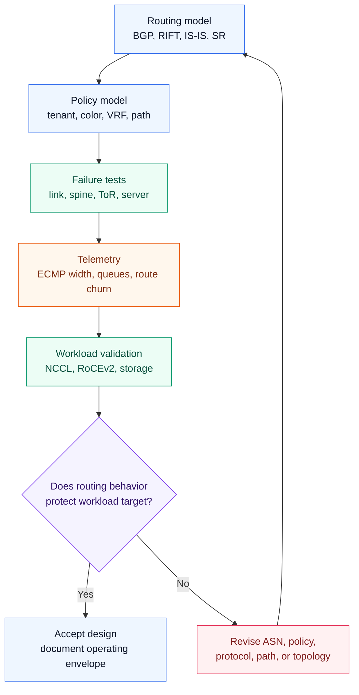

---

## Chapter Summary

AI data center routing must support reachability, convergence, path control, and tenant isolation at the same time.

The main takeaways:

- eBGP remains the most common underlay choice for three-stage and five-stage Clos AI fabrics.
- BGP unnumbered reduces per-link addressing and simplifies automation.
- ASN allocation matters because AS-PATH behavior can prevent loops or create suboptimal paths.
- BGP ADD-PATH and BGP Link Bandwidth Extended Community improve path diversity and weighted ECMP.
- BGP-DPF introduces deterministic logical fabric colors for tenant, GPU, QP, or SLA traffic.
- RIFT is designed for fat-tree fabrics and can also support Dragonfly-style topology awareness.
- IS-IS Optimal Distributed Flooding improves convergence in dense fabrics.
- IS-IS FlexAlgo can create logical routing planes using bandwidth, latency, or congestion constraints.
- EVPN-VXLAN, VRFs, MIG, and dynamic ACLs are different tools for AI multi-tenancy.
- Extending BGP to servers enables anycast and service prefix advertisement directly from GPU hosts.
- Segment Routing and SRv6 provide explicit path programming, especially with controller-driven traffic engineering.
- No routing protocol is universally best; the right answer depends on topology, scale, vendor support, operations, and workload goals.

---

## Key Terms

| Term | Meaning |
| --- | --- |
| eBGP | External Border Gateway Protocol |
| BGP unnumbered | BGP peering using IPv6 link-local addresses instead of numbered IPv4 point-to-point links |
| RFC 5549 | Advertising IPv4 NLRI with IPv6 next hop |
| ASN | Autonomous System Number |
| AS-PATH | BGP path attribute listing ASNs traversed |
| ADD-PATH | BGP capability to advertise multiple paths for a prefix |
| BGP Link Bandwidth Extended Community | BGP community carrying bandwidth for weighted ECMP |
| DPF | Deterministic Path Forwarding |
| Fabric color | Logical fabric or path group used for deterministic forwarding |
| RIFT | Routing in Fat Trees |
| UCMP | Unequal-Cost Multipathing |
| IS-IS | Intermediate System to Intermediate System |
| FlexAlgo | IS-IS flexible algorithm for constraint-based logical topologies |
| FAD | Flexible Algorithm Definition |
| EVPN | Ethernet VPN control plane |
| VXLAN | Overlay encapsulation using VNI identifiers |
| VNI | VXLAN Network Identifier |
| MAC-VRF | Layer 2 tenant forwarding instance |
| IP-VRF | Layer 3 tenant routing instance |
| RT-2 | EVPN MAC/IP route type |
| RT-5 | EVPN IP prefix route type |
| MIG | Multi-Instance GPU |
| SR | Segment Routing |
| SID | Segment Identifier |
| SRH | Segment Routing Header |
| SRv6 | Segment Routing over IPv6 |
| uSID | Micro-segment SRv6 |

## Q&A

### 1. Why is BGP widely adopted for routing in large-scale AI data center fabrics?

BGP is widely adopted because it scales well, has strong policy control, works across vendors, and has built-in loop prevention through AS-PATH.

In AI fabrics, eBGP is commonly used with unique ASNs per leaf or rack and shared ASNs at spine layers. BGP unnumbered simplifies leaf-spine peering by using IPv6 link-local addresses, while route policies control prefix advertisement, filtering, maintenance, and tenant behavior.

### 2. What does BGP unnumbered solve?

BGP unnumbered removes the need to assign IPv4 point-to-point addresses to every leaf-spine link.

The fabric uses IPv6 link-local addresses for BGP neighbor discovery and session establishment. IPv4 server prefixes can still be advertised, but the next hop is an IPv6 link-local address. This is useful in AI fabrics because the number of physical links can be very large.

### 3. Why does ASN allocation matter in eBGP Clos fabrics?

ASN allocation determines how AS-PATH loop prevention behaves. If spines share an ASN and leaves use unique ASNs, BGP can reject routes that would loop through the same AS. This can also help prevent suboptimal forwarding after failures.

Poor ASN design can make troubleshooting harder or allow unexpected backup paths with bad performance.

### 4. How does BGP-DPF help AI workloads?

BGP-DPF divides one physical fabric into logical colored fabrics. Traffic can be mapped to a color based on tenant, GPU ID, QP range, or SLA.

This gives deterministic path selection. It can isolate elephant flows, keep tenant traffic predictable, and align overlay tenants with underlay path colors.

### 5. What are RIFT's advantages in AI fabrics?

RIFT is designed for fat-tree and Clos-style topologies. It provides fast convergence, topology awareness, wide ECMP, UCMP, and automatic disaggregation on failures.

It can be attractive when BGP policy is less important than topology-native convergence and fabric awareness. Its main trade-off is maturity and operational familiarity compared with eBGP.

### 6. How does IS-IS FlexAlgo support workload isolation?

IS-IS FlexAlgo computes multiple logical topologies over the same physical fabric. Each algorithm can use different constraints such as latency, bandwidth, or congestion.

This lets one workload use a low-latency plane, another use a high-bandwidth plane, and another use a low-congestion plane. It is similar in spirit to BGP-DPF, but implemented through link-state TLVs and FADs.

### 7. How does multi-tenancy affect AI routing?

Multi-tenancy requires segmentation and policy at multiple layers. A tenant may need isolated GPU instances, isolated VLAN/VNI mappings, separate MAC-VRF/IP-VRF instances, and separate EVPN routes.

BGP-EVPN is commonly used because it can signal tenant MAC/IP and prefix routes at scale. Server-level features such as MIG can be combined with network-level EVPN-VXLAN to provide end-to-end GPU tenant isolation.

### 8. Why extend IP routing to GPU servers?

Server-to-ToR BGP lets GPU servers advertise service prefixes or anycast addresses directly into the fabric. If a service fails, the server can withdraw the prefix.

This makes routing more dynamic and can simplify anycast service design, but it adds operational responsibility to the server side and may require route reflectors at scale.

### 9. What role does telemetry play in routing and traffic engineering?

Telemetry gives routing controllers and operators the data needed to make path decisions. Useful signals include link utilization, queue occupancy, ECN/PFC counters, active probes, sFlow, and job scheduler placement.

Without telemetry, traffic engineering becomes static policy. With telemetry, the fabric can adapt paths to real workload and congestion state.

### 10. How does Segment Routing or SRv6 help AI fabrics?

Segment Routing lets an ingress node encode a path into the packet. With a controller, GPU-to-GPU paths can be computed to avoid congestion or satisfy SLA goals.

SRv6 carries path instructions in an IPv6 Segment Routing Header. uSID reduces header overhead by using compact micro-segments. The trade-off is that SRv6 requires hardware support, MTU planning, and careful integration with RoCEv2 lossless mechanisms such as DCQCN.

## References

- [RFC 7938, Use of BGP for Routing in Large-Scale Data Centers](https://www.rfc-editor.org/rfc/rfc7938.html)
- [RFC 5549, Advertising IPv4 NLRI with an IPv6 Next Hop](https://www.rfc-editor.org/rfc/rfc5549.html)
- [RFC 9692, RIFT: Routing in Fat Trees](https://www.rfc-editor.org/rfc/rfc9692.html)
- [RFC 9350, IGP Flexible Algorithm](https://www.rfc-editor.org/rfc/rfc9350.html)
- [RFC 9502, IGP Flexible Algorithm in IP Networks](https://www.rfc-editor.org/rfc/rfc9502.html)
- [RFC 8754, IPv6 Segment Routing Header](https://www.rfc-editor.org/rfc/rfc8754.html)
- [RFC 8986, Segment Routing over IPv6 Network Programming](https://www.rfc-editor.org/rfc/rfc8986.html)
- [IETF draft-wang-idr-dpf, BGP Deterministic Path Forwarding](https://datatracker.ietf.org/doc/html/draft-wang-idr-dpf-00)
