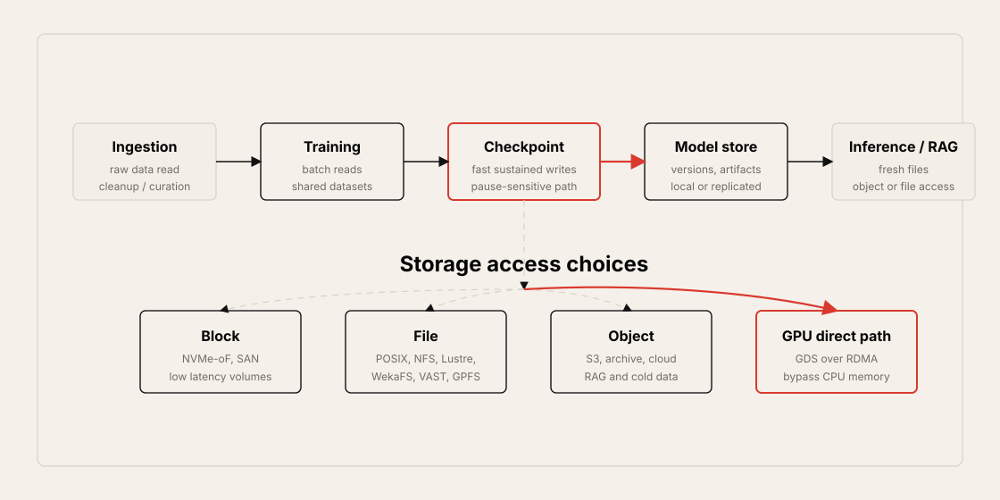
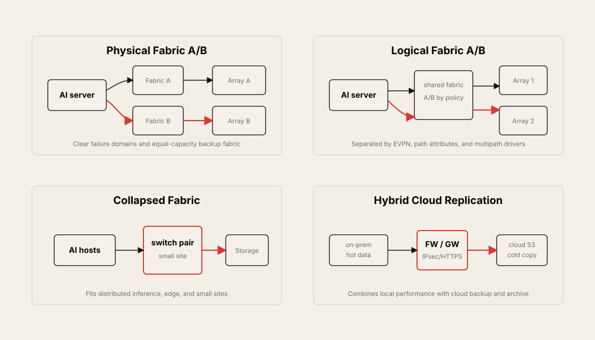
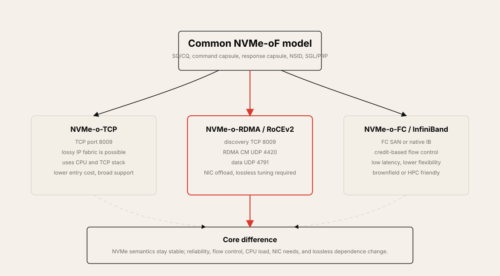
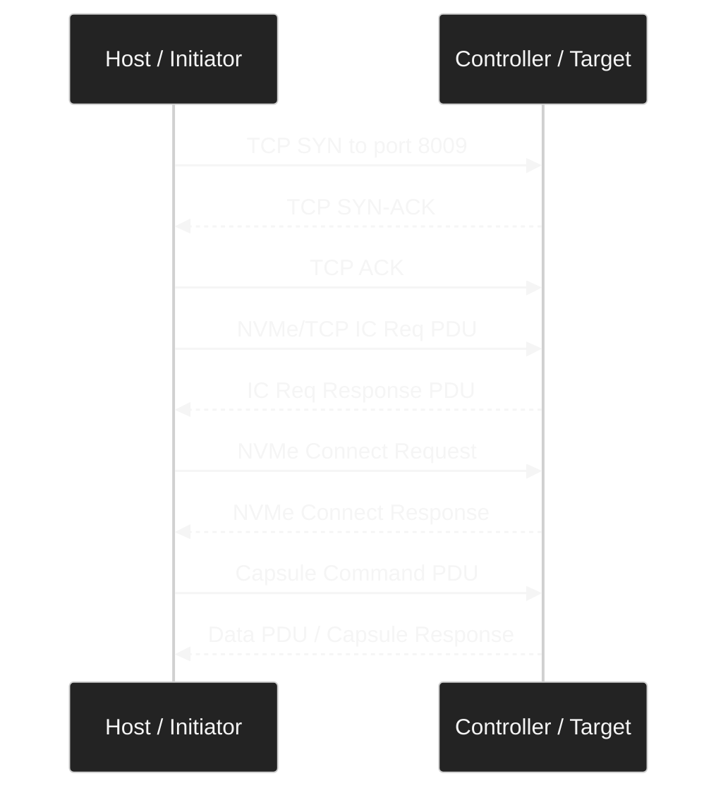
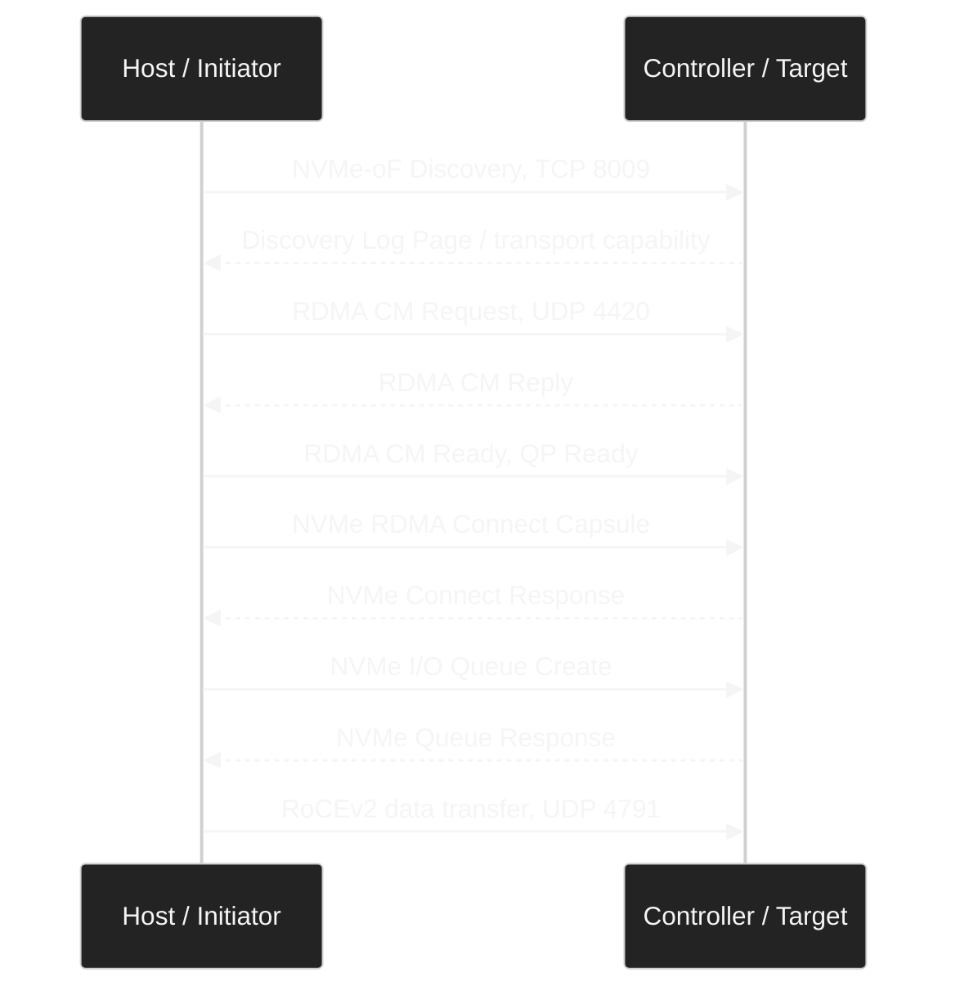
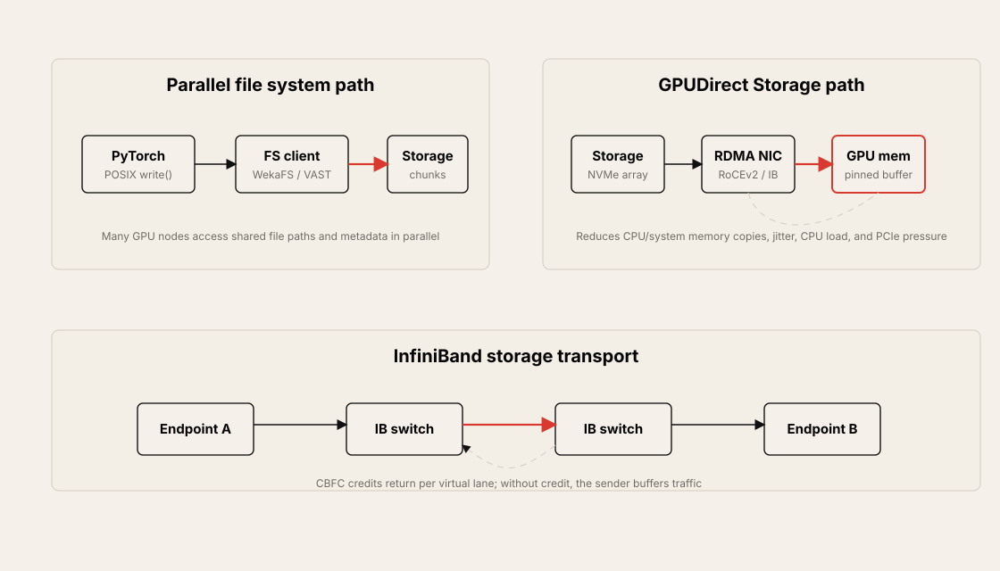
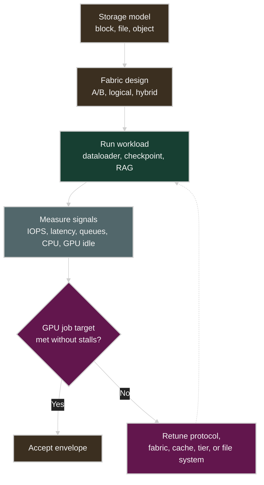

# Chapter 9: Storage Network Design and Technologies for AI Data Centers

## Table of Contents

- [Goal](#goal)
- [Why Storage Matters in AI/ML Fabrics](#why-storage-matters-in-aiml-fabrics)
  - [Training Lifecycle and Storage Requirements](#training-lifecycle-and-storage-requirements)
  - [Local PCIe Storage and Network Storage](#local-pcie-storage-and-network-storage)
  - [Training Network and Storage Network](#training-network-and-storage-network)
- [Storage Network Design Types](#storage-network-design-types)
  - [Physical Fabric A/B](#physical-fabric-ab)
  - [Logical Fabric A/B](#logical-fabric-ab)
  - [Collapsed Fabric A/B](#collapsed-fabric-ab)
  - [Hybrid Cloud Redundancy and Replication](#hybrid-cloud-redundancy-and-replication)
- [Block, File, Object Storage](#block-file-object-storage)
- [NVMe-oF for Block-Level Access](#nvme-of-for-block-level-access)
  - [NVMe-o-TCP](#nvme-o-tcp)
  - [NVMe-o-RDMA and RoCEv2](#nvme-o-rdma-and-rocev2)
  - [NVMe-o-FC and InfiniBand](#nvme-o-fc-and-infiniband)
  - [NVMe-o-TCP and NVMe-o-RDMA Comparison](#nvme-o-tcp-and-nvme-o-rdma-comparison)
- [High-Performance Parallel File System](#high-performance-parallel-file-system)
  - [POSIX Semantics](#posix-semantics)
  - [Hot Data and Cold Data](#hot-data-and-cold-data)
  - [WekaFS, VAST, Lustre, GPFS, BeeGFS](#wekafs-vast-lustre-gpfs-beegfs)
- [GPUDirect Storage](#gpudirect-storage)
- [InfiniBand for Storage](#infiniband-for-storage)
  - [LID, BTH, QPair](#lid-bth-qpair)
  - [Virtual Lane and Credit-Based Flow Control](#virtual-lane-and-credit-based-flow-control)
  - [InfiniBand and RoCEv2 Comparison](#infiniband-and-rocev2-comparison)
- [Storage Network Option Comparison](#storage-network-option-comparison)
- [Operational Validation Checklist](#operational-validation-checklist)
- [Chapter Summary](#chapter-summary)
- [Key Terms](#key-terms)
- [Q&A](#qa)
- [References](#references)

## Goal

This chapter explains why storage networking is a separate design topic in AI data centers.

The core idea is:

> An AI storage network is not just a path for saving data. It is a performance path that affects GPU utilization and Job Completion Time across data preparation, training reads, checkpoint writes, model storage, inference/RAG, backup, and replication.

The chapter focuses on these topics:

- Where storage fits in the AI training lifecycle
- Differences between local PCIe SSD and network-attached storage
- Separation between the training network and the storage network
- Physical Fabric A/B, Logical Fabric A/B, collapsed fabric, and hybrid cloud replication
- Differences between block, file, and object storage
- NVMe over Fabrics, NVMe-o-TCP, NVMe-o-RDMA/RoCEv2, and NVMe-o-FC
- NVMe-o-TCP state machine, capsules, PDUs, namespaces, and SGL/PRP
- NVMe-o-RDMA over RoCEv2 session establishment and data packet format
- Parallel file systems such as Lustre, GPFS, BeeGFS, WekaFS, and VAST
- GPUDirect Storage, CUDA/cuFile, and GPU memory pinning
- InfiniBand storage, LID, virtual lanes, and credit-based flow control



## Why Storage Matters in AI/ML Fabrics

The bottleneck in an AI data center is not determined only by GPU compute. Even if the GPUs are fast, cluster efficiency drops when data arrives late or checkpoint writes pause training.

Storage directly affects GPU utilization in these paths:

- Training data ingestion
- Data cleanup and curation
- Batch reads during training
- Checkpoint writes
- Model artifact storage
- Fresh data access for inference services
- Document retrieval for RAG and agentic RAG
- Snapshots, backups, and inter-site replication

Checkpointing is both a training safety mechanism and a pause source. If checkpoint writes are slow, GPUs cannot move to the next step and become idle. When this repeats, step time, p99 iteration latency, Job Completion Time, and hardware utilization all degrade.

### Training Lifecycle and Storage Requirements

Each phase of the AI lifecycle needs different storage behavior.

| Phase | Main Operation | Storage Requirement |
| --- | --- | --- |
| Data ingestion | Collect internal or external source data | Large capacity, stable sequential read/write |
| Processing and curation | Cleanup, transformation, deduplication | Metadata handling, random read/write, pipeline parallelism |
| Training | GPU batch reads | High aggregate read bandwidth, low tail latency |
| Checkpoint | Save model state | Fast sustained write, minimal pause |
| Model storage | Store artifacts, versions, and weights | Durability, version management, replication |
| Inference/RAG | Access fresh files, documents, and embeddings | Random read, object/file APIs, geographic proximity |
| Backup/archive | Store cold data | Cost efficiency, cloud/object tier, long-term retention |

From an operations perspective, "Is the storage fast enough?" is too vague. Better questions are:

- Are batch reads blocking the dataloader?
- Does GPU idle time increase during checkpoint writes?
- Are hot data and cold data mixed in the same system?
- Is the metadata server or namespace the bottleneck?
- Is the bottleneck the storage NIC, PCIe bus, CPU, or system memory?
- How does the tuning responsibility change when the storage transport is TCP versus RDMA?

### Local PCIe Storage and Network Storage

Local PCIe SSD is storage directly attached to the server's internal PCIe bus. It has very low latency and is simple, but it has weak sharing and scaling properties for large training clusters.

Network-connected storage reaches remote SSD/HDD arrays or storage clusters through a dedicated storage NIC or HBA. It adds network hops and protocol overhead compared with local PCIe, but it enables capacity scaling, redundancy, shared access, and centralized operations.

| Item | Local PCIe SSD | Network Storage |
| --- | --- | --- |
| Location | Inside the GPU server | Remote storage array or storage node |
| Strength | Very low latency, simple failure scope | Capacity expansion, shared access, replication, centralized operations |
| Weakness | Server-local capacity limit, hard to share | Fabric, NIC, and protocol tuning required |
| AI fit | Cache, scratch, small jobs | Large datasets, checkpoints, shared namespace |

The source chapter explains that even though server-internal buses such as PCIe Gen5 and Gen6 provide very high bandwidth, large AI clusters still need remote storage attached through a network. Large LLM training cannot usually satisfy dataset and checkpoint requirements with only per-server local SSDs.

### Training Network and Storage Network

AI servers usually participate in multiple network paths.

| Network | Main Traffic | Common Requirement |
| --- | --- | --- |
| Training network | GPU-to-GPU, AllReduce, model weight exchange | Ultra-low latency, RoCEv2/InfiniBand, congestion control |
| Storage network | Dataset reads, checkpoint writes, model storage | High read/write throughput, path redundancy, storage protocol tuning |
| Frontend network | User/API, control, management | EVPN-VXLAN, tenant/service routing |

Storage NICs commonly need at least 100G or 200G links. High-performance environments may also use 400G or 800G. Bandwidth is not the only issue. Checkpoint write patterns, dataloader read patterns, metadata load, file-system semantics, and storage transport all affect training efficiency.

## Storage Network Design Types

The common requirement for storage network design is stability. Performance matters, but an unstable storage path can cause training job restarts, checkpoint corruption, and data pipeline delays.

The source chapter describes several redundancy designs.



### Physical Fabric A/B

Physical Fabric A/B connects storage NIC A and storage NIC B to separate physical fabrics. Storage arrays are also separated into A and B sides.

Benefits:

- Failure domains are clear.
- Fabric B can provide the same capacity when Fabric A fails.
- The model fits enterprise storage operations.
- Capacity planning is straightforward.

Trade-offs:

- Cost is high.
- Hardware and cabling are close to doubled.
- Capacity symmetry between the two fabrics must be maintained.

This design fits environments where the backup path must provide the same IOPS, bandwidth, and latency as the production path. The goal is not just a live failover link; it is failover that preserves training performance.

### Logical Fabric A/B

Logical Fabric A/B separates A and B logical paths over one physical fabric using mechanisms such as path attributes, overlays, multipath drivers, EVPN-VXLAN, and MAC-VRFs.

Examples:

- Storage NIC driver multipath
- IP fabric path attributes
- EVPN-VXLAN overlay
- Route Target-based EVPN instance separation
- MAC-VRF or IP-VRF-based tenant and storage-domain separation

The advantage is cost and flexibility. Logical separation can be built without fully duplicating physical equipment. The downside is that the failure domain is not fully independent at the physical layer. If policy and telemetry are wrong, A and B paths may still share the same real bottleneck.

### Collapsed Fabric A/B

Collapsed Fabric is suitable for small inference edges, small remote sites, or distributed storage use cases. Servers and storage targets attach to the same switch pair or small fabric.

Benefits:

- Fewer devices are needed.
- Deployment and operations are simpler.
- It fits geographically distributed inference sites.

Warnings:

- Redundancy and capacity are limited.
- If long-distance replication is required, deep-buffer switches or TCP-based transport may be a better fit.
- Maintaining lossless RDMA over distances such as 40 km or more is difficult.

### Hybrid Cloud Redundancy and Replication

A hybrid design uses on-prem storage and cloud/object storage together. Hot data and checkpoints stay in local high-performance storage during training, while snapshots, archives, and cold data are sent to cloud object storage.

Common properties:

- On-prem high-performance file system or NVMe storage
- Cloud S3 or object storage tier
- Firewall cluster or DC gateway path
- IPsec or HTTPS security tunnel
- Possible redundant backup through more than one cloud provider

For inference and RAG, fresh data may need to be close to users. In that case, the combination of cloud/object storage with local cache or a distributed file system becomes important.

## Block, File, Object Storage

AI data centers can use block, file, and object storage. This distinction is not tied 1:1 to the network transport. For example, block storage can run over Ethernet/IP, Fibre Channel, or InfiniBand. File storage can also use Ethernet/IP or RDMA transport.

| Type | Access Model | Representative Technology | AI Data Center Use |
| --- | --- | --- | --- |
| Block storage | Fixed-size block, volume | NVMe-oF, SAN, NVMe-o-TCP, NVMe-o-RDMA | Low-latency volume, checkpoint, hot block storage |
| File storage | File and directory namespace | NFS, pNFS, Lustre, GPFS, BeeGFS, WekaFS, VAST | Shared dataset, POSIX workload, training/inference |
| Object storage | Object plus metadata API | S3-compatible storage, cloud object storage | Archive, backup, RAG corpus, cold data |

Block storage is strong for high-performance I/O and low latency. However, it is different from the model that uses an OS page cache or POSIX file semantics.

File storage fits ML frameworks well because PyTorch and TensorFlow commonly use Linux file APIs and POSIX semantics such as `open()`, `read()`, `write()`, `stat()`, and `unlink()`.

Object storage is strong for cost-effective scale and cloud integration. It is usually not used directly in the training hot path because of latency and API behavior. It is commonly paired with tiering, cache, data movers, or a unified namespace.

## NVMe-oF for Block-Level Access

NVMe over Fabrics, NVMe-oF, extends the NVMe queue model and command semantics over a network fabric.

Key points:

- NVMe base semantics are preserved.
- Only the transport changes: TCP, RDMA/RoCEv2, InfiniBand, Fibre Channel, and so on.
- The host places commands in a Submission Queue, SQ.
- The controller target returns completions through a Completion Queue, CQ.
- NVMe-oF uses command capsules and response capsules.
- Namespace, NSID, is the logical block unit that the target presents to the host.
- PRP or SGL describes the host memory buffer location.



### NVMe-o-TCP

NVMe-o-TCP carries NVMe-oF over TCP/IP. It commonly uses TCP destination port `8009`.

Benefits:

- It runs on ordinary Ethernet/IP fabrics.
- A lossless fabric is not required.
- NIC requirements are lower, and it is cost competitive.
- It fits existing IP routing, BGP, IGP, firewall, and telemetry models.
- It can use multi-core CPUs and the TCP stack to produce high IOPS.

Trade-offs:

- CPU involvement is higher than with RDMA.
- Latency may be higher than NVMe-o-RDMA or InfiniBand.
- Host CPU, TCP stack, socket API, and queue-depth tuning matter.

NVMe-o-TCP session establishment follows this basic flow:



In a read operation, the host places read opcode `0x02`, NSID, command ID, data length, and SGL/PRP information into the command capsule. The target sends controller-to-host data, C2HData PDUs, and then returns a completion response.

In a write operation, in-capsule writes and off-capsule writes are possible. An in-capsule write carries data inside the command capsule payload. An off-capsule write can be better for larger data transfers and out-of-order write operations.

### NVMe-o-RDMA and RoCEv2

NVMe-o-RDMA uses RDMA transport instead of TCP. In Ethernet environments, RoCEv2 is the common option.

The flow is:

1. NVMe-oF discovery uses TCP `8009`.
2. RDMA Connection Management uses UDP `4420` with RoCEv2.
3. The QP enters Ready to Send, RTS, state.
4. NVMe RDMA Connect Capsules are exchanged.
5. NVMe I/O Queues are created.
6. Actual RoCEv2 data transfer carries NVMe capsules and data over UDP `4791`.



Benefits of NVMe-o-RDMA/RoCEv2:

- CPU load is lower because of NIC/RDMA offload.
- Ramp-up and write latency can be better.
- It fits hot data, low-latency block access, and GPUDirect Storage.

Warnings:

- It is UDP-based, so it has no native TCP flow control.
- Reliable RDMA behavior depends on the NIC/RDMA state machine and the lossless fabric.
- PFC, ECN, DCQCN, queue depth, and buffer utilization tuning are required.
- Do not assume the storage RoCEv2 fabric should use the same DCQCN values as the training RoCEv2 fabric.

An NVMe-o-RDMA over RoCEv2 packet conceptually has this structure:

```text
Ethernet
IP
UDP dst 4791
RoCEv2 BTH
IB / RDMA layer
NVMe command: QID, NSID, Command ID, SGL
Data
```

RoCEv2 BTH carries QPair information, while the NVMe command carries namespace and memory descriptor information. The NVMe I/O SQ/CQ pair maps 1:1 to an RDMA QPair. The chapter notes that multiplexing multiple I/O SQ/CQ pairs onto one QPair is not supported for NVMe-o-RDMA over RoCEv2.

### NVMe-o-FC and InfiniBand

NVMe-o-FC can use existing Fibre Channel SANs. It is attractive in brownfield enterprise storage environments. It can use FC lossless behavior, zoning, and mature SAN operations, but cost and scaling flexibility may be limited in greenfield AI data centers.

InfiniBand can also be used as an NVMe-o-RDMA transport. Native InfiniBand provides low latency, credit-based flow control, lightweight encapsulation, and Subnet Manager-based address allocation. Compared with Ethernet/IP, it can be more limited in vendor ecosystem, network virtualization, multi-tenancy, and troubleshooting flexibility.

### NVMe-o-TCP and NVMe-o-RDMA Comparison

| Item | NVMe-o-TCP | NVMe-o-RDMA / RoCEv2 |
| --- | --- | --- |
| Transport | TCP/IP | UDP/IP + RoCEv2/RDMA |
| Fabric requirement | Lossy IP is possible | Lossless or near-lossless tuning required |
| CPU load | Relatively higher | Lower through NIC/RDMA offload |
| Latency | Medium | Low |
| Operational difficulty | Lower | Higher |
| Main tuning | TCP, MTU, CPU cores, queue/thread | PFC, ECN, DCQCN, queue depth, buffer |
| Best fit | Cold/warm storage, general IP storage | Hot block storage, low latency, GDS |

The practical decision is not simply "RDMA is faster." RDMA is fast, but it requires lossless fabric and NIC tuning. TCP uses more CPU, but it scales more easily on ordinary IP fabrics.

## High-Performance Parallel File System

For AI training, a 1:1 block session between one host and one controller is often not enough. Many GPU servers need to see the same dataset path while reading, writing, and sharing metadata at the same time.

This is where parallel file systems matter.

Representative examples:

- Lustre
- IBM GPFS / Spectrum Scale
- BeeGFS
- WekaFS
- VAST



### POSIX Semantics

ML frameworks such as PyTorch and TensorFlow commonly use POSIX file APIs.

Examples:

- `open()`
- `read()`
- `write()`
- `mkdir()`
- `unlink()`
- `stat()`

PyTorch can create serialized files such as `.pt`, `.npy`, `.ckpt`, `.h5`, and `.bin`. From the framework's view, this is a normal file write. Behind the file interface, the storage system can map it to parallel chunks, metadata, RDMA transport, local NVMe, or a cloud S3 tier.

Benefits of parallel file systems:

- Many clients access the same namespace.
- Data and metadata are distributed across storage nodes.
- Aggregate bandwidth and IOPS increase.
- Training datasets and checkpoints can use the same namespace.
- It is easier to connect an on-prem hot tier with a cloud cold tier.

### Hot Data and Cold Data

AI storage should separate hot data and cold data.

| Type | Location | Examples |
| --- | --- | --- |
| Hot data | On-prem NVMe/flash, backend storage fabric | Active dataset, training checkpoint, scratch |
| Cold data | Cloud object storage, S3, archive tier | Old checkpoint, raw archive, backup, RAG corpus |

Hot data needs latency, throughput, and metadata speed. Cold data needs cost efficiency, durability, replication, and access control.

Systems such as WekaFS can combine Tier 1 local RDMA storage with Tier 2 S3 object storage. The application uses POSIX file APIs, and the storage system handles hot/cold placement and tiering.

### WekaFS, VAST, Lustre, GPFS, BeeGFS

The source chapter uses WekaFS as an example, where a storage client can reach local storage nodes through RoCEv2 or InfiniBand transport and then move cold data to a cloud S3 tier.

From an operations perspective, PoC testing should separate these workloads:

| Test | Meaning |
| --- | --- |
| Sequential read | Dataloader reads large shards sequentially |
| Random read | Small files and metadata-heavy access |
| Multi-file random read | Many workers access shards or files at the same time |
| Sequential write | Checkpoint write |
| Random write | Metadata, shard update, mixed workload |
| Small file metadata test | Namespace and metadata-server bottleneck |

The actual impact on the training job matters more than a simple benchmark number. Storage benchmarks may look good while GPU utilization still drops because of dataloader workers, CPU, PCIe, NIC queues, or metadata locks.

## GPUDirect Storage

GPUDirect Storage, GDS, is an NVIDIA technology that reduces CPU and system-memory copies in the data movement path between GPU memory and storage devices.

Conventional path:

```text
Storage -> NIC -> system memory -> CPU involvement -> GPU memory
```

GDS path:

```text
Storage -> RDMA/NIC -> GPU memory
```

GDS reduces:

- CPU load
- System memory bandwidth pressure
- PCIe bus contention
- Intermediate copies
- Jitter
- Competing connection overhead

GDS integrates with CUDA APIs. An application or library can allocate and pin GPU memory buffers through flows such as `cudaMalloc()` and `cuFileBufRegister()`. Memory pinning fixes the physical address mapping used by DMA/RDMA.

Important practical points:

- GDS is better understood as a data path between storage and GPU memory, not just a storage product name.
- It fits RoCEv2 or InfiniBand RDMA transport.
- Each parallel file system vendor may integrate with GDS differently.
- The effect may be limited in small clusters, but CPU and memory cost reduction can matter significantly in clusters with 100,000 GPUs or more.

## InfiniBand for Storage

InfiniBand is a low-latency transport long used in HPC and AI clusters. It can also be used for storage as an NVMe-o-RDMA transport or as part of a GPUDirect Storage path.

Properties:

- Lightweight encapsulation
- Requires InfiniBand switches and HCAs/NICs
- Subnet Manager assigns LIDs
- Link-level credit-based flow control
- Virtual lane-based QoS
- Uses BTH and QPair concepts, like RoCEv2

### LID, BTH, QPair

InfiniBand addressing uses LID, Local Identifier.

| Field | Role |
| --- | --- |
| LRH | Local Routing Header, includes S-LID/D-LID |
| GRH | Global Routing Header, used for routing between subnets |
| BTH | Base Transport Header, opcode and destination QPair |
| ETH | Extended Transport Header |
| Payload | NVMe capsule or RDMA data |
| ICRC/VCRC | Integrity checks |

The Subnet Manager assigns a 16-bit LID to endpoints. Switches forward based on the destination LID. GRH may be absent inside the same subnet.

In a storage context, NVMe command capsules, response capsules, and SGL information can be carried in the InfiniBand payload. QPair values connect to NVMe SQEs and CQEs.

### Virtual Lane and Credit-Based Flow Control

InfiniBand QoS uses Virtual Lanes, VLs. A physical link can carry several logical lanes, and each lane can have independent queueing and flow-control behavior.

Credit-Based Flow Control, CBFC, works like this:

1. The receiver or next-hop switch tells the sender how much buffer credit is available.
2. The sender transmits on that VL only when sufficient credit exists.
3. If there is no credit, the sender keeps the packet in its buffer.
4. A credit usually represents capacity at a segment or 64-byte granularity.

CBFC has a similar goal to Ethernet PFC, but the mechanism differs.

| Item | InfiniBand CBFC | Ethernet PFC |
| --- | --- | --- |
| Mechanism | Credit-based | Pause-frame-based |
| Unit | Segment, per-VL | Priority class |
| Sender behavior | Does not transmit without credit | Stops class transmission after pause |
| Strength | Native lossless behavior | Fits Ethernet/IP ecosystem |
| Risk | Latency increase when credit is exhausted | HOL blocking, PFC storm |

### InfiniBand and RoCEv2 Comparison

| Item | InfiniBand | Ethernet/RoCEv2 |
| --- | --- | --- |
| Transport | Native IB | Ethernet/IP/UDP + IB BTH |
| Addressing | LID, Subnet Manager | MAC/IP, routing protocol |
| Flow control | CBFC, VL | PFC, ECN, DCQCN |
| Multi-tenancy | Limited | Rich options such as EVPN-VXLAN and VRF |
| Vendor ecosystem | Limited | Broad |
| Operational visibility | Can feel like a black box | Can use IP/Ethernet telemetry |
| Strength | Ultra-low latency, HPC friendly | Scale, cost, vendor diversity, programmability |

The source chapter explains that InfiniBand remains important as a high-performance storage and training transport, but Ethernet/RoCEv2 is also a strong option for large-scale AI data centers because of cost, scale, and operational flexibility.

## Storage Network Option Comparison

| Option | Inference | Training | Ultra-low latency | File access | Block access | Ethernet/IP | Lossless required | Operational flexibility |
| --- | --- | --- | --- | --- | --- | --- | --- | --- |
| pNFS / parallel file system | Good | Good | Medium | Yes | No | Yes | Usually no | High |
| NVMe-o-TCP | Good | Limited | Medium | No | Yes | Yes | No | High |
| NVMe-o-RDMA / RoCEv2 | Good | Good | High | No | Yes | Yes | Yes | Medium |
| InfiniBand | Limited | Good | High | Some systems | Yes | No | Native lossless | Low |
| Object / S3 | Good | Poor fit for hot path | Low | API-based | No | Yes | No | High |

Selection depends on workload phase and I/O pattern.

| Condition | First Option to Evaluate |
| --- | --- |
| Many GPUs read the same dataset path | Parallel file system |
| Checkpoint writes create training pauses | Fast file system, NVMe-oF, GDS |
| Ordinary IP fabric and cost efficiency matter | NVMe-o-TCP |
| CPU load and latency are critical | NVMe-o-RDMA/RoCEv2 or InfiniBand |
| Cloud archive and RAG corpus | Object storage / S3 |
| Brownfield FC SAN exists | NVMe-o-FC |
| NVIDIA GPU memory direct path is required | GPUDirect Storage |

## Operational Validation Checklist

Storage networks must be validated with both synthetic benchmarks and real training workloads.

Checklist:

- Confirm the training network and storage network are intentionally separated.
- Confirm storage NIC speed, PCIe generation, and PCIe lane width.
- Measure checkpoint write time together with GPU idle time.
- Change dataloader worker counts to find read bottlenecks.
- Measure sequential read/write and random read/write separately.
- Run a separate small-file metadata workload.
- Check p99 and p999 storage latency.
- Verify whether bandwidth and latency are preserved during storage fabric A/B failover.
- Confirm logical A/B separation does not share the same real physical bottleneck.
- For NVMe-o-TCP, check CPU cores, TCP retransmissions, MTU, queue depth, and threads.
- For NVMe-o-RDMA/RoCEv2, check PFC, ECN, DCQCN, queue depth, and buffer occupancy.
- Validate the RDMA storage fabric DCQCN profile separately from the training fabric.
- When using GDS, confirm CPU and system-memory copies actually decrease.
- For parallel file systems, validate data/metadata distribution and node-failure behavior.
- For hybrid cloud tiers, validate bandwidth, consistency, security tunnels, and restore time.
- Record job-level metrics: GPU utilization, p99 step time, checkpoint pause, and Job Completion Time.



## Chapter Summary

The main takeaways:

- AI data center storage is directly connected to training performance.
- Slow checkpoint writes increase GPU idle time and Job Completion Time.
- Local PCIe SSD is fast, but it is limited as large-scale shared training storage.
- Network storage provides scale, sharing, and redundancy, but fabric and protocol tuning are required.
- The storage network is often designed separately from the training network.
- Physical Fabric A/B provides strong separation but costs more.
- Logical Fabric A/B improves cost and flexibility, but real path diversity must be verified.
- Hybrid cloud replication connects on-prem hot data with cloud cold data.
- Block storage fits low-latency volume access such as NVMe-oF.
- File storage fits AI frameworks because of POSIX semantics and shared namespaces.
- Object storage fits archive, backup, RAG, and cloud tiers.
- NVMe-o-TCP scales easily on ordinary IP fabrics, but it uses CPU and the TCP stack.
- NVMe-o-RDMA/RoCEv2 provides low latency and CPU offload, but requires lossless tuning.
- Parallel file systems solve concurrent file access and metadata scaling across many GPU nodes.
- GPUDirect Storage reduces copies between storage and GPU memory.
- InfiniBand provides native low latency and credit-based flow control, but operational flexibility may be lower than Ethernet.

## Key Terms

| Term | Meaning |
| --- | --- |
| Storage network | Dedicated network or fabric used to access storage outside the server |
| Local PCIe SSD | Local SSD attached to the server's internal PCIe bus |
| Checkpoint | Recovery point that stores model state during training |
| JCT | Job Completion Time |
| Block storage | Storage organized as fixed-size blocks or volumes |
| File storage | Storage based on file and directory namespaces |
| Object storage | Storage based on objects and metadata/API access |
| NVMe-oF | NVMe over Fabrics |
| NVMe-o-TCP | NVMe-oF carried over TCP/IP |
| NVMe-o-RDMA | NVMe-oF carried over RDMA transport |
| NVMe-o-FC | NVMe-oF carried over Fibre Channel |
| Capsule | Protocol object that carries NVMe-oF commands or responses |
| PDU | Protocol Data Unit |
| NSID | Namespace Identifier |
| SGL | Scatter Gather List |
| PRP | Physical Region Page |
| SQ | Submission Queue |
| CQ | Completion Queue |
| QPair | RDMA Queue Pair |
| POSIX | Standard Unix/Linux file API and behavior model |
| GDS | GPUDirect Storage |
| cuFile | NVIDIA GDS user library interface |
| LID | InfiniBand Local Identifier |
| VL | InfiniBand Virtual Lane |
| CBFC | Credit-Based Flow Control |

## Q&A

### 1. Why is the storage network important in an AI data center?

Storage determines how long GPUs wait for data. If dataloader reads are slow or checkpoint writes take too long, GPUs become idle and step time and Job Completion Time increase. Storage is therefore not a secondary infrastructure component; it is a data path that determines GPU cluster efficiency.

### 2. What is the difference between local PCIe SSD and network storage?

Local PCIe SSD has very low latency and is simple, but it is isolated per server. Network storage has fabric and protocol overhead, but it provides shared capacity, redundancy, scale-out, and centralized operations. Large training environments often need network storage.

### 3. Why do checkpoint writes matter?

Checkpoints are required for failure recovery, but slow writes pause training. Checkpoint pauses increase GPU idle time, p99 step time, and JCT. The checkpoint path must therefore be validated for sustained write bandwidth and tail latency.

### 4. What is the difference between Physical Fabric A/B and Logical Fabric A/B?

Physical Fabric A/B separates equipment and links physically. Failure domains are clear and failover capacity is easier to guarantee, but the design costs more. Logical Fabric A/B separates paths over the same physical fabric using policy, overlays, or multipath drivers. It costs less, but the real bottleneck sharing must be verified.

### 5. When is NVMe-o-TCP a good fit?

NVMe-o-TCP is a good fit when you want to use an ordinary Ethernet/IP fabric and build cost-effective storage without lossless tuning. It fits cold/warm storage, inference storage, and general block access. CPU and TCP stack load and latency still need to be considered.

### 6. When is NVMe-o-RDMA/RoCEv2 a good fit?

It is a good fit when low latency, fast ramp-up, CPU offload, and hot block storage are important. However, it requires PFC, ECN, DCQCN, queue depth, and buffer tuning. The storage RoCEv2 profile should be validated separately from the training fabric profile.

### 7. Why do parallel file systems appear often in AI training?

Many GPU servers need to read and write the same file namespace at the same time. Systems such as Lustre, GPFS, BeeGFS, WekaFS, and VAST distribute data and metadata to increase aggregate bandwidth and IOPS while providing POSIX semantics.

### 8. What does GPUDirect Storage reduce?

It reduces CPU and system-memory copies in the data path between GPU memory and storage devices. This can reduce CPU load, PCIe/system-memory pressure, jitter, and intermediate copy overhead.

### 9. How are InfiniBand CBFC and Ethernet PFC different?

InfiniBand CBFC is credit-based. The receiver or next-hop gives buffer credits, and the sender transmits only when credits exist. Ethernet PFC is pause-frame-based and pauses an entire priority class. CBFC is close to native lossless behavior, but latency can increase when credits are exhausted. PFC risks HOL blocking and PFC storms.

### 10. What are the most important measurements in a storage network PoC?

Storage IOPS and bandwidth alone are not enough. Measure GPU utilization, dataloader wait, checkpoint pause, p99/p999 storage latency, CPU load, PCIe bandwidth, NIC queues, ECN/PFC/RDMA counters, and metadata operation latency.

## References

- [Alan Adamson, "NVMe over TCP," Oracle Linux Blog, September 9, 2020](https://blogs.oracle.com/linux/nvme-over-tcp)
- [NVM Express Specifications](https://nvmexpress.org/specifications/)
- [NVMe over TCP vs NVMe over RDMA](https://simplyblock.io/glossary/nvme-over-tcp-vs-nvme-over-rdma/)
- [NVIDIA, "GPUDirect Storage Design Guide"](https://docs.nvidia.com/gpudirect-storage/design-guide/contents.html)
- [NVIDIA, "CUDA C++ Programming Guide 13.0"](https://docs.nvidia.com/cuda/archive/13.0.0/cuda-c-programming-guide/contents.html)
- [InfiniBand Trade Association, "IBTA Releases New InfiniBand Architecture Specification," November 14, 2012](https://www.infinibandta.org/ibta-releases-new-infiniband-architecture-specification/)
