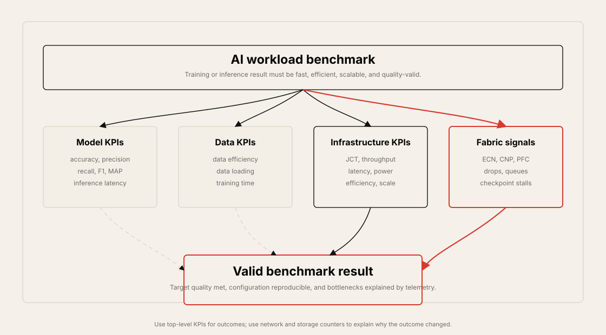
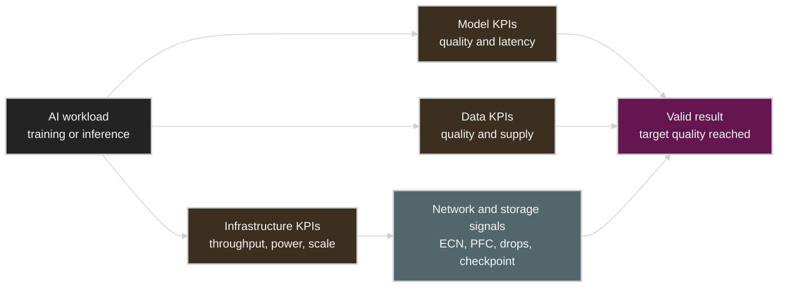
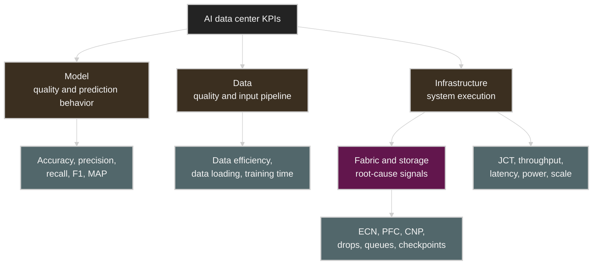
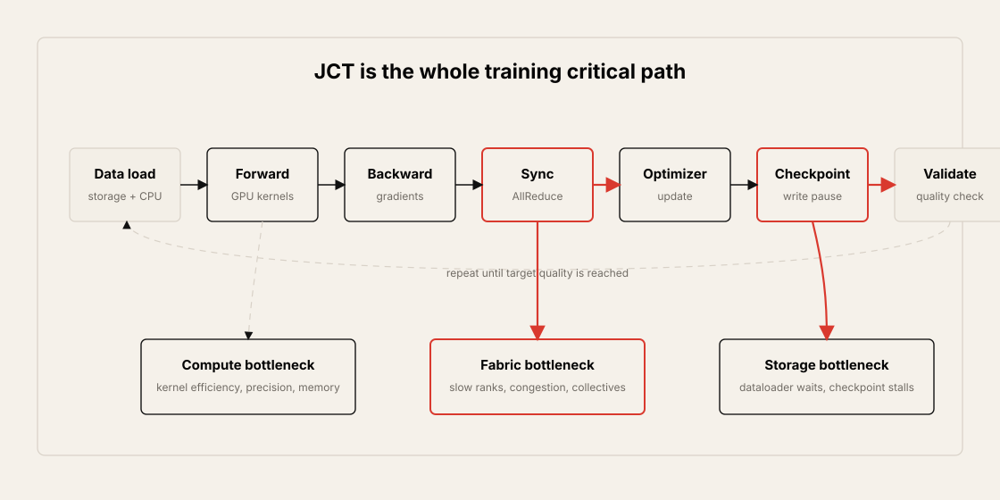
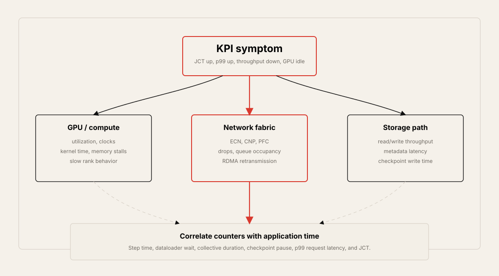
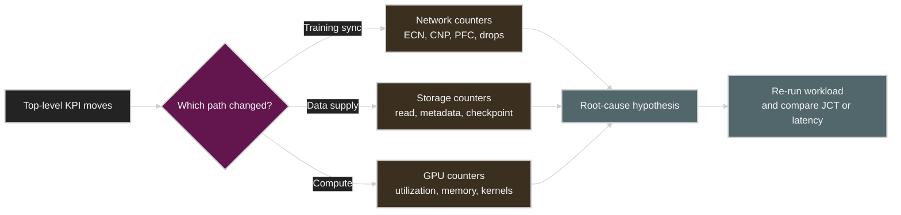
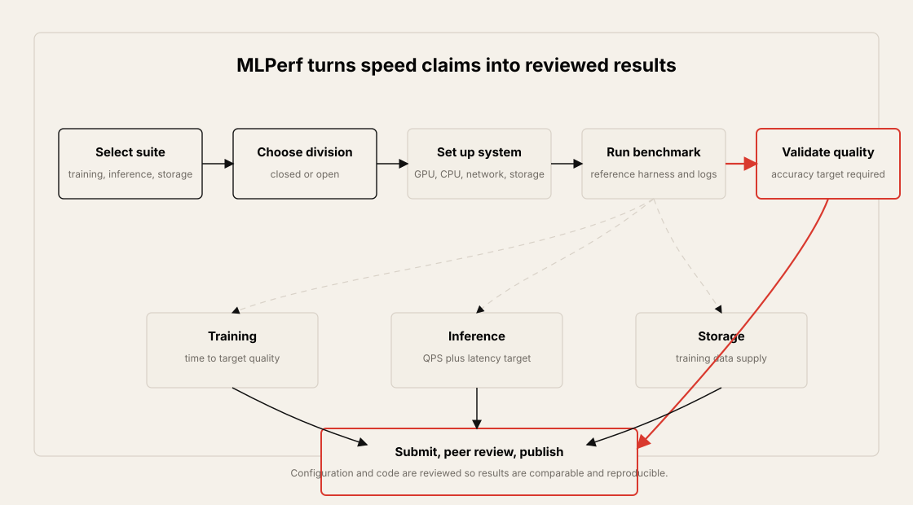
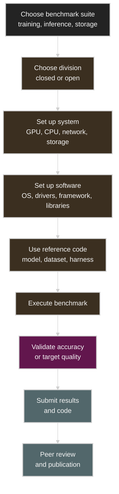
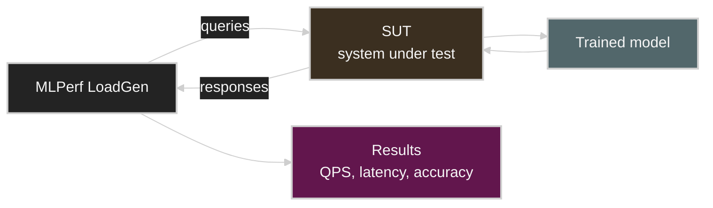
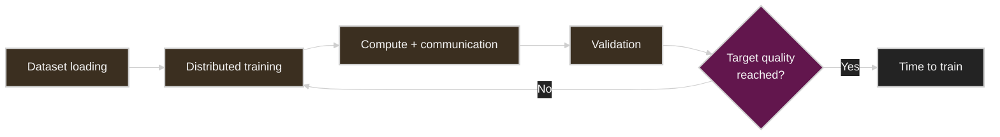

# Chapter 10: AI Network Performance KPIs

## Table of Contents

- [Goal](#goal)
- [Why Benchmarking Matters for AI Data Centers](#why-benchmarking-matters-for-ai-data-centers)
  - [From Generic Data Center KPIs to AI KPIs](#from-generic-data-center-kpis-to-ai-kpis)
  - [KPI Families](#kpi-families)
- [Job Completion Time, JCT](#job-completion-time-jct)
  - [What JCT Includes](#what-jct-includes)
  - [Why JCT Is a Fabric KPI](#why-jct-is-a-fabric-kpi)
- [Model-Level KPIs](#model-level-kpis)
  - [Accuracy](#accuracy)
  - [Precision, Recall, and F1-Score](#precision-recall-and-f1-score)
  - [Model Latency](#model-latency)
- [Data-Level KPIs](#data-level-kpis)
  - [Data Efficiency](#data-efficiency)
  - [Training Time](#training-time)
- [Infrastructure-Level KPIs](#infrastructure-level-kpis)
  - [Throughput](#throughput)
  - [Latency and Tail Latency](#latency-and-tail-latency)
  - [Power](#power)
  - [Efficiency](#efficiency)
  - [Scalability](#scalability)
- [Network and Storage Signals](#network-and-storage-signals)
- [MLCommons and MLPerf](#mlcommons-and-mlperf)
  - [MLCommons Initiatives](#mlcommons-initiatives)
  - [MLPerf Benchmark Suites](#mlperf-benchmark-suites)
  - [Closed Division and Open Division](#closed-division-and-open-division)
- [Benchmarking an AI Data Center](#benchmarking-an-ai-data-center)
  - [Benchmark Workflow](#benchmark-workflow)
  - [MLPerf Inference and LoadGen](#mlperf-inference-and-loadgen)
  - [MLPerf Training End-to-End Measurement](#mlperf-training-end-to-end-measurement)
  - [MLPerf Storage](#mlperf-storage)
- [Interpreting KPI Movement](#interpreting-kpi-movement)
- [Operational Validation Checklist](#operational-validation-checklist)
- [Practical Tips and Notes](#practical-tips-and-notes)
  - [Do Not Optimize a Single KPI Alone](#do-not-optimize-a-single-kpi-alone)
  - [Keep Benchmark and Production Metrics Separate](#keep-benchmark-and-production-metrics-separate)
  - [Use Symptom Tables as Triage, Not Proof](#use-symptom-tables-as-triage-not-proof)
- [Chapter Summary](#chapter-summary)
- [Key Terms](#key-terms)
- [Q&A](#qa)
- [References](#references)

## Goal

This chapter explains how to evaluate AI data center performance with KPIs and standardized benchmarks.

The core idea is:

> In an AI data center, performance is not captured by server availability or raw link speed alone. The most important question is whether the whole system can move data, train models, serve inference, and scale while preserving model quality, latency targets, and power efficiency.

The chapter focuses on these topics:

- Why benchmarking is needed for AI/ML infrastructure
- Job Completion Time, JCT, as a core training KPI
- Model-level KPIs such as accuracy, precision, recall, F1-score, and inference latency
- Data-level KPIs such as data efficiency and training time
- Infrastructure-level KPIs such as throughput, latency, power, efficiency, and scalability
- Network and storage counters that explain KPI movement
- MLCommons and MLPerf benchmark suites
- MLPerf Training, Inference, and Storage
- Closed Division and Open Division benchmark rules
- How LoadGen drives inference benchmarks
- How to interpret benchmark results operationally





## Why Benchmarking Matters for AI Data Centers

Benchmarking is useful whenever a system evolves and many design options must be compared. AI infrastructure evolves quickly: GPU generations change, model architectures change, precision formats change, network fabrics change, and storage paths change.

Without shared metrics, it is easy to optimize the wrong thing. A fabric may show high link utilization but still increase training time. A GPU node may show high peak FLOPS but still miss inference latency targets. A storage system may show high sequential bandwidth but still starve dataloaders because metadata operations or small-file reads are slow.

Benchmarking gives operators a structured way to answer questions such as:

- Which system trains the model to target accuracy faster?
- Which inference stack serves more queries while meeting latency constraints?
- Which storage design keeps GPUs fed during training?
- Which fabric change improves goodput instead of only increasing raw bandwidth?
- Which optimization lowers cost per token or FLOPS per watt?
- Are results reproducible across runs and comparable across platforms?

### From Generic Data Center KPIs to AI KPIs

Traditional data center KPIs often emphasize availability, power, capacity, and utilization. Those still matter, but AI data centers need additional application-level and fabric-level signals.

| Traditional KPI | Why It Is Not Enough for AI |
| --- | --- |
| Server uptime | A server can be up while GPUs are idle because data, communication, or storage is slow. |
| Average link utilization | Average utilization can hide microbursts, incast, tail latency, and flow unfairness. |
| Total power draw | Power must be compared with useful output such as tokens, samples, or FLOPS. |
| CPU utilization | AI bottlenecks may sit in GPU kernels, collectives, NIC queues, PCIe, storage, or metadata. |
| Capacity provisioned | Provisioned capacity does not prove that the workload reaches target quality faster. |

AI KPIs must connect infrastructure behavior to model and workload outcomes. The same cluster should be evaluated from several angles: model quality, data pipeline behavior, infrastructure throughput, network health, power, and scalability.

### KPI Families

The chapter groups AI data center KPIs into model, data, and infrastructure families.

| Family | Main Question | Example KPIs |
| --- | --- | --- |
| Model | Does the model produce correct or useful output? | Accuracy, precision, recall, F1-score, MAP, NDCG, inference latency |
| Data | Is the training or inference data useful and supplied fast enough? | Data efficiency, data loading performance, time to train |
| Infrastructure | Can the system execute the workload quickly, efficiently, and at scale? | JCT, throughput, latency, power, FLOPS/Watt, QPS/Watt, scaling efficiency |
| Network and storage | What infrastructure signals explain the workload result? | ECN marks, PFC pauses, CNPs, drops, queue occupancy, checkpoint write time |



## Job Completion Time, JCT

Job Completion Time, JCT, is the total time a job takes from start to useful completion. In training, the useful completion point is normally a target accuracy or quality threshold.

In AI training fabrics, JCT is one of the most important top-level KPIs because it captures the combined effect of:

- Data loading
- Forward pass
- Backward pass
- Gradient synchronization
- GPU-to-GPU communication
- Optimizer step
- Checkpoint writing
- Validation and accuracy checks
- Failure recovery or restart time



### What JCT Includes

JCT is not only compute time. It includes the pauses and waits introduced by the surrounding system.


Operationally, JCT increases when:

- GPU kernels are inefficient.
- Collectives wait on slow ranks.
- Network congestion increases synchronization time.
- Dataloader workers cannot feed GPUs.
- Storage throughput or metadata latency is poor.
- Checkpoint writes pause the training loop.
- Failures force replay from older checkpoints.
- Scaling efficiency drops as more GPUs are added.

### Why JCT Is a Fabric KPI

JCT is often discussed as a training metric, but it is also a network and storage KPI.

In distributed training, the fabric affects JCT through communication phases such as AllReduce, AllGather, ReduceScatter, parameter exchange, and checkpoint traffic. If the network creates stragglers, the fastest GPUs wait for the slowest rank. If the storage path is slow, the entire job can pause during checkpoint writes or dataset reads.

The practical lesson is:

> Do not validate an AI fabric only with link bandwidth. Validate whether the fabric reduces JCT for real training jobs.

## Model-Level KPIs

Model KPIs measure whether the model output is correct, useful, and timely. These KPIs prevent an infrastructure benchmark from rewarding a system that is fast but produces invalid or low-quality results.

### Accuracy

Accuracy measures how well the model performs its intended task. The right accuracy metric depends on the workload.

| Workload Type | Common Metric |
| --- | --- |
| Classification | Accuracy, precision, recall, F1-score |
| Regression | Mean Squared Error, MSE |
| Object detection | Mean Average Precision, MAP |
| Retrieval / ranking | Recall@k, NDCG |
| Language modeling | Perplexity, loss, task-specific quality target |

In benchmarking, accuracy matters because speed without model quality is not a valid result. MLPerf-style benchmarks usually define a target quality metric, and a run is valid only if the system reaches that target.

### Precision, Recall, and F1-Score

Precision and recall explain different kinds of correctness.

| Metric | Meaning | Useful When |
| --- | --- | --- |
| Precision | Of the items predicted positive, how many were correct? | False positives are expensive. |
| Recall | Of the true positives, how many did the model find? | Missing positives is expensive. |
| F1-score | Harmonic mean of precision and recall | Both false positives and false negatives matter. |

For example, a model can have high precision but poor recall if it predicts only a small number of very obvious positives. Another model can have high recall but poor precision if it predicts too many positives. Infrastructure benchmarking should preserve the model-quality target instead of hiding these trade-offs.

### Model Latency

Model latency is the time between request arrival and output availability. In inference systems, it is usually more important than total job completion time.

Latency can include:

- Frontend request handling
- Queueing and batching delay
- Tokenization or preprocessing
- GPU execution
- KV cache access
- Postprocessing
- Network response time

For LLM inference, latency should usually be split into prefill latency, time to first token, inter-token latency, and end-to-end latency. A single average latency number can hide user-visible tail behavior.

## Data-Level KPIs

Data KPIs measure whether the data is useful, diverse, deduplicated, and delivered to the model fast enough.

### Data Efficiency

Data efficiency describes how much useful learning signal is obtained from the data. Large datasets are not automatically good datasets.

Important questions:

- Is the data diverse enough to cover the scenarios that matter?
- Is there too much duplicate or near-duplicate data?
- Is the labeling or curation quality high enough?
- Does the data distribution match the target workload?
- Are noisy or invalid samples increasing training cost?
- Does the data pipeline preserve reproducibility?

For infrastructure teams, data efficiency matters because poor data can make hardware performance look worse than it is. The cluster may run quickly, but if the model needs many more iterations to reach quality, the end-to-end JCT remains poor.

### Training Time

Training time measures how long the system takes to train a model to a target quality metric.

It is affected by:

- GPU count and GPU generation
- GPU memory capacity and bandwidth
- Precision format such as FP32, BF16, FP16, FP8, or lower precision
- Model architecture
- Batch size and global batch behavior
- Data pipeline and storage performance
- Distributed communication efficiency
- Checkpoint frequency and checkpoint write time
- Software stack and kernel optimization

Training time should be measured end to end. A benchmark that excludes data loading, storage, or communication may be useful for microanalysis, but it does not represent the real training job.

## Infrastructure-Level KPIs

Infrastructure KPIs measure the ability of the data center to execute AI workloads quickly, efficiently, and at scale.

### Throughput

Throughput is the amount of useful work completed per unit time.

| Unit | Meaning | Typical Use |
| --- | --- | --- |
| OPS | Operations per second | General system work |
| FLOPS | Floating-point operations per second | Compute capability |
| QPS | Queries per second | Inference serving |
| samples/sec | Training or inference samples processed per second | ML training and inference |
| tokens/sec | LLM generation or prefill throughput | LLM inference |

Throughput can be measured at several levels:

- Node level
- Rack level
- Cluster level
- Data center level

High throughput is useful only when quality and latency constraints are still met. For example, an inference system may produce high QPS by increasing batch size, but that can violate p99 latency targets.

### Latency and Tail Latency

Latency is the elapsed time for an operation. It can be measured in milliseconds, microseconds, or nanoseconds depending on the component.

| Scope | Typical Unit | Example |
| --- | --- | --- |
| Application request | ms | Inference API response |
| Network / RDMA operation | us | Collective, RDMA read/write, storage IO |
| Hardware operation | ns | Device-level or memory-level timing |

Average latency is not enough. AI systems often care about p95, p99, and p999 latency because one slow rank, one slow request, or one slow checkpoint can affect the whole workload.

Tail latency can be caused by:

- Queue buildup
- Link congestion
- ECN marking and congestion control reaction
- PFC pause propagation
- Packet drops or retransmissions
- PCIe contention
- CPU scheduling noise
- Storage metadata stalls
- Checkpoint bursts

### Power

Power measures electrical energy consumption at different boundaries.

| Boundary | Example Measurement |
| --- | --- |
| GPU | Per-GPU board power or accelerator telemetry |
| Server | Node power draw |
| Rack | Rack power and cooling load |
| Cluster | Total training or inference cluster draw |
| Data center | Facility-level power and cooling |

Power is important because AI infrastructure is constrained by electrical capacity, cooling capacity, and cost. A system with high peak performance may still be unattractive if power consumption makes useful work too expensive.

### Efficiency

Efficiency compares output to input resources.

```text
Efficiency = useful output / consumed resource
```

Common forms:

| Metric | Meaning |
| --- | --- |
| TPW | Throughput per Watt |
| FPW | FLOPS per Watt |
| QPW | Queries per Watt |
| tokens/Watt | LLM token generation per Watt |
| samples/sec/GPU | Training throughput per GPU |
| cost per token | Serving cost normalized by output |

Efficiency helps compare systems that have different power, GPU count, cost, and performance. For example, one system may have higher total throughput, while another has better throughput per Watt.

### Scalability

Scalability measures whether performance improves as resources increase.

| Concept | Meaning |
| --- | --- |
| Speedup | How much faster the workload becomes when more resources are added |
| Scaling efficiency | Actual speedup divided by ideal speedup |
| Strong scaling | Fixed problem size, more GPUs |
| Weak scaling | Problem size grows with GPU count |

Strong scaling is useful when the workload size is fixed and the goal is to finish sooner. Weak scaling is useful when the goal is to solve larger problems as the cluster grows.

Poor scaling usually points to bottlenecks in at least one of these areas:

- Communication overhead
- Load imbalance
- Straggler ranks
- Storage or dataloader limits
- Checkpoint serialization
- CPU overhead
- Software framework limits
- Network congestion or path imbalance

## Network and Storage Signals

Top-level KPIs show the outcome. Network and storage signals explain why the outcome moved.

| Signal | What It Can Explain |
| --- | --- |
| GPU communication time | Whether collectives are dominating JCT |
| AllReduce / AllGather duration | Whether synchronization is slowing training |
| ECN mark count | Whether RoCEv2 congestion is being signaled |
| CNP count | Whether DCQCN congestion notification is active |
| PFC pause count | Whether the lossless fabric is pausing traffic |
| Packet drops | Whether RoCEv2 or TCP traffic is experiencing loss |
| RDMA retransmission | Whether reliable RDMA is recovering from loss or timeout |
| Link utilization | Whether spine, leaf, or rail links are saturated |
| Queue occupancy | Whether switch buffers are building pressure |
| Storage read throughput | Whether dataloaders can feed GPUs |
| Storage write throughput | Whether checkpoint writes can finish quickly |
| Checkpoint write time | Whether training pauses are caused by storage |

These counters should be correlated with job-level metrics such as GPU utilization, step time, p99 step time, JCT, and inference latency.





## MLCommons and MLPerf

One challenge with AI data center KPIs is comparability. Different vendors, clouds, software stacks, and model implementations can report different metrics in different ways.

MLCommons addresses this by defining common benchmark suites, datasets, rules, and review processes. Its purpose is to make AI system measurement fair, useful, and reproducible.



MLCommons goals include:

- Fair comparison across systems
- Useful measurement that advances ML progress
- Reproducible results
- Benefits for commercial and research communities
- Reasonable benchmarking cost so more participants can join

### MLCommons Initiatives

| Initiative | Purpose |
| --- | --- |
| MLPerf | Benchmark suites for training, inference, storage, HPC, and related AI workloads |
| MLCube | Packaging and portability framework for reproducible ML workloads |
| PAIR | People + AI Research program supporting research, education, and community collaboration |

### MLPerf Benchmark Suites

MLPerf is the main benchmark suite discussed in the chapter.

| Suite | What It Measures | Core Question |
| --- | --- | --- |
| MLPerf Training | Time to train to a target quality metric | How fast can the system train the model correctly? |
| MLPerf Inference | Throughput and latency for trained model serving | How fast can the system answer requests while meeting accuracy and latency constraints? |
| MLPerf Storage | Storage system ability to supply training data | Can storage keep the training workload fed? |
| MLPerf HPC | Scientific and HPC-oriented ML workloads | How well does the system handle HPC AI workloads? |

The important point is that MLPerf does not only measure raw speed. Valid results must satisfy the benchmark's accuracy or quality requirement.

### Closed Division and Open Division

MLPerf uses divisions to separate direct system comparison from research or algorithmic innovation.

| Division | Rules | Best Use |
| --- | --- | --- |
| Closed Division | Fixed model, dataset, target quality, and reference implementation constraints | Direct hardware/software comparison |
| Open Division | Allows different models or methods if the target quality requirement is met | Demonstrating new techniques or algorithmic improvements |

Closed Division is stronger for apples-to-apples comparison. Open Division is useful when the goal is to show that a new method can reach the same quality target more efficiently.

## Benchmarking an AI Data Center

Benchmarking an AI data center is a multi-step process. The exact method depends on whether the benchmark targets training, inference, or storage, but the structure is similar.

### Benchmark Workflow



The workflow should capture:

- Hardware configuration: GPU, CPU, memory, NIC, storage, switches
- Software configuration: OS, driver, CUDA or accelerator runtime, framework, benchmark code
- Network configuration: topology, link speed, congestion control, MTU, routing, load balancing
- Storage configuration: filesystem, protocol, queue depth, metadata layout, dataset placement
- Accuracy or quality target
- Result logs and reproducibility artifacts

### MLPerf Inference and LoadGen

MLPerf Inference uses LoadGen to issue queries to the System Under Test, SUT. LoadGen controls request generation so that results are comparable.



The data center inference benchmark commonly uses two scenarios.

| Scenario | Query Pattern | Main Measurement |
| --- | --- | --- |
| Offline | All queries are available at once | Maximum throughput |
| Server | Queries arrive according to a Poisson distribution | Throughput under latency constraints |

Inference results usually require both:

- A performance run, such as QPS or samples/sec
- An accuracy run proving that the model output meets the required target

### MLPerf Training End-to-End Measurement

MLPerf Training measures time to train to a predefined target quality metric.

The timing is end to end:

1. Dataset loading begins.
2. Distributed training runs.
3. Compute and communication proceed across the system.
4. Validation checks whether the target quality has been reached.
5. The benchmark stops when the target quality condition is satisfied.

This structure matters because it includes data pipeline, storage, GPU compute, distributed communication, and software framework behavior.



From a network engineer's view, the training benchmark is useful because it exposes whether the fabric scales with the workload. If more GPUs do not reduce time to train as expected, the bottleneck may be communication, storage, framework overhead, or load imbalance.

### MLPerf Storage

MLPerf Storage measures how quickly a storage system can supply training data.

The core question is:

> Can the storage system feed the training job fast enough that GPUs are not waiting for input data?


Storage benchmarking should be interpreted together with:

- GPU idle time
- Dataloader wait time
- Training step time
- Checkpoint write time
- Metadata latency
- Storage network utilization
- RDMA or TCP transport counters

## Interpreting KPI Movement

A KPI should lead to an operational hypothesis. The table below maps common symptoms to first checks.

| Symptom | First Checks |
| --- | --- |
| JCT increases | Step time, slow ranks, collective duration, checkpoint time, dataloader wait |
| Time to train does not improve with more GPUs | Scaling efficiency, AllReduce time, fabric congestion, batch-size behavior |
| Throughput is high but latency fails | Batch size, queue depth, scheduler policy, p99 and p999 latency |
| GPU utilization is low | Dataloader, storage read latency, CPU preprocessing, PCIe, network stalls |
| ECN/CNP counters spike | RoCEv2 congestion, DCQCN profile, incast, path imbalance |
| PFC pauses increase | Lossless class pressure, head-of-line blocking, buffer allocation |
| Packet drops appear | Queue overflow, incorrect lossless configuration, routing imbalance |
| Checkpoint pauses dominate | Storage write bandwidth, metadata path, checkpoint frequency, filesystem layout |
| Power rises without useful throughput | GPU clocks, low utilization, cooling constraints, inefficient batch or precision |
| Accuracy target is unstable | Data quality, random seeds, precision mode, hyperparameters, benchmark rule compliance |

## Operational Validation Checklist

Use this checklist when evaluating AI data center KPIs or benchmark results.

- Define whether the workload is training, inference, storage, or mixed.
- Record the target quality or accuracy condition before measuring speed.
- Measure JCT or time to train for training workloads.
- Split training time into data loading, compute, communication, checkpoint, and validation phases.
- For inference, report both throughput and p95/p99 latency.
- For LLM inference, separate prefill, time to first token, inter-token latency, and total latency when possible.
- Report the unit clearly: FLOPS, QPS, samples/sec, tokens/sec, or OPS.
- Normalize useful output by resource: per GPU, per rack, per Watt, and per dollar when needed.
- Measure power at the correct boundary: GPU, node, rack, cluster, or facility.
- Evaluate strong scaling and weak scaling separately.
- Correlate application metrics with ECN, CNP, PFC, drops, queue occupancy, and RDMA retransmission.
- Correlate dataloader wait and checkpoint time with storage read/write and metadata metrics.
- Use p99 and p999, not only averages, for latency-sensitive workloads.
- Keep benchmark configuration reproducible: hardware, software, model, dataset, framework, driver, and network settings.
- Distinguish Closed Division-style comparison from Open Division-style innovation.
- Run benchmarks more than once and investigate variance.
- Treat benchmark improvement as valid only if target quality is preserved.

## Practical Tips and Notes

### Do Not Optimize a Single KPI Alone

AI data center KPIs are coupled. Improving one number can damage another.

| Optimization | What Can Go Wrong | Guardrail |
| --- | --- | --- |
| Increase inference batch size | QPS improves but p99 latency misses target | Track QPS and p99/p999 together |
| Lower precision | Throughput improves but quality target becomes unstable | Re-run accuracy or target-quality validation |
| Increase dataloader workers | GPU utilization improves but CPU or storage metadata becomes saturated | Watch CPU, storage latency, and metadata ops |
| Reduce checkpoint frequency | JCT improves until failure recovery becomes expensive | Track restart cost and maximum lost work |
| Tune ECN/PFC thresholds | Fewer marks or pauses may hide loss or increase tail latency | Correlate with drops, retransmissions, and step time |

> [!WARNING]
> A benchmark result is not useful unless the quality target, latency target, and resource boundary are stated with it.

### Keep Benchmark and Production Metrics Separate

Benchmark metrics and production metrics answer different questions. Benchmarks compare systems under controlled rules. Production metrics explain whether real jobs are healthy.

Use both views:

| View | Useful For | Example |
| --- | --- | --- |
| Benchmark | Vendor/system comparison | MLPerf Training time to quality |
| Production job | Real workload health | JCT, p99 step time, checkpoint pause |
| Fabric telemetry | Root cause | ECN, CNP, PFC, drops, queue occupancy |
| Cost/energy | Operating trade-off | tokens/Watt, samples/sec/GPU, cost/token |

Do not mix benchmark and production conclusions casually. A system can win a benchmark and still be poorly tuned for a local dataset, job scheduler, storage layout, or inference SLO.

### Use Symptom Tables as Triage, Not Proof

The symptom-to-first-check tables are starting points. They are not proof of causality.

For example, ECN/CNP spikes can indicate congestion, but the cause may be incast, path imbalance, wrong thresholds, a small number of elephant flows, or an application burst pattern. Confirm the hypothesis by correlating timestamps across application logs, GPU telemetry, NIC counters, switch queues, and storage metrics.

## Chapter Summary

The main takeaways:

- AI data center performance must be measured with workload-aware KPIs, not only generic data center metrics.
- JCT is a central KPI for training because it captures compute, communication, data loading, checkpointing, validation, and failure effects.
- Model-level KPIs protect quality: accuracy, precision, recall, F1-score, MAP, NDCG, and latency.
- Data-level KPIs explain whether the model receives useful data quickly enough.
- Infrastructure KPIs include throughput, latency, power, efficiency, and scalability.
- Network and storage counters are required to explain why top-level KPIs moved.
- MLCommons provides standardized benchmark practices for fair and reproducible comparison.
- MLPerf Training measures time to train to a target quality metric.
- MLPerf Inference measures throughput and latency for trained models while enforcing accuracy targets.
- MLPerf Storage measures whether storage can supply training data fast enough.
- Closed Division supports direct comparison, while Open Division allows algorithmic innovation.
- Benchmark results are useful only when they are reproducible, quality-valid, and tied back to operational signals.

## Key Terms

| Term | Meaning |
| --- | --- |
| KPI | Key Performance Indicator |
| JCT | Job Completion Time |
| Time to train | Time required to train a model to a target quality metric |
| Accuracy | Degree to which model output is correct for the task |
| Precision | Fraction of positive predictions that are correct |
| Recall | Fraction of true positives that are found |
| F1-score | Harmonic mean of precision and recall |
| MAP | Mean Average Precision |
| NDCG | Normalized Discounted Cumulative Gain |
| Throughput | Useful work completed per unit time |
| QPS | Queries per second |
| FLOPS | Floating-point operations per second |
| OPS | Operations per second |
| Tail latency | High-percentile latency such as p95, p99, or p999 |
| TPW | Throughput per Watt |
| FPW | FLOPS per Watt |
| QPW | Queries per Watt |
| Strong scaling | Fixed problem size with increasing resource count |
| Weak scaling | Problem size grows with resource count |
| MLCommons | Organization defining AI benchmark suites, datasets, and best practices |
| MLPerf | MLCommons benchmark suite for AI systems |
| LoadGen | MLPerf Inference load generator |
| SUT | System Under Test |
| Closed Division | MLPerf division for direct comparison under fixed constraints |
| Open Division | MLPerf division allowing different methods if quality targets are met |
| ECN | Explicit Congestion Notification |
| CNP | Congestion Notification Packet |
| PFC | Priority Flow Control |

## Q&A

### 1. Why is JCT important in AI training clusters?

JCT measures how long the whole job takes to reach useful completion, usually a target accuracy or quality level. It includes compute, communication, data loading, checkpointing, validation, and waiting. This makes it a better top-level metric than peak FLOPS or link speed alone.

### 2. Why is accuracy part of a performance benchmark?

A system that runs quickly but fails the target quality requirement is not a valid AI result. Accuracy or target quality ensures that speed improvements do not come from skipping work, changing the task unfairly, or producing lower-quality output.

### 3. How are throughput and latency different?

Throughput measures how much work is completed per unit time, such as QPS, samples/sec, or tokens/sec. Latency measures how long one operation or request takes. Training often emphasizes throughput and time to train, while inference often needs both high throughput and strict p99 latency.

### 4. Why should power be normalized by useful output?

Raw power draw does not show whether the system is efficient. FLOPS/Watt, QPS/Watt, tokens/Watt, or cost per token show how much useful work is produced for the energy consumed.

### 5. What is the difference between strong scaling and weak scaling?

Strong scaling keeps the problem size fixed and adds more resources to finish faster. Weak scaling increases the problem size as resources are added. Poor scaling in either case points to bottlenecks such as communication overhead, storage limits, load imbalance, or software overhead.

### 6. What does MLPerf Training measure?

MLPerf Training measures the time required to train a model to a predefined target quality metric. The benchmark is end to end, so data loading, storage, compute, communication, and validation behavior all matter.

### 7. What does MLPerf Inference measure?

MLPerf Inference measures how quickly a system can serve a trained model while meeting accuracy and latency requirements. In data center inference, common scenarios include Offline for maximum throughput and Server for latency-constrained request streams.

### 8. What is LoadGen?

LoadGen is the MLPerf Inference load generator. It sends queries to the System Under Test in a controlled way, collects responses, and helps produce comparable throughput, latency, and accuracy results.

### 9. What is the difference between Closed Division and Open Division?

Closed Division fixes the model, dataset, and benchmark constraints to support direct comparisons. Open Division allows different models or training methods when the same target quality is achieved, so it is better for demonstrating new techniques.

### 10. Which network signals should be checked when training performance degrades?

Start with collective duration, ECN marks, CNP counts, PFC pauses, packet drops, RDMA retransmissions, queue occupancy, and link utilization. Then correlate them with GPU utilization, step time, p99 step time, checkpoint time, and JCT.

## References

- [MLCommons](https://mlcommons.org/)
- [MLCommons Benchmarks](https://mlcommons.org/benchmarks/)
- [MLPerf Inference GitHub Repository](https://github.com/mlcommons/inference)
- [MLPerf Training GitHub Repository](https://github.com/mlcommons/training)
- [MLPerf Storage GitHub Repository](https://github.com/mlcommons/storage)
- [NVIDIA, "MLPerf Benchmarks"](https://www.nvidia.com/en-us/data-center/resources/mlperf-benchmarks/)
- [Chuan Li, "OpenAI's GPT-3 Language Model: A Technical Overview," Lambda, June 3, 2020](https://lambda.ai/blog/demystifying-gpt-3)
