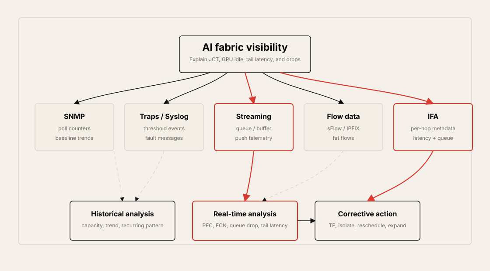
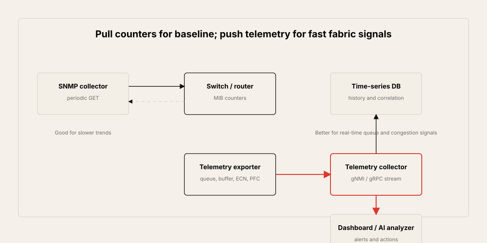
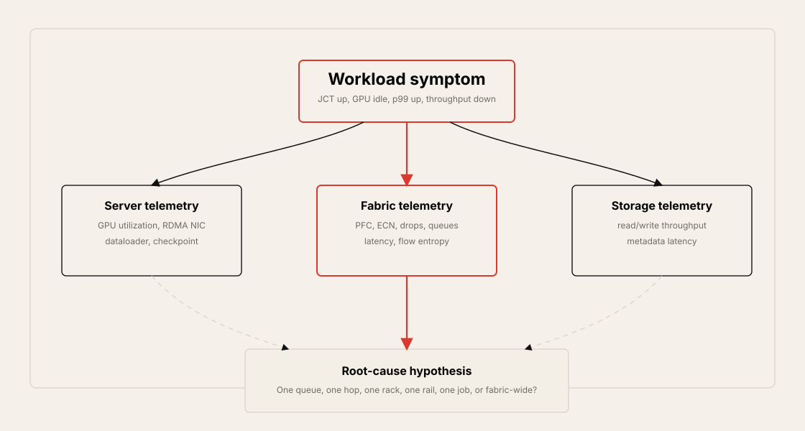
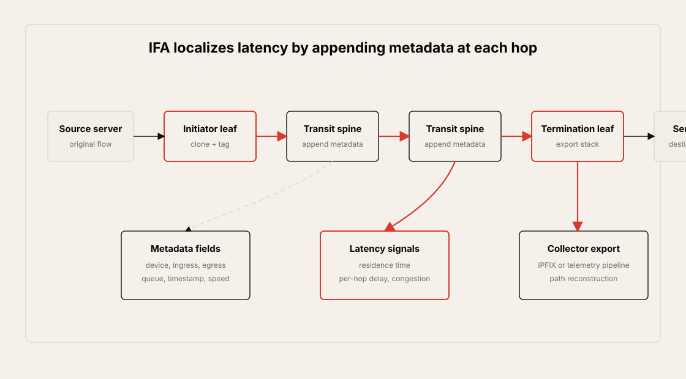
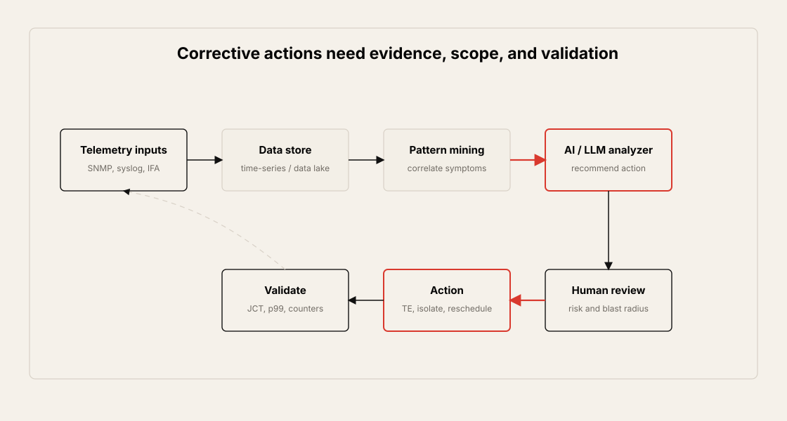

# Chapter 11: Monitoring and Telemetry

## Table of Contents

- [Goal](#goal)
- [Why AI Fabrics Need Better Monitoring](#why-ai-fabrics-need-better-monitoring)
  - [Traditional Monitoring Is Necessary but Not Sufficient](#traditional-monitoring-is-necessary-but-not-sufficient)
  - [What Changes in AI/ML Data Centers](#what-changes-in-aiml-data-centers)
- [Monitoring Methods](#monitoring-methods)
  - [SNMP Polling](#snmp-polling)
  - [SNMP Traps and Syslog](#snmp-traps-and-syslog)
  - [Streaming Telemetry](#streaming-telemetry)
  - [sFlow, IPFIX, RPC, and Active Probes](#sflow-ipfix-rpc-and-active-probes)
- [SNMP and Streaming Telemetry Comparison](#snmp-and-streaming-telemetry-comparison)
- [AI Fabric Telemetry Signals](#ai-fabric-telemetry-signals)
  - [Egress Buffer Utilization](#egress-buffer-utilization)
  - [Latency Changes](#latency-changes)
  - [Bandwidth Utilization and Flow Entropy](#bandwidth-utilization-and-flow-entropy)
  - [PFC, ECN, Drops, and RDMA Symptoms](#pfc-ecn-drops-and-rdma-symptoms)
- [Historical and Real-Time Monitoring](#historical-and-real-time-monitoring)
- [Server and Switch Telemetry Correlation](#server-and-switch-telemetry-correlation)
- [In-Band Flow Analyzer, IFA](#in-band-flow-analyzer-ifa)
  - [IFA Roles](#ifa-roles)
  - [IFA Packet Format](#ifa-packet-format)
  - [IFA Metadata Stack](#ifa-metadata-stack)
  - [Per-Hop Latency Analysis](#per-hop-latency-analysis)
  - [IFA Practical Constraints](#ifa-practical-constraints)
- [Mirroring on Demand and Mirroring on Drop](#mirroring-on-demand-and-mirroring-on-drop)
- [Corrective Actions](#corrective-actions)
  - [Human-Guided Actions](#human-guided-actions)
  - [AI-Assisted and Autonomous Operations](#ai-assisted-and-autonomous-operations)
- [Operational Validation Checklist](#operational-validation-checklist)
- [Practical Tips and Notes](#practical-tips-and-notes)
  - [Build a Minimum Useful Telemetry Set First](#build-a-minimum-useful-telemetry-set-first)
  - [Time Synchronization Is Part of Monitoring](#time-synchronization-is-part-of-monitoring)
  - [Sample Carefully Before Turning on Everything](#sample-carefully-before-turning-on-everything)
- [Chapter Summary](#chapter-summary)
- [Key Terms](#key-terms)
- [Q&A](#qa)
- [References](#references)

## Goal

This chapter explains how monitoring and telemetry change in AI/ML data center fabrics.

The core idea is:

> AI fabric monitoring is not just "is the switch up?" It must explain whether microbursts, queue buildup, PFC pushback, ECN marking, drops, per-hop latency, flow imbalance, storage stalls, or GPU-side symptoms are increasing Job Completion Time or inference tail latency.

The chapter focuses on these topics:

- SNMP polling, SNMP traps, and syslog
- Streaming telemetry with gNMI/gRPC-style push models
- Periodic telemetry and on-change telemetry
- sFlow, IPFIX, RPC queries, and active probes
- Historical monitoring versus real-time monitoring
- AI fabric signals such as queue occupancy, ECN, PFC, frame loss, and buffer utilization
- Correlating server telemetry with switch telemetry
- In-Band Flow Analyzer, IFA, for per-hop metadata
- Mirroring on demand and mirroring on drop
- Corrective actions and the path toward AI-assisted operations



## Why AI Fabrics Need Better Monitoring

Monitoring a data center normally includes power, temperature, humidity, device health, interface state, and general availability. Those signals still matter. However, AI/ML fabrics introduce a tighter relationship between network behavior and application performance.

In AI training, a brief congestion event can become a job-level performance problem. A small number of slow ranks can make other GPUs wait. A storage stall can reduce GPU utilization. A PFC pause can propagate pressure through a lossless class. ECN marking can trigger congestion-control behavior. Packet drops can force retransmission or recovery.

The result is that AI fabric monitoring must answer questions such as:

- Which hop or queue introduced latency?
- Did PFC pause a priority class?
- Did ECN marking increase before JCT moved?
- Did a fat flow or low-entropy flow create path imbalance?
- Did storage reads or checkpoint writes block GPU progress?
- Is a symptom isolated to one interface, one switch, one rail, one rack, or many racks?
- Is the corrective action traffic engineering, source throttling, job rescheduling, capacity expansion, or security mitigation?

### Traditional Monitoring Is Necessary but Not Sufficient

Traditional monitoring tools give useful baseline visibility.

| Method | What It Does Well | Where It Falls Short |
| --- | --- | --- |
| SNMP polling | Periodic counters, interface status, CPU, memory, queue counters | Can miss microbursts and fast queue events |
| SNMP traps | Threshold-based event notification | Only reports configured threshold events |
| Syslog | Critical errors, link events, hardware faults, routing events | Usually event text, not high-frequency telemetry |
| Flow telemetry | Traffic characterization and flow visibility | Sampling may miss short-lived events |
| Active probes | Controlled latency/loss measurements | Probe packets may not match real workload packets |

The problem is not that these tools are obsolete. The problem is that AI workloads need finer time resolution and better correlation across network, server, GPU, storage, and scheduler layers.

### What Changes in AI/ML Data Centers

AI/ML fabrics have several properties that raise the monitoring bar.

| AI Fabric Property | Monitoring Implication |
| --- | --- |
| RDMA/RoCEv2 traffic | Need ECN, CNP, PFC, drop, queue, and retransmission visibility |
| Collective communication | Slowest rank affects all ranks |
| Lossless or near-lossless design | Need to detect pause propagation and buffer pressure |
| Microburst-sensitive workloads | Polling intervals may be too slow |
| Large fan-in/fan-out traffic | Need incast, entropy, and elephant-flow analysis |
| Expensive GPU time | Small network stalls can waste high-value compute |
| Multi-layer bottlenecks | Need switch, server, storage, and scheduler correlation |

## Monitoring Methods

AI data center monitoring usually combines several methods rather than relying on one.

### SNMP Polling

SNMP polling uses a collector to query device MIB counters periodically. SNMPv2c and SNMPv3 are common, with SNMPv3 preferred when authentication and privacy are needed.

Typical SNMP polling targets:

| Area | Example Data |
| --- | --- |
| Interface statistics | Packet count, byte count, error count |
| Queue statistics | Queue packets, queue drops, queue counters |
| Buffer utilization | Shared buffer, dedicated buffer, per-interface buffer |
| FIB/RIB/MAC tables | Forwarding, routing, and MAC table usage |
| TCAM utilization | ACL and policy table capacity |
| CPU and memory | Node, line card, or ASIC resource usage |

SNMP polling is useful for trend visibility and baseline operations, but it has important limitations in AI fabrics:

- Polling intervals may miss microbursts.
- Rate calculations depend on interval length.
- Counter changes may be detected after the workload impact has already happened.
- Per-queue and per-buffer visibility may be limited by device support.
- Polling large fabrics too frequently can create collector and device load.

### SNMP Traps and Syslog

SNMP traps are device-generated notifications sent when a condition or threshold is met.

Examples:

- CPU utilization crosses a threshold.
- Queue or buffer threshold is reached.
- PFC pushback rate exceeds a configured value.
- Interface error count increases.
- TCAM utilization reaches a limit.

Syslog sends textual event messages to collectors.

| Syslog Area | Example Event |
| --- | --- |
| Critical/fatal | ASIC error, process crash |
| Interface | Link down/up, optics fault |
| Security | ACL drop, control-plane protection event |
| Routing | BGP or OSPF adjacency change |
| Hardware | Fan, power, temperature |

Traps and syslog are useful for events, but they do not replace high-resolution telemetry. They tell you that something happened; they often do not show the full per-hop timing or queue buildup path.

### Streaming Telemetry

Streaming telemetry changes the model from collector pull to device push. Instead of periodically asking for counters, the device sends structured data to a telemetry collector.

Common properties:

- Data is pushed from switch, router, firewall, or server agent.
- gNMI/gRPC-style sessions are common.
- Data can be periodic or on-change.
- Multiple collectors can receive concurrent streams.
- Data can feed a time-series database, dashboard, alerting system, or AI analyzer.



Streaming telemetry can export:

| Level | Example Data |
| --- | --- |
| Node level | CPU, memory, FIB, RIB, TCAM, global buffer |
| Interface level | Packet rate, byte rate, errors, drops |
| Queue level | Queue occupancy, queue drop, ECN mark, PFC stats |
| Buffer level | Shared buffer, dedicated buffer, per-interface buffer |

For AI fabrics, per-interface, per-queue, and per-buffer telemetry is especially important.

### sFlow, IPFIX, RPC, and Active Probes

Other monitoring methods complement SNMP and streaming telemetry.

| Method | Role |
| --- | --- |
| sFlow | Sampled packet/flow visibility for traffic characterization |
| IPFIX | Flow records and exported telemetry records |
| RPC query | Structured command/API query using XML, JSON, or similar formats |
| Active probes | Synthetic UDP/TCP/TWAMP-style probes for latency and loss |
| IFA | Data-plane metadata or cloned probes for per-hop visibility |

Active probes can measure loss and latency, but synthetic probes may not match the original workload packet size, path, queue, or priority. IFA is useful because it can tag or clone traffic closer to the real data-plane path.

## SNMP and Streaming Telemetry Comparison

| Item | SNMP Polling | Streaming Telemetry |
| --- | --- | --- |
| Data model | Collector pulls data | Device pushes data |
| Timing | Seconds or minutes are common | Sub-second or event-driven is possible |
| Encoding | MIB/OID model | Structured data, often gNMI/gRPC |
| Microburst visibility | Weak | Better, depending on device support |
| On-change support | Limited | Native design option |
| Per-queue detail | Device dependent | Better fit for queue/buffer telemetry |
| Collector load | Polling scales with query count | Session and stream management required |
| AI fabric fit | Baseline and trend monitoring | Real-time fabric visibility |

The practical design is usually hybrid:

- Use SNMP for baseline counters and operational compatibility.
- Use traps and syslog for important events.
- Use streaming telemetry for high-frequency queue, buffer, ECN, PFC, and interface visibility.
- Use flow telemetry for application flow shape and elephant-flow detection.
- Use IFA or probes when per-hop latency and congestion localization are needed.

## AI Fabric Telemetry Signals

AI/ML data centers should monitor more than interface utilization.



### Egress Buffer Utilization

Egress buffer utilization is one of the most important early congestion signals.

Useful views:

- Shared buffer utilization
- Dedicated buffer utilization
- Per-interface buffer usage
- Per-queue occupancy
- Queue drop counters
- Burst absorption behavior

If egress buffers remain high, operators may need to add capacity, adjust traffic placement, retune congestion thresholds, or move workloads. In RoCEv2 fabrics, buffer behavior should be correlated with PFC and ECN.

### Latency Changes

Latency should be measured both at the application layer and inside the fabric.

| Layer | Example Signal |
| --- | --- |
| Application | Step time, p99 request latency, JCT |
| Server | GPU idle time, dataloader wait, RDMA counters |
| Fabric | Per-hop latency, queue residence time, ECN marks |
| Storage | Read latency, write latency, checkpoint pause |

In-band telemetry and IFA-style probes help identify where latency changes occur between leaf nodes, spines, and egress leaves.

### Bandwidth Utilization and Flow Entropy

Bandwidth utilization should be measured from leaf to spine, spine to leaf, and across rails or planes.

High utilization is not automatically bad. The problem is when utilization becomes uneven, concentrated, or correlated with tail latency and congestion.

Important checks:

- Is one spine overutilized while others are underused?
- Are elephant flows reducing ECMP balance?
- Is flow entropy too low for hashing to distribute traffic?
- Does a specific job, tenant, rack, or rail dominate a path?
- Are link utilization changes correlated with ECN or PFC?

### PFC, ECN, Drops, and RDMA Symptoms

For RoCEv2 and lossless Ethernet, these signals should be watched together.

| Signal | Meaning |
| --- | --- |
| PFC XOFF / pause | Priority class is being paused because receiver-side buffer pressure exists |
| ECN mark | Congestion signal for rate control |
| CNP count | Congestion notification behavior for DCQCN |
| Frame loss | Queue or link loss that may harm RDMA or TCP |
| RDMA retransmission | Recovery behavior after loss or timeout |
| Queue occupancy | Buffer pressure before drops or pauses |

PFC and ECN counters should not be interpreted alone. A small number of marks may be normal in a tuned fabric. A fast rise across many ports or a correlation with JCT increase is more important.

## Historical and Real-Time Monitoring

Historical monitoring and real-time monitoring serve different purposes.

| Type | Purpose | Example Question |
| --- | --- | --- |
| Historical monitoring | Trend, capacity planning, recurring pattern analysis | Did leaf-spine bandwidth grow 10% over several weeks? |
| Real-time monitoring | Detect and localize active incidents | Which queue is dropping now? |

Historical monitoring helps with:

- Capacity planning
- Oversubscription review
- Growth trend analysis
- Optics and interface reliability history
- Recurring congestion pattern detection
- Correlating job placement with fabric symptoms

Real-time monitoring helps with:

- Queue drop detection
- PFC and ECN bursts
- Flow tail latency
- Fat-flow identification
- Entropy scoring
- ASIC memory/CPU pressure
- Immediate traffic engineering decisions

AI fabrics need both. Historical data explains the trend; real-time data explains the live incident.

## Server and Switch Telemetry Correlation

Switch telemetry alone is not enough in an AI/ML data center. Server telemetry must be correlated with switch telemetry.

Useful server-side signals:

- GPU utilization
- GPU memory pressure
- GPU communication time
- RDMA NIC counters
- Storage read throughput
- Dataloader wait time
- Checkpoint write time
- Scheduler placement and job ID
- Application step time

Useful switch-side signals:

- Interface and queue counters
- Buffer occupancy
- PFC pause and XOFF behavior
- ECN marking
- Drops
- Per-hop latency
- Flow records

The operational goal is to connect symptoms:

> GPU utilization dropped because dataloaders waited; dataloaders waited because storage read latency rose; storage read latency rose because a leaf queue was congested; the queue was congested because a low-entropy elephant flow overloaded one spine path.

Without correlation, each team sees only one part of the incident.

## In-Band Flow Analyzer, IFA

In-Band Flow Analyzer, IFA, adds telemetry metadata to data-plane packets or cloned probe packets. It helps measure per-hop latency, queue behavior, congestion, and path information using packets that follow the same fabric path as the traffic of interest.



### IFA Roles

IFA usually has three roles.

| Role | Function |
| --- | --- |
| Initiator | Selects traffic, adds IFA header or creates cloned IFA probe |
| Transit | Appends local metadata at each hop, such as timestamp, queue, congestion, or port data |
| Termination | Removes metadata or exports metadata stack to a collector, often through IPFIX |

In a three-stage Clos, the initiator may be an ingress leaf, the transit node may be a spine, and the termination node may be an egress leaf. In a five-stage fabric, spine and super-spine hops can add metadata.

### IFA Packet Format

Conceptually, an IFA packet adds headers and metadata before the original payload.

```text
L2 header
L3 header
IFA header
L4 header
IFA metadata header
IFA metadata stack
Original payload
```

The chapter notes that the IFA header sits after the IP header. Because IFA adds extra bytes, the fabric MTU must be large enough. AI data center fabrics commonly use jumbo MTU, such as 9000 bytes or more, but the full path must be checked.

MTU checks should include:

- Server NIC MTU
- Leaf and spine MTU
- Overlay or VXLAN overhead
- Collector path MTU
- Probe packet size
- IFA metadata stack growth across hops

### IFA Metadata Stack

Each hop can append metadata.

| Metadata Field | Why It Matters |
| --- | --- |
| Residence time | Time a packet spends inside a hop |
| Per-hop latency | Link plus device latency between adjacent nodes |
| Ingress port | Where the packet entered the node |
| Egress port | Where the packet left the node |
| RX timestamp | Timestamp used for latency calculation |
| Queue ID | Which queue carried the packet |
| Congestion notification | Whether congestion was observed |
| Egress port speed | Helps interpret delay and path properties |
| Device ID | Identifies the hop |

For AI fabrics, the highest-value fields are often congestion indication, RX timestamp, residence time, queue ID, and egress port.

### Per-Hop Latency Analysis

IFA answers the question:

> Which hop, port, or queue added the latency?

The basic workflow:

1. An initiator selects or clones a packet from the traffic of interest.
2. Each transit hop appends metadata.
3. The termination hop exports the metadata stack.
4. A collector reconstructs hop-by-hop path, queue, congestion, and latency.
5. The operator correlates this with application symptoms such as JCT or p99 latency.

This is more precise than only knowing that a flow was slow end to end.

### IFA Practical Constraints

IFA is powerful, but it must be used carefully.

Practical constraints:

- MTU overhead must be validated.
- Device support and metadata fields vary by implementation.
- Collector capacity must handle exported metadata.
- Sampling policy must avoid excessive overhead.
- Cloned probes should not distort workload behavior.
- Timestamp accuracy depends on device capability.
- Multicast metadata behavior may be less important for AI backends but still needs awareness.

## Mirroring on Demand and Mirroring on Drop

Mirroring is useful when counters prove that something happened but not why.

| Method | Use |
| --- | --- |
| Mirroring on demand | Mirror selected traffic for manual or automated packet analysis |
| Mirroring on drop | Export packets that were dropped so the cause can be inspected |

Mirroring on drop is useful because not all drops mean the same thing. A drop may be caused by congestion, malformed packets, security policy, control-plane protection, queue limits, or ASIC protection behavior.

In AI fabrics, mirroring should be scoped carefully. Full packet capture at scale is usually impractical. Use filters, sampling, drop reason, interface, queue, and job context when possible.

## Corrective Actions

Monitoring is valuable only if it leads to decisions.



### Human-Guided Actions

Examples of corrective actions:

| Symptom | Possible Action |
| --- | --- |
| Congestion source identified | Rate-limit, move, or isolate source traffic |
| Persistent PFC pressure | Retune thresholds, rebalance traffic, add capacity |
| ECN marks rise across a rail | Review DCQCN, link balance, job placement |
| Queue drops on a low-priority class | Validate QoS policy and traffic classification |
| One spine is overutilized | Adjust hashing, traffic engineering, or topology |
| Job sees high JCT from fabric | Reschedule job or move job to healthier fabric capacity |
| Security or churn source found | ACL, source block, or control-plane protection |
| Capacity design is wrong | Add links, change oversubscription, redesign topology |

The chapter emphasizes that monitoring cannot compensate for a fundamentally undersized fabric. If oversubscription, load balancing, optics quality, or capacity planning is wrong, telemetry will reveal the problem but cannot magically remove it.

### AI-Assisted and Autonomous Operations

The chapter also discusses the path toward AI-assisted operations.

The idea:

1. Collect telemetry, syslog, SNMP, IFA, and server data.
2. Store it in a data lake or time-series database.
3. Mine patterns and correlate incidents with corrective actions.
4. Use an AI/LLM analyzer to propose or eventually apply actions.
5. Move gradually toward autonomous or self-driving network behavior.

This is still an operational evolution. In many environments, humans remain involved before actions are applied. That is appropriate because the cost of a wrong action can be high: killing a training job, moving traffic, blocking a source, or changing congestion-control behavior can affect many GPUs.

## Operational Validation Checklist

Use this checklist when designing monitoring for an AI data center fabric.

- Confirm which signals are collected by SNMP, syslog, traps, streaming telemetry, flow telemetry, and IFA.
- Check polling intervals and decide which events require streaming telemetry instead of SNMP.
- Collect per-interface, per-queue, and per-buffer telemetry.
- Track ECN, CNP, PFC, drops, queue occupancy, and RDMA retransmission together.
- Correlate switch telemetry with GPU utilization, GPU communication time, dataloader wait, checkpoint time, and JCT.
- Include job ID, tenant, rack, rail, server, GPU, and NIC identity in correlation data where possible.
- Validate time synchronization across collectors, switches, and servers.
- Store historical telemetry for capacity planning and recurring pattern analysis.
- Use real-time telemetry for queue drops, PFC bursts, ECN bursts, fat flows, and entropy changes.
- Validate collector capacity before enabling high-volume telemetry streams.
- Test IFA MTU overhead across server NICs, leafs, spines, overlays, and collector paths.
- Define safe mirroring policies for mirroring on demand and mirroring on drop.
- Define corrective-action playbooks before automating actions.
- Validate that monitoring can localize whether a problem is one interface, one queue, one switch, one rail, one rack, or fabric-wide.
- Do not treat monitoring as a substitute for correct topology, oversubscription, optics, and capacity design.

## Practical Tips and Notes

### Build a Minimum Useful Telemetry Set First

A telemetry program can fail because it collects too much before it answers the first operational questions. Start with a small set that can explain GPU-visible symptoms.

| Question | Minimum Signals |
| --- | --- |
| Are GPUs waiting on the network? | Step time, collective duration, GPU communication time, ECN/CNP, queue occupancy |
| Are GPUs waiting on storage? | Dataloader wait, storage read latency, metadata latency, storage NIC utilization |
| Did lossless behavior activate? | PFC XOFF, pause duration, queue occupancy, ECN marks, drops |
| Is congestion localized? | Interface, queue, switch, rack, rail, job ID, path or flow record |
| Did a corrective action help? | Before/after JCT, p99 step time, p99 latency, drops, retransmissions |

Once those questions are answerable, add more detailed telemetry such as IFA, mirroring on drop, or per-flow entropy scoring.

### Time Synchronization Is Part of Monitoring

Cross-layer correlation depends on time. If switch telemetry, server logs, GPU traces, storage metrics, and scheduler events are not aligned, a correct root cause may look wrong.

Practical checks:

- Confirm NTP/PTP source and clock drift policy.
- Record collector ingest time and device event time separately.
- Check time skew before comparing GPU step-time spikes with queue events.
- Preserve job ID, host, NIC, rail, rack, and switch identifiers in the same time-series labels.

> [!TIP]
> During incident review, first verify that the clocks are sane. Otherwise, a congestion event can appear to happen after the GPU stall it actually caused.

### Sample Carefully Before Turning on Everything

High-cardinality telemetry can overload collectors and make dashboards slow. IFA, flow records, and mirroring are especially easy to overuse.

Use a staged approach:

| Stage | Scope |
| --- | --- |
| Baseline | Interface, queue, buffer, ECN, PFC, drops, CPU, memory |
| Job-aware | Add job/rack/rail labels and scheduler metadata |
| Flow-aware | Add sFlow/IPFIX or selected flow records |
| Packet-aware | Add IFA, mirroring on demand, mirroring on drop |
| Automated action | Add scoped playbooks with rollback and human review |

## Chapter Summary

The main takeaways:

- AI fabric monitoring must connect infrastructure signals to workload outcomes such as JCT, GPU idle time, and inference tail latency.
- SNMP polling remains useful for baseline visibility, but it can miss microbursts and fast queue events.
- SNMP traps and syslog are useful event mechanisms, but they do not replace high-resolution telemetry.
- Streaming telemetry provides a better model for high-frequency interface, queue, buffer, ECN, and PFC visibility.
- Historical monitoring supports trend analysis and capacity planning.
- Real-time monitoring supports active incident detection and localization.
- Server telemetry must be correlated with switch telemetry to explain AI workload symptoms.
- IFA adds or exports per-hop metadata so operators can locate latency, queue, and congestion points.
- Mirroring on demand and mirroring on drop help inspect packets when counters are not enough.
- Corrective actions can include traffic engineering, source isolation, job rescheduling, threshold changes, and capacity expansion.
- AI-assisted operations can analyze telemetry patterns, but automation should be introduced carefully because wrong actions can be expensive.

## Key Terms

| Term | Meaning |
| --- | --- |
| SNMP | Simple Network Management Protocol |
| MIB | Management Information Base |
| SNMP trap | Device-generated notification triggered by an event or threshold |
| Syslog | Event logging protocol and message stream |
| Streaming telemetry | Device-pushed structured telemetry stream |
| gNMI | gRPC Network Management Interface |
| gRPC | Remote procedure call framework often used for telemetry transport |
| sFlow | Sampled flow monitoring technology |
| IPFIX | IP Flow Information Export |
| RPC query | Structured remote query to gather device state |
| IFA | In-Band Flow Analyzer |
| Initiator | IFA node that selects or clones traffic and adds IFA information |
| Transit | IFA node that appends local metadata |
| Termination | IFA node that removes or exports metadata |
| Residence time | Time a packet spends inside a hop |
| Queue ID | Identifier of the queue carrying the packet |
| PFC | Priority Flow Control |
| ECN | Explicit Congestion Notification |
| CNP | Congestion Notification Packet |
| Fat flow | Large flow that can dominate a path |
| Flow entropy | Diversity of flow hash inputs and path distribution potential |
| Mirroring on drop | Exporting dropped packets or copies for analysis |
| Corrective action | Operational response such as rerouting, blocking, rescheduling, or capacity change |

## Q&A

### 1. Why is ordinary interface monitoring not enough for AI fabrics?

Average interface utilization can hide microbursts, queue buildup, PFC pauses, ECN bursts, and tail-latency events. AI workloads care about whether those events make GPUs wait or increase JCT, so monitoring must include per-queue, per-buffer, per-hop, and server-side signals.

### 2. When is SNMP polling still useful?

SNMP polling is useful for baseline counters, trend monitoring, interface statistics, CPU, memory, FIB/RIB/MAC usage, and TCAM utilization. It is not enough for fast microburst or per-hop latency analysis.

### 3. What is the benefit of streaming telemetry?

Streaming telemetry lets devices push structured data to collectors, either periodically or on change. It is better suited for high-frequency queue, buffer, ECN, PFC, and interface visibility than traditional polling.

### 4. Why should server telemetry be correlated with switch telemetry?

Switch counters may show congestion, but server telemetry shows workload impact. Correlating both tells whether a network event increased GPU idle time, dataloader wait, checkpoint pause, or JCT.

### 5. What does IFA add beyond normal telemetry?

IFA adds or exports per-hop metadata from data-plane packets or cloned probes. It can identify which hop, port, or queue contributed latency or congestion.

### 6. What IFA fields matter most in AI fabrics?

Congestion indication, RX timestamp, residence time, queue ID, ingress port, egress port, and device ID are especially useful because they help localize queue and latency problems.

### 7. Why does IFA require MTU validation?

IFA adds headers and metadata. If the fabric MTU is too small, probe or tagged packets may be fragmented or dropped. The server NIC, leaf, spine, overlay, and collector path MTU must all be checked.

### 8. What is mirroring on drop used for?

Mirroring on drop exports copies of dropped packets so operators can determine whether drops came from congestion, malformed traffic, security policy, control-plane protection, queue limits, or other causes.

### 9. What is the difference between historical and real-time monitoring?

Historical monitoring finds trends and supports capacity planning. Real-time monitoring detects active problems such as queue drops, PFC bursts, ECN bursts, fat flows, and tail-latency spikes.

### 10. Why should corrective actions be introduced carefully?

Corrective actions can affect running jobs and many GPUs. Blocking a source, changing traffic paths, rescheduling a job, or adjusting thresholds can solve one problem while creating another. Automation should start with strong evidence, scoped actions, and human review where risk is high.

## References

- [IETF Draft, "Inband Flow Analyzer"](https://www.ietf.org/archive/id/draft-kumar-ippm-ifa-08.txt)
