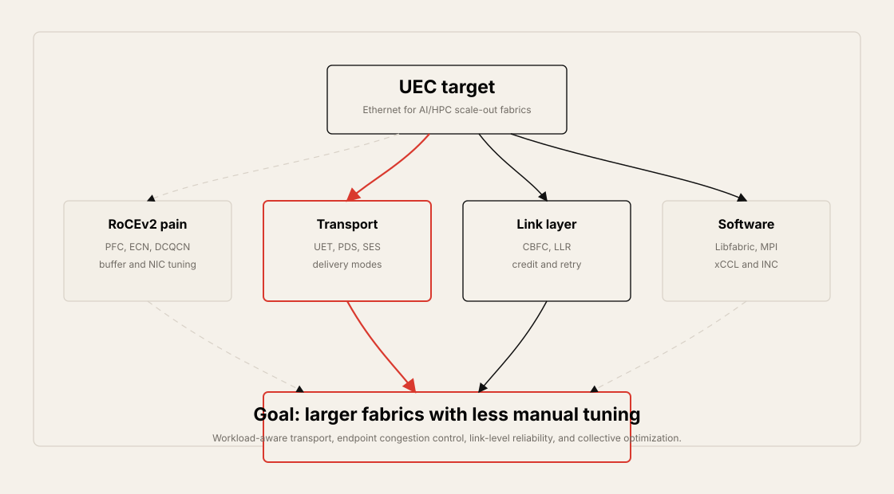
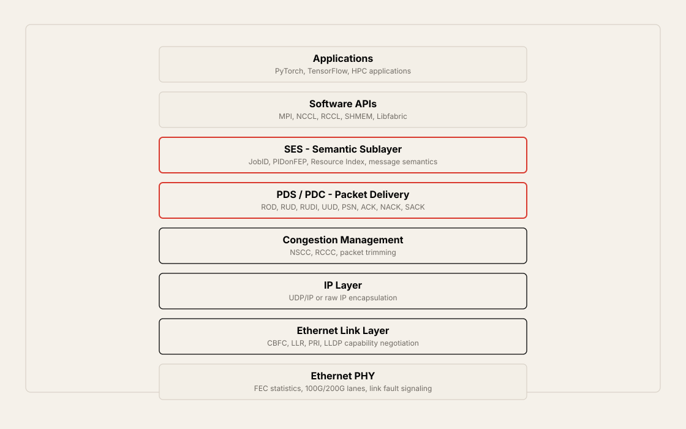
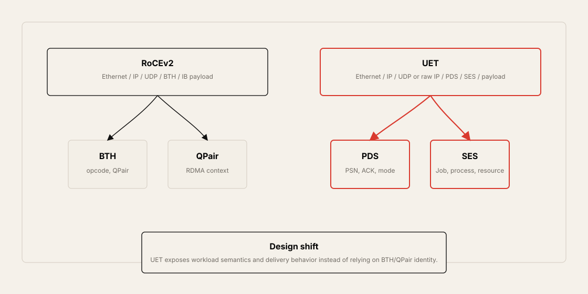
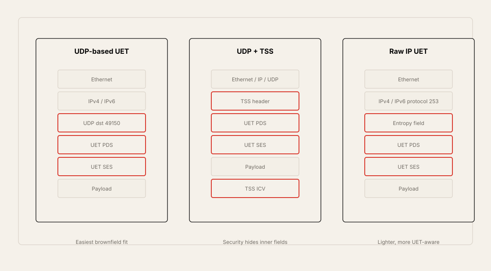
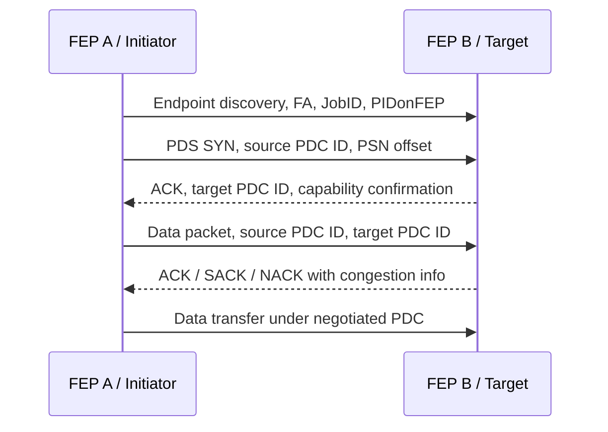
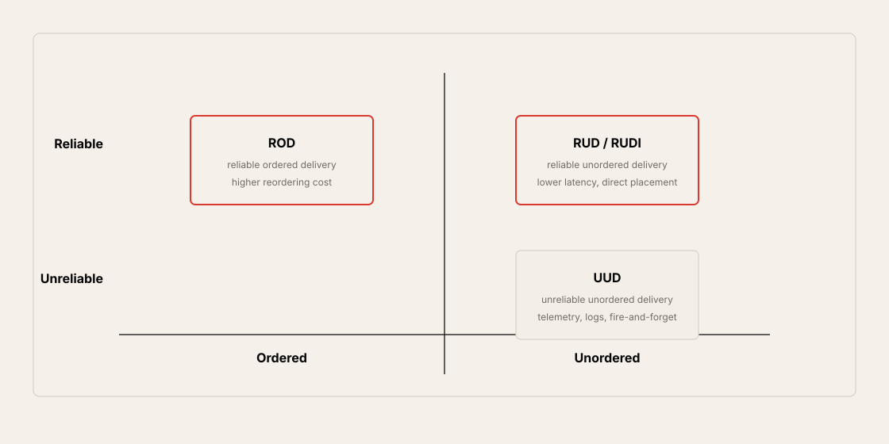
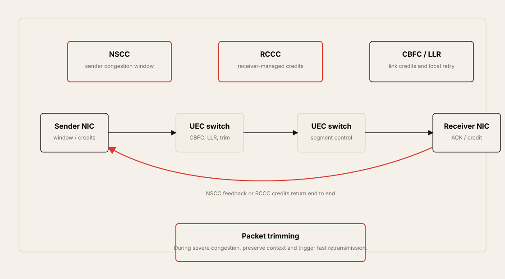
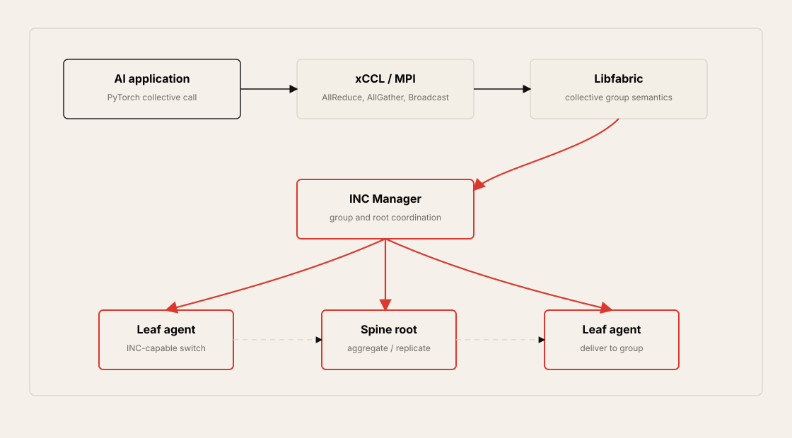

# Chapter 12: Ultra Ethernet Consortium, UEC

## Table of Contents

- [Goal](#goal)
- [Why UEC Exists](#why-uec-exists)
  - [RoCEv2 Is Powerful but Operationally Heavy](#rocev2-is-powerful-but-operationally-heavy)
  - [UEC Design Motivation](#uec-design-motivation)
- [UEC Working Groups](#uec-working-groups)
- [UEC Architecture From Application to Fabric](#uec-architecture-from-application-to-fabric)
  - [Libfabric and Software APIs](#libfabric-and-software-apis)
  - [Semantic Sublayer, SES](#semantic-sublayer-ses)
  - [Packet Delivery Sublayer, PDS](#packet-delivery-sublayer-pds)
  - [Packet Delivery Context, PDC](#packet-delivery-context-pdc)
- [Key UEC Terms](#key-uec-terms)
- [UET Compared with RoCEv2](#uet-compared-with-rocev2)
- [UET Encapsulation](#uet-encapsulation)
  - [UDP-Based Encapsulation](#udp-based-encapsulation)
  - [UDP with TSS Security](#udp-with-tss-security)
  - [Raw IP / IP-Only Encapsulation](#raw-ip--ip-only-encapsulation)
- [UEC Session Establishment](#uec-session-establishment)
- [Packet Delivery Modes](#packet-delivery-modes)
  - [ROD, Reliable Ordered Delivery](#rod-reliable-ordered-delivery)
  - [RUD, Reliable Unordered Delivery](#rud-reliable-unordered-delivery)
  - [RUDI, Reliable Unordered Delivery Idempotent](#rudi-reliable-unordered-delivery-idempotent)
  - [UUD, Unreliable Unordered Delivery](#uud-unreliable-unordered-delivery)
- [Congestion Management](#congestion-management)
  - [NSCC, Network Signal Congestion Control](#nscc-network-signal-congestion-control)
  - [RCCC, Receiver Credit Congestion Control](#rccc-receiver-credit-congestion-control)
  - [CBFC, Credit-Based Flow Control](#cbfc-credit-based-flow-control)
  - [Packet Trimming](#packet-trimming)
  - [LLR, Link Layer Reliability](#llr-link-layer-reliability)
- [In-Network Collectives, INC](#in-network-collectives-inc)
- [Interoperability and Migration](#interoperability-and-migration)
- [InfiniBand, RoCEv2, and UET Comparison](#infiniband-rocev2-and-uet-comparison)
- [Operational Validation Checklist](#operational-validation-checklist)
- [Practical Tips and Notes](#practical-tips-and-notes)
  - [Treat UEC as a Capability Matrix](#treat-uec-as-a-capability-matrix)
  - [Separate Brownfield and Greenfield Decisions](#separate-brownfield-and-greenfield-decisions)
  - [Map Delivery Mode to the Application Contract](#map-delivery-mode-to-the-application-contract)
- [Chapter Summary](#chapter-summary)
- [Key Terms](#key-terms-1)
- [Q&A](#qa)
- [References](#references)

## Goal

This chapter explains why the Ultra Ethernet Consortium, UEC, exists and how Ultra Ethernet Transport, UET, changes Ethernet-based AI/HPC fabrics.

The core idea is:

> UEC is not just faster Ethernet. It is an attempt to make Ethernet behave more like an AI/HPC fabric: more scalable, more workload-aware, more reliable, easier to tune, and more integrated with software libraries and collective communication.

The chapter focuses on these topics:

- Why RoCEv2/DCQCN/PFC-based Ethernet needs additional standardization for very large AI clusters
- UEC working groups and their areas of responsibility
- UET protocol stack from PyTorch/MPI/NCCL/RCCL/Libfabric down to Ethernet/IP
- SES, PDS, PDC, FEP, FA, JobID, PIDonFEP, Resource Index, and PSN
- UDP-based UET encapsulation and raw IP/IP-only UET encapsulation
- UEC session establishment between two fabric endpoints
- Packet delivery modes: ROD, RUD, RUDI, and UUD
- Congestion management: NSCC, RCCC, CBFC, packet trimming, and LLR
- In-Network Collectives, INC, and collective communication libraries
- Brownfield coexistence with RoCEv2 and greenfield UEC design choices
- How UET compares with InfiniBand and RoCEv2



## Why UEC Exists

Ethernet/IP fabrics have become a serious option for AI training and HPC clusters. Modern deployments use 400G and 800G links, RoCEv2, ECN, PFC, DCQCN, careful queue design, and deep telemetry to approach InfiniBand-like behavior while keeping the Ethernet/IP ecosystem.

The problem is that large AI clusters are moving beyond "make RoCEv2 work" toward a more integrated fabric model. Clusters with 100,000 GPUs already stress operational tuning. Future fabrics may target 1 million endpoints or more. At that scale, AI data center operators need more than link speed.

They need:

- Faster session ramp-up
- Less manual tuning
- Better packet delivery semantics
- Better behavior under reordering
- End-to-end and link-level congestion management
- Better packet loss recovery than broad retransmission
- Workload-aware forwarding using job and resource context
- More direct integration with MPI, NCCL, RCCL, SHMEM, and Libfabric
- Open multi-vendor interoperability

### RoCEv2 Is Powerful but Operationally Heavy

RoCEv2 carries InfiniBand transport concepts over Ethernet/IP/UDP. This makes RDMA possible on routed Ethernet fabrics, but it also creates operational requirements.

Typical RoCEv2 tuning areas:

- PFC class design
- ECN threshold design
- DCQCN profile
- Buffer allocation
- Queue mapping
- MTU
- Flow hashing and path entropy
- Reordering tolerance
- NIC firmware and driver settings
- Workload-specific tuning over time

RoCEv2 can work very well, but it can be difficult to make it plug-and-play at very large scale. UEC tries to standardize more of the full stack so the NIC, software library, transport, link layer, and switch fabric can cooperate.

### UEC Design Motivation

UEC's motivation can be summarized in four goals.

| Goal | Meaning |
| --- | --- |
| Performance | Lower latency, higher throughput, faster ramp-up, better JCT |
| Scale | Move from 100K-GPU class fabrics toward 1M endpoint scale |
| Reliability | Flexible delivery modes, selective retransmission, packet trimming, LLR |
| Full-stack design | Connect application semantics, Libfabric, transport, NIC, switch, and collectives |

The important shift is that UEC does not treat the network as a blind packet pipe. It gives the transport and software layers a way to express workload semantics through fields such as JobID, PIDonFEP, Resource Index, PDC, and packet delivery mode.

## UEC Working Groups

UEC is organized into working groups. Each group owns part of the stack or operational model.

| Working Group | Focus |
| --- | --- |
| Physical Layer WG | Ethernet PHY, FEC, link fault signaling, lane behavior |
| Link Layer WG | LLR, PRI, CBFC, link-level reliability and flow control |
| Transport WG | UET, PDS/SES, delivery modes, congestion management |
| Software WG | Libfabric, MPI, NCCL/RCCL, SHMEM, INC, collective APIs |
| Storage WG | AI/HPC storage services, UET/RDMA API compatibility |
| Compliance WG | Test suites, certification, interoperability validation |
| Management WG | Topology discovery, monitoring, multi-vendor manageability |
| Performance and Debug WG | KPIs, benchmarking, debugging capabilities |

The chapter emphasizes Link Layer, Transport, and Software because these define most of the UET behavior discussed here.

## UEC Architecture From Application to Fabric

UEC is best understood as a layered system.



At the top, AI applications and HPC applications express communication needs. Software layers such as MPI, NCCL, RCCL, SHMEM, and Libfabric translate those needs into transport semantics. UET then maps the communication into SES, PDS, congestion management, and Ethernet/IP forwarding behavior.

### Libfabric and Software APIs

Libfabric is the application-facing API layer highlighted in the chapter. Its role is to abstract the complexity of the UET stack and expose communication capabilities to upper software.

Examples of upper software:

- PyTorch
- TensorFlow
- Open MPI
- MPICH
- NCCL
- RCCL
- SHMEM

Libfabric can help translate application requirements into:

- Packet delivery mode
- Memory region association
- Message semantics
- Collective operation requirements
- Endpoint capability negotiation

This is important because UEC wants workload requirements to be expressed before packets hit the fabric.

### Semantic Sublayer, SES

SES carries high-level communication semantics.

SES can carry context such as:

- JobID
- PIDonFEP
- Resource Index
- Message type
- Memory operation type
- Message ID
- Payload length
- Buffer offset

In RoCEv2, QPair and BTH concepts dominate transport identity. In UET, JobID, PIDonFEP, and Resource Index become important for mapping traffic to workload and memory context.

### Packet Delivery Sublayer, PDS

PDS manages packet delivery behavior.

PDS includes concepts such as:

- Packet delivery mode
- Packet Sequence Number, PSN
- ACK, NACK, and SACK behavior
- PDC source and destination identifiers
- SYN and session setup flags
- Entropy field in raw IP mode

PDS is where UET expresses how packets should be delivered: ordered or unordered, reliable or unreliable, idempotent or not.

### Packet Delivery Context, PDC

PDC is a logical communication context between endpoints. It is similar to a session or channel. Two endpoints can have more than one PDC.

For a given PDC, endpoints negotiate:

- Profile, such as AI Base, AI Full, or HPC
- Packet delivery mode
- Reordering support
- Congestion management method
- ACK/NACK/SACK behavior
- Congestion Control Context, CCC

Once the PDC is established, data transfer begins and PSNs advance according to the chosen delivery and acknowledgement behavior.

## Key UEC Terms

| Term | Meaning |
| --- | --- |
| FEP | Fabric Endpoint, such as a server NIC endpoint or switch endpoint |
| FA | Fabric Address, usually IPv4 or IPv6 |
| PDC | Packet Delivery Context, a logical communication context between FEPs |
| PDS | Packet Delivery Sublayer, handles delivery mode, PSN, ACK/NACK/SACK |
| SES | Semantic Sublayer, carries job, process, resource, and message semantics |
| JobID | Cluster job identifier carried in SES |
| PIDonFEP | Process or service identifier on a Fabric Endpoint |
| Resource Index | Identifies a resource such as receive queue or memory region |
| PSN | Packet Sequence Number |
| CCC | Congestion Control Context |
| TSS | Transport Security Sublayer |
| ROD | Reliable Ordered Delivery |
| RUD | Reliable Unordered Delivery |
| RUDI | Reliable Unordered Delivery Idempotent |
| UUD | Unreliable Unordered Delivery |

## UET Compared with RoCEv2

RoCEv2 and UET both use Ethernet/IP as the underlying fabric, but their transport headers and workload semantics are different.



| Item | RoCEv2 | UET |
| --- | --- | --- |
| Transport identity | BTH, QPair, IB payload | PDS, SES, PDC, JobID, Resource Index |
| Encapsulation | Ethernet/IP/UDP + IB BTH | Ethernet/IP/UDP + PDS/SES or raw IP + PDS/SES |
| Load-balancing entropy | Often UDP 5-tuple and QPair behavior | Source UDP port or raw-IP Entropy field, plus UET-aware parsing |
| Delivery semantics | Traditional RDMA modes | ROD, RUD, RUDI, UUD |
| Congestion control | DCQCN, ECN, PFC | NSCC, RCCC, CBFC, packet trimming, LLR |
| Software integration | RDMA libraries and frameworks | Libfabric-centered API and collective integration |

The important point is that UET does not simply reuse RoCEv2 BTH/QPair semantics. It creates a new transport model where job, process, resource, packet delivery, and congestion information are explicit parts of the UET stack.

## UET Encapsulation

UET defines two main encapsulation options:

- UDP-based encapsulation
- Raw IP / IP-only encapsulation



### UDP-Based Encapsulation

UDP-based UET is expected to be easier for early deployment because it can traverse ordinary Ethernet/IP fabrics more naturally.

Conceptual packet format:

```text
Ethernet
IPv4 or IPv6
UDP
UET PDS
UET SES
UET payload
Ethernet FCS
```

Key points:

- Destination UDP port `49150` is used for UET.
- Source UDP port can be used as entropy.
- PDS carries delivery and PSN-related information.
- SES carries JobID, PIDonFEP, Resource Index, and message semantics.
- Optional UET CRC can be used for end-to-end integrity.
- Switches may need deeper parsing or better hashing behavior to use UET fields.

In RoCEv2, the UDP source port may remain stable for a flow. In UET, the source UDP port can be adapted by the NIC to influence hashing when congestion feedback indicates a need to change entropy.

### UDP with TSS Security

UET can include TSS, Transport Security Sublayer, for confidentiality, integrity, and anti-replay protection.

Conceptual format:

```text
Ethernet
IPv4 or IPv6
UDP
TSS header
UET PDS
UET SES
UET payload
TSS ICV
Ethernet FCS
```

When TSS encrypts inner fields, switches may not be able to inspect SES/PDS fields such as JobID or Resource Index. In that case, load balancing relies more on outer fields such as source UDP port.

### Raw IP / IP-Only Encapsulation

Raw IP UET removes the UDP layer and places UET directly after IP.

Conceptual format:

```text
Ethernet
IPv4 or IPv6, protocol 253
Entropy field
UET PDS
UET SES
UET payload
Ethernet FCS
```

Key points:

- No UDP header is present.
- UET uses an IP protocol value, shown in the chapter as `253`.
- A UET Entropy field replaces the source UDP port as a load-balancing input.
- Endpoints must be preconfigured or orchestrated to use the same encapsulation.
- Existing switches must be able to forward or parse the protocol behavior correctly.

Raw IP mode is lighter, but it may require more UET-aware switching and endpoint orchestration.

## UEC Session Establishment

UEC session establishment happens between Fabric Endpoints, FEPs, and creates a PDC.



During setup, endpoints negotiate:

- AI Base, AI Full, or HPC profile
- Packet delivery mode
- Reordering support
- Congestion management support
- ACK/NACK/SACK behavior
- PDC identifiers
- Starting PSN and offset behavior

Only after the PDC is established does normal data transfer begin.

## Packet Delivery Modes

UEC defines several packet delivery modes because AI workloads do not all need the same ordering and reliability behavior.



| Mode | Meaning | Strength | Cost / Risk | Example Fit |
| --- | --- | --- | --- | --- |
| ROD | Reliable Ordered Delivery | In-order reliable delivery | Higher latency due to reordering | HPC, MPI, serialized control flows |
| RUD | Reliable Unordered Delivery | Lower latency, reliable, out-of-order placement | Application must tolerate reordering | Parallel data operations, model traffic |
| RUDI | Reliable Unordered Delivery Idempotent | Safe retry of idempotent operations | App must support idempotent writes | RMA writes, gradient updates |
| UUD | Unreliable Unordered Delivery | Lowest latency, no ACK path | No reliability guarantee | Telemetry, fire-and-forget, logs |

RUD, ROD, and RUDI are reliable modes. UUD is best-effort and does not use the same reliability mechanisms.

### ROD, Reliable Ordered Delivery

ROD guarantees reliable in-order delivery. If packet spraying or multipathing causes packets to arrive out of order, the receiver may need a reordering buffer.

ROD is useful when the application or message requires in-order semantics. The cost is additional latency and buffering pressure.

### RUD, Reliable Unordered Delivery

RUD provides reliability without requiring ordered delivery.

Benefits:

- Lower latency than ROD
- Better fit for packet spraying
- Allows out-of-order direct placement
- Avoids large reordering buffer pressure
- Still supports ACK, SACK, NACK, and retransmission

RUD is attractive for AI workloads where data can be placed directly into the correct memory location even if packets arrive out of order.

### RUDI, Reliable Unordered Delivery Idempotent

RUDI is like RUD, but assumes the operation is idempotent. An operation is idempotent when retrying it multiple times does not change the final result.

This is useful for operations such as certain RMA writes or gradient updates where a safe retry can reduce recovery cost.

### UUD, Unreliable Unordered Delivery

UUD is the lowest-overhead mode. It does not provide reliability through ACK, NACK, SACK, or PSN-based retransmission.

It fits traffic where loss is acceptable:

- Telemetry
- Logs
- Fire-and-forget messages
- Some low-criticality inference side signals

It is not appropriate for data that must arrive reliably.

## Congestion Management

UEC defines multiple congestion and reliability mechanisms. They operate at different layers.



| Mechanism | Scope | Main Idea |
| --- | --- | --- |
| NSCC | End to end | Sender adjusts congestion window based on network signals |
| RCCC | End to end | Receiver grants credits based on available buffer capacity |
| CBFC | Link / segment | Hop-by-hop credit-based flow control |
| Packet trimming | Fabric-assisted fast retransmission | Switch trims payload during severe congestion and forwards metadata |
| LLR | Link / segment | Retransmit lost frames locally before end-to-end recovery |

### NSCC, Network Signal Congestion Control

NSCC is sender-side, window-based congestion control.

The sender tracks:

- Congestion window
- In-flight packets or bytes
- ACK, SACK, and NACK feedback
- RTT
- ECN signals
- Received bytes
- Out-of-order packet count

The sender sends when the congestion window allows more in-flight data. Congestion feedback from the receiver and network signals modifies that window.

NSCC is attractive for lossy Ethernet/IP fabrics because much of the state machine can be handled by server NICs while reusing ECN-capable switch behavior.

### RCCC, Receiver Credit Congestion Control

RCCC is receiver-credit-based congestion control.

The receiver knows its buffer state and active sessions. It grants credits to senders. A sender transmits only when it has available credit.

Important properties:

- Receiver controls how much data it can accept.
- Credits are returned to senders through congestion-control fields.
- Credit granularity is described in the chapter as 256-byte units.
- It is useful when receiver buffer pressure is the main control point.

RCCC is conceptually closer to a credit-managed data path than a pure sender window.

### CBFC, Credit-Based Flow Control

CBFC is a link-level credit mechanism. It is inspired by InfiniBand-style credit flow control, adapted into the UEC Ethernet context.

Compared with Ethernet PFC:

| Item | PFC | CBFC |
| --- | --- | --- |
| Control model | Pause a priority class | Send only when credit exists |
| Scope | Priority class on Ethernet link | Virtual Channel / link segment |
| Sender behavior | Stop after pause frame | Track consumed and freed credits |
| Risk | HOL blocking, pause spreading, PFC storms | More protocol and device complexity |
| UEC role | Legacy RoCEv2 lossless behavior | Optional UEC link-layer optimization |

The chapter notes that UEC can theoretically run PFC and CBFC on different virtual channels, but this can become operationally complex. Greenfield UEC designs are more likely to use CBFC/LLR consistently than brownfield mixed fabrics.

### Packet Trimming

Packet trimming is a UEC mechanism for severe congestion.

Instead of simply dropping a packet when buffers are exhausted, a switch can trim the payload and forward a smaller packet containing enough information for the destination to trigger fast retransmission.

The trimmed packet:

- Does not place payload into GPU memory.
- Tells the receiver which packet needs retransmission.
- Preserves enough context to identify the affected PDC or workload.
- Can reduce JCT compared with slower PSN-driven recovery.

Packet trimming is useful because it can identify the lost packet more quickly and avoid retransmitting more data than necessary.

### LLR, Link Layer Reliability

LLR, Link Layer Reliability, provides local link-level retry.

The idea:

1. A sender switch or NIC sends an LLR-eligible frame.
2. It stores a copy in a replay buffer.
3. The link partner ACKs the frame if received.
4. If an ACK is missing or a NACK is received, the sender retransmits locally.
5. End-to-end PDS reliability remains active above it.

LLR can reduce recovery latency because not every loss has to be recovered by the original server endpoint. However, it requires link-level support and ASIC-speed behavior.

## In-Network Collectives, INC

AI training depends heavily on collective communication such as:

- AllReduce
- AllGather
- ReduceScatter
- Broadcast
- AllToAll

In-Network Collectives, INC, is the idea that the network can assist or optimize collective operations instead of treating them as ordinary flows.



Core components:

| Component | Role |
| --- | --- |
| xCCL | Collective communication library such as NCCL, RCCL, or MPI collectives |
| Libfabric | API and semantic layer that can express collective requirements |
| INC Manager | Coordinates collective groups and fabric-level optimization |
| INC Switch Agent | Runs on INC-capable switches and applies collective behavior |
| sFEP | Switch Fabric Endpoint capable of UEC/INC functions |

The goal is to reduce duplicate traffic and improve latency by placing aggregation or replication behavior in the fabric. For example, instead of a server sending the same data separately to multiple destinations, a spine-rooted INC tree can aggregate or replicate traffic.

The chapter notes that UEC Specification v1.0 does not yet fully include INC and xCCL behavior, but the Software WG is discussing and defining this direction.

## Interoperability and Migration

UEC is designed to preserve compatibility with existing Ethernet where possible.

Important migration points:

- Existing Ethernet/IP Clos designs remain relevant.
- Three-stage, five-stage, and larger Clos designs still apply.
- UDP-based UET is likely easier for early brownfield deployment.
- AI Base profile may run over existing 400G/800G Ethernet/IP switches if parsing and hashing are sufficient.
- Raw IP UET, CBFC, LLR, and PHY-level changes are more greenfield-oriented.
- RoCEv2 and UET may coexist on the same fabric during migration.
- RoCEv2 traffic may still rely on PFC/ECN/DCQCN.
- UET traffic may rely more on NSCC/RCCC at endpoints.
- Mixing PFC with CBFC/LLR on the same links can be complex.
- Logical separation or overlays may be useful when RoCEv2 and UET workloads share infrastructure.

The practical design question is:

> Which UEC features are required for the workload now, and which can wait for a greenfield refresh?

Do not assume every optional UEC feature must be enabled at once.

## InfiniBand, RoCEv2, and UET Comparison

| Requirement | InfiniBand | RoCEv2 | UET |
| --- | --- | --- | --- |
| Scale target | Strong HPC scale, often below UET's stated target | 100K+ GPU class fabrics are possible | 1M endpoint target |
| Transport | Native InfiniBand | Ethernet/IP/UDP + BTH | Ethernet/IP/UDP or raw IP + PDS/SES |
| Congestion control | Credit-based / IB mechanisms | DCQCN, ECN, PFC | NSCC, RCCC, CBFC, trimming, LLR |
| Delivery modes | IB reliable/unreliable modes | RDMA modes, often in-order assumptions | ROD, RUD, RUDI, UUD |
| Software integration | Mature HPC ecosystem | RDMA and framework integrations | Libfabric-centered UEC model |
| INC / collectives | Mature options, vendor-specific features | Usually not native to Ethernet fabric | UEC direction through INC |
| Security | External or environment dependent | External security stack such as MACsec | TSS option in UET stack |
| Vendor diversity | More limited | Broad Ethernet ecosystem | Intended multi-vendor, early ecosystem |
| Deployment maturity | Production | Production | Emerging / early pilots |

UET's promise is to combine useful InfiniBand ideas such as credits and collectives with Ethernet/IP scale, openness, and vendor diversity.

## Operational Validation Checklist

Use this checklist when evaluating UEC or planning UET migration.

- Identify whether the target deployment is brownfield RoCEv2 coexistence or greenfield UEC.
- Decide whether UDP-based UET or raw IP UET is required.
- Verify that switches can forward and hash UET traffic correctly.
- Confirm whether source UDP port entropy or raw-IP Entropy field is used.
- Check whether switches need to parse JobID, Resource Index, or other UET fields.
- Validate endpoint support for AI Base, AI Full, or HPC profile.
- Confirm packet delivery modes supported by NICs and software stack.
- Match packet delivery mode to application semantics: ROD, RUD, RUDI, or UUD.
- Validate ACK, SACK, NACK, PSN, and retransmission behavior.
- Confirm whether NSCC, RCCC, or both are supported.
- Validate ECN behavior when NSCC is used.
- Validate receiver buffer and credit behavior when RCCC is used.
- Treat CBFC and LLR as link-layer features that need switch/NIC support.
- Avoid casually mixing PFC and CBFC on the same operational class without a clear design.
- Test packet trimming behavior and make sure trimmed packets do not enter GPU memory as data.
- Confirm TSS/CRC choices and their effect on switch visibility and load balancing.
- Validate Libfabric, MPI, NCCL/RCCL, and framework integration.
- If INC is used, validate INC Manager, INC switch agent, and collective group behavior.
- Track JCT, p99 latency, retransmissions, ECN, credits, drops, queue occupancy, and endpoint congestion state.
- Plan compliance, observability, and interoperability testing across vendors.

## Practical Tips and Notes

### Treat UEC as a Capability Matrix

UEC has many optional or implementation-dependent features. Do not treat "UEC support" as a single binary property.

Track support explicitly:

| Capability | Why It Matters |
| --- | --- |
| UDP-based UET | Brownfield compatibility and basic forwarding |
| Raw IP UET | Lower overhead, but requires UET-aware forwarding and orchestration |
| SES/PDS parsing | Better load balancing and workload-aware visibility |
| ROD/RUD/RUDI/UUD | Application-specific reliability and ordering |
| NSCC/RCCC | End-to-end congestion behavior |
| CBFC/LLR | Link-level credit and local retry behavior |
| Packet trimming | Fast retransmission under severe congestion |
| TSS/CRC | Security, integrity, and switch visibility trade-offs |
| Libfabric/xCCL/INC | Software and collective integration |
| Telemetry counters | Credits, retransmissions, delivery mode, trimming, endpoint congestion |

> [!WARNING]
> A device that can forward UET packets may not support every UEC feature needed for an AI/HPC workload. Validate the exact NIC, switch, firmware, driver, and software stack.

### Separate Brownfield and Greenfield Decisions

Brownfield deployments usually need coexistence with RoCEv2. Greenfield deployments can make cleaner link-layer and transport choices.

| Scenario | Practical Bias |
| --- | --- |
| Existing RoCEv2 fabric | Start with UDP-based UET and endpoint congestion control if supported |
| Mixed RoCEv2 + UET ToR | Keep queue, PFC, ECN, and hashing behavior explicitly separated |
| New AI training fabric | Evaluate CBFC, LLR, raw IP UET, and deeper UET-aware parsing |
| Latency-sensitive inference fabric | Test LLR and end-to-end congestion behavior with p99/p999 latency |
| Collective-heavy training | Track INC readiness, xCCL integration, and real AllReduce/AllGather time |

Do not enable link-layer mechanisms simply because they exist. CBFC, LLR, PFC, ECN, NSCC, and RCCC interact with different scopes. The design should state which layer owns which congestion problem.

### Map Delivery Mode to the Application Contract

Packet delivery mode is not only a network setting. It is an application correctness contract.

| If the application needs... | Start With | Validate |
| --- | --- | --- |
| Strict in-order data | ROD | Reordering buffer size and added latency |
| Reliable direct placement | RUD | Out-of-order placement correctness |
| Safe repeated writes | RUDI | Idempotency of the operation |
| Best-effort low overhead | UUD | Loss tolerance and observability |

For training traffic, do not assume unordered is safe until the software stack and memory operation semantics confirm it. For telemetry or fire-and-forget traffic, do not pay for reliable delivery unless the data is operationally required.

## Chapter Summary

The main takeaways:

- UEC is an open Ethernet-based effort to optimize AI, HPC, cloud, and data-intensive fabrics.
- UET is the transport layer that brings workload-aware packet delivery and congestion behavior to Ethernet/IP fabrics.
- UEC tries to reduce RoCEv2 operational burden while preserving Ethernet ecosystem advantages.
- Libfabric is a key application-facing layer that maps AI/HPC communication requirements into UET semantics.
- SES carries semantic context such as JobID, PIDonFEP, Resource Index, and message details.
- PDS carries delivery behavior such as PSN, ACK/NACK/SACK, PDC IDs, and delivery modes.
- UET can use UDP-based encapsulation or raw IP/IP-only encapsulation.
- ROD, RUD, RUDI, and UUD let applications choose ordering and reliability semantics.
- NSCC uses sender-side window control with network feedback.
- RCCC uses receiver-managed credits.
- CBFC is a link-level credit mechanism intended to improve on PFC-style pause behavior.
- Packet trimming helps fast retransmission during severe congestion.
- LLR provides local link-level retry to reduce end-to-end recovery latency.
- INC aims to bring collective-awareness into the Ethernet fabric.
- Brownfield deployments may begin with UDP-based UET and end-to-end congestion control, while deeper link-layer features are more greenfield-oriented.

## Key Terms

| Term | Meaning |
| --- | --- |
| UEC | Ultra Ethernet Consortium |
| UET | Ultra Ethernet Transport |
| FEP | Fabric Endpoint |
| FA | Fabric Address |
| PDC | Packet Delivery Context |
| PDS | Packet Delivery Sublayer |
| SES | Semantic Sublayer |
| JobID | Identifier for a cluster job |
| PIDonFEP | Process or service identifier on a Fabric Endpoint |
| Resource Index | Resource identifier such as memory or receive queue index |
| PSN | Packet Sequence Number |
| CCC | Congestion Control Context |
| NSCC | Network Signal Congestion Control |
| RCCC | Receiver Credit Congestion Control |
| CBFC | Credit-Based Flow Control |
| LLR | Link Layer Reliability |
| ROD | Reliable Ordered Delivery |
| RUD | Reliable Unordered Delivery |
| RUDI | Reliable Unordered Delivery Idempotent |
| UUD | Unreliable Unordered Delivery |
| TSS | Transport Security Sublayer |
| INC | In-Network Collectives |
| xCCL | Collective communication library family, such as NCCL/RCCL/MPI collectives |
| sFEP | Switch Fabric Endpoint |

## Q&A

### 1. What is UEC?

UEC is an industry consortium defining Ethernet-based technologies for AI, HPC, cloud, and data-intensive workloads. Its goal is to make Ethernet fabrics more scalable, reliable, workload-aware, and easier to operate for large AI clusters.

### 2. Why is UEC needed if RoCEv2 already works?

RoCEv2 works, but it requires careful PFC, ECN, DCQCN, buffer, queue, and NIC tuning. UEC tries to standardize more of the full stack so endpoint software, NICs, switches, transport semantics, and congestion control cooperate more directly.

### 3. What is UET?

UET, Ultra Ethernet Transport, is the UEC transport model. It replaces RoCEv2's BTH/QPair-centered packet model with PDS/SES/PDC semantics and supports flexible delivery modes, congestion control, and workload-aware fields.

### 4. What do SES and PDS do?

SES carries semantic information such as JobID, PIDonFEP, Resource Index, and message context. PDS handles packet delivery behavior such as PSN, ACK/NACK/SACK, PDC IDs, and delivery mode.

### 5. What are the UEC packet delivery modes?

ROD provides reliable ordered delivery. RUD provides reliable unordered delivery. RUDI provides reliable unordered delivery for idempotent operations. UUD provides unreliable unordered delivery for best-effort traffic.

### 6. How does NSCC differ from RCCC?

NSCC is sender-side window-based congestion control using network and receiver feedback. RCCC is receiver-credit-based congestion control where the receiver grants credits according to its buffer capacity and active sessions.

### 7. How does CBFC improve on PFC?

PFC pauses an entire priority class, which can cause head-of-line blocking and pause propagation. CBFC uses explicit credits per link/virtual channel so senders transmit only when receiver-side buffer credit exists.

### 8. What is packet trimming?

Packet trimming is a mechanism where a congested switch trims the payload but forwards enough packet context for the destination to request fast retransmission. It helps identify the missing packet quickly and can reduce JCT impact.

### 9. What is INC?

INC, In-Network Collectives, lets the fabric assist collective communication such as AllReduce or Broadcast. It can reduce duplicate traffic, improve bandwidth use, and lower collective latency when supported by switches, an INC manager, and software integration.

### 10. Can UEC coexist with existing Ethernet and RoCEv2?

Yes, especially through UDP-based UET and end-to-end congestion mechanisms. However, mixing RoCEv2 PFC behavior with UEC link-layer mechanisms such as CBFC and LLR needs careful design. Greenfield deployments can adopt deeper UEC features more cleanly.

## References

- [Ultra Ethernet Consortium](https://ultraethernet.org/)
- [Ultra Ethernet Specification v1.0, June 11, 2025](https://ultraethernet.org/wp-content/uploads/sites/20/2025/06/UE-Specification-6.11.25.pdf)
- [MPICH, MPI_Allreduce](https://www.mpich.org/static/docs/v3.1/www3/MPI_Allreduce.html)
- [Libfabric Programmer's Manual, fi_collective(3)](https://ofiwg.github.io/libfabric/v1.20.1/man/fi_collective.3.html)
