# Chapter 2: "The Common-Man View" of AI Data Center Fabrics

## Goal


Source: [Building Meta’s GenAI Infrastructure](https://engineering.fb.com/2024/03/12/data-center-engineering/building-metas-genai-infrastructure/)

This chapter explains **why AI/ML data center fabrics are different from traditional data center networks**.

The main idea is simple:

> AI training clusters are expensive because GPUs are expensive.
> Therefore, the network must keep GPUs busy, avoid congestion, and reduce Job Completion Time.

The chapter focuses on six major topics:

- Training vs. Inference AI Data Centers
- InfiniBand vs. Ethernet for AI Training Data Centers
- Ethernet Hardware Switches and Advanced Software Features
- Handling Elephant Flows
- Load-Balancing Techniques
- Congestion Management and Mitigation Techniques

## Frontend vs Backend AI Network

Large AI training clusters often separate the frontend network for storage/control traffic from the backend fabric for GPU-to-GPU RDMA communication.

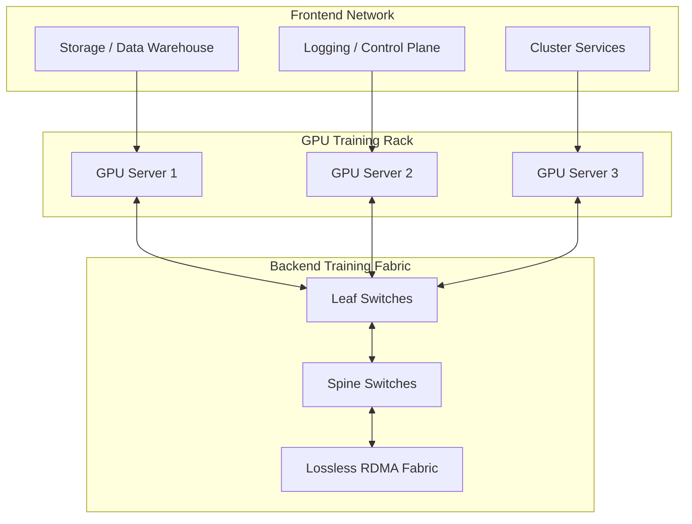

---

## Training vs. Inference AI Data Centers


AI data centers can be divided into two broad types:

| Category             | AI Training Data Center                         | AI Inference Data Center                               |
| -------------------- | ----------------------------------------------- | ------------------------------------------------------ |
| Main purpose         | Create or fine-tune models                      | Serve trained models                                   |
| Example workloads    | Pre-training, fine-tuning, distributed training | Chatbot, RAG, recommendation, image recognition        |
| Key metric           | JCT, Job Completion Time                        | Latency, TTFT, throughput                              |
| Traffic pattern      | Heavy east-west GPU-to-GPU traffic              | User request/response traffic                          |
| Operational mode     | Usually offline or batch-oriented               | Usually online and real-time                           |
| Main concern         | Keep GPUs busy and finish jobs quickly          | Respond to users quickly and reliably                  |
| Infrastructure focus | GPUs, HBM, RDMA, storage, backend fabric        | Frontend network, serving stack, edge, cost efficiency |

The chapter contrasts **model creation** and **model serving**. Training is about building the model, while inference is about using the model to answer real-time requests. In this chapter, training is associated with **Job Completion Time**, while inference is associated with **network latency and Time to First Token**. 

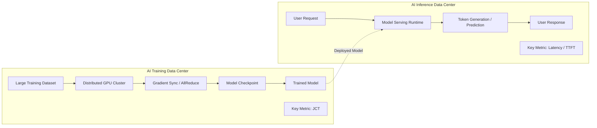

> Training data centers optimize Job Completion Time.
> Inference data centers optimize user-facing latency and TTFT.

### Training Data Centers

Training data centers are built for large-scale distributed computation. A model may be trained across hundreds, thousands, or even tens of thousands of GPUs.

During training, GPUs repeatedly compute, exchange gradients, synchronize parameters, and proceed to the next step. This creates large volumes of east-west traffic inside the data center.

The most important performance question is:

> How quickly can the training job finish?

That is why **JCT, Job Completion Time**, becomes the most important metric.

From a network perspective, training data centers require:

* High GPU-to-GPU bandwidth
* Low latency interconnects
* RDMA support
* High-performance backend fabrics
* Large-scale storage access
* Low or no packet loss
* Minimal congestion
* Predictable performance at scale

### Inference Data Centers

Inference data centers run already-trained models. The user sends a request, and the system must return an answer quickly.

The most important performance question is:

> How quickly can the system respond to the user?

For LLM services, one important metric is **TTFT, Time to First Token**. For other inference systems, latency, throughput, and cost per request may be more important.

Inference data centers require:

* Low latency response
* High request throughput
* Efficient model serving
* Cost and power efficiency
* Integration with APIs and frontend systems
* Security at edge or customer deployments
* Multi-tenancy support
* Operational reliability

### Traffic Comparisons and Evolving Data Center Networks
To summarize the traffic patterns and network demands for AI training and inference, the following table compares the traffic patterns and network demands for AI training and inference:

| Aspect | Traditional Workloads | AI Training | AI Inference |
| --- | --- | --- | --- |
| North-South Traffic | Primary traffic focus; client-server interactions. | Minimal, limited to fetching datasets and logging. | Critical for data input/output, but generative AI can tolerate higher latencies due to longer processing times. |
| East-West Traffic | Secondary; low to moderate volume, mainly for server replication, storage, etc. | Dominant traffic, high bandwidth required between GPUs. | Minimal, but can occur in complex models that span multiple GPUs. |
| Latency Sensitivity | Important for user-facing services. | Secondary to bandwidth; network bandwidth is more important to minimize training time. | For complex tasks, latency is less critical compared to response generation time. |
| Network Architecture Needs | Standard spine-leaf or tree-like topologies with limited internal bandwidth. | Fat-tree or advanced non-blocking architectures to accommodate high east-west traffic. | More edge-focused networks, but capable of handling both high north-south and occasional east-west traffic. |

Source: [Data Center Design Requirements for AI Workloads: A Comprehensive Guide](https://www.terakraft.no/post/datacenter-design-requirements-for-ai-workloads-a-comprenshive-guide)

---

## InfiniBand vs. Ethernet for AI Training Data Centers

AI training requires high-performance networking because GPUs must exchange large amounts of data. Two major fabric choices are **InfiniBand** and **Ethernet**, usually with **RoCEv2** when RDMA is required.


InfiniBand has traditionally been strong in HPC and AI training, but many organizations are now interested in Ethernet because it is open, widely understood, and easier to integrate with existing data center environments. 

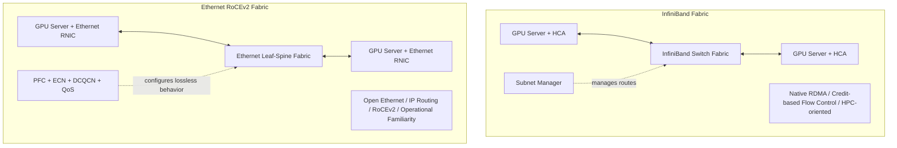

### InfiniBand

InfiniBand is widely used in HPC and AI training clusters. It provides low latency, high throughput, and RDMA-based communication.

#### Strengths of InfiniBand

| Strength                | Explanation                                            |
| ----------------------- | ------------------------------------------------------ |
| Low latency             | Very suitable for tightly coupled distributed training |
| Native RDMA             | Enables direct memory access between nodes             |
| HPC maturity            | Proven in supercomputing and AI training environments  |
| Predictable performance | Often easier to operate for GPU-scale training         |
| Strong vendor ecosystem | Especially common in NVIDIA GPU training clusters      |

InfiniBand supports RDMA, allowing one node to access another node's memory without involving the operating system or CPU in the data path. This reduces overhead and improves training efficiency. This chapter notes sub-microsecond latency, RDMA support, and scalability as key InfiniBand advantages. 

#### Limitations of InfiniBand

InfiniBand may introduce several practical challenges:

* More specialized operational knowledge
* Vendor-specific ecosystem
* Separate tooling from standard Ethernet environments
* Potentially higher cost
* Less natural integration with existing cloud, storage, and enterprise Ethernet networks

### Ethernet

Ethernet is the standard networking technology used in most data centers. For AI training, Ethernet is usually combined with **RoCEv2**, which enables RDMA over Ethernet.

#### Strengths of Ethernet

| Strength                | Explanation                                                                                |
| ----------------------- | ------------------------------------------------------------------------------------------ |
| Cost effectiveness      | Commodity switches and cables are widely available                                         |
| Operational familiarity | Most network teams already understand Ethernet                                             |
| Compatibility           | Works naturally with existing servers, storage, Kubernetes, cloud, and data center tooling |
| Flexibility             | Supports leaf-spine, mesh, multipathing, QoS, and congestion-control mechanisms            |
| Open ecosystem          | Avoids some vendor-specific constraints                                                    |

The chapter emphasizes Ethernet’s cost effectiveness, simplicity, compatibility, and flexibility as major advantages for AI training clusters. 

#### Limitations of Ethernet for AI Training

Ethernet was not originally designed as a lossless HPC fabric. To support RDMA-based AI workloads, it needs careful design.

Key challenges include:

* RoCEv2 sensitivity to packet loss
* Congestion management complexity
* PFC and ECN tuning
* RoCEv2 low-entropy traffic
* Load-balancing limitations
* Operational risk when lossless Ethernet is misconfigured

---

## Ethernet Hardware Switches and Advanced Software Features

This section explains why standard Ethernet load balancing is not enough for AI/ML fabrics.

RoCEv2 looks like UDP/IP traffic to Ethernet switches, but the real RDMA semantics live inside the InfiniBand transport header.

 


Traditional Ethernet networks often rely on ECMP hashing. ECMP commonly uses packet header fields such as:

* Source IP
* Destination IP
* Source port
* Destination port
* Protocol


This works well when traffic has enough header diversity. However, AI/ML RoCEv2 traffic often has **low entropy**, meaning many packets look similar to the switch.

### Low Entropy in RoCEv2 Traffic

In networking, **entropy** means the amount of useful variation in packet headers that a switch can use to distribute traffic across multiple paths.

High entropy means:

* Many flows look different
* ECMP can spread traffic well
* Link utilization is more balanced

Low entropy means:

* Many flows look similar
* The switch may treat different flows as the same flow
* Multiple large flows may be placed on the same path
* Congestion becomes more likely

This chapter explains that RoCEv2 traffic can have limited header entropy from the switch's point of view. RoCEv2 commonly uses UDP destination port 4791, and many AI flows may share similar IP and UDP header fields. Some deployments use the UDP source port or enhanced hashing to add entropy, but simple 5-tuple ECMP can still be ineffective when many large flows look similar.

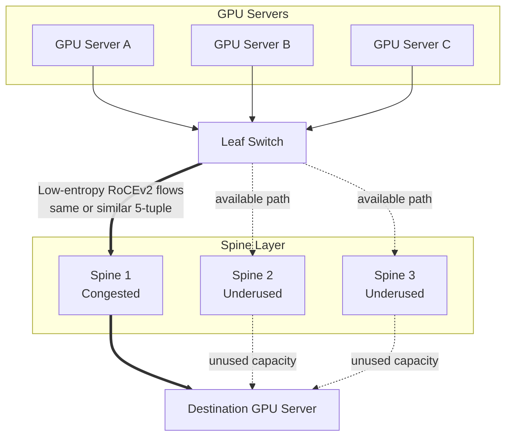
> In traditional web traffic, ECMP usually works well because flows have enough header diversity. In RoCEv2-based AI fabrics, the traffic can look too similar, so the switch needs more intelligence than simple 5-tuple hashing.

### Why This Matters

In AI training, low entropy is dangerous because the flows are not small.

They are often:

* High bandwidth
* Long lived
* Bursty
* Synchronized across many GPUs
* Sensitive to delay and packet loss

So if many flows are mapped to the same spine link or output queue, the result can be:

1. Queue buildup
2. ECN marking
3. CNP generation
4. DCQCN rate reduction
5. PFC pause
6. GPU waiting
7. Longer JCT

### Flowlets

Because many RoCEv2 flows look similar, switches may treat separate low-entropy flows as parts of the same flow. These smaller units are often discussed as **flowlets**.

The chapter distinguishes two situations:

| Type                           | Description                                                                  |
| ------------------------------ | ---------------------------------------------------------------------------- |
| Simultaneous low-entropy flows | Multiple flows exist at the same time between a small number of GPUs         |
| Sequential low-entropy flows   | One flow ends and another begins, but the switch still treats them similarly |

This matters because flow-level decisions may remain pinned to a poor path longer than expected.

### Hardware and Fabric Design Requirements

AI/ML Ethernet fabrics require more than basic switching. They need hardware and software features that can understand link utilization, buffer pressure, path quality, and flow behavior.

Important design requirements include:

#### High-Radix Switches with High-Bandwidth Links

Large AI clusters may contain tens of thousands of GPUs. Each GPU or GPU server can have high-speed NICs such as 400G, 800G, or beyond. Therefore, the fabric needs switches with many high-speed ports.

#### Low Oversubscription

If GPUs can send at line rate, but uplinks cannot carry the total traffic, congestion becomes unavoidable.

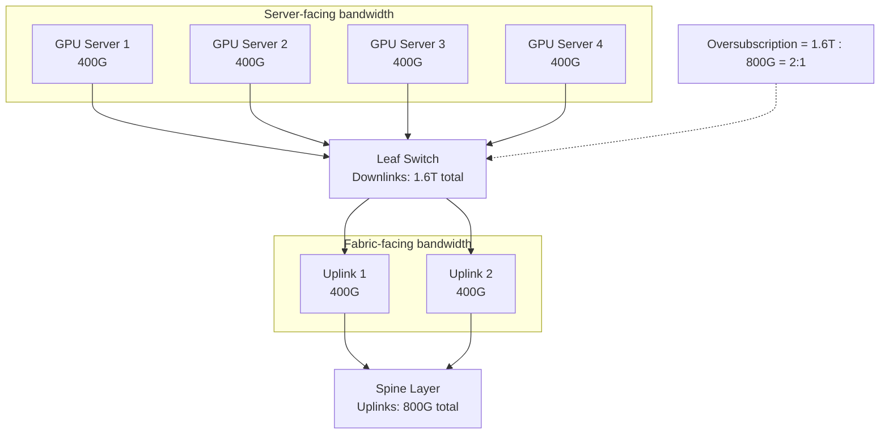

> Oversubscription occurs when server-facing bandwidth exceeds fabric-facing bandwidth. In AI training fabrics, oversubscription can directly increase Job Completion Time.

For training fabrics, especially backend GPU fabrics, the target is often close to:

> 1:1 oversubscription, or non-blocking fabric


#### Optimized Design

AI servers usually contain multiple GPUs and multiple NICs. The network design should consider:

* GPU number
* NIC number
* PCIe topology
* NUMA layout
* NVLink/NVSwitch topology
* NCCL communication pattern
* RDMA path
* Leaf/ToR placement

The chapter introduces **Rail-Optimized Design, ROD**, and **Rail-Unified Design, RUD**, as optimized design approaches for GPU clusters. 

### Instructor’s View

In traditional data centers, you can often add more bandwidth and rely on ECMP. In AI training fabrics, that is not enough.

The switch must help answer a harder question:

> Which path is actually healthy for this high-bandwidth AI flow right now?

That is why modern AI Ethernet fabrics need advanced load balancing and congestion management.

---

## Handling Elephant Flows

An **elephant flow** is a very large traffic flow that consumes significant network bandwidth.

In AI/ML training, elephant flows are common because distributed training repeatedly moves large data between GPUs and servers.

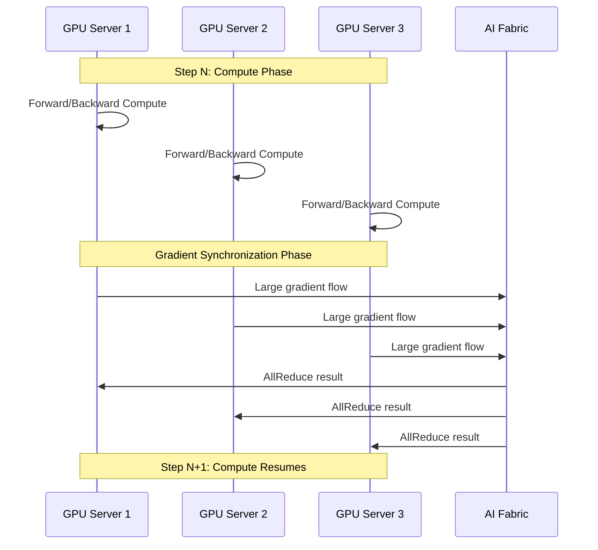
> AI training traffic is bursty: network usage rises sharply during gradient synchronization and falls again during compute phases

Examples include:

* Gradient synchronization
* Parameter exchange
* Activation exchange
* Optimizer state movement
* Training dataset transfer
* Checkpoint read/write
* GPU-to-storage transfer

The chapter defines elephant flows as traffic flows with **low entropy and high bandwidth**. It also explains that large language model training and other distributed training workloads create enormous east-west data exchange across the backend fabric. 

### Why Elephant Flows Are Hard

Elephant flows are difficult because they can quickly fill a high-speed link.

For example:

* A GPU server may try to use a full 400G or 800G NIC.
* Many GPU servers may start synchronization at the same time.
* Multiple flows may hash to the same link.
* A receiver may get traffic from many senders at once.

This can cause:

* Link congestion
* Output queue buildup
* Incast congestion
* ECN marking
* PFC pause
* Lower throughput
* GPU idle time
* Longer training time

### Burstiness

AI training traffic is often bursty.

During compute phases, the network may be relatively quiet.
During synchronization phases, many GPUs transmit at the same time.

A simple mental model:

```text
Compute phase        -> network usage is moderate or low
Gradient sync phase  -> network usage suddenly spikes
Next compute phase   -> network usage decreases again
```

This periodic burst pattern makes the fabric harder to operate than a steady traffic pattern.

### Incast Congestion

Incast congestion happens when many senders transmit to one receiver or one output port at the same time.

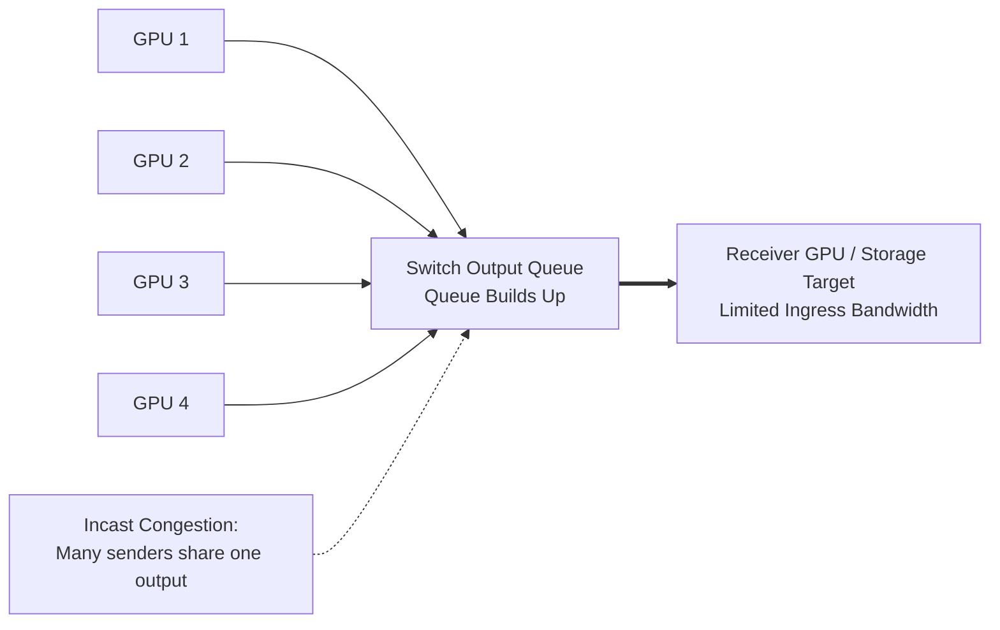


Even if each sender behaves normally, the receiver-side port or intermediate switch output queue may become congested.

---

## Load-Balancing Techniques

Load balancing is one of the most important proactive techniques in AI/ML fabrics.

The goal is to spread traffic across available paths so that no single link or queue becomes overloaded.


Dynamic load balancing (DLB) allows traffic to be distributed more efficiently and dynamically by considering changes in the network. As a result, congestion can be avoided and overall performance improved. By continuously monitoring the network state, it can adjust the path for a flow—switching to less-utilized paths if one becomes overburdened. (Source: [blog.cisco.com](https://blogs.cisco.com/datacenter/nexus-improves-load-balancing-and-brings-uec-closer-to-adoption))


Source: [blog.cisco.com](https://blogs.cisco.com/datacenter/nexus-improves-load-balancing-and-brings-uec-closer-to-adoption)

The chapter classifies load-balancing techniques into several types: **SLB, DLB, GLB, sDLB, and flow pinning**. 

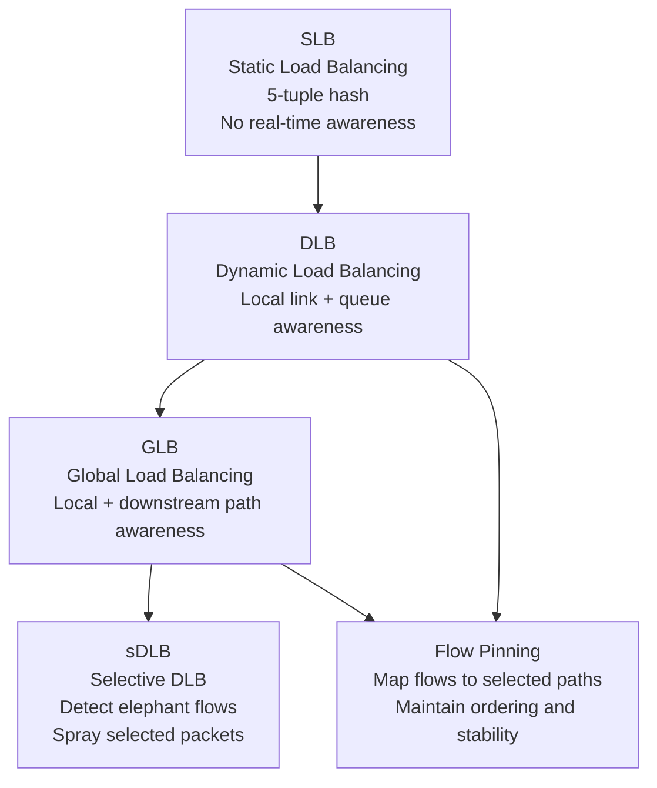

> Load balancing techniques become more adaptive as they move from static header hashing to local, global, and elephant-flow-aware decisions.

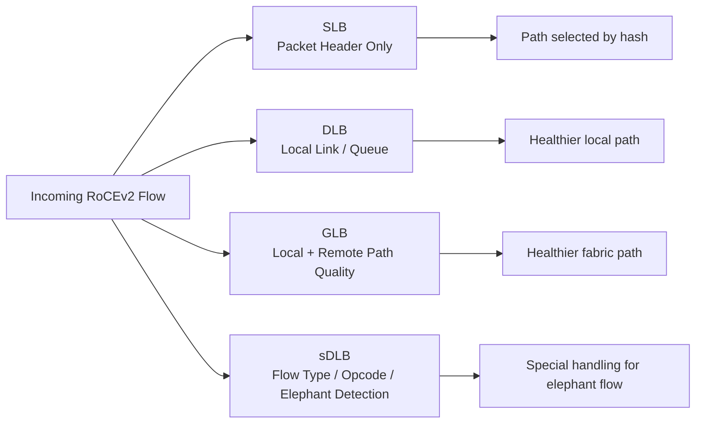
> Different load-balancing techniques use different levels of visibility, from packet headers to fabric-wide path quality.

### Static Load Balancing, SLB

Static Load Balancing is traditional hash-based load balancing.

It usually uses packet header fields, such as:

* Source IP
* Destination IP
* Source port
* Destination port
* Protocol

#### Strengths

* Simple
* Predictable
* Easy to implement
* Maintains packet ordering for a flow

#### Weaknesses

* Does not understand real-time congestion
* Does not consider queue utilization
* Does not consider link health
* Performs poorly when packet entropy is low

In AI/ML fabrics, SLB is often insufficient because many RoCEv2 flows look similar to the switch.

### Dynamic Load Balancing, DLB

Dynamic Load Balancing considers local link conditions.

It can use information such as:

* Local link utilization
* Local buffer utilization
* Queue pressure

#### Strengths

* Better than static hashing
* Can avoid locally congested links
* More adaptive to real-time conditions

#### Weaknesses

* Mostly local view
* May not know downstream congestion
* Still may not fully solve fabric-wide imbalance

DLB answers:

> Which local outgoing link looks healthy right now?

### Global Load Balancing, GLB

Global Load Balancing extends DLB by considering broader path information.

It may include:

* Local link quality
* Local queue size
* Spine link condition
* Next-hop or next-to-next-hop path quality

#### Strengths

* More fabric-aware
* Better path selection
* Can avoid downstream congestion more effectively

#### Weaknesses

* More complex
* Requires telemetry or path-quality information
* Implementation depends heavily on switch vendor capabilities

GLB answers:

> Which end-to-end path is healthier, not just which local link is free?

### Selective Dynamic Load Balancing, sDLB

Selective DLB tries to identify specific large flows, especially elephant flows, and apply more advanced packet distribution.


This chapter notes that sDLB may use deeper RoCEv2 information, such as InfiniBand Base Transport Header fields or opcode matching, to detect elephant flows and enable special load balancing for selected flows. Depending on the implementation, this may use packet spraying, flowlet switching, or another controlled distribution method.

#### Strengths

* Targets the flows that matter most
* Helps with elephant flow distribution
* Can improve fabric utilization

#### Weaknesses

* More complex
* Packet reordering may become an issue
* Requires capable NICs, switches, and careful design

sDLB answers:

> Can we identify the dangerous large flows and treat them specially?

### Flow Pinning

Flow pinning maps a flow to a specific path or interface based on flow characteristics and path state.

#### Strengths

* Helps preserve packet ordering
* More controlled than random spraying
* Can be combined with path health information

#### Weaknesses

* A pinned flow may still become imbalanced if conditions change
* Requires rebalancing logic
* Poor pinning decisions can create long-lived congestion

Flow pinning answers:

> Once we choose a good path for this flow, should we keep it there?

### Load-Balancing Summary Table

| Technique    | Decision basis                                  | Scope              | Best for                      | Main limitation               |
| ------------ | ----------------------------------------------- | ------------------ | ----------------------------- | ----------------------------- |
| SLB          | Static header hash                              | Flow-level         | Simple ECMP                   | Poor with low entropy         |
| DLB          | Local link and buffer utilization               | Local switch       | Avoiding local congestion     | Limited downstream visibility |
| GLB          | Local + remote path quality                     | Fabric-aware       | Better end-to-end path choice | More complex                  |
| sDLB         | Flow identification, opcode, elephant detection | Selected flows     | Elephant flows                | Possible packet reordering    |
| Flow pinning | Flow and path state                             | Controlled mapping | Ordering and stability        | Needs rebalancing             |

### Conclusion
Load balancing in AI fabrics is not just about spreading traffic randomly.

It is about matching the load-balancing method to the traffic type:

* Small normal flows can use simple hashing.
* Large elephant flows need more intelligent handling.
* Low-entropy RoCEv2 traffic needs special attention.
* Real-time telemetry makes better decisions possible.

---

## Congestion Management and Mitigation Techniques

Congestion management is necessary because load balancing is never perfect.

Even with good ECMP, DLB, or GLB, congestion can still happen due to:

* Elephant flows
* Bursty synchronization
* Incast traffic
* Low entropy
* Oversubscription
* Storage and compute sharing the same leaf switch
* Imperfect hashing
* Sudden workload phase changes

The chapter divides congestion handling into two categories:

1. Proactive congestion avoidance
2. Reactive congestion control

```mermaid
flowchart LR
    subgraph P[Proactive: Congestion Avoidance]
        P1[Good Topology Design]
        P2[Low Oversubscription]
        P3[ECMP / DLB / GLB / sDLB]
        P4[Path Rebalancing / Flow Pinning]
        P1 --> P2 --> P3 --> P4
    end

    subgraph R[Reactive: Congestion Control]
        R1[Queue Threshold Exceeded]
        R2[ECN Marking]
        R3[CNP to Sender]
        R4[DCQCN Rate Reduction]
        R5[PFC Pause if Severe]
        R1 --> R2 --> R3 --> R4 --> R5
    end

    P -. reduces probability of .-> R
```

This chapter explains that advanced load balancing is proactive, while ECN and PFC are reactive mechanisms. Properly implemented proactive load balancing should reduce how often reactive mechanisms are triggered. 

### Proactive Congestion Avoidance

Proactive techniques try to prevent congestion before it happens.

Examples include:

* Efficient IP ECMP
* DLB
* GLB
* sDLB
* Path rebalancing
* Flow pinning
* Better topology design
* Low oversubscription
* Rail-optimized design

The goal is:

> Select better paths before queues become congested.

Proactive congestion management is preferred because it keeps the fabric efficient without forcing senders to slow down.

### Reactive Congestion Control

Reactive techniques respond after congestion is detected.

Important mechanisms include:

* PFC, Priority Flow Control
* ECN, Explicit Congestion Notification
* DCQCN, Data Center Quantized Congestion Notification
* CNP, Congestion Notification Packet

### ECN

ECN marks packets when a switch queue exceeds a configured threshold.

The packet is not dropped. Instead, it is marked to indicate congestion.

Basic flow:

```text
Switch queue grows
        ↓
ECN threshold reached
        ↓
Packet is marked with congestion indication
        ↓
Receiver detects congestion mark
        ↓
Receiver sends congestion notification
        ↓
Sender reduces transmission rate
```

Congestion on Leaf X triggers some packets to be marked with ECN:


Source: [cisco.com](https://www.cisco.com/c/en/us/td/docs/dcn/whitepapers/cisco-data-center-networking-blueprint-for-ai-ml-applications.html)

Receiver, Host X indicates to Hosts A and B that there is congestion, by sending them CNP packets:


Source: [cisco.com](https://www.cisco.com/c/en/us/td/docs/dcn/whitepapers/cisco-data-center-networking-blueprint-for-ai-ml-applications.html)

ECN is useful because it warns the network before packet loss occurs.

### DCQCN

DCQCN is a congestion-control mechanism commonly used with RoCEv2.

It uses congestion notifications to reduce the sender’s rate.

Basic flow:

```text
Congestion occurs
        ↓
ECN marks packets
        ↓
Receiver generates CNP
        ↓
Sender receives CNP
        ↓
Sender reduces sending rate
```

DCQCN helps stabilize RDMA traffic over Ethernet.

### PFC

PFC pauses traffic for a specific priority class.

Unlike traditional Ethernet pause, which can pause all traffic, PFC can pause only selected priority traffic.

Basic flow:

```text
Switch buffer becomes dangerous
        ↓
Switch sends PFC pause frame
        ↓
Upstream sender pauses traffic for that priority
        ↓
Buffer overflow is avoided
        ↓
Frame loss is prevented
```

As the queue on Leaf X continues to build up, the leaf switch generates a PFC pause frame toward the upstream device, such as Spine 1, to pause the congesting priority class:


Source: [cisco.com](https://www.cisco.com/c/en/us/td/docs/dcn/whitepapers/cisco-data-center-networking-blueprint-for-ai-ml-applications.html)

Spine 1 propagates PFC pause frames toward Leaf 1 and Leaf 2:


Source: [cisco.com](https://www.cisco.com/c/en/us/td/docs/dcn/whitepapers/cisco-data-center-networking-blueprint-for-ai-ml-applications.html)

Leaf 1 and Leaf 2 send PFC pause frames down to hosts A and B. This reduces incoming traffic for the paused priority and helps prevent frame loss:


Source: [cisco.com](https://www.cisco.com/c/en/us/td/docs/dcn/whitepapers/cisco-data-center-networking-blueprint-for-ai-ml-applications.html)

PFC is powerful but dangerous if misconfigured. It can prevent packet loss, but it can also create head-of-line blocking, congestion spreading, or operational complexity.


### How They Work Together

A simplified RoCEv2 congestion-control path looks like this:

```text
RoCEv2 elephant flow starts
        ↓
ECMP selects path
        ↓
If path is balanced:
    traffic uses multiple spine links efficiently
        ↓
If path is imbalanced:
    queue builds up on a specific link
        ↓
ECN marks packets
        ↓
Receiver sends CNP
        ↓
DCQCN reduces sender rate
        ↓
If congestion is severe:
    PFC pauses priority traffic
        ↓
Frame loss is prevented
```

More detailed congestion control flow in RoCEv2:

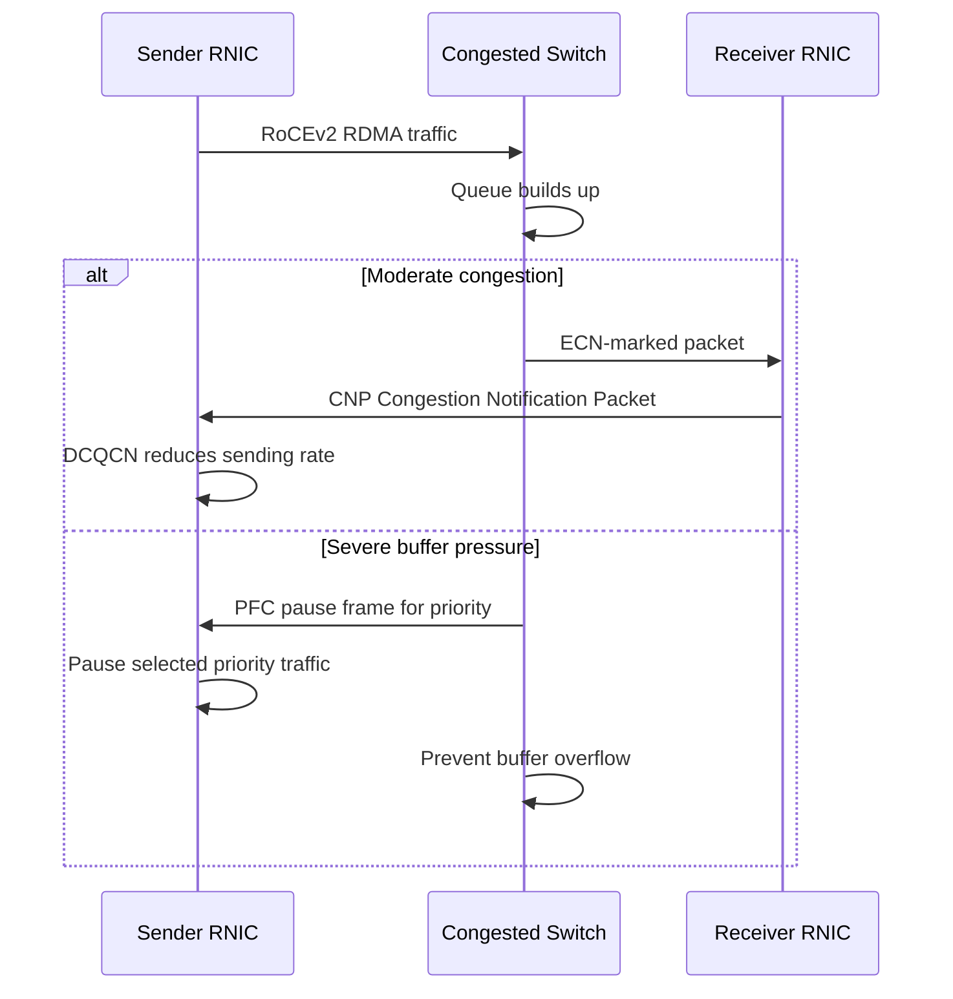
> ECN and DCQCN reduce the sender rate when congestion appears, while PFC acts as a last-resort mechanism to prevent packet loss.


Putting it all together:

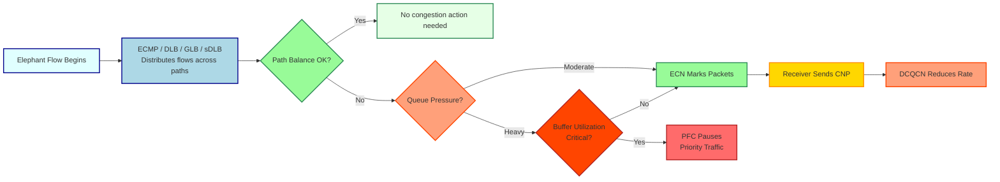


### Conclusion

The hierarchy should be understood like this:

```text
Best case:
    Good topology + good load balancing
        ↓
    No congestion

Normal case:
    Some congestion appears
        ↓
    ECN + DCQCN reduce rate

Emergency case:
    Buffer pressure becomes dangerous
        ↓
    PFC pauses traffic to prevent loss
```

In other words:

> ECMP/DLB/GLB/sDLB should prevent congestion.
> ECN/DCQCN should control congestion.
> PFC should be the last safety mechanism to prevent packet loss.

---

## Chapter Summary

Chapter 2 is not just about individual technologies. It is about understanding the design logic of AI data center fabrics.

The key lesson is:

> AI training networks must be designed around high-bandwidth, low-entropy, bursty, synchronized GPU traffic.

Traditional data center assumptions are often insufficient because AI training creates:

* Massive east-west traffic
* Elephant flows
* Low entropy RoCEv2 flows
* Bursty synchronization traffic
* Incast congestion
* High sensitivity to packet loss
* High sensitivity to GPU idle time
* Strong pressure to reduce JCT

The main design tools are:

* InfiniBand or RoCEv2-based Ethernet
* High-radix, high-bandwidth switches
* Low oversubscription
* Rail-aware topology design
* Advanced load balancing
* ECN
* DCQCN
* PFC
* Telemetry-based congestion management

A good final sentence for this chapter would be:

> The purpose of an AI data center fabric is not simply to connect GPUs.
> Its real purpose is to make expensive GPUs behave like one large, efficient, synchronized computing system.

---

## Key Terms

| Term               | Meaning                                                 |
| ------------------ | ------------------------------------------------------- |
| JCT                | Job Completion Time; key metric for training            |
| TTFT               | Time to First Token; important inference latency metric |
| RDMA               | Remote Direct Memory Access                             |
| RoCEv2             | RDMA over Converged Ethernet v2                         |
| ECMP               | Equal-Cost Multi-Path routing                           |
| Entropy            | Header diversity used for load balancing                |
| Elephant flow      | Large, high-bandwidth traffic flow                      |
| Incast congestion | Many senders congesting one receiver or output port     |
| PFC                | Priority Flow Control                                   |
| ECN                | Explicit Congestion Notification                        |
| CNP                | Congestion Notification Packet                          |
| DCQCN              | Data Center Quantized Congestion Notification           |
| SLB                | Static Load Balancing                                   |
| DLB                | Dynamic Load Balancing                                  |
| GLB                | Global Load Balancing                                   |
| sDLB               | Selective Dynamic Load Balancing                        |
| ROD                | Rail-Optimized Design                                   |
| RUD                | Rail-Unified Design                                     |

---   


## Questions

[**1**](https://learning.oreilly.com/library/view/ai-data-center/9780135436370/ch02.xhtml#ques2_1a). How do the requirements of AI training data centers differ from those of inference data centers?

> AI training data centers are optimized for large-scale distributed computation. Their key metric is Job Completion Time, or JCT. They require many GPUs, high memory bandwidth, high-speed GPU-to-GPU communication, large storage capacity, and often lossless RDMA fabrics. 
>
> AI inference data centers are optimized for serving trained models to users in real time. Their key metrics are latency, throughput, and Time to First Token, or TTFT. They usually need lower latency, predictable response time, cost efficiency, power efficiency, and integration with front-end services, APIs, edge locations, and multi-tenant environments.

[**2**](https://learning.oreilly.com/library/view/ai-data-center/9780135436370/ch02.xhtml#ques2_2a). What are the technical trade-offs between InfiniBand and Ethernet for AI training cluster deployments?

> InfiniBand provides very low latency, native RDMA, mature HPC features, and strong performance for tightly coupled distributed training. It is often easier to get predictable performance for large GPU clusters.
>
> Ethernet, especially with RoCEv2, provides a more open, widely adopted, and cost-effective infrastructure. It uses familiar tools, integrates well with existing data center networks, and supports broader operational expertise. However, Ethernet requires careful design for lossless transport, congestion control, ECMP load balancing, PFC, ECN, and DCQCN.

[**3**](https://learning.oreilly.com/library/view/ai-data-center/9780135436370/ch02.xhtml#ques2_3a). Explain the concept of low entropy in AI/ML network traffic and its impact on load balancing.

> In networking, entropy means the diversity of packet header information that switches can use to distribute flows across multiple paths. Traditional ECMP usually uses fields such as source IP, destination IP, source port, destination port, and protocol.
>
> In AI/ML RoCEv2 traffic, many packets can look very similar at the IP and UDP header level. For example, RoCEv2 commonly uses UDP destination port 4791, and traffic may occur between the same pair of GPUs. This creates low entropy, meaning the switch may not have enough header variation to spread traffic evenly.
>
> The impact is poor load balancing. Multiple large flows may be mapped to the same path, causing congestion, queue buildup, PFC pause, ECN marking, and GPU idle time.

[**4**](https://learning.oreilly.com/library/view/ai-data-center/9780135436370/ch02.xhtml#ques2_4a). What are elephant flows, and why do they pose a challenge in AI/ML fabrics?

> Elephant flows are large, high-bandwidth, long-lived or bursty traffic flows. In AI/ML training, they often appear during gradient synchronization, parameter exchange, checkpointing, or large data transfers between GPUs and storage.
>
> They are challenging because they can consume most of a NIC or link’s bandwidth. If several elephant flows collide on the same path or output queue, they can create congestion quickly. This increases latency, triggers ECN or PFC, reduces sender rate through DCQCN, and can delay the entire training job.

[**5**](https://learning.oreilly.com/library/view/ai-data-center/9780135436370/ch02.xhtml#ques2_5a). Describe the proactive and reactive congestion management techniques used in AI/ML fabrics.

> Proactive congestion management tries to avoid congestion before it happens. Examples include efficient ECMP, dynamic load balancing, global load balancing, selective DLB, path rebalancing, and flow pinning. These techniques select better paths based on flow characteristics, link utilization, queue status, or remote path quality.
>
> Reactive congestion management responds after congestion starts to appear. Examples include ECN, PFC, and DCQCN. ECN marks packets when queues exceed a threshold, the receiver generates congestion notification, and the sender reduces its rate through DCQCN. PFC can pause traffic for a specific priority class to prevent packet loss.


[**6**](https://learning.oreilly.com/library/view/ai-data-center/9780135436370/ch02.xhtml#ques2_6a). How does RoCEv2 address the need for lossless transport in Ethernet-based AI data centers?

> RoCEv2 enables RDMA over UDP/IP Ethernet, allowing GPU servers to use RDMA semantics across routable Ethernet networks. However, RDMA is sensitive to packet loss, so Ethernet must be configured to behave like a lossless or near-lossless fabric.
>
> RoCEv2 typically relies on PFC, ECN, and DCQCN. PFC prevents packet drops by pausing traffic for a specific priority. ECN marks packets when congestion starts. DCQCN uses congestion notifications to reduce the sender’s transmission rate. Together, these mechanisms help prevent frame loss and stabilize RDMA traffic over Ethernet.

[**7**](https://learning.oreilly.com/library/view/ai-data-center/9780135436370/ch02.xhtml#ques2_7a). What are the main load-balancing techniques used for AI/ML fabrics, and how do they differ?

> The main techniques are SLB, DLB, GLB, sDLB, and flow pinning.
>
> SLB, Static Load Balancing, uses traditional header-based hashing. It is simple but not very effective for AI/ML traffic because it does not consider real-time link or queue utilization.
>
> DLB, Dynamic Load Balancing, considers local link bandwidth and buffer utilization, so it can choose a healthier local path.
>
> GLB, Global Load Balancing, adds broader path awareness, including next-hop or next-to-next-hop link quality, making better decisions across the fabric.
>
> sDLB, Selective Dynamic Load Balancing, identifies elephant flows and can spray packets for selected flows, often using transport-level information such as RoCEv2/BTH opcode matching.
>
> Flow pinning maps flows to paths based on flow characteristics and path state, often to maintain ordering while still improving utilization.

[**8**](https://learning.oreilly.com/library/view/ai-data-center/9780135436370/ch02.xhtml#ques2_8a). Why is oversubscription ratio a critical design parameter in AI/ML data center fabrics?

> Oversubscription ratio compares the total downstream server-facing bandwidth with the total upstream fabric-facing bandwidth. In AI/ML training, many GPUs can send traffic at line rate at the same time, especially during synchronization phases.
>
> If the fabric is oversubscribed, the uplinks cannot carry all traffic simultaneously. This creates congestion, queue buildup, ECN marking, PFC pause, and longer job completion time. For large training clusters, a 1:1 or near non-blocking fabric is often preferred in paths where line-rate GPU traffic is expected.