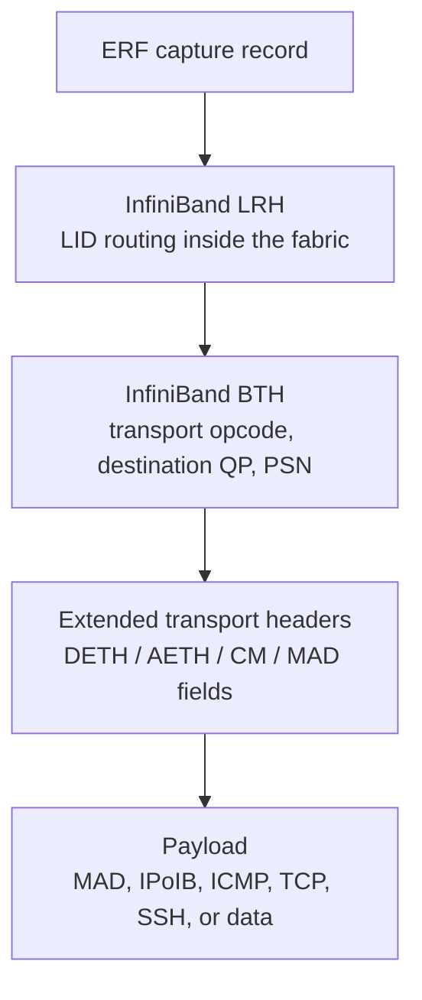
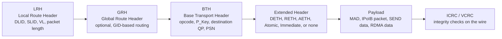
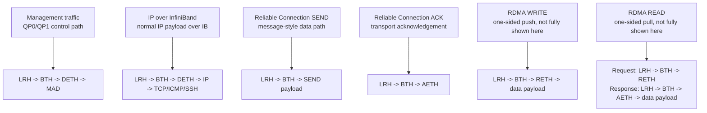
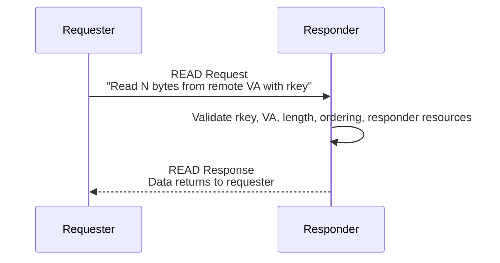
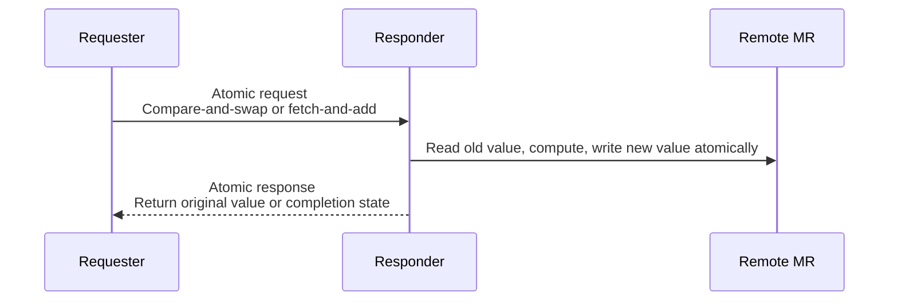
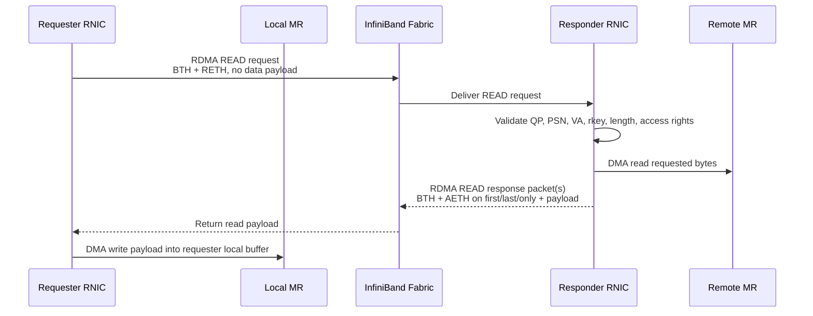
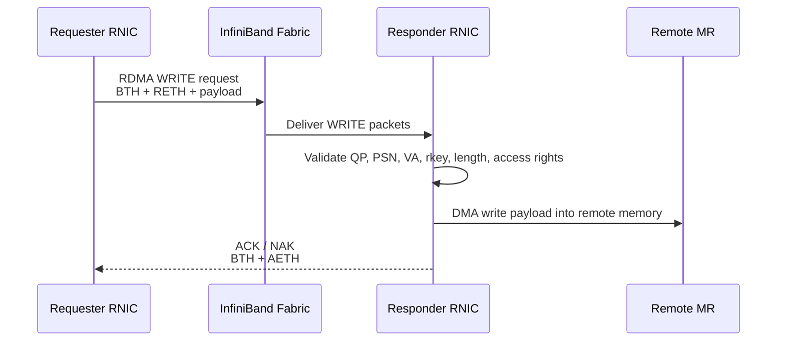
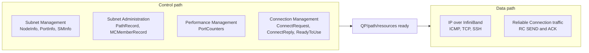

# InfiniBand Packet Analysis: A Practical RDMA Transport Primer

[](https://www.nvidia.com/en-us/networking/)
[](https://docs.nvidia.com/networking/display/rdmaawareprogrammingv17)
[](https://www.wireshark.org/docs/man-pages/tshark.html)
[](https://www.infinibandta.org/about-infiniband/)
[](https://docs.nvidia.com/networking/display/ofed/infiniband%2Bnetwork)

This report analyzes the packet captures in the `ib-packets` directory using `tshark`. The goal is to connect the captured packets back to the Chapter 1 RDMA and InfiniBand notes: data path vs control path, InfiniBand packet structure, management traffic, IP over InfiniBand, Queue Pairs, and Reliable Connection behavior. 

<p align="center">
  
</p>

## Table of Contents

- [Executive Summary](#executive-summary)
- [Scope: Observed vs Reference Model](#scope-observed-vs-reference-model)
- [Capture Set](#capture-set)
- [How the Captures Were Analyzed](#how-the-captures-were-analyzed)
- [Inferred Capture Method](#inferred-capture-method)
- [InfiniBand Protocol Stack](#infiniband-protocol-stack)
- [InfiniBand Layers Visible in the Captures](#infiniband-layers-visible-in-the-captures)
- [InfiniBand Packet Structure](#infiniband-packet-structure)
- [RDMA Read/Write Packet Analysis Model](#rdma-readwrite-packet-analysis-model)
- [Control Path vs Data Path](#control-path-vs-data-path)
- [Per-Capture Findings](#per-capture-findings)
  - [ib_initial_sniffer.pcap](#ib_initial_snifferpcap)
  - [ib_ibping_sniffer.pcap](#ib_ibping_snifferpcap)
  - [ib_ibtracert_sminfo_sniffer.pcap](#ib_ibtracert_sminfo_snifferpcap)
  - [ib_sniffer.pcap](#ib_snifferpcap)
  - [ib_ipping_sniffer.pcap](#ib_ipping_snifferpcap)
  - [ib_IPoIB.pcap](#ib_ipoibpcap)
  - [infiniband.pcap](#infinibandpcap)
- [Key Packet Examples](#key-packet-examples)
- [What These Captures Do Not Show](#what-these-captures-do-not-show)
- [Useful tshark Commands](#useful-tshark-commands)
- [Takeaways for Chapter 1](#takeaways-for-chapter-1)
- [References](#references)

## Executive Summary

The captures can be analyzed with `tshark` without superuser privileges because they are offline `.pcap` files. Root or special capture permissions are usually needed for live packet capture, not for reading existing capture files.

The packet set shows several important InfiniBand behaviors:

- InfiniBand management traffic is visible through MAD packets.
- Subnet Management traffic appears as `SubnGet`, `SubnGetResp`, `SubnSet`, and Subnet Administration records.
- Performance Management traffic appears as `PortCounters`, `PortCountersExtended`, and `ClassPortInfo`.
- IP over InfiniBand (IPoIB) is visible as normal IP, TCP, SSH, ARP, and ICMP traffic carried inside InfiniBand frames.
- One capture shows Reliable Connection (RC) behavior, including `ConnectRequest`, `ConnectReply`, `ReadyToUse`, `RC SEND Only`, and `RC Acknowledge`.

The captures are especially useful for understanding the distinction between:

- **Control path**: setup, discovery, management, path lookup, connection establishment, and performance queries.
- **Data path**: payload movement after the required resources and paths are ready.

Most captures are management or IPoIB examples. They do not show a complete RDMA Read or RDMA Write payload exchange with RETH fields, remote virtual addresses, or rkeys. The closest data-path example is `infiniband.pcap`, which shows RC SEND and AETH ACK behavior.

## Scope: Observed vs Reference Model

This report intentionally separates packet evidence from explanatory reference material.

| Topic | Status in this report | Evidence or purpose |
| --- | --- | --- |
| Subnet Management | Observed in captures | `SubnGet`, `SubnGetResp`, `SubnSet`, QP0 traffic |
| Subnet Administration | Observed in captures | Path records, multicast membership, QP1 traffic |
| Performance Management | Observed in captures | `PortCounters`, `PortCountersExtended`, `ClassPortInfo` |
| IPoIB | Observed in captures | ICMP, TCP, SSH, and ARP-like behavior over InfiniBand |
| Connection Management | Observed in captures | `ConnectRequest`, `ConnectReply`, `ReadyToUse` |
| Reliable Connection SEND/ACK | Observed in captures | `RC SEND Only`, `RC Acknowledge`, `AETH` |
| RDMA READ | Reference model only | Added to explain `BTH + RETH` request and response packet behavior for future captures |
| RDMA WRITE | Reference model only | Added to explain `BTH + RETH + payload` request behavior for future captures |
| NCCL collective traffic | Not present | Use the official [NCCL collective operations](https://docs.nvidia.com/deeplearning/nccl/user-guide/docs/usage/collectives.html), [NCCL networking troubleshooting](https://docs.nvidia.com/deeplearning/nccl/user-guide/docs/troubleshooting.html#networking-issues), and [NVIDIA/nccl-tests](https://github.com/NVIDIA/nccl-tests) references instead of expanding it here |

When reading the report, treat the observed sections as analysis of the provided pcap files. Treat the RDMA READ/WRITE section as a packet-analysis guide for future captures that include one-sided RDMA operations.

## Capture Set

| File | Packets | Duration | Main Observation |
| --- | ---: | ---: | --- |
| `ib_initial_sniffer.pcap` | 108 | 10.90 s | Initial subnet discovery, SMP, SA, multicast membership, and performance queries |
| `ib_ibping_sniffer.pcap` | 65 | 10.18 s | Vendor MAD request/response behavior plus performance counters |
| `ib_ibtracert_sminfo_sniffer.pcap` | 84 | 30.46 s | Tracing and SMInfo-related control path traffic |
| `ib_sniffer.pcap` | 24 | 6.00 s | Performance Management traffic only |
| `ib_ipping_sniffer.pcap` | 34 | 12.00 s | ICMP ping over IPoIB plus a small amount of ARP and performance traffic |
| `ib_IPoIB.pcap` | 5,848 | 4.28 s | SSH over TCP over IPoIB |
| `infiniband.pcap` | 43 | 250.57 s | SMInfo, IPoIB, CM connection setup, RC SEND, and RC ACK behavior |

All files are pcap files with **Extensible Record Format** encapsulation. `tshark` decodes the ERF outer record and then the InfiniBand payload.

## How the Captures Were Analyzed

The analysis used Wireshark/TShark 4.2.2:

```sh
tshark -v
```

Basic capture metadata:

```sh
capinfos ../ib-packets/*.pcap
```

Protocol hierarchy:

```sh
tshark -r ../ib-packets/ib_IPoIB.pcap -q -z io,phs
```

InfiniBand field extraction:

```sh
tshark -r ../ib-packets/ib_initial_sniffer.pcap \
  -Y infiniband \
  -T fields \
  -e frame.number \
  -e frame.time_relative \
  -e infiniband.lrh.dlid \
  -e infiniband.lrh.slid \
  -e infiniband.bth.opcode \
  -e infiniband.bth.destqp \
  -e infiniband.mad.method \
  -e infiniband.mad.attributeid \
  -E header=y
```

Useful fields:

| Field | Meaning |
| --- | --- |
| `infiniband.lrh.dlid` | Destination Local ID from the Local Route Header |
| `infiniband.lrh.slid` | Source Local ID from the Local Route Header |
| `infiniband.bth.opcode` | Base Transport Header opcode |
| `infiniband.bth.destqp` | Destination Queue Pair |
| `infiniband.mad.mgmtclass` | MAD management class |
| `infiniband.mad.method` | MAD method, such as Get or GetResp |
| `infiniband.mad.attributeid` | MAD attribute ID |

## Inferred Capture Method

The exact capture commands cannot be proven from the pcap files alone. The following is an inference from file names, encapsulation type, protocol hierarchy, and decoded packet contents.

The captures are likely the result of running InfiniBand diagnostic or IPoIB workloads while a native InfiniBand sniffer was recording traffic. The files use **Extensible Record Format** encapsulation and expose InfiniBand LRH/BTH/MAD fields, which is more consistent with a native InfiniBand capture path than with a simple Ethernet-style `tcpdump` on an IP interface.

| File | Likely workload during capture | Evidence |
| --- | --- | --- |
| `ib_initial_sniffer.pcap` | Fabric initialization or subnet discovery | `SubnGet(NodeInfo)`, `NodeDescription`, `PortInfo`, `SMInfo`, QP0 traffic |
| `ib_ibping_sniffer.pcap` | `ibping` between two InfiniBand nodes | Repeated vendor MAD request/response traffic between LID 5 and LID 8 |
| `ib_ibtracert_sminfo_sniffer.pcap` | `ibtracert`, `sminfo`, and possibly counter queries | `SMInfo`, `LinearForwardingTable`, `PortCounters`, `PortCountersExtended` |
| `ib_sniffer.pcap` | Performance counter polling | Mostly `PERF (PortCounters)` and `PortCountersExtended` |
| `ib_ipping_sniffer.pcap` | IP ping over IPoIB | ICMP echo request/reply plus ARP over InfiniBand |
| `ib_IPoIB.pcap` | SSH/TCP session over IPoIB | TCP conversation `10.10.10.12:34826 <-> 10.10.10.11:22`, SSH payload |
| `infiniband.pcap` | Mixed InfiniBand sample workload | `SMInfo`, `PathRecord`, `ConnectRequest`, `ConnectReply`, `ReadyToUse`, `RC SEND`, and `RC ACK` |

A plausible collection workflow would have looked like this:

```text
Terminal 1:
  Start a native InfiniBand sniffer and write to a pcap file.

Terminal 2:
  Run one diagnostic or workload command, such as ibping, ibtracert,
  sminfo, perfquery, ping over IPoIB, or SSH over an IPoIB address.

Result:
  The sniffer records LRH/BTH/MAD/IPoIB traffic into a pcap file.
```

For example, the `ib_ibping_sniffer.pcap` name and decoded packets suggest this type of scenario:

```text
Start capture:
  native IB sniffer -> ib_ibping_sniffer.pcap

Run workload:
  ibping between two IB endpoints

Observed packets:
  VENDOR MAD request/response traffic between LIDs
```

The IPoIB captures likely came from ordinary IP tools running over an `ib0`-style interface:

```text
Start capture:
  native IB or IPoIB-aware capture -> ib_ipping_sniffer.pcap

Run workload:
  ping <remote IPoIB address>

Observed packets:
  ARP, ICMP Echo request, ICMP Echo reply over InfiniBand
```

and:

```text
Start capture:
  native IB or IPoIB-aware capture -> ib_IPoIB.pcap

Run workload:
  ssh <remote IPoIB address>

Observed packets:
  TCP handshake and SSH payload over IPoIB
```

If reproducing a similar analysis from existing files, no superuser privileges are required:

```sh
tshark -r ../ib-packets/ib_ibping_sniffer.pcap -c 10
tshark -r ../ib-packets/ib_ipping_sniffer.pcap -c 10
tshark -r ../ib-packets/ib_IPoIB.pcap -q -z conv,tcp
```

If reproducing the capture itself, permissions depend on the capture method. Live capture from a privileged interface or a vendor sniffer may require extra capabilities, group membership, or root privileges. Offline analysis of the resulting pcap does not.

## InfiniBand Protocol Stack

The InfiniBand protocol stack can be viewed at two complementary levels:

- **Protocol stack view**: how applications, upper-layer protocols, transport services, network routing, link behavior, and physical signaling fit together.
- **Packet structure view**: how an individual packet is encoded on the wire, including routing headers, transport headers, optional extended headers, payload, and integrity checks.

The following third-party diagrams are useful orientation material. They are included here as educational figures, while the packet-level interpretation in this report is based on the fields visible through `tshark` and the official NVIDIA, IBTA, and Wireshark references listed below.


Conceptually, this stack explains why the captures include both **control path** protocols, such as Subnet Management and Connection Management, and **data path** traffic, such as IPoIB and Reliable Connection packets.


The encapsulation figure aligns with the next two sections: `tshark` exposes packet fields such as `LRH`, `BTH`, `DETH`, `MAD`, `AETH`, and IP payloads, depending on the packet type.

Source: [What is InfiniBand? (A Complete Guide)](https://www.naddod.com/blog/what-is-infiniband)

## InfiniBand Layers Visible in the Captures

The packet structure visible in `tshark` maps well to the Chapter 1 InfiniBand Communication Stack.



Important visible headers:

| Header | Role | Example from captures |
| --- | --- | --- |
| LRH | Local routing inside the InfiniBand fabric | `slid`, `dlid`, packet length |
| BTH | Transport behavior and QP selection | opcode `100` for UD SEND Only, opcode `4` for RC SEND Only, opcode `17` for RC ACK |
| DETH | Datagram transport fields for UD traffic | QP0/QP1 management traffic |
| MAD | Management datagram | SubnGet, SubnGetResp, PortCounters |
| AETH | ACK Extended Transport Header | RC Acknowledge packets in `infiniband.pcap` |
| IP payload | IP over InfiniBand | TCP/SSH and ICMP over IPoIB |

## InfiniBand Packet Structure

Building on the encapsulation diagram above, an InfiniBand packet can be read from left to right as **fabric routing**, **transport selection**, **operation-specific metadata**, and **payload**. The exact extended header depends on the transport and opcode.



`GRH` is optional, so many local-subnet packets are effectively `LRH -> BTH -> ...`. Some capture paths also hide or normalize link-level CRC details, so the CRC fields may be more important as an on-wire concept than as a visible field in every `tshark` decode.

Common packet shapes:



How this maps to the current captures:

| Packet family | Typical structure | Visible in this packet set? | Notes |
| --- | --- | --- | --- |
| Subnet Management | `LRH -> BTH -> DETH -> MAD` | Yes | Seen in `ib_initial_sniffer.pcap`, `ib_ibtracert_sminfo_sniffer.pcap`, and `infiniband.pcap` |
| Performance Management | `LRH -> BTH -> DETH -> MAD` | Yes | Seen as `PortCounters`, `PortCountersExtended`, and `ClassPortInfo` |
| IPoIB | `LRH -> BTH -> DETH -> IP payload` | Yes | Carries ICMP, TCP, SSH, and ARP-like behavior over InfiniBand |
| RC SEND | `LRH -> BTH -> payload` | Yes | `infiniband.pcap` shows `RC SEND Only` |
| RC ACK | `LRH -> BTH -> AETH` | Yes | `infiniband.pcap` shows `RC Acknowledge` |
| RDMA WRITE | `LRH -> BTH -> RETH -> payload` | No | This would show remote virtual address and `rkey` in `RETH` |
| RDMA READ | request with `RETH`, response with data | No | This would show the pull model described in Chapter 1 |

## RDMA Read/Write Packet Analysis Model

The current pcap set does **not** contain a complete RDMA READ or RDMA WRITE exchange. This section is therefore a reference model for how such packets should be interpreted if future captures include one-sided RDMA operations. It is based on the InfiniBand transport-layer behavior described in the official references and the Tencent Cloud article listed in the references.

The key header for one-sided RDMA operations is `RETH`, the RDMA Extended Transport Header.

| Header | Important fields | Why it matters |
| --- | --- | --- |
| `BTH` | opcode, destination QP, PSN, ACK request | Identifies the operation type and packet ordering |
| `RETH` | virtual address, `rkey`, DMA length | Authorizes and describes the remote memory range |
| `AETH` | ACK/NAK syndrome, MSN | Confirms reliable transport progress or reports an error |
| Payload | read response data or write data | Carries user data depending on operation direction |

### Operation Support by Transport Service

InfiniBand transport services do not support all verbs-style operations equally. The practical takeaway is that one-sided operations that need a response, strict ordering, or read-modify-write semantics require a reliable transport context.

| Operation | RC | UC | UD | RD |
| --- | :-: | :-: | :-: | :-: |
| SEND/RECV | ✓ | ✓ | ✓ | ✓ |
| RDMA WRITE | ✓ | ✓ | ✗ | ✓ |
| RDMA READ | ✓ | ✗ | ✗ | ✓ |
| Atomic | ✓ | ✗ | ✗ | ✓ |

In modern RDMA software, `RC` is the common practical transport for RDMA READ and Atomic operations. `RD` also supports them in the InfiniBand architecture, but it is rarely the default choice in mainstream application stacks.

Why RDMA READ does not fit UC/UD:



RDMA READ is not just a one-way packet. It creates responder-side work: the responder RNIC must validate the request, fetch remote memory, generate one or more response packets, preserve ordering, and handle retry/error behavior. `UC` has no reliable response/ACK machinery, and `UD` is message-oriented datagram transport without the connected responder state needed for remote memory reads.

Why Atomic does not fit UC/UD:



Atomic operations require a single globally ordered read-modify-write at the remote memory location. The requester also needs a reliable response to know the returned value and whether the operation completed. That requires connected state, ordering, and retry/error semantics, which is why practical deployments use RC-style reliable transport for atomics.

> Practical note for NCCL, UCX, MPI, and DC transport:
>
> NCCL collectives such as AllReduce move large chunks from GPU memory to other GPU memory. Some phases can be implemented as push-style transfers, but pull-based peer access patterns benefit from RDMA READ semantics. Ring and tree algorithms also require predictable ordering and completion behavior, so reliable transport is important.
>
> UCX is a general-purpose communication layer. Small messages may use SEND/RECV or inline paths, while large messages can use RDMA. UCX also exposes tag matching and RMA-style operations, including atomics on capable transports. That naturally favors reliable connection-oriented transports for the paths that need READ, Atomic, ordering, or retry semantics.
>
> MPI implementations often map one-sided primitives such as `MPI_Put`, `MPI_Get`, and `MPI_Accumulate` onto RDMA WRITE, RDMA READ, and Atomic operations when the transport supports it. Since MPI semantics assume reliable communication, the underlying network path usually needs reliable completion and ordering behavior.
>
> At large cluster scale, pure RC can become expensive because a dense all-to-all peer mesh may require a large number of QPs and associated HCA memory. `DC` transport, or Dynamically Connected transport, addresses this by keeping reliable semantics while dynamically reusing connection resources. This is why DC-style transports are important in large InfiniBand deployments. NVIDIA SHARP and NCCL-RDMA-SHARP paths can also appear in modern collective stacks, but the exact use of DC, UCX, verbs, or SHARP depends on hardware, plugin availability, topology, and runtime environment settings.

### Transport-Layer Details Worth Checking

The Tencent Cloud article is useful because it frames RDMA READ/WRITE as InfiniBand transport-layer operations, not just verbs API calls. The following details are worth carrying into packet analysis:

| Detail | Packet-analysis implication |
| --- | --- |
| Transport service type | `BTH` opcode bits identify whether the packet belongs to RC, UC, RD, UD, or XRC style transport behavior. This matters because ACK/NAK behavior and packet validation differ by service. |
| `BTH` is the operation decoder | `BTH` opcode determines how the bytes after `BTH` should be interpreted: `RETH`, `AETH`, `DETH`, immediate data, payload, or no extended header. |
| `PSN` is not just a counter | Packet Sequence Number is used by the responder/requester to detect missing, duplicate, or out-of-order packets. In reliable services, this drives ACK/NAK and retry behavior. |
| `P_Key` and destination QP are validation inputs | A packet can be silently dropped if its destination QP, QP state, transport type, or partition key does not match the responder context. |
| `RETH` is a protection boundary | `RETH` is not only an address descriptor. The responder must validate `rkey`, access permissions, virtual address range, and DMA length before touching remote memory. |
| `AETH` carries ACK/NAK state | In reliable transports, `AETH` tells the requester whether progress was acknowledged or whether a retry/error condition exists. |
| `ICRC/VCRC` are on-wire integrity checks | Capture tools may expose only part of this, but invalid CRCs are normally discarded before useful transport-layer interpretation. |

`P_Key` deserves special attention. It is a partition membership value carried in `BTH`, similar in spirit to a fabric-level tenant or isolation tag. The high bit indicates full vs limited membership, and the lower bits identify the partition. If a packet's `P_Key` does not match the destination port's partition membership or the QP context, the packet is not accepted as valid traffic for that partition. This is why `P_Key` should be read together with destination QP, transport type, and QP state when debugging packet drops.

Two subtle points are easy to miss:

- Multi-packet SEND and RDMA WRITE messages are not interleaved with other operations on the same send queue until the final packet of that message has been generated.
- RDMA READ behaves differently: after issuing a READ request, the requester may issue later requests without waiting for the READ response, but the maximum number of outstanding READ and ATOMIC operations is negotiated during connection setup.

### RDMA READ

RDMA READ is a one-sided **pull**. The requester asks the responder RNIC to read from remote memory and return the data.



For a small READ whose response fits within the path MTU:

```text
Request:  LRH -> BTH(RDMA READ Request) -> RETH(VA, rkey, length)
Response: LRH -> BTH(RDMA READ Response Only) -> AETH -> payload
```

For a multi-packet READ response:

```text
Request:  LRH -> BTH(RDMA READ Request)          -> RETH
First:    LRH -> BTH(RDMA READ Response First)   -> AETH -> PMTU-sized payload
Middle:   LRH -> BTH(RDMA READ Response Middle)  -> PMTU-sized payload
Last:     LRH -> BTH(RDMA READ Response Last)    -> AETH -> remaining payload
```

Important analysis points:

- The READ request packet is small because it describes what to read; it does not carry the requested data.
- A single READ request can produce multiple READ response packets when the requested length exceeds the path MTU.
- `AETH` is present in `RDMA READ Response First`, `RDMA READ Response Last`, and `RDMA READ Response Only`.
- `RDMA READ Response Middle` carries payload but does not carry `AETH`.
- `PSN` is used to detect missing or out-of-order response packets.
- The responder validates the retry request, `rkey`, remote virtual address, and access permissions.
- The requester may have more than one outstanding READ, depending on the negotiated connection limits.
- RDMA READ does not carry immediate data.

Example Wireshark decode, with sensitive values anonymized:

```text
RDMA READ Request
  BTH:
    Opcode: Reliable Connection (RC) - RDMA READ Request
    Partition Key: 0xffff
    Destination QP: 0x00xxxx
    Acknowledge Request: True
    Packet Sequence Number: <request_psn>
  RETH:
    Virtual Address: 0x0000xxxxxxxxxxxx
    Remote Key: 0x00xxxxxx
    DMA Length: 65536 bytes
  ICRC:
    Present
```

```text
RDMA READ Response Middle
  BTH:
    Opcode: Reliable Connection (RC) - RDMA READ Response Middle
    Partition Key: 0xffff
    Destination QP: 0x00xxxx
    Acknowledge Request: False
    Packet Sequence Number: <response_psn>
  Payload:
    Data: 1024 bytes
  ICRC:
    Present
```

The request decode is the key evidence for a one-sided READ: it has `BTH + RETH`, and `RETH` carries the remote virtual address, `rkey`, and requested DMA length. `BTH` also carries the `Partition Key` (`P_Key`), which identifies the InfiniBand partition membership used by the packet. A commonly seen value such as `0xffff` represents full membership in the default partition, but production fabrics may use different partition keys for isolation. The response-middle decode shows the reverse data movement: it carries data payload but no `RETH` and no `AETH`. This matches the multi-packet READ model where `AETH` appears on the first, last, or only response packet, while middle response packets are pure data-bearing segments.

For public documentation, avoid publishing raw screenshots unless the following fields are masked:

- Remote virtual address
- `rkey`
- destination QP
- packet sequence number
- any payload bytes that may contain application data

Example `AETH` decode, with sensitive values anonymized:

```text
RC Acknowledge
  BTH:
    Opcode: Reliable Connection (RC) - Acknowledge
    Partition Key: 0xffff
    Destination QP: 0x00xxxx
    Acknowledge Request: False
    Packet Sequence Number: <ack_psn>
  AETH:
    Syndrome: 0, Ack
    OpCode: Ack
    Credit Count: <credit_count>
    Message Sequence Number: <msn>
  ICRC:
    Present
```

`AETH` is the key ACK/NAK carrier for reliable transport. A normal ACK indicates that the responder accepted progress for the relevant reliable operation. If the syndrome indicates NAK or an error condition, the requester may need to retry or fail the Work Request depending on the transport state and retry counters. In packet analysis, `BTH` tells us this is an RC acknowledge packet and which partition/QP context it belongs to, while `AETH` tells us whether it is a successful acknowledgement or an error/flow-control signal.

### RDMA WRITE

RDMA WRITE is a one-sided **push**. The requester sends data to a remote memory range that the responder has already registered and shared through metadata exchange.



For a small WRITE whose payload fits within the path MTU, the packet shape is:

```text
LRH -> BTH(RDMA WRITE Only) -> RETH(VA, rkey, length) -> payload -> ICRC/VCRC
```

For a multi-packet WRITE, the message is segmented:

```text
First  packet: LRH -> BTH(RDMA WRITE First)  -> RETH -> PMTU-sized payload
Middle packet: LRH -> BTH(RDMA WRITE Middle) -> PMTU-sized payload
Last   packet: LRH -> BTH(RDMA WRITE Last)   -> remaining payload
ACK:           LRH -> BTH(Acknowledge)       -> AETH
```

Important analysis points:

- `RETH` appears in the first packet or the only packet of an RDMA WRITE message.
- `RETH` carries the remote virtual address, `rkey`, and DMA length.
- Middle and last WRITE packets carry payload but do not repeat the full remote memory metadata.
- The responder checks the `rkey`, access permissions, address range, and packet sequence.
- Multi-packet WRITE messages are ordered as one message and are not interleaved with other operations on the same send queue before the final WRITE packet.
- In reliable transports such as RC, the responder returns an ACK or NAK using `AETH`.
- A normal RDMA WRITE updates remote memory but does not automatically notify the remote application. Notification requires a higher-level protocol, `RDMA_WRITE_WITH_IMM`, SEND/RECV, or polling.

### What Future Captures Should Show

A future pcap that truly contains one-sided RDMA traffic should show at least some of the following:

| Expected evidence | RDMA READ | RDMA WRITE |
| --- | --- | --- |
| BTH opcode | `RDMA READ Request`, `RDMA READ Response First/Middle/Last/Only` | `RDMA WRITE First/Middle/Last/Only` |
| RETH | Request packet | First or only request packet |
| Remote virtual address | In request `RETH` | In `RETH` |
| `rkey` | In request `RETH` | In `RETH` |
| Payload direction | Responder to requester | Requester to responder |
| AETH | First, last, or only read response | ACK/NAK response |
| Target CPU involvement | Not in data path | Not in data path |

This explains why the current packet set is useful for RDMA/IB fundamentals but still cannot be treated as a full one-sided RDMA data-path capture.

## Control Path vs Data Path

The captures make the Chapter 1 distinction between control path and data path concrete.



### Control Path

Control path traffic is strongly represented in these captures. It includes:

- Subnet discovery through QP0.
- Subnet Administration through QP1.
- Path discovery and multicast membership.
- Performance counter queries.
- Connection Management messages.

This corresponds to Chapter 1's explanation that RDMA does not remove the kernel or control software from the system. The CPU, kernel driver, subnet manager, RDMA runtime, and NIC firmware still configure resources and paths.

### Data Path

Data path traffic appears in two forms:

- IPoIB traffic, where normal IP applications run over InfiniBand.
- RC SEND/ACK traffic, where InfiniBand transport behavior is visible below an IP payload.

The packet set does not show full RDMA Write or RDMA Read operations with RETH. Therefore, it is better to describe it as an InfiniBand and IPoIB packet set, not as a complete RDMA Read/Write capture set.

## Per-Capture Findings

### ib_initial_sniffer.pcap

This capture is the best example of InfiniBand control path initialization.

Protocol hierarchy:

```text
erf
  infiniband
    arp
```

Representative packets:

```text
UD Send Only QP=0x000000 SubnGet(NodeInfo)
UD Send Only QP=0x000000 SubnGetResp(NodeInfo)
UD Send Only QP=0x000000 SubnGet(NodeDescription)
UD Send Only QP=0x000000 SubnGetResp(NodeDescription)
UD Send Only QP=0x000000 SubnGet(PortInfo)
UD Send Only QP=0x000000 SubnGetResp(PortInfo)
```

Interpretation:

- QP0 is used for Subnet Management Packets.
- The node is being discovered and configured.
- `NodeInfo`, `NodeDescription`, `PortInfo`, `P_KeyTable`, and `SMInfo` are part of fabric discovery and setup.
- Subnet Administration records such as `MCMemberRecord` and `InformInfo` also appear.
- This is control path traffic, not user payload movement.

Why it matters for Chapter 1:

- It shows the setup work that must happen before the fast path can be used.
- It supports the point that "kernel bypass" does not mean "no setup or control path."
- It maps to PD/QP/MR/path readiness concepts in the RDMA Process section.

### ib_ibping_sniffer.pcap

This capture is centered on `ibping` behavior and vendor MAD messages.

Protocol hierarchy:

```text
erf
  infiniband
```

Representative packets:

```text
LID: 5 -> LID: 8   InfiniBand 290 VENDOR (Unknown Attribute)
LID: 8 -> LID: 5   InfiniBand 290 VENDOR (Unknown Attribute)
```

Top decoded items:

```text
VENDOR (Unknown Attribute)
PERF (PortCounters)
PERF (ClassPortInfo)
PERF (PortCountersExtended)
```

Interpretation:

- `ibping` uses InfiniBand management-style traffic rather than IP ping.
- The capture shows request/response behavior between LID 5 and LID 8.
- The periodic pattern is visible: requests and responses are roughly one second apart.
- Performance Management traffic is also present.

Why it matters for Chapter 1:

- It demonstrates that InfiniBand has its own management and diagnostic traffic independent of TCP/IP.
- LIDs are used directly at the fabric level.

### ib_ibtracert_sminfo_sniffer.pcap

This capture combines trace-related behavior, SMInfo, and performance management.

Protocol hierarchy:

```text
erf
  infiniband
```

Representative packets:

```text
PERF (PortCounters)
PERF (PortCountersExtended)
UD Send Only QP=0x000000 SubnGet(SMInfo)
UD Send Only QP=0x000000 SubnGetResp(SMInfo)
UD Send Only QP=0x000000 SubnGet(LinearForwardingTable)
UD Send Only QP=0x000000 SubnGetResp(LinearForwardingTable)
```

Interpretation:

- `ibtracert` needs fabric topology and forwarding information.
- `SMInfo` identifies subnet manager information.
- `LinearForwardingTable` points to switch forwarding behavior.
- Performance counters show management-plane visibility into port state.

Why it matters for Chapter 1:

- It shows the control plane objects behind the switched fabric model.
- It supports the Packet Relay / Fabric section: switches forward packets, while management traffic discovers and programs fabric behavior.

### ib_sniffer.pcap

This is a small Performance Management capture.

Protocol hierarchy:

```text
erf
  infiniband
```

Top decoded items:

```text
PERF (PortCounters)
PERF (PortCountersExtended)
```

Interpretation:

- The capture is dominated by performance counter queries.
- It is useful for observing monitoring traffic, but it does not show application payloads or RDMA Read/Write operations.

Why it matters for Chapter 1:

- It connects to the monitoring side of the control path.
- Fabric health is not inferred only from data packets. It is also queried through management traffic.

### ib_ipping_sniffer.pcap

This capture shows ICMP over IPoIB.

Protocol hierarchy:

```text
erf
  infiniband
    ip
      icmp
    arp
```

Representative packets:

```text
203.0.113.17 -> 203.0.113.18   ICMP Echo request
203.0.113.18 -> 203.0.113.17   ICMP Echo reply
```

Interpretation:

- This is not `ibping`; it is IP ping carried over InfiniBand.
- It shows normal IP packets mapped onto InfiniBand.
- ARP appears because IPoIB still needs address resolution for IP communication.

Why it matters for Chapter 1:

- It demonstrates the difference between native InfiniBand management tools and IP over InfiniBand.
- It shows how normal IP applications can run above InfiniBand transport.

### ib_IPoIB.pcap

This is the largest capture and shows SSH over TCP over IPoIB.

Protocol hierarchy:

```text
erf
  infiniband
    ip
      tcp
        ssh
```

TCP conversation:

```text
10.10.10.12:34826 <-> 10.10.10.11:22
Total frames: 5848
Total bytes: 10 MB
Duration: 4.2846 s
```

Representative packets:

```text
10.10.10.12 -> 10.10.10.11   TCP 34826 -> 22 [SYN]
10.10.10.11 -> 10.10.10.12   TCP 22 -> 34826 [SYN, ACK]
10.10.10.12 -> 10.10.10.11   SSH Client: Protocol
```

Interpretation:

- This is an IP workload carried over InfiniBand.
- The application is SSH, not RDMA Read/Write.
- `tshark` decodes the upper layers just like ordinary IP traffic once it gets past the InfiniBand encapsulation.
- The high frame count and 10 MB size make this the best sample for IPoIB throughput-style traffic.

Why it matters for Chapter 1:

- It shows that InfiniBand can carry ordinary IP workloads.
- It should not be confused with RDMA semantics. IPoIB is not the same as one-sided RDMA.

### infiniband.pcap

This is the most useful capture for seeing multiple InfiniBand concepts in one place.

Protocol hierarchy:

```text
erf
  infiniband
    ip
      udp
      icmp
    arp
    ipv6
      icmpv6
```

Important decoded items:

```text
UD Send Only QP=0x000000 SubnGet(SMInfo)
UD Send Only QP=0x000000 SubnGetResp(SMInfo)
CM: ConnectRequest
CM: ConnectReply
CM: ReadyToUse
RC Acknowledge
ICMP Echo request
ICMPv6 Neighbor Solicitation / Advertisement
```

Condensed flow:

```text
1-2      SMInfo query and response
3-6      IPoIB UDP/ARP traffic
7-9      Connection Management: request, reply, ready
10-23    RC SEND Only carrying ICMP and RC ACK packets
24-25    More UDP over IPoIB
26-31    IPv6 neighbor discovery and RC ACK
32-33    Subnet Administration PathRecord lookup
34-40    Second CM setup plus ICMPv6 traffic and ACKs
41-42    SMInfo query and response
43       ICMPv6 echo request
```

The most important pair is frame 10 and frame 11:

```text
Frame 10:
  Opcode: Reliable Connection (RC) - SEND Only (4)
  Destination QP: 0xfc0407
  Acknowledge Request: True
  Payload: IPv4 ICMP Echo request

Frame 11:
  Opcode: Reliable Connection (RC) - Acknowledge (17)
  Destination QP: 0x870408
  AETH: Ack
```

Interpretation:

- Connection Management prepares communication.
- RC SEND carries an IP payload.
- RC ACK confirms reliable delivery.
- AETH is visible in the ACK packet.
- This is close to the Chapter 1 discussion of two-sided reliable transport, even though it is not a full RDMA Write or Read example.

Why it matters for Chapter 1:

- It visibly connects QP, BTH opcode, PSN, ACK, and AETH.
- It shows how a ready connection can carry payload and receive transport-level acknowledgments.
- It helps explain why InfiniBand reliability is handled by the HCA/RNIC rather than by the CPU for each packet.

## Key Packet Examples

### Subnet Management over QP0

From `ib_initial_sniffer.pcap`:

```text
UD Send Only QP=0x000000 SubnGet(NodeInfo)
UD Send Only QP=0x000000 SubnGetResp(NodeInfo)
```

Meaning:

- QP0 is used for Subnet Management.
- The traffic is part of fabric discovery and configuration.
- This is control path behavior.

### Performance Management

From `ib_sniffer.pcap` and related captures:

```text
PERF (PortCounters)
PERF (PortCountersExtended)
```

Meaning:

- Fabric components expose counters through management traffic.
- These counters support monitoring and troubleshooting.
- This is not application data movement.

### IPoIB

From `ib_ipping_sniffer.pcap`:

```text
203.0.113.17 -> 203.0.113.18   ICMP Echo request
203.0.113.18 -> 203.0.113.17   ICMP Echo reply
```

From `ib_IPoIB.pcap`:

```text
10.10.10.12:34826 <-> 10.10.10.11:22   TCP/SSH
```

Meaning:

- IP packets can be transported over InfiniBand.
- Upper-layer tools may look familiar, but the L2/L3 underlay is InfiniBand rather than Ethernet.

### Reliable Connection SEND and ACK

From `infiniband.pcap`:

```text
RC SEND Only QP=0xfc0407
RC Acknowledge QP=0x870408
```

Meaning:

- The BTH opcode distinguishes the transport operation.
- The destination QP identifies the queue pair endpoint.
- The ACK includes AETH.
- This shows reliable InfiniBand transport behavior.

## What These Captures Do Not Show

These captures are not full RDMA Read/Write examples.

Missing from the packet set:

- RDMA Write packets with RETH.
- RDMA Read request and response flows.
- Remote virtual address and rkey fields in RETH.
- A complete one-sided RDMA data movement example.
- NCCL collective traffic.

Therefore, the correct interpretation is:

> These captures demonstrate InfiniBand fabric management, IPoIB, and some reliable connection transport behavior. They support the RDMA/IB concepts in Chapter 1, but they do not fully demonstrate RDMA Read or RDMA Write data movement.

The [RDMA Read/Write Packet Analysis Model](#rdma-readwrite-packet-analysis-model) section above describes what should appear in future captures that include one-sided operations.

## Useful tshark Commands

List basic packet summaries:

```sh
tshark -r ../ib-packets/infiniband.pcap -c 20
```

Show protocol hierarchy:

```sh
tshark -r ../ib-packets/ib_IPoIB.pcap -q -z io,phs
```

Extract LRH, BTH, and MAD fields:

```sh
tshark -r ../ib-packets/ib_initial_sniffer.pcap \
  -Y infiniband \
  -T fields \
  -e frame.number \
  -e frame.time_relative \
  -e infiniband.lrh.slid \
  -e infiniband.lrh.dlid \
  -e infiniband.bth.opcode \
  -e infiniband.bth.destqp \
  -e infiniband.mad.mgmtclass \
  -e infiniband.mad.method \
  -e infiniband.mad.attributeid \
  -E header=y
```

Count BTH opcodes:

```sh
tshark -r ../ib-packets/infiniband.pcap \
  -Y "infiniband.bth.opcode" \
  -T fields \
  -e infiniband.bth.opcode | sort | uniq -c
```

Show a detailed packet decode:

```sh
tshark -r ../ib-packets/infiniband.pcap \
  -Y "frame.number==10 || frame.number==11" \
  -V
```

Find IPoIB TCP conversations:

```sh
tshark -r ../ib-packets/ib_IPoIB.pcap -q -z conv,tcp
```

Discover the exact InfiniBand field names supported by the local Wireshark/TShark build:

```sh
tshark -G fields | rg -i "infiniband.*(bth|reth|aeth|opcode|psn|rkey)"
```

If a future capture contains RDMA READ or WRITE packets, start with BTH opcodes and then expand into RETH/AETH details:

```sh
tshark -r ../ib-packets/<rdma-read-write-capture>.pcap \
  -Y "infiniband.bth.opcode" \
  -T fields \
  -e frame.number \
  -e infiniband.bth.opcode \
  -e infiniband.bth.destqp \
  -e infiniband.bth.psn
```

## Takeaways for Chapter 1

1. **InfiniBand has a visible control path.**
   The captures show Subnet Management, Subnet Administration, Performance Management, and Connection Management traffic. This reinforces the Chapter 1 point that RDMA kernel bypass mainly applies to the data path.

2. **LIDs and QPs are real packet-level identifiers.**
   LRH fields show source and destination LIDs. BTH fields show destination QPs and opcodes. These are not just abstract API concepts.

3. **QP0 and QP1 matter for management.**
   QP0 appears in Subnet Management traffic. QP1 appears in Subnet Administration and Connection Management traffic.

4. **IPoIB is different from one-sided RDMA.**
   IPoIB carries normal IP traffic over InfiniBand. It can show TCP, SSH, ARP, and ICMP, but that does not mean it is showing RDMA Read or RDMA Write.

5. **Reliable Connection behavior is visible.**
   `infiniband.pcap` shows RC SEND and RC ACK packets. The ACK includes AETH, which matches the Chapter 1 discussion of ACK Extended Transport Header behavior.

6. **The data path/control path distinction should stay explicit.**
   The management captures are mostly control path. IPoIB and RC SEND/ACK are closer to data path. Full RDMA Read/Write would require additional captures that include RETH and one-sided operation fields.


## References

### NVIDIA official documentation
- [NVIDIA Introduction to InfiniBand™](https://network.nvidia.com/pdf/whitepapers/IB_Intro_WP_190.pdf)
- [NVIDIA RDMA Aware Networks Programming User Manual: Key Concepts](https://docs.nvidia.com/networking/display/rdmaawareprogrammingv17/key%2Bconcepts)
- [NVIDIA MLNX_OFED: InfiniBand Network](https://docs.nvidia.com/networking/display/ofed/infiniband%2Bnetwork)
- [NVIDIA MLNX_OFED Documentation v24.04-0.7.0.0](https://docs.nvidia.com/networking/display/mlnxofedv24040700)
- [NVIDIA Quantum InfiniBand Networking Solutions](https://www.nvidia.com/en-us/networking/products/infiniband/)
- [NVIDIA Quantum-X800 InfiniBand Platform](https://www.nvidia.com/en-us/networking/products/infiniband/quantum-x800/)
- [NVIDIA NCCL Documentation](https://docs.nvidia.com/deeplearning/nccl/user-guide/docs/index.html)
- [NVIDIA NCCL Collective Operations](https://docs.nvidia.com/deeplearning/nccl/user-guide/docs/usage/collectives.html)
- [NVIDIA NCCL Environment Variables](https://docs.nvidia.com/deeplearning/nccl/user-guide/docs/env.html)
- [NVIDIA NCCL Troubleshooting: Networking Issues](https://docs.nvidia.com/deeplearning/nccl/user-guide/docs/troubleshooting.html#networking-issues)
- [NVIDIA SHARP with NVIDIA NCCL](https://docs.nvidia.com/networking/display/sharpv3140/using-nvidia-sharp-with-nvidia-nccl)
- [NVIDIA HPC-X NCCL-RDMA-SHARP Plugins](https://docs.nvidia.com/networking/display/hpcx222/nccl-rdma-sharp%2Bplugins)

### Protocol and tooling references

- [InfiniBand Trade Association: InfiniBand Architecture Specification FAQ](https://www.infinibandta.org/ibta-specification/)
- [InfiniBand Trade Association: About InfiniBand](https://www.infinibandta.org/about-infiniband/)
- [Wireshark Display Filter Reference: InfiniBand](https://www.wireshark.org/docs/dfref/i/infiniband.html)
- [TShark Manual Page](https://www.wireshark.org/docs/man-pages/tshark.html)
- [linux-rdma rdma-core](https://github.com/linux-rdma/rdma-core)
- [NVIDIA nccl-tests](https://github.com/NVIDIA/nccl-tests)
- [OpenFabrics Alliance Overview](https://www.openfabrics.org/ofa-overview/)
- [OpenFabrics Alliance Advanced Network Software](https://www.openfabrics.org/advanced-network-software/)

### Technical articles and background

- [NADDOD Blog: What is InfiniBand?](https://www.naddod.com/blog/what-is-infiniband)
- [Tencent Cloud Developer: RDMA - IB Specification Volume 1 Transport Layer](https://cloud.tencent.com/developer/article/2513460)
- [O’Reilly InfiniBand Network Architecture](https://learning.oreilly.com/library/view/infiniband-network-architecture/0321117654/)
- [NVIDIA Technical Blog: Simplifying Network Operations for AI with NVIDIA Quantum InfiniBand](https://developer.nvidia.com/blog/simplifying-network-operations-for-ai-with-nvidia-quantum-infiniband/)
- [NVIDIA Technical Blog: InfiniBand Multilayered Security Protects Data Centers and AI Workloads](https://developer.nvidia.com/blog/infiniband-multilayered-security-protects-data-centers-and-ai-workloads/)
- [NVIDIA Technical Blog: Powering the Next Frontier of Networking for AI Platforms with NVIDIA DOCA 3.0](https://developer.nvidia.com/blog/powering-the-next-frontier-of-networking-for-ai-platforms-with-nvidia-doca-3-0/)
- [NVIDIA Technical Blog: New MLPerf Inference Network Division Showcases NVIDIA InfiniBand and GPUDirect RDMA Capabilities](https://developer.nvidia.com/blog/new-mlperf-inference-network-division-showcases-infiniband-and-gpudirect-rdma-capabilities/)
