# InfiniBand 패킷 분석: 실전 RDMA 전송 입문서

[English](README.md) | **한국어**

[](https://www.nvidia.com/en-us/networking/)
[](https://docs.nvidia.com/networking/display/rdmaawareprogrammingv17)
[](https://www.wireshark.org/docs/man-pages/tshark.html)
[](https://www.infinibandta.org/about-infiniband/)
[](https://docs.nvidia.com/networking/display/ofed/infiniband%2Bnetwork)

이 보고서는 `ib-packets` 디렉터리의 패킷 캡처를 `tshark`로 분석합니다. 목표는 캡처된 패킷을 1장의 RDMA 및 InfiniBand 노트와 다시 연결하는 것입니다. 즉, 데이터 경로 vs 제어 경로, InfiniBand 패킷 구조, 관리 트래픽, IP over InfiniBand, Queue Pair, Reliable Connection 동작입니다.

<p align="center">
  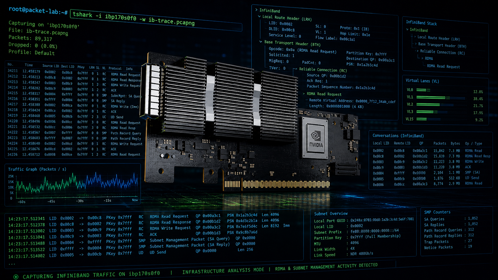
</p>

## 목차

- [요약](#요약)
- [범위: 관측 vs 참조 모델](#범위-관측-vs-참조-모델)
- [캡처 세트](#캡처-세트)
- [캡처 분석 방법](#캡처-분석-방법)
- [추정된 캡처 방식](#추정된-캡처-방식)
- [InfiniBand 프로토콜 스택](#infiniband-프로토콜-스택)
- [캡처에서 보이는 InfiniBand 계층](#캡처에서-보이는-infiniband-계층)
- [ERF 캡처 해부](#erf-캡처-해부)
- [InfiniBand 패킷 구조](#infiniband-패킷-구조)
- [RDMA Read/Write 패킷 분석 모델](#rdma-readwrite-패킷-분석-모델)
- [제어 경로 vs 데이터 경로](#제어-경로-vs-데이터-경로)
- [캡처별 분석](#캡처별-분석)
  - [ib_initial_sniffer.pcap](#ib_initial_snifferpcap)
  - [ib_ibping_sniffer.pcap](#ib_ibping_snifferpcap)
  - [ib_ibtracert_sminfo_sniffer.pcap](#ib_ibtracert_sminfo_snifferpcap)
  - [ib_sniffer.pcap](#ib_snifferpcap)
  - [ib_ipping_sniffer.pcap](#ib_ipping_snifferpcap)
  - [ib_IPoIB.pcap](#ib_ipoibpcap)
  - [infiniband.pcap](#infinibandpcap)
- [핵심 패킷 예시](#핵심-패킷-예시)
- [이 캡처에 없는 것](#이-캡처에-없는-것)
- [유용한 tshark 명령어](#유용한-tshark-명령어)
- [1장 정리](#1장-정리)
- [참고문헌](#참고문헌)

## 요약

이 캡처들은 오프라인 `.pcap` 파일이므로 `tshark`로 root 권한 없이 분석할 수 있습니다. Root나 특별한 캡처 권한은 보통 라이브 패킷 캡처에 필요하며, 기존 캡처 파일을 읽는 데는 필요하지 않습니다.

패킷 세트는 다음과 같은 InfiniBand 동작들을 보여줍니다:

- InfiniBand 관리 트래픽이 MAD 패킷을 통해 보입니다.
- Subnet Management 트래픽이 `SubnGet`, `SubnGetResp`, `SubnSet`, Subnet Administration 레코드로 나타납니다.
- Performance Management 트래픽이 `PortCounters`, `PortCountersExtended`, `ClassPortInfo`로 나타납니다.
- IP over InfiniBand (IPoIB)가 InfiniBand 프레임 안에 실린 일반 IP, TCP, SSH, ARP, ICMP 트래픽으로 보입니다.
- 한 캡처는 Reliable Connection (RC) 동작을 보여줍니다 — `ConnectRequest`, `ConnectReply`, `ReadyToUse`, `RC SEND Only`, `RC Acknowledge` 포함.

이 캡처들은 다음 구분을 이해하는 데 특히 유용합니다:

- **제어 경로**: 셋업, 디스커버리, 관리, 경로 조회, 연결 수립, 성능 질의.
- **데이터 경로**: 필요한 자원과 경로가 준비된 후의 페이로드 이동.

대부분 캡처는 관리 또는 IPoIB 예시입니다. RETH 필드, 원격 가상 주소, rkey가 포함된 완전한 RDMA Read나 RDMA Write 페이로드 교환은 보여주지 않습니다. 데이터 경로에 가장 가까운 예시는 `infiniband.pcap`이며, RC SEND와 AETH ACK 동작을 보여줍니다.

## 범위: 관측 vs 참조 모델

이 보고서는 패킷 증거와 설명용 참조 자료를 의도적으로 분리합니다.

| 주제 | 보고서 내 상태 | 증거 또는 목적 |
| --- | --- | --- |
| Subnet Management | 캡처에서 관측 | `SubnGet`, `SubnGetResp`, `SubnSet`, QP0 트래픽 |
| Subnet Administration | 캡처에서 관측 | Path 레코드, 멀티캐스트 멤버십, QP1 트래픽 |
| Performance Management | 캡처에서 관측 | `PortCounters`, `PortCountersExtended`, `ClassPortInfo` |
| IPoIB | 캡처에서 관측 | InfiniBand 위의 ICMP, TCP, SSH, ARP-like 동작 |
| Connection Management | 캡처에서 관측 | `ConnectRequest`, `ConnectReply`, `ReadyToUse` |
| Reliable Connection SEND/ACK | 캡처에서 관측 | `RC SEND Only`, `RC Acknowledge`, `AETH` |
| RDMA READ | 참조 모델 전용 | 향후 캡처에서 `BTH + RETH` 요청과 응답 패킷 동작을 해석하기 위한 참고 모델 |
| RDMA WRITE | 참조 모델 전용 | 향후 캡처에서 `BTH + RETH + payload` 요청 동작을 해석하기 위한 참고 모델 |
| NCCL collective 트래픽 | 없음 | 공식 [NCCL collective operations](https://docs.nvidia.com/deeplearning/nccl/user-guide/docs/usage/collectives.html), [NCCL networking troubleshooting](https://docs.nvidia.com/deeplearning/nccl/user-guide/docs/troubleshooting.html#networking-issues), [NVIDIA/nccl-tests](https://github.com/NVIDIA/nccl-tests) 자료를 참조 |
| 비트 단위 패킷 형식 참조 | 참조 문서 | [`packet-format-reference_KO.md`](packet-format-reference_KO.md) — LRH/GRH/BTH/확장 헤더/MAD/SMP DR/IPoIB 비트 레이아웃과 BTH opcode 마스터 표 |

이 보고서를 읽을 때는 관측 섹션을 제공된 pcap 파일의 분석으로, RDMA READ/WRITE 섹션을 one-sided RDMA 동작이 포함된 향후 캡처를 해석하기 위한 패킷 분석 안내로 구분하면 됩니다. 보고서에서 언급하지만 일일이 표로 정리하지 않은 바이트/비트 수준 필드 레이아웃은 [패킷 형식 참조 문서](packet-format-reference_KO.md)를 참고하세요.

## 캡처 세트

| 파일 | 패킷 수 | 지속 시간 | 주요 관측 |
| --- | ---: | ---: | --- |
| `ib_initial_sniffer.pcap` | 108 | 10.90 s | 초기 서브넷 디스커버리, SMP, SA, 멀티캐스트 멤버십, 성능 질의 |
| `ib_ibping_sniffer.pcap` | 65 | 10.18 s | Vendor MAD 요청/응답 동작과 성능 카운터 |
| `ib_ibtracert_sminfo_sniffer.pcap` | 84 | 30.46 s | 트레이싱과 SMInfo 관련 제어 경로 트래픽 |
| `ib_sniffer.pcap` | 24 | 6.00 s | Performance Management 트래픽만 |
| `ib_ipping_sniffer.pcap` | 34 | 12.00 s | IPoIB 위의 ICMP ping과 소량의 ARP, 성능 트래픽 |
| `ib_IPoIB.pcap` | 5,848 | 4.28 s | IPoIB 위의 SSH over TCP |
| `infiniband.pcap` | 43 | 250.57 s | SMInfo, IPoIB, CM 연결 셋업, RC SEND, RC ACK 동작 |

모든 파일은 **Extensible Record Format** 캡슐화의 pcap 파일입니다. `tshark`는 ERF 외부 레코드를 디코드한 후 InfiniBand 페이로드를 디코드합니다.

## 캡처 분석 방법

분석에는 Wireshark/TShark 4.2.2를 사용했습니다:

```sh
tshark -v
```

기본 캡처 메타데이터:

```sh
capinfos ../ib-packets/*.pcap
```

프로토콜 계층 구조:

```sh
tshark -r ../ib-packets/ib_IPoIB.pcap -q -z io,phs
```

InfiniBand 필드 추출:

```sh
tshark -r ../ib-packets/ib_initial_sniffer.pcap \
  -Y infiniband \
  -T fields \
  -e frame.number \
  -e frame.time_relative \
  -e infiniband.lrh.dlid \
  -e infiniband.lrh.slid \
  -e infiniband.bth.opcode \
  -e infiniband.bth.destqp \
  -e infiniband.mad.method \
  -e infiniband.mad.attributeid \
  -E header=y
```

유용한 필드:

| 필드 | 의미 |
| --- | --- |
| `infiniband.lrh.dlid` | Local Route Header의 Destination Local ID |
| `infiniband.lrh.slid` | Local Route Header의 Source Local ID |
| `infiniband.bth.opcode` | Base Transport Header opcode |
| `infiniband.bth.destqp` | 목적지 Queue Pair |
| `infiniband.mad.mgmtclass` | MAD 관리 클래스 |
| `infiniband.mad.method` | MAD 메서드 (Get, GetResp 등) |
| `infiniband.mad.attributeid` | MAD attribute ID |

## 추정된 캡처 방식

pcap 파일만으로는 정확한 캡처 명령을 증명할 수 없습니다. 아래는 파일 이름, 캡슐화 타입, 프로토콜 계층, 디코드된 패킷 내용에서 추론한 결과입니다.

캡처들은 InfiniBand 진단 도구나 IPoIB 워크로드를 실행하면서 네이티브 InfiniBand 스니퍼가 트래픽을 기록한 결과로 보입니다. 파일들은 **Extensible Record Format** 캡슐화를 사용하고 InfiniBand LRH/BTH/MAD 필드를 노출하므로, IP 인터페이스에서 단순한 Ethernet 스타일 `tcpdump`보다는 네이티브 InfiniBand 캡처 경로에 더 가깝습니다.

| 파일 | 캡처 시 가능한 워크로드 | 증거 |
| --- | --- | --- |
| `ib_initial_sniffer.pcap` | Fabric 초기화 또는 서브넷 디스커버리 | `SubnGet(NodeInfo)`, `NodeDescription`, `PortInfo`, `SMInfo`, QP0 트래픽 |
| `ib_ibping_sniffer.pcap` | 두 InfiniBand 노드 사이의 `ibping` | LID 5와 LID 8 사이의 반복적인 vendor MAD 요청/응답 트래픽 |
| `ib_ibtracert_sminfo_sniffer.pcap` | `ibtracert`, `sminfo`, 그리고 가능한 카운터 질의 | `SMInfo`, `LinearForwardingTable`, `PortCounters`, `PortCountersExtended` |
| `ib_sniffer.pcap` | 성능 카운터 폴링 | 대부분 `PERF (PortCounters)`와 `PortCountersExtended` |
| `ib_ipping_sniffer.pcap` | IPoIB 위의 IP ping | InfiniBand 위의 ICMP echo request/reply와 ARP |
| `ib_IPoIB.pcap` | IPoIB 위의 SSH/TCP 세션 | TCP 대화 `10.10.10.12:34826 <-> 10.10.10.11:22`, SSH 페이로드 |
| `infiniband.pcap` | 혼합된 InfiniBand 샘플 워크로드 | `SMInfo`, `PathRecord`, `ConnectRequest`, `ConnectReply`, `ReadyToUse`, `RC SEND`, `RC ACK` |

가능한 수집 워크플로우는 다음과 같습니다:

```text
Terminal 1:
  네이티브 InfiniBand 스니퍼 시작 후 pcap 파일에 기록.

Terminal 2:
  진단 또는 워크로드 명령 하나 실행.
  예: ibping, ibtracert, sminfo, perfquery,
      IPoIB ping, IPoIB 주소로의 SSH.

결과:
  스니퍼가 LRH/BTH/MAD/IPoIB 트래픽을 pcap 파일에 기록.
```

예를 들어, `ib_ibping_sniffer.pcap`의 이름과 디코드된 패킷은 다음과 같은 시나리오를 시사합니다:

```text
캡처 시작:
  네이티브 IB 스니퍼 -> ib_ibping_sniffer.pcap

워크로드 실행:
  두 IB 엔드포인트 사이 ibping

관측된 패킷:
  LID 사이의 VENDOR MAD 요청/응답 트래픽
```

IPoIB 캡처는 `ib0` 스타일 인터페이스 위에서 실행된 일반 IP 도구에서 나왔을 가능성이 높습니다:

```text
캡처 시작:
  네이티브 IB 또는 IPoIB-aware 캡처 -> ib_ipping_sniffer.pcap

워크로드 실행:
  ping <원격 IPoIB 주소>

관측된 패킷:
  InfiniBand 위의 ARP, ICMP Echo request, ICMP Echo reply
```

그리고:

```text
캡처 시작:
  네이티브 IB 또는 IPoIB-aware 캡처 -> ib_IPoIB.pcap

워크로드 실행:
  ssh <원격 IPoIB 주소>

관측된 패킷:
  IPoIB 위의 TCP 핸드셰이크와 SSH 페이로드
```

기존 파일에서 동일한 분석을 재현하는 데는 root 권한이 필요하지 않습니다:

```sh
tshark -r ../ib-packets/ib_ibping_sniffer.pcap -c 10
tshark -r ../ib-packets/ib_ipping_sniffer.pcap -c 10
tshark -r ../ib-packets/ib_IPoIB.pcap -q -z conv,tcp
```

캡처 자체를 재현하려는 경우 권한은 캡처 방법에 따라 다릅니다. 권한 있는 인터페이스나 vendor 스니퍼에서의 라이브 캡처는 추가 capability, 그룹 멤버십, root 권한이 필요할 수 있습니다. 결과 pcap의 오프라인 분석에는 필요하지 않습니다.

## InfiniBand 프로토콜 스택

InfiniBand 프로토콜 스택은 두 가지 보완적인 수준에서 볼 수 있습니다:

- **프로토콜 스택 관점**: 애플리케이션, 상위 계층 프로토콜, 전송 서비스, 네트워크 라우팅, 링크 동작, 물리 시그널링이 어떻게 맞물리는지.
- **패킷 구조 관점**: 개별 패킷이 라우팅 헤더, 전송 헤더, 선택적 확장 헤더, 페이로드, 무결성 검사를 포함해 실제 전송 형식으로 어떻게 인코딩되는지.

아래의 제3자 다이어그램은 방향성을 잡는 데 유용한 자료입니다. 교육용 그림으로 포함했으며, 이 보고서의 패킷 수준 해석은 `tshark`로 보이는 필드와 아래 나열된 NVIDIA, IBTA, Wireshark 공식 자료를 기반으로 합니다.

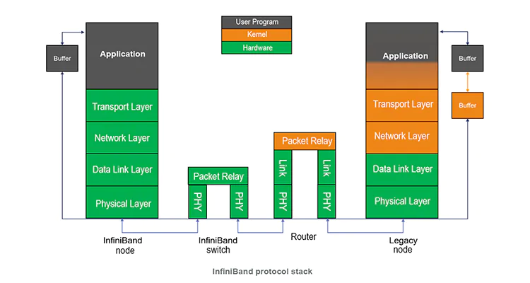

개념적으로, 이 스택은 캡처에 왜 **제어 경로** 프로토콜(Subnet Management, Connection Management 등)과 **데이터 경로** 트래픽(IPoIB, Reliable Connection 패킷 등)이 모두 포함되는지 설명합니다.

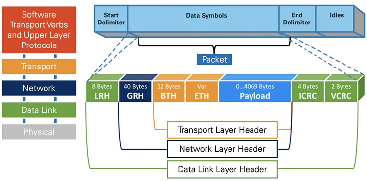

캡슐화 그림은 다음 두 섹션과 일치합니다: `tshark`는 패킷 타입에 따라 `LRH`, `BTH`, `DETH`, `MAD`, `AETH` 같은 패킷 필드와 IP 페이로드를 노출합니다.

출처: [What is InfiniBand? (A Complete Guide)](https://www.naddod.com/blog/what-is-infiniband)

## 캡처에서 보이는 InfiniBand 계층

`tshark`로 보이는 패킷 구조는 1장의 InfiniBand Communication Stack에 잘 매핑됩니다.

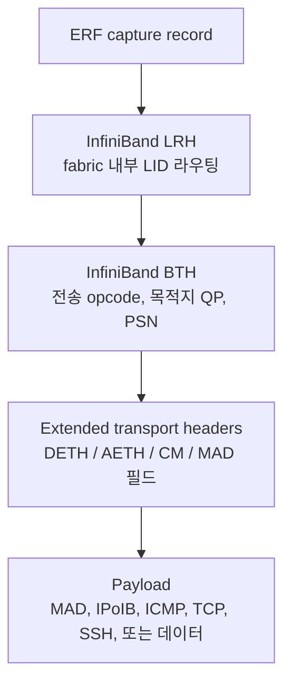

중요한 가시 헤더:

| 헤더 | 역할 | 캡처에서의 예시 |
| --- | --- | --- |
| LRH | InfiniBand fabric 내부의 로컬 라우팅 | `slid`, `dlid`, packet length |
| BTH | 전송 동작과 QP 선택 | UD SEND Only는 opcode `100`, RC SEND Only는 opcode `4`, RC ACK는 opcode `17` |
| DETH | UD 트래픽용 데이터그램 전송 필드 | QP0/QP1 관리 트래픽 |
| MAD | Management datagram | SubnGet, SubnGetResp, PortCounters |
| AETH | ACK Extended Transport Header | `infiniband.pcap`의 RC Acknowledge 패킷 |
| IP payload | IP over InfiniBand | IPoIB 위의 TCP/SSH와 ICMP |

## ERF 캡처 해부

이 캡처들은 외부 래퍼로 Endace **Extensible Record Format**(ERF)을 사용합니다. 실제 전송된 InfiniBand 프레임은 캡처 장비가 생성한 ERF 레코드로 캡슐화되며, `tshark`는 이 외부 레코드를 디코드한 다음 내부 바이트를 InfiniBand dissector에 넘깁니다. ERF가 무엇을 보존하고 무엇을 감추는지 이해해야 "패킷이 보인다"는 것과 "스니퍼가 실제로 무엇을 기록했는지 안다"는 것을 구분할 수 있습니다.

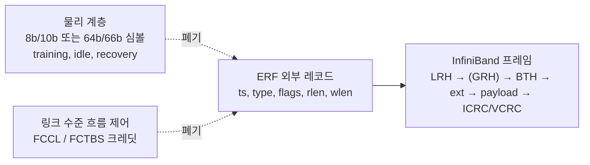

### ERF 외부 레코드

ERF 레코드는 작지만 스니퍼 하드웨어가 제공할 수 있는 모든 메타데이터를 담습니다. 일곱 캡처 모두 ERF 타입 `0x15`(INFINIBAND)를 사용하며, 이는 캡처 장비 펌웨어가 설정하는 값으로 호스트의 `tcpdump`가 아닌 IB-aware 스니퍼에서 기록되었다는 가장 강력한 단일 증거입니다.

| ERF 필드 | 필터 이름 | 예시 (`infiniband.pcap` frame 10) | 의미 |
| --- | --- | --- | --- |
| Timestamp | `erf.ts` | `0x482b41f8ae3041c0` | 64비트 분수초 하드웨어 타임스탬프 |
| Record type | `erf.types` | `0x15` (Type 21: INFINIBAND) | 내부 페이로드를 네이티브 IB로 식별 |
| Extension header present | `erf.types.ext_header` | `0` | 이 데이터셋에는 ERF extension header 없음 |
| Capture interface | `erf.flags.cap` | `1` (Port B) | 어느 스니퍼 포트가 이 프레임을 관측했는지 |
| Varying record length | `erf.flags.vlen` | `1` | 레코드 길이가 프레임마다 가변 |
| Truncated | `erf.flags.trunc` | `0` | 원래 길이 그대로 캡처됨 |
| RX error | `erf.flags.rxe` | `0` | 캡처 장비가 수신 오류 없음으로 표시 |
| DS error | `erf.flags.dse` | `0` | 데이터 스트림 오류 없음 |
| Record length | `erf.rlen` | `136` | 패딩 포함 ERF 레코드 바이트 수 |
| Loss counter | `erf.lctr` | `0` | 이 레코드와 이전 레코드 사이 드롭된 프레임 수 |
| Wire length | `erf.wlen` | `114` | 원래 전송 바이트 수 |

`rlen`(136) vs `wlen`(114) 쌍은 ERF의 정렬 경계 패딩을 보여줍니다. 타이밍 분석에서는 `erf.ts`가 권위 있는 시계입니다 — `frame.time_relative`는 이 값에서 파생되지만 일부 출력 모드에서 마이크로초로 반올림됩니다.

### Capture-Interface Topology

ERF의 `flags.cap` 필드는 각 프레임을 어느 스니퍼 포트가 보았는지 알려주며, 양방향 흐름을 해석하는 데 필수적입니다.

| 파일 | 사용된 capture interface | 의미 |
| --- | --- | --- |
| `infiniband.pcap` | `0`과 `1` | 양방향 tap; 양쪽 링크 방향 캡처 |
| 그 외 모든 pcap | `0`만 | 단방향 tap |

`infiniband.pcap`의 구체적 증거:

```text
Frame 10  (RC SEND Only,    DLID=1, SLID=4)  → Capture interface 1 (Port B), ts=0x482b41f8ae3041c0
Frame 11  (RC Acknowledge,  DLID=4, SLID=1)  → Capture interface 0 (Port A), ts=0x482b41f8ae30ede0
```

SEND와 그 ACK가 다른 스니퍼 포트로 도착하는 이유는 링크의 반대 방향으로 이동하기 때문입니다. 단일 인터페이스 캡처에서는 이런 비대칭이 보이지 않으며 — 어느 포트가 tap되었는지에 따라 교환의 한쪽 절반만 보일 수 있습니다.

### ERF가 보존하는 것 vs 숨기는 것

ERF 래퍼는 얇지만 그 뒤의 IB dissector는 포괄적입니다. 느낄 수 있는 "단순화"는 두 곳에서 옵니다: (a) 패킷 경계 아래에서 발생해 패킷이 되지 않는 하드웨어 이벤트, (b) IB dissector가 어느 필드를 필터 가능 이름으로 노출할지, tree 전용 필드로 둘지에 대한 선택.

| 계층 / 신호 | `tshark`에서 보이는가? | 비고 |
| --- | --- | --- |
| 물리 8b/10b 또는 64b/66b 심볼 | 아니오 | HCA SerDes에서 디코드되어 캡처 호스트에 도달하지 않음 |
| 링크 트레이닝, recovery, idle 심볼 | 아니오 | 서브-패킷 이벤트로 링크 계층에서 폐기 |
| 링크 수준 흐름 제어 크레딧 (FCCL, FCTBS) | 아니오 | 전용 링크 수준 서브헤더로 운반되며 IB 패킷으로 전달되지 않음 |
| 패킷 사이 갭과 대역폭 헤드룸 | 아니오 | 대신 `erf.ts` 델타로 재구성 |
| 스니퍼 하드웨어에서 드롭/거부된 프레임 | 부분적 | `erf.lctr`의 0이 아닌 점프로만 보임 |
| RX-error 프레임 | 조건부 | 장치가 보존하도록 설정된 경우 `erf.flags.rxe = 1`로 전달 |
| LRH | 예 | `infiniband.lrh.*` (slid, dlid, lnh, vl, sl, packet length) |
| GRH | `LRH.LNH = 0x3`일 때만 | 이 세트의 모든 패킷은 `LNH = 0x2`를 사용하므로 GRH는 정확히 부재 |
| BTH 및 extended header | 예 | DETH, AETH, MAD, RETH(존재 시) 모두 디코드 |
| 페이로드 (MAD, IPoIB IP/TCP/ICMP) | 예 | 표준 상위 계층 dissection |
| Invariant CRC | 예 | `infiniband.invariant.crc`, frame 10에서 예: `0x0acca5df` |
| Variant CRC | 예 | `infiniband.variant.crc`, frame 10에서 예: `0x24a8` |

흔한 오해는 ERF가 ICRC/VCRC를 제거한다는 것입니다. 이 데이터셋에서는 둘 다 IB tree에 존재하며 `infiniband.invariant.crc`와 `infiniband.variant.crc`로 필터 가능합니다. 단, Wireshark IB dissector는 자동 검증하지 않습니다 — 무결성은 dissector가 아니라 캡처 장비의 RX-error 플래그(`erf.flags.rxe`)로 주장됩니다.

### 단계별 예제: ERF + IB 프레임 레이아웃

다음은 `infiniband.pcap` frame 10(IPoIB ICMP echo request를 운반하는 RC SEND Only)의 익명화된 레이아웃입니다. ERF 외부 레코드, InfiniBand 헤더, EtherType으로 캡슐화된 IPoIB 페이로드, 후행 CRC가 하나의 114바이트 전송 프레임에 어떻게 배치되는지 보여줍니다.

```text
Frame 10 — 전송 프레임 114바이트 / ERF 레코드 136바이트 / 캡처 인터페이스 1 (Port B)

ERF 외부 레코드
  Timestamp:   0x482b41f8ae3041c0
  Type:        0x15 (INFINIBAND)
  Ext header:  0
  Flags:       cap=1, vlen=1, trunc=0, rxe=0, dse=0
  Record len:  136
  Loss counter: 0
  Wire length: 114

InfiniBand
  LRH (Local Route Header)
    VL = 0
    Service Level = 0
    LNH = 0x2  (BTH only — GRH 없음)
    DLID = 1, SLID = 4
    Packet length = 28 (4-byte words)
  BTH (Base Transport Header)
    Opcode = 4  (RC SEND Only)
    Solicited Event = False
    MigReq = True
    Pad Count = 0
    P_Key = 0xffff
    Destination QP = <masked>
    Acknowledge Request = True
    PSN = <masked>
  IBA Payload — IPoIB용 EtherType-캡슐화
    Ethertype = 0x0800 (IPv4)
  Invariant CRC: 0x0acca5df
  Variant CRC:   0x24a8

IPv4 → ICMP Echo request
  Src 10.0.1.34 → Dst 10.0.0.58
```

주목할 만한 세부 사항:

- `LRH.LNH = 0x2`는 로컬 서브넷 라우팅을 확인합니다 — 그래서 `LRH`와 `BTH` 사이에 `GRH`가 없습니다.
- `IBA Payload — EtherType-캡슐화` 줄은 IPoIB 셔임(shim)입니다: BTH와 IP 패킷 사이에 위치하는 4바이트 헤더로, IPv4 또는 ARP를 선택하는 EtherType을 가집니다. 이 계층 덕분에 일반 IP 애플리케이션이 IB 위에서 동작합니다.
- `Invariant CRC`와 `Variant CRC`가 모두 dissection tree에 존재합니다. ICRC는 가변 필드를 제외한 모든 부분을 커버하고, VCRC는 링크상의 전체 패킷을 커버합니다.
- `MigReq = True`는 경로가 자동 경로 마이그레이션을 지원함을 표시합니다. 이는 연결 셋업 중 설정되는 QP별 속성이며 운반되는 데이터와 무관합니다.

### 핵심 정리

- ERF는 **얇은 메타데이터 래퍼**입니다. ICRC/VCRC를 포함한 거의 모든 IB 헤더 필드가 dissection tree에 살아남습니다. "단순화"는 서브-패킷 하드웨어 이벤트 수준에서만 실재합니다.
- `erf.ts`를 나노초 해상도 타이밍 분석에 사용하세요 (예: `ib_ibping_sniffer.pcap`의 1초 `ibping` 케이던스를 이 필드로 정확히 측정 가능).
- `erf.flags.cap`을 사용해 `infiniband.pcap`의 링크 방향을 구분하고, 단일 인터페이스 캡처는 양방향 교환의 절반만 보여줄 수 있음을 인지하세요.
- `erf.lctr`을 사용해 스니퍼 드롭을 감지하세요. 0이 아닌 값은 어떤 IB 계층 분석으로도 복구할 수 없는 기록의 갭을 의미합니다.
- 링크 크레딧 고갈, 링크 트레이닝, 심볼 오류율에 대한 결론은 스위치 카운터와 HCA 하드웨어 진단이 필요합니다 — 어느 스니퍼를 쓰든 본질적으로 pcap에 없습니다.

## InfiniBand 패킷 구조

위 캡슐화 다이어그램을 기반으로, InfiniBand 패킷은 왼쪽에서 오른쪽으로 **fabric 라우팅**, **전송 선택**, **동작별 메타데이터**, **페이로드**로 읽을 수 있습니다. 정확한 extended header는 transport와 opcode에 따라 달라집니다.

> 여기 나열된 모든 헤더(LRH, GRH, BTH, DETH, RETH, AETH, AtomicETH, ImmDt, IETH, RDETH, XRCETH, MAD, SMP DR, IPoIB encap)의 비트 단위 필드 레이아웃, AETH syndrome 인코딩, BTH opcode 마스터 표는 참조 문서 [`packet-format-reference_KO.md`](packet-format-reference_KO.md)를 참고하세요. 이 섹션은 상위 수준의 패킷 모양을 설명하고, 참조 문서는 바이트와 비트 경계까지 내려가 설명합니다.

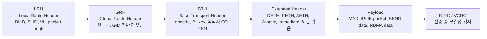

`GRH`는 선택적이므로 많은 로컬 서브넷 패킷은 사실상 `LRH -> BTH -> ...`입니다. 이 데이터셋의 모든 패킷은 `LRH.LNH = 0x2`를 가지므로 `GRH`가 디코드되지 않습니다. `ICRC`/`VCRC`의 노출 여부는 캡처 경로에 따라 다르며, 이 데이터셋은 둘 다 필터 가능 필드로 보존합니다(`infiniband.invariant.crc`, `infiniband.variant.crc`) — 증거와 전체 보존 매트릭스는 [ERF 캡처 해부](#erf-캡처-해부)를 참고하세요.

흔한 패킷 모양들:

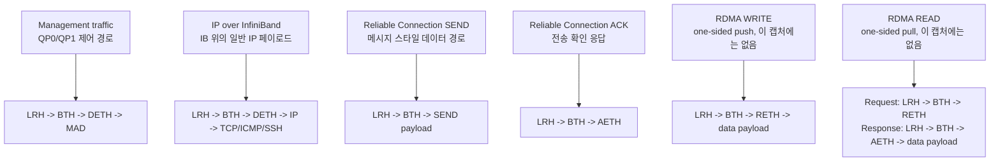

이를 현재 캡처에 매핑하면:

| 패킷 계열 | 일반적 구조 | 본 패킷 세트에 보임? | 비고 |
| --- | --- | --- | --- |
| Subnet Management | `LRH -> BTH -> DETH -> MAD` | 예 | `ib_initial_sniffer.pcap`, `ib_ibtracert_sminfo_sniffer.pcap`, `infiniband.pcap`에서 관측 |
| Performance Management | `LRH -> BTH -> DETH -> MAD` | 예 | `PortCounters`, `PortCountersExtended`, `ClassPortInfo`로 관측 |
| IPoIB | `LRH -> BTH -> DETH -> IP payload` | 예 | InfiniBand 위에서 ICMP, TCP, SSH, ARP-like 동작 운반 |
| RC SEND | `LRH -> BTH -> payload` | 예 | `infiniband.pcap`이 `RC SEND Only`를 보임 |
| RC ACK | `LRH -> BTH -> AETH` | 예 | `infiniband.pcap`이 `RC Acknowledge`를 보임 |
| RDMA WRITE | `LRH -> BTH -> RETH -> payload` | 아니오 | 원격 가상 주소와 `rkey`를 `RETH`에 보였을 것 |
| RDMA READ | `RETH`가 있는 요청, 데이터가 있는 응답 | 아니오 | 1장에서 설명한 pull 모델을 보였을 것 |

## RDMA Read/Write 패킷 분석 모델

현재 pcap 모음은 완전한 RDMA READ나 RDMA WRITE 교환을 **포함하지 않습니다**. 따라서 이 섹션은 향후 캡처에 one-sided RDMA 동작이 포함될 경우 그러한 패킷을 어떻게 해석해야 하는지 설명하는 참조 모델입니다. 공식 자료와 참고문헌의 Tencent Cloud 글에서 설명하는 InfiniBand 전송 계층 동작을 바탕으로 했습니다.

one-sided RDMA 동작의 핵심 헤더는 RDMA Extended Transport Header인 `RETH`입니다.

| 헤더 | 중요 필드 | 왜 중요한가 |
| --- | --- | --- |
| `BTH` | opcode, 목적지 QP, PSN, ACK request | 동작 타입과 패킷 순서 식별 |
| `RETH` | 가상 주소, `rkey`, DMA length | 원격 메모리 범위를 인가하고 기술 |
| `AETH` | ACK/NAK syndrome, MSN | 신뢰성 있는 전송의 진행 상황을 확인하거나 오류 보고 |
| Payload | read 응답 데이터 또는 write 데이터 | 동작 방향에 따른 사용자 데이터 운반 |

### 전송 서비스별 동작 지원

InfiniBand 전송 서비스는 verbs 스타일의 모든 동작을 똑같이 지원하지 않습니다. 실전에서의 결론은 분명합니다. 응답이 필요하거나, 엄격한 순서가 필요하거나, read-modify-write 의미를 갖는 one-sided 동작에는 신뢰성 있는 전송 컨텍스트가 필요합니다.

| 동작 | RC | UC | UD | RD |
| --- | :-: | :-: | :-: | :-: |
| SEND/RECV | ✓ | ✓ | ✓ | ✓ |
| RDMA WRITE | ✓ | ✓ | ✗ | ✓ |
| RDMA READ | ✓ | ✗ | ✗ | ✓ |
| Atomic | ✓ | ✗ | ✗ | ✓ |

현대 RDMA 소프트웨어에서는 `RC`가 RDMA READ와 Atomic 동작에 가장 흔히 쓰이는 실전 전송 방식입니다. `RD`도 InfiniBand 아키텍처에서 이를 지원하지만, 주류 애플리케이션 스택에서 기본 선택이 되는 경우는 드뭅니다.

RDMA READ가 UC/UD에 맞지 않는 이유:

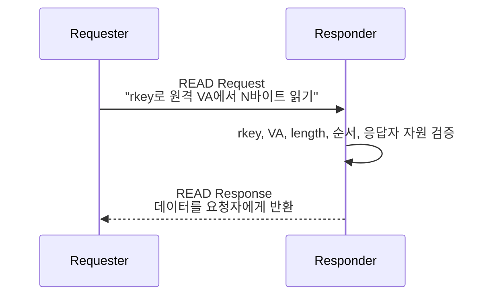

RDMA READ는 한 방향으로 끝나는 패킷이 아닙니다. 응답자 쪽에도 작업을 발생시킵니다. 응답자 RNIC은 요청을 검증하고, 원격 메모리를 읽고, 하나 이상의 응답 패킷을 생성하고, 순서를 유지하고, 재시도/오류를 처리해야 합니다. `UC`에는 신뢰성 있는 응답/ACK 장치가 없고, `UD`는 원격 메모리 읽기에 필요한 연결된 응답자 상태를 갖지 않는 메시지 지향 데이터그램 전송입니다.

Atomic이 UC/UD에 맞지 않는 이유:

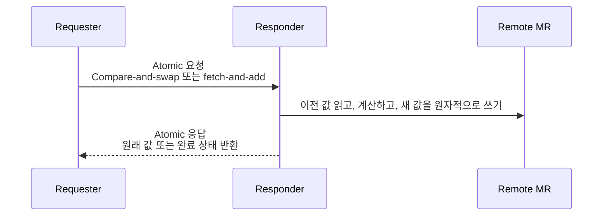

Atomic 동작은 원격 메모리 위치에서 전역적으로 순서가 보장되는 단일 read-modify-write를 요구합니다. 요청자는 반환 값과 동작 완료 여부를 알아야 하므로 신뢰성 있는 응답도 필요합니다. 즉 연결 상태, 순서, 재시도/오류 의미가 필요하므로, 실전 배포에서는 atomic에 RC 스타일의 신뢰성 있는 전송을 사용합니다.

> NCCL, UCX, MPI, DC 전송에 대한 실전 노트:
>
> AllReduce 같은 NCCL collective는 큰 데이터 청크를 한 GPU 메모리에서 다른 GPU 메모리로 옮깁니다. 일부 단계는 push 스타일 전송으로 구현할 수 있지만, pull 기반 peer access 패턴은 RDMA READ 의미론에서 이점을 얻습니다. Ring과 tree 알고리즘도 예측 가능한 순서와 완료 동작이 필요하므로 신뢰성 있는 전송이 중요합니다.
>
> UCX는 범용 통신 계층입니다. 작은 메시지는 SEND/RECV 또는 inline 경로를 사용하고, 큰 메시지는 RDMA를 사용할 수 있습니다. UCX는 tag matching과 RMA 스타일 동작도 제공하며, 가능한 전송에서는 atomic도 노출합니다. 따라서 READ, Atomic, 순서, 재시도 의미가 필요한 경로에서는 자연스럽게 신뢰성 있는 연결 지향 전송을 선호합니다.
>
> MPI 구현은 전송 계층이 지원할 때 `MPI_Put`, `MPI_Get`, `MPI_Accumulate` 같은 one-sided 프리미티브를 RDMA WRITE, RDMA READ, Atomic 동작에 매핑하곤 합니다. MPI의 의미론은 신뢰성 있는 통신을 가정하므로, 그 아래의 네트워크 경로도 대개 신뢰성 있는 완료와 순서 보장을 제공해야 합니다.
>
> 대규모 클러스터에서는 순수 RC가 비싸질 수 있습니다. 촘촘한 all-to-all peer mesh가 많은 QP와 그에 딸린 HCA 메모리를 요구할 수 있기 때문입니다. `DC` 전송, 즉 Dynamically Connected transport는 신뢰성 있는 의미론을 유지하면서 연결 자원을 동적으로 재사용해 이 문제를 완화합니다. 그래서 DC 스타일 전송은 대규모 InfiniBand 배포에서 중요합니다. NVIDIA SHARP와 NCCL-RDMA-SHARP 경로도 최신 collective 스택에 나타날 수 있지만, DC, UCX, verbs, SHARP의 실제 사용 여부는 하드웨어, 플러그인 가용성, 토폴로지, 런타임 환경 설정에 따라 달라집니다.

### 전송 계층에서 확인할 가치가 있는 세부 사항

Tencent Cloud 글이 유용한 이유는 RDMA READ/WRITE를 verbs API 호출이 아니라 InfiniBand 전송 계층 동작으로 설명하기 때문입니다. 다음 세부 사항은 패킷 분석에서도 살펴볼 가치가 있습니다.

| 세부 사항 | 패킷 분석에서의 의미 |
| --- | --- |
| 전송 서비스 타입 | `BTH` opcode 비트가 패킷이 RC, UC, RD, UD, XRC 스타일 전송 동작 중 어디에 속하는지 식별합니다. ACK/NAK 동작과 패킷 검증이 서비스마다 다르므로 중요합니다. |
| `BTH`는 동작 디코더 | `BTH` opcode가 BTH 다음 바이트를 어떻게 해석할지 결정합니다: `RETH`, `AETH`, `DETH`, immediate 데이터, 페이로드, 또는 extended header 없음. |
| `PSN`은 단순 카운터가 아님 | Packet Sequence Number는 응답자/요청자가 누락, 중복, 순서 어긋남 패킷을 감지하는 데 사용됩니다. 신뢰성 있는 서비스에서는 ACK/NAK와 재시도 동작을 좌우합니다. |
| `P_Key`와 목적지 QP는 검증 입력 | 패킷의 목적지 QP, QP 상태, 전송 타입, 파티션 키가 응답자 컨텍스트와 맞지 않으면 조용히 드롭될 수 있습니다. |
| `RETH`는 보호 경계 | `RETH`는 단순한 주소 디스크립터가 아닙니다. 응답자는 원격 메모리에 접근하기 전에 `rkey`, 접근 권한, 가상 주소 범위, DMA length를 검증해야 합니다. |
| `AETH`는 ACK/NAK 상태 운반 | 신뢰성 있는 전송에서 `AETH`는 진행이 ACK되었는지, 재시도/오류 조건이 있는지를 요청자에게 알립니다. |
| `ICRC/VCRC`는 전송 중 무결성 검사 | 캡처 도구는 일부만 노출할 수 있으며, 잘못된 CRC를 가진 패킷은 보통 전송 계층에서 의미 있게 해석되기 전에 폐기됩니다. |

`P_Key`는 특별히 주의해서 볼 만합니다. `BTH`에 실리는 파티션 멤버십 값으로, 개념적으로는 fabric 수준의 tenant 또는 격리 태그와 비슷합니다. 상위 비트는 full/limited 멤버십을 표시하고, 하위 비트는 파티션을 식별합니다. 패킷의 `P_Key`가 목적지 포트의 파티션 멤버십이나 QP 컨텍스트와 일치하지 않으면 해당 파티션의 유효한 트래픽으로 받아들여지지 않습니다. 그래서 패킷 드롭을 디버그할 때는 `P_Key`를 목적지 QP, 전송 타입, QP 상태와 함께 읽어야 합니다.

놓치기 쉬운 두 가지 미묘한 포인트:

- 다중 패킷 SEND와 RDMA WRITE 메시지는 해당 메시지의 마지막 패킷이 생성될 때까지 동일 send queue의 다른 동작과 인터리빙되지 않습니다.
- RDMA READ는 다르게 동작합니다. READ 요청을 낸 후 요청자는 READ 응답을 기다리지 않고 후속 요청을 낼 수 있지만, outstanding READ와 ATOMIC 동작의 최대 개수는 연결 설정 중에 협상됩니다.

### RDMA READ

RDMA READ는 one-sided **pull**입니다. 요청자가 응답자 RNIC에게 원격 메모리에서 데이터를 읽어 돌려달라고 요청합니다.

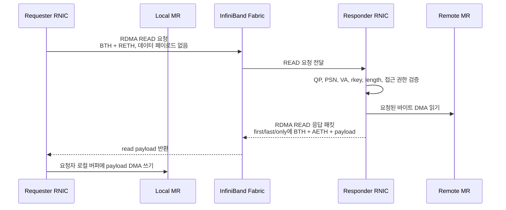

응답이 path MTU 안에 들어오는 작은 READ:

```text
Request:  LRH -> BTH(RDMA READ Request) -> RETH(VA, rkey, length)
Response: LRH -> BTH(RDMA READ Response Only) -> AETH -> payload
```

다중 패킷 READ 응답:

```text
Request:  LRH -> BTH(RDMA READ Request)          -> RETH
First:    LRH -> BTH(RDMA READ Response First)   -> AETH -> PMTU-sized payload
Middle:   LRH -> BTH(RDMA READ Response Middle)  -> PMTU-sized payload
Last:     LRH -> BTH(RDMA READ Response Last)    -> AETH -> remaining payload
```

중요한 분석 포인트:

- READ 요청 패킷은 무엇을 읽을지 기술하므로 작습니다 — 요청된 데이터를 운반하지 않습니다.
- 단일 READ 요청은 요청된 길이가 path MTU를 초과할 때 여러 READ 응답 패킷을 생성할 수 있습니다.
- `AETH`는 `RDMA READ Response First`, `RDMA READ Response Last`, `RDMA READ Response Only`에 존재합니다.
- `RDMA READ Response Middle`은 페이로드를 운반하지만 `AETH`는 운반하지 않습니다.
- `PSN`은 누락되거나 순서가 어긋난 응답 패킷을 감지하는 데 사용됩니다.
- 응답자는 재시도 요청, `rkey`, 원격 가상 주소, 접근 권한을 검증합니다.
- 요청자는 협상된 연결 한도에 따라 둘 이상의 outstanding READ를 가질 수 있습니다.
- RDMA READ는 immediate 데이터를 운반하지 않습니다.

민감한 값을 익명화한 Wireshark 디코드 예시:

```text
RDMA READ Request
  BTH:
    Opcode: Reliable Connection (RC) - RDMA READ Request
    Partition Key: 0xffff
    Destination QP: 0x00xxxx
    Acknowledge Request: True
    Packet Sequence Number: <request_psn>
  RETH:
    Virtual Address: 0x0000xxxxxxxxxxxx
    Remote Key: 0x00xxxxxx
    DMA Length: 65536 bytes
  ICRC:
    Present
```

```text
RDMA READ Response Middle
  BTH:
    Opcode: Reliable Connection (RC) - RDMA READ Response Middle
    Partition Key: 0xffff
    Destination QP: 0x00xxxx
    Acknowledge Request: False
    Packet Sequence Number: <response_psn>
  Payload:
    Data: 1024 bytes
  ICRC:
    Present
```

요청 디코드는 one-sided READ의 핵심 증거입니다. `BTH + RETH`가 있고, `RETH`가 원격 가상 주소, `rkey`, 요청된 DMA length를 운반합니다. `BTH`는 `Partition Key`(`P_Key`)도 운반하며, 이는 패킷이 사용하는 InfiniBand 파티션 멤버십을 식별합니다. 흔히 보이는 `0xffff` 같은 값은 기본 파티션의 full membership을 나타내지만, 프로덕션 fabric은 격리를 위해 다른 파티션 키를 사용할 수 있습니다. response-middle 디코드는 반대 방향의 데이터 이동을 보여줍니다. 데이터 페이로드를 운반하지만 `RETH`도 `AETH`도 없습니다. 이는 다중 패킷 READ 모델과 일치합니다. `AETH`는 first, last, only 응답 패킷에 나타나고, middle 응답 패킷은 데이터만 운반하는 세그먼트입니다.

공개 문서를 위해서는 다음 필드가 마스킹되지 않은 원시 스크린샷 게시를 피하세요:

- 원격 가상 주소
- `rkey`
- 목적지 QP
- packet sequence number
- 애플리케이션 데이터를 포함할 수 있는 페이로드 바이트

민감한 값을 익명화한 `AETH` 디코드 예시:

```text
RC Acknowledge
  BTH:
    Opcode: Reliable Connection (RC) - Acknowledge
    Partition Key: 0xffff
    Destination QP: 0x00xxxx
    Acknowledge Request: False
    Packet Sequence Number: <ack_psn>
  AETH:
    Syndrome: 0, Ack
    OpCode: Ack
    Credit Count: <credit_count>
    Message Sequence Number: <msn>
  ICRC:
    Present
```

`AETH`는 신뢰성 있는 전송에서 ACK/NAK 상태를 전달하는 핵심 헤더입니다. 정상 ACK는 응답자가 해당 reliable operation의 진행을 받아들였음을 뜻합니다. syndrome이 NAK나 오류 조건을 나타내면, 요청자는 전송 상태와 재시도 카운터에 따라 Work Request를 재시도하거나 실패 처리해야 할 수 있습니다. 패킷 분석에서 `BTH`는 이것이 RC acknowledge 패킷이며 어느 파티션/QP 컨텍스트에 속하는지 알려주고, `AETH`는 성공 ACK인지 오류/흐름 제어 신호인지 알려줍니다.

### RDMA WRITE

RDMA WRITE는 one-sided **push**입니다. 요청자가 응답자가 이미 등록하고 메타데이터 교환을 통해 공유한 원격 메모리 범위로 데이터를 보냅니다.

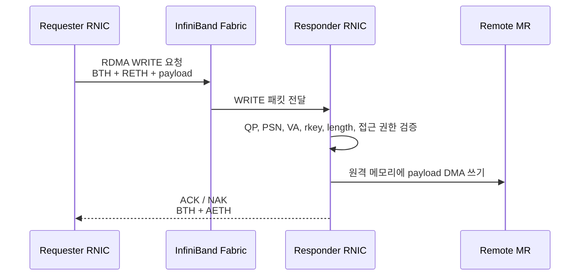

페이로드가 path MTU 안에 들어오는 작은 WRITE의 패킷 모양:

```text
LRH -> BTH(RDMA WRITE Only) -> RETH(VA, rkey, length) -> payload -> ICRC/VCRC
```

다중 패킷 WRITE는 메시지가 분할됩니다:

```text
First  packet: LRH -> BTH(RDMA WRITE First)  -> RETH -> PMTU-sized payload
Middle packet: LRH -> BTH(RDMA WRITE Middle) -> PMTU-sized payload
Last   packet: LRH -> BTH(RDMA WRITE Last)   -> remaining payload
ACK:           LRH -> BTH(Acknowledge)       -> AETH
```

중요한 분석 포인트:

- `RETH`는 RDMA WRITE 메시지의 첫 패킷 또는 only 패킷에 나타납니다.
- `RETH`는 원격 가상 주소, `rkey`, DMA length를 운반합니다.
- 중간과 마지막 WRITE 패킷은 페이로드를 운반하지만 전체 원격 메모리 메타데이터를 반복하지 않습니다.
- 응답자는 `rkey`, 접근 권한, 주소 범위, packet sequence를 검사합니다.
- 다중 패킷 WRITE 메시지는 하나의 메시지로 순서가 유지되며, 마지막 WRITE 패킷 전에는 동일 send queue의 다른 동작과 인터리빙되지 않습니다.
- RC 같은 신뢰성 있는 전송에서 응답자는 `AETH`로 ACK 또는 NAK를 반환합니다.
- 정상 RDMA WRITE는 원격 메모리를 갱신하지만 자동으로 원격 애플리케이션에 통지하지 않습니다. 통지는 상위 계층 프로토콜, `RDMA_WRITE_WITH_IMM`, SEND/RECV, 또는 폴링이 필요합니다.

### 향후 캡처가 보여줘야 할 것

진짜 one-sided RDMA 트래픽을 포함하는 향후 pcap은 최소한 다음 일부를 보여줘야 합니다:

| 예상 증거 | RDMA READ | RDMA WRITE |
| --- | --- | --- |
| BTH opcode | `RDMA READ Request`, `RDMA READ Response First/Middle/Last/Only` | `RDMA WRITE First/Middle/Last/Only` |
| RETH | 요청 패킷 | 첫 또는 only 요청 패킷 |
| 원격 가상 주소 | 요청 `RETH`에 | `RETH`에 |
| `rkey` | 요청 `RETH`에 | `RETH`에 |
| 페이로드 방향 | 응답자 → 요청자 | 요청자 → 응답자 |
| AETH | First, last, only read 응답 | ACK/NAK 응답 |
| Target CPU 관여 | 데이터 경로에 없음 | 데이터 경로에 없음 |

이는 현재 패킷 모음이 RDMA/IB 기초에는 유용하지만 완전한 one-sided RDMA 데이터 경로 캡처로는 다룰 수 없는 이유를 설명합니다.

## 제어 경로 vs 데이터 경로

캡처는 1장의 제어 경로와 데이터 경로 구분을 구체화합니다.

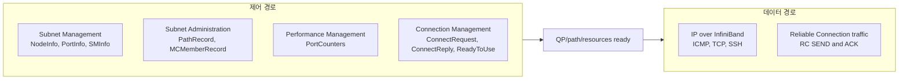

### 제어 경로

제어 경로 트래픽은 이 캡처들에서 강하게 대표됩니다. 다음을 포함합니다:

- QP0를 통한 서브넷 디스커버리.
- QP1을 통한 Subnet Administration.
- 경로 디스커버리와 멀티캐스트 멤버십.
- 성능 카운터 질의.
- Connection Management 메시지.

이는 1장의 설명, 즉 RDMA가 시스템에서 커널이나 제어 소프트웨어를 제거하지 않는다는 점에 대응합니다. CPU, 커널 드라이버, subnet manager, RDMA 런타임, NIC 펌웨어가 여전히 자원과 경로를 구성합니다.

### 데이터 경로

데이터 경로 트래픽은 두 형태로 나타납니다:

- IPoIB 트래픽 — 일반 IP 애플리케이션이 InfiniBand 위에서 동작.
- RC SEND/ACK 트래픽 — IP 페이로드 아래 InfiniBand 전송 동작이 보임.

패킷 세트는 RETH가 있는 완전한 RDMA Write나 RDMA Read 동작을 보여주지 않습니다. 따라서 완전한 RDMA Read/Write 캡처 세트가 아닌 InfiniBand 및 IPoIB 패킷 세트로 표현하는 것이 더 정확합니다.

## 캡처별 분석

### ib_initial_sniffer.pcap

이 캡처는 InfiniBand 제어 경로 초기화의 가장 좋은 예시입니다.

프로토콜 계층:

```text
erf
  infiniband
    arp
```

대표 패킷:

```text
UD Send Only QP=0x000000 SubnGet(NodeInfo)
UD Send Only QP=0x000000 SubnGetResp(NodeInfo)
UD Send Only QP=0x000000 SubnGet(NodeDescription)
UD Send Only QP=0x000000 SubnGetResp(NodeDescription)
UD Send Only QP=0x000000 SubnGet(PortInfo)
UD Send Only QP=0x000000 SubnGetResp(PortInfo)
```

해석:

- QP0는 Subnet Management Packet에 사용됩니다.
- 노드가 디스커버리되고 구성되고 있습니다.
- `NodeInfo`, `NodeDescription`, `PortInfo`, `P_KeyTable`, `SMInfo`는 fabric 디스커버리와 셋업의 일부입니다.
- `MCMemberRecord`와 `InformInfo` 같은 Subnet Administration 레코드도 나타납니다.
- 사용자 페이로드 이동이 아닌 제어 경로 트래픽입니다.

1장 관점에서 왜 중요한가:

- fast path를 사용하기 전에 일어나야 하는 셋업 작업을 보여줍니다.
- "kernel bypass"가 "셋업이나 제어 경로 없음"을 의미하지 않는다는 점을 뒷받침합니다.
- RDMA Process 섹션의 PD/QP/MR/path 준비 개념에 매핑됩니다.

### ib_ibping_sniffer.pcap

이 캡처는 `ibping` 동작과 vendor MAD 메시지에 중점을 둡니다.

프로토콜 계층:

```text
erf
  infiniband
```

대표 패킷:

```text
LID: 5 -> LID: 8   InfiniBand 290 VENDOR (Unknown Attribute)
LID: 8 -> LID: 5   InfiniBand 290 VENDOR (Unknown Attribute)
```

상위 디코드 항목:

```text
VENDOR (Unknown Attribute)
PERF (PortCounters)
PERF (ClassPortInfo)
PERF (PortCountersExtended)
```

LID-쌍 분포 (총 65 패킷):

| Source LID | Dest LID | MAD class | Method | 패킷 수 | 가능한 워크로드 |
| ---: | ---: | --- | --- | ---: | --- |
| 5 | 8 | `0x32` Vendor OUI | Get | 11 | `ibping` 요청 |
| 8 | 5 | `0x32` Vendor OUI | GetResp | 11 | `ibping` 응답 |
| 5 | 1 | `0x04` PerfMgt | Get | 27 | `PortCounters` 폴링 |
| 5 | 4 | `0x04` PerfMgt | Get | 12 | `PortCounters` 폴링 |
| 5 | 2 | `0x04` PerfMgt | Get | 2 | `PortCounters` 폴링 |
| 2 | 5 | `0x04` PerfMgt | GetResp | 2 | `PortCounters` 응답 |

vendor MAD class `0x32`는 `ibping`이 자신의 요청/응답을 운반하는 데 쓰는 클래스로, 표준 PerfMgt class `0x04`와 별개입니다. `ibping` 교환은 정확히 LID 5 ↔ LID 8 사이입니다 (65 중 22 패킷, 완벽히 대칭인 요청/응답). 나머지 43 패킷은 LID 5에서 출발한 background perfquery 스타일 폴링이며, 캡처 윈도우 안에서는 LID 2만 응답했습니다.

이 분포 재현 명령:

```sh
tshark -r ../ib-packets/ib_ibping_sniffer.pcap \
  -T fields \
  -e infiniband.lrh.slid \
  -e infiniband.lrh.dlid \
  -e infiniband.mad.mgmtclass \
  -e infiniband.mad.method \
  | sort | uniq -c
```

해석:

- `ibping`은 IP ping이 아닌 InfiniBand 관리 스타일 트래픽을 사용합니다.
- `ibping` 요청/응답 쌍은 LID 5와 LID 8 사이이며, vendor MAD class `0x32`로 운반됩니다.
- 주기적 패턴이 보입니다: 요청과 응답이 약 1초 간격.
- 별도 도구(`perfquery`로 추정)의 Performance Management 트래픽이 동일 캡처 윈도우에 섞여 있어 LID 1, 2, 4도 함께 나타납니다.

1장 관점에서 왜 중요한가:

- InfiniBand가 TCP/IP와 독립적인 자체 관리 및 진단 트래픽을 가짐을 보여줍니다.
- LID가 fabric 수준에서 직접 사용됩니다.

### ib_ibtracert_sminfo_sniffer.pcap

이 캡처는 트레이스 관련 동작, SMInfo, 성능 관리를 결합합니다.

프로토콜 계층:

```text
erf
  infiniband
```

대표 패킷:

```text
PERF (PortCounters)
PERF (PortCountersExtended)
UD Send Only QP=0x000000 SubnGet(SMInfo)
UD Send Only QP=0x000000 SubnGetResp(SMInfo)
UD Send Only QP=0x000000 SubnGet(LinearForwardingTable)
UD Send Only QP=0x000000 SubnGetResp(LinearForwardingTable)
```

해석:

- `ibtracert`는 fabric 토폴로지와 forwarding 정보가 필요합니다.
- `SMInfo`는 subnet manager 정보를 식별합니다.
- `LinearForwardingTable`은 스위치 forwarding 동작을 가리킵니다.
- 성능 카운터는 포트 상태에 대한 관리 평면 가시성을 보여줍니다.

1장 관점에서 왜 중요한가:

- 스위치 fabric 모델 뒤의 제어 평면 객체를 보여줍니다.
- Packet Relay / Fabric 섹션을 뒷받침합니다 — 스위치는 패킷을 전달하고, 관리 트래픽은 fabric 동작을 디스커버리하고 프로그래밍합니다.

### ib_sniffer.pcap

작은 Performance Management 캡처입니다.

프로토콜 계층:

```text
erf
  infiniband
```

상위 디코드 항목:

```text
PERF (PortCounters)
PERF (PortCountersExtended)
```

해석:

- 캡처는 성능 카운터 질의가 지배합니다.
- 모니터링 트래픽 관찰에 유용하지만, 애플리케이션 페이로드나 RDMA Read/Write 동작은 보여주지 않습니다.

1장 관점에서 왜 중요한가:

- 제어 경로의 모니터링 측면과 연결됩니다.
- fabric 건강은 데이터 패킷만으로 추론되지 않습니다 — 관리 트래픽으로도 질의됩니다.

### ib_ipping_sniffer.pcap

이 캡처는 IPoIB 위의 ICMP를 보여줍니다.

프로토콜 계층:

```text
erf
  infiniband
    ip
      icmp
    arp
```

대표 패킷:

```text
203.0.113.17 -> 203.0.113.18   ICMP Echo request
203.0.113.18 -> 203.0.113.17   ICMP Echo reply
```

해석:

- `ibping`이 아니라 InfiniBand로 운반되는 IP ping입니다.
- 일반 IP 패킷이 InfiniBand에 매핑됨을 보여줍니다.
- IPoIB가 IP 통신을 위해 여전히 주소 해결이 필요하므로 ARP가 나타납니다.

1장 관점에서 왜 중요한가:

- 네이티브 InfiniBand 관리 도구와 IP over InfiniBand의 차이를 보여줍니다.
- 일반 IP 애플리케이션이 InfiniBand 전송 위에서 동작할 수 있음을 보여줍니다.

### ib_IPoIB.pcap

가장 큰 캡처이며 IPoIB 위의 SSH over TCP를 보여줍니다.

프로토콜 계층:

```text
erf
  infiniband
    ip
      tcp
        ssh
```

TCP 대화:

```text
10.10.10.12:34826 <-> 10.10.10.11:22
Total frames: 5848
Total bytes: 10 MB
Duration: 4.2846 s
```

대표 패킷:

```text
10.10.10.12 -> 10.10.10.11   TCP 34826 -> 22 [SYN]
10.10.10.11 -> 10.10.10.12   TCP 22 -> 34826 [SYN, ACK]
10.10.10.12 -> 10.10.10.11   SSH Client: Protocol
```

해석:

- InfiniBand 위에서 운반되는 IP 워크로드입니다.
- 애플리케이션은 SSH이며 RDMA Read/Write가 아닙니다.
- `tshark`는 InfiniBand 캡슐화를 지나면 일반 IP 트래픽처럼 상위 계층을 디코드합니다.
- 높은 프레임 수와 10MB 크기로 IPoIB 처리량 스타일 트래픽의 가장 좋은 샘플입니다.

1장 관점에서 왜 중요한가:

- InfiniBand가 일반 IP 워크로드를 운반할 수 있음을 보여줍니다.
- RDMA 의미와 혼동하면 안 됩니다 — IPoIB는 one-sided RDMA와 같지 않습니다.

### infiniband.pcap

여러 InfiniBand 개념을 한 곳에서 보기에 가장 유용한 캡처입니다.

프로토콜 계층:

```text
erf
  infiniband
    ip
      udp
      icmp
    arp
    ipv6
      icmpv6
```

중요한 디코드 항목:

```text
UD Send Only QP=0x000000 SubnGet(SMInfo)
UD Send Only QP=0x000000 SubnGetResp(SMInfo)
CM: ConnectRequest
CM: ConnectReply
CM: ReadyToUse
RC Acknowledge
ICMP Echo request
ICMPv6 Neighbor Solicitation / Advertisement
```

압축된 흐름:

```text
1-2      SMInfo 질의와 응답
3-6      IPoIB UDP/ARP 트래픽
7-9      Connection Management: request, reply, ready
10-23    ICMP를 운반하는 RC SEND Only와 RC ACK 패킷
24-25    추가 IPoIB UDP
26-31    IPv6 neighbor discovery와 RC ACK
32-33    Subnet Administration PathRecord 조회
34-40    두 번째 CM 셋업과 ICMPv6 트래픽 및 ACK
41-42    SMInfo 질의와 응답
43       ICMPv6 echo request
```

가장 중요한 쌍은 frame 10과 frame 11입니다:

```text
Frame 10:
  Opcode: Reliable Connection (RC) - SEND Only (4)
  Destination QP: 0xfc0407
  Acknowledge Request: True
  Payload: IPv4 ICMP Echo request

Frame 11:
  Opcode: Reliable Connection (RC) - Acknowledge (17)
  Destination QP: 0x870408
  AETH: Ack
```

해석:

- Connection Management가 통신을 준비합니다.
- RC SEND가 IP 페이로드를 운반합니다.
- RC ACK가 신뢰 전달을 확인합니다.
- AETH가 ACK 패킷에 보입니다.
- 완전한 RDMA Write나 Read 예시는 아니지만, 1장의 양방향 신뢰성 있는 전송 논의에 가깝습니다.

1장 관점에서 왜 중요한가:

- QP, BTH opcode, PSN, ACK, AETH를 가시적으로 연결합니다.
- 준비된 연결이 페이로드를 운반하고 전송 수준 ack를 받는 모습을 보여줍니다.
- InfiniBand 신뢰성이 패킷마다 CPU가 아닌 HCA/RNIC에 의해 처리되는 이유를 설명하는 데 도움이 됩니다.

## 핵심 패킷 예시

### QP0 위의 Subnet Management

`ib_initial_sniffer.pcap`에서:

```text
UD Send Only QP=0x000000 SubnGet(NodeInfo)
UD Send Only QP=0x000000 SubnGetResp(NodeInfo)
```

의미:

- QP0가 Subnet Management에 사용됩니다.
- 트래픽은 fabric 디스커버리와 구성의 일부입니다.
- 제어 경로 동작입니다.

### Performance Management

`ib_sniffer.pcap`과 관련 캡처에서:

```text
PERF (PortCounters)
PERF (PortCountersExtended)
```

의미:

- Fabric 컴포넌트가 관리 트래픽으로 카운터를 노출합니다.
- 이 카운터는 모니터링과 트러블슈팅을 지원합니다.
- 애플리케이션 데이터 이동이 아닙니다.

### IPoIB

`ib_ipping_sniffer.pcap`에서:

```text
203.0.113.17 -> 203.0.113.18   ICMP Echo request
203.0.113.18 -> 203.0.113.17   ICMP Echo reply
```

`ib_IPoIB.pcap`에서:

```text
10.10.10.12:34826 <-> 10.10.10.11:22   TCP/SSH
```

의미:

- IP 패킷이 InfiniBand 위에서 운반될 수 있습니다.
- 상위 계층 도구는 익숙해 보이지만 L2/L3 underlay는 Ethernet이 아닌 InfiniBand입니다.

### Reliable Connection SEND과 ACK

`infiniband.pcap`에서:

```text
RC SEND Only QP=0xfc0407
RC Acknowledge QP=0x870408
```

의미:

- BTH opcode가 전송 동작을 구분합니다.
- 목적지 QP가 queue pair endpoint를 식별합니다.
- ACK는 AETH를 포함합니다.
- 이는 신뢰 InfiniBand 전송 동작을 보여줍니다.

## 이 캡처에 없는 것

이 캡처들은 완전한 RDMA Read/Write 예시가 아닙니다.

패킷 세트에서 누락된 것:

- RETH가 있는 RDMA Write 패킷.
- RDMA Read 요청과 응답 흐름.
- RETH의 원격 가상 주소와 rkey 필드.
- 완전한 one-sided RDMA 데이터 이동 예시.
- NCCL collective 트래픽.

따라서 올바른 해석은:

> 이 캡처들은 InfiniBand fabric 관리, IPoIB, 일부 reliable connection 전송 동작을 보여줍니다. 1장의 RDMA/IB 개념을 뒷받침하지만 RDMA Read나 RDMA Write 데이터 이동을 완전히 보여주는 것은 아닙니다.

위의 [RDMA Read/Write 패킷 분석 모델](#rdma-readwrite-패킷-분석-모델) 섹션은 one-sided 동작을 포함하는 향후 캡처에서 무엇이 보여야 하는지 설명합니다.

## 유용한 tshark 명령어

기본 패킷 요약 나열:

```sh
tshark -r ../ib-packets/infiniband.pcap -c 20
```

프로토콜 계층 표시:

```sh
tshark -r ../ib-packets/ib_IPoIB.pcap -q -z io,phs
```

LRH, BTH, MAD 필드 추출:

```sh
tshark -r ../ib-packets/ib_initial_sniffer.pcap \
  -Y infiniband \
  -T fields \
  -e frame.number \
  -e frame.time_relative \
  -e infiniband.lrh.slid \
  -e infiniband.lrh.dlid \
  -e infiniband.bth.opcode \
  -e infiniband.bth.destqp \
  -e infiniband.mad.mgmtclass \
  -e infiniband.mad.method \
  -e infiniband.mad.attributeid \
  -E header=y
```

BTH opcode 카운트:

```sh
tshark -r ../ib-packets/infiniband.pcap \
  -Y "infiniband.bth.opcode" \
  -T fields \
  -e infiniband.bth.opcode | sort | uniq -c
```

상세 패킷 디코드 표시:

```sh
tshark -r ../ib-packets/infiniband.pcap \
  -Y "frame.number==10 || frame.number==11" \
  -V
```

IPoIB TCP 대화 찾기:

```sh
tshark -r ../ib-packets/ib_IPoIB.pcap -q -z conv,tcp
```

로컬 Wireshark/TShark 빌드가 지원하는 InfiniBand 필드 이름 발견:

```sh
tshark -G fields | rg -i "infiniband.*(bth|reth|aeth|opcode|psn|rkey)"
```

향후 캡처에 RDMA READ나 WRITE 패킷이 포함된 경우, BTH opcode부터 시작해 RETH/AETH 세부 사항으로 확장:

```sh
tshark -r ../ib-packets/<rdma-read-write-capture>.pcap \
  -Y "infiniband.bth.opcode" \
  -T fields \
  -e frame.number \
  -e infiniband.bth.opcode \
  -e infiniband.bth.destqp \
  -e infiniband.bth.psn
```

## 1장 정리

1. **InfiniBand는 가시적인 제어 경로를 가집니다.**
   캡처는 Subnet Management, Subnet Administration, Performance Management, Connection Management 트래픽을 보여줍니다. 이는 RDMA kernel bypass가 주로 데이터 경로에 적용된다는 1장의 포인트를 강화합니다.

2. **LID와 QP는 실제 패킷 수준 식별자입니다.**
   LRH 필드는 source와 destination LID를 보여줍니다. BTH 필드는 destination QP와 opcode를 보여줍니다. 단순한 추상 API 개념이 아닙니다.

3. **QP0와 QP1은 관리에 중요합니다.**
   QP0는 Subnet Management 트래픽에 나타납니다. QP1은 Subnet Administration과 Connection Management 트래픽에 나타납니다.

4. **IPoIB는 one-sided RDMA와 다릅니다.**
   IPoIB는 InfiniBand 위에서 일반 IP 트래픽을 운반합니다. TCP, SSH, ARP, ICMP를 보여줄 수 있지만, 그것이 RDMA Read나 RDMA Write를 보여주는 것은 아닙니다.

5. **Reliable Connection 동작이 보입니다.**
   `infiniband.pcap`이 RC SEND와 RC ACK 패킷을 보여줍니다. ACK는 AETH를 포함하며, 이는 1장의 ACK Extended Transport Header 동작 논의와 일치합니다.

6. **데이터 경로/제어 경로 구분은 명시적으로 유지되어야 합니다.**
   관리 캡처는 대부분 제어 경로입니다. IPoIB와 RC SEND/ACK는 데이터 경로에 더 가깝습니다. 완전한 RDMA Read/Write는 RETH와 one-sided 동작 필드를 포함하는 추가 캡처가 필요합니다.


## 참고문헌

### 참조 문서

- [`packet-format-reference_KO.md`](packet-format-reference_KO.md) — 이 데이터셋에서 사용된 모든 IB 헤더의 비트 단위 레이아웃과 BTH opcode 마스터 표, operation→extended-header 매핑.

### NVIDIA 공식 자료
- [NVIDIA Introduction to InfiniBand™](https://network.nvidia.com/pdf/whitepapers/IB_Intro_WP_190.pdf)
- [NVIDIA RDMA Aware Networks Programming User Manual: Key Concepts](https://docs.nvidia.com/networking/display/rdmaawareprogrammingv17/key%2Bconcepts)
- [NVIDIA MLNX_OFED: InfiniBand Network](https://docs.nvidia.com/networking/display/ofed/infiniband%2Bnetwork)
- [NVIDIA MLNX_OFED Documentation v24.04-0.7.0.0](https://docs.nvidia.com/networking/display/mlnxofedv24040700)
- [NVIDIA Quantum InfiniBand Networking Solutions](https://www.nvidia.com/en-us/networking/products/infiniband/)
- [NVIDIA Quantum-X800 InfiniBand Platform](https://www.nvidia.com/en-us/networking/products/infiniband/quantum-x800/)
- [NVIDIA NCCL Documentation](https://docs.nvidia.com/deeplearning/nccl/user-guide/docs/index.html)
- [NVIDIA NCCL Collective Operations](https://docs.nvidia.com/deeplearning/nccl/user-guide/docs/usage/collectives.html)
- [NVIDIA NCCL Environment Variables](https://docs.nvidia.com/deeplearning/nccl/user-guide/docs/env.html)
- [NVIDIA NCCL Troubleshooting: Networking Issues](https://docs.nvidia.com/deeplearning/nccl/user-guide/docs/troubleshooting.html#networking-issues)
- [NVIDIA SHARP with NVIDIA NCCL](https://docs.nvidia.com/networking/display/sharpv3140/using-nvidia-sharp-with-nvidia-nccl)
- [NVIDIA HPC-X NCCL-RDMA-SHARP Plugins](https://docs.nvidia.com/networking/display/hpcx222/nccl-rdma-sharp%2Bplugins)

### 프로토콜 및 도구 자료

- [InfiniBand Trade Association: InfiniBand Architecture Specification FAQ](https://www.infinibandta.org/ibta-specification/)
- [InfiniBand Trade Association: About InfiniBand](https://www.infinibandta.org/about-infiniband/)
- [Wireshark Display Filter Reference: InfiniBand](https://www.wireshark.org/docs/dfref/i/infiniband.html)
- [TShark Manual Page](https://www.wireshark.org/docs/man-pages/tshark.html)
- [linux-rdma rdma-core](https://github.com/linux-rdma/rdma-core)
- [NVIDIA nccl-tests](https://github.com/NVIDIA/nccl-tests)
- [OpenFabrics Alliance Overview](https://www.openfabrics.org/ofa-overview/)
- [OpenFabrics Alliance Advanced Network Software](https://www.openfabrics.org/advanced-network-software/)

### 기술 글 및 배경 자료

- [NADDOD Blog: What is InfiniBand?](https://www.naddod.com/blog/what-is-infiniband)
- [Tencent Cloud Developer: RDMA - IB Specification Volume 1 Transport Layer](https://cloud.tencent.com/developer/article/2513460)
- [O'Reilly InfiniBand Network Architecture](https://learning.oreilly.com/library/view/infiniband-network-architecture/0321117654/)
- [NVIDIA Technical Blog: Simplifying Network Operations for AI with NVIDIA Quantum InfiniBand](https://developer.nvidia.com/blog/simplifying-network-operations-for-ai-with-nvidia-quantum-infiniband/)
- [NVIDIA Technical Blog: InfiniBand Multilayered Security Protects Data Centers and AI Workloads](https://developer.nvidia.com/blog/infiniband-multilayered-security-protects-data-centers-and-ai-workloads/)
- [NVIDIA Technical Blog: Powering the Next Frontier of Networking for AI Platforms with NVIDIA DOCA 3.0](https://developer.nvidia.com/blog/powering-the-next-frontier-of-networking-for-ai-platforms-with-nvidia-doca-3-0/)
- [NVIDIA Technical Blog: New MLPerf Inference Network Division Showcases NVIDIA InfiniBand and GPUDirect RDMA Capabilities](https://developer.nvidia.com/blog/new-mlperf-inference-network-division-showcases-infiniband-and-gpudirect-rdma-capabilities/)
