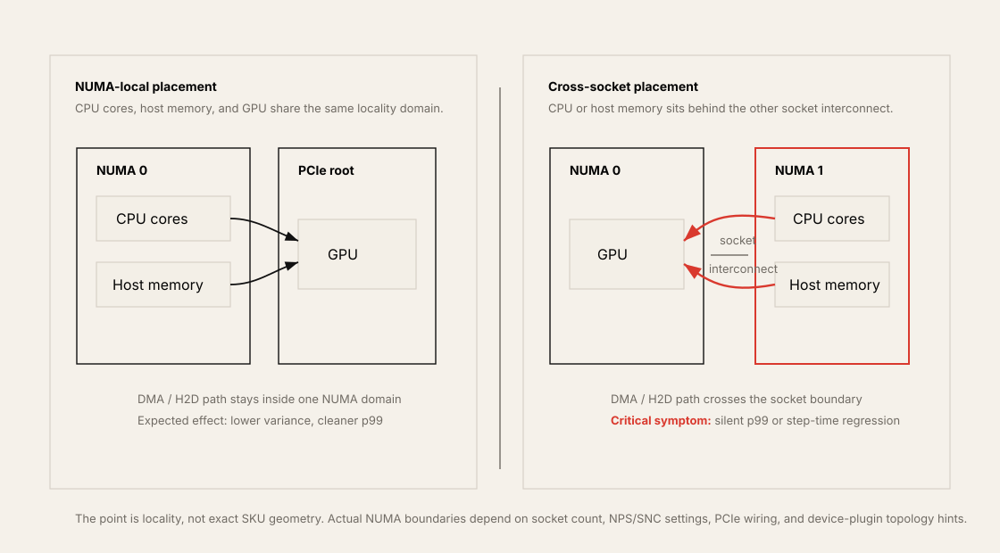
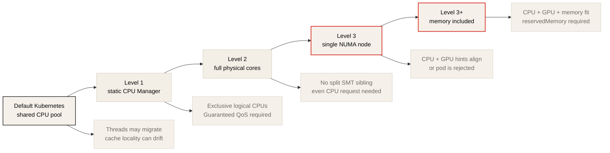
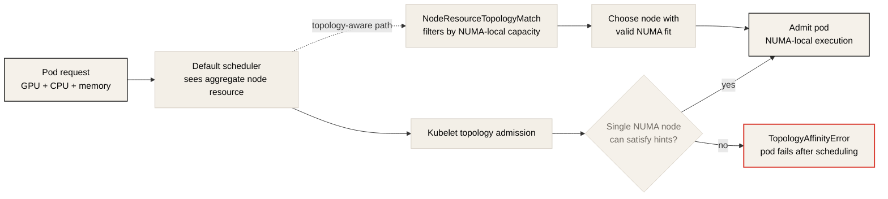

# Keeping GPU Workloads NUMA-Local in Kubernetes

> Ronak Nathani, "Keeping GPU Workloads NUMA-Local in Kubernetes" 요약 노트.
> 원문: <https://ronaknathani.com/blog/2026/05/keeping-gpu-workloads-numa-local-in-kubernetes/>

## 한 줄 요지

GPU workload에서 CPU가 request preparation, batching, dataloader, pinned memory staging처럼 GPU로 가는 data path에 있다면, Kubernetes의 기본 resource scheduling만으로는 부족하다. CPU, GPU, memory가 같은 NUMA domain에 들어오도록 kubelet policy, topology-aware scheduling, workload sizing을 함께 설계해야 한다.

## 이 글의 위치

이 글은 NUMA architecture의 이론 설명보다는 Kubernetes에서 NUMA locality를 실제로 지키는 운영 방법에 초점을 둔다. 핵심 질문은 다음이다.

- GPU와 CPU가 같은 NUMA node에 있는가?
- CPU request가 exclusive CPU allocation을 받을 수 있는 형태인가?
- GPU device plugin이 NUMA topology hint를 제공하는가?
- Pod가 한 NUMA node에 들어가지 않을 때 조용히 느려지는가, admission 단계에서 실패하는가?
- Scheduler가 node aggregate resource가 아니라 NUMA node별 남은 resource를 보고 배치하는가?

이 질문은 inference와 training 모두에 걸린다. Inference에서는 p99 tail latency로, training에서는 dataloader wait time, H2D copy time, step time variance로 나타난다.

## NUMA와 GPU data path

NUMA는 CPU core가 어느 memory에 접근하느냐에 따라 access latency와 bandwidth가 달라지는 구조다. 2-socket server에서는 socket마다 local memory가 있고, 다른 socket의 memory에 접근하려면 socket interconnect를 건너야 한다. AMD EPYC에서는 BIOS의 NPS(Nodes Per Socket) 설정에 따라 한 socket이 여러 NUMA node로 더 쪼개질 수 있다.

GPU workload에서 중요한 점은 PCIe device도 특정 CPU socket 또는 root complex에 물리적으로 연결된다는 것이다. GPU가 DMA로 host memory를 읽을 때 그 memory가 GPU와 가까운 NUMA node에 있으면 local path에 가깝지만, 다른 socket의 memory에 있으면 interconnect를 건너게 된다.

```text
Good path:
CPU cores + host memory on NUMA 0
GPU attached to NUMA 0
H2D / DMA stays local

Bad path:
CPU cores or host memory on NUMA 1
GPU attached to NUMA 0
H2D / DMA crosses socket interconnect
```



원문은 한 inference workload에서 CPU가 두 socket에 걸친 pod가 같은 socket 안에 머문 pod보다 load 상태의 p99 tail latency가 30% 이상 높았다고 설명한다. Kubernetes는 이 상황을 자동으로 드러내지 않는다. Pod는 Running이고 health check도 통과하지만, 같은 traffic을 더 느리게 처리한다.

Training도 같은 원리를 가진다. Data loader worker가 CPU에서 batch를 만들고 GPU로 넘기는 동안 remote memory access와 inter-socket bandwidth contention이 생기면 GPU feeding cadence가 흔들린다. PyTorch performance tuning guide도 training process를 단일 NUMA node에 bind하는 것을 권장한다.

## Kubernetes CPU isolation level

원문은 Kubernetes에서 CPU isolation과 NUMA alignment가 단계적으로 강해진다고 설명한다. 각 단계는 더 강한 성능 isolation을 제공하지만 workload sizing 제약과 failure mode도 늘어난다.

| Level | Setting | What it gives | Main requirement |
| --- | --- | --- | --- |
| 1 | `cpuManagerPolicy: static` | exclusive logical CPU pinning | Guaranteed QoS, integer CPU request |
| 2 | `cpuManagerPolicyOptions: full-pcpus-only=true` | physical core 단위 allocation | SMT thread 수의 배수 CPU request |
| 3 | `topologyManagerPolicy: single-numa-node` | CPU/device/hugepage topology hint를 단일 NUMA node에 맞춤 | critical resource가 한 NUMA node에 들어야 함 |
| 3+ | `memoryManagerPolicy: Static` | memory request도 topology admission에 포함 | `reservedMemory`, NUMA별 memory capacity planning |



## Level 1: `cpuManagerPolicy: static`

Kubernetes 기본값에서는 OS scheduler가 container process를 사용 가능한 CPU 위에서 자유롭게 이동시킨다. 전체 CPU utilization 관점에서는 효율적일 수 있지만, cache affinity와 latency consistency에는 불리하다.

```yaml
cpuManagerPolicy: static
```

`static` policy를 켜면 Guaranteed QoS pod의 integer CPU request를 가진 container가 exclusive logical CPU를 받을 수 있다. Kubelet은 container의 cpuset cgroup을 제한해 해당 process가 배정된 CPU list 안에서만 실행되도록 만든다.

필요 조건은 다음이다.

| Requirement | Notes |
| --- | --- |
| `requests == limits` | 모든 container가 Guaranteed QoS 조건을 만족해야 함 |
| integer CPU request | `5.5` 같은 fractional CPU는 exclusive CPU 대상이 아님 |
| init container와 sidecar 확인 | pod QoS는 main container만으로 결정되지 않음 |
| OS reserved CPU 별도 고려 | host daemon과 kernel thread가 pinned CPU를 방해하지 않게 해야 함 |

이 단계만으로도 thread migration이 줄고 container 간 CPU contention이 줄어 성능 일관성이 좋아질 수 있다. 하지만 logical CPU pinning만으로는 physical core 단위 isolation이 보장되지 않는다.

## Level 2: `full-pcpus-only`

SMT가 켜진 system에서는 하나의 physical core가 보통 두 logical core로 보인다. 두 container가 같은 physical core의 sibling hyperthread를 하나씩 받으면 L1/L2 cache와 execution resource를 공유한다.

```yaml
cpuManagerPolicyOptions:
  full-pcpus-only: "true"
```

`full-pcpus-only=true`는 logical core 조각이 아니라 physical core 전체를 container에 준다. 즉 한 physical core의 SMT sibling이 같은 container로 간다.

대가도 있다. Exclusive CPU를 받는 container는 SMT thread 수의 배수만큼 CPU를 request해야 한다. 일반적인 2-way SMT에서는 2, 4, 6처럼 even CPU request가 필요하다. 홀수 CPU request를 가진 pinned container는 `SMTAlignmentError`로 실패할 수 있다.

운영적으로는 이 옵션을 켜기 전에 기존 workload의 CPU request를 audit해야 한다.

## Level 3: `single-numa-node`

`cpuManagerPolicy: static`과 `full-pcpus-only`는 CPU pinning과 physical core isolation을 제공하지만, 모든 CPU가 같은 NUMA node에서 왔는지는 보장하지 않는다. Kubelet CPU Manager의 기본 packed allocation은 가능한 한 NUMA-local하게 배치하려고 하지만, node fragmentation이 생기면 한 container의 CPU가 여러 NUMA node에 걸칠 수 있다.

```yaml
topologyManagerPolicy: single-numa-node
```

Topology Manager는 CPU Manager, Device Manager, Memory Manager 같은 component에서 topology hint를 모아 resource allocation이 같은 NUMA node 안에서 가능한지 확인한다. `single-numa-node`에서는 한 NUMA node가 필요한 hinted resource를 만족하지 못하면 pod admission을 거부한다.

중요한 caveat가 있다.

| Caveat | Meaning |
| --- | --- |
| GPU plugin topology hint 필요 | NVIDIA device plugin 같은 device plugin이 NUMA `TopologyInfo`를 제공해야 CPU-GPU locality를 강제할 수 있음 |
| scope 선택 필요 | `container` scope는 container별 alignment, `pod` scope는 pod effective request 전체 alignment |
| sidecar 주의 | logging/metrics sidecar까지 pod scope에 묶으면 불필요하게 admission이 어려워질 수 있음 |
| memory는 별도 | memory까지 보장하려면 `memoryManagerPolicy: Static`이 필요 |

## Memory Manager까지 켜는 이유

CPU와 GPU가 같은 NUMA node에 있어도 host memory allocation이 remote NUMA node에 잡히면 DMA path가 멀어질 수 있다. 따라서 강한 NUMA alignment에는 memory request도 topology admission에 포함해야 한다.

```yaml
memoryManagerPolicy: Static
```

이 설정을 쓰려면 kubelet의 `reservedMemory`도 구성해야 한다. 또한 workload의 memory request가 target NUMA node 안에 들어야 한다. 그렇지 않으면 CPU와 GPU는 맞아도 memory 때문에 admission이 실패하거나, 실제 runtime에서 locality가 깨질 수 있다.

## 최소 kubelet configuration

NUMA-aligned GPU node pool을 별도로 운영한다면 원문은 다음 계열의 kubelet 설정을 제시한다.

```yaml
cpuManagerPolicy: static
cpuManagerPolicyOptions:
  full-pcpus-only: "true"
topologyManagerPolicy: single-numa-node
# Default is container. Use pod only when the whole pod should fit on one NUMA node.
# topologyManagerScope: pod
memoryManagerPolicy: Static
# memoryManagerPolicy: Static requires reservedMemory to be configured.
```

CPU Manager나 Memory Manager policy를 바꿀 때는 drained node에서 적용해야 한다. Kubelet restart 전에 CPU/memory manager state file을 지워야 하는 경우도 있다. 운영 중인 mixed workload node에 바로 켜면 기존 pod sizing과 충돌할 수 있다.

## Kubelet CPU allocation이 만드는 조용한 성능 저하

`cpuManagerPolicy: static`의 packed allocation은 대체로 좋은 방향이다. Kubelet은 full NUMA node, full physical core, individual logical core 순서로 CPU를 가져오며, 가능한 한 이미 많이 사용된 NUMA node를 먼저 채워 fragmentation을 줄이려 한다.

하지만 "가능하면 local"은 보장이 아니다.

예를 들어 2-socket machine이 있고 socket당 48 physical core, SMT 포함 96 vCPU가 있다고 하자. Reservation 이후 각 NUMA node에 90 allocatable vCPU와 4 GPU가 있다고 가정한다. Pod 하나가 GPU 1개와 22 vCPU를 request하면 처음 4개 pod는 NUMA 0에 잘 들어간다.

```text
4 pods x 22 vCPU = 88 vCPU
NUMA 0 remaining = 2 vCPU
```

5번째 pod가 22 vCPU를 요청하면 NUMA 0에는 2 vCPU만 남아 있다. `single-numa-node`가 없다면 CPU Manager는 2 vCPU를 NUMA 0에서, 나머지 20 vCPU를 NUMA 1에서 가져올 수 있다. Pod는 정상 실행되지만 CPU가 NUMA boundary를 걸친다.

이것이 가장 위험한 실패 모드다. Pod는 실패하지 않는다. Kubernetes event도 성능 저하를 알려주지 않는다. 사용자는 p99 latency나 throughput variance를 보고 나서야 문제를 발견한다.

## Failure Mode 1: `SMTAlignmentError`

`full-pcpus-only=true`를 켜면 exclusive CPU를 받는 container의 CPU request가 SMT thread 수의 배수가 아니면 kubelet이 pod를 거부한다.

예를 들어 2-way SMT 환경에서 pinned container가 3 CPU를 request하면 physical core를 온전히 줄 수 없다. 이 경우 `SMTAlignmentError`가 발생한다. Deployment나 StatefulSet controller가 pod를 재생성해도 같은 node pool에서는 같은 이유로 계속 실패한다.

대응은 단순하지만 사전 준비가 필요하다.

- pinned container CPU request를 even number로 조정한다.
- sidecar와 init container의 request/limit이 pod QoS를 깨지 않는지 확인한다.
- `full-pcpus-only`를 켜는 node pool을 별도로 만든다.

## Failure Mode 2: `TopologyAffinityError`

`topologyManagerPolicy: single-numa-node`를 켜면 kubelet은 CPU, device, memory topology hint를 모아 단일 NUMA node에서 만족 가능한지 본다. 불가능하면 pod는 `TopologyAffinityError`로 admission 단계에서 실패한다.

이 실패는 처음에는 혼란스럽다. Node 전체 aggregate resource는 충분해 보일 수 있기 때문이다.

```text
Node free CPU = 60 vCPU
NUMA 0 free = 20 vCPU
NUMA 1 free = 40 vCPU
Pod request = 48 vCPU
```

총량으로는 60 vCPU가 있어 보이지만, 어떤 단일 NUMA node도 48 vCPU를 제공하지 못한다. `single-numa-node`에서는 이런 pod를 받아들이지 않는 것이 맞다. 조용히 느려지는 것보다 명시적으로 실패하는 편이 latency-sensitive GPU service에는 더 낫다.

## Topology-aware scheduling이 필요한 이유

기본 Kubernetes scheduler는 node의 aggregate resource를 보고 scheduling한다. NUMA node별 잔여 CPU, memory, GPU locality를 알지 못한다. 따라서 scheduler는 pod를 node에 보냈지만 kubelet이 topology admission에서 거부하는 일이 생긴다.

이 gap을 줄이려면 topology-aware scheduling이 필요하다.



| Component | Role |
| --- | --- |
| `NodeResourceTopology` CRD | node별 NUMA resource 정보를 cluster object로 표현 |
| NFD Topology Updater | kubelet PodResources API 등을 보고 NUMA별 available resource를 갱신 |
| `NodeResourceTopologyMatch` scheduler plugin | scheduler가 topology constraint를 고려해 node를 filter/score |

이 구성을 넣으면 scheduler가 "총량은 충분하지만 단일 NUMA node에는 부족한 node"를 미리 걸러낼 수 있다. 단점은 platform team이 운영해야 할 component가 늘어난다는 점이다. DaemonSet, CRD, scheduler plugin cache, update interval을 모두 이해해야 한다.

## Platform team과 workload owner의 계약

원문에서 가장 실무적인 부분은 NUMA alignment가 platform team 혼자 해결할 수 있는 문제가 아니라는 점이다. Workload owner도 sizing constraint를 이해해야 한다.

Platform team이 제공해야 할 정보:

| Information | Why it matters |
| --- | --- |
| node pool SKU | core count, GPU count, NIC placement가 SKU마다 다름 |
| NUMA geometry | NUMA node별 core, memory, GPU mapping |
| NPS mode | AMD EPYC에서 socket이 몇 NUMA node로 쪼개지는지 결정 |
| system/kube reserved CPU | workload가 실제로 쓸 수 있는 NUMA별 allocatable CPU 계산 |
| recommended CPU per GPU | pod sizing이 NUMA node 안에 들어오게 유도 |
| enabled constraints | `full-pcpus-only`, `single-numa-node`, topology scope, Memory Manager |
| expected failure modes | `SMTAlignmentError`, `TopologyAffinityError`를 workload owner가 이해해야 함 |

Workload owner가 해야 할 일:

| Action | Why it matters |
| --- | --- |
| CPU/memory request를 실제 peak에 맞춤 | Guaranteed QoS와 admission success에 필요 |
| 한 NUMA node 안에 들어가는 pod size 선택 | 큰 pod 하나보다 작은 NUMA-local pod 여러 개가 나을 수 있음 |
| even CPU request 사용 | `full-pcpus-only` node pool에서 필요 |
| sidecar/init container 확인 | pod QoS와 topology scope에 영향 |
| SKU 변경 시 sizing 재검토 | NUMA geometry는 hardware와 BIOS setting에 따라 달라짐 |

## 검증 명령

Node topology:

```bash
lscpu -e=CPU,CORE,SOCKET,NODE
numactl -H
nvidia-smi topo -m
```

Container CPU affinity:

```bash
kubectl exec <pod-name> -c <container-name> -- taskset -cp 1
kubectl exec <pod-name> -c <container-name> -- grep Cpus_allowed_list /proc/1/status
```

Kubelet policy:

```bash
kubectl describe node <node-name>
```

Pod event 확인:

```bash
kubectl describe pod <pod-name>
kubectl get events --sort-by=.lastTimestamp
```

확인할 것은 단순히 pod가 Running인지가 아니다. CPU affinity가 기대한 NUMA node 안에 들어오는지, GPU가 그 NUMA node에 붙어 있는지, memory request가 해당 NUMA node 안에 들어갈 수 있는지 봐야 한다.

## DRA와 향후 방향

원문은 Kubernetes DRA(Dynamic Resource Allocation) CPU driver를 future direction으로 언급한다. DRA는 resource allocation을 더 scheduling layer에 가깝게 끌어올려, kubelet admission 단계에서 뒤늦게 실패하는 문제를 줄일 가능성이 있다.

다만 글에서는 아직 충분히 검증하지 않았기 때문에 권장안으로 제시하지는 않는다. 현재 production 판단에서는 CPU Manager, Topology Manager, Memory Manager, topology-aware scheduler plugin 조합이 더 직접적인 선택지다.

## Training workload에 적용하기

Training에서는 다음 상황에서 NUMA alignment를 우선 검토한다.

| Symptom | First checks |
| --- | --- |
| GPU utilization sawtooth | dataloader wait time, CPU affinity, pinned memory NUMA locality |
| step time variance 증가 | CPU run queue, remote memory access, I/O wait |
| NCCL bandwidth 낮음 | GPU/NIC locality, `nvidia-smi topo -m`, selected interface |
| MoE all-to-all variance | GPU/NIC topology, CPU scheduling jitter, expert placement |
| host memory pressure | cgroup memory limit, Memory Manager, NUMA별 free memory |

큰 training job은 보통 GPU 수와 network topology를 먼저 본다. 하지만 node 안에서 CPU와 memory가 GPU-local하지 않으면 expensive accelerator가 batch를 기다릴 수 있다.

## Inference workload에 적용하기

Inference에서는 다음 질문이 중요하다.

| Question | Why it matters |
| --- | --- |
| tokenizer와 batching thread가 GPU-local CPU에서 도는가? | TTFT와 p99 latency에 영향 |
| pod CPU가 두 socket에 걸치는가? | H2D path와 cache locality가 흔들릴 수 있음 |
| GPU plugin이 NUMA topology hint를 제공하는가? | Topology Manager가 CPU-GPU locality를 강제할 수 있는 전제 |
| p99가 특정 node/pod에서만 높은가? | misaligned pod가 조용히 serving 중일 수 있음 |
| 큰 pod 하나보다 작은 replica 여러 개가 나은가? | NUMA-local sizing과 autoscaling 효율 |

LLM serving에서는 GPU kernel 최적화만으로 p99를 설명할 수 없다. CPU preprocessing, scheduler, memory copy, postprocessing이 GPU 앞뒤에 붙어 있기 때문에 NUMA locality는 serving path의 일부다.

## 실무 결론

1. GPU workload의 CPU는 control plane만이 아니라 data path다.
2. CPU pinning은 `cpuManagerPolicy: static`과 Guaranteed QoS 조건이 있어야 의미가 생긴다.
3. `full-pcpus-only`는 physical core isolation을 주지만 CPU request 제약을 만든다.
4. `single-numa-node`는 조용한 성능 저하를 admission failure로 바꾼다.
5. Memory locality까지 보려면 `memoryManagerPolicy: Static`과 `reservedMemory`가 필요하다.
6. Device plugin이 topology hint를 주지 않으면 Topology Manager가 CPU-GPU locality를 강제할 수 없다.
7. 기본 scheduler는 NUMA별 잔여 resource를 모르므로 topology-aware scheduling이 필요할 수 있다.
8. Platform team은 node pool별 NUMA geometry와 recommended pod size를 문서화해야 한다.
9. Workload owner는 "CPU 몇 개"가 아니라 "한 NUMA node 안에 들어가는 CPU/memory/GPU 조합"으로 request를 설계해야 한다.

## 이 레포와의 연결

| Topic | Connection |
| --- | --- |
| Chapter 3: OS, Docker, and Kubernetes Tuning | CPU Manager, Topology Manager, Memory Manager, Guaranteed QoS의 실무 적용 |
| Chapter 4: Distributed Networking Communication | GPU/NIC locality와 RDMA/NCCL path 확인 |
| Training notes | dataloader, pinned memory, MoE, step time variance |
| Efficient LLM Inference Systems | tokenizer, batching, H2D copy, serving p99 tail latency |
| Never Underestimate Memory Architecture | NUMA와 uncore가 왜 성능 모델의 일부인지 설명하는 배경 자료 |

## 후속 질문

1. 현재 GPU node pool의 NUMA node별 CPU, memory, GPU, NIC mapping은 문서화되어 있는가?
2. `nvidia-device-plugin`이 NUMA `TopologyInfo`를 제공하고 있는가?
3. GPU pod는 Guaranteed QoS, integer CPU request, even CPU request 조건을 만족하는가?
4. `single-numa-node`를 켰을 때 실패할 workload가 있는가?
5. Scheduler가 NUMA별 잔여 resource를 보지 못해서 kubelet admission failure loop가 생길 수 있는가?
6. Platform team이 workload owner에게 recommended CPU-per-GPU sizing matrix를 제공하고 있는가?
