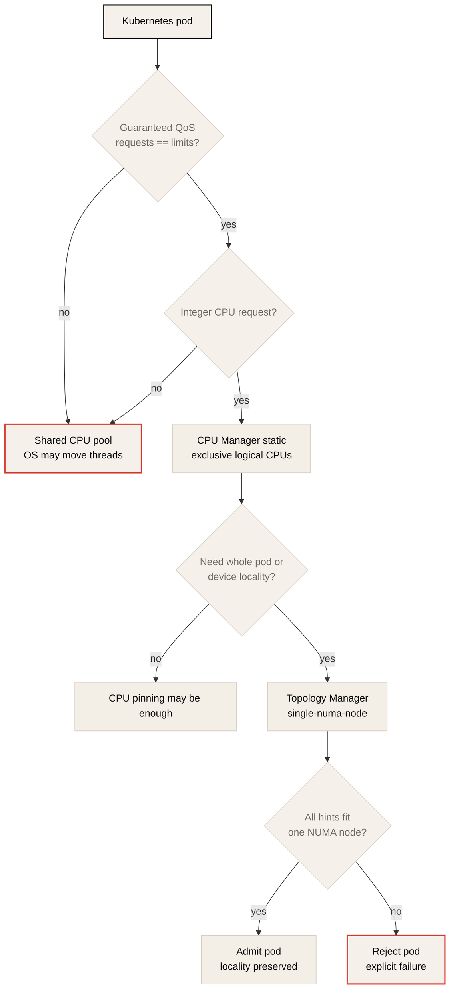

# Never Underestimate Memory Architecture

> Bryan Boreham, Grafana Labs, CNCF 발표 요약 노트.
> 원본 영상: [Never Underestimate Memory Architecture - Bryan Boreham, Grafana Labs](https://www.youtube.com/watch?v=C6aBa1vnYT4)
> 발표 자료: [Never Underestimate Memory Architecture.pdf](https://hosted-files.sched.co/kccncjpn2025/c9/Never%20Underestimate%20Memory%20Architecture.pdf)

## 한 줄 요지

대형 서버와 cloud VM에서는 CPU, memory, cache, PCIe device가 균일하게 연결되어 있지 않다. Workload가 NUMA boundary와 shared uncore resource를 넘나들면 같은 일을 하면서도 CPU 사용량, step time, p99 latency가 크게 나빠질 수 있다.

## 왜 이 발표가 중요한가

GPU workload 성능을 볼 때 흔한 실수는 GPU kernel, CUDA library, NCCL만 보는 것이다. 하지만 training과 inference 모두 GPU 바깥의 host-side path가 GPU를 먹여 살린다.

Training에서는 CPU dataloader, preprocessing, pinned memory staging, kernel launch, checkpoint serialization이 중요하다. Inference에서는 tokenization, request batching, scheduler thread, model server event loop, H2D copy, postprocessing이 중요하다. 이 CPU 작업과 host memory가 GPU, NIC와 먼 NUMA domain에 배치되면 GPU는 계산 자원을 갖고도 데이터를 기다린다.

Bryan Boreham의 발표는 이 문제를 Grafana Cloud의 실제 production 사례에서 출발해 설명한다. 결론은 단순하다. 큰 machine은 단순히 작은 machine의 확장판이 아니다. 일정 크기를 넘으면 memory architecture 자체가 성능 모델의 일부가 된다.

## Grafana의 실제 NUMA 사건

발표는 Grafana Cloud의 metrics ingest dashboard에서 시작한다. Metrics ingest workload는 고객이 같은 형태의 metrics를 반복적으로 보내기 때문에 CPU 사용량이 매우 안정적이어야 한다. 그런데 어느 날 수백 대 중 세 대만 CPU를 훨씬 많이 쓰는 현상이 나타났다.

처음에는 application imbalance처럼 보였지만, machine type을 함께 그려 보니 공통점이 드러났다. 문제가 된 node들은 모두 AWS `m5a.12xlarge`였다. 같은 workload를 처리하는데 특정 instance type만 더 많은 CPU를 쓰고 있었다.

발표자는 이 원인을 며칠 동안 추적했고, 결국 NUMA topology가 핵심이라고 설명한다. 이 사례에서 process는 평소 약 8 CPU를 쓰던 일을 14-15 CPU 수준까지 쓰게 되었다. Q&A에서는 workload에 따라 영향이 10% 수준일 수도 있고, 이 사례처럼 거의 2배에 가까울 수도 있다고 말한다.

## NUMA란 무엇인가

NUMA는 Non-Uniform Memory Access의 약자다. 핵심은 모든 CPU가 모든 memory에 같은 비용으로 접근하지 않는다는 뜻이다.

입문용 컴퓨터 구조 그림에서는 여러 CPU와 memory가 하나의 bus에 연결된 것처럼 보인다. 하지만 실제 대형 서버는 그렇게 만들 수 없다. 모든 CPU와 memory를 하나의 bus로 연결하면 전기적 신호가 긴 경로를 돌아야 하고, bandwidth와 latency가 감당되지 않는다.

실제 서버는 보통 CPU socket, die, chiplet 근처에 local memory controller와 memory channel을 둔다. CPU는 자기 근처 memory에는 빠르게 접근하고, 다른 CPU나 chiplet 근처 memory에는 interconnect를 거쳐 접근한다.


위 그림은 발표 자료의 "Conceptually", "Reality", "Non-Uniform Memory Access" 슬라이드를 바탕으로 재구성한 것이다. 원본 slide crop은 아니며, 이 노트의 설명을 위해 레포 스타일로 다시 그렸다.

발표에서 보여준 예시는 다음과 같다.

| Access type | Approximate latency |
| --- | ---: |
| local memory access | about 50 ns |
| remote memory access | about 140 ns |

다른 AMD EPYC 사례에서는 core 간 접근 timing이 가장 빠를 때 약 32 ns, 느릴 때 약 220 ns까지 벌어졌다. 이 차이는 micro-optimization 수준이 아니다. 큰 in-memory workload에서는 application-level CPU cost와 tail latency로 드러날 수 있다.

## 작은 프로그램은 왜 덜 아픈가

발표자는 모든 program이 NUMA 문제를 겪는 것은 아니라고 강조한다. 작은 program이 하나의 CPU 영역과 작은 memory footprint 안에 머무르면 Linux는 대체로 memory를 CPU 가까이에 잘 배치한다.

문제가 되는 것은 여러 core를 쓰고, memory footprint가 크고, thread와 allocation이 여러 NUMA zone에 걸치는 program이다. 발표자는 Prometheus와 같은 Go service를 예로 든다. 이런 service는 수 GB memory와 많은 core를 사용하기 때문에 NUMA topology의 영향을 받을 수 있다.

이 관찰은 AI workload에도 그대로 적용된다. 작은 single-process experiment에서는 문제가 안 보이다가, dataloader worker 수를 늘리고, 큰 batch buffer를 쓰고, multi-GPU node에 올리는 순간 host-side locality가 성능 변수로 나타난다.

## Cloud VM에서 NUMA를 확인하는 법

Cloud provider의 instance spec만으로는 NUMA 구조를 알기 어렵다. AWS, Google Cloud, Azure는 보통 vCPU 수, memory size, disk, network 성능은 공개하지만 NUMA zone 수와 core mapping은 명확히 공개하지 않는다.

직접 확인해야 한다.

```bash
lscpu
lscpu -e=CPU,CORE,SOCKET,NODE
numactl -H
```

GPU node라면 다음도 같이 봐야 한다.

```bash
nvidia-smi topo -m
```

`lscpu` 출력에서 NUMA node별 CPU list를 보면 process가 어느 CPU set에 묶여야 하는지 알 수 있다. GPU server에서는 여기에 GPU/NIC PCIe topology까지 겹쳐 봐야 한다. Distributed training에서는 GPU와 NIC가 멀면 NCCL/RDMA path가 나빠지고, inference에서는 CPU worker와 GPU가 멀면 request processing과 H2D copy variance가 커질 수 있다.

```mermaid
flowchart LR
    A[Symptom<br/>same workload, higher CPU] --> B[Group by instance type]
    B --> C[Check NUMA shape<br/>lscpu / numactl]
    C --> D[Measure memory locality<br/>node-exporter zoneinfo]
    D --> E[If available<br/>perf / hardware counters]
    E --> F[Choose mitigation<br/>smaller VM / pinning / sizing]

    classDef primary fill:#F5F1EA,stroke:#111111,stroke-width:1.4px,color:#050505
    classDef secondary fill:#F3EFE7,stroke:#D8D1C7,stroke-width:1.2px,color:#050505
    classDef note fill:#F5F1EA,stroke:#D8D1C7,stroke-width:1px,color:#6F6A63
    classDef accent fill:#F5F1EA,stroke:#D9392E,stroke-width:2px,color:#050505
    class A primary
    class B,C,D,E secondary
    class F accent
```



## Cloud Instance 선택의 함정

Grafana가 겪은 문제의 한 축은 큰 instance로 자연스럽게 확장해 온 운영 방식이었다. 처음에는 작은 VM에서 시작하고, workload가 커지면 더 큰 VM으로 옮긴다. 그런데 어느 순간 VM이 하나의 NUMA zone보다 커진다. 이때부터 program은 같은 machine 안에 있지만 균일하지 않은 memory system 위에서 실행된다.


발표 자료의 instance-size sequence는 "작은 instance에서 시작해 더 큰 instance로 옮기다 보면 어느 순간 NUMA boundary를 넘는다"는 운영 패턴을 보여준다. 이 노트에서는 그 흐름을 비용/overhead trade-off까지 함께 보이도록 재구성했다.

발표자가 제시한 현실적인 대응은 문제가 된 큰 `m5a.12xlarge`, `16xlarge` 계열을 피하는 것이었다. 겉으로는 단순한 해결책이지만, 핵심 원리는 분명하다.

| Strategy | Meaning | Trade-off |
| --- | --- | --- |
| smaller VM 사용 | program을 하나의 NUMA zone 안에 가둔다 | kernel, kubelet, system overhead가 VM마다 반복된다 |
| horizontal scaling | 큰 process 하나보다 작은 replica 여러 개로 나눈다 | load balancing과 coordination 필요 |
| instance family 변경 | 더 큰 NUMA zone 또는 더 나은 topology를 가진 VM을 고른다 | cloud SKU별 실측 필요 |
| CPU affinity와 memory binding | process를 특정 NUMA domain에 묶는다 | 운영 복잡도 증가 |

AI cluster에서도 같은 질문을 해야 한다. "GPU가 몇 장인가?"만 묻지 말고 "이 GPU들이 어떤 CPU, memory, NIC와 가까운가?"를 같이 봐야 한다.

## Kubernetes CPU Manager와 Topology Manager

Kubernetes 기본 scheduler는 application 성능에 필요한 topology를 자동으로 보장하지 않는다. Kubelet 쪽 기능을 켜야 CPU placement가 의미를 갖기 시작한다.

발표에서 강조한 첫 번째 기능은 CPU Manager다.

```yaml
cpuManagerPolicy: "static"
```

`static` policy를 켜면 Guaranteed QoS pod 중 integer CPU request를 가진 container에 exclusive CPU를 배정할 수 있다. 여기서 중요한 조건은 다음이다.

| Requirement | Why it matters |
| --- | --- |
| CPU request와 limit이 같음 | Guaranteed QoS 조건 |
| memory request와 limit도 같음 | pod 전체 QoS와 eviction risk에 영향 |
| integer CPU request | exclusive CPU allocation 대상 |
| kubelet CPU Manager enabled | 기본값은 topology-aware allocation을 보장하지 않음 |

Topology Manager는 CPU, device, hugepage 같은 resource의 NUMA hint를 모아 같은 NUMA node에 맞추는 기능이다.

```yaml
topologyManagerPolicy: "single-numa-node"
```

발표자는 CPU Manager를 더 일반적인 처방으로, Topology Manager를 더 niche한 처방으로 설명한다. 그러나 GPU training/inference node에서는 Topology Manager가 훨씬 중요해질 수 있다. GPU, NIC, CPU core, memory locality를 함께 맞추지 않으면 GPU workload가 Running 상태여도 goodput이 낮을 수 있기 때문이다.



## Uncore: Memory만 Non-Uniform한 것이 아니다

발표 후반의 중요한 개념은 uncore다. Core 내부의 execution unit, L1/L2 cache를 제외한 CPU package의 shared resource를 말한다. 예를 들어 다음이 포함된다.


| Resource | Why it matters |
| --- | --- |
| LLC/L3 cache | 여러 core가 공유하는 last-level cache |
| memory controller | DRAM access path |
| TLB 관련 구조 | address translation cost |
| interconnect | socket, die, chiplet 사이 traffic |

Grafana의 관측에서는 같은 일을 하는 pod라도 node 전체 CPU utilization이 올라갈수록 pod CPU 사용량이 함께 올라가는 대각선 패턴이 나타났다. Load balancing이 나빠서가 아니라, node를 더 많이 채울수록 shared uncore resource가 병목이 되었기 때문이다.

이것은 "noisy neighbor"가 외부 tenant만을 뜻하지 않는다는 점을 보여준다. 같은 service의 replica들이 한 node 안에서 shared cache, memory controller, interconnect를 서로 압박하면 자기 자신이 noisy neighbor가 될 수 있다.

## Training Workload와의 연결

Training에서는 NUMA 문제가 다음 경로에서 나타난다.

| Path | NUMA-sensitive reason |
| --- | --- |
| dataloader worker | CPU preprocessing과 batch assembly가 GPU-local CPU에서 돌아야 함 |
| pinned memory | page-locked host memory가 GPU와 먼 NUMA node에 잡히면 H2D path가 나빠짐 |
| NCCL/RDMA | GPU와 NIC가 다른 NUMA/PCIe domain에 있으면 collective latency와 bandwidth가 나빠짐 |
| checkpoint I/O | CPU memory, filesystem cache, storage/NIC path가 step time variance를 만들 수 있음 |
| MoE/expert parallel | all-to-all traffic과 CPU scheduling variance가 expert load imbalance를 키울 수 있음 |

따라서 distributed training에서 봐야 할 지표는 GPU utilization 평균이 아니다. Step time variance, dataloader wait time, H2D copy time, NCCL collective time, CPU run queue, remote memory access를 함께 봐야 한다.

## Inference Workload와의 연결

Inference에서는 p99 tail latency로 나타나는 경우가 많다.

| Path | Possible symptom |
| --- | --- |
| tokenizer CPU thread | request preprocessing latency 증가 |
| dynamic batching scheduler | batching window가 흔들리고 GPU input cadence가 불안정 |
| H2D copy | prefill 입력 또는 auxiliary tensor transfer 지연 |
| postprocessing | streaming response와 sampling path jitter |
| colocated pods | CPU cache pollution, context switch, memory controller contention |

LLM serving에서 decode kernel만 보면 GPU가 바쁘게 보일 수 있다. 하지만 TTFT, TPOT, queueing delay, p99를 보면 host-side jitter가 드러난다. NUMA locality는 이 host-side jitter를 줄이는 운영 조건이다.

## 실무 체크리스트

### Node topology

```bash
lscpu -e=CPU,CORE,SOCKET,NODE
numactl -H
nvidia-smi topo -m
```

확인할 질문:

- CPU core와 NUMA node mapping이 어떻게 되는가?
- GPU는 어느 CPU socket 또는 NUMA node에 가까운가?
- NIC는 어느 NUMA domain에 가까운가?
- GPU-GPU path가 NVLink, NVSwitch, PCIe 중 무엇인가?

### Kubernetes placement

```bash
kubectl exec <pod> -c <container> -- taskset -cp 1
kubectl exec <pod> -c <container> -- grep Cpus_allowed_list /proc/1/status
```

확인할 질문:

- Pod가 Guaranteed QoS인가?
- CPU request가 integer인가?
- `cpuManagerPolicy: static`이 켜져 있는가?
- `topologyManagerPolicy: single-numa-node`가 필요한 workload인가?
- CPU allocation이 한 NUMA node 안에 들어오는가?

### Performance counters

```bash
perf stat -e cache-misses,cache-references,cycles,instructions <command>
```

Cloud VM에서는 hypervisor가 hardware counter를 숨길 수 있다. Bare metal 또는 최신 instance에서 더 많은 counter가 보일 수 있다. L1/L2/LLC miss rate, memory bandwidth, remote access counter가 보이면 NUMA와 uncore 병목을 더 직접적으로 확인할 수 있다.

## 발표의 핵심 메시지

1. 큰 machine은 균일한 machine이 아니다.
2. NUMA는 큰 program, 큰 memory footprint, 많은 core를 쓰는 workload에서 성능 문제로 나타난다.
3. Cloud instance spec만으로는 NUMA topology를 알기 어렵다.
4. Kubernetes는 CPU locality를 자동으로 보장하지 않는다.
5. CPU Manager, Guaranteed QoS, integer CPU request가 NUMA-aware placement의 출발점이다.
6. GPU workload에서도 host-side CPU, memory, NIC locality를 봐야 한다.
7. Memory뿐 아니라 cache, memory controller, interconnect 같은 uncore resource도 shared bottleneck이 된다.
8. 때로는 더 큰 instance보다 NUMA zone 안에 들어가는 작은 replica가 더 좋은 성능/비용 균형을 만든다.

## 원본 및 링크 자료

| Resource | Link |
| --- | --- |
| CNCF session page | <https://kccncjpn2025.sched.com/event/1x702/never-underestimate-memory-architecture-bryan-boreham-grafana-labs> |
| YouTube video | <https://www.youtube.com/watch?v=C6aBa1vnYT4> |
| PDF slides | <https://hosted-files.sched.co/kccncjpn2025/c9/Never%20Underestimate%20Memory%20Architecture.pdf> |
| Kubernetes Node Resource Managers | <https://kubernetes.io/docs/concepts/policy/node-resource-managers/> |
| Kubernetes Topology Manager | <https://kubernetes.io/docs/tasks/administer-cluster/topology-manager/> |
| Kubernetes CPU Management Policies | <https://kubernetes.io/docs/tasks/administer-cluster/cpu-management-policies/> |
| Prometheus node_exporter | <https://github.com/prometheus/node_exporter> |

### PDF slide mapping

| Topic in this note | Related PDF slides |
| --- | --- |
| Conceptual bus vs real NUMA | "Conceptually", "Reality", "Non-Uniform Memory Access" |
| NUMA latency | "Memory latency", "Memory latency, with hyperthreading", "Memory latency, m5a.12xlarge model" |
| Instance sizing trap | "Say you start with small instances", "Then you move to bigger instances", "And bigger", "You might be better off with multiple smaller instances" |
| Kubernetes controls | "CPU Manager", "Topology Manager" |
| Uncore | "Pods vs instances CPU plot", "`Uncore` = the parts outside of cores", CPU Manager `prefer-align-cpus-by-uncorecache` slide |

## 이 레포와의 연결

| Topic | Connection |
| --- | --- |
| Chapter 3: OS, Docker, and Kubernetes Tuning | NUMA, CPU Manager, Topology Manager, CPU feeding bottleneck의 실제 사례 |
| Chapter 4: Distributed Networking Communication | GPU/NIC locality, RDMA/NCCL path, collective communication variance |
| Training notes | dataloader, pinned memory, MoE all-to-all, step time variance |
| Efficient LLM Inference Systems | tokenization, batching, H2D copy, serving p99 latency |

## 후속 질문

1. 현재 GPU node의 `lscpu -e`와 `nvidia-smi topo -m` 결과는 어떤 NUMA/GPU/NIC 구조를 보여주는가?
2. Kubernetes GPU pod는 Guaranteed QoS와 integer CPU request 조건을 만족하는가?
3. Training step time 또는 inference p99가 node utilization 증가와 함께 나빠지는가?
4. 큰 instance 하나와 작은 replica 여러 개 중 어느 쪽이 더 좋은 goodput per dollar를 만드는가?
5. GPU utilization이 높은데도 useful throughput이 낮다면, uncore/cache/memory-controller 병목을 의심할 수 있는가?
