# Chapter 4: Tuning Distributed Networking Communication

## Table of Contents

* [Goal](#goal)
* [Why Distributed Networking Matters](#why-distributed-networking-matters)
* [Communication Bottleneck Lens](#communication-bottleneck-lens)
* [Communication and Computation Overlap](#communication-and-computation-overlap)
* [CUDA Streams and Asynchronous Execution](#cuda-streams-and-asynchronous-execution)
* [Reducing Communication Frequency and Volume](#reducing-communication-frequency-and-volume)
* [NVIDIA Magnum IO Stack](#nvidia-magnum-io-stack)
* [RDMA and GPUDirect RDMA](#rdma-and-gpudirect-rdma)
* [Multinode Connectivity](#multinode-connectivity)
* [Multinode Communication Pitfalls](#multinode-communication-pitfalls)
* [NCCL for Distributed Multi-GPU Communication](#nccl-for-distributed-multi-gpu-communication)
* [NCCL Topology Awareness](#nccl-topology-awareness)
* [NCCL Communication Algorithms](#nccl-communication-algorithms)
* [DataParallel vs DistributedDataParallel](#dataparallel-vs-distributeddataparallel)
* [NCCL Environment Variables and Gotchas](#nccl-environment-variables-and-gotchas)
* [Profiling and Debugging NCCL](#profiling-and-debugging-nccl)
* [SHARP and In-Network Aggregation](#sharp-and-in-network-aggregation)
* [Persistent NCCL User Buffers](#persistent-nccl-user-buffers)
* [NIXL and Disaggregated Inference](#nixl-and-disaggregated-inference)
* [NCCL vs NIXL](#nccl-vs-nixl)
* [Distributed Networking Bottleneck Lens](#distributed-networking-bottleneck-lens)
* [Operational Validation Checklist](#operational-validation-checklist)
* [Labs](#labs)
* [Practical Tips and Notes](#practical-tips-and-notes)
* [Chapter Summary](#chapter-summary)
* [Key Terms](#key-terms)
* [Questions](#questions)
* [Answers](#answers)

## Goal

이번 장의 목표는 distributed training과 distributed inference에서 네트워크 통신을 단순한 “속도 문제”가 아니라 GPU goodput을 결정하는 핵심 병목으로 이해하는 것이다.

핵심 아이디어는 다음과 같다.

> Multi-GPU 성능은 GPU FLOPS만으로 결정되지 않는다.
> GPU가 계산하는 시간과 GPU가 서로 기다리는 시간을 얼마나 잘 겹치느냐가 실제 training throughput과 inference latency를 결정한다.

Chapter 4는 다음 주제를 다룬다.

* communication/computation overlap
* CUDA streams 기반 asynchronous execution
* gradient accumulation, bucketing, compression
* NVIDIA Magnum IO
* RDMA, GPUDirect RDMA
* multinode connectivity tuning
* NCCL collective communication
* topology-aware NCCL
* ring/tree/all-reduce/reduce-scatter/all-gather
* PyTorch DataParallel vs DistributedDataParallel
* NCCL communicator lifecycle
* NCCL environment variables
* NCCL profiling and debugging
* SHARP in-network aggregation
* persistent NCCL user buffers
* NIXL and disaggregated inference
* KV cache transfer and offloading
* NCCL vs NIXL

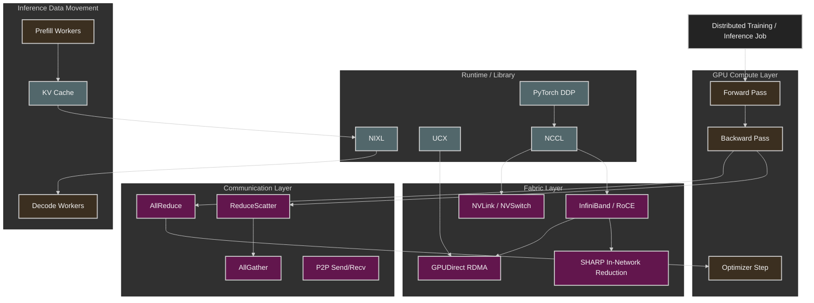

## Why Distributed Networking Matters

단일 GPU에서는 성능 병목이 주로 compute, HBM bandwidth, kernel efficiency, data loading 쪽에서 발생한다.

하지만 multi-GPU나 multinode training으로 넘어가면 새로운 병목이 등장한다.

바로 GPU 간 동기화 비용이다.

예를 들어 DDP training에서는 각 GPU가 자기 batch에 대해 forward/backward를 수행한 뒤 gradient를 동기화해야 한다. 이때 all-reduce가 느리면 GPU는 계산을 끝내고도 다음 step으로 넘어가지 못한다.

즉, distributed training의 성능은 다음 식으로 단순화할 수 있다.

```text
iteration time
= compute time
+ exposed communication time
+ synchronization overhead
+ data/input delay
```

여기서 중요한 표현은 exposed communication time이다.

통신 자체가 존재하는 것은 피할 수 없다. 하지만 그 통신을 backward computation 뒤에 숨길 수 있다면 실제 iteration time에는 크게 드러나지 않는다. 반대로 overlap이 안 되면 통신 시간이 그대로 training step latency가 된다.

### Performance Engineer 관점

| 질문                           | 봐야 할 것                                                |
| ---------------------------- | ----------------------------------------------------- |
| GPU utilization이 낮은가?        | compute 사이에 NCCL gap이 있는지                             |
| scale-out efficiency가 낮은가?   | all-reduce 시간이 step time에서 차지하는 비율                    |
| CPU utilization이 비정상적으로 높은가? | RDMA 대신 TCP/Gloo/host staging 경로를 타는지                 |
| NCCL이 hang 되는가?              | communicator lifecycle, rank failure, network timeout |
| DGX 간 bandwidth가 낮은가?        | NIC, HCA, subnet, GID, MTU, routing, topology         |
| inference tail latency가 높은가? | KV cache transfer, prefill/decode interference        |

## Communication Bottleneck Lens

Distributed AI workload의 네트워크 병목은 단순히 “네트워크가 느리다”로 보면 안 된다.

다음 계층으로 나눠 봐야 한다.

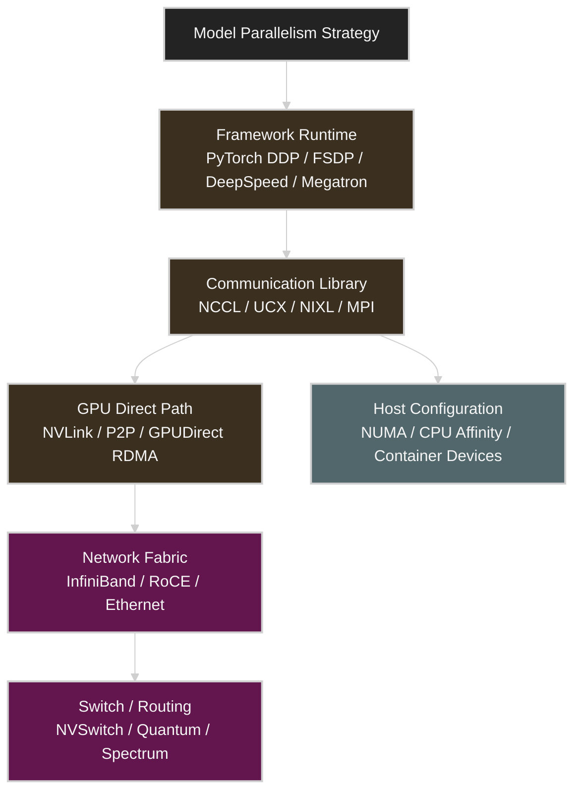

| Layer                 | 주요 역할                       | 병목 증상                                 |
| --------------------- | --------------------------- | ------------------------------------- |
| Parallelism Strategy  | DP, FSDP, TP, PP, EP 선택     | 통신량 자체가 과도함                           |
| Framework Runtime     | bucket, overlap, scheduling | communication overlap 실패              |
| Communication Library | NCCL, UCX, NIXL             | wrong backend, wrong algorithm        |
| GPU Direct Path       | NVLink, P2P, RDMA           | CPU staging, TCP fallback             |
| Network Fabric        | IB, RoCE, Ethernet          | bandwidth 부족, congestion              |
| Switch / Routing      | NVSwitch, SHARP, ECMP       | topology mismatch, hotspot            |
| Host / Container      | NUMA, device mount, cgroup  | `/dev/infiniband` 누락, CPU affinity 오류 |

## Communication and Computation Overlap

이 장의 첫 번째 핵심은 communication/computation overlap이다.

비유하면, 주방에서 요리사가 스테이크를 굽는 동안 웨이터가 이미 이전 접시를 서빙하는 것과 같다. 요리사가 서빙이 끝날 때까지 기다리면 전체 처리량이 떨어진다. GPU도 마찬가지다. backward computation이 진행되는 동안 이미 준비된 gradient bucket을 all-reduce로 보내야 한다.

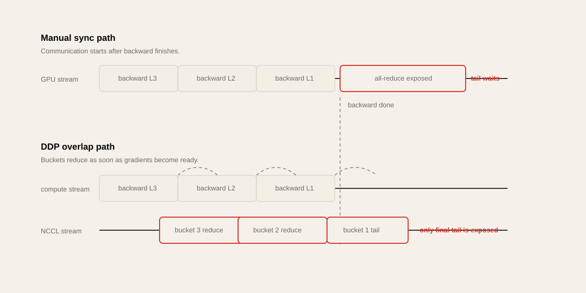

### Without Overlap

```mermaid
%%{init: {"theme": "base", "themeVariables": {"background": "#171717", "primaryColor": "#232323", "primaryTextColor": "#f5f5f5", "primaryBorderColor": "#d0d0d0", "lineColor": "#cfcfcf", "fontFamily": "Inter, Arial, sans-serif"}}}%%
gantt
    title No Overlap: Communication Exposed
    dateFormat  X
    axisFormat %s

    section GPU Compute
    Backward Layer 3 : 0, 10
    Backward Layer 2 : 10, 20
    Backward Layer 1 : 20, 30

    section Network
    AllReduce Gradients : 30, 50

    section Optimizer
    Optimizer Step : 50, 60
```

이 구조에서는 backward가 끝난 뒤 통신을 시작한다. 따라서 all-reduce 시간이 그대로 step time에 추가된다.

### With Overlap

```mermaid
%%{init: {"theme": "base", "themeVariables": {"background": "#171717", "primaryColor": "#232323", "primaryTextColor": "#f5f5f5", "primaryBorderColor": "#d0d0d0", "lineColor": "#cfcfcf", "fontFamily": "Inter, Arial, sans-serif"}}}%%
gantt
    title Overlap: Communication Hidden Behind Backward
    dateFormat  X
    axisFormat %s

    section GPU Compute
    Backward Layer 3 : 0, 10
    Backward Layer 2 : 10, 20
    Backward Layer 1 : 20, 30

    section Network
    AllReduce Bucket 3 : 10, 22
    AllReduce Bucket 2 : 20, 32
    AllReduce Bucket 1 : 30, 40

    section Optimizer
    Optimizer Step : 40, 50
```

이 구조에서는 각 gradient bucket이 준비되는 즉시 all-reduce가 시작된다. 대부분의 통신이 backward compute 뒤에 숨겨지고, 마지막 bucket의 tail만 노출된다.

### 핵심 포인트

| 개념                        | 의미                                      |
| ------------------------- | --------------------------------------- |
| overlap                   | compute와 communication을 동시에 진행          |
| exposed communication     | compute 뒤에 숨기지 못하고 step time에 노출된 통신    |
| bucket                    | gradient tensor를 작은 단위로 나눠 먼저 전송하는 단위   |
| tail                      | 마지막 bucket처럼 숨길 compute가 없어 그대로 노출되는 통신 |
| wait-free backpropagation | backward 중 gradient가 준비되는 즉시 reduce 시작  |

## CUDA Streams and Asynchronous Execution

Overlap은 CUDA stream 없이는 어렵다.

CUDA stream은 GPU 작업 queue다. compute kernel, memory copy, NCCL collective 등을 서로 다른 stream에 배치하면 GPU는 dependency가 없는 작업을 동시에 또는 겹쳐 실행할 수 있다.

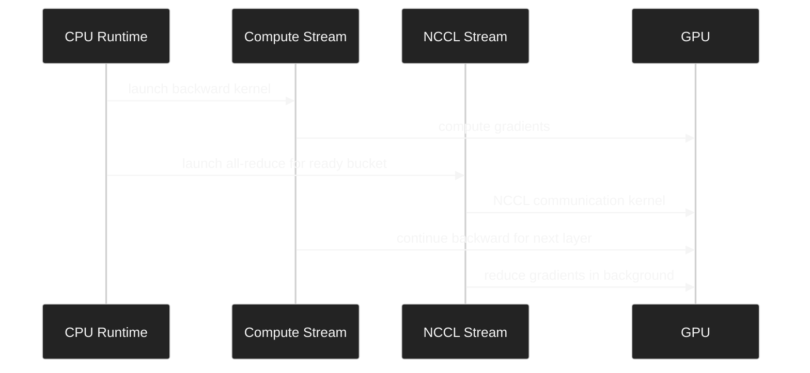

### 주의할 점

다음 코드는 성능을 망칠 수 있다.

```python
loss_value = loss.item()
print(loss_value)
```

`.item()`은 GPU tensor 값을 CPU로 가져온다. 이때 CPU는 GPU 작업이 끝날 때까지 기다려야 한다. 즉, 암묵적인 synchronization이 발생한다.

또한 다음도 성능 측정 목적이 아니라면 조심해야 한다.

```python
torch.cuda.synchronize()
```

이 호출은 GPU queue에 쌓인 비동기 작업을 강제로 모두 기다린다. 정확한 benchmark timing에는 필요하지만, training loop 중간에 남발하면 overlap이 깨진다.

### Practical Rule

> Distributed training loop에서 `.item()`, `print()`, `torch.cuda.synchronize()`는 profiling 없이 넣지 않는다.
> Debug log 한 줄이 NCCL overlap을 깨고 step time을 늘릴 수 있다.

## Reducing Communication Frequency and Volume

통신을 숨기는 것만큼 중요한 것이 통신 자체를 줄이는 것이다.

### 1. Gradient Accumulation

여러 microbatch의 gradient를 모은 뒤 한 번만 synchronization한다.

```text
Before:
microbatch 1 -> all-reduce
microbatch 2 -> all-reduce
microbatch 3 -> all-reduce
microbatch 4 -> all-reduce

After:
microbatch 1 -> accumulate
microbatch 2 -> accumulate
microbatch 3 -> accumulate
microbatch 4 -> all-reduce once
```

장점은 communication frequency가 줄어드는 것이다. 단점은 optimizer update frequency가 줄고 effective batch size가 커진다는 점이다. learning rate schedule과 convergence에 영향을 줄 수 있다.

### 2. Bucketing

PyTorch DDP는 gradient를 bucket 단위로 나눠 처리한다. bucket이 너무 크면 overlap 시작이 늦어진다. bucket이 너무 작으면 launch overhead와 communication fragmentation이 늘어난다.

| Bucket Size | 장점               | 단점                    |
| ----------- | ---------------- | --------------------- |
| 작음          | overlap 빨리 시작    | overhead 증가           |
| 큼           | bandwidth 효율 좋음  | 마지막 bucket tail 증가 가능 |
| 적절함         | compute 뒤에 통신 숨김 | 모델별 tuning 필요         |

### 3. Compression / Quantization

gradient나 activation communication volume을 줄일 수 있다. 하지만 압축/복원 연산 비용과 정확도 영향이 trade-off다.

### 4. Sharding

FSDP, ZeRO, tensor parallelism은 replicate된 state를 줄이고 통신 패턴을 바꾼다. 통신량을 줄일 수도 있지만, all-gather/reduce-scatter가 새 병목이 될 수 있다.

## NVIDIA Magnum IO Stack

Magnum IO는 GPU, CPU, network, storage 사이의 I/O를 최적화하기 위한 NVIDIA의 I/O acceleration stack이다.

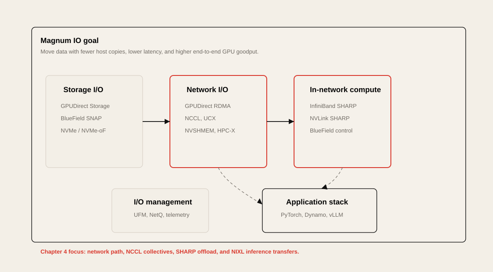

```mermaid
%%{init: {"theme": "base", "themeVariables": {"background": "#171717", "primaryColor": "#232323", "primaryTextColor": "#f5f5f5", "primaryBorderColor": "#d0d0d0", "lineColor": "#cfcfcf", "fontFamily": "Inter, Arial, sans-serif"}}}%%
flowchart LR
    GDS[GPUDirect Storage]
    SNAP[BlueField SNAP]
    RDMA[GPUDirect RDMA]
    NCCL[NCCL]
    UCX[UCX]
    NVSHMEM[NVSHMEM]
    SHARP[SHARP]
    UFM[UFM / NetQ]

    subgraph MagnumIO["NVIDIA Magnum IO"]
        GDS
        SNAP
        RDMA
        NCCL
        UCX
        NVSHMEM
        SHARP
        UFM
    end

    classDef primary fill:#232323,stroke:#d0d0d0,color:#f5f5f5,stroke-width:2px;
    classDef secondary fill:#3b2f20,stroke:#d0d0d0,color:#f5f5f5,stroke-width:2px;
    classDef note fill:#52676b,stroke:#d0d0d0,color:#f5f5f5,stroke-width:2px;
    classDef accent fill:#62164d,stroke:#d0d0d0,color:#f5f5f5,stroke-width:2px;
    class GDS,SNAP secondary
    class RDMA,NCCL,UCX,NVSHMEM primary
    class UFM note
    class SHARP accent
```

| Component         | 역할                                           |
| ----------------- | -------------------------------------------- |
| GPUDirect Storage | storage에서 GPU memory로 직접 I/O                 |
| GPUDirect RDMA    | remote node의 GPU memory로 직접 network transfer |
| NCCL              | collective communication                     |
| UCX               | low-level communication framework            |
| NVSHMEM           | PGAS-style GPU memory sharing                |
| SHARP             | switch에서 reduction offload                   |
| UFM / NetQ        | fabric telemetry and management              |
| BlueField DPU     | networking/storage/security offload          |

Chapter 4에서는 주로 network I/O, RDMA, NCCL, SHARP, NIXL이 핵심이다. Storage 쪽은 Chapter 5에서 더 자세히 이어진다.

## RDMA and GPUDirect RDMA

RDMA는 CPU와 kernel network stack을 우회해서 remote memory에 직접 접근하는 기술이다.

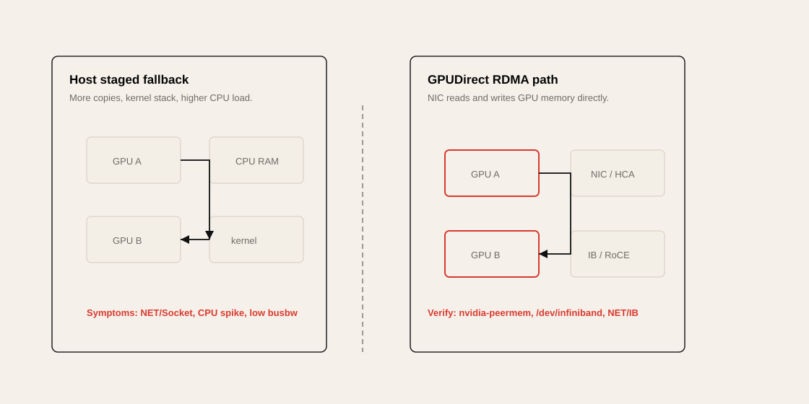

일반적인 TCP path는 다음과 같다.


GPUDirect RDMA path는 다음처럼 단순해진다.

```mermaid
%%{init: {"theme": "base", "themeVariables": {"background": "#171717", "primaryColor": "#232323", "primaryTextColor": "#f5f5f5", "primaryBorderColor": "#d0d0d0", "lineColor": "#cfcfcf", "fontFamily": "Inter, Arial, sans-serif"}}}%%
flowchart LR
    GPU0[GPU Memory] --> NIC0[NIC / HCA]
    NIC0 --> NET[InfiniBand / RoCE]
    NET --> NIC1[NIC / HCA]
    NIC1 --> GPU1[GPU Memory]

    classDef primary fill:#232323,stroke:#d0d0d0,color:#f5f5f5,stroke-width:2px;
    classDef secondary fill:#3b2f20,stroke:#d0d0d0,color:#f5f5f5,stroke-width:2px;
    classDef note fill:#52676b,stroke:#d0d0d0,color:#f5f5f5,stroke-width:2px;
    classDef accent fill:#62164d,stroke:#d0d0d0,color:#f5f5f5,stroke-width:2px;
    class GPU0,GPU1 primary
    class NIC0,NIC1 secondary
    class NET accent
```

### 왜 중요한가?

GPU가 gradient를 계산했는데, 그 gradient를 CPU memory로 복사한 뒤 TCP로 보내고 다시 GPU로 복사한다면 비싼 GPU는 통신 중 놀게 된다.

GPUDirect RDMA는 GPU memory를 NIC가 직접 access할 수 있게 해 CPU staging을 줄인다.

### 확인해야 할 것

| 항목                       | 확인 방법                                       |
| ------------------------ | ------------------------------------------- |
| InfiniBand device 노출     | `ls /dev/infiniband`                        |
| HCA 상태                   | `ibstat`, `ibv_devinfo`                     |
| GPU-NIC topology         | `nvidia-smi topo -m`                        |
| NCCL RDMA 사용 여부          | `NCCL_DEBUG=INFO`                           |
| TCP fallback 여부          | NCCL log에서 `NET/Socket` 확인                  |
| 성능 baseline              | `nccl-tests`, `ib_write_bw`, `ib_read_bw`   |
| Kubernetes device access | container에 `/dev/infiniband` mount 여부       |
| GPUDirect path           | `nvidia-peermem` module, DMA-BUF support 확인 |

## Multinode Connectivity

Multinode training에서는 node 내부 통신과 node 간 통신을 분리해서 봐야 한다.

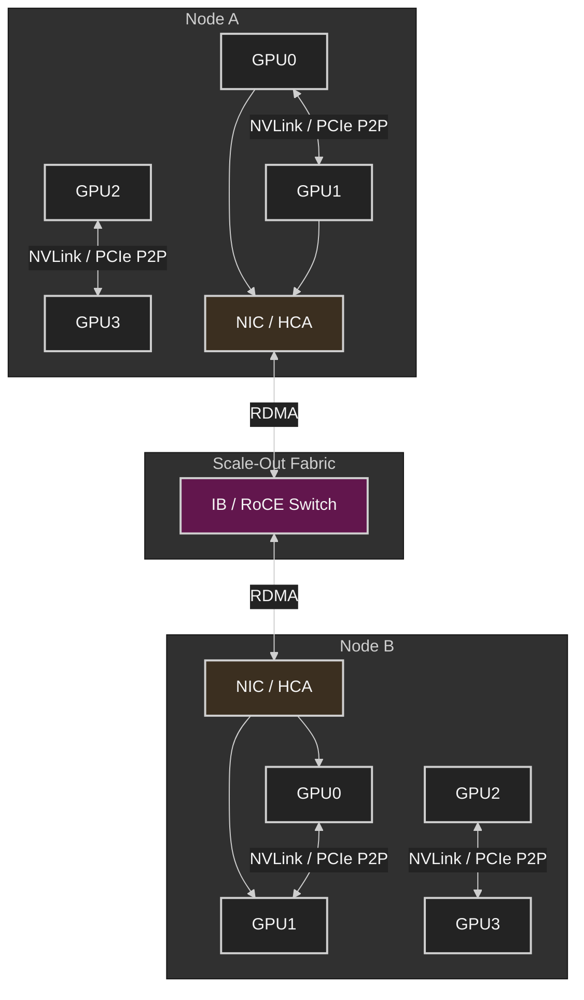

### DGX B200 / H100 관점

DGX 계열에서는 node 내부 통신은 NVLink/NVSwitch가 담당하고, node 간 통신은 InfiniBand/RoCE NIC가 담당한다.

성능 엔지니어는 다음을 구분해야 한다.

| 구분                 | 대표 기술                            | 병목                              |
| ------------------ | -------------------------------- | ------------------------------- |
| Intra-GPU          | HBM, L2, Tensor Core             | memory-bound kernel             |
| Intra-node GPU-GPU | NVLink, NVSwitch, PCIe P2P       | P2P disabled, topology mismatch |
| Inter-node GPU-GPU | GPUDirect RDMA, InfiniBand, RoCE | RDMA misconfig, congestion      |
| Inter-rack         | IB spine/leaf, routing, SHARP    | oversubscription, hotspot       |
| Storage path       | GDS, NVMe-oF, GPFS, NFS          | dataset/checkpoint I/O          |

### NVL72와 Direct NIC 관점

Chapter 4는 GB200/GB300 NVL72 같은 rack-scale NVLink domain을 중요한 예로 든다. NVL72는 최대 72 GPU를 하나의 NVLink Switch domain으로 묶어 node 간 InfiniBand/Ethernet보다 훨씬 낮은 latency와 높은 all-to-all bandwidth를 제공한다.

따라서 placement의 첫 번째 원칙은 가능한 한 job을 같은 NVLink/NVSwitch domain 안에 배치하는 것이다. 이 경계를 넘어가면 통신은 InfiniBand/RoCE fabric, routing, congestion, SHARP 사용 여부의 영향을 받는다.

또한 modern NCCL은 InfiniBand GPUDirect Async(IBGDA)와 direct NIC path를 활용해 GPU가 RDMA 진행을 더 직접적으로 구동할 수 있다. CPU가 data path에서 빠져도 setup, completion, polling thread는 여전히 CPU/NUMA 배치 영향을 받기 때문에 GPU-NIC locality와 CPU affinity를 같이 확인해야 한다.

## Multinode Communication Pitfalls

### Pitfall 1. Wrong Backend

PyTorch distributed에서 GPU communication은 `nccl` backend를 사용해야 한다.

```python
torch.distributed.init_process_group(backend="nccl")
```

`gloo`는 CPU 기반 communication에 적합하며 GPU collective에는 부적합하다. GPU tensor communication이 CPU path로 돌아가면 bandwidth가 급락하고 CPU utilization이 올라간다.

### Pitfall 2. TCP Fallback

RDMA가 깨졌는데도 job이 “동작은” 할 수 있다. 이게 더 위험하다.

성능만 나빠지고 명시적 에러가 없을 수 있다.

증상:

```text
GPU utilization drops during all-reduce
CPU utilization spikes
NCCL log shows NET/Socket
throughput is far below IB line rate
```

### Pitfall 3. Container Device Missing

Kubernetes Pod 안에서 `/dev/infiniband`가 보이지 않으면 RDMA path를 못 탄다.

```bash
ls -l /dev/infiniband
ibv_devinfo
```

Multus/SR-IOV/RDMA device plugin을 쓰는 환경에서는 device resource가 Pod에 정확히 할당되는지 확인해야 한다.

### Pitfall 4. NCCL Version Mismatch

PyTorch bundled NCCL과 system NCCL이 섞이면 hang, fallback, 성능 저하가 발생할 수 있다.

```python
import torch
print(torch.cuda.nccl.version())
```

### Pitfall 5. Ephemeral Port Exhaustion

NCCL bootstrap은 TCP port를 사용한다. 대규모 rank에서는 port range가 좁으면 handshake failure가 발생할 수 있다.

```bash
cat /proc/sys/net/ipv4/ip_local_port_range
```

### Pitfall 6. Memory Registration / Fragmentation

RDMA는 memory registration이 필요하다. GPU memory allocator fragmentation이나 UCX registration cache 문제는 장시간 job에서 성능 저하나 failure를 유발할 수 있다.

PyTorch에서는 `torch.cuda.memory_reserved()`와 `torch.cuda.memory_allocated()`를 함께 본다. live tensor는 줄었는데 reserved memory가 계속 커지면 caching allocator가 freed block을 잡고 있는 상태일 수 있다. `torch.cuda.empty_cache()`는 임시 회피책이지 장기 해법이 아니며, allocator 설정, buffer reuse, persistent registration을 먼저 봐야 한다.

## NCCL for Distributed Multi-GPU Communication

NCCL은 NVIDIA GPU collective communication library다.

주요 collective는 다음과 같다.

| Collective    | 의미                           | 사용 예                            |
| ------------- | ---------------------------- | ------------------------------- |
| AllReduce     | 모든 rank의 값을 합치고 결과를 모두에게 배포  | DDP gradient averaging          |
| ReduceScatter | reduce 후 shard로 나눠 분배        | FSDP, ZeRO                      |
| AllGather     | shard를 모아 full tensor 복원     | FSDP parameter gathering        |
| Broadcast     | 한 rank의 값을 모두에게 전파           | model initialization            |
| AllToAll      | 모든 rank가 서로 다른 shard 교환      | MoE expert parallelism          |
| Send/Recv     | point-to-point communication | pipeline parallelism, inference |

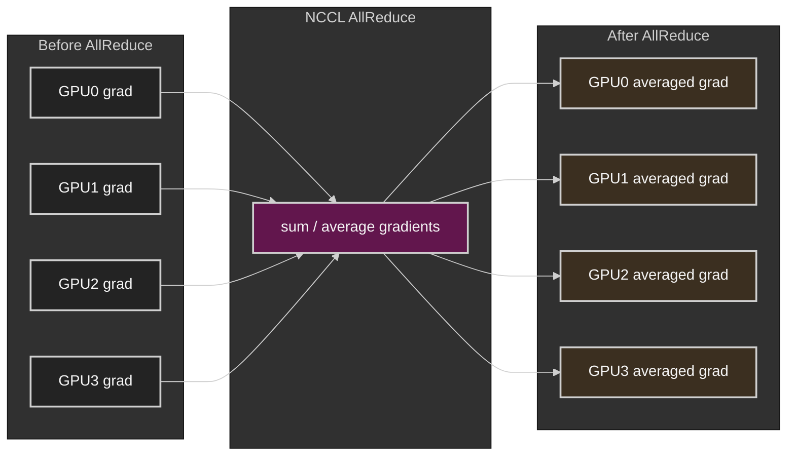

### Training에서 NCCL

DDP는 backward 중 gradient bucket이 준비되면 NCCL all-reduce를 실행한다.

### Inference에서 NCCL

Tensor parallelism이나 pipeline parallelism에서는 activation, logits, partial result를 GPU 간 교환한다. 다만 inference의 KV cache 이동이나 disaggregated serving에서는 NCCL보다 UCX/NIXL 같은 point-to-point data movement library가 더 적합할 수 있다.

## NCCL Topology Awareness

NCCL은 GPU 간 topology를 보고 어떤 경로를 사용할지 결정한다.

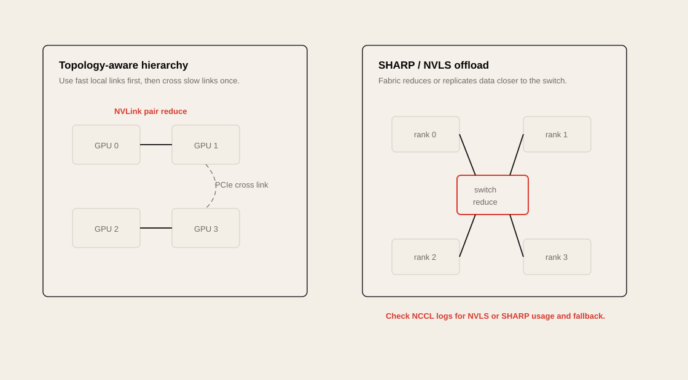

예를 들어 다음과 같은 경로 차이가 있다.

| Path              | 성능                         |
| ----------------- | -------------------------- |
| NVLink / NVSwitch | 가장 빠른 scale-up path        |
| PCIe P2P          | 가능하지만 NVLink보다 느림          |
| GPUDirect RDMA    | node 간 GPU-GPU direct path |
| Host CPU staging  | 느림                         |
| TCP socket        | 가장 느린 fallback path        |

```bash
nvidia-smi topo -m
```

이 명령으로 GPU-GPU, GPU-NIC, GPU-CPU topology를 확인할 수 있다.

### DGX에서 중요한 이유

DGX B200/H100 같은 시스템은 GPU, NIC, NVSwitch, CPU NUMA topology가 복잡하다. NCCL이 topology를 제대로 인식하지 못하면 최적의 path를 못 고른다.

필요하면 다음을 활용한다.

```bash
export NCCL_DEBUG=INFO
export NCCL_TOPO_DUMP_FILE=/tmp/nccl-topo.xml
```

복잡한 cloud/on-prem 환경에서는 `NCCL_TOPO_FILE`로 topology file을 명시적으로 제공할 수도 있다.

Chapter 4의 핵심은 NCCL이 단순 ring만 고르는 것이 아니라 hierarchy를 만든다는 점이다. 예를 들어 GPU 0-1, GPU 2-3은 각각 NVLink로 묶여 있지만 두 pair 사이가 PCIe라면, NCCL은 pair 내부 reduce를 먼저 하고 느린 PCIe link에는 일부 traffic만 보내는 식으로 pressure를 낮춘다.

## NCCL Communication Algorithms

NCCL은 message size, topology, rank 수에 따라 여러 algorithm을 선택한다.

대표적으로 ring과 tree가 있다.

### Ring AllReduce

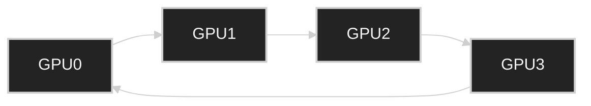

Ring은 bandwidth utilization이 좋다. 큰 tensor에 적합하다.

### Tree AllReduce

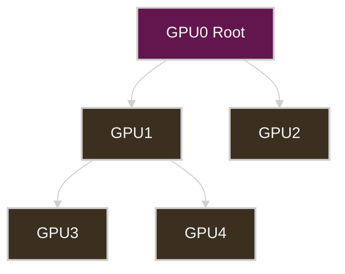

Tree는 latency가 낮고 작은 message에 유리할 수 있다.

### Algorithm 관점

| Algorithm       | 장점                      | 단점                     | 적합한 경우                      |
| --------------- | ----------------------- | ---------------------- | --------------------------- |
| Ring            | bandwidth 효율 좋음         | rank 많으면 latency 증가    | large tensor all-reduce     |
| Tree            | latency 낮음              | bandwidth 활용이 제한될 수 있음 | small/medium tensor         |
| CollNet / SHARP | in-network reduction 활용 | fabric support 필요      | IB/NVSwitch SHARP 환경        |
| P2P             | 유연한 point-to-point      | scheduling 복잡          | pipeline/inference transfer |

## DataParallel vs DistributedDataParallel

PyTorch에서 `DataParallel`과 `DistributedDataParallel`은 이름은 비슷하지만 성능 특성이 크게 다르다.

### DataParallel

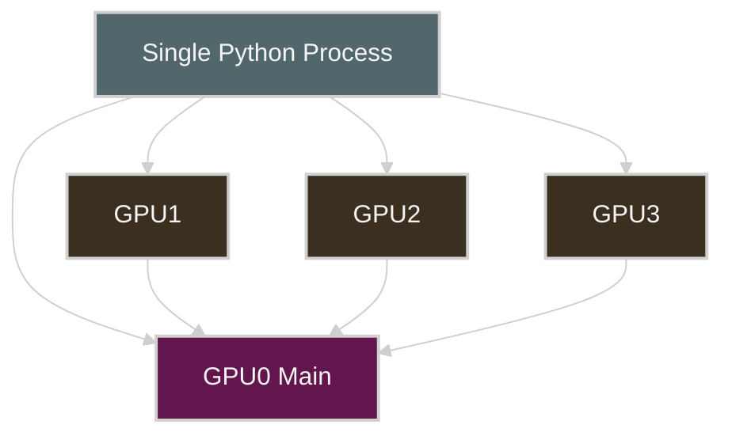

문제는 single process와 main GPU가 병목이 되기 쉽다는 것이다.

### DistributedDataParallel

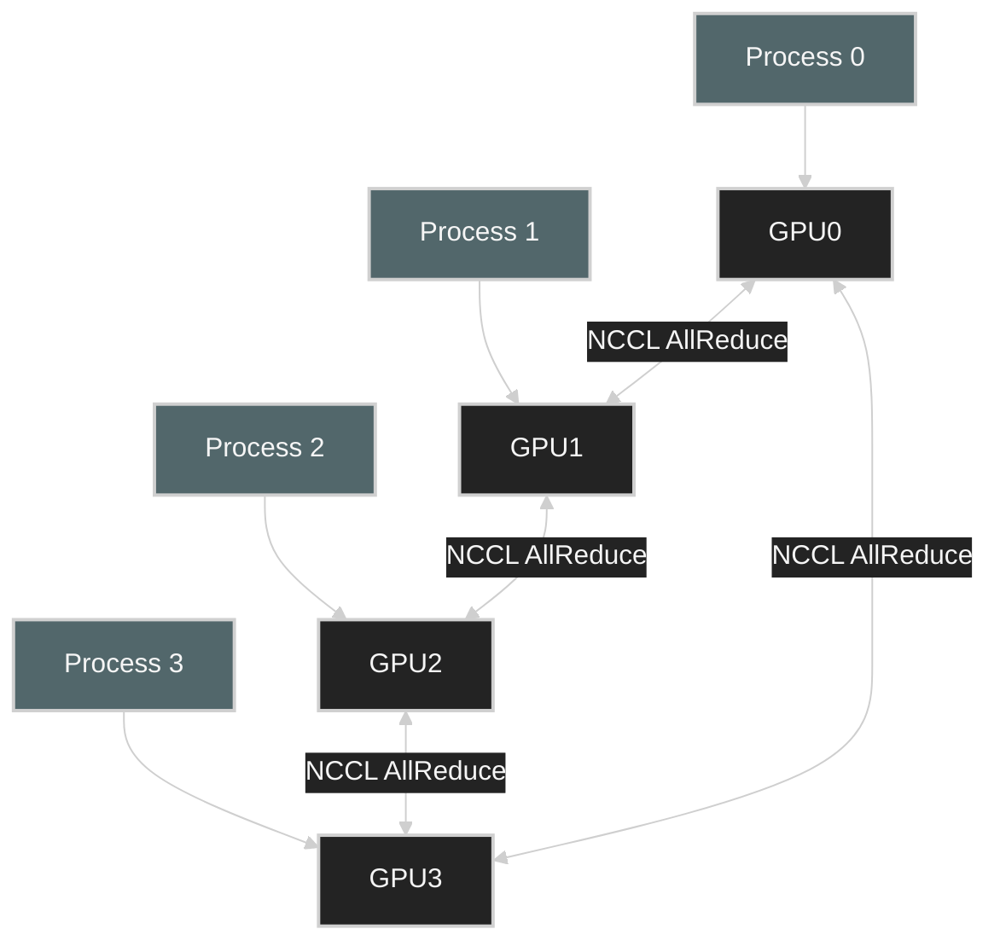

DDP는 one process per GPU 구조를 사용하고 NCCL all-reduce를 통해 gradient를 동기화한다.

### Practical Rule

> Multi-GPU training에서 성능을 신경 쓴다면 기본 선택은 DataParallel이 아니라 DistributedDataParallel이다.

| 항목            | DataParallel    | DistributedDataParallel |
| ------------- | --------------- | ----------------------- |
| Process model | single process  | one process per GPU     |
| Python GIL 영향 | 큼               | 작음                      |
| Gradient sync | main GPU 중심     | NCCL collective         |
| Scalability   | 낮음              | 높음                      |
| 추천            | quick prototype | production training     |

## NCCL Environment Variables and Gotchas

NCCL은 기본값이 꽤 잘 동작하지만, production에서는 어떤 값이 적용되는지 명시적으로 관리하는 편이 좋다.

### Common Variables

| Variable                      | 목적                     | 주의                        |
| ----------------------------- | ---------------------- | ------------------------- |
| `NCCL_DEBUG=INFO`             | NCCL path 확인           | production에서는 overhead 주의 |
| `NCCL_SOCKET_IFNAME=ib0`      | bootstrap interface 지정 | 실제 interface 이름 확인 필요     |
| `NCCL_IB_HCA`                 | 사용할 HCA 지정             | multi-HCA 환경에서 중요         |
| `NCCL_IB_DISABLE=0`           | IB 사용                  | debug 시에만 disable         |
| `NCCL_P2P_DISABLE=0`          | GPU P2P 사용             | 1이면 NVLink/P2P 비활성화       |
| `NCCL_SHM_DISABLE=0`          | shared memory 사용       | intranode 성능에 영향          |
| `NCCL_ASYNC_ERROR_HANDLING=1` | async error handling   | large cluster 안정성         |
| `NCCL_NSOCKS_PERTHREAD`       | socket parallelism     | 과도하면 CPU overhead         |
| `NCCL_SOCKET_NTHREADS`        | socket thread 수        | product limit 주의          |
| `NCCL_MIN_NCHANNELS`          | 최소 channel 수           | GPU resource 사용량 증가 가능    |
| `NCCL_MAX_NCHANNELS`          | 최대 channel 수           | NVSwitch 환경은 기본 auto-tune 우선 |
| `NCCL_TOPO_DUMP_FILE`         | detected topology dump | topology debugging        |
| `NCCL_TOPO_FILE`              | custom topology 제공     | 복잡한 환경에서만                 |
| `NCCL_MNNVL_ENABLE`           | multi-node NVLink 사용   | NVL72 등 지원 hardware 필요      |
| `NCCL_IGNORE_CPU_AFFINITY`    | NCCL thread affinity 보정 | NUMA binding과 같이 검증 필요     |
| `NCCL_SHARP_DISABLE`          | SHARP A/B test         | debug 목적                  |

### Bad Example

```bash
export NCCL_P2P_DISABLE=1
export NCCL_SHM_DISABLE=1
```

이 설정은 debug 목적이면 가능하지만 production에 남겨두면 intranode communication이 느려질 수 있다.

### Better Debug Baseline

```bash
export NCCL_DEBUG=INFO
export NCCL_DEBUG_SUBSYS=INIT,NET,GRAPH
export NCCL_SOCKET_IFNAME=ib0
export NCCL_IB_DISABLE=0
export NCCL_ASYNC_ERROR_HANDLING=1
```

### Practical Rule

> NCCL 환경 변수는 “성능 개선 주문”이 아니라 “통신 경로를 통제하고 검증하는 도구”다.
> 바꿨으면 반드시 benchmark와 log로 확인한다.

`NCCL_SOCKET_NTHREADS * NCCL_NSOCKS_PERTHREAD`의 product는 NVIDIA guidance상 64를 넘기지 않는 것이 원칙이다. multi-NIC 환경에서는 2 -> 4 -> 8처럼 단계적으로 올리고, throughput이 아니라 CPU overhead와 jitter까지 같이 봐야 한다.

CPU affinity도 중요하다. rank를 GPU/NIC와 같은 NUMA domain의 CPU core에 배치하되, inherited affinity mask 때문에 NCCL worker thread가 좁은 core set에 갇히는 경우에는 `NCCL_IGNORE_CPU_AFFINITY=1`을 검토한다.

## Profiling and Debugging NCCL

NCCL 문제는 다음 순서로 본다.

### 1. NCCL Log

```bash
NCCL_DEBUG=INFO torchrun --nproc_per_node=8 train.py
```

확인할 것:

```text
NET/IB
NET/Socket
Channel
Ring
Tree
P2P
NVLS
SHARP
```

`NET/Socket`이 보이면 TCP fallback 가능성을 의심한다.

### 2. nccl-tests

```bash
./build/all_reduce_perf -b 8 -e 4G -f 2 -g 8
```

확인할 metric:

| Metric                   | 의미                      |
| ------------------------ | ----------------------- |
| algbw                    | algorithm bandwidth     |
| busbw                    | effective bus bandwidth |
| time                     | collective latency      |
| out-of-place vs in-place | memory behavior 차이      |
| message size sweep       | small/large tensor 특성   |

### 3. Nsight Systems

Nsight Systems timeline에서 compute kernel과 NCCL kernel이 겹치는지 확인한다.

좋은 trace:

```text
Backward compute ========
NCCL all-reduce     ========
```

나쁜 trace:

```text
Backward compute ========
                     NCCL all-reduce ========
```

### 4. PyTorch Profiler

PyTorch Profiler에서 `nccl:all_reduce`, `cudaMemcpy`, CPU op, synchronization point를 확인한다.

### 5. NCCL Profiler Plugin

Chapter 4는 NCCL profiler plugin API도 언급한다. `NCCL_PROFILER_PLUGIN`을 통해 NCCL 내부 event timeline을 profiler에 연결할 수 있고, collective, point-to-point, proxy event를 계층적으로 추적할 수 있다.

실무에서는 PyTorch Kineto, CUPTI, NVTX 기반 trace와 함께 사용해 특정 rank, channel, collective가 어디에서 늦어지는지 확인한다.

### 6. Fabric Counter

InfiniBand 환경에서는 switch/HCA counter도 같이 봐야 한다.

```bash
ibstat
ibv_devinfo
perfquery
ethtool -S <interface>
```

DGX cluster에서는 DCGM, UFM, switch telemetry도 같이 보는 것이 좋다.

## SHARP and In-Network Aggregation

SHARP는 Scalable Hierarchical Aggregation and Reduction Protocol의 약자다.

핵심은 reduction을 GPU나 host가 아니라 switch에서 일부 처리하는 것이다.

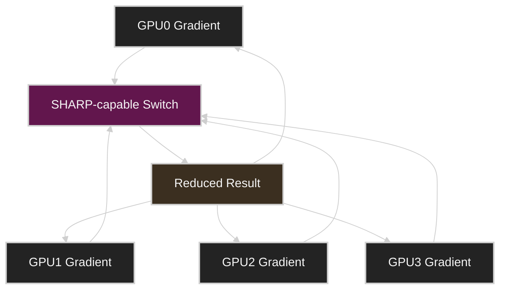

### 왜 중요한가?

All-reduce는 모든 GPU의 gradient를 합쳐야 한다. 이 작업을 switch silicon에서 offload하면 다음 이점이 있다.

| 효과                      | 의미                            |
| ----------------------- | ----------------------------- |
| network traffic 감소      | 중복 데이터 이동 감소                  |
| GPU overhead 감소         | GPU가 reduction 대신 compute에 집중 |
| latency 감소              | collective path 단축            |
| scale-out efficiency 증가 | rank 수 증가 시 효과 커짐             |

### 실무 조건

SHARP를 쓰려면 fabric, firmware, NCCL plugin, aggregation manager 등 조건이 맞아야 한다.

확인할 것:

```text
SHARP capable switch
SHARP Aggregation Manager
NCCL RDMA SHARP plugin
NCCL log
UFM / fabric telemetry
```

RoCE 기반 Ethernet 환경에서는 일반적으로 InfiniBand SHARP와 같은 방식의 in-network reduction 이점을 기대하기 어렵다. 이 차이가 ultrascale training fabric에서 InfiniBand가 강한 이유 중 하나다.

NVLink domain 안에서는 NVLink SHARP(NVLS)가 비슷한 역할을 한다. InfiniBand SHARP가 switch fabric에서 reduction을 offload한다면, NVLS는 NVSwitch fabric 안에서 collective를 가속한다. all-gather처럼 산술 reduction이 없는 collective에서는 multicast replication 효과가 핵심이고, all-reduce/reduce-scatter에서는 reduction offload 효과가 더 직접적이다.

SHARP는 작은 cluster보다 rank 수가 큰 환경에서 효과가 크다. 다만 switch buffer와 firmware/plugin 조건이 맞지 않으면 regular NCCL path로 fallback될 수 있으므로 `NCCL_DEBUG=INFO` log와 fabric telemetry로 실제 사용 여부를 확인해야 한다.

## Persistent NCCL User Buffers

RDMA나 NCCL은 buffer registration 비용이 중요하다.

매 iteration마다 buffer를 새로 allocate하고 register하면 latency가 증가하고 memory registration cache가 흔들릴 수 있다.

Persistent buffer의 아이디어는 다음과 같다.

```text
Initialize once:
  allocate communication buffers
  register memory
  create communicator

Training loop:
  reuse buffers
  launch collectives
  avoid repeated setup cost
```

NCCL user buffer registration은 `ncclCommRegister()`와 `ncclCommDeregister()`로 명시적으로 관리할 수 있다. 중요한 제약은 communication에 참여하는 한 rank가 registered buffer를 쓰면 모든 rank가 같은 방식으로 registered buffer를 써야 한다는 점이다. 일부 algorithm에서는 buffer head 기준 offset도 rank 간 일치해야 한다.

### 성능 의미

| 문제                          | 개선                        |
| --------------------------- | ------------------------- |
| 반복적인 memory registration    | persistent registration   |
| allocator fragmentation     | fixed buffer reuse        |
| communicator setup overhead | initialize once           |
| latency jitter              | stable communication path |

이 관점은 large-scale training뿐 아니라 inference serving에서도 중요하다. 특히 KV cache transfer buffer, prefill/decode transfer buffer는 재사용 가능한 형태로 관리하는 편이 좋다.

Persistent user buffer는 SHARP와 NVLS 같은 fast collective path에서도 중요하다. 내부 staging copy를 줄이고 channel pressure를 낮출 수 있지만, buffer lifecycle이 communicator lifecycle과 맞지 않으면 hang이나 undefined behavior로 이어질 수 있으므로 initialization/destruction을 모든 rank에서 lockstep으로 맞춘다.

## NIXL and Disaggregated Inference

NIXL은 NVIDIA Inference Xfer Library로, inference system에서 GPU memory, CPU memory, storage tier 사이의 data movement를 최적화하기 위한 library다.

NCCL이 collective communication에 강하다면, NIXL은 inference data movement, 특히 KV cache 이동에 초점이 있다.

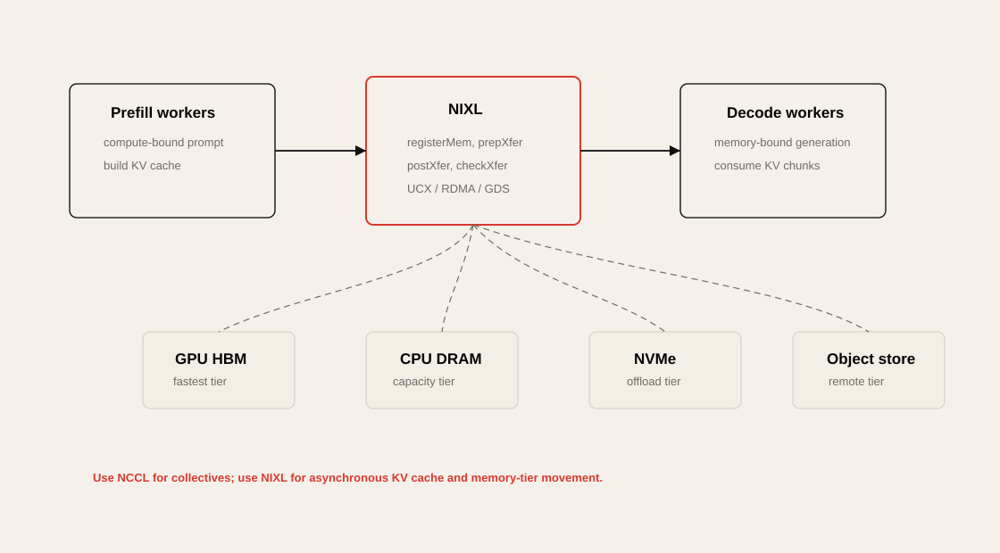

### Disaggregated Prefill and Decode

LLM inference는 크게 prefill과 decode로 나눌 수 있다.

| Stage       | 특징                            | 주요 병목                      |
| ----------- | ----------------------------- | -------------------------- |
| Prefill     | prompt 전체를 한 번에 처리            | compute-heavy, attention   |
| Decode      | token을 하나씩 생성                 | memory bandwidth, KV cache |
| KV Transfer | prefill 결과를 decode worker로 이동 | network latency, bandwidth |


Disaggregated 구조에서는 prefill worker와 decode worker를 분리한다. 이때 prefill에서 생성된 KV cache를 decode worker로 빠르게 이동해야 한다. 이 경로가 느리면 TTFT와 TPOT가 악화된다.

### NIXL이 중요한 이유

| 기능                              | 의미                            |
| ------------------------------- | ----------------------------- |
| async API                       | transfer 중 compute overlap 가능 |
| callback                        | transfer completion event 처리  |
| memory tier support             | GPU/CPU/storage 사이 이동         |
| KV cache offloading             | GPU memory pressure 완화        |
| disaggregated inference support | prefill/decode 분리 구조에 적합      |

NIXL의 개발자 관점 workflow는 다음처럼 정리할 수 있다.

```text
nixlAgent 생성
-> registerMem으로 GPU/CPU/storage buffer 등록
-> trim으로 transfer descriptor 생성
-> prepXfer로 nonblocking transfer 준비
-> postXfer로 전송 제출
-> checkXfer로 완료 polling
-> releaseReqH / deregisterMem으로 정리
```

이 API는 transfer를 제출하고 바로 control을 돌려주기 때문에 decode worker가 incoming KV cache chunk를 받는 동안 다음 computation을 진행할 수 있다. 내부 transport는 UCX, GPUDirect RDMA, IBGDA, GDS 같은 backend를 통해 GPU HBM, CPU DRAM, NVMe, object storage tier를 선택한다.

Chapter 4의 관점에서 NIXL은 NCCL을 대체하지 않는다. training collective는 NCCL이 맡고, NIXL은 Dynamo 같은 disaggregated inference engine에서 KV cache, model shard, inference state 같은 large blob을 point-to-point로 옮기는 역할을 맡는다.

## NCCL vs NIXL

NCCL과 NIXL은 경쟁 관계라기보다 목적이 다르다.

| 항목                    | NCCL                                     | NIXL                                 |
| --------------------- | ---------------------------------------- | ------------------------------------ |
| 주 용도                  | collective communication                 | inference data movement              |
| 대표 workload           | DDP, FSDP, TP training                   | disaggregated inference              |
| 주요 data               | gradients, parameters, activations       | KV cache, inference state            |
| communication pattern | all-reduce, all-gather, reduce-scatter   | point-to-point, memory tier transfer |
| latency target        | collective efficiency                    | TTFT/TPOT, tail latency              |
| framework context     | PyTorch distributed, Megatron, DeepSpeed | NVIDIA Dynamo, disaggregated serving |
| 병목                    | bandwidth, topology, rank sync           | KV movement, offload, routing        |

### Practical Rule

> Training collective는 NCCL로 본다.
> Disaggregated inference의 KV cache movement는 NIXL/UCX/RDMA 관점으로 본다.

## Distributed Networking Bottleneck Lens

| Bottleneck        | Symptom                | Metric                          | Tool                             | Fix                                 |
| ----------------- | ---------------------- | ------------------------------- | -------------------------------- | ----------------------------------- |
| No overlap        | backward 후 NCCL이 길게 노출 | step time, NCCL time            | Nsight Systems, PyTorch Profiler | DDP bucket tuning, async all-reduce |
| Wrong backend     | CPU 높고 GPU idle        | CPU utilization, low busbw      | PyTorch profiler, NCCL log       | `backend="nccl"`                    |
| TCP fallback      | IB 있는데 bandwidth 낮음    | algbw/busbw 낮음                  | `NCCL_DEBUG=INFO`, nccl-tests    | `/dev/infiniband`, HCA, IFNAME 확인   |
| P2P disabled      | node 내부 통신 느림          | NVLink throughput 낮음            | NCCL log, `nvidia-smi topo -m`   | `NCCL_P2P_DISABLE` 제거               |
| SHM disabled      | intranode latency 증가   | small msg latency               | NCCL log                         | `NCCL_SHM_DISABLE` 제거               |
| Topology mismatch | 특정 rank만 느림            | rank별 NCCL time                 | NCCL topo dump                   | topology file, placement 조정         |
| NIC underuse      | 여러 NIC 중 하나만 사용        | port counter imbalance          | UFM, ethtool, perfquery          | multi-rail, HCA config              |
| Congestion        | p95/p99 step time 흔들림  | retransmit, ECN, port xmit wait | switch telemetry                 | routing, QoS, fabric tuning         |
| NCCL hang         | job 멈춤                 | timeout, watchdog               | NCCL log, PyTorch elastic        | async error handling                |
| KV transfer slow  | TTFT/TPOT 악화           | KV transfer latency             | serving trace, NIXL metrics      | prefill/decode placement, RDMA path |

## Operational Validation Checklist

### 1. Basic Fabric Validation

```bash
ibstat
ibv_devinfo
nvidia-smi topo -m
```

* HCA가 active 상태인가?
* GPU와 NIC의 locality가 적절한가?
* DGX 간 IB link speed가 기대값과 맞는가?
* MTU/GID/subnet 설정이 일관적인가?

### 2. Container / Kubernetes Validation

```bash
kubectl exec -it <pod> -- ls -l /dev/infiniband
kubectl exec -it <pod> -- ibv_devinfo
kubectl describe pod <pod>
```

* Pod에 RDMA device가 보이는가?
* SR-IOV / RDMA device plugin resource가 할당되었는가?
* Multus secondary interface가 기대한 network에 붙었는가?
* CNI가 VF IP assignment를 정상 처리했는가?

### 3. NCCL Baseline

```bash
NCCL_DEBUG=INFO ./build/all_reduce_perf -b 8 -e 4G -f 2 -g 8
```

* `NET/IB` 경로를 타는가?
* `NET/Socket` fallback은 없는가?
* algbw/busbw가 hardware baseline과 맞는가?
* message size별 성능 curve가 정상인가?

### 4. Training Trace

```bash
torchrun --nproc_per_node=8 train.py
```

확인할 것:

* compute와 NCCL이 overlap 되는가?
* 마지막 bucket tail이 과도하게 긴가?
* `.item()` 또는 `torch.cuda.synchronize()`가 step마다 있는가?
* DataLoader 또는 storage I/O가 NCCL 병목처럼 보이게 만들고 있지는 않은가?

### 5. Inference Trace

* TTFT가 prefill compute 때문인가?
* TPOT가 decode memory bandwidth 때문인가?
* KV cache transfer가 tail latency를 만들고 있는가?
* prefill/decode worker placement가 topology-aware한가?
* KV cache offload path가 CPU/storage로 과도하게 빠지는가?

## Labs

Chapter 4 실습은 `../labs/ch04/` 아래에 있다.

| Lab | 핵심 주제 | 실행 |
| --- | --- | --- |
| `communication-overlap/` | backward compute와 bucket communication overlap | `cd ../labs/ch04/communication-overlap && python compare.py` |
| `gradient-bucketing/` | gradient fusion, bucket 수, FP16 compression trade-off | `cd ../labs/ch04/gradient-bucketing && python compare.py` |
| `nixl-tier-handoff/` | disaggregated inference KV block handoff, CPU staging vs packed transfer | `cd ../labs/ch04/nixl-tier-handoff && python compare.py` |
| `topology-aware-bandwidth/` | NVLink/PCIe/NIC locality와 rank placement 비용 | `cd ../labs/ch04/topology-aware-bandwidth && python compare.py` |
| `dataparallel-vs-ddp/` | DataParallel anti-pattern과 DDP 구조 차이 | `cd ../labs/ch04/dataparallel-vs-ddp && python compare.py` |
| `communicator-lifecycle/` | communicator 재생성 비용과 재사용 | `cd ../labs/ch04/communicator-lifecycle && python compare.py` |
| `pipeline-tensor-parallel/` | pipeline bubble, 1F1B, tensor-parallel sync | `cd ../labs/ch04/pipeline-tensor-parallel && python compare.py` |
| `symmetric-memory-nvshmem/` | symmetric memory, persistent buffer, GPU-driven handoff 개념 | `cd ../labs/ch04/symmetric-memory-nvshmem && python compare.py` |
| `gpu-communication-reference/` | 실제 CUDA/NCCL DDP overlap과 all-reduce bucket sweep | `cd ../labs/ch04/gpu-communication-reference && torchrun --nproc_per_node=2 ddp_overlap.py` |

CPU-portable 실습은 multi-GPU/NCCL/NIXL 개념을 작은 병목 모델로 축약한 것이다. GPU가 있는 환경에서는 `gpu-communication-reference/`의 `torchrun` 예제로 실제 NCCL 경로를 확인하고, NCCL log, Nsight Systems, fabric telemetry로 이어서 검증해야 한다.

## Practical Tips and Notes

### 1. NCCL은 “동작 여부”가 아니라 “어떤 경로로 동작하는지”를 봐야 한다

NCCL job이 성공했다고 해서 좋은 성능이라는 뜻은 아니다. TCP fallback으로도 job은 돌 수 있다.

항상 다음을 확인한다.

```bash
export NCCL_DEBUG=INFO
```

그리고 log에서 `NET/IB`, `NET/Socket`, `P2P`, `NVLink`, `SHARP` 관련 출력을 확인한다.


### 2. Kubernetes에서는 `/dev/infiniband`가 첫 번째 체크포인트다

Host에서는 RDMA가 되는데 Pod에서는 안 되는 경우가 흔하다.

```bash
kubectl exec -it <pod> -- ls -l /dev/infiniband
kubectl exec -it <pod> -- ibv_devinfo
```

이게 안 보이면 NCCL/RDMA tuning 이전에 device exposure 문제부터 봐야 한다.


### 3. `NCCL_P2P_DISABLE=1`은 남겨두면 위험하다

Debugging 중 P2P를 끄는 경우가 있다. 하지만 이 값이 production env에 남아 있으면 node 내부 NVLink/P2P 경로가 깨진다.

```bash
unset NCCL_P2P_DISABLE
# or
export NCCL_P2P_DISABLE=0
```


### 4. DDP bucket tuning은 Nsight trace를 보고 해야 한다

`bucket_cap_mb`는 무조건 키우거나 줄이는 값이 아니다.

```python
DistributedDataParallel(
    model,
    bucket_cap_mb=25,
)
```

작게 하면 overlap은 빨리 시작하지만 overhead가 늘 수 있고, 크게 하면 bandwidth 효율은 좋아지지만 tail이 길어질 수 있다.


### 5. NCCL communicator는 한 번 만들고 재사용한다

`init_process_group`를 training loop 안에서 반복 호출하면 안 된다.

좋은 패턴:

```python
dist.init_process_group("nccl")

for step in range(num_steps):
    train_step()

dist.destroy_process_group()
```

나쁜 패턴:

```python
for step in range(num_steps):
    dist.init_process_group("nccl")
    train_step()
    dist.destroy_process_group()
```


### 6. NCCL tuning은 반드시 version과 함께 기록한다

NCCL default는 version에 따라 바뀔 수 있다.

따라서 benchmark 결과에는 다음을 같이 기록한다.

```text
GPU model
driver version
CUDA version
NCCL version
PyTorch version
container image
NCCL env vars
node count
GPU count
network topology
```


### 7. DGX B200 클러스터에서는 400G/200G fabric 역할을 분리해서 봐야 한다

예를 들어:

| Fabric        | 용도                                  |
| ------------- | ----------------------------------- |
| 400G IB       | DGX 간 training communication        |
| 200G IB / BF3 | storage, GPFS, control/offload path |
| 10G Ethernet  | management, general access          |

NCCL이 의도한 400G fabric을 타는지 확인해야 한다. 잘못된 interface를 잡으면 성능이 크게 떨어진다.


### 8. Inference에서는 NCCL만 보면 부족하다

LLM serving에서는 collective보다 KV cache movement가 더 중요한 병목이 될 수 있다.

특히 disaggregated prefill/decode 구조에서는 다음을 봐야 한다.

```text
TTFT
TPOT
KV cache transfer latency
decode worker queueing
prefill/decode placement
GPU memory pressure
```

## Chapter Summary

Chapter 4의 핵심은 distributed AI workload에서 communication을 최대한 줄이고, 피할 수 없는 communication은 compute 뒤에 숨기며, 남는 communication은 가장 빠른 fabric path로 보내는 것이다.

정리하면 다음과 같다.

1. Distributed training에서는 all-reduce, reduce-scatter, all-gather가 핵심 통신 패턴이다.
2. GPU가 계산을 끝내고 NCCL을 기다리면 exposed communication이 된다.
3. DDP는 gradient bucket을 이용해 backward compute와 all-reduce를 overlap한다.
4. CUDA streams는 compute와 communication overlap의 기반이다.
5. `.item()`, `print()`, `torch.cuda.synchronize()`는 암묵적 synchronization으로 overlap을 깨뜨릴 수 있다.
6. RDMA와 GPUDirect RDMA는 CPU staging 없이 GPU memory 간 직접 통신을 가능하게 한다.
7. Kubernetes에서는 `/dev/infiniband`, RDMA device plugin, Multus/SR-IOV 설정이 중요하다.
8. NCCL은 collective communication의 핵심 library이며, backend는 GPU training에서는 `nccl`을 사용해야 한다.
9. NCCL은 topology-aware하게 NVLink, NVSwitch, PCIe, RDMA path를 선택한다.
10. NCCL 환경 변수는 성능을 마법처럼 올리는 값이 아니라 통신 경로를 통제하고 검증하는 도구다.
11. SHARP는 reduction을 switch에서 처리해 collective overhead를 줄인다.
12. NIXL은 disaggregated inference에서 KV cache transfer와 memory-tier movement에 중요하다.
13. Training은 NCCL collective lens로, inference는 KV cache movement lens로 봐야 한다.

## Key Terms

| Term                              | Meaning                                                 |
| --------------------------------- | ------------------------------------------------------- |
| Communication/Computation Overlap | GPU compute와 network communication을 동시에 진행하는 최적화        |
| Exposed Communication             | compute 뒤에 숨겨지지 않고 step time에 드러나는 통신 시간                |
| CUDA Stream                       | GPU 작업 queue                                            |
| NCCL                              | NVIDIA Collective Communications Library                |
| Collective                        | 여러 GPU가 함께 수행하는 communication operation                 |
| AllReduce                         | 모든 rank의 값을 reduce하고 결과를 모두에게 배포                        |
| ReduceScatter                     | reduce 후 결과를 shard로 나눠 분배                               |
| AllGather                         | shard를 모아 full tensor를 복원                               |
| Broadcast                         | 한 rank의 값을 모든 rank에 전파                                  |
| RDMA                              | CPU/kernel stack을 우회하는 remote memory access             |
| GPUDirect RDMA                    | NIC가 GPU memory에 직접 RDMA하는 NVIDIA 기술                    |
| SHARP                             | switch에서 reduction을 offload하는 in-network aggregation 기술 |
| NIXL                              | NVIDIA Inference Xfer Library                           |
| KV Cache                          | LLM decode에서 attention key/value를 저장하는 cache            |
| Prefill                           | prompt 전체를 처리해 initial KV cache를 생성하는 단계                |
| Decode                            | token을 하나씩 생성하는 단계                                      |
| TTFT                              | Time To First Token                                     |
| TPOT                              | Time Per Output Token                                   |
| Topology Awareness                | GPU/NIC/switch 연결 구조를 고려한 communication path 선택         |
| TCP Fallback                      | RDMA 대신 느린 TCP socket path로 떨어지는 현상                     |

## Questions

### Q1. Distributed training에서 GPU utilization이 낮을 때 네트워크 병목인지 어떻게 확인할 수 있는가?

### Q2. DDP가 DataParallel보다 성능상 유리한 이유는 무엇인가?

### Q3. Communication/computation overlap이 잘 되는지 어떤 profiler로 확인할 수 있는가?

### Q4. NCCL이 RDMA 대신 TCP fallback을 타는지 어떻게 확인할 수 있는가?

### Q5. `NCCL_P2P_DISABLE=1`이 production에 남아 있으면 왜 위험한가?

### Q6. SHARP는 어떤 병목을 줄이는가?

### Q7. Training에서는 NCCL이 중요하고 disaggregated inference에서는 NIXL이 중요한 이유는 무엇인가?

### Q8. Kubernetes 기반 GPU cluster에서 RDMA 통신이 안 될 때 가장 먼저 볼 것은 무엇인가?

## Answers

### A1. Distributed training에서 GPU utilization이 낮을 때 네트워크 병목인지 어떻게 확인할 수 있는가?

Nsight Systems나 PyTorch Profiler로 step timeline을 본다. backward compute가 끝난 뒤 NCCL all-reduce가 길게 노출되어 있으면 communication이 step time에 직접 영향을 주는 것이다.

추가로 `nccl-tests`로 all-reduce baseline bandwidth를 측정하고, `NCCL_DEBUG=INFO`로 실제 통신 경로가 IB/RDMA인지 TCP socket인지 확인한다.

### A2. DDP가 DataParallel보다 성능상 유리한 이유는 무엇인가?

DataParallel은 single Python process와 main GPU가 병목이 되기 쉽다. Python GIL, scatter/gather overhead, main GPU 중심 aggregation이 문제가 된다.

DDP는 one process per GPU 구조를 사용하고 NCCL all-reduce로 gradient를 직접 동기화한다. 또한 gradient bucket이 준비되는 즉시 asynchronous all-reduce를 시작해 backward computation과 communication을 overlap할 수 있다.

### A3. Communication/computation overlap이 잘 되는지 어떤 profiler로 확인할 수 있는가?

대표적으로 Nsight Systems와 PyTorch Profiler를 사용한다.

Nsight Systems timeline에서 backward compute kernel과 NCCL kernel이 시간상 겹쳐 있는지 확인한다. PyTorch Profiler에서는 `nccl:all_reduce`, CUDA kernel, CPU synchronization point를 함께 본다.

좋은 trace는 compute와 NCCL이 겹쳐 있고, 나쁜 trace는 compute가 끝난 뒤 NCCL이 길게 이어진다.

### A4. NCCL이 RDMA 대신 TCP fallback을 타는지 어떻게 확인할 수 있는가?

`NCCL_DEBUG=INFO`를 켜고 log를 본다.

```bash
export NCCL_DEBUG=INFO
```

`NET/IB`가 보이면 InfiniBand path를 타는 것이고, `NET/Socket`이 보이면 TCP socket path를 의심해야 한다.

Pod 환경에서는 `/dev/infiniband`가 보이는지도 확인한다.

```bash
ls -l /dev/infiniband
ibv_devinfo
```

### A5. `NCCL_P2P_DISABLE=1`이 production에 남아 있으면 왜 위험한가?

이 값은 GPU P2P communication을 비활성화한다. NVLink나 PCIe P2P로 직접 통신할 수 있는 상황에서도 host-mediated path로 우회할 수 있다.

그 결과 node 내부 GPU 간 통신 latency가 증가하고 bandwidth가 감소한다. Debugging 목적이 끝나면 반드시 제거하거나 `0`으로 되돌려야 한다.

### A6. SHARP는 어떤 병목을 줄이는가?

SHARP는 all-reduce 같은 collective operation의 reduction 일부를 switch에서 처리한다. 이를 통해 GPU와 host가 처리해야 할 reduction 부담을 줄이고, network traffic과 latency를 줄일 수 있다.

특히 rank 수가 커질수록 collective overhead가 커지기 때문에, SHARP는 communication-bound training에서 scale-out efficiency를 높이는 데 중요하다.

### A7. Training에서는 NCCL이 중요하고 disaggregated inference에서는 NIXL이 중요한 이유는 무엇인가?

Training에서는 gradient synchronization이 핵심이고, 이는 all-reduce, reduce-scatter, all-gather 같은 collective communication으로 표현된다. NCCL은 이런 collective에 최적화되어 있다.

반면 disaggregated inference에서는 prefill worker가 만든 KV cache를 decode worker로 빠르게 이동해야 한다. 이는 collective보다는 point-to-point data movement와 memory tier transfer 문제에 가깝다. NIXL은 이런 inference data movement와 KV cache transfer에 초점을 둔다.

### A8. Kubernetes 기반 GPU cluster에서 RDMA 통신이 안 될 때 가장 먼저 볼 것은 무엇인가?

가장 먼저 Pod 안에서 RDMA device가 보이는지 확인한다.

```bash
kubectl exec -it <pod> -- ls -l /dev/infiniband
kubectl exec -it <pod> -- ibv_devinfo
```

그다음 Multus, SR-IOV CNI, RDMA device plugin, resource request, VF allocation, IPAM 설정을 확인한다.

NCCL tuning은 그다음이다. Pod가 RDMA device를 못 보면 NCCL은 애초에 GPUDirect RDMA path를 사용할 수 없다.

## References

* NVIDIA, [NCCL User Guide](https://docs.nvidia.com/deeplearning/nccl/user-guide/index.html)
* NVIDIA, [NCCL Environment Variables](https://docs.nvidia.com/deeplearning/nccl/user-guide/docs/env.html)
* NVIDIA, [Magnum IO](https://www.nvidia.com/en-us/data-center/magnum-io/)
* NVIDIA, [GPUDirect](https://developer.nvidia.com/gpudirect)
* NVIDIA, [GPUDirect RDMA Documentation](https://docs.nvidia.com/cuda/gpudirect-rdma/index.html)
* NVIDIA, [Scalable Hierarchical Aggregation and Reduction Protocol (SHARP)](https://docs.nvidia.com/networking/display/sharpv3102)
* NVIDIA, [Using NVIDIA SHARP with NVIDIA NCCL](https://docs.nvidia.com/networking/display/sharpv3103/Using-NVIDIA-SHARP-with-NVIDIA-NCCL)
* NVIDIA, [NCCL-RDMA-SHARP Plugins](https://docs.nvidia.com/networking/display/hpcxv215/nccl-rdma-sharp%2Bplugins)
* PyTorch, [DistributedDataParallel API Reference](https://docs.pytorch.org/docs/stable/generated/torch.nn.parallel.DistributedDataParallel.html)
* PyTorch, [Distributed Data Parallel Notes](https://docs.pytorch.org/docs/stable/notes/ddp.html)
* NVIDIA, [Nsight Systems Documentation](https://docs.nvidia.com/nsight-systems/index.html)
* ai-dynamo, [NVIDIA Inference Xfer Library (NIXL)](https://github.com/ai-dynamo/nixl)
* ai-dynamo, [NIXL Overview](https://github.com/ai-dynamo/nixl/blob/main/docs/nixl.md)
* NVIDIA, [Dynamo Documentation](https://docs.nvidia.com/dynamo/latest/)
* NVIDIA Technical Blog, [Introducing NVIDIA Dynamo](https://developer.nvidia.com/blog/introducing-nvidia-dynamo-a-low-latency-distributed-inference-framework-for-scaling-reasoning-ai-models/)
