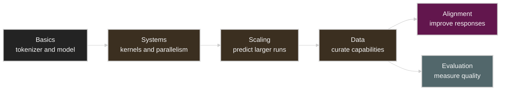

# Stanford CS336: Language Modeling from Scratch

[CS336](https://cs336.stanford.edu/)을 따라 tokenizer, Transformer, systems optimization, scaling laws, data pipeline, evaluation, alignment를 처음부터 구현하며 정리하는 한국어 lecture notes다.

## Lectures

| Lecture | Topic | Notes | Source |
| ------- | ----- | ----- | ------ |
| 01 | Overview and Tokenization | [lec-01/README.md](lec-01/README.md) | [YouTube](https://www.youtube.com/watch?v=JuoVZkPBiKk) |

## Learning Scope

## Repository Notes

* 강의 내용은 transcript와 공식 course material을 기준으로 재구성한다.
* 강의에서 다룬 내용과 별도의 실무 판단은 `Practical Tips and Notes` 절에서 구분한다.
* Technical term은 검색과 원문 대조가 쉽도록 필요한 경우 English를 유지한다.
