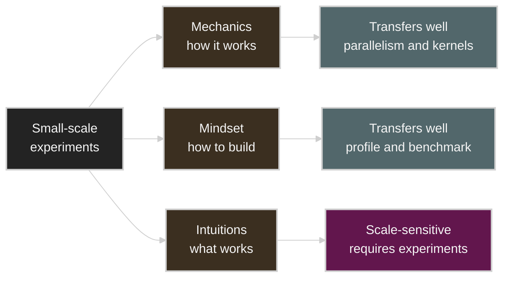
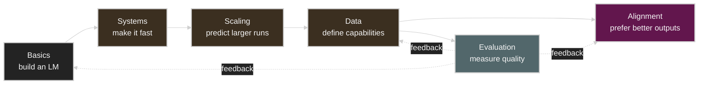
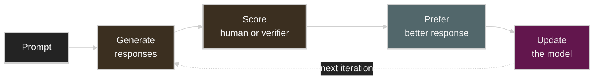
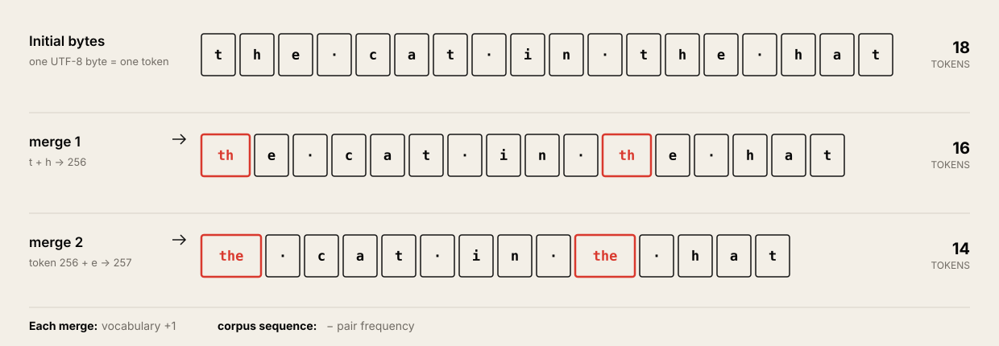

# Lecture 1: Overview and Tokenization

Source: [Stanford CS336 Lecture 1 — Overview, Tokenization](https://www.youtube.com/watch?v=JuoVZkPBiKk)

Course material: [Executable lecture](https://cs336.stanford.edu/lectures/?trace=lecture_01)

이 노트는 1시간 19분 22초 분량의 English caption과 공식 executable trace의 `lecture_01.py`를 함께 대조해 작성했다. 자막은 강사의 구두 설명과 맥락을, executable trace는 수식·코드·assignment 항목을 확인하는 기준으로 사용했다.

## Table of Contents

* [Goal](#goal)
* [Lecture Overview](#lecture-overview)
* [Source Verification](#source-verification)
* [Why Build Language Models From Scratch](#why-build-language-models-from-scratch)
* [What Transfers Across Scale](#what-transfers-across-scale)
* [Efficiency as the Central Frame](#efficiency-as-the-central-frame)
* [Language Model Evolution and the Open Ecosystem](#language-model-evolution-and-the-open-ecosystem)
* [Course Structure](#course-structure)
* [Part I: Basics](#part-i-basics)
* [Part II: Systems](#part-ii-systems)
* [Part III: Scaling Laws](#part-iii-scaling-laws)
* [Part IV: Evaluation and Data](#part-iv-evaluation-and-data)
* [Part V: Alignment](#part-v-alignment)
* [A Unified Efficiency Lens](#a-unified-efficiency-lens)
* [Tokenization as an Interface](#tokenization-as-an-interface)
* [Tokenizer Design Trade-Offs](#tokenizer-design-trade-offs)
* [Byte Pair Encoding](#byte-pair-encoding)
* [BPE Encoding and Decoding](#bpe-encoding-and-decoding)
* [Implementation Considerations](#implementation-considerations)
* [Beyond Tokenization](#beyond-tokenization)
* [Practical Tips and Notes](#practical-tips-and-notes)
* [Lecture Summary](#lecture-summary)
* [Key Terms](#key-terms)
* [Questions](#questions)
* [Answers](#answers)

---

## Goal

이번 강의의 목표는 language model을 단순히 호출하거나 fine-tuning하는 사용자가 아니라, 제한된 data와 compute 안에서 전체 시스템을 직접 설계할 수 있는 builder의 관점을 갖는 것이다.

핵심 메시지는 다음과 같다.

> 좋은 language model을 만드는 문제는 architecture 하나를 고르는 문제가 아니다. Tokenization, model, optimization, hardware, scaling, data, evaluation, alignment를 하나의 효율성 문제로 연결해야 한다.

Lecture 1은 두 가지 역할을 한다.

1. CS336 전체가 다룰 language modeling stack과 다섯 assignment의 관계를 설명한다.
2. Raw Unicode text와 model이 처리하는 token ID 사이의 interface를 정의하고, byte-level BPE를 처음부터 구현하는 원리를 설명한다.

---

## Lecture Overview

강의는 약 1시간 19분이며 다음 순서로 진행된다.

| Time | Topic | Main question |
| ---- | ----- | ------------- |
| `00:00` | Course philosophy | 이미 강력한 API와 coding agent가 있는데 왜 from scratch로 만드는가? |
| `05:54` | Small scale and frontier scale | 작은 model에서 얻은 지식 중 무엇이 대규모로 전이되는가? |
| `09:15` | Efficiency and scaling | 규모가 커질수록 algorithmic efficiency가 왜 더 중요해지는가? |
| `11:36` | Language model history | Neural LM, Transformer, scaling, open model 생태계는 어떻게 이어졌는가? |
| `19:29` | Executable lecture and logistics | 강의와 assignment는 어떤 방식으로 진행되는가? |
| `27:17` | Five-part course map | Basics, systems, scaling, data, alignment는 어떻게 연결되는가? |
| `36:02` | Systems | FLOPs, memory, kernels, distributed training, inference를 어떻게 계산하는가? |
| `45:12` | Scaling laws | 비싼 단 한 번의 run을 작은 실험으로 어떻게 예측하는가? |
| `53:29` | Evaluation and data | 무엇을 측정하고 어떤 data로 model의 능력을 만드는가? |
| `1:00:20` | Alignment | 생성 결과를 평가하는 약한 supervision으로 어떻게 model을 개선하는가? |
| `1:05:07` | Tokenization | Unicode string을 어떻게 효율적인 token sequence로 바꾸는가? |

Lecture 1의 범위는 넓지만 전체를 관통하는 질문은 하나다.

```text
주어진 data와 compute budget에서
평가 기준상 가장 좋은 model을 어떻게 만들 것인가?
```

---

## Source Verification

영상 자막과 executable lecture는 같은 강의 흐름을 가지지만 역할이 다르다.

| Source | Checked content | Used for |
| ------ | --------------- | -------- |
| YouTube caption | `00:04`부터 `1:19:15`까지의 강의 발화 | 설명의 논리, 강조점, 강사의 caveat |
| Executable trace | `lecture_01.py` 763 lines, 617 execution steps | 함수 구조, code example, 수치, assignment 요구사항 |

공식 trace의 top-level 실행 순서는 다음과 같다.

```text
welcome
  -> why_this_course_exists
  -> current_lm_landscape
  -> what_is_this_program
  -> course_logistics
  -> course_syllabus
  -> tokenization
  -> Next time: resource accounting
```

Trace에서 확인한 concrete example은 다음과 같다.

* Test string: `"Hello, 🌍! 你好!"`
* Tokenizer example: `tiktoken.get_encoding("o200k_base")`
* Character conversion: `ord("a") == 97`, `ord("🌍") == 127757`
* UTF-8 conversion: `"a"`는 1 byte, `"🌍"`는 4 bytes
* Word tokenizer example: `"I'll say supercalifragilisticexpialidocious!"`
* BPE training corpus: `"the cat in the hat"`
* BPE inference text: `"the quick brown fox"`
* Next lecture: resource accounting

---

## Why Build Language Models From Scratch

현대 AI workflow는 점점 높은 abstraction으로 이동했다.

```text
직접 model 구현과 학습
  -> pretrained model fine-tuning
  -> prompting
  -> 대화형 assistant
  -> agent에 장기 작업 위임
```

높은 abstraction은 생산성을 높이지만, abstraction은 완전하지 않다. Model이 원하는 행동을 하지 못했을 때 내부 stack을 이해하지 못하면 선택할 수 있는 해결책도 제한된다. Prompt를 바꾸는 것만으로는 tokenizer, data mixture, architecture, optimizer, kernel, parallelism 같은 design space를 탐색할 수 없다.

CS336의 `from scratch`는 모든 dependency를 재구현한다는 뜻이 아니다. 한 quarter 안에서 학습 가치가 높은 경계를 선택해 tokenizer, Transformer, optimizer, training loop, GPU kernel, distributed training component를 직접 만든다는 뜻이다.

강의가 강조하는 학습 방식은 다음과 같다.

* 설명을 듣는 것보다 실제 component를 구현한다.
* Unit test로 correctness를 먼저 확인한다.
* 작은 환경에서 profile과 benchmark를 반복한다.
* 제한된 compute에서 model quality를 최대화한다.
* 내부가 보이지 않는 abstraction이 실패했을 때 아래 layer로 내려간다.

이는 research question의 범위를 넓힌다. 이미 정해진 API의 입력과 출력만 바꾸는 것이 아니라, 전체 stack에서 어떤 가정을 바꿀지 선택할 수 있기 때문이다.

---

## What Transfers Across Scale

Frontier model은 매우 비싸고, 학습 recipe와 data mixture도 완전히 공개되지 않는다. 따라서 수업에서 작은 model을 학습한다고 해서 frontier-scale 현상을 그대로 재현할 수는 없다.

강의는 작은 scale에서 배우는 지식을 세 종류로 구분한다.



| Knowledge | Example | Transferability |
| --------- | ------- | --------------- |
| Mechanics | Transformer, model parallelism, kernel fusion이 어떻게 동작하는가 | 비교적 높다 |
| Mindset | 모든 component를 profile하고 budget 대비 효율을 측정한다 | 비교적 높다 |
| Intuitions | 특정 activation, data mixture, architecture 변경이 품질을 높인다 | scale과 setting에 민감하다 |

작은 model과 큰 model에서는 compute가 쓰이는 위치가 달라질 수 있다. 강의 예시에서는 규모가 커지면서 Transformer FLOPs 중 MLP가 차지하는 비중이 크게 증가한다. 작은 model의 attention 최적화가 큰 model에서도 같은 효과를 낸다고 단정할 수 없는 이유다.

Model capability도 scale에 따라 비선형적으로 보일 수 있다. 작은 scale에서는 관찰되지 않던 in-context learning이나 task performance가 충분한 scale에서 뚜렷해질 수 있다. 따라서 작은 실험은 mechanics와 개발 습관을 배우는 데 강하지만, modeling intuition을 검증하는 최종 증거는 아니다.

---

## Efficiency as the Central Frame

강의는 bitter lesson을 “scale만 중요하고 algorithm은 중요하지 않다”로 해석하지 않는다. 중요한 것은 더 많은 resource를 효과적으로 사용할 수 있는, 즉 scale하는 algorithm이다.

강의의 직관을 단순화하면 다음과 같다.

```math
\text{model quality} \approx
\text{algorithmic efficiency} \times
\text{available resources}
```

이는 물리 법칙이 아니라 강의의 문제 설정을 설명하는 개념적 식이다. Resource가 커질수록 작은 효율 개선의 절대 효과도 커진다. 작은 run이 두 배 느리면 조금 더 기다릴 수 있지만, 대규모 run의 몇 퍼센트 차이는 막대한 compute와 비용 차이가 된다.

따라서 CS336의 기본 optimization objective는 다음과 같다.

```math
\max_{\text{design choices}}
\quad \text{evaluation quality}
\quad
\text{subject to fixed data and compute budgets}
```

여기서 design choice는 architecture만 뜻하지 않는다.

* 어떤 unit으로 text를 tokenization할 것인가
* FLOPs와 memory를 어디에 배분할 것인가
* Model width, depth, head, expert 수를 어떻게 정할 것인가
* 어떤 optimizer와 learning-rate schedule을 사용할 것인가
* 어떤 data를 남기고 제거할 것인가
* Training과 inference를 어떤 hardware topology에 배치할 것인가
* 어떤 metric으로 성공을 판단할 것인가

---

## Language Model Evolution and the Open Ecosystem

Language model은 오랫동안 존재했다. 초기에는 English entropy 추정, speech recognition, machine translation의 fluency component 등에 n-gram model이 사용되었다.

현대 neural language model로 이어지는 흐름에는 다음 요소들이 있다.

| Development | Contribution |
| ----------- | ------------ |
| Neural language model | Discrete count 대신 learned representation과 neural network 사용 |
| LSTM and sequence-to-sequence | 긴 sequence와 conditional generation을 neural architecture로 처리 |
| Attention | Source 전체를 하나의 vector로 압축하는 병목 완화 |
| Transformer | Attention 중심 구조와 높은 parallelism 제공 |
| Adam and training techniques | 대규모 neural model optimization을 실용화 |
| Model parallelism | 단일 accelerator에 들어가지 않는 model 학습 |
| Mixture of Experts | Token마다 일부 expert만 사용해 compute-efficient capacity 확장 |
| ELMo and BERT | 대규모 text pre-training 후 downstream fine-tuning |
| GPT series and scaling laws | 규모 확대와 in-context learning 중심의 paradigm 강화 |
| Chat and agent models | Prompt-response를 넘어 conversation과 장기 tool-using task 수행 |

최근 model이 수행하는 작업은 크게 달라졌지만, 기반은 여전히 GPU, kernel, gradient-based optimization, Transformer와 attention이다. 달라진 것은 요구 조건이다. 더 긴 context와 agent trace 때문에 inference efficiency와 orchestration이 중요해졌다.

Open ecosystem은 이 강의가 가능한 중요한 이유다.

* Open-weight model은 실제 architecture와 behavior를 관찰하게 한다.
* Code, data, training report까지 공개하는 project는 재현 가능성을 높인다.
* 완전한 recipe가 공개되지 않더라도 여러 paper와 implementation을 비교해 frontier stack을 추론할 수 있다.
* Closed frontier model과 작은 classroom model 사이의 간극을 줄여준다.

그러나 open weight만으로는 충분하지 않다. Training data mixture, filtering rule, optimizer detail이 없으면 model이 어떻게 만들어졌는지 완전히 재현할 수 없다.

---

## Course Structure

CS336은 다섯 assignment를 따라 language model development stack을 순서대로 쌓는다.



| Assignment | Theme | Deliverable |
| ---------- | ----- | ----------- |
| [1](https://github.com/stanford-cs336/assignment1-basics) | Basics | BPE, Transformer, cross-entropy, AdamW, training loop 구현과 LM 학습 |
| [2](https://github.com/stanford-cs336/assignment2-systems) | Systems | Fused RMSNorm Triton kernel, DDP, optimizer-state sharding 구현과 profiling |
| [3](https://github.com/stanford-cs336/assignment3-scaling) | Scaling | Training API의 작은 run으로 scaling law를 fit하고 target loss 예측 |
| [4](https://github.com/stanford-cs336/assignment4-data) | Data | Common Crawl HTML 변환, quality/harm classifier, MinHash deduplication |
| [5](https://github.com/stanford-cs336/assignment5-alignment) | Alignment | DPO와 GRPO 구현 |

Assignment는 scaffolding code를 거의 제공하지 않는 대신 unit test를 제공한다. 권장 workflow는 laptop에서 correctness를 확인하고, GPU 환경에서는 training run이나 performance benchmark처럼 accelerator가 필요한 부분만 실행하는 것이다.

---

## Part I: Basics

첫 번째 단계의 목표는 최소한의 language model training stack을 완성하는 것이다.

```text
Raw text
  -> Tokenizer
  -> Token IDs
  -> Transformer
  -> Next-token loss
  -> Optimizer
  -> Trainer
  -> Checkpoint and evaluation
```

### Tokenization

Tokenizer는 raw byte sequence를 model이 처리할 integer sequence로 바꾼다. Token은 model이 계산을 배분하는 기본 단위이므로 tokenization은 단순한 preprocessing이 아니다.

자주 등장하는 byte sequence를 하나의 token으로 묶으면 sequence가 짧아진다. 반대로 드물고 정보량이 높은 부분은 여러 token으로 남길 수 있다. 강의는 이를 adaptive computation 관점으로 설명한다.

### Architecture

Transformer라는 큰 틀 안에도 많은 design choice가 있다.

* Activation function
* Positional encoding
* Normalization 위치와 방식
* Full, sparse, local attention
* State-space 또는 linear-attention hybrid
* Dense MLP와 Mixture of Experts
* Layer 수, hidden dimension, head 수, expert 수

Attention은 sequence length `n`에 대해 대략 `O(n^2)`의 interaction을 만들기 때문에 long context에서 architecture 선택이 compute와 memory를 크게 바꾼다.

### Optimization

Model을 정의한 뒤에도 training stability와 quality를 좌우하는 선택이 남는다.

* Next-token 또는 multi-token prediction objective
* AdamW, SOAP, Muon 같은 optimizer
* Xavier initialization 또는 muP 같은 parameterization
* Cosine 또는 WSD learning-rate schedule
* Regularization
* Critical batch size
* MoE load balancing과 aux-free objective

이 항목들을 단순한 hyperparameter 목록으로 보면 안 된다. 대규모 run에서는 잘못된 initialization이나 learning rate 하나가 training divergence로 이어질 수 있다.

### Three-Way Trade-Off

첫 번째 assignment의 설계는 세 목표 사이의 균형 문제다.

| Goal | Question |
| ---- | -------- |
| Expressiveness | Data의 복잡성을 표현할 충분한 capacity가 있는가? |
| Stability | Parameter와 gradient가 폭발하거나 사라지지 않는가? |
| Efficiency | Hardware에서 실제로 빠르게 실행되는가? |

Architecture를 작게 투영하면 더 빨라질 수 있지만 quality가 떨어질 수 있다. 더 표현력 있는 구조가 불안정하거나 memory traffic을 늘릴 수도 있다. 좋은 recipe는 세 목표를 함께 만족시켜야 한다.

---

## Part II: Systems

Systems unit의 목표는 보유한 hardware에서 가능한 한 많은 useful work를 얻는 것이다.

### Resource Accounting

첫 단계는 FLOPs와 memory byte가 어디에 쓰이는지 계산하는 것이다. 강의는 `N`개의 parameter를 가진 model을 `D`개의 token으로 학습할 때의 거친 계산량을 다음처럼 소개한다.

```math
\text{training FLOPs} \approx 6ND
```

상수 `6`은 forward와 backward 과정의 주요 matrix multiplication을 단순화한 근사다. 중요한 것은 식 자체를 외우는 것이 아니라 어떤 operation이 비용을 만드는지 직접 유도하는 것이다.

### Compute and Memory

GPU에서 compute unit과 HBM은 분리되어 있다.

```text
HBM에서 parameter/activation 읽기
  -> compute unit으로 이동
  -> 연산
  -> 결과를 HBM에 쓰기
```

Peak FLOP/s가 높더라도 data를 충분히 빠르게 공급하지 못하면 compute unit은 기다린다. Roofline analysis는 operation의 arithmetic intensity를 이용해 compute-bound인지 memory-bound인지 판단하는 도구다.

Trace의 hardware 예시는 B200의 BF16 peak를 `2.25 PFLOP/s`, memory bandwidth를 `8 TB/s`로 둔다. 이 수치는 peak compute와 peak bandwidth를 비교해 operation별 예상 bottleneck을 계산하기 위한 출발점이다.

### Kernels and Data Movement

PyTorch operation도 내부적으로 GPU kernel을 launch한다. Custom kernel의 핵심 목적은 종종 연산 수 감소보다 data movement 감소다.

Operator fusion은 중간 결과를 HBM에 썼다가 다시 읽는 대신, 한 번 읽은 data에 여러 operation을 적용한 후 결과를 한 번만 쓴다.

```text
Unfused:
read -> op A -> write -> read -> op B -> write

Fused:
read -> op A -> op B -> write
```

Tiling도 작은 working set을 빠른 on-chip memory에 유지해 재사용한다는 같은 원리를 확장한다.

### Distributed Training

GPU 사이의 data movement는 한 GPU 내부의 HBM 접근보다 더 비싸다. Distributed training에서는 다음 state를 여러 GPU에 배치해야 한다.

* Model parameters
* Activations
* Gradients
* Optimizer states

분할 기준에 따라 data, tensor/model, pipeline, sequence, expert parallelism이 만들어진다. `gather`, `reduce`, `all-reduce` 같은 collective가 필요한 state를 필요한 GPU로 이동시키며, topology와 communication volume이 performance를 결정한다.

### Inference

Inference는 chat serving에만 필요한 것이 아니다. RL rollout, test-time compute, synthetic data generation, evaluation도 inference workload다.

Autoregressive inference는 두 phase로 나뉜다.

| Phase | Operation | Typical characteristic |
| ----- | --------- | ---------------------- |
| Prefill | Prompt token 전체를 처리하고 KV cache 구축 | Training과 비슷한 큰 matrix operation |
| Decode | 한 번에 다음 token 하나씩 생성 | KV cache를 반복해서 읽는 memory-bound workload |

Inference optimization에는 quantization, pruning, distillation, speculative decoding, inference-specific kernel, request batching과 scheduling이 있다. Training batch는 미리 정할 수 있지만 serving request는 서로 다른 시점과 길이로 도착하므로 orchestration 문제가 추가된다.

Assignment 2에서는 systems 개념을 다음 구현으로 확인한다.

1. Triton으로 fused RMSNorm kernel을 작성한다.
2. Distributed data parallel training을 구현한다.
3. Optimizer state를 shard한다.
4. 구현의 correctness, latency와 throughput을 benchmark하고 profile한다.

---

## Part III: Scaling Laws

큰 model은 hyperparameter를 잘못 골랐다고 여러 번 다시 학습할 수 없다. 목표 scale에서 한 번의 run만 가능하다면, 작은 experiment를 통해 큰 run의 결과를 미리 예측해야 한다.

강의의 핵심 개념은 개별 model이 아니라 `scaling recipe`다.

```text
FLOP budget
  -> model size
  -> training tokens
  -> batch size
  -> learning rate
  -> architecture hyperparameters
  -> expected loss
```

Scaling recipe는 compute budget을 training configuration으로 변환하는 함수다. 여러 작은 budget에서 experiment를 실행하고 loss curve를 fit한 뒤 target budget으로 extrapolate한다.

### Predictability Before Optimality

작은 scale에서 최적인 hyperparameter가 큰 scale에서 불규칙하게 변하면 target run의 값을 예측할 수 없다. 따라서 scaling recipe에는 hyperparameter transfer가 필요하다.

* Learning rate가 scale에 따라 일정하거나 예측 가능한 규칙으로 변한다.
* Batch size와 model shape이 budget에 따라 일관되게 변한다.
* Parameterization이 scale 변화에도 activation과 gradient를 안정적으로 유지한다.

최고의 작은 model 하나를 찾는 것보다 scale에 따라 안정적으로 extrapolate되는 family를 만드는 것이 더 중요할 수 있다.

### Compute-Optimal Allocation

고정된 FLOP budget에서는 더 큰 model을 적은 token으로 학습할지, 더 작은 model을 더 많은 token으로 학습할지 결정해야 한다. 강의는 고전적인 compute-optimal 결과의 거친 출발점으로 parameter당 약 20 token을 소개한다.

```text
70B parameters -> 약 1.4T training tokens
```

이는 보편 법칙이 아니다. Data와 architecture에 따라 달라지고, inference cost까지 고려하면 작은 model을 compute-optimal 지점보다 훨씬 많은 token으로 학습하는 편이 유리할 수 있다.

Scaling law는 자동으로 나타나는 자연법칙이 아니다. 일관된 recipe, 안정적인 training, 적절한 metric과 충분한 작은-scale 실험을 통해 예측 가능한 관계를 만들어야 한다.

Assignment 3은 실제 large-scale run 대신 `hyperparameters -> loss` training API를 제공한다. 제한된 FLOP budget으로 여러 configuration을 질의하고, 얻은 data point에 scaling law를 fit한 뒤 더 큰 target budget의 hyperparameter와 loss를 제출한다. 평가 목표는 주어진 budget에서 loss와 prediction error를 줄이는 것이다.

---

## Part IV: Evaluation and Data

Data는 model이 무엇을 잘하게 될지를 정한다. 따라서 data를 수집하기 전에 무엇을 측정할지 정의해야 한다.

### Internal and External Evaluation

강의는 evaluation을 두 용도로 구분한다.

| Evaluation | Purpose | Desired property |
| ---------- | ------- | ---------------- |
| Internal | Model development와 scaling decision | Scale에 따라 smooth하고 차이를 민감하게 보여야 함 |
| External | 사용자, 고객, reviewer에게 capability 설명 | 실제 사용 환경과의 ecological validity가 중요 |

Perplexity는 internal development에서 여전히 유용하다. 하지만 사용자가 원하는 task success를 전부 설명하지는 못한다. External evaluation은 실제 coding, reasoning, conversation 같은 use case를 반영해야 한다.

General-purpose model은 하나의 평균 점수만으로 평가하기 어렵다. 다양한 evaluation을 유지하고, aggregate score 뒤에서 어떤 capability가 개선되거나 악화되었는지 확인해야 한다.

Evaluation data가 공개되어 있으면 training corpus와 섞이는 contamination 위험도 있다. 가능하면 인터넷에 공개되지 않은 held-out data를 두는 이유다.

Trace는 external capability evaluation의 예로 `GPQA`, `Humanity's Last Exam`, `SWE-Bench`, `Terminal-Bench`를 든다. 특정 benchmark 하나가 general-purpose quality를 대표한다기보다 서로 다른 reasoning과 agent capability를 보는 evaluation suite의 예다.

### Data Collection and Processing

대규모 corpus는 완성된 text dataset 형태로 주어지지 않는다. Web page는 HTML이고, 논문은 PDF이며, code는 directory 구조와 metadata를 가진다.

Training data pipeline에는 다음 단계가 필요하다.

```text
Source acquisition
  -> transformation to text
  -> quality filtering
  -> deduplication
  -> source mixing
  -> synthetic augmentation
  -> tokenization
```

각 단계에는 기술적 문제와 함께 legal·licensing 판단이 들어간다. 공개 GitHub repository라고 해서 모든 code를 자유롭게 training에 사용할 수 있다고 단정할 수 없다.

Data는 training stage에 따라 역할도 달라진다.

| Stage | Data role |
| ----- | --------- |
| Pre-training | 넓은 domain의 기본 language와 world knowledge 습득 |
| Mid-training | 고품질 data, long-context document, code repository 등 특정 capability 강화 |
| Post-training | Conversation, instruction, reasoning trace, tool-use trajectory 학습 |

Filtering은 나쁜 data가 model을 직접 망가뜨리는 문제만이 아니다. 고정 compute budget에서 중복되거나 낮은 품질의 token을 학습하면 좋은 token에 쓸 update를 잃는다. Data quality도 compute efficiency다.

Trace는 deduplication 방법의 예로 Bloom filter와 MinHash를 들고, Assignment 4에서는 MinHash를 직접 사용한다. Assignment pipeline은 Common Crawl HTML에서 main text를 추출하고, quality 및 harmful-content classifier를 학습하고, document를 deduplicate하는 순서다. Leaderboard는 고정 token budget에서 perplexity를 최소화한다.

---

## Part V: Alignment

Pre-training은 다음 token을 알려주는 full supervision을 사용한다. 그러나 좋은 response 전체를 매번 작성하는 것보다 생성된 response를 비교하거나 검증하는 것이 쉬운 경우가 많다.

Alignment의 기본 loop는 다음과 같다.



Score는 human preference, programmatic verifier, LM judge 등에서 올 수 있다. Update 방식에는 PPO, GRPO 같은 RL algorithm과 preference pair를 supervised-style objective로 학습하는 DPO가 있다.

RL은 optimization만 어려운 것이 아니다. 대규모 reasoning RL은 inference server가 rollout을 생성하고 training server가 update하는 분산 pipeline이다. Code execution environment까지 포함하면 worker orchestration이 복잡해진다.

Rollout producer가 느리거나 오래된 policy로 생성한 sample이 쌓이면 off-policy 문제가 생긴다. 반대로 항상 최신 policy만 기다리면 hardware throughput이 낮아질 수 있다. Alignment system은 on-policyness와 throughput 사이를 조절해야 한다.

Assignment 5의 concrete target은 DPO와 GRPO 구현이다. Trace는 PPO를 RLHF의 대표 algorithm, DPO를 preference data에 대한 더 단순한 방식, GRPO를 value function 없이 group-relative signal을 사용하는 방식으로 소개한다.

---

## A Unified Efficiency Lens

강의의 다섯 부분은 서로 다른 주제가 아니라 같은 budget optimization 문제의 다른 측면이다.

| Area | Efficiency interpretation |
| ---- | ------------------------- |
| Tokenization | 같은 text를 더 짧고 유용한 computational unit으로 표현 |
| Architecture | 필요한 capacity를 더 적은 FLOPs와 memory로 제공 |
| Systems | Hardware peak 성능을 실제 useful throughput으로 전환 |
| Scaling laws | 작은 run으로 큰 run의 configuration과 결과를 예측 |
| Data filtering | 낮은 품질과 중복 token에 compute를 낭비하지 않음 |
| Evaluation | Optimization해야 할 capability를 측정 가능한 target으로 정의 |
| Alignment | 완전한 정답 작성보다 저렴한 critique와 verification 활용 |

Resource는 compute core만이 아니다.

```text
Resources =
  data
  + compute
  + memory capacity
  + memory bandwidth
  + interconnect bandwidth
  + engineering time
```

좋은 system은 한 resource의 utilization만 높이지 않는다. 고정된 전체 resource에서 evaluation quality를 높인다.

---

## Tokenization as an Interface

Raw text는 Unicode string이고, language model은 integer token sequence에 대한 probability distribution을 학습한다.

Autoregressive language model은 token sequence `x_1, ..., x_T`의 확률을 다음처럼 분해한다.

```math
p(x_1, \ldots, x_T)
=
\prod_{t=1}^{T} p(x_t \mid x_{<t})
```

Tokenizer는 이 두 세계 사이의 양방향 interface다.

```text
encode: Unicode string -> token IDs
decode: token IDs -> Unicode string
```

Executable lecture는 interface를 다음처럼 정의한다.

```python
class Tokenizer(ABC):
    def encode(self, string: str) -> list[int]:
        raise NotImplementedError

    def decode(self, indices: list[int]) -> str:
        raise NotImplementedError
```

가장 중요한 correctness 조건은 round trip이다.

```math
\text{decode}(\text{encode}(s)) = s
```

적어도 tokenizer가 지원한다고 정의한 모든 string에서 이 성질이 유지되어야 한다. Encode 후 원문을 복원하지 못한다면 model이 생성한 token을 정확한 text로 되돌릴 수 없다.

### Compression Ratio

강의는 tokenizer efficiency의 기본 metric으로 bytes per token을 사용한다.

```math
\text{compression ratio}
=
\frac{\text{number of UTF-8 bytes}}
{\text{number of tokens}}
```

값이 클수록 같은 text가 더 적은 token으로 표현된다. Sequence가 짧아지면 attention과 activation 비용이 줄어든다.

그러나 vocabulary size를 무한히 늘려 compression ratio만 높일 수는 없다. 큰 vocabulary는 embedding과 output projection을 키우고, rare token의 학습 sample을 희소하게 만든다.

Trace에서는 `"Hello, 🌍! 你好!"`를 `o200k_base`로 encode하고 다시 decode해 round trip을 확인한다. 실제 tokenizer를 관찰하면 앞 공백이 word와 같은 token에 포함될 수 있고, 문장 처음의 `"hello"`와 중간의 `" hello"`가 다른 ID가 되며, 숫자도 몇 digit씩 묶여 tokenization될 수 있다.

---

## Tokenizer Design Trade-Offs

강의는 BPE에 도달하기 전 세 가지 단순한 tokenizer를 비교한다.

| Design | Vocabulary | Strength | Main problem |
| ------ | ---------- | -------- | ------------ |
| Unicode character | 약 15만 code point 가능 | Character 단위 round trip이 직관적 | Rare character가 많고 vocabulary 활용이 비효율적 |
| UTF-8 byte | 고정된 256 byte | 모든 Unicode string 표현 가능, unknown token 없음 | Sequence가 길고 compression ratio가 약 1 |
| Word/chunk | Corpus의 distinct word | Token이 의미 단위와 잘 맞고 sequence가 짧음 | Vocabulary가 사실상 무한하고 unseen word가 발생 |

### Character-Level Tokenization

Unicode character는 이미 integer code point를 가진다. 각 character를 token으로 사용하면 구현은 쉽지만 드문 character가 vocabulary slot을 차지한다. Character마다 UTF-8 byte 길이도 다르므로 실제 storage와 computation 관계가 단순하지 않다.

### Byte-Level Tokenization

String을 UTF-8 bytes로 바꾸면 모든 값은 `0`부터 `255` 사이에 있다. Fixed vocabulary와 complete coverage라는 장점이 있지만, 한 글자나 단어가 여러 byte token으로 늘어나 sequence가 길어진다.

### Word-Level Tokenization

Whitespace나 regular expression으로 text를 chunking하면 human-readable word가 token이 된다. Compression은 좋지만 test 시 처음 보는 word가 나오면 `<unk>`로 바꿔야 한다. `<unk>`는 서로 다른 unseen string을 같은 token으로 collapse하고 probability 계산도 왜곡할 수 있다.

### Desired Compromise

원하는 tokenizer는 다음 성질을 함께 가져야 한다.

* 모든 input을 표현할 수 있다.
* 자주 등장하는 sequence는 적은 token으로 압축한다.
* 드문 sequence는 작은 단위로 분해해 unknown token을 피한다.
* Vocabulary size를 통제할 수 있다.
* Encode와 decode가 정확히 round trip한다.

Byte-level BPE는 byte의 complete coverage와 learned chunk의 compression을 결합한다.

---

## Byte Pair Encoding

BPE는 원래 data compression을 위해 만들어졌고, 이후 subword segmentation과 language model tokenization에 사용되었다.

공식 trace가 제시하는 역사적 순서는 1994년 Philip Gage의 compression algorithm, neural machine translation을 위한 subword 적용, GPT-2의 language-model tokenizer 채택이다.

핵심 아이디어는 corpus에서 가장 자주 인접하는 token pair를 반복해서 합치는 것이다.


### Training Algorithm

초기 vocabulary는 모든 byte value다.

```text
V = {0, 1, ..., 255}
```

Corpus를 byte token sequence로 바꾼 뒤 다음 과정을 반복한다.

```text
while |V| < target_vocab_size:
    pair_counts = count_adjacent_pairs(corpus)
    best_pair = most_frequent(pair_counts)
    new_id = |V|
    V[new_id] = concatenate(V[best_pair.left], V[best_pair.right])
    corpus = replace_all(corpus, best_pair, new_id)
    merges.append(best_pair -> new_id)
```

강의의 toy corpus는 `"the cat in the hat"`이다. Byte pair `(116, 104)`는 ASCII의 `t`, `h`에 해당하며 여러 번 등장한다.

```text
(116, 104) -> token 256 -> "th"
(256, 101) -> token 257 -> "the"
```

같은 pair가 corpus에서 여러 번 나타나면 한 번의 merge로 모든 non-overlapping occurrence가 치환된다. 아래 예에서는 `th`와 `the`가 각각 두 번씩 합쳐지므로, merge마다 vocabulary entry는 하나만 늘지만 corpus sequence는 두 token씩 짧아진다.



Merge가 진행될수록 corpus token sequence는 짧아지고 vocabulary는 커진다.

```text
sequence length ↓
vocabulary size ↑
```

자주 등장하는 sequence는 하나의 token으로 빠르게 합쳐진다. 드문 sequence는 원래 byte token 또는 더 작은 subword token으로 남는다.

Trace의 `merge()`는 input을 왼쪽에서 오른쪽으로 scan하며 선택한 pair의 서로 겹치지 않는 모든 occurrence를 새 ID로 치환한다. `train_bpe()`는 merge마다 `256 + i`를 새 ID로 배정하고, 새 vocabulary entry에는 두 token의 byte string을 이어 붙인 값을 저장한다.

---

## BPE Encoding and Decoding

Tokenizer training은 vocabulary와 ordered merge rule을 만든다. 새 text를 encode할 때는 training에서 배운 merge를 input에 적용한다.

개념적 encode 과정은 다음과 같다.

```text
1. Unicode string을 UTF-8 bytes로 변환한다.
2. 각 byte를 초기 token으로 둔다.
3. 현재 sequence에 적용 가능한 learned merge를 찾는다.
4. Training 때 정해진 우선순위에 따라 pair를 합친다.
5. 더 적용할 merge가 없을 때 token ID sequence를 반환한다.
```

Trace의 reference implementation은 Python dictionary의 insertion order를 이용해 학습된 merge를 순서대로 전부 적용한다. 이는 correctness를 설명하기 위한 구현이며, Assignment 1에서는 input에 실제로 영향을 주는 merge만 처리하도록 개선해야 한다.

Decode는 각 token ID가 나타내는 byte sequence를 이어 붙이고 UTF-8 string으로 복원한다.

```text
token IDs
  -> vocabulary lookup
  -> concatenate bytes
  -> UTF-8 decode
  -> original string
```

Base vocabulary에 모든 byte가 있으므로 unseen word도 표현할 수 있다. 새로운 word를 하나의 unknown token으로 바꾸는 대신 학습된 subword와 byte 조각으로 분해한다.

중요한 점은 merge table이 단순한 set이 아니라 priority를 가진다는 것이다. 같은 input에 여러 merge가 가능할 때 training order와 일치하는 rule을 적용해야 deterministic한 encoding을 얻는다.

---

## Implementation Considerations

강의에서 보여준 짧은 BPE implementation은 개념적으로 완전하지만 매우 느리다. 실제 tokenizer를 만들려면 algorithmic complexity와 data pipeline을 함께 고려해야 한다.

### Pair Counting

매 iteration마다 corpus 전체를 처음부터 scan해 모든 pair를 다시 세면 vocabulary가 커질수록 비용이 매우 커진다. Merge가 영향을 준 주변 pair만 count를 갱신할 수 있는 index나 incremental data structure가 필요하다.

### Applying Merges

Encode할 때 모든 merge rule을 차례로 검사하면 merge 수가 `vocab_size - 256`에 가까우므로 느리다. 현재 sequence에 존재하는 후보 pair만 추적하고 가장 높은 priority의 merge를 선택해야 한다.

### Pre-Tokenization

실제 구현은 거대한 document 전체를 하나의 sequence로 두지 않는다. Regular expression 등으로 text를 chunking하고 각 chunk 안에서 BPE를 적용한다.

Pre-tokenization은 다음에 영향을 준다.

* 어떤 pair가 merge boundary를 넘을 수 있는가
* Whitespace가 앞 token과 결합되는가
* 숫자와 punctuation을 어떻게 분리하는가
* Pair counting과 encode를 얼마나 parallelize할 수 있는가

### Special Tokens

Document boundary, end-of-text, padding 같은 special token은 ordinary text와 충돌하지 않아야 한다. Training corpus에서 special token literal을 어떻게 처리할지, encode API가 허용된 special token을 어떻게 받는지 명확히 정해야 한다.

### Runtime Choice

Correct Python implementation으로 먼저 test한 뒤 profile해야 한다. Pair counting과 merge application이 병목이라면 더 나은 data structure, multiprocessing, Rust나 C/C++ implementation을 검토할 수 있다.

Language를 바꾸기 전에 algorithm이 불필요하게 corpus 전체를 반복 scan하는지 확인하는 것이 우선이다.

---

## Beyond Tokenization

강의는 언젠가 명시적인 tokenizer가 사라질 가능성을 언급한다. 그러나 byte를 Transformer에 그대로 넣는 것만으로 문제가 해결되지는 않는다.

Tokenizer를 대체하는 architecture도 두 가지 역할을 수행해야 한다.

1. Low-level input을 modeling에 유용한 abstraction으로 올린다.
2. Input 위치마다 같은 compute를 쓰지 않고 가변적인 chunk와 adaptive computation을 제공한다.

이 요구는 text뿐 아니라 video와 DNA sequence에도 적용된다. Raw unit 하나의 signal이 약할 때, model은 여러 unit을 더 높은 수준의 representation으로 묶어야 한다.

즉 미래의 model이 BPE merge table을 사용하지 않더라도 다음 문제는 남는다.

```text
어떤 raw unit을 하나의 computational unit으로 볼 것인가?
각 구간에 얼마만큼의 compute를 배분할 것인가?
```

---

## Practical Tips and Notes

이 절은 강의 내용을 바탕으로 실제 tokenizer와 language model pipeline을 구현할 때 확인할 운영 항목을 별도로 정리한다. 강의 원문의 주장이라기보다 구현과 검증을 위한 실무 메모다.

### Correctness를 Performance보다 먼저 고정하기

Tokenizer는 training data와 serving input 모두의 schema다. 작은 오류도 checkpoint 전체와 호환되지 않을 수 있다.

다음 property test를 먼저 만든다.

```text
decode(encode(text)) == text
encode(text) is deterministic
all emitted IDs are in vocabulary
special-token handling follows the declared policy
```

빈 string, whitespace, 여러 언어, emoji, combining character, invalid-looking byte pattern, 긴 반복 문자열을 test corpus에 포함한다.

### Compression Ratio를 Domain별로 측정하기

전체 평균 bytes/token 하나만 보면 multilingual이나 code workload의 문제를 놓칠 수 있다.

| Slice | Measure |
| ----- | ------- |
| Korean, English, CJK | bytes/token, tokens/character |
| Source code | tokens/line, indentation과 identifier fragmentation |
| Numbers | 긴 정수, 소수, 날짜의 token pattern |
| Whitespace-heavy text | 앞 공백과 token 결합 방식 |
| Domain terminology | 자주 쓰는 전문 용어의 fragmentation |

같은 character 수라도 tokenizer에 따라 token 수가 다르므로 context window와 inference 비용 비교는 tokenized length 기준으로 해야 한다.

### Vocabulary Size의 양쪽 비용 보기

큰 vocabulary는 sequence를 줄일 수 있지만 embedding과 output projection parameter를 늘린다. Rare token의 update도 희소해진다.

작은 vocabulary는 model의 input/output layer를 줄이지만 sequence length, attention cost, activation memory를 늘린다. Vocabulary search는 이 두 비용을 함께 측정해야 한다.

### Tokenizer Throughput을 End-to-End로 측정하기

Training tokenizer의 merge loop만 빠르게 만드는 것으로 충분하지 않다.

* Corpus read와 decompression
* Pre-tokenization
* BPE encode
* Token ID serialization
* Data loader read

전체 pipeline에서 GPU가 token을 기다리는지 확인한다. Offline preprocessing이 빠르더라도 serving-time encode latency가 높을 수 있으므로 두 workload를 따로 benchmark한다.

### Small-Scale Result를 Frontier Intuition으로 과대해석하지 않기

작은 model에서 빨라진 kernel이나 안정화된 optimizer setting은 mechanics에 대한 좋은 증거다. 그러나 quality improvement가 큰 model에서도 유지된다는 증거는 아니다.

결과를 다음처럼 구분해 기록한다.

```text
Correctness claim
Performance claim at measured scale
Quality claim at measured scale
Unverified extrapolation to target scale
```

### Quick Reference

| Symptom | First Check |
| ------- | ----------- |
| Encode 후 원문이 달라진다 | UTF-8 byte concatenation, special token, normalization 여부 |
| Tokenizer training이 지나치게 느리다 | 매 merge마다 corpus 전체를 다시 세는지 확인 |
| Encode latency가 vocabulary와 함께 급증한다 | 모든 merge rule을 순회하는지 확인 |
| 특정 언어의 context가 빨리 소진된다 | 언어별 bytes/token과 tokens/character 비교 |
| Embedding parameter가 너무 크다 | Vocabulary size와 tied embedding 여부 확인 |
| GPU가 data를 기다린다 | Tokenization, serialization, data-loader throughput 측정 |
| 작은 실험의 scaling curve가 흔들린다 | Recipe consistency, training stability, metric noise 확인 |
| Decode throughput이 낮다 | KV-cache traffic, batch scheduling, memory bandwidth 확인 |

---

## Lecture Summary

Lecture 1은 CS336의 목적을 language model 전체 stack에 대한 이해로 정의한다. Prompting과 high-level API는 유용하지만 abstraction이 실패했을 때 design space를 제한한다. Fundamental research를 하려면 tokenizer, architecture, optimization, systems, data와 evaluation까지 내려갈 수 있어야 한다.

작은 classroom model은 frontier model을 그대로 재현하지 못한다. 그럼에도 mechanics와 engineering mindset는 scale을 넘어 전이된다. 반면 특정 architecture나 data choice가 quality를 높인다는 intuition은 scale-sensitive하므로 실제 experiment가 필요하다.

강의 전체를 묶는 원리는 efficiency다. Basics에서는 expressive model, stable training, fast execution의 균형을 잡는다. Systems에서는 FLOPs와 memory traffic을 계산하고 kernel fusion과 distributed sharding으로 hardware를 활용한다. Scaling law는 작은 experiment로 큰 run을 예측하는 recipe를 만든다. Evaluation은 목표 capability를 정의하고, data pipeline은 그 capability를 학습할 corpus를 만든다. Alignment는 생성 결과를 비교하고 검증하는 약한 supervision을 이용한다.

후반부는 tokenization을 raw Unicode string과 token ID 사이의 round-trip interface로 정의한다. Character tokenizer는 vocabulary가 비효율적이고, byte tokenizer는 sequence가 길며, word tokenizer는 unseen input을 처리하기 어렵다. Byte-level BPE는 모든 byte를 기본 vocabulary로 두고 자주 등장하는 adjacent pair를 반복해서 합쳐 complete coverage와 compression을 절충한다.

BPE의 개념은 단순하지만 효율적인 구현은 별개의 systems problem이다. Pair count를 incremental하게 갱신하고, 현재 input에 관련된 merge만 적용하며, pre-tokenization과 special token semantics를 명확히 해야 한다. 궁극적으로 tokenizer가 바뀌거나 사라지더라도 raw input을 유용한 abstraction으로 묶고 compute를 적응적으로 배분하는 문제는 남는다.

---

## Key Terms

| Term                    | Meaning　　　　　　　　　　　　　　　　　　　　　　　　　　　　　　　　　　　　　　　　　　　　　|
| -------------------------| --------------------------------------------------------------------------------------------------|
| Prefill                 | Prompt token 전체를 병렬적으로 처리하고 KV cache를 구성하는 LLM inference phase　　　　　　　　　|
| Decode                  | 이전 token과 KV cache를 이용해 다음 token을 순차적으로 생성하는 autoregressive inference phase　 |
| Scaling recipe          | Compute budget을 model 크기와 training hyperparameter로 변환하는 규칙　　　　　　　　　　　　　　|
| Scaling law             | Model 크기, training data, compute와 loss 사이의 관계를 나타내는 경험적 법칙　　　　　　　　　　 |
| Hyperparameter transfer | 작은 model에서 정한 hyperparameter가 큰 model에서도 유지되거나 예측 가능하게 변하는 성질　　　　 |
| Compute-optimal scaling | 고정 compute budget에서 model 크기와 training token 수를 배분하는 방법　　　　　　　　　　　　　 |
| Internal evaluation     | Model 개발과 scaling comparison을 위해 사용하는 evaluation　　　　　　　　　　　　　　　　　　　 |
| External evaluation     | 실제 사용 환경에서 model capability와 task success를 측정하는 evaluation　　　　　　　　　　　　 |
| Perplexity              | Language model이 token sequence에 부여한 확률을 바탕으로 예측 불확실성을 나타내는 metric　　　　 |
| Data contamination      | Evaluation sample이 training data에 포함되어 model 성능이 과대평가되는 문제　　　　　　　　　　　|
| Weak supervision        | 완전한 target 대신 preference, critique 또는 verifier signal로 model을 학습하는 방식　　　　　　 |
| On-policy               | 현재 policy가 생성한 sample을 사용해 policy를 update하는 reinforcement learning setting　　　　　|
| DPO                     | 선호되는 response와 거부된 response의 pair로 language model을 직접 최적화하는 방법　　　　　　　 |
| GRPO                    | 같은 prompt에서 생성한 response group의 상대 reward를 이용하는 reinforcement learning 방법　　　 |
| Tokenizer               | Text와 language model이 처리하는 token ID sequence 사이를 변환하는 component　　　　　　　　　　 |
| Token                   | Language model이 입력과 출력에서 처리하는 text 단위　　　　　　　　　　　　　　　　　　　　　　　|
| Vocabulary              | Token과 token ID 사이의 전체 mapping　　　　　　　　　　　　　　　　　　　　　　　　　　　　　　 |
| Pre-tokenization        | BPE를 적용하기 전에 text를 word, whitespace, punctuation 등의 chunk로 나누는 단계　　　　　　　　|
| BPE                     | 자주 등장하는 adjacent token pair를 반복해서 합쳐 subword vocabulary를 학습하는 algorithm　　　　|
| Merge rule              | BPE가 두 token을 하나의 새로운 token으로 합치도록 학습한 규칙　　　　　　　　　　　　　　　　　　|
| Special token           | End-of-text, padding, document boundary처럼 language model pipeline에서 특별한 의미를 갖는 token |
| Adaptive computation    | Input의 내용이나 위치에 따라 서로 다른 양의 model compute를 배분하는 방식　　　　　　　　　　　　|

---

## Questions

1. 이미 pretrained model과 강력한 API가 있는데 language model을 from scratch로 구현하는 이유는 무엇인가?
2. 작은 model 실험에서 mechanics와 mindset가 modeling intuition보다 잘 전이되는 이유는 무엇인가?
3. Bitter lesson을 “algorithm은 중요하지 않다”로 해석하면 왜 잘못인가?
4. 고정된 budget에서 language model 개발을 efficiency 문제로 본다는 것은 무엇을 의미하는가?
5. Assignment 1의 expressiveness, stability, efficiency는 어떤 trade-off를 만드는가?
6. GPU의 peak FLOP/s만으로 실제 kernel performance를 설명할 수 없는 이유는 무엇인가?
7. Operator fusion은 어떤 data movement를 제거하는가?
8. Distributed training에서 shard해야 하는 주요 state 네 가지는 무엇인가?
9. Prefill과 decode는 computation pattern이 어떻게 다른가?
10. Scaling recipe는 단일 model configuration과 어떻게 다른가?
11. Scaling에서 predictability가 optimality만큼 중요한 이유는 무엇인가?
12. Internal evaluation과 external evaluation은 목적이 어떻게 다른가?
13. Data filtering을 compute efficiency로 볼 수 있는 이유는 무엇인가?
14. Alignment에서 weak supervision이 유용한 이유는 무엇인가?
15. 대규모 RL pipeline에서 on-policyness와 throughput은 왜 충돌할 수 있는가?
16. Tokenizer가 만족해야 하는 round-trip property는 무엇인가?
17. Bytes per token이 높아지면 어떤 이점이 있는가?
18. Character-, byte-, word-level tokenizer의 핵심 한계는 각각 무엇인가?
19. Byte-level BPE가 unknown token 없이 모든 string을 표현할 수 있는 이유는 무엇인가?
20. BPE training에서 한 번의 merge iteration은 어떤 단계로 이루어지는가?
21. BPE training이 진행될수록 sequence length와 vocabulary size는 어떻게 변하는가?
22. 개념적으로 올바른 BPE implementation이 실제 corpus에서 느린 이유는 무엇인가?
23. Pre-tokenization이 merge 결과와 performance에 영향을 주는 이유는 무엇인가?
24. 명시적인 tokenizer가 사라져도 abstraction과 adaptive computation 문제가 남는 이유는 무엇인가?

---

## Answers

1. High-level abstraction이 실패하면 prompt나 API input만으로는 tokenizer, architecture, data, optimizer, kernel 같은 design space를 바꿀 수 없다. Component를 직접 구현하면 내부 mechanics를 이해하고 fundamental research의 선택 범위를 넓힐 수 있다.
2. Parallelism이나 kernel이 동작하는 원리는 구조적으로 설명하고 작은 환경에서도 검증할 수 있다. 반면 특정 modeling choice가 quality를 높이는지는 data, model size와 training budget에 민감하므로 작은 scale의 결과가 그대로 전이되지 않을 수 있다.
3. Scale은 비효율적인 algorithm을 자동으로 구해주지 않는다. 큰 resource를 활용할 수 있는 scalable algorithm과 몇 퍼센트의 efficiency improvement가 대규모에서는 더 큰 절대 효과를 만든다.
4. Architecture 하나가 아니라 tokenization, optimization, hardware utilization, scaling, data quality와 evaluation을 함께 조정해 주어진 resource에서 가장 높은 evaluation quality를 얻는다는 뜻이다.
5. 더 표현력 있는 model은 training이 불안정하거나 느릴 수 있고, 더 빠르고 작은 구조는 quality가 낮을 수 있다. 세 목표를 동시에 만족하는 configuration을 찾아야 한다.
6. Compute unit이 사용할 data를 HBM에서 충분히 빠르게 이동하지 못하면 GPU는 memory-bound가 된다. 따라서 FLOP/s와 함께 memory bandwidth와 arithmetic intensity를 봐야 한다.
7. 첫 operation의 결과를 HBM에 쓰고 두 번째 operation을 위해 다시 읽는 왕복을 제거한다. Data를 한 번 읽어 여러 operation을 수행한 뒤 한 번만 쓴다.
8. Model parameters, activations, gradients, optimizer states다.
9. Prefill은 prompt token을 병렬적으로 처리해 KV cache를 만들며 큰 matrix operation 비중이 높다. Decode는 token을 하나씩 생성하며 model state와 KV cache를 반복해서 읽어 memory-bound가 되기 쉽다.
10. 단일 configuration은 특정 scale의 값이다. Scaling recipe는 임의의 FLOP budget을 model size, token 수, batch size, learning rate 등 일관된 configuration으로 mapping한다.
11. Target-scale run을 여러 번 반복할 수 없기 때문이다. 작은 scale에서 hyperparameter 변화가 불규칙하면 큰 scale의 값과 loss를 신뢰성 있게 extrapolate할 수 없다.
12. Internal evaluation은 model 개발 중 차이를 비교하고 scaling trend를 보는 데 쓰인다. External evaluation은 실제 사용 환경에서 의미 있는 capability를 사용자나 reviewer에게 설명하는 데 쓰인다.
13. 고정 compute budget에서 중복되거나 낮은 품질의 token에 gradient update를 쓰면 좋은 data를 학습할 기회를 잃기 때문이다.
14. 이상적인 response를 직접 작성하기 어려워도 여러 response 중 더 좋은 것을 고르거나 정답을 검증하는 것은 쉬울 수 있기 때문이다.
15. 최신 policy의 rollout만 기다리면 accelerator가 idle할 수 있다. 처리량을 높이려고 오래된 rollout을 사용하면 update된 policy와 sample을 만든 policy가 달라져 off-policy 문제가 커진다.
16. 지원하는 string `s`에 대해 `decode(encode(s)) = s`가 성립해야 한다.
17. 같은 text를 더 적은 token으로 표현하므로 sequence length, attention cost와 activation memory를 줄일 수 있다.
18. Character-level은 큰 sparse vocabulary, byte-level은 긴 sequence, word-level은 unbounded vocabulary와 unseen word 문제가 있다.
19. 초기 vocabulary가 UTF-8의 모든 byte value를 포함하기 때문이다. Learned merge가 없어도 어떤 Unicode string이든 byte sequence로 분해할 수 있다.
20. Adjacent pair frequency를 세고, 가장 빈도가 높은 pair를 선택하고, 새 token ID를 만든 뒤 corpus의 해당 pair를 새 token으로 치환한다.
21. Merge할수록 여러 token이 하나로 합쳐져 sequence는 짧아지고, merge마다 새 token을 추가하므로 vocabulary는 커진다.
22. 매 iteration마다 corpus 전체의 pair를 다시 세고, encode할 때 모든 merge를 순회하면 corpus 크기와 vocabulary size에 따라 반복 작업이 크게 증가하기 때문이다.
23. Chunk boundary를 넘는 merge를 막고 pair frequency를 바꾸며, 작은 chunk 단위의 병렬 처리를 가능하게 하기 때문이다.
24. Raw byte나 low-level unit은 modeling signal이 약하고 sequence가 길다. 어떤 unit을 묶어 higher-level representation으로 만들고 위치별로 compute를 얼마나 배분할지는 architecture가 계속 해결해야 한다.
