# Week 4: RDMA and GPU Cluster Communication

## Table of Contents

* [Goal](#goal)
* [Mental Model](#mental-model)
* [Chapter 9: RDMA Basics](#chapter-9-rdma-basics)
* [RDMA Write Flow](#rdma-write-flow)
* [Chapter 14: GPU Cluster Communication Model](#chapter-14-gpu-cluster-communication-model)
* [NCCL Bootstrap and Unique ID](#nccl-bootstrap-and-unique-id)
* [Model Parameter Synchronization](#model-parameter-synchronization)
* [Gradient Synchronization with Ring AllReduce](#gradient-synchronization-with-ring-allreduce)
* [Network Impact](#network-impact)
* [Practical Lab: Observe NCCL Communication Path](#practical-lab-observe-nccl-communication-path)
* [Operational Validation Checklist](#operational-validation-checklist)
* [Design Decision Matrix](#design-decision-matrix)
* [Practical Tips and Notes](#practical-tips-and-notes)
* [Chapter Summary](#chapter-summary)
* [Key Terms](#key-terms)
* [Questions](#questions)
* [Answers](#answers)
* [References](#references)


## Goal

이번 주 목표는 Chapter 9와 Chapter 14를 연결해서, RDMA가 GPU memory 사이의 빠른 data movement를 어떻게 만들고, NCCL이 distributed training job 안에서 어떤 communication pattern을 만드는지 이해하는 것이다.

핵심 아이디어는 다음과 같다.

> RDMA는 memory-to-memory data path를 만든다. NCCL은 GPU rank들이 어떤 collective pattern으로 그 data path를 사용할지 결정한다.

Network engineer 관점에서 중요한 질문은 다음과 같다.

> Training job이 시작될 때 어떤 control-plane 연결이 생기고, gradient synchronization 때 어떤 data-plane burst가 생기는가?


## Mental Model

Chapter 9는 하나의 client compute node가 remote server compute node의 device memory에 RDMA Write를 수행하는 절차를 설명한다. Chapter 14는 두 GPU host, 각 4 GPU로 구성된 training cluster에서 PyTorch, CUDA, NCCL이 training job을 시작하고 gradient를 동기화하는 흐름을 설명한다.

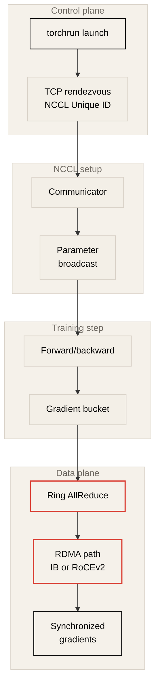

Control plane과 data plane을 분리해서 보면 디버깅이 쉬워진다.

| Phase | Main mechanism | Typical network | Why it matters |
| --- | --- | --- | --- |
| Job launch | `torchrun`, rank assignment | Management/frontend TCP | 모든 process가 같은 training job에 합류해야 한다. |
| NCCL bootstrap | NCCL Unique ID distribution | TCP socket to master rank | communicator와 ring/tree topology를 만들기 위한 shared context다. |
| Intra-node transfer | CUDA/NCCL direct GPU path | NVLink or PCIe | 같은 host의 GPU끼리는 QP 없이 빠르게 복사될 수 있다. |
| Inter-node transfer | NCCL over RDMA transport | InfiniBand or RoCEv2 | remote GPU host와 gradient/model parameter를 교환한다. |
| Gradient sync | Broadcast, AllReduce, ReduceScatter, AllGather | Synchronized many-to-many burst | 가장 느린 rank가 training step time을 결정한다. |


## Chapter 9: RDMA Basics

RDMA는 Remote Direct Memory Access다. 일반 TCP/IP 통신처럼 CPU와 kernel network stack이 매 packet과 memory copy에 깊게 개입하는 모델이 아니라, RNIC가 registered memory 사이의 data movement를 직접 수행하는 모델이다.

RoCEv2는 RDMA message를 routed IP fabric 위에서 전달한다. Ethernet/IP/UDP 기반이므로 기존 data center 운영 모델과 잘 맞지만, UDP transport 자체가 congestion loss를 TCP처럼 복구하지 않는다. 그래서 RoCEv2 fabric에서는 low latency와 lossless 또는 near-lossless 동작이 중요하며, PFC와 ECN 같은 signaling mechanism이 함께 설계된다.

Chapter 9의 RDMA Write 예제는 다음 네 단계로 정리할 수 있다.

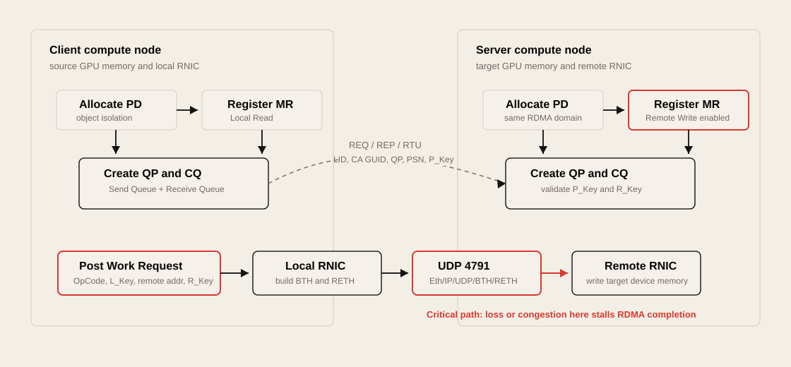

| Step | What happens | Network engineer view |
| --- | --- | --- |
| Memory allocation and registration | Protection Domain을 만들고 local/remote memory region을 등록한다. | PD는 RDMA object의 격리 영역이다. VRF/tenant와 비슷한 mental model로 볼 수 있다. |
| Queue Pair creation | Send Queue, Receive Queue, Completion Queue를 만들고 QP service type을 정한다. | QP는 RDMA flow identity, ordering, load balancing 분석과 연결된다. |
| Connection initiation | REQ, REP, RTU 절차로 QP state가 통신 가능 상태가 된다. | LID, CA GUID, QP number, PSN, P_Key 같은 metadata가 교환된다. |
| RDMA Write | Work Request를 Send Queue에 올리고 RNIC가 remote memory에 write한다. | RoCEv2에서는 IB BTH/RETH가 Ethernet/IP/UDP 안에 encapsulation된다. |

### Memory Registration

RDMA에서 memory는 아무 buffer나 바로 쓸 수 있는 것이 아니다. Application은 memory block을 할당하고 RNIC가 접근할 수 있도록 등록해야 한다. 등록 과정에서는 memory size와 access right가 정해진다.

| Object | Meaning |
| --- | --- |
| `PD` | Protection Domain. 등록된 memory와 QP 같은 RDMA object를 묶는 격리 영역 |
| `L_Key` | Local memory access key. local buffer 접근에 사용 |
| `R_Key` | Remote memory access key. remote write/read 권한을 가진 peer에게 전달 |
| Local Read | client compute node가 자신의 source buffer를 읽기 위한 권한 |
| Remote Write | server compute node가 peer의 RDMA Write target이 되기 위한 권한 |

물리 memory가 반드시 contiguous할 필요는 없다. Registration은 RNIC가 접근할 수 있는 virtual contiguous memory view와 access key를 제공한다.

### Queue Pair and Partitioning

Work Queue는 RNIC와 device memory 사이의 가상 통신 채널이다. Queue Pair는 Send Queue와 Receive Queue로 구성되고, Completion Queue는 Work Request 완료 상태를 application에 알려준다.

| RDMA object | Role |
| --- | --- |
| Send Queue | RDMA Write, Send 같은 outgoing Work Request를 담는다. |
| Receive Queue | incoming receive operation을 처리한다. |
| Completion Queue | operation 완료 여부와 status를 application에 알려준다. |
| Service Type | Reliable/Unreliable, Connection/Datagram 같은 service level과 type을 정한다. |
| P_Key | port partition membership을 확인하는 partition key다. |

Chapter 9 예제는 Reliable Connection을 사용한다. QP를 만들 때 registered memory와 같은 PD에 bind하고, send/receive queue를 completion queue에 연결하며, send/receive Work Request 수와 maximum message size도 정한다.

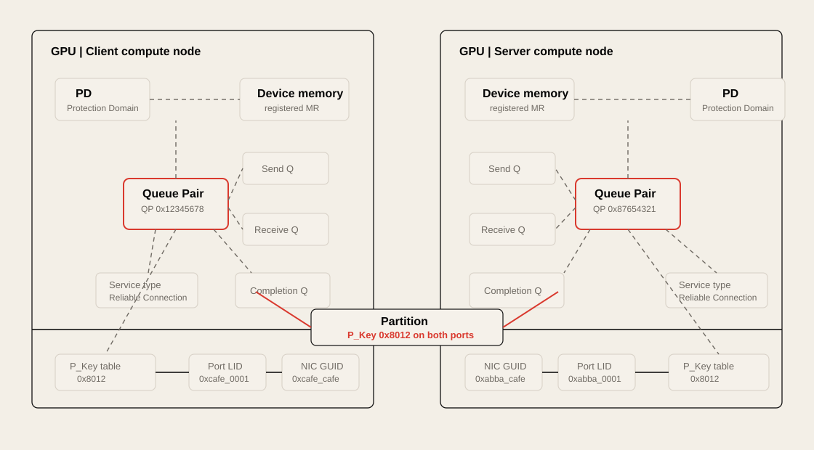

P_Key는 RDMA domain의 partition key다. CCN과 SCN의 NIC port가 같은 partition에 속해야 통신할 수 있다. CCN은 connection request와 RDMA message에 P_Key를 포함하고, receiving node는 target QP의 P_Key와 일치하는지 확인한다.


## RDMA Write Flow

RDMA Write는 application이 remote memory에 데이터를 밀어 넣는 operation이다. Chapter 9 예제에서는 client compute node의 device memory에서 server compute node의 device memory로 write한다.

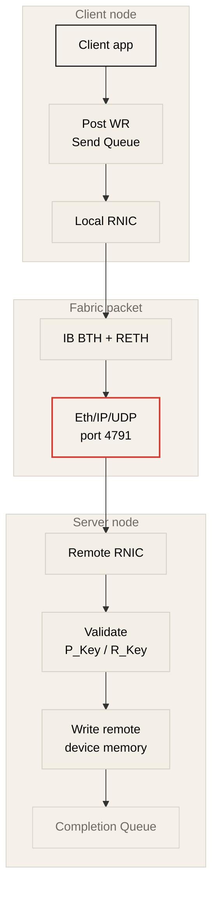

Work Request Entity에는 다음 정보가 들어간다.

| Field | Purpose |
| --- | --- |
| Work Request Identifier | Completion Queue에서 완료된 operation을 식별한다. |
| OpCode | RDMA Write 같은 operation type을 지정한다. |
| Local Buffer Address and Length | local source buffer와 data length를 지정한다. |
| `L_Key` | local buffer 접근 권한을 증명한다. |
| Send Flag | completion signaling 여부를 지정한다. |
| Remote Buffer Address | remote target memory address를 지정한다. |
| `R_Key` | remote memory 접근 권한을 증명한다. |

RoCEv2 RDMA Write packet에서는 InfiniBand Base Transport Header와 RDMA Extended Transport Header가 Ethernet/IP/UDP 안에 들어간다. UDP destination port `4791`은 다음 header가 IB BTH임을 나타낸다.

Server compute node가 RDMA Write message를 받으면 P_Key와 R_Key를 검증하고, virtual device memory address를 physical memory access로 변환한 뒤 target memory에 write한다. 완료되면 Completion Queue를 통해 operation status가 application에 전달된다.

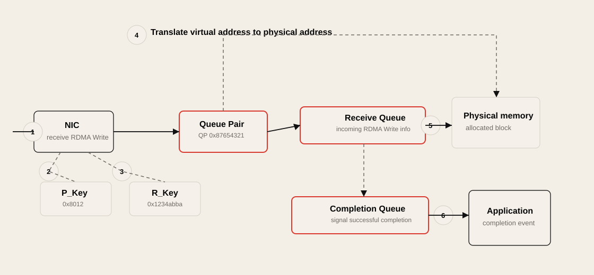

> [!WARNING]
> RoCEv2에서 packet loss는 단순한 retransmission 비용이 아니라 collective stall, GPU idle time, job timeout으로 이어질 수 있다. RDMA가 빠른 이유는 host stack을 우회하기 때문이며, 그만큼 fabric의 loss/congestion behavior가 더 직접적으로 드러난다.


## Chapter 14: GPU Cluster Communication Model

Chapter 14는 두 host, host당 네 GPU인 training cluster를 예제로 사용한다. 각 host에는 PyTorch with CUDA and NCCL support, CUDA, NCCL이 설치되어 있다고 가정한다.

| Component | Role in training job |
| --- | --- |
| PyTorch | Data loading, model definition, parallel execution, gradient synchronization workflow를 관리한다. |
| CUDA | GPU memory allocation, matrix multiplication, activation computation, forward/backward pass, local weight update를 수행한다. |
| NCCL | Multi-GPU, topology-aware collective communication을 수행한다. |

NCCL은 network protocol 자체가 아니다. NCCL은 collective library이고, 실제 data path는 intra-node NVLink/PCIe, inter-node InfiniBand/RoCEv2, 또는 fallback socket transport에 의해 결정된다.


## NCCL Bootstrap and Unique ID

Distributed training에서는 모든 GPU process가 같은 communication group에 들어가야 한다. NCCL은 이를 위해 NCCL Unique ID를 사용한다. 이 ID는 master process가 한 번 생성하고, 다른 rank들에게 TCP connection을 통해 전달한다.

Chapter 14의 `torchrun` 예제는 두 node와 node당 네 process를 사용한다.

```text
global rank = node_rank * nproc_per_node + local GPU rank
```

| Host | Node rank | Local GPU | Global rank |
| --- | ---: | ---: | ---: |
| Host A | 0 | 0 | 0 |
| Host A | 0 | 1 | 1 |
| Host A | 0 | 2 | 2 |
| Host A | 0 | 3 | 3 |
| Host B | 1 | 0 | 4 |
| Host B | 1 | 1 | 5 |
| Host B | 1 | 2 | 6 |
| Host B | 1 | 3 | 7 |

Global rank 0이 master rank가 된다. 예제에서는 rank 0이 `192.168.10.101:12345`에서 TCP listener를 열고, ranks 1-7의 connection request를 기다린다. Host B의 ranks 4-7은 master address로 접속하고, Host A의 local ranks 1-3은 loopback path로 접속할 수 있다.

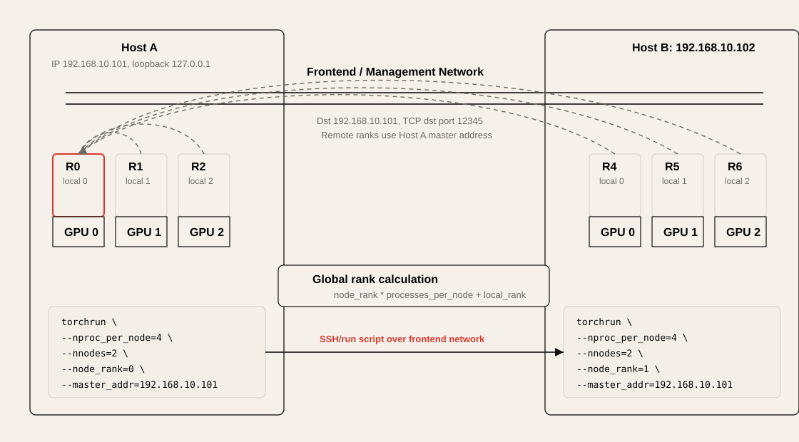

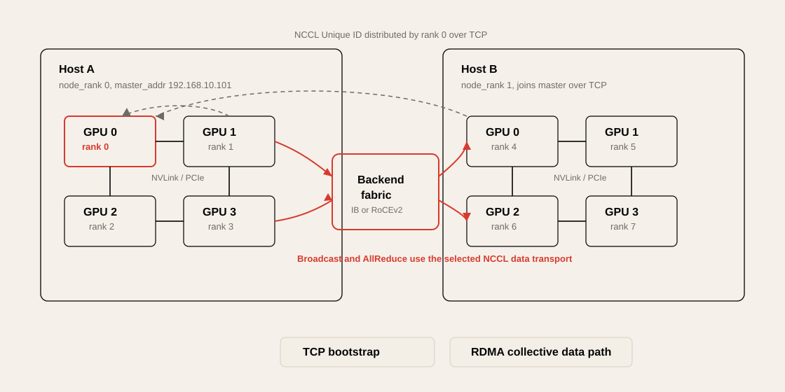

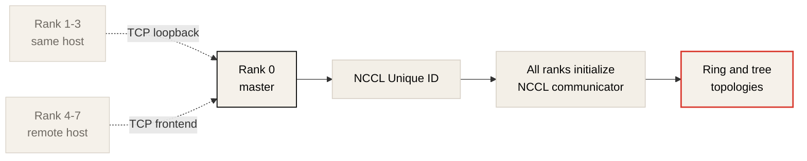

이 phase는 NCCL의 control plane에 가깝다. TCP socket이 보인다고 해서 gradient data plane이 TCP로 돈다는 뜻은 아니다. NCCL Unique ID distribution은 communicator bootstrap이고, 이후 collective data path는 NCCL transport 선택에 따라 달라진다.


## Model Parameter Synchronization

Training 시작 시 모든 GPU process는 model의 local copy를 갖지만, 같은 initial parameter로 시작해야 한다. Chapter 14에서는 rank 0이 NCCL Broadcast collective을 사용해 model parameter를 다른 rank로 배포하는 과정을 설명한다.

| Destination | Path |
| --- | --- |
| Same host ranks 1-3 | NCCL이 NVLink 같은 intra-node direct GPU path를 사용한다. CPU/OS 개입과 QP가 필요하지 않다. |
| Remote host ranks 4-7 | NCCL이 backend network를 통해 QP를 만들고 inter-node data path를 사용한다. |

Broadcast에서는 NCCL이 tree topology를 만들 수 있다. Network 관점에서는 parameter sync가 job startup 시점의 burst가 될 수 있으며, 특히 여러 job이 동시에 시작되면 frontend bootstrap traffic과 backend RDMA traffic을 분리해서 봐야 한다.

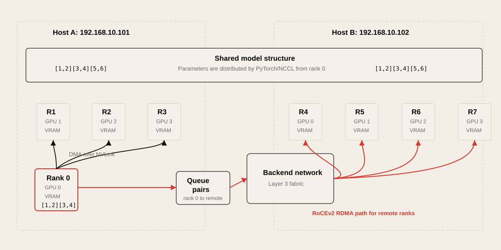


## Gradient Synchronization with Ring AllReduce

Data parallel training에서는 각 GPU가 model replica를 가지고 서로 다른 mini-batch를 처리한다. Forward pass 이후 각 GPU는 backward pass를 통해 local gradient를 계산한다. 모든 replica가 같은 weight update를 하려면 gradient를 동기화해야 하고, 대표적인 collective이 AllReduce다.

Chapter 14의 예제는 마지막 layer가 `1024`개 parameter를 가지고, 각 GPU가 `1024`개 gradient를 계산한다고 가정한다. 각 GPU는 gradient bucket을 네 chunk로 나눈다.

```text
1024 gradients / 4 chunks = 256 gradients per chunk
```

Ring AllReduce는 두 phase로 이해할 수 있다.

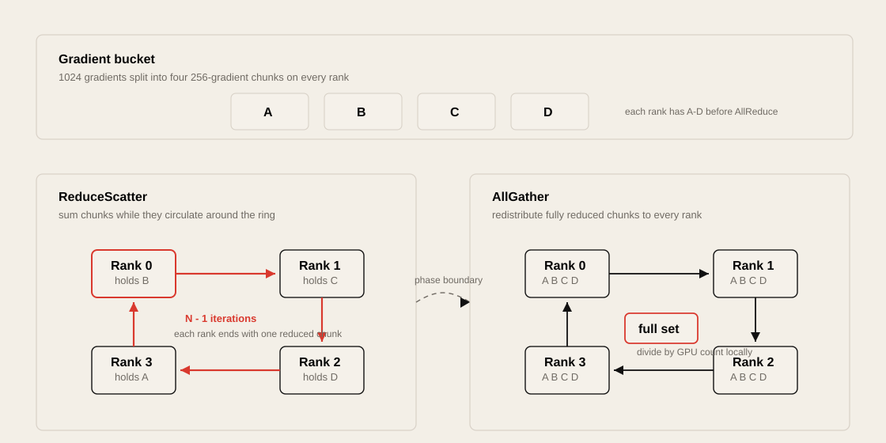

| Phase | Purpose | Result |
| --- | --- | --- |
| ReduceScatter | 각 chunk를 ring을 따라 보내며 GPU들의 값을 sum한다. | 각 rank가 fully reduced chunk 하나를 가진다. |
| AllGather | fully reduced chunk를 ring을 따라 다시 배포한다. | 모든 rank가 full reduced gradient vector를 가진다. |
| Local averaging | 각 GPU가 값을 GPU 수로 나눈다. | 모든 model replica가 같은 average gradient로 update된다. |

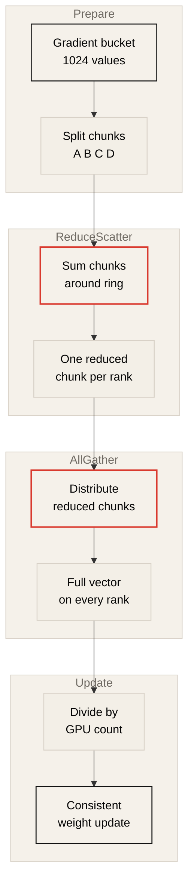

### Ring Data Movement

4-GPU ring에서 ReduceScatter는 `N - 1`, 즉 세 iteration이 필요하다. 첫 iteration에서는 각 rank가 담당 chunk를 next rank로 보낸다.

| Rank | Sends to next rank | Receives from previous rank |
| --- | --- | --- |
| Rank 0 | `A0` to Rank 1 | `D3` from Rank 3 |
| Rank 1 | `B1` to Rank 2 | `A0` from Rank 0 |
| Rank 2 | `C2` to Rank 3 | `B1` from Rank 1 |
| Rank 3 | `D3` to Rank 0 | `C2` from Rank 2 |

각 rank는 받은 chunk를 자신의 같은 chunk와 더한다. 이후 partially reduced chunk가 ring을 더 돌고, 세 번째 iteration이 끝나면 각 rank는 모든 GPU의 contribution이 합쳐진 chunk 하나를 가진다.

AllGather도 세 iteration이다. 이제 각 rank는 자신이 가진 fully reduced chunk를 next rank로 보내고, previous rank에서 받은 chunk를 저장한다. 마지막 iteration이 끝나면 모든 rank가 A, B, C, D의 fully reduced chunk를 모두 갖는다.

중요한 점은 AllReduce가 단순히 “한 서버로 모아서 다시 뿌리는” 구조가 아니라는 것이다. 여러 rank가 동시에 send/receive를 수행하고, intra-node link와 inter-node fabric이 함께 사용된다.


## Network Impact

Chapter 9와 Chapter 14를 합치면 AI training fabric의 요구사항이 명확해진다.

| Requirement | Why it matters |
| --- | --- |
| Low latency | Collective completion이 training step time에 직접 영향을 준다. |
| High bandwidth | Gradient bucket과 parameter tensor가 크고, 여러 rank가 동시에 전송한다. |
| Lossless or near-lossless behavior | RoCEv2 UDP transport에서 loss는 stall, timeout, fallback, job failure로 이어질 수 있다. |
| Stable tail latency | 가장 느린 rank가 전체 collective을 지연시킨다. |
| Topology awareness | NCCL은 topology를 고려하지만, fabric path와 GPU-NIC placement가 나쁘면 한계가 있다. |
| Path diversity | Ring/collective flow가 특정 uplink나 rail에 몰리면 hotspot이 생긴다. |
| Clear fallback visibility | `NET/Socket` fallback은 job은 살릴 수 있지만 multi-node training 성능을 크게 낮출 수 있다. |

일반 application traffic은 request-response나 many-to-one pattern이 많다. 반면 distributed training은 synchronized many-to-many burst가 많다.

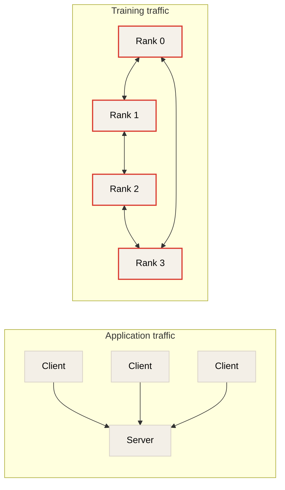

따라서 AI backend network는 평균 utilization만 보면 부족하다. Step boundary, gradient bucket timing, rank-level straggler, queue depth, ECN marking, PFC pause, drop counter, NCCL transport selection을 함께 봐야 한다.


## Practical Lab: Observe NCCL Communication Path

이번 lab의 목적은 model accuracy가 아니라 NCCL bootstrap과 transport 선택을 관찰하는 것이다.

### Minimal Run

```bash
NCCL_DEBUG=INFO torchrun --nproc_per_node=2 train.py
```

### Multi-node Shape

Chapter 14의 rank 계산을 직접 확인하려면 다음 형태를 사용한다.

```bash
# Host A
torchrun \
  --nnodes=2 \
  --nproc_per_node=4 \
  --node_rank=0 \
  --master_addr=192.168.10.101 \
  --master_port=12345 \
  train.py

# Host B
torchrun \
  --nnodes=2 \
  --nproc_per_node=4 \
  --node_rank=1 \
  --master_addr=192.168.10.101 \
  --master_port=12345 \
  train.py
```

### Useful Environment Variables

```bash
export NCCL_DEBUG=INFO
export NCCL_IB_DISABLE=0
export NCCL_SOCKET_IFNAME=
export NCCL_IB_HCA=
export NCCL_TOPO_DUMP_FILE=/tmp/nccl-topo.xml
```

| Variable | Meaning |
| --- | --- |
| `NCCL_DEBUG=INFO` | NCCL bootstrap, transport, channel, ring/tree 관련 log를 출력한다. |
| `NCCL_IB_DISABLE=0` | InfiniBand/RoCE transport 사용을 허용한다. |
| `NCCL_IB_DISABLE=1` | IB/RDMA transport를 비활성화하고 socket path로 fallback하게 할 수 있다. |
| `NCCL_SOCKET_IFNAME` | socket transport가 사용할 network interface를 제한한다. |
| `NCCL_IB_HCA` | NCCL이 사용할 RDMA HCA를 제한한다. |
| `NCCL_TOPO_DUMP_FILE` | NCCL topology 정보를 file로 dump한다. |

### What to Look For

```text
NCCL INFO Bootstrap
NCCL INFO NET/IB
NCCL INFO NET/Socket
NCCL INFO Channel
NCCL INFO Ring
NCCL INFO Tree
NCCL INFO P2P
NCCL INFO Using network
```

관찰 질문은 다음과 같다.

1. Rank 0이 master 역할을 하고 있는가?
2. Remote rank들이 expected `master_addr:master_port`로 rendezvous하는가?
3. NCCL이 intra-node에서는 P2P/NVLink path를 사용하는가?
4. Inter-node에서는 `NET/IB` 또는 RDMA HCA를 사용하는가?
5. 예상과 다르게 `NET/Socket` fallback이 발생하는가?
6. Ring 또는 Tree channel이 어떤 rank 순서로 구성되는가?
7. GPU와 NIC의 topology distance가 collective path와 맞는가?


## Operational Validation Checklist

### GPU, Driver, CUDA

```bash
nvidia-smi
nvidia-smi topo -m
```

확인 포인트:

* GPU 간 NVLink 연결 상태
* GPU와 NIC 간 NUMA distance
* CUDA, driver, NCCL version compatibility
* GPU Direct RDMA 가능성

### RDMA Device

```bash
ibv_devices
ibv_devinfo
rdma link
```

확인 포인트:

* RDMA device가 host와 container 안에서 모두 보이는가?
* mlx5 device가 정상적으로 올라왔는가?
* port state가 ACTIVE인가?
* link layer가 InfiniBand인지 Ethernet인지 확인한다.

### InfiniBand

```bash
ibstat
ibstatus
ibv_rc_pingpong
```

확인 포인트:

* port state와 link speed
* LID 할당 여부
* Subnet Manager 동작 여부
* RC ping-pong latency와 error

### RoCEv2

```bash
show interface priority-flow-control
show qos
show dcbx
show interface counters
```

확인 포인트:

* PFC가 올바른 priority에 적용되었는가?
* ECN marking threshold가 fabric 전체에서 일관적인가?
* DSCP/PCP mapping이 host, NIC, switch에서 일치하는가?
* pause frame이 과도하게 발생하지 않는가?
* drop counter, discard, buffer overflow counter가 증가하지 않는가?

### NCCL

```bash
NCCL_DEBUG=INFO torchrun --nproc_per_node=2 train.py
```

확인 포인트:

* Bootstrap interface와 data interface가 기대와 맞는가?
* selected HCA가 기대한 rail/VF인가?
* selected socket interface가 management network로 제한되어 있는가?
* P2P path와 inter-node network path가 구분되는가?
* fallback 여부와 fallback 원인이 log에 보이는가?


## Design Decision Matrix

| Question | Good sign | Warning sign |
| --- | --- | --- |
| NCCL bootstrap이 정상인가? | 모든 rank가 같은 Unique ID로 communicator 생성 | rank mismatch, master port unreachable |
| NCCL data path가 RDMA인가? | `NET/IB`, expected `mlx5_*` HCA 사용 | `NET/Socket` fallback |
| GPU와 NIC placement가 가까운가? | 같은 NUMA domain, 낮은 topology distance | cross-socket path, SYS distance |
| RoCEv2 fabric이 안정적인가? | 낮은 drop, 예상 가능한 ECN/PFC behavior | PFC storm, pause 과다, drop 증가 |
| Collective path가 분산되는가? | 여러 rail/uplink 사용 | 특정 uplink hotspot |
| Ring rank order가 topology와 맞는가? | intra-node link를 우선 활용하고 inter-node hop을 줄임 | ring이 느린 cross-host path를 과도하게 사용 |
| Failure visibility가 충분한가? | NCCL log, RDMA counters, switch counters가 원인과 맞음 | job은 동작하지만 조용히 느린 path 사용 |


## Practical Tips and Notes

### Separate Bootstrap from Data Path

NCCL Unique ID는 TCP로 배포된다. 이 TCP connection은 communicator bootstrap을 위한 control-plane 성격이다. Gradient bucket이 반드시 TCP로 전송된다는 뜻은 아니다. `NCCL_DEBUG=INFO`에서 bootstrap log와 `NET/IB` 또는 `NET/Socket` transport log를 분리해서 읽어야 한다.

### Check RDMA Object Visibility Before Switch Tuning

RDMA path가 잡히지 않을 때 switch 설정부터 바꾸면 시간을 낭비하기 쉽다. 먼저 container 또는 process namespace 안에서 RDMA device, HCA, driver, library, GPU-NIC topology가 보이는지 확인한다.

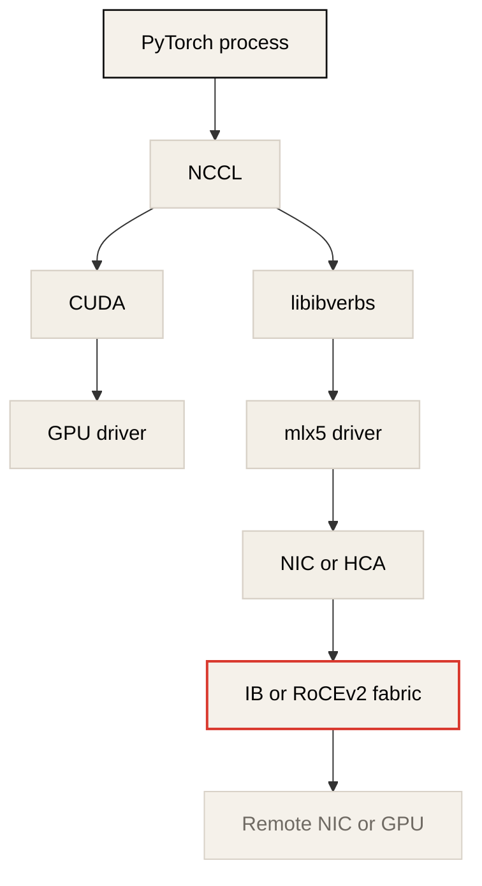

### Measure Tail, Not Only Average

AllReduce는 모든 rank가 완료되어야 끝난다. 평균 bandwidth가 좋아도 한 rank가 hotspot, pause burst, NUMA mismatch, slow HCA, socket fallback을 만나면 전체 step time이 늘어난다. Rank별 latency, ECN/PFC counter, retransmission/error counter, NCCL channel log를 함께 본다.

### Treat Socket Fallback as a Performance Incident

`NET/Socket` fallback은 training job을 계속 실행하게 만들 수 있지만, multi-node GPU cluster에서는 성능 손실이 매우 클 수 있다. 장애 대응에서는 “job이 돈다”보다 “expected RDMA path로 돈다”를 기준으로 삼아야 한다.

### Keep P_Key, QP, and Flow Hashing in the Debug Vocabulary

Chapter 9의 P_Key, QP number, PSN, BTH/RETH 같은 항목은 network engineer에게 중요한 관찰 단위다. ECMP hashing, packet ordering, congestion, QP scale 문제를 볼 때 application-level rank만으로는 부족하다.


## Chapter Summary

Chapter 9는 RDMA Write가 memory registration, Queue Pair creation, connection initiation, Work Request posting, server-side validation으로 구성된다는 점을 보여준다. RDMA는 단순히 빠른 packet forwarding이 아니라 registered memory와 RNIC가 만드는 direct data movement path다.

Chapter 14는 distributed training job이 PyTorch/CUDA/NCCL stack 위에서 어떻게 시작되는지 보여준다. Rank 0은 NCCL Unique ID를 TCP로 배포하고, NCCL은 communicator와 topology를 만든다. Parameter synchronization에는 Broadcast가 사용되고, gradient synchronization에는 AllReduce가 사용된다.

Network engineer 관점의 결론은 다음과 같다.

> AI training fabric은 RDMA packet path와 NCCL collective pattern을 함께 봐야 한다. 하나는 transport이고, 다른 하나는 burst shape이다.


## Key Terms

| Term | Description |
| --- | --- |
| RDMA | Remote Direct Memory Access. CPU/kernel overhead를 줄이고 registered memory 사이의 data movement를 수행하는 방식 |
| RoCEv2 | RDMA over Converged Ethernet v2. Ethernet/IP/UDP 기반 RDMA transport |
| RNIC | RDMA-capable NIC |
| HCA | Host Channel Adapter. InfiniBand/RDMA adapter를 가리키는 용어 |
| PD | Protection Domain. RDMA object를 묶는 격리 영역 |
| Queue Pair | Send Queue와 Receive Queue로 구성되는 RDMA communication endpoint |
| Completion Queue | Work Request 완료 상태를 application에 전달하는 queue |
| Work Request | RNIC가 수행할 operation request |
| WRE | Work Request Entity. Send Queue에 올라간 Work Request 항목 |
| L_Key | Local memory access key |
| R_Key | Remote memory access key |
| P_Key | RDMA partition key |
| PSN | Packet Sequence Number. Reliable Connection에서 packet ordering/reliability에 사용 |
| BTH | InfiniBand Base Transport Header |
| RETH | RDMA Extended Transport Header |
| NCCL Unique ID | NCCL communicator bootstrap을 위해 master rank가 생성하고 배포하는 session identifier |
| Rank | Distributed training process의 global participant ID |
| Broadcast | 하나의 rank가 가진 data를 다른 rank들에게 전파하는 collective |
| AllReduce | 모든 rank의 값을 reduce하고 결과를 모든 rank가 받는 collective |
| ReduceScatter | reduce 결과를 chunk/shard 단위로 나눠 rank에 분산하는 collective phase |
| AllGather | 여러 rank가 가진 chunk/shard를 모아 full tensor를 구성하는 collective phase |
| PFC | Priority Flow Control. Ethernet priority별 pause mechanism |
| ECN | Explicit Congestion Notification. drop 대신 congestion marking을 사용하는 mechanism |


## Questions

### Q1. RDMA에서 memory registration이 필요한 이유는?

### Q2. Protection Domain은 network engineer 관점에서 어떤 개념과 비슷하게 이해할 수 있는가?

### Q3. Queue Pair와 Completion Queue의 역할은 무엇인가?

### Q4. RDMA Write Work Request에는 어떤 정보가 들어가는가?

### Q5. RoCEv2에서 UDP destination port `4791`은 무엇을 의미하는가?

### Q6. NCCL Unique ID는 왜 필요하며, 어떤 network path로 배포되는가?

### Q7. Chapter 14 예제에서 Host B GPU 2의 global rank는 몇 번인가?

### Q8. Parameter Broadcast에서 intra-node GPU와 inter-node GPU의 data path는 어떻게 다른가?

### Q9. Ring AllReduce를 ReduceScatter와 AllGather로 나누어 이해하면 어떤 장점이 있는가?

### Q10. NCCL log에서 `NET/Socket`이 보이면 무엇을 의심해야 하는가?


## Answers

### A1. RDMA에서 memory registration이 필요한 이유는?

RNIC가 application 또는 GPU memory에 직접 접근하려면 접근 가능한 memory region과 권한이 명확해야 한다. Registration은 memory size, access rights, virtual contiguous view를 만들고 `L_Key`와 `R_Key`를 발급한다.

### A2. Protection Domain은 network engineer 관점에서 어떤 개념과 비슷하게 이해할 수 있는가?

PD는 RDMA object를 묶는 격리 영역이다. 전통적인 IP networking의 VRF나 tenant boundary와 비슷한 mental model로 이해할 수 있다.

### A3. Queue Pair와 Completion Queue의 역할은 무엇인가?

Queue Pair는 Send Queue와 Receive Queue로 구성되는 RDMA endpoint다. Work Request는 Send Queue에 올라가고, Completion Queue는 operation 완료 상태를 application에 알려준다.

### A4. RDMA Write Work Request에는 어떤 정보가 들어가는가?

Work Request ID, OpCode, local buffer address/length, `L_Key`, completion signaling flag, remote buffer address, `R_Key`가 포함된다.

### A5. RoCEv2에서 UDP destination port `4791`은 무엇을 의미하는가?

UDP destination port `4791`은 RoCEv2 packet에서 UDP 다음 header가 InfiniBand Base Transport Header임을 나타낸다.

### A6. NCCL Unique ID는 왜 필요하며, 어떤 network path로 배포되는가?

NCCL Unique ID는 모든 GPU process가 같은 communicator와 collective group에 참여하도록 만드는 session identifier다. Chapter 14 예제에서는 master rank가 TCP connection을 통해 다른 ranks에 배포한다.

### A7. Chapter 14 예제에서 Host B GPU 2의 global rank는 몇 번인가?

공식은 `global rank = node_rank * nproc_per_node + local GPU rank`다. Host B는 `node_rank=1`, `nproc_per_node=4`, local GPU 2이므로 `1 * 4 + 2 = 6`이다.

### A8. Parameter Broadcast에서 intra-node GPU와 inter-node GPU의 data path는 어떻게 다른가?

같은 host의 GPU에는 NCCL이 NVLink 같은 direct GPU path를 사용할 수 있고 QP가 필요하지 않다. 다른 host의 GPU에는 backend network를 통해 QP를 만들고 InfiniBand/RoCEv2 같은 inter-node path를 사용한다.

### A9. Ring AllReduce를 ReduceScatter와 AllGather로 나누어 이해하면 어떤 장점이 있는가?

ReduceScatter는 gradient chunk를 ring을 따라 reduce해서 rank별 fully reduced chunk를 만들고, AllGather는 그 chunk들을 모든 rank에 다시 배포한다. 이렇게 나누면 traffic burst, rank별 send/receive, inter-node link 부담을 더 구체적으로 볼 수 있다.

### A10. NCCL log에서 `NET/Socket`이 보이면 무엇을 의심해야 하는가?

NCCL이 RDMA path를 사용하지 못하고 TCP socket transport로 fallback했을 수 있다. RDMA device visibility, `NCCL_IB_HCA`, container 권한, mlx5/libibverbs 상태, GPU-NIC topology, RoCE/IB link state를 확인해야 한다.


## References

* Toni Pasanen, *Deep Learning for Network Engineers*, Chapter 9: RDMA Basics
* Toni Pasanen, *Deep Learning for Network Engineers*, Chapter 14: GPU Cluster Communication Model
* NVIDIA NCCL User Guide
* NVIDIA CUDA Documentation
* InfiniBand Architecture Specification
* RoCEv2, PFC, ECN vendor documentation
