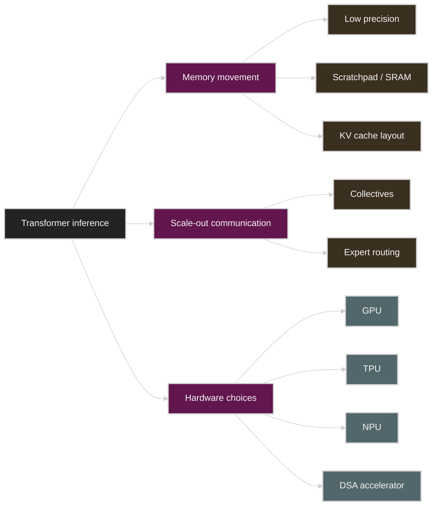

# Hardware Architectures for LLM Inference

This appendix collects Korean study notes for hardware architecture articles that are useful across the inference course.

These notes are not line-by-line full translations. They are translation-oriented lecture notes: each document preserves the original argument, translates the key concepts into Korean, and adds repository-specific connections to Week 1-4 measurements.

## Reading Order

1. [All About Rooflines](roofline.ko.md)
2. [Domain-Specific Architectures for AI Inference](domain-specific-architectures-for-ai-inference.ko.md)
3. [How to Think About TPUs](tpus.ko.md)
4. [How to Think About GPUs](gpus.ko.md)
5. [How to Think About NPUs](npus.ko.md)

## Course Connections

| Theme | Why it matters | Related notes |
|---|---|---|
| Memory movement | Decode performance is usually limited by bytes moved, not peak FLOPS. | Week 1, Week 2 |
| KV cache | Long-context inference is a capacity and bandwidth problem. | Week 3 |
| Low precision | Quantization reduces both memory footprint and bandwidth pressure. | Week 4 |
| Scratchpad / SRAM | Fast local memory changes the batch size needed to saturate compute. | Week 2 |
| Scale-up / scale-out | Tensor parallelism, expert parallelism, and serving need different fabrics. | AI Systems Performance Engineering Chapter 4 |
| NPU deployment | Inference-first accelerators need hardware, compiler, runtime, and serving-stack evaluation together. | Week 1-4 |

## Quick Map

## Source Articles

| Article | Source | Main question |
|---|---|---|
| All About Rooflines | <https://jax-ml.github.io/scaling-book/roofline/> | How can we estimate whether an operation is compute-bound or bandwidth-bound? |
| Domain-Specific Architectures for AI Inference | <https://fleetwood.dev/posts/domain-specific-architectures> | If we redesigned inference hardware around Transformers, what principles would emerge? |
| How to Think About TPUs | <https://jax-ml.github.io/scaling-book/tpus/> | How do TPU compute, memory, and interconnect limits shape scaling? |
| How to Think About GPUs | <https://jax-ml.github.io/scaling-book/gpus/> | How do NVIDIA GPU internals and network topology affect LLM scaling? |
| How to Think About NPUs | Rebellions and FuriosaAI public docs, linked in [npus.ko.md](npus.ko.md#references) | How should inference-first NPUs be evaluated against GPU/TPU systems? |

## Figure Assets

Selected Roofline, GPU, and TPU figures are copied from the [JAX Scaling Book repository](https://github.com/jax-ml/scaling-book), which is distributed under the [MIT License](assets/jax-scaling-book/LICENSE). Fleetwood article visuals are not copied; those concepts are restated with local Mermaid diagrams, hand-editable SVGs, and prose.

## How to Use These Notes

Read this appendix after Week 2 and before Week 4 if possible.

The practical mental model is:

1. Start with the workload phase: prefill, decode, training, or serving.
2. Estimate arithmetic intensity: operations per byte moved.
3. Compare it with the hardware ratio: compute throughput per memory or communication bandwidth.
4. Decide whether the first-order bottleneck is HBM, SRAM/SMEM, interconnect, host I/O, or software overhead.
5. Only then choose the optimization: quantization, batching, cache layout, kernel fusion, tensor parallelism, pipeline parallelism, or different hardware.
