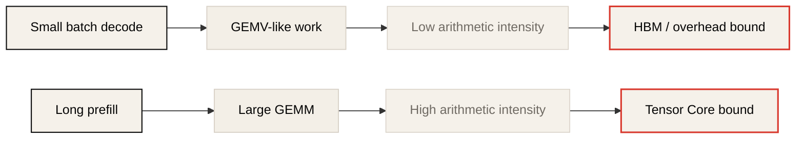

# Domain-Specific Architectures for AI Inference

> Source: [Domain specific architectures for AI inference](https://fleetwood.dev/posts/domain-specific-architectures), published 2025-08-03.
>
> This is a Korean lecture-note adaptation, not a line-by-line full translation. The goal is to preserve the article's main argument and connect it to this repository's inference performance measurements.

## Reading Map

이 글의 핵심 질문은 단순하다.

> Transformer inference만을 위해 가속기를 다시 설계한다면 GPU와 다른 어떤 구조가 필요할까?

저자는 이 질문에 답하기 위해 Transformer inference의 병목을 먼저 분석하고, 거기서 하드웨어 설계 원칙을 끌어낸다. 결론은 다음과 같다.

1. 낮은 정밀도 데이터 타입을 하드웨어가 직접 지원해야 한다.
2. 메모리 전송은 처음부터 비동기적으로 설계해야 한다.
3. tensor-aware memory transfer 전용 하드웨어가 필요하다.
4. 일반적인 cache hierarchy보다 큰 scratchpad가 유리하다.
5. 단일 가속기에서는 memory bandwidth가 매우 중요하다.
6. scale-out을 처음부터 고려해야 한다.
7. 통신 전용 하드웨어가 compute hardware를 보완해야 한다.

이 목록은 Week 2의 GPU memory hierarchy, Week 3의 KV cache, Week 4의 quantization을 하나의 관점으로 묶어준다.

## Source Structure

원문은 긴 essay 형태지만, 강의 노트로 읽으면 다음 흐름이다.

1. AI inference의 최적화 목표를 energy와 capital efficiency로 둔다.
2. Transformer inference를 memory movement 문제로 단순화한다.
3. lower precision, async transfer, DMA/TMA, scratchpad 같은 단일 chip 설계 원칙을 도출한다.
4. prefill/decode, matmul, attention, KV cache를 arithmetic intensity 관점에서 다시 분석한다.
5. 단일 accelerator를 넘어 model parallelism, MoE, AllToAll, communication hardware로 확장한다.
6. test-time compute scaling이 hardware design target을 어떻게 바꿀지 추론한다.
7. TPU, Tenstorrent, Groq, Cerebras 같은 DSA 사례를 설계 원칙에 비춰 읽는다.

따라서 이 글은 "특정 accelerator 소개"라기보다 **inference workload에서 hardware design constraint를 역산하는 글**이다.

## 1. AI Inference에서는 Compute보다 Memory가 먼저다

글은 AI inference의 비용을 energy와 capital로 본다. 많은 사용자가 긴 시간 동안 모델을 계속 호출하는 세계에서는 FLOPS만 높이는 것으로 충분하지 않다. 시스템이 실제로 돈을 태우는 지점은 대개 data movement다.

Transformer forward pass를 단순화하면 다음 패턴이 반복된다.

```text
HBM/DRAM에서 큰 weight tensor를 읽는다.
가까운 memory 또는 compute unit으로 옮긴다.
activation과 곱한다.
중간 결과를 다시 저장한다.
다음 layer에서 반복한다.
```

decode 단계에서는 batch가 작고 한 번에 생성하는 token 수가 적다. 따라서 GEMM보다는 GEMV에 가까워지고, weight를 읽는 bytes가 성능을 지배한다. 이 레포의 Week 2와 Week 4가 계속 강조하는 내용도 같다.

```text
decode latency ~= model weight bytes / effective memory bandwidth + overhead
```

그래서 inference accelerator의 첫 번째 설계 목표는 "더 많은 연산기"가 아니라 "필요 없는 data movement 제거"다.

### 1.1 Memory Cost를 먼저 보는 이유

AI accelerator 논의에서 흔한 실수는 peak FLOPS를 중심에 놓는 것이다. 하지만 inference에서 중요한 것은 "연산을 몇 개 할 수 있는가"가 아니라 "연산에 필요한 값을 얼마나 빨리, 얼마나 적은 에너지로 가져오는가"다.

특히 decode에서는 한 token을 만들 때 layer마다 weight를 거의 한 번씩 읽는다. batch가 작으면 같은 weight를 여러 token에 재사용하는 정도가 낮다. 따라서 Tensor Core가 아무리 빨라도 HBM에서 weight를 가져오지 못하면 놀게 된다.

간단한 예시는 다음과 같다.

| Model | Precision | Weight bytes | 3 TB/s HBM에서 읽는 최소 시간 |
|---|---:|---:|---:|
| 7B | BF16 | 14 GB | 4.7 ms |
| 70B | BF16 | 140 GB | 46.7 ms |
| 70B | INT4 | 35 GB | 11.7 ms |

이 값은 이론적 하한이다. 실제 시스템에서는 kernel launch, dequantization, KV cache read, sampling, scheduler, network, framework overhead가 더 붙는다. 그래도 하한을 계산하면 무엇이 불가능한지 빨리 알 수 있다.

### 1.2 Arithmetic Intensity로 보는 Prefill과 Decode

원문은 arithmetic intensity, 즉 `operations / bytes moved`를 hardware ratio와 비교한다. 간단히 말하면 다음과 같다.

```text
algorithm intensity > hardware ops:byte ratio  -> compute-bound 가능
algorithm intensity < hardware ops:byte ratio  -> memory-bound 가능
```

Prefill은 prompt sequence를 병렬로 처리한다. 큰 matrix multiplication이 많고, 같은 weight tile을 여러 token activation에 재사용할 수 있다. 그래서 충분히 긴 prompt와 batch가 있으면 compute-bound에 가까워진다.

Decode는 한 번에 다음 token 하나를 만든다. batch가 작으면 weight를 많이 읽는 데 비해 activation vector는 작고, 연산량도 작다. 그래서 memory-bound가 되기 쉽다.

| Phase | Typical shape | Reuse | First-order bottleneck |
|---|---|---|---|
| Prefill | GEMM | 높음 | Tensor Core compute 또는 HBM tile supply |
| Decode | GEMV-like | 낮음 | HBM bandwidth, KV cache bandwidth, launch overhead |
| Batched decode | small/medium GEMM | 중간 | batch size에 따라 HBM 또는 compute |

Week 2 lab에서 batch가 커질수록 cuBLAS path가 GEMV에서 Tensor Core GEMM으로 바뀐 것도 같은 현상이다. 알고리즘이 바뀐 것이 아니라 shape가 hardware를 먹일 수 있을 만큼 커진 것이다.



## 2. Lower Precision: Quantization은 모델 압축만이 아니다

낮은 정밀도는 세 가지 효과를 동시에 만든다.

| Effect | Meaning for inference |
|---|---|
| Capacity | 같은 HBM에 더 큰 모델 또는 더 긴 KV cache를 넣을 수 있다. |
| Bandwidth | 같은 bandwidth에서 더 많은 weight/token을 읽을 수 있다. |
| Silicon area | 작은 multiplier는 같은 die area에 더 많이 들어가거나 SRAM으로 면적을 돌릴 수 있다. |

Week 4의 관점으로 바꾸면 다음과 같다.

| Format | Decode에서 의미 | Prefill에서 의미 |
|---|---|---|
| BF16/FP16 | weight bytes가 크다. | 안정적 baseline이다. |
| FP8/INT8 | bandwidth와 compute 양쪽을 줄일 수 있다. | Tensor Core path가 빨라질 수 있다. |
| INT4/W4A16 | decode weight traffic을 크게 줄인다. | dequantization path가 병목이 될 수 있다. |
| FP4/NVFP4 | Blackwell 이후 핵심 frontier다. | hardware support 여부가 중요하다. |

중요한 해석은 이것이다.

> Quantization은 "메모리에 들어가게 하는 기술"인 동시에 "HBM에서 읽어야 하는 bytes를 줄이는 기술"이다.

### 2.1 Precision을 줄이면 Silicon도 달라진다

원문에서 중요한 포인트는 precision 축소가 단지 memory optimization이 아니라는 점이다. multiplier는 bit width가 줄어들면 회로 면적과 에너지 비용이 크게 줄어든다. 따라서 hardware architect 입장에서는 두 선택지가 생긴다.

1. 같은 die area에 더 많은 compute unit을 넣는다.
2. compute unit 일부를 줄이고 SRAM/scratchpad, DMA, communication engine에 면적을 준다.

GPU는 범용성과 ecosystem 때문에 compute unit을 많이 유지하는 방향으로 진화했다. 반면 DSA는 target workload가 명확하다면 더 공격적으로 SRAM, data movement engine, low precision datapath에 면적을 줄 수 있다.

### 2.2 Precision에는 하한이 있다

낮은 bit width가 항상 좋은 것은 아니다. LLM weight와 activation은 정보량을 갖고 있고, 너무 낮은 precision은 모델 품질을 해친다. 그래서 DSA에서 중요한 질문은 "가장 낮은 precision이 무엇인가"가 아니라 "target quality를 만족하는 가장 낮은 precision과 그 format이 무엇인가"다.

| Question | Example |
|---|---|
| Weight만 낮출 수 있는가? | W4A16, AWQ, GPTQ |
| Activation도 낮출 수 있는가? | W8A8, SmoothQuant, FP8 |
| Accumulator precision은 충분한가? | INT8 multiply + FP16/FP32 accumulate |
| Outlier를 format이 감당하는가? | FP8 E4M3 vs INT8 scale |
| Kernel이 실제로 빠른가? | fused Marlin/AWQ vs slow dequant path |

Week 4 lab의 결론처럼, bit width만 줄인다고 latency가 자동으로 줄지는 않는다. fused low-bit kernel과 hardware support가 없으면 dequantization overhead가 이득을 먹어버린다.

## 3. First-Class Asynchronicity

가속기는 memory transfer를 기다리는 동안 compute unit이 놀지 않도록 설계되어야 한다. 이를 위해 double buffering, pipelining, prefetching, overlap이 필요하다.

단순한 구조는 다음과 같다.

```text
buffer A: compute 중
buffer B: 다음 tile을 memory에서 가져오는 중
swap
buffer B: compute 중
buffer A: 다음 tile을 가져오는 중
```

CUDA kernel, Tensor Memory Accelerator, TPU VMEM pipeline, NCCL overlap은 모두 같은 문제를 다른 계층에서 푸는 방식이다.

Week 2 lab에서 roofline을 그릴 때, arithmetic intensity가 충분한데도 peak에 못 미치는 경우가 있다. 이때 원인은 단순 bandwidth 부족이 아니라 transfer와 compute overlap 실패일 수 있다.

### 3.1 Async를 Feature가 아니라 기본 구조로 보기

비동기성은 library optimization 하나가 아니다. Hardware가 처음부터 다음 질문에 답할 수 있어야 한다.

| Question | Why it matters |
|---|---|
| compute와 HBM load를 동시에 할 수 있는가? | Tensor Core starvation을 줄인다. |
| local SRAM에 미리 가져올 수 있는가? | 다음 tile의 latency를 숨긴다. |
| network receive와 local compute를 겹칠 수 있는가? | tensor parallelism과 MoE에서 중요하다. |
| copy engine이 compute unit과 독립적인가? | SM을 data movement에 낭비하지 않는다. |

Hopper의 TMA, CUDA `cp.async`, TPU의 VMEM pipeline, NCCL communication overlap은 모두 같은 요구에서 나온다.

## 4. Tensor-Aware Memory Transfer

일반적인 DMA는 bytes를 옮긴다. AI accelerator가 원하는 것은 tensor를 옮기는 것이다.

Tensor-aware transfer는 다음 속성을 가져야 한다.

| Need | Why it matters |
|---|---|
| Layout awareness | row-major, column-major, tile layout, packed low-bit format을 이해해야 한다. |
| Async scheduling | compute와 copy를 겹쳐야 한다. |
| Local and remote movement | chip 내부, chip 간, node 간 이동을 같은 mental model로 다뤄야 한다. |
| Optional transform | copy하면서 transpose, reduce, unpack, scale을 처리할 수 있으면 compute unit 낭비가 줄어든다. |

NVIDIA H100의 TMA, RDMA, GPUDirect, SHARP, 그리고 DSA의 communication engine은 모두 이 방향으로 읽을 수 있다.

### 4.1 "복사하면서 처리하기"

DSA 관점에서 이상적인 memory movement는 단순 copy가 아니다. Tensor가 목적지에 도착했을 때 바로 compute에 들어갈 수 있어야 한다.

가능한 변환은 다음과 같다.

| During movement | Why useful |
|---|---|
| unpack INT4/FP4 | low-bit storage와 high-precision compute를 연결한다. |
| transpose / swizzle | Tensor Core tile layout에 맞춘다. |
| scale / zero-point apply | quantized tensor를 runtime format으로 바꾼다. |
| reduce / accumulate | AllReduce나 expert aggregation 일부를 offload한다. |
| gather / scatter | MoE routing이나 paged KV cache에서 중요하다. |

DeepSeek V3 같은 MoE 시스템에서 일부 SM을 communication 관리에 쓰는 사례는, 이런 전용 hardware가 없을 때 compute silicon이 통신 orchestration에 빼앗길 수 있음을 보여준다.

## 5. Cache Hierarchy 대신 Scratchpad

CPU cache는 예측하기 어려운 workload에 맞춰져 있다. 하지만 Transformer inference는 매우 큰 tensor를 순차적으로 읽고, 곱하고, 다음 layer로 간다. 같은 weight tensor를 아주 가까운 시간 안에 다시 사용하는 일이 많지 않다.

그래서 일반적인 cache policy는 비효율적일 수 있다.

```text
CPU-like cache:
  "최근에 읽은 값은 곧 다시 쓸 가능성이 높다."

Transformer decode:
  "방금 읽은 layer weight는 다음 token까지 다시 쓰지 않는다."
```

이때 더 적합한 구조가 scratchpad다. scratchpad는 hardware가 알아서 채우고 비우는 cache라기보다, software 또는 compiler가 명시적으로 관리하는 빠른 local memory다.

TPU의 VMEM, GPU의 shared memory/SMEM, Tenstorrent Tensix core의 local SRAM은 모두 이 관점에서 볼 수 있다.

### 5.1 Cache가 잘 맞는 경우와 안 맞는 경우

Cache가 항상 나쁜 것은 아니다. Attention tile, repeated metadata, hot routing tables, small activations처럼 재사용이 명확한 데이터에는 cache가 유용하다. 문제는 LLM weight처럼 거대한 tensor stream을 cache에 넣을 때다.

| Data | Cache usefulness | Better approach |
|---|---|---|
| Layer weights in decode | 낮음 | stream + quantize + prefetch |
| Attention tile | 높음 | FlashAttention-style tiling |
| KV cache page metadata | 중간/높음 | cache-friendly layout |
| MoE routing table | 높음 | local cache 또는 SRAM |
| Large intermediate activation | 낮음 | fusion으로 HBM round-trip 제거 |

따라서 DSA는 cache를 없애자는 말보다, **workload가 예측 가능한 부분을 scratchpad와 compiler/runtime control로 옮기자**는 주장에 가깝다.

### 5.2 Scratchpad의 비용

SRAM은 빠르지만 비싸다. Die area와 power를 많이 먹기 때문에 무한정 키울 수 없다. 그래서 scratchpad 설계는 다음 trade-off다.

```text
더 큰 scratchpad
  -> 더 많은 tile/weight/KV page를 on-chip에 유지
  -> HBM traffic 감소
  -> 하지만 compute unit, IO, yield, cost와 면적 경쟁
```

DSA 스타트업의 핵심 차별점은 이 trade-off를 어디에 찍는가다. GPU는 broad workload를 위해 균형을 잡고, TPU나 inference DSA는 더 규칙적인 AI workload를 위해 SRAM과 data movement에 더 과감하게 투자할 수 있다.

## 6. KV Cache는 두 번째 Model이다

글은 attention과 KV cache를 통해 long-context inference의 병목을 설명한다.

MHA에서는 layer마다 모든 head의 K와 V를 저장한다. context가 길어질수록 KV cache가 HBM capacity와 bandwidth를 동시에 압박한다.

```text
KV cache bytes/token
  ~= 2(K,V) * layers * heads * head_dim * bytes_per_value
```

MQA, GQA, MLA는 모두 이 항을 줄이려는 시도다.

| Method | What it reduces | Trade-off |
|---|---|---|
| MQA | K/V head 수 | model quality 또는 architecture constraint |
| GQA | K/V head 수를 group 단위로 축소 | MHA와 MQA의 절충 |
| MLA | K/V를 latent representation으로 압축 | projection compute 증가 |
| KV quantization | bytes per value | accuracy와 kernel support 검증 필요 |

Week 3의 KV cache 내용을 hardware 관점으로 다시 말하면 다음과 같다.

> Long context는 attention FLOPS 문제가 아니라 KV cache bytes/token 문제로 시작한다.

### 6.1 KV Cache Capacity 계산

Decoder-only Transformer에서 token당 KV cache는 대략 다음과 같다.

```text
bytes/token = 2 * n_layers * n_kv_heads * head_dim * bytes_per_value
```

여기서 `2`는 K와 V를 의미한다. MHA에서는 `n_kv_heads = n_attention_heads`이고, GQA/MQA에서는 훨씬 작아진다.

예를 들어 BF16에서 80 layer, 64 KV heads, head_dim 128인 모델은:

```text
2 * 80 * 64 * 128 * 2 bytes = 2,621,440 bytes/token ~= 2.5 MB/token
```

동시 요청 1,000개가 평균 4,000 token context를 가진다면 KV cache만 약 10 TB가 된다. 실제 serving system에서 paged KV cache, prefix caching, chunked prefill, disaggregation이 중요한 이유다.

### 6.2 KV Cache는 Bandwidth 문제이기도 하다

Capacity만 문제가 아니다. Decode attention은 매 token마다 과거 KV cache를 읽어야 한다. Context가 길어질수록 per-token latency가 늘어날 수 있다.

| Optimization | Capacity effect | Bandwidth effect |
|---|---|---|
| MQA/GQA | KV head 수 감소 | read bytes 감소 |
| MLA | latent cache로 압축 | read bytes 감소, projection compute 증가 |
| KV quantization | bytes/value 감소 | read bytes 감소, quality/kernel 검증 필요 |
| PagedAttention | fragmentation 감소 | locality와 allocator 안정성 개선 |
| Prefix caching | 중복 prefill 감소 | shared prefix 재사용 |

DSA 설계에서 KV cache를 별도 first-class workload로 보는 이유가 여기에 있다. Weight streaming만 빠르게 해도 long-context decode가 느리면 serving 품질은 나오지 않는다.

## 7. Scale-Out: Ops:Comms Ratio

모델이 단일 accelerator에 들어가지 않으면 sharding이 필요하다. 이때 새 병목은 compute와 communication의 비율이다.

```text
ops:comms ratio = accelerator compute throughput / interconnect bandwidth
```

Tensor parallelism은 layer 내부에서 activation을 주고받아야 한다. Expert parallelism은 token을 expert가 있는 device로 보내고 다시 모아야 한다. 이 통신이 compute로 가려지지 않으면 GPU나 accelerator는 놀게 된다.

| Parallelism | Main communication | Practical reading |
|---|---|---|
| Tensor parallelism | AllReduce / AllGather / ReduceScatter | NVLink/NVSwitch 안에 묶는 것이 유리하다. |
| Pipeline parallelism | activation transfer | node 간으로 넘기기 상대적으로 쉽다. |
| Expert parallelism | AllToAll | fabric latency와 routing이 매우 중요하다. |
| Data parallelism | gradient AllReduce | training에서 중요하다. |

MoE 모델에서는 Expert Parallelism의 AllToAll이 특히 중요하다. 통신 전용 하드웨어가 없으면 compute SM을 통신 처리에 써야 하고, 이는 곧 Tensor Core 낭비가 된다.

### 7.1 Tensor Parallelism의 직관

Tensor parallelism은 weight matrix를 여러 device에 나눈다. 그러면 각 device가 맡는 compute와 memory는 줄지만, layer boundary에서 activation을 맞추기 위한 communication이 생긴다.

```text
benefit:
  per-device weight capacity pressure 감소
  per-device compute 감소

cost:
  AllReduce / AllGather / ReduceScatter
  latency and bandwidth overhead
```

Decode에서는 batch가 작아 compute가 communication을 가릴 여지가 적다. 그래서 TP degree를 무작정 키우면 오히려 느려질 수 있다.

### 7.2 Expert Parallelism의 직관

MoE에서는 token마다 선택된 expert가 다르다. Expert가 device별로 나뉘어 있으면 token을 expert가 있는 device로 보내야 한다.

```text
route tokens -> AllToAll -> expert FFN -> AllToAll/aggregate -> continue
```

이 traffic은 dense TP의 AllReduce보다 더 irregular하다. Token distribution이 균등하지 않으면 일부 expert/device가 병목이 된다. 따라서 MoE DSA는 단순 bandwidth뿐 아니라 다음 기능이 중요하다.

| Need | Reason |
|---|---|
| Low-latency AllToAll | token dispatch가 decode latency에 직접 반영된다. |
| Efficient gather/scatter | token order와 expert order를 계속 바꿔야 한다. |
| Load balancing support | hot expert에 traffic이 몰리면 tail latency가 늘어난다. |
| Communication/computation overlap | expert FFN 중 다음 dispatch를 준비해야 한다. |

## 8. Test-Time Compute Scaling이 바꾸는 것

원문 후반부는 inference paradigm이 고정되어 있지 않다는 점을 다룬다. Reasoning model, search, verifier, speculative decoding, multi-sample generation처럼 inference 중 compute를 더 쓰는 방식이 늘어나면 hardware target도 바뀐다.

### 8.1 Serial vs Parallel Test-Time Compute

Test-time compute는 크게 두 방향으로 늘어난다.

| Mode | Example | Hardware implication |
|---|---|---|
| Serial | 긴 chain-of-thought, multi-step reasoning | long decode latency, KV cache growth |
| Parallel | 여러 후보 샘플링, verifier/reranker | batch와 throughput 증가, scheduling 중요 |

Serial scaling은 per-request latency와 KV cache capacity를 압박한다. Parallel scaling은 batch를 키워 hardware utilization을 높일 수 있지만, 동시에 더 많은 memory와 scheduler sophistication을 요구한다.

### 8.2 Speculative Decoding과 DSA

Speculative decoding은 draft model이 여러 token을 제안하고 target model이 한 번에 검증한다. Acceptance rate가 높으면 target model의 decode step 수를 줄일 수 있다.

DSA 관점에서는 다음 질문이 생긴다.

| Question | Why it matters |
|---|---|
| Draft model을 같은 accelerator에 둘 것인가? | memory capacity와 scheduling trade-off |
| Target verification은 prefill-like batch로 처리되는가? | Tensor Core utilization 개선 가능 |
| Rejected token의 wasted compute는 얼마나 되는가? | acceptance rate가 낮으면 이득 감소 |
| KV cache rollback/update가 빠른가? | serving runtime과 memory layout 문제 |

즉 speculative decoding은 algorithmic trick이지만, 실제 이득은 hardware와 runtime이 검증 batch를 얼마나 잘 처리하는지에 달려 있다.

### 8.3 Reasoning Model 시대의 병목

Reasoning model이 긴 답변과 많은 internal token을 생성하면 decode token 수가 늘어난다. 이 경우 single-token latency뿐 아니라 tokens per joule, KV cache retention, multi-turn cache reuse가 중요해진다.

| Workload shift | Hardware pressure |
|---|---|
| Longer outputs | decode bandwidth와 energy 증가 |
| More parallel samples | scheduler, batch packing, memory capacity 압박 |
| Verifier/reranker | heterogeneous model serving 필요 |
| Tool use / agent loops | latency variance, CPU/GPU orchestration 증가 |

DSA를 설계하거나 구매할 때 현재 benchmark만 보면 위험하다. 앞으로의 workload가 serial reasoning인지, parallel sampling인지, MoE-heavy serving인지에 따라 좋은 accelerator가 달라질 수 있다.

## 9. Domain-Specific Architecture 사례

원문은 몇 가지 architecture를 설계 원칙과 대조한다. 여기서는 공개적으로 알려진 특징을 기준으로 요약한다.

### 9.1 TPU

TPU는 matrix multiplication을 중심에 둔 대표적인 DSA다. MXU systolic array, VMEM scratchpad, HBM, ICI topology가 핵심이다.

TPU가 원문의 설계 원칙과 잘 맞는 지점은 다음이다.

| Principle | TPU interpretation |
|---|---|
| Low precision | BF16, INT8 등 generation별 lower precision support |
| Async transfer | HBM -> VMEM -> MXU pipeline |
| Scratchpad | VMEM이 programmer/compiler-controlled local memory 역할 |
| Scale-out | ICI torus topology |
| Communication-aware | sharding axis와 topology matching이 중요 |

TPU는 regular large matmul과 compiler-managed workload에서 강하다. 대신 irregular kernel, custom CUDA ecosystem, dynamic serving feature에는 GPU보다 제약이 있을 수 있다.

### 9.2 Tenstorrent

Tenstorrent 계열 architecture는 많은 작은 compute tile과 local SRAM, NoC, Ethernet-oriented scale-out을 강조한다. 원문에서 흥미로운 지점은 compute core와 data movement core를 구분한다는 점이다.

DSA 관점에서 읽으면 다음 메시지가 있다.

```text
compute core만 많이 두는 것이 아니라
data movement를 관리하는 core/network를 함께 설계해야 한다.
```

이 접근은 MoE, AllToAll, distributed inference처럼 communication pattern이 복잡한 workload에 유리할 가능성이 있다. 다만 software stack과 compiler maturity가 실제 성능을 좌우한다.

### 9.3 Groq

Groq LPU는 deterministic execution과 SRAM 중심 설계로 알려져 있다. 큰 HBM bandwidth에 의존하기보다, compile-time scheduling과 predictable latency를 강조한다.

이런 설계가 매력적인 workload는 다음과 같다.

| Good fit | Reason |
|---|---|
| Low-latency single stream | deterministic scheduling이 tail latency를 줄일 수 있다. |
| Fixed model graph | compile-time optimization이 강해진다. |
| Small/medium model serving | on-chip memory와 predictable dataflow의 이득이 크다. |

반대로 매우 큰 frontier model, dynamic routing, ecosystem integration에서는 제약이 생길 수 있다.

### 9.4 Cerebras

Cerebras WSE는 wafer-scale chip과 대용량 on-chip SRAM을 통해 "chip 밖으로 나가는 비용"을 줄이는 방향이다. 이는 원문의 memory movement axiom을 가장 극단적으로 밀어붙인 사례로 볼 수 있다.

모델이나 working set이 on-chip에 잘 맞으면 HBM/scale-out traffic을 크게 줄일 수 있다. 하지만 wafer-scale hardware는 cost, packaging, software stack, workload fit이 모두 특수하다.

### 9.5 GPU는 DSA가 아닌가?

현대 GPU는 원래 graphics용이었지만, Tensor Core, FP8, TMA, NVLink, NVSwitch, NCCL, Transformer Engine을 거치며 사실상 AI workload에 점점 특화되고 있다.

GPU의 장점은 다음이다.

| Strength | Why it matters |
|---|---|
| Ecosystem | PyTorch, CUDA, Triton, vLLM, TensorRT-LLM |
| Flexibility | 새로운 architecture와 custom kernel에 빠르게 대응 |
| Scale-up fabric | NVLink/NVSwitch로 TP에 강함 |
| Procurement | cloud/on-prem availability가 좋음 |

단점은 범용성의 비용이다. 모든 workload에 맞추다 보니 특정 inference workload만 놓고 보면 SRAM, communication offload, deterministic scheduling에서 DSA가 이길 여지가 있다.

## 10. Hardware/Software Co-Design 관점

DSA 글을 hardware만의 이야기로 읽으면 절반만 읽은 것이다. 실제 inference 성능은 software stack이 hardware property를 얼마나 잘 드러내는지에 달려 있다.

| Layer | Required capability |
|---|---|
| Compiler | graph fusion, layout transform, tiling, async scheduling |
| Runtime | batching, KV paging, prefill/decode scheduling |
| Kernel library | low-bit GEMM/GEMV, attention, MoE dispatch |
| Distributed runtime | collectives, topology-aware placement, overlap |
| Observability | bandwidth, queueing, memory pressure, tail latency |

예를 들어 hardware가 INT4를 지원해도 runtime이 dequantization을 느린 kernel로 처리하면 latency가 줄지 않는다. Hardware가 fast interconnect를 제공해도 scheduler가 TP group을 topology에 맞게 배치하지 않으면 collective가 병목이 된다.

## 11. Domain-Specific Accelerator를 평가하는 기준

이 글을 읽은 뒤 accelerator를 볼 때는 스펙표의 peak FLOPS부터 보지 않는 것이 좋다. 다음 순서가 더 실용적이다.

1. Target workload가 prefill인지 decode인지 training인지 확인한다.
2. HBM capacity와 bandwidth를 본다.
3. SRAM/scratchpad 용량과 software control 방식을 본다.
4. low precision format의 native support를 본다.
5. host-device, device-device, rack-scale interconnect를 본다.
6. collective와 AllToAll을 얼마나 잘 처리하는지 본다.
7. compiler/runtime ecosystem이 실제 model graph를 잘 낮춰주는지 확인한다.

### 11.1 구매/도입 전 질문지

실제 platform team 입장에서는 다음 질문이 더 직접적이다.

| Area | Question |
|---|---|
| Model fit | target model과 KV cache가 들어가는가? 동시성까지 포함했는가? |
| Decode | batch=1, batch=8, batch=64에서 tok/s와 p99 latency는 어떤가? |
| Prefill | long prompt에서 TTFT가 어떻게 변하는가? |
| Quantization | 어떤 format이 native이고, 어떤 kernel/runtime이 지원하는가? |
| MoE | AllToAll과 expert imbalance를 측정했는가? |
| Networking | scale-up과 scale-out topology가 serving parallelism과 맞는가? |
| Software | PyTorch/vLLM/TensorRT-LLM/JAX/XLA 중 무엇이 production-ready인가? |
| Operations | telemetry, failure handling, rolling deploy, isolation이 가능한가? |
| Cost | tokens/sec/$, tokens/sec/W, rack power, cooling을 함께 봤는가? |

### 11.2 Benchmark를 읽을 때 조심할 점

DSA vendor benchmark는 보통 가장 잘 맞는 workload를 보여준다. 따라서 다음을 확인해야 한다.

| Benchmark claim | Missing question |
|---|---|
| High TOPS/FLOPS | memory bandwidth와 utilization은? |
| High tokens/sec | batch size와 latency SLA는? |
| Low latency | concurrency와 sequence length는? |
| INT4 speedup | quality와 exact quantization method는? |
| MoE support | AllToAll p99와 expert imbalance는? |
| Scale-out result | topology, collective algorithm, failure domain은? |

## 12. 이 레포에서의 실전 해석

이 appendix를 읽은 뒤 Week 2-4 실험은 다음처럼 해석할 수 있다.

| Measurement | DSA lens |
|---|---|
| Week 2 GEMV/GEMM transition | batch shape가 arithmetic intensity를 바꾸고 hardware path를 바꾼다. |
| Week 2 GPU-Util mismatch | "kernel running"과 "useful roofline utilization"은 다르다. |
| Week 3 KV cache | context length는 memory capacity와 bandwidth를 동시에 압박한다. |
| Week 4 INT4 projection | edge device에서는 weight bytes 감소가 latency로 직접 이어질 가능성이 높다. |
| Week 4 bnb slowdown | low-bit format만으로는 부족하고 fused kernel/runtime이 필요하다. |

핵심은 언제나 같다.

```text
1. workload phase를 확인한다.
2. bytes moved를 계산한다.
3. arithmetic intensity를 추정한다.
4. hardware ratio와 비교한다.
5. software overhead와 kernel path를 확인한다.
6. 그다음 optimization을 고른다.
```

## 13. Repository Connections

| Repository topic | Connection |
|---|---|
| Week 2 hardware foundations | memory hierarchy, Tensor Core, HBM bandwidth를 DSA 설계 원칙으로 확장한다. |
| Week 3 KV cache | KV cache를 capacity와 bandwidth 양쪽에서 보는 근거를 제공한다. |
| Week 4 quantization | low precision이 bandwidth, capacity, silicon area에 모두 영향을 준다는 관점을 준다. |
| AI Systems Performance Engineering Chapter 4 | scale-out, RDMA, collective, communication overlap과 직접 연결된다. |

## 14. Check Questions

1. Decode 단계에서 peak FLOPS가 높아도 latency가 줄지 않는 이유는 무엇인가?
2. Quantization이 memory capacity뿐 아니라 bandwidth optimization인 이유는 무엇인가?
3. 일반 cache hierarchy가 Transformer inference에 항상 적합하지 않은 이유는 무엇인가?
4. MoE inference에서 AllToAll이 중요한 이유는 무엇인가?
5. 새 AI accelerator를 평가할 때 FLOPS보다 먼저 확인해야 할 항목은 무엇인가?
6. Prefill과 decode는 arithmetic intensity 관점에서 어떻게 다른가?
7. Scratchpad가 cache보다 유리한 조건은 무엇인가?
8. Test-time compute scaling은 inference accelerator 설계 목표를 어떻게 바꾸는가?
9. DSA benchmark를 볼 때 batch size와 latency SLA를 함께 확인해야 하는 이유는 무엇인가?
10. Hardware support와 runtime/kernel support 중 하나라도 빠지면 low-bit inference가 실패하는 이유는 무엇인가?
