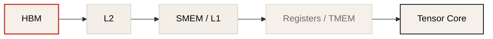

# How to Think About GPUs

> Source: [How to Think About GPUs](https://jax-ml.github.io/scaling-book/gpus/), part of *How To Scale Your Model*, published 2025-08-18.
>
> This is a Korean lecture-note adaptation, not a line-by-line full translation. The goal is to translate the GPU mental model and connect it to LLM inference, quantization, and distributed serving notes in this repository.
>
> Figures from the JAX Scaling Book are reused under the repository's [MIT License](assets/jax-scaling-book/LICENSE).

## Reading Map

이 글은 NVIDIA GPU를 LLM scaling 관점에서 설명한다. 핵심은 GPU를 하나의 큰 계산기로 보지 않는 것이다.

> GPU는 많은 SM, Tensor Core, CUDA core, register, SMEM, L2, HBM, NVLink/NVSwitch, InfiniBand가 계층적으로 연결된 시스템이다.

LLM 성능은 이 계층 중 어디에서 traffic이 막히는지에 따라 달라진다.

## 1. GPU의 기본 단위: SM

H100/B200 같은 modern ML GPU는 여러 개의 SM(Streaming Multiprocessor)을 가진다. 각 SM은 독립적인 작은 processor처럼 동작하며, 그 안에 Tensor Core, CUDA core, register file, shared memory가 있다.


Source: [JAX Scaling Book, "How to Think About GPUs"](https://jax-ml.github.io/scaling-book/gpus/), MIT License. The original caption describes this as an abstract layout of an H100/B200-style GPU with many SMs connected to HBM.

| Unit | Role |
|---|---|
| Tensor Core | matrix multiplication의 대부분을 처리한다. |
| CUDA cores | elementwise op, control-heavy op, reductions 등을 처리한다. |
| Warp scheduler | warp를 선택해 실행하고 latency를 숨긴다. |
| Register file | thread-local 값을 보관한다. |
| SMEM/L1 | tile, activation, temporary data를 가까이 둔다. |

LLM에서 FLOPS의 대부분은 matmul이므로 Tensor Core가 가장 중요하다. 하지만 전체 성능은 Tensor Core만으로 결정되지 않는다. Tensor Core에 tile을 제때 공급하지 못하면 peak FLOPS는 의미가 없다.


Source: [JAX Scaling Book, "How to Think About GPUs"](https://jax-ml.github.io/scaling-book/gpus/), MIT License. The original figure cites a Wccftech H100 SM diagram and explains SM subpartitions, Tensor Cores, warp schedulers, register files, CUDA cores, and L1 data cache.

## 2. Tensor Core와 Low Precision

GPU 세대가 바뀔수록 Tensor Core는 더 큰 tile과 낮은 precision을 처리한다.

| Generation intuition | Important change |
|---|---|
| Volta/Turing | Tensor Core가 본격적으로 등장 |
| Ampere | TF32/BF16/FP16 path 확대 |
| Hopper | FP8, TMA, warpgroup-level programming |
| Blackwell | FP4/NVFP4, 더 큰 Tensor Core, TMEM |

낮은 precision은 두 방식으로 성능을 바꾼다.

1. 같은 memory bandwidth로 더 많은 element를 읽는다.
2. 같은 silicon area에서 더 많은 multiply-accumulate를 처리한다.

Week 4의 메시지와 연결하면 다음과 같다.

```text
Prefill:
  large GEMM -> Tensor Core throughput 중요 -> FP8/FP4 path가 중요

Decode:
  small GEMV-like work -> HBM bytes 중요 -> W4/W8 weight traffic 감소가 중요
```

## 3. SIMT와 Warp Divergence

GPU는 SIMT(Single Instruction, Multiple Threads) 모델을 사용한다. 같은 warp 안의 thread들이 같은 instruction을 실행할 때 효율이 높다. 분기 조건이 갈라지면 warp divergence가 생기고 일부 lane이 놀게 된다.

LLM의 dense matmul은 매우 규칙적이어서 GPU에 잘 맞는다. 반면 다음 작업은 더 조심해야 한다.

| Workload | Risk |
|---|---|
| token sampling | branching, small kernels, CPU/GPU sync |
| MoE routing | irregular dispatch, AllToAll, load imbalance |
| sparse attention | irregular memory access |
| small batch decode | low occupancy, launch overhead |

그래서 serving system은 단순히 kernel 하나만 빠르게 만드는 것이 아니라, batching, scheduling, routing, fusion까지 함께 맞춰야 한다.

## 4. GPU Memory Hierarchy

GPU memory hierarchy는 LLM inference의 성능 언어다.

| Level | Scope | Practical meaning |
|---|---|---|
| Registers | thread/subpartition | 가장 빠르지만 매우 작다. |
| SMEM/L1 | SM-local | tile과 temporary buffer를 둔다. |
| TMEM | Blackwell Tensor Core feeding | 큰 Tensor Core를 먹이기 위한 새 공간이다. |
| L2 | GPU-wide shared cache | SM 간 공유되는 마지막 on-chip cache다. |
| HBM | device memory | weights, activations, KV cache의 주 저장소다. |
| NVLink/NVSwitch | GPU-GPU | tensor parallelism과 collective에 중요하다. |
| PCIe/InfiniBand | host/node/rack | scale-out과 storage/host path에 중요하다. |

Week 2에서 강조한 것처럼, optimization은 traffic을 느린 계층에서 빠른 계층으로 당기는 일이다.



## 5. GPU는 왜 많은 SM을 가지는가

GPU는 수백 개의 작은 작업을 동시에 실행해 latency를 숨긴다. Memory load가 걸린 warp가 기다리는 동안 다른 warp를 실행한다.

이 방식은 batch가 크고 tile이 충분히 많을 때 잘 동작한다. 반대로 decode batch가 작으면 다음 문제가 생긴다.

| Symptom | Explanation |
|---|---|
| GPU-Util은 높은데 throughput이 낮다 | kernel이 계속 실행되지만 Tensor Core/HBM을 충분히 쓰지 못한다. |
| batch=1 decode가 느리다 | launch overhead와 memory latency를 숨길 work가 부족하다. |
| small model이 H100에서 비효율적이다 | problem size가 GPU를 채우지 못한다. |

이 레포의 Week 2 lab 결과와 정확히 연결된다. `nvidia-smi`의 GPU-Util은 "GPU가 바쁜가"를 말할 뿐, "peak에 가깝게 유용한 일을 하는가"를 말하지 않는다.

## 6. GPU Networking: Node 안과 밖

GPU scale-out은 두 계층으로 나눠 봐야 한다.

| Scope | Fabric | Typical use |
|---|---|---|
| Intra-node | NVLink / NVSwitch | tensor parallelism, fast AllReduce |
| Inter-node | InfiniBand / Ethernet RDMA | data parallelism, pipeline parallelism, expert parallelism |
| Rack-scale | NVL72 같은 NVSwitch fabric | 더 큰 scale-up island |

Tensor parallelism은 layer 내부에서 자주 통신하므로 빠른 scale-up fabric에 묶는 것이 좋다. Pipeline parallelism은 layer boundary activation만 넘기므로 상대적으로 scale-out에 더 적합하다. MoE expert parallelism은 AllToAll이 많아 fabric과 routing의 영향을 크게 받는다.


Source: [JAX Scaling Book, "How to Think About GPUs"](https://jax-ml.github.io/scaling-book/gpus/), MIT License. The original caption uses this as a typical H100 network: 8 GPUs form an NVLink domain through NVSwitches, and nodes are connected with switched InfiniBand.

## 7. Collectives를 Roofline으로 보기

LLM scaling에서는 compute roofline만으로 부족하다. communication roofline이 필요하다.

```text
compute time ~= FLOPs / GPU compute throughput
communication time ~= bytes / collective bandwidth
```

성능이 잘 scale하려면 compute time이 communication time을 가릴 수 있어야 한다. 그렇지 않으면 GPU를 더 넣어도 속도가 늘지 않는다.

| Parallelism | Communication pattern | Bottleneck lens |
|---|---|---|
| Data parallelism | gradient AllReduce / ReduceScatter | batch tokens per GPU가 충분해야 한다. |
| Tensor parallelism | activation AllReduce / AllGather | NVLink bandwidth와 latency가 중요하다. |
| Pipeline parallelism | activation send/recv | bubble과 stage balance가 중요하다. |
| Expert parallelism | token AllToAll | load balance와 fabric routing이 중요하다. |

## 8. GPU와 TPU의 차이

원문은 GPU를 TPU와 비교하면서 설명한다. 둘은 모두 "matrix multiply unit + fast memory + network"라는 큰 구조를 공유하지만, 중요한 차이가 있다.

| Dimension | GPU | TPU |
|---|---|---|
| Compute granularity | 많은 SM이 병렬 실행 | 상대적으로 큰 MXU 중심 |
| Flexibility | CUDA ecosystem과 thread-level flexibility | compiler-managed regular execution |
| Memory | register/SMEM/L2/HBM/TMEM 계층 | VMEM/HBM 중심 |
| Network | NVLink/NVSwitch/IB ecosystem | ICI/DCN topology |
| Best fit | broad workloads, custom kernels, production serving | regular large matmul, JAX/XLA compiled workloads |

GPU의 강점은 flexibility다. 단점도 flexibility에서 나온다. 같은 연산이라도 kernel choice, layout, batch shape, fusion 여부에 따라 성능이 크게 흔들린다.

## 9. Inference 관점의 Practical Tips and Notes

### Prefill

Prefill은 긴 prompt를 병렬로 처리한다. 큰 GEMM과 attention이 많고 Tensor Core를 잘 채울 수 있다. FP8/FP4 같은 lower precision compute path가 직접적인 효과를 낸다.

### Decode

Decode는 token을 하나씩 생성한다. batch가 충분히 크지 않으면 GEMV와 작은 attention kernel이 많아진다. 이때 HBM bandwidth, KV cache layout, kernel launch overhead, batching scheduler가 중요하다.

### Quantization

Weight-only quantization은 decode에 특히 효과적이다. Weight+activation quantization 또는 FP8은 prefill compute path에서 더 중요하다. 어느 쪽이 더 큰 이득인지는 workload mix에 따라 달라진다.

### Distributed Serving

TP는 빠른 scale-up fabric에 넣고, PP는 느린 scale-out fabric으로 넘길 수 있다. MoE는 별도 검증이 필요하다. Expert routing이 fabric에 어떤 traffic pattern을 만드는지 보지 않으면 peak FLOPS로는 예측할 수 없다.

## 10. Repository Connections

| Repository topic | Connection |
|---|---|
| Week 2 hardware foundations | SM, Tensor Core, memory hierarchy, GPU-Util 해석과 직접 연결된다. |
| Week 3 KV cache | decode path에서 HBM traffic과 KV cache layout을 설명한다. |
| Week 4 quantization | FP8/FP4/W4A16이 prefill/decode에 다르게 작용하는 이유를 설명한다. |
| AI Systems Performance Engineering Chapter 4 | NCCL, NVLink, RDMA, collective roofline과 연결된다. |

## 11. Check Questions

1. GPU에서 Tensor Core와 CUDA core의 역할은 어떻게 다른가?
2. Decode batch가 작을 때 H100 같은 큰 GPU가 비효율적인 이유는 무엇인가?
3. `nvidia-smi` GPU-Util이 높은데도 실제 throughput이 낮을 수 있는 이유는 무엇인가?
4. Tensor parallelism을 보통 NVLink/NVSwitch 안에 묶는 이유는 무엇인가?
5. Prefill과 decode에서 quantization의 이득이 다르게 나타나는 이유는 무엇인가?
