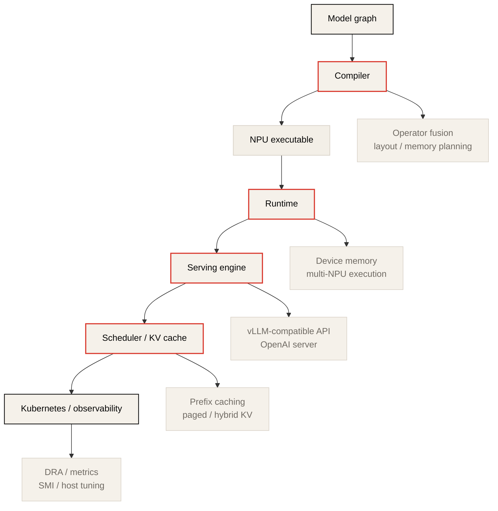
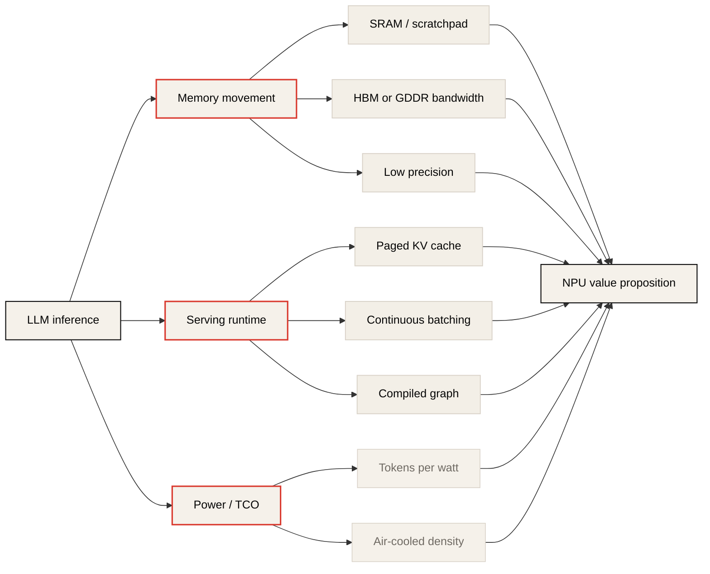

# How to Think About NPUs

> Sources: Rebellions public docs and articles, FuriosaAI public docs and repositories, and public product pages listed in the References section.
>
> This is a Korean lecture-note adaptation and research note, not a vendor benchmark reproduction. The goal is to explain how NPUs fit into the LLM inference hardware landscape and how to evaluate claims from Rebellions, FuriosaAI, and similar inference accelerators.
>
> The NPU market changes quickly. Treat product numbers in this note as public-reference snapshots, and re-check official docs before using them for procurement or capacity planning.

## Reading Map

이 글의 핵심 질문은 다음이다.

> LLM inference를 위해 GPU와 TPU가 아닌 NPU를 도입한다면, 무엇을 기대할 수 있고 무엇을 반드시 검증해야 하는가?

NPU라는 이름은 넓다. 모바일 SoC 안의 작은 neural engine도 NPU라고 부르고, datacenter용 inference accelerator도 NPU라고 부른다. 이 노트에서 말하는 NPU는 후자다.

```text
NPU in this note:
  datacenter or server-grade neural processing unit
  optimized primarily for inference
  exposed through compiler/runtime/serving stack
  evaluated by latency, throughput, watts, memory, and software maturity
```

한국 AI accelerator 생태계에서는 Rebellions와 FuriosaAI가 좋은 case study다. 둘 다 "GPU보다 더 효율적인 inference"를 주장하지만, 접근 방식은 다르다.

| Vendor | Public product family | Architectural emphasis | Serving emphasis |
|---|---|---|---|
| Rebellions | ATOM, REBEL family | multi-core NPU SoC, SRAM hierarchy, NoC, RSD scale-out | vLLM RBLN, Flash/custom attention, APC, dynamic batching, distributed serving |
| FuriosaAI | RNGD | Tensor Contraction Processor, HBM3, large SRAM, SR-IOV | Furiosa-LLM, PagedAttention, prefix caching, hybrid KV cache, llm-d |

중요한 것은 "NPU가 GPU보다 빠른가?"라는 단순 질문이 아니다. 더 좋은 질문은 다음이다.

```text
For this workload and SLO:
  does the NPU reduce the limiting cost?
  does its software stack expose that advantage?
  does the operating model fit our serving system?
```

## 1. NPU를 GPU/TPU/DSA 사이에 놓기

GPU, TPU, NPU, DSA는 완전히 분리된 범주가 아니다. 현대 GPU는 Tensor Core, FP8/FP4, TMA, NVLink로 AI workload에 매우 특화되어 있다. TPU는 Google의 compiler-managed DSA다. NPU는 보통 vendor가 neural network inference를 위해 설계한 specialized accelerator를 가리킨다.

이 appendix의 관점에서는 다음처럼 읽는 것이 실용적이다.

| Category | Strong mental model | Main risk |
|---|---|---|
| GPU | flexible throughput machine with mature ecosystem | power, cost, memory movement, CUDA dependence |
| TPU | compiler-managed matrix machine with topology-aware scaling | workload fit, ecosystem boundary |
| NPU | inference-first DSA with custom memory/runtime stack | software maturity, model coverage, portability |
| DSA | workload-specific hardware/software co-design | benchmark narrowness, adoption risk |

NPU가 이기려면 보통 다음 중 하나 이상을 실제 workload에서 보여줘야 한다.

1. 같은 latency SLO에서 더 높은 tokens/sec/W.
2. 같은 rack power에서 더 많은 동시 요청.
3. 같은 모델에서 더 낮은 p99 latency.
4. 같은 memory budget에서 더 큰 모델 또는 더 긴 context.
5. 더 단순한 operational envelope: air cooling, lower power, better partitioning, easier multi-tenancy.

반대로 다음 질문에 답하지 못하면 peak TOPS가 높아도 production value는 약하다.

1. 지원 모델과 operator coverage가 충분한가?
2. graph break, CPU fallback, unsupported op가 latency tail을 만들지 않는가?
3. vLLM, OpenAI-compatible server, Kubernetes, metrics, profiler가 실제로 쓸 수 있는가?
4. PagedAttention, continuous batching, quantization, prefix cache 같은 serving primitive가 hardware에 맞게 구현되어 있는가?
5. multi-device와 multi-node에서 collective, placement, failure handling이 검증되어 있는가?

NPU는 chip 하나가 아니라 다음 stack 전체로 평가해야 한다.



## 2. NPU가 겨냥하는 병목

LLM inference의 병목은 보통 네 축으로 나타난다.

| Bottleneck | NPU design response |
|---|---|
| Weight traffic | low precision, high memory bandwidth, better data movement |
| KV cache capacity | larger memory, paged cache, GQA/MLA-friendly layout, cache compaction |
| Kernel/runtime overhead | compiled graph, fused operators, specialized runtime |
| Power and TCO | lower TDP, better perf/W, server/rack density |

GPU는 유연성이 강하다. 대신 broad workload를 지원하기 위해 silicon과 software가 범용성을 유지한다. NPU는 target workload가 inference로 좁아질수록 더 과감한 선택을 할 수 있다.



이 그림에서 주의할 점은 NPU의 장점이 chip 하나의 datapath만으로 나오지 않는다는 것이다. LLM serving에서는 chip, compiler, runtime, attention kernel, KV cache manager, scheduler가 하나의 product surface다.

## 3. Rebellions: ATOM, RSD, vLLM RBLN

Rebellions의 공개 자료에서 반복되는 메시지는 **inference workload에 맞춘 SoC와 scale-out serving stack**이다.

공식 RBLN NPU architecture 문서는 ATOM을 multi-core SoC로 설명한다. 공개 문서 기준 ATOM은 Neural Engines, Command Processor, on-chip local/global scratchpad memory hierarchy, NoC bus fabric, PCIe 5.0, GDDR6 interface를 포함한다. 각 Neural Engine에는 4MB local SRAM이 있고, 전체 Neural Engine이 공유하는 32MB global SRAM과 16GB off-chip GDDR6 DRAM이 언급된다.

이 구조는 GPU memory hierarchy와 닮았지만, 해석은 조금 다르다.

| ATOM component | Inference interpretation |
|---|---|
| Neural Engine | dense neural network compute를 실행하는 기본 compute tile |
| Local SRAM | tile, activation, temporary state를 가까이 두는 scratchpad |
| Global SRAM | engine 간 공유되는 on-chip memory layer |
| NoC | engine과 memory 사이 data movement fabric |
| GDDR6 DRAM | model weights, activations, cache state의 off-chip backing store |
| Command Processor | compiled execution and scheduling control path |

### 3.1 ATOM의 roofline 관점

ATOM 같은 NPU를 볼 때도 roofline 질문은 같다.

```text
critical intensity = peak ops/s / memory bandwidth bytes/s
```

다만 NPU에서는 단일 HBM roofline만 보면 부족하다.

| Roofline | What to measure |
|---|---|
| local SRAM roofline | tile reuse, local scratchpad occupancy, engine utilization |
| global SRAM roofline | cross-engine reuse and synchronization cost |
| off-chip DRAM roofline | weight streaming and KV cache bandwidth |
| inter-device roofline | model parallelism, tensor/expert traffic |
| host path roofline | pre/post-processing, graph breaks, CPU fallback |

Rebellions 문서가 SRAM hierarchy와 NoC를 강조하는 이유는 이 때문이다. LLM inference에서는 off-chip memory access가 energy와 latency를 지배하기 쉽다. On-chip memory에 더 많은 reuse를 만들 수 있으면 tokens/sec/W가 좋아질 수 있다.

### 3.2 RBLN profiler로 보는 execution surface

RBLN v0.10.4 문서는 profiler가 기록하는 command taxonomy를 공개한다. 이 taxonomy는 NPU를 black box로 보지 않고, "어디에서 시간이 쓰이는가"를 묻는 데 중요하다.

| Profiler command | What it means | Inference bottleneck lens |
|---|---|---|
| `Host` | CPU에서 실행하는 것이 유리하거나 NPU가 지원하지 않아 host CPU로 offload된 작업 | unsupported op, shape adjustment, CPU fallback |
| `Neural Engine Clusters` | Neural Engine에서 실행되는 compute 작업 | useful compute, engine utilization |
| `Neural DMA` | device DRAM과 Neural Engine scratchpad 사이의 전송 | weight/input/kernel tile movement |
| `Task DMA` | device DRAM과 shared memory 사이의 전송 | intermediate tensor and shared-memory traffic |
| `External HDMA` | host DRAM과 device DRAM 사이의 전송 | host-device bottleneck, graph boundary |
| `Device HDMA` | RSD 구성에서 device DRAM 또는 shared memory 사이의 전송 | inter-device tensor movement |
| `Device Sync` | RSD 구성에서 서로 다른 device 사이의 synchronization | collective latency, dependency scheduling |

이 표는 GPU profiler에서 SM throughput, DRAM throughput, kernel launch overhead를 나누는 것과 같은 역할을 한다. NPU에서도 단순히 end-to-end latency만 보면 원인을 알 수 없다.

```text
Good NPU profiling question:
  Is time spent in Neural Engine compute,
  Neural DMA / Task DMA movement,
  Host fallback,
  Device HDMA,
  or Device Sync?
```

RBLN v0.10.4의 vLLM profiling guide도 같은 방향이다. TTFT와 TPOT만으로는 부족하고, PyTorch-level profiler와 RBLN profiler를 함께 사용해 low-level behavior를 확인해야 한다고 설명한다. Online inference에서는 OpenAI-compatible server를 띄운 뒤 `/start_profile`과 `/stop_profile` endpoint로 profiling 구간을 제어할 수 있다.

### 3.3 RSD: single-chip이 아니라 scalable design

공개 자료에서 Rebellions는 RSD(Rebellions Scalable Design)를 scale-out architecture로 설명한다. LLM serving article에서는 RSD가 disaggregated prefill, multi-node execution, MoE support를 포함한다고 설명한다.

이것은 중요한 방향이다. LLM inference는 단일 accelerator 성능만으로 끝나지 않는다.

| Serving feature | Why it matters |
|---|---|
| Disaggregated prefill | prefill과 decode의 resource profile이 다르다. 분리하면 interference를 줄일 수 있다. |
| Multi-node execution | 큰 모델 또는 높은 concurrency에서 memory capacity와 throughput을 확장한다. |
| MoE support | expert routing은 AllToAll, load balance, irregular dispatch를 만든다. |
| Cache-aware scheduling | KV cache locality와 memory compaction이 throughput/p99를 좌우한다. |

Week 1-4의 언어로 바꾸면, RSD는 다음 문제에 답하려는 시도다.

```text
prefill:
  large GEMM, higher arithmetic intensity, compute-heavy

decode:
  weight/KV traffic, lower arithmetic intensity, latency-sensitive

serving:
  schedule both phases without wasting memory, fabric, or power
```

### 3.4 vLLM RBLN의 의미

NPU adoption에서 가장 큰 risk는 software이다. Rebellions는 `vllm-rbln` plugin을 공개하고, vLLM entry point와 ecosystem에 붙는 방향을 택했다. 공식 vLLM RBLN 문서는 RBLN NPU에서 LLM inference and serving을 제공하는 vLLM hardware plugin으로 설명한다.

이 접근의 장점은 명확하다.

| Integration layer | Adoption value |
|---|---|
| vLLM API | 기존 serving code 변경을 줄인다. |
| OpenAI-compatible serving path | application integration cost를 낮춘다. |
| model zoo | compile and deployment 예제를 제공한다. |
| attention support | Naive Attention, Flash Attention, custom attention kernels 같은 execution path를 제공한다. |
| profiling support | PyTorch-level profiler와 RBLN profiler를 통해 low-level bottleneck을 확인한다. |

하지만 평가할 때는 "vLLM 이름이 붙었다"에서 멈추면 안 된다. 실제로는 다음을 재야 한다.

1. 지원 model architecture: Llama, Qwen, Mixtral, DeepSeek 계열이 필요한 shape로 동작하는가?
2. attention variant: GQA, MLA, sliding window, long context에서 graph break가 없는가?
3. quantization path: FP16, FP8, INT8, INT4 중 어떤 format이 native이고 어떤 format이 dequant overhead를 갖는가?
4. continuous batching: arrival distribution이 바뀌어도 p99가 안정적인가?
5. memory compaction: 긴 request와 짧은 request가 섞일 때 KV fragmentation이 관리되는가?

RBLN v0.10.4 문서에서 특히 유용한 serving surface는 다음이다.

| vLLM RBLN feature | Practical meaning |
|---|---|
| Attention modes | `rbln_attn_impl`과 `rbln_kvcache_partition_len`로 attention implementation과 KV partitioning을 조정한다. |
| Automatic Prefix Caching | 공통 prefix의 KV cache를 재사용해 중복 prefill 계산을 줄인다. vLLM과 같은 방식으로 켜고 끌 수 있다. |
| Dynamic decoder batch sizes | `rbln_decoder_batch_sizes`로 여러 decoder batch size를 미리 컴파일하고 실제 요청 수에 가까운 decoder를 선택한다. |
| Custom kernel | Triton으로 kernel을 작성하고 RBLN IR을 거쳐 target binary로 컴파일하는 path를 제공한다. |
| OpenAI-compatible server | application-level integration과 profiling endpoint를 제공한다. |
| Disaggregated Encoder | multimodal serving에서 visual encoder와 language-model PD instance를 분리하는 beta feature다. |

`rbln_decoder_batch_sizes`는 NPU serving의 중요한 힌트다. 일반 GPU serving은 dynamic shape를 runtime kernel selection이나 CUDA Graph capture size로 다루는 경우가 많다. RBLN은 여러 decoder shape를 compile-time에 준비하고 request count에 맞춰 선택하는 쪽에 가깝다.

```text
Example intuition:
  compile decoder batch sizes: [1, 2, 4, 8]
  incoming active requests: 3
  runtime selects batch-4 decoder instead of always using batch-8
```

이 방식은 작은 batch에서 padding waste를 줄일 수 있지만, compile matrix와 supported shape를 운영상 관리해야 한다. NPU runtime을 평가할 때는 "최대 batch throughput"뿐 아니라 traffic distribution에서 어떤 compiled decoder가 얼마나 자주 선택되는지 봐야 한다.

Custom kernel support도 흥미롭다. v0.10.4 문서는 Triton kernel을 RBLN IR로 낮추고 `rebel-compiler`가 target binary로 컴파일하는 pipeline을 설명한다. 예시로 flash attention, flash causal attention, sliding window attention kernel이 언급된다. 단, `tl.static_range` 사용, `tl.range` 미지원, reduction에서 `keep_dims=True` 사용 같은 제약도 있으므로 CUDA/Triton kernel을 그대로 옮길 수 있다고 가정하면 안 된다.

Disaggregated Encoder는 prefill/decode disaggregation과는 다른 축이다. 멀티모달 모델에서 visual encoder와 language model의 scheduling profile이 다르기 때문에, encoder instance와 PD(Prefill+Decode) instance를 별도 vLLM process로 분리한다. v0.10.4 문서는 이 기능을 beta로 표시하고 production 사용은 아직 권장하지 않는다고 설명한다. 따라서 이 기능은 "방향성은 중요하지만 안정성 검증이 필요한 surface"로 읽어야 한다.

### 3.5 RBLN 공개 소프트웨어 스택을 읽는 순서

Rebellions의 공개 GitHub 조직에는 compiler 내부를 그대로 보여주는 repository가 있는 것은 아니다. `rebel-compiler`는 별도 접근이 필요한 binary package로 배포된다. 따라서 공개 repository를 읽을 때는 "compiler가 내부에서 어떻게 최적화하는가"보다 "어떤 integration surface와 production path를 공개했는가"에 초점을 맞추는 편이 현실적이다.

LLM inference 관점에서는 다음 네 repository가 가장 중요하다.

| Repository | Stack layer | What to inspect first | What it tells you |
|---|---|---|---|
| `vllm-rbln` | serving runtime integration | `vllm_rbln/`, `docs/`, `benchmarks/` | vLLM plugin, OpenAI-compatible serving, batching, attention, prefix caching, benchmark surface |
| `rbln-model-zoo` | validated examples and deployment recipes | `model_registry.yaml`, `vllm/`, `huggingface/`, `serving/` | 실제로 어떤 모델과 framework path가 공개 예제로 제공되는지 |
| `optimum-rbln` | Hugging Face export and inference bridge | `src/optimum/rbln`, `examples/`, `tests/` | Transformers/Diffusers 모델을 RBLN compile artifact로 바꾸는 경로 |
| `torch-rbln` | low-level PyTorch extension | `torch_rbln/`, `docs/`, `aten/`, `c10/rbln/` | `rbln` device, eager/debug workflow, `torch.compile` integration, operator coverage 방향 |

실무적으로는 `vllm-rbln`을 먼저 보는 것이 좋다. NPU의 adoption risk는 chip 자체보다 serving stack에서 드러나기 때문이다. `vllm-rbln`은 RBLN NPU를 vLLM hardware plugin으로 노출하고, LLM serving에서 중요한 batching, attention implementation, prefix caching, profiling, benchmark 흐름을 보여준다. 특히 `docs/bucketing.md`, `docs/sub_block_prefix_caching.md`, `benchmarks/benchmark_serving.py`, `benchmarks/benchmark_throughput.py` 같은 파일은 peak benchmark보다 운영 surface를 이해하는 데 더 유용하다.

`rbln-model-zoo`는 "무엇이 되는가"를 확인하는 지도로 읽어야 한다. README는 Hugging Face, PyTorch, TensorFlow, C/C++ API와 500개 이상의 model example을 강조한다. 이 repository의 가치는 architecture 설명보다 coverage와 recipe에 있다. `vllm/decoder-only`, `vllm/multimodal`, `huggingface/transformers`, `serving/triton_inference_server`, `serving/rayserve`, `serving/torchserve`를 보면 RBLN stack이 어떤 ecosystem 접점을 우선순위로 두는지 알 수 있다.

`optimum-rbln`은 Hugging Face ecosystem과 NPU compiler/runtime 사이의 adapter다. 기존 `transformers` 또는 `diffusers` pipeline을 RBLN class로 바꾸고, export/compile된 artifact를 저장한 뒤 inference에 재사용하는 흐름을 제공한다. 따라서 model portability, compile-time shape 선택, Hugging Face API compatibility를 평가할 때 유용하다.

`torch-rbln`은 가장 낮은 software layer를 보여준다. PyTorch out-of-tree extension으로 `rbln` device, `torch.rbln`, `torch.compile` surface를 제공한다. README는 beta 상태와 API 변화 가능성을 명시하므로 production serving의 출발점으로 보기보다는, unsupported op, eager debugging, operator lowering, PyTorch integration 방향을 이해하는 자료로 보는 것이 맞다.

이 네 repository를 하나의 stack으로 묶으면 다음 그림이 된다.

```text
torch-rbln:
  PyTorch device and operator integration

optimum-rbln:
  Hugging Face model export, compile, and inference bridge

vllm-rbln:
  LLM serving engine integration and runtime features

rbln-model-zoo:
  validated model examples, deployment recipes, and coverage map
```

평가할 때의 핵심 질문은 다음이다.

| Question | Where to look |
|---|---|
| 우리 모델 architecture가 공개 예제에 있는가? | `rbln-model-zoo/model_registry.yaml`, `vllm/`, `huggingface/` |
| serving SLO에 필요한 vLLM feature가 구현되어 있는가? | `vllm-rbln/docs/`, `vllm_rbln/`, `benchmarks/` |
| compile artifact를 어떻게 만들고 재사용하는가? | `optimum-rbln/examples/`, `src/optimum/rbln/` |
| unsupported operator나 fallback을 어디서 확인할 수 있는가? | `torch-rbln/docs/`, `torch_rbln/`, profiler output |
| public repository만으로 알 수 없는 것은 무엇인가? | `rebel-compiler` 내부 최적화, closed binary behavior, 실제 hardware capacity |

따라서 RBLN 공개 자료를 읽는 좋은 순서는 `rbln-model-zoo`로 model coverage를 확인하고, `vllm-rbln`으로 serving behavior를 본 다음, `optimum-rbln`으로 compile/export path를 확인하고, 필요할 때 `torch-rbln`으로 lower-level PyTorch integration을 내려가는 것이다. 반대로 compiler 내부와 exact hardware scheduling을 공개 source만으로 추론하려고 하면 근거가 약해진다.

## 4. FuriosaAI: RNGD, TCP, Furiosa-LLM

FuriosaAI의 공개 자료에서 핵심 키워드는 **Tensor Contraction Processor(TCP), HBM3, large SRAM, low power, cloud-native integration**이다.

공식 RNGD overview는 RNGD를 FuriosaAI의 2세대 NPU로 설명한다. 최신 developer docs 기준 RNGD는 TCP architecture를 사용하고, TSMC 5nm, 1.0GHz, BF16 256 TFLOPS, FP8 512 TFLOPS, INT8 512 TOPS, INT4 1024 TOPS, HBM3 1.5TB/s를 제시한다. 같은 문서는 48GB HBM3, 256MB SRAM, PCIe Gen5 x16, passive cooling, 150W TDP, SR-IOV, 8 virtual functions, ECC, secure boot with root of trust를 공개한다.

> [!NOTE]
> Furiosa product page와 developer docs 사이에는 TDP 표기가 다르게 보이는 시점이 있었다. 이 노트는 2026.2.0 developer docs의 RNGD hardware specification을 기준으로 150W를 사용한다. 구매나 capacity planning에서는 항상 최신 공식 datasheet와 실제 server wall power를 다시 확인해야 한다.

### 4.1 TCP: matrix multiply보다 넓은 primitive를 노린다

GPU와 TPU 설명은 보통 matrix multiplication unit에서 시작한다. Furiosa는 RNGD를 Tensor Contraction Processor라고 설명한다. Tensor contraction은 matmul을 포함하지만, 더 일반적인 multi-dimensional tensor operation으로 읽을 수 있다.

LLM inference 관점에서 이 주장은 다음 가능성을 뜻한다.

| Claim direction | Practical interpretation |
|---|---|
| tensor contraction native execution | matmul뿐 아니라 attention, projection, reduction, layout transform을 compiler가 더 직접적으로 낮출 수 있다. |
| compiler-managed layout | tensor layout과 on-chip memory placement가 performance model의 일부가 된다. |
| large SRAM + HBM3 | SRAM reuse와 HBM bandwidth를 함께 활용하려는 design이다. |
| low TDP | tokens/sec/W와 rack density를 주요 metric으로 삼는다. |

주의할 점은 "TCP가 더 일반적이다"라는 설명만으로 실성능을 알 수 없다는 것이다. 실제 질문은 늘 같다.

```text
target model graph가 TCP primitive로 잘 낮아지는가?
unsupported op가 CPU fallback으로 빠지지 않는가?
compiler가 dynamic serving shape를 잘 처리하는가?
```

### 4.2 RNGD의 memory story

RNGD의 공개 product numbers는 NPU 평가에서 중요한 축을 잘 보여준다.

| Public spec | Why it matters |
|---|---|
| 48GB HBM3 | 7B/13B/32B 계열 model fit과 KV cache capacity에 직접 영향 |
| 1.5TB/s HBM3 bandwidth | decode weight/KV traffic의 first-order bound |
| 256MB SRAM | on-chip tile/cache/scratchpad reuse 가능성 |
| PCIe Gen5 x16 | host-device path, P2P, multi-card serving에서 중요 |
| SR-IOV, 8 virtual functions | multi-tenant partitioning과 isolation의 근거 |
| 150W TDP | perf/W와 air-cooled deployment argument의 중심 |

이 수치들은 GPU와 단순 비교하기 어렵다. 예를 들어 H100/B200은 더 큰 raw compute와 bandwidth를 가질 수 있지만, TDP와 cost도 다르다. NPU의 가치는 보통 "absolute fastest"보다 "target SLO에서 cheaper and more efficient"에 있다.

### 4.3 Furiosa-LLM과 vLLM-compatible API

FuriosaAI는 Furiosa-LLM을 LLM/Multi-modal LLM inference engine으로 제공한다. 공식 문서 기준 주요 기능에는 vLLM-compatible API, PagedAttention 기반 KV cache management, continuous batching, FP8 quantization, data/tensor/pipeline parallelism, OpenAI-compatible server, tool calling, reasoning parser, structured output, chunked prefill이 포함된다. Speculative decoding은 2026.3 planned로 표시되어 있다.

이것은 Rebellions와 비슷한 방향이다.

```text
Hardware alone:
  interesting chip

Hardware + LLM runtime:
  deployable inference system

Hardware + runtime + Kubernetes + metrics:
  production candidate
```

Furiosa software stack 문서는 Furiosa Compiler와 Runtime의 역할도 명확히 나눈다.

| Component | Practical meaning |
|---|---|
| Kernel driver / firmware / PE runtime | Linux device exposure, low-level PE scheduling, host runtime communication |
| Furiosa Compiler | graph optimization, operator fusion, memory allocation, scheduling, cross-layer data movement optimization |
| Furiosa Runtime | compiled executable loading, NPU program scheduling, NPU/host memory allocation, multi-NPU entry point |
| Furiosa Model Compressor | calibration and quantization toolkit |
| Furiosa-LLM | vLLM-compatible serving engine for LLM and multimodal LLM workloads |

Quantization은 특히 조심해서 읽어야 한다. 2026.2 docs 기준 Furiosa-LLM은 FP8 quantization을 주요 기능으로 제시하고, INT4, INT8, GPTQ, AWQ는 planned로 표시한다. 따라서 benchmark 비교에서는 "RNGD hardware가 INT4 TOPS를 공개한다"와 "현재 serving stack이 production INT4 model path를 제공한다"를 분리해야 한다.

Furiosa의 공개 GitHub 자료도 production surface를 보여준다.

| Public artifact | What to learn from it |
|---|---|
| `furiosa-sdk` | compiler, profiler, Python bindings, quantizer, serving library |
| `furiosa-perf` | Furiosa NPU and vLLM benchmark workflow comparison surface |
| `furiosa-apps` | reference applications and integrations |
| DRA driver guide | Kubernetes Dynamic Resource Allocation integration |

### 4.4 Prefix caching and hybrid KV cache

Furiosa-LLM docs에서 가장 중요한 serving detail은 KV cache 관련 기능이다.

| Feature | What it optimizes |
|---|---|
| PagedAttention | KV cache memory management and attention memory efficiency |
| Prefix caching | repeated prefix prefill cost and TTFT |
| Hybrid KV cache management | memory over-provisioning in mixed global/sliding-window attention models |
| Chunked prefill | prefill/decode scheduling balance |

Prefix caching은 공통 system prompt, instruction template, shared conversation history, document QA처럼 prefix가 반복되는 workload에서 유용하다. Furiosa docs는 prefix cache를 scheduler가 자동 관리하고, token-level matching과 radix tree를 사용해 matching prefix를 찾는다고 설명한다. 2026.2 release note에서는 prefix caching이 default로 활성화되었다.

Hybrid KV cache management는 더 미묘하다. 일부 모델은 global attention layer와 sliding-window attention layer를 섞는다. Global attention은 full sequence length에 따라 KV cache가 커지지만, sliding-window attention은 window size로 bound된다. 하나의 KV pool로 모두 관리하면 sliding-window layer에 필요 이상으로 memory를 잡아둘 수 있다.

Furiosa-LLM은 이를 위해 global-attention pool과 sliding-window pool을 분리하고, sliding-window에서 active window 밖으로 밀려난 block을 조기 회수한다. 이는 long-context serving에서 capacity와 fragmentation을 줄이는 방향이다.

```text
Global attention:
  cache grows with full prefix length

Sliding-window attention:
  cache is bounded by window size

Hybrid KV manager:
  allocate separate pools
  reclaim expired sliding-window blocks early
  keep global blocks reusable for prefix history
```

### 4.5 Model parallelism and llm-d integration

Furiosa-LLM은 TP, PP, DP를 모두 설명한다. 이 자체는 GPU serving에서도 익숙한 개념이지만, NPU에서는 memory capacity, inter-device bandwidth, Kubernetes placement까지 함께 봐야 한다.

| Parallelism | Furiosa-LLM reading |
|---|---|
| Tensor parallelism | layer를 여러 device에 나누어 per-device weight/KV/activation memory를 줄이고 aggregate compute/bandwidth를 활용한다. |
| Pipeline parallelism | layer stage를 device별로 나누어 큰 모델을 올린다. |
| Data parallelism | replica를 여러 개 두고 request routing과 cache locality를 관리한다. |

TP는 memory와 latency에 도움을 줄 수 있지만 collective communication이 추가된다. TP degree가 너무 커지면 all-reduce/all-gather overhead 때문에 오히려 느려질 수 있다는 점은 GPU/TPU와 동일하다.

2026.2 release note에서 특히 중요한 변화는 DP Router와 prefix-aware routing이다. DP Router는 DP replica 앞에서 request distribution을 별도로 제어하고, prefix-aware routing은 같은 prefix cache를 가진 replica로 요청을 보내 cache hit rate를 높이려는 방향이다.

Furiosa docs는 llm-d integration도 설명한다. llm-d는 Kubernetes-native distributed inference framework로, intelligent inference scheduling, prefill/decode disaggregation, wide expert parallelism을 제공하는 방향이다. Furiosa-LLM은 Model Server Protocol metrics를 제공해 queued requests, running requests, KV cache utilization 등을 노출한다.

다만 제약도 명시되어 있다. 최신 docs 기준 Furiosa-LLM은 llm-d의 precise prefix-cache-aware scoring에 필요한 KV cache events를 아직 구현하지 않았다고 설명한다. 따라서 "prefix-aware routing이 있다"와 "정밀한 cache-event 기반 scoring이 완성됐다"를 구분해야 한다.

### 4.6 Cloud-native operations and host tuning

Furiosa docs는 Kubernetes와 device management를 상당히 적극적으로 다룬다.

| Surface | Why it matters |
|---|---|
| Kubernetes deployment guide | Furiosa-LLM OpenAI-compatible server를 cluster workload로 올린다. |
| Cloud Native Toolkit | container/Kubernetes 환경에서 NPU workload 배포와 관리를 지원한다. |
| Device Plugin / DRA Driver / NPU Operator / Metrics Exporter | scheduler integration, health, metrics, lifecycle management |
| Furiosa SMI | NPU information, topology, utilization, performance data를 확인한다. |
| Host PCI tuning | hugepage, PCI ACS, latency-performance profile로 PCIe/DMA/P2P variance를 줄인다. |

DRA driver는 alpha로 표시되어 있다. Kubernetes 1.34+와 CDI가 필요하며, device discovery, health tracking, Kubernetes DRA resource registration을 제공한다. 따라서 production 환경에서는 API 안정성, upgrade path, Device Plugin과의 관계를 별도로 검증해야 한다.

Host PCI tuning 문서도 실전적이다. Hugepage는 큰 pinned allocation이나 DMA buffer에서 TLB/page-walk overhead를 줄일 수 있다. PCI ACS disable은 같은 switch 아래 endpoint 사이 P2P path를 더 직접적으로 만들 수 있지만, endpoint isolation을 낮춘다. Multi-tenant 또는 strict security 환경에서는 적용 여부를 신중하게 결정해야 한다.

### 4.7 Virtualization and multi-tenancy

RNGD 문서는 SR-IOV를 통해 physical chip을 virtual function으로 나눌 수 있다고 설명한다. 최신 developer docs 기준 multi-instance support는 8이고, SR-IOV virtual function도 8개로 공개되어 있다. Secure boot with root of trust와 ECC도 명시되어 있다.

이 기능은 datacenter 운영에서 중요하다. LLM serving은 항상 하나의 거대한 model만 돌리는 것이 아니다.

| Use case | Why partitioning matters |
|---|---|
| many small models | accelerator를 작은 tenant에 나눠 배정할 수 있다. |
| mixed SLO workloads | latency-sensitive job과 throughput job을 격리할 수 있다. |
| enterprise serving | hardware isolation, secure boot, model encryption 요구가 생긴다. |
| Kubernetes scheduling | GPU처럼 coarse allocation만으로는 utilization이 낮아질 수 있다. |

다만 partitioning은 공짜가 아니다. 각 partition의 memory bandwidth, SRAM slice, scheduler overhead, context isolation이 실제 p99에 어떤 영향을 주는지 재야 한다.

## 5. Rebellions와 FuriosaAI를 같은 질문으로 비교하기

두 회사의 architecture 이름은 다르지만, 평가 프레임은 같다.

| Evaluation axis | Rebellions | FuriosaAI | What to verify |
|---|---|---|---|
| Compute primitive | Neural Engine based NPU SoC | Tensor Contraction Processor | target model graph lowering |
| On-chip memory | local/global SRAM hierarchy | 256MB SRAM public product spec | tile reuse, graph breaks, SRAM pressure |
| Off-chip memory | GDDR6 on ATOM public docs; newer products may differ | 48GB HBM3 on RNGD | model fit, KV fit, bandwidth-bound decode |
| Runtime | RBLN SDK, vLLM RBLN | Furiosa SDK, Furiosa-LLM | API compatibility, model coverage |
| Serving primitives | Flash/custom attention, APC, dynamic decoder batch sizes, RSD | PagedAttention, prefix caching, hybrid KV cache, chunked prefill | p50/p99 under mixed workloads |
| Scale-out | RSD, multi-node, disaggregated prefill, MoE support | TP/PP/DP, DP Router, llm-d, prefill/decode disaggregation | placement, collectives, failure recovery |
| Operations | model zoo, docs, plugin integration | SMI, DRA alpha, metrics exporter, NPU Operator, host PCI tuning | installability, observability, upgrades |

이 표의 핵심은 "어느 회사가 더 좋은가"가 아니다. 공개 자료가 말하는 design intent를 같은 실험 언어로 번역하는 것이다.

## 6. NPU benchmark를 읽는 법

NPU 벤치마크를 읽을 때 가장 위험한 숫자는 peak TOPS다. Peak TOPS는 필요한 정보지만 충분하지 않다.

### 6.1 반드시 같이 봐야 하는 조건

| Reported metric | Required context |
|---|---|
| tokens/sec | batch size, input length, output length, concurrency |
| latency | TTFT, TPOT/ITL, E2E, p50/p95/p99 분리 |
| power | chip power인지 server wall power인지 |
| memory | model weights, KV cache, max context, fragmentation |
| quantization | format, calibration, quality metric, native support |
| model | architecture, GQA/MLA/MoE, hidden size, vocab, tokenizer |
| serving | continuous batching, prefix cache, scheduler policy |
| comparison GPU | exact GPU SKU, power cap, software stack, quantization parity |

### 6.2 Useful benchmark matrix

NPU를 실제로 평가한다면 최소한 다음 matrix가 필요하다.

| Scenario | Why |
|---|---|
| batch=1 short prompt | launch/runtime overhead와 single-stream latency를 본다. |
| high concurrency short prompt | continuous batching과 scheduler overhead를 본다. |
| long prompt prefill | compute path와 attention kernel을 본다. |
| long context decode | KV cache bandwidth/capacity를 본다. |
| mixed prompt/output length | production distribution과 p99 tail을 본다. |
| quantized model | native low precision path와 quality trade-off를 본다. |
| multi-device | communication roofline과 placement를 본다. |
| rolling upgrade/failure | operational maturity를 본다. |

### 6.3 GPU와 공정하게 비교하는 방법

GPU와 NPU를 비교할 때는 equal footing이 필요하다.

```text
Bad comparison:
  NPU INT4 optimized runtime vs GPU BF16 generic runtime

Better comparison:
  same model
  same quality target
  same input/output distribution
  same SLO
  best available production runtime on each platform
  wall power and server cost included
```

특히 quantization parity가 중요하다. NPU가 INT4 native path를 쓰고 GPU가 BF16이면 NPU가 좋아 보일 수 있다. 반대로 GPU가 TensorRT-LLM/FP8 또는 AWQ fused kernel을 쓰고 NPU가 아직 FP16 path라면 GPU가 좋아 보일 수 있다. 비교는 workload와 software stack의 현재 성숙도까지 포함해야 한다.

## 7. NPU 도입 전 질문지

### 7.1 Hardware fit

| Question | Why it matters |
|---|---|
| target model weights가 memory에 들어가는가? | sharding이 필요하면 latency와 complexity가 증가한다. |
| KV cache까지 포함하면 concurrency가 얼마나 되는가? | serving capacity는 weights보다 KV가 먼저 막을 수 있다. |
| HBM/GDDR bandwidth가 decode target을 만족하는가? | decode는 bytes/token에 민감하다. |
| SRAM이 어떤 방식으로 노출되는가? | compiler/runtime이 reuse를 만들 수 있어야 한다. |
| host-device path가 병목이 아닌가? | graph break, tokenizer, sampling, CPU fallback을 확인해야 한다. |

### 7.2 Software fit

| Question | Why it matters |
|---|---|
| vLLM-compatible API가 필요한 기능을 모두 지원하는가? | API compatibility와 feature compatibility는 다르다. |
| model conversion/compile 시간이 operationally acceptable한가? | frequent model updates에서는 compile path가 중요하다. |
| profiler가 roofline 질문에 답할 수 있는가? | black-box accelerator는 debugging cost가 커진다. |
| dynamic batch shape가 어떻게 처리되는가? | compiled decoder shape와 request distribution이 맞지 않으면 padding waste가 생긴다. |
| custom kernel path가 필요한 operator를 감당하는가? | Triton-like surface가 있어도 지원 연산과 compile constraint를 확인해야 한다. |
| unsupported operator가 어떻게 처리되는가? | CPU fallback은 p99 latency를 망가뜨릴 수 있다. |
| quantization toolchain이 quality validation과 연결되는가? | speedup만 보고 quality regression을 놓치면 안 된다. |

### 7.3 Operations fit

| Question | Why it matters |
|---|---|
| Kubernetes device plugin, DRA, metrics exporter가 있는가? | scheduler integration 없이 production 운영이 어렵다. |
| DRA와 Device Plugin을 동시에 켜지 않는가? | 중복 device exposure는 scheduling과 debugging을 혼란스럽게 만든다. |
| 제품 타입, NUMA, PCIe topology, UUID 조건으로 device를 선택할 수 있는가? | multi-card/multi-NPU 서버에서는 placement가 latency와 bandwidth에 영향을 준다. |
| multi-tenancy isolation이 가능한가? | enterprise serving에는 noisy neighbor 문제가 생긴다. |
| failure handling과 rolling deploy가 검증되었는가? | accelerator reset과 job eviction policy가 필요하다. |
| vendor support와 release cadence가 안정적인가? | fast-moving SDK는 upgrade risk가 크다. |
| fallback path가 있는가? | NPU unavailable 상황에서 GPU/CPU fallback 전략이 필요하다. |

## 8. 이 레포와의 연결

| Repository topic | NPU connection |
|---|---|
| Week 1 performance metrics | NPU도 TTFT, TPOT, throughput, goodput, p99로 읽어야 한다. |
| Week 2 hardware foundations | SRAM/HBM/GDDR/NoC를 roofline으로 해석한다. |
| Week 3 KV cache | PagedAttention, memory compaction, long-context decode가 핵심 검증 항목이다. |
| Week 4 quantization | NPU의 native FP8/INT8/INT4 path가 실제 latency와 quality로 이어지는지 확인한다. |
| DSA appendix | NPU는 inference DSA의 실제 사례다. |
| GPU/TPU appendix | GPU flexibility, TPU compiler model, NPU product stack을 비교한다. |

## 9. Practical Tips and Notes

### NPU는 GPU의 저렴한 대체품이 아니라 다른 product surface다

NPU를 GPU slot에 꽂는 accelerator처럼 볼 수는 있지만, 실제 채택 여부는 compiler/runtime/serving stack까지 포함해 결정된다. CUDA kernel 하나를 직접 고치는 식의 운영은 어렵고, vendor toolchain과 supported model path에 더 의존한다.

### Peak TOPS보다 tokens/sec/W와 p99가 중요하다

Inference business에서는 peak가 아니라 sustained serving이 중요하다. 좋은 benchmark는 다음을 함께 보여준다.

```text
tokens/sec
tokens/sec/W
TTFT p50/p95/p99
TPOT or ITL p50/p95/p99
quality metric after quantization
server wall power
```

### 공개 자료는 design intent를 읽는 데 좋고, capacity planning에는 부족하다

Vendor docs는 architecture와 intended use case를 이해하는 데 유용하다. 하지만 capacity planning에는 실제 workload replay가 필요하다.

예를 들어 다음 조건이 조금만 달라도 결과가 바뀐다.

| Variable | Effect |
|---|---|
| input/output length distribution | TTFT와 TPOT balance 변화 |
| concurrency | batching efficiency와 queueing delay 변화 |
| quantization method | quality와 runtime path 변화 |
| model architecture | GQA/MLA/MoE support 여부 |
| SLO | throughput 최적점과 latency 최적점이 달라짐 |

### NPU는 heterogeneous serving의 후보로 보는 것이 현실적이다

가까운 미래의 serving cluster는 GPU-only 또는 NPU-only보다 heterogeneous해질 가능성이 크다.

| Workload | Possible placement |
|---|---|
| frontier training | GPU/TPU 중심 |
| high-QPS stable inference | NPU 후보 |
| experimental models and custom kernels | GPU 후보 |
| small edge models | edge NPU/Jetson/CPU 후보 |
| regulated enterprise serving | secure virtualization이 있는 NPU 후보 |

## 10. Check Questions

1. 이 노트에서 말하는 server-grade NPU와 mobile NPU의 차이는 무엇인가?
2. NPU benchmark에서 peak TOPS만 보면 안 되는 이유는 무엇인가?
3. Rebellions ATOM의 local/global SRAM hierarchy는 LLM inference에서 어떤 의미를 갖는가?
4. Rebellions RSD가 disaggregated prefill과 MoE support를 강조하는 이유는 무엇인가?
5. Furiosa RNGD의 TCP 주장은 matrix multiply 중심 GPU/TPU 설명과 어떻게 다른가?
6. Furiosa RNGD의 48GB HBM3, 256MB SRAM, 150W TDP는 각각 어떤 operational 질문과 연결되는가?
7. vLLM-compatible API가 있다고 해서 production compatibility가 보장되지 않는 이유는 무엇인가?
8. NPU와 GPU를 공정하게 비교하려면 quantization과 runtime 조건을 어떻게 맞춰야 하는가?
9. NPU 도입 전 CPU fallback과 unsupported operator를 반드시 확인해야 하는 이유는 무엇인가?
10. 어떤 workload에서 NPU가 GPU보다 더 설득력 있는 선택지가 될 수 있는가?

## References

| Topic | Source |
|---|---|
| Rebellions ATOM architecture and profiler commands | <https://docs.rbln.ai/v0.10.4/ko/software/profiler/architecture.html> |
| Rebellions ATOM white paper page | <https://rebellions.ai/atom-architecture-finding-the-sweet-spot-for-genai/> |
| Rebellions LLM serving with NPU | <https://rebellions.ai/llm-serving-with-npu/> |
| Rebellions Scalable Design | <https://rebellions.ai/rebellions-scalable-design/> |
| vLLM RBLN documentation | <https://docs.rbln.ai/latest/software/model_serving/vllm_support/vllm-rbln.html> |
| vLLM RBLN attention modes | <https://docs.rbln.ai/v0.10.4/ko/software/model_serving/vllm_support/features/attention-modes.html> |
| vLLM RBLN Automatic Prefix Caching | <https://docs.rbln.ai/v0.10.4/ko/software/model_serving/vllm_support/features/prefix-caching.html> |
| vLLM RBLN dynamic decoder batch sizes | <https://docs.rbln.ai/v0.10.4/ko/software/model_serving/vllm_support/tutorial/vllm-dynamic-batching.html> |
| vLLM RBLN custom kernel | <https://docs.rbln.ai/v0.10.4/ko/software/model_serving/vllm_support/features/triton_rbln/custom_kernel.html> |
| vLLM RBLN profiling guide | <https://docs.rbln.ai/v0.10.4/ko/software/model_serving/vllm_support/features/profiler.html> |
| vLLM RBLN Disaggregated Encoder | <https://docs.rbln.ai/v0.10.4/ko/software/model_serving/vllm_support/features/disaggregated-encoder.html> |
| RBLN NPU DRA driver | <https://docs.rbln.ai/v0.10.4/ko/software/system_management/kubernetes/npu_dra_driver.html> |
| Optimum RBLN GitHub | <https://github.com/RBLN-SW/optimum-rbln> |
| vLLM RBLN GitHub | <https://github.com/RBLN-SW/vllm-rbln> |
| torch-rbln GitHub | <https://github.com/RBLN-SW/torch-rbln> |
| RBLN Model Zoo | <https://github.com/RBLN-SW/rbln-model-zoo> |
| FuriosaAI RNGD overview | <https://developer.furiosa.ai/latest/en/overview/rngd.html> |
| FuriosaAI RNGD product page | <https://furiosa.ai/rngd> |
| FuriosaAI software stack | <https://developer.furiosa.ai/latest/en/overview/software_stack.html> |
| FuriosaAI supported models | <https://developer.furiosa.ai/latest/en/overview/supported_models.html> |
| Furiosa SDK 2026.2 release notes | <https://developer.furiosa.ai/latest/en/whatsnew/release-2026.2.html> |
| Furiosa-LLM overview | <https://developer.furiosa.ai/latest/en/furiosa_llm/intro.html> |
| Furiosa-LLM prefix caching | <https://developer.furiosa.ai/latest/en/furiosa_llm/prefix-caching.html> |
| Furiosa-LLM hybrid KV cache | <https://developer.furiosa.ai/latest/en/furiosa_llm/hybrid-kv-cache.html> |
| Furiosa-LLM model parallelism | <https://developer.furiosa.ai/latest/en/furiosa_llm/model-parallelism.html> |
| Furiosa-LLM Kubernetes deployment | <https://developer.furiosa.ai/latest/en/furiosa_llm/k8s_deployment.html> |
| Furiosa Cloud Native Toolkit | <https://developer.furiosa.ai/latest/en/cloud_native_toolkit/intro.html> |
| Furiosa DRA driver docs | <https://developer.furiosa.ai/latest/en/cloud_native_toolkit/kubernetes/dra_driver.html> |
| Furiosa-LLM with llm-d | <https://developer.furiosa.ai/latest/en/cloud_native_toolkit/llm_d.html> |
| Furiosa SMI | <https://developer.furiosa.ai/latest/en/device_management/system_management_interface.html> |
| Furiosa host PCI tuning | <https://developer.furiosa.ai/latest/en/device_management/host_tuning.html> |
| Furiosa SDK GitHub | <https://github.com/furiosa-ai/furiosa-sdk> |
| Furiosa performance tooling | <https://github.com/furiosa-ai/furiosa-perf> |
| Furiosa DRA driver guide | <https://github.com/furiosa-ai/furiosa-dra-driver-guide> |
| Furiosa Hot Chips 2024 announcement | <https://furiosa.ai/blog/furiosaai-rngd-hot-chips-2024> |
