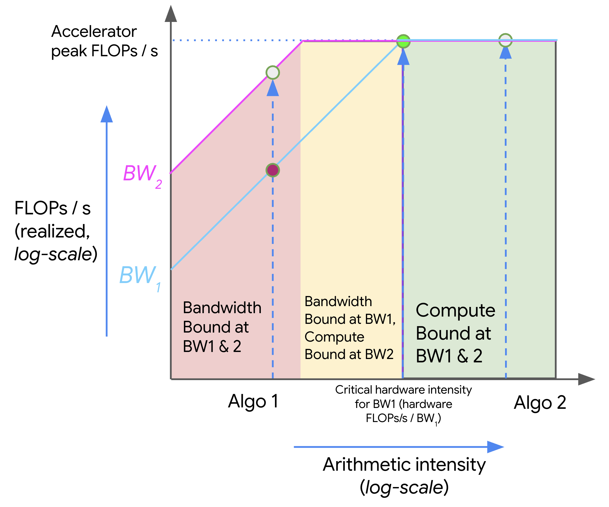
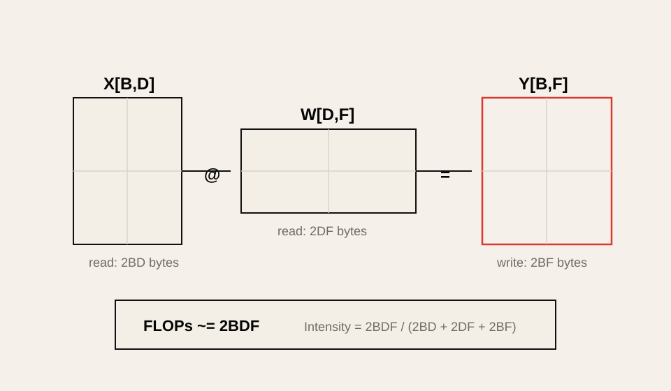
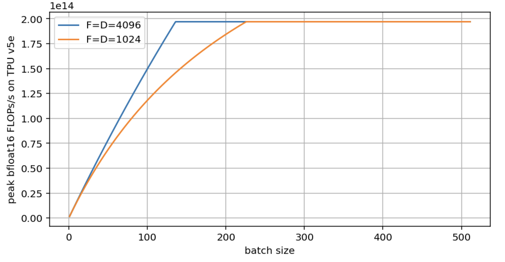
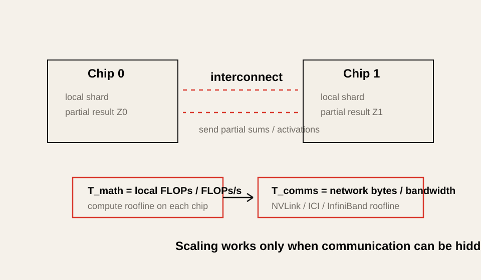

# All About Rooflines

> Source: [All About Rooflines](https://jax-ml.github.io/scaling-book/roofline/), part of *How To Scale Your Model*, published 2025-02-04.
>
> This is a Korean lecture-note adaptation, not a line-by-line full translation. The goal is to explain the roofline model and connect it to the inference measurements in this repository.
>
> Selected figures from the JAX Scaling Book are reused under the repository's [MIT License](assets/jax-scaling-book/LICENSE). Additional SVG diagrams are redrawn locally in this repository's editorial diagram style.

## Reading Map

이 글은 TPU/GPU/DSA 글을 읽기 전에 필요한 성능 모델을 정리한다.

핵심 질문은 다음이다.

> 어떤 연산이 왜 5ms가 아니라 50ms 걸리는가?

답은 보통 세 가지 상한에 의해 결정된다.

| Constraint | Unit | Meaning |
|---|---|---|
| Compute throughput | FLOPs/s or OPs/s | 연산기가 초당 처리할 수 있는 연산량 |
| Memory / network bandwidth | bytes/s | 데이터를 이동할 수 있는 속도 |
| Memory capacity | bytes | 데이터가 물리적으로 들어갈 수 있는 크기 |

Roofline model은 이 중 compute throughput과 bandwidth를 함께 써서 어떤 workload가 compute-bound인지 memory-bound인지 빠르게 판단하는 방법이다.


이 그림에서 x축은 arithmetic intensity, y축은 달성 가능한 처리량이다. 왼쪽 사선 구간에서는 bandwidth가 성능을 제한한다. 오른쪽 수평 구간에서는 compute peak가 성능을 제한한다.

원문은 같은 아이디어를 log-log plot과 여러 bandwidth line으로도 보여준다.



Source: [JAX Scaling Book, "All About Rooflines"](https://jax-ml.github.io/scaling-book/roofline/), MIT License. The original figure shows how algorithms with different arithmetic intensities move between bandwidth-bound and compute-bound regions as available bandwidth changes.

## 1. 시간은 어디에서 쓰이는가?

가장 먼저 계산해야 하는 것은 두 시간이다.

```text
T_math = Computation FLOPs / Accelerator FLOPs/s
```

```text
T_comms = Communication Bytes / Bandwidth Bytes/s
```

여기서 `communication`은 반드시 network만 뜻하지 않는다. HBM에서 Tensor Core로 값을 읽는 것도 communication이고, GPU 사이에 activation을 보내는 것도 communication이다.

| Case | Communication meaning |
|---|---|
| Single GPU matmul | HBM -> SM/Tensor Core data movement |
| TPU matmul | HBM -> VMEM -> MXU data movement |
| Tensor parallelism | GPU/TPU 사이 activation collective |
| MoE expert parallelism | token AllToAll |
| CPU offload | host memory / PCIe / network path |

실제 runtime은 compute와 communication을 얼마나 overlap할 수 있는지에 따라 달라진다.

```text
Lower bound = max(T_math, T_comms)
Upper bound = T_math + T_comms
```

완전히 overlap되면 더 큰 쪽만 보인다. 전혀 overlap되지 않으면 둘을 더해야 한다. 실제 시스템은 보통 그 사이에 있다.


이 그림은 roofline이 latency를 정확히 예측하는 모델이라기보다 **시간의 하한과 상한을 잡는 모델**이라는 점을 보여준다. Kernel, runtime, collective가 compute와 communication을 잘 겹치면 `max(T_math, T_comms)`에 가까워지고, 겹치지 못하면 `T_math + T_comms`에 가까워진다.

## 2. Compute-Bound와 Memory-Bound

`T_math > T_comms`이면 compute가 더 오래 걸린다. 이 경우 연산기가 바쁘고, bandwidth를 더 늘려도 큰 이득이 없을 수 있다. 이를 compute-bound라고 한다.

`T_comms > T_math`이면 데이터 이동이 더 오래 걸린다. 이 경우 Tensor Core나 MXU는 값을 기다리며 놀 수 있다. 이를 memory-bound, bandwidth-bound, communication-bound라고 부른다.

| Bound | First-order limit | Useful optimization |
|---|---|---|
| Compute-bound | FLOPs/s | faster Tensor Core path, lower precision compute, better tiling |
| Memory-bound | HBM bytes/s | quantization, fusion, caching, layout, prefetch |
| Network-bound | interconnect bytes/s | topology-aware sharding, overlap, better collectives |
| Capacity-bound | memory bytes | quantization, sharding, offload, KV cache reduction |

LLM inference에서는 prefill과 decode가 서로 다른 bound를 갖는 경우가 많다.

| Phase | Typical behavior |
|---|---|
| Prefill | large GEMM이 많아 compute-bound에 가까워질 수 있다. |
| Decode | batch가 작으면 GEMV-like pattern이 되어 memory-bound가 되기 쉽다. |
| Batched decode | batch와 sequence mix에 따라 중간 영역에 놓인다. |

## 3. Arithmetic Intensity

Roofline model의 핵심 지표는 arithmetic intensity다.

```text
Arithmetic Intensity = Computation FLOPs / Communication Bytes
```

말로 풀면 다음과 같다.

> byte 하나를 움직이는 동안 FLOP를 얼마나 많이 하는가?

값이 높을수록 compute-bound가 되기 쉽고, 낮을수록 memory-bound가 되기 쉽다.

여기서 주의할 점은 arithmetic intensity가 **데이터 원소 하나당 연산 수**가 아니라 **이동한 byte당 FLOP 수**라는 것이다. 예를 들어 BF16 값 하나는 2 bytes다. BF16 값 하나를 HBM에서 읽고 그 값으로 1 FLOP만 수행하면:

```text
1 FLOP / 2 bytes = 0.5 FLOPs/byte
```

따라서 arithmetic intensity는 1이 아니라 0.5다. Arithmetic intensity가 1 FLOP/byte라는 말은 메모리나 네트워크에서 1 byte를 이동할 때 평균적으로 1번의 부동소수점 연산을 수행한다는 뜻이다. 즉 가져온 데이터를 많이 재사용하지 못하는 낮은 재사용성의 workload이며, 현대 GPU/TPU에서는 대개 memory-bound가 된다.

하드웨어에도 기준 intensity가 있다.

```text
Hardware critical intensity = Peak FLOPs/s / Bandwidth bytes/s
```

알고리즘의 arithmetic intensity가 hardware critical intensity보다 크면 compute-bound가 될 수 있다. 작으면 bandwidth-bound가 된다.

```text
Algorithm intensity > Hardware intensity  -> compute-bound
Algorithm intensity < Hardware intensity  -> bandwidth-bound
```

## 4. Dot Product는 왜 Memory-Bound인가?

BF16 dot product를 생각해보자.

```text
x: bf16[N]
y: bf16[N]
output: bf16[1]
```

대략 읽어야 하는 bytes:

```text
x read = 2N bytes
y read = 2N bytes
output write = 2 bytes
```

수행하는 FLOPs:

```text
N multiplications + (N - 1) additions ~= 2N FLOPs
```

따라서 N이 충분히 크면:

```text
Arithmetic intensity ~= 2N / 4N = 0.5 FLOPs/byte
```

0.5 FLOPs/byte는 현대 GPU/TPU의 critical intensity보다 훨씬 낮다. 그래서 dot product는 compute unit을 가득 채우기 어렵다. 값을 읽는 시간이 지배한다.

이 직관은 decode의 GEMV에도 이어진다. Vector 하나와 큰 weight matrix를 곱하면, weight를 많이 읽는 데 비해 재사용이 낮다.

## 5. Matmul은 왜 Batch가 중요할까?

Transformer에서 가장 중요한 연산은 matrix multiplication이다.

```text
X[B, D] @ W[D, F] -> Y[B, F]
```



BF16이라고 하면 대략 다음 bytes를 읽고 쓴다.

```text
X read: 2BD bytes
W read: 2DF bytes
Y write: 2BF bytes
```

FLOPs는 대략:

```text
2BDF FLOPs
```

따라서 arithmetic intensity는:

```text
2BDF / (2BD + 2DF + 2BF)
= BDF / (BD + DF + BF)
```

Transformer에서는 보통 `D`와 `F`가 크고 `B`가 상대적으로 작다. 이때 `DF` 항이 지배적이면:

```text
Arithmetic intensity ~= B
```

여기서 중요한 점은 `B`가 일반적인 request batch size만 뜻하지 않는다는 것이다. Roofline에서의 `B`는 **local token batch size**다.

```text
local token batch = local sequence count * sequence length tokens
```

예를 들어 512개 sequence가 있고 각 sequence length가 4096이며 2048개 accelerator에 나뉘어 있다면:

```text
global tokens = 512 * 4096 = 2,097,152
local tokens = 2,097,152 / 2048 = 1024
```

성능 모델에서 중요한 것은 sequence 개수 자체보다 각 accelerator가 한 번에 처리하는 token 수다.

## 6. Critical Batch Size

원문은 TPU v5e MXU 기준으로 critical intensity가 약 240 FLOPs/byte라고 설명한다.

```text
TPU v5e BF16 FLOPs/s ~= 1.97e14
TPU v5e HBM bandwidth ~= 8.2e11 bytes/s
critical intensity ~= 1.97e14 / 8.2e11 ~= 240
```

Matmul intensity가 대략 `B`이므로:

```text
B > 240  -> compute-bound 가능
B < 240  -> bandwidth-bound 가능
```

GPU는 이 값이 대략 300에 가깝다. 예를 들어 H100 BF16 dense 기준으로 보면:

```text
H100 BF16 FLOPs/s ~= 9.9e14
H100 HBM bandwidth ~= 3.35e12 bytes/s
critical intensity ~= 295
```

따라서 H100에서 BF16 matmul이 compute-bound가 되려면 local token batch가 대략 300 이상 필요하다는 직관을 얻는다.

이것이 Week 2 lab의 핵심 관찰과 연결된다.

| Shape | Hardware behavior |
|---|---|
| batch=1 decode | GEMV-like, low intensity, memory/overhead-bound |
| medium batch decode | HBM bandwidth-bound에 가까워짐 |
| large prefill | Tensor Core GEMM, compute-bound 가능 |

원문에는 같은 roofline 계산을 실제 batch size 변화에 따라 그린 예시도 있다. `D=F=4096`과 `D=F=1024`를 비교하면, 작은 matrix는 같은 batch에서도 bytes 비율과 tiling 효율이 달라져 peak에 도달하는 지점이 뒤로 밀린다.



Source: [JAX Scaling Book, "All About Rooflines"](https://jax-ml.github.io/scaling-book/roofline/), MIT License. The original exercise compares roofline throughput for different matrix sizes as batch size increases.

## 7. Quantization을 Roofline으로 보기

Quantization은 roofline에서 두 가지를 바꾼다.

1. 이동해야 하는 bytes를 줄인다.
2. hardware가 low precision compute를 지원하면 peak OPs/s도 바꾼다.

예를 들어 BF16 matmul에서 INT8 weight-only로 바꾼다고 하자.

```text
bf16 activation: 2BD bytes
int8 weight: DF bytes
bf16 output: 2BF bytes
```

작은 `B`에서는 weight read `DF`가 지배적이므로, weight bytes가 절반으로 줄면 arithmetic intensity가 올라간다. 그래서 compute-bound로 넘어가는 critical batch size가 낮아질 수 있다.

하지만 INT8 compute를 native로 쓰면 peak OPs/s도 올라간다. 이 경우 hardware critical intensity도 같이 올라간다. 그래서 "bytes가 줄었으니 무조건 compute-bound로 간다"는 식으로 단순화하면 안 된다.

Week 4의 실험 결론도 같은 방향이다.

| Case | Roofline interpretation |
|---|---|
| AWQ INT4 fused kernel이 빨라짐 | bytes 감소가 실제 kernel path에서 latency 감소로 이어짐 |
| bitsandbytes NF4가 느려짐 | bytes 감소보다 dequant/kernel overhead가 큼 |
| Orin INT4 projection | edge bandwidth-bound regime에서는 bytes 감소가 직접 이득 |

## 8. Network Communication Roofline

Roofline은 HBM에만 쓰는 모델이 아니다. Accelerator 사이 통신에도 그대로 적용된다.

예를 들어 matrix multiplication을 두 chip에 나눴다고 하자. 각 chip은 compute를 절반만 하지만, partial result를 서로 보내고 합쳐야 한다.

이때 비교해야 하는 것은:

```text
T_math = local FLOPs / local FLOPs/s
T_comms = bytes sent across interconnect / interconnect bandwidth
```

단일 GPU에서는 HBM roofline을 보지만, tensor parallelism에서는 NVLink/ICI/InfiniBand roofline을 봐야 한다.



| Parallelism | Dominant roofline |
|---|---|
| Tensor parallelism inside node | NVLink / NVSwitch collective roofline |
| TPU sharding inside slice | ICI roofline |
| Pipeline parallelism across nodes | activation transfer roofline |
| Expert parallelism | AllToAll network roofline |
| Data parallelism training | gradient AllReduce roofline |

이 관점은 DSA 글의 `ops:comms ratio`와 같은 이야기다.

```text
ops:comms ratio = compute throughput / communication bandwidth
```

## 9. Roofline을 Inference에 적용하는 순서

실제 inference 시스템을 볼 때는 다음 순서로 계산한다.

1. Workload phase를 나눈다: prefill, decode, batched decode, verification.
2. 각 phase의 주요 kernel을 찾는다: GEMM, GEMV, attention, sampling, collective.
3. FLOPs를 대략 계산한다.
4. 이동 bytes를 계산한다: weights, activations, KV cache, network tensor.
5. Arithmetic intensity를 구한다.
6. Hardware critical intensity와 비교한다.
7. Profile로 overhead와 overlap 실패를 확인한다.

간단한 decision table은 다음과 같다.

| Observation | Likely next step |
|---|---|
| Low intensity, high HBM traffic | quantization, fusion, better layout |
| High intensity, low Tensor Core utilization | tiling, batch size, kernel choice |
| Collective time dominates | sharding strategy or topology change |
| Capacity-bound | quantization, sharding, KV cache compression |
| GPU-Util high but FLOPs low | profiler로 SM throughput/HBM throughput 확인 |

## 10. 이 레포와의 연결

| Repository topic | Roofline connection |
|---|---|
| Week 1 performance metrics | throughput, latency, utilization을 upper/lower bound로 해석한다. |
| Week 2 hardware foundations | GEMM/GEMV roofline plot을 직접 측정한다. |
| Week 3 KV cache | decode attention의 bytes/token을 계산한다. |
| Week 4 quantization | bytes 감소가 latency 감소로 이어지는 조건을 설명한다. |
| DSA appendix | memory movement와 ops:comms 설계 원칙의 수학적 기반이다. |
| GPU/TPU appendix | hardware critical intensity를 GPU/TPU별로 비교한다. |

## 11. Practical Tips and Notes

### Roofline은 정확한 예측기가 아니라 빠른 필터다

Roofline은 10초 안에 "이 주장이 말이 되는가"를 판단하게 해준다. 하지만 정확한 latency를 예측하려면 다음을 더 봐야 한다.

| Missing factor | Example |
|---|---|
| Kernel launch overhead | small batch decode |
| Memory latency | bandwidth가 충분해도 random access가 느림 |
| Cache hit rate | L2/SMEM reuse |
| Dequant overhead | low-bit inference |
| Scheduler overhead | serving batch packing |
| Collective latency | small message AllReduce |
| Overlap failure | compute와 communication이 따로 직렬화됨 |

따라서 roofline은 "profiling을 대체하는 도구"가 아니라 "profiling을 어디서 시작할지 정하는 도구"다.

### x축은 log scale로 보는 경우가 많다

원문 roofline plot은 보통 log-log로 그린다. Arithmetic intensity와 throughput이 몇 자릿수씩 차이 나기 때문이다. 이 노트의 SVG는 개념 설명을 위해 단순 선형 그림처럼 그렸지만, 실제 분석에서는 log scale이 더 유용하다.

### Memory-bound가 항상 나쁜 것은 아니다

Decode는 본질적으로 memory-bound일 수 있다. 이때 목표는 compute-bound로 억지로 바꾸는 것이 아니라, memory-bound regime에서 bytes/token과 overhead를 줄이는 것이다.

예를 들어:

| Technique | What it reduces |
|---|---|
| W4A16 quantization | weight bytes |
| GQA/MQA/MLA | KV cache bytes |
| PagedAttention | fragmentation and allocation waste |
| FlashAttention | attention intermediate HBM traffic |
| Kernel fusion | intermediate tensor round-trips |

## 12. Check Questions

1. `T_math`와 `T_comms`는 각각 무엇을 의미하는가?
2. 왜 runtime lower bound를 `max(T_math, T_comms)`로 볼 수 있는가?
3. Arithmetic intensity가 낮으면 어떤 bound에 걸리기 쉬운가?
4. Dot product의 arithmetic intensity가 낮은 이유는 무엇인가?
5. Transformer matmul에서 intensity가 대략 local token batch `B`가 되는 이유는 무엇인가?
6. H100 BF16 matmul의 critical batch size가 대략 300이라는 말은 무엇을 뜻하는가?
7. Quantization은 roofline의 어느 부분을 바꾸는가?
8. Tensor parallelism에서는 왜 HBM roofline 대신 interconnect roofline을 봐야 하는가?
9. Roofline으로 설명되지 않는 overhead에는 무엇이 있는가?
10. Week 2의 GEMV/GEMM 전환을 roofline 관점으로 설명해보라.
