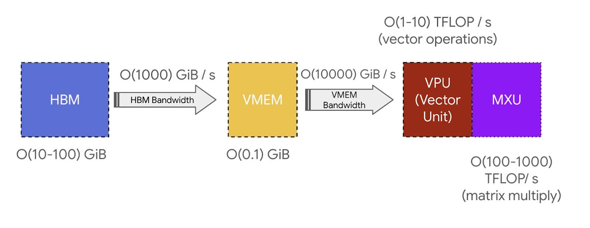
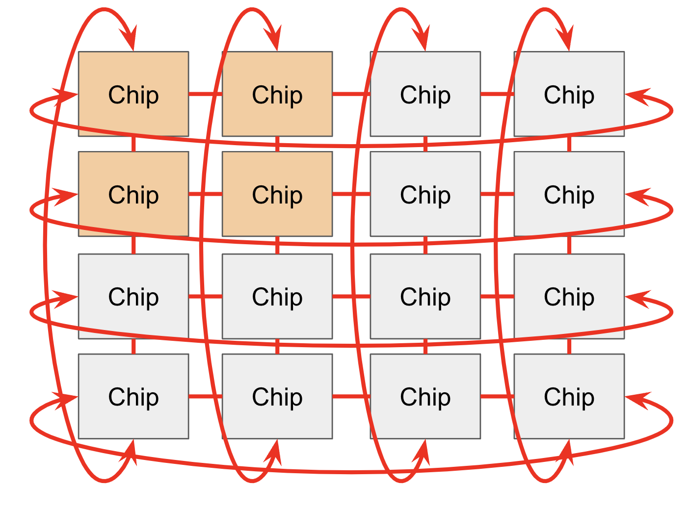
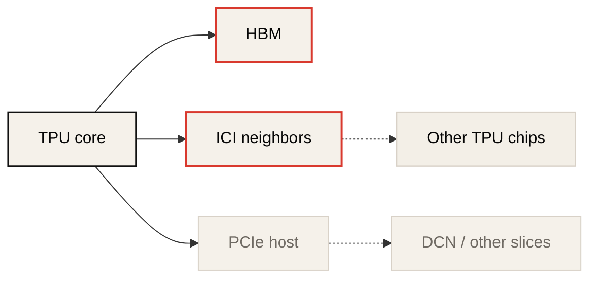

# How to Think About TPUs

> Source: [How to Think About TPUs](https://jax-ml.github.io/scaling-book/tpus/), part of *How To Scale Your Model*, published 2025-02-04.
>
> This is a Korean lecture-note adaptation, not a line-by-line full translation. The goal is to translate the hardware mental model and connect it to LLM inference and scaling notes in this repository.
>
> Figures from the JAX Scaling Book are reused under the repository's [MIT License](assets/jax-scaling-book/LICENSE).

## Reading Map

TPU를 이해하는 가장 간단한 문장은 다음이다.

> TPU는 거대한 matrix multiplication unit, 빠른 HBM, 작은 고속 scratchpad, 그리고 chip 간 interconnect를 결합한 가속기다.

GPU와 비교하면 TPU는 더 단순하고, 더 규칙적인 workload에 맞춰져 있다. 이 단순함은 강점이지만, 모든 문제에 자동으로 유리하다는 뜻은 아니다. TPU에서 성능을 내려면 HBM, VMEM, MXU, ICI, DCN의 bandwidth 계층을 함께 이해해야 한다.

## 1. TPU의 기본 구성

TPU core는 크게 세 구성 요소로 이해할 수 있다.


Source: [JAX Scaling Book, "How to Think About TPUs"](https://jax-ml.github.io/scaling-book/tpus/), MIT License. The original caption describes the TPU chip components: TensorCore, MXU, VPU, and VMEM.

| Component | Role | GPU analogy |
|---|---|---|
| MXU | matrix multiplication을 수행하는 systolic array | Tensor Core |
| VPU | activation, elementwise op, reduction 등 vector 작업 | CUDA cores / vector unit |
| VMEM | on-chip scratchpad memory | shared memory / SMEM보다 큰 local memory |

여기서 가장 중요한 것은 MXU와 VMEM이다. TPU는 HBM에 있는 tensor를 VMEM으로 가져오고, VMEM의 tile을 MXU로 흘려보내 matmul을 수행한다. 결과도 다시 VMEM을 거쳐 HBM으로 간다.

```text
HBM -> VMEM -> MXU/VPU -> VMEM -> HBM
```

이 경로의 bandwidth가 TPU 성능의 기본 한계다.

## 2. Systolic Array의 직관

Systolic array는 matrix multiplication을 위해 설계된 규칙적인 compute fabric이다. weight 또는 activation이 processing element 사이를 흐르면서 여러 번 재사용된다.

일반적인 matrix multiplication은 같은 값을 여러 번 memory에서 읽기 쉽다. Systolic array는 값을 한 번 가까운 곳으로 가져온 뒤, 배열 내부에서 재사용하게 만든다.

```text
Goal:
  data movement를 줄이고 compute unit 근처에서 값을 재사용한다.

Consequence:
  regular matmul에는 매우 강하지만, shape가 잘 맞지 않으면 padding과 utilization 문제가 생긴다.
```

TPU의 MXU는 정해진 tile shape를 가진다. 따라서 matrix dimension이 작은 경우에도 하드웨어 tile 크기에 맞추기 위해 padding이 필요할 수 있다. 이 점은 작은 batch, 작은 hidden dimension, irregular expert shape에서 중요해진다.

## 3. VMEM: TPU 성능의 핵심 Scratchpad

VMEM은 HBM보다 훨씬 작지만 MXU와 훨씬 빠르게 연결된다. 원문은 TPU를 이해할 때 VMEM을 꼭 별도 memory space로 보라고 강조한다.

| Memory | Capacity | Bandwidth intuition | Use |
|---|---|---|---|
| HBM | 크다 | 상대적으로 느리다 | weights, activations, KV cache |
| VMEM | 작다 | 매우 빠르다 | tile, temporary buffer, prefetched data |
| Registers | 매우 작다 | 가장 빠르다 | MXU/VPU 근처 operand |

VMEM에 충분히 잘 맞는 알고리즘은 낮은 arithmetic intensity에서도 compute unit을 잘 먹일 수 있다. 반대로 VMEM에 맞지 않으면 HBM bandwidth가 병목이 된다.

Week 2의 GPU memory hierarchy와 비교하면, TPU VMEM은 단순한 cache라기보다 compiler/runtime이 명시적으로 관리하는 큰 scratchpad에 가깝다.



Source: [JAX Scaling Book, "How to Think About TPUs"](https://jax-ml.github.io/scaling-book/tpus/), MIT License. This figure is used in the original article to show the bandwidth relationships among TPU memory and compute paths.

## 4. Pipeline과 Overlap

TPU matmul은 다음 작업을 겹친다.

1. HBM에서 VMEM으로 다음 tile을 가져온다.
2. VMEM에서 MXU로 현재 tile을 공급한다.
3. MXU가 systolic array에서 multiply-accumulate를 수행한다.
4. 결과 tile을 VMEM과 HBM으로 다시 보낸다.

이 pipeline이 잘 맞으면 MXU는 memory transfer를 기다리지 않고 계속 일한다. pipeline이 깨지면 TPU도 memory-bound가 된다.

이 점은 GPU의 `cp.async`, TMA, double buffering과 같은 계열의 아이디어다.

## 5. TPU Networking: ICI와 DCN

TPU는 chip 간 연결을 ICI로, 더 넓은 datacenter 연결을 DCN으로 나눠 생각한다.

| Link | Meaning | Performance intuition |
|---|---|---|
| HBM <-> TPU core | chip 내부 memory path | 가장 중요하고 빠른 local path |
| ICI | TPU chip 간 직접 연결 | slice 내부 collective에 사용 |
| PCIe | host와 TPU tray 사이 | HBM보다 훨씬 느린 host path |
| DCN | slice 또는 host 간 network | ICI보다 느린 scale-out path |

중요한 점은 ICI가 완전한 all-to-all crossbar가 아니라 topology를 가진 network라는 것이다. 멀리 있는 chip으로 가는 통신은 중간 chip을 hop해야 할 수 있다. 따라서 sharding axis와 physical topology를 맞추는 것이 중요하다.



Source: [JAX Scaling Book, "How to Think About TPUs"](https://jax-ml.github.io/scaling-book/tpus/), MIT License. The original article uses this to explain TPU ICI wraparound links and torus-style neighbor connectivity.



## 6. Roofline로 TPU 읽기

TPU 성능을 볼 때는 peak FLOPS만 보지 않는다. 다음 비율을 같이 본다.

```text
compute / HBM bandwidth
compute / ICI bandwidth
compute / DCN bandwidth
```

어떤 operation의 arithmetic intensity가 hardware ratio보다 낮으면 bandwidth-bound가 된다.

예를 들어 decode의 batch가 작으면 weight와 KV cache를 많이 읽는 데 비해 연산량이 작다. 이 경우 TPU라도 HBM bandwidth 또는 interconnect가 병목이 된다. 반대로 prefill의 큰 matmul은 충분한 batch와 sequence length가 있으면 compute-bound가 되기 쉽다.

## 7. TPU에서 낮은 정밀도

TPU도 lower precision matmul에서 더 높은 throughput을 낸다. INT8, INT4 같은 format을 지원하는 세대에서는 BF16보다 더 많은 operation을 처리할 수 있다.

그러나 lower precision은 항상 공짜가 아니다.

| Risk | What to check |
|---|---|
| Quality loss | calibration set, task metric, perplexity |
| Padding/utilization | shape가 MXU tile에 잘 맞는지 |
| VPU fallback | elementwise/reduction이 fp32 path에서 병목이 되는지 |
| Communication | 작아진 tensor가 collective bottleneck도 줄이는지 |

Week 4의 quantization과 연결하면, TPU에서 lower precision을 쓸 때도 핵심 질문은 같다.

> bytes를 줄인 이득이 dequantization, padding, fallback, communication overhead보다 큰가?

## 8. TPU와 GPU의 차이를 읽는 법

| Dimension | TPU | GPU |
|---|---|---|
| Programming model | 더 정적이고 compiler 중심 | 더 유연하고 CUDA ecosystem 중심 |
| Main compute unit | MXU systolic array | SM 안의 Tensor Core |
| Local memory | VMEM scratchpad 성격이 강함 | SMEM/L1, L2, registers, TMEM |
| Network | ICI topology가 중요 | NVLink/NVSwitch/InfiniBand 계층 |
| Strength | large regular matmul, predictable pipeline | flexibility, kernel ecosystem, broad support |

TPU를 GPU의 대체품으로만 보면 중요한 부분을 놓친다. TPU는 workload를 잘 맞추면 매우 효율적이지만, shape, sharding, topology가 성능 모델에 더 직접적으로 들어온다.

## 9. Repository Connections

| Repository topic | Connection |
|---|---|
| Week 2 hardware foundations | memory hierarchy와 roofline을 TPU 방식으로 다시 읽는다. |
| Week 3 KV cache | long-context decode가 HBM/ICI bandwidth에 어떤 압력을 주는지 이해한다. |
| Week 4 quantization | lower precision이 throughput과 bytes 양쪽에 주는 효과를 TPU에서도 검증한다. |
| AI Systems Performance Engineering Chapter 4 | topology-aware sharding, collective bandwidth, cross-host communication과 연결된다. |

## 10. Check Questions

1. TPU에서 MXU, VPU, VMEM은 각각 어떤 역할을 하는가?
2. VMEM이 HBM보다 작은데도 성능에 중요한 이유는 무엇인가?
3. Systolic array가 data movement를 줄이는 방식은 무엇인가?
4. ICI와 DCN의 차이는 무엇이며, 왜 sharding에 영향을 주는가?
5. TPU에서 lower precision을 쓸 때 성능 외에 어떤 검증이 필요한가?
