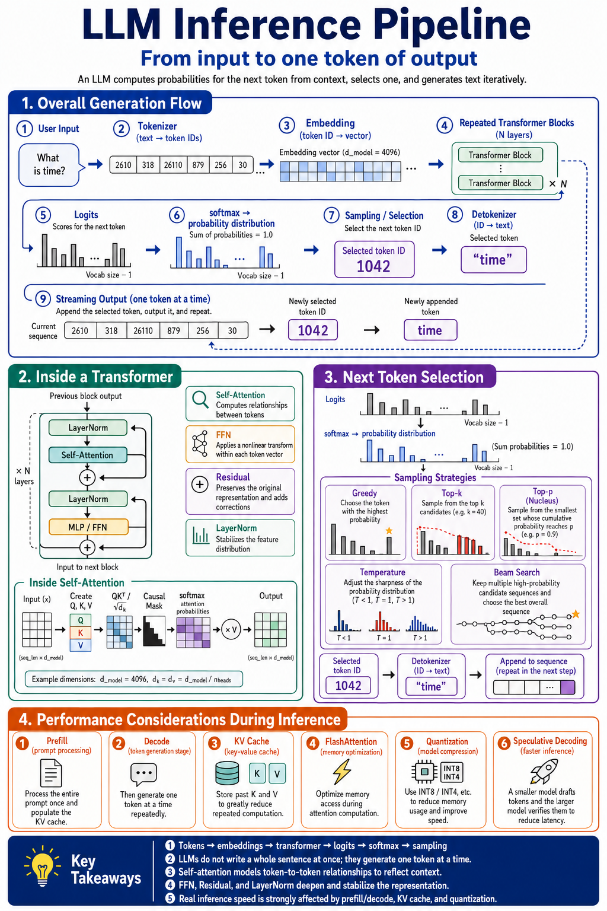

# LLM Inference

## Inference Pipeline

This diagram summarizes the end-to-end flow of decoder-only LLM inference:

1. Convert user input into token IDs with the tokenizer.
2. Add token embeddings and positional information.
3. Process the sequence through repeated Transformer blocks.
4. Project the final hidden state through the LM head to produce logits.
5. Convert logits into probabilities and select the next token using a decoding strategy.
6. Detokenize generated tokens into streamed output.
7. Repeat autoregressively until an end token or stopping condition is reached.

It also connects the high-level pipeline to the Transformer block, single-head self-attention, decoding strategies, prefill/decode behavior with KV cache, and common serving optimizations.
