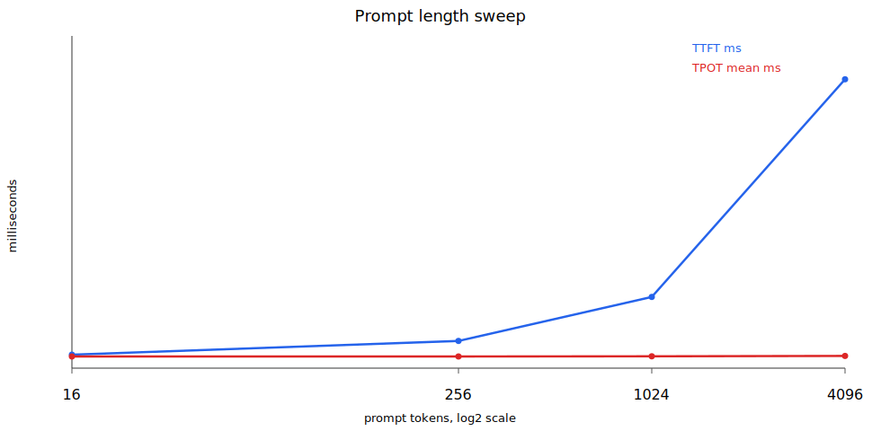
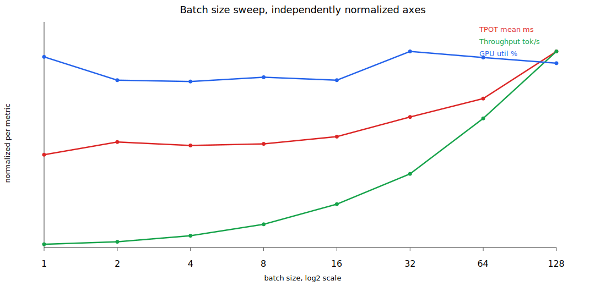

# Efficient LLM Inference Systems

## Week 1: TTFT, TPOT, Batch Throughput

This chapter measures how prompt length and batch size affect latency and throughput in decoder-only LLM inference.

The experiment uses `Qwen/Qwen2.5-3B-Instruct`. A 3B model is used instead of the original 7B model so the run fits cleanly in a 16GB VRAM environment without CPU offload.

### Run

```bash
cd /cache/Workspace/ziwon/ai-data-center-network/efficient-llm-inference-systems
HF_HOME=/data/LLM/models/hugging-face uv run python chat01/labs-01-sweep.py \
  --prompt-lengths 16,256,1024,4096 \
  --batch-sizes 1,2,4,8,16,32,64,128 \
  --batch-prompt-len 256 \
  --max-new-tokens 512 \
  --out-dir results/labs-01-sweep-512
```

The script runs two sweeps.

- Prompt length sweep: vary prompt length across `[16, 256, 1024, 4096]` tokens
- Batch size sweep: fix prompt length at 256 tokens and vary batch size across `[1, 2, 4, 8, 16, 32, 64, 128]`

The decode loop requests only the final-position logits with `logits_to_keep=1`. This avoids allocating full prompt logits during prefill, which would otherwise dominate memory use at large batch sizes.

Output files:

- [prompt_length_sweep.csv](results/labs-01-sweep-512/prompt_length_sweep.csv)
- [prompt_length_sweep.svg](results/labs-01-sweep-512/prompt_length_sweep.svg)
- [batch_size_sweep.csv](results/labs-01-sweep-512/batch_size_sweep.csv)
- [batch_size_sweep.svg](results/labs-01-sweep-512/batch_size_sweep.svg)
- [nvidia-smi dmon logs](results/labs-01-sweep-512/dmon)

### Prompt Length Sweep

Increasing prompt length makes the prefill phase longer. As a result, TTFT, or Time To First Token, grows with the number of prompt tokens.

TPOT, or Time Per Output Token, measures per-token latency during the decode phase. During decode, each token step repeatedly reads model weights, which is the dominant cost in this setup. The KV cache grows with prompt length, but its additional read cost is relatively small in this experiment. Therefore, TPOT changes very little as prompt length increases.



| Prompt tokens | TTFT ms | TPOT mean ms | Aggregate throughput tok/s |
| ---: | ---: | ---: | ---: |
| 16 | 13.9 | 12.0 | 83.5 |
| 256 | 28.0 | 12.0 | 83.3 |
| 1024 | 73.2 | 12.2 | 81.8 |
| 4096 | 297.4 | 12.5 | 79.7 |

Observations:

- TTFT grows quasi-linearly with prompt length.
- TPOT stays nearly flat, moving only from 12.0ms to 12.5ms.
- Longer prompts slightly reduce total throughput, but that effect mostly comes from including TTFT in the average rather than from decode TPOT itself.

### Batch Size Sweep

With a fixed prompt length of 256 tokens, increasing batch size lets each decode step compute the next token for multiple sequences at once. Per-token latency stays near a plateau for a while, while aggregate throughput across the batch increases substantially.

GPU utilization is sampled with `nvidia-smi dmon -s pucvmet` during each batch run.



| Batch size | TPOT mean ms | Aggregate throughput tok/s | GPU util % |
| ---: | ---: | ---: | ---: |
| 1 | 12.1 | 82.7 | 89.1 |
| 2 | 13.8 | 145.4 | 78.3 |
| 4 | 13.3 | 300.7 | 77.6 |
| 8 | 13.5 | 592.2 | 79.6 |
| 16 | 14.5 | 1107.0 | 78.3 |
| 32 | 17.0 | 1881.1 | 91.7 |
| 64 | 19.4 | 3296.7 | 88.8 |
| 128 | 25.6 | 5007.5 | 86.2 |

Observations:

- Aggregate throughput increases strongly with batch size, but the gain becomes sublinear at large batches.
- TPOT stays close to a plateau through batch size 16, then rises at batch sizes 32, 64, and 128.
- The transition region for this setup starts around batch size 64 to 128: throughput still increases, but doubling batch size from 64 to 128 only improves aggregate throughput by about 1.5x while TPOT rises from 19.4ms to 25.6ms.
- `nvidia-smi dmon` samples once per second, so short runs can be noisy, but the logs still show that the GPU remains highly utilized during batch runs.

### Memory Model and OOM Boundary

For `Qwen/Qwen2.5-3B-Instruct`, the relevant model config is:

| Field | Value |
| --- | ---: |
| Layers | 36 |
| Query heads | 16 |
| KV heads | 2 |
| Head dim | 128 |
| dtype | BF16 |

Because the model uses GQA, KV cache size is determined by the number of KV heads, not the number of query heads.

```text
KV bytes per token
= 2(K,V) * 36 layers * 2 KV heads * 128 head_dim * 2 bytes
= 36,864 bytes
= 36 KiB/token
```

For the batch sweep, prompt length is 256 and generation length is 512, so the final sequence length is about 768 tokens.

```text
batch 128, seq 768:
128 * 768 * 36 KiB = 3.375 GiB
```

The rough memory budget at batch size 128 is therefore:

```text
weights:      ~6 GiB
KV cache:     ~3.4 GiB
other costs:  activations + CUDA context + PyTorch reserved memory + temporary tensors
```

One important pitfall is logits allocation during prefill. If the model returns logits for every prompt position, the tensor can be very large:

```text
batch 128 * seq 256 * vocab 151,936 * 2 bytes
= 9.27 GiB
```

The sweep script uses `logits_to_keep=1` because greedy decoding only needs the final-position logits. Without this, batch size 128 can OOM before KV cache becomes the true limiting factor.

The measured throughput knee around batch size 64 to 128 should therefore be interpreted as the practical saturation region for this setup, not as a pure KV-cache capacity boundary. At that point, throughput still increases, but scaling becomes sublinear and TPOT rises sharply.

### Mental Model

LLM inference can be split into prefill and decode.

- Prefill: processes the full prompt in parallel. As prompt length grows, TTFT increases.
- Decode: generates one token at a time autoregressively. Each token step reads model weights, so decode is often memory-bandwidth bound.
- Batching: groups multiple requests into the same decode step. This lets the system process more tokens per weight read, increasing aggregate throughput.

The expected pattern is:

- Increasing prompt length: TTFT increases, TPOT stays nearly flat
- Increasing batch size: aggregate throughput increases, TPOT stays flat for a range and then rises once the setup approaches saturation
