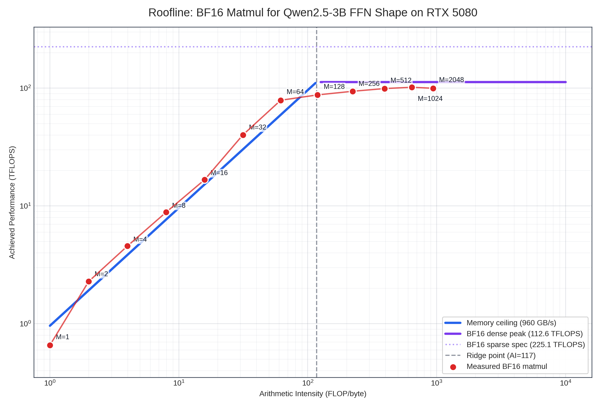

# Week 2 — Hardware Foundations for Inference

> Pre-lab summary. Read this before running the hands-on exercises.

## TL;DR

All inference optimization is one principle in disguise: **keep data in the fastest memory you can, and minimize traffic to slower memory.** Once you internalize the GPU memory hierarchy in numbers, every technique in the rest of the course (FlashAttention, kernel fusion, KV cache, paging, quantization, tensor parallelism, disaggregated serving) collapses into the same logic — just applied to different layers of that hierarchy.

## 1. GPU Memory Hierarchy (H100 SXM5)

| Level | Capacity | Bandwidth | Latency | Controlled by |
|---|---|---|---|---|
| Registers | ~256 KB / SM | >20 TB/s | ~1 cycle | compiler |
| Shared memory (L1) | 228 KB / SM | ~10 TB/s | ~20 cycles | kernel author |
| L2 cache | 50 MB | ~12 TB/s | ~150 cycles | hardware |
| HBM3 | 80 GB | 3.35 TB/s | ~600 cycles | hardware (on miss) |
| NVLink 4 (cross-GPU) | — | 900 GB/s bidi | μs | NCCL |
| PCIe gen5 (host) | — | 128 GB/s bidi | μs | driver |

**Mental model:** every order-of-magnitude drop in bandwidth is also an order-of-magnitude jump in latency. Optimization = find the layer where you're spending traffic and push it down to a faster layer.

## 2. Every Optimization, Mapped to the Hierarchy

| Technique | Traffic it removes |
|---|---|
| FlashAttention | n×n attention matrix → keep tiles in SRAM instead of HBM |
| Kernel fusion | intermediate tensors → registers/shared mem instead of HBM round-trip |
| KV cache | recomputing K,V from scratch → read once from HBM |
| Quantization (W4/W8) | fewer bytes per weight load from HBM |
| PagedAttention | KV fragmentation waste in HBM |
| Tensor parallelism | single-HBM capacity wall → spread across NVLink |
| Disaggregated serving | prefill choking decode in shared HBM → physical separation |

Different layer, same idea.

## 3. Tensor Cores and Precision

H100 SXM Tensor Core peak by format:

| Format | Dense peak | Sparse peak | Notes |
|---|---:|---:|---|
| BF16 / FP16 | ~990 TFLOPS | 1,979 TFLOPS | inference baseline |
| FP8 (E4M3) | 1,979 TFLOPS | 3,958 TFLOPS | exactly 2x BF16/FP16 |
| INT8 | 1,979 TOPS | 3,958 TOPS | same throughput as FP8 |
| FP4 | none | none | B200 adds FP4 |

Source: [NVIDIA H100 product specifications](https://www.nvidia.com/en-us/data-center/h100/) list the H100 SXM Tensor Core figures with sparsity; the dense values are half of those sparse peaks.

**Why exactly 2×:** Tensor Cores process fixed-size tiles. Halve the bit-width, fit twice as many elements in the same silicon area.

**Operational implication:**
- Decode is memory-bound → quantize **weights** (W4A16) to cut bandwidth.
- Prefill is compute-bound → quantize **compute** (W8A8 / FP8) to use the faster Tensor Core path.
- A serving system can mix both regimes (see disaggregation in Week 8).

**FP8 vs INT8** (same throughput, different properties):

| | INT8 | FP8 (E4M3) |
|---|---|---|
| Range | -128 to 127 | ±448 |
| Distribution | uniform | exponential, dense near zero |
| Outlier handling | hard (needs SmoothQuant etc.) | natural |
| Per-channel scaling | usually required | usually not |

If you're on H100+, default to FP8. INT8 is for Ampere and earlier.

## 4. H100 → B200 Shift (matters for cluster planning)

| Dim | H100 SXM | B200 SXM | What it changes |
|---|---|---|---|
| HBM | 80 GB @ 3.35 TB/s | 180 GB @ 8 TB/s | decode ~2.4× faster |
| FP8 TFLOPS (dense / sparse) | 1,979 / 3,958 | 4,500 / 9,000 | prefill compute ~2.3× faster |
| FP4 TFLOPS (dense / sparse) | none | 9,000 / 18,000 | new quantization frontier |
| NVLink | gen 4, 900 GB/s | gen 5, 1,800 GB/s | TP scaling further |

Bandwidth grew **more than** compute. This means **decode-heavy workloads benefit disproportionately on B200**. For prefill-heavy mixes, the gap is smaller. This is the exact technical reason mixed-generation clusters (H100 prefill nodes + B200 decode nodes) start to make economic sense.

Sources: [NVIDIA H100 product specifications](https://www.nvidia.com/en-us/data-center/h100/) and [NVIDIA DGX B200 specifications](https://www.nvidia.com/en-us/data-center/dgx-b200/). DGX B200 lists 72 PFLOPS FP8 Tensor Core sparse performance for 8 GPUs; dense performance is half, so per-GPU FP8 is 4.5 PFLOPS dense / 9 PFLOPS sparse.

## 5. GEMM vs GEMV — Reading Last Week's Numbers Through Hardware

Last week's batch sweep on a 3B model in 16 GB VRAM showed throughput-scaling efficiency dropping to ~47% at batch 128. Why?

**Prefill (GEMM, compute-bound).** A 3B model is too small to saturate H100's tensor cores — tile sizes don't fill, kernel-launch overhead is relatively large, FlashAttention efficiency degrades on small models. End-to-end MFU ends up around 2–5%. A 70B model on the same hardware would hit 30–50% MFU, because the work-per-launch ratio is much higher.

**Decode (GEMV, memory-bound).** Theoretical step time for a 3B BF16 model on H100: 6 GB / 3.35 TB/s ≈ 1.79 ms. Measured: ~12 ms. The gap is framework overhead — Python, sampler, kernel launches — which doesn't scale with model size. On a 70B model the same overhead becomes negligible noise.

**Takeaway:** small models on big GPUs are an inefficient match. RTX 4090 / L4 / Jetson are often the right target for ≤ 7B; H100/B200 only earn their cost on ≥ 30B or high-concurrency batched serving.

## 6. NVLink and Tensor Parallelism Communication Math

TP across N GPUs requires **two AllReduces per transformer layer** (one after attention output projection, one after FFN down projection).

Per-AllReduce traffic (BF16): `2 × batch × seq_len × d_model` bytes.

**Worked example — 70B (d_model=8192), batch=32, seq=2048, BF16:**
- Per-AllReduce: 2.15 GB
- 80 layers × 2 AllReduces = 344 GB per forward pass
- H100 NVLink-4 8-way ring, ~750 GB/s effective: ~460 ms communication

That's the same order of magnitude as compute — meaning communication is a real cost, not noise. It also means:

| Model | Practical parallelism |
|---|---|
| ≤ 7B | TP=1, scale via DP |
| 13–30B | TP=2–4 inside NVLink |
| 70B | TP=8 single-node NVLink |
| 175B+ | TP=8 + PP across nodes (PP only sends activations — InfiniBand is fine) |
| 405B+ | TP=8 + PP + DP, or expert parallelism for MoE |

**Rule of thumb:** TP stays inside NVLink/NVSwitch. PP can cross InfiniBand. DP goes anywhere.

## 7. Heterogeneous Hardware

### Apple Silicon — capacity beats bandwidth (sometimes)

| Dim | A100 80GB | M3 Ultra 192GB |
|---|---|---|
| Memory | 80 GB HBM | 192 GB unified |
| Bandwidth | 2 TB/s | 800 GB/s |
| FP16 TFLOPS | 312 | 28 |
| 70B BF16 (140 GB) | won't fit | fits comfortably |

H100 can't hold a 70B BF16 model alone; M3 Ultra can, and gets ~30 tok/s. For decode-bound workloads, **fitting** can matter more than peak FLOPS. Useful for dev laptops, on-prem demos, edge prototypes.

### Jetson Orin — the edge inference reality check

| Model | FP16 TFLOPS | Memory | Bandwidth | TDP |
|---|---|---|---|---|
| Orin Nano 8GB | 20 | 8 GB LPDDR5 | 68 GB/s | 7–15 W |
| Orin NX 16GB | 50 | 16 GB LPDDR5 | 102 GB/s | 10–25 W |
| AGX Orin 64GB | 138 | 64 GB LPDDR5 | 204 GB/s | 15–60 W |
| Thor (2025+) | ~700 (FP4) | 128 GB | ~273 GB/s | 40–130 W |

For reference: H100 SXM5 = 1,979 FP16 TFLOPS, 3.35 TB/s, 700 W.

AGX Orin is roughly 14× slower than H100 in FP16 and 16× lower in bandwidth — but ~15× cheaper and ~12× lower TDP. Per-dollar and per-watt, Orin can win, **but only if the model is small enough** (≤ 3B comfortably, 7B with INT4).

### Specialty silicon (know-of, not deploy-now)

- **Groq LPU** — SRAM-only, deterministic single-stream latency. No batching → low concurrency. Wins on hard-latency, low-QPS scenarios.
- **Cerebras WSE-3** — wafer-scale, 44 GB on-chip SRAM. If your model fits, the HBM bottleneck simply doesn't exist.

These exist as motivations: they answer "what would inference look like if we removed the HBM bottleneck entirely?"

## 8. What to Do With This Before the Lab

Before running the hands-on exercises, make sure you can answer:

- For any given GPU + model size + precision, can I estimate decode step latency in 30 seconds on a napkin?
- Why is `nvidia-smi`'s GPU-Util misleading for memory-bound decode? What should I look at instead?
- At what TP degree does NVLink communication become a meaningful fraction of forward-pass time?
- Where is the cost-efficient hardware target for a 3B model? A 70B model? A 405B model?

If any of these are still fuzzy, re-read the relevant section above. The exercises will only land if the mental model is in place first.

## 9. Lab Preview

Three exercises in increasing return on time:

1. **Roofline plot** (highest ROI, ~1 hour) — measure GEMM/GEMV across shapes, plot achieved TFLOPS vs arithmetic intensity. The roofline emerges from your own data.
2. **NCU on attention kernel** (~1 hour) — read actual achieved HBM bandwidth from Nsight Compute. Compare to what `nvidia-smi` says. Don't trust GPU-Util again.
3. **NVLink AllReduce sweep** (multi-GPU only) — measure effective bandwidth as a function of message size; find the latency-vs-bandwidth knee.

Start with #1.

---

# Lab Results

> Measurements done on RTX 5080 (Blackwell, CC 12.0, 16 GB GDDR7, ~960 GB/s, ~113 TFLOPS dense BF16 with FP32 accumulate) with Qwen2.5-3B-Instruct in BF16, varying batch and sequence length. Three exercises were run; NVLink sweep was skipped (single-GPU). Sources: [NVIDIA RTX 5080 specifications](https://www.nvidia.com/en-us/geforce/graphics-cards/50-series/rtx-5080/) and [NVIDIA RTX Blackwell GPU architecture](https://images.nvidia.com/aem-dam/Solutions/geforce/blackwell/nvidia-rtx-blackwell-gpu-architecture.pdf).

## Headline Findings

1. **`nvidia-smi` GPU-Util is misleading.** At batch=1, GPU-Util reads 89% while NCU shows the attention kernel is using 1.13% of SM throughput and 1.75% of DRAM throughput. The kernel is **launch-overhead-bound**, not memory-bound. GPU-Util only measures "is any kernel running," not "is anything productive happening."
2. **The cuBLAS kernel path changes between batch=16 and batch=32.** At batch=1, FFN matmuls dispatch to CUDA-Core GEMV (`gemvx`, 66% of CUDA time). At batch=32, they dispatch to Tensor-Core GEMM (`cutlass_..._tensorop_bf16`, 81% of CUDA time). This is not a gradual transition — it is cuBLAS choosing a different algorithm because Tensor Core tiles (16×16) only fill efficiently from M=16+.
3. **The textbook claim "decode = memory-bound" needs qualification.** What we actually see is a four-stage transition:
   - tiny batch + short seq → **launch-overhead-bound**
   - small batch + long seq → **L2 → HBM transition**
   - medium batch (16–64) → **HBM-bandwidth-bound** (the textbook regime)
   - large batch (128+) → **compute-bound** (Tensor Cores)
4. **Ridge point on this hardware is around AI ≈ 120 FLOP/byte, not the spec's 234.** The 234 figure assumed the sparse BF16 Tensor Core peak (225.1 TFLOPS). Dense BF16 with FP32 accumulate on RTX 5080 is 112.6 TFLOPS, putting the real ridge at 112.6 / 0.96 ≈ 117 FLOP/byte. Measurements deviate from the memory-ceiling at exactly M=128 (AI=119), confirming the dense peak.

## Lab 1a — Kernel Inventory (`probe_kernels.py`)

CUDA time distribution from `torch.profiler` over a few decode steps. Two snapshots, batch=1 and batch=32:

| | Batch=1 | Batch=32 |
|---|---|---|
| Top kernel | `gemvx` BF16 GEMV (47.2%, 725 calls) | `cutlass_..._tensorop_bf16` GEMM (34.4%, 432 calls) |
| #2 | `gemvx` BF16 GEMV (19.3%, 540 calls) | `cutlass_..._tensorop_bf16` GEMM (23.1%, 433 calls) |
| #3 | `cutlass_..._wmma` GEMM (14.3%, 181 calls) | `cutlass_..._tensorop_bf16` GEMM (15.2%, 432 calls) |
| Tensor-Core share of CUDA time | ~14% | ~81% |
| CUDA-Core GEMV share | ~66% | ~0% (gone) |
| FlashAttention share | 1.7% (decode) + 0.5% (prefill) | 1.2% (decode) + 2.2% (prefill) |

**Reading.** The 432-call clusters at batch=32 are the three FFN linear layers (`gate_proj`, `up_proj`, `down_proj`) of Qwen2.5's SwiGLU FFN, called once per layer per decode step. At batch=1 these collapse into GEMV calls on CUDA cores; at batch=32 they become Tensor-Core GEMMs because M=32 fills enough of a 16×16 Tensor-Core tile.

Attention is never the bottleneck in this setup. KV-cache optimizations (GQA, MLA, paging) save **memory**, not decode latency on this kind of workload.

## Lab 1b — NCU Speed-of-Light (decode steps under `cudaProfilerStart`)

The flash_fwd_kernel under NCU at two batch sizes:

| Metric | Batch=1 | Batch=32 | Multiplier |
|---|---|---|---|
| SM Busy | 1.13% | 31.5% | 28× |
| DRAM Throughput (% of peak) | 1.75% | 8.5% | 4.9× |
| Memory Throughput (GB/s) | 16.5 | 80.2 | 4.9× |
| SM Active Cycles | 340 | 10,961 | 32× |
| Elapsed Cycles | 17,643 | 20,389 | 1.16× |
| Duration (μs) | 6.78 | 7.90 | 1.16× |
| L2 Hit Rate | 77.6% | 36.9% | 0.5× |

**Reading.** This is one of the cleanest demonstrations of batching's mechanism we'll see in the course. Going from batch=1 to batch=32:

- Work scales 32×: SM Active Cycles 340 → 10,961.
- Wall-clock scales only 1.16×: Duration 6.78 → 7.90 μs.
- The fixed cost (kernel launch + teardown, roughly 17,000 cycles) was already there at batch=1; batching just added compute on top of it.
- L2 hit rate halving is the signal that KV cache no longer fits in L2 (small KV at batch=1 fits in 64 MB L2; at batch=32, ~24 MB of KV pushes some traffic to HBM).

Translation: at batch=1 the attention kernel is 98% idle (340 / 17,643 SM-active fraction). At batch=32 it is doing real work for ~54% of its wall-clock duration. That gap is exactly what continuous batching exploits.

## Lab 2 — Roofline (`roofline_benchmark.py`, FFN gate/up shape: K=2048, N=11008)

Methodology:

- Timing uses CUDA events around repeated PyTorch BF16 matmul loops, reported as the median of 5 repeats × 200 iterations after warmup.
- Wall-clock time is also recorded by the script, but TFLOPS and roofline placement use GPU event time.
- `Effective GB/s` is computed analytically from BF16 tensor sizes (`A`, `B`, `C`), not from hardware DRAM counters. Values above 960 GB/s are expected when L2/cache reuse serves part of the traffic.
- Peak references are RTX 5080 BF16 Tensor Core dense with FP32 accumulate = 112.6 TFLOPS, sparse spec = 225.1 TFLOPS, memory bandwidth = 960 GB/s.

Raw measurements from `roofline_data.json`:

| M | GPU time (μs) | Wall time (μs) | TFLOPS | %dense peak | Effective GB/s | %mem peak | AI (FLOP/byte) |
|---|---:|---:|---:|---:|---:|---:|---:|
| 1 | 68.7 | 68.8 | 0.7 | 0.6% | 656 | 68% | 1.0 |
| 2 | 39.5 | 39.6 | 2.3 | 2.0% | 1,142 | 119% | 2.0 |
| 4 | 39.6 | 39.8 | 4.6 | 4.0% | 1,142 | 119% | 4.0 |
| 8 | 40.9 | 40.9 | 8.8 | 7.8% | 1,108 | 115% | 8.0 |
| 16 | 43.3 | 44.0 | 16.7 | 14.8% | 1,052 | 110% | 15.9 |
| 32 | 36.0 | 36.1 | 40.0 | 35.6% | 1,274 | 133% | 31.4 |
| **64** | **36.6** | **37.1** | **78.8** | **70.0%** | **1,276** | **133%** | **61.7** |
| 128 | 66.0 | 67.1 | 87.5 | 77.7% | 734 | 76% | 119.2 |
| 256 | 123.0 | 123.5 | 93.9 | 83.4% | 421 | 44% | 222.9 |
| 512 | 233.1 | 233.6 | 99.0 | 88.0% | 251 | 26% | 394.9 |
| 1024 | 454.8 | 454.9 | 101.5 | 90.2% | 158 | 16% | 642.8 |
| 2048 | 927.4 | 928.8 | 99.6 | 88.4% | 106 | 11% | 936.9 |

**Reading.**

- **The plateau lands at ~100–102 TFLOPS, not 225.1 TFLOPS.** This rules out the sparse peak and confirms ~113 TFLOPS dense as the real BF16 ceiling for this PyTorch BF16 matmul. M=1024 hits 90.2% of dense peak, which is excellent for a generic PyTorch matmul.
- **Apparent bandwidth above peak (M=2 through M=64 reading 110–133% of 960 GB/s) is cache/reuse, not impossible HBM bandwidth.** `Effective GB/s` is computed from tensor sizes; in reality some of those bytes are served from L2 or reused within the GEMM kernel. NCU's `dram__bytes_read.sum` gives the true HBM number — that one stays under peak.
- **M=64 is the per-matmul efficiency sweet spot on this hardware** (highest combined memory + compute utilization). This matches Week 1's batch sweep, where batch=64 had the best balance of TPOT (19.4 ms) and throughput (3,297 tok/s) before efficiency collapsed at batch=128.
- **The measured ridge sits around AI ≈ 120,** matching dense-peak / bandwidth = 112.6 / 0.96 ≈ 117. M=128 (AI=119) is the first point clearly off the memory-ceiling line; M=256+ is unambiguously on the compute ceiling.

## Cross-References Between Labs

The three labs corroborate each other:

| Observation | Lab 1a (probe) | Lab 1b (NCU) | Lab 2 (roofline) |
|---|---|---|---|
| Batch=1 is launch-bound | GEMV dispatched (low arithmetic intensity) | SM Busy 1.13%, DRAM 1.75% | M=1 below memory ceiling |
| Tensor-Core path activates around M=16–32 | `gemvx` → `cutlass_tensorop` switch | SM Busy 1.13% → 31.5% | TFLOPS ramp from 16 → 35 → 75 |
| Memory-bound regime occupies M=2–64 | GEMV dominates at b=1; small GEMM at b=32 | DRAM utilization rising | Points sit on the memory ceiling line |
| Ridge near AI=120 | (n/a — measured by Lab 2) | (n/a) | Direct measurement: M=128 inflection |
| Compute ceiling ≈ 100 TFLOPS | (n/a) | (n/a) | M=1024 plateau at 101.5 TFLOPS |

## What This Calibrates Going Forward

Concretely, this set of measurements gives operating numbers for the rest of the course:

- **Operating batch sweet spot for Qwen2.5-3B BF16 on RTX 5080: 64.** Latency stays acceptable (TPOT 19 ms), throughput is 40× the batch=1 baseline, and per-matmul efficiency is at its peak (~70% of dense BF16 ceiling). Pushing to 128 buys throughput at a steep latency cost; beyond 128, ridge point is hit and additional batch buys little.
- **L2/cache effects matter at small batch / short sequence.** Any benchmark that reports >100% effective HBM peak bandwidth is not lying about throughput — it is using an analytic byte count, while the kernel is getting some data from cache or reuse. NCU's `dram__bytes_read.sum` is the right metric to isolate true HBM traffic.
- **Decode-latency optimization on this kind of workload should target FFN GEMM/GEMV, not attention.** Attention kernels are <3% of CUDA time. Quantizing FFN weights (W4A16) saves bytes-loaded on the actual hot path; KV-cache compression saves memory but not latency.
- **`nvidia-smi` GPU-Util is permanently retired as a diagnostic metric** for this course. Use NCU SOL throughputs (`sm__throughput.avg.pct_of_peak_sustained_elapsed`, `dram__throughput.avg.pct_of_peak_sustained_elapsed`) instead.

## Lab 3 — NVLink Sweep

Skipped: single-GPU homelab. Will revisit when running on a multi-GPU node where TP communication actually exists. The numerical model in §6 of this README still applies — the AllReduce volume calculation does not need the hardware to be sound.
