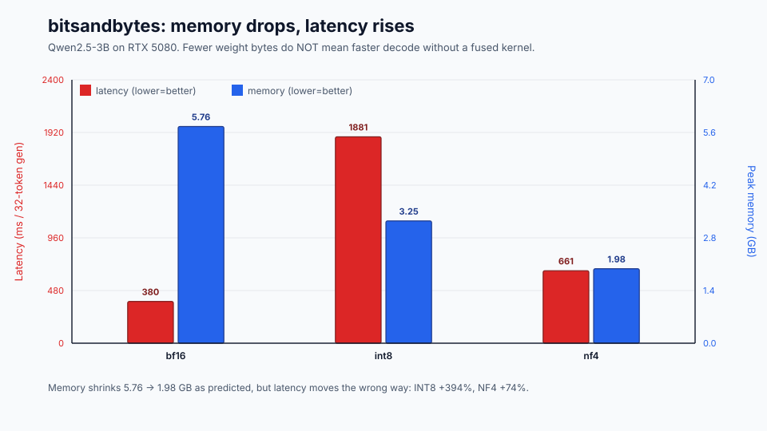
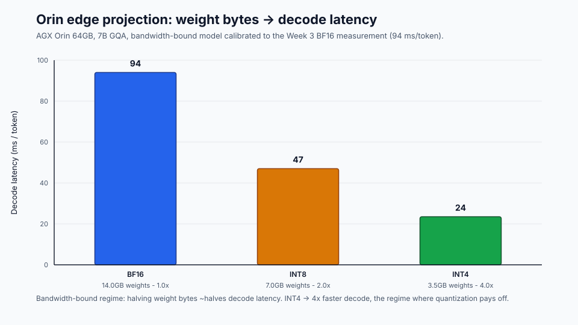

# Week 4 Lab Results

Hardware: RTX 5080 16GB (Blackwell, sm_120) · cu128 PyTorch 2.11 · bitsandbytes 0.49.2 · transformers 5.12.1
Model: Qwen/Qwen2.5-3B-Instruct

The README sketches an AWQ INT4 path. On Blackwell the prebuilt AWQ kernels are
unreliable, so the low-bit paths here use **bitsandbytes**: 8-bit (LLM.int8())
and 4-bit NF4. This substitution is the source of the most important finding
below, so read Lab 1 carefully.

The headline finding in one figure — same 4-bit width, opposite speed depending
on the kernel:

## Lab 1 — quant_compare (latency + memory, 32-token generation, batch 1)

| variant | ms/gen | peak mem | speedup vs BF16 |
|---|---|---|---|
| BF16 | 380.4 | 5.76 GB | 1.00x |
| INT8 (bnb) | 1880.9 | 3.25 GB | **0.20x (5x slower)** |
| NF4 (bnb) | 660.6 | 1.98 GB | **0.58x (1.7x slower)** |

**Memory matches the README prediction** (BF16→INT8→INT4 roughly halving and
quartering). **Latency does not** — both quantized variants are *slower* than
BF16, the opposite of the README's "INT4 40-70% faster" expectation. This is a
real and expected result, not a bug:

- The README's speedup assumed **AWQ's fused INT4 GEMM kernels**. bitsandbytes
  is optimized for *memory* (QLoRA training), not decode latency.
- **INT8 / LLM.int8()** does mixed-precision outlier decomposition (an FP16 path
  for outlier channels) on every matmul. At batch=1 this overhead dominates.
- **NF4** dequantizes back to BF16 per matmul; the dequant cost is not hidden.
- On RTX 5080 the 3B model already fits with bandwidth to spare, so the
  bandwidth *saving* from fewer weight bytes is small relative to the dequant
  *overhead*. The Week 2 "decode is bandwidth-bound" claim still holds — but the
  saving only turns into speed when the kernel is bandwidth-optimized (AWQ /
  Marlin / native FP4), which bnb is not.

**Lesson: kernel quality matters as much as bit-width.** Fewer bits guarantees
less memory; it only guarantees less latency with a fused low-bit kernel.

## Lab 1b — vllm_quant_bench (fused INT4 on Blackwell, batch 1, 32-token gen)

vLLM 0.23.0 · torch 2.11+cu130 · Triton attention backend (FlashInfer
misdetects sm_120, so `VLLM_ATTENTION_BACKEND=TRITON_ATTN`).

| variant | ms/gen | tok/s | speedup vs BF16 |
|---|---|---|---|
| BF16 | 258.6 | 123.7 | 1.00x |
| AWQ-INT4 (awq_marlin) | 121.0 | 264.5 | **2.14x faster** |

**This is the result Lab 1 was missing.** Same model, same batch=1 / 32-token
decode, but a *fused* INT4 path (AWQ + Marlin) instead of bitsandbytes:

- AWQ-INT4 is **2.14x faster** than BF16 — exceeding the README's "40-70%
  faster" expectation (which assumed exactly this AWQ kernel).
- Contrast with Lab 1 bnb on the same GPU: INT8 was 5x *slower*, NF4 1.7x
  *slower*. Same bit-widths, opposite outcome — the kernel is the difference.
- Even the BF16 baseline is faster here (259 ms) than HF `generate` in Lab 1
  (380 ms), because vLLM adds CUDA graphs + paged attention. The fair
  apples-to-apples comparison is within each engine; across both engines the
  ordering is what matters: **fused low-bit kernel → real decode speedup; bnb →
  memory win only.**

Takeaway confirmed empirically: on RTX 5080 the README's decode speedup is
reproducible, but only via a Blackwell-capable fused INT4 path (AWQ/Marlin in
vLLM), not via bitsandbytes.

## Lab 2 — perplexity_eval (WikiText-2, 100 samples)

| variant | perplexity | Δ vs BF16 |
|---|---|---|
| BF16 | 11.942 | — |
| INT8 (bnb) | 12.017 | +0.63% |
| NF4 (bnb) | 12.898 | **+8.00%** |

- INT8 is **near-lossless** (+0.63%), matching the README's "INT8 ~99%" claim.
- NF4 exceeds the README's **5% production-viability threshold** (+8%). For 4-bit
  on a 3B model, weight-only quantization without AWQ-style salient-channel
  protection visibly costs quality — consistent with the README note that
  smaller models (≤7B) need the better PTQ algorithms.

## Lab 3 — orin_quant_projection (bandwidth-bound model, no GPU)

| precision | weight | ms/token | 16-tok decode | speedup |
|---|---|---|---|---|
| BF16 | 14 GB | 94 | 1.50 s | 1.0x |
| INT8 | 7 GB | 47 | 0.75 s | 2.0x |
| INT4 | 3.5 GB | 23.5 | 0.38 s | 4.0x |

Calibration scale (measured/theoretical) = 1.34; the BF16 row reproduces the
Week 3 measurement exactly. INT4 projects a 4x decode speedup *on Orin*, where
the model is genuinely bandwidth-bound and memory-constrained — the regime where
quantization pays off, unlike the desktop RTX 5080 in Lab 1.

## Takeaway

The two latency results tell opposite stories on purpose:
- **Lab 1 (RTX 5080, bnb):** model fits, fast bandwidth, no fused kernel →
  quantization saves memory but *costs* latency.
- **Lab 3 (Orin, projected):** model bandwidth-bound and memory-tight →
  quantization is the difference between feasible and not, and 4x faster decode.

Quantization choice is hardware- and kernel-dependent, not just a bit count.
This is now confirmed both ways on the same RTX 5080: bitsandbytes INT8/NF4 are
*slower* than BF16 (Lab 1), while AWQ-INT4 via vLLM's Marlin kernel is **2.14x
faster** (Lab 1b). The README's decode speedup is real — it just requires a
Blackwell-capable fused low-bit kernel, not bitsandbytes.
