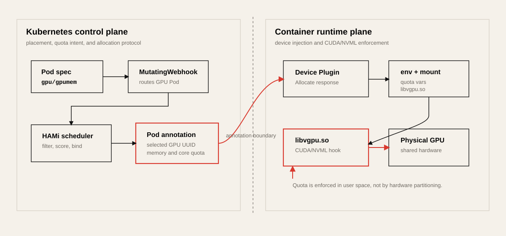
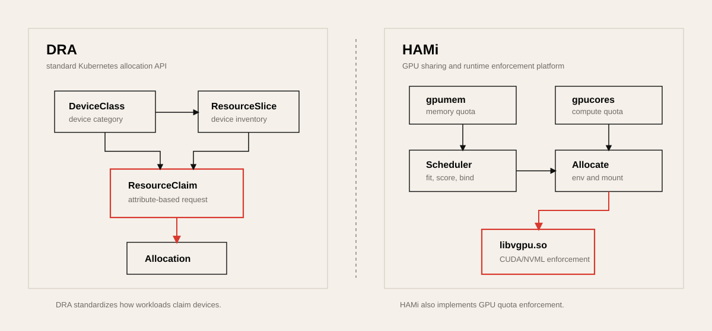

# DRA와 HAMi로 보는 Kubernetes GPU 분할

Kubernetes에서 GPU를 나누어 쓰는 문제는 두 가지 질문이 섞여 있다.

첫째, “어떤 GPU를 어떤 Pod에 줄 것인가?” 둘째, “한 GPU 안에서 메모리와
연산 사용량을 실제로 어떻게 제한할 것인가?” Dynamic Resource Allocation,
즉 DRA는 첫 번째 질문을 Kubernetes 표준 API로 풀려는 시도에 가깝다. HAMi는
두 번째 질문까지 포함해 실제 GPU sharing 플랫폼으로 동작하는 구현체에 가깝다.

```text
DRA  = Kubernetes가 장치를 더 똑똑하게 고르는 표준 allocation API
HAMi = GPU memory/core sharing, scheduling, runtime enforcement를 포함한 운영 플랫폼
```

이 차이를 놓치면 “DRA가 있으니 HAMi는 필요 없는가?” 같은 질문이 쉽게 생긴다.
정확한 답은 그렇지 않다는 것이다. DRA는 vGPU를 자동으로 만들어 주지 않는다.
DRA driver나 backend가 장치 inventory를 올리고, claim을 해석하고, 실제 runtime
제한을 구현해야 한다. HAMi는 그 backend 역할의 상당 부분을 이미 Device Plugin,
Scheduler Extender, admission webhook, `libvgpu.so`로 구현해 둔 프로젝트다.

## 기존 Device Plugin의 한계

Kubernetes Device Plugin 모델은 GPU를 클러스터 자원으로 노출하는 데 성공했지만,
기본 표현력은 “몇 개”에 가깝다.

```yaml
resources:
  limits:
    nvidia.com/gpu: 1
```

이 모델만으로는 다음 요구를 자연스럽게 표현하기 어렵다.

| 필요한 판단 | Device Plugin 기본 모델의 한계 |
| --- | --- |
| VRAM이 24GiB 이상인 GPU 선택 | scheduler가 device attribute를 표준 방식으로 보지 못함 |
| H100 또는 A100만 선택 | vendor별 annotation이나 scheduler extender가 필요 |
| NVLink/topology 조건 반영 | 기본 resource count만으로는 부족 |
| 특정 MIG profile 선택 | 별도 plugin 정책이나 custom resource가 필요 |
| 여러 Pod가 같은 claim을 공유 | per-container device request 중심이라 표현이 약함 |

그래서 많은 GPU 플랫폼은 Node annotation, scheduler extender, admission webhook,
custom resource를 조합해 장치 정보를 보완해 왔다. HAMi도 이 계열에 속한다.

## DRA가 표준화하려는 것

DRA는 Kubernetes가 장치를 “정수 개수”가 아니라 “속성을 가진 claim 대상”으로
다루게 만든다. 공식 Kubernetes 문서 기준으로 DRA core는 `resource.k8s.io/v1`
API group의 `DeviceClass`, `ResourceClaim`, `ResourceClaimTemplate`,
`ResourceSlice`를 사용하며, 현재 문서는 Kubernetes v1.35에서 stable로 표시한다.

핵심 객체는 다음처럼 볼 수 있다.

| 객체 | 의미 |
| --- | --- |
| `DeviceClass` | 클러스터 관리자가 제공하는 장치 종류. 예: `h100-highmem`, `cost-optimized-gpu` |
| `ResourceClaim` | workload가 요구하는 장치 claim |
| `ResourceClaimTemplate` | Deployment/Job처럼 Pod마다 독립 claim이 필요할 때 쓰는 template |
| `ResourceSlice` | DRA driver가 API server에 올리는 실제 node/device inventory |

사용자는 “GPU 1개” 대신 “이 class에 속하고, 이 attribute 조건을 만족하는 장치”를
요청할 수 있다. 예를 들면 다음과 같은 식이다.

```yaml
apiVersion: resource.k8s.io/v1
kind: ResourceClaimTemplate
metadata:
  name: h100-inference
spec:
  spec:
    devices:
      requests:
      - name: gpu
        exactly:
          deviceClassName: h100-highmem
```

이 모델의 장점은 표준성이다. GPU뿐 아니라 NPU, FPGA, DPU, SmartNIC 같은 장치를
같은 API family 안에서 다룰 수 있다. 장기적으로 플랫폼 API를 새로 설계한다면,
사용자에게 vendor-specific annotation을 직접 노출하기보다 DRA-style claim
모델을 고려하는 편이 맞다.

하지만 DRA 자체가 GPU memory quota를 강제하거나, SM 사용량을 throttle하거나,
CUDA 호출을 가로채지는 않는다. DRA는 allocation API이고, enforcement는 driver와
backend의 책임이다.

## HAMi가 실제로 하는 일

HAMi는 GPU를 Kubernetes에서 더 작은 단위로 공유하기 위해 여러 확장 지점을 함께
쓴다.



사용자는 기존 Kubernetes resource limit에 가까운 문법으로 요청한다.

```yaml
resources:
  limits:
    nvidia.com/gpu: 1
    nvidia.com/gpumem: 12000
    nvidia.com/gpucores: 40
```

HAMi의 non-MIG 경로를 단순화하면 다음 순서다.

1. Device Plugin이 물리 GPU 하나를 여러 logical GPU slot처럼 kubelet에 광고한다.
2. Scheduler Extender가 node annotation에 있는 GPU memory, core, model, health
   정보를 보고 Pod를 배치한다.
3. 선택 결과를 Pod annotation으로 남긴다.
4. Device Plugin의 `Allocate`가 annotation을 읽고 컨테이너에 device, env,
   mount를 주입한다.
5. 컨테이너 안의 `libvgpu.so`가 CUDA/NVML 호출 경로를 hook해 VRAM quota와
   compute 제한을 적용한다.

핵심은 마지막 단계다. HAMi의 소프트웨어 기반 GPU sharing은 MIG처럼 하드웨어를
물리적으로 나누는 것이 아니다. Kubernetes control plane에서는 replica ID와
annotation으로 “나뉜 것처럼” 보이게 하고, runtime에서는 `libvgpu.so`가
CUDA/NVML 경로를 가로채어 제한을 집행한다.

## HAMi 구현 경로를 조금 더 자세히 보면

HAMi를 “GPU를 쪼개는 도구”라고만 설명하면 중요한 부분이 빠진다. 실제 구현은
Kubernetes control plane과 컨테이너 내부 runtime hook이 서로 약속한 protocol로
이어진 구조다. control plane은 어떤 Pod가 어느 물리 GPU의 어느 logical slot을
쓸지 정하고, runtime plane은 컨테이너 안에서 그 quota를 강제한다.

| 계층 | 대표 모듈 | 하는 일 |
| --- | --- | --- |
| 설정 | `cmd/device-plugin/nvidia/vgpucfg.go` | `deviceSplitCount`, memory/core scaling, core limit 비활성화 같은 옵션을 정의 |
| admission | `pkg/scheduler/webhook.go` | GPU 자원을 요청한 Pod를 감지하고 HAMi scheduler 경로로 보냄 |
| scheduler cache | `pkg/scheduler/scheduler.go`, `pkg/scheduler/nodes.go` | Node annotation과 Pod allocation 상태를 모아 global GPU view를 유지 |
| scheduler policy | `pkg/scheduler/score.go`, `pkg/scheduler/policy/*` | node/device fit, binpack/spread score, memory/core fragmentation을 계산 |
| device model | `pkg/device-plugin/nvidiadevice/nvinternal/rm/devices.go` | 물리 GPU와 replica ID, memory, NUMA, health 정보를 다룸 |
| allocation | `pkg/device-plugin/nvidiadevice/nvinternal/plugin/server.go` | kubelet `Allocate` 요청에 device, env, mount를 응답 |
| runtime hook | `libvgpu` / `HAMi-core` | CUDA/NVML API를 hook해 memory quota와 compute limit을 적용 |
| dynamic MIG | NVIDIA MIG 관련 manager와 `mig-parted` 연동 | soft slicing 대신 hardware MIG instance를 조정 |

이 표에서 가장 중요한 경계는 scheduler와 device plugin 사이에 있다. Kubernetes
scheduler가 일반적으로 device plugin의 세부 device 선택 결과를 풍부하게 전달하지
못하기 때문에, HAMi는 Pod annotation을 내부 protocol처럼 사용한다. Scheduler는
“이 Pod는 이 GPU UUID에 얼마만큼의 memory/core를 써야 한다”는 결정을 annotation에
남기고, device plugin은 kubelet의 `Allocate` 시점에 그 annotation을 읽어 실제
container response를 만든다.

즉 HAMi의 control plane은 다음 세 가지를 동시에 해결한다.

| 문제 | HAMi의 처리 |
| --- | --- |
| Kubernetes에는 GPU 개수만 보이는 문제 | Device Plugin이 logical replica 수를 늘려 광고 |
| scheduler가 VRAM/core 잔여량을 모르는 문제 | Node annotation에 device inventory와 사용량을 유지 |
| kubelet allocation 단계에 quota 정보가 부족한 문제 | Pod annotation으로 scheduler 결정 결과를 device plugin에 전달 |

이 구조는 실용적이지만, 표준 API만으로 닫힌 모델은 아니다. DRA가 장기적으로
매력적인 이유도 여기에 있다. DRA의 `ResourceSlice`와 `ResourceClaim`은 이런
annotation protocol을 Kubernetes API 안으로 더 표준화하려는 방향이다.

## 스케줄링은 count가 아니라 fragmentation 문제다

HAMi scheduler가 보는 핵심 자원은 단순한 `nvidia.com/gpu` 개수가 아니다.
각 GPU마다 남은 logical slot, memory, core 비율이 있고, 정책은 이를 기준으로
node와 device를 고른다.

예를 들어 80GB GPU 한 장을 10개 logical slot으로 광고하더라도, 모든 slot이 같은
상태는 아니다. 어떤 Pod는 4GB만 쓰고, 어떤 Pod는 40GB를 쓰며, 어떤 Pod는 core
100%를 요구할 수 있다. 그러면 scheduler가 풀어야 하는 문제는 “남은 slot 수”가
아니라 다음에 가깝다.

```text
이 Pod의 gpumem/gpucores 요청을 넣었을 때
어느 node와 어느 physical GPU의 fragmentation이 가장 덜 나빠지는가?
```

HAMi의 binpack/spread 정책은 이 판단을 바꾼다.

| 정책 | 직관 | 적합한 상황 |
| --- | --- | --- |
| `binpack` | 이미 사용 중인 GPU나 node에 더 채워 넣음 | 빈 GPU/node를 남겨 큰 job을 받을 가능성을 높이고 싶을 때 |
| `spread` | 여러 GPU나 node에 분산 | neighbor contention과 thermal/power hotspot을 줄이고 싶을 때 |

이 때문에 HAMi를 도입할 때는 “logical GPU가 몇 개 생겼다”보다 “작은 Pod들이
memory/core fragmentation을 어떻게 만드는가”를 봐야 한다. 작은 inference Pod를
무작정 많이 올리면 평균 utilization은 좋아질 수 있지만, 나중에 큰 model을 띄울
연속 VRAM이 없어지는 상황이 생긴다. 이 문제는 Kubernetes CPU scheduling의
fragmentation과 비슷하지만, GPU에서는 VRAM이 더 직접적인 hard limit으로 작동한다.

## Device Plugin `Allocate`가 주입하는 것

HAMi의 실제 enforcement는 kubelet이 device plugin의 `Allocate`를 호출한 뒤부터
시작된다. 이때 device plugin은 컨테이너에 GPU device file만 넘기는 것이 아니라,
HAMi runtime이 동작하는 데 필요한 환경변수와 mount를 함께 넣는다.

대표적으로 중요한 값은 다음과 같다.

| 주입 항목 | 의미 |
| --- | --- |
| `CUDA_DEVICE_MEMORY_LIMIT_<index>` | 컨테이너가 해당 logical GPU에서 볼 memory quota |
| `CUDA_DEVICE_SM_LIMIT` | `gpucores` 요청에서 온 compute quota |
| `CUDA_OVERSUBSCRIBE` | oversubscription 설정이 켜졌는지 runtime에 전달 |
| `LIBCUDA_LOG_LEVEL` | HAMi-core logging level |
| `libvgpu.so` mount | CUDA/NVML 호출을 hook하는 runtime library |
| shared cache/lock directory | 여러 프로세스의 accounting과 초기화 동기화에 사용 |

이 주입 방식 때문에 HAMi는 application code 변경 없이 동작할 수 있다. 사용자는
PyTorch, vLLM, TensorFlow 코드를 고치지 않아도 되고, 컨테이너 시작 시 동적 링커와
CUDA driver API 경로에서 HAMi-core가 먼저 개입한다.

동시에 이것이 한계이기도 하다. enforcement가 하드웨어 register나 GPU firmware의
독립 partition에서 생기는 것이 아니라, 사용자 공간 library hook에 기대기 때문이다.
따라서 HAMi non-MIG의 quota는 운영상 유용한 제한이지만, security boundary로
해석하면 안 된다.

## `libvgpu.so`가 제한하는 방식

HAMi-core는 CUDA/NVML 호출 경로를 가로채서 두 종류의 illusion을 만든다.

첫째, 관측 illusion이다. 컨테이너 안에서 `nvidia-smi`나 NVML memory query를 했을
때 물리 GPU 전체 VRAM이 아니라 quota에 맞춘 값이 보이게 할 수 있다. 사용자는
“내 GPU는 12GB”처럼 느끼지만, 실제로는 80GB 물리 GPU의 일부를 쓰는 것이다.

둘째, allocation enforcement다. `cuMemAlloc_v2`, `cuMemAllocManaged`,
`cuMemoryAllocate` 같은 메모리 할당 경로 앞에서 현재 사용량과 quota를 비교하고,
초과하면 CUDA OOM에 가까운 실패를 돌려준다. 이 방식은 memory quota에는 비교적
직관적으로 맞는다. 할당 요청은 discrete event라서 pre-check와 accounting을 붙이기
쉽기 때문이다.

compute 제한은 더 미묘하다. SM을 하드웨어적으로 자르는 것이 아니라 kernel launch,
utilization sampling, token/throttling 계열의 정책으로 장기 평균 사용량을 맞추는
방식에 가깝다. 그래서 `gpucores: 40`은 “SM 40%가 이 Pod에 독점 배정된다”가 아니다.
더 정확히는 “HAMi runtime이 이 workload의 장기 compute 사용량을 40% 근처로 제한하려
한다”에 가깝다.

이 차이는 latency-sensitive inference에서 중요하다.

| 자원 | 제한 성격 | 관찰해야 할 metric |
| --- | --- | --- |
| VRAM | quota 초과 allocation을 비교적 명확히 차단 | allocation failure, model load failure, peak memory |
| compute | soft throttling과 scheduling 영향이 큼 | throughput, p95/p99 latency, neighbor workload 영향 |
| PCIe/NVLink | HAMi quota로 직접 분리되지 않음 | H2D/D2H copy time, NCCL latency, DMA contention |
| L2/cache/memory bandwidth | soft slicing으로 강하게 분리하기 어려움 | kernel time variance, achieved bandwidth, tail latency |

따라서 HAMi를 “VRAM slicing”으로 쓰는 경우와 “compute isolation”까지 기대하는
경우는 검증 강도가 달라야 한다.

## dynamic MIG는 같은 제품 안의 다른 backend다

HAMi가 MIG를 언급한다고 해서 non-MIG `libvgpu.so` slicing과 MIG가 같은 격리 모델이
되는 것은 아니다. 둘은 같은 운영 프레임워크 안에 들어올 수 있지만, 분할이 생기는
위치가 다르다.

```text
HAMi non-MIG:
Kubernetes replica + annotation + libvgpu.so hook

HAMi dynamic MIG:
HAMi control plane + MIG profile/instance 조정 + hardware partition
```

MIG 지원 GPU에서는 hardware GPU instance가 만들어지므로, fault isolation과 resource
predictability가 non-MIG soft slicing보다 강하다. 대신 profile 단위가 고정적이고,
동적으로 재구성할 때 기존 workload 배치, drain, profile 전환 비용을 고려해야 한다.

운영적으로는 다음처럼 구분하는 편이 명확하다.

| 요구 | 더 자연스러운 backend |
| --- | --- |
| 4GB, 8GB처럼 아주 세밀한 SKU를 많이 만들고 싶음 | HAMi non-MIG |
| 같은 조직 내부의 개발/추론 workload를 높은 utilization으로 섞고 싶음 | HAMi non-MIG |
| tenant 간 장애 전파와 성능 간섭을 강하게 줄이고 싶음 | MIG |
| A100/H100에서 profile 기반 slicing을 자동화하고 싶음 | HAMi dynamic MIG |
| VM 상품이나 외부 고객 보안 경계가 중요함 | vGPU/SR-IOV 계열 |

## DRA와 HAMi의 차이

| 관점 | DRA | HAMi |
| --- | --- | --- |
| 성격 | Kubernetes 표준 API/framework | GPU sharing 구현체/운영 플랫폼 |
| 핵심 목적 | attribute 기반 device allocation | GPU memory/core 단위 sharing과 scheduling |
| 실제 VRAM 제한 | DRA 자체는 하지 않음 | `libvgpu.so` hook으로 제한 |
| compute 제한 | DRA 자체는 하지 않음 | `gpucores` 기반 soft throttling |
| scheduler 통합 | kube-scheduler와 표준 API로 통합 | scheduler extender와 annotation 중심 |
| 사용자 경험 | `ResourceClaim`, `DeviceClass` | `nvidia.com/gpumem`, `nvidia.com/gpucores` |
| multi-vendor 방향 | 표준 API로 적합하나 driver 생태계 필요 | 여러 accelerator backend를 직접 품는 방향 |
| oversubscription | DRA 자체 기능 아님 | HAMi의 주요 기능 중 하나 |
| 격리 강도 | backend에 따라 다름 | non-MIG는 software hook 기반이라 보안 경계로는 약함 |

따라서 둘은 경쟁 관계라기보다 계층이 다르다. DRA는 앞으로 Kubernetes가 장치를
표현하고 claim하는 표준 언어가 될 가능성이 높고, HAMi는 그 위나 옆에서 실제
GPU sharing과 enforcement를 제공하는 backend/platform 역할을 한다.

HAMi 프로젝트도 이 흐름을 의식하고 있다. HAMi-DRA 하위 프로젝트는 기존 HAMi
사용자가 Device Plugin 기반 요청에서 DRA 기반 요청으로 이동할 수 있게 하는
전환 경로로 볼 수 있다. 다만 현재 운영 관점에서는 기존 HAMi resource model이
더 직접적이고, 이미 SKU, quota, billing, RBAC와 연결하기 쉽다.



## 클라우드 사업자가 HAMi를 먼저 쓸 이유

클라우드나 사내 AI 플랫폼에서 원하는 것은 보통 다음과 같다.

```text
80GB GPU 한 장을
4GB / 8GB / 16GB / 40GB 같은 상품 또는 quota 단위로 나누고 싶다.
```

또는:

```text
작은 inference workload 여러 개를 한 GPU에 올리되,
각 Pod가 자기 VRAM quota 이상을 쓰지 못하게 하고 싶다.
```

DRA만으로는 이 결과가 바로 나오지 않는다. DRA-compatible driver가 logical
device나 consumable capacity를 표현하고, runtime 제한까지 구현해야 한다. HAMi는
이 운영 모델을 이미 `gpumem`, `gpucores`, scheduler, `libvgpu.so`로 제공한다.

DaoCloud의 CNCF case study는 이 선택의 실무적 이유를 잘 보여 준다. 공개 사례에
따르면 DaoCloud는 D.run Compute Cloud와 DaoCloud Enterprise에서 HAMi를 사용해
10,000장 이상의 GPU capacity를 10개 이상의 데이터센터에 걸쳐 운영했고, vGPU
도입 후 평균 GPU utilization 80% 이상과 GPU 관련 운영 비용 20-30% 절감을
보고했다. 또한 vGPU slice를 marketplace SKU로 노출하고, quota/RBAC를 vGPU
수준에 통합했다.

이 관점에서는 다음 구분이 중요하다.

```text
DRA ResourceClaim = 좋은 Kubernetes API
HAMi gpumem/gpucores = 바로 SKU화하기 쉬운 운영 단위
```

## HAMi, MIG, time-slicing, MPS, vGPU의 위치

GPU sharing 기술을 고를 때는 “무엇을 쪼개는가”보다 “어디에서 격리가 생기는가”를
봐야 한다.

| 접근 | 분할 위치 | 격리 강도 | 적합한 경우 |
| --- | --- | --- | --- |
| HAMi non-MIG | Kubernetes + user-space CUDA/NVML hook | 중하 | 같은 신뢰 경계 안의 inference, notebook, batch inference |
| HAMi dynamic MIG | HAMi가 MIG 구성을 동적으로 조정 | 높음 | MIG 지원 GPU에서 hardware partition과 자동화를 함께 원할 때 |
| NVIDIA MIG | GPU hardware instance | 높음 | tenant isolation, 예측 가능성, fault isolation이 중요할 때 |
| NVIDIA time-slicing | 시간 분할 oversubscription | 낮음 | 짧은 burst workload, 간단한 공유 |
| MPS | CUDA process 동시 실행 최적화 | 낮음-중 | 동일 신뢰 경계의 HPC/멀티프로세스 workload |
| NVIDIA vGPU/SR-IOV 계열 | hypervisor/VF/vGPU manager | 높음 | VM 기반 강한 보안 경계와 상품화 |

HAMi non-MIG를 보안 경계로 이해하면 위험하다. 컨테이너 내부에 물리 device와
hook library를 주입하고, CUDA/NVML 호출 경로에서 제한을 적용하는 구조이기
때문이다. 활용률 개선에는 강하지만, 악의적 tenant를 서로 격리하는 hard boundary로
보려면 MIG, vGPU, SR-IOV 계열을 검토해야 한다.

## 운영상 주의할 점

첫째, oversubscription은 queueing 보장이 아니다. HAMi 설정에서 logical capacity를
늘릴 수 있어도, 물리 VRAM이 부족한 순간 workload가 graceful waiting을 하는지,
OOM으로 실패하는지는 별도로 검증해야 한다. 실제 HAMi issue #1128에는
`deviceSplitCount`, `deviceMemoryScaling`, `deviceCoreScaling`을 크게 잡은 상태에서
물리 VRAM 여유가 부족하자 `cuMemoryAllocate failed`와 OOM이 발생한 사례가 올라와
있다. 이 사례가 보여 주는 핵심은 “10배 virtual capacity”가 “10배 workload를
queueing해서 언젠가 실행”한다는 뜻은 아니라는 점이다.

둘째, 동시 기동 지연을 측정해야 한다. HAMi-core는 컨테이너 내부 초기화와
accounting을 위해 공유 파일, lock, background watcher를 사용한다. 수백 개
프로세스가 동시에 `cuInit`을 호출하는 고밀도 inference 환경에서는 startup
latency가 병목이 될 수 있다. issue #1662에는 40-50개 Pod, Pod당 4-5개 child
process, 노드당 200-300개 수준의 동시 CUDA 초기화에서 `libvgpu.so` 초기화 lock
경쟁으로 약 1분 수준 지연이 관찰되었다는 보고가 있다. 최신 코드에서 lock 구현은
바뀔 수 있지만, 노드 단위 공유 accounting과 초기화 직렬화 지점이 성능 병목이 될 수
있다는 구조적 경고로는 여전히 유효하다.

셋째, `gpucores`는 하드웨어 SM partition과 같은 뜻이 아니다. HAMi의 compute 제한은
soft throttling에 가깝고, 짧은 burst나 kernel 특성에 따라 체감 isolation이 달라질
수 있다. throughput 평균뿐 아니라 p95/p99 latency와 neighbor workload 영향을 같이
봐야 한다.

넷째, DRA 전환은 API 전환만이 아니다. Kubernetes control plane 버전, scheduler와
kubelet feature gate, DRA driver, quota/RBAC/billing 연동, 사용자 교육이 모두
필요하다. 기존 HAMi 운영 환경에서는 DRA가 장기 방향이어도 당장 migration 비용이
작지 않다.

다섯째, observability를 먼저 정해야 한다. HAMi를 비용 절감이나 utilization 개선
목적으로 도입하면 평균 GPU utilization만 보기 쉽다. 하지만 실제 운영 판단에는
다음 지표가 같이 필요하다.

| 지표 | 이유 |
| --- | --- |
| Pod별 requested/used VRAM | quota가 너무 크거나 작은 SKU를 찾기 위해 필요 |
| model load 실패율 | memory quota가 실제 workload shape와 맞는지 확인 |
| p95/p99 latency | neighbor contention이 사용자 경험에 미치는 영향 확인 |
| startup latency | `libvgpu.so` 초기화와 lock contention 영향 확인 |
| GPU memory bandwidth / copy time | VRAM quota 밖의 병목을 찾기 위해 필요 |
| scheduler pending reason | fragmentation과 quota 부족을 구분하기 위해 필요 |

여섯째, failure mode를 사용자에게 숨기면 안 된다. full GPU allocation에서는 실패가
비교적 단순하다. GPU가 없으면 Pending이고, memory가 부족하면 application OOM이다.
HAMi에서는 logical slot, gpumem, gpucores, physical free memory, hook initialization,
annotation race, device health가 모두 끼어든다. 플랫폼 문서에는 최소한 “Pending”,
“allocation 실패”, “container 시작 후 CUDA OOM”, “startup 지연”을 서로 다른
troubleshooting path로 분리해 두는 것이 좋다.

## 선택 기준

| 상황 | 우선 고려 |
| --- | --- |
| 신규 Kubernetes 1.35+ 플랫폼이고 장기 표준 API가 중요함 | DRA-first 설계 |
| GPU 외 NPU, FPGA, DPU까지 같은 claim model로 관리하고 싶음 | DRA |
| 지금 바로 GPU memory/core SKU를 만들고 utilization을 올려야 함 | HAMi |
| inference Pod 여러 개를 한 GPU에 올리고 quota를 걸고 싶음 | HAMi non-MIG |
| tenant 간 강한 격리와 fault isolation이 중요함 | MIG, vGPU, SR-IOV |
| H100/A100에서 hardware partition 자동화가 필요함 | MIG 또는 HAMi dynamic MIG |
| 짧은 burst workload를 단순히 더 많이 올리고 싶음 | NVIDIA time-slicing |
| 같은 job 내부의 여러 CUDA process 동시성이 핵심임 | MPS |

결론은 간단하다. DRA는 Kubernetes의 장치 할당 언어를 바꾸는 표준화 작업이고,
HAMi는 GPU를 실제로 공유하고 제한하는 운영 시스템이다. 장기적으로는 DRA 기반의
표준 API 위에 HAMi 같은 backend가 붙는 형태가 자연스럽다. 하지만 현재 GPU cloud나
사내 inference platform을 운영해야 한다면, “표준 API가 있는가”보다 “사용자에게
나눠 팔거나 나눠 배정한 GPU slice가 실제로 제한되는가”가 먼저다. 그 지점에서
HAMi의 실용성이 나온다.

## 검증 체크리스트

HAMi를 도입하거나 평가할 때는 최소한 다음 항목을 확인해야 한다.

| 검증 항목 | 확인할 것 |
| --- | --- |
| replica 노출 | `deviceSplitCount`만큼 logical GPU가 allocatable로 보이는가 |
| memory quota | `gpumem` 초과 allocation이 일관되게 차단되는가 |
| compute quota | `gpucores` 값이 장기 평균 utilization과 latency에 반영되는가 |
| neighbor 영향 | 같은 GPU의 다른 Pod가 p95/p99 latency를 얼마나 흔드는가 |
| oversubscription 실패 | 물리 VRAM 부족 시 대기, 재시도, 실패 중 무엇이 발생하는가 |
| 동시 기동 | 수십-수백 process 동시 `cuInit`에서 startup latency가 허용 가능한가 |
| 보안 경계 | 신뢰하지 않는 tenant에 non-MIG HAMi를 노출하지 않는 정책이 있는가 |
| quota/RBAC | vGPU 단위 quota와 부서/tenant 권한 모델이 맞물리는가 |
| observability | Pod별 GPU memory/utilization metric을 과금/운영 지표로 쓸 수 있는가 |
| migration | DRA, HAMi-DRA, MIG, GPU Operator와의 장기 호환 계획이 있는가 |

## 더 깊게 파려면 분리할 글

이 글은 DRA와 HAMi의 위치를 비교하는 아티클이다. 원래 분석 메모에 있던 코드 수준
내용을 모두 넣으면 글의 초점이 흐려진다. 대신 다음 글로 분리하면 좋다.

| 후속 글 | 다룰 내용 |
| --- | --- |
| HAMi scheduler deep dive | `fitInDevices`, binpack/spread scoring, Node annotation protocol |
| HAMi-core deep dive | `libvgpu.so`, CUDA/NVML hook, memory accounting, lock contention |
| HAMi vs MIG benchmark | 같은 workload를 non-MIG HAMi, MIG, time-slicing으로 비교 |
| GPU SKU 설계 노트 | 4GB/8GB/16GB SKU, quota, billing, admission policy 설계 |
| DRA migration plan | HAMi resource model을 DRA `DeviceClass`/`ResourceClaim`으로 옮기는 방법 |

## References

- [Dynamic Resource Allocation - Kubernetes](https://kubernetes.io/docs/concepts/scheduling-eviction/dynamic-resource-allocation/)
- [GPU Virtualization Principles - HAMi](https://project-hami.io/docs/core-concepts/gpu-virtualization)
- [Project-HAMi/HAMi](https://github.com/Project-HAMi/HAMi)
- [Project-HAMi/HAMi-DRA](https://github.com/Project-HAMi/HAMi-DRA)
- [DaoCloud CNCF case study](https://www.cncf.io/case-studies/daocloud/)
- [HAMi issue #1662: libvgpu.so concurrent initialization latency](https://github.com/Project-HAMi/HAMi/issues/1662)
- [HAMi issue #1128: GPU oversubscription and OOM behavior](https://github.com/Project-HAMi/HAMi/issues/1128)
