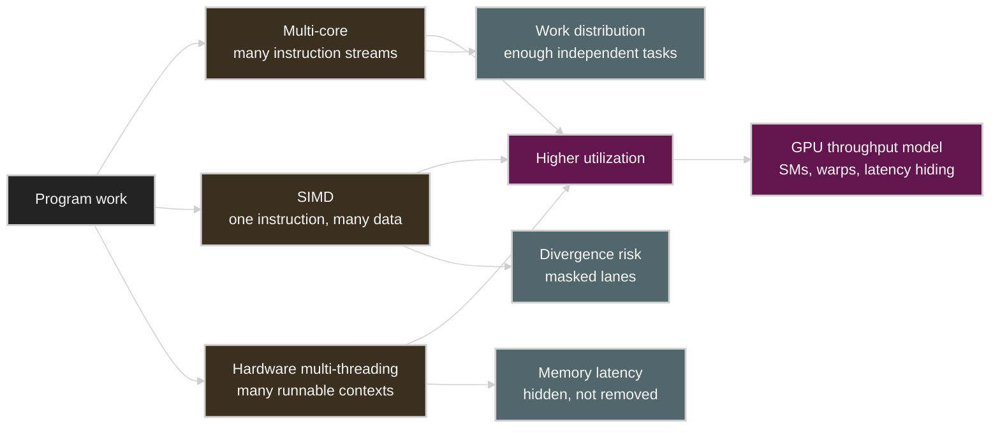

# Lecture 2: A Modern Multi-Core Processor

Source: [Stanford CS149 2023 Lecture 2](https://www.youtube.com/watch?v=CKmNpAO5rS4)

Course materials:

* [CS149 Fall 2023 Lecture 2 course page](https://gfxcourses.stanford.edu/cs149/fall23/lecture/multicore/)
* [Lecture 2 slides PDF](https://gfxcourses.stanford.edu/cs149/fall23content/media/multicore/02_basicarch_xX3ssOi.pdf)

## Table of Contents

* [Goal](#goal)
* [Lecture Overview](#lecture-overview)
* [Visual Map](#visual-map)
* [Processor Review](#processor-review)
* [Caches and Locality](#caches-and-locality)
* [Three Ways to Improve Processor Utilization](#three-ways-to-improve-processor-utilization)
* [Multi-Core Execution](#multi-core-execution)
* [SIMD Execution](#simd-execution)
* [Coherent and Divergent Execution](#coherent-and-divergent-execution)
* [Explicit and Implicit SIMD](#explicit-and-implicit-simd)
* [Hardware Multi-Threading](#hardware-multi-threading)
* [Latency Hiding](#latency-hiding)
* [NVIDIA V100 as a Throughput Processor](#nvidia-v100-as-a-throughput-processor)
* [GPU Systems Lens](#gpu-systems-lens)
* [Practical Tips and Notes](#practical-tips-and-notes)
* [Lecture Summary](#lecture-summary)
* [Key Terms](#key-terms)
* [Questions](#questions)
* [Answers](#answers)

---

## Goal

이번 강의의 목표는 modern processor가 hardware 수준에서 parallelism을 어떤 방식으로 제공하는지 이해하는 것이다. 1강에서는 program을 instruction stream으로 보고 speedup과 efficiency를 구분했다. 2강에서는 이 관점을 바탕으로, 하나의 processor chip 안에서 multi-core, SIMD execution, hardware multi-threading이 어떻게 결합되는지를 살펴본다.

핵심 메시지는 다음과 같다.

> Modern parallel processor는 단순히 core 수가 많은 machine이 아니다. 여러 core가 독립적인 instruction stream을 실행하고, 각 core 내부의 SIMD는 하나의 instruction을 여러 data에 적용한다. 또한 hardware thread를 번갈아 실행해 memory latency로 인한 idle 시간을 줄인다. 높은 utilization을 얻으려면 parallel program이 이 세 형태의 parallelism을 모두 충분히 제공해야 한다.

이 강의는 다음을 다룬다.

* Program과 processor instruction 복습
* Cache line, cache hit/miss, temporal locality, spatial locality
* Multi-core execution과 instruction stream의 독립성
* SIMD execution과 control logic amortization
* Conditional execution에서 SIMD lane이 낭비되는 이유
* Instruction stream coherence와 divergent execution
* CPU의 explicit SIMD와 GPU의 implicit SIMD
* Hardware multi-threading을 통한 memory latency hiding
* NVIDIA V100을 throughput-oriented processor로 보는 관점

---

## Lecture Overview

강의는 1강의 내용을 복습하며 시작한다. Program은 processor instruction의 목록이고, processor는 instruction을 fetch/decode한 뒤 execution unit에서 실행하여 register와 memory state를 변경한다. Superscalar processor는 instruction stream에서 서로 의존하지 않는 instruction을 찾아 여러 execution unit에 동시에 배정한다. 그러나 하나의 instruction stream에서 hardware가 자동으로 발견할 수 있는 parallelism에는 한계가 있다.

이어서 cache를 다룬다. Cache는 program의 출력에는 영향을 주지 않는 hardware implementation detail이지만, performance에는 큰 차이를 만든다. Cache는 memory 값 일부를 on-chip에 보관하고, 같은 data를 다시 사용하는 temporal locality와 인접한 address를 함께 사용하는 spatial locality를 활용한다. Data를 cache line 단위로 옮기므로, array를 순차적으로 접근하는 pattern은 cache에 특히 유리하다.

강의의 핵심은 modern processor가 더 많은 parallel work를 처리하는 세 가지 방식이다. 첫째, multi-core에서는 여러 core가 서로 다른 instruction stream을 독립적으로 실행한다. 둘째, SIMD는 하나의 instruction을 여러 data element에 적용하여 control logic 비용을 분산한다. 셋째, hardware multi-threading은 한 thread가 memory load처럼 latency가 큰 operation을 기다리는 동안 다른 hardware thread의 instruction을 실행하여 execution unit의 idle 시간을 줄인다.

후반부에서는 각 방식의 전제 조건과 비용을 살펴본다. Multi-core에는 충분한 independent work가 필요하고, SIMD에서는 많은 work item이 같은 instruction sequence를 따라야 하며, hardware multi-threading에는 memory stall 동안 실행할 수 있는 runnable thread가 충분해야 한다. NVIDIA V100 사례는 GPU가 이 세 조건을 활용해 throughput을 높이는 processor임을 보여준다.

---

## Visual Map

2강의 hardware model은 세 형태의 parallelism이 상호 보완적으로 작동하여 utilization을 높이는 구조로 이해할 수 있다.



---

## Processor Review

Processor는 instruction stream을 실행한다. 단순화하면 processor는 다음 요소로 구성된다.

| Component | Role |
| --------- | ---- |
| Fetch/decode | 다음에 실행할 instruction을 가져오고 해석한다 |
| Execution context | Register처럼 program state를 저장한다 |
| Execution unit | Arithmetic, load/store, branch 같은 operation을 수행한다 |
| Memory system | Instruction이 읽고 쓰는 memory address space를 제공한다 |

1강에서 다룬 simple processor는 한 clock에 instruction 하나를 실행한다고 가정했다. Superscalar processor는 여러 execution unit을 두고, dependency가 없는 instruction을 같은 cycle에 병렬로 실행한다.

```text
instruction stream
  -> dependency analysis
  -> independent instructions run in parallel
```

Processor는 program의 의미를 바꿀 수 없다. 내부적으로 out-of-order execution을 수행하더라도, single-thread program이 관찰하는 결과는 source program의 dependency와 semantics를 만족해야 한다. 이 제약 때문에 superscalar execution만으로 modern chip의 execution unit을 모두 활용하기는 어렵다.

## Caches and Locality

Program의 관점에서는 memory가 byte-addressable address space로 보이지만, 실제 DRAM은 processor execution unit보다 훨씬 느리다. Cache는 이 latency를 줄이기 위해 memory value의 일부를 on-chip에 보관한다.

Cache는 보통 cache line 단위로 동작한다. 예를 들어 line size가 4 bytes인 cache에서 address `0x0`을 읽으면 `0x0`부터 `0x3`까지가 하나의 line으로 함께 cache에 적재된다. 따라서 뒤이은 `0x1`, `0x2`, `0x3` 접근은 모두 hit이 된다.


| Locality | Meaning | Cache effect |
| -------- | ------- | ------------ |
| Temporal locality | 이미 접근한 data를 곧 다시 접근한다 | 같은 cache line을 재사용한다 |
| Spatial locality | 가까운 address를 곧 접근한다 | line fetch가 다음 접근을 미리 가져온다 |

Cache miss는 원인에 따라 세 가지로 나눠 볼 수 있다.

| Miss type | Meaning |
| --------- | ------- |
| Cold miss | 해당 data를 처음 접근해서 cache에 없었다 |
| Capacity miss | cache가 더 컸다면 남아 있었을 data가 용량 부족으로 evict되었다 |
| Conflict miss | cache organization 탓에 둘 이상의 data가 같은 자리를 두고 경쟁한다 |

Cache가 모든 memory 문제를 자동으로 해결하는 것은 아니다. Cache가 효과를 내려면 program의 access pattern 자체에 locality가 있어야 한다. Random access, 큰 working set, 불리한 data layout은 cache capacity가 충분해도 낮은 hit rate를 초래할 수 있다.

## Three Ways to Improve Processor Utilization

Lecture 2는 modern chip이 utilization을 높이는 방식을 세 가지로 정리한다.

| Hardware mechanism | What it exploits | Program requirement |
| ------------------ | ---------------- | ------------------- |
| Multi-core | Independent instruction streams | 충분한 task/thread-level parallelism |
| SIMD | Same instruction over many data | Coherent instruction stream |
| Hardware multi-threading | Work to run while another thread stalls | Latency를 숨길 만큼 많은 runnable threads |

이 세 방식은 서로를 대체하는 선택지가 아니라 함께 사용되는 조합이다. CPU는 multi-core, SIMD, SMT를 함께 사용하고, GPU도 여러 SM, warp-level SIMD, 많은 resident warp를 함께 활용한다.

## Multi-Core Execution

Multi-core processor는 execution core를 여러 개 둔 구조다. 각 core는 자신에게 할당된 instruction stream을 fetch/decode하고 실행한다. 따라서 multi-core에서는 control flow가 서로 다른 thread나 task도 동시에 실행할 수 있다.

```text
core 0 -> instruction stream A
core 1 -> instruction stream B
core 2 -> instruction stream C
...
```

이 구조의 장점은 유연성이다. Core마다 다른 branch와 function을 실행하고, 서로 다른 memory address에 접근할 수 있다. SIMD처럼 모든 lane이 같은 instruction을 따라야 한다는 제약이 없기 때문이다.

그러나 multi-core만으로는 충분하지 않다. Core 수가 늘어나면 fetch/decode/control logic, cache, execution resource도 그에 맞춰 늘어난다. 또한 program이 충분한 independent work를 제공하지 못하면 core는 idle 상태가 된다. Parallel program에서 work decomposition과 scheduling이 중요한 이유다.

## SIMD Execution

SIMD는 single instruction, multiple data의 약자다. Instruction 하나를 fetch/decode한 뒤, 여러 execution lane이 각자 담당한 data element에 같은 operation을 수행한다.

```text
one instruction: y[i] = x[i] * 2

lane 0 -> x[0]
lane 1 -> x[1]
lane 2 -> x[2]
...
lane 7 -> x[7]
```

SIMD의 핵심 이점은 control overhead를 여러 연산에 분산하는 데 있다. Fetch/decode/control logic 하나로 여러 ALU lane을 제어하므로, 같은 silicon budget에서 더 높은 arithmetic throughput을 얻을 수 있다.

| Property | Multi-core | SIMD |
| -------- | ---------- | ---- |
| Instruction streams | 여러 stream 가능 | 하나의 shared stream |
| Control flow flexibility | 높음 | 낮음 |
| Area efficiency for data-parallel math | 낮거나 중간 | 높음 |
| Best fit | Independent tasks | Same operation over many elements |

Data-parallel loop, vector math, image processing, dense linear algebra는 SIMD에 적합하다. 반대로 lane마다 branch가 다르거나 loop 횟수가 제각각인 irregular workload에서는 SIMD efficiency가 크게 낮아진다.

## Coherent and Divergent Execution

SIMD를 효율적으로 활용하려면 많은 data element가 같은 instruction sequence를 따라야 한다. 강의에서는 이를 instruction stream coherence 또는 coherent execution이라고 부른다.

```c
forall (int i from 0 to N) {
    float t = x[i];
    t = t * t;
    y[i] = t;
}
```

이 loop에서는 모든 element가 같은 instruction을 수행하므로 SIMD에 적합하다. 문제는 conditional execution이 포함될 때 발생한다.

```c
forall (int i from 0 to N) {
    float t = x[i];
    if (t > 0.0f) {
        t = t * t;
    } else {
        t = t + 30.0f;
    }
    y[i] = t;
}
```

SIMD processor는 같은 cycle에 lane마다 다른 instruction을 실행할 수 없다. 따라서 한 branch path를 실행할 때는 조건이 false인 lane을 mask하고, 반대 path를 실행할 때는 조건이 true였던 lane을 mask한다. 이 과정에서 일부 ALU lane은 useful work를 수행하지 못한다.

| Situation | SIMD behavior |
| --------- | ------------- |
| All lanes take same path | Full lane utilization |
| Half lanes take each path | Each path runs with some lanes masked |
| Each lane needs distinct control flow | Worst-case utilization can be very low |

Divergent execution은 instruction stream coherence가 깨진 상태를 말한다. GPU programming에서 warp divergence가 성능을 낮추는 이유도 같은 원리다.

## Explicit and Implicit SIMD

Modern CPU와 GPU는 SIMD를 programmer에게 서로 다른 방식으로 제공한다.

| Style | Where common | Programmer/compiler view |
| ----- | ------------ | ------------------------ |
| Explicit SIMD | CPU AVX, AVX-512, ARM Neon | Binary에 vector instruction이 보인다 |
| Implicit SIMD | Many GPUs | Programmer는 scalar thread를 쓰지만 hardware가 warp/wavefront로 묶어 SIMD 실행한다 |

CPU에서는 compiler가 loop를 auto-vectorize하거나, programmer가 intrinsics를 직접 사용하거나, parallel language의 semantics가 compiler에 vectorization 기회를 전달한다. 반면 GPU에서는 programmer가 각 thread가 실행할 scalar code를 작성하고, hardware가 여러 thread를 warp로 묶어 같은 instruction을 SIMD 방식으로 실행한다.

둘의 차이는 abstraction을 제공하는 방식에 있다. GPU thread가 겉보기에는 독립적으로 보이더라도, 같은 warp 안에서는 instruction stream coherence가 성능에 중요하다.

## Hardware Multi-Threading

Hardware multi-threading은 core가 여러 thread의 execution context를 동시에 유지하는 방식이다. 한 thread가 long-latency memory operation을 기다리는 동안, core는 준비된 다른 thread의 instruction을 실행한다.

중요한 점은 multi-threading이 memory latency 자체를 줄이지는 않는다는 것이다. 대신 latency로 인해 execution unit이 idle 상태에 머무는 시간을 줄인다.

| Mechanism | Meaning | Example |
| --------- | ------- | ------- |
| Interleaved multi-threading | 매 cycle 한 ready thread를 골라 instruction을 실행한다 | Temporal multi-threading |
| Simultaneous multi-threading | 한 cycle에 여러 thread의 instruction을 execution units에 issue한다 | Intel Hyper-Threading |

Hardware multi-threading이 효과를 내려면, 기다리는 thread를 대신해 실행할 ready thread가 core에 있어야 한다. Throughput processor가 많은 hardware thread context를 두는 이유가 여기에 있다.

## Latency Hiding

강의의 latency hiding 예시는 다음 원리를 보여 준다.

```text
thread does:
  arithmetic arithmetic arithmetic load
load latency:
  12 cycles
```

Thread가 하나뿐이면 load 이후 core는 다음 instruction을 실행하지 못한 채 대기한다. 반면 hardware thread가 여러 개라면 thread 0이 load를 기다리는 동안 thread 1, 2, 3의 arithmetic instruction을 실행할 수 있다. 강의 예시처럼 arithmetic instruction 세 개 뒤에 12-cycle load가 오는 경우, 다섯 개의 thread가 있으면 utilization을 100%까지 높일 수 있다.


Memory access 하나당 arithmetic이 많을수록 latency hiding에 필요한 thread 수는 줄어든다. 예를 들어 arithmetic instruction 여섯 개 뒤에 동일한 12-cycle load가 온다면, 더 적은 thread로도 latency를 숨길 수 있다.

| Workload property | Threads needed for latency hiding |
| ----------------- | --------------------------------- |
| Low arithmetic per memory access | More threads needed |
| High arithmetic per memory access | Fewer threads needed |
| Long memory latency | More independent work needed |
| Short memory latency or good cache locality | Fewer threads needed |

이 관점은 GPU의 occupancy와 arithmetic intensity를 이해하는 출발점이 된다. 많은 resident warp는 latency를 숨길 수 있도록 다른 실행 대상을 준비해 두고, arithmetic intensity는 memory stall 사이에 수행할 useful work의 양을 나타낸다.

## NVIDIA V100 as a Throughput Processor

Lecture 2는 NVIDIA V100을 modern throughput-oriented processor의 사례로 소개한다. V100은 여러 SM으로 구성되며, 각 SM은 많은 warp execution context와 넓은 SIMD execution resource를 갖는다.

강의 슬라이드에서 설명하는 V100 SM의 특징은 다음과 같다.

| V100 SM concept | Meaning |
| --------------- | ------- |
| Warp | 32개 data item 또는 thread가 함께 움직이는 SIMD execution group |
| Many warp contexts | Memory stall 동안 다른 warp를 실행하기 위해 유지하는 state |
| SIMD ALUs | 같은 instruction을 여러 data lane에 적용 |
| Tensor cores | Matrix 연산이 많은 workload를 위한 specialized execution unit |
| Large register file | 많은 resident warp의 context를 동시에 유지 |

슬라이드에 따르면 V100 전체는 80개의 SM으로 구성되고, GPU memory는 HBM을 통해 높은 bandwidth를 제공한다. 핵심은 GPU가 개별 operation의 latency를 낮추는 processor라기보다, 많은 independent work를 보유하고 번갈아 실행해 전체 throughput을 극대화하는 processor라는 점이다.

## GPU Systems Lens

Lecture 2의 개념은 GPU 성능을 분석하는 기본 틀이 된다.

| Lecture 2 concept | GPU/CUDA interpretation |
| ----------------- | ----------------------- |
| Multi-core | 여러 SM이 block/warp 단위 work를 병렬로 처리한다 |
| SIMD | Warp 안의 lane들이 같은 instruction을 실행한다 |
| Instruction stream coherence | Warp divergence가 적을수록 SIMD lane을 효율적으로 활용할 수 있다 |
| Hardware multi-threading | SM이 여러 resident warp를 보유하고 ready warp를 골라 실행한다 |
| Latency hiding | Memory stall 동안 다른 warp를 실행한다 |
| Cache locality | Coalesced access, L1/L2 reuse, shared-memory tiling |
| Arithmetic per memory access | Arithmetic intensity와 필요한 occupancy를 결정한다 |

LLM inference와 training에서는 이 강의의 내용이 다음 질문으로 이어진다.

* Kernel이 충분한 warp/block을 제공하여 모든 SM에 work를 공급하는가?
* Branch나 길이가 서로 다른 loop 때문에 warp divergence가 커지지는 않는가?
* Memory access가 coalesced되어 있고 cache나 shared memory의 reuse가 있는가?
* Tensor Core와 SIMD lane이 실제로 useful work를 수행하는가?
* Memory-bound kernel에서 occupancy를 더 올리는 것이 latency hiding에 도움이 되는가?
* Arithmetic intensity가 낮은 kernel을 fusion이나 tiling으로 개선할 수 있는가?

## Practical Tips and Notes

### Utilization을 세 층으로 나누어 살펴보기

GPU나 CPU 성능을 평가할 때 단순히 parallelism이 있다고만 해서는 충분하지 않다. 다음 세 층을 각각 확인해야 한다.

| Layer | First check |
| ----- | ----------- |
| Across cores | 모든 core/SM에 work가 배정되는가? |
| Within SIMD lanes | lane/warp가 같은 useful instruction을 수행하는가? |
| Over time | memory stall 동안 실행할 다른 work가 남아 있는가? |

성능이 기대보다 낮다면 어느 층에서 resource가 놀고 있는지부터 구분해야 한다.

### Divergence는 correctness bug가 아니라 efficiency bug다

Branch가 분기되어도 계산의 correctness는 유지될 수 있다. 문제는 같은 SIMD group의 lane이 서로 다른 path를 따르면 일부 lane이 masked-off 상태가 되어 연산에 참여하지 못한다는 점이다. 따라서 CUDA에서는 같은 warp 안의 branch coherence를 높일 수 있도록 data layout과 work assignment를 설계하는 것이 중요하다.

### Thread 수는 많을수록 항상 좋은 것이 아니다

Hardware multi-threading은 latency hiding에 유용하지만, execution unit이 이미 100% utilization에 도달했다면 thread를 더 늘려도 효과는 제한적이다. 오히려 register pressure, cache pressure, scheduling overhead가 커질 수 있다.

### Arithmetic intensity는 latency hiding 요구량을 바꾼다

Memory access 하나당 수행하는 arithmetic이 많으면 적은 thread로도 memory latency를 숨기기 쉽다. 반대로 load/store가 대부분인 kernel은 resident warp를 늘려도 bandwidth와 latency의 제약을 받을 가능성이 높다.

### Cache는 access pattern의 결과다

Cache hit rate는 hardware cache size만으로 결정되지 않는다. Array 순회 방식, data layout, tiling, reuse distance가 cache behavior를 좌우한다. GPU의 shared memory tiling과 coalescing도 같은 원리를 명시적으로 적용하는 기법으로 볼 수 있다.

## Lecture Summary

이번 강의는 modern parallel processor를 multi-core, SIMD, hardware multi-threading의 조합으로 설명했다. Multi-core는 서로 다른 instruction stream을 병렬로 실행하고, SIMD는 같은 instruction을 여러 data에 적용해 arithmetic throughput을 높인다. Hardware multi-threading은 memory stall 동안 다른 thread의 instruction을 실행하여 latency로 인한 idle 시간을 줄인다.

효율적인 parallel program은 다음 세 조건을 모두 만족해야 한다.

* 모든 core와 execution unit을 활용할 만큼 parallel work가 충분해야 한다.
* SIMD lane이 낭비되지 않도록 같은 instruction sequence를 따르는 work item이 많아야 한다.
* Memory latency를 숨길 만큼 runnable work가 충분해야 한다.

GPU는 이 원리를 집약적으로 활용하는 throughput processor다. CUDA의 block, warp, occupancy, coalescing, divergence, shared memory는 모두 이 강의에서 설명한 hardware model을 바탕으로 이해할 수 있다.

## Key Terms

| Term | Meaning |
| ---- | ------- |
| Multi-core processor | 여러 개의 execution core를 가진 processor |
| Instruction stream | Processor가 순서대로 실행하는 instruction의 흐름 |
| Cache line | Cache와 memory 사이에서 한 번에 이동하는 data block |
| Temporal locality | 같은 data를 시간적으로 가깝게 다시 쓰는 성질 |
| Spatial locality | 서로 가까운 memory address를 연속해서 사용하는 성질 |
| Cache hit | 요청한 data가 cache에 있는 경우 |
| Cache miss | 요청한 data가 cache에 없어 memory에서 가져와야 하는 경우 |
| SIMD | 하나의 instruction을 여러 data element에 적용하는 실행 방식 |
| SIMD lane | SIMD instruction을 수행하는 data-parallel execution slot |
| Instruction stream coherence | 여러 work item이 같은 instruction sequence를 따르는 성질 |
| Divergent execution | 같은 SIMD group 안의 work item들이 서로 다른 control flow를 타는 상태 |
| Explicit SIMD | Vector instruction을 compiler 또는 binary 수준에서 명시하는 SIMD |
| Implicit SIMD | Scalar thread abstraction 아래에서 hardware가 SIMD로 실행하는 방식 |
| Hardware multi-threading | Core가 여러 thread context를 유지하며 번갈아 실행하는 방식 |
| Latency hiding | Long-latency operation 동안 다른 work를 실행하여 utilization을 유지하는 기법 |
| Arithmetic intensity | Memory access 또는 전송한 byte 수에 대한 arithmetic work의 비율 |
| Warp | NVIDIA GPU에서 함께 SIMD 방식으로 실행되는 thread group |

## Questions

1. Modern processor가 활용하는 세 가지 주요 parallel execution 형태는 무엇인가?
2. Cache line은 spatial locality와 어떤 관련이 있는가?
3. Temporal locality와 spatial locality는 어떻게 다른가?
4. Multi-core execution과 SIMD execution은 instruction stream 측면에서 무엇이 다른가?
5. SIMD가 area-efficient한 이유는 무엇인가?
6. Conditional branch가 SIMD utilization을 떨어뜨리는 이유는 무엇인가?
7. Instruction stream coherence란 무엇인가?
8. Explicit SIMD와 implicit SIMD는 어떻게 다른가?
9. Hardware multi-threading은 memory latency를 줄이는가, 숨기는가?
10. Memory access 하나당 arithmetic이 많아지면 latency hiding에 필요한 thread 수는 어떻게 변하는가?
11. V100 같은 GPU를 throughput-oriented processor라고 부르는 이유는 무엇인가?
12. CUDA의 warp divergence는 Lecture 2의 어떤 개념과 연결되는가?

## Answers

1. Multi-core execution, SIMD execution, hardware multi-threading이다.
2. Cache가 line 단위로 인접한 address를 함께 가져오기 때문에, 순차 접근은 한 번의 miss 뒤에 여러 cache hit으로 이어질 수 있다.
3. Temporal locality는 같은 data를 짧은 시간 안에 다시 사용하는 성질이고, spatial locality는 서로 가까운 address를 연속해서 사용하는 성질이다.
4. Multi-core에서는 core마다 서로 다른 instruction stream을 실행할 수 있지만, SIMD에서는 여러 lane이 하나의 instruction stream을 공유한다.
5. 하나의 fetch/decode/control path가 여러 ALU lane을 제어하므로, control overhead를 여러 data operation에 분산할 수 있기 때문이다.
6. Lane마다 branch path가 다르면 일부 lane이 mask되어 useful work를 수행하지 못하기 때문이다.
7. 여러 parallel work item이 같은 instruction sequence를 따르는 성질이다.
8. Explicit SIMD는 vector instruction이 compiler/binary에 명시되며, implicit SIMD는 programmer가 scalar thread를 작성해도 hardware가 여러 thread를 묶어 SIMD로 실행한다.
9. 줄이지 않고 숨긴다. Memory operation의 latency는 그대로지만, 기다리는 동안 다른 thread를 실행해 idle 시간을 줄인다.
10. 줄어든다. Memory stall 사이에 수행할 arithmetic work가 많아지기 때문이다.
11. 많은 SM, SIMD lane, resident warp를 활용하여 개별 operation의 latency보다 전체 throughput을 극대화하도록 설계되었기 때문이다.
12. Instruction stream coherence와 divergent execution이다.
