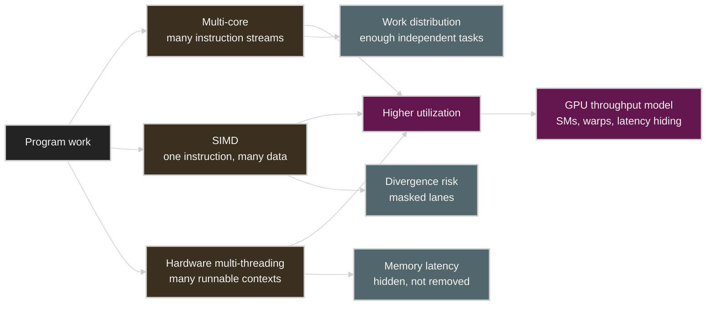

# Lecture 2: A Modern Multi-Core Processor

Source: [Stanford CS149 2023 Lecture 2](https://www.youtube.com/watch?v=CKmNpAO5rS4)

Course materials:

* [CS149 Fall 2023 Lecture 2 course page](https://gfxcourses.stanford.edu/cs149/fall23/lecture/multicore/)
* [Lecture 2 slides PDF](https://gfxcourses.stanford.edu/cs149/fall23content/media/multicore/02_basicarch_xX3ssOi.pdf)

## Table of Contents

* [Goal](#goal)
* [Lecture Overview](#lecture-overview)
* [Visual Map](#visual-map)
* [Processor Review](#processor-review)
* [Caches and Locality](#caches-and-locality)
* [Three Ways to Improve Processor Utilization](#three-ways-to-improve-processor-utilization)
* [Multi-Core Execution](#multi-core-execution)
* [SIMD Execution](#simd-execution)
* [Coherent and Divergent Execution](#coherent-and-divergent-execution)
* [Explicit and Implicit SIMD](#explicit-and-implicit-simd)
* [Hardware Multi-Threading](#hardware-multi-threading)
* [Latency Hiding](#latency-hiding)
* [NVIDIA V100 as a Throughput Processor](#nvidia-v100-as-a-throughput-processor)
* [GPU Systems Lens](#gpu-systems-lens)
* [Practical Tips and Notes](#practical-tips-and-notes)
* [Lecture Summary](#lecture-summary)
* [Key Terms](#key-terms)
* [Questions](#questions)
* [Answers](#answers)

---

## Goal

이번 강의의 목표는 modern processor가 parallelism을 hardware 안에서 어떤 형태로 제공하는지 이해하는 것이다. 1강에서는 program을 instruction stream으로 보고, speedup과 efficiency를 구분했다. 2강은 그 관점을 바탕으로 하나의 processor chip 안에 multi-core, SIMD execution, hardware multi-threading이 어떻게 결합되는지 설명한다.

핵심 메시지는 다음과 같다.

> Modern parallel processor는 core 수만 많은 machine이 아니다. 여러 core로 independent instruction streams를 실행하고, 각 core 안에서는 SIMD로 같은 instruction을 여러 data에 적용하며, hardware threads를 interleave해서 memory latency를 숨긴다. 좋은 parallel program은 이 세 가지 형태의 parallelism을 모두 만족시켜야 높은 utilization을 얻는다.

이 강의는 다음을 다룬다.

* Program과 processor instruction 복습
* Cache line, cache hit/miss, temporal locality, spatial locality
* Multi-core execution과 instruction stream 독립성
* SIMD execution과 control amortization
* Conditional execution에서 SIMD lane이 낭비되는 이유
* Instruction stream coherence와 divergent execution
* CPU의 explicit SIMD와 GPU의 implicit SIMD
* Hardware multi-threading과 memory latency hiding
* NVIDIA V100을 throughput-oriented processor로 보는 관점

---

## Lecture Overview

강의는 1강 복습으로 시작한다. Program은 processor instruction의 list이고, processor는 instruction을 fetch/decode하고 execution unit에서 실행하며 register와 memory state를 바꾼다. Superscalar processor는 instruction stream 안의 independent instruction을 찾아 여러 execution unit에서 동시에 실행하려고 한다. 하지만 single instruction stream 안에서 자동으로 찾을 수 있는 parallelism은 제한적이다.

그 다음은 cache다. Cache는 program의 output을 바꾸지 않는 hardware implementation detail이지만 performance에는 큰 영향을 준다. Cache는 memory의 일부 값을 on-chip에 복사해 두고, 같은 data를 다시 쓰는 temporal locality와 가까운 address를 함께 쓰는 spatial locality를 활용한다. Cache line 단위로 data를 옮기기 때문에 array를 순차적으로 읽는 pattern은 cache에 잘 맞는다.

강의의 본론은 modern processor가 더 많은 parallel work를 처리하는 세 가지 방식이다. 첫 번째는 multi-core다. 여러 core가 서로 다른 instruction stream을 독립적으로 실행한다. 두 번째는 SIMD다. 하나의 instruction을 여러 data element에 동시에 적용해 control logic을 amortize한다. 세 번째는 hardware multi-threading이다. 한 thread가 memory load 같은 long-latency operation을 기다릴 때, core가 다른 hardware thread의 instruction을 실행해 execution unit을 놀리지 않는다.

후반부는 이 세 방식의 조건과 비용을 다룬다. Multi-core는 independent work가 충분해야 한다. SIMD는 많은 work item이 같은 instruction sequence를 따라야 한다. Hardware multi-threading은 memory stall을 숨길 만큼 많은 runnable thread가 필요하다. NVIDIA V100 예시는 GPU가 이 세 조건을 극단적으로 활용하는 throughput-oriented processor임을 보여준다.

---

## Visual Map

2강의 hardware model은 세 가지 parallelism이 서로 겹쳐서 utilization을 높이는 구조로 볼 수 있다.



---

## Processor Review

Processor는 instruction stream을 실행한다. 아주 단순화하면 processor에는 다음 요소가 있다.

| Component | Role |
| --------- | ---- |
| Fetch/decode | 다음에 실행할 instruction을 가져오고 해석한다 |
| Execution context | Register처럼 program state를 저장한다 |
| Execution unit | Arithmetic, load/store, branch 같은 operation을 수행한다 |
| Memory system | Instruction이 읽고 쓰는 memory address space를 제공한다 |

1강에서 본 simple processor는 한 clock에 instruction 하나를 실행한다고 가정했다. Superscalar processor는 여기서 한 걸음 더 나아가 여러 execution unit을 두고, dependency가 없는 instruction을 같은 cycle에 실행하려고 한다.

```text
instruction stream
  -> dependency analysis
  -> independent instructions run in parallel
```

하지만 processor가 program order를 어기면 안 된다. Internal execution은 out-of-order일 수 있어도, single-thread program이 관찰하는 결과는 source program의 dependency와 semantics를 만족해야 한다. 따라서 superscalar execution만으로는 modern chip의 모든 execution unit을 채우기 어렵다.

## Caches and Locality

Memory는 byte-addressable address space처럼 보이지만, DRAM은 processor execution unit에 비해 느리다. Cache는 이 latency를 줄이기 위해 memory value의 subset을 on-chip에 보관한다.

Cache는 보통 cache line 단위로 동작한다. 예를 들어 line size가 4 bytes인 단순 cache에서 address `0x0`을 읽으면, cache는 `0x0`부터 `0x3`까지 한 line을 가져올 수 있다. 이후 `0x1`, `0x2`, `0x3` 접근은 hit이 된다.


| Locality | Meaning | Cache effect |
| -------- | ------- | ------------ |
| Temporal locality | 이미 접근한 data를 곧 다시 접근한다 | 같은 cache line을 재사용한다 |
| Spatial locality | 가까운 address를 곧 접근한다 | line fetch가 다음 접근을 미리 가져온다 |

Cache miss는 이유에 따라 다르게 이해할 수 있다.

| Miss type | Meaning |
| --------- | ------- |
| Cold miss | 해당 data를 처음 접근해서 cache에 없었다 |
| Capacity miss | cache가 충분히 크면 남아 있었을 data가 용량 부족으로 evict되었다 |
| Conflict miss | cache organization 때문에 둘 이상의 data가 같은 위치를 경쟁한다 |

실무적으로 중요한 점은 cache가 자동으로 모든 memory problem을 해결하지 않는다는 것이다. Cache가 효과적이려면 program의 access pattern에 locality가 있어야 한다. Random access, 큰 working set, poor layout은 cache capacity가 있어도 낮은 hit rate를 만들 수 있다.

## Three Ways to Improve Processor Utilization

Lecture 2는 modern chip이 utilization을 높이는 방식을 세 가지로 묶어 볼 수 있게 한다.

| Hardware mechanism | What it exploits | Program requirement |
| ------------------ | ---------------- | ------------------- |
| Multi-core | Independent instruction streams | 충분한 task/thread-level parallelism |
| SIMD | Same instruction over many data | Coherent instruction stream |
| Hardware multi-threading | Work to run while another thread stalls | Latency를 숨길 만큼 많은 runnable threads |

이 셋은 서로 대체재가 아니라 조합이다. CPU도 multi-core와 SIMD, SMT를 함께 사용하고, GPU도 SM, warp-level SIMD, 많은 resident warps를 함께 사용한다.

## Multi-Core Execution

Multi-core processor는 execution core를 여러 개 복제한다. 각 core는 자기 instruction stream을 fetch/decode하고 실행할 수 있다. 즉, multi-core parallelism은 서로 다른 control flow를 가진 thread나 task를 동시에 실행할 수 있다.

```text
core 0 -> instruction stream A
core 1 -> instruction stream B
core 2 -> instruction stream C
...
```

이 구조의 장점은 flexibility다. 서로 다른 core는 서로 다른 branch를 타고, 다른 function을 실행하고, 다른 memory address를 접근할 수 있다. SIMD처럼 모든 lane이 같은 instruction을 따라야 하는 제약은 없다.

하지만 multi-core만으로는 충분하지 않다. Core를 많이 넣으면 fetch/decode/control logic, cache, execution resources가 반복된다. 또한 program이 충분한 independent work를 제공하지 못하면 core는 idle 상태가 된다. Parallel program이 work decomposition과 scheduling을 잘해야 하는 이유가 여기에 있다.

## SIMD Execution

SIMD는 single instruction, multiple data의 약자다. 하나의 instruction을 fetch/decode하고, 여러 execution lane이 각자의 data element에 같은 operation을 수행한다.

```text
one instruction: y[i] = x[i] * 2

lane 0 -> x[0]
lane 1 -> x[1]
lane 2 -> x[2]
...
lane 7 -> x[7]
```

SIMD의 핵심 이점은 control overhead amortization이다. Fetch/decode/control logic 하나로 여러 ALU lane을 움직일 수 있으므로 같은 silicon budget에서 더 많은 arithmetic throughput을 넣을 수 있다.

| Property | Multi-core | SIMD |
| -------- | ---------- | ---- |
| Instruction streams | 여러 stream 가능 | 하나의 shared stream |
| Control flow flexibility | 높음 | 낮음 |
| Area efficiency for data-parallel math | 낮거나 중간 | 높음 |
| Best fit | Independent tasks | Same operation over many elements |

Data-parallel loops, vector math, image processing, dense linear algebra는 SIMD와 잘 맞는다. 반대로 lane마다 다른 branch와 다른 loop count를 갖는 irregular workload는 SIMD efficiency가 낮아진다.

## Coherent and Divergent Execution

SIMD를 효율적으로 쓰려면 많은 data element가 같은 instruction sequence를 따라야 한다. 강의에서는 이를 instruction stream coherence 또는 coherent execution이라고 부른다.

```c
forall (int i from 0 to N) {
    float t = x[i];
    t = t * t;
    y[i] = t;
}
```

이 loop는 모든 element가 같은 instruction을 수행하므로 SIMD에 잘 맞는다. 문제는 conditional execution이다.

```c
forall (int i from 0 to N) {
    float t = x[i];
    if (t > 0.0f) {
        t = t * t;
    } else {
        t = t + 30.0f;
    }
    y[i] = t;
}
```

SIMD processor는 같은 cycle에 서로 다른 instruction을 lane마다 마음대로 실행할 수 없다. 보통 한 branch path를 실행할 때 조건이 false인 lane의 output을 mask로 버리고, 다른 branch path를 실행할 때는 반대로 true lane을 mask한다. 이때 일부 ALU lane은 useful work를 하지 않는다.

| Situation | SIMD behavior |
| --------- | ------------- |
| All lanes take same path | Full lane utilization |
| Half lanes take each path | Each path runs with some lanes masked |
| Each lane needs distinct control flow | Worst-case utilization can be very low |

Divergent execution은 instruction stream coherence가 깨진 상태다. GPU programming에서 warp divergence가 성능을 낮추는 이유가 바로 이 원리다.

## Explicit and Implicit SIMD

Modern CPU와 GPU는 SIMD를 다른 방식으로 노출한다.

| Style | Where common | Programmer/compiler view |
| ----- | ------------ | ------------------------ |
| Explicit SIMD | CPU AVX, AVX-512, ARM Neon | Binary에 vector instruction이 보인다 |
| Implicit SIMD | Many GPUs | Programmer는 scalar thread를 쓰지만 hardware가 warp/wavefront로 묶어 SIMD 실행한다 |

CPU에서는 compiler가 loop를 auto-vectorize하거나, programmer가 intrinsics를 직접 사용하거나, parallel language semantics가 vectorization 기회를 전달한다. GPU에서는 programmer가 thread 하나의 scalar code를 작성하지만, hardware는 여러 thread를 warp로 묶어 같은 instruction을 SIMD 방식으로 실행한다.

이 차이는 abstraction의 차이다. GPU thread가 "독립 thread"처럼 보이더라도 같은 warp 안에서는 instruction stream coherence가 성능에 중요하다.

## Hardware Multi-Threading

Hardware multi-threading은 core가 여러 thread의 execution context를 동시에 보유하는 방식이다. 한 thread가 long-latency memory operation을 기다리면, core는 다른 thread의 ready instruction을 실행한다.

중요한 점은 multi-threading이 memory latency 자체를 줄이지 않는다는 것이다. 대신 latency 때문에 execution unit이 idle이 되는 시간을 줄인다.

| Mechanism | Meaning | Example |
| --------- | ------- | ------- |
| Interleaved multi-threading | 매 cycle 한 ready thread를 골라 instruction을 실행한다 | Temporal multi-threading |
| Simultaneous multi-threading | 한 cycle에 여러 thread의 instruction을 execution units에 issue한다 | Intel Hyper-Threading |

Hardware multi-threading이 효과적이려면 core가 기다리는 thread 대신 실행할 수 있는 다른 ready thread를 가져야 한다. 따라서 throughput processor는 보통 hardware thread context를 많이 둔다.

## Latency Hiding

강의의 latency hiding 예시는 다음 intuition을 준다.

```text
thread does:
  arithmetic arithmetic arithmetic load
load latency:
  12 cycles
```

Thread 하나만 있으면 load 이후 core가 오래 기다린다. 하지만 여러 hardware thread가 있으면 thread 0이 load를 기다리는 동안 thread 1, 2, 3의 arithmetic instruction을 실행할 수 있다. 강의 예시에서는 세 arithmetic instruction 뒤 12-cycle load가 있는 경우, 다섯 thread가 있으면 100% utilization을 만들 수 있다.


Arithmetic per memory access가 늘어나면 필요한 thread 수는 줄어든다. 예를 들어 six arithmetic instructions 뒤 12-cycle load가 있다면 더 적은 thread로 같은 latency를 숨길 수 있다.

| Workload property | Threads needed for latency hiding |
| ----------------- | --------------------------------- |
| Low arithmetic per memory access | More threads needed |
| High arithmetic per memory access | Fewer threads needed |
| Long memory latency | More independent work needed |
| Short memory latency or good cache locality | Fewer threads needed |

이 관점은 GPU occupancy와 arithmetic intensity를 이해하는 출발점이다. 많은 resident warp는 latency를 숨기는 재료이고, arithmetic intensity는 memory stall 사이에 수행할 useful work의 양이다.

## NVIDIA V100 as a Throughput Processor

Lecture 2는 NVIDIA V100을 modern throughput-oriented processor의 예로 소개한다. V100에는 여러 SM이 있고, 각 SM은 많은 warp execution context와 넓은 SIMD execution resources를 갖는다.

강의 슬라이드의 관점에서 V100 SM은 다음 특징을 갖는다.

| V100 SM concept | Meaning |
| --------------- | ------- |
| Warp | 32 data items 또는 threads가 함께 움직이는 SIMD execution group |
| Many warp contexts | Memory stall 동안 다른 warp를 실행하기 위한 state |
| SIMD ALUs | 같은 instruction을 여러 data lanes에 적용 |
| Tensor cores | Matrix-heavy workloads를 위한 specialized execution unit |
| Large register file | 많은 resident warps의 context를 유지 |

슬라이드는 V100 전체가 80 SM을 갖고, GPU memory는 HBM을 통해 높은 bandwidth를 제공한다고 설명한다. 여기서 중요한 결론은 GPU가 latency를 낮추는 processor라기보다, 매우 많은 independent work를 동시에 보유하고 interleave해서 throughput을 극대화하는 processor라는 점이다.

## GPU Systems Lens

Lecture 2는 GPU 성능을 해석하는 데 직접적인 vocabulary를 제공한다.

| Lecture 2 concept | GPU/CUDA interpretation |
| ----------------- | ----------------------- |
| Multi-core | SM들이 block/warp work를 병렬로 처리한다 |
| SIMD | Warp 안의 lanes가 같은 instruction을 실행한다 |
| Instruction stream coherence | Warp divergence가 적을수록 SIMD lanes가 잘 쓰인다 |
| Hardware multi-threading | SM이 여러 resident warps를 보유하고 ready warp를 고른다 |
| Latency hiding | Memory stall 동안 다른 warp를 실행한다 |
| Cache locality | Coalesced access, L1/L2 reuse, shared-memory tiling |
| Arithmetic per memory access | Arithmetic intensity와 required occupancy를 결정한다 |

LLM inference와 training에서 이 강의는 다음 질문으로 이어진다.

* Kernel은 충분한 warps/blocks를 만들어 모든 SM을 채우는가?
* Branch나 variable-length loop 때문에 warp divergence가 커지는가?
* Memory access는 coalesced되고 cache/shared memory reuse가 있는가?
* Tensor Core나 SIMD lane이 실제 useful work를 수행하는가?
* Memory-bound kernel에서 occupancy를 늘리는 것이 latency hiding에 도움이 되는가?
* Arithmetic intensity가 낮은 kernel은 fusion이나 tiling으로 개선할 수 있는가?

## Practical Tips and Notes

### Utilization을 세 층으로 나눠서 보라

GPU나 CPU 성능을 볼 때 "parallelism이 있다"는 말만으로는 부족하다. 세 층을 따로 확인해야 한다.

| Layer | First check |
| ----- | ----------- |
| Across cores | 모든 core/SM이 work를 받는가? |
| Within SIMD lanes | lane/warp가 같은 useful instruction을 수행하는가? |
| Over time | memory stall 동안 실행할 다른 work가 있는가? |

성능이 낮을 때는 어느 층이 비어 있는지 먼저 구분해야 한다.

### Divergence는 correctness bug가 아니라 efficiency bug다

Branch가 있어도 결과는 맞을 수 있다. 문제는 같은 SIMD group 안의 lane들이 서로 다른 path를 타면 일부 lane이 masked-off 상태가 된다는 점이다. CUDA에서는 같은 warp 안에서 branch coherence를 높이는 data layout이나 work assignment가 중요하다.

### Thread 수는 많을수록 항상 좋은 것이 아니다

Hardware multi-threading은 latency hiding에 필요하지만, 이미 execution unit이 100% utilization에 도달했다면 추가 thread는 도움이 작다. 오히려 register pressure, cache pressure, scheduling overhead가 늘 수 있다.

### Arithmetic intensity는 latency hiding 요구량을 바꾼다

Memory access 하나당 수행하는 arithmetic이 많으면 적은 thread로도 memory latency를 숨기기 쉽다. 반대로 load/store가 대부분인 kernel은 많은 resident warp가 있어도 bandwidth와 latency에 묶일 가능성이 높다.

### Cache는 access pattern의 결과다

Cache hit rate는 hardware cache size만의 문제가 아니다. Array 순회, data layout, tiling, reuse distance가 cache behavior를 결정한다. GPU에서도 shared memory tiling이나 coalescing은 같은 원리의 explicit version으로 볼 수 있다.

## Lecture Summary

이번 강의는 modern parallel processor를 multi-core, SIMD, hardware multi-threading의 조합으로 설명했다. Multi-core는 서로 다른 instruction streams를 병렬로 실행한다. SIMD는 같은 instruction을 여러 data에 적용해 arithmetic throughput을 높인다. Hardware multi-threading은 memory stall 동안 다른 thread의 instruction을 실행해 latency를 숨긴다.

효율적인 parallel program은 다음 세 조건을 만족해야 한다.

* 모든 core와 execution unit을 채울 만큼 충분한 parallel work가 있어야 한다.
* SIMD lane이 낭비되지 않도록 같은 instruction sequence를 따르는 work item이 많아야 한다.
* Memory latency를 숨길 만큼 충분한 runnable work가 있어야 한다.

GPU는 이 원리를 극단적으로 적용한 throughput processor다. CUDA의 block, warp, occupancy, coalescing, divergence, shared memory 같은 개념은 모두 이 강의의 hardware model 위에서 이해할 수 있다.

## Key Terms

| Term | Meaning |
| ---- | ------- |
| Multi-core processor | 여러 execution core를 가진 processor |
| Instruction stream | Processor가 실행하는 instruction sequence |
| Cache line | Cache와 memory 사이에서 이동하는 data block |
| Temporal locality | 같은 data를 시간적으로 가깝게 다시 쓰는 성질 |
| Spatial locality | 가까운 memory address를 연속적으로 쓰는 성질 |
| Cache hit | 요청한 data가 cache에 있는 경우 |
| Cache miss | 요청한 data가 cache에 없어 memory에서 가져와야 하는 경우 |
| SIMD | Single instruction, multiple data execution |
| SIMD lane | SIMD instruction을 수행하는 data-parallel execution slot |
| Instruction stream coherence | 여러 work item이 같은 instruction sequence를 따르는 성질 |
| Divergent execution | SIMD group 안에서 work item들이 다른 control flow를 따르는 상태 |
| Explicit SIMD | Compiler/binary level에 vector instruction이 명시되는 SIMD |
| Implicit SIMD | Scalar thread abstraction 아래에서 hardware가 SIMD로 실행하는 방식 |
| Hardware multi-threading | Core가 여러 thread context를 보유하고 interleave하는 방식 |
| Latency hiding | Long-latency operation 동안 다른 work를 실행해 utilization을 유지하는 방식 |
| Arithmetic intensity | Memory access 또는 byte movement 대비 arithmetic work의 양 |
| Warp | NVIDIA GPU에서 함께 SIMD 방식으로 실행되는 thread group |

## Questions

1. Modern processor가 활용하는 세 가지 주요 parallel execution 형태는 무엇인가?
2. Cache line은 spatial locality와 어떤 관련이 있는가?
3. Temporal locality와 spatial locality의 차이는 무엇인가?
4. Multi-core execution과 SIMD execution은 instruction stream 측면에서 어떻게 다른가?
5. SIMD가 area-efficient한 이유는 무엇인가?
6. Conditional branch가 SIMD utilization을 낮출 수 있는 이유는 무엇인가?
7. Instruction stream coherence는 무엇인가?
8. Explicit SIMD와 implicit SIMD의 차이는 무엇인가?
9. Hardware multi-threading은 memory latency를 줄이는가, 숨기는가?
10. Arithmetic per memory access가 많아지면 latency hiding에 필요한 thread 수는 어떻게 변하는가?
11. V100 같은 GPU가 throughput-oriented processor라고 불리는 이유는 무엇인가?
12. CUDA warp divergence는 Lecture 2의 어떤 개념과 연결되는가?

## Answers

1. Multi-core execution, SIMD execution, hardware multi-threading이다.
2. Cache가 line 단위로 가까운 address들을 함께 가져오므로, 순차 접근은 한 번의 miss 이후 여러 hit으로 이어질 수 있다.
3. Temporal locality는 같은 data를 다시 쓰는 성질이고, spatial locality는 가까운 address를 함께 쓰는 성질이다.
4. Multi-core는 여러 core가 서로 다른 instruction stream을 실행할 수 있고, SIMD는 여러 lane이 같은 instruction stream을 공유한다.
5. 하나의 fetch/decode/control path로 여러 ALU lane을 제어해 control overhead를 여러 data operation에 나눠 쓰기 때문이다.
6. 서로 다른 lane이 다른 branch path를 타면 일부 lane은 mask되어 useful work를 하지 않기 때문이다.
7. 여러 parallel work item이 같은 instruction sequence를 따르는 성질이다.
8. Explicit SIMD는 vector instruction이 compiler/binary에 명시되고, implicit SIMD는 programmer가 scalar thread를 쓰더라도 hardware가 여러 thread를 묶어 SIMD로 실행한다.
9. 줄이지 않는다. Memory operation의 latency는 그대로지만, 기다리는 동안 다른 thread를 실행해 utilization 저하를 숨긴다.
10. 줄어든다. Memory stall 사이에 수행할 arithmetic work가 많아지기 때문이다.
11. 많은 SM, SIMD lanes, resident warps를 사용해 개별 operation latency보다 전체 throughput을 극대화하도록 설계되었기 때문이다.
12. Instruction stream coherence와 divergent execution이다.
