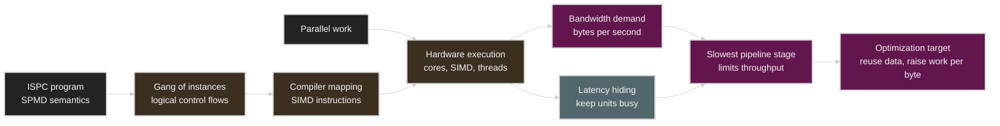
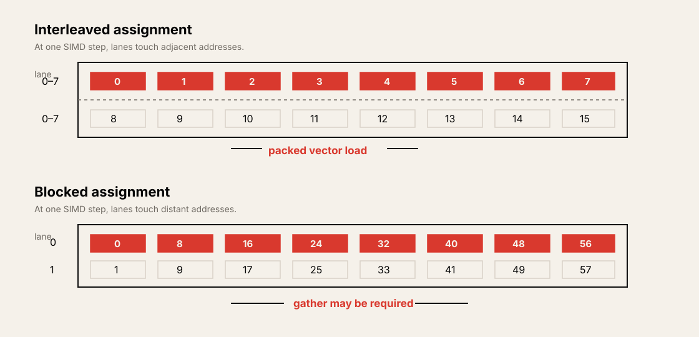

# Lecture 3: Multi-Core Architecture, Part II and ISPC

Source: [Stanford CS149 2023 Lecture 3](https://www.youtube.com/watch?v=F4bVSyz_jxo)

Course materials:

* [CS149 Fall 2023 course page](https://gfxcourses.stanford.edu/cs149/fall23)
* [Lecture 3 slides PDF](https://gfxcourses.stanford.edu/cs149/fall23content/media/multicore2-ispc/03_multicore2-ispc.pdf)
* [ISPC documentation](https://ispc.github.io/)
* [The Story of ISPC](https://pharr.org/matt/blog/2018/04/30/ispc-all.html)

> 영상 강의는 hardware multi-threading 복습, latency와 bandwidth, 그리고 ISPC의
> `foreach`까지 설명한다. 이 노트의 data race, reduction, cross-instance operation,
> ISPC task 부분은 영상 뒤에 이어지는 강의 슬라이드를 함께 참고해 보완했다.

## Table of Contents

* [Goal](#goal)
* [Lecture Overview](#lecture-overview)
* [Visual Map](#visual-map)
* [Hardware Parallelism Review](#hardware-parallelism-review)
* [Hardware Multi-Threading and Latency Hiding](#hardware-multi-threading-and-latency-hiding)
* [Latency and Bandwidth](#latency-and-bandwidth)
* [Pipelining and the Slowest Stage](#pipelining-and-the-slowest-stage)
* [Memory Bandwidth-Bound Execution](#memory-bandwidth-bound-execution)
* [Arithmetic Intensity and Data Reuse](#arithmetic-intensity-and-data-reuse)
* [Abstraction vs. Implementation](#abstraction-vs-implementation)
* [ISPC and the SPMD Programming Model](#ispc-and-the-spmd-programming-model)
* [ISPC Gang and Program Instances](#ispc-gang-and-program-instances)
* [Uniform and Varying Values](#uniform-and-varying-values)
* [Interleaved and Blocked Assignment](#interleaved-and-blocked-assignment)
* [The `foreach` Abstraction](#the-foreach-abstraction)
* [Parallel Loop Correctness](#parallel-loop-correctness)
* [Reduction and Cross-Instance Operations](#reduction-and-cross-instance-operations)
* [SPMD Abstraction and SIMD Implementation](#spmd-abstraction-and-simd-implementation)
* [ISPC Tasks and Multi-Core Execution](#ispc-tasks-and-multi-core-execution)
* [The Abstraction Ladder](#the-abstraction-ladder)
* [GPU Systems Lens](#gpu-systems-lens)
* [Practical Tips and Notes](#practical-tips-and-notes)
* [Lecture Summary](#lecture-summary)
* [Key Terms](#key-terms)
* [Questions](#questions)
* [Answers](#answers)

---

## Goal

이번 강의의 목표는 두 가지다. 첫째, modern throughput processor에서 latency와
bandwidth가 서로 다른 제약임을 이해한다. 둘째, parallel programming model의
semantics와 그것을 실제 hardware에 mapping하는 implementation을 구분한다.

핵심 메시지는 다음과 같다.

> 많은 thread는 memory latency를 숨길 수 있지만, memory bandwidth를 늘리지는
> 못한다. 그리고 ISPC의 programmer는 여러 program instance가 독립적으로 실행되는
> SPMD program을 작성하지만, compiler는 이를 한 core의 SIMD instruction으로
> 구현한다. 성능을 정확히 이해하려면 programming abstraction과 hardware
> implementation을 동시에 보되, 둘을 혼동해서는 안 된다.

이 강의는 다음을 다룬다.

* Multi-core, SIMD, superscalar, hardware multi-threading의 결합
* Hardware thread 수와 latency hiding의 관계
* Latency와 bandwidth의 차이
* Pipeline throughput과 slowest-stage bottleneck
* Vector multiplication이 충분히 parallel해도 memory-bound가 되는 이유
* Memory traffic 대비 arithmetic work의 비율
* Programming model의 semantics와 scheduling/implementation의 구분
* ISPC의 SPMD abstraction, gang, program instance
* `programCount`, `programIndex`, `uniform`, varying value
* Interleaved/blocked iteration assignment와 memory access cost
* `foreach`가 iteration assignment를 추상화하는 방식
* Parallel loop의 independence, data race, reduction
* SPMD-to-SIMD compilation과 ISPC task를 통한 multi-core execution

## Lecture Overview

강의 전반부는 Lecture 2의 hardware model을 더 정밀하게 복습한다. Hardware
multi-threading은 한 thread가 memory를 기다릴 때 다른 thread를 실행하여
execution unit의 idle cycle을 줄인다. 그러나 이미 100% utilization에 도달했다면
hardware thread를 더 추가해도 throughput은 증가하지 않는다. 오히려 execution
context를 저장할 chip area가 더 필요하고, 개별 thread의 completion latency가
늘거나 cache와 execution resource에서 서로 간섭할 수 있다.

이후 강의는 latency와 bandwidth를 구분한다. Latency는 한 요청이 끝날 때까지 걸리는
시간이고, bandwidth는 단위 시간에 완료할 수 있는 data의 양이다. Highway, laundry
pipeline, 연결된 pipe의 비유를 통해 pipeline의 전체 throughput은 가장 느린 stage의
rate로 제한된다는 점을 설명한다.

이 원리를 V100의 element-wise vector multiplication에 적용하면 중요한 결론이
나온다. 수백만 개의 독립 element는 core, SIMD lane, hardware thread를 채우기에
충분하지만, 각 multiply마다 두 값을 읽고 결과 하나를 써야 한다. FP32 기준으로
연산 하나당 12 bytes의 memory traffic이 발생한다. V100의 5,120개 FP32 ALU를
1.6 GHz에서 계속 가동하려면 약 98 TB/s가 필요하지만, 슬라이드에 제시된 HBM2
bandwidth는 900 GB/s다. 따라서 이 computation은 parallelism 부족이 아니라
bandwidth 부족으로 1% 미만의 peak compute efficiency에 머문다.

후반부는 ISPC를 통해 abstraction과 implementation의 차이를 설명한다. ISPC
function을 호출하면 논리적으로 여러 program instance로 이루어진 gang이 같은
program을 서로 다른 data에 대해 수행한다. 이것이 SPMD semantics다. 실제로는 ISPC
compiler가 gang의 실행을 AVX 같은 SIMD instruction으로 변환한다. `foreach`는
programmer가 iteration의 독립성만 선언하고 instance별 배정은 compiler에 맡기도록
추상화 수준을 높인다.

영상 진행을 기준으로 보면 주요 구간은 다음과 같다.

| Time | Topic |
| ---- | ----- |
| `00:00–16:49` | Hardware multi-threading, latency hiding, 필요한 thread 수 |
| `16:50–38:00` | Multi-core, SIMD, superscalar, SMT의 결합과 CPU/GPU 비교 |
| `38:01–46:20` | Vector multiplication 사고 실험, latency와 bandwidth |
| `46:21–53:27` | Highway와 laundry를 이용한 pipelining 설명 |
| `53:28–01:03:12` | Memory bandwidth-bound execution과 arithmetic-to-memory ratio |
| `01:03:13–01:16:12` | Abstraction vs. implementation, ISPC gang, `foreach` |

## Visual Map

Lecture 3는 hardware resource limit와 programming abstraction을 하나의 흐름으로
연결한다.



---

## Hardware Parallelism Review

Modern processor는 하나의 parallel mechanism만 사용하는 것이 아니라 여러 층의
parallelism을 조합한다.

| Mechanism | Unit of parallel work | Main role |
| --------- | --------------------- | --------- |
| Multi-core | 서로 다른 instruction stream | Chip 전체의 task/thread parallelism |
| Superscalar | 한 stream 안의 independent instruction | Core 내부 instruction-level parallelism |
| SIMD | 한 instruction이 처리하는 여러 data lane | Data-parallel arithmetic throughput |
| Hardware multi-threading | Core에 resident한 여러 execution context | Stall 사이의 idle cycle 감소 |

가상의 processor가 16 cores, core당 4 hardware threads, 8-wide SIMD를 가진다고 하자.

* 동시에 resident할 수 있는 software thread context는 `16 × 4 = 64`개다.
* 각 선택된 thread가 8-wide vector instruction을 실행할 수 있다.
* 최대 latency-hiding 여유까지 모두 채우려면 `16 × 4 × 8 = 512`개의 independent
  data item이 필요할 수 있다.
* 하지만 어느 한 cycle의 peak arithmetic width와 resident work의 총량은 같은
  개념이 아니다. 모든 64 thread가 같은 cycle에 instruction을 실행하는 것은 아니다.

이 구분은 GPU에서 더 중요하다. GPU의 peak ALU 수만 보고 필요한 parallel work의
양을 판단하면 resident warp와 latency hiding 요구량을 놓치게 된다. 큰 GPU에서 작은
DNN이나 작은 tensor operation이 비효율적인 이유 중 하나도 충분한 work item이 모든
execution context를 채우지 못하기 때문이다.

또한 CPU core는 이 네 mechanism을 함께 사용할 수 있다. 예를 들어 한 core가 두
hardware thread에서 instruction을 가져오고, dependency가 없는 scalar/vector
instruction을 여러 execution unit에 동시에 issue할 수 있다. Hardware thread는
superscalar scheduler에 independent instruction을 공급하는 추가 source가 된다.

## Hardware Multi-Threading and Latency Hiding

Hardware multi-threading의 기본 원리는 단순하다.

```text
thread 0: compute -> long-latency load -> wait
thread 1:                           compute while thread 0 waits
thread 2:                                                compute
```

한 core가 `C` cycle 동안 계산하고 `L` cycle 동안 stall하는 pattern을 반복한다고
하자. Scheduling overhead가 없고 thread들이 완전히 같은 pattern을 적절히 엇갈려
실행한다고 단순화하면, full utilization에 필요한 thread 수는 다음과 같이 생각할 수
있다.

```text
threads needed ≈ ceil((C + L) / C) = 1 + ceil(L / C)
```

강의 예시는 다음과 같다.

| Compute cycles `C` | Stall cycles `L` | One-thread utilization | Threads for 100% utilization |
| ------------------ | ---------------- | ---------------------- | ---------------------------- |
| 3 | 12 | `3 / 15 = 20%` | 5 |
| 6 | 12 | `6 / 18 = 33%` | 3 |

다섯 번째 이후의 thread가 항상 유용한 것은 아니다. 첫 예시에서는 5 threads로 이미
core가 100% utilized되므로 8-way multi-threading으로 늘려도 peak throughput은 더
높아지지 않는다.

Hardware multi-threading에는 다음 비용이 있다.

* 각 thread의 register와 program counter를 저장할 execution-context storage가 필요하다.
* 여러 thread가 같은 execution unit을 공유하므로 개별 thread의 completion latency는
  길어질 수 있다.
* Register file 용량이 고정되어 있다면 thread 수와 thread당 register 수가 trade-off를
  이룬다.
* Cache, branch predictor, execution queue 같은 shared resource에서 thread 간
  interference가 발생할 수 있다.

> [!TIP]
> Hardware thread 수를 평가할 때는 peak thread count가 아니라 “현재 workload가
> latency를 숨기는 데 필요한 runnable context 수”와 비교한다. 이미 utilization이
> 포화된 뒤의 thread는 throughput보다 resource pressure를 키울 수 있다.

## Latency and Bandwidth

Latency와 bandwidth는 함께 나타나지만 같은 metric이 아니다.

| Term | Question | Typical unit |
| ---- | -------- | ------------ |
| Latency | 한 요청이 완료되는 데 얼마나 걸리는가? | ns, cycles, seconds |
| Bandwidth | 단위 시간에 얼마나 많은 data를 전달하는가? | bytes/s, items/cycle |
| Throughput | 단위 시간에 얼마나 많은 work를 완료하는가? | ops/s, requests/s |

Highway 비유에서 San Francisco와 Stanford 사이의 거리가 50 km이고 차가 100 km/h로
달리면 한 차의 latency는 0.5 hour다. 한 lane에 차 한 대만 허용하면 throughput은
2 cars/hour다.

Throughput을 높이는 방법은 여러 가지다.

* 속도를 200 km/h로 높이면 latency가 0.25 hour로 줄고 throughput도 4 cars/hour로
  증가한다.
* Lane을 네 개로 늘리면 개별 latency는 0.5 hour로 유지되지만 throughput은
  8 cars/hour로 증가한다.
* Lane 안에 여러 차를 안전한 간격으로 pipeline하면, latency를 바꾸지 않고도
  훨씬 많은 차를 단위 시간에 전달할 수 있다.


Memory system도 같다. Prefetching과 outstanding request는 long latency의 효과를
숨기고 pipeline을 채우는 데 도움을 준다. 그러나 pipeline이 이미 가득 찬 상태에서
전송 폭 자체가 부족하다면 zero-latency prefetcher를 가정해도 bandwidth ceiling은
바뀌지 않는다.

## Pipelining and the Slowest Stage

Laundry 예시는 pipeline의 latency와 throughput이 어떻게 분리되는지를 보여 준다.

| Stage | Time per load |
| ----- | ------------- |
| Wash | 45 minutes |
| Dry | 60 minutes |
| Fold | 15 minutes |

한 load의 end-to-end latency는 `45 + 60 + 15 = 120 minutes`다. 하지만 여러 load를
겹쳐 처리하면 washer가 다음 load를 처리하는 동안 dryer는 이전 load를, 사람은 그
이전 load를 접을 수 있다. Pipeline이 steady state에 들어가면 전체 throughput은 가장
느린 dryer에 의해 1 load/hour로 제한된다.

```text
pipeline throughput = min(each stage throughput)
                    = 1 / max(each stage service time)
```

빠른 upstream stage가 느린 downstream stage보다 계속 많은 work를 만들면 중간
queue가 커진다. Buffer가 유한하면 결국 upstream도 멈춰야 하며, 장시간 평균
throughput은 slowest stage의 rate로 수렴한다.

이 원리는 compute pipeline에도 그대로 적용된다.

```text
memory system -> cache/load-store unit -> ALU -> result store
       slowest sustained rate determines end-to-end throughput
```

Instruction pipeline도 같은 개념을 사용한다. Fetch, decode, execute, write-back에
각각 한 cycle이 걸리는 4-stage pipeline에서 한 instruction의 latency는 4 cycles일
수 있지만, pipeline이 차면 throughput은 1 instruction/cycle이 될 수 있다. 따라서
“한 cycle에 multiply 하나를 수행한다”는 말은 보통 operation latency가 1 cycle이라는
뜻이 아니라 steady-state throughput이 1 operation/cycle이라는 뜻이다.

## Memory Bandwidth-Bound Execution

강의는 다음과 같은 반복 sequence를 생각한다.

```text
load 64 bytes -> add -> add -> repeat
```

가정은 다음과 같다.

* ALU는 1 math operation/cycle을 처리한다.
* Load/store unit은 math unit과 병렬로 issue할 수 있다.
* Memory는 8 bytes/cycle을 전달한다.
* 한 64-byte load를 전달하는 데 8 cycles의 link occupancy가 필요하다.
* Outstanding load request 수에는 제한이 있다.

처음에는 processor가 load request를 빠르게 발행할 수 있다. 그러나 memory가
64-byte request 하나를 처리하는 동안 processor는 다음 request를 계속 만든다.
Outstanding-request queue가 차면 core는 더 이상 load를 issue하지 못하고 stall한다.

이 steady state에서 중요한 관찰은 다음과 같다.

* Memory link는 이미 100% busy다.
* 더 많은 hardware thread와 outstanding request는 queue를 더 채울 수는 있지만
  memory의 8 bytes/cycle을 늘리지 못한다.
* Core의 idle region은 memory latency나 queue depth보다 compute consumption rate와
  memory supply rate의 차이로 결정된다.
* 이것이 memory bandwidth-bound execution이다.

Latency-bound와 bandwidth-bound를 구분하면 해결책도 달라진다.

| Symptom | Latency-bound response | Bandwidth-bound response |
| ------- | ---------------------- | ------------------------ |
| Memory pipeline이 비어 있음 | Prefetch, more concurrency, more outstanding requests | 보조적 효과 |
| Memory link가 계속 포화됨 | Thread를 더 늘려도 효과가 작음 | Traffic 감소, reuse, compression, higher bandwidth |
| Core가 memory를 기다림 | 다른 ready work로 latency hide | Work당 byte 수 자체를 줄여야 함 |

## Arithmetic Intensity and Data Reuse

Element-wise FP32 vector multiplication은 다음 traffic을 발생시킨다.

```text
C[i] = A[i] * B[i]

read A[i]  = 4 bytes
read B[i]  = 4 bytes
write C[i] = 4 bytes
total      = 12 bytes per multiply
```

Lecture 3 슬라이드의 V100 수치로 계산하면 다음과 같다.

```text
peak FP32 rate ≈ 5,120 ALUs × 1.6 GHz
               ≈ 8.2 trillion multiplies/s

required bandwidth ≈ 8.2 × 10^12 × 12 bytes
                   ≈ 98 TB/s

available HBM2 bandwidth ≈ 0.9 TB/s
```

따라서 compute-to-bandwidth ratio만 보면 기대 가능한 ALU utilization은 대략
`0.9 / 98`, 즉 1% 미만이다. 실제 실행에서는 instruction overhead, cache behavior,
write policy 등도 작용하지만 bottleneck의 order of magnitude는 이미 이 계산으로
드러난다.

이 예시는 “parallelism이 많다”와 “machine을 효율적으로 사용한다”가 다르다는 것을
보여 준다. 모든 element가 independent하고 SIMD-friendly하더라도 data를 충분히 빨리
공급하지 못하면 ALU는 대부분 기다린다.

Performance를 높이려면 work당 off-chip memory access를 줄여야 한다.

* 같은 thread가 이미 읽은 data를 다시 사용한다: temporal locality
* 여러 thread가 읽은 data를 cache/shared memory에서 협력해 재사용한다
* Intermediate value를 memory에 저장했다 다시 읽는 대신 register에서 추가 연산한다
* Kernel fusion으로 producer의 결과를 off-chip에 materialize하지 않고 consumer가
  바로 사용한다
* Tiling으로 작은 working set을 on-chip memory에 유지한다

> [!WARNING]
> Cache는 reuse가 있을 때만 traffic을 줄인다. 수백만 element를 정확히 한 번씩
> streaming access하는 vector multiply에서는 cache line을 완전히 사용하더라도
> compulsory traffic 자체가 사라지지 않는다. Prefetch도 latency를 숨길 뿐, 포화된
> memory link의 bandwidth를 늘리지는 않는다.

## Abstraction vs. Implementation

강의 후반부의 중심 질문은 “program이 무엇을 계산하는가?”와 “parallel machine이
그 계산을 어떻게 수행하는가?”를 구분하는 것이다.

| View | Main question |
| ---- | ------------- |
| Semantics | 이 operation과 program이 의미하는 결과는 무엇인가? |
| Implementation | 어느 thread/core/lane이 어떤 operation을 언제 수행하는가? |
| Scheduling | Valid한 여러 실행 순서 중 어떤 mapping을 선택하는가? |

하나의 semantics에는 여러 valid implementation이 있을 수 있다. 예를 들어 독립적인
loop iteration을 program instance 0이 모두 순차 실행해도 결과는 맞을 수 있고, 여러
instance에 interleaved, blocked, dynamic 방식으로 나눠도 결과는 같을 수 있다.

Parallel program을 읽을 때는 다음 두 단계로 trace한다.

1. Abstraction의 규칙만 사용해 어떤 결과가 나와야 하는지 확인한다.
2. Target implementation을 가정하고 각 core, thread, SIMD lane이 어느 시점에 어떤
   work를 하는지 추적한다.

두 단계를 섞으면 흔히 다음과 같은 혼동이 생긴다.

* Logical program instance를 OS thread와 동일하다고 가정한다.
* SPMD source code에 scalar operation이 보인다고 scalar instruction만 실행된다고
  생각한다.
* `foreach` iteration의 실행 순서를 source order로 가정한다.
* Correct semantics와 fast implementation을 같은 조건으로 판단한다.

## ISPC and the SPMD Programming Model

ISPC는 Intel SPMD Program Compiler의 약자다. C와 유사한 source syntax를 사용하지만,
핵심 programming model은 SPMD(single program, multiple data)다.

SPMD에서는 하나의 function body를 정의하고 여러 logical instance가 서로 다른 data에
대해 그 body를 실행한다.

```text
one ISPC function
    -> program instance 0 handles some data
    -> program instance 1 handles some data
    -> ...
    -> program instance W-1 handles some data
```

일반 C++ caller가 exported ISPC function을 호출하면 논리적으로 다음 일이 일어난다.

1. `programCount`개의 program instance로 이루어진 gang이 시작된다.
2. 모든 instance가 같은 ISPC function body를 실행한다.
3. 각 instance는 고유한 `programIndex`와 private local state를 가질 수 있다.
4. 모든 instance가 끝난 뒤 ISPC function이 return한다.
5. C++ caller의 single control flow가 다시 진행된다.

Program instance는 abstraction의 logical execution entity다. 이를 OS thread나
hardware thread라고 부르지 않는 이유는 implementation을 미리 고정하지 않기
위해서다. 결과 semantics만 보면 instance를 하나씩 순차 실행하거나 여러 OS thread로
실행하는 것도 상상할 수 있다. ISPC의 실제 목표 implementation은 한 gang을 SIMD
instruction으로 실행하는 것이다.

## ISPC Gang and Program Instances

Gang은 하나의 ISPC function을 함께 실행하는 logical program instance 집합이다.
각 instance는 varying condition에 따라 서로 다른 control-flow path를 선택할 수 있다.
Compiler는 이러한 semantics를 SIMD lane mask와 convergence로 구현한다.

| ISPC concept | Meaning |
| ------------ | ------- |
| Gang | 한 번의 ISPC function invocation에 함께 실행되는 instance 집합 |
| Program instance | SPMD function을 실행하는 logical control flow |
| `programCount` | Gang 안의 instance 수 |
| `programIndex` | 현재 instance의 ID, `0 ... programCount-1` |

Gang size가 8이면 각 instance는 같은 code를 실행하면서 `programIndex`만 다르게
관찰한다. 이를 이용해 array work를 직접 나눌 수 있다.

```c
// 개념을 보여 주기 위한 축약된 ISPC 형태
for (uniform int base = 0; base < N; base += programCount) {
    int i = base + programIndex;
    output[i] = transform(input[i]);
}
```

Instance 0은 `0, 8, 16, ...`, instance 1은 `1, 9, 17, ...`를 담당한다. 모든
instance의 결과를 합치면 전체 array가 처리된다.

여기서 중요한 것은 local variable의 copy 수다. `i`와 `input[i]`처럼 instance마다
다른 값은 logical instance별로 존재한다. 반면 모든 instance가 공유하는 argument나
loop bound는 한 값으로 표현할 수 있다.

## Uniform and Varying Values

ISPC type system은 value가 gang 전체에서 같은지 instance마다 다른지를 표현한다.

| Kind | Meaning | Example |
| ---- | ------- | ------- |
| `uniform` | 모든 instance가 같은 하나의 값 | `N`, pointer base, loop bound |
| `varying` | Instance마다 다른 값 | `programIndex`, per-element input, lane-local accumulator |

명시적인 modifier가 없는 scalar value는 일반적으로 varying으로 해석된다.
`programCount`는 uniform이고 `programIndex`는 varying이다.

```c
uniform int width = programCount;
int lane = programIndex;
int index = blockStart + lane;
```

`uniform`은 단순한 documentation 이상으로 compiler optimization에 중요하다.
Compiler가 value가 모든 lane에서 같음을 알면 scalar register, scalar branch,
broadcast 같은 더 저렴한 implementation을 선택할 수 있다. 하지만 programmer가
실제로 varying인 값을 잘못 uniform으로 만들 수는 없다. Uniform destination에
서로 다른 lane value를 대입하려 하면 의미가 모호하므로 compile-time type error가
발생할 수 있다.

Uniform과 varying의 경계는 abstraction 아래의 SIMD implementation이 드러나는
지점이기도 하다. ISPC semantics를 이해하려면 “이 변수는 gang당 한 개인가,
instance당 한 개인가?”를 항상 확인해야 한다.

## Interleaved and Blocked Assignment

같은 array operation도 instance에 work를 배정하는 방식은 다를 수 있다.

| Assignment | Instance 0 example | Instance 1 example |
| ---------- | ------------------ | ------------------ |
| Interleaved | `0, 8, 16, 24, ...` | `1, 9, 17, 25, ...` |
| Blocked | `0, 1, 2, 3, ...` | 다음 contiguous block |

Logical work distribution만 보면 두 방식 모두 각 element를 정확히 한 번 처리하므로
correct할 수 있다. 그러나 SIMD implementation에서 한 시점에 각 instance가 어떤
address를 접근하는지 보면 performance가 크게 다르다.



Interleaved assignment에서는 같은 loop step의 lane들이 contiguous address를
접근한다.

```text
step 0: lane addresses = 0, 1, 2, 3, 4, 5, 6, 7
step 1: lane addresses = 8, 9, 10, 11, 12, 13, 14, 15
```

이 pattern은 하나의 packed vector load로 구현하기 쉽다. 반면 blocked assignment는
각 instance가 contiguous block을 갖지만, 같은 SIMD instruction 시점에는 lane들이
멀리 떨어진 address를 접근한다.

```text
step 0: lane addresses = 0, 8, 16, 24, 32, 40, 48, 56
```

이 pattern은 gather instruction이 필요할 수 있다. 따라서 “각 thread가 contiguous
data를 갖는다”는 설명만으로는 SIMD memory efficiency를 판단할 수 없다. 실제
vector instruction의 lane들이 같은 시점에 접근하는 address를 보아야 한다.

## The `foreach` Abstraction

`foreach`는 parallel iteration set을 선언하는 ISPC의 핵심 construct다.

```c
foreach (i = 0 ... N) {
    output[i] = transform(input[i]);
}
```

이 code의 semantics는 다음과 같다.

* Gang 전체가 iteration `0 ... N-1`을 수행한다.
* 각 iteration은 다른 iteration과 독립적으로 실행될 수 있어야 한다.
* 어떤 program instance가 어떤 iteration을 맡는지는 implementation이 결정한다.
* Programmer는 instance별 manual assignment 대신 iteration의 의미에 집중한다.

Compiler/runtime가 선택할 수 있는 valid implementation에는 다음이 포함될 수 있다.

1. 한 instance가 모든 iteration을 실행한다.
2. Instance에 iteration을 interleaved 방식으로 배정한다.
3. Contiguous block으로 나눈다.
4. Shared counter를 이용해 dynamic assignment한다.

물론 실제 ISPC compiler는 SIMD에 적합한 mapping을 선택한다. 중요한 점은
`foreach` semantics가 특정 mapping 하나를 약속하지 않는다는 것이다.

이 abstraction은 low-level scheduling detail을 숨기고 “각 element에 대해
독립적으로 이 operation을 수행한다”는 programmer intent를 명시한다. Compiler는 이
정보를 이용해 vectorization을 더 안정적으로 수행할 수 있다.

## Parallel Loop Correctness

`foreach` iteration은 potentially parallel하게 실행되므로, source code를 sequential
loop처럼 읽기만 해서는 correctness를 보장할 수 없다. 각 iteration의 memory effect가
서로 독립적인지 확인해야 한다.

안전한 예시는 iteration `i`가 `input[i]`만 읽고 `output[2*i]`,
`output[2*i+1]`만 쓰는 경우다. 다른 iteration의 output range와 겹치지 않는다.

반면 다음 pattern은 위험하다.

```c
foreach (i = 0 ... N) {
    if (i > 0 && input[i] < 0)
        output[i - 1] = input[i];
    else
        output[i] = input[i];
}
```

Iteration `i`와 `i-1`이 같은 `output[i-1]`에 쓸 수 있다. 어느 write가 마지막에
도달할지 정해져 있지 않으므로 output은 undefined다.

Parallel loop를 검토할 때는 다음을 확인한다.

* 서로 다른 iteration이 같은 location에 write하는가?
* 한 iteration이 쓰는 값을 다른 iteration이 synchronization 없이 읽는가?
* Update가 read-modify-write인데 atomic 또는 reduction semantics가 없는가?
* Correctness가 우연히 특정 `programCount`나 현재 mapping에만 의존하는가?

> [!WARNING]
> “현재 compiler가 interleaved로 배정하니 충돌하지 않는다”는 주장은
> `foreach` correctness의 근거가 될 수 없다. Abstraction이 허용하는 다른 valid
> schedule에서도 결과가 같아야 한다.

## Reduction and Cross-Instance Operations

Array 전체의 합처럼 여러 iteration의 값을 하나로 모으는 operation은 단순한
independent map과 다르다.

Gang 전체에 하나뿐인 uniform accumulator에는 각 lane의 varying value를 직접 더할
수 없다. 여러 lane value를 uniform value 하나로 암묵적으로 변환할 방법이 없으므로
ISPC compiler가 compile-time type error로 거부한다. 반대로 instance별 varying
accumulator만 만들면 partial sum은 여러 개이므로, C++ caller가 기대하는 uniform
scalar return value 하나로 바로 반환할 수 없다.

올바른 reduction은 두 단계로 구성된다.

```c
float partial = 0.0f;

foreach (i = 0 ... N)
    partial += input[i];

uniform float total = reduce_add(partial);
return total;
```

1. 각 instance가 private varying accumulator에 자신의 element를 누적한다.
2. `reduce_add`가 gang의 partial value들을 합쳐 uniform result 하나를 만든다.

ISPC는 instance 사이의 communication을 위해 여러 primitive를 제공한다.

| Operation | Meaning |
| --------- | ------- |
| `reduce_add(x)` | 현재 active instance들의 `x` 합을 uniform value로 반환 |
| `reduce_min(x)` | 현재 active instance들의 최솟값을 uniform value로 반환 |
| `broadcast(x, k)` | Instance `k`의 값을 모든 instance에 전달 |
| `rotate(x, offset)` | Instance value를 gang 안에서 circular하게 이동 |

이 operation은 SIMD horizontal reduction, shuffle, permute 같은 instruction sequence로
구현될 수 있다. Programmer는 cross-instance semantics를 사용하고 compiler는 target
ISA에 맞는 implementation을 선택한다.

## SPMD Abstraction and SIMD Implementation

ISPC의 가장 중요한 구분은 다음 한 문장으로 요약할 수 있다.

> Programmer는 SPMD를 작성하고, compiler는 SIMD를 생성한다.

| Layer | ISPC view |
| ----- | --------- |
| Source abstraction | `programCount`개의 logical instance가 같은 program을 실행 |
| Per-instance state | `programIndex`, varying local variables |
| Compiler mapping | Instance를 vector lane에 대응 |
| Generated code | AVX2, AVX-512, ARM Neon 등의 vector instruction |
| Control flow | Lane mask를 사용해 varying branch를 구현 |

Gang size는 보통 hardware SIMD width 또는 작은 배수와 연결된다. Compiler는 exported
ISPC function을 C/C++에서 link할 수 있는 object file로 생성한다. C++ caller는
ordinary function처럼 호출하지만 function body에는 vector instruction이 들어 있다.

Varying conditional이 있으면 logical instance마다 서로 다른 branch를 선택할 수 있다.
SIMD hardware에서는 한 path를 실행할 때 해당 path를 선택한 lane만 enable하고, 다른
path에서 mask를 바꾼다. 따라서 semantics는 유지되지만 divergent control flow는
lane utilization을 낮춘다.

이 model은 GPU와도 연결된다. NVIDIA GPU programmer는 scalar thread program을
작성하지만, hardware는 같은 program counter를 가진 thread들을 warp로 묶어 SIMD와
유사하게 실행한다. ISPC는 CPU vector ISA를 target으로 비슷한 SPMD-on-SIMD
abstraction을 compiler 수준에서 제공한다.

## ISPC Tasks and Multi-Core Execution

지금까지 설명한 gang은 한 CPU thread가 한 core에서 SIMD instruction을 실행하는
방식이다. 따라서 gang만 사용하면 SIMD lane은 활용하지만 여러 CPU core를 자동으로
활용하는 것은 아니다.

ISPC는 별도의 task abstraction을 제공해 multi-core execution을 표현한다.

```text
C++ caller
  -> launch multiple ISPC tasks
      -> task scheduler / worker pool
          -> an available worker executes one gang
          -> other workers execute additional gangs
```

Task와 gang은 서로 다른 parallelism level이다.

| Level | Purpose | Hardware mapping |
| ----- | ------- | ---------------- |
| Task parallelism | 여러 work chunk를 독립 실행 | CPU cores / software worker threads |
| Gang parallelism | 한 chunk 안의 data-parallel work | SIMD lanes within one core |

Task는 asynchronous하게 enqueue되며 즉시 실행되거나 다른 processor에서 실행될 수
있다. Task index와 physical core 사이의 고정된 일대일 mapping이나 task 실행 순서는
보장되지 않는다. 실제 placement와 load balancing은 연결된 task system이 결정한다.

Assignment 1 같은 workload에서 full CPU utilization을 얻으려면 큰 input을 task로
나누어 여러 core에 공급하고, 각 task 안에서는 ISPC gang이 SIMD를 사용하도록 만드는
계층적 decomposition이 필요하다.

## The Abstraction Ladder

ISPC는 비교적 low-level language다. `programIndex`, `programCount`, uniform/varying,
cross-instance operation을 노출하므로 programmer가 precise한 cooperation과
memory mapping을 만들 수 있다. 동시에 잘못 사용하면 특정 gang size에만 correct한
program이나 data race가 있는 program도 작성할 수 있다.

더 높은 abstraction은 low-level control 일부를 제거한다.

| Abstraction level | Programmer expresses | System decides |
| ----------------- | -------------------- | -------------- |
| Manual ISPC indexing | Instance별 exact work와 address | SIMD instruction selection |
| ISPC `foreach` | Independent iteration set | Instance assignment과 vector mapping |
| Collection `map` | Element-wise function | Loop, indexing, partition, scheduling |
| NumPy/PyTorch tensor op | Whole-array/tensor transformation | Kernel selection, fusion, device mapping |

Low-level control은 optimization opportunity를 주지만 correctness와 portability 부담도
늘린다. High-level abstraction은 compiler/runtime에 더 많은 scheduling freedom을
주지만 원하는 memory mapping이나 fusion이 실제로 선택됐는지 관찰하기 어려울 수
있다.

Lecture 3의 관점에서 programming model은 parallel program의 organization을 생각하는
틀이며, 하나의 abstraction이 여러 valid implementation을 허용한다. 이후 강의를
읽을 때도 “이 API가 보장하는 semantics는 무엇이고, 현재 system은 그것을 어떻게
mapping하는가?”를 분리해 질문해야 한다.

## GPU Systems Lens

Lecture 3의 개념은 GPU와 AI workload를 해석하는 데 직접 적용된다.

이 절의 GPU/LLM interpretation과 이어지는 Practical Tips는 강의 개념을 이
repository의 systems 관점에 적용한 추가 노트다. 강의 영상이나 슬라이드의 직접
주장으로 간주하지 않는다.

| Lecture 3 concept | GPU/AI systems interpretation |
| ----------------- | ----------------------------- |
| Latency hiding | 한 warp가 memory를 기다릴 때 다른 ready warp를 issue |
| Bandwidth ceiling | HBM이 공급할 수 있는 bytes/s가 kernel throughput을 제한 |
| Pipeline bottleneck | HBM, interconnect, Tensor Core, collective 중 slowest stage가 전체 rate 결정 |
| Arithmetic intensity | FLOPs per byte가 machine balance보다 낮으면 memory-bound |
| ISPC gang | CUDA warp와 유사한 logical SPMD group |
| Varying control flow | Warp divergence와 lane masking |
| `foreach` | Element-wise kernel의 independent thread/iteration semantics |
| Cross-instance operation | Warp shuffle, vote, reduction |
| ISPC task | CUDA block이나 CPU worker task처럼 더 큰 work decomposition level |
| SPMD vs. SIMD | CUDA thread abstraction과 warp/SIMT hardware implementation의 구분 |

LLM training과 inference에 적용하면 다음 질문이 중요하다.

* Kernel의 FLOPs/byte가 target GPU의 compute-to-HBM balance와 맞는가?
* KV cache read, activation materialization, optimizer state traffic이 HBM bandwidth를
  포화시키는가?
* Kernel fusion이나 tiling으로 intermediate traffic을 줄일 수 있는가?
* Tensor parallel collective에서 network bandwidth가 compute pipeline의 dryer 역할을
  하고 있지는 않은가?
* More warps가 memory latency를 숨기는가, 아니면 이미 포화된 bandwidth를 두고
  경쟁하기만 하는가?
* Logical thread semantics와 warp-level implementation을 혼동해 race나 divergence를
  놓치고 있지는 않은가?

## Practical Tips and Notes

### Latency-bound인지 bandwidth-bound인지 먼저 구분하기

두 상태 모두 profiler에서는 “core가 memory를 기다린다”로 보일 수 있다. 하지만
처방은 다르다.

| Observation | Likely issue | First check |
| ----------- | ------------ | ----------- |
| 낮은 memory throughput, 많은 dependency stall | Latency/insufficient concurrency | Occupancy, outstanding requests, dependency chain |
| HBM throughput이 sustained peak에 근접 | Bandwidth saturation | Bytes per output, reuse, fusion, data type |
| 작은 input에서만 느림 | Parallel work 부족 또는 launch overhead | Active blocks, wave 수, kernel duration |
| Occupancy를 높여도 throughput 불변 | Bandwidth 또는 compute pipeline 포화 | Roofline position, achieved bandwidth/FLOPs |

### Peak bandwidth가 아니라 sustained bandwidth를 사용하기

Datasheet bandwidth는 interface의 theoretical peak다. 실제 kernel이 얻는 sustained
bandwidth는 access pattern, transaction granularity, ECC, contention, read/write mix에
따라 낮다. Roofline식 계산에는 같은 workload class에서 측정한 copy 또는 streaming
benchmark를 baseline으로 사용하는 편이 안전하다.

### Byte accounting을 먼저 해보기

Kernel optimization 전에 output element 하나당 다음을 적는다.

```text
mandatory reads + mandatory writes + temporary traffic + metadata/index traffic
```

그 뒤 measured runtime과 data volume으로 effective bandwidth를 계산한다.

```text
effective bandwidth = bytes transferred / execution time
```

값이 hardware의 sustained limit에 가깝다면 thread 추가나 instruction-level tuning보다
traffic 감소가 우선이다.

### `foreach`의 independence를 proof obligation으로 보기

`foreach`를 ordinary `for`의 빠른 버전으로 생각하지 않는다. 모든 iteration order와
parallel interleaving에서 결과가 동일한지 검토한다. Write set이 겹치는 경우에는
partition을 바꾸거나 atomic, reduction, prefix-sum 같은 명시적 parallel primitive를
사용한다.

### Data assignment는 lane-time 관점에서 보기

Blocked partition이 software thread 관점에서는 locality가 좋아 보여도, SIMD lane이
동시에 접근하는 address가 stride pattern이면 gather가 발생할 수 있다. 다음 두
질문을 모두 확인한다.

* 한 instance가 시간에 따라 어떤 address를 방문하는가?
* 모든 lane이 같은 instruction에서 어떤 address 집합을 방문하는가?

### Uniform annotation은 측정 가능한 optimization hint다

Gang 전체에서 같은 value를 uniform으로 표현하면 vector register와 mask operation을
줄일 수 있다. 다만 annotation을 무작정 늘리지 말고 generated assembly나 ISPC의
performance warning, benchmark를 통해 실제 effect를 확인한다.

> [!TIP]
> ISPC code를 디버깅할 때는 작은 `programCount`와 작은 array를 종이에 펼쳐
> instance별 `programIndex`, local value, read/write address를 표로 만든다. 이
> trace가 맞아야 SIMD assembly와 performance를 분석할 수 있다.

### Quick Reference

| Symptom | First check |
| ------- | ----------- |
| 많은 thread인데 ALU utilization이 낮다 | HBM bandwidth와 bytes/op |
| Thread를 추가해도 빨라지지 않는다 | 이미 latency가 숨겨졌거나 다른 stage가 포화됐는지 |
| ISPC blocked version이 느리다 | SIMD gather와 lane별 address stride |
| `foreach` 결과가 실행마다 달라진다 | Iteration 간 overlapping write 또는 read-after-write |
| Uniform/varying type error가 난다 | Gang당 한 값과 instance당 여러 값을 섞었는지 |
| ISPC가 한 core만 사용한다 | Gang만 사용하고 task parallelism을 launch하지 않았는지 |
| Reduction result를 반환할 수 없다 | Per-instance partial 뒤 `reduce_add`가 필요한지 |

## Lecture Summary

이번 강의는 parallel processor의 성능을 latency hiding만으로 설명할 수 없음을
보여 줬다. Hardware multi-threading은 stall 동안 다른 work를 실행하여 execution
unit utilization을 높이지만 peak throughput이나 memory bandwidth를 늘리지는 않는다.
Pipeline이 가득 찬 steady state에서는 전체 throughput이 가장 느린 stage의 rate로
제한된다.

Element-wise vector multiplication은 independent work와 SIMD coherence가 충분해도
memory-bound일 수 있다. V100에서 compute pipeline이 요구하는 약 98 TB/s와 실제
900 GB/s HBM2 bandwidth의 차이는, performance의 핵심이 단순히 parallel work를 더
만드는 것이 아니라 work당 memory traffic을 줄이고 data reuse를 높이는 데 있음을
보여 준다.

ISPC는 parallel programming abstraction을 이해하기 위한 구체적인 예다. Programmer는
여러 program instance가 같은 function을 서로 다른 data에 수행하는 SPMD semantics를
사용하고, compiler는 이를 SIMD instruction으로 구현한다. `foreach`는 independent
iteration set을 선언하고 scheduling을 system에 맡긴다. Correctness를 위해서는 모든
valid mapping에서 race 없이 같은 결과가 나와야 하며, reduction처럼 instance 간
communication이 필요한 operation은 전용 primitive를 사용해야 한다.

최종적으로 기억할 세 문장은 다음과 같다.

* Latency를 숨기는 것과 bandwidth limit를 해결하는 것은 다르다.
* Pipeline throughput은 slowest sustained stage가 결정한다.
* Parallel abstraction이 무엇을 의미하는지와 hardware가 그것을 어떻게 구현하는지를
  구분해야 한다.

## Key Terms

| Term | Meaning |
| ---- | ------- |
| Latency | 한 operation 또는 request가 시작해 완료되기까지 걸리는 시간 |
| Bandwidth | 단위 시간에 system이 전달할 수 있는 data의 양 |
| Throughput | 단위 시간에 완료하는 work의 양 |
| Pipelining | 여러 work item의 서로 다른 stage를 겹쳐 실행하는 방식 |
| Bottleneck | Pipeline 전체의 sustained throughput을 제한하는 가장 느린 stage |
| Memory bandwidth-bound | Compute rate가 memory의 data supply rate에 의해 제한되는 상태 |
| Arithmetic intensity | Memory traffic byte당 수행하는 arithmetic operation 수 |
| SPMD | 하나의 program을 여러 logical instance가 서로 다른 data에 실행하는 model |
| SIMD | 하나의 instruction을 여러 data lane에 동시에 적용하는 implementation |
| Gang | 함께 실행되는 ISPC program instance 집합 |
| Program instance | ISPC SPMD function을 실행하는 logical entity |
| `programCount` | Gang의 program instance 수 |
| `programIndex` | 현재 program instance의 ID |
| `uniform` | Gang의 모든 instance가 공유하는 동일한 value |
| Varying | Program instance마다 다른 value |
| `foreach` | Gang 전체가 수행할 independent iteration set을 선언하는 ISPC construct |
| Gather | 여러 SIMD lane의 non-contiguous address에서 data를 모으는 vector load |
| Reduction | 여러 instance의 값을 하나의 결과로 결합하는 operation |
| Cross-instance operation | Gang 내부 instance 사이에서 value를 결합하거나 이동하는 operation |
| ISPC task | 여러 CPU core를 활용하기 위한 coarse-grained parallel work unit |

## Questions

1. Latency와 bandwidth는 각각 무엇을 측정하는가?
2. Hardware multi-threading은 왜 memory bandwidth를 증가시키지 않는가?
3. 3 cycles 계산 후 12 cycles stall하는 workload가 full utilization에 필요한 thread
   수는 몇 개인가?
4. Hardware thread를 필요한 수보다 더 늘렸을 때 생길 수 있는 비용은 무엇인가?
5. Pipeline의 steady-state throughput은 무엇이 결정하는가?
6. 4-stage instruction pipeline이 1 instruction/cycle throughput을 가지면서도
   instruction latency는 4 cycles일 수 있는 이유는 무엇인가?
7. V100에서 element-wise FP32 multiplication이 SIMD-friendly해도 1% 미만의
   compute efficiency에 머무는 이유는 무엇인가?
8. Streaming workload에서 cache와 prefetch가 bandwidth bottleneck을 없애지 못하는
   이유는 무엇인가?
9. Programming abstraction의 semantics와 implementation은 어떻게 다른가?
10. ISPC의 SPMD model에서 gang과 program instance는 무엇인가?
11. `programCount`와 `programIndex`는 각각 uniform인가 varying인가?
12. Interleaved assignment가 blocked assignment보다 packed vector load에 유리할 수
    있는 이유는 무엇인가?
13. ISPC `foreach`가 보장하는 것은 무엇이며, 보장하지 않는 것은 무엇인가?
14. 서로 다른 `foreach` iteration이 같은 output location에 쓸 수 있으면 왜
    undefined result가 되는가?
15. Array sum에서 varying partial accumulator와 `reduce_add`가 모두 필요한 이유는
    무엇인가?
16. “ISPC programmer는 SPMD를 쓰고 compiler는 SIMD를 생성한다”는 말의 의미는
    무엇인가?
17. ISPC gang만으로 여러 CPU core를 모두 사용하지 못하는 이유는 무엇인가?
18. LLM kernel에서 latency-bound와 bandwidth-bound를 구분하기 위해 어떤 metric을
    먼저 확인할 수 있는가?

## Answers

1. Latency는 한 요청의 완료 시간이고, bandwidth는 단위 시간에 전달할 수 있는 data의
   양이다.
2. Hardware multi-threading은 memory가 응답할 때까지 다른 work를 실행할 뿐,
   memory interface가 전달하는 bytes/cycle 자체를 넓히지 않기 때문이다.
3. `ceil((3 + 12) / 3) = 5` threads다.
4. Execution-context storage 증가, thread당 register 감소, 개별 thread latency 증가,
   cache와 execution resource interference가 생길 수 있다.
5. 가장 낮은 sustained throughput을 가진 stage, 즉 bottleneck이 결정한다.
6. 서로 다른 instruction이 pipeline의 다른 stage에 동시에 있을 수 있어, pipeline이
   찬 뒤에는 매 cycle 하나가 완료되기 때문이다.
7. Multiply 하나당 FP32 input 두 개를 읽고 output 하나를 써서 12 bytes가 필요하며,
   ALU peak rate가 요구하는 약 98 TB/s가 900 GB/s HBM2 bandwidth보다 훨씬 크기
   때문이다.
8. Cache는 reuse가 없는 compulsory traffic을 제거하지 못하고, prefetch는 전송을
   미리 시작할 뿐 이미 포화된 link의 bytes/s를 높이지 못하기 때문이다.
9. Semantics는 program이 어떤 결과를 계산해야 하는지를 정의하고, implementation은
   그 operation을 core, thread, lane과 시간에 어떻게 배치할지를 정한다.
10. Gang은 한 invocation에서 함께 실행되는 logical instance 집합이고, program
    instance는 같은 SPMD function을 자신의 data와 state로 실행하는 logical entity다.
11. `programCount`는 uniform이고 `programIndex`는 varying이다.
12. 같은 시점의 SIMD lane이 contiguous address를 접근하므로 하나의 packed load로
    구현하기 쉽기 때문이다. Blocked assignment는 lane 사이 address가 멀어 gather가
    필요할 수 있다.
13. Gang 전체가 iteration set을 수행한다는 semantics를 보장하지만, 특정 instance가
    특정 iteration을 맡는 mapping이나 실행 순서는 보장하지 않는다.
14. Parallel schedule에 따라 write 순서가 달라지고 어떤 값이 마지막에 남을지
    정의되지 않기 때문이다.
15. Varying partial은 instance별 local accumulation을 가능하게 하고, `reduce_add`는
    여러 partial을 caller가 받을 수 있는 uniform scalar 하나로 결합한다.
16. Source에서는 여러 logical control flow의 semantics로 reasoning하지만, generated
    binary에서는 이 instance들이 vector lane으로 mapping되어 한 vector instruction을
    함께 실행한다는 뜻이다.
17. 한 gang은 한 CPU thread가 한 core에서 SIMD로 실행되기 때문이다. 여러 core에는
    별도의 ISPC task 또는 software task parallelism이 필요하다.
18. Achieved HBM bandwidth, memory-pipeline utilization, occupancy, outstanding request,
    FLOPs/byte를 함께 본다. Bandwidth가 sustained peak에 가깝다면 concurrency보다
    traffic 감소가 우선이다.
