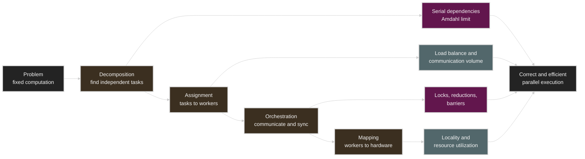
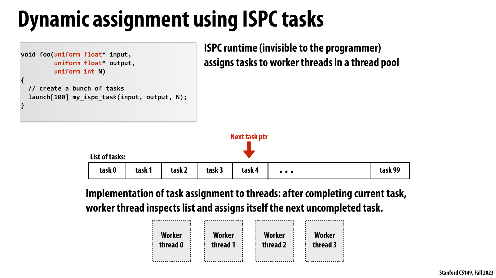
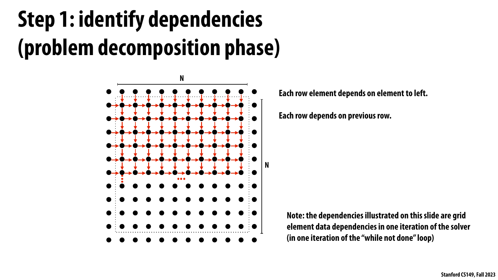
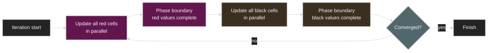
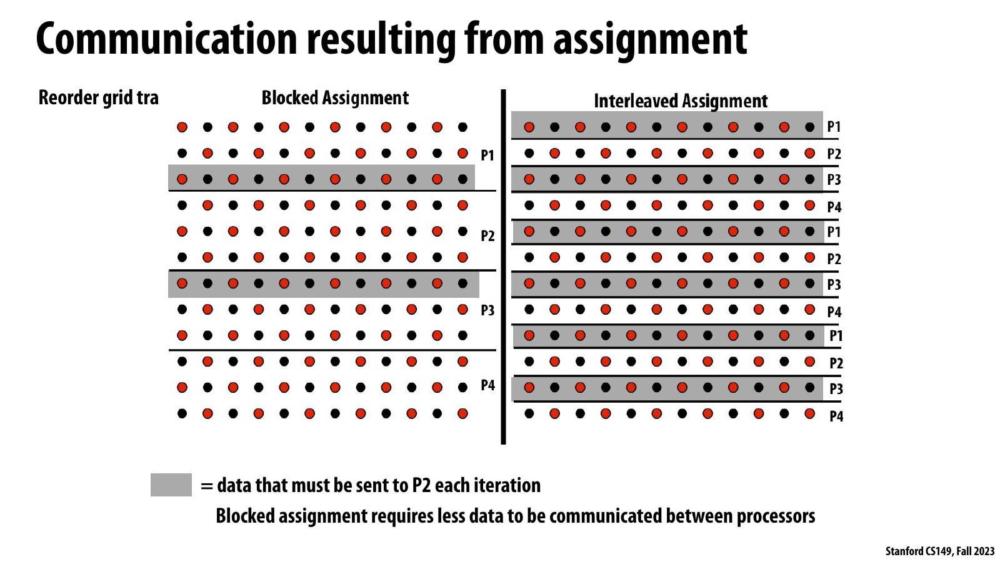
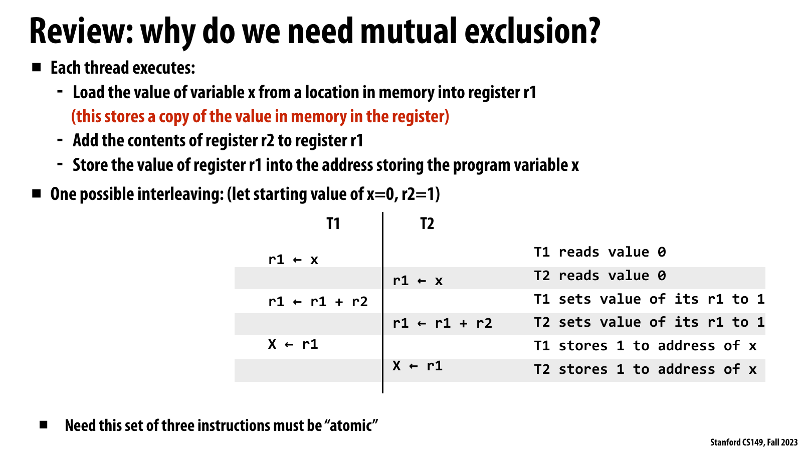
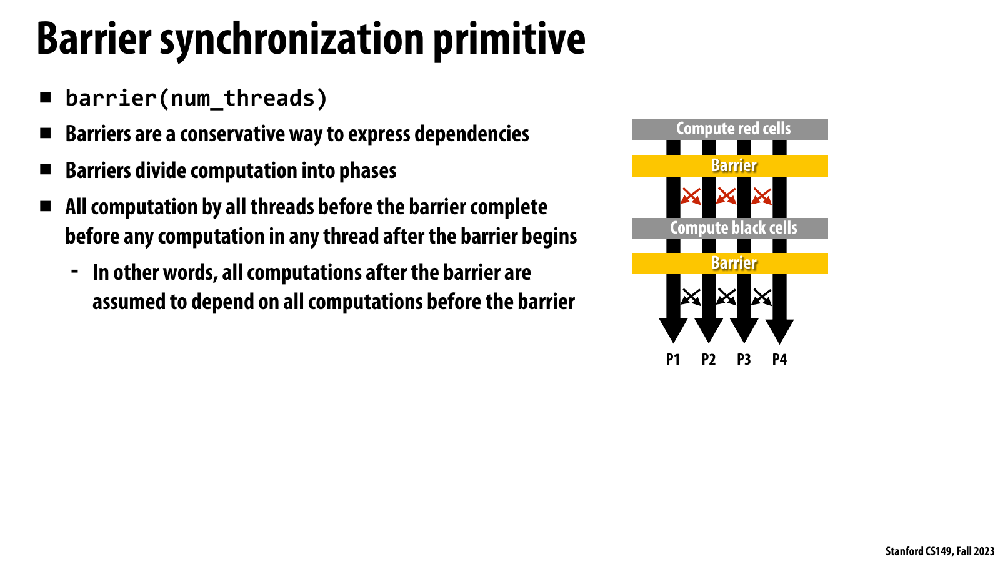
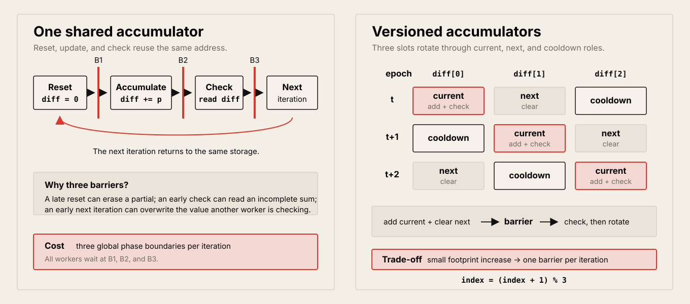

# Lecture 4: Parallel Programming Basics

Source: [Stanford CS149 2023 Lecture 4](https://www.youtube.com/watch?v=0-ztm8SKq70)

Course materials:

* [CS149 Fall 2023 course page](https://gfxcourses.stanford.edu/cs149/fall23)
* [Lecture 4 slides PDF](https://gfxcourses.stanford.edu/cs149/fall23content/media/progbasics/04_progbasics.pdf)
* [ISPC documentation](https://ispc.github.io/)

> 영상의 앞 약 40분은 Lecture 3의 ISPC programming model, `foreach`, reduction,
> task system을 복습하고 thread-pool overhead를 실험한다. Lecture 4의 공식 주제인
> parallel programming case study는 `40:21`부터 시작한다. 영상 마지막에 과제로
> 남긴 three-barrier solver의 one-barrier 변환과 programming-model 비교는 강의
> 슬라이드를 참고해 보완했다.

## Table of Contents

* [Goal](#goal)
* [Lecture Overview](#lecture-overview)
* [Visual Map](#visual-map)
* [From ISPC Review to Parallel Programming Basics](#from-ispc-review-to-parallel-programming-basics)
* [The Four Responsibilities of a Parallel Program](#the-four-responsibilities-of-a-parallel-program)
* [Speedup and Amdahl's Law](#speedup-and-amdahls-law)
* [Image Example: Parallel Map and Reduction](#image-example-parallel-map-and-reduction)
* [Decomposition and Dependency Analysis](#decomposition-and-dependency-analysis)
* [Assignment: Static and Dynamic](#assignment-static-and-dynamic)
* [Orchestration and Mapping](#orchestration-and-mapping)
* [Task Granularity and Thread Pools](#task-granularity-and-thread-pools)
* [The 2D Grid Solver](#the-2d-grid-solver)
* [Why Naive Gauss-Seidel Is Hard to Parallelize](#why-naive-gauss-seidel-is-hard-to-parallelize)
* [Red-Black Ordering](#red-black-ordering)
* [Work Assignment and Communication](#work-assignment-and-communication)
* [Data-Parallel Expression](#data-parallel-expression)
* [Shared Address Space and SPMD](#shared-address-space-and-spmd)
* [Mutual Exclusion and Atomicity](#mutual-exclusion-and-atomicity)
* [Local Accumulation and Reduction](#local-accumulation-and-reduction)
* [Barrier Synchronization](#barrier-synchronization)
* [Reducing Three Barriers to One](#reducing-three-barriers-to-one)
* [Comparing Programming Models](#comparing-programming-models)
* [GPU Systems Lens](#gpu-systems-lens)
* [Practical Tips and Notes](#practical-tips-and-notes)
* [Lecture Summary](#lecture-summary)
* [Key Terms](#key-terms)
* [Questions](#questions)
* [Answers](#answers)

---

## Goal

이번 강의의 목표는 sequential program을 parallel program으로 바꾸는 사고 과정을
체계화하는 것이다. 핵심은 thread나 API를 먼저 고르는 것이 아니라, computation의
dependency를 찾아 independent work를 드러낸 뒤 그 work를 worker와 hardware에
배치하고 필요한 communication과 synchronization을 설계하는 데 있다.

강의가 제시하는 네 단계는 다음과 같다.

```text
problem
  -> decomposition: independent task를 찾는다
  -> assignment: task를 worker에게 나눈다
  -> orchestration: communication과 synchronization을 조직한다
  -> mapping: worker를 hardware execution unit에 대응시킨다
```

핵심 메시지는 다음과 같다.

> Parallel programming은 sequential code에 thread를 덧붙이는 작업이 아니다.
> Dependency를 분석하고, 필요하면 algorithm이나 update order를 바꾸며, 충분한
> parallelism과 낮은 communication/synchronization cost를 함께 만드는 작업이다.
> 최대 speedup은 남아 있는 serial work에 제한되고, 올바른 결과를 위해서는 모든
> shared update와 phase dependency가 명시적으로 보존되어야 한다.

이 강의는 다음을 다룬다.

* Speedup의 정의와 Amdahl's Law
* Decomposition, assignment, orchestration, mapping의 역할
* Independent task를 찾기 위한 dependency analysis
* Static assignment와 dynamic assignment
* Task와 worker thread를 구분해야 하는 이유
* Task granularity, thread creation cost, thread pool
* 2D Gauss-Seidel grid solver의 dependency structure
* Red-black coloring을 이용한 algorithmic reordering
* Work assignment가 communication volume에 미치는 영향
* Data-parallel model과 shared-address-space/SPMD model
* Lock, mutual exclusion, atomicity, race condition
* Barrier가 computation을 phase로 나누는 방식
* Local partial accumulation과 hierarchical reduction
* Replication으로 dependency와 barrier 수를 줄이는 방법

## Lecture Overview

영상 전반부는 Lecture 3의 abstraction과 implementation 구분을 다시 확인한다. ISPC
function call의 semantics는 gang의 여러 program instance가 같은 code를 각각의
`programIndex`로 실행하는 것이다. 현재 compiler는 이를 SIMD instruction으로
구현하지만, source-level reasoning은 특정 scheduling이나 vector width에 의존하면 안
된다. `foreach`는 independent iteration set을 system에 넘기며, task는 한 단계 위에서
gang 단위 work를 worker thread에 넘긴다.

Thread-pool demo는 task와 thread가 같은 개념이 아님을 보여 준다. 아주 작은 empty
task를 대상으로 한 강의실 실험에서 sequential call은 8-thread pool보다 23배
빨랐고, thread pool은 task마다 C++ thread를 생성하는 방식보다 300배 빨랐다. 이
숫자는 특정 demo의 결과이지 일반적인 상수가 아니다. 중요한 결론은 useful work가
작으면 scheduling overhead가 지배하고, task 수만큼 OS thread를 만드는 것은
oversubscription과 thread lifecycle cost를 유발한다는 점이다.

본론은 parallel program을 만드는 네 책임을 소개한 뒤 Amdahl's Law를 image
brightness/average 예시에 적용한다. 첫 phase만 parallelize하면 전체 speedup은 2로
제한된다. Average까지 partial reduction으로 바꾸면, input이 processor 수보다 충분히
클 때 speedup은 `P`에 가까워진다. 이 예시는 serial fraction을 줄이기 위해 algorithm
전체의 dependency를 봐야 한다는 점을 강조한다.

후반부는 in-place 2D Gauss-Seidel solver를 case study로 사용한다. 원래 traversal은
왼쪽 cell과 이전 row의 새 값에 의존하므로 diagonal wavefront parallelism만 드러난다.
하지만 이 방식은 시작과 끝의 parallelism이 작고 diagonal마다 synchronization이
필요하다. Domain knowledge를 사용해 checkerboard를 red/black으로 나누면 모든 red
cell을 병렬 update한 뒤 모든 black cell을 병렬 update할 수 있다.

같은 solver를 data-parallel model과 shared-address-space/SPMD model로 표현하면서
abstraction의 차이를 비교한다. Data-parallel version은 assignment, reduction,
phase-end wait를 system에 맡긴다. SPMD version은 각 thread가 자신의 row block을
계산하고 lock과 barrier를 직접 사용한다. 마지막으로 local partial을 이용해 lock
frequency를 줄이고, `diff` accumulator를 여러 copy로 만들어 세 barrier를 하나로
줄이는 optimization을 살펴본다.

영상 진행을 기준으로 보면 주요 구간은 다음과 같다.

| Time | Topic |
| ---- | ----- |
| `00:00–15:15` | Assignment 1 질문, ISPC semantics와 SIMD implementation 복습 |
| `15:16–28:05` | `foreach`, race, varying partial, `reduce_add` |
| `28:06–40:20` | ISPC task, task와 thread의 차이, thread-pool overhead demo |
| `40:21–48:42` | Parallelization workflow, speedup, Amdahl's Law, image example |
| `48:43–53:31` | Assignment, orchestration, hardware mapping |
| `53:32–01:03:38` | Grid solver dependency, red-black ordering, communication |
| `01:03:39–01:12:34` | Data-parallel vs. shared address space, lock과 reduction |
| `01:12:35–01:17:14` | Barrier semantics, three-barrier dependency, replication hint |

## Visual Map

Lecture 4는 parallel program을 다음과 같은 decision flow로 설명한다.



---

## From ISPC Review to Parallel Programming Basics

강의가 본론 전에 ISPC를 길게 복습하는 이유는 parallel abstraction을 정확히 읽는
습관이 이후 case study에도 그대로 적용되기 때문이다.

| Concept | Semantic meaning | Typical implementation |
| ------- | ---------------- | ---------------------- |
| ISPC gang | 함께 function을 실행하는 program instance 집합 | 한 CPU thread가 SIMD instruction 실행 |
| `foreach` | Gang 전체가 independent iteration set을 수행 | Iteration을 SIMD lane에 static interleaving |
| Reduction | Instance별 partial을 하나의 uniform value로 결합 | Horizontal add 또는 shuffle sequence |
| ISPC task | 한 gang이 수행할 coarse-grained work | Runtime thread pool의 worker가 task를 가져감 |

`foreach`와 task는 서로 다른 level의 assignment를 system에 맡긴다.

```text
task list
  -> worker thread 0 executes a gang
  -> worker thread 1 executes a gang
  -> ...

inside each gang
  -> foreach iterations are assigned to program instances
  -> program instances are implemented with SIMD lanes
```



강의 슬라이드는 `launch[100]`이 100개의 logical task를 만들더라도 runtime은 작은
worker thread pool을 유지한다는 점을 시각화한다. 각 worker는 현재 task를 마치면
shared task list의 next pointer를 통해 아직 완료되지 않은 task를 가져간다. Task
decomposition과 worker provisioning을 분리하기 때문에 task 수가 hardware context
수보다 훨씬 많아도 OS thread를 같은 수만큼 만들 필요가 없다.

따라서 one million tasks를 선언했다고 one million OS threads가 필요하지 않다. Task는
해야 할 일이고 worker는 그 일을 반복해서 가져가는 execution agent다. 이 구분은 곧
소개할 decomposition과 assignment의 구분이기도 하다.

강의는 programming model을 읽을 때 다음 순서를 권한다.

1. 먼저 language construct가 어떤 result와 ordering을 보장하는지 이해한다.
2. 그 contract 아래 허용되는 모든 assignment와 schedule에서 program이 correct한지
   확인한다.
3. 그 다음에 compiler, runtime, hardware가 현재 어떻게 구현하는지 분석한다.
4. 특정 implementation에 기대는 optimization은 measurement와 portability cost를
   함께 평가한다.

## The Four Responsibilities of a Parallel Program

Parallel program을 만드는 과정은 네 책임으로 나눌 수 있다.

| Responsibility | Main question | Primary goal |
| -------------- | ------------- | ------------ |
| Decomposition | 어떤 work가 independent한가? | 충분한 parallel task 생성 |
| Assignment | 각 task를 어떤 worker가 수행하는가? | Load balance와 낮은 communication |
| Orchestration | Worker들이 언제 무엇을 주고받고 기다리는가? | Correct dependency와 낮은 sync cost |
| Mapping | Worker가 어떤 hardware unit에서 실행되는가? | Locality와 resource utilization |

이 책임을 programmer, compiler, runtime, OS, hardware가 나누어 맡는다. 예를 들어
programmer가 image의 pixel iteration이 independent하다고 선언하면 compiler가
iteration을 vector lane에 assign할 수 있다. OS는 software thread를 CPU hardware
context에 mapping하고, GPU hardware는 CUDA block을 available SM에 mapping한다.

네 단계는 완전히 독립적이지 않다. Decomposition이 너무 fine-grained하면 task 수는
많아지지만 scheduling overhead가 커진다. Assignment가 고르게 보여도 관련 data가
멀리 떨어지면 communication이 늘 수 있다. Barrier를 추가하면 correctness는 쉽게
표현되지만 빠른 worker가 느린 worker를 기다리면서 utilization이 낮아질 수 있다.

> [!TIP]
> Parallel code review에서는 “몇 threads인가?”보다 먼저 task graph를 그린다. Node는
> work, edge는 반드시 보존해야 하는 dependency로 표현하면 decomposition과
> orchestration 문제를 분리해서 볼 수 있다.

## Speedup and Amdahl's Law

고정된 computation에 대해 `P` processors를 사용한 speedup은 다음과 같다.

```text
Speedup(P) = T(1) / T(P)
```

Sequential execution time 중 fraction `S`가 dependency 때문에 본질적으로 serial이고,
나머지 `1-S`가 `P` processors에 완벽하게 분산된다고 하자.

```text
T(P) / T(1) = S + (1 - S) / P

Speedup(P) = 1 / (S + (1 - S) / P)
```

`P`가 무한히 커져도 parallel part만 0에 가까워질 뿐 serial part는 남는다.

```text
lim(P -> infinity) Speedup(P) = 1 / S
```

| Serial fraction `S` | Infinite-processor upper bound |
| ------------------- | ------------------------------ |
| 10% | 10x |
| 5% | 20x |
| 1% | 100x |
| 0.1% | 1,000x |


원본 graph는 `P=64`까지 processor를 늘렸을 때 `S=0.01`, `0.05`, `0.1` curve가
각각 다른 ceiling으로 휘어지는 모습을 보여 준다. Processor가 추가될수록 curve의
slope가 작아지므로 “core를 더 추가했는데 얻는 speedup”이라는 marginal benefit도
serial fraction에 의해 빠르게 감소한다.

강의 슬라이드는 Summit supercomputer의 `27,648 GPUs × 5,376 FP32 ALUs/GPU =
148,635,648 ALUs`를 예로 든다. Application의 0.1%가 serial이면 1억 개가 넘는
parallel ALU를 보유해도 Amdahl upper bound는 1,000x다. Processor를 늘릴수록 작은
serial region, global synchronization, sequential reduction의 상대적 영향이 커진다.

Amdahl's Law는 실제 runtime을 완전히 예측하는 model이 아니다. Parallel overhead,
load imbalance, memory bandwidth, cache behavior, communication은 식에 포함되지 않는다.
따라서 이 식은 optimistic upper bound이며, 실제 speedup은 보통 더 낮다.

## Image Example: Parallel Map and Reduction

`N × N` image에 두 operation을 수행한다고 하자.

1. 모든 pixel brightness를 2배로 만든다.
2. 모든 pixel의 average를 계산한다.

두 phase가 각각 약 `N²` work를 가지면 sequential time은 약 `2N²`이다.

첫 phase만 `P` processors로 parallelize하고 second phase를 serial로 남기면 다음과
같다.

```text
T(P) = N²/P + N²

Speedup(P) = 2N² / (N²/P + N²)
           -> 2  as P grows
```

Brightness update가 완벽하게 scale해도 전체 speedup이 2를 넘지 못한다. 전체 work의
절반인 average phase가 serial이기 때문이다.

Average도 parallelize하려면 각 processor가 약 `N²/P` pixel의 partial sum을 만들고
마지막에 `P` partial을 합친다. 단순하게 final combine을 serial로 수행하면 다음과
같다.

```text
phase 1: N²/P
phase 2: N²/P + P

T(P) ≈ 2N²/P + P
```

`N`이 `P`보다 충분히 크면 `P`개의 partial을 합치는 overhead가 전체 work에 비해
작아져 speedup은 `P`에 가까워진다. 그러나 input이 작거나 `P`가 매우 크면 final
combine이 다시 bottleneck이 된다. 실제 system은 tree reduction으로 combine depth를
`O(log P)`에 가깝게 줄일 수 있다.

이 예시가 주는 일반 원칙은 다음과 같다.

* Element-wise transform은 independent iteration을 찾기 쉽다.
* Aggregation은 cross-worker communication을 요구한다.
* Reduction을 parallelize해도 partial combine overhead는 사라지지 않는다.
* Parallelism을 한 phase에만 추가해서는 end-to-end speedup을 얻기 어렵다.

## Decomposition and Dependency Analysis

Decomposition은 problem을 병렬로 수행할 수 있는 task로 나누는 단계다. 일반적으로
machine의 모든 execution unit을 busy하게 유지할 만큼 task를 만들어야 한다. 하지만
task 수가 많다는 사실만으로 parallelism이 생기는 것은 아니다. Dependency edge로
연결된 task는 required order를 지켜야 한다.

Dependency를 찾을 때 각 operation의 read/write set을 적으면 도움이 된다.

| Relationship | Example | Consequence |
| ------------ | ------- | ----------- |
| Read-after-write | `B`가 `A`가 쓴 값을 읽음 | `A -> B` 순서 필요 |
| Write-after-read | `B`가 `A`가 읽을 값을 덮어씀 | 순서 변경 시 `A`의 input 변화 |
| Write-after-write | 두 task가 같은 location에 씀 | Final value가 order에 의존 |
| Disjoint access | 서로 겹치지 않는 location 사용 | Parallel execution 가능 |

General-purpose compiler가 arbitrary sequential program을 자동으로 완벽히 parallelize하기
어려운 이유도 dependency 때문이다. Address가 input data에 따라 정해지거나 function
side effect가 복잡하면 compile time에 independence를 증명하기 어렵다. 그래서 대부분의
parallel program에서는 programmer가 domain knowledge로 decomposition을 제시한다.

Decomposition에는 algorithm choice도 포함된다. 기존 sequential execution order가
dependency를 많이 만든다면, 같은 acceptable solution을 계산하는 다른 algorithm이나
update order를 선택해 dependency graph 자체를 바꿀 수 있다. Grid solver의 red-black
ordering이 바로 이 경우다.

## Assignment: Static and Dynamic

Assignment는 decomposed task를 worker에게 배분하는 단계다. 여기서 worker는 CPU
thread, ISPC program instance, SIMD lane, GPU thread/block 등 문맥에 따라 달라진다.

Assignment의 두 가지 주요 목표는 다음과 같다.

* 모든 worker가 비슷한 시간 동안 useful work를 수행하도록 load를 balance한다.
* 서로 data를 주고받는 task를 적절히 모아 communication과 locality cost를 줄인다.

| Strategy | Decision time | Strength | Risk |
| -------- | ------------- | -------- | ---- |
| Static assignment | 실행 전 또는 compile time | 낮은 scheduling overhead, 예측 가능 | Irregular work에서 imbalance |
| Dynamic assignment | 실행 중 | 변화하는 task cost에 적응 | Queue/atomic overhead, locality 손실 |

강의의 예시는 abstraction에 따라 assignment 책임이 달라짐을 보여 준다.

* Manual ISPC indexing은 programmer가 iteration을 program instance에 static하게
  assign한다.
* ISPC `foreach`는 programmer가 independence만 선언하고 compiler가 assignment를
  선택한다. 현재 implementation은 static이지만 abstraction은 더 넓은 선택을 허용한다.
* C++ thread example은 array의 앞/뒤 절반을 두 thread에 static blocked assignment한다.
* ISPC task runtime은 완료된 worker가 queue에서 다음 task를 가져가도록 dynamic
  assignment할 수 있다.

Assignment policy는 correctness가 아니라 performance choice여야 한다. 특정 worker가
특정 iteration을 맡아야만 correct한 `foreach` program은 abstraction contract를 어긴다.

## Orchestration and Mapping

Orchestration은 parallel worker의 cooperation을 조직한다.

* Shared value와 message의 communication structure
* Dependency를 보존하기 위한 lock, atomic, barrier
* Memory 안의 data layout과 ownership
* Task execution order와 scheduling
* Reduction, broadcast, halo exchange 같은 collective pattern

Orchestration의 목적은 correctness를 유지하면서 communication, synchronization,
scheduling overhead를 최소화하고 locality를 보존하는 것이다. Machine에서
synchronization이 비싸다면 더 큰 phase로 묶거나 local accumulation을 사용해
synchronization frequency를 낮출 수 있다.

Mapping은 logical worker를 physical execution resource에 대응시킨다.

| Mapping agent | Example |
| ------------- | ------- |
| Operating system | Software thread를 CPU core의 hardware context에 배치 |
| Compiler | ISPC program instance를 vector lane에 배치 |
| Runtime | Task를 worker thread 또는 device queue에 배치 |
| Hardware | CUDA thread block을 available GPU SM에 배치 |

Related worker를 같은 core나 가까운 memory domain에 놓으면 data sharing과
communication cost를 줄일 수 있다. 반대로 resource demand가 다른 unrelated work를
함께 놓아 compute pipeline과 memory pipeline을 보완적으로 사용할 수도 있다. 좋은
mapping은 workload와 hardware topology에 따라 달라진다.

## Task Granularity and Thread Pools

Task는 work description이고 thread는 task를 실행하는 worker다. 둘을 일대일로 만들면
task가 많을 때 thread creation, destruction, OS scheduling, context switching cost가
useful work보다 커질 수 있다.

```text
bad for many small tasks
task 0 -> create thread 0 -> run -> join
task 1 -> create thread 1 -> run -> join
...

typical runtime design
fixed-size worker pool
  -> worker gets next task
  -> executes task
  -> gets another task
```

강의 demo는 거의 아무 일도 하지 않는 function을 task로 사용해 overhead를
의도적으로 확대했다.

| Strategy | Lecture demo observation |
| -------- | ------------------------ |
| Sequential function calls | 가장 빠름 |
| Eight-worker thread pool | Sequential보다 약 23배 느림 |
| One C++ thread per task | Thread pool보다 약 300배 느림 |

이 결과는 parallel execution이 항상 빠르지 않다는 극단적인 예다. Task가 충분히
무거워지면 worker pool의 병렬 실행이 sequential보다 빨라진다. 핵심 variable은
task당 useful work와 dispatch/synchronization overhead의 비율이다.

강의는 OS context switching과 hardware multi-thread switching도 구분한다. OS는
software thread의 architectural state를 저장하고 다른 thread를 schedule하므로 매우
비싸다. Hardware multi-threaded core는 resident context 사이에서 instruction을
선택하도록 설계되어 훨씬 빠르다. Memory latency를 숨기기 위해 application이 수많은
OS threads를 oversubscribe하는 것은 hardware multi-threading과 같은 효과가 아니다.

## The 2D Grid Solver

강의의 main case study는 `(N+2) × (N+2)` grid에서 PDE를 iterative하게 푸는
Gauss-Seidel-style solver다. Border를 제외한 각 cell을 자신의 현재 값과 상하좌우
neighbor의 평균으로 in-place update한다.

```text
A[i,j] = 0.2 * (
    A[i,j]   + A[i,j-1] + A[i-1,j]
               + A[i,j+1] + A[i+1,j]
)
```

한 sweep의 total change를 `diff`에 누적하고 average change가 tolerance보다 작으면
iteration을 멈춘다.

```c
while (!done) {
    float diff = 0.0f;

    for (int i = 1; i <= N; ++i) {
        for (int j = 1; j <= N; ++j) {
            float old = A[i][j];
            A[i][j] = update_from_neighbors(A, i, j);
            diff += abs(A[i][j] - old);
        }
    }

    done = diff / (N * N) < tolerance;
}
```

이 code를 단순히 nested loop parallelization 대상으로 보면 안 된다. In-place update
때문에 현재 sweep의 새 값과 아직 update되지 않은 이전 값을 함께 읽으며, traversal
order가 dependency와 numerical path를 결정한다.

## Why Naive Gauss-Seidel Is Hard to Parallelize

Row-major traversal에서 한 cell은 같은 row의 왼쪽 cell과 이전 row의 cell이 먼저
update되기를 기다린다.

```text
dependency direction

      from previous row
             ↓
left  ->  current cell
```



원본 dependency diagram에서 horizontal arrow는 같은 row의 왼쪽 element가 먼저
완료되어야 함을, vertical arrow는 이전 row의 element가 먼저 완료되어야 함을
나타낸다. 이 dependency는 solver 전체가 아니라 한 번의 `while (!done)` iteration
안에서 형성되는 관계다.

같은 anti-diagonal 위의 cell은 서로 직접 의존하지 않으므로 wavefront parallelism이
존재한다.

```text
time 0: 1 cell
time 1: 2 cells
time 2: 3 cells
...
middle: O(N) cells
...
end: 1 cell
```

가능한 implementation은 diagonal의 cell을 task로 나누어 parallel update하고, 모든
task가 끝난 뒤 다음 diagonal로 이동하는 것이다. Correct하지만 다음 문제가 있다.

* 시작과 끝에는 independent work가 적어 machine utilization이 낮다.
* Diagonal 길이가 계속 변해 assignment와 load balancing이 복잡하다.
* 거의 모든 diagonal 사이에 synchronization이 필요하다.
* 짧은 phase가 많아 barrier overhead와 straggler wait가 커진다.

Dependency graph에서 parallelism을 찾았다고 좋은 parallel algorithm이 자동으로
나오는 것은 아니다. Parallelism의 amount, shape, synchronization frequency도 함께
평가해야 한다.

## Red-Black Ordering

Grid를 checkerboard처럼 red와 black cell로 coloring하면 한 color의 cell은 모두 반대
color의 neighbor만 가진다.

```text
R B R B R B
B R B R B R
R B R B R B
B R B R B R
```

이 property를 사용하면 한 iteration을 두 phase로 바꿀 수 있다.



Red phase 안에서는 각 red cell update가 independent하고, black phase 안에서도 각
black cell update가 independent하다. Diagonal마다 기다리던 algorithm이 color당 큰
parallel phase 하나를 가지는 algorithm으로 바뀐다.

이 reordering은 원래 sequential traversal과 bitwise-identical intermediate value를
계산하지 않는다. Floating-point operation order와 iteration별 value가 달라지고
convergence path도 달라질 수 있다. 다만 domain knowledge에 따라 같은 PDE solution에
tolerance 범위로 수렴하는 것이 acceptable하다고 판단한다. Parallelism을 위해
algorithm을 바꿀 때는 이런 semantic relaxation이 허용되는지 먼저 확인해야 한다.

## Work Assignment and Communication

Red-black decomposition 이후에도 cell을 processor에 assign하는 방법이 남는다. 예를
들어 row block 또는 interleaved cell assignment를 사용할 수 있다.

Blocked assignment는 각 processor가 contiguous region을 담당한다.

```text
processor 0: rows 1 ... N/P
processor 1: rows N/P+1 ... 2N/P
...
```

Neighbor update에 필요한 remote data는 partition boundary에 집중된다. 각 region의
interior는 local data만 사용하므로 boundary-to-volume ratio가 작다.

Interleaved assignment는 work count를 고르게 만들 수 있지만 adjacent cell이 다른
processor에 흩어질 수 있다. 그러면 각 iteration에서 더 많은 neighbor value를
communicate해야 한다. 강의의 grid 예시에서는 blocked assignment가 processor 사이에
보내야 할 data를 줄인다.



슬라이드의 gray row는 `P2`가 한 iteration에서 받아야 하는 remote data다. Blocked
assignment에서는 gray region이 partition boundary 근처에만 나타나지만, interleaved
assignment에서는 `P2`와 인접한 row가 grid 전체에 반복된다. 같은 cell update 수를
배분해도 assignment가 달라지면 communication surface가 크게 달라진다.

| Assignment quality | Question |
| ------------------ | -------- |
| Load balance | 각 worker의 useful work가 비슷한가? |
| Communication volume | Partition boundary를 가로지르는 dependency가 몇 개인가? |
| Locality | 한 worker가 contiguous/reused data를 접근하는가? |
| Synchronization | Worker가 얼마나 자주 서로 기다려야 하는가? |

“어떤 assignment가 더 좋은가?”의 답은 system에 따라 달라진다. Shared-cache CPU,
NUMA CPU, multi-GPU, distributed-memory cluster는 communication granularity와 cost가
다르므로 같은 decomposition에도 다른 assignment가 유리할 수 있다.

## Data-Parallel Expression

Data-parallel model에서는 programmer가 independent collection과 operation을 표현하고
system이 worker assignment와 orchestration의 많은 부분을 담당한다. Red phase만
단순화한 pseudocode는 다음과 같다.

```c
while (!done) {
    float diff = 0.0f;

    for_all (red cells (i, j)) {
        float old = A[i][j];
        A[i][j] = update_from_neighbors(A, i, j);
        reduce_add(diff, abs(A[i][j] - old));
    }

    done = diff / (N * N) < tolerance;
}
```

이 abstraction에서 역할 분담은 다음과 같다.

* Decomposition: 개별 red cell update가 independent work임을 programmer가 표현한다.
* Assignment: 어떤 worker가 어떤 cell을 처리할지 system이 정한다.
* Orchestration: `for_all` 종료의 implicit wait와 built-in reduction을 system이 제공한다.
* Communication: Array load/store와 reduction primitive에 내포된다.

Single logical control flow가 `for_all`에 들어갔다가 모든 parallel iteration이 끝난 뒤
다시 sequential control로 돌아온다고 생각할 수 있다. 이 model은 concise하고
assignment/synchronization bug의 surface를 줄이지만, system의 scheduling과 data
placement가 workload에 적합한지는 별도로 측정해야 한다.

## Shared Address Space and SPMD

Shared-address-space model에서는 모든 thread가 같은 address space의 variable을
load/store하여 communicate한다. 강의는 이를 누구나 읽고 쓸 수 있는 bulletin board에
비유한다.

SPMD expression에서는 같은 `solve` function을 여러 thread가 실행하며 각 thread는
`threadId`로 자신의 blocked row range를 계산한다.

```c
int thread_id = get_thread_id();
int row_begin = 1 + thread_id * N / num_threads;
int row_end = 1 + (thread_id + 1) * N / num_threads;

while (!done) {
    float my_diff = 0.0f;

    for (int i = row_begin; i < row_end; ++i) {
        for (red cells j in row i) {
            float old = A[i][j];
            A[i][j] = update_from_neighbors(A, i, j);
            my_diff += abs(A[i][j] - old);
        }
    }

    // combine my_diff and synchronize phases explicitly
}
```

Programmer는 다음을 직접 결정한다.

* `threadId`를 row block에 mapping하는 방법
* Shared grid와 thread-local variable의 구분
* `my_diff` partial을 global `diff`에 결합하는 방법
* 모든 update가 끝났음을 확인하는 barrier 위치
* 다음 iteration이 이전 iteration의 state를 덮어쓰지 않도록 하는 ordering

Shared address space는 sequential programming의 자연스러운 확장이지만 load/store가
thread communication이 될 수 있다는 점을 항상 고려해야 한다. 같은 address를
concurrent하게 접근할 때 적어도 하나가 write라면 synchronization 또는 명확한
ownership rule이 필요하다.

## Mutual Exclusion and Atomicity

두 thread가 shared `x`에 `x++`를 실행한다고 하자. Source에서는 한 줄이지만
implementation은 최소한 다음 read-modify-write sequence를 포함한다.

```text
r1 = load x
r1 = r1 + 1
store x = r1
```

`x = 0`에서 다음 interleaving이 가능하다.

```text
thread 0: load x -> 0
thread 1: load x -> 0
thread 0: add -> 1
thread 1: add -> 1
thread 0: store 1
thread 1: store 1
```



원본 interleaving은 source-level `x++` 하나가 load, register add, store의 세
instruction으로 풀린다는 점을 강조한다. Gray row처럼 두 thread의 instruction이
사이에 끼어들면 각각의 `r1`은 private copy이므로 둘 다 0에서 1을 계산하고, 마지막
두 store가 같은 값 1을 써서 update 하나가 사라진다.

두 번 increment했지만 final value는 1이다. 이것이 lost update이며, program result가
schedule에 의존하는 race condition이다.

Lock은 critical section에 한 thread만 들어가도록 mutual exclusion을 제공한다.

```c
lock(mutex);
diff += my_diff;
unlock(mutex);
```

다른 선택으로 hardware-supported atomic read-modify-write나 language-level atomic
block을 사용할 수 있다. 어떤 mechanism을 쓰든 필요한 semantic은 shared update가
쪼개지지 않는 하나의 atomic action처럼 보이게 하는 것이다.

> [!WARNING]
> `+=`, `++`, check-then-update 같은 source expression을 atomic이라고 가정하면 안 된다.
> Compiler와 ISA가 제공하는 atomic type/operation 또는 lock으로 명시해야 한다.

## Local Accumulation and Reduction

Correctness를 위해 모든 cell update마다 global `diff` lock을 잡을 수 있지만, inner
loop의 fine-grained synchronization은 worker를 사실상 serialize하고 lock contention을
키운다.

더 좋은 방법은 thread마다 private partial을 계산한 뒤 한 번만 global accumulator에
합치는 것이다.

```text
for each worker:
  my_diff = sum(changes in my assigned cells)   // no lock

then:
  lock
  global_diff += my_diff                        // once per worker
  unlock
```

| Design | Shared updates per iteration | Contention |
| ------ | ---------------------------- | ---------- |
| Global update per cell | `O(N²)` | 매우 높음 |
| One partial per worker | `O(P)` | 훨씬 낮음 |
| Tree reduction | `O(P)` total, `O(log P)` depth | 계층적으로 분산 가능 |

이 pattern은 Lecture 3의 ISPC varying partial과 `reduce_add`와 같다. 먼저 local/private
state에서 대부분의 work를 수행하고, cross-worker communication은 마지막 combine에
제한한다. Local copy를 위한 작은 memory footprint를 사용해 synchronization frequency와
contention을 줄이는 trade-off다.

## Barrier Synchronization

Barrier는 모든 participating thread가 도착할 때까지 어느 thread도 다음 phase로
넘어가지 못하게 한다.

```text
all work before barrier by all threads completes
                         ↓
                     barrier
                         ↓
any work after barrier may begin
```



슬라이드 오른쪽의 네 vertical stream은 `P1`부터 `P4`까지의 execution을 나타낸다.
먼저 barrier에 도착한 worker는 통과하지 못하고, 마지막 worker가 red phase를 끝내야
모든 worker가 black phase로 진행할 수 있다. Barrier는 필요한 dependency보다 더 넓은
scope를 막을 수 있다는 의미에서 conservative한 synchronization이다.

Barrier는 “이후의 모든 work가 이전의 모든 work에 의존한다”는 conservative한
dependency 표현이다. Red phase와 black phase 사이처럼 실제로 global phase ordering이
필요할 때 자연스럽다. 하지만 일부 dependency만 필요한데 full barrier를 쓰면 unrelated
worker까지 기다리게 된다.

강의의 first shared-address-space solver는 iteration마다 세 barrier를 사용한다.

```text
1. diff = 0
   barrier A

2. compute local work and add partial into diff
   barrier B

3. read diff and decide whether converged
   barrier C

4. next iteration
```

각 barrier에는 서로 다른 correctness 목적이 있다.

| Barrier | Dependency it preserves | Without it |
| ------- | ----------------------- | ---------- |
| A: reset 후 | 모든 reset이 끝난 뒤 contribution 시작 | 늦은 reset이 이미 더한 partial을 지움 |
| B: contribution 후 | 모든 partial이 끝난 뒤 convergence check | 불완전한 `diff`로 너무 일찍 종료 가능 |
| C: check 후 | 모두 이전 `diff`를 읽은 뒤 다음 iteration 시작 | 빠른 thread가 `diff`를 reset/update해 느린 thread의 check를 오염 |

Barrier wait time은 가장 느린 participating worker에 의해 결정된다. 따라서 phase 안의
load imbalance가 크면 빠른 worker의 idle time도 커진다.

## Reducing Three Barriers to One

세 barrier가 필요한 원인은 모든 iteration이 같은 `diff` storage를 reset, update,
read하기 때문이다. Lecture slides는 successive iteration이 서로 다른 accumulator를
사용하도록 `diff`를 replicate해 이 storage dependency를 제거한다.



왼쪽은 하나의 `diff`를 reset, accumulate, check, 다음 iteration의 reset에 계속
재사용할 때 세 phase boundary가 필요한 이유를 보여 준다. 오른쪽은 `diff[0..2]`가
current, next, cooldown 역할을 번갈아 맡도록 해, current slot의 contribution과 next
slot의 clear가 끝나는 지점에 barrier 하나만 두는 rolling-state 구조다.

```c
float diff[3] = {0.0f, 0.0f, 0.0f};
int index = 0;

while (true) {
    float my_diff = compute_local_change();

    lock(mutex);
    diff[index] += my_diff;
    unlock(mutex);

    diff[(index + 1) % 3] = 0.0f;
    barrier(all_threads);

    if (diff[index] / (N * N) < tolerance)
        break;

    index = (index + 1) % 3;
}
```

한 slot은 current iteration의 contribution을 모으고, 다른 slot은 future iteration을
위해 clear되며, 이전 slot은 다른 thread가 판단에 사용 중일 수 있다. Barrier 하나는
current contributions와 next-slot initialization이 모두 끝났음을 보장한다. Current와
next state가 같은 address를 재사용하지 않으므로 reset-before-update, check-before-next-
update를 위해 별도 barrier를 둘 필요가 줄어든다.

이 optimization의 일반 원칙은 다음과 같다.

> Storage를 replicate하거나 versioning하여 successive phase가 서로 다른 state를
> 사용하게 만들면 false dependency와 synchronization을 줄일 수 있다. 대신 memory
> footprint, indexing complexity, initialization cost가 증가한다.

실제 language memory model에서는 여러 thread가 같은 slot에 `0`을 쓰는 행위도 data
race가 될 수 있다. 강의의 pseudocode는 algorithmic dependency를 설명하기 위한
것이다. Production implementation은 designated initializer thread, atomic store,
per-thread partial array 등 language가 정의한 방식으로 initialization을 구현해야 한다.

## Comparing Programming Models

같은 red-black grid solver를 두 programming model로 표현하면 책임 배분이 선명해진다.

| Dimension | Data-parallel model | Shared address space + SPMD |
| --------- | ------------------- | --------------------------- |
| Logical control | `for_all` 밖은 single control flow | 모든 thread가 같은 function 실행 |
| Decomposition | Programmer가 independent elements 선언 | Programmer가 thread별 region 계산 |
| Assignment | System이 iteration을 worker에 배치 | Programmer/runtime이 명시적으로 결정 |
| Communication | Array load/store와 built-in reduce | Shared variable load/store |
| Synchronization | Loop end의 implicit wait | Explicit lock, atomic, barrier |
| Reduction | Built-in collective | Local partial + explicit combine |
| Main advantage | Concise하고 system optimization 여지 큼 | Placement와 synchronization을 세밀하게 제어 |
| Main risk | Hidden scheduling/placement cost | Race, deadlock, excessive synchronization |

두 model 모두 shared memory load/store로 grid data를 읽고 쓸 수 있다. 차이는
parallelism과 synchronization을 누가 표현하고 관리하는가에 있다. Higher-level
abstraction은 programmer burden을 줄이고 system에 더 많은 freedom을 주며,
lower-level abstraction은 control을 늘리는 대신 correctness proof와 tuning responsibility를
programmer에게 넘긴다.

## GPU Systems Lens

이 절과 이어지는 Practical Tips는 강의 개념을 이 repository의 GPU/AI systems
관점에 적용한 추가 노트다. 강의 영상이나 슬라이드의 직접 주장으로 간주하지 않는다.

| Lecture 4 concept | GPU/AI systems interpretation |
| ----------------- | ----------------------------- |
| Decomposition | Tensor element, tile, token, expert, request를 independent work로 나눔 |
| Assignment | Thread/block/SM/GPU 또는 rank에 work를 배분 |
| Orchestration | Kernel boundary, event, collective, atomic, barrier |
| Mapping | Runtime/hardware가 block을 SM에, collective chunk를 link에 배치 |
| Amdahl serial fraction | Host launch, sequential layer, global reduction, synchronization tail |
| Red-black reordering | Algorithm/data layout을 바꿔 더 큰 independent phase 생성 |
| Local partial | Warp/block-local reduction 후 global combine |
| Blocked assignment | Tile locality를 높이고 halo/collective traffic을 줄임 |
| Barrier wait | Block/rank imbalance 때문에 빠른 worker가 idle |
| State replication | Double/triple buffering, versioned accumulator, pipeline stage buffer |

CUDA에서 grid 전체 thread가 standard in-kernel barrier로 동기화할 수 있다고 가정하면 안
된다. `__syncthreads()`는 한 block 안에서만 동작한다. Red phase와 black phase 사이의
global dependency는 보통 separate kernel launch, cooperative groups의 제한된 grid sync,
또는 algorithm redesign으로 표현한다. Kernel boundary는 global phase ordering을
제공하지만 launch overhead와 intermediate memory traffic도 만든다.

AI workload에서는 decomposition level이 여러 층이다.

```text
request / batch
  -> model layer
    -> tensor operation
      -> tile / block
        -> warp / lane work
```

각 level에서 task 수와 worker 수를 혼동하지 않아야 한다. 예를 들어 token 수가 많아도
한 kernel의 tile assignment가 불균형하거나 MoE expert traffic이 skewed하면 SM 또는
GPU 사이에 straggler가 생긴다. Amdahl's Law의 serial fraction은 explicit single-thread
code뿐 아니라 모든 worker가 기다리는 control-plane step과 global collective tail에도
나타난다.

## Practical Tips and Notes

### Dependency를 code가 아니라 data version으로 추적하기

In-place algorithm은 같은 array name 안에 old/new value가 섞여 dependency가 잘 보이지
않는다. 각 read가 어느 iteration과 phase의 version을 요구하는지 표시한다.

```text
read A[t] or A[t-1]?
write A[t] before which consumer?
```

필요하면 double buffering으로 old/new array를 분리한다. Memory footprint는 늘지만
dependency, race, barrier 위치가 단순해질 수 있다.

### Baseline과 numerator를 고정하기

Speedup은 numerator에 무엇을 넣느냐에 따라 달라진다. Parallel version과 다른
algorithm, precision, convergence tolerance를 쓰면서 원래 sequential runtime으로
나누면 misleading할 수 있다. 다음을 함께 기록한다.

* 동일한 input과 output tolerance
* Warm-up 포함 여부
* Allocation, transfer, initialization 포함 범위
* One-thread parallel code인지 best sequential code인지
* End-to-end time인지 kernel-only time인지

### Task granularity를 useful work 대 overhead로 측정하기

Task size를 바꾸며 다음을 측정한다.

```text
useful compute time / (dispatch + queue + synchronization time)
```

Task가 너무 작으면 overhead가 지배하고, 너무 크면 parallelism과 load balance가
나빠진다. Worker별 task count와 busy time을 함께 보면 어느 쪽인지 구분할 수 있다.

### Reduction을 계층적으로 만들기

모든 thread가 하나의 global atomic에 직접 더하는 구조는 hot spot이 된다. GPU에서는
lane partial → warp reduction → block reduction → global reduction처럼 계층을 만든다.
각 단계에서 communication participant 수와 shared update frequency를 줄인다.

### Barrier cost를 호출 횟수만으로 판단하지 않기

같은 barrier 수라도 phase load imbalance에 따라 cost가 크게 달라진다. Profiler에서
barrier stall time, worker arrival-time spread, tail block/rank를 본다. Barrier 앞의
work distribution을 고치는 것이 barrier primitive를 바꾸는 것보다 효과적일 수 있다.

### Blocked partition의 boundary-to-volume ratio 확인하기

Stencil, convolution, attention tile처럼 neighbor data가 필요한 workload에서는 partition
volume 대비 halo/boundary 크기를 계산한다. Block을 너무 작게 만들면 parallel task는
늘지만 duplicated load나 inter-device communication 비율도 커진다.

### Numerical convergence와 reproducibility를 따로 검증하기

Parallel reduction과 red-black ordering은 floating-point addition/update order를 바꾼다.
Bitwise equality만 보거나 final loss만 보는 대신 다음을 확인한다.

* 허용 tolerance 안의 final solution
* Convergence iteration 수와 monotonicity expectation
* 여러 schedule/run에서의 variation
* NaN/Inf 발생과 worst-case residual

> [!WARNING]
> “같은 수학식”이 곧 “같은 floating-point trajectory”를 뜻하지 않는다. Algorithmic
> reordering을 적용한 뒤에는 performance뿐 아니라 convergence criterion과 numerical
> acceptance test를 다시 검증한다.

### Quick Reference

| Symptom | First check |
| ------- | ----------- |
| Core/GPU를 늘려도 speedup이 일찍 포화 | Serial fraction, global reduction, launch/sync tail |
| Worker 일부만 계속 바쁨 | Task count, task cost variance, static assignment |
| Dynamic scheduling이 오히려 느림 | Task granularity와 queue/atomic overhead |
| Grid/stencil communication이 큼 | Blocked partition, halo size, boundary-to-volume ratio |
| `x++` 결과가 예상보다 작음 | Lost update, non-atomic read-modify-write |
| Barrier에서 긴 stall | Phase imbalance, straggler, 이전 communication |
| Global atomic이 bottleneck | Per-worker partial과 hierarchical reduction |
| Barrier를 제거하자 결과가 흔들림 | Reset/update/read 사이의 cross-iteration dependency |
| Reordered solver의 값이 다름 | Floating-point order와 convergence tolerance |

## Lecture Summary

이번 강의는 parallel program을 만드는 일을 decomposition, assignment, orchestration,
mapping의 네 책임으로 정리했다. 가장 먼저 해야 할 일은 dependency를 찾아 independent
work를 드러내는 것이다. 그 다음 task를 worker에 배분하고, communication과
synchronization을 조직하며, worker를 실제 hardware에 mapping한다. 각 책임은
programmer와 system이 나누어 맡을 수 있다.

Amdahl's Law는 serial fraction이 maximum speedup을 제한함을 보여 준다. Image
brightness phase만 parallelize하면 전체 work의 절반인 average가 serial로 남아
speedup은 2로 제한된다. Partial sum으로 reduction을 parallelize해야 processor 수에
가까운 speedup을 기대할 수 있지만, combine overhead와 실제 system bottleneck은 여전히
남는다.

2D Gauss-Seidel solver는 dependency analysis와 algorithm redesign의 중요성을 보여
준다. Original in-place order에는 diagonal parallelism이 있지만 phase가 짧고
synchronization이 잦다. Red-black coloring으로 update order를 바꾸면 각 color에 큰
independent phase가 생긴다. 이 변경은 intermediate floating-point result를 바꾸므로
domain이 허용하는 solution semantics와 tolerance를 확인해야 한다.

Data-parallel model은 assignment, reduction, implicit phase wait를 system에 맡긴다.
Shared-address-space/SPMD model은 programmer가 work partition, lock, barrier를 직접
표현한다. Shared read-modify-write에는 atomicity가 필요하며, per-cell lock 대신
thread-local partial을 사용하면 contention을 크게 줄일 수 있다. 세 barrier를 하나로
줄인 예시는 state replication이 storage dependency를 제거하는 일반적인 parallel
optimization임을 보여 준다.

최종적으로 기억할 네 문장은 다음과 같다.

* Dependency analysis가 parallel program design의 출발점이다.
* Maximum speedup은 남아 있는 serial work에 제한된다.
* Task, worker, hardware execution unit은 서로 다른 개념이다.
* Locality, communication, synchronization을 무시한 parallelism은 빠른 program을
  보장하지 않는다.

## Key Terms

| Term | Meaning |
| ---- | ------- |
| Speedup | `T(1) / T(P)`, one-processor time 대비 `P`-processor time의 개선 비율 |
| Amdahl's Law | Serial fraction이 parallel speedup의 upper bound를 정한다는 법칙 |
| Decomposition | Problem을 independent하게 수행 가능한 task로 나누는 단계 |
| Dependency | 한 operation이 다른 operation의 result/order를 필요로 하는 관계 |
| Task | 수행해야 할 logical unit of work |
| Worker | Task를 가져와 실행하는 thread, program instance, process 등의 entity |
| Assignment | Task를 worker에게 배분하는 단계 |
| Static assignment | 실행 전에 정해지는 work distribution |
| Dynamic assignment | 실행 중 worker 상태에 따라 정해지는 work distribution |
| Orchestration | Communication, synchronization, scheduling, data organization을 조정하는 단계 |
| Mapping | Logical worker를 physical execution resource에 대응시키는 단계 |
| Granularity | 한 task 또는 synchronization phase에 포함된 work의 크기 |
| Thread pool | 고정된 worker thread가 여러 task를 반복 실행하는 runtime structure |
| Oversubscription | Runnable software thread가 hardware execution context보다 과도하게 많은 상태 |
| Gauss-Seidel method | 새 값을 즉시 반영하며 iterative하게 system을 푸는 method |
| Wavefront parallelism | Dependency frontier를 따라 diagonal/phase 단위로 진행하는 parallelism |
| Red-black ordering | Checkerboard coloring으로 같은 color update를 독립 phase로 만드는 순서 |
| Shared address space | 여러 thread가 같은 memory address namespace를 읽고 쓰는 model |
| SPMD | 여러 worker가 같은 program을 서로 다른 data/ID로 실행하는 model |
| Mutual exclusion | 한 번에 하나의 thread만 critical section에 들어가게 하는 property |
| Atomicity | Operation이 중간 interleaving 없이 하나의 indivisible action처럼 보이는 property |
| Race condition | Result가 concurrent access의 timing/order에 의존하는 오류 |
| Barrier | 모든 participating worker가 도착할 때까지 다음 phase 진행을 막는 primitive |
| Reduction | 여러 partial value를 하나의 result로 결합하는 operation |
| State replication | 여러 copy/version을 사용해 contention이나 dependency를 줄이는 기법 |

## Questions

1. Parallel program을 만드는 네 responsibility는 무엇인가?
2. Decomposition에서 가장 먼저 찾아야 하는 것은 무엇인가?
3. `P` processors에서 Amdahl's Law의 speedup 식은 무엇인가?
4. Serial fraction이 5%이면 processor 수를 무한히 늘렸을 때 maximum speedup은
   얼마인가?
5. Image brightness phase만 parallelize했을 때 speedup이 2로 제한되는 이유는
   무엇인가?
6. Average 계산을 partial reduction으로 바꾸면 어떤 overhead가 새로 생기는가?
7. Task와 worker thread는 어떻게 다른가?
8. 아주 작은 task에서 sequential execution이 thread pool보다 빠를 수 있는 이유는
   무엇인가?
9. Static assignment와 dynamic assignment의 주요 trade-off는 무엇인가?
10. Orchestration에는 어떤 작업이 포함되는가?
11. In-place Gauss-Seidel traversal에서 naive nested-loop parallelization이 잘못될 수
    있는 이유는 무엇인가?
12. Diagonal wavefront parallelism의 두 가지 performance 문제는 무엇인가?
13. Red-black ordering이 큰 parallel phase를 만드는 이유는 무엇인가?
14. Red-black solver가 original traversal과 bitwise-identical하지 않을 수 있는 이유는
    무엇인가?
15. Grid solver에서 blocked assignment가 communication을 줄일 수 있는 이유는
    무엇인가?
16. Data-parallel model과 shared-address-space/SPMD model은 assignment와
    synchronization 책임을 어떻게 다르게 나누는가?
17. 두 thread가 동시에 `x++`를 실행할 때 lost update가 생기는 과정을 설명하라.
18. Per-cell global lock 대신 thread-local `my_diff`를 사용하면 무엇이 개선되는가?
19. Barrier는 computation에 어떤 ordering을 부여하는가?
20. Shared solver의 reset 후, contribution 후, check 후 barrier는 각각 어떤 dependency를
    보존하는가?
21. `diff` accumulator를 replicate하면 barrier 수를 줄일 수 있는 이유는 무엇인가?
22. CUDA에서 `__syncthreads()`만으로 red/black phase 사이의 grid-wide dependency를
    표현할 수 없는 이유는 무엇인가?

## Answers

1. Decomposition, assignment, orchestration, mapping이다.
2. Operation 사이의 dependency와 그 dependency가 없는 independent work를 찾아야
   한다.
3. `Speedup(P) = 1 / (S + (1-S)/P)`다.
4. `1 / 0.05 = 20x`다.
5. 전체 `2N²` work 중 `N²`인 average phase가 serial로 남아 processor 수와 무관한
   lower bound가 되기 때문이다.
6. Processor별 partial sum을 마지막 result로 합치는 communication과 combine work가
   생긴다. Naive serial combine은 `O(P)`, tree reduction은 약 `O(log P)` depth를
   가진다.
7. Task는 해야 할 logical work이고 worker thread는 여러 task를 반복해서 실행하는
   execution agent다. Task 수와 thread 수는 같을 필요가 없다.
8. Dispatch, queue, synchronization, thread management cost가 task의 useful work보다
   크기 때문이다.
9. Static assignment는 overhead가 낮고 locality를 예측하기 쉽지만 irregular work에서
   imbalance가 생길 수 있다. Dynamic assignment는 balance에 적응하지만 queue/atomic
   overhead와 locality 손실이 생길 수 있다.
10. Communication structure, synchronization, data organization, scheduling, reduction
    등을 설계하는 작업이 포함된다.
11. In-place update가 현재 sweep에서 이미 갱신된 왼쪽/이전-row 값에 의존하므로
    iteration을 arbitrary order로 실행하면 sequential algorithm과 다른 dependency를
    사용하기 때문이다.
12. 시작과 끝의 diagonal이 짧아 parallelism이 작고, diagonal 사이에 빈번한
    synchronization이 필요하다.
13. Checkerboard에서 같은 color cell은 서로 neighbor가 아니므로 red cell끼리,
    black cell끼리 independent하게 update할 수 있기 때문이다.
14. Update order가 바뀌어 각 iteration이 읽는 intermediate value와 floating-point
    operation order가 달라지기 때문이다.
15. 대부분의 neighbor access가 한 contiguous partition 안에 남고 processor 간
    communication이 partition boundary에만 집중되기 때문이다.
16. Data-parallel model은 independent elements를 선언하면 system이 assignment,
    reduction, phase-end wait를 처리한다. Shared-address-space/SPMD model은 programmer가
    thread별 region, lock, barrier를 명시한다.
17. 두 thread가 모두 old value를 load한 뒤 각각 1을 더해 같은 new value를 store하면
    한 increment가 덮여 final value가 1만 증가한다.
18. Shared critical section 진입 횟수가 cell 수 `O(N²)`에서 worker 수 `O(P)`로 줄어
    lock contention과 serialization이 감소한다.
19. 모든 thread의 barrier 이전 work가 끝난 뒤에만 어떤 thread도 barrier 이후 work를
    시작하게 하는 global phase ordering을 부여한다.
20. 첫 barrier는 모든 reset이 contribution보다 먼저 끝나게 하고, 둘째는 모든
    contribution이 check보다 먼저 끝나게 하며, 셋째는 모든 check가 다음 iteration의
    reset/update보다 먼저 끝나게 한다.
21. Successive iteration이 같은 storage를 reset/update/read하지 않게 되어
    cross-iteration storage dependency가 사라지기 때문이다. Memory footprint와
    version 관리 비용을 지불한다.
22. `__syncthreads()`의 synchronization scope는 한 thread block뿐이기 때문이다.
    Grid 전체 dependency에는 separate kernel boundary나 지원되는 grid-wide
    synchronization mechanism이 필요하다.
