# Lecture 5: Performance Optimization I — Work Distribution and Scheduling

Source: [Stanford CS149 Fall 2023 Lecture 5 video](https://www.youtube.com/watch?v=mmO2Ri_dJkk)

Course materials:

* [Official lecture page](https://gfxcourses.stanford.edu/cs149/fall23/lecture/perfopt1/)
* [Lecture 5 slides PDF](https://gfxcourses.stanford.edu/cs149/fall23content/media/perfopt1/05_progperf1.pdf)
* [CS149 Fall 2023 course page](https://gfxcourses.stanford.edu/cs149/fall23)

> 이 문서는 공식 영상의 English caption과 62-page slide deck을 함께 대조해 구성했다.
> `00:05–05:25`는 Lecture 4의 three-barrier solver를 one-barrier version으로 바꾸는
> 해설이며, Lecture 5의 본론은 `05:29`부터 시작한다. 영상에서 개념 설명을 위해 사용한
> Cilk Plus syntax는 그대로 보존하되, 특정 compiler의 현재 지원 여부가 아니라
> fork-join abstraction과 work-stealing scheduler의 원리를 학습 대상으로 삼는다.

## Table of Contents

* [Goal](#goal)
* [Lecture Overview](#lecture-overview)
* [Visual Map](#visual-map)
* [From Three Barriers to One](#from-three-barriers-to-one)
* [The Optimization Triangle](#the-optimization-triangle)
* [Workload Balance and Makespan](#workload-balance-and-makespan)
* [Static Assignment](#static-assignment)
* [Semi-Static Assignment](#semi-static-assignment)
* [Dynamic Assignment](#dynamic-assignment)
* [A Counter Is a Work Queue](#a-counter-is-a-work-queue)
* [Task Granularity](#task-granularity)
* [Measure Before Tuning](#measure-before-tuning)
* [The Long-Tail Scheduling Problem](#the-long-tail-scheduling-problem)
* [Distributed Work Queues](#distributed-work-queues)
* [Tasks with Dependencies](#tasks-with-dependencies)
* [The Assignment Spectrum](#the-assignment-spectrum)
* [Parallel Programming Patterns](#parallel-programming-patterns)
* [Fork-Join Parallelism](#fork-join-parallelism)
* [Cilk Spawn and Sync Semantics](#cilk-spawn-and-sync-semantics)
* [Parallel Quicksort](#parallel-quicksort)
* [Parallel Slack](#parallel-slack)
* [Why One Thread per Spawn Is a Bad Scheduler](#why-one-thread-per-spawn-is-a-bad-scheduler)
* [Child Stealing versus Continuation Stealing](#child-stealing-versus-continuation-stealing)
* [Work Stealing with Per-Worker Deques](#work-stealing-with-per-worker-deques)
* [Why Thieves Take from the Head](#why-thieves-take-from-the-head)
* [Generating Parallel Work in Parallel](#generating-parallel-work-in-parallel)
* [Implementing Sync](#implementing-sync)
* [Greedy Join Scheduling](#greedy-join-scheduling)
* [GPU Systems Lens](#gpu-systems-lens)
* [Practical Tips and Notes](#practical-tips-and-notes)
* [Lecture Summary](#lecture-summary)
* [Key Terms](#key-terms)
* [Questions](#questions)
* [Answers](#answers)

---

## Goal

이번 강의의 목표는 parallel work를 단순히 많이 만드는 데서 한 걸음 더 나아가,
그 work를 available execution resources에 효율적으로 나누고 실행 순서를 정하는
방법을 이해하는 것이다. 핵심 질문은 다음 세 가지다.

1. Work cost를 미리 예측할 수 있는가?
2. Load balance를 얻기 위해 지불하는 scheduling과 synchronization overhead는 얼마인가?
3. Runtime은 locality를 유지하면서 idle worker에게 어떻게 work를 전달하는가?

강의 전체를 관통하는 optimization loop는 다음과 같다.

```text
simplest correct implementation
  -> measure useful work, imbalance, and overhead
  -> identify the dominant loss
  -> change assignment or scheduling policy
  -> measure again
```

가장 중요한 메시지는 다음과 같다.

> Good scheduling은 모든 worker에게 같은 개수의 task를 주는 것이 아니다. 각 worker가
> 가능한 한 계속 useful work를 수행하도록 만들되, 그 balance를 얻기 위한 queue,
> synchronization, bookkeeping, communication cost가 이득을 삼키지 않게 하는 것이다.

이 강의는 다음 내용을 다룬다.

* Static, semi-static, dynamic work assignment
* Work queue와 atomic counter의 관계
* Task granularity와 scheduling overhead의 trade-off
* Long-running task를 먼저 배치하는 scheduling heuristic
* Per-worker distributed queue와 work stealing
* Dependency-aware task scheduling
* Data parallel, explicit threads, fork-join programming patterns
* Cilk `spawn`/`sync` semantics와 parallel quicksort
* Child stealing과 continuation stealing의 차이
* Owner/thief가 deque의 반대쪽을 사용하는 이유
* Random victim selection과 recursive work generation
* Stolen work를 추적하는 `sync` descriptor와 greedy join

## Lecture Overview

강의는 먼저 Lecture 4의 grid solver로 돌아가 세 개의 barrier가 사실 하나의 shared
`diff` accumulator를 iteration마다 재사용하기 때문에 생긴 storage dependency임을
설명한다. Iteration별 logical state를 세 slot으로 복제하면 last, current, next
iteration이 서로 다른 address를 사용하므로 barrier를 하나로 줄일 수 있다. 이 복습은
Lecture 5의 주제와 직접 연결된다. Shared object 하나에 모든 worker가 모이는 구조를
local 또는 versioned state로 분산하면 synchronization을 줄일 수 있다는 원리가 뒤의
distributed work queue에서도 다시 등장한다.

본론은 high-performance parallel program이 workload balance, communication 감소,
extra work 감소라는 서로 충돌하는 목표를 동시에 다뤄야 한다고 선언한다. 가장 단순한
static assignment는 거의 overhead가 없지만 work cost가 irregular하면 한 worker가
straggler가 된다. Dynamic assignment는 idle worker가 shared queue에서 다음 task를
가져오게 해 imbalance에 적응하지만, queue access 자체가 serial critical section이 될
수 있다.

Task를 작게 나누면 dynamic scheduler가 work를 정교하게 섞을 수 있지만 queue와 lock을
더 자주 건드린다. Task를 크게 만들면 overhead는 줄지만 마지막 큰 task가 남는 long
tail이 커진다. 강의는 이 문제를 timing으로 진단하고, granularity를 키우거나 long task를
먼저 실행하는 방법을 제시한다. Shared queue contention이 커지면 worker별 local queue를
두고 idle worker만 다른 queue에서 work를 훔치는 work stealing으로 전환한다.

후반부는 quicksort로 fork-join parallelism을 소개한다. `cilk_spawn`은 function call과
caller가 병렬로 실행될 수 있음을 표현하고, `cilk_sync`는 현재 function이 spawn한 work가
모두 끝날 때까지 진행하지 않는 join이다. Programming model은 어떤 OS thread가 언제
실행할지는 규정하지 않는다. Runtime은 fixed worker pool, per-worker deque,
continuation stealing을 결합해 sequential execution order와 locality를 보존한다.

Recursive call은 큰 continuation을 deque의 head 쪽에, progressively smaller work를 tail
쪽에 남긴다. Owner는 tail에서 local work를 처리하고, thief는 head에서 큰 work를 가져간다.
Steal이 없으면 `sync`는 사실상 no-op이며, steal이 발생한 block에 대해서만 runtime이
spawn/done count를 추적한다. 마지막 outstanding child를 끝낸 worker가 continuation을
이어받는 greedy join으로 worker가 join에서 수동적으로 기다리지 않게 한다.

영상 진행을 기준으로 한 주요 구간은 다음과 같다.

| Time | Topic |
| ---- | ----- |
| `00:05–05:25` | Lecture 4 복습: replicated `diff` state로 three barriers를 one barrier로 축소 |
| `05:29–08:07` | Performance optimization의 세 목표와 “simple first, then measure” 원칙 |
| `08:08–14:41` | Load imbalance, static assignment, Mandelbrot row-interleaving |
| `14:42–16:49` | Slowly changing workload와 semi-static reassignment |
| `16:50–22:11` | Unpredictable work, shared counter, dynamic work queue |
| `22:17–24:58` | ISPC task 수가 worker 수보다 많아야 하는 이유와 dynamic assignment cost |
| `24:59–32:17` | Fine/coarse granularity, timing-based diagnosis, chunk size tuning |
| `32:18–33:40` | Long task가 만드는 tail과 longest-work-first scheduling |
| `33:42–36:45` | Distributed queues, work stealing preview, task dependency graph |
| `36:46–41:48` | Data parallelism, explicit threads, divide-and-conquer quicksort |
| `41:49–48:05` | Cilk `spawn`/`sync` semantics와 logical concurrency |
| `48:06–53:36` | Abstraction versus implementation, parallel quicksort, sequential cutoff |
| `53:37–58:30` | Worker pool, child와 continuation, 두 가지 spawn policy |
| `58:31–01:01:46` | Loop에서 child-first와 continuation-first execution 비교 |
| `01:01:47–01:06:55` | Recursive quicksort의 deque layout과 head stealing |
| `01:06:56–01:10:52` | Random victim, locality, divide-and-conquer `cilk_for` generation |
| `01:10:53–01:16:12` | `sync` descriptor, outstanding spawn tracking, last-finisher continuation |
| `01:16:13–01:17:32` | Greedy join과 Cilk work-stealing scheduler 요약 |

## Visual Map

Lecture 5의 decision flow는 workload predictability에서 시작해 assignment policy,
granularity, queue organization, join policy로 이어진다.

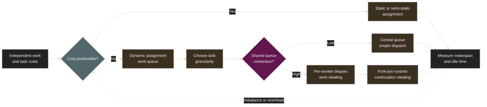

---

## From Three Barriers to One

Lecture 4의 SPMD grid solver는 모든 thread가 local change를 `diff`에 합산하고 convergence를
검사한다. 하나의 `diff`를 매 iteration에서 reset, accumulate, read, 다시 reset하므로
서로 다른 iteration이 같은 address를 두고 충돌한다.

```text
iteration i:
  reset diff -> add all partials -> read final diff

iteration i+1:
  reset the same diff -> add all partials -> read final diff
```

세 barrier의 의미는 다음과 같았다.

| Barrier | Preserved ordering |
| ------- | ------------------ |
| After reset | 모든 reset이 어떤 accumulation보다 먼저 끝남 |
| After accumulation | 모든 partial contribution이 convergence check보다 먼저 끝남 |
| After check | 모든 check가 다음 iteration의 reset보다 먼저 끝남 |

강의가 제시한 해법은 logical iteration state를 physical storage 여러 개로 분리하는 것이다.
모든 possible iteration에 slot 하나씩 둘 필요는 없다. Thread들이 current iteration 주변의
last/current/next 상태에만 존재하므로 세 slot을 순환시키면 충분하다.

```c
float diff[3] = {0.0f, 0.0f, 0.0f};

for (int iter = 0; ; ++iter) {
    int current = iter % 3;
    int next = (iter + 1) % 3;

    float my_diff = compute_local_change();
    atomic_add(&diff[current], my_diff);
    initialize_next_slot(next);

    barrier(all_threads);

    if (diff[current] / num_cells < tolerance)
        break;
}
```

핵심은 “barrier primitive를 더 빠르게 만들기”가 아니라 false storage dependency를
제거하는 데 있다. 이와 같은 replication은 뒤에서 하나의 shared queue를 per-worker
queue로 바꿀 때 다시 등장한다. State copy 수와 bookkeeping은 늘지만, 모든 worker가
하나의 shared object를 같은 시점에 만지는 빈도는 줄어든다.

## The Optimization Triangle

Parallel performance optimization은 decomposition, assignment, orchestration 선택을
반복해서 다듬는 과정이다. 강의는 서로 긴장 관계에 있는 세 목표를 제시한다.

| Goal | Desired state | Typical cost of pursuing it |
| ---- | ------------- | --------------------------- |
| Balance workload | 모든 execution resource가 동시에 useful work 수행 | 더 작은 task, profiling, dynamic scheduling |
| Reduce communication | Data movement와 shared-state stall 감소 | Replication, locality-aware placement, extra memory |
| Reduce extra work | Assignment, synchronization, bookkeeping 최소화 | 덜 adaptive한 schedule, coarser tasks |

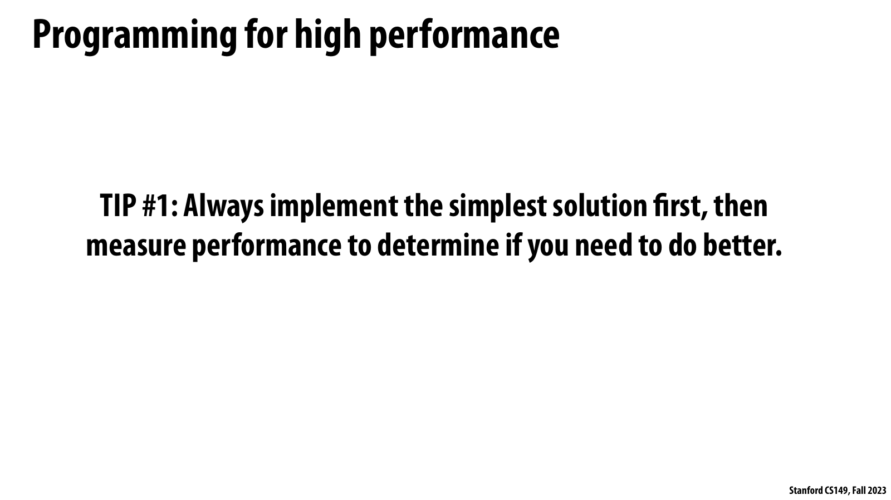

*공식 Lecture 5 slide page 3 — simplest solution을 먼저 구현한 뒤 성능을 측정하라는 optimization workflow.*

슬라이드가 직접 말하는 사실은 구현을 복잡하게 만들기 전에 simplest solution의 성능을
측정하고, 더 나은 해법이 실제로 필요한지를 확인하라는 것이다. 특정 scheduling 기법을
처방하지 않고 baseline과 measurement를 optimization의 출발점으로 둔다.

강의 논리에서 이 순서는 balance, communication, extra work가 동시에 움직이기 때문에
필수다. Dynamic scheduling으로 idle time을 줄여도 queue synchronization이 늘 수 있으므로,
end-to-end time과 worker별 useful-work time을 같은 조건에서 다시 재야 개선인지 알 수 있다.

GPU systems에 연결한 별도 실무 해설로는 먼저 kernel duration, achieved occupancy, SM active
time, memory throughput을 baseline으로 남기고, 그다음 tile size나 persistent work queue를
한 번에 하나씩 바꾸는 방식이 해당한다. 복잡한 queue가 irregular workload에는 이득일 수
있지만 regular GEMM에는 launch·atomic overhead만 늘릴 수 있다.

세 목표를 한 번에 최대화할 수는 없다. Optimization은 mechanism의 정교함이 아니라 measured
end-to-end improvement로 판단한다.

## Workload Balance and Makespan

Task `i`의 work cost를 `w_i`, processor 수를 `P`, processor `k`에 할당된 task 집합을
`A_k`라 하자. Communication과 overhead를 잠시 무시하면 전체 work와 completion time,
즉 makespan은 다음처럼 쓸 수 있다.

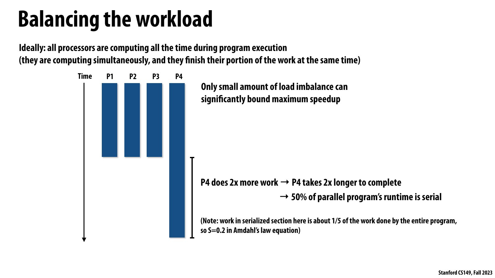

*공식 Lecture 5 slide page 4 — P4의 두 배 workload가 전체 completion time의 절반을 사실상 serial tail로 만드는 예.*

슬라이드는 P1–P3가 먼저 끝나고 P4만 두 배 오래 실행되는 timeline을 보여 준다. 전체 work의
약 1/5만 이 tail에 있어도 wall-clock time의 50% 동안 하나의 processor만 일하므로 maximum
speedup이 작은 imbalance에 의해 크게 제한된다.

강의 논리에서 중요한 측정값은 평균 task 수가 아니라 마지막 worker가 끝나는 makespan과
그때까지의 idle capacity다. 평균 utilization만 보면 이 tail을 희석할 수 있으므로 worker별
busy interval과 종료 시각을 함께 봐야 assignment 문제를 식별할 수 있다.

GPU systems에 연결한 별도 해설에서는 마지막 wave의 소수 thread block, 긴 sequence, 또는
과부하된 MoE expert가 같은 tail을 만든다. 더 작은 tile이나 동적 배분은 tail을 줄이지만
launch, atomic, routing, data-migration cost가 늘 수 있으므로 recovered idle time과 비교해야 한다.

```text
W   = sum_i w_i
T_P = max_k sum_(i in A_k) w_i
```

Ideal assignment은 각 processor가 `W/P`만큼 수행해 동시에 끝나는 경우다. 어떤 schedule도
다음 lower bound보다 빨라질 수 없다.

```text
T_P >= max(W/P, max_i w_i)
```

첫 항은 전체 work를 `P`개 processor가 나누어도 필요한 시간이고, 둘째 항은 내부적으로
더 parallelize할 수 없는 가장 긴 task의 시간이다. 강의의 네 processor 예시에서 P4가
다른 processor의 두 배 시간 동안 일하면 나머지 셋은 P4가 끝날 때까지 idle이다. P4만
작업하는 tail은 program 전체 관점에서 effectively serial execution이 된다.

Overhead를 무시한 load-balance efficiency는 다음과 같이 볼 수 있다.

```text
E_balance = W / (P * T_P)
idle capacity = P * T_P - W
```

각 worker의 task count가 같더라도 `w_i`가 다르면 balance는 나쁠 수 있다. 중요한 것은
item count가 아니라 execution time을 고르게 만드는 것이다.

## Static Assignment

Static assignment는 work amount와 worker 수가 알려진 시점에 assignment를 한 번 결정하고,
실행 중 task completion에 따라 바꾸지 않는 방식이다. “Static”은 compile time에 hard-code
되었다는 뜻이 아니다. Runtime input size와 thread count를 보고 program 시작 시 계산해도,
그 뒤 execution behavior에 반응하지 않으면 static이다.

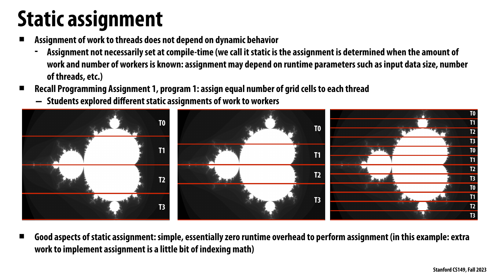

*공식 Lecture 5 slide page 5 — Mandelbrot rows를 네 thread에 contiguous 또는 interleaved하게 미리 배정한 static assignment.*

슬라이드는 static assignment가 dynamic behavior에 의존하지 않으며 compile time에 고정될
필요도 없다고 정의한다. 세 가지 row partition을 나란히 놓아 assignment 자체는 indexing
math에 가깝고 runtime scheduling overhead가 거의 없다는 점을 보여 준다.

강의 논리에서 static policy의 성패는 work cost를 미리 예측하거나 많은 sample을 worker에
섞어 평균화할 수 있는지에 달려 있다. Interleaving은 Mandelbrot의 공간적 cost 분포를 더
고르게 sample하지만, 입력과 같은 주기의 cost pattern에서는 여전히 skew가 남을 수 있다.

GPU systems에 연결한 별도 해설로는 regular tensor tile을 grid에 미리 매핑하는 방식이 가장
가깝다. Global queue가 없어 locality와 overhead에는 유리하지만 divergence나 sparse density가
tile마다 다르면 고정 partition이 long tail을 만들 수 있다.

```c
int start = thread_id * N / num_threads;
int end = (thread_id + 1) * N / num_threads;

for (int i = start; i < end; ++i)
    process(i);
```

Static assignment이 잘 맞는 조건은 다음과 같다.

* 각 task cost가 같거나 매우 잘 예측된다.
* 개별 cost는 달라도 worker별로 많은 sample을 주면 평균 cost가 비슷해진다.
* Workload의 spatial pattern을 알고 있어 좋은 partition을 미리 계산할 수 있다.
* Assignment overhead와 worker 간 synchronization을 최소화해야 한다.

강의의 Programming Assignment 1 Mandelbrot 예시에서는 pixel brightness가 computation
cost를 대략 나타낸다. Image의 서로 인접한 row는 cost가 비슷하다는 spatial continuity를
이용해 row-interleaved assignment를 하면 각 thread가 image의 여러 지역을 sampling하므로
평균적으로 work가 섞인다.

```text
row 0 -> T0    row 4 -> T0
row 1 -> T1    row 5 -> T1
row 2 -> T2    row 6 -> T2
row 3 -> T3    row 7 -> T3
```

이 policy가 항상 좋은 것은 아니다. Cost가 thread index와 같은 주기로 변하거나 위에서
아래로 일관되게 감소하는 특수 pattern에서는 interleaving에도 systematic skew가 남을 수
있다. Static policy의 품질은 workload에 대한 predictability 가정에 달려 있다.

Static assignment의 장점은 runtime assignment cost가 사실상 indexing arithmetic뿐이며,
worker가 다른 worker의 진행 상태를 묻지 않아도 된다는 점이다. Queue lock이나 atomic
counter가 없으므로 communication과 synchronization이 매우 적다.

## Semi-Static Assignment

Workload가 영원히 고정되지는 않지만 near-term future가 recent past와 비슷하다면 assignment를
주기적으로 다시 계산할 수 있다. 강의는 이를 semi-static assignment라 부른다.

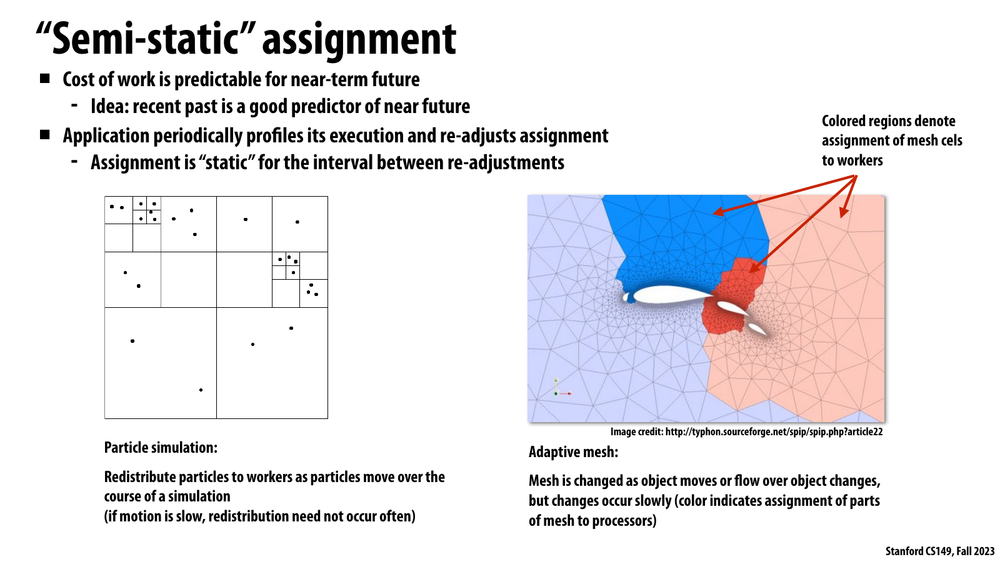

*공식 Lecture 5 slide page 9 — recent execution을 근거로 particle과 adaptive-mesh partition을 주기적으로 재조정하는 semi-static assignment.*

슬라이드는 recent past가 near-term future의 좋은 predictor일 때 application이 실행을
periodically profile하고 assignment를 다시 정한다고 설명한다. Re-adjustment 사이 interval에는
assignment가 static이며, particle motion과 천천히 변하는 mesh가 대표 예다.

강의 논리에서 semi-static은 static과 dynamic의 중간점이다. 매 task마다 queue에 접근하지
않으면서 drift에는 적응하지만, profiling과 migration을 수행하는 interval을 너무 짧게 잡으면
그 비용이 savings를 삼키고 너무 길게 잡으면 stale partition이 유지된다.

GPU systems에 연결한 별도 해설로는 최근 token/expert load로 다음 serving epoch의 placement를
조정하는 방식이 해당한다. Replica나 shard 이동은 bandwidth와 cache warm-up을 소비하므로
load 변화율보다 rebalancing cadence가 빠르지 않은지 함께 확인해야 한다.

```text
profile interval t
  -> estimate region cost
  -> repartition work
  -> keep assignment fixed for several iterations
  -> profile again
```

Particle simulation에서는 particle이 이동하면서 worker별 particle 수가 서서히 달라진다.
Adaptive mesh에서는 object motion이나 flow 변화에 따라 high-resolution cell의 위치가
바뀐다. 매 task마다 중앙 queue에 접근할 필요 없이, imbalance가 의미 있게 누적될 때만
redistribution하면 static assignment의 낮은 steady-state overhead와 adaptation을 함께 얻을
수 있다.

강의는 long-running machine-learning computation도 예로 든다. 일정 시간 실행해 imbalance를
관측하고 assignment를 조정한 다음 다시 긴 interval 동안 고정할 수 있다. Rebalancing
interval이 너무 짧으면 migration/profiling overhead가 커지고, 너무 길면 obsolete한
assignment를 오래 유지하게 된다.

## Dynamic Assignment

Task cost나 total task count가 unknown 또는 unpredictable하면 worker가 runtime에 다음
work를 요청하는 dynamic assignment가 자연스럽다. 강의의 primality test는 input value에
따라 execution time을 쉽게 예측하기 어렵다는 가정 아래 다음 structure를 사용한다.

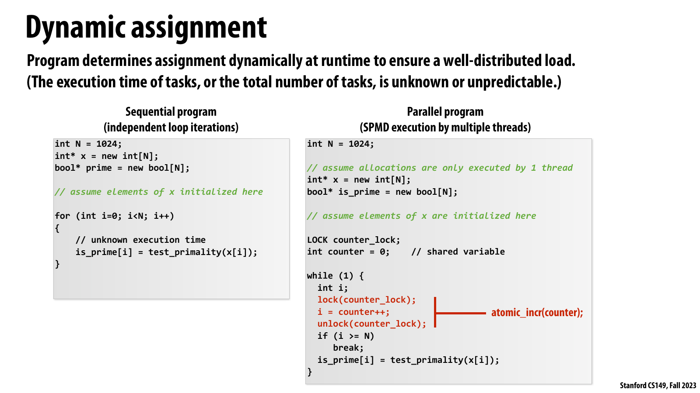

*공식 Lecture 5 slide page 10 — unpredictable primality-test iterations를 shared counter로 하나씩 claim하는 dynamic assignment.*

슬라이드는 sequential loop와 SPMD version을 비교하며, 여러 thread가 lock으로 보호된
`counter++` 결과를 받아 서로 다른 index를 처리하는 code를 보여 준다. 이 counter update는
동일 index의 중복 실행을 막는 correctness requirement이자 다음 work를 배정하는 scheduling
operation이다.

강의 논리에서 fast worker는 더 많은 index를 가져가므로 사전 cost model 없이도 imbalance에
적응한다. 반면 모든 task가 같은 lock 또는 atomic cache line을 건드리므로 work가 짧아질수록
assignment path가 serial bottleneck이 될 수 있다.

GPU systems에 연결한 별도 해설로는 persistent kernel의 block/warp가 global atomic counter로
다음 tile을 claim하는 방식이 비슷하다. Irregular work에는 유용하지만 duplicate claim을 막는
atomic ordering을 약화하면 correctness가 깨지고, 너무 작은 claim은 contention을 키운다.

```c
LOCK counter_lock;
int counter = 0;

while (true) {
    int i;

    lock(counter_lock);
    i = counter++;
    unlock(counter_lock);

    if (i >= N)
        break;

    is_prime[i] = test_primality(x[i]);
}
```

모든 SPMD worker가 같은 code를 실행한다. Lock은 두 worker가 같은 `counter` value를 받는
것을 막고, counter가 `N`에 도달하면 각 worker가 loop를 빠져나간다. Fast worker는 더 많은
indices를 처리하고 slow 또는 expensive task를 맡은 worker는 적게 가져가므로, schedule이
execution behavior에 자동 적응한다.

Dynamic assignment의 이점은 `w_i`를 사전에 정확히 알지 못해도 idle worker가 work를 계속
가져간다는 것이다. 비용은 매 task마다 발생하는 lock/atomic, queue metadata access,
cache-line movement, scheduler logic이다.

## A Counter Is a Work Queue

위 code에는 container type의 queue가 보이지 않지만, semantics는 shared work queue와 같다.

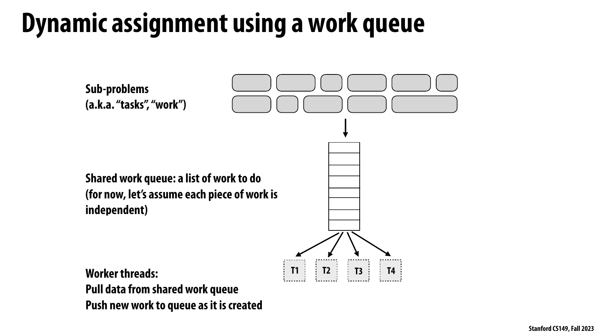

*공식 Lecture 5 slide page 11 — 여러 크기의 independent subproblem을 하나의 central work queue에 넣고 T1–T4가 pull하는 구조.*

슬라이드는 아직 실행되지 않은 independent work를 shared queue 하나로 모으고 worker threads가
그 queue에서 pull하며, 실행 중 생긴 새 work도 다시 push할 수 있는 구조를 보여 준다. Queue는
task와 worker 수를 분리해 faster worker가 다음 ready item을 계속 가져가게 한다.

강의 논리에서 central queue는 dynamic assignment를 가장 단순하게 구현하지만 queue head와
metadata가 모든 worker의 공통 synchronization point가 된다. Balance를 얻는 이익과 queue
access가 직렬화하는 비용이 task duration에 비해 충분히 작은지를 측정해야 한다.

GPU systems에 연결한 별도 해설에서는 global worklist가 irregular graph나 sparse workload를
쉽게 표현한다. 다만 device-wide atomic traffic과 memory-ordering cost가 커질 수 있어 block-local
chunking이나 hierarchical queue로 이동할 기준을 queue wait와 useful-work ratio에서 찾아야 한다.

```text
logical queue = x[0], x[1], ..., x[N-1]
queue head    = counter
pop()         = atomic fetch-and-increment(counter)
```

모든 work가 이미 array에 있고 index 순서로 접근할 수 있으므로 queue pop을 atomic counter
하나로 압축한 것이다. Deli counter의 ticket처럼 각 worker는 unique number를 받고 해당
item을 처리한다.

이 구분은 중요하다.

| Object | Meaning |
| ------ | ------- |
| Task | 실행해야 할 logical piece of work |
| Worker | Task를 반복해서 가져와 실행하는 thread |
| Queue | 아직 assignment되지 않은 ready work의 representation |
| Scheduler | Ready task를 worker에 전달하는 policy/mechanism |

Eight hardware contexts가 있다고 task를 정확히 여덟 개만 만들어야 하는 것은 아니다.
Task count는 scheduler가 조절할 수 있는 work division이고, worker count는 machine에서
동시에 실행할 concurrency다. Task가 worker보다 훨씬 많아야 irregular cost를 섞을 여지가
생긴다.

## Task Granularity

Fine-grained task는 balance를 쉽게 하지만 scheduling overhead를 자주 지불한다. Coarse-
grained task는 overhead를 amortize하지만 schedule의 flexibility를 줄인다.

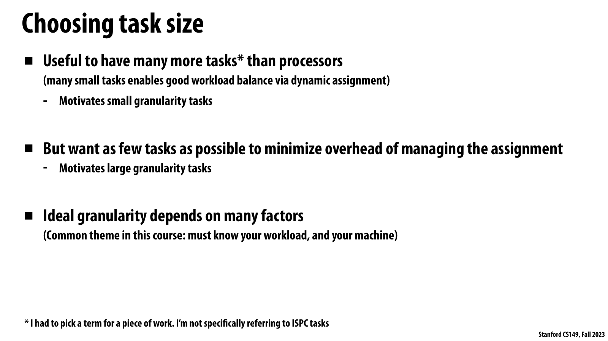

*공식 Lecture 5 slide page 15 — processor보다 많은 task가 balance에 유리하지만 task 수를 줄여야 management overhead가 낮아지는 granularity trade-off.*

슬라이드는 small tasks가 dynamic assignment의 balance 선택지를 늘리고, large tasks가 assignment
management overhead를 줄인다는 서로 반대되는 요구를 한 화면에 둔다. 따라서 ideal granularity는
고정된 숫자가 아니라 workload와 machine에 의존한다고 명시한다.

강의 논리에서 task size는 `useful work / dispatch cost`뿐 아니라 마지막에 남는 indivisible
work의 크기도 결정한다. Chunk를 키워 queue traffic을 줄였는데 worker별 종료 시각이 더 벌어지면
overhead 절감보다 load-balance loss가 커진 것이다.

GPU systems에 연결한 별도 해설로는 tile, tokens per work item, 또는 blocks per counter claim이
같은 knob다. 큰 chunk는 atomic과 metadata cost를 amortize하지만 register/shared-memory pressure와
tail을 키울 수 있어 kernel goodput과 마지막 wave를 함께 측정해야 한다.

One-element task를 `g` elements의 chunk로 바꾸면 counter update 횟수는 대략 `N`에서
`ceil(N/g)`로 줄어든다.

```c
const int GRANULARITY = 10;

while (true) {
    int begin;

    lock(counter_lock);
    begin = counter;
    counter += GRANULARITY;
    unlock(counter_lock);

    if (begin >= N)
        break;

    int end = min(begin + GRANULARITY, N);
    for (int i = begin; i < end; ++i)
        is_prime[i] = test_primality(x[i]);
}
```

Per-task overhead를 `h`, task 수를 `M`, useful work를 `W`라 하면 실제 scheduler와
contention을 생략한 rough model은 다음과 같다.

```text
T_P ~= W/P + M*h/P + load-imbalance tail + contention
M   ~= ceil(N/g)
```

`g`를 키우면 `M*h`는 줄지만 각 task가 길어져 tail이 커질 수 있다. `g`를 줄이면 tail은
작아지지만 overhead와 queue contention이 커진다. Ideal task size는 workload와 machine에
따라 달라지므로 상수로 외울 수 없다.

강의의 rule of thumb은 “processor보다 훨씬 많은 task를 두되, 불필요하게 많게 만들지
말라”는 것이다. One row per task가 합리적일 수 있지만 one pixel per task는 worker가
useful computation보다 dispatch를 더 자주 수행하게 만들 수 있다.

## Measure Before Tuning

강의는 전체 실행이 `5.9 s`인 example을 사용해 optimization ceiling을 판단한다. 먼저
`test_primality` calls에 쓰인 useful time을 따로 측정한다.

| Measurement | Interpretation | Decision |
| ----------- | -------------- | -------- |
| Total `5.9 s`, useful work `5.75 s` | Scheduling 제거로 회수 가능한 시간이 매우 작음 | 특별한 latency requirement가 없다면 멈춤 |
| Total `5.9 s`, useful work `2.5 s` | 절반 이상이 lock/assignment overhead일 가능성 | Granularity 또는 policy 변경 가치가 큼 |

Measurement 순서는 다음과 같다.

1. Simple static 또는 dynamic baseline의 end-to-end time을 잰다.
2. Useful kernel/function time을 별도로 잰다.
3. Worker별 busy time, task count, queue wait를 비교한다.
4. Maximum possible gain이 engineering cost를 정당화하는지 판단한다.
5. 가장 작은 policy change를 적용하고 같은 조건에서 다시 측정한다.

Total time과 useful time의 차이를 모두 lock time이라고 단정해서는 안 된다. Timer,
memory access, runtime, OS scheduling cost도 포함될 수 있다. 강의 example은 simple code라
dominant source를 추론하기 쉽다는 맥락에서 제시된다.

## The Long-Tail Scheduling Problem

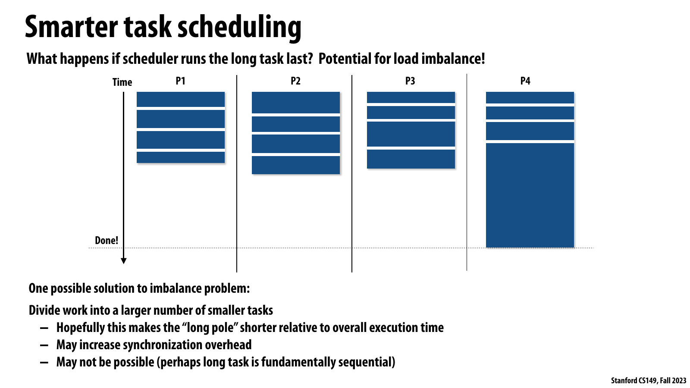

*공식 Lecture 5 slide page 17 — 16개 task 중 긴 task를 마지막에 배정해 P4만 남는 long-tail schedule.*

슬라이드는 short tasks를 먼저 소진한 뒤 마지막 long task를 P4가 맡아 P1–P3가 idle이 되는
timeline을 보여 준다. Dynamic queue가 있어도 task order와 indivisible task size 때문에
completion tail이 남을 수 있다는 사실을 시각화한다.

강의 논리에서 한 해법은 long pole을 여러 independent tasks로 나누는 것이지만, 그러면
synchronization overhead가 늘고 task 자체가 fundamentally sequential하면 적용할 수 없다.
Cost를 예측할 수 있다면 다음 slide의 longest-first ordering처럼 긴 work를 먼저 시작하는
대안도 있다.

GPU systems에 연결한 별도 해설로는 긴 sequence, 고밀도 sparse tile, overloaded expert를 batch
끝에 남기지 않는 bucket/order policy가 해당한다. Prediction과 sorting cost, cache locality
저하를 포함한 end-to-end latency가 실제로 줄었는지 확인해야 한다.

```text
bad order:    short short short ... short LONG
better order: LONG  short short ... short
```

두 가지 대응이 있다.

* 긴 task를 더 작은 independent tasks로 나눈다. Long pole이 전체 time에서 차지하는
  비율은 줄지만 task management cost가 늘며, task 내부가 sequential이면 불가능하다.
* Cost를 어느 정도 예측할 수 있다면 long task를 먼저 schedule한다. Long task를 맡은
  worker가 task count는 적게 처리해도 total work는 다른 worker와 비슷해진다.

“Longest first”는 cost estimate가 필요하다. Estimate를 위한 profiling/sorting cost와
prediction error까지 고려해야 한다. 그러나 core lesson은 명확하다. Schedule 마지막에
남는 indivisible work의 크기가 parallel completion time을 결정한다.

## Distributed Work Queues

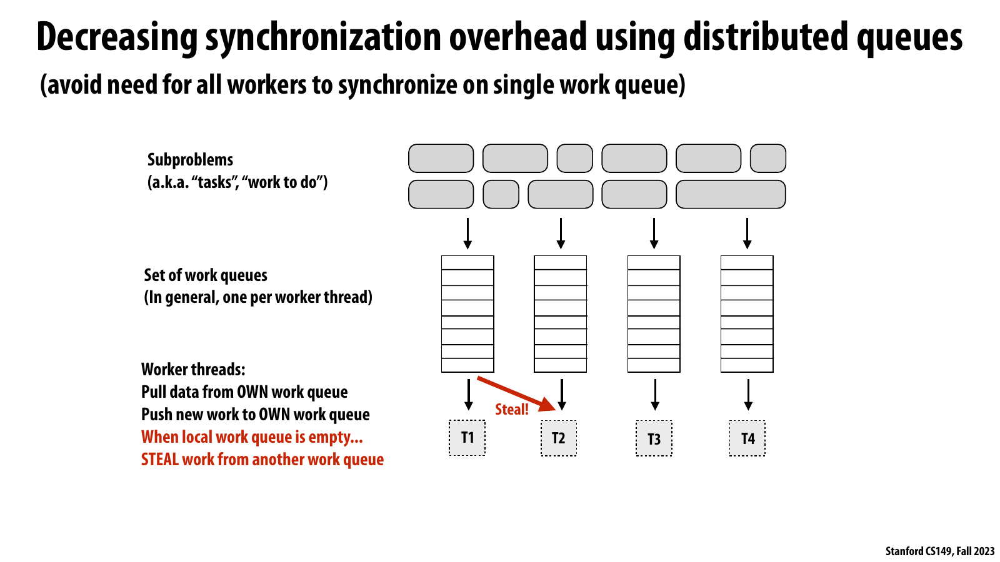

*공식 Lecture 5 slide page 19 — single queue synchronization을 피하기 위해 worker별 queue를 두고 local queue가 빌 때만 steal하는 구조.*

슬라이드는 subproblems를 여러 work queues로 나누고 각 thread가 자기 queue에서 pull/push하도록
배치한다. T2의 local queue가 비면 다른 queue에서 work를 steal하는 red path가 imbalance를
회복하는 예외 경로로 표시된다.

강의 논리에서 이 구조는 common-case queue operation을 local로 만들어 central head의
serialization을 줄인다. 대신 initial placement, victim selection, steal synchronization이
추가되고 작은 work만 훔치면 steal frequency가 커져 distributed design의 이점이 사라진다.

GPU systems에 연결한 별도 해설에서는 SM·block-local queue와 global fallback queue 같은
hierarchy가 대응한다. Locality와 낮은 contention을 얻는 대신 work visibility가 분산되므로,
queue depth imbalance와 steal/migration bytes를 함께 관측해야 한다.

Shared queue 하나는 단순하지만 모든 worker가 같은 head/counter/cache line을 갱신한다.
Worker 수가 크거나 task가 작으면 queue가 serialization point가 된다. 강의는 shared state를
복제하는 familiar pattern을 적용한다.

```text
worker 0 -> local deque 0
worker 1 -> local deque 1
worker 2 -> local deque 2
worker 3 -> local deque 3

normal case: push/pop own deque
idle case:   steal from another worker's deque
```

대부분의 operation이 local queue에서 일어나므로 cross-thread synchronization은 steal할
때만 필요하다. 단일 `diff`를 per-thread partial로 만들었던 것과 마찬가지로, shared queue를
per-worker queue로 분산해 common case의 contention을 줄인다.

Distributed queue는 balance를 자동 보장하지 않는다. Initial placement가 나쁘거나 steal
policy가 작은 work만 가져오면 idle worker가 자주 synchronize해야 한다. 뒤에서 살펴볼
fork-join scheduler는 recursive program의 queue shape를 이용해 thief가 큰 continuation을
가져가도록 만든다.

## Tasks with Dependencies

지금까지 primality tasks는 어떤 순서로 실행해도 되는 independent work였다. 실제 task
system에는 directed dependency가 있을 수 있다.

```c
TaskHandle foo_handle = enqueue_task(foo);
TaskHandle bar_handle = enqueue_task(bar, foo_handle);
```

`bar`는 queue에 등록되어도 `foo`가 끝나기 전에는 ready가 아니다. Scheduler는 submitted
task와 runnable task를 구분하고, predecessor completion이 successor를 ready state로
전환하도록 관리한다.

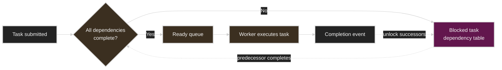

Task completion 하나가 여러 successors를 동시에 ready로 만들 수 있고, running task가 새
task를 동적으로 submit할 수도 있다. 따라서 dependency-aware scheduler는 queue뿐 아니라
graph state와 outstanding predecessor count도 관리해야 한다.

## The Assignment Spectrum

Static과 dynamic은 binary choice가 아니라 continuum이다.

| Policy | Decision time | Runtime overhead | Adaptation | Typical fit |
| ------ | ------------- | ---------------- | ---------- | ----------- |
| Fully static | Execution 시작 전 한 번 | 매우 낮음 | 없음 | Uniform/predictable work |
| Cost-aware static | Estimated cost로 시작 전 partition | Profiling/partition cost | Run 중 없음 | Cost model이 reliable한 irregular work |
| Semi-static | Epoch/interval 경계 | Periodic profiling/migration | 느린 변화에 대응 | Simulation, long training |
| Chunked dynamic | Worker가 chunk 단위로 요청 | Queue/atomic per chunk | Task cost variation에 대응 | 많은 independent items |
| Work stealing | Idle worker만 remote queue 접근 | Local fast path + steal cost | Distributed imbalance에 대응 | Recursive/fork-join work |

강의의 conclusion은 available workload knowledge를 가능한 한 활용하라는 것이다. 모든 cost와
arrival을 정확히 안다면 fully static optimal schedule이 task management cost를 최소화한다.
Knowledge가 부족할수록 dynamic mechanism에 더 많은 일을 맡기되, 그 mechanism의 cost를
측정해야 한다.

## Parallel Programming Patterns

강의는 parallelism을 표현하는 세 가지 관점을 비교한다.

### Data parallelism

같은 operation을 many data elements에 적용한다.

```c
// ISPC
foreach (i = 0 ... N)
    B[i] = foo(A[i]);

// OpenMP
#pragma omp parallel for
for (int i = 0; i < N; ++i)
    B[i] = foo(A[i]);

// CUDA-style bulk launch
foo<<<num_blocks, threads_per_block>>>(A, B);
```

ISPC bulk task launch와 higher-order `map(foo, A, B)`도 같은 category다. Programmer는
independent data domain을 제시하고 assignment는 compiler/runtime에 맡긴다.

### Explicit threads

Programmer가 원하는 concurrency만큼 execution agents를 만들고 각 thread가 수행할
function을 지정한다.

```cpp
std::thread workers[NUM_HW_EXEC_CONTEXTS];

for (int i = 0; i < NUM_HW_EXEC_CONTEXTS; ++i)
    workers[i] = std::thread(my_function, A, B);

for (int i = 0; i < NUM_HW_EXEC_CONTEXTS; ++i)
    workers[i].join();
```

이 model에서는 worker lifecycle과 work acquisition loop를 programmer가 더 직접 관리한다.

### Fork-join

Divide-and-conquer algorithm의 function call graph에서 independent branches를 logical work로
노출한다. Recursive execution이 진행되면서 parallelism이 tree 형태로 점진적으로 드러난다.

## Fork-Join Parallelism

Quicksort는 fork-join pattern의 canonical example이다.

```c
void quick_sort(int* begin, int* end) {
    if (begin >= end - 1)
        return;

    int* middle = partition(begin, end);
    quick_sort(begin, middle);
    quick_sort(middle + 1, end);
}
```

`partition`이 끝나면 pivot보다 작은 left partition과 큰 right partition은 independent하다.
Top-level에는 branch가 두 개뿐이지만 각 recursive call이 다시 두 branches를 만들므로,
execution이 깊어질수록 많은 independent subproblems가 생성된다.

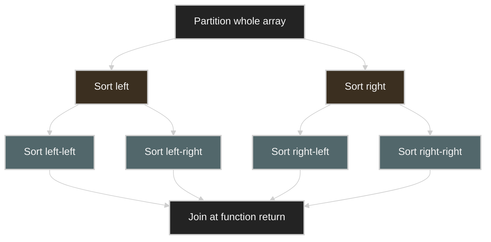

Fork는 independent branch를 system에 넘기고 join은 descendants가 끝나기 전에 dependent
continuation이 실행되지 않도록 한다. Programmer는 thread를 직접 만들기보다 potential
parallelism을 call structure에 표시한다.

## Cilk Spawn and Sync Semantics

강의는 C++ language extension인 Cilk Plus의 두 construct로 fork-join semantics를 설명한다.

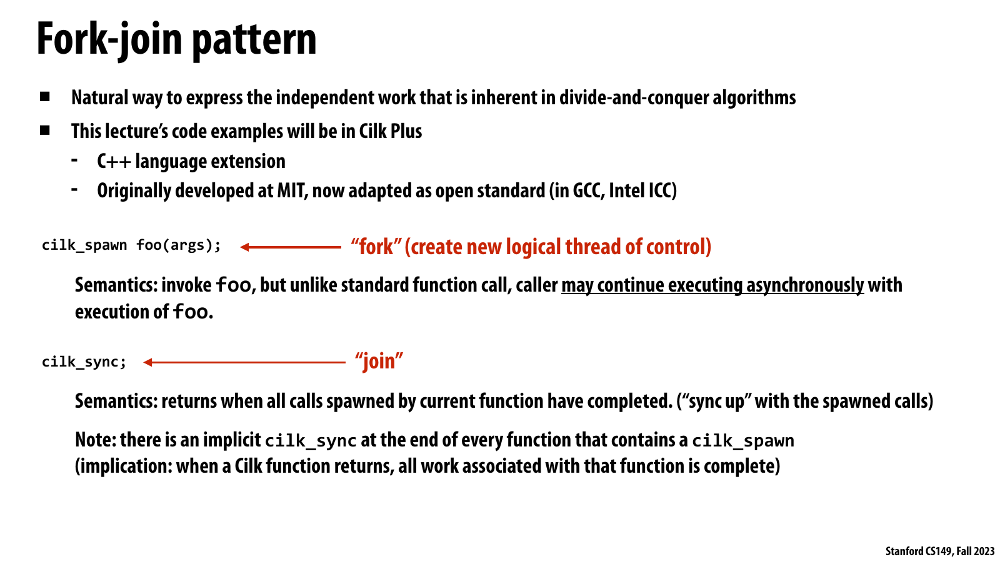

*공식 Lecture 5 slide page 26 — `cilk_spawn`의 asynchronous fork 가능성과 `cilk_sync`의 current-function join contract.*

슬라이드는 `cilk_spawn foo(args)`가 새 logical control flow를 표현하지만 caller와 `foo`가
반드시 동시에 실행된다고 강제하지는 않는다고 정의한다. `cilk_sync`는 current function이
spawn한 calls가 모두 끝난 뒤에만 return하며 spawn을 포함한 function 끝에는 implicit sync가 있다.

강의 논리에서 이 abstraction은 correctness ordering과 physical scheduling을 분리한다. Programmer는
independent work와 join boundary를 표현하고, runtime은 worker 수·queue state·locality에 따라
serial execution을 포함한 어떤 valid schedule도 선택할 수 있다.

GPU systems에 연결한 별도 해설에서는 task graph의 dependency event나 stream synchronization이
비슷한 join 역할을 한다. 너무 넓은 barrier는 parallelism을 막고 너무 약한 dependency는 data
race를 만들므로, 필요한 producer–consumer edge만 표현하고 placement는 scheduler에 맡겨야 한다.

```c
cilk_spawn foo(args);  // fork
cilk_sync;             // join
```

`cilk_spawn foo()`는 `foo()`를 호출하되 caller가 `foo`와 asynchronous하게 계속 실행할 수
있다는 뜻이다. 이는 반드시 새 thread를 즉시 만들거나 `foo`가 당장 parallel execution을
시작한다는 뜻이 아니다.

`cilk_sync`는 current function이 spawn한 calls가 모두 complete된 뒤에만 return한다. Spawn을
포함한 function의 끝에는 implicit sync가 있다. 따라서 function이 return하면 그 function이
만든 child work도 모두 끝났다는 contract가 성립한다.

```c
cilk_spawn foo();
bar();
cilk_sync;
```

여기서 `foo`와 `bar`는 concurrent하게 실행될 수 있다. 다음 code는 independent work의
양은 같지만 spawn operation이 하나 더 있으므로 runtime overhead가 더 클 수 있다.

```c
cilk_spawn foo();
cilk_spawn bar();
cilk_sync;
```

Semantics는 schedule을 의도적으로 under-specify한다. 다음은 모두 contract상 valid하다.

* `foo`, `bar`, `fizz`를 sequentially 실행한다.
* 각각 다른 worker가 동시에 실행한다.
* 일부는 한 worker에, 나머지는 다른 worker에 배치한다.
* Spawn keyword를 지운 serial elision으로 실행한다.

유일한 핵심 ordering constraint는 spawned calls가 해당 `sync`를 지나기 전에 완료되어야
한다는 것이다. Abstraction을 logical work로 읽고 특정 thread mapping으로 오해하지 않아야
한다.

## Parallel Quicksort

Cilk version은 sequential quicksort의 한 recursive call만 spawn한다.

```c
void quick_sort(int* begin, int* end) {
    if (begin >= end - PARALLEL_CUTOFF) {
        std::sort(begin, end);
    } else {
        int* middle = partition(begin, end);
        cilk_spawn quick_sort(begin, middle);
        quick_sort(middle + 1, end);
    }
}
```

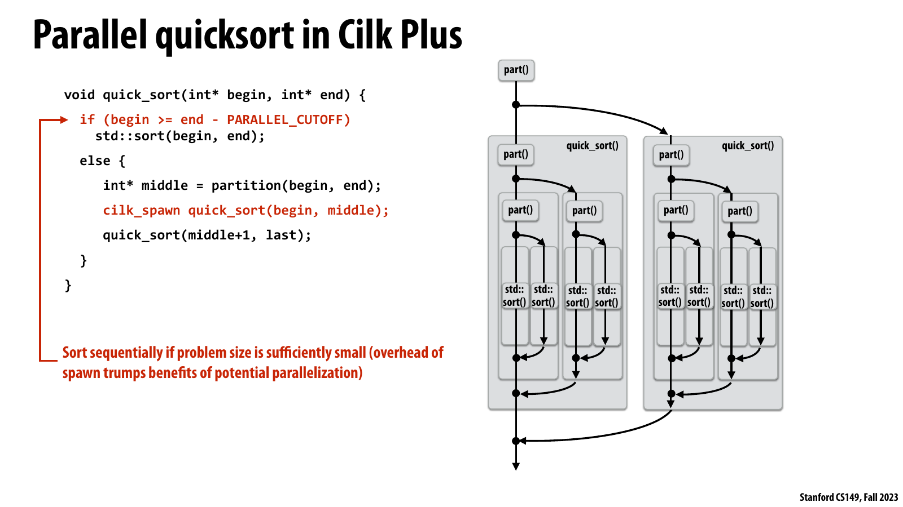

*Official Lecture 5 slide p.30 — 한 recursive branch만 `cilk_spawn`으로 노출하고 `PARALLEL_CUTOFF` 이하는 `std::sort`로 처리하는 parallel quicksort running example.*

슬라이드는 `partition` 뒤의 두 independent branches 중 left branch를 `cilk_spawn`하고 right branch를
normal call로 실행하며, 재귀적으로 생성되는 sort tree와 function return의 implicit
join을 함께 보여 준다. 두 branches 모두 independent하지만 둘 다 spawn할 필요는 없다.
Current logical control이 한 branch를 normal call로 실행하는 동안 다른 branch만 spawned work로
노출해도 parallelism은 같고, spawn을 하나 줄이면 management overhead도 줄어든다.

이 running example은 fork-join abstraction과 뒤에서 다룰 work stealing을 연결한다. Programmer가
spawn과 implicit sync로 logical dependency를 표현하면, runtime은 normal call을 local depth-first
path로 실행하고 continuation을 per-worker deque에 노출할 수 있다. Idle worker는 그
continuation이 대표하는 independent subtree를 steal해 machine을 채우므로, fork-join의 logical tree가
실제 scheduling work의 단위가 된다.

`PARALLEL_CUTOFF`보다 작은 range를 `std::sort`로 sequentially 처리하는 것은 correctness
requirement가 아니라 granularity optimization이다. Cutoff가 너무 작으면 recursion leaf까지
tiny tasks를 spawn·queue·steal하는 cost가 useful sort work를 앞서고, 너무 크면 independent
work와 parallel slack이 부족해 idle cores와 load imbalance가 커진다. Parallel programmer는 input
size와 machine에 대해 두 손실을 측정하여, task cost가 scheduling overhead를 amortize하면서도
runtime이 execution contexts를 채울 만큼 충분한 independent work를 노출하는 cutoff를 골라야
한다. Program이 두 tasks만 제공했다면 64-core scheduler도 그 이상의 parallelism을 만들어
낼 수 없다.

## Parallel Slack

강의는 independent work의 양과 machine parallel execution capability의 ratio를 parallel
slack이라 부른다.

```text
parallel slack = number of independent tasks / number of execution contexts
```

Slack이 `1`에 가까우면 한 task가 길어졌을 때 대체할 work가 없어 imbalance가 바로 tail로
나타난다. Slack이 더 크면 runtime이 tasks를 여러 worker에 섞어 variation을 완화할 수 있다.
강의는 practice에서 약 `8`을 하나의 경험적 starting ratio로 제시하지만 universal constant는
아니다.

Slack을 무한히 키우는 것도 좋지 않다. Task creation, queue record, synchronization, cache
footprint가 함께 증가한다. 따라서 다음 두 조건을 동시에 만족하는 영역을 찾아야 한다.

```text
enough slack for balance
task cost large enough to amortize scheduling
```

## Why One Thread per Spawn Is a Bad Scheduler

가장 직접적인 implementation은 각 `cilk_spawn`을 `pthread_create`, 각 `cilk_sync`를
`pthread_join`으로 번역하는 것이다. Semantically correct지만 performance problem이 크다.

* Spawn마다 heavyweight thread creation/destruction을 지불한다.
* Runnable threads가 cores보다 훨씬 많아져 oversubscription이 생긴다.
* Context switching이 증가한다.
* Active stacks와 metadata가 많아져 working set과 cache locality가 악화된다.

강의는 Lecture 4 demo에서 thread pool이 task마다 thread를 생성하는 방식보다 약 300배
빨랐던 특정 측정값을 상기시킨다. 이 숫자를 일반 성능비로 외우는 것이 아니라 thread
lifecycle이 fine-grained task보다 훨씬 클 수 있다는 증거로 읽어야 한다.

Cilk runtime은 machine execution contexts 수에 맞춘 worker pool을 유지한다고 생각할 수
있다. Slides는 quad-core with Hyper-Threading example에 eight workers를 그린다. 실제 runtime은
첫 spawn에서 lazily initialize할 수 있지만 conceptual model은 fixed workers가 많은 logical
tasks를 반복 실행하는 것이다.

```c
while (work_exists()) {
    Work work = get_new_work();
    work.run();
}
```

## Child Stealing versus Continuation Stealing

다음 code에서 `foo()`는 spawned child이고, `bar()`부터 `sync`까지는 caller의 continuation이다.

```c
cilk_spawn foo();
bar();
cilk_sync;
```

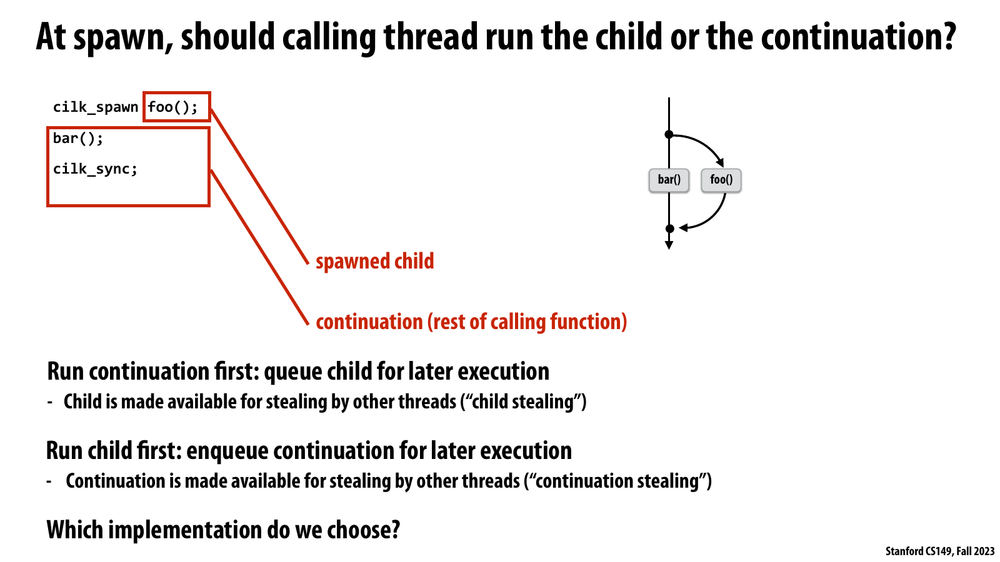

*공식 Lecture 5 slide page 40 — spawn 지점에서 current worker가 child와 continuation 중 무엇을 실행할지에 따른 두 stealing policy.*

슬라이드는 continuation을 먼저 실행하고 child를 queue에 두는 child stealing과, child를 먼저
실행하고 caller의 나머지를 queue에 두는 continuation stealing을 정확히 구분한다. 두 방식은
같은 fork-join semantics를 만족하지만 queue에 노출되는 work와 local execution order가 다르다.

강의 논리에서 Cilk가 택하는 child-first/continuation-stealing은 steal이 없을 때 serial elision과
같은 depth-first order를 보존하고 queue growth를 제한한다. Continuation-first는 parallel work를
빨리 나열할 수 있지만 loop의 children을 먼저 쌓아 storage와 locality cost를 키울 수 있다.

GPU systems에 연결한 별도 해설에서는 현재 tile을 끝까지 처리할지 후속 continuation을 먼저
노출할지의 선택과 닮았다. Local data reuse를 지키는 depth-first path가 보통 유리하지만,
machine을 채울 parallel slack이 부족하면 work revelation 속도도 함께 고려해야 한다.

Spawn을 만난 current worker에게는 두 선택이 있다.

| Policy | Current worker executes | Queue exposes | Traversal tendency |
| ------ | ----------------------- | ------------- | ------------------ |
| Continuation first / child stealing | `bar()` continuation | `foo()` child | Breadth-first |
| Child first / continuation stealing | `foo()` child | Rest of caller | Depth-first, serial order |

Continuation-first policy로 loop의 모든 iteration을 spawn하면 current worker는 children을
실행하기 전에 `foo(0)...foo(N-1)`를 queue에 쌓는다. No-steal case에도 serial program과 다른
order이며 queue storage가 `O(N)`까지 커질 수 있다.

Child-first policy는 `foo(0)`를 즉시 실행하고 “`i=1`부터 남은 loop”라는 continuation 하나만
queue에 둔다. No steal이면 owner가 continuation을 다시 꺼내 `foo(1)`, `foo(2)` 순서로
실행하므로 spawn을 지운 serial program과 같은 order가 된다. Steal이 발생하면 thief가
continuation을 가져가 다음 iteration을 spawn하며 work generation을 분담한다.

Slides는 `T` worker system의 work-queue storage가 single-thread stack storage의 `T`배를
넘지 않는다는 property를 제시한다. Child-first execution이 sequential stack behavior와
locality를 보존하기 때문에 Cilk scheduler는 continuation stealing을 택한다.

## Work Stealing with Per-Worker Deques

Work stealing은 worker마다 double-ended queue, 즉 deque를 둔다.

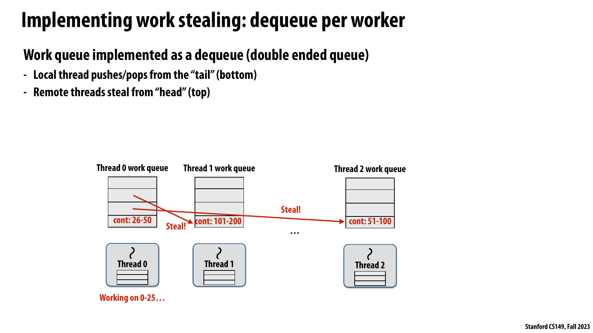

*공식 Lecture 5 slide page 45 — owner는 deque tail에서 push/pop하고 thieves는 head의 오래된 continuation을 가져가는 per-worker deque.*

슬라이드는 thread 0이 `0–25`를 실행하는 동안 deque에 남은 `26–50`, `51–100`, `101–200`
continuations 중 remote threads가 head 쪽의 큰 ranges를 steal하는 장면을 보여 준다. Local
owner와 thieves가 deque의 반대 끝을 사용한다는 구현 규칙이 핵심이다.

강의 논리에서 head의 오래되고 큰 subtree를 훔치면 한 번의 synchronization 뒤 긴 local work를
확보해 steal overhead를 amortize한다. Owner는 tail의 newest work를 따라 depth-first locality를
유지하고 같은 deque slot에 대한 contention도 줄인다.

GPU systems에 연결한 별도 해설에서는 local queue의 cache-resident work를 owner가 소비하고,
idle resource가 큰 chunk만 가져가는 hierarchical load balancing이 대응한다. Steal chunk가 너무
크면 victim imbalance가 반대로 생기고 너무 작으면 atomic과 data movement가 지배한다.

```text
deque head: old, large continuations <- thieves steal here
deque tail: new, small continuations <- owner push/pop here
```

Owner는 current recursive branch를 depth-first로 따라가며 tail에서 push/pop한다. Local queue가
비면 다른 worker를 victim으로 골라 그 deque의 head에서 work를 가져온다.

Quicksort 200-element example에서 thread 0이 first half를 계속 child-first로 실행한다고 하자.
Deque에는 대략 다음 continuation이 쌓인다.

```text
head  quick_sort(101..200)  // largest, oldest
      quick_sort(51..100)
tail  quick_sort(26..50)    // smallest, newest

owner currently works on 0..25
```

Thief가 `101..200`을 가져가면 큰 independent subtree를 소유한다. 그 subtree도 recursion하면서
자기 deque를 채우므로 한 번의 steal 이후 오랫동안 local work를 수행할 수 있다.

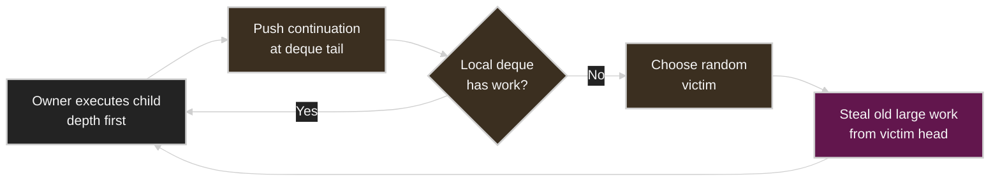

## Why Thieves Take from the Head

Owner와 thief가 deque의 반대쪽을 사용하는 데는 세 가지 이유가 있다.

1. Head에는 recursive tree에서 오래되고 큰 continuation이 있다. Thief가 큰 subtree를
   가져가면 steal overhead를 오랫동안 amortize한다.
2. Owner는 current branch 주변의 newest work를 계속 처리하므로 temporal/data locality를
   유지한다.
3. Owner와 thieves가 같은 deque element를 놓고 다투는 빈도가 줄어든다. 강의 slides는
   이를 활용한 efficient lock-free deque implementations가 존재한다고 설명한다.

Victim selection은 “현재 가장 바쁜 queue를 정확히 찾기”보다 random choice를 사용한다.
Global load를 조사하면 그 조사 자체가 communication이며, 여러 thieves가 동시에 같은 busy
worker를 선택해 contention을 만들 수 있다. 관측한 queue length도 steal 시점에는 이미
stale할 수 있다.

강의는 random victim selection이 theoretical optimum의 constant factor 안에 든다는
work-stealing result를 언급한다. 따라서 더 복잡한 global policy가 개선할 수 있는 부분은
주로 constant이며, simple randomized policy는 낮은 decision overhead와 분산된 contention을
얻는다.

## Generating Parallel Work in Parallel

다음 flat loop는 elements가 independent해도 work를 한 iteration씩 sequentially reveal한다.

```c
for (int i = 0; i < N; ++i)
    cilk_spawn foo(i);
cilk_sync;
```

Continuation-first면 한 worker가 children을 차례로 queue에 넣고, child-first면 하나의
continuation이 worker 사이를 옮겨 다니며 next iteration을 만든다. 어느 쪽이든 parallel
work generation 자체에는 serial chain이 남는다.

Divide-and-conquer generation은 range를 recursively split한다.

```c
void recursive_for(int start, int end) {
    while (end - start > GRANULARITY) {
        int mid = start + (end - start) / 2;
        cilk_spawn recursive_for(start, mid);
        start = mid;
    }

    for (int i = start; i < end; ++i)
        foo(i);
}

recursive_for(0, N);
```

한 thief가 half range를 가져가면 두 workers가 각 half를 다시 split한다. Parallel machine을
flat loop보다 빠르게 채울 수 있다. 강의는 Cilk의 parallel-for construct가 내부적으로 이런
recursive generation을 사용한다고 설명한다.

Range split에도 cutoff가 필요하다. `GRANULARITY`에 도달하면 sequential loop로 바꾸어 leaf
task creation overhead를 제한한다.

## Implementing Sync

`sync`는 current function/block에서 spawn한 work가 모두 끝났는지 알아야 한다. Work가
steal되지 않았다면 owner가 child-first로 실행한 뒤 continuation에 도달하므로 다른 worker가
관련 child를 실행 중일 수 없다. 이 경우 `sync`는 no-op이다.

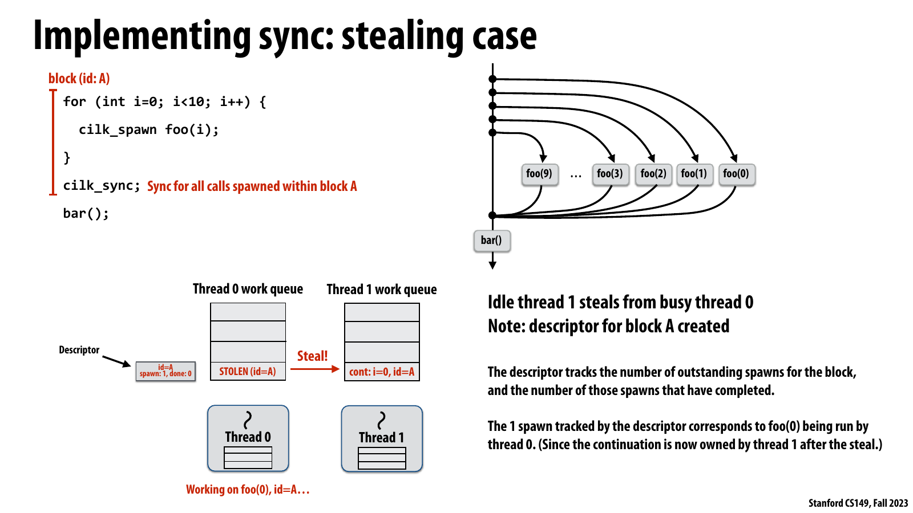

*공식 Lecture 5 slide page 53 — block A의 continuation이 steal되는 순간 outstanding spawn을 추적할 descriptor가 생성되는 첫 stealing state.*

슬라이드는 thread 1이 thread 0의 continuation을 steal하면 block A용 descriptor가 생기고,
`spawn: 1, done: 0`으로 `foo(0)`의 outstanding completion을 기록하는 상태를 보여 준다. Steal된
continuation과 child가 서로 다른 worker에 있으므로 이 metadata가 `sync` correctness에 필요하다.

강의 논리에서 핵심 optimization은 descriptor bookkeeping을 every spawn에 부과하지 않고 steal이
실제로 생긴 block에만 활성화하는 것이다. Common no-steal path는 serial execution처럼 가볍고,
remote completion이 있는 경우에만 spawn/done count를 유지한다.

GPU systems에 연결한 별도 해설에서는 cross-queue migration 뒤 dependency counter나 completion
event를 추가하는 방식과 유사하다. Metadata를 생략하면 join이 일찍 풀려 correctness가 깨지고,
항상 유지하면 regular local path에도 atomic overhead가 붙으므로 slow path 경계를 명확히 해야 한다.

Steal이 처음 발생하면 runtime은 해당 spawn block `A`를 위한 descriptor를 만든다. Slides의
conceptual fields는 다음과 같다.

```text
descriptor A:
  spawn = number of registered spawned pieces
  done  = number that reported completion
```

Execution sequence는 다음과 같다.

1. Thread 0이 `foo(0)`를 실행하고 `A`의 continuation을 deque에 둔다.
2. Thread 1이 continuation을 steal한다. 이제 block `A`에 remote work가 있으므로 descriptor가
   생성된다.
3. 더 많은 workers가 continuation을 steal하며 `spawn` count가 증가한다.
4. Stolen block의 work가 끝날 때마다 `done` count가 증가한다.
5. `spawn == done`이 되면 모든 spawned calls가 complete되었다.
6. Last completion을 수행한 worker가 `sync` 뒤의 `bar()` continuation을 이어서 실행하고
   descriptor를 해제한다.

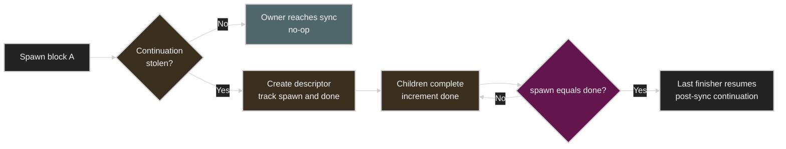

중요한 optimization은 bookkeeping cost가 every spawn의 common path에 무조건 생기지 않는다는
점이다. Steal이 없으면 sequential-like path가 가볍고, steal이 일어난 block에 대해서만
remote completion을 추적한다.

## Greedy Join Scheduling

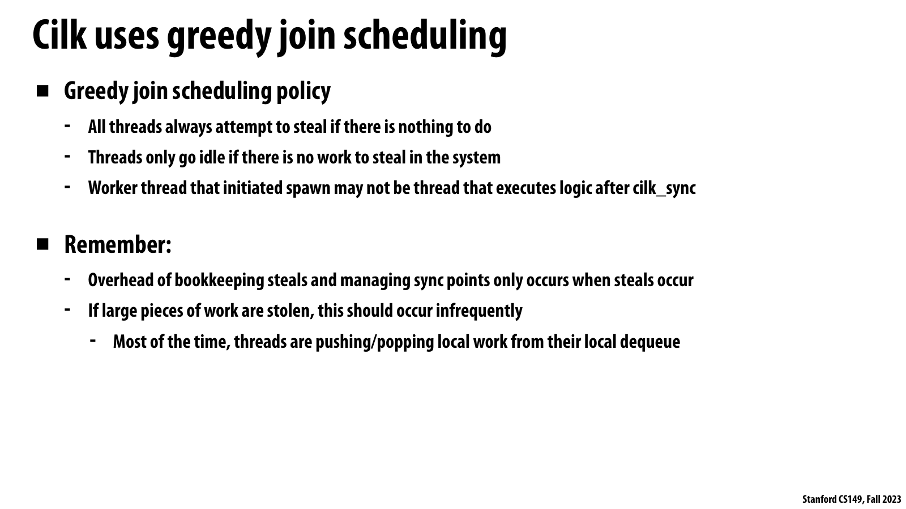

*공식 Lecture 5 slide page 61 — join에서 기다리지 않고 steal을 계속하며, spawn을 시작한 worker와 post-`sync` worker가 달라도 되는 greedy join.*

슬라이드는 local work가 없는 thread가 system에 steal할 work가 남아 있는 동안 계속 steal을
시도하고, 아무 work도 없을 때만 idle이 된다고 명시한다. 또한 `cilk_sync` 뒤 logic을 원래
spawn을 시작한 thread가 실행할 필요가 없음을 강조한다.

강의 논리에서 greedy join은 blocked worker를 보존하는 대신 ready continuation의 ownership을
last finisher에게 넘겨 execution resource를 useful work에 유지한다. Correctness는 descriptor의
outstanding count가 보장하며, greediness는 dependency를 건너뛴다는 뜻이 아니다.

GPU systems에 연결한 별도 해설에서는 dependency가 해제된 ready task를 idle execution resource가
즉시 이어받는 runtime과 대응한다. Queue scanning을 과도하게 하면 idle 대신 polling traffic이
늘 수 있으므로 steal backoff와 ready-work discovery cost도 goodput에 포함해야 한다.

Cilk의 greedy join policy에서 worker는 join에 도착했다고 passive wait하지 않는다.

* Local work가 없으면 다른 deque에서 즉시 steal을 시도한다.
* System 전체에 steal할 work가 없을 때만 idle이 된다.
* Original spawn을 시작한 worker와 `sync` 뒤 logic을 실행하는 worker가 같을 필요가 없다.
* Last outstanding child를 완료한 worker가 ready continuation을 이어받을 수 있다.

“Greedy”는 correctness dependency를 무시한다는 뜻이 아니라 runnable work가 있는 동안 worker를
쉬게 두지 않는다는 뜻이다. 대부분의 time에는 worker가 자기 deque tail에서 local push/pop을
하고, 비교적 드문 imbalance 시점에만 steal과 descriptor bookkeeping을 수행한다.

강의가 요약하는 Cilk runtime의 조합은 다음과 같다.

```text
fork-join abstraction
  + child-first execution
  + continuation stealing
  + per-worker deques
  + random victim selection
  + greedy join
  = locality-aware dynamic load balancing
```

## GPU Systems Lens

이 절은 강의의 scheduling 원리를 GPU/AI infrastructure에 연결한 추가 해석이다. 아래 내용은
Lecture 5 영상이나 slides의 직접 진술이 아니며, source-grounded lecture reconstruction과
구분한다.

| Lecture 5 concept | GPU/AI systems interpretation |
| ----------------- | ----------------------------- |
| Static assignment | Dense tensor의 regular tiles를 blocks/warps에 균등 배치 |
| Semi-static assignment | Recent expert/load profile로 다음 serving epoch placement 조정 |
| Dynamic queue | Persistent kernel이 global 또는 hierarchical task counter에서 work 획득 |
| Task granularity | Tile 크기, tokens per work item, requests per batch |
| Long-tail task | Divergent ray, long sequence, overloaded MoE expert, slow collective chunk |
| Per-worker deque | SM/CPU worker-local queues와 idle-time stealing |
| Parallel slack | Resident blocks보다 충분히 많은 ready blocks/tasks |
| Sequential cutoff | Tiny tensor/range를 별도 launch하지 않고 fuse하거나 local loop로 처리 |
| Greedy join | Dependency가 풀린 ready kernel/task를 idle resource가 즉시 수행 |

CUDA grid launch는 data-parallel work를 bulk로 노출하며 hardware scheduler가 ready thread blocks를
available SM에 동적으로 배치한다. Programmer가 block-to-SM mapping을 보통 직접 정하지 않아도
되는 점은 dynamic assignment와 닮았다. 그러나 block size, grid size, resource usage가
simultaneous residency와 slack을 제한하므로 “blocks가 많다”와 “SM이 효율적으로 찬다”는 같은
말이 아니다.

Dense GEMM은 tile cost가 비교적 uniform해 static decomposition이 잘 맞는다. 반면 sparse
matrix, Mixture-of-Experts routing, variable-length sequence, graph traversal은 item cost와
arrival이 irregular하다. 이 경우 queue-based assignment가 tail을 줄일 수 있지만 global atomic
counter나 queue metadata가 hotspot이 될 수 있다. Warp/block-local chunk allocation과
hierarchical queues는 Lecture 5의 larger granularity와 distributed queue 원리를 GPU scale에
적용한 형태다.

Multi-GPU training/serving에서는 balance를 compute time만으로 판단하면 안 된다. Rank별 useful
kernel time이 같아도 collective arrival time, network path, expert token skew 때문에 fast ranks가
대기할 수 있다. Makespan을 정하는 것은 마지막 rank이며, collective 앞의 arrival-time spread가
강의의 long tail과 같은 역할을 한다.

Fork-join runtime이 child-first로 locality를 보존하듯 GPU task system도 recently touched data와
다음 work를 가까이 두면 cache/HBM reuse를 얻는다. 하지만 locality-aware static placement가
imbalance를 키울 수 있으므로 work stealing이나 migration threshold를 함께 설계해야 한다.

## Practical Tips and Notes

이 절은 source lecture와 분리된 field-oriented guidance다. 강의에서 직접 주장한 내용으로
간주하지 않는다.

### Baseline을 세 단계로 유지하기

최소한 다음 세 version을 비교하면 scheduling optimization의 원인을 구분하기 쉽다.

1. Best-known sequential implementation
2. Simplest correct parallel implementation
3. Tuned scheduler/granularity implementation

Parallel version 하나만 측정하면 optimization이 useful compute를 개선했는지, imbalance를
줄였는지, 단순히 measurement scope를 바꿨는지 알기 어렵다. 동일 input, output tolerance,
warm-up, allocation/transfer 포함 범위를 고정한다.

### Worker timeline에서 세 시간을 분리하기

각 worker마다 다음을 기록한다.

```text
useful compute time
queue/scheduler/synchronization time
idle or dependency-blocked time
```

Useful time 편차가 크면 assignment problem이고, queue time이 크면 granularity/contention
problem이며, useful time은 비슷한데 idle이 크면 phase boundary나 dependency release의 tail을
의심한다.

### Granularity sweep을 logarithmic하게 시작하기

`g = 1, 2, 4, 8, ...`처럼 chunk size를 배수로 늘리며 다음을 함께 plot한다.

* End-to-end latency와 throughput
* Tasks processed per worker
* Queue/atomic operations 수
* Maximum worker busy time과 minimum worker busy time
* Tail time: first worker completion부터 last completion까지

좋은 `g`는 task count를 최소화한 값이 아니라 balance loss가 허용되는 범위에서 overhead가
충분히 amortize되는 값이다. Input distribution과 machine generation이 바뀌면 다시 sweep한다.

### Average만 보지 말고 tail을 본다

Mean worker utilization이 높아도 iteration 끝의 짧은 idle tail이 반복되면 총 runtime 손실은
크다. Per-iteration max, p95/p99 task latency, barrier/collective arrival spread를 확인한다.

> [!WARNING]
> Dynamic scheduling이 average balance를 개선해도 마지막 indivisible task가 길면 makespan은
> 줄지 않는다. `max task time`, 마지막 queue pop 시점, last-finisher identity를 함께 기록한다.

### Queue contention을 coherence traffic으로 확인하기

Shared counter가 병목이라면 source code에서 atomic instruction 하나만 보아서는 부족하다.
CPU에서는 cache-line bouncing과 failed lock acquisition, GPU에서는 atomic serialization과
memory partition pressure를 profiler로 확인한다. Counter 주변의 unrelated metadata가 같은
cache line을 쓰는 false sharing도 배제한다.

### Work stealing에 backoff와 termination detection을 포함하기

Queue가 잠시 비었다고 global computation이 끝난 것은 아니다. 다른 worker가 future task를
생성할 수 있다. Production work-stealing system은 outstanding-work count, epoch, quiescence
protocol 등으로 termination을 판정해야 한다. Aggressive steal polling은 empty system에서
bandwidth와 power를 낭비하므로 bounded backoff 또는 sleep/wakeup policy도 측정한다.

### Dependency scheduler는 critical path를 별도로 본다

Ready queue가 항상 가득 차도 critical successor를 여는 task가 늦게 실행되면 전체 DAG
makespan이 늘어난다. Task priority를 단순 cost뿐 아니라 downstream criticality와 fan-out으로
정할 수 있다. Dependency count update가 centralized hotspot이 되지 않는지도 확인한다.

### GPU persistent queue의 조건을 검증하기

Persistent kernel은 launch overhead를 줄이고 irregular work를 dynamic하게 가져올 수 있지만,
다음 cost를 추가한다.

* Global queue atomic과 polling traffic
* Persistent blocks가 점유하는 registers/shared memory
* Fairness와 preemption 제약
* Queue producer/consumer memory-order correctness

짧고 regular한 dense kernel에는 ordinary bulk launch가 더 단순하고 빠를 수 있다. Persistent
scheme은 measured irregularity나 launch overhead가 충분히 클 때 도입한다.

### MoE에서 token count와 work cost를 구분하기

Expert별 token 수가 같아도 sequence shape, capacity padding, communication route, kernel size에
따라 completion time이 다를 수 있다. `tokens/expert`뿐 아니라 expert kernel duration,
all-to-all bytes, dispatch-to-combine tail을 함께 본다. Semi-static placement는 recent routing
histogram이 near-term을 예측한다는 가정을 명시해야 한다.

### Quick Reference

| Symptom | First check | Likely direction |
| ------- | ----------- | ---------------- |
| Worker별 task count는 같은데 finish time이 다름 | Task duration distribution | Cost-aware static 또는 dynamic assignment |
| Shared queue에서 time이 많이 소모됨 | Lock wait, atomic traffic, queue cache line | Larger chunks 또는 distributed queues |
| Dynamic version이 static보다 느림 | Useful work per dequeue | Granularity 확대, static baseline 유지 |
| 마지막 한 task만 오래 남음 | `max_i w_i`, task order | Split long task 또는 long-first scheduling |
| Rebalance 직후만 빨라짐 | Workload drift rate | Semi-static interval 단축 검토 |
| Rebalance cost가 이득을 상쇄 | Migration bytes/time | Interval 확대 또는 cheaper cost model |
| Fork-join memory use가 큼 | Spawn policy, queued child count | Child-first/continuation stealing 확인 |
| Steal 횟수가 과도함 | Stolen subtree size | Head에서 larger continuation steal |
| 모든 thieves가 한 victim에 몰림 | Victim selection policy | Randomization과 backoff 확인 |
| Join에서 workers가 대기함 | Other ready queues, join implementation | Greedy steal-before-idle 확인 |
| GPU SM 일부가 일찍 idle | Blocks/SM, block duration spread | Grid slack, tile/chunk size 조정 |
| Multi-GPU step tail이 큼 | Rank arrival spread | Input/expert balance와 communication path 확인 |

## Lecture Summary

Lecture 5는 parallel performance를 work assignment와 scheduling 관점에서 다룬다. Ideal state는
모든 processor가 동시에 useful work를 수행하고 비슷한 시점에 끝나는 것이다. 그러나 balance를
얻기 위한 scheduling, synchronization, communication, extra work도 전체 runtime의 일부다.
따라서 simplest correct implementation을 먼저 측정하고 dominant loss를 확인한 뒤 mechanism을
추가해야 한다.

Static assignment는 task cost가 predictable할 때 강력하다. Assignment overhead가 거의 없고
worker가 독립적으로 work range를 계산할 수 있다. Workload가 천천히 변하면 periodic profiling과
repartition을 하는 semi-static policy가 적합하다. Cost가 unpredictable하면 shared counter나
queue로 dynamic assignment를 구현해 idle worker에게 다음 work를 준다.

Dynamic scheduling의 핵심 trade-off는 granularity다. 많은 small tasks는 balance와 parallel
slack을 높이지만 queue/lock overhead를 늘린다. Large tasks는 overhead를 amortize하지만 long
tail을 만들 수 있다. Task splitting이 불가능하거나 cost를 예측할 수 있다면 long task를 먼저
schedule해 tail을 줄인다.

Shared queue contention을 줄이기 위해 per-worker queues와 work stealing을 사용한다. Common
case에서는 worker가 local queue만 접근하고, idle할 때만 random victim에게서 work를 훔친다.
Fork-join recursive program에서는 child-first execution이 sequential order와 locality를 보존하고,
continuation이 deque에 쌓인다. Owner는 tail의 small/new work를 처리하고 thief는 head의
large/old continuation을 가져간다.

Cilk `spawn`과 `sync`는 logical concurrency와 join constraint를 표현할 뿐 thread mapping을
규정하지 않는다. Runtime은 fixed worker pool, continuation stealing, per-worker deques,
randomized victim selection, lazy sync bookkeeping을 결합한다. Steal이 없으면 sync는 가볍고,
steal된 block만 spawn/done descriptor로 추적한다. Last finisher가 post-sync continuation을
실행하는 greedy join은 runnable work가 있는 동안 workers를 idle로 두지 않는다.

최종적으로 기억할 문장은 다음과 같다.

* Equal task count가 아니라 equal completion time을 목표로 한다.
* Static과 dynamic assignment는 양자택일이 아니라 workload knowledge에 따른 spectrum이다.
* Task는 worker보다 많아야 balance할 여지가 생기지만, tiny task는 free가 아니다.
* Largest indivisible task와 critical path가 makespan의 lower bound를 만든다.
* Work stealing은 common path를 local하게 하고 imbalance가 생길 때만 communication한다.
* Fork-join abstraction과 runtime scheduling implementation을 구분해서 이해한다.
* Optimization은 measurement로 시작하고 같은 조건의 measurement로 끝낸다.

## Key Terms

| Term | Meaning |
| ---- | ------- |
| Workload balance | Available workers에 execution time 기준으로 work가 고르게 배치된 상태 |
| Makespan | Schedule에서 마지막 worker가 끝나는 시점, 전체 parallel completion time |
| Straggler | 다른 workers보다 늦게 끝나 전체 completion을 지연시키는 worker/task |
| Static assignment | Execution behavior에 반응하지 않고 work-to-worker mapping을 미리 결정하는 방식 |
| Semi-static assignment | 일정 interval 동안 mapping을 고정하고 profile에 따라 주기적으로 재조정하는 방식 |
| Dynamic assignment | Runtime worker availability와 task completion에 따라 mapping을 결정하는 방식 |
| Task | Scheduler가 assignment할 logical unit of work |
| Worker | Queue에서 tasks를 가져와 실행하는 persistent execution agent |
| Work queue | Ready 또는 unassigned work를 보관하는 structure |
| Granularity | 한 task가 포함하는 useful work의 크기 |
| Scheduling overhead | Queue, dispatch, lock, atomic, bookkeeping에 드는 extra work |
| Long tail | 대부분의 workers가 끝난 뒤 일부 긴 task/worker만 남은 execution 구간 |
| Parallel slack | Independent task 수와 hardware execution contexts 수의 ratio |
| Fork-join | Independent child work를 fork하고 completion dependency에서 join하는 pattern |
| Cilk spawn | Function call과 caller가 concurrently 진행할 수 있게 logical work를 노출하는 construct |
| Cilk sync | Current function이 spawn한 calls의 completion을 기다리는 join construct |
| Child | Spawn된 function call이 나타내는 logical work |
| Continuation | Spawn call 이후 caller에 남아 있는 logical work |
| Child stealing | Owner가 continuation을 실행하고 child를 stealable하게 두는 policy |
| Continuation stealing | Owner가 child를 실행하고 caller continuation을 stealable하게 두는 policy |
| Work stealing | Idle worker가 다른 worker의 queue에서 ready work를 가져오는 dynamic scheduling |
| Deque | Owner와 thief가 서로 다른 끝을 사용할 수 있는 double-ended queue |
| Victim | Thief가 work를 가져오려고 선택한 다른 worker |
| Serial elision | Spawn/sync annotations를 제거해 얻는 valid sequential execution |
| Sequential cutoff | Problem이 작을 때 spawn 대신 sequential algorithm을 실행하는 threshold |
| Dependency graph | Task 실행 순서를 제한하는 predecessor-successor relation |
| Descriptor | Stolen spawn block의 outstanding work와 completion을 추적하는 runtime metadata |
| Greedy join | Join에서 기다리지 않고 available work를 계속 찾으며 last finisher가 continuation을 잇는 policy |

## Questions

1. Parallel performance optimization에서 서로 충돌하는 세 목표는 무엇인가?
2. Equal task count가 good workload balance를 보장하지 않는 이유는 무엇인가?
3. Total work `W`, processor 수 `P`, longest task cost `w_max`일 때 makespan lower bound는
   무엇인가?
4. Static assignment는 compile-time assignment와 어떻게 다른가?
5. Mandelbrot row-interleaving이 좋은 balance를 얻은 workload assumption은 무엇인가?
6. Semi-static assignment는 어떤 workload에 적합한가?
7. Atomic counter가 logical work queue를 구현하는 방식을 설명하라.
8. Task와 worker thread는 왜 같은 수일 필요가 없는가?
9. Fine-grained task의 장점과 비용은 무엇인가?
10. `5.9 s` total 중 useful work가 `5.75 s`인 측정과 `2.5 s`인 측정은 각각 어떤
    결론을 지지하는가?
11. Dynamic scheduling에서도 long tail이 생길 수 있는 이유는 무엇인가?
12. Longest-work-first policy는 어떤 정보와 추가 비용을 요구하는가?
13. Per-worker queues가 single shared queue보다 synchronization을 줄이는 이유는 무엇인가?
14. Dependency가 있는 task가 submitted되었지만 ready하지 않을 수 있는 이유는 무엇인가?
15. Data parallelism과 fork-join parallelism은 potential parallelism을 어떻게 다르게 노출하는가?
16. `cilk_spawn`이 반드시 새 OS thread를 뜻하지 않는 이유는 무엇인가?
17. `cilk_sync`와 implicit function-end sync가 보장하는 것은 무엇인가?
18. Parallel quicksort가 두 recursive branches 중 하나만 spawn해도 되는 이유는 무엇인가?
19. `PARALLEL_CUTOFF`가 필요한 performance 이유는 무엇인가?
20. Parallel slack이 너무 작거나 너무 클 때 각각 어떤 문제가 생기는가?
21. One-thread-per-spawn implementation의 네 가지 performance 문제는 무엇인가?
22. Child-first execution이 no-steal case에서 좋은 locality와 bounded queue storage를 얻는 이유는
    무엇인가?
23. Quicksort deque에서 thief가 head를, owner가 tail을 사용하는 이유는 무엇인가?
24. Random victim selection이 global busiest-worker selection보다 실용적일 수 있는 이유는 무엇인가?
25. Flat spawned loop보다 recursive range splitting이 machine을 더 빨리 채우는 이유는 무엇인가?
26. Steal이 전혀 없을 때 `sync`가 no-op일 수 있는 이유는 무엇인가?
27. Steal이 발생하면 block descriptor가 어떤 두 종류의 count를 추적하는가?
28. Greedy join에서 original spawning worker와 post-sync continuation을 실행하는 worker가 달라질
    수 있는 이유는 무엇인가?
29. GPU persistent work queue에서 확인해야 할 overhead는 무엇인가?
30. Multi-GPU workload balance를 rank별 item count만으로 평가하면 안 되는 이유는 무엇인가?

## Answers

1. Workload balance, communication 감소, parallelism과 assignment를 관리하기 위한 extra work
   감소다. 하나를 개선하는 mechanism이 다른 비용을 늘릴 수 있다.
2. Task마다 execution cost가 다를 수 있기 때문이다. 각 worker의 task 수가 같아도 한 worker가
   긴 tasks를 맡으면 makespan을 결정하는 straggler가 된다.
3. Overhead와 communication을 무시할 때 `T_P >= max(W/P, w_max)`다. 전체 work division과 가장
   긴 indivisible task가 각각 lower bound를 만든다.
4. Static assignment는 input size와 worker count가 runtime에 알려진 뒤 계산해도 된다. 핵심은
   execution 중 completion behavior에 따라 mapping을 바꾸지 않는다는 점이다.
5. 가까운 rows의 cost가 비슷하고 local groups를 여러 threads에 interleave하면 각 thread가
   expensive/cheap regions를 평균적으로 비슷하게 sampling한다는 가정이다.
6. Cost distribution이 변하지만 recent past가 near-term future를 예측하고, redistribution보다
   fixed interval execution이 충분히 긴 simulation/training workload에 적합하다.
7. Array의 indices가 logical queue entries이고 atomic fetch-and-increment가 unique next index를
   반환하는 `pop()` 역할을 한다.
8. Worker는 machine concurrency만큼 유지하면서 많은 logical tasks를 반복 실행할 수 있다.
   Worker보다 tasks가 많아야 cost variation을 scheduler가 섞을 여지가 생긴다.
9. Fine granularity는 dynamic assignment의 balance와 slack을 높인다. 대신 queue access,
   synchronization, bookkeeping을 더 자주 수행한다.
10. `5.75 s`이면 scheduling 제거로 얻을 ceiling이 작아 추가 tuning 가치가 낮다. `2.5 s`이면
    절반 이상이 overhead일 가능성이 있어 granularity나 assignment를 바꿀 가치가 크다.
11. 매우 긴 indivisible task가 queue 뒤에서 늦게 시작되면 다른 workers가 짧은 tasks를 끝낸 후
    그 task 하나를 기다리기 때문이다.
12. Task cost estimate가 필요하며 profiling, sorting/priority management, 잘못된 prediction의
    비용을 추가로 지불한다.
13. Common case의 push/pop이 worker-local deque에서 일어나며, cross-worker synchronization은
    local work가 고갈되어 steal할 때만 발생하기 때문이다.
14. Predecessor dependencies가 아직 완료되지 않았기 때문이다. Scheduler는 completion event가
    outstanding dependency count를 0으로 만들 때만 ready queue에 넣는다.
15. Data parallelism은 many data elements에 같은 operation을 bulk로 노출한다. Fork-join은
    recursive call graph의 independent branches를 execution 도중 점진적으로 노출한다.
16. Spawn의 semantics는 child와 caller가 concurrent할 수 있다는 것뿐이다. Serial execution,
    thread-pool assignment, 여러 valid schedules가 모두 contract를 만족할 수 있다.
17. Current function이 spawn한 모든 calls가 sync를 지나거나 function이 return하기 전에
    완료되었음을 보장한다.
18. Current control이 한 branch를 normal call로 수행하는 동안 다른 branch만 spawn해도 두
    independent branches가 동시에 실행될 수 있기 때문이다. 불필요한 spawn도 하나 줄어든다.
19. Tiny recursive ranges에서는 spawn/queue cost가 useful sorting보다 커질 수 있으므로 small
    leaves를 sequential sort로 묶어 overhead를 amortize한다.
20. Slack이 작으면 task variation이 바로 idle tail을 만든다. 너무 크면 task creation, queue,
    synchronization, memory footprint가 과도해진다.
21. Heavyweight thread creation, oversubscription, context switching, larger working set과 cache
    locality 저하다.
22. Owner가 serial program처럼 current child를 depth-first로 실행해 recently used state를
    유지하고, stealable continuation 하나만 두기 때문이다. Slides는 `T` workers의 queue
    storage를 sequential stack storage의 `T`배 이내로 설명한다.
23. Head에는 오래되고 큰 continuation이 있어 thief가 steal cost를 오래 amortize한다. Tail에는
    owner의 current branch와 가까운 small/new work가 있어 locality가 좋다. 서로 반대쪽을 써서
    deque element contention도 줄인다.
24. Global busiest-worker 탐색은 communication, stale observation, herd contention을 만든다.
    Random choice는 decision cost가 작고 thieves를 분산하며 theoretical guarantee도 있다.
25. Half range를 steal한 worker가 자기 half를 다시 split하므로 여러 workers가 동시에 future
    work를 생성한다. Flat loop는 next item을 reveal하는 serial chain이 남는다.
26. Child-first owner가 관련 children을 모두 실행한 뒤 continuation의 sync에 도달하며, steal이
    없었다면 다른 worker가 그 block의 work를 가지고 있지 않기 때문이다.
27. Block에 등록된 spawn count와 완료를 보고한 done count를
    추적한다. 두 값이 같아지면 post-sync continuation이 ready다.
28. Continuation과 child work가 steal로 여러 deques에 이동할 수 있기 때문이다. 마지막 outstanding
    work를 완료한 worker가 continuation을 ready 상태로 만들고 곧바로 이어서 실행할 수 있다.
29. Global atomic/polling traffic, persistent resource occupancy, fairness/preemption, producer-consumer
    memory ordering, empty-queue backoff를 확인해야 한다.
30. Equal item count라도 item cost, communication route, collective arrival, expert/token skew가
    달라질 수 있다. Step makespan은 마지막 rank completion에 의해 결정된다.
