# Lecture 6: Performance Optimization II — Locality, Communication, and Contention

Source: [Stanford CS149 2023 Lecture 6](https://www.youtube.com/watch?v=Mhdny2JNhmc)

Course materials:

* [Official Lecture 6 page](https://gfxcourses.stanford.edu/cs149/fall23/lecture/perfopt2/)
* [Lecture 6 slides PDF](https://gfxcourses.stanford.edu/cs149/fall23content/media/perfopt2/06_progperf2.pdf)
* [CS149 Fall 2023 course page](https://gfxcourses.stanford.edu/cs149/fall23/)

> 이 노트는 1시간 17분 24초 분량의 공식 영상과 69쪽 공식 슬라이드를 함께
> 대조해 재구성했다. 영상의 질문과 설명을 중심으로 쓰되, 수업 시간에 자세히
> 다루지 못한 high-watermark 실험, performance counter, problem-size scaling은
> 슬라이드 후반의 보충 자료임을 명시해 포함했다. 영상 자막은 자동 생성본이므로
> 수식과 용어는 슬라이드 표기를 기준으로 교정했다.

본문의 캡처는 69쪽 PDF를 표지부터 1-based로 센 공식 Lecture 6 슬라이드 p. 6, 8, 11,
18, 21, 23, 24, 26, 29, 31, 34, 35, 43, 44, 50, 57이다. Build/animation 중복과
title/agenda/logistics page는 제외하고 강의의 핵심 논리 전환을 대표하는 page를 골랐다.

## Table of Contents

* [Goal](#goal)
* [Lecture Overview](#lecture-overview)
* [Visual Map](#visual-map)
* [From Load Balance to Communication](#from-load-balance-to-communication)
* [Shared Address Space Is an Abstraction](#shared-address-space-is-an-abstraction)
* [On-Chip Interconnects and NUMA](#on-chip-interconnects-and-numa)
* [Shared Memory and Message Passing](#shared-memory-and-message-passing)
* [Message Passing Grid Solver](#message-passing-grid-solver)
* [Ghost Cells and Domain Decomposition](#ghost-cells-and-domain-decomposition)
* [Communication Also Performs Synchronization](#communication-also-performs-synchronization)
* [Blocking Communication and Deadlock](#blocking-communication-and-deadlock)
* [Non-Blocking Asynchronous Communication](#non-blocking-asynchronous-communication)
* [A Parallel System as an Extended Memory Hierarchy](#a-parallel-system-as-an-extended-memory-hierarchy)
* [Latency Bandwidth and Overlap](#latency-bandwidth-and-overlap)
* [Arithmetic Intensity](#arithmetic-intensity)
* [Inherent and Artifactual Communication](#inherent-and-artifactual-communication)
* [Assignment Shape Changes Communication](#assignment-shape-changes-communication)
* [Cache Capacity and Row-Major Traversal](#cache-capacity-and-row-major-traversal)
* [Cache Blocking](#cache-blocking)
* [Loop Fusion](#loop-fusion)
* [Co-Locating Work That Shares Data](#co-locating-work-that-shares-data)
* [Contention and Hot Spots](#contention-and-hot-spots)
* [A Communication Optimization Toolbox](#a-communication-optimization-toolbox)
* [Roofline Model](#roofline-model)
* [A Measurement-Driven Optimization Workflow](#a-measurement-driven-optimization-workflow)
* [Performance Counters and Profilers](#performance-counters-and-profilers)
* [Problem Size and Scaling](#problem-size-and-scaling)
* [GPU Systems Lens](#gpu-systems-lens)
* [Practical Tips and Notes](#practical-tips-and-notes)
* [Lecture Summary](#lecture-summary)
* [Key Terms](#key-terms)
* [Questions](#questions)
* [Answers](#answers)

---

## Goal

이 강의의 목표는 parallel program의 성능을 단순한 work balance만으로 설명하지
않고, **data가 어디에 있으며 얼마만큼 이동하고 언제 같은 resource에 몰리는가**까지
함께 분석하는 것이다. 같은 수의 operation을 같은 수의 processor에 균등하게
배분해도 communication cost가 크면 execution unit은 data를 기다리며 놀 수 있다.

핵심 질문은 다음 네 가지다.

1. 어떤 communication이 algorithm 때문에 반드시 필요한가?
2. 어떤 communication이 cache line, finite cache, packet size 같은 machine detail
   때문에 추가되었는가?
3. Work assignment와 execution order를 바꾸면 communication-to-computation ratio를
   얼마나 낮출 수 있는가?
4. 평균 bandwidth가 충분해도 request가 한 시점이나 한 resource에 몰려 contention이
   생기지는 않는가?

강의의 중심 척도는 **arithmetic intensity**다.

```text
Arithmetic intensity = amount of computation / amount of communication
                     ≈ operations / bytes moved
```

높은 arithmetic intensity는 data 하나를 가져온 뒤 더 많은 useful work를 한다는
뜻이다. 그러나 intensity 자체가 최종 목표는 아니다. Wall-clock time은 수행해야 할
총 work와 achievable throughput이 함께 결정한다. 더 적은 work를 하는 algorithm이
intensity를 낮추더라도 전체 실행 시간이 줄 수 있으므로, optimization은 항상 실제
시간과 함께 판단해야 한다.

이 강의가 다루는 주요 도구는 다음과 같다.

* Shared address space 아래 숨은 cache, interconnect, NUMA cost 읽기
* Explicit message passing으로 communication과 synchronization 드러내기
* Ghost cells를 이용한 distributed domain decomposition
* Blocking send/receive의 deadlock과 non-blocking communication의 lifetime rule
* Inherent communication과 artifactual communication 구분
* 1D block, interleaved, 2D block assignment의 surface-to-volume 분석
* Cache blocking과 loop fusion을 통한 temporal locality 향상
* Replication, hierarchy, staggering으로 contention 완화
* Roofline model과 high watermark를 이용한 optimization headroom 판단
* Fixed-size scaling과 problem-size effect를 구분하는 방법

## Lecture Overview

강의는 Lecture 5에서 다룬 scheduling과 load balance를 한 단계 확장한다. 이전 질문이
“work를 모든 worker에 고르게 나누는가?”였다면 이번 질문은 “그 assignment가 요구하는
data movement와 synchronization은 얼마인가?”이다. Kayvon Fatahalian은 shared-memory
program의 평범한 load/store가 실제로는 cache lookup, on-chip network message,
memory-controller transaction을 포함할 수 있음을 Intel ring, Sun Niagara crossbar,
dual-socket NUMA 예시로 설명한다.

그 다음 communication을 source code에 명시하는 message passing model을 도입한다.
Lecture 4의 red-black grid solver를 여러 private address space에 나누고, 경계 값을
ghost row로 복제한다. 이 버전에는 shared variable, lock, explicit barrier가 없지만
send/receive의 matching과 ordering 자체가 data dependency와 synchronization을
표현한다. 동시에 모든 thread가 blocking `send`를 먼저 호출하면 아무도 matching
`receive`에 도달하지 못하는 deadlock도 드러난다.

중반부는 communication을 processor 사이의 message에 한정하지 않고 register, cache,
DRAM, remote memory를 잇는 extended memory hierarchy 전체로 일반화한다. 충분한
concurrency로 latency를 숨긴 steady state에서는 processor utilization이 memory
latency보다 instruction throughput과 bandwidth의 비율에 좌우된다. 이를 정량화하는
개념이 arithmetic intensity다.

후반부는 grid solver assignment를 바꿔 inherent communication을 줄이고, traversal을
blocking해 capacity miss를 줄이며, array expression의 loops를 fusion해 temporary
traffic을 제거한다. 이어서 average traffic volume과 별개로 request가 동시에 한
resource에 모이면 queueing delay가 생기는 contention을 설명한다. 마지막 roofline
model은 arithmetic intensity, memory bandwidth, peak compute throughput을 하나의
그림으로 묶어 “현재 program이 어느 한계에 있고 optimization 여지가 있는가?”를
판단하게 한다.

영상 진행을 기준으로 한 구간은 다음과 같다.

| Time | Topic |
| ---- | ----- |
| `00:05–01:39` | Lecture 5의 scheduling 복습, 오늘의 목표: communication과 synchronization cost |
| `01:40–07:44` | Shared address space의 실제 구현, cache hierarchy, ring, crossbar, NUMA |
| `07:46–11:29` | Message passing abstraction과 shared-memory model 비교 |
| `11:30–20:52` | Red-black grid solver의 data partition, ghost rows, SPMD-style code |
| `20:53–24:14` | Message가 reduction, termination broadcast, phase synchronization을 표현하는 방식 |
| `24:15–30:13` | Blocking send/receive semantics, fatal deadlock, even/odd ordering fix |
| `30:24–36:31` | Non-blocking send/receive, completion handle, buffer lifetime과 ordering 질문 |
| `36:35–45:38` | Extended memory hierarchy, latency hiding, bandwidth-bound execution, arithmetic intensity |
| `45:40–52:08` | Inherent communication, 1D blocked/interleaved/2D blocked assignment 분석 |
| `52:17–59:59` | Cache가 만드는 artifactual communication과 cache blocking |
| `01:00:00–01:03:24` | Loop fusion, temporary array 제거, deep-learning compiler와의 연결 |
| `01:03:25–01:07:14` | Shared-resource contention, queueing, replication과 request staggering |
| `01:07:17–01:15:37` | 단순한 구현부터 측정하기, roofline model과 optimization direction |
| `01:15:39–01:17:18` | Arithmetic intensity, throughput, total work 사이의 마지막 trade-off |

> PDF 후반의 high-watermark microbenchmark, hardware performance counter, fixed-size
> scaling과 super-linear speedup 자료는 영상에서 시간이 부족해 상세히 강의하지 않은
> bonus slides다. 이 노트의 해당 절은 영상 발언이 아니라 공식 슬라이드 보충 내용을
> 재구성한 것이다.

## Visual Map

Lecture 6의 optimization logic은 “communication이 왜 생겼는지 분류하고, 원인에 맞는
변환을 적용한 뒤, roofline과 measurement로 효과를 확인한다”는 흐름으로 정리할 수
있다.

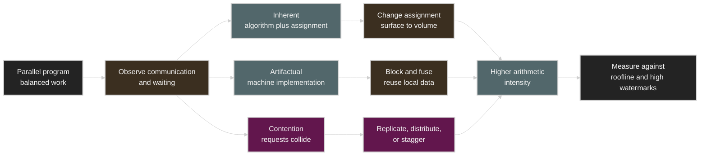
```mermaid
%%{init: {"theme": "base", "themeVariables": {"background": "#171717", "primaryColor": "#232323", "primaryTextColor": "#f5f5f5", "primaryBorderColor": "#d0d0d0", "lineColor": "#cfcfcf", "fontFamily": "Inter, Arial, sans-serif"}}}%%
flowchart LR
    P[Parallel program<br/>balanced work] --> C[Observe communication<br/>and waiting]
    C --> I[Inherent<br/>algorithm plus assignment]
    C --> A[Artifactual<br/>machine implementation]
    C --> H[Contention<br/>requests collide]

    I --> T[Change assignment<br/>surface to volume]
    A --> B[Block and fuse<br/>reuse local data]
    H --> R[Replicate, distribute,<br/>or stagger]

    T --> Q[Higher arithmetic<br/>intensity]
    B --> Q
    R --> Q
    Q --> M[Measure against<br/>roofline and high watermarks]

    classDef primary fill:#232323,stroke:#d0d0d0,color:#f5f5f5,stroke-width:2px;
    classDef secondary fill:#3b2f20,stroke:#d0d0d0,color:#f5f5f5,stroke-width:2px;
    classDef note fill:#52676b,stroke:#d0d0d0,color:#f5f5f5,stroke-width:2px;
    classDef accent fill:#62164d,stroke:#d0d0d0,color:#f5f5f5,stroke-width:2px;
    class P,M primary
    class C,T,B secondary
    class I,A,Q note
    class H,R accent
```

---

## From Load Balance to Communication

Load balance는 모든 worker가 비슷한 양의 work를 받는지를 묻는다. 그러나 balanced
assignment라고 해서 efficient assignment인 것은 아니다. 각 worker가 자신의 work를
수행할 때 remote data를 계속 요청하거나, 같은 lock과 memory channel에 동시에
접근하거나, cache에 담아 둔 data를 재사용하기 전에 축출한다면 많은 execution unit이
stall한다.

이를 간단한 시간 모델로 쓰면 다음과 같다.

```text
T_parallel ≈ max(T_work per worker)
           + T_communication
           + T_synchronization
           + T_contention
           + T_scheduling overhead
```

각 항은 완전히 독립적이지 않다. Assignment를 더 잘 balance하려고 work를 잘게
쪼개면 scheduling과 communication이 늘 수 있다. Data를 replicate하면 remote access는
줄지만 copy update와 synchronization이 필요해진다. Asynchronous communication은
latency를 work와 overlap할 수 있지만 더 많은 in-flight state와 buffer lifetime을
관리해야 한다.

따라서 Lecture 5와 Lecture 6의 질문은 경쟁 관계가 아니라 공동 최적화 문제다.

| Dimension | 좋은 상태 | 실패 신호 |
| --------- | --------- | --------- |
| Load balance | Worker finish time이 비슷함 | 일부 worker만 오래 실행 |
| Locality | 가져온 data를 여러 번 재사용 | 높은 cache miss, remote traffic |
| Communication volume | Boundary/temporary traffic이 작음 | Bandwidth saturation |
| Synchronization | 필요한 ordering만 표현 | Barrier/lock wait가 큼 |
| Contention | Request가 여러 resource와 시간에 분산 | Hot spot과 긴 queue tail |

## Shared Address Space Is an Abstraction

Shared address space model에서는 모든 thread가 같은 address를 이름으로 사용한다.
`load X`와 `store X`라는 표현은 편리하지만, `X`가 물리적으로 한 곳에 있고 모든 core가
같은 비용으로 접근한다는 뜻은 아니다.

하나의 load는 다음 경로를 거칠 수 있다.

```text
register lookup
  -> L1 tag/data lookup
  -> L2 lookup
  -> distributed L3 slice lookup
  -> on-chip interconnect request
  -> memory controller
  -> DRAM access
  -> cache-line response through the hierarchy
```

같은 cache line의 copy가 여러 private cache에 있을 수 있으며, 한 core의 write가 다른
copy와 일관된 값을 유지하려면 cache coherence protocol이 message를 교환해야 한다.
Source code의 한 줄짜리 store가 data message뿐 아니라 request, snoop, acknowledgement,
invalidation을 유발할 수 있는 이유다.

Shared-memory abstraction의 장점은 uniprocessor programming을 자연스럽게 확장한다는
점이다. Thread가 shared variable을 읽고 쓰며 lock이나 atomic operation으로 ordering을
지정한다. 단점은 communication이 syntax에 잘 드러나지 않는다는 점이다. Correctness가
확보된 뒤에도 address placement, coherence traffic, cache capacity, topology를 따로
분석해야 한다.

## On-Chip Interconnects and NUMA

공식 슬라이드는 shared address space를 구현하는 network가 작지도 단순하지도 않음을
두 architecture로 보여 준다.

### Intel ring interconnect

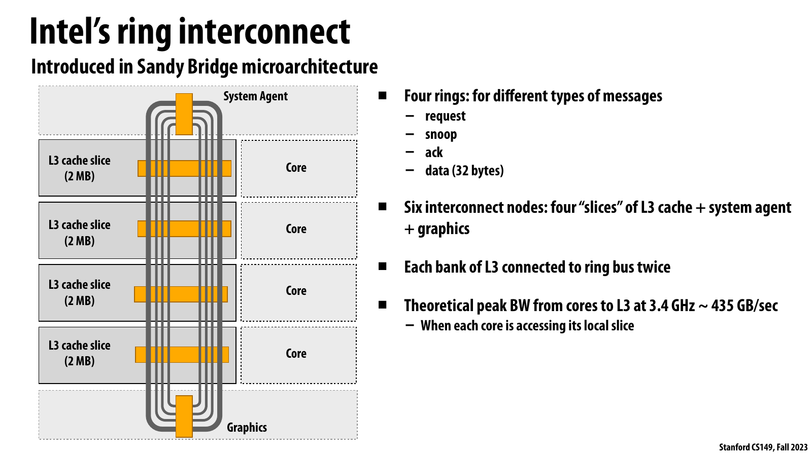

_공식 Lecture 6 슬라이드 p. 6 — 네 종류의 message ring, 네 개의 distributed L3
slice, system agent, graphics를 잇는 Sandy Bridge의 물리적 on-chip interconnect._

Sandy Bridge 세대에 도입된 예시 ring은 core, distributed L3 cache slice, system agent,
graphics를 연결한다. 슬라이드는 request, snoop, acknowledgement, data를 위한 네 종류의
ring과 각 L3 bank의 두 contact point를 제시한다. 한 방향 routing은 protocol을 단순화할
수 있고, 두 접점은 ring traversal distance를 줄인다.

여기서 중요한 일반 원리는 L3 hit도 uniform cost가 아닐 수 있다는 것이다. Address가
mapping된 L3 slice와 요청 core 사이의 ring distance가 다르기 때문이다. “Cache hit”라는
하나의 label만으로 실제 latency와 bandwidth를 모두 설명할 수 없다.

슬라이드가 제시한 core-to-L3 theoretical peak bandwidth 약 `435 GB/s`는 3.4 GHz에서
각 core가 local slice에 접근할 때의 조건부 상한이다. 즉 shared address라는 논리적
이름은 같아도 어느 slice로 mapping되었는지, ring을 얼마나 이동하는지, 동시에 누가
link를 쓰는지에 따라 관측 latency와 usable bandwidth는 달라진다. 이것이 programming
abstraction 아래의 physical implementation을 함께 봐야 하는 이유다.

실무/GPU 연결(슬라이드 밖의 해설): GPU에서도 하나의 device pointer가 모든 SM에서
접근 가능하다는 사실만으로 동일한 비용을 보장하지 않는다. Address가 연결된 memory
partition/L2 slice, SM cluster와의 거리, fabric contention에 따라 service time과
bandwidth가 달라질 수 있다. Consumer 가까이에 data와 work를 배치하면 hop과 traffic을
줄일 수 있지만, locality만 좇아 work를 고정하면 load balance와 aggregate bandwidth를
잃을 수 있으므로 placement는 latency, bandwidth, balance를 함께 측정해 결정해야 한다.

### Sun Niagara 2 crossbar

UltraSPARC T2 예시는 eight cores와 L2/memory banks를 crossbar로 연결한다. Crossbar는
각 participant 사이의 높은 connectivity를 제공하지만 wiring과 switch area가 비싸다.
슬라이드의 chip diagram에서 crossbar area가 processor core 하나와 비슷하다는 관찰은
communication fabric가 silicon budget의 실질적인 소비자임을 보여 준다.

### NUMA

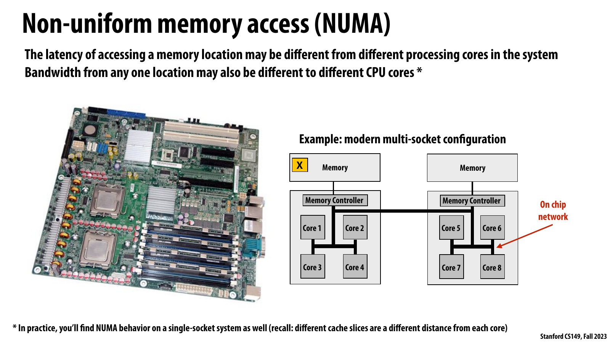

_공식 Lecture 6 슬라이드 p. 8 — memory location `X`, 두 memory controller, 두 core
그룹과 interconnect로 latency와 bandwidth가 위치별로 달라지는 NUMA topology._

Dual-socket system에서는 한 core의 local memory controller에 연결된 DRAM과 다른
socket의 DRAM 접근 비용이 다르다. 이를 non-uniform memory access, 즉 **NUMA**라고
한다. NUMA는 multi-socket에만 국한되지 않는다. 한 socket 안에서도 distributed cache
slice나 chiplet 위치 때문에 distance와 available bandwidth가 달라질 수 있다.

슬라이드 p. 8은 같은 location도 어느 core가 접근하느냐에 따라 latency가 달라지고,
한 location에서 각 core가 얻는 bandwidth도 달라질 수 있다고 명시한다. 그림의 `X`는
왼쪽 memory controller 쪽에 놓여 있으므로, topology상 가까운 core와 interconnect를
더 거쳐야 하는 core가 동일한 물리 경로를 쓰지 않는다. 아래 각주도 single-socket에서
core별 cache-slice 거리가 달라 NUMA-like behavior가 나타날 수 있음을 강조한다.

실무/GPU 연결(슬라이드 밖의 해설): CPU first-touch, thread affinity, GPU 선택, host
buffer의 NUMA node, multi-GPU tensor sharding은 모두 “data를 주 소비자 가까이에 둘
것인가”라는 placement 문제다. Local placement는 access latency와 remote-link traffic을
줄이지만, memory capacity가 한 node에 몰리거나 partition이 불균형해지고 cross-boundary
exchange가 늘 수 있다. 따라서 locality 이득은 topology-aware placement 전후의
local/remote bandwidth, tail latency, link traffic, workload balance를 함께 비교해
판단해야 한다.

| Question | Uniform model의 가정 | 실제로 확인할 것 |
| -------- | ------------------- | ---------------- |
| `X`는 어디에 있는가? | 하나의 shared memory | Cache slice, NUMA node, device memory |
| 누가 `X`를 소유하는가? | 모두 직접 접근 | First-touch placement, coherence owner |
| 접근 비용은 같은가? | 모든 core에 동일 | Hop count, link bandwidth, controller load |
| Copy는 몇 개인가? | 하나 | Private cache와 replicated buffer |

> Shared address space는 location을 숨기지만 location의 performance consequence까지
> 없애지는 않는다.

## Shared Memory and Message Passing

Message passing model은 communication을 명시적으로 만든다.

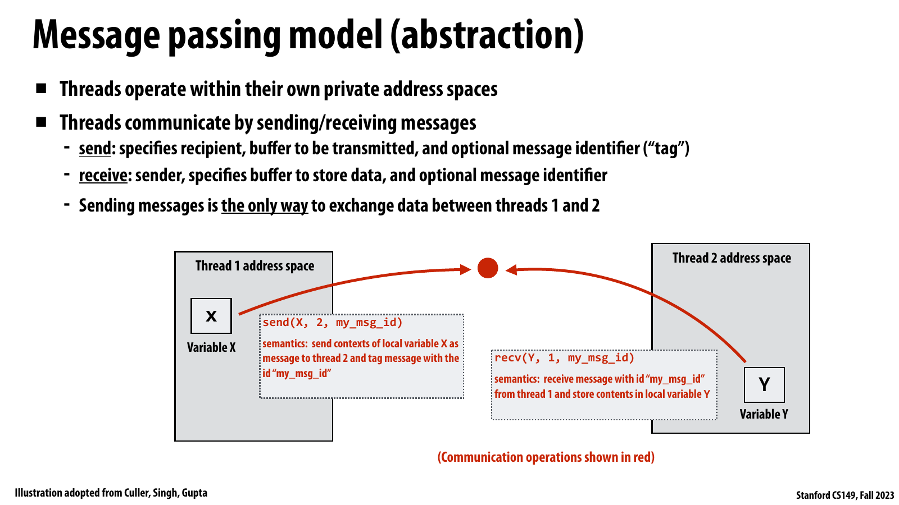

_공식 Lecture 6 슬라이드 p. 11 — private address space, recipient, buffer, tag로
구성된 message-passing abstraction._

슬라이드는 thread 1의 `X`와 thread 2의 `Y`가 서로 다른 address space에 있음을
회색 영역으로 분리하고, 붉은 화살표로 `send(X, 2, my_msg_id)`와
`recv(Y, 1, my_msg_id)`의 matching을 보여 준다. 즉 receiver는 sender의 주소를 직접
load하는 것이 아니라, recipient와 tag가 맞는 message를 받아 자신의 buffer에 data를
복사한다. 강의 논리에서 이 명시성은 shared-memory load/store 아래 숨었던
communication과 synchronization 지점을 source code 위로 끌어올린다.

실무/GPU 연결(슬라이드 밖의 해설): explicit copy는 message batching, topology-aware
routing, communication-computation overlap을 설계하기 쉽지만, buffer ownership과
completion을 programmer가 관리해야 한다. Multi-GPU halo exchange나 collective도
device마다 별도 memory가 있다는 점에서 같은 모델로 읽을 수 있으며, 작은 transfer를
남발하면 kernel이 빨라도 link startup과 synchronization cost가 전체 시간을 지배한다.

| Property | Shared address space | Message passing |
| -------- | -------------------- | --------------- |
| Address space | Thread가 공통 address를 사용 | 각 thread/process가 private address space 사용 |
| Data exchange | Shared variable load/store | `send`와 `receive`로 copy 전달 |
| Destination | Address가 암시 | Recipient를 명시 |
| Synchronization | Lock, atomic, barrier, flag | Message matching과 send/receive completion |
| Locality visibility | Source에서 숨기기 쉬움 | Remote transfer가 code에 드러남 |
| Typical scale | Multicore shared-memory system | Cluster, supercomputer, distributed process |

Conceptual message는 세 가지 정보를 담는다.

```text
send(source_buffer, recipient, tag)
recv(destination_buffer, sender, tag)
```

`tag`는 receiver가 어떤 logical message를 기다리는지 구분한다. Address `X`는 두 private
address space에서 서로 다른 storage이므로, sender의 `X`를 receiver가 직접 load할 수
없다. Sender가 bytes를 message에 담고 receiver가 자신의 `Y`에 복사해야 한다.

강의의 snail-mail 비유에서 shared memory는 누구나 붙이고 읽을 수 있는 bulletin board,
message passing은 envelope에 data를 넣고 destination을 적어 보내는 우편이다. 이
명시성은 code를 길게 만들 수 있지만 communication point와 possible stall을 찾기 쉽게
한다. 그래서 shared-memory multicore에서도 queue나 actor 형태의 message passing을
선택하는 경우가 있다.

## Message Passing Grid Solver

강의는 이전 lecture의 `N × N` red-black grid solver를 다시 사용한다. 한 phase에서는
모든 red cell을 주변의 four cardinal neighbors로 update하고, 다음 phase에서는 새 red
값을 사용해 black cell을 update한다. Convergence criterion을 만족할 때까지 반복한다.

Shared-memory version에서는 하나의 global array를 모든 thread가 보며, thread마다
서로 다른 global row range를 순회했다. Message-passing version에서는 각 worker가
자신의 private allocation만 접근한다. 따라서 global grid를 여러 local array로 나누고,
neighbor dependency에 필요한 boundary data를 message로 복제해야 한다.

한 iteration을 개념적으로 쓰면 다음과 같다. 이는 슬라이드의 긴 pseudocode를 흐름
중심으로 축약한 표현이다.

```text
while not done:
    exchange_boundary_rows_with_neighbors()

    local_diff = update_owned_cells(local_grid)

    if rank != 0:
        send(local_diff, rank_0, DIFF)
        recv(done, rank_0, DONE)
    else:
        total_diff = local_diff + recv_all_partial_diffs()
        done = convergence_test(total_diff)
        send_done_to_all_workers(done)
```

이 decomposition에는 세 종류의 communication이 있다.

1. Neighbor exchange: stencil update에 필요한 boundary row 전달
2. Reduction: 각 worker의 `local_diff`를 rank 0에 모음
3. Broadcast: rank 0이 계산한 `done`을 모든 worker에 보냄

Message granularity도 중요하다. Cell 하나마다 message를 보내지 않고 row 전체를 bulk
transfer하면 message startup cost를 amortize할 수 있다.

위 흐름은 communication structure를 강조한 축약이다. Red-black implementation에서는
각 color phase가 필요로 하는 최신 boundary가 보이도록 halo exchange와 phase ordering을
배치해야 한다.

## Ghost Cells and Domain Decomposition

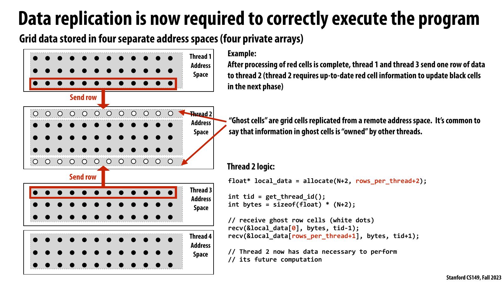

_공식 Lecture 6 슬라이드 p. 18 — neighbor가 소유한 boundary data를 local ghost row로
복제하는 domain decomposition._

슬라이드는 grid가 네 private allocation으로 나뉜 뒤 thread 1과 thread 3이 한 row씩
thread 2로 보내는 모습을 보여 준다. Thread 2 안의 흰 점은 remote address space가
소유한 값을 복제한 ghost cells이며, 아래 code는 `rows_per_thread + 2` 높이의 local
buffer 양끝에 두 ghost row를 `recv`하는 배치를 명시한다. 이 replication이 있어야 다음
color phase의 boundary cell도 최신 neighbor 값을 사용해 올바르게 계산된다.

실무/GPU 연결(슬라이드 밖의 해설): halo는 stencil inner loop를 단순하고 local하게
만드는 대신 extra capacity와 매 phase의 exchange를 요구한다. Multi-GPU solver에서는
owned region의 interior를 계산하는 동안 NVLink/PCIe halo transfer를 겹칠 수 있지만,
completion 전에 boundary kernel을 실행하면 성능 문제가 아니라 stale data를 읽는
correctness bug가 된다.

Worker가 직접 update하는 영역을 **owned region**이라 하고, neighbor가 소유하지만 local
computation에 필요한 복제 경계를 **ghost cell**, **ghost row**, 또는 **halo**라 한다.

Row-block decomposition에서 각 worker는 대략 다음 크기의 buffer를 할당한다.

```text
owned rows:       rows_per_worker
top ghost row:    1
bottom ghost row: 1

local height = rows_per_worker + 2
local width  = N + 2    // global boundary까지 포함하는 표현
```

Ghost data를 local array의 바로 위와 아래에 배치하면 inner loop가 source의 ownership을
구분할 필요가 없다. `local_grid[i-1][j]`가 owned row인지 remote ghost row인지와 무관하게
같은 stencil expression을 사용할 수 있다. 이 패턴은 structured-grid simulation,
finite-difference method, domain-decomposed PDE solver에서 널리 쓰인다.

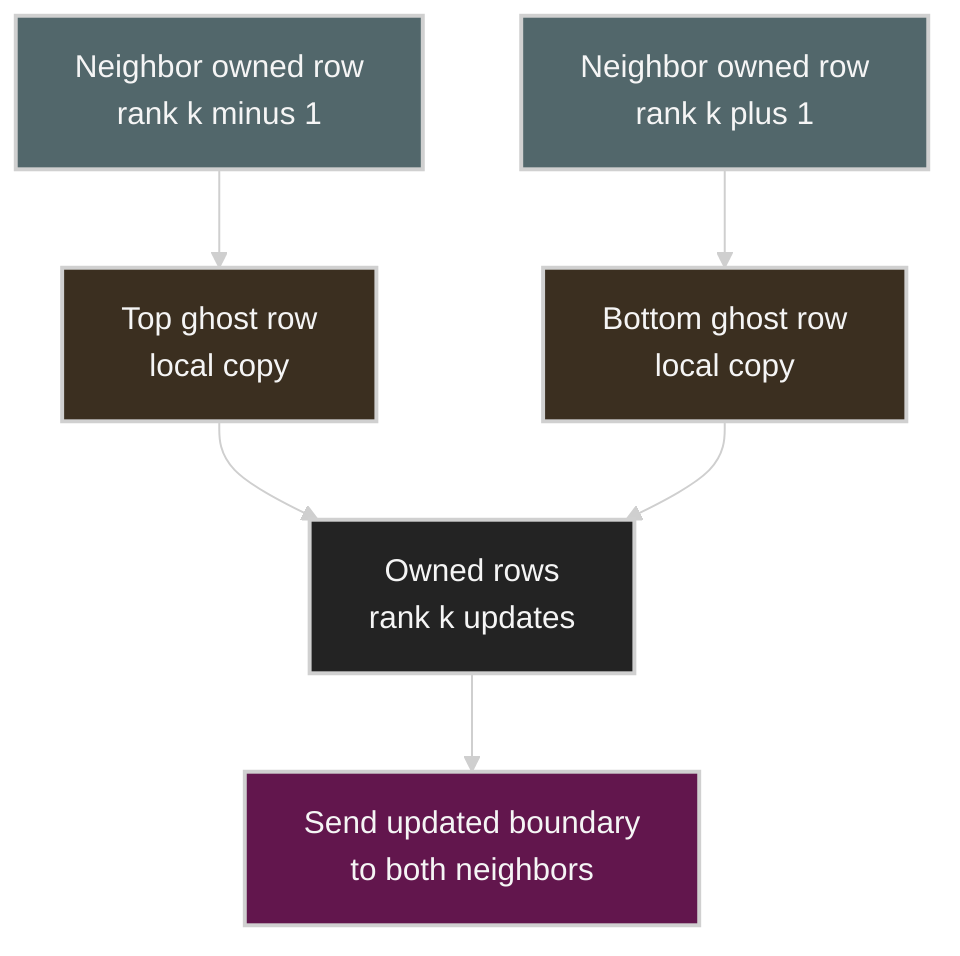
```mermaid
%%{init: {"theme": "base", "themeVariables": {"background": "#171717", "primaryColor": "#232323", "primaryTextColor": "#f5f5f5", "primaryBorderColor": "#d0d0d0", "lineColor": "#cfcfcf", "fontFamily": "Inter, Arial, sans-serif"}}}%%
flowchart TB
    U[Neighbor owned row<br/>rank k minus 1] --> G1[Top ghost row<br/>local copy]
    G1 --> O[Owned rows<br/>rank k updates]
    G2[Bottom ghost row<br/>local copy] --> O
    D[Neighbor owned row<br/>rank k plus 1] --> G2
    O --> X[Send updated boundary<br/>to both neighbors]

    classDef primary fill:#232323,stroke:#d0d0d0,color:#f5f5f5,stroke-width:2px;
    classDef secondary fill:#3b2f20,stroke:#d0d0d0,color:#f5f5f5,stroke-width:2px;
    classDef note fill:#52676b,stroke:#d0d0d0,color:#f5f5f5,stroke-width:2px;
    classDef accent fill:#62164d,stroke:#d0d0d0,color:#f5f5f5,stroke-width:2px;
    class O primary
    class G1,G2 secondary
    class U,D note
    class X accent
```

Replication은 free가 아니다. Ghost row는 memory capacity를 더 쓰고, 다음 phase 전에
owner의 최신 값으로 갱신되어야 한다. 즉 capacity를 communication 감소나 access
simplicity와 교환한다.

## Communication Also Performs Synchronization

Message-passing solver에는 shared lock이나 explicit barrier가 보이지 않는다. 그 이유는
communication operation 자체가 synchronization event이기 때문이다.

* Blocking `recv`가 반환되면 필요한 ghost row가 local address space에 존재한다.
* Rank 0은 모든 `local_diff` message를 받은 뒤에만 global convergence를 계산한다.
* 다른 rank는 rank 0의 `done` message를 받아야 다음 iteration으로 갈지 종료할지 안다.

따라서 barrier가 사라진 것이 아니라 message dependency graph 안에 녹아들었다.
Receiver가 특정 phase의 message를 기다리는 동안 다음 phase로 진행할 수 없으므로
matching receive가 phase boundary를 만든다.

또한 mutual exclusion이 필요 없는 이유는 같은 variable에 대한 concurrent load/store가
없기 때문이다. 각 worker는 private `local_diff`와 `done` copy를 갖는다. Aggregator가
받은 값을 자신의 local variable에 더하므로 shared accumulator lock이 필요하지 않다.

반대로 message program이라고 race가 자동으로 사라지는 것은 아니다. Non-blocking send
중 source buffer를 수정하거나, 이전 iteration의 tag를 다음 iteration과 혼동하거나,
receiver가 completion 전에 destination buffer를 읽으면 여전히 잘못된 결과가 나온다.

## Blocking Communication and Deadlock

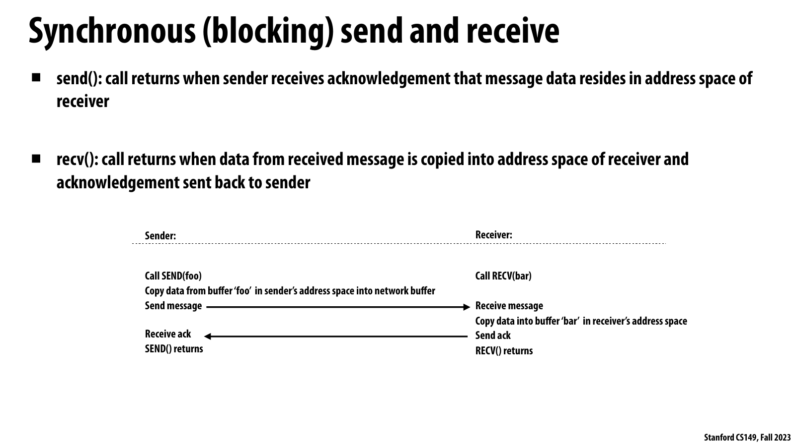

_공식 Lecture 6 슬라이드 p. 21 — blocking `send`와 `recv`의 completion 조건과
acknowledgement 순서._

슬라이드에서 `send`는 sender buffer의 data가 network를 지나 receiver address space에
놓였다는 acknowledgement를 받은 뒤 반환하고, `recv`는 destination buffer로 copy한 뒤
acknowledgement를 보내고 반환한다. 반환 시점에 buffer 상태를 추론하기 쉬운 것이
blocking semantics의 장점이지만, 호출 thread는 상대편이 protocol의 matching 지점에
도달할 때까지 useful work를 진행할 수 없다.

실무/GPU 연결(슬라이드 밖의 해설): synchronous copy는 단계별 correctness를 설명하기
쉽지만, 모든 rank나 stream이 같은 순서로 blocking call을 걸면 global wait cycle을 만들
수 있다. GPU host code에서도 blocking device transfer나 stream synchronization을
dependency마다 넣으면 안전성은 단순해지는 대신 DMA와 kernel overlap을 잃고, multi-GPU
peer가 서로 기다리는 ordering에서는 같은 deadlock reasoning이 필요하다.

초기 solver code는 모든 worker가 먼저 위쪽 neighbor로 `send`, 다음 neighbor로 `send`,
그 후에 `recv`하도록 작성되어 있었다. 각 send가 matching receive를 기다리지만 모든
worker가 send 안에서 멈추므로 아무도 receive에 도달하지 못한다.

```text
T0: SEND to T1 ── waits for T1 RECV
T1: SEND to T2 ── waits for T2 RECV
T2: SEND to T3 ── waits for T3 RECV
T3: SEND to ... ─ waits

No thread reaches its first RECV -> no progress -> deadlock
```

이는 “slow”가 아니라 **progress가 영원히 불가능한 ordering cycle**이다. Endpoint의
buffering을 우연히 기대하거나 first/last rank의 conditional만 보고 안전하다고 판단하면
안 된다. 강의의 code에서는 각 worker가 첫 receive 전에 blocking send를 수행하므로
boundary rank가 있어도 cycle을 깨지 못한다.

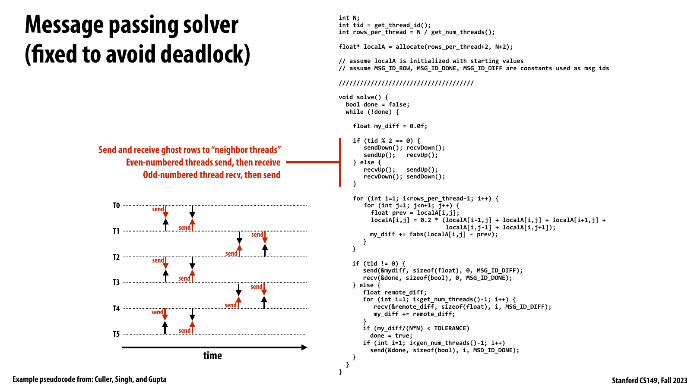

_공식 Lecture 6 슬라이드 p. 23 — even/odd thread가 반대 순서로 ghost-row exchange를
시작해 blocking deadlock을 피하는 수정._

슬라이드는 even-numbered thread가 먼저 send하고 odd-numbered thread가 먼저 receive하는
code와, T0–T5 사이에서 matching transfer가 순차적으로 진행되는 timeline을 함께 둔다.
각 neighbor pair에 최소 한 receiver가 준비되어 있으므로 all-send ordering의 wait-for
cycle이 끊어진다. 강의에서 이 예는 blocking API 자체보다 **모든 participant가 선택한
global ordering**이 progress를 결정한다는 점을 보여 준다.

실무/GPU 연결(슬라이드 밖의 해설): 이 방식은 추가 request object 없이 buffer 사용
시점을 명확히 하지만, topology나 neighbor 수가 바뀌면 parity rule을 다시 증명해야 한다.
GPU cluster에서 ring exchange, point-to-point collective, host-side stream waits를 구성할
때도 각 edge의 local 순서만 보지 말고 전체 dependency graph가 cycle-free인지 확인해야
한다.

Blocking operation만 유지하는 한 가지 수정은 even/odd rank를 pair로 나누어 서로 다른
순서를 쓰는 것이다.

```text
even rank: sendDown -> recvDown -> sendUp -> recvUp
odd rank:  recvUp   -> sendUp   -> recvDown -> sendDown
```

각 pair에서 한쪽이 receive를 먼저 게시하므로 matching이 성립한다. 그러나 topology나
neighbor 수가 복잡해지면 이러한 manual ordering은 fragile하다. Deadlock freedom은
각 rank의 local code만이 아니라 전체 wait-for graph로 검증해야 한다.

## Non-Blocking Asynchronous Communication

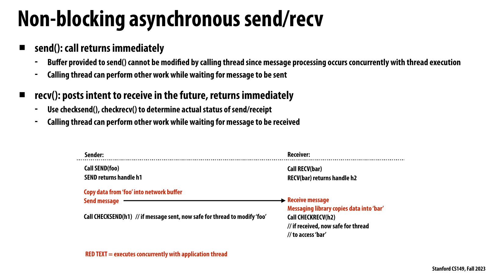

_공식 Lecture 6 슬라이드 p. 24 — non-blocking `send`/`recv`, completion handle, buffer
사용 가능 시점을 나눈 asynchronous protocol._

슬라이드는 `send(foo)`와 `recv(bar)`가 즉시 handle을 반환한 뒤, 붉은 network copy가
application thread와 concurrent하게 진행되는 모습을 보여 준다. Sender는 `checksend(h1)`
완료 뒤에야 `foo`를 바꿀 수 있고 receiver는 `checkrecv(h2)` 완료 뒤에야 `bar`를 읽을
수 있다. 강의 논리에서 asynchrony는 communication을 없애는 기법이 아니라 그 latency를
독립 computation 뒤에 숨기는 기법이다.

실무/GPU 연결(슬라이드 밖의 해설): async DMA와 CUDA stream도 enqueue와 completion을
분리하므로 같은 lifetime rule을 갖는다. Interior kernel과 halo copy를 overlap하면 exposed
latency를 줄일 수 있지만, pinned buffer 재사용·event ordering·in-flight request 수를
잘못 관리하면 race, memory pressure, 또는 bandwidth saturation 뒤의 더 긴 queue가 생긴다.

```text
h_send = isend(send_buffer, neighbor, ROW)
h_recv = irecv(recv_buffer, neighbor, ROW)

compute_interior_cells()       // boundary data 없이 가능한 work

wait(h_recv)                   // recv_buffer 사용 전 completion 필요
compute_boundary_cells()
wait(h_send)                   // send_buffer 수정/해제 전 completion 필요
```

Asynchrony가 만드는 핵심 contract는 buffer lifetime이다.

| Buffer | Completion 전 금지되는 작업 | 이유 |
| ------ | ---------------------------- | ---- |
| Send buffer | Modify, reuse, free | Transport가 아직 bytes를 읽지 않았을 수 있음 |
| Receive buffer | Read, consume, overwrite | Message가 아직 도착하거나 복사되지 않았을 수 있음 |

강의의 비유로는 porch에 UPS pickup package를 놓고 회수를 요청한 뒤, pickup 전에 내용물을
바꾸거나 치우는 것과 같다. `isend` 호출 시점의 값이 자동으로 snapshot된다고 가정해서는
안 된다.

Non-blocking communication은 deadlock 위험을 줄이고 communication-computation overlap을
가능하게 하지만 concurrency state를 늘린다. 여러 message의 arrival order도 API가
보장하지 않으면 가정할 수 없다. Correct implementation은 sender, tag, sequence 또는
iteration identifier, completion state를 명시적으로 관리한다.

Compiler reordering에 대한 강의실 질문도 중요한 지점을 짚는다. 실제 communication
library는 필요한 fence와 memory-order guarantee를 API implementation에 포함해야 한다.
Application은 문서화된 happens-before와 buffer ownership contract를 따라야 한다.

## A Parallel System as an Extended Memory Hierarchy

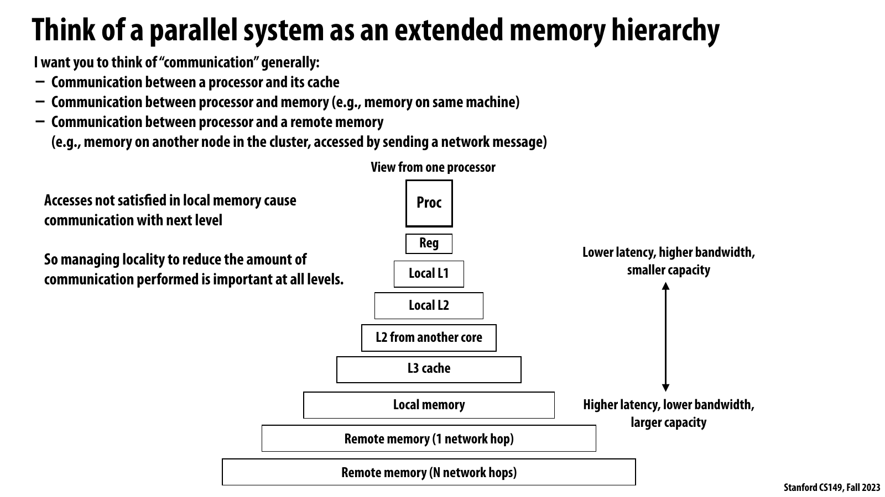

_공식 Lecture 6 슬라이드 p. 26 — register, local cache, local memory, remote memory를
하나의 communication hierarchy로 확장한 관점._

슬라이드는 processor에서 가까운 register와 local L1/L2부터 another core의 cache, L3,
local memory, one-hop 및 multi-hop remote memory까지 층을 쌓는다. 위쪽은 capacity가
작지만 latency와 bandwidth가 유리하고, 아래쪽은 capacity가 커지는 대신 access cost가
커진다. Local level에서 만족되지 않은 access가 다음 level과 communication을 만든다는
것이 강의의 locality 논리를 scale-independent하게 묶는 핵심이다.

실무/GPU 연결(슬라이드 밖의 해설): GPU의 register–shared memory/L1–L2–HBM–peer
GPU–host memory도 같은 축으로 분석할 수 있다. 가까운 tier에 data를 유지하면 traffic과
latency를 줄이지만 register/shared-memory 사용량이 occupancy를 낮출 수 있으므로,
locality optimization은 capacity allocation과 resident warps를 함께 측정해야 한다.

```text
register
  -> local L1
  -> local L2
  -> another core's cache / distributed cache slice
  -> shared last-level cache
  -> local DRAM
  -> remote DRAM, one network hop
  -> remote memory, multiple network hops
```

대체로 아래로 갈수록 capacity는 커지고 latency는 높아지며 bandwidth는 낮아진다.
Local level에서 만족되지 않는 access는 다음 level과 communication을 일으킨다. Cache
miss는 “memory가 느리다”는 추상적 사건이 아니라 request message와 cache-line response가
interconnect를 통과하는 data transfer다.

이 관점의 장점은 optimization 원리가 scale에 무관하게 통한다는 것이다.

* Register reuse는 register–cache communication을 줄인다.
* Cache blocking은 cache–DRAM communication을 줄인다.
* NUMA-aware placement는 socket 간 communication을 줄인다.
* Halo exchange와 collective tuning은 node 간 communication을 줄인다.
* GPU shared memory tiling은 device DRAM traffic을 줄인다.

## Latency Bandwidth and Overlap

Memory operation에는 두 시간 척도가 있다.

* **Latency**: request를 시작한 뒤 첫 data를 사용할 수 있을 때까지의 시간
* **Bandwidth**: steady state에서 단위 시간당 전달할 수 있는 data 양

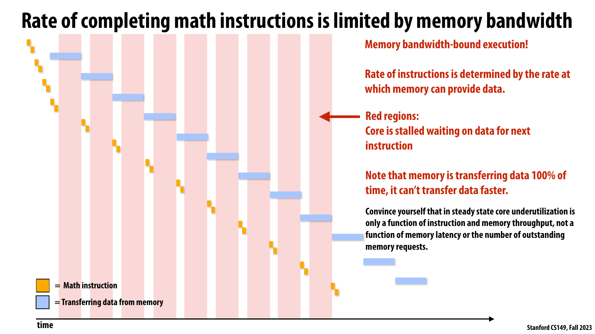

_공식 Lecture 6 슬라이드 p. 29 — memory bus가 계속 data를 보내는데도 core가 다음
cache line을 기다리는 bandwidth-limited steady state._

슬라이드의 파란 막대는 memory transfer, 작은 주황 표시는 math instruction, 붉은 배경은
core가 다음 data를 기다리는 시간을 뜻한다. Memory가 100% 시간 동안 전송 중이므로 이
steady state의 instruction rate는 개별 request latency가 아니라 cache line을 공급하는
bandwidth와 line당 math 비율로 정해진다. 충분한 outstanding request가 이미 bus를 채웠다면
request 수를 더 늘려도 throughput은 오르지 않는다.

실무/GPU 연결(슬라이드 밖의 해설): GPU warp concurrency는 latency를 숨길 수 있지만 HBM
channels가 saturated된 뒤에는 occupancy를 높여도 bytes/s가 늘지 않는다. 이 경우
coalescing, compression, data reuse처럼 transferred bytes를 줄이거나 arithmetic intensity를
높여야 하며, 반대로 bus가 비는 latency-bound 상태라면 더 많은 independent warps와
prefetch가 먼저 효과를 낼 수 있다.

| Change | 충분한 latency hiding이 있을 때 예상 효과 |
| ------ | --------------------------------------- |
| Memory latency 증가 | Pipeline fill/drain은 길어지지만 steady-state utilization은 같을 수 있음 |
| Memory bandwidth 증가 | Transfer interval이 짧아져 processor stall 감소 |
| Load당 math 증가 | Arithmetic intensity 상승, compute utilization 증가 |
| Outstanding requests 부족 | Bus가 비는 구간이 생겨 latency-bound 가능 |

따라서 “memory-bound”라는 말도 구체화해야 한다. Bandwidth saturation인지, insufficient
memory-level parallelism 때문에 latency를 숨기지 못하는지, contention으로 service time이
늘었는지에 따라 해법이 다르다.

## Arithmetic Intensity

Arithmetic intensity `I`는 communication 한 단위당 수행하는 computation 양이다.

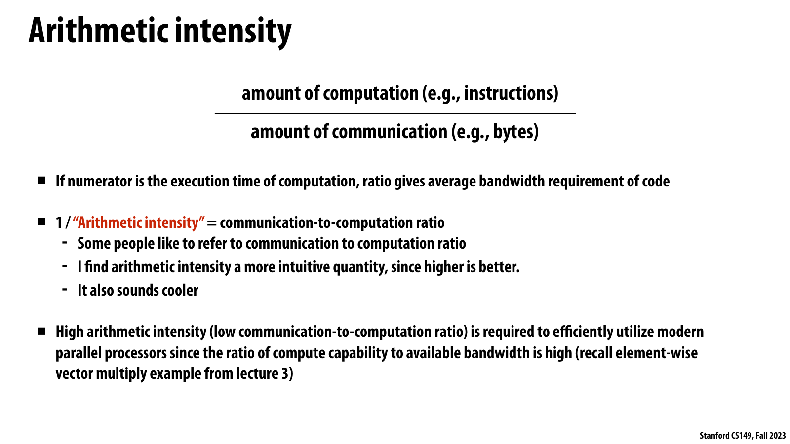

_공식 Lecture 6 슬라이드 p. 31 — arithmetic intensity와 그 역수인
communication-to-computation ratio의 정의._

슬라이드는 numerator에 instructions 같은 computation, denominator에 bytes 같은
communication을 놓고, 역수는 communication-to-computation ratio라고 설명한다. High
arithmetic intensity가 중요한 이유는 modern parallel processor의 compute capability가
available bandwidth보다 빠르게 커지기 때문이다. 강의 논리에서 이 비율은 locality와
communication-reduction 변환이 hardware utilization에 미치는 효과를 한 축으로 비교하게
한다.

실무/GPU 연결(슬라이드 밖의 해설): `FLOP/byte`는 kernel을 HBM roofline에 배치할 때
유용하지만 denominator가 DRAM bytes인지 L2 traffic인지 inter-GPU bytes인지 명시해야
한다. Recompute로 bytes를 줄이면 intensity는 오르지만 extra operations와 register pressure가
늘 수 있으므로, intensity 상승만이 아니라 wall-clock time과 useful work도 함께 확인한다.

```text
I = W / Q

W: useful arithmetic work, e.g. FLOPs or instructions
Q: communicated data, e.g. bytes from DRAM or bytes across a network
```

역수 `Q/W`는 communication-to-computation ratio다. 강의는 “higher is better”로 읽기
쉬운 arithmetic intensity를 사용한다. 중요한 점은 denominator의 경계를 명시하는
것이다. 같은 kernel이라도 L1 traffic 기준 intensity, DRAM traffic 기준 intensity,
network traffic 기준 intensity가 다르다.

필요 bandwidth를 단순화하면 다음처럼 생각할 수 있다.

```text
required bandwidth = target operation rate / arithmetic intensity
```

예를 들어 목표가 `1 TFLOP/s`이고 DRAM arithmetic intensity가 `10 FLOP/byte`라면 필요한
DRAM bandwidth는 약 `100 GB/s`다. Available bandwidth보다 요구량이 크면 목표 compute
rate를 달성할 수 없다.

High-core-count processor는 compute capability가 빠르게 늘지만 bandwidth는 같은 비율로
늘지 않는 경우가 많다. 그래서 parallel hardware를 잘 활용하려면 locality, reuse,
blocking, fusion으로 intensity를 충분히 높여야 한다.

다만 `I`는 efficiency metric이지 latency, load balance, instruction mix, occupancy,
contention을 모두 설명하는 만능 metric은 아니다. 같은 intensity에서도 irregular access,
dependency chain, bank conflict에 따라 성능이 달라질 수 있다.

## Inherent and Artifactual Communication

강의는 communication을 원인에 따라 두 종류로 나눈다.

### Inherent communication

선택한 algorithm과 work assignment로 correct result를 만들기 위해 반드시 이동해야 하는
정보다. Grid solver에서 worker가 neighbor-owned boundary 값을 받아야 자신의 boundary
cell을 update할 수 있는 것이 예다.

여기서 “inherent”는 algorithm만의 절대 속성이 아니다. **Algorithm과 assignment가
주어졌을 때** 필요한 양이다. Assignment shape를 바꾸거나 algorithm을 바꾸면 inherent
communication 양도 바뀔 수 있다.

### Artifactual communication

Machine implementation detail 때문에 이상적인 최소량보다 더 이동하는 data다.

* 4-byte float 하나를 읽어도 64-byte cache line 전체를 transfer
* Cache capacity가 작아 재사용 전에 line이 축출되어 같은 data를 다시 transfer
* 한 cache line 전체를 overwrite하는데 write-allocate 때문에 먼저 old line을 load
* Minimum packet size나 alignment 단위 때문에 필요한 bytes보다 큰 message 전송
* False sharing 때문에 독립된 variables가 같은 coherence unit에서 ping-pong

분류가 중요한 이유는 해법이 다르기 때문이다.

| Communication source | 주된 optimization lever |
| -------------------- | ----------------------- |
| Algorithmic dependency | Algorithm 변경, communication-avoiding method |
| Assignment boundary | Partition shape와 ownership 변경 |
| Minimum transfer granularity | Contiguous access, coalescing, packing |
| Finite cache capacity | Blocking, tiling, loop interchange |
| Temporary materialization | Loop/kernel fusion |
| Coherence unit sharing | Padding, layout 변경, ownership 분리 |

## Assignment Shape Changes Communication

`N × N` grid를 `P` processors에 균등하게 나눠도 partition shape에 따라 boundary size가
달라진다. Per-processor compute는 모두 대략 `N²/P`로 같지만 communication은 다르다.

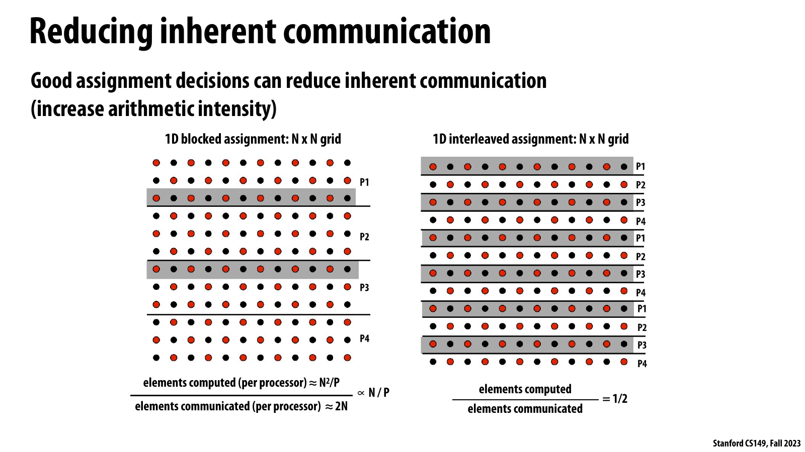

_공식 Lecture 6 슬라이드 p. 34 — work는 동일하지만 boundary communication이 크게
달라지는 1D blocked와 interleaved assignment 비교._

슬라이드 왼쪽의 blocked assignment는 processor마다 연속 row를 주어 계산량 `N²/P`에
boundary 약 `2N`만 전달하지만, 오른쪽 interleaved assignment는 거의 모든 owned row의
neighbor가 remote라 communication이 work에 비례한다. 따라서 load balance가 같아도
blocked intensity는 `N/P` 규모이고 interleaved intensity는 `1/2`에 머문다. Assignment가
algorithm의 inherent communication 양을 바꾼다는 강의의 첫 증거다.

실무/GPU 연결(슬라이드 밖의 해설): GPU thread/block mapping도 arithmetic work만 균등하게
나누면 충분하지 않다. Consecutive elements를 같은 warp/CTA에 모으면 coalesced load와
shared-memory reuse를 얻지만, 지나치게 큰 contiguous shard는 load imbalance를 키울 수
있어 locality와 scheduling granularity를 함께 조정해야 한다.

### 1D blocked rows

각 processor가 연속된 `N/P` rows를 맡는다. 위아래 neighbor와 길이 `N`인 boundary row를
주고받으므로 communication은 상수 계수를 제외하면 `Θ(N)`이다.

```text
work per processor          ≈ N² / P
communicated elements       ≈ 2N
arithmetic intensity        ≈ (N²/P) / (2N)
                            = N / (2P)
                            = Θ(N/P)
```

### 1D interleaved rows

Processor가 every `P`-th row를 맡으면 local row의 위아래가 거의 항상 다른 processor에
있다. Owned row 하나를 update할 때 neighbor rows 두 개를 받아야 하므로 communication이
work에 비례한다.

```text
work per processor          ≈ N² / P
communicated elements       ≈ 2N² / P
arithmetic intensity        ≈ 1/2 = Θ(1)
```

Load balance는 좋아 보일 수 있지만 locality를 파괴해 processor가 늘어도 intensity가
개선되지 않는다.

### 2D blocked tiles

Grid를 `√P × √P`의 square tiles로 나누면 각 tile의 한 변은 `N/√P`다. Area는 work,
perimeter는 boundary communication에 해당한다.

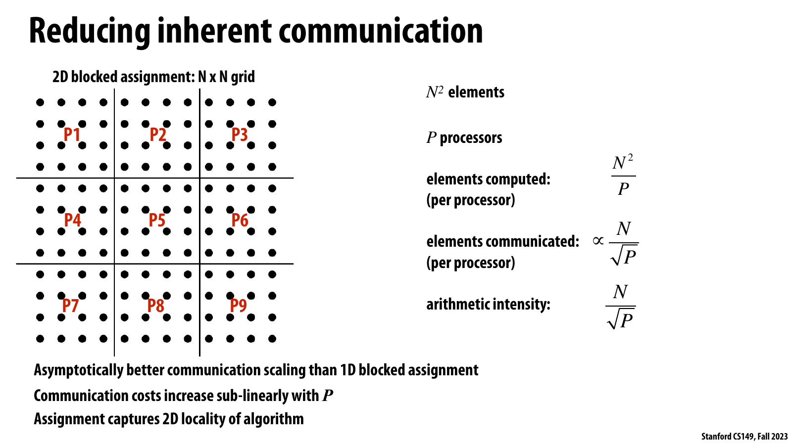

_공식 Lecture 6 슬라이드 p. 35 — square tile의 area-to-perimeter 관계로 얻는 2D blocked
assignment의 communication scaling._

슬라이드는 `√P × √P` tile grid에서 processor당 `N²/P` elements를 계산하고 약
`N/√P` elements를 communicate하므로 intensity가 `N/√P`로 scaling함을 적는다. 1D strip의
`N/P`보다 processor 증가에 따른 communication penalty가 sub-linear하며, grid가 가진
2D spatial locality를 assignment shape가 포착했기 때문이다.

실무/GPU 연결(슬라이드 밖의 해설): square에 가까운 GPU tile은 같은 output area에서 halo
perimeter를 줄이지만, 실제 tile 크기는 warp shape, shared-memory capacity, bank conflicts,
boundary divergence의 제약도 받는다. 이론상 surface-to-volume ratio가 좋아도 resident block
수가 줄어 latency hiding을 잃을 수 있으므로 occupancy와 transferred bytes를 같이 측정한다.

```text
work per processor          ≈ N² / P
communicated elements       ≈ 4N / √P
arithmetic intensity        ≈ (N²/P) / (4N/√P)
                            = N / (4√P)
                            = Θ(N/√P)
```

Square가 같은 area에서 perimeter를 작게 만드는 shape이므로 1D strip보다 asymptotically
좋다. Constants와 corner exchange, boundary processor는 단순화를 위해 생략했지만 scaling
차이는 그대로다.

| Assignment | Work per processor | Communication per processor | Intensity scaling |
| ---------- | ------------------ | --------------------------- | ----------------- |
| 1D blocked | `Θ(N²/P)` | `Θ(N)` | `Θ(N/P)` |
| 1D interleaved | `Θ(N²/P)` | `Θ(N²/P)` | `Θ(1)` |
| 2D blocked | `Θ(N²/P)` | `Θ(N/√P)` | `Θ(N/√P)` |

예를 들어 `P=16`이면 `P`와 `√P`의 차이는 4배다. 높은 core count일수록 2D locality를
반영한 assignment의 이점이 커진다.

## Cache Capacity and Row-Major Traversal

Artifactual communication 예시는 한 thread 안의 grid traversal이다. 가정은 다음과 같다.

* Grid는 row-major layout이다.
* Cache line은 grid element 4개를 담는다.
* Cache capacity는 6 lines, 즉 element 24개다.
* 한 output은 four cardinal neighbors를 읽어 계산한다.

첫 row를 왼쪽에서 오른쪽으로 처리할 때 인접 output은 이미 가져온 cache line을 잘
재사용한다. 문제는 row가 길면 다음 row의 시작점으로 돌아오기까지 시간이 오래
걸린다는 것이다. 이전 row의 초반부 data는 cache capacity를 초과해 이미 축출된다.

그 결과 과거에 읽은 neighbor라도 다시 memory에서 가져와야 한다. 슬라이드의 작은
예시에서는 steady state에서 output 4개마다 새 cache line 3개를 load한다.

```text
row-major locality metric = 4 output elements / 3 cache-line loads
```

Algorithm상 같은 값을 다시 전달받아야 할 이유는 없다. Infinite cache라면 남아 있었을
data가 finite capacity 때문에 사라졌으므로 이는 artifactual communication이다. Source
level에서 array를 한 번씩만 읽는 것처럼 보여도 access reuse distance가 cache capacity를
넘으면 physical traffic은 여러 번 발생한다.

## Cache Blocking

Cache blocking 또는 tiling은 computation order를 작은 region 단위로 바꿔, 재사용할
data가 cache에서 축출되기 전에 다시 접근한다.

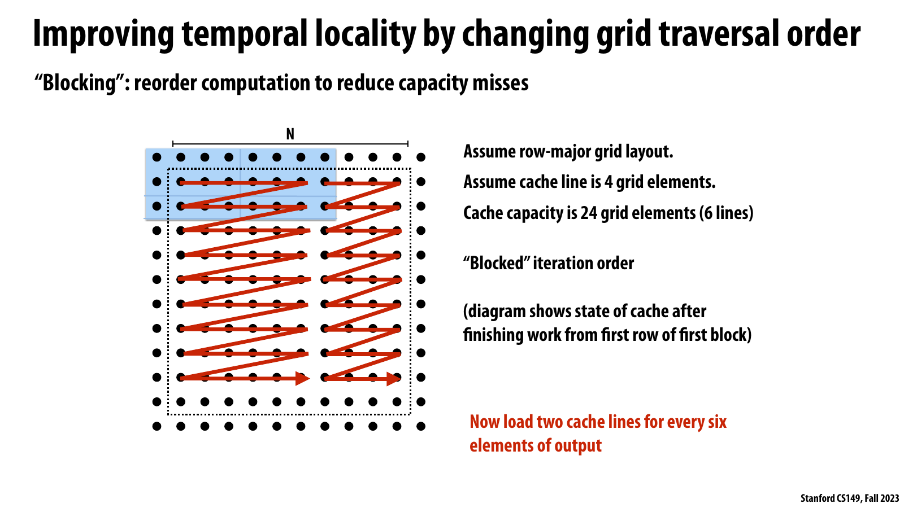

_공식 Lecture 6 슬라이드 p. 43 — traversal order를 block 단위로 재배치해 capacity miss를
줄이는 cache blocking._

슬라이드는 cache line당 4 elements, cache capacity 6 lines라는 toy model에서 긴 row
전체를 오가는 대신 작은 column block 안의 여러 row를 먼저 처리한다. 첫 block의 다음
row를 계산할 때 upper/lower neighbor line이 cache에 남아 있어, row-major 예시의 output
4개당 3개 line load가 output 6개당 2개 line load로 줄어든다. Algorithm과 결과는 같고
reuse distance만 cache capacity 안으로 줄인 artifactual-communication 최적화다.

실무/GPU 연결(슬라이드 밖의 해설): GEMM과 convolution의 shared-memory/register tiling도
HBM에서 가져온 operand를 여러 multiply-add에 재사용하는 같은 원리다. Tile이 너무 크면
cache miss 또는 shared-memory/register pressure로 occupancy가 떨어지고, 너무 작으면 halo와
loop overhead가 커지므로 traffic, occupancy, achieved throughput의 공동 최적화가 필요하다.

```text
for each row of entire grid:          for each small tile:
    update the whole row                  update rows inside tile
```

```text
before: 4 outputs / 3 new cache lines
after:  6 outputs / 2 new cache lines

relative increase in outputs per line:
(6/2) / (4/3) = 3 / (4/3) = 2.25x
```

이 숫자는 강의의 toy cache와 traversal에 한정되지만 원리는 일반적이다. Tile의 active
working set이 target cache에 맞으면 compulsory load 뒤 여러 operation이 같은 data를
reuse한다.

Tile size는 무조건 작을수록 좋은 것이 아니다.

* 너무 크면 working set이 cache capacity를 넘어 capacity miss가 돌아온다.
* 너무 작으면 boundary/loop overhead가 늘고 vectorization이 어려워질 수 있다.
* Multiple arrays, cache associativity, other threads의 interference도 usable capacity를
  줄인다.

강의는 blocking을 tensor와 matrix code에서 가장 중요한 optimization 가운데 하나로
강조한다. Modern matrix multiplication과 convolution의 성능은 같은 operands를 cache,
register, scratchpad에서 여러 multiply-add에 재사용하도록 loop order와 tile을 설계한
결과다.

## Loop Fusion

두 번째 locality 변환은 separate array operations를 한 traversal로 합치는 loop fusion이다.
강의의 expression은 다음과 같다.

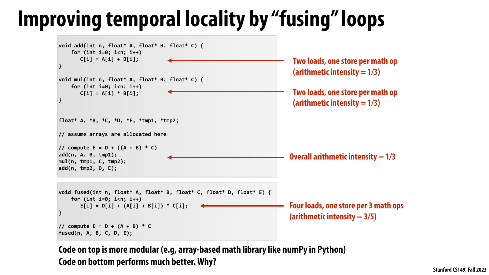

_공식 Lecture 6 슬라이드 p. 44 — temporary arrays를 materialize하는 세 pass와 한 번에
계산하는 fused pass의 memory traffic 비교._

슬라이드는 `add`, `mul`, `add`를 별도 호출하면 각 math operation마다 two loads와 one
store가 발생해 전체 intensity가 `1/3`인 반면, fused loop는 four loads와 one store로
three operations를 수행해 `3/5`가 됨을 보여 준다. 핵심은 intermediate `tmp1`, `tmp2`를
whole arrays로 memory에 쓰지 않고 한 index의 값을 register 가까이에 둔 채 final `E`까지
계산하는 것이다.

실무/GPU 연결(슬라이드 밖의 해설): tensor compiler의 elementwise/kernel fusion은 launch
overhead와 HBM traffic을 함께 줄일 수 있지만, 큰 fused kernel은 live values와 register
pressure를 늘려 occupancy를 낮출 수 있다. Intermediate를 여러 consumer가 공유하거나
fusion이 recomputation을 만들 때는 saved bytes와 extra work를 end-to-end runtime으로
비교해야 한다.

```text
E = D + ((A + B) * C)
```

Modular library call로 구현하면 `tmp1 = A+B`, `tmp2 = tmp1*C`, `E = tmp2+D`의 세 pass가
생긴다. 각 binary operation은 two loads와 one store에 math one operation이므로,
element transfer 단위 intensity는 `1/3`이다.

```text
pass 1: tmp1[i] = A[i] + B[i]
pass 2: tmp2[i] = tmp1[i] * C[i]
pass 3: E[i]    = tmp2[i] + D[i]
```

Fusion하면 한 index의 entire expression을 끝내고 final output만 저장한다.

```text
for i in 0..N:
    E[i] = D[i] + (A[i] + B[i]) * C[i]
```

Intermediate 값은 register나 가까운 cache에 머물며 `tmp1`, `tmp2` array를 memory에
materialize하지 않는다.

```text
four input loads + one output store = 5 element transfers
three arithmetic operations         = 3 operations

fused intensity = 3/5
unfused intensity = 1/3
intensity gain = (3/5) / (1/3) = 1.8x
```

이는 high-level tensor program이 operator 단위로 표현되어도 compiler/runtime가 실제
execution에서는 operators를 fuse하려는 이유다. 영상은 TensorFlow와 PyTorch JIT 계열의
compiler optimization을 이 아이디어와 연결한다.

Fusion의 trade-off도 있다. 아주 큰 fused kernel은 register pressure와 instruction-cache
pressure를 높이고, intermediate를 다른 consumer가 공유하기 어렵게 하며, parallel
scheduling flexibility를 줄일 수 있다. “Temporary traffic 감소”와 “resource pressure
증가”를 함께 측정해야 한다.

## Co-Locating Work That Shares Data

같은 data를 쓰는 tasks를 같은 processor나 가까운 cores에 배치하면 하나의 local copy를
공유할 수 있다. 이는 assignment와 mapping이 communication을 함께 결정하는 예다.

```text
data-sharing tasks far apart
  -> duplicate transfers across interconnect

data-sharing tasks co-located
  -> reuse cache/scratchpad-resident data
```

하지만 co-location이 load balance를 해칠 수 있다. 한 data shard에 work가 몰리면 그
processor만 오래 실행한다. 또한 cache를 공유하는 threads가 서로의 working set을
축출할 수 있다. 따라서 shared-data affinity는 worker utilization, cache capacity,
NUMA placement를 함께 고려해야 한다.

## Contention and Hot Spots

Communication **volume**은 얼마만큼 이동하는지를 말하지만, contention은 request가
언제 어디에 몰리는지를 말한다. 일정 throughput만 처리할 수 있는 resource에 짧은 시간
동안 많은 request가 도착하면 queue가 생기고 individual latency가 늘어난다.

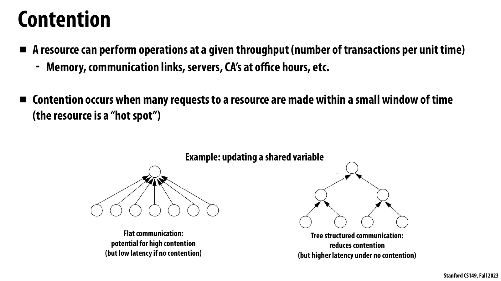

_공식 Lecture 6 슬라이드 p. 50 — 짧은 시간에 한 resource로 request가 몰리는 hot spot과
flat/tree communication의 contention trade-off._

슬라이드는 resource가 처리할 수 있는 transactions/time을 넘는 burst가 hot spot을 만든다고
정의하고, shared variable 하나로 fan-in하는 flat pattern과 중간 node가 분산 결합하는 tree
pattern을 비교한다. Flat path는 contention이 없을 때 hop이 적어 빠르지만 scale이 커질수록
한 target의 queue가 길어지고, tree는 stage latency를 추가하는 대신 target별 동시 request
수를 제한한다. 같은 total bytes라도 arrival distribution이 다르면 실행 시간이 달라진다.

실무/GPU 연결(슬라이드 밖의 해설): global atomic, single work queue, 한 HBM partition,
collective root는 모두 GPU system의 hot spot이 될 수 있다. Per-block aggregation, sharded
queues, hierarchical reduction은 contention을 줄이지만 extra state와 final merge를 만들므로,
평균 bandwidth뿐 아니라 atomic retry, queue tail, per-partition traffic 분포를 확인해야 한다.

강의의 office-hours 비유에서는 학생 한 명이 교수 office까지 걷는 데 5분, 질문을
해결하는 데 5분이 걸린다. 혼자라면 10분이지만 여러 학생이 동시에 도착하면 뒤의
학생은 같은 travel과 service work를 하면서도 line에서 기다린다. Appointment로 arrival를
stagger하면 각각의 cost를 10분에 가깝게 유지할 수 있다.

Parallel system의 contended resource는 다음과 같다.

* 하나의 shared accumulator와 atomic unit
* 하나의 global work queue와 lock
* 특정 memory controller, DRAM bank, cache set
* On-chip link, network port, collective root
* Metadata server나 parameter shard

Flat communication은 contention이 없을 때 latency가 낮지만 한 target에 `P` requests가
몰릴 수 있다. Tree-structured communication은 여러 stage를 거쳐 no-contention latency는
높지만 각 node가 처리하는 fan-in을 제한해 hot spot을 줄인다.

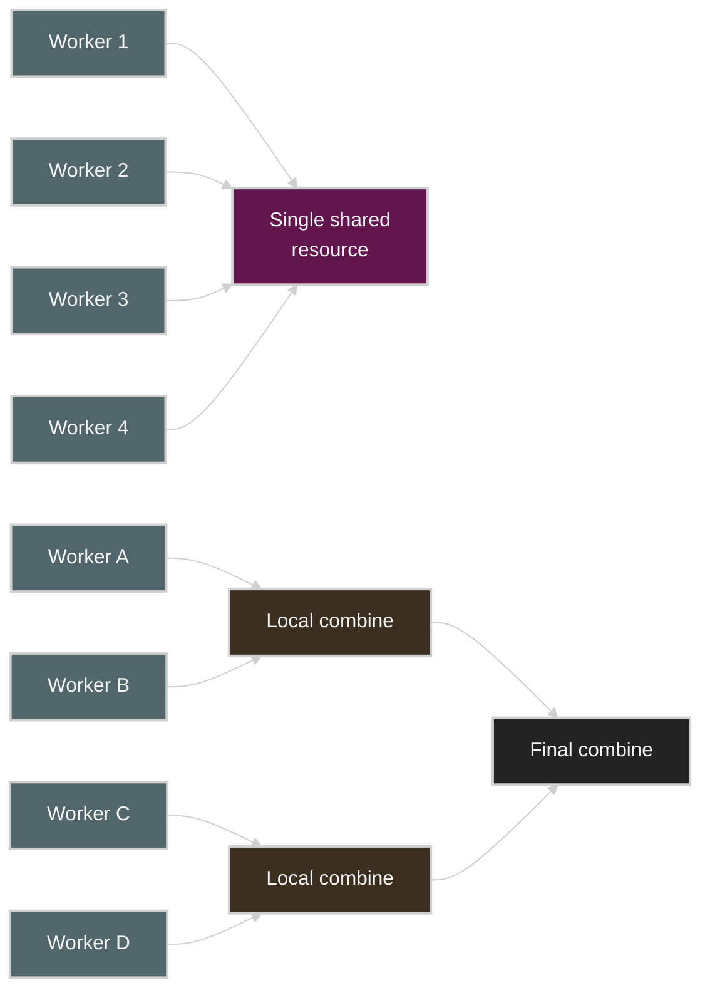
```mermaid
%%{init: {"theme": "base", "themeVariables": {"background": "#171717", "primaryColor": "#232323", "primaryTextColor": "#f5f5f5", "primaryBorderColor": "#d0d0d0", "lineColor": "#cfcfcf", "fontFamily": "Inter, Arial, sans-serif"}}}%%
flowchart LR
    W1[Worker 1] --> G[Single shared<br/>resource]
    W2[Worker 2] --> G
    W3[Worker 3] --> G
    W4[Worker 4] --> G

    A1[Worker A] --> R1[Local combine]
    A2[Worker B] --> R1
    A3[Worker C] --> R2[Local combine]
    A4[Worker D] --> R2
    R1 --> F[Final combine]
    R2 --> F

    classDef primary fill:#232323,stroke:#d0d0d0,color:#f5f5f5,stroke-width:2px;
    classDef secondary fill:#3b2f20,stroke:#d0d0d0,color:#f5f5f5,stroke-width:2px;
    classDef note fill:#52676b,stroke:#d0d0d0,color:#f5f5f5,stroke-width:2px;
    classDef accent fill:#62164d,stroke:#d0d0d0,color:#f5f5f5,stroke-width:2px;
    class W1,W2,W3,W4,A1,A2,A3,A4 note
    class R1,R2 secondary
    class F primary
    class G accent
```

Distributed work queues가 single global queue보다 좋은 이유도 같다. Worker는 평소 자기
queue에서 contention 없이 push/pop하고, local work가 없을 때만 random victim에게서
steal한다. Replication으로 common path의 shared access를 없애고, imbalance가 발생한
때에만 coordination cost를 낸다.

## A Communication Optimization Toolbox

공식 슬라이드의 communication-cost reduction 전략을 원인과 함께 정리하면 다음과 같다.

| Strategy | Mechanism | 주로 줄이는 비용 |
| -------- | --------- | ---------------- |
| Fewer, larger messages | Startup/header cost amortization | Per-message overhead |
| Coalescing | 작은 transfer를 contiguous bulk transfer로 결합 | Transaction count, minimum-granularity waste |
| Locality-aware restructuring | 가까운 storage의 data reuse | Latency와 bytes moved |
| Better hardware fabric | 더 낮은 hop/높은 link rate | Communication latency/bandwidth |
| Resource replication | Local copy, sharded queue, fine-grained lock | Hot-spot contention |
| Staggered/randomized access | Burst를 시간과 bank에 분산 | Queueing delay |
| Asynchronous communication | Transfer와 useful work를 동시 실행 | Exposed latency |
| Pipelining/prefetching | Future data를 미리 이동 | Exposed latency |
| More concurrency | 여러 independent operation을 in flight | Latency hiding |

Overlap에는 execution unit 수보다 많은 logical concurrency가 필요할 수 있다. 일부 task가
memory를 기다리는 동안 다른 task가 compute를 해야 하기 때문이다. 그러나 bandwidth가
이미 saturated라면 concurrency 추가는 queue만 길게 하고 throughput을 늘리지 못한다.

## Roofline Model

Roofline model은 arithmetic intensity에 따른 attainable performance upper bound를
표현한다.

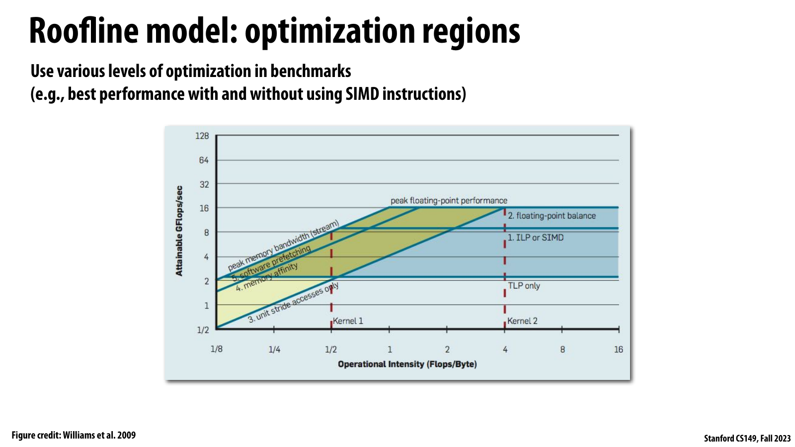

_공식 Lecture 6 슬라이드 p. 57 — memory bandwidth roofs, compute roofs, kernel intensity를
함께 놓아 optimization headroom을 읽는 roofline regions._

슬라이드는 diagonal memory-bandwidth ceilings와 horizontal floating-point ceilings를
겹치고, 서로 다른 intensity의 Kernel 1과 Kernel 2가 scalar/TLP/SIMD optimization에 따라
도달할 수 있는 영역을 표시한다. 왼쪽 kernel은 memory-access rate가 먼저 제한하고 오른쪽
kernel은 compute roof에 가까워진다. 강의 논리에서 roofline은 measured point 하나를
자랑하는 graph가 아니라 어떤 resource 개선이 upper bound를 움직이는지 묻는 진단 도구다.

실무/GPU 연결(슬라이드 밖의 해설): GPU kernel이 diagonal region에 있으면 HBM traffic
감소, coalescing, tiling, fusion이 후보이고 horizontal region에 가까우면 tensor/SIMD unit
활용과 instruction throughput이 후보가 된다. 다만 point가 roof보다 멀리 아래에 있으면
latency, divergence, occupancy, imbalance, contention 같은 모델 밖 요인을 먼저 확인해야
하며, roofline 위치만으로 runtime 개선을 보장할 수 없다.

```text
attainable performance(I)
    = min(peak compute throughput, memory bandwidth × I)
```

* X-axis: arithmetic 또는 operational intensity, 보통 `FLOP/byte`
* Y-axis: achieved 또는 attainable throughput, 보통 `FLOP/s`
* Diagonal roof: bandwidth-limited region, slope가 memory bandwidth
* Horizontal roof: compute-limited region, 높이가 peak compute throughput

두 roof가 만나는 ridge point는 다음과 같다.

```text
I_ridge = peak compute throughput / memory bandwidth
```

`I < I_ridge`이면 더 많은 compute unit을 추가해도 data supply가 병목이다. Blocking,
fusion, layout 개선으로 오른쪽으로 이동하거나 bandwidth를 높여 diagonal roof를 올려야
한다. `I >= I_ridge`이면 compute roof에 도달할 가능성이 있으며 SIMD 활용, instruction
mix, dependency, occupancy를 살펴본다.

강의는 compute capability가 4배지만 memory system은 같은 두 processor를 비교한다.
두 번째 processor는 horizontal roof가 4배 높지만 diagonal slope가 같으므로 ridge point도
약 4배 오른쪽으로 이동한다. Parallel ALU를 더 많이 넣을수록 그 성능을 먹여 살릴 높은
intensity가 필요하다는 뜻이다.

Measured point가 roof 아래에 있으면 roofline만으로 원인을 확정할 수 없다. 그 간격은
load imbalance, contention, insufficient SIMD, dependency stalls, latency hiding 부족,
non-ideal access 등 다른 inefficiency를 찾으라는 신호다.

### Roofline은 runtime graph가 아니다

Roofline의 Y-axis는 program이 수행한 total work가 아니라 work rate다.

```text
execution time = total work / achieved throughput
```

Algorithm change로 operation 수가 10배 줄고 intensity가 낮아져도 throughput이 그대로라면
runtime은 10배 줄 수 있다. 반대로 work가 2배 줄었지만 bandwidth region으로 이동해
throughput도 2배 낮아지면 runtime은 거의 같을 수 있다. 따라서 “오른쪽으로 이동”이나
“roof에 가까움” 자체를 최종 목표로 삼으면 안 된다.

## A Measurement-Driven Optimization Workflow

영상의 실전 조언은 단순하다. **가장 단순한 parallel solution을 먼저 만들고 측정한다.**
복잡한 scheduler나 tiling이 언제나 빠르지 않다. 문제 크기와 machine에서 static blocked
assignment가 이미 충분히 balance되고 local하다면 추가 machinery가 overhead만 늘릴 수
있다.

공식 bonus slides는 bottleneck을 compute, memory bandwidth/latency, synchronization으로
분리하고 best-case **high watermark**를 세우라고 제안한다.

| Controlled experiment | 관찰 | 해석 가능한 upper bound |
| --------------------- | ---- | ------------------------- |
| 같은 memory access에 math를 점진적으로 추가 | Time이 operation 수와 선형 증가하는가 | Instruction-rate limit 가능성 |
| 거의 모든 math를 제거하고 같은 data load 유지 | Time이 거의 줄지 않는가 | Memory cost가 dominant일 가능성 |
| Array access를 모두 `A[0]`으로 변경 | Locality-perfect surrogate가 얼마나 빠른가 | Locality 개선의 최대 이득 |
| Atomic/lock을 제거하고 비슷한 work 유지 | 얼마나 빨라지는가 | Sync overhead 감소의 최대 이득 |

이 실험은 production-correct version이 아니라 diagnosis용 variant다. Compute, memory,
synchronization은 실제로 완전히 분리되지 않으므로 결과는 단일 원인의 증명이 아니라
sensitivity evidence다.

권장 reasoning sequence는 다음과 같다.

1. Correctness를 보존하는 단순 baseline의 wall-clock time을 잰다.
2. Work distribution, bytes, operations, synchronization count를 정량화한다.
3. Hardware peak와 empirical high watermark를 구분한다.
4. Dominant-cost hypothesis 하나를 세우고 한 lever만 바꾼다.
5. Runtime뿐 아니라 work와 traffic이 실제로 줄었는지 counter로 확인한다.
6. 다른 size와 thread count에서 speedup과 efficiency가 유지되는지 확인한다.

## Performance Counters and Profilers

이 절은 공식 PDF bonus slides의 보충 내용이다. OS activity graph의 “CPU usage”는 thread가
processor에 scheduled된 시간 비율일 뿐, useful instructions를 얼마나 수행했는지나
memory를 얼마나 기다렸는지 알려 주지 않는다.

Modern processors의 hardware performance counters는 다음 event를 셀 수 있다.

* Retired instructions와 clock cycles
* Instructions per cycle, IPC
* L2/L3 cache hit와 miss
* Memory controller에서 읽고 쓴 bytes
* Branch miss, stall cycle, atomic 관련 event

슬라이드는 Intel Performance Counter Monitor API와 Intel VTune, PAPI, oprofile을 예로
든다. Tool 이름보다 중요한 것은 hypothesis와 counter를 연결하는 것이다.

| Hypothesis | 확인할 evidence |
| ---------- | --------------- |
| DRAM bandwidth saturation | Measured bytes/time이 sustainable bandwidth에 근접 |
| Poor temporal locality | LLC miss와 DRAM bytes가 blocking 후 감소 |
| Compute under-utilization | IPC/vector instruction rate가 expected peak보다 낮음 |
| Sync contention | Lock/atomic wait, stalled cycles, scaling collapse |
| Load imbalance | Per-thread active time 또는 kernel duration의 분산 |

Counter는 architecture마다 definition과 availability가 다르며 multiplexing 오차가 있을 수
있다. Derived metric의 numerator와 denominator를 명시하고 wall-clock observation과 함께
읽어야 한다.

## Problem Size and Scaling

이 절도 공식 PDF bonus slides를 재구성한다. Parallel machine의 크기 `P`와 problem size
`N`은 load balance, overhead, arithmetic intensity, locality에 동시에 영향을 준다.

Grid solver의 2D block assignment에서 intensity는 `Θ(N/√P)`다. `N`을 고정하고 `P`만
늘리면 processor당 tile은 작아지고 boundary-to-area ratio가 커진다. 어느 순간 compute
감소보다 communication과 synchronization overhead가 더 중요해져 speedup이 멈추거나
slowdown이 생긴다.

### 무엇을 baseline으로 삼는가

Red-black parallel algorithm은 최선의 sequential algorithm과 다른 convergence behavior를
가질 수 있다. Parallel version을 one processor에서 실행한 시간만 baseline으로 쓰면
parallelism과 무관한 algorithmic overhead가 분모를 부풀려 speedup이 좋아 보인다.

```text
honest speedup = best relevant sequential time / parallel time on P processors
```

연구 목적에 따라 같은 parallel algorithm의 scaling도 의미가 있지만, 무엇을 비교하는지
명확히 밝혀야 한다.

### 너무 작은 fixed problem

Processor당 useful work가 적어 scheduling, communication, barrier가 지배한다. 슬라이드의
SGI Origin 2000 solver 예시는 `258 × 258` grid를 32 processors에 나눌 때 processor당 약
310 grid cells뿐이라 거의 이득이 없고 약간 느려지는 경우를 보여 준다. 반면 `1K × 1K`
grid는 processor당 약 32K cells로 더 많은 work를 제공한다.

### Super-linear speedup

Processor가 늘면서 각 processor의 grid chunk가 private cache에 들어가기 시작하면 traffic
감소까지 함께 얻어 `P`보다 큰 apparent speedup이 나올 수 있다. 작은 machine에서는
working set이 memory에 맞지 않아 disk thrashing이 생기고 큰 machine에서는 맞는 경우도
마찬가지다. 이는 arithmetic work가 magically 줄어서가 아니라 memory hierarchy regime이
바뀐 결과다.

### Fixed-size와 scaled-size

* Strong scaling: 같은 problem을 더 많은 processors로 얼마나 빨리 푸는가?
* Weak/scaled-size reasoning: processor가 늘 때 processor당 work를 유지하며 더 큰 problem을
  얼마나 효율적으로 푸는가?

큰 machine을 사는 목적이 같은 작은 problem을 조금 더 빨리 푸는 것이 아니라 더 큰
simulation/model을 돌리는 것이라면 scaled-size evaluation이 더 현실적일 수 있다.

## GPU Systems Lens

Lecture 6은 다음 lecture의 GPU programming을 앞두고 communication 중심 사고를 준비한다.
GPU에서는 많은 threads가 latency를 숨기지만, locality와 contention을 잘못 설계하면 높은
theoretical FLOP/s를 거의 사용하지 못한다.

> 이 절은 공식 Lecture 6의 원리를 현대 GPU와 AI system에 연결한 해설이다. 특정 GPU
> API나 collective 사례가 모두 원 강의에서 직접 다뤄졌다는 뜻은 아니다.

### Memory hierarchy와 explicit locality

| Lecture 6 concept | GPU에서의 대응 |
| ----------------- | -------------- |
| Extended memory hierarchy | Register, shared memory/L1, L2, HBM, peer GPU, host memory |
| Ghost/halo region | Multi-GPU stencil의 neighbor activation/feature halo |
| Cache blocking | Shared-memory/register tiling |
| Message coalescing | Coalesced global-memory transaction, packed collective buffer |
| NUMA placement | GPU affinity, PCIe/NVLink topology, host pinned-memory placement |
| Contention | Shared-memory bank conflict, atomic hot spot, memory partition camping |
| Async transfer | `cp.async`, DMA, CUDA stream, collective overlap |

### Occupancy는 latency hiding capacity다

GPU의 많은 warps는 memory access가 기다리는 동안 다른 ready warp를 실행해 latency를
숨긴다. 그러나 latency hiding에는 independent ready work가 필요하다. Register나 shared
memory를 너무 많이 써 occupancy가 낮아지면 outstanding work가 부족할 수 있다. 반대로
bandwidth가 이미 saturated라면 occupancy를 더 높여도 throughput은 늘지 않는다.

### Coalescing은 artifactual communication을 줄인다

Warp의 threads가 contiguous address를 접근하면 적은 수의 memory transactions로 필요한
bytes를 가져올 수 있다. Strided/scattered access는 같은 useful bytes를 위해 더 많은
cache-line/sector transaction을 발생시킨다. Algorithmic input은 같아도 layout과 thread-to-
data mapping이 denominator `Q`를 바꾸는 전형적인 artifactual communication이다.

### Shared-memory tiling은 reuse를 만든다

Matrix multiplication tile을 HBM에서 shared memory로 한 번 가져오고 block의 여러 threads가
reuse하면 global-memory arithmetic intensity가 높아진다. 다음 조건을 동시에 만족해야 한다.

* Tile의 global loads가 coalesced되어야 한다.
* Tile이 shared-memory capacity에 맞아야 한다.
* Bank conflict와 synchronization cost가 reuse benefit을 잠식하지 않아야 한다.
* Register pressure가 occupancy를 지나치게 낮추지 않아야 한다.

### Multi-GPU는 message passing 문제다

한 GPU의 HBM address를 다른 GPU가 접근할 수 있는 abstraction이 있어도 topology와 link
cost는 사라지지 않는다. Tensor/pipeline/data parallel training은 all-reduce, all-gather,
reduce-scatter, point-to-point activation transfer를 수행한다. Large contiguous collective,
topology-aware rank mapping, compute-communication overlap, hierarchical reduction은 강의의
원리를 cluster scale에 적용한 것이다.

### AI workload의 roofline

GPU roofline에서 tensor-core peak는 매우 높으므로 ridge point도 높다. Low-intensity
element-wise operators는 HBM bandwidth roof에 머물기 쉽다. Operator fusion은 intermediate
activation write/read를 제거하고, attention이나 GEMM tiling은 operand reuse를 높인다.
다만 quantization이나 sparsity처럼 total work/bytes 자체를 바꾸는 algorithm은 단순한
intensity 이동만이 아니라 end-to-end work reduction까지 계산해야 한다.

## Practical Tips and Notes

이 절은 공식 강의 내용을 요약한 부분이 아니라, 강의 원리를 실제 CPU/GPU/cluster
optimization에 적용할 때 유용한 운영 지침이다.

### 먼저 communication boundary를 선언한다

Arithmetic intensity를 계산할 때 “bytes moved”가 어느 boundary인지 적는다. Source-level
load/store bytes, L2–HBM bytes, GPU–GPU bytes, host–device bytes는 서로 다르다. Kernel이
HBM traffic은 줄였지만 NVLink traffic을 늘릴 수도 있다.

```text
I_HBM     = FLOPs / bytes crossing HBM interface
I_network = FLOPs / bytes crossing inter-node fabric
```

두 값을 하나로 섞으면 어떤 optimization이 필요한지 알 수 없다.

### Useful bytes와 transferred bytes를 분리한다

Coalescing과 cache-line utilization을 판단할 때 algorithm이 실제로 요구한 useful bytes와
hardware가 전송한 bytes를 함께 기록한다.

```text
transfer efficiency = useful bytes / physical bytes transferred
```

이 비율이 낮다면 arithmetic intensity가 낮은 이유가 algorithm 자체가 아니라 access
granularity와 layout일 수 있다.

### Halo exchange는 interior와 overlap한다

Non-blocking receive를 먼저 게시하고 send를 시작한 뒤, remote boundary가 없어도 계산할
수 있는 interior region을 처리한다. Receive completion 후 boundary region을 계산하면
network latency의 일부를 useful work로 가릴 수 있다. 단, send buffer는 completion 전
수정하지 않고 iteration tag를 재사용하지 않는다.

> [!WARNING]
> Non-blocking API 호출이 곧 overlap을 보장하지는 않는다. Progress engine이 background에서
> 전송을 실제로 진행하는지, 별도 progress thread나 API polling이 필요한지 측정해야 한다.

### Tile size는 cache capacity의 명목값보다 작게 잡는다

Target cache를 tile 하나가 독점한다고 가정하지 않는다. Multiple input/output arrays,
associativity, metadata, sibling threads가 capacity를 함께 쓴다. Analytical footprint로 후보를
좁힌 뒤 tile-size sweep으로 miss traffic과 runtime을 함께 확인한다.

### Contention은 평균이 아니라 분포로 본다

평균 request rate가 bandwidth 한계보다 낮아도 synchronized burst가 queue를 만들 수 있다.
Median만 보지 말고 p95/p99 latency, per-bank/per-channel traffic, atomic retry, lock wait
distribution을 확인한다. 요청 randomization이나 sharding 후 tail이 줄었는지도 본다.

### False sharing을 별도 가설로 둔다

서로 다른 thread가 다른 counter를 update해도 counter가 같은 cache line에 있으면 coherence
traffic이 생긴다. Per-thread storage를 cache-line boundary에 padding한 실험으로 upper bound를
확인하되, padding이 memory footprint와 cache pressure를 늘리는 비용도 잰다.

### Fusion은 end-to-end로 검증한다

Fusion 후 DRAM bytes만 줄었다고 성공으로 결론내리지 않는다. Register spills, occupancy,
launch count, recomputation, compiler-generated instructions, downstream overlap이 함께 변한다.
최종 판단은 end-to-end wall-clock time과 output correctness로 한다.

### Roofline에 두 점을 찍는다

Static FLOP/byte estimate만 찍지 말고 measured operations와 measured bytes로 empirical point를
만든다. 그 뒤 optimization 전후 두 점을 비교한다.

* 오른쪽 + 위쪽: reuse와 throughput이 모두 개선됨
* 오른쪽 + 같은 높이: 이미 compute roof이거나 다른 bottleneck 존재
* 오른쪽 + 아래쪽: locality는 좋아졌지만 occupancy/parallelism 손실 가능
* 왼쪽 + 위쪽: work reduction이나 더 좋은 instruction path가 intensity 감소를 상쇄

### Scaling report에는 최소 세 축을 남긴다

`problem size`, `processor/GPU count`, `per-worker working-set size`를 함께 기록한다. Speedup
curve만 남기면 cache-fit transition이나 communication-to-computation ratio 변화가 parallel
algorithm 개선처럼 보일 수 있다.

> [!TIP]
> 첫 diagnostic table에는 wall time, useful work, HBM/DRAM bytes, achieved bandwidth,
> achieved FLOP/s, sync wait, worker imbalance를 함께 둔다. 한 metric만 최적화하는 실수를
> 줄일 수 있다.

### Symptom-to-check quick reference

| Symptom | First checks | Likely next experiment |
| ------- | ------------ | ---------------------- |
| Cores/SMs를 늘려도 성능 정체 | Achieved bandwidth, bytes, intensity | Blocking/fusion 또는 traffic reduction |
| 일부 worker만 늦게 끝남 | Per-worker work/time, queue depth | Assignment/granularity 변경 |
| 평균 bandwidth는 낮지만 tail이 큼 | Per-channel burst, lock/atomic wait | Sharding, staggering, random victim |
| Blocking 후 miss는 줄었지만 느림 | Vectorization, occupancy, register spill | Tile 크기와 loop order 재조정 |
| Non-blocking 통신이 overlap되지 않음 | Transfer timeline, progress semantics | Interior work 확대, progress mechanism 확인 |
| Processor 수 증가 시 super-linear | Per-worker working set과 cache fit | Size-normalized traffic을 함께 보고 |
| High CPU/GPU utilization인데 느림 | Useful throughput와 instruction mix | Busy time이 useful work인지 검증 |

## Lecture Summary

1. Shared address space는 programming abstraction이지 uniform-cost physical memory가 아니다.
   Cache slice, interconnect, memory controller, NUMA topology가 load/store cost를 결정한다.
2. Message passing은 private address space 사이의 data movement를 `send`/`receive`로
   드러낸다. Communication point가 synchronization point가 되기도 한다.
3. Domain-decomposed grid solver는 neighbor-owned boundary를 ghost row로 복제한다. 이는
   local indexing을 단순화하지만 halo exchange와 consistency cost를 요구한다.
4. Blocking send/receive는 global ordering이 잘못되면 deadlock한다. Even/odd ordering은
   한 수정이며, non-blocking operation은 overlap을 제공하는 대신 buffer lifetime을
   명시적으로 관리하게 한다.
5. Communication은 core–core message뿐 아니라 register에서 remote memory까지 모든
   hierarchy level의 data movement다.
6. 충분히 latency를 숨긴 steady state에서는 arithmetic intensity와 bandwidth가 achievable
   compute throughput을 제한한다.
7. Inherent communication은 algorithm과 assignment가 요구하며, artifactual communication은
   cache line, finite capacity, allocation policy 같은 implementation detail이 더한다.
8. 2D block assignment는 area-to-perimeter ratio를 높여 1D strip이나 interleaving보다
   communication scaling이 좋다.
9. Cache blocking은 reuse distance를 줄이고, loop fusion은 temporary materialization을
   제거해 arithmetic intensity를 높인다.
10. Contention은 traffic의 총량뿐 아니라 arrival timing과 target concentration의 문제다.
    Replication, hierarchy, sharding, staggering이 hot spot을 줄인다.
11. Roofline model은 `min(peak compute, bandwidth × intensity)`로 upper bound를 제시한다.
    Roof 아래의 gap은 다른 bottleneck을 조사할 출발점이다.
12. 성능은 intensity만이 아니라 `total work / achieved throughput`으로 결정된다. 가장
    단순한 correct baseline부터 측정하고 high watermark와 counter로 다음 변환을 선택한다.

## Key Terms

| Term | Meaning |
| ---- | ------- |
| Shared address space | 모든 thread가 같은 logical address를 읽고 쓸 수 있는 abstraction |
| Interconnect | Core, cache, memory controller 사이에서 request와 data를 운반하는 network |
| Ring | Participant를 순환 경로에 연결하는 on-chip topology |
| Crossbar | 여러 input과 output을 직접 연결하는 고-connectivity switch structure |
| NUMA | Core 위치에 따라 같은 logical memory의 access latency/bandwidth가 다른 구조 |
| Message passing | Private address space 사이에서 explicit send/receive로 data를 교환하는 model |
| Tag | Message type이나 iteration을 receiver가 식별하는 logical identifier |
| Ghost cell / halo | 다른 worker가 소유하지만 local computation을 위해 복제한 boundary data |
| Bulk transfer | 여러 element를 한 message로 묶어 startup overhead를 amortize하는 방식 |
| Blocking operation | Completion condition이 충족될 때까지 caller가 반환하지 않는 operation |
| Non-blocking operation | Work를 시작하고 handle을 즉시 반환해 이후 work와 overlap하는 operation |
| Completion handle | Asynchronous send/receive의 실제 완료 여부를 query/wait하는 token |
| Deadlock | Participants가 서로의 progress를 기다려 누구도 진행할 수 없는 상태 |
| Latency | Operation 시작부터 result를 사용할 수 있을 때까지의 지연 |
| Bandwidth | 단위 시간에 전달할 수 있는 data 양 |
| Latency hiding | 다른 independent work를 실행해 wait time을 노출하지 않는 기법 |
| Arithmetic intensity | Communication 단위당 computation 양, 흔히 FLOP/byte |
| Inherent communication | Algorithm과 assignment의 dependency상 필요한 data movement |
| Artifactual communication | Machine detail 때문에 이상적 최소량보다 추가된 data movement |
| Spatial locality | 가까운 address를 가까운 시간에 접근하는 성질 |
| Temporal locality | 같은 data를 짧은 시간 안에 다시 접근하는 성질 |
| Working set | 한 execution interval에서 active하게 필요한 data 집합 |
| Cache blocking / tiling | Working set이 가까운 storage에 맞도록 iteration space를 block으로 재배열 |
| Loop fusion | 여러 traversal을 하나로 합쳐 intermediate traffic을 줄이는 변환 |
| Coalescing | 여러 작은 access/message를 더 적은 contiguous transaction으로 결합 |
| Contention | 여러 request가 한정된 shared resource에 동시에 몰려 queueing이 생기는 현상 |
| Hot spot | Request가 집중되는 resource, address, queue, link 또는 time window |
| Replication | Contended/shared data나 metadata의 local copy를 만들어 access를 분산하는 기법 |
| Roofline model | Peak compute와 bandwidth×intensity 중 작은 값으로 performance bound를 표현하는 model |
| Ridge point | Bandwidth-bound roof와 compute-bound roof가 만나는 arithmetic intensity |
| High watermark | 특정 bottleneck을 제거한 controlled variant로 측정한 empirical upper bound |
| Strong scaling | Fixed problem size를 더 많은 processors로 가속하는 정도 |
| Super-linear speedup | Cache/memory capacity regime 변화 등으로 speedup이 processor 수를 넘는 현상 |

## Questions

1. Shared address space가 있어도 memory access cost가 uniform하지 않은 이유는 무엇인가?
2. Message passing에서 address `X`가 sender와 receiver에게 같은 data를 뜻하지 않는 이유는
   무엇인가?
3. Grid solver가 ghost rows를 필요로 하는 이유와 그 대가는 무엇인가?
4. Message-passing solver에 explicit barrier가 없어도 phase ordering이 유지되는 이유는
   무엇인가?
5. 모든 worker가 blocking `send`를 먼저 호출하는 code가 deadlock하는 과정을 설명하라.
6. Non-blocking send 직후 source buffer를 수정하면 왜 잘못된 message가 갈 수 있는가?
7. Latency가 증가해도 bandwidth-bound steady-state throughput이 변하지 않을 수 있는
   조건은 무엇인가?
8. Arithmetic intensity의 denominator를 정의할 때 communication boundary를 명시해야 하는
   이유는 무엇인가?
9. Inherent communication과 artifactual communication을 grid solver 예로 구분하라.
10. `N × N` grid의 1D blocked assignment가 `Θ(N/P)` intensity를 갖는 이유를 유도하라.
11. 2D blocked assignment가 `Θ(N/√P)`로 개선되는 이유는 무엇인가?
12. 1D interleaved assignment가 load balance에도 불구하고 communication에 불리한 이유는
    무엇인가?
13. Row-major traversal에서 capacity miss가 발생하는 이유와 blocking의 해법을 설명하라.
14. `E = D + ((A+B)*C)`를 fusion하면 intensity가 `1/3`에서 `3/5`로 바뀌는 이유는
    무엇인가?
15. Contention은 communication volume과 어떻게 다른가?
16. Flat reduction과 tree reduction의 latency/contention trade-off는 무엇인가?
17. Roofline 식과 ridge point 식을 쓰고 각 region의 병목을 설명하라.
18. Roofline point가 오른쪽으로 이동했는데 runtime이 늘 수 있는 이유는 무엇인가?
19. Fixed-size scaling에서 processor 수가 늘수록 efficiency가 떨어지는 이유를 grid의
    surface-to-volume ratio로 설명하라.
20. Super-linear speedup이 나타날 수 있는 memory-hierarchy 원인은 무엇인가?
21. GPU shared-memory tiling이 communication을 줄이면서도 성능을 해칠 수 있는 경우는
    무엇인가?
22. High CPU/GPU utilization만으로 좋은 performance를 증명할 수 없는 이유는 무엇인가?

## Answers

1. Logical address는 하나지만 data는 private cache, distributed cache slice, local/remote
   DRAM에 위치할 수 있고 core와의 hop count, controller load, coherence state가 다르다.
2. 두 thread는 private address space를 가지므로 같은 numeric address도 서로 다른 storage를
   가리킨다. Data를 공유하려면 sender의 buffer 내용을 message로 receiver의 buffer에
   복사해야 한다.
3. Boundary cell update가 neighbor-owned row의 최신 값을 요구하기 때문이다. Ghost row는
   remote 값을 local indexing으로 사용할 수 있게 하지만 extra capacity와 매 phase의 halo
   exchange를 요구한다.
4. Blocking receive와 message dependency가 ordering을 만든다. Ghost data가 도착해야 update가
   진행되고, rank 0이 모든 partial을 받아야 `done`을 broadcast하므로 communication graph가
   barrier 역할을 한다.
5. 각 send는 receiver의 matching receive와 acknowledgement를 기다리지만 모든 worker가
   자신의 send에서 막혀 receive에 도달하지 못한다. Wait-for cycle이 생겨 progress가 0이
   된다.
6. Non-blocking call은 transport가 source bytes를 아직 읽지 않았어도 반환할 수 있다.
   Completion 전에 buffer를 바꾸면 transport가 수정된 값이나 invalid storage를 읽을 수 있다.
7. Outstanding requests와 independent work가 충분해 추가 latency가 overlap되고, memory bus가
   이미 지속적으로 data를 전송하는 상태여야 한다. Pipeline fill/drain cost는 달라질 수 있다.
8. Register–L1, L2–HBM, node–node traffic은 bytes가 다르다. Boundary를 명시하지 않으면 같은
   intensity 숫자를 재현하거나 어느 level이 bottleneck인지 판단할 수 없다.
9. Neighbor boundary row 전달은 chosen assignment에서 correctness에 필요한 inherent
   communication이다. Finite cache 때문에 이미 읽은 row를 다시 load하는 것은 artifactual
   communication이다.
10. Per-processor work는 `N²/P`, 두 horizontal boundary의 size는 약 `2N`이다. Ratio는
    `N/(2P)`이므로 constants를 버리면 `Θ(N/P)`다.
11. Square tile의 side가 `N/√P`이므로 area/work는 `N²/P`, perimeter/communication은
    `Θ(N/√P)`다. Ratio는 `Θ(N/√P)`가 되어 1D block보다 `√P` factor만큼 유리하다.
12. 각 owned row의 양쪽 neighbor row가 거의 모두 remote이므로 communication이 owned work와
    같은 차수 `Θ(N²/P)`로 증가한다. 따라서 intensity가 `Θ(1)`에 머문다.
13. 긴 row를 끝까지 순회하는 동안 초반 neighbor data의 reuse distance가 cache capacity를
    넘는다. 작은 tile의 여러 row를 먼저 처리하면 reuse가 일어나기 전에 line이 축출되지
    않는다.
14. Separate passes는 각 arithmetic operation마다 two loads와 one store를 수행해 `1/3`이다.
    Fused pass는 four input loads와 one final store로 three operations를 수행해 `3/5`다.
15. Volume은 total requests/bytes이고 contention은 request가 한 resource와 time window에
    집중되어 queue가 생기는 현상이다. Volume이 같아도 arrival pattern에 따라 latency가
    달라진다.
16. Flat reduction은 no-contention path가 짧지만 root에 `P` requests가 몰린다. Tree는 여러
    stage 때문에 최소 latency가 늘 수 있지만 fan-in을 분산해 root hot spot을 줄인다.
17. `Performance(I)=min(PeakCompute, Bandwidth×I)`, `I_ridge=PeakCompute/Bandwidth`다. Ridge
    왼쪽은 bandwidth-bound, 오른쪽은 compute-bound upper roof다.
18. Intensity를 높이는 변환이 total operations, synchronization, register spill을 늘리거나
    parallelism을 줄일 수 있다. Runtime은 total work를 achieved throughput으로 나눈 값이므로
    intensity 하나만으로 결정되지 않는다.
19. Fixed `N`에서 `P`가 늘면 2D tile area는 `N²/P`로 줄지만 boundary는 `N/√P`로만 줄어
    communication-to-computation ratio가 커진다. Per-worker work도 작아져 fixed overhead가
    지배한다.
20. Per-processor working set이 cache에 맞기 시작해 DRAM traffic이 급감하거나, aggregate
    memory가 늘어 disk thrashing이 사라지면 work 분할 이상의 이득이 추가되어 `P`보다 큰
    speedup처럼 보일 수 있다.
21. Tile이 너무 커서 shared memory/register pressure로 occupancy를 낮추거나, bank conflict,
    extra synchronization, boundary overhead가 reuse benefit보다 클 때다.
22. Utilization은 resource가 busy했음을 보일 뿐 useful work rate를 보장하지 않는다. Spin,
    redundant work, low-value instructions, cache thrash로도 busy할 수 있으므로 wall time,
    goodput, operations, bytes, wait를 함께 봐야 한다.
