# Lecture 7: GPU Architecture and CUDA Programming

Source: [Stanford CS149 2023 Lecture 7](https://www.youtube.com/watch?v=qQTDF0CBoxE)

Course materials:

* [CS149 Fall 2023 lecture page](https://gfxcourses.stanford.edu/cs149/fall23/lecture/gpucuda/)
* [Lecture 7 slides PDF](https://gfxcourses.stanford.edu/cs149/fall23content/media/gpucuda/07_gpuarch.pdf)
* [CUDA Programming Guide](https://docs.nvidia.com/cuda/cuda-programming-guide/)
* [CUDA C++ Best Practices Guide](https://docs.nvidia.com/cuda/cuda-c-best-practices-guide/)

> 이 문서는 공식 강의 영상의 transcript와 73-page 공식 슬라이드를 함께 대조해
> 재구성했다. 강의의 architecture 수치는 설명에 사용된 **NVIDIA V100** 기준이며,
> modern GPU 전체에 그대로 적용되는 고정 사양이 아니다. 영상 밖의 운영 지침과
> 최신 CUDA 관행은 출처 기반 강의 내용과 혼동되지 않도록
> [Practical Tips and Notes](#practical-tips-and-notes)에 분리했다.

## Table of Contents

* [Goal](#goal)
* [Lecture Overview](#lecture-overview)
* [Visual Map](#visual-map)
* [From Graphics Pipelines to General-Purpose GPU Computing](#from-graphics-pipelines-to-general-purpose-gpu-computing)
* [CUDA's Core Abstraction](#cudas-core-abstraction)
* [The CUDA Execution Hierarchy](#the-cuda-execution-hierarchy)
* [Indexing Threads and Guarding Boundaries](#indexing-threads-and-guarding-boundaries)
* [Host and Device Execution](#host-and-device-execution)
* [The CUDA Memory Model](#the-cuda-memory-model)
* [Case Study: 1D Convolution](#case-study-1d-convolution)
* [Cooperative Staging in Shared Memory](#cooperative-staging-in-shared-memory)
* [Synchronization and Visibility](#synchronization-and-visibility)
* [From CUDA Abstraction to GPU Implementation](#from-cuda-abstraction-to-gpu-implementation)
* [V100 Streaming Multiprocessor Architecture](#v100-streaming-multiprocessor-architecture)
* [Warps, SIMT, and Divergence](#warps-simt-and-divergence)
* [Latency Hiding with Massive Multithreading](#latency-hiding-with-massive-multithreading)
* [Resource-Constrained Block Residency](#resource-constrained-block-residency)
* [Why an Entire Block Must Be Resident](#why-an-entire-block-must-be-resident)
* [What Inter-Block Communication May Assume](#what-inter-block-communication-may-assume)
* [Persistent Threads and the Cost of Taking Over Scheduling](#persistent-threads-and-the-cost-of-taking-over-scheduling)
* [Classifying CUDA's Programming Model](#classifying-cudas-programming-model)
* [GPU Systems Lens](#gpu-systems-lens)
* [Practical Tips and Notes](#practical-tips-and-notes)
* [Lecture Summary](#lecture-summary)
* [Key Terms](#key-terms)
* [Questions](#questions)
* [Answers](#answers)

---

## Goal

이 강의의 목표는 CUDA syntax를 암기하는 것이 아니라, CUDA가 노출하는 execution과
memory abstraction이 실제 GPU hardware의 구조 및 scheduling 제약과 어떻게 연결되는지
이해하는 것이다. CUDA는 GPU를 “아주 많은 pthread가 있는 CPU”처럼 보이게 하지 않는다.
Programmer는 같은 kernel을 실행할 수많은 logical thread를 한꺼번에 만들고, thread를
block으로 묶으며, block 내부의 locality와 cooperation을 명시한다. Hardware는 block을
사용 가능한 streaming multiprocessor에 동적으로 배치하고 thread를 warp로 묶어
SIMT 방식으로 실행한다.

강의의 핵심 질문은 다음 네 가지다.

1. Graphics 전용으로 출발한 GPU가 왜 general-purpose parallel processor가 되었는가?
2. CUDA thread, thread block, grid는 각각 어떤 semantic contract를 제공하는가?
3. Host memory, device global memory, shared memory, private state는 어떤 locality와
   communication scope를 표현하는가?
4. Block resource requirement와 warp execution은 실제 GPU의 throughput, portability,
   deadlock 가능성을 어떻게 결정하는가?

최종적으로 다음 연결을 설명할 수 있어야 한다.

```text
CUDA kernel launch
  -> grid of thread blocks
  -> dynamic block assignment to SMs
  -> resident warps and per-block shared storage
  -> SIMT issue onto SIMD functional units
  -> device global memory and host/device data movement
```

가장 중요한 결론은 다음과 같다.

> CUDA의 scalability는 block 사이에 실행 순서를 가정하지 않는 데서 나오고, block
> 내부의 efficient cooperation은 모든 thread를 같은 SM에 함께 resident시키는 데서
> 나온다. 따라서 correct CUDA program은 block 내부에서는 barrier와 shared memory를
> 이용할 수 있지만, ordinary kernel 안에서 block 간 progress order에 의존해서는 안
> 된다.

이 강의는 다음을 다룬다.

* Programmable shader와 early GPGPU의 역사
* NVIDIA Tesla와 CUDA compute-mode interface
* Host code와 device kernel의 분리
* Grid, thread block, CUDA thread의 execution hierarchy
* Multi-dimensional index 계산과 bounds guard
* Host/device address space와 `cudaMemcpy`
* Per-thread private state, per-block shared memory, device global memory
* Shared-memory tiling을 사용한 1D convolution
* `__syncthreads()`, atomic operation, kernel completion
* Compiled kernel의 resource metadata와 hardware work scheduler
* V100 SM, sub-core, warp selector, execution contexts
* Warp, SIMT, divergence, SIMD issue
* Register/shared-memory pressure와 block residency
* Inter-block ordering을 가정한 spin wait의 deadlock
* Persistent-thread style의 장점과 machine dependence

## Lecture Overview

영상은 먼저 3D graphics workload를 짧게 복원한다. GPU는 triangle mesh를 screen에
project하고, triangle이 덮는 각 pixel에 shader를 실행해 surface color를 계산하도록
발전했다. Pixel마다 같은 shader를 독립적으로 실행해야 하고 한 frame에 수백만 pixel을
처리해야 했기 때문에, graphics processor는 clock이나 single-thread latency보다 많은
core와 wide data-parallel throughput에 투자했다.

2000년대 초 연구자들은 full-screen triangle을 그린 뒤 fragment shader의 output을
색상이 아닌 simulation data로 해석하는 방식으로 GPU를 scientific computation에
사용했다. Stanford의 Brook stream programming language 같은 프로젝트는 이 hack을
data-parallel language로 감쌌다. 2007년 NVIDIA Tesla architecture와 CUDA는 graphics
pipeline을 우회해 “이 kernel을 `N`개 logical instance로 실행하라”는 compute-mode
interface를 제공했다.

CUDA 설명은 `matrixAdd` 예제로 시작한다. CPU의 host code가 grid와 block dimension을
정해 kernel을 launch하고, 각 device thread는 `blockIdx`, `blockDim`, `threadIdx`로 자기
element를 계산한다. Data size가 block size로 나누어떨어지지 않으면 launch size를
올림하고 out-of-range thread를 kernel 내부 guard로 비활성화한다. 이 점은 CUDA가
collection에 자동으로 `map`하는 model이 아니라 programmer가 logical thread 수를
명시하는 SPMD model임을 보여 준다.

다음은 memory model이다. 강의의 단순화된 discrete-GPU model에서 CPU와 GPU는 서로
다른 address space를 가진다. Host가 `cudaMalloc`으로 device buffer를 만들고
`cudaMemcpy`로 데이터를 이동한 뒤 device pointer를 kernel에 넘긴다. Device 안에서는
모든 thread가 접근하는 global memory, block thread가 공유하는 shared memory, 각
thread의 private state를 구분한다. 이 hierarchy는 단순한 storage taxonomy가 아니라
어떤 thread를 함께 배치해야 하는지 알려 주는 locality contract다.

1D convolution 예제는 이 contract를 실제 optimization으로 바꾼다. 첫 version은 각
thread가 global memory에서 세 값을 읽는다. 두 번째 version은 128-thread block이 필요한
130개 input을 shared memory로 한 번만 cooperative load하고, barrier 뒤에서 128개
output을 계산한다. Global load 수는 block당 384회에서 130회로 줄지만, 정확성을 위해
모든 load가 끝났음을 보장하는 `__syncthreads()`가 필요하다.

후반부는 같은 abstraction이 V100에서 어떻게 구현되는지 보여 준다. Compiled kernel은
instruction뿐 아니라 block당 thread 수, thread당 state, block당 shared-memory 크기를
포함한다. Hardware scheduler는 이 resource vector를 만족하는 SM에 block을 동적으로
배치한다. SM은 많은 CUDA thread의 register state를 resident하게 유지하며, consecutive
32-thread group인 warp를 scheduling한다. Warp 안에서 같은 instruction에 도달한 thread는
SIMD functional unit에서 함께 실행되고, control flow가 갈라지면 subset을 mask한 채
여러 path를 순차 실행한다.

마지막 scheduling example은 semantics가 만드는 hard constraint를 보여 준다. Block 안의
thread가 barrier를 사용할 수 있으므로, implementation은 block의 일부 thread만 끝까지
실행하고 나머지를 나중에 시작할 수 없다. 또한 block은 임의 순서로 schedule될 수
있으므로, 한 block이 flag를 기다리고 다른 block이 flag를 설정하는 in-kernel protocol은
waiter가 먼저 resident될 때 deadlock한다. Global atomic histogram은 ordering을 기다리지
않으므로 valid하지만, inter-block spin wait는 progress assumption을 숨기므로 unsafe하다.

영상 진행을 기준으로 보면 주요 구간은 다음과 같다.

| Time | Topic |
| ---- | ----- |
| [`00:05–02:12`](https://www.youtube.com/watch?v=qQTDF0CBoxE&t=5s) | 강의 계획: GPU history, CUDA programming, modern GPU implementation |
| [`02:13–08:05`](https://www.youtube.com/watch?v=qQTDF0CBoxE&t=133s) | Triangle rendering, fragment shader, pixel-level data parallelism |
| [`08:06–12:08`](https://www.youtube.com/watch?v=qQTDF0CBoxE&t=486s) | Early GPGPU full-screen hack와 Brook stream language |
| [`12:09–16:51`](https://www.youtube.com/watch?v=qQTDF0CBoxE&t=729s) | CPU launch, pre-2007 graphics pipeline, Tesla compute mode와 CUDA |
| [`16:52–24:10`](https://www.youtube.com/watch?v=qQTDF0CBoxE&t=1012s) | CUDA terminology, grid/block/thread, `matrixAdd` indexing |
| [`24:11–32:44`](https://www.youtube.com/watch?v=qQTDF0CBoxE&t=1451s) | Host/device split, distinct address spaces, copy, bounds guard |
| [`32:45–39:06`](https://www.youtube.com/watch?v=qQTDF0CBoxE&t=1965s) | Device memory spaces와 1D convolution 두 version |
| [`39:07–46:18`](https://www.youtube.com/watch?v=qQTDF0CBoxE&t=2347s) | Shared-memory cooperation, block barrier, synchronization summary |
| [`46:19–50:28`](https://www.youtube.com/watch?v=qQTDF0CBoxE&t=2779s) | Million-thread launch, compiled resource metadata, block scheduler |
| [`50:29–59:16`](https://www.youtube.com/watch?v=qQTDF0CBoxE&t=3029s) | V100 SM sub-core, scalar thread contexts, warp와 implicit SIMD |
| [`59:17–01:06:55`](https://www.youtube.com/watch?v=qQTDF0CBoxE&t=3557s) | Full SM, 64 resident warps, four warp schedulers, divergence |
| [`01:06:56–01:10:18`](https://www.youtube.com/watch?v=qQTDF0CBoxE&t=4016s) | Thread block placement, 80-SM V100 geometry, shared memory locality |
| [`01:10:19–01:16:22`](https://www.youtube.com/watch?v=qQTDF0CBoxE&t=4219s) | Resource-limited residency와 all-threads-resident requirement |
| [`01:16:23–01:18:38`](https://www.youtube.com/watch?v=qQTDF0CBoxE&t=4583s) | Valid global atomic과 unsafe inter-block spin-wait 비교 |

## Visual Map

Lecture 7의 abstraction-to-hardware mapping은 다음 흐름으로 정리할 수 있다.

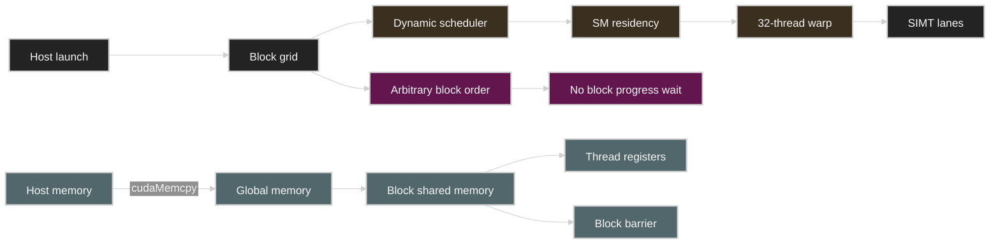

정밀한 hierarchy와 data path는 다음 hand-editable figure에 함께 표시했다.

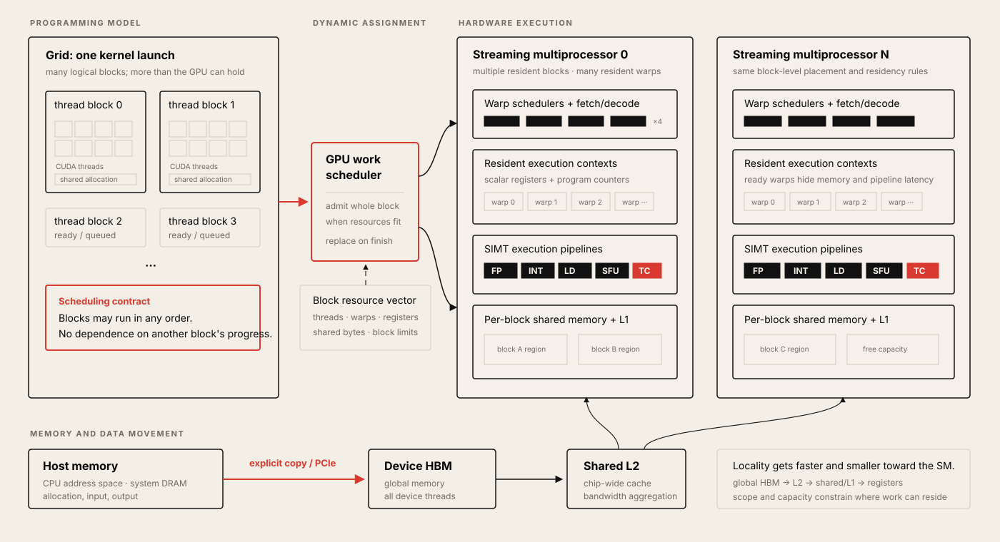

---

## From Graphics Pipelines to General-Purpose GPU Computing

### Original workload: render a scene

초기 GPU의 목적은 general-purpose code를 실행하는 것이 아니라 3D scene description을
image로 바꾸는 것이었다. Input은 triangle mesh, virtual camera, light, material이고
output은 screen pixel array다. Simplified pipeline의 주요 work는 두 부분이다.

1. 각 3D vertex를 camera coordinate와 screen position으로 transform한다.
2. 각 triangle이 덮는 pixel에서 material과 light를 사용해 color를 계산한다.

두 번째 단계의 material evaluation은 다양성이 매우 크다. Skin, metal, cloth, painted
surface는 서로 다른 light-response function이 필요하므로 fixed-function formula 하나로
모든 material을 처리하기 어렵다. GPU vendor는 fragment마다 실행하는 작은
programmable **shader program**을 도입했다.

```text
for each fragment covered by a triangle:
    color = shader(material, normal, texture_coordinate, lights)
```

한 pixel의 shader evaluation은 보통 다른 pixel과 독립적이다. 4K image를 60 frames/s로
그리려면 최소 `3840 × 2160 × 60 ≈ 498 million` pixel positions를 매초 다뤄야 하고,
overdraw까지 고려하면 실제 shader invocation 수는 더 많다. 이 workload는 다음 hardware
방향을 자연스럽게 만든다.

* 한 thread의 latency를 극단적으로 줄이는 대신 많은 independent item의 throughput을 높인다.
* 같은 shader instruction을 여러 fragment에 적용하는 SIMD execution을 사용한다.
* 한 group이 memory를 기다리는 동안 다른 group을 실행하도록 많은 context를 유지한다.
* Graphics-specific fixed-function unit과 programmable core를 함께 둔다.

강의가 “오늘 새로운 concept은 없다”고 말하는 이유도 여기에 있다. GPU는 multicore,
SIMD, multithreading이라는 이미 배운 아이디어를 훨씬 큰 scale로 조합한다.

### Early GPGPU: a useful hack

2001–2003년 무렵 GPU throughput이 CPU의 threaded code보다 매력적인 scientific workload가
등장했다. 하지만 interface는 여전히 “triangle을 그려라”였다. Programmer는 `512 × 512`
output 전체를 덮는 triangle 두 개를 만들고, fragment shader가 color 대신 particle
position, fluid state, sparse-matrix value 등을 계산하도록 만들었다.

```text
512 x 512 output texture
  <- rasterize two full-screen triangles
  <- invoke one fragment shader per output element
  <- reinterpret RGBA channels as numerical data
```

이 방식은 parallel compute capability를 입증했지만 application domain과 interface가
어긋났다. User는 triangle, texture, graphics API를 compute launch와 buffer management의
우회 표현으로 사용해야 했다.

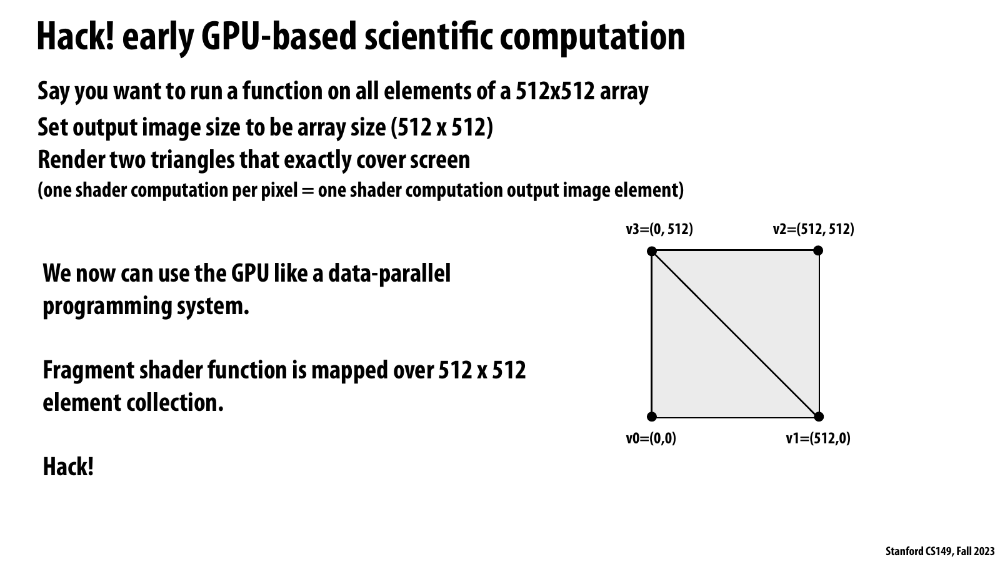

*공식 Lecture 7 slide p. 17 — full-screen triangle 두 개로 `512 × 512` element에 fragment shader를 mapping한 early GPGPU 방식.*

슬라이드가 직접 보여 주는 사실은 numerical array를 output image로, element-wise function을
fragment shader로 위장했다는 것이다. 화면을 정확히 덮는 두 triangle은 graphics 결과를
원해서가 아니라 모든 output element에 한 번씩 shader invocation을 만들기 위한 launch
mechanism이었다.

강의 논리에서 이 hack은 GPU의 high-throughput programmable core와 당시 graphics-only
interface 사이의 불일치를 드러낸다. 별도 systems 관점에서는 useful computation이 빨라도
data layout 변환과 API 우회 비용이 end-to-end goodput을 제한할 수 있다는 사례이며, 뒤의
compute mode가 왜 buffer와 kernel을 직접 노출해야 했는지 설명한다.

### Brook and the data-parallel interface

Stanford Graphics Lab의 2004년 Brook project는 GPU를 **stream processor**로 추상화했다.
Programmer는 scalar가 아니라 collection 전체에 적용되는 kernel을 쓰고, compiler가 이를
graphics API와 shader program으로 source-to-source 변환했다.

```text
kernel scale(amount, input_stream, output_stream)
    output = amount * input
```

사용자 관점에서는 “모든 stream element에 scale을 적용한다”는 data-parallel program이지만,
implementation은 여전히 graphics pipeline hack이었다. 중요한 진전은 GPU의 본질적
가치가 triangle 자체가 아니라 large collection에 같은 computation을 높은 throughput으로
적용하는 능력임을 programming model에 드러낸 것이다.

### Tesla and compute mode

NVIDIA Tesla architecture는 2007년에 non-graphics **compute mode**를 제공했다. Application은
GPU memory에 buffer를 할당하고 data를 복사하며, kernel binary와 invocation count를 GPU에
직접 전달할 수 있게 되었다. Graphics command보다 interface가 오히려 단순하다.

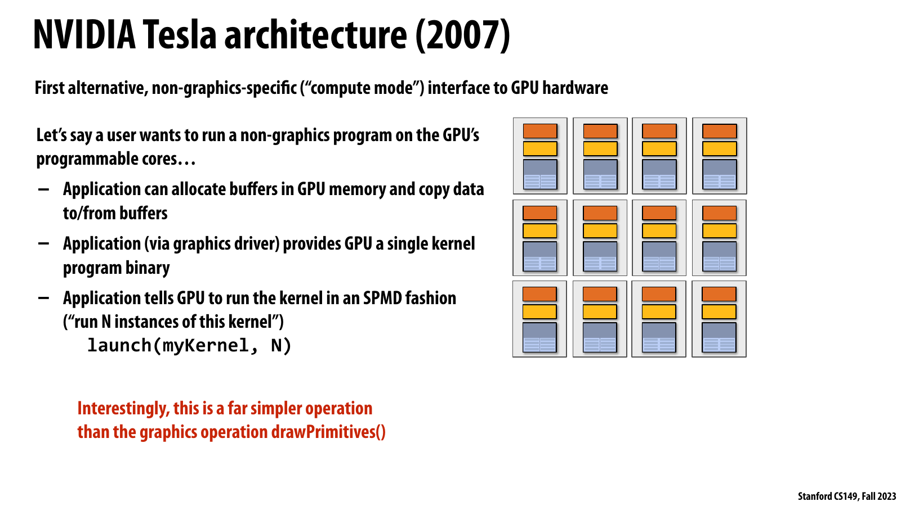

*공식 Lecture 7 slide p. 23 — graphics pipeline을 거치지 않고 buffer allocation, copy, kernel binary, `launch(myKernel, N)`을 사용하는 Tesla compute mode.*

슬라이드의 핵심 사실은 application이 GPU memory를 직접 관리하고 하나의 kernel을 `N`개
SPMD instance로 실행하도록 명령할 수 있게 되었다는 점이다. 이는 `drawPrimitives()`로
계산을 에둘러 표현하던 interface보다 좁고 명시적인 compute contract다.

강의에서는 이 전환이 CUDA abstraction의 출발점이다. 별도 performance 해설로 보면 explicit
buffer와 launch는 locality와 병렬도를 programmer가 제어하게 하지만, transfer volume과
launch granularity도 programmer가 책임져야 하므로 abstraction distance가 짧은 만큼 tuning
surface가 커진다.

```text
allocate device buffers
copy input to device
launch(myKernel, N logical instances)
copy output to host
```

CUDA는 이 interface를 C/C++에 가까운 language로 노출한다. 강의는 CUDA를 low-level로
분류한다. Abstraction과 hardware capability 사이의 거리를 작게 유지해 programmer가
thread organization, shared storage, synchronization을 통해 performance-critical locality를
직접 표현할 수 있기 때문이다. 이 역사는 [공식 슬라이드 pp. 16–25](https://gfxcourses.stanford.edu/cs149/fall23content/media/gpucuda/07_gpuarch.pdf#page=16)에 정리되어 있다.

### Compute pipeline과 graphics pipeline은 공존한다

CUDA가 GPU를 완전히 general-purpose processor로 바꾼 것은 아니다. GPU에는 여전히
rasterization, texture sampling, blending 등 graphics pipeline을 위한 non-programmable 또는
specialized function이 존재한다. CUDA kernel을 실행할 때 이들 대부분은 compute에 직접
사용되지 않는다. 반대로 modern rendering은 programmable core와 fixed-function block을
함께 사용한다.

강의는 programmable core만 설명하며 tensor core는 후속 주제로 남긴다. 따라서 “V100의
CUDA core throughput”과 “GPU 전체가 제공하는 모든 arithmetic throughput”을 동일시하면
안 된다.

## CUDA's Core Abstraction

CUDA programmer는 다음과 같은 kernel을 정의한다.

```cuda
__global__ void saxpy(int n, float a, const float* x, float* y) {
    int i = blockIdx.x * blockDim.x + threadIdx.x;
    if (i < n) {
        y[i] = a * x[i] + y[i];
    }
}
```

Host code는 한 thread를 하나씩 만들지 않고 grid 전체를 bulk launch한다.

```cuda
int threads_per_block = 256;
int blocks = (n + threads_per_block - 1) / threads_per_block;
saxpy<<<blocks, threads_per_block>>>(n, a, device_x, device_y);
```

여기서 “CUDA thread”는 logical thread of control이다. `pthread`와 마찬가지로 자기
program counter와 local state를 가진다는 abstraction을 제공하지만, operating system이
개별 CUDA thread를 CPU hardware context에 mapping하는 것은 아니다. GPU가 수많은 CUDA
thread를 warp로 묶고 SIMD-like hardware에서 실행한다.

| CUDA term | Semantic role | Rough analogy | Important difference |
| --------- | ------------- | ------------- | -------------------- |
| CUDA thread | Kernel 한 instance의 logical control flow | ISPC program instance | Warp 안에서 implicit SIMD로 실행 |
| Thread block | Cooperating thread group | ISPC task 안의 gang | Shared memory와 block barrier 제공 |
| Grid | 한 kernel launch의 모든 block | Task collection / parallel loop | Block order는 system이 선택 |
| Kernel | Device에서 여러 instance가 실행할 program | SPMD function | Host에서 bulk launch |
| Warp | NVIDIA implementation의 32-thread scheduling group | SIMD gang/vector instruction | CUDA source-level hierarchy는 아님 |
| SM | Block이 배치되는 GPU processing core | Multithreaded processor core | 많은 warp와 on-chip storage를 유지 |

CUDA는 **SPMD (single program, multiple data)** programming model이다. Programmer는
thread마다 별도 function을 작성하지 않는다. 모든 thread가 같은 kernel body를 실행하고,
built-in index로 자신이 처리할 data를 결정한다.

```text
same kernel code + different thread/block IDs = different logical work
```

Implementation의 SIMT/SIMD 방식과 programming model의 SPMD semantics를 구분해야 한다.
SPMD는 “무엇을 작성하는가”이고 SIMT/SIMD는 “hardware가 여러 instance를 어떻게 함께
실행하는가”다.

## The CUDA Execution Hierarchy

CUDA launch는 2-level logical hierarchy를 만든다.

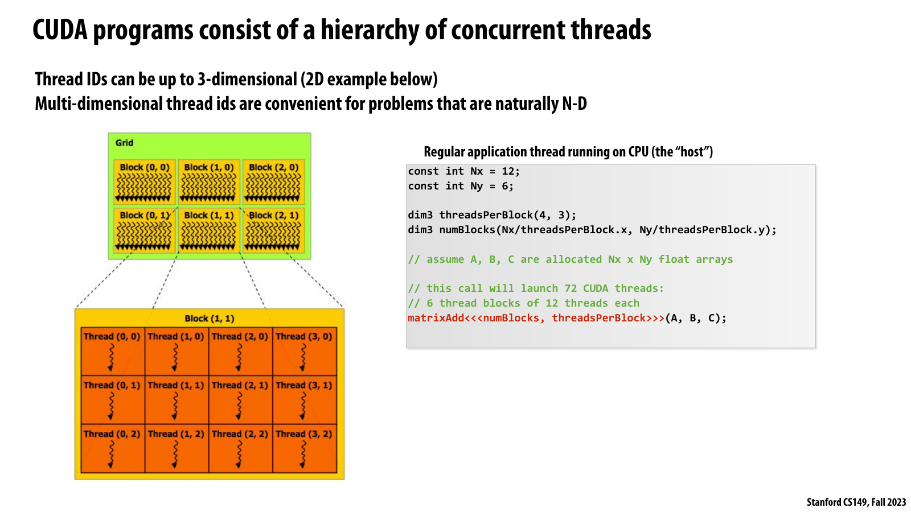

*공식 Lecture 7 slide p. 27 — `12 × 6` matrix-add launch를 grid, 2D thread block, individual CUDA thread로 분해한 hierarchy.*

슬라이드는 host가 `(4, 3)` thread block과 `(3, 2)` block grid를 선언해 총 72개 CUDA
thread를 bulk launch하는 모습을 보여 준다. 확대된 block `(1, 1)` 안의 thread coordinate는
block-local ID이고, green grid 안의 block coordinate와 결합해야 global data coordinate가
된다.

강의 논리에서 grid는 scalable work collection이고 block은 cooperation 단위다. 별도 systems
관점에서는 logical geometry가 physical SM 수와 분리되므로 같은 launch가 서로 다른 GPU에서
동작하지만, block size는 shared memory, register, warp allocation과 함께 residency를
결정하는 resource request가 된다.

```text
grid
  block (0, 0, 0)
    thread (0, 0, 0)
    thread (1, 0, 0)
    ...
  block (1, 0, 0)
    ...
```

Grid와 block dimension은 최대 3-dimensional이다. 2D image나 matrix에서는 `(x, y)`,
3D volume에서는 `(x, y, z)` coordinate가 linear ID를 다시 분해하는 비용과 code noise를
줄인다. 다만 multidimensional ID는 편의 기능이지 computational power의 근본적 차이는
아니다.

강의의 `12 × 6` matrix-add example은 다음 geometry를 사용한다.

```text
threadsPerBlock = (4, 3)       -> 12 threads/block
numBlocks       = (12/4, 6/3) -> (3, 2) = 6 blocks
total threads                  -> 72 threads
```

각 thread는 block-local coordinate와 block coordinate를 결합한다.

```text
i = blockIdx.x * blockDim.x + threadIdx.x
j = blockIdx.y * blockDim.y + threadIdx.y
```

일반적인 3D linear index는 다음과 같이 생각할 수 있다.

```text
local_linear = threadIdx.x
             + blockDim.x * (threadIdx.y + blockDim.y * threadIdx.z)

block_linear = blockIdx.x
             + gridDim.x * (blockIdx.y + gridDim.y * blockIdx.z)
```

Programmer는 problem geometry에 맞는 dimension을 선택하지만, hardware execution은 결국
thread를 warp 단위로 묶는다. 따라서 2D shape를 선택했다고 warp도 2D square로 실행되는
것은 아니다. Linearized thread ID가 연속된 32개 thread가 같은 warp에 들어간다.

### Block은 cooperation domain이다

Thread block을 단순한 launch syntax로 보면 안 된다. Block은 다음 세 contract를 동시에
표현한다.

| Contract | Meaning |
| -------- | ------- |
| Placement | 한 block의 모든 thread/warp는 같은 SM에 배치된다. |
| Storage | `__shared__` allocation은 그 block에 하나씩 생성된다. |
| Synchronization | Block 안의 thread는 barrier와 block-scoped cooperation을 사용할 수 있다. |

그 대가로 block은 한 SM이 동시에 수용할 수 있는 resource limit 안에 들어가야 한다.
Grid는 GPU size보다 훨씬 커도 되지만, 하나의 block은 SM보다 크게 만들 수 없다.

### Grid는 scalable work collection이다

Grid에 수천 block이 있어도 GPU가 모두를 동시에 resident하게 만들 필요는 없다. Scheduler는
가능한 block만 SM에 올리고, block이 완료되어 resource가 반환되면 다음 block을 올린다.
이 때문에 같은 binary가 core 수가 다른 mid-range와 high-end GPU에서 수정 없이 실행될
수 있다.

```text
logical concurrency: all blocks belong to one grid
physical concurrency: resource가 허용하는 resident blocks only
```

Logical concurrency를 physical simultaneity로 해석하는 실수가 뒤의 inter-block deadlock을
만든다.

## Indexing Threads and Guarding Boundaries

Problem size가 block size의 배수라는 보장은 없다. `Nx = 11`, `Ny = 5`, block dimension이
`(4, 3)`이면 grid dimension은 component-wise ceiling division으로 계산한다.

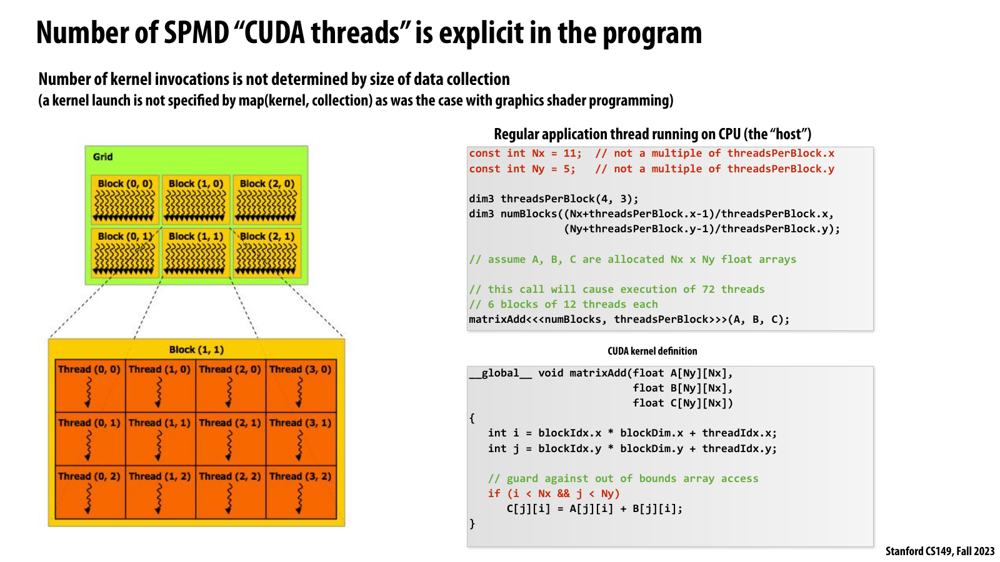

*공식 Lecture 7 slide p. 30 — ceiling-sized grid에서 global `(i, j)`를 계산하고 `if (i < Nx && j < Ny)`로 extra thread를 guard하는 code.*

슬라이드가 보여 주는 사실은 kernel invocation 수가 data collection 크기에서 자동으로
결정되지 않는다는 것이다. `11 × 5` problem에도 `(3, 2)` blocks와 `(4, 3)` threads/block을
launch하므로 72개 logical thread 가운데 17개는 array 밖 coordinate를 얻는다.

강의 논리에서 index 계산과 bounds guard는 launch geometry를 data geometry에 연결하는
programmer의 책임이다. 별도 performance 해설로는 tail warp의 inactive lane이 일부
throughput을 잃게 하지만, guard를 제거해 out-of-bounds access를 허용하는 것과 바꿀 수 없는
correctness cost다.

```text
grid.x = ceil(11 / 4) = (11 + 4 - 1) / 4 = 3
grid.y = ceil( 5 / 3) = ( 5 + 3 - 1) / 3 = 2

launched threads = 3 * 2 * 4 * 3 = 72
useful elements  = 11 * 5 = 55
extra threads    = 17
```

CUDA는 “array element 수만큼 thread를 알아서 만든다”는 model이 아니므로 kernel이 range를
검사해야 한다.

```cuda
__global__ void matrixAdd(
    int nx,
    int ny,
    const float* a,
    const float* b,
    float* c) {
    int i = blockIdx.x * blockDim.x + threadIdx.x;
    int j = blockIdx.y * blockDim.y + threadIdx.y;

    if (i < nx && j < ny) {
        int index = j * nx + i;
        c[index] = a[index] + b[index];
    }
}
```

Bounds guard를 빼면 extra thread가 allocation 밖을 read/write한다. 결과는 단순한 “unused
thread 낭비”가 아니라 undefined behavior, memory corruption, illegal-address failure가 될
수 있다. 자세한 example은 [공식 슬라이드 pp. 27–30](https://gfxcourses.stanford.edu/cs149/fall23content/media/gpucuda/07_gpuarch.pdf#page=27)에 있다.

Guard 때문에 마지막 warp의 일부 lane만 useful work를 수행할 수 있다. 이는 correctness를
위한 정상적인 tail effect다. 큰 array에서는 마지막 한두 warp의 under-utilization이 보통
작지만, 작은 tensor나 많은 tiny launch에서는 비율이 커질 수 있다.

## Host and Device Execution

CUDA program에는 두 execution world가 존재한다.

| Side | Typical processor | Execution style | Main responsibility |
| ---- | ----------------- | --------------- | ------------------- |
| Host | CPU | 일반 C/C++ control flow | Allocation, input preparation, transfer, launch, result use |
| Device | GPU | 많은 CUDA thread의 SPMD execution | Kernel computation과 device memory access |

강의 example에서는 programmer가 function qualifier로 이 경계를 정적으로 표현한다.

| Qualifier | Called from | Runs on | Meaning |
| --------- | ----------- | ------- | ------- |
| `__global__` | Host, 또는 지원되는 device launch | Device | Kernel entry point |
| `__device__` | Device | Device | Device helper function |
| ordinary host function | Host | Host | CPU code |

```cuda
__device__ float doubleValue(float x) {
    return 2.0f * x;
}

__global__ void matrixAddDoubleB(
    int n,
    const float* a,
    const float* b,
    float* c) {
    int i = blockIdx.x * blockDim.x + threadIdx.x;
    if (i < n) {
        c[i] = a[i] + doubleValue(b[i]);
    }
}
```

Source code가 C++처럼 보여도 execution location과 pointer validity는 qualifier와 allocation
domain에 의해 달라진다. Host pointer를 discrete GPU kernel에서 무조건 dereference할 수
있다고 가정하거나 device pointer를 host code에서 ordinary array처럼 읽으면 안 된다.

## The CUDA Memory Model

### Host와 device의 distributed address spaces

강의는 가장 명확한 mental model을 위해 discrete GPU를 가정한다.

```text
CPU host address space              GPU device address space
----------------------              ------------------------
new / malloc                        cudaMalloc
host pointer A                      device pointer deviceA
             \                      /
              ---- cudaMemcpy -----
```

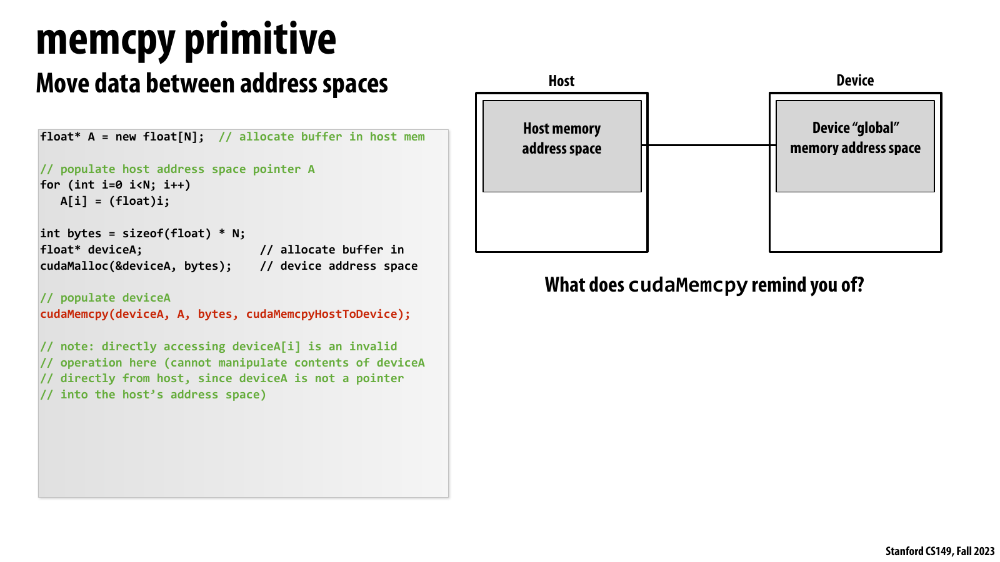

*공식 Lecture 7 slide p. 33 — host pointer `A`와 device pointer `deviceA`가 서로 다른 address space를 가리키며 `cudaMemcpy`가 두 영역 사이를 연결하는 model.*

슬라이드는 `new`로 만든 host buffer와 `cudaMalloc`으로 만든 device buffer를 분리하고,
host code가 device pointer를 ordinary host array처럼 dereference할 수 없다고 명시한다.
`cudaMemcpyHostToDevice`는 같은 pointer namespace 안의 복사가 아니라 두 allocation domain
사이의 explicit data movement다.

강의 논리에서 이 구분은 CUDA가 host-device boundary에서는 distributed-address-space
성격을 가진다는 근거다. 별도 systems 관점에서는 unified addressing이나 managed memory가
syntax를 줄여도 physical placement와 interconnect traffic은 남으므로, transfer bytes와
동기화 시점을 kernel time과 별도로 측정해야 한다.

```cuda
float* host_a = new float[n];
float* device_a = nullptr;

cudaMalloc(&device_a, n * sizeof(float));
cudaMemcpy(device_a, host_a, n * sizeof(float), cudaMemcpyHostToDevice);

kernel<<<blocks, threads>>>(n, device_a);

cudaMemcpy(host_a, device_a, n * sizeof(float), cudaMemcpyDeviceToHost);
cudaFree(device_a);
delete[] host_a;
```

`cudaMemcpy`는 단순한 library call인 동시에 programming-model 관점에서 한 address space의
data를 다른 address space로 보내는 explicit message와 비슷하다. Discrete accelerator
system에서는 이 copy가 PCIe 또는 다른 interconnect를 통과할 수 있으므로 computation과
별도의 latency/bandwidth cost가 있다.

Unified Virtual Addressing이나 managed memory가 pointer handling을 단순화해도 physical
placement와 transfer cost가 사라지는 것은 아니다. 강의는 먼저 explicit-copy model로
원리를 설명한다.

### Device에서 보이는 세 storage scope

공식 슬라이드는 kernel이 보는 memory를 세 scope로 나눈다.

| Scope | CUDA expression | Visible to | Typical implementation/locality | Lifetime |
| ----- | --------------- | ---------- | ------------------------------- | -------- |
| Per-thread private | Local variable | 한 CUDA thread | Register 우선, spill 시 local memory 가능 | Thread execution |
| Per-block shared | `__shared__` | 같은 block의 모든 thread | SM의 on-chip shared-memory/L1 storage | Block residency |
| Device global | Device allocation, global variable | 모든 device thread | L2 뒤의 HBM/DRAM | Allocation 또는 program lifetime |

“Local variable = 항상 fast register”로 읽으면 안 된다. Abstraction은 visibility를 말한다.
실제 register allocation이 부족하거나 address-taking/array indexing이 복잡하면 compiler가
per-thread value를 device memory-backed local memory에 둘 수 있다. 이 implementation detail은
강의 밖 practical section에서 다시 다룬다.

Address space는 locality hint이자 scheduling constraint다.

* 같은 block의 thread가 같은 shared variable을 접근한다면 같은 SM에 있어야 한다.
* Shared allocation 크기는 동시에 resident할 수 있는 block 수를 제한한다.
* Device global memory는 모든 block을 연결하지만 latency와 bandwidth가 제한된다.
* Per-thread state가 많아지면 register capacity가 occupancy를 제한할 수 있다.

이 hierarchy는 [공식 슬라이드 pp. 31–34](https://gfxcourses.stanford.edu/cs149/fall23content/media/gpucuda/07_gpuarch.pdf#page=31)의 execution/memory model을 따른다.

## Case Study: 1D Convolution

강의의 concrete example은 width-3 moving average다.

```text
output[i] = (input[i] + input[i+1] + input[i+2]) / 3
```

Boundary code를 본론에서 제외하기 위해 input은 output보다 두 element 길다고 가정한다.
`N`개의 output마다 CUDA thread 하나를 만든 first version은 다음과 같다.

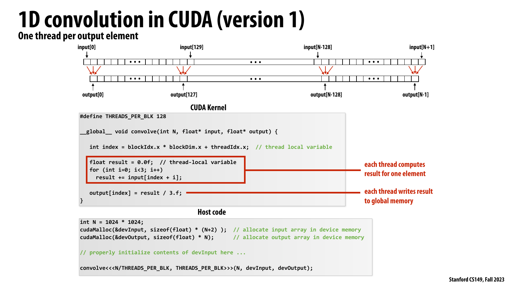

*공식 Lecture 7 slide p. 36 — thread 하나가 output 하나를 맡고 세 input을 device global memory에서 직접 읽는 1D convolution version 1.*

슬라이드의 code는 `index = blockIdx.x * blockDim.x + threadIdx.x`로 output을 선택한 뒤 세
global load를 합산한다. `128`-thread block 기준으로 adjacent thread의 windows가 겹치지만,
각 thread는 그 reuse를 독립적인 load instruction으로 표현한다.

강의 논리에서 이 version은 correctness와 parallel decomposition의 baseline이다. 별도
performance 해설로는 hardware cache가 일부 중복 traffic을 흡수할 수 있어도 program이
reuse location을 보장하지 않으므로, 다음 version은 block-local working set을 shared memory에
명시적으로 stage해 global traffic과 synchronization의 trade-off를 드러낸다.

```cuda
#define THREADS_PER_BLOCK 128

__global__ void convolve_v1(
    int n,
    const float* input,
    float* output) {
    int index = blockIdx.x * blockDim.x + threadIdx.x;

    if (index < n) {
        float result = 0.0f;
        for (int k = 0; k < 3; ++k) {
            result += input[index + k];
        }
        output[index] = result / 3.0f;
    }
}
```

이 version은 correct하고 parallel하다. 하지만 neighboring output이 overlapping input을
읽는다.

```text
output[i]     reads input[i],   input[i+1], input[i+2]
output[i + 1] reads input[i+1], input[i+2], input[i+3]
```

128-thread block 하나가 128개 output을 계산할 때 instruction-level global load count는
다음과 같다.

```text
naive global loads = 128 threads * 3 loads/thread = 384 loads
unique input span  = 128 outputs + 2 halo elements = 130 floats
```

Cache가 중복 load를 일부 흡수할 수 있지만 program 자체는 cross-thread reuse를 명시하지
않는다. Shared-memory version은 block의 cooperation을 사용해 이 reuse를 보장 가능한
on-chip working set으로 만든다.

## Cooperative Staging in Shared Memory

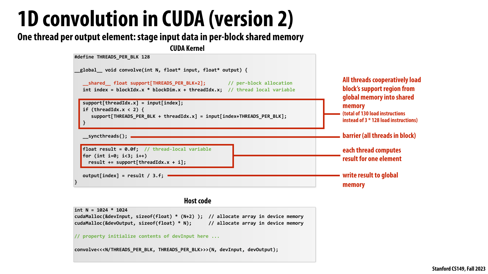

*공식 Lecture 7 slide p. 37 — 128개 thread가 130개 input을 shared memory에 cooperative load하고 `__syncthreads()` 뒤 각 output을 계산하는 version 2.*

슬라이드는 main 128개 element를 각 thread가 하나씩 가져오고 thread 0과 1이 두 halo
element를 추가로 가져오는 division of labor를 표시한다. 그 결과 global load instruction은
`3 × 128`에서 `130`으로 줄고, 이후 각 thread는 block-local `support[]`에서 세 값을 읽는다.

강의 논리에서 이 변환은 block이 단순 grouping이 아니라 locality와 cooperation domain임을
보여 준다. 별도 performance/correctness 해설로는 shared load, halo logic, barrier, shared
capacity가 추가되고 마지막 partial block의 load도 안전하게 처리해야 하므로, 2.95배 traffic
감소를 같은 배수의 runtime speedup으로 해석하면 안 된다.

### Step 1: block working set을 계산한다

128개 consecutive output을 위해 필요한 input은 130개다.

```text
block output range: [base, base + 127]
input support:      [base, base + 129]
halo:               2 elements
```

### Step 2: per-block storage를 할당한다

```cuda
__shared__ float support[THREADS_PER_BLOCK + 2];
```

이 allocation은 thread마다 130개가 아니라 block마다 130개다. `float`가 4 bytes이면
`130 × 4 = 520 bytes/block`이다.

### Step 3: 모든 thread가 load를 분담한다

128개 thread가 main 128 element를 하나씩 읽고, thread 0과 1이 두 halo element를
추가로 읽는다.

```cuda
int index = blockIdx.x * blockDim.x + threadIdx.x;

support[threadIdx.x] = input[index];
if (threadIdx.x < 2) {
    support[THREADS_PER_BLOCK + threadIdx.x] =
        input[index + THREADS_PER_BLOCK];
}
```

### Step 4: barrier로 initialization을 완료한다

```cuda
__syncthreads();
```

SPMD execution에서는 thread 0이 자기 load를 마친 직후 computation으로 진행할 수 있다.
다른 thread의 load 완료 순서를 보장하지 않으므로 barrier가 없으면 uninitialized shared
data를 읽는 race가 생긴다.

### Step 5: shared working set에서 계산한다

```cuda
float result = 0.0f;
for (int k = 0; k < 3; ++k) {
    result += support[threadIdx.x + k];
}
output[index] = result / 3.0f;
```

완전한 teaching version은 다음과 같다.

```cuda
#define THREADS_PER_BLOCK 128

__global__ void convolve_v2(
    int n,
    const float* input,
    float* output) {
    __shared__ float support[THREADS_PER_BLOCK + 2];

    int index = blockIdx.x * blockDim.x + threadIdx.x;

    // 강의의 단순화처럼 input이 모든 launched thread와 halo를 포함한다고 가정한다.
    support[threadIdx.x] = input[index];
    if (threadIdx.x < 2) {
        support[THREADS_PER_BLOCK + threadIdx.x] =
            input[index + THREADS_PER_BLOCK];
    }

    __syncthreads();

    if (index < n) {
        float result = 0.0f;
        for (int k = 0; k < 3; ++k) {
            result += support[threadIdx.x + k];
        }
        output[index] = result / 3.0f;
    }
}
```

Real boundary-safe implementation은 partial final block의 cooperative load도 별도로 guard하고
padding policy를 정해야 한다. 여기서는 슬라이드와 같이 `N`이 block size로 나누어지고
input이 `N+2` element라는 조건을 사용한다.

### Traffic comparison

Block당 global load instruction 수의 단순 비교는 다음과 같다.

| Version | Global loads/block | Shared loads/block | Barrier | Explicit reuse |
| ------- | ------------------ | ------------------ | ------- | -------------- |
| V1: direct | `3B` | `0` | 없음 | 없음 |
| V2: staged | `B + 2` | `3B` | 1회 | 있음 |

`B = 128`이면 다음과 같다.

```text
global-load reduction factor = 3B / (B + 2)
                             = 384 / 130
                             ≈ 2.95x
```

이 수치는 instruction/element accounting이지 measured kernel speedup이 아니다. Shared
load, barrier, address calculation, occupancy, cache behavior가 추가되므로 runtime이 2.95배
빨라진다는 뜻은 아니다. 강의의 목적은 block-local reuse를 programming model로 표현하는
방법을 보여 주는 것이다. 원본 code와 설명은 [공식 슬라이드 pp. 35–37](https://gfxcourses.stanford.edu/cs149/fall23content/media/gpucuda/07_gpuarch.pdf#page=35)에 있다.

## Synchronization and Visibility

CUDA는 scope가 다른 synchronization mechanism을 제공한다.

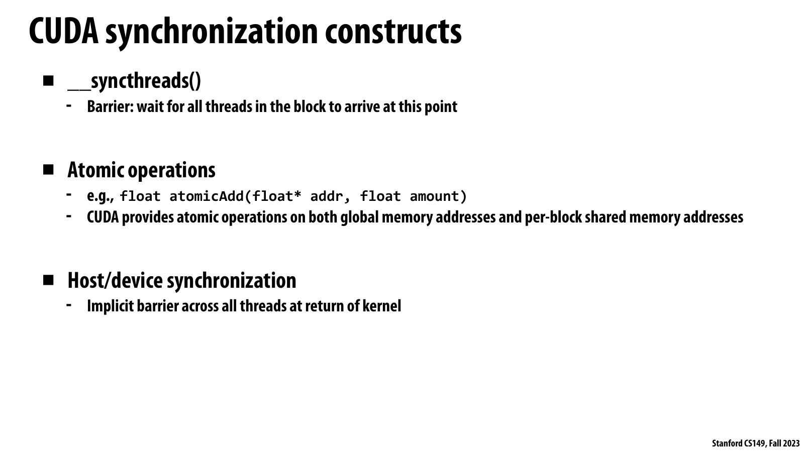

*공식 Lecture 7 slide p. 38 — `__syncthreads()`, shared/global-memory atomic operation, kernel-return host/device synchronization의 서로 다른 scope.*

슬라이드가 직접 말하는 범위는 세 가지다. `__syncthreads()`는 같은 block의 모든 thread가
도착할 때까지 기다리고, atomic은 특정 shared/global address의 competing operation을
보호하며, kernel return은 launched grid의 completion boundary를 제공한다.

강의 논리에서 primitive 선택은 participant scope와 필요한 ordering에서 출발해야 한다.
별도 correctness 해설로는 atomicity가 grid barrier나 scheduling progress를 보장하지 않고,
divergent control flow에서 일부 thread만 block barrier에 도달하면 deadlock 또는 undefined
behavior를 만들 수 있다는 점이 중요하다.

| Mechanism | Scope in lecture | What it guarantees | What it does not guarantee |
| --------- | ---------------- | ------------------ | -------------------------- |
| `__syncthreads()` | 한 thread block | 모든 block thread가 barrier 전 work를 끝낸 뒤 진행 | 다른 block의 도착 또는 실행 순서 |
| `atomicAdd` 등 | Target shared/global address | Competing update의 atomicity | 전체 block 간 phase ordering |
| Kernel completion | Launch한 grid 전체 | Kernel의 모든 thread 종료 | Kernel 내부에서 arbitrary grid barrier |
| Host/device sync | Host와 launched device work | Host가 device completion을 기다림 | Data transfer cost 제거 |

### Barrier가 필요한 이유

Shared-memory convolution에서 각 thread는 자기 input을 쓴 뒤 neighbor가 쓴 value를 읽는다.
Thread별 instruction order만으로는 다음 global ordering이 성립하지 않는다.

```text
all writes to support[]
  happens-before
all reads from support[] for convolution
```

`__syncthreads()`가 이 phase boundary를 표현한다. Block 안의 모든 participating thread가
barrier에 도달해야 하므로 divergent path에서 일부 thread만 barrier를 실행하도록 만들면
안 된다.

### Atomic은 barrier가 아니다

Histogram의 `atomicAdd(&counts[value], 1)`은 여러 block이 같은 bin을 update할 때 lost
update를 막는다. 하지만 atomic operation 하나가 다른 thread의 앞뒤 모든 memory operation을
자동으로 global phase로 정렬하는 것은 아니다. Atomicity와 collective synchronization은
다른 property다.

### Scope를 먼저 묻는다

Correctness review에서는 primitive 이름보다 다음을 먼저 확인한다.

```text
Who must observe this write?
Which operations must happen before which reads?
What execution/progress guarantee connects those participants?
```

Block-local dependency이면 shared memory와 `__syncthreads()`가 자연스럽다. Grid-wide
dependency라면 ordinary block barrier가 없으므로 kernel boundary, 지원되는 cooperative
mechanism, 또는 dependency를 제거한 algorithm이 필요하다.

## From CUDA Abstraction to GPU Implementation

### Million-thread launch는 million OS threads가 아니다

강의의 convolution은 `N = 1024 × 1024`, `128 threads/block`을 사용한다.

```text
CUDA threads = 1,048,576
blocks       = 1,048,576 / 128 = 8,192
```

이 launch는 1,048,576개의 full hardware context나 OS-scheduled thread를 동시에 만들라는
요청이 아니다. Grid는 처리해야 할 work collection이고, GPU는 resource가 허용하는 일부
block만 resident하게 유지한다. 이는 ISPC task나 thread pool과 같은 common design pattern이다.

```text
many logical tasks
  -> fixed hardware worker pool
  -> dynamic assignment as resources become free
```

### Compiled kernel은 resource contract를 포함한다

Device binary에는 instruction stream뿐 아니라 실행에 필요한 resource 정보가 들어간다.

```text
kernel metadata
  - threads per block requested by launch
  - registers / local state per thread
  - static + dynamic shared memory per block
  - other architectural constraints
```

Convolution example의 핵심 resource vector는 다음과 같다.

```text
R_block = (128 CUDA thread contexts, 520 B shared memory, per-thread registers)
```

Hardware work scheduler는 각 SM의 remaining capacity와 `R_block`을 비교한다. Block이
완료되면 그 block의 warp context와 shared allocation을 반환하고 다음 block을 배치한다.

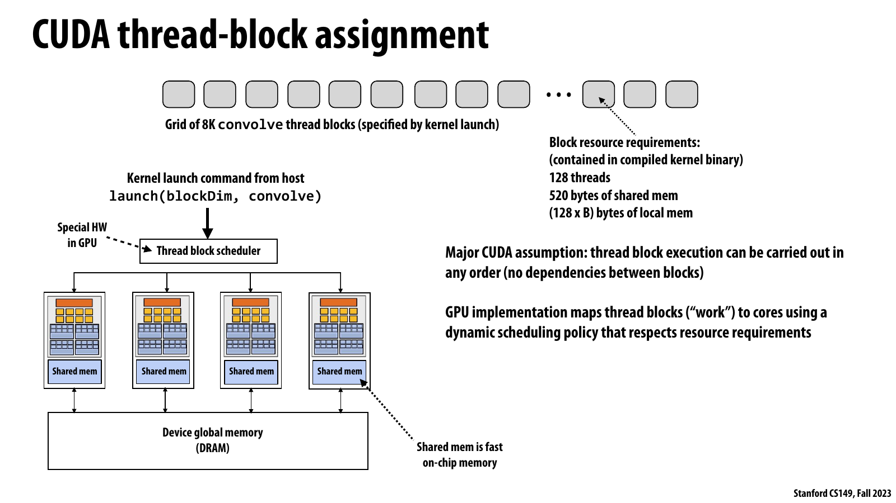

*공식 Lecture 7 slide p. 43 — compiled resource requirement를 보고 8K block grid의 block을 GPU core에 동적으로 배치하는 thread-block scheduler.*

슬라이드는 launch의 block queue, hardware scheduler, 여러 GPU core, core-local shared memory,
device global memory를 한 흐름으로 연결한다. 각 block은 128 thread와 520-byte shared storage를
요청하며, scheduler는 block 간 dependency가 없다는 전제 아래 resource가 있는 core를
선택한다.

강의 논리에서 이 dynamic assignment가 GPU core 수에 독립적인 scalability를 만든다. 별도
systems 해설로는 scheduler가 단순한 block counter가 아니라 thread context, register,
shared-memory capacity를 동시에 만족시키는 admission controller이며, 특정 block 순서를
가정하면 이 portability와 progress contract를 깨뜨린다.

### Scheduler의 자유가 portability를 만든다

CUDA source에는 일반적으로 `num_cores`가 없다. Programmer는 충분한 block을 선언하고
system이 실제 SM 수에 맞춰 배치하도록 한다. Six-core mid-range GPU와 더 큰 GPU가 같은
launch를 실행할 수 있는 이유다.

이 자유에는 중요한 semantic condition이 있다.

> Thread block은 어떤 순서로도 schedule될 수 있어야 한다. Programmer는 특정 block이
> 먼저 시작하거나 모든 block이 동시에 resident할 것이라고 가정할 수 없다.

이 내용은 [공식 슬라이드 pp. 40–44](https://gfxcourses.stanford.edu/cs149/fall23content/media/gpucuda/07_gpuarch.pdf#page=40)의 compilation과 assignment model에 해당한다.

## V100 Streaming Multiprocessor Architecture

강의는 NVIDIA V100의 한 **streaming multiprocessor (SM)**를 concrete implementation으로
사용한다. 이 수치는 architecture-specific example이지만, abstraction-to-hardware mapping을
이해하는 데 유용하다.

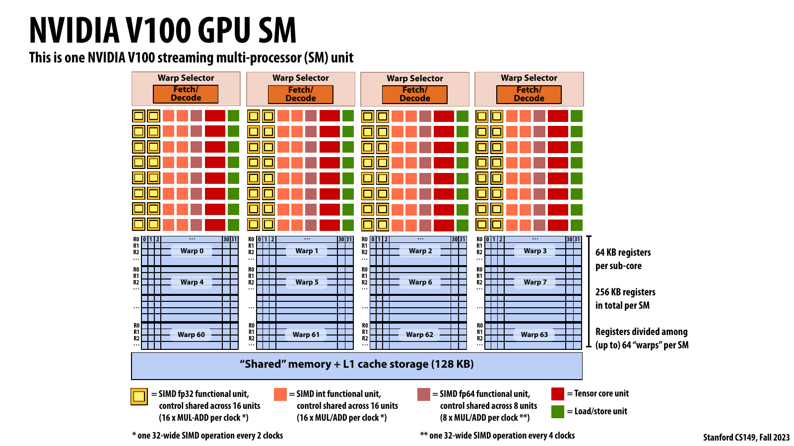

*공식 Lecture 7 slide p. 50 — 네 sub-core partition, warp selector, functional unit, partitioned register file, 128 KB shared-memory/L1을 합친 V100 SM.*

슬라이드는 한 SM이 네 warp scheduler/fetch-decode partition을 가지며, 각 partition이 최대
16 warp의 register state를 보유해 SM 전체로 최대 64 resident warp를 유지하는 구조를
보여 준다. FP32, INT, FP64, tensor, load/store unit은 종류와 issue width가 서로 다르고,
shared-memory/L1 storage는 SM 아래에서 block-local data reuse를 지원한다.

강의 논리에서 많은 register context는 한 warp가 load나 dependency에 막힐 때 다른 ready
warp를 선택하는 latency hiding의 물리적 기반이다. 별도 performance 해설로는 resident warp
수가 많아도 모두 같은 barrier나 memory bottleneck에 묶이면 숨길 latency가 없고, 특정
functional unit이나 memory bandwidth가 먼저 포화될 수 있다.

### One SM

V100 SM은 네 개의 sub-core partition으로 설명된다. 각 partition에는 warp selector와
fetch/decode, 많은 warp의 scalar register context, 여러 종류의 functional unit이 있다.

| V100 SM component | Slide value | Role |
| ----------------- | ----------- | ---- |
| Sub-core partitions | 4 per SM | 독립적으로 runnable warp를 고르고 instruction issue |
| Resident warps | 최대 64 per SM | Latency hiding을 위한 execution contexts |
| CUDA thread contexts | 최대 `64 × 32 = 2,048` | Resident logical thread state |
| Register file | 64 KB per sub-core, 256 KB total | Thread scalar register state |
| Shared memory + L1 | 128 KB per SM | Block cooperation과 cache storage |
| FP32 lanes | 16 per sub-core | 32-thread warp instruction을 2 clocks에 처리 |
| INT lanes | 16 per sub-core | Integer warp operation |
| FP64 lanes | 8 per sub-core | 32-thread warp instruction을 4 clocks에 처리 |
| Other units | Tensor, load/store, special functions | Operation type별 execution |

각 CUDA thread는 abstraction상 scalar register set과 program counter를 가진다. CPU SIMD
compiler가 vector instruction을 명시적으로 생성하는 것과 달리, GPU는 같은 warp의 thread가
같은 instruction에 있을 때 이 scalar-looking thread operations를 함께 issue한다.

### Full V100 example

공식 슬라이드가 제시하는 chip geometry는 다음과 같다.

| Item | V100 lecture value |
| ---- | ------------------ |
| Clock | 1.245 GHz |
| SM count | 80 |
| FP32 multiply-add lanes | `80 × 4 × 16 = 5,120` |
| Peak FP32 throughput | 12.7 TFLOP/s, FMA를 2 FLOPs로 계산 |
| Maximum interleaved warps | `80 × 64 = 5,120` |
| Resident CUDA thread contexts | `5,120 × 32 = 163,840` |
| L2 cache | 6 MB |
| HBM capacity | 16 GB |
| HBM bandwidth | 900 GB/s, 4096-bit interface |

Peak FP32 계산은 다음과 같다.

```text
80 SM
* 4 sub-cores/SM
* 16 FP32 FMA lanes/sub-core
* 2 FLOPs/FMA
* 1.245e9 cycles/s
= 12.7488e12 FLOP/s
≈ 12.7 TFLOP/s
```

`163,840` thread가 한 clock에 모두 instruction을 완료한다는 뜻은 아니다. 그만큼의 context가
chip에 resident할 수 있고, 각 scheduler가 그중 ready warp를 골라 제한된 functional unit에
issue한다는 뜻이다.

V100 수치와 diagram은 [공식 슬라이드 pp. 45–53](https://gfxcourses.stanford.edu/cs149/fall23content/media/gpucuda/07_gpuarch.pdf#page=45)에 근거한다.

## Warps, SIMT, and Divergence

### Warp는 programming-model object가 아니다

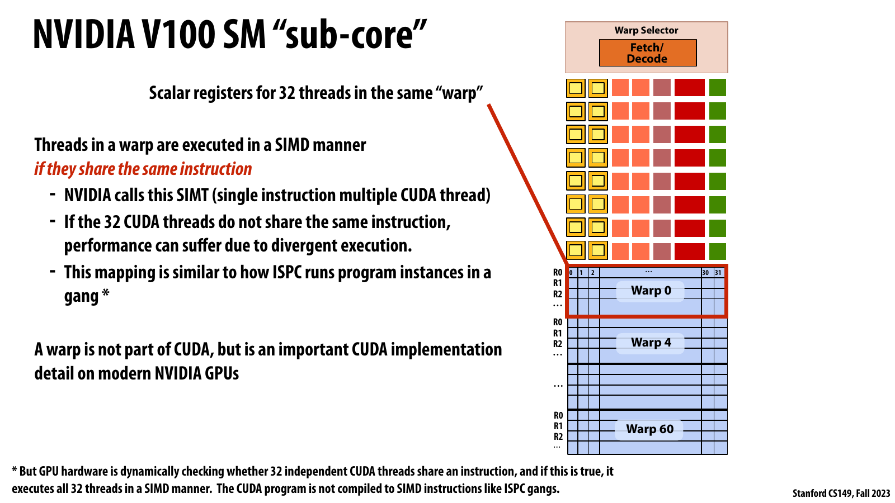

*공식 Lecture 7 slide p. 48 — 32개 CUDA thread register context를 한 warp로 묶고 같은 instruction이면 SIMD manner로 실행하는 V100 sub-core.*

슬라이드는 consecutive 32-thread group이 warp이며, 같은 instruction을 공유할 때 functional
unit에서 함께 실행된다고 설명한다. 동시에 thread가 서로 다른 instruction에 있으면
divergent execution 때문에 performance가 떨어질 수 있고, warp는 CUDA source hierarchy가
아닌 NVIDIA implementation detail임을 분명히 한다.

강의 논리에서 이 그림은 scalar-looking SPMD thread를 SIMD hardware에 mapping하는 SIMT
bridge다. 별도 performance 해설로는 같은 warp 안의 branch path나 memory access pattern을
정렬하면 active-lane goodput을 높일 수 있지만, warp-synchronous behavior를 portable
correctness guarantee처럼 사용해서는 안 된다.

V100 설명에서 **warp**는 consecutive thread ID 32개를 묶은 hardware scheduling/execution
group이다.

```text
threads 0..31   -> warp 0
threads 32..63 -> warp 1
...
256-thread block -> 8 warps
```

Thread block은 CUDA program이 명시하는 semantic unit이지만 warp는 주로 NVIDIA hardware의
implementation detail이다. Warp-level builtin을 쓰는 경우를 제외하면 program correctness를
implicit warp behavior에 기대지 않는 것이 기본 원칙이다.

### SIMT는 SPMD를 SIMD hardware에 mapping한다

한 warp의 thread가 같은 program counter에 있으면 hardware가 하나의 instruction을 여러
thread에 적용한다.

```text
CUDA source: 32 logical scalar threads execute x = a + b
hardware:    one warp instruction drives multiple FP32 lanes
```

강의의 V100 sub-core에는 FP32 lane이 16개이므로 32-wide warp FP32 instruction 하나를 두
clock에 나누어 실행한다. 그 사이 fetch/decode는 다른 instruction type이나 다른 warp의
ready instruction을 issue해 unit utilization을 높일 수 있다.

### Divergence

Warp 안에서 branch condition이 갈라지면 모든 path를 완전히 동시에 실행할 수 없다.

```cuda
if (predicate(threadIdx.x)) {
    path_a();
} else {
    path_b();
}
```

일부 thread가 `path_a`, 나머지가 `path_b`를 선택하면 hardware는 한 path를 실행할 때
다른 lane을 mask하고, 이어서 다른 path를 실행할 수 있다. 단순 model에서 useful-lane
efficiency는 다음처럼 볼 수 있다.

```text
lane efficiency = useful active-lane instruction work
                / total issued lane slots
```

16 lane이 A를, 16 lane이 B를 비슷한 비용으로 실행하면 두 path를 순차 issue하는 동안
각각 절반의 lane만 useful하다. 하지만 branch가 존재한다고 항상 같은 손실이 생기는 것은
아니다. Warp별로 condition이 uniform하면 divergence가 없고, compiler optimization과
architecture의 reconvergence behavior도 영향을 준다.

### Warp와 block을 혼동하지 않기

| Property | Warp | Thread block |
| -------- | ---- | ------------ |
| Defined by | NVIDIA implementation | CUDA programming model |
| Typical size in lecture | 32 threads | Programmer-selected |
| Main role | SIMT scheduling/issue | Cooperation, locality, synchronization |
| Shared memory ownership | 없음 | Block당 allocation |
| Barrier scope | Warp builtin은 별도 | `__syncthreads()` block-wide |
| Placement | Block과 함께 한 SM | 모든 warp가 같은 SM |

## Latency Hiding with Massive Multithreading

GPU는 한 thread의 dependency chain을 aggressive out-of-order execution으로 해결하는 대신,
많은 warp를 resident하게 두고 ready warp를 바꾸는 방식으로 latency를 숨긴다.

```text
warp A issues global load -> waits
warp B is ready           -> issue arithmetic
warp C is ready           -> issue integer/address work
warp D's data arrives     -> resume
```

V100 example에서 한 SM은 최대 64 warp context를 유지하고 네 scheduler가 각 partition의
candidate warp 중 ready warp를 선택한다. 한 clock에는 일부 warp만 progress하지만, context
switch에 OS thread switch 같은 heavyweight save/restore가 필요하지 않도록 state가 이미
register file에 resident한다.

이 design의 핵심 trade-off는 다음과 같다.

| CPU-oriented priority | GPU-oriented priority |
| --------------------- | --------------------- |
| 한 thread의 낮은 latency | 많은 item의 높은 aggregate throughput |
| 큰 cache와 complex control | 많은 execution lane과 resident context |
| 적은 heavyweight thread | 많은 lightweight logical thread |
| aggressive instruction-level parallelism | thread/warp-level latency hiding |

따라서 GPU kernel은 충분한 ready warp를 제공해야 하지만, resident thread 수 자체가 성능의
목적은 아니다. Memory pattern, instruction mix, dependency chain, contention이 나쁘면 높은
occupancy에서도 execution unit이 idle할 수 있다.

## Resource-Constrained Block Residency

### Admission은 여러 resource의 minimum으로 결정된다

한 SM에 동시에 들어갈 block 수는 하나의 limit가 아니라 여러 limit의 교집합이다.

```text
resident_blocks_per_SM <= min(
    architectural_block_limit,
    floor(max_threads_per_SM / threads_per_block),
    floor(max_warps_per_SM / warps_per_block),
    floor(register_capacity / registers_per_block),
    floor(shared_capacity / shared_bytes_per_block)
)
```

여기서

```text
warps_per_block = ceil(threads_per_block / warp_size)
registers_per_block ≈ registers_per_thread * threads_per_block
```

실제 hardware는 allocation granularity와 architecture-specific limit 때문에 더 세부적인
rounding을 적용하지만, 강의의 conceptual model은 이 minimum을 이해하는 데 충분하다.

### 강의의 fictitious two-core GPU

Scheduling walkthrough는 각 core가 다음 resource를 가진다고 가정한다.

```text
thread contexts = 384 threads = 12 warps
shared storage  = 1.5 KB = 1536 bytes
```

Convolution block requirement는 다음과 같다.

```text
threads/block = 128
shared/block  = 520 bytes
```

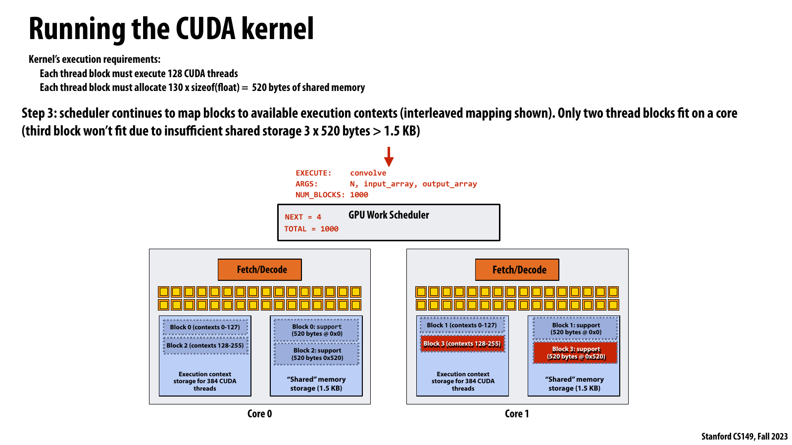

*공식 Lecture 7 slide p. 60 — thread context는 남아 있지만 `3 × 520 bytes > 1.5 KB`이므로 core당 두 block만 resident할 수 있는 상태.*

슬라이드는 각 fictitious core에 384 CUDA-thread context와 1.5 KB shared storage가 있지만,
세 번째 block의 520-byte `support[]`가 들어가지 않아 contexts 256–383이 비어 있는 모습을
보여 준다. 즉 개별 resource utilization이 100%가 아니어도 full block resource vector를
수용하지 못하면 admission이 멈춘다.

강의 논리에서 residency는 threads, warps, registers, shared memory 가운데 가장 엄격한
limit의 minimum으로 정해진다. 별도 performance 해설로는 shared allocation을 줄여 block을
하나 더 resident시키는 이득과 data reuse 감소를 함께 측정해야 하며, occupancy 숫자 하나만
최대화하면 오히려 memory traffic이나 spill이 늘 수 있다.

각 resource가 허용하는 block 수는 다음과 같다.

```text
by thread contexts = floor(384 / 128) = 3 blocks
by shared memory   = floor(1536 / 520) = 2 blocks
```

따라서 실제 resident limit는 `min(3, 2) = 2 blocks/core`다. Thread context가 128개 남아도
세 번째 shared allocation을 위한 공간이 부족해 block을 더 받을 수 없다.

### Completion과 replacement

Scheduler는 block 0과 2를 core 0에, block 1과 3을 core 1에 배치할 수 있다. Block 0이
끝나면 contexts 0–127과 520-byte shared region이 함께 free되고 block 4가 그 자리를
사용한다. Block execution time이 같을 필요는 없고 assignment order도 programmer가
관찰 가능한 보장으로 주어지지 않는다.

이 example은 세 가지를 분명히 한다.

1. Block 수가 SM 수보다 많아도 정상이다.
2. 한 SM에 여러 block이 동시에 resident할 수 있다.
3. 어느 resource든 먼저 고갈되면 나머지 resource가 남아도 residency가 제한된다.

전체 scheduling sequence는 [공식 슬라이드 pp. 55–64](https://gfxcourses.stanford.edu/cs149/fall23content/media/gpucuda/07_gpuarch.pdf#page=55)에 단계별로 그려져 있다.

## Why an Entire Block Must Be Resident

Fictitious SM이 128-thread context만 제공하는데 kernel이 256-thread block을 요구한다고
가정하자. 단순하게 thread 0–127을 먼저 끝내고 thread 128–255를 나중에 실행하면 왜 안
될까?

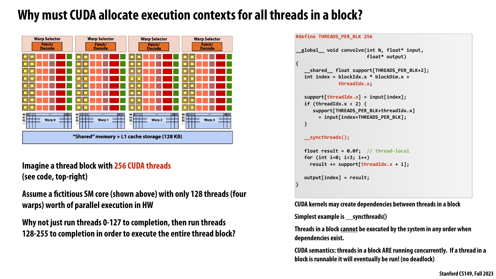

*공식 Lecture 7 slide p. 66 — 256-thread block과 128-thread capacity를 대비해 `__syncthreads()`가 요구하는 all-thread residency를 설명하는 counterexample.*

슬라이드는 first half만 실행해 completion한 뒤 second half를 실행하자는 제안이 block 내부
dependency 때문에 성립하지 않음을 보여 준다. 먼저 실행된 thread가 barrier에 도달하면 아직
context조차 없는 나머지 thread를 기다리며, 그 thread는 실행될 자원을 얻지 못한다.

강의 논리에서 scheduler가 block admission 시 모든 thread state와 shared allocation을 함께
수용해야 하는 이유가 여기서 나온다. 별도 correctness/systems 해설로는 threads-per-block,
registers, shared memory가 단지 tuning knob가 아니라 launch feasibility와 forward progress를
결정하는 hard resource contract다.

Kernel에 block barrier가 없고 완전히 independent하다면 그런 implementation을 상상할 수
있다. 하지만 CUDA semantics는 block thread가 shared memory와 barrier로 cooperate할 수
있게 한다.

```text
threads 0..127 execute
  -> reach __syncthreads()
  -> wait for threads 128..255

threads 128..255
  -> have no execution contexts
  -> cannot run
```

먼저 실행된 thread가 barrier에서 context를 점유한 채 기다리고, 나머지 thread는 context가
없어 시작하지 못하므로 deadlock이다. Expensive preemption과 state spill을 semantics의
기본 implementation으로 두지 않는다면, scheduler는 block 시작 시 모든 thread의 live
state를 수용할 수 있어야 한다.

따라서 block은 다음 조건을 만족해야 한다.

```text
threads_per_block <= architecture maximum
registers_per_block <= allocatable register resources
shared_bytes_per_block <= allocatable shared resources
```

이 제약은 performance hint만이 아니다. Hardware가 launch를 실행할 수 있는지 결정하는
admission condition이다. 강의의 [pp. 65–67](https://gfxcourses.stanford.edu/cs149/fall23content/media/gpucuda/07_gpuarch.pdf#page=65)는 이를 CUDA concurrency semantics와 연결한다.

## What Inter-Block Communication May Assume

강의는 “block이 independent하다”는 문장을 정교하게 수정한다. CUDA는 block이 서로 같은
global memory를 읽고 쓰는 것을 금지하지 않는다. 정확한 조건은 system이 block을 어떤
순서로도 schedule할 수 있어야 한다는 것이다.

### Valid: global atomic histogram

```cuda
__global__ void histogram(
    int n,
    const int* values,
    unsigned int* counts) {
    int i = blockIdx.x * blockDim.x + threadIdx.x;
    if (i < n) {
        atomicAdd(&counts[values[i]], 1u);
    }
}
```

여러 block이 같은 `counts[k]`에 접근하지만 correctness가 block order에 의존하지 않는다.
Atomic이 각 increment의 lost update를 막는다. Contention 때문에 느릴 수는 있어도
scheduling semantics에는 맞는다.

### Unsafe: another block's progress를 spin-wait

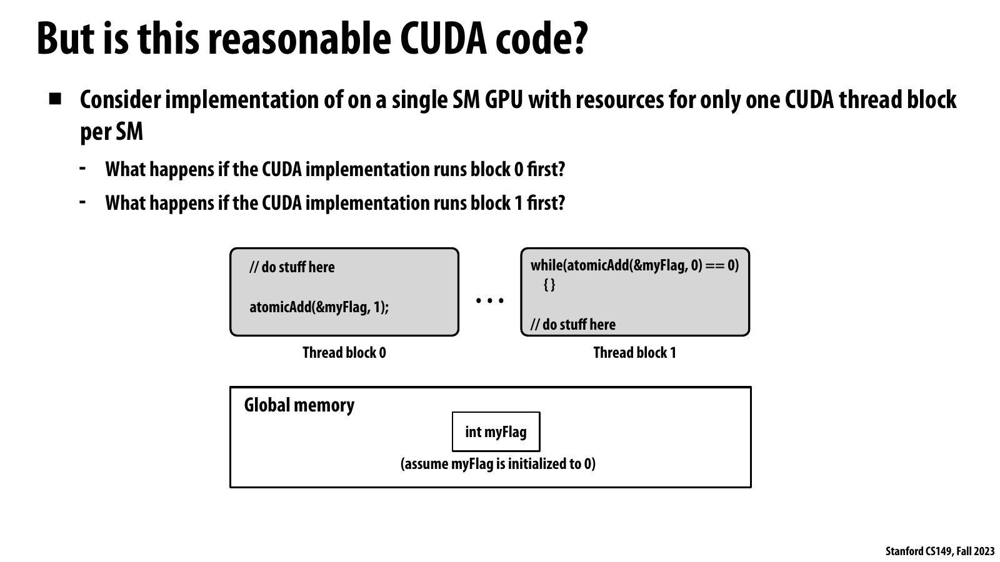

*공식 Lecture 7 slide p. 69 — block 1이 `myFlag`를 spin-read하고 block 0이 flag를 set하는 ordinary-kernel inter-block dependency.*

슬라이드는 한 SM이 block 하나만 resident시킬 수 있을 때 scheduler가 block 0 또는 block 1을
먼저 고를 수 있다고 묻는다. Block 0이 먼저면 끝날 수 있지만 block 1이 먼저면 flag를
기다린 채 SM을 점유하고, flag setter인 block 0은 resident하지 못해 circular wait가 된다.

강의 논리에서 unsafe한 부분은 atomic read 자체가 아니라 future block의 scheduling progress를
가정한 것이다. 별도 systems 해설로는 visibility/coherence가 해결되어도 liveness는 남으므로,
global phase는 kernel boundary나 조건이 검증된 cooperative launch로 만들고 ordinary grid는
arbitrary block order에서도 progress하도록 설계해야 한다.

```cuda
// conceptual anti-pattern inside one ordinary kernel
if (blockIdx.x == 0) {
    produce_result();
    atomicExch(&flag, 1);
} else if (blockIdx.x == 1) {
    while (atomicAdd(&flag, 0) == 0) {
        // wait for block 0
    }
    consume_result();
}
```

GPU가 block 하나만 resident시킬 수 있고 block 1을 먼저 schedule하면 다음 cycle이 생긴다.

```text
block 1 resident -> waits for flag -> occupies SM
block 0 queued   -> must set flag  -> cannot become resident
```

Atomic read가 최신 flag를 볼 수 있더라도 **progress**를 보장하지 못한다. Memory visibility와
scheduling liveness는 서로 다른 문제다.

### Safe phase boundary

Producer와 consumer를 separate kernel로 나누면 first kernel completion이 global phase
boundary를 제공한다.

```text
produce_kernel<<<...>>>()
  -> all producer blocks finish
consume_kernel<<<...>>>()
```

Modern CUDA의 asynchronous launch/stream ordering과 host synchronization 세부는 강의의
단순 model보다 넓으므로 practical section에서 별도로 다룬다. 핵심 강의 원칙은 ordinary
kernel 안에서 arbitrary inter-block schedule을 견디도록 작성하는 것이다.

## Persistent Threads and the Cost of Taking Over Scheduling

공식 슬라이드의 bonus example은 GPU scheduler가 하던 assignment 일부를 application으로
옮기는 **persistent-thread** style을 소개한다.

```text
launch exactly enough blocks to occupy the GPU
each resident block:
  atomically fetch next work index
  stage data
  process item
  repeat until queue is empty
```

Conceptual structure는 다음과 같다.

```cuda
__device__ unsigned int work_counter = 0;

__global__ void persistent_kernel(int n, const float* input, float* output) {
    __shared__ unsigned int start;

    while (true) {
        if (threadIdx.x == 0) {
            start = atomicAdd(&work_counter, blockDim.x);
        }
        __syncthreads();

        if (start >= static_cast<unsigned int>(n)) {
            break;
        }

        unsigned int i = start + threadIdx.x;
        if (i < static_cast<unsigned int>(n)) {
            output[i] = compute(input[i]);
        }

        __syncthreads();
    }
}
```

이 방식은 irregular work를 application-controlled queue로 balance하고 repeated launch를
줄일 수 있다. 그러나 “몇 block이 동시에 resident 가능한가”를 programmer가 알아야 하고,
launch가 GPU를 정확히 채운다는 가정이 들어간다. Architecture, register use, shared-memory
use가 바뀌면 assumption이 깨질 수 있다.

| Ordinary grid | Persistent style |
| ------------- | ---------------- |
| Hardware가 many blocks를 동적 배치 | 고정 resident worker block이 queue를 가져감 |
| Core 수에 덜 의존 | SM 수/residency knowledge가 필요할 수 있음 |
| Scheduling freedom이 큼 | Application이 assignment control을 얻음 |
| Portability가 높음 | Tuning과 liveness proof가 어려움 |

Persistent style은 “CUDA는 block order를 보장하지 않는다”는 규칙의 예외가 아니다.
Programmer가 launch와 resource usage를 제한해 모든 worker block이 resident함을 별도로
성립시키는 specialized technique다. 슬라이드의 V100-specific formula는
`80 × (32 × 64 / 128)` blocks처럼 SM count와 per-SM context를 직접 사용하므로 machine
independence를 의도적으로 포기한다.

## Classifying CUDA's Programming Model

강의가 반복해서 묻는 질문은 CUDA를 data-parallel, shared-address-space, message-passing 중
하나로만 분류할 수 있는가이다. 답은 hierarchy level마다 다른 model의 특징을 가진다는
것이다.

| Level | Best mental model | Reason |
| ----- | ----------------- | ------ |
| Host ↔ device | Distributed address space / message-like transfer | Distinct allocation domain과 explicit copy |
| Grid of blocks | Data-parallel task collection | 많은 block을 선언하고 system이 machine-independent하게 배치 |
| Threads within a block | SPMD shared-address-space workers | 같은 kernel, block-local shared variables, barrier/atomic cooperation |
| Warp implementation | SIMT over SIMD-like lanes | 같은 instruction의 active CUDA thread를 함께 issue |

ISPC와의 analogy도 level별로 해야 한다.

```text
CUDA thread       ~ ISPC program instance
CUDA thread block ~ cooperating gang / task-level work unit
CUDA grid         ~ launched task collection
CUDA warp         ~ implementation-level SIMD execution group
```

완전히 같은 것은 아니다. ISPC는 compiler가 explicit SIMD instruction을 만들고 compile-time
program count를 중심으로 설명한다. CUDA는 logical scalar thread를 bulk launch하고 hardware가
warp의 program-counter coherence를 확인해 SIMT로 실행한다.

이 layered classification은 [공식 슬라이드 pp. 67–71](https://gfxcourses.stanford.edu/cs149/fall23content/media/gpucuda/07_gpuarch.pdf#page=67)의 CUDA summary와 일치한다.

## GPU Systems Lens

### 1. GPU는 resource-vector scheduler다

Data-center 관점에서 kernel block은 단순한 thread count가 아니라 resource request다.

```text
block request = {
  thread contexts,
  warps,
  registers,
  shared memory,
  execution-unit demand
}
```

SM admission은 이 중 hard capacity를 만족해야 하고, runtime throughput은 memory bandwidth,
instruction mix, dependency, contention에 의해 결정된다. Kubernetes pod가 CPU와 memory를
동시에 요청하듯, block도 한 resource만 보고 capacity를 판단하면 fragmentation이 생긴다.

예를 들어 shared memory 때문에 two blocks만 resident한데 register와 thread context가
남아 있다면 utilization metric 하나만 보고 “SM capacity가 남았다”고 해석해서는 안 된다.
남은 resource가 다음 block의 full vector를 수용하지 못하면 unusable slack이다.

### 2. Concurrency, residency, execution은 서로 다르다

다음 세 수를 분리해야 한다.

| Quantity | Meaning |
| -------- | ------- |
| Logical threads | Grid에 선언된 전체 CUDA thread 수 |
| Resident threads/warps | 현재 SM에 state가 할당되어 progress 가능한 수 |
| Active lanes this cycle | 실제 functional unit에서 instruction을 수행하는 lane 수 |

Million-thread launch와 163,840 resident context, 한 clock의 실제 issue width는 서로 다른
level의 숫자다. “Thread가 많다”를 곧 “같은 순간에 모두 계산한다”로 해석하면 capacity
planning과 profiler 해석이 모두 틀어진다.

### 3. Latency hiding에는 ready work가 필요하다

Resident warp가 많아도 모두 같은 memory miss, barrier, dependency를 기다리면 latency를
숨길 수 없다.

```text
effective latency hiding
  = enough resident warps
  + independent instructions/work among them
  + available functional/memory pipelines
```

따라서 occupancy는 necessary condition일 수 있지만 sufficient condition은 아니다.
Memory-level parallelism, eligible warp 수, stall reason을 함께 봐야 한다.

### 4. Peak compute와 memory bandwidth를 함께 본다

V100 slide 수치로 단순 lower bound를 만들 수 있다.

```text
T_compute >= FLOPs / 12.7e12 FLOP/s
T_memory  >= bytes_from_HBM / 900e9 B/s

T_kernel >= max(T_compute, T_memory)
```

두 ceiling이 만나는 approximate arithmetic intensity는 다음과 같다.

```text
ridge point ≈ 12.7e12 FLOP/s / 900e9 B/s
            ≈ 14.1 FLOP/byte
```

이는 강의 slide의 peak values를 이용한 derived estimate다. Cache hit, instruction overhead,
actual clock, access efficiency를 반영하지 않은 upper-bound reasoning이다. Width-3 convolution은
연산량에 비해 global-memory traffic이 많으므로 shared reuse와 coalescing이 중요해진다.

### 5. Host/device transfer는 end-to-end critical path다

Kernel이 매우 빨라도 input과 output을 매번 PCIe로 옮기면 service latency와 throughput이
transfer-bound가 될 수 있다.

```text
T_request = T_H2D + T_queue + T_kernel + T_D2H + T_sync
```

Kernel-only benchmark는 `T_kernel`만 줄어든 것을 보여 줄 뿐 application goodput 개선을
보장하지 않는다. Model serving에서는 weights를 device에 resident시키고 request data만
move하는 이유, training에서 larger batch와 overlapped transfer를 사용하는 이유가 이
cost structure와 연결된다.

### 6. Block boundary는 fault와 coordination boundary이기도 하다

Block은 fast cooperation domain이지만 grid-wide coordination domain은 아니다. Data-center
GPU workload의 global phase는 보통 kernel boundary, collective library call, multiple GPU
synchronization으로 확장된다.

```text
thread cooperation -> warp/block primitives
SM-spanning phase   -> kernel/launch protocol
GPU-spanning phase  -> collective communication
node-spanning phase -> networked collective and job scheduler
```

Scope가 넓어질수록 synchronization latency와 failure surface가 커진다. 같은 “barrier”라는
단어라도 participants와 progress guarantee를 확인해야 한다.

### 7. AI workload로의 연결

강의는 tensor core를 다루지 않지만 CUDA hierarchy는 matrix multiplication, attention,
convolution에도 그대로 연결된다.

```text
operator
  -> grid of tiles
    -> blocks assigned to SMs
      -> warps cooperate on tile fragments
        -> registers/shared memory stage operands
```

좋은 kernel은 global memory traffic을 tile reuse로 줄이고, resource usage를 조절해 enough
resident work를 유지하며, warp divergence를 줄인다. Distributed training에서는 이 local
kernel efficiency 위에 device-to-device collective와 host scheduling이 추가된다. Tensor
core peak만 보고 end-to-end throughput을 예측할 수 없는 이유다.

## Practical Tips and Notes

> 이 절은 강의 transcript나 슬라이드의 직접 요약이 아니다. Lecture 7의 원리를 실제 CUDA
> code와 production profiling에 적용하기 위한 별도의 운영 노트다.

### Correctness baseline을 먼저 만든다

Optimization 전후에 같은 input, output shape, precision, tolerance를 사용한다. Shared-memory
tiling은 halo와 partial block bug가 흔하므로 다음 case를 최소한 포함한다.

* `N = 0`, `1`, `2` 같은 tiny input
* `N < blockDim.x`
* `N == blockDim.x`
* `N == blockDim.x + 1`
* Block size의 배수가 아닌 large `N`
* NaN/Inf, extreme magnitude, repeated value가 포함된 input

GPU result를 trusted CPU reference와 비교하고, out-of-bounds 검사는 sanitizer를 사용한다.

```bash
compute-sanitizer --tool memcheck ./app
compute-sanitizer --tool racecheck ./app
```

### Kernel launch error와 asynchronous error를 모두 확인한다

Kernel launch와 device execution error는 관찰 시점이 다를 수 있다. Development build에서는
launch 직후 configuration error를 확인하고, 필요한 boundary에서 synchronize하여 execution
error를 드러낸다.

```cpp
kernel<<<grid, block, shared_bytes, stream>>>(...);
CUDA_CHECK(cudaGetLastError());

// Correctness/debug boundary; hot path에 무조건 넣지는 않는다.
CUDA_CHECK(cudaStreamSynchronize(stream));
```

> [!WARNING]
> 강의 슬라이드의 단순 execution 그림을 “모든 kernel launch가 host를 block한다”로 일반화하면
> 안 된다. Modern CUDA launch는 보통 asynchronous하며, timing과 dependency는 stream/event/
> explicit synchronization을 기준으로 검증해야 한다.

### Bounds guard와 barrier의 위치를 함께 검토한다

Partial block을 처리할 때 다음 pattern은 위험하다.

```cuda
if (index < n) {
    load_shared();
    __syncthreads();  // 일부 thread만 도달할 수 있음
    compute();
}
```

모든 thread가 barrier에 도달하도록 control flow를 만들고, invalid thread는 neutral/padded
value를 shared memory에 채우거나 computation만 guard한다.

```cuda
shared[threadIdx.x] = index < n ? input[index] : 0.0f;
__syncthreads();

if (index < n) {
    compute_from_shared();
}
```

Padding policy가 실제 convolution semantics와 맞는지도 별도로 확인한다.

### Coalescing을 먼저 확인한다

같은 warp의 consecutive thread가 consecutive, aligned global addresses를 접근하면 memory
transaction을 효율적으로 결합하기 쉽다. 2D matrix에서는 row-major layout에 대해
`threadIdx.x`가 contiguous column을 따라가도록 mapping하는 것이 일반적인 출발점이다.

Column-wise access, large stride, array-of-structures layout은 필요한 byte보다 훨씬 많은
transaction을 만들 수 있다. Shared memory optimization 전에 global access pattern을 먼저
profile한다.

### Shared memory는 cache가 아니라 explicitly managed scratchpad다

Shared memory에는 자동 coherence나 자동 tile fill이 없다. Programmer가 load owner, halo,
barrier, lifetime을 정확히 설계한다. 다음 cost를 함께 본다.

* Global load 감소량
* 추가 shared load/store instruction
* Barrier stall
* Shared-memory bank conflict
* Shared allocation 증가에 따른 occupancy 감소
* Tile boundary의 duplicated halo traffic

Shared memory를 썼다는 사실만으로 optimization이 되지는 않는다.

### Occupancy를 목표가 아니라 constraint로 사용한다

Block size를 정할 때 128, 256 threads가 흔한 starting point지만 universal optimum은 아니다.
각 candidate에 대해 compiler와 profiler가 보고하는 register/shared usage, resident blocks,
eligible warps, achieved occupancy를 비교한다.

```bash
nvcc -Xptxas=-v kernel.cu -o app
ncu --set full ./app
```

Register 수를 억지로 줄여 occupancy를 올렸는데 spill이 늘면 local-memory traffic 때문에 더
느려질 수 있다. Occupancy가 충분한 지점 이후에는 instruction-level parallelism과 cache
reuse가 더 중요할 수 있다.

### Timeline과 kernel metric을 분리해서 본다

System timeline에는 Nsight Systems, kernel 내부 bottleneck에는 Nsight Compute를 사용한다.

```bash
nsys profile --trace=cuda,nvtx,osrt ./app
ncu --set full --kernel-name regex:convolve ./app
```

먼저 timeline에서 transfer, launch gap, serialization, CPU stall을 찾고, 그 다음 selected
kernel의 memory throughput, eligible warps, branch efficiency, stall reason을 본다. 느린
application에서 가장 긴 kernel만 micro-optimize하면 진짜 critical path를 놓칠 수 있다.

### End-to-end와 steady-state를 둘 다 측정한다

다음 범위를 분리해 보고한다.

| Measurement | Includes | Useful for |
| ----------- | -------- | ---------- |
| Kernel-only | 한 kernel의 device execution | Kernel comparison |
| Device pipeline | 여러 kernel과 device-side sync | Operator/fused pipeline |
| Steady-state | Warm-up 뒤 repeated iterations | Training/serving throughput |
| End-to-end | Allocation, copies, launch, sync, CPU work | User-visible latency/cost |

CUDA event로 device interval을 측정하고 host wall-clock으로 request interval을 측정할 수 있다.
Warm-up, clock state, input size, synchronization point를 결과와 함께 기록한다.

### Inter-block dependency는 explicit global phase로 만든다

한 kernel 안의 global flag spin loop 대신 다음 option을 검토한다.

1. Producer/consumer를 separate kernels로 분리한다.
2. Work queue가 필요하면 모든 persistent worker의 residency를 계산하고 검증한다.
3. 지원 환경에서는 cooperative launch/grid synchronization의 제약을 확인한다.
4. Algorithm을 reorder하거나 double-buffer하여 dependency를 없앤다.

Atomic은 mutual exclusion을 제공해도 waiting block의 scheduling을 보장하지 않는다.

### Atomic hotspot은 계층적으로 줄인다

Histogram처럼 모든 thread가 global bin을 직접 update하면 인기 bin에 contention이 몰린다.
가능하면 다음 hierarchy를 사용한다.

```text
thread partial
  -> warp aggregation
  -> block-local shared histogram
  -> global atomic merge
```

Bin 수, skew, shared-memory footprint에 따라 best design이 달라진다. Uniform random input에서만
측정하면 production의 hot-key distribution을 놓칠 수 있다.

### Data movement를 숨기기 전에 줄인다

Async copy와 streams로 transfer/computation overlap을 만들 수 있지만, 먼저 불필요한 copy를
없애고 data residence를 늘리는 편이 더 강력하다.

```text
best: avoid transfer
next: reduce bytes / reuse device-resident data
then: overlap unavoidable transfer with independent compute
```

Pinned host memory, copy engine availability, stream dependency가 overlap 가능성을 좌우한다.
Timeline으로 실제 overlap이 발생했는지 확인한다.

### Quick Reference

| Symptom | First check | Likely concept |
| ------- | ----------- | -------------- |
| Illegal memory access | Ceiling launch의 tail guard, halo range | Grid size ≠ data size |
| Shared version이 틀린 값 생성 | Cooperative load coverage, barrier reachability | Block cooperation |
| Shared version이 direct보다 느림 | Bank conflict, barrier, occupancy, cache hit | Explicit staging trade-off |
| High occupancy인데 stall이 큼 | Eligible warps, memory dependency, barrier | Residency ≠ ready work |
| 일부 lane만 일함 | Tail block, divergent branch, data skew | SIMT divergence |
| Block size를 키우자 launch 실패 | Threads/block, shared/register limit | Admission constraint |
| Block size를 키우자 느려짐 | Resident blocks와 spill | Resource pressure |
| Global atomic이 bottleneck | Bin skew와 update frequency | Contention |
| Kernel은 빠른데 request는 느림 | H2D/D2H, launch gap, synchronization | End-to-end critical path |
| 가끔 hang | Inter-block spin dependency, divergent barrier | Progress semantics |
| GPU마다 성능 차이가 큼 | Architecture limits와 hard-coded residency | Portability |
| Copy overlap이 보이지 않음 | Pinned memory, streams, dependency, copy engine | Async pipeline |

## Lecture Summary

GPU는 real-time graphics의 enormous data-parallel workload에서 발전했다. Programmable
shader가 pixel마다 independent code를 실행할 수 있게 되자 연구자들은 full-screen
triangle과 RGBA buffer를 numerical computation에 재사용했다. Brook은 이를 stream
abstraction으로 정리했고, NVIDIA Tesla와 CUDA는 graphics pipeline 없이 buffer allocation,
copy, bulk SPMD launch를 직접 표현하는 compute interface를 제공했다.

CUDA program은 host와 device로 나뉜다. Host는 CPU에서 serial control을 수행하며 device
buffer를 관리하고 kernel grid를 launch한다. Grid는 많은 thread block으로 구성되고,
block은 다시 CUDA thread를 포함한다. 각 thread는 `blockIdx`, `blockDim`, `threadIdx`에서
자기 logical data coordinate를 계산한다. Launch geometry가 data shape를 초과할 수 있으므로
bounds guard가 correctness의 일부다.

CUDA memory model은 locality를 scope로 드러낸다. Host와 device는 강의의 discrete-GPU
model에서 distinct address space를 가지며 `cudaMemcpy`가 data를 이동한다. Device에서는
per-thread private state, per-block shared memory, device global memory를 구분한다. Shared
memory는 같은 block의 thread가 high-bandwidth working set을 함께 사용하는 수단이지만,
load completion을 맞추기 위한 block barrier가 필요하다.

1D convolution은 shared-memory tiling의 이유와 비용을 보여 준다. 128 thread가 global
memory에서 각자 세 값을 읽는 대신 130개 unique input을 cooperative load하면 nominal
global loads를 384에서 130으로 줄일 수 있다. 그러나 shared instruction, halo logic,
barrier, resource pressure가 추가되므로 traffic reduction이 그대로 speedup이 되지는 않는다.

GPU implementation은 compiled kernel의 thread, register, shared-memory requirement를 보고
block을 SM에 동적으로 배치한다. V100 SM은 많은 scalar CUDA-thread context를 warp로 묶고,
같은 instruction에 있는 active thread를 SIMT 방식으로 functional unit에 issue한다. 많은
resident warp 사이를 빠르게 바꾸어 latency를 숨기지만, divergence와 common stall은 active
lane utilization을 낮춘다.

Block residency는 threads, warps, registers, shared memory 중 가장 먼저 고갈되는 resource에
제한된다. Block 안에서 barrier가 가능하므로 모든 thread가 live state를 가질 수 있어야
한다. Grid의 block은 임의 순서로 schedule될 수 있으므로 global atomic update는 valid할 수
있지만 다른 block의 future progress를 기다리는 spin protocol은 deadlock할 수 있다.

최종적으로 기억할 문장은 다음과 같다.

* CUDA thread는 logical control flow이고 warp는 hardware execution group이다.
* Thread block은 placement, shared storage, synchronization의 단위다.
* Grid가 큰 것은 scalability를 제공하지만 모든 block의 simultaneous residency를 뜻하지 않는다.
* Shared memory는 data reuse를 명시하는 대신 synchronization과 capacity cost를 요구한다.
* Occupancy는 throughput의 input이지 성능 그 자체가 아니다.
* Inter-block algorithm은 arbitrary block order와 limited residency에서도 progress해야 한다.

## Key Terms

| Term | Meaning |
| ---- | ------- |
| GPU | 많은 independent item의 aggregate throughput에 최적화된 parallel processor |
| Graphics pipeline | Geometry, rasterization, shading 등 rendering 단계를 연결한 execution interface |
| Shader | Vertex/fragment 등의 graphics item마다 실행되는 programmable function |
| GPGPU | Graphics processor를 non-graphics general-purpose computation에 사용하는 방식 |
| Brook | GPU를 stream/data-parallel processor로 추상화한 Stanford 연구 language |
| Compute mode | Graphics command가 아니라 buffer와 kernel launch로 GPU core를 구동하는 interface |
| CUDA | NVIDIA GPU의 compute programming platform와 C/C++-like programming model |
| Host | CUDA program의 CPU execution side |
| Device | CUDA kernel이 실행되는 GPU side |
| Kernel | 많은 CUDA thread가 SPMD로 실행하는 device entry function |
| CUDA thread | Kernel 한 instance의 logical thread of control |
| Thread block | Shared memory와 barrier를 통해 cooperate할 수 있는 CUDA thread group |
| Grid | 한 kernel launch가 생성하는 모든 thread block의 collection |
| SPMD | 같은 program을 여러 logical worker가 서로 다른 ID/data로 실행하는 model |
| SIMD | 한 instruction이 여러 data lane에 explicit하게 적용되는 execution style |
| SIMT | Logical thread를 유지하면서 같은 instruction의 thread를 함께 실행하는 GPU model |
| Warp | NVIDIA GPU에서 보통 32 consecutive CUDA thread를 묶는 scheduling/execution group |
| Divergence | 한 warp의 thread가 서로 다른 control-flow path를 선택한 상태 |
| Reconvergence | Divergent path 실행 뒤 thread가 다시 같은 instruction stream에 합류하는 과정 |
| Streaming multiprocessor (SM) | Thread block과 warp가 resident하고 실행되는 GPU processing core |
| Execution context | Program counter, register state 등 live thread execution에 필요한 state |
| Occupancy | SM의 architectural maximum 대비 resident warp/thread 비율 |
| Residency | Block/warp state가 현재 SM resource를 할당받아 실행 가능하게 존재하는 상태 |
| Latency hiding | 한 warp가 stall할 때 다른 ready warp를 실행해 pipeline을 활용하는 기법 |
| Device global memory | 모든 device thread가 접근할 수 있는 off-chip-oriented memory space |
| Shared memory | 같은 block의 thread가 공유하는 on-chip scratchpad-style storage |
| Private state | 한 CUDA thread만 볼 수 있는 local variables와 register state |
| `cudaMalloc` | Device address space에 allocation을 만드는 CUDA runtime call |
| `cudaMemcpy` | Host/device 또는 device allocation 사이에 bytes를 복사하는 runtime primitive |
| `__syncthreads()` | 한 block의 thread를 동기화하는 barrier |
| Atomic operation | Competing update가 indivisible하게 보이도록 하는 operation |
| Coalescing | Neighboring lane의 global-memory access를 효율적인 transaction으로 결합하는 현상 |
| Arithmetic intensity | Moved byte당 수행하는 arithmetic operation 수, 보통 FLOP/byte |
| Resource pressure | Register/shared memory/thread usage가 residency나 throughput을 제한하는 상태 |
| Persistent threads | 고정 resident block이 application work queue에서 반복적으로 일을 가져가는 style |
| Progress guarantee | 기다리는 participant가 실제로 schedule되어 앞으로 나아갈 수 있다는 보장 |

## Questions

1. 초기 GPU의 principal workload는 무엇이었고, 왜 many-core/SIMD design을 유도했는가?
2. Early GPGPU programmer가 full-screen triangle 두 개를 사용한 이유는 무엇인가?
3. Brook stream model과 CUDA compute mode는 graphics-only interface의 어떤 문제를 해결했는가?
4. CUDA thread와 OS thread를 같은 것으로 보면 안 되는 이유는 무엇인가?
5. Grid, thread block, CUDA thread의 hierarchy를 설명하라.
6. 2D block에서 global coordinate `(i, j)`는 어떻게 계산하는가?
7. Problem dimension이 block dimension의 배수가 아닐 때 grid size는 어떻게 계산하는가?
8. Ceiling division으로 extra thread를 launch할 때 bounds guard가 필요한 이유는 무엇인가?
9. Host code와 device code의 실행 위치와 역할은 어떻게 다른가?
10. `cudaMemcpy`가 message passing을 떠올리게 하는 이유는 무엇인가?
11. CUDA device에서 per-thread, per-block, device-global storage의 visibility 차이는 무엇인가?
12. Local variable이 항상 physical register에 있다고 가정하면 안 되는 이유는 무엇인가?
13. Width-3 convolution에서 128 output을 계산하려면 unique input이 몇 개인가?
14. Naive convolution과 shared-memory version의 block당 global load 수를 비교하라.
15. Shared-memory convolution에서 `__syncthreads()`가 없으면 어떤 race가 생기는가?
16. `__syncthreads()`와 `atomicAdd()`는 어떤 문제를 각각 해결하는가?
17. Million-thread kernel launch가 million hardware context를 동시에 요구하지 않는 이유는 무엇인가?
18. Compiled CUDA kernel이 instruction 외에 포함해야 하는 resource 정보는 무엇인가?
19. CUDA block scheduler가 block을 dynamic하게 배치할 수 있는 semantic 전제는 무엇인가?
20. CUDA programming model의 thread block과 implementation의 warp는 어떻게 다른가?
21. Warp divergence가 SIMD lane utilization을 낮추는 이유는 무엇인가?
22. V100 lecture example에서 한 warp FP32 instruction이 두 clock 걸리는 이유는 무엇인가?
23. V100 lecture value로 peak FP32 throughput 12.7 TFLOP/s를 계산하라.
24. 많은 resident warp가 memory latency를 숨기는 원리를 설명하라.
25. Occupancy가 높아도 kernel이 느릴 수 있는 이유는 무엇인가?
26. Fictitious SM의 384 thread contexts와 1.5 KB shared memory에 128-thread, 520-byte block은
    몇 개 resident할 수 있는가?
27. SM이 block thread의 절반만 먼저 실행하는 방식이 barrier에서 deadlock할 수 있는 이유는 무엇인가?
28. 여러 block이 global histogram을 atomic update하는 것은 valid하지만 inter-block flag
    spin-wait는 unsafe한 이유는 무엇인가?
29. Persistent-thread style은 어떤 scheduling control을 얻고 어떤 portability를 잃는가?
30. CUDA를 data-parallel, shared-address-space, message-passing 중 하나로만 분류하기 어려운 이유는 무엇인가?
31. V100 slide 수치로 계산한 approximate ridge point는 얼마이며 어떻게 해석해야 하는가?
32. Kernel-only speedup이 end-to-end application speedup을 보장하지 않는 이유는 무엇인가?

## Answers

1. Triangle을 screen에 project하고 각 covered pixel에 shader를 실행해 real-time image를 만드는
   workload였다. 수백만 pixel에 같은 종류의 independent computation을 반복하므로 많은 core와
   wide data-parallel execution이 유리했다.
2. 당시 GPU interface가 compute launch가 아니라 draw command였기 때문이다. Output 전체를
   triangle로 덮어 pixel마다 fragment shader invocation을 만든 뒤 RGBA output을 numerical
   result로 재해석했다.
3. Brook은 collection에 kernel을 적용하는 data-parallel abstraction을 제공했고, CUDA compute
   mode는 GPU buffer와 kernel bulk launch를 graphics primitive 없이 직접 노출했다.
4. CUDA thread는 logical control flow이지만 OS가 individually scheduled하는 heavyweight CPU
   context가 아니다. GPU는 많은 CUDA thread state를 warp로 묶어 SIMT functional unit에서
   실행한다.
5. 한 kernel launch가 grid를 만들고, grid는 여러 thread block으로 구성되며, 각 block은 여러
   CUDA thread를 포함한다. Block은 cooperation과 resource allocation의 단위다.
6. `i = blockIdx.x * blockDim.x + threadIdx.x`,
   `j = blockIdx.y * blockDim.y + threadIdx.y`로 계산한다.
7. 각 dimension에 대해 `(N + blockDim - 1) / blockDim`의 integer ceiling division을 사용한다.
8. Grid가 data shape를 넘어서는 thread를 포함하므로, guard가 없으면 allocation 밖의 memory를
   read/write할 수 있기 때문이다.
9. Host는 CPU에서 allocation, transfer, control, launch를 수행한다. Device code는 GPU에서
   많은 CUDA thread가 SPMD 방식으로 kernel computation을 수행한다.
10. Distinct address space 사이에 bytes를 explicit하게 이동시키며, discrete GPU에서는 PCIe 같은
    interconnect를 통과하는 communication cost가 있기 때문이다.
11. Per-thread state는 해당 thread만, shared memory는 같은 block의 thread만, device global
    memory는 모든 device thread가 접근할 수 있다.
12. Visibility abstraction과 physical placement는 다르다. Register pressure, address-taking,
    indexing 때문에 compiler가 value를 device-memory-backed local memory에 spill할 수 있다.
13. Output range의 양 끝에 width-3 window가 걸치므로 `128 + 2 = 130`개다.
14. Naive version은 `3 × 128 = 384` global loads를 issue하고, cooperative staged version은
    `128 + 2 = 130` global loads와 shared-memory access를 사용한다.
15. 한 thread가 neighbor thread의 `support[]` write가 완료되기 전에 값을 읽어 uninitialized 또는
    stale shared data로 계산할 수 있다.
16. `__syncthreads()`는 block thread 전체의 phase ordering을 만들고, `atomicAdd()`는 같은 address에
    대한 competing update의 lost update를 막는다. Atomic 하나는 block barrier가 아니다.
17. Grid는 logical work collection이고 hardware scheduler가 available SM resource에 맞는 일부 block만
    resident시킨 뒤 completion마다 다음 block을 배치하기 때문이다.
18. Block당 thread/warp 수, thread당 register/local-state requirement, block당 shared-memory 크기 등
    admission과 residency에 필요한 metadata다.
19. Block이 어떤 순서로 schedule되어도 program이 progress하고 correct해야 한다. 특정 block의
    선행 실행이나 모든 block의 simultaneous residency를 요구하면 안 된다.
20. Thread block은 programmer가 정의하는 CUDA semantic unit이며 shared memory와 barrier scope다.
    Warp는 hardware가 보통 32 thread를 묶어 SIMT로 실행하는 implementation unit이다.
21. 서로 다른 branch path를 선택한 lane group을 동시에 같은 instruction으로 실행할 수 없어 path별로
    mask하고 issue하므로 inactive lane slot이 생긴다.
22. V100 sub-core가 32-thread warp에 대해 16개의 FP32 lane을 제공하므로 instruction을 두 16-lane
    step으로 처리하기 때문이다.
23. `80 × 4 × 16 × 2 × 1.245 GHz = 12.7488 TFLOP/s`, 약 12.7 TFLOP/s다.
24. 한 warp가 long-latency load나 dependency로 stall하면 resident state를 유지한 채 scheduler가 다른
    ready warp의 instruction을 issue해 functional unit idle time을 줄인다.
25. Resident warp가 모두 같은 memory/barrier를 기다리거나, access가 inefficient하거나, divergence,
    instruction dependency, execution-unit contention이 크면 ready work와 useful lane이 부족하기 때문이다.
26. Thread context는 3 blocks를 허용하지만 shared memory는 `floor(1536/520) = 2` blocks만 허용한다.
    따라서 bottleneck resource를 따라 2 blocks다.
27. 먼저 실행된 절반이 barrier에서 context를 점유한 채 나머지 절반을 기다리면, 나머지 절반은
    context를 할당받지 못해 실행할 수 없으므로 circular wait가 생긴다.
28. Histogram atomic은 block order와 무관하게 update를 serialize한다. Spin-wait block은 future에
    다른 block이 schedule되어 flag를 설정해야 progress하므로 limited residency에서 deadlock할 수 있다.
29. Resident block이 atomic work queue에서 직접 일을 가져가 application-controlled assignment를 얻는다.
    대신 SM count와 block residency 같은 hardware detail에 의존해 portability와 liveness proof가 어려워진다.
30. Host/device 사이는 distributed address space와 message-like copy, grid는 data-parallel task collection,
    block 내부는 SPMD shared-address-space cooperation, warp는 SIMT implementation이라는 서로 다른 layer가
    결합되어 있기 때문이다.
31. `12.7 TFLOP/s / 900 GB/s ≈ 14.1 FLOP/byte`다. Peak 수치만 이용한 compute/memory ceiling의
    교차점이며 actual performance prediction이 아니라 upper-bound classification에 가깝다.
32. Application time에는 H2D/D2H transfer, allocation, launch gap, synchronization, CPU work가 포함된다.
    Kernel time만 줄어도 다른 component가 critical path에 남으면 user-visible latency나 goodput은 거의
    개선되지 않을 수 있다.
