# Lecture 8: Data-Parallel Thinking

Source: [Stanford CS149 2023 Lecture 8](https://www.youtube.com/watch?v=Ba3TqxSgnTk)

Course materials:

* [Lecture 8 course page](https://gfxcourses.stanford.edu/cs149/fall23/lecture/dataparallel/)
* [Lecture 8 slides PDF](https://gfxcourses.stanford.edu/cs149/fall23content/media/dataparallel/08_dataparallel.pdf)
* [CS149 Fall 2023 course page](https://gfxcourses.stanford.edu/cs149/fall23)

> 이 노트는 `1:17:48` 길이의 공식 영상 자막과 51-page 공식 슬라이드를 함께
> 대조해 재구성했다. 영상은 particle grid의 data-parallel solution까지 자세히
> 설명하고, histogram 부분은 `01:14:57`부터 참고용 슬라이드라고 밝힌 뒤 핵심만
> 언급한다. 따라서 histogram의 상세 단계는 슬라이드에 근거해 보완했으며, 이를
> 영상에서 모두 강의한 내용으로 간주하지 않는다.

## Table of Contents

* [Goal](#goal)
* [Lecture Overview](#lecture-overview)
* [Visual Map](#visual-map)
* [Why Data-Parallel Thinking](#why-data-parallel-thinking)
* [Sequences as the Programming Interface](#sequences-as-the-programming-interface)
* [The Primitive Vocabulary](#the-primitive-vocabulary)
* [Map: Independent Element Transformation](#map-independent-element-transformation)
* [Fold and Reduce: From a Sequence to One Value](#fold-and-reduce-from-a-sequence-to-one-value)
* [The Algebraic Contract: Associativity and Identity](#the-algebraic-contract-associativity-and-identity)
* [Composition and Fusion](#composition-and-fusion)
* [Scan and Prefix Sum](#scan-and-prefix-sum)
* [Naive Parallel Scan](#naive-parallel-scan)
* [Work-Efficient Scan](#work-efficient-scan)
* [Work, Span, and Available Parallelism](#work-span-and-available-parallelism)
* [The Best Scan Depends on the Machine](#the-best-scan-depends-on-the-machine)
* [Two-Core Shared-Memory Scan](#two-core-shared-memory-scan)
* [SIMD and Warp-Level Scan](#simd-and-warp-level-scan)
* [Hierarchical CUDA Scan](#hierarchical-cuda-scan)
* [Segmented Scan](#segmented-scan)
* [Turning Irregular Nested Data into Regular Work](#turning-irregular-nested-data-into-regular-work)
* [Sparse Matrix-Vector Multiplication](#sparse-matrix-vector-multiplication)
* [Gather and Scatter](#gather-and-scatter)
* [From Scatter Conflicts to Sort and Segmented Reduction](#from-scatter-conflicts-to-sort-and-segmented-reduction)
* [GroupByKey, Filter, Sort, and Related Primitives](#groupbykey-filter-sort-and-related-primitives)
* [Case Study: Building a Particle Grid](#case-study-building-a-particle-grid)
* [Five Particle-Grid Strategies](#five-particle-grid-strategies)
* [Parallel Histogram](#parallel-histogram)
* [Algorithm and Complexity Reference](#algorithm-and-complexity-reference)
* [GPU Systems Lens](#gpu-systems-lens)
* [Practical Tips and Notes](#practical-tips-and-notes)
* [Lecture Summary](#lecture-summary)
* [Key Terms](#key-terms)
* [Questions](#questions)
* [Answers](#answers)

---

## Goal

이번 강의의 목표는 parallel program을 **worker가 무엇을 하는가**라는 관점에서만
보지 않고, 큰 data collection에 적용되는 소수의 **sequence operations** 조합으로
algorithm을 다시 표현하는 법을 익히는 것이다. `map`, `reduce`, `scan`,
`segmented scan`, `sort`, `groupByKey`, `gather`, `scatter`처럼 널리 쓰이는 primitive는
고성능 parallel implementation을 가질 수 있다. 그러므로 application을 이들 연산의
pipeline으로 표현하면 낮은 수준의 thread scheduling을 매번 직접 설계하지 않고도
large-scale parallelism을 얻을 수 있다.

핵심 메시지는 다음과 같다.

> Data-parallel thinking은 단순히 loop를 병렬화하는 기법이 아니다. Restricted
> sequence interface를 사용해 dependency를 통제하고, irregular work와 fine-grained
> synchronization을 regular bulk operations와 coarse-grained phases로 바꾸는 algorithm
> design 방식이다. 다만 이 변환은 흔히 data를 여러 번 통과하므로 bandwidth와
> temporary storage가 새로운 병목이 된다.

이 강의는 다음 질문에 답한다.

* 왜 GPU를 효율적으로 사용하려면 매우 큰 exposed parallelism이 필요한가?
* Sequence abstraction이 arbitrary array access보다 parallelization에 유리한 이유는
  무엇인가?
* `map`, `fold`, `reduce`, `scan`의 input/output shape와 algebraic requirement는 어떻게
  다른가?
* Parallel scan은 sequential dependency chain을 어떻게 `O(log N)` span으로 바꾸는가?
* `O(N)` work algorithm이 언제 `O(N log N)` work algorithm보다 실제로 느릴 수 있는가?
* Segmented scan은 variable-length nested sequence를 어떻게 flat regular computation으로
  바꾸는가?
* `gather`와 `scatter`는 data movement와 conflict를 어떻게 표현하는가?
* `sort + boundary detection + segmented reduction`은 atomic update를 어떻게 bulk
  operation으로 치환하는가?
* Particle grid와 histogram을 수십만 GPU thread에 맞는 algorithm으로 어떻게
  재구성하는가?

## Lecture Overview

강의는 지금까지의 수업이 주로 “각 thread가 무엇을 하는가”를 중심으로 parallel
computation을 설명했다고 되짚는다. Lecture 8은 abstraction level을 올려, algorithm을
ordered sequence에 대한 operation의 합성으로 표현한다. V100 예시의 수많은 CUDA
thread context는 algorithm이 충분한 independent work를 내놓지 못하면 hardware가
놀게 된다는 동기를 제공한다.

첫 번째 primitive인 `map`은 각 element에 side-effect-free function을 적용한다. Function이
한 element 외의 state에 접근하지 않는다는 contract 덕분에 implementation은 element를
마음대로 partition, reorder, vectorize할 수 있다. `fold`는 sequence를 scalar로 줄이지만
일반적인 left fold는 순서 dependency 때문에 자동으로 병렬화할 수 없다. Associative
combiner와 identity를 제공한 `parallel fold`, 즉 reduction은 tree 형태로 병렬화할 수
있다.

강의의 중심은 `scan`이다. Scan은 reduction과 달리 모든 prefix result를 출력한다.
겉보기의 left-to-right recurrence에도 불구하고 associative operator를 사용하면
`O(log N)` span의 parallel algorithm을 만들 수 있다. 먼저 각 단계에서 neighbor
distance를 두 배로 늘리는 `O(N log N)` work formulation을 살펴보고, 이어 up-sweep과
down-sweep을 사용하는 `O(N)` work-efficient exclusive scan을 설명한다.

그러나 asymptotic complexity만으로 implementation을 고를 수 없다. Two-core CPU에서는
두 contiguous half를 sequentially scan한 뒤 base를 더하는 방식이 locality와 작은
constant를 제공한다. 반대로 32-wide warp에서는 `O(N log N)` work formulation이 단
`log2 32 = 5`개의 SIMD instruction으로 끝나므로, 더 적은 scalar operation을 수행하는
work-efficient tree보다 빠를 수 있다. 큰 array는 warp, block, grid의 memory와
synchronization hierarchy에 맞춰 여러 scan을 계층적으로 합성한다.

후반부는 segmented scan으로 sequence of sequences를 flat data와 segment-start flag로
표현한다. Graph adjacency list, particle neighbor list, document word list처럼 inner
length가 다른 irregular structure에서도 element 수에 비례하는 parallelism을 꺼낼 수
있다. CSR sparse matrix-vector multiplication은 `gather → map → segmented scan → select`
pipeline으로 재구성된다.

마지막 case study는 one million particles를 16-cell spatial grid에 넣는 문제다. Global
lock, per-cell lock, cell-parallel search, replicated partial grid의 장단점을 비교한 뒤,
`map → sort by cell → boundary detection`으로 fine-grained synchronized append를 없앤다.
이 접근은 높은 parallelism과 coarse synchronization을 얻지만 sort와 extra passes 때문에
bandwidth를 더 사용한다.

영상 진행을 기준으로 주요 구간은 다음과 같다.

| Time | Topic |
| ---- | ----- |
| `00:04–01:46` | Thread-centric thinking에서 sequence-operation thinking으로 전환 |
| `01:47–03:29` | V100의 massive parallelism, dependency analysis의 중요성 |
| `03:30–06:43` | Data-parallel primitive와 restricted sequence abstraction |
| `06:44–13:19` | `map`, higher-order function, side-effect-free contract, parallel partition |
| `13:20–18:35` | `fold`, parallel fold/reduce, associativity, identity, order |
| `18:36–20:00` | `map`과 `fold`의 fusion 가능성 |
| `20:01–22:13` | Inclusive/exclusive `scan`, prefix sum 정의 |
| `22:14–28:22` | `O(N log N)` work, `O(log N)` span의 naive parallel scan |
| `28:23–32:19` | Up-sweep/down-sweep work-efficient scan과 실제 constant/locality 문제 |
| `32:20–34:04` | Two-core shared-memory scan |
| `34:05–45:06` | Warp-level scan, SIMD utilization, block/grid-level hierarchical scan |
| `45:07–50:04` | Segmented scan과 start-flag representation |
| `50:05–56:59` | CSR sparse matrix-vector multiplication pipeline |
| `57:00–01:03:45` | Gather/scatter, permutation, scatterOp를 sort/scan으로 변환 |
| `01:03:46–01:10:49` | Particle-grid problem과 네 가지 thread-centric strategy |
| `01:10:50–01:14:56` | `map + sort + boundary detection` data-parallel solution |
| `01:14:57–01:17:42` | Histogram 참고, Thrust/Spark를 포함한 최종 요약 |

## Visual Map

Lecture 8의 사고 흐름은 “element에 무엇을 할 것인가”와 “같은 destination을 누가
갱신하는가”를 sequence primitive로 분리하는 과정이다.

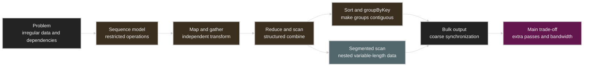

---

## Why Data-Parallel Thinking

GPU에서 peak throughput을 얻는 데 필요한 parallelism은 몇십 개 thread 수준이 아니다.
강의가 예로 든 NVIDIA V100은 80 SM, 5,120 FP32 multiply-add ALU, 최대 5,120 resident
warp를 갖고, slide의 계산으로 163,840 CUDA thread context까지 유지할 수 있다. 정확한
hardware 숫자를 외우는 것이 목적은 아니다. 중요한 것은 latency hiding과 많은 execution
resource를 위해 application이 수십만 개 규모의 independent work를 노출해야 한다는
점이다.

전통적인 접근은 다음 질문으로 시작한다.

```text
thread 0은 어떤 loop iteration을 수행하는가?
thread 1은 어느 lock을 잡는가?
block i가 어떤 data region을 소유하는가?
```

Data-parallel 접근은 질문을 바꾼다.

```text
이 collection 전체를 어떤 sequence로 표현할 수 있는가?
각 element에 독립적으로 적용할 transformation은 무엇인가?
같은 key/destination을 가진 element를 어떻게 묶을 것인가?
group 내부의 values를 어떤 associative operation으로 결합할 것인가?
```

이 전환의 이점은 dependency를 language/library boundary에서 통제할 수 있다는 것이다.
Programmer는 primitive의 semantic contract를 지키고, library는 target CPU, SIMD unit,
GPU 또는 cluster에 맞게 partition과 schedule을 선택한다. 같은 conceptual pipeline이
different machine implementation으로 내려갈 수 있다.

## Sequences as the Programming Interface

강의에서 **sequence**는 ordered collection이다. Set과 달리 order가 있고, C++의
`Sequence<T>`, Scala의 `List[T]`, Pandas DataFrame, functional language의 `seq T`,
NumPy array나 tensor abstraction이 유사한 역할을 한다.

그러나 ordinary array와 sequence abstraction의 중요한 차이는 access discipline이다.
Array를 받은 low-level code는 `A[i]`, `A[j]`처럼 임의의 element를 언제든 읽고 쓸 수
있다. 이 자유는 loop-carried dependency, aliasing, race를 쉽게 만든다. 강의의
sequence model에서는 element를 정해진 operation을 통해서만 접근한다.

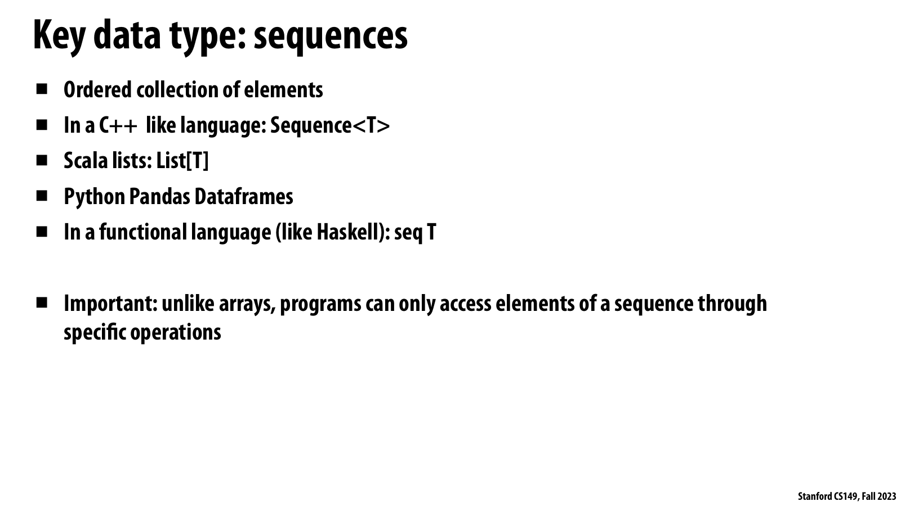

*공식 Lecture 8 slide, PDF p. 7 — sequence를 ordered collection으로 정의하고, element
access를 특정 operation으로 제한하는 핵심 contract를 제시한다.*

**슬라이드가 보여 주는 사실.** 이 페이지는 C++ `Sequence<T>`, Scala `List[T]`, Pandas
DataFrame, functional `seq T`를 같은 ordered-sequence 계열로 묶는다. 마지막 bullet은
ordinary array와 달리 sequence element를 정해진 operation을 통해서만 접근한다는 차이를
명시한다.

**강의 논리에서의 의미.** 이 제한은 단순한 API 취향이 아니라 dependency surface를
줄이는 장치다. Programmer가 임의 index load/store 대신 primitive contract를 따르면
runtime은 element partition, reordering, vectorization이 legal한지 operation 단위로 판단할
수 있다.

**GPU systems 해설.** 이 문단은 슬라이드의 직접 문구가 아니라 systems 관점의 해설이다.
Restricted interface는 race 가능성을 줄이지만 locality를 자동 보장하지는 않는다. 같은
sequence라도 gather index가 흩어져 있거나 temporary를 여러 번 materialize하면 GPU는
충분한 parallelism을 갖고도 HBM transaction과 cache miss에 묶일 수 있다.

| Interface | Programmer can express | Parallelization implication |
| --------- | ---------------------- | --------------------------- |
| Raw array | Arbitrary indexed load/store, alias, shared mutation | Compiler/runtime이 hidden dependency를 증명해야 함 |
| Sequence | `map`, `reduce`, `scan`, `sort` 같은 constrained operation | Operation contract가 legal reordering을 명시 |

Restricted interface는 표현력을 일부 포기하는 대신 implementation freedom을 얻는다.
예를 들어 `map(f, s)`에서 `f`가 input element만 받고 side effect가 없다면, system은
element 0을 element 1보다 먼저 실행할 필요가 없다. 반대로 `f`가 global counter를
갱신하거나 다른 element를 읽는 순간 이 reasoning은 무너진다.

## The Primitive Vocabulary

| Primitive | Input → Output | 핵심 의미 | 대표 parallel issue |
| --------- | -------------- | --------- | ----------------------- |
| `map` | `Seq<A> → Seq<B>` | 각 element에 unary function 적용 | Side effect와 independent iteration |
| `filter` | `Seq<A> → Seq<A>` | Predicate가 true인 element만 compact | Output position 계산에 scan 필요 |
| `fold` | `Seq<A> → B` | 명시된 left-to-right accumulator | General case는 sequential dependency |
| `reduce` | `Seq<A> → A` | Associative operator로 하나의 값 생성 | Tree combine, identity, numerical order |
| `scan` | `Seq<A> → Seq<A>` | 모든 prefix의 partial result 생성 | Work/span, phase synchronization |
| `segmented scan` | Flat data + flags → flat prefixes | 여러 segment scan을 한 번에 수행 | Boundary를 넘지 않는 propagation |
| `gather` | Indices + data → dense output | `out[i] = data[index[i]]` | Irregular read와 locality |
| `scatter` | Indices + data → destination | `out[index[i]] = data[i]` | Duplicate destination과 atomicity |
| `sort` | `Seq<A> → Seq<A>` | Key/order에 따라 재배열 | Multi-pass traffic, algorithm choice |
| `groupByKey` | `Seq<(K,V)> → Seq<(K,Seq<V>)>` | 같은 key의 value를 contiguous group으로 만듦 | Skew와 group boundary |
| `flatten` | `Seq<Seq<A>> → Seq<A>` | Nested sequence를 flat sequence로 변환 | Segment metadata 유지 |
| `partition` | `Seq<A> → Seq<A> × Seq<A>` | Predicate/key에 따라 collection 분리 | Stable ordering, offset construction |
| `join` | keyed sequences → matched records | Key가 같은 records 결합 | Shuffle/sort/hash와 skew |

이 primitive는 완성된 algorithm이 아니라 building block이다. 실제 힘은 여러 operation을
합성하면서 dependency와 synchronization을 bulk phase 사이로 밀어내는 데서 나온다.

## Map: Independent Element Transformation

`map`은 higher-order function이다. Function `f : A → B`와 `Seq<A>`를 받아 같은 길이의
`Seq<B>`를 만든다.

```text
input  = [3, 8, 4, 6, 3, 9, 2, 8]
f(x)   = x + 10
output = [13, 18, 14, 16, 13, 19, 12, 18]
```

Functional notation은 다음과 같다.

```text
map : (A -> B) -> Seq<A> -> Seq<B>
```

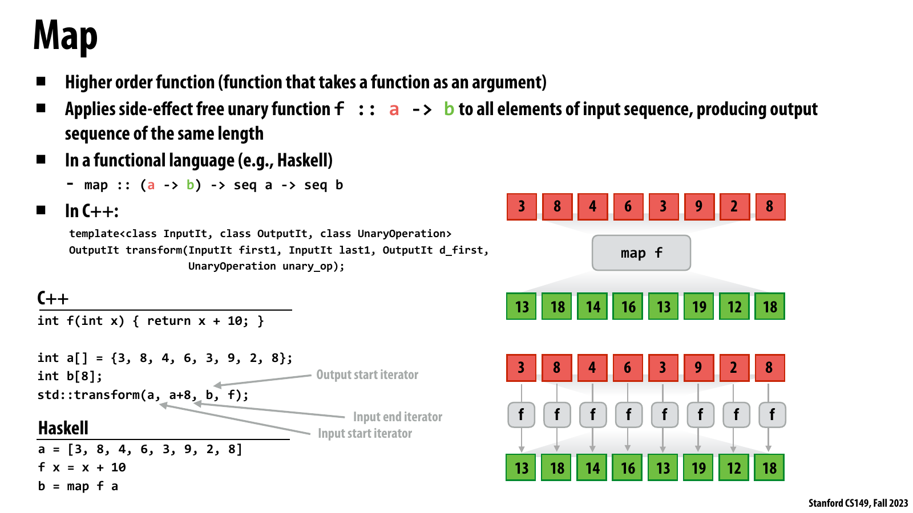

*공식 Lecture 8 slide, PDF p. 8 — higher-order `map`, side-effect-free unary function, 같은
길이의 input/output sequence를 C++, Haskell, element diagram으로 함께 보여 준다.*

**슬라이드가 보여 주는 사실.** `f : a → b`가 input의 모든 element에 적용되고 output은
input과 같은 길이를 갖는다. 오른쪽 diagram에서 각 red input element는 독립된 `f`를 거쳐
green output element 하나를 만들며, 왼쪽에는 C++ `std::transform`과 Haskell `map` 예가
같은 semantics를 표현한다.

**강의 논리에서의 의미.** `map`의 parallelism은 loop syntax가 아니라 side-effect-free
contract에서 나온다. Invocation끼리 shared state를 관찰하거나 변경하지 않으면 evaluation
order와 partition boundary가 result에 영향을 주지 않으므로 implementation이 전체 sequence를
자유롭게 분할할 수 있다.

**GPU systems 해설.** 이 부분은 별도 실무 해설이다. Elementwise kernel은 보통 abundant
parallelism을 제공하지만, function이 작으면 arithmetic throughput보다 input/output traffic이
지배한다. 인접 `map`을 fuse할지는 launch 수가 아니라 줄어드는 HBM bytes와 늘어나는 register
pressure를 함께 측정해 판단해야 한다.

`f`가 side-effect free이고 각 invocation이 오직 자기 input element만 본다면 모든
invocation은 independent하다. Parallel implementation은 sequence를 `P`개 subsequence로
나누고, 각 worker가 local map을 수행한 후 output region을 이어 붙일 수 있다.

```text
partition s into s_0, ..., s_(P-1)
parallel for each p:
    out_p = map(f, s_p)
out = concatenate(out_0, ..., out_(P-1))
```

Idealized cost는 element당 `O(1)`인 function에 대해 다음과 같다.

| Metric | Cost |
| ------ | ---- |
| Work | `O(N)` |
| Span with `N` processors | `O(1)` |
| Time with `P` processors | 약 `O(N/P)` + scheduling/concatenation overhead |
| Extra output space | Out-of-place라면 `O(N)` |

`map`이 쉬운 이유는 programmer가 dependency를 분석하지 않아도 되기 때문이 아니다.
Dependency가 없다는 사실을 `f`의 interface와 side-effect restriction에 이미 encoding했기
때문이다.

## Fold and Reduce: From a Sequence to One Value

`foldLeft`는 initial accumulator와 binary function을 사용해 sequence를 왼쪽에서 오른쪽으로
누적한다.

```text
foldLeft(init, f, [a0, a1, a2, ...])
  = f(f(f(init, a0), a1), a2) ...
```

Type이 `f : (B, A) → B`라면 전체 signature는 다음과 같다.

```text
fold : B -> ((B, A) -> B) -> Seq<A> -> B
```

General fold는 순서를 바꾸면 결과가 달라질 수 있으므로 본질적으로 left-to-right chain을
가질 수 있다. Parallel fold는 sequence partition마다 partial `B`를 만든 뒤, 별도의
`comb : (B, B) → B`로 partials를 합친다.

```text
Seq<A>
  -> P local folds, each returns B
  -> tree combine of P values
  -> one B
```

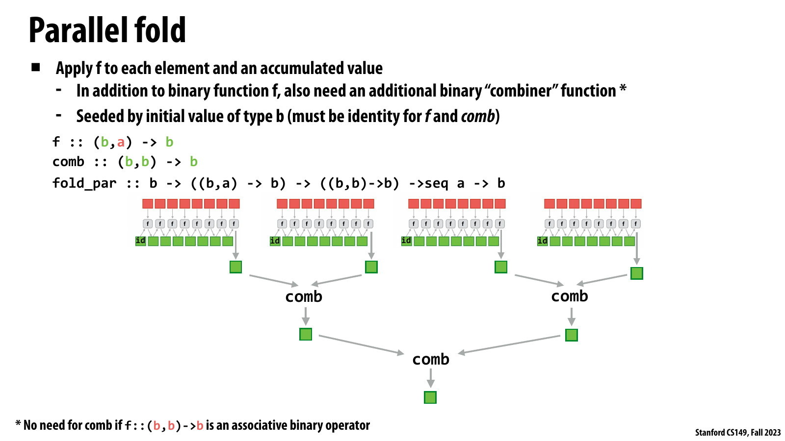

*공식 Lecture 8 slide, PDF p. 11 — partition별 fold와 `comb : (b,b) → b` tree, identity
seed, associative special case를 한 페이지에 정리한다.*

**슬라이드가 보여 주는 사실.** 각 partition은 `f : (b,a) → b`로 local result를 만들고,
별도의 `comb`가 `b` partials를 tree로 합친다. Initial value는 `f`와 `comb`의 identity여야
하며, `f` 자체가 associative `b × b → b` operator라면 별도 combiner가 필요 없다는 주석도
포함한다.

**강의 논리에서의 의미.** General left fold와 reduction의 경계가 여기서 드러난다. 순서가
고정된 accumulator chain을 임의로 tree화할 수는 없고, partial result를 합치는 algebraic
contract가 있어야 parenthesization을 바꾸면서도 같은 의미를 보존할 수 있다.

**GPU systems 해설.** 이 설명은 슬라이드 밖의 실무 연결이다. GPU reduction은 보통
thread-local accumulation, warp combine, block combine, grid-wide final combine으로 내려간다.
Associativity가 없으면 이 계층별 regrouping이 incorrect하고, floating-point addition처럼
수학적으로는 associative해도 bitwise result가 달라지는 경우에는 reproducibility requirement를
따로 정해야 한다.

`A = B`이고 같은 associative operator를 local fold와 combine에 쓸 수 있는 흔한 형태를
보통 **reduction**이라 부른다. Sum, minimum, maximum, logical AND/OR 등이 대표적이다.

| Operation | Output count | Typical parallel structure |
| --------- | ------------ | -------------------------- |
| Fold left | 1 | Ordered chain |
| Parallel fold | 1 | Local fold + combiner tree |
| Reduce | 1 | Associative tree reduction |
| Scan | `N` | 모든 tree prefix를 materialize |

## The Algebraic Contract: Associativity and Identity

Parallel reduction이 correct하려면 grouping을 바꿔도 결과가 같아야 한다. Operator `⊕`가
associative하다는 뜻은 다음과 같다.

```text
(a ⊕ b) ⊕ c = a ⊕ (b ⊕ c)
```

Identity `I`도 필요하다.

```text
I ⊕ a = a
a ⊕ I = a
```

강의가 강조하는 미묘한 점은 **commutativity가 반드시 필요하지 않다**는 것이다.
Implementation이 original element order를 보존한 채 parenthesization만 바꾼다면
associativity로 충분하다. Matrix multiplication은 associative하지만 일반적으로
commutative하지 않은 좋은 예다.

| Property | Needed for | Not enough for |
| -------- | ---------- | -------------- |
| Associativity | Tree regrouping | Arbitrary permutation |
| Commutativity | Arbitrary operand reordering | Identity/empty input 처리 |
| Identity | Empty partition과 tree padding | Operator correctness 자체 |

Floating-point addition은 real-number algebra에서는 associative하지만 finite-precision
arithmetic에서는 bitwise associative하지 않다. 따라서 parallel sum은 sequential sum과
마지막 bits가 달라질 수 있다. 이 강의의 abstract contract와 numerical reproducibility를
구분해야 한다.

## Composition and Fusion

Sequence program은 primitive의 pipeline으로 표현된다.

```text
map(multiply_by_10, input)
  -> reduce(add, mapped_values)
```

Naive implementation은 `map` output을 memory에 쓰고, `reduce`가 다시 읽으므로 두 번의
data pass와 intermediate allocation이 생긴다. System이 두 primitive의 의미를 안다면
`multiply_by_10`을 reduction의 local accumulation 안으로 fuse할 수 있다.

```text
for each local element x:
    partial += 10 * x
```

영상은 modern JIT compiler가 PyTorch 같은 tensor program에서 이와 유사한 transformation을
할 수 있다고 설명한다. Data-parallel abstraction은 parallelism뿐 아니라 fusion,
reordering, tiling 같은 whole-pipeline optimization 기회도 제공한다. 단, fusion은
operation boundary가 제공하던 materialization, ordering, memory visibility가 필요하지
않을 때만 legal하다.

## Scan and Prefix Sum

`scan`은 associative binary operator를 sequence prefix마다 적용해 sequence를 출력한다.

```text
A = [a0, a1, a2, a3, ...]

inclusive_scan(⊕, A)
  = [a0, a0⊕a1, a0⊕a1⊕a2, a0⊕a1⊕a2⊕a3, ...]

exclusive_scan(⊕, I, A)
  = [I, a0, a0⊕a1, a0⊕a1⊕a2, ...]
```

Operator가 addition이면 inclusive scan을 **prefix sum**이라 부른다.

```text
input:            [3, 8, 4, 6, 3, 9, 2, 8]
inclusive sum:    [3,11,15,21,24,33,35,43]
exclusive sum:    [0, 3,11,15,21,24,33,35]
```

Reduction은 마지막 total 하나만 필요하지만 scan은 모든 prefix를 보존한다. Inclusive와
exclusive form은 서로 쉽게 변환할 수 있다. Addition이라면 exclusive output에 current
input을 더해 inclusive output을 얻고, inclusive output을 한 칸 shift하고 identity를
앞에 두면 exclusive output을 얻는다.

Sequential code의 recurrence `out[i] = out[i-1] ⊕ in[i]`만 보면 chain이 길이 `N`이라
병렬화가 불가능해 보인다. 그러나 원하는 result는 특정 evaluation order가 아니라 각
prefix의 associative combination이다. Algorithm을 바꾸면 dependency tree를 만들 수
있다.

## Naive Parallel Scan

첫 parallel formulation은 step `d`에서 각 position `i`가 distance `2^d` 앞의 partial을
받는다. 흔히 Hillis-Steele style scan으로 설명되는 형태다.

```text
for d = 0 .. log2(N)-1:
    parallel for i = 0 .. N-1:
        if i >= 2^d:
            next[i] = current[i - 2^d] ⊕ current[i]
        else:
            next[i] = current[i]
    swap(current, next)
```

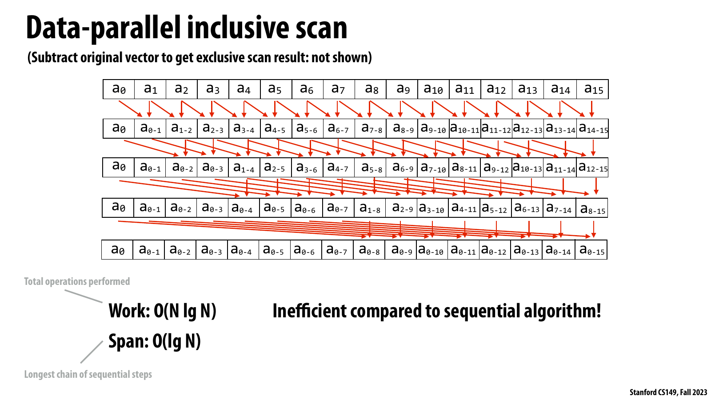

*공식 Lecture 8 slide, PDF p. 15 — 16-element inclusive scan의 four doubling stages와
`Work: O(N lg N)`, `Span: O(lg N)`을 시각화한다.*

**슬라이드가 보여 주는 사실.** 첫 stage는 distance 1, 다음은 2, 4, 8만큼 떨어진 partial을
합치며 각 row가 한 parallel phase다. 마지막 row의 각 cell은 해당 position까지의 prefix를
포함하고, page 하단은 total operations와 longest sequential chain을 각각 work와 span으로
연결한다.

**강의 논리에서의 의미.** Sequential recurrence를 그대로 병렬화한 것이 아니라 associative
prefix의 evaluation graph를 바꿨기 때문에 depth가 `N`에서 `log N`으로 줄었다. 그 대가로
각 phase가 대부분의 positions를 다시 갱신하여 총 work가 `N log N`으로 증가한다.

**GPU systems 해설.** 이 문단은 별도 성능 해설이다. 각 phase가 global array를 읽고 쓰는
식으로 구현되면 operation count뿐 아니라 `log N`회의 memory pass와 synchronization을
지불한다. Warp-local shuffle처럼 phase communication이 register lane 사이에 머무는 경우와
multi-kernel global scan을 같은 cost model로 취급하면 안 된다.

각 phase가 prefix coverage를 두 배로 늘리므로 `log2 N` phases 뒤 모든 prefix가
완성된다.

| Property | Naive parallel scan |
| -------- | ------------------- |
| Work per phase | `O(N)` |
| Number of phases | `O(log N)` |
| Total work | `O(N log N)` |
| Span | `O(log N)` |
| Parallelism `W/S` | `O(N)` |

Span은 크게 줄었지만 sequential scan의 `O(N)` work보다 asymptotically 더 많은 operation을
수행한다. `N` processors가 있고 매 phase의 element operation을 동시에 처리할 수 있을
때는 매력적이지만, processor가 적거나 memory traffic이 비싸면 extra work가 손해가 된다.

## Work-Efficient Scan

Work-efficient exclusive scan은 balanced tree의 두 phase를 사용한다. 보통 Blelloch scan으로
알려진 구조다.

1. **Up-sweep / reduce phase**: Leaf values를 tree 위로 결합해 각 subtree total을 만든다.
2. Root를 identity `I`로 바꾼다.
3. **Down-sweep phase**: Parent prefix를 children에 내려보낸다. Left child는 parent prefix를
   받고, right child는 `parent prefix ⊕ left-subtree total`을 받는다.

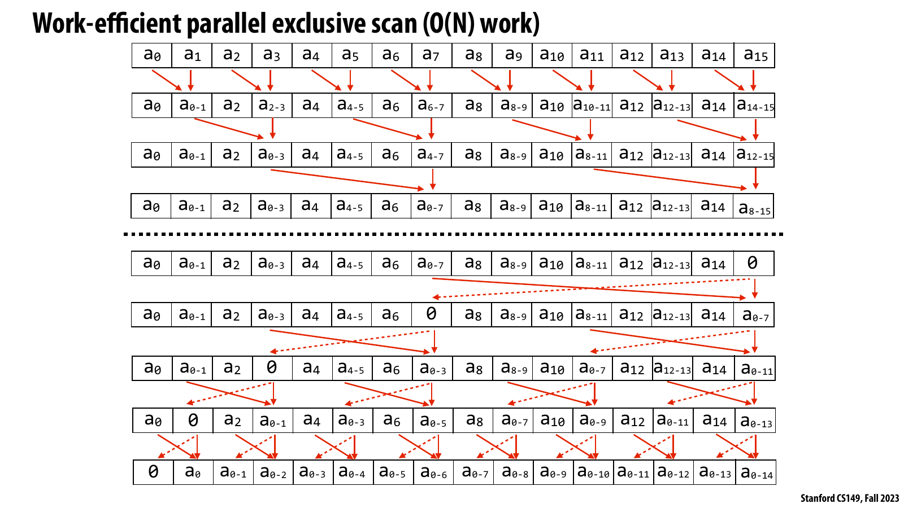

*공식 Lecture 8 slide, PDF p. 16 — 위쪽 up-sweep, root identity 치환, 아래쪽 down-sweep을
거쳐 16-element exclusive prefix가 만들어지는 전체 dataflow를 보여 준다.*

**슬라이드가 보여 주는 사실.** Up-sweep에서는 active combine 수가 level마다 절반으로 줄고,
점선 아래에서는 마지막 total을 identity `0`으로 바꾼 뒤 partial prefix를 양쪽 children으로
내려보낸다. 최종 row가 `[I, a0, a0⊕a1, ...]` 형태인 것은 current element를 포함하지 않는
exclusive scan이기 때문이다.

**강의 논리에서의 의미.** Naive scan이 매 level 거의 모든 positions를 갱신하는 것과 달리,
이 tree는 각 edge를 상수 번만 방문해 linear work를 얻는다. 모든 prefix를 만들기 위해
reduction 결과만 계산하는 up-sweep으로 끝내지 않고 down-sweep이 반드시 필요하다는 점도
그림이 분명히 보여 준다.

**GPU systems 해설.** 이 해설은 슬라이드의 직접 주장과 구분한다. Level이 올라갈수록 active
lanes가 줄어 fixed-width SIMD utilization이 악화될 수 있고, root 근처의 synchronization은
소수의 useful operations 때문에도 필요하다. 그러므로 scalar work 절감이 instruction 수나
wall-clock latency 절감으로 곧바로 이어지는 것은 아니다.

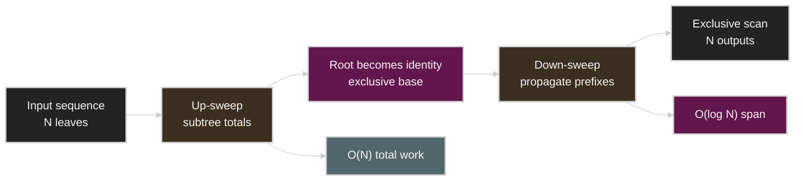

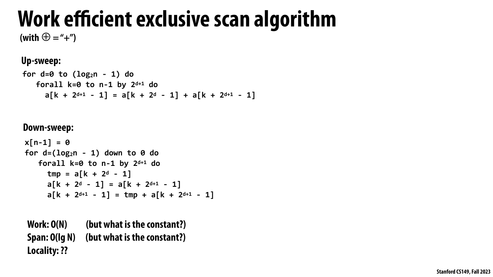

*공식 Lecture 8 slide, PDF p. 17 — up-sweep/down-sweep index update를 pseudocode로 적고
`Work O(N)`, `Span O(lg N)` 뒤에 constant와 locality를 명시적으로 문제로 남긴다.*

**슬라이드가 보여 주는 사실.** 두 loop 모두 tree level을 순회하지만 level별 stride와 active
index 수가 달라진다. Asymptotic 표기는 linear work와 logarithmic span을 주면서도 “constant는
무엇인가?”, “locality는?”이라는 질문을 함께 제시한다.

**강의 논리에서의 의미.** 이 페이지는 algorithm analysis를 Big-O에서 끝내지 말라는 전환점이다.
Work와 span은 necessary comparison axes지만 two-pass structure, barrier 수, sparse active set,
stride pattern은 같은 asymptotic class 안에서도 구현 성능을 바꾼다.

**GPU systems 해설.** 이 부분은 추가 실무 해설이다. GPU에서는 phase별 active-thread ratio,
shared/global memory transactions, synchronization scope를 함께 profile해야 한다. `O(N)`이라는
label만 보고 scan을 compute-bound로 가정하면, 실제 bottleneck인 HBM traffic이나 barrier
latency를 놓칠 수 있다.

Up-sweep의 active operation 수는 대략 `N/2 + N/4 + ... + 1 = N-1`이고, down-sweep도
같은 order의 work를 한다. 따라서 total work는 `O(N)`, span은 두 tree traversal을 합쳐
`O(log N)`이다.

| Property | Work-efficient scan |
| -------- | ------------------- |
| Up-sweep work | `N - 1` combine 정도 |
| Down-sweep work | `N - 1` combine/swap 정도 |
| Total work | `O(N)` with a larger constant than sequential scan |
| Span | 약 `2 log2 N` phases, asymptotically `O(log N)` |
| Utilization | Tree 상단으로 갈수록 active worker 감소 |
| Locality | Tree stride가 커지며 non-contiguous access 가능 |

`O(N)`이라는 표기만 보고 sequential scan과 cost가 같다고 생각하면 안 된다. Up/down 두
phase, barrier, temporary state, tree access pattern의 constant가 있다.

## Work, Span, and Available Parallelism

Parallel algorithm을 비교할 때 강의는 두 값을 구분한다.

```text
Work W = 모든 operation을 합친 총량
Span S = 무한히 많은 processor가 있어도 남는 longest dependency chain
Average parallelism = W / S
```

| Algorithm | Work `W` | Span `S` | Interpretation |
| --------- | -------- | -------- | -------------- |
| Sequential scan | `O(N)` | `O(N)` | Work-efficient, parallelism 거의 없음 |
| Naive parallel scan | `O(N log N)` | `O(log N)` | 많은 work를 써서 짧은 depth 확보 |
| Work-efficient tree scan | `O(N)` | `O(log N)` | Theory상 work와 depth 모두 좋음 |

Brent-style intuition으로 `P` processors에서 time은 적어도 `max(W/P, S)` 정도의 lower
bound를 갖는다. 실제 time에는 memory traffic, synchronization, occupancy, instruction
issue, imbalance가 추가된다. `W`와 `S`만으로 hardware utilization을 완전히 설명할 수는
없다.

## The Best Scan Depends on the Machine

강의의 가장 중요한 systems lesson은 “theoretically best algorithm”과 “fastest mapping”이
같지 않을 수 있다는 것이다.

| Machine regime | Useful strategy | Reason |
| -------------- | --------------- | ------ |
| Few independent CPU cores | Contiguous chunk마다 sequential scan 후 bases 적용 | Cache locality와 낮은 constant |
| One SIMD group/warp | 모든 lane이 참여하는 iterative-doubling scan | `log N` vector instructions, 높은 lane utilization |
| One CUDA block | Per-warp scan + warp-total scan + base add | Warp와 shared-memory hierarchy 활용 |
| Large GPU grid | Per-block scan + block totals scan + per-block base add | Grid-wide dependency를 kernel phases로 분리 |
| Distributed cluster | Local partition scan + distributed prefix of partition totals | Network communication을 작은 summaries에 집중 |

Algorithm은 machine hierarchy의 각 level에서 heterogeneous할 수 있다. Warp 안에서는
work-inefficient scan, block 사이에서는 tree 또는 sequential scan, CPU에서는 long
sequential chunks를 결합할 수 있다. “같은 scan algorithm을 모든 level에 반복”하는 것이
목표가 아니라, 각 level의 execution width와 communication cost에 맞추는 것이 목표다.

## Two-Core Shared-Memory Scan

16 elements와 two cores를 예로 들면 다음처럼 구현할 수 있다.

1. Processor 0이 `[0, 7]`, processor 1이 `[8, 15]`를 contiguous하게 sequential scan한다.
2. Processor 0의 마지막 total을 `base`로 얻는다.
3. Processor 1의 local output 전부에 `base`를 병렬로 더한다.

이 방식의 total work는 local scans `N`과 second half base add `N/2`를 합쳐 약 `1.5N`이다.
Tree scan보다 span은 크지만 memory access가 sequential하고 spatial locality가 좋다.
Shared memory에서는 한 partition total을 다른 core가 읽는 communication도 상대적으로
작다.

큰 NUMA system이라면 다른 socket의 output half에 base를 적용하는 access가 더 비쌀 수
있다. 즉 “shared address space”가 “uniform access cost”를 뜻하지는 않는다.

## SIMD and Warp-Level Scan

32-wide CUDA warp가 32 elements를 scan한다고 하자. 각 lane은 distance 1, 2, 4, 8, 16의
partial을 차례로 더한다.

```text
for offset in [1, 2, 4, 8, 16]:
    if lane >= offset:
        value = value_from_lane(lane - offset) ⊕ value
```

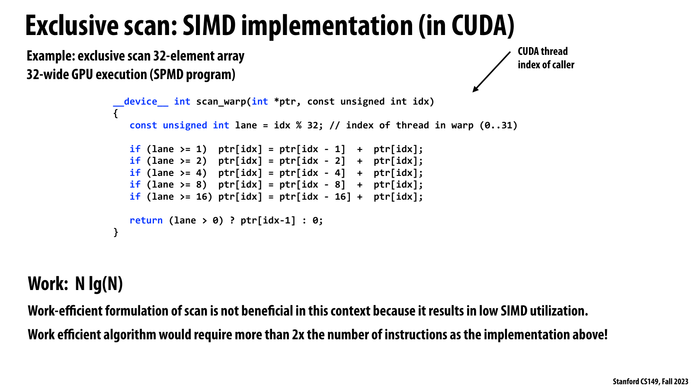

*공식 Lecture 8 slide, PDF p. 21 — 32-element warp scan을 five offset steps로 구현하고,
`N lg N` work라도 work-efficient tree보다 SIMD instruction 수가 적을 수 있음을 설명한다.*

**슬라이드가 보여 주는 사실.** Lane index가 1, 2, 4, 8, 16 이상일 때 앞선 partial을 더하는
다섯 conditional statements가 전체 warp에 발행된다. Page 하단은 work-efficient formulation이
이 context에서 낮은 SIMD utilization을 만들고, 제시된 구현보다 2배 넘는 instruction이 필요할
수 있다고 명시한다.

**강의 논리에서의 의미.** Work는 scalar operations의 총합이고, SIMD machine의 elapsed
instruction depth와 같지 않다. Fixed-width warp가 어차피 한 instruction을 모든 lanes에
issue한다면 naive doubling의 extra scalar additions가 이미 지불한 vector instruction 안에
흡수될 수 있다.

**GPU systems 해설.** 이 문단은 현대 구현을 위한 별도 해설이다. 슬라이드의 pointer-based
예시는 warp-synchronous 개념을 설명하기 위한 것이며 실제 kernel에서는 shuffle, shared-memory
layout, compiler code generation을 함께 확인해야 한다. 선택 기준은 이름이 “work-efficient”인지가
아니라 instruction count, active lanes, synchronization, data-movement의 측정 결과다.

Scalar operation count로는 `O(N log N)`이다. 그러나 warp가 lockstep SIMD로 instruction을
실행하면 elapsed instruction depth는 다섯 add/shuffle steps다. Work-efficient scan은
up-sweep 다섯 steps와 down-sweep 다섯 steps가 필요하고, 각 level의 active lane이
줄어든다. 이 context에서는 fewer total scalar operations보다 fewer SIMD instructions와
lane utilization이 더 중요할 수 있다.

여기서 나오는 일반 원칙은 다음과 같다.

> Work efficiency는 중요하지만 단독 목표가 아니다. Hardware가 어차피 fixed-width
> vector instruction을 issue한다면 inactive lane을 늘려 scalar work를 줄이는 것이
> latency나 energy를 줄이지 못할 수 있다.

실제 CUDA 구현은 shared memory보다 warp shuffle instruction을 사용할 수도 있다. 강의의
핵심은 특정 syntax가 아니라 warp-local communication이 cheap하고 synchronous execution
width가 algorithm choice를 바꾼다는 점이다.

## Hierarchical CUDA Scan

큰 scan은 machine hierarchy와 같은 hierarchy로 쪼갠다. 128 elements와 four warps라면:

1. Four warps가 각각 32-element scan을 병렬로 수행한다.
2. 각 warp의 total 네 개를 warp 0이 scan해 per-warp bases를 만든다.
3. 각 warp가 자신의 local result에 base를 더한다.

한 block보다 큰 array는 다시 세 단계가 된다.

```text
Kernel 1: each block scans its local tile and writes block total
Kernel 2: scan the sequence of block totals
Kernel 3: add the corresponding block base to every local output
```

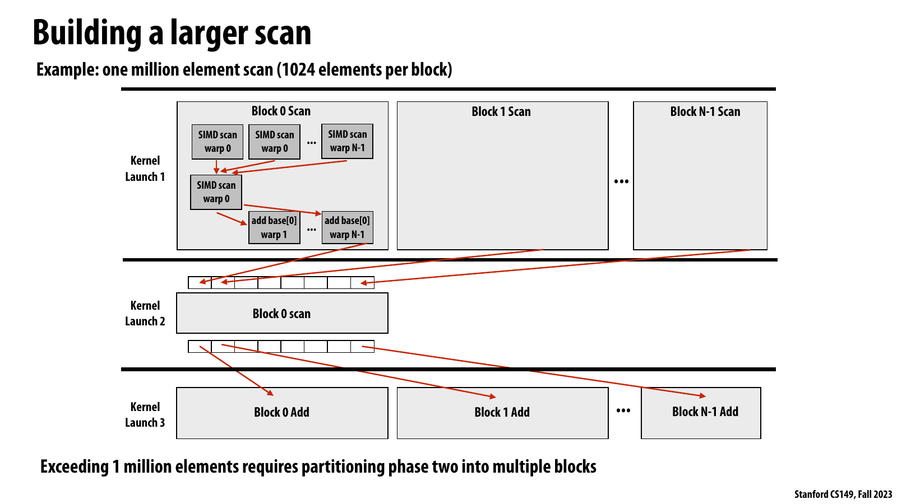

*공식 Lecture 8 slide, PDF p. 24 — one-million-element scan을 per-block local scan, block
totals scan, per-block base add의 세 kernel launch로 분해한다.*

**슬라이드가 보여 주는 사실.** Kernel 1 안에서도 warp scans와 warp-total scan, base add가
중첩되고, 각 block은 global sequence의 local total을 남긴다. Kernel 2가 그 totals의 prefix를
만든 뒤 Kernel 3가 각 block 전체에 해당 base를 더하며, totals가 한 block을 넘으면 phase 2도
다시 partition해야 한다고 적혀 있다.

**강의 논리에서의 의미.** Scan의 dependency를 없애는 것이 아니라 communication volume이 작은
summary sequence로 압축해 더 높은 hierarchy에 전달한다. Warp, block, grid마다 다른 algorithm과
synchronization mechanism을 쓸 수 있다는 heterogeneity가 large scan의 핵심이다.

**GPU systems 해설.** 이 설명은 별도 correctness/performance 연결이다. Ordinary
`__syncthreads()`는 한 block만 동기화하므로 block totals가 준비되기 전에 다른 block이 읽지
않도록 kernel boundary나 적법한 grid synchronization이 필요하다. 세 launches는 ordering을
명확히 하지만 block-total traffic과 launch latency를 추가하므로 tile size와 recursion depth를
실측해야 한다.

Block totals가 한 block에 들어가지 않을 정도로 많으면 phase 2 자체를 recursively
partition한다. 이 구조의 의미는 단순한 recursion보다 크다.

* Warp level: SIMD-friendly algorithm과 register/shuffle communication
* Block level: Shared memory와 `__syncthreads()`를 이용한 cooperation
* Grid level: Kernel boundary 또는 별도 synchronization mechanism
* Memory hierarchy: Local tile access를 우선하고 global traffic을 summaries로 제한

Efficient scan은 가능한 모든 parallelism을 무조건 쓰지 않는다. Machine을 채울 만큼만
parallelism을 쓰고, 그 이후에는 work, communication, synchronization, locality를 줄이는
것이 더 중요하다.

## Segmented Scan

Segmented scan은 여러 contiguous segment에 scan을 동시에 적용한다.

```text
nested input = [[1, 2], [6], [1, 2, 3, 4]]
exclusive segmented sum
             = [[0, 1], [0], [0, 1, 3, 6]]
```

Nested object를 pointer-rich list of lists로 둘 필요는 없다. Flat `data`와 새 segment가
시작되는 위치를 표시하는 `flags`로 encode할 수 있다.

```text
nested = [[1,2,3], [4,5,6,7,8]]
data   = [ 1,2,3,   4,5,6,7,8 ]
flags  = [ 1,0,0,   1,0,0,0,0 ]
```

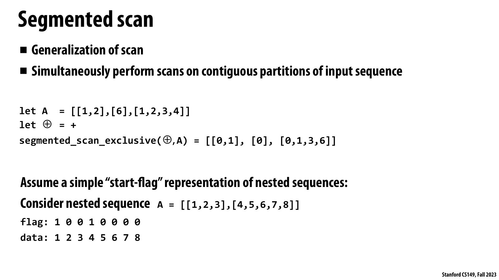

*공식 Lecture 8 slide, PDF p. 28 — segmented scan 정의, exclusive-sum 예시, nested
sequence의 `flag`/`data` flattening을 한 화면에 제시한다.*

**슬라이드가 보여 주는 사실.** `[[1,2],[6],[1,2,3,4]]`의 exclusive segmented sum은
`[[0,1],[0],[0,1,3,6]]`처럼 각 segment 시작에서 identity로 reset된다. 아래 예시는
`[[1,2,3],[4,5,6,7,8]]`를 flat data `1..8`과 start flags `1 0 0 1 0 0 0 0`으로 encode한다.

**강의 논리에서의 의미.** Variable-length nested structure를 pointer-rich outer loop로 실행하는
대신 total elements 하나의 regular sequence로 바꾸면서 logical boundary는 flag에 남긴다.
Parallel combine이 start flag를 넘지 않게 정의되면 scan machinery를 여러 unequal segments에
동시에 재사용할 수 있다.

**GPU systems 해설.** 이 문단은 별도 실무 해설이다. Flattening은 work granularity를 row나
object 수가 아니라 total elements로 낮춰 load balance를 개선하지만, boundary metadata와
output offsets를 보존해야 한다. Empty segments, 매우 긴 hot segment, flag traffic은 별도의
correctness와 tail-latency 문제이므로 input distribution까지 profile해야 한다.

Parallel scan의 partial을 전파할 때 segment-start flag를 만나면 왼쪽 segment의 value를
넘기지 않는다. Flag도 tree를 따라 OR로 전파해 subtree 안에 boundary가 있는지를 추적할
수 있다. Work-efficient scan을 이 lifted state에 적용하면 total work `O(N)`, span
`O(log N)`의 segmented scan을 만들 수 있다.

Conceptually pair `(value, flag)`에 대한 combine을 정의할 수 있다.

```text
(x, fx) combine (y, fy) =
    (y,           true)  if fy is true
    (x ⊕ y, fx OR fy)    otherwise
```

실제 exclusive down-sweep에서는 original start flags도 필요하다. 어느 output position이
segment의 첫 element인지 알아야 그 prefix를 identity로 reset할 수 있기 때문이다.

## Turning Irregular Nested Data into Regular Work

Segmented scan이 필요한 전형적 shape는 다음과 같다.

```text
for each vertex v:
    for each edge e adjacent to v:
        ...

for each particle p:
    for each neighbor q of p:
        ...

for each document d:
    for each word w in d:
        ...
```

Outer sequence length만큼 worker를 만들면 inner sequence length가 크게 다를 때 load
imbalance가 생긴다. Outer length가 10,000이고 각 item에 평균 20 elements가 있으면,
GPU가 원하는 parallelism은 outer 10,000보다 flat 200,000 elements 쪽에 가깝다.

Flattened representation은 다음 장점을 준다.

* Parallelism이 group 수가 아니라 total element 수에 비례한다.
* Contiguous arrays를 사용해 pointer chasing을 줄일 수 있다.
* Segment flags/offsets만으로 logical nesting을 보존한다.
* 하나의 segmented primitive가 unequal group lengths를 처리한다.

대신 flags 또는 offsets를 저장해야 하고, output을 다시 grouped form으로 해석할 metadata가
필요하다. 매우 긴 segment 하나가 대부분의 data를 차지하면 flat representation만으로
모든 skew가 사라지는 것도 아니다.

## Sparse Matrix-Vector Multiplication

Sparse matrix-vector multiplication `y = A x`는 segmented scan의 대표 example이다.
강의는 matrix의 대부분이 zero인 경우 **compressed sparse row (CSR)** representation을
사용한다.

```text
values     = 모든 nonzero values를 row-major로 flat하게 저장
cols       = 각 nonzero의 column index
row_starts = 각 row가 values/cols에서 시작하는 offset
```

각 row의 dot product를 하나의 worker에 주면 row별 nonzero count 차이 때문에 imbalance가
생기고 parallelism이 row 수에 제한된다. Data-parallel pipeline은 nonzero 하나를 unit of
work로 사용한다.

```mermaid
%%{init: {"theme": "base", "themeVariables": {"background": "#171717", "primaryColor": "#232323", "primaryTextColor": "#f5f5f5", "primaryBorderColor": "#d0d0d0", "lineColor": "#cfcfcf", "fontFamily": "Inter, Arial, sans-serif"}}}%%
flowchart LR
    C[CSR values and cols<br/>plus dense x] --> G[Gather<br/>x at cols]
    G --> M[Map multiply<br/>one product per nonzero]
    M --> F[Create row flags<br/>from row offsets]
    F --> S[Segmented scan<br/>sum within each row]
    S --> T[Take segment tails<br/>dense output y]

    classDef primary fill:#232323,stroke:#d0d0d0,color:#f5f5f5,stroke-width:2px;
    classDef secondary fill:#3b2f20,stroke:#d0d0d0,color:#f5f5f5,stroke-width:2px;
    classDef note fill:#52676b,stroke:#d0d0d0,color:#f5f5f5,stroke-width:2px;
    classDef accent fill:#62164d,stroke:#d0d0d0,color:#f5f5f5,stroke-width:2px;
    class C,T primary
    class G,M,F secondary
    class S accent
```

단계별 의미는 다음과 같다.

1. `gather(x, cols)`로 각 nonzero가 곱할 vector element를 dense sequence로 만든다.
2. `map(multiply, values, gathered_x)`로 모든 nonzero product를 병렬 계산한다.
3. `row_starts`에서 segment-start flags를 만든다.
4. Products에 addition segmented scan을 수행한다.
5. 각 segment의 마지막 prefix를 선택해 output `y[row]`를 만든다.

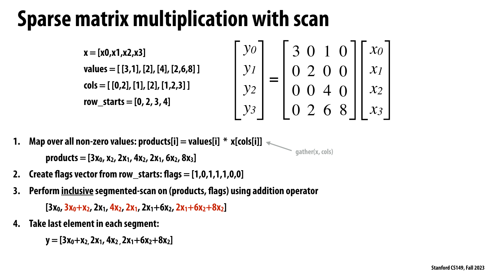

*공식 Lecture 8 slide, PDF p. 32 — CSR `values`, `cols`, `row_starts`에서 products와
flags를 만들고 segmented scan의 segment tails로 `y = Ax`를 얻는 네 단계를 전개한다.*

**슬라이드가 보여 주는 사실.** 각 nonzero는 `values[i] * x[cols[i]]` product 하나를 만들고,
row starts는 `[1,0,1,1,1,0,0]` 같은 flags가 된다. Addition segmented scan 후 각 segment의
last element만 취하면 네 row의 dot products가 dense output vector가 된다.

**강의 논리에서의 의미.** Row마다 한 worker를 두는 formulation에서 벗어나 `nnz`개의 products를
work units로 노출한다. Irregular row lengths는 segment metadata로 이동하고, arithmetic은
regular map과 boundary-aware scan이라는 reusable primitives로 표현된다.

**GPU systems 해설.** 이 부분은 별도 성능 해설이다. `x[cols[i]]` gather는 cache/coalescing에
민감하고, products나 flags를 모두 materialize하면 `O(nnz)` HBM traffic이 추가된다. Library
pipeline은 correctness baseline으로 유용하지만 실제 SpMV에서는 gather-multiply와 row reduction을
fuse했을 때의 bytes, row-length skew, register pressure를 함께 비교해야 한다.

Parallelism이 row count가 아니라 total nonzeros `nnz`에 비례한다는 점이 핵심이다. 반면
explicit gathered vector를 materialize하면 `O(nnz)` temporary와 extra bandwidth가
생긴다. Low-level fused kernel은 gather와 multiply를 한 operation 안에서 수행할 수 있다.

## Gather and Scatter

`gather`와 `scatter`는 irregular data movement를 명시하는 기본 operation이다.

```text
gather:
    output[i] = input[index[i]]

scatter:
    output[index[i]] = input[i]
```

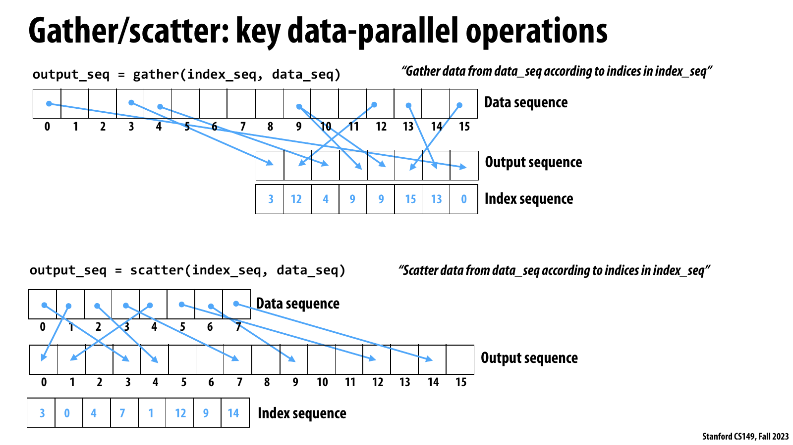

*공식 Lecture 8 slide, PDF p. 35 — gather가 indexed sources를 dense output으로 읽어 오고,
scatter가 dense inputs를 indexed destinations로 보내는 반대 방향의 data movement를 그린다.*

**슬라이드가 보여 주는 사실.** 위 diagram의 index sequence는 output position마다 읽을 source를
지정하므로 같은 source가 여러 번 등장해도 된다. 아래 diagram은 input element마다 destination
index 하나를 지정하며, page의 example은 destinations가 겹치지 않는 permutation-like scatter를
사용한다.

**강의 논리에서의 의미.** Gather는 read fan-out이라 duplicate index가 correctness conflict를
만들지 않지만, scatter는 write fan-in이 될 수 있어 unique-index contract가 중요하다. 같은
primitive vocabulary 안에서도 access direction이 synchronization requirement를 바꾼다.

**GPU systems 해설.** 이 해설은 슬라이드 그림을 넘어선 performance 연결이다. 두 operation
모두 lane별 address가 흩어지면 memory coalescing과 cache locality가 나빠진다. Scatter의
duplicate destinations는 여기에 lost update 위험까지 더하므로 atomics, owner partitioning,
또는 sort/group/reduce 중 어떤 비용이 작은지 key distribution별로 측정해야 한다.

Gather는 arbitrary source locations에서 dense output 순서로 값을 모은다. Scatter는 dense
input을 arbitrary destination locations에 놓는다.

| Operation | Conflict | Main performance risk |
| --------- | -------- | --------------------- |
| Gather | 여러 reader가 같은 source를 읽어도 correctness 문제 없음 | Cache-line/page divergence, uncoalesced read |
| Scatter with unique indices | Write conflict 없음 | Uncoalesced/random write |
| Scatter with duplicate indices | 같은 destination을 여러 writer가 갱신 | Lost update, atomicity, serialization |

강의 당시의 hardware example에서 AVX2는 SIMD gather를 지원했지만 SIMD scatter는 없고,
AVX-512에는 scatter가 있다. GPU에도 hardware-supported gather/scatter 형태가 있지만
contiguous vector load/store보다 비싸다. 한 warp의 lanes가 서로 다른 cache line이나 page를
요구하면 memory transaction과 latency가 늘어난다.

Scatter indices가 unique하고 destination 전체를 정확히 한 번씩 cover한다면 scatter는
permutation이다. 이 special case에서는 `(index, value)` pairs를 index로 sort해 output
order를 얻는 방식으로 바꿀 수 있다.

## From Scatter Conflicts to Sort and Segmented Reduction

원하는 operation이 다음과 같은 atomic scatter update라고 하자.

```text
parallel for i:
    output[index[i]] = op(output[index[i]], input[i])
```

Duplicate indices가 있으면 fine-grained atomic이 필요하다. 이를 bulk primitives로 바꾸는
방법은 다음과 같다.

1. `(index[i], input[i])` pairs를 index 기준으로 sort한다.
2. Sorted index에서 `i == 0` 또는 `index[i] != index[i-1]`인 위치를 segment start로
   표시한다.
3. 각 equal-index range에 `op` segmented scan/reduction을 수행한다.
4. 각 segment의 final result를 해당 unique destination에 한 번 write한다.

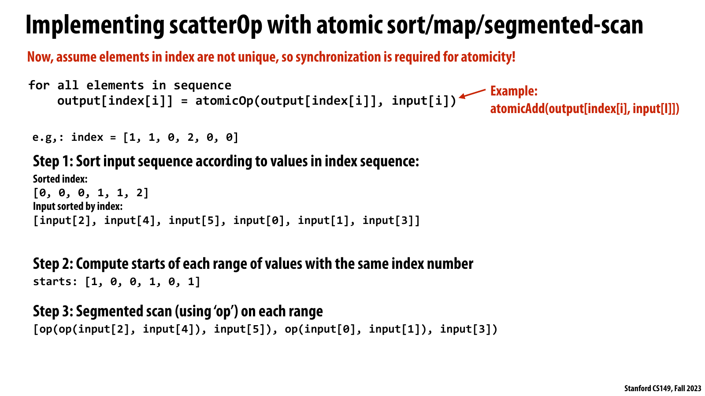

*공식 Lecture 8 slide, PDF p. 38 — non-unique destination 때문에 필요한 atomic scatterOp를
sort, equal-index start detection, segmented scan의 세 bulk 단계로 변환한다.*

**슬라이드가 보여 주는 사실.** Example indices `[1,1,0,2,0,0]`는 destination 0과 1에서
충돌한다. Index 순으로 pairs를 정렬하면 `[0,0,0,1,1,2]`가 되고, starts
`[1,0,0,1,0,1]`가 three independent ranges를 표시하며 각 range 안에서 `op`를 scan한다.

**강의 논리에서의 의미.** Fine-grained atomicity 문제를 없애는 핵심은 equal destinations를
contiguous하게 만들어 ownership을 segment 단위로 바꾸는 것이다. Sort와 boundary map이
irregular write conflicts를 regular phases 사이의 coarse synchronization으로 옮긴다.

**GPU systems 해설.** 이 부분은 별도 trade-off 해설이다. Transformation은 operator가
적절히 associative해야 하고 non-commutative operator라면 equal-key 내부 order까지 보존해야
correct하다. Low-contention 또는 mostly-unique input에서는 sort passes가 atomics보다 비쌀 수
있고, hot-key skew가 심할 때는 grouped reduction이 serialization과 write traffic을 줄일 수 있다.

```text
index  = [1, 1, 0, 2, 0, 0]
sorted = [0, 0, 0, 1, 1, 2]
starts = [1, 0, 0, 1, 0, 1]

values become three independent segments:
key 0 -> [input[2], input[4], input[5]]
key 1 -> [input[0], input[1]]
key 2 -> [input[3]]
```

이 transformation은 many contending atomics를 sort와 a few bulk passes로 바꾼다. 항상
더 빠른 것은 아니다. Contention이 거의 없고 atomic이 cheap하면 sort cost가 과도하다.
반대로 hot key가 많고 같은 destination에 수천 thread가 몰리면 group-first approach가
synchronization을 크게 줄일 수 있다.

## GroupByKey, Filter, Sort, and Related Primitives

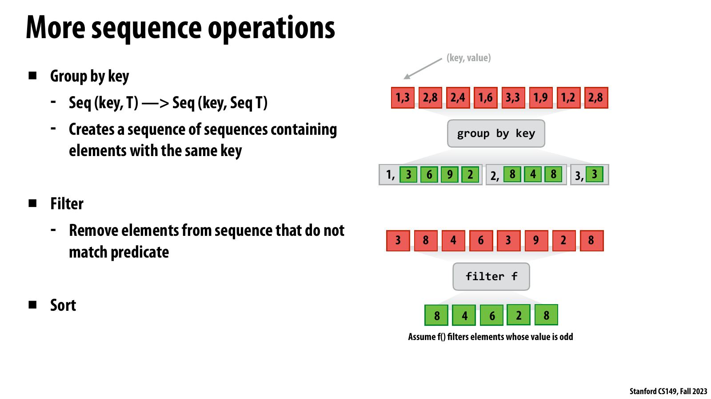

*공식 Lecture 8 slide, PDF p. 39 — `(key, value)` sequence의 `group by key`, odd-value
predicate를 적용한 `filter`, 그리고 `sort`를 후반부 primitive vocabulary로 소개한다.*

**슬라이드가 보여 주는 사실.** `groupByKey`는 interleaved pairs를 key 1, 2, 3의 logical
subsequences로 묶고, `filter`는 `[3,8,4,6,3,9,2,8]`에서 odd values를 제거해
`[8,4,6,2,8]`을 남긴다. Sort는 이들과 함께 sequence를 재구성하는 기본 operation으로
열거된다.

**강의 논리에서의 의미.** Map/reduce/scan이 element transformation과 combination을 담당한다면,
이 primitives는 어떤 elements가 함께 처리될지를 재배열한다. 특히 sort로 equal keys를
contiguous하게 만들면 group boundary를 detect하고 segmented operation을 적용할 수 있어
scatter conflict 처리와 particle grid가 같은 pattern으로 연결된다.

**GPU systems 해설.** 이 문단은 추가 실무 해설이다. `groupByKey`의 logical nested output을
실제로 list-of-lists로 materialize할 필요는 없고 flat values와 offsets로 유지할 수 있다.
Stable order requirement, key width, skew, temporary workspace, sort pass 수가 HBM traffic과
determinism을 좌우하므로 API semantics와 performance target을 함께 정해야 한다.

### GroupByKey

`groupByKey`의 conceptual type은 다음과 같다.

```text
Seq<(K, V)> -> Seq<(K, Seq<V>)>
```

같은 key의 values를 하나의 subsequence로 묶는다. Sort-based implementation은 pairs를
key로 sort한 뒤 adjacent key change를 detect해 segment offsets를 만든다. Output은
flat values와 offsets로 유지할 수 있다.

```text
[(1,3),(2,8),(2,4),(1,6),(3,3),(1,9),(1,2),(2,8)]

groupByKey
  1 -> [3,6,9,2]
  2 -> [8,4,8]
  3 -> [3]
```

### Filter

`filter(predicate, s)`는 predicate가 false인 elements를 제거한다. Parallel implementation의
전형적인 구조는 다음과 같다.

```text
flags   = map(predicate, s)          // 0 or 1
offsets = exclusive_scan(+, flags)   // compacted destination positions
scatter kept elements to offsets
```

즉 scan은 단순한 prefix sum example를 넘어 stream compaction의 핵심 building block이다.

### Sort, Partition, Flatten, and Join

* `sort`는 equal keys를 contiguous하게 만들어 segmented operation을 가능하게 한다.
* `partition`은 predicate 또는 key range로 sequence를 나누며 routing에 쓰인다.
* `flatten`은 nested sequences를 one-dimensional work set으로 바꾸고 offsets로 structure를
  보존한다.
* `join`은 two keyed collections의 matching records를 연결하며 sort/merge 또는 hash
  strategy를 사용할 수 있다.

이들 operation은 database, graph analytics, distributed data processing에서도 같은
vocabulary로 나타난다. 영상은 NVIDIA Thrust와 Apache Spark RDD를 서로 다른 hardware
scale에서 같은 data-parallel idea를 사용하는 예로 든다.

## Case Study: Building a Particle Grid

문제는 2D space에 있는 one million particles를 4×4, 즉 16-cell uniform grid에 넣는
것이다. Output은 각 cell에 속하는 particle IDs의 list다.

```text
cell 0 -> [particle IDs ...]
cell 1 -> [particle IDs ...]
...
cell 15 -> [particle IDs ...]
```

이 structure는 N-body나 particle simulation에서 nearby interaction을 찾는 데 유용하다.
Cell size를 interaction radius `R`에 맞추면 한 particle의 force를 계산할 때 모든 particles가
아니라 주변 cells만 조사할 수 있다.

Input particles는 매우 많지만 output cells는 16개뿐이다. Particle마다 parallel thread를
만들기는 쉽지만 shared lists에 append하는 순간 contention이 생긴다. 반대로 cell마다
parallel task를 만들면 ownership은 깨끗하지만 task가 16개뿐이고 each task가 모든
particles를 검사하면 work가 폭증한다.

## Five Particle-Grid Strategies

### 1. Global Lock

```text
parallel for each particle p:
    c = cell_of(p)
    lock(global_lock)
    append p to cell_list[c]
    unlock(global_lock)
```

Logical tasks는 `N`개지만 critical section은 하나라 effective parallelism이 거의 1로
collapse한다. Lock acquisition order도 nondeterministic list order를 만든다.

### 2. Per-Cell Locks

Global lock을 16개 cell lock으로 나누면 uniformly distributed particles라는 가정 아래
contention을 대략 16-way로 분산할 수 있다. 그러나 100,000 threads가 16 locks에 몰리는
상황에서는 여전히 심각하다. Particle distribution이 skewed하면 hot cell 하나가 다시
global bottleneck처럼 동작한다.

### 3. Parallelize over Cells

각 cell이 자신의 output list를 독점하고 모든 particles를 검사한다.

```text
parallel for each cell c:
    for each particle p:
        if cell_of(p) == c:
            append p to cell_list[c]
```

Synchronization은 없어지지만 parallel tasks가 `C=16`개뿐이고 total membership test는
`O(NC)`다. 원래의 `O(N)` classification보다 16배 work가 많으며, `C`가 커지면 더 나빠진다.

### 4. Replicated Partial Grids and Merge

`K` worker groups 또는 CUDA blocks가 각자 private 16-cell grid를 만들고, 끝에 `K` grids를
merge한다. Contention은 약 `K`배 줄고 block-local shared memory synchronization을 사용할
수 있다. 대가로 `O(KC)` metadata/storage와 final merge work가 생긴다. `K`가 hardware
parallelism만큼 커지면 replication cost도 커진다.

### 5. Data-Parallel Sort-and-Boundary Pipeline

Data-parallel solution은 list append 자체를 없앤다.

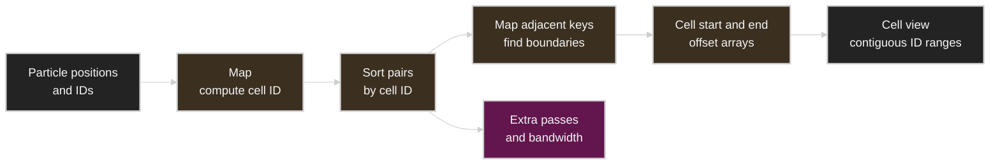

1. Particle마다 `cell_id = cell_of(position)`을 map한다.
2. `(cell_id, particle_id)` pairs를 `cell_id`로 sort한다. Particle IDs도 같은 permutation을
   따라간다.
3. Sorted `cell_id`의 adjacent elements를 비교해 각 cell의 first/last offset을 병렬로
   기록한다.
4. 한 cell의 particle list는 sorted `particle_id[cell_start:cell_end]`라는 contiguous
   range가 된다.

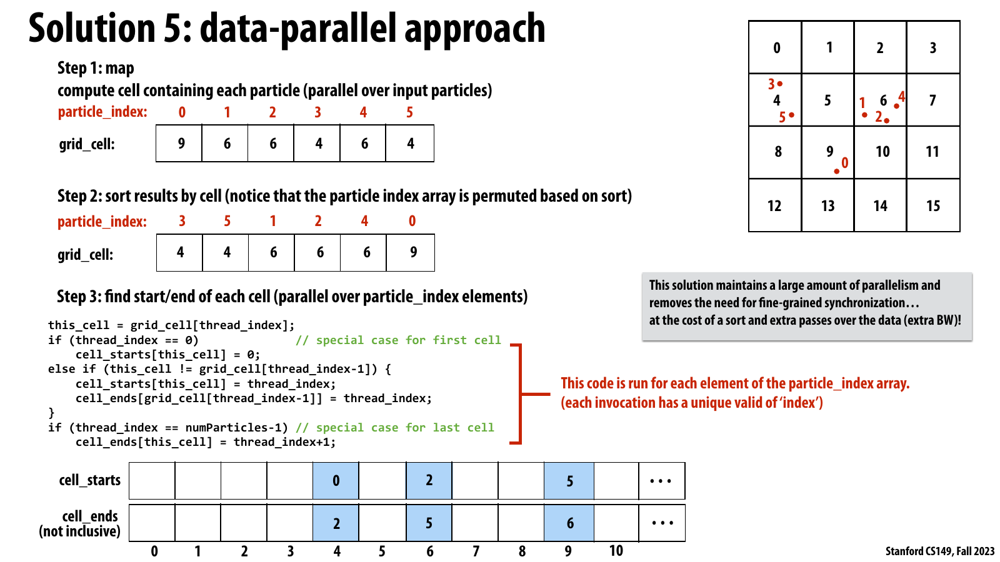

*공식 Lecture 8 slide, PDF p. 46 — particle별 cell map, `(cell, particle)` sort, adjacent
cell boundary detection으로 contiguous cell ranges를 만드는 complete particle-grid solution을
보여 준다.*

**슬라이드가 보여 주는 사실.** Six particles가 cell IDs `[9,6,6,4,6,4]`로 map되고, sort 후
particle IDs는 `[3,5,1,2,4,0]`, cells는 `[4,4,6,6,6,9]`가 된다. Parallel boundary code는
cell 4, 6, 9의 start/end offsets를 각각 `[0,2)`, `[2,5)`, `[5,6)`으로 기록한다.

**강의 논리에서의 의미.** Shared cell list에 particle threads가 append하던 problem을
classification, permutation, boundary detection이라는 sequence pipeline으로 바꾼다. Exposed
parallelism은 16 cells가 아니라 particle 수에 비례하고, fine-grained locks는 primitive
boundaries의 coarse synchronization으로 대체된다.

**GPU systems 해설.** 마지막 gray callout이 밝히듯 이 trade-off는 슬라이드에도 명시되어
있다. Parallelism과 synchronization behavior는 좋아지지만 sort와 extra full-data passes가
bandwidth를 소비한다. 실제 선택은 particle count만이 아니라 cell skew, radix key size,
temporary bytes, atomic contention, downstream neighbor traversal의 locality까지 end-to-end로
비교해야 한다.

이 algorithm의 parallelism은 cell 수가 아니라 particle 수에 비례한다. Fine-grained
lock이 없고 synchronization은 primitive boundaries에만 있다. 그러나 sort와 multiple
full-array passes가 추가 bandwidth를 소비한다.

| Strategy | Exposed parallelism | Work | Synchronization | Extra memory |
| -------- | ------------------- | ---- | --------------- | ------------ |
| Global lock | `N`, but serialized at lock | `O(N)` | One hot lock | Small |
| Per-cell lock | `N`, limited by active cells | `O(N)` | `C` contended locks | `O(C)` locks |
| Parallel over cells | `C` | `O(NC)` | None during build | Small |
| `K` partial grids | Up to `N` within groups | `O(N)` + merge | Local locks + merge phase | `O(KC)` + lists |
| Map/sort/boundary | `N` | Map `O(N)` + sort + `O(N)` boundary pass | Coarse primitive boundaries | `O(N)` temporaries |

## Parallel Histogram

Histogram은 input value를 bin ID로 mapping하고 bin count를 증가시키는 scatter-reduction이다.

```text
for x in input:
    histogram[bin_of(x)] += 1
```

Direct parallelization은 duplicate destination에 atomic increment를 요구한다. Slides의
data-parallel alternative는 다음과 같다.

1. `map(bin_of, input)`으로 `bin_ids`를 만든다.
2. `bin_ids`를 sort한다.
3. Adjacent bin ID가 바뀌는 위치를 찾아 `bin_starts`를 만든다.
4. 각 output bin이 다음 non-empty bin start와 자신의 start 차이를 계산해 size를 얻는다.
5. Empty bin은 count 0으로 처리하고, last non-empty bin은 `N - start`를 사용한다.

Grouped run length를 구하는 문제이므로 particle-grid boundary construction과 거의 같다.
다만 empty bins 때문에 “다음 index”가 바로 다음 non-empty segment가 아닐 수 있다.
Segmented reduction으로 each group의 ones를 더하는 표현도 가능하다.

영상에서는 이 상세 code를 모두 설명하지 않고, histogram slides가 reference용이며 empty-bin
edge case에 주의하라고 말한다. 따라서 실제 구현에서는 `NUM_BINS`가 크고 sparse할 때
forward search가 반복되어 비효율적인지 따로 확인해야 한다.

## Algorithm and Complexity Reference

아래 표의 span은 충분한 processor와 unit-cost associative operation을 가정한 theoretical
depth다. 실제 GPU kernel time과 동일하지 않다.

| Primitive/algorithm | Work | Span | Main requirement | Main practical cost |
| ------------------- | ---- | ---- | ---------------- | ------------------- |
| `map` | `O(N)` | `O(1)` ideal | Independent, side-effect-free `f` | Read/write bandwidth |
| Sequential fold/scan | `O(N)` | `O(N)` | Ordered recurrence | Limited parallelism |
| Tree reduce | `O(N)` | `O(log N)` | Associative operator, identity | Synchronization and partial storage |
| Naive/Hillis-Steele scan | `O(N log N)` | `O(log N)` | Associative operator | Extra work and phase traffic |
| Blelloch scan | `O(N)` | `O(log N)` | Associative operator, identity | Two sweeps, falling utilization |
| Two-core chunked scan | 약 `1.5N` | `O(N/2)` | Shared base visibility | NUMA access if partitions are remote |
| Warp iterative scan | `O(N log N)` scalar work | `O(log N)` SIMD steps | Fixed-width synchronized group | Lane masks/shuffles |
| Hierarchical GPU scan | `O(N)` target | `O(log N)` per hierarchy | Multiple sync scopes | Kernel launches, block totals |
| Segmented scan | `O(N)` | `O(log N)` | Boundary-aware associative combine | Flag/offset metadata |
| CSR SpMV pipeline | `O(nnz)` plus primitive overhead | Data dependent | CSR metadata, row segments | Irregular gather and bandwidth |
| Sort-based groupBy | Sort-dependent + `O(N)` | Sort-dependent | Comparable/radix key | Extra passes and temporary storage |
| Cell-parallel particle grid | `O(NC)` | 약 `O(N)` per cell | Exclusive cell ownership | Redundant classification |
| Sort-based particle grid | `O(N)` + sort | Sort-dependent | Sortable cell IDs | Bandwidth and temporary pairs |

강의의 scan example이 주는 세 가지 evaluation axis는 다음과 같다.

1. **Parallelism**: Machine execution resources를 채울 만큼 있는가?
2. **Locality**: Access가 contiguous하고 hierarchy-local한가?
3. **Heterogeneous strategy**: Warp, block, core, node마다 적절한 algorithm을 선택했는가?

## GPU Systems Lens

이 절과 이어지는 Practical Tips는 Lecture 8의 concepts를 GPU/AI data center system에
적용한 추가 노트다. 강의 영상이나 슬라이드의 직접 주장으로 간주하지 않는다.

| Lecture 8 concept | GPU/AI systems interpretation |
| ----------------- | ----------------------------- |
| Sequence | Token list, tensor elements, sparse nonzeros, requests, experts로 가는 routed items |
| `map` | Elementwise activation, normalization substep, token preprocessing |
| Reduction | Loss/statistics, dot product, gradient norm, collective partial combine |
| Prefix sum/scan | Stream compaction offsets, variable-length buffer allocation, radix-sort offsets |
| Segmented scan | Ragged batches, CSR/graph rows, per-sequence token prefixes |
| `gather` | Embedding lookup, KV-cache indirection, sparse feature fetch |
| `scatter` | Gradient accumulation, expert output restore, indexed update |
| `groupByKey` | MoE token routing, request bucketing, sparse destination grouping |
| Sort-based conflict removal | Contended atomics를 destination-wise bulk reduction으로 변경 |
| Hierarchical scan | Lane → warp → block → device → multi-GPU hierarchy |
| Fusion | Intermediate tensor materialization과 HBM traffic 감소 |

### Memory bandwidth is the tax on regularization

Data-parallel rewrite는 irregular control과 synchronization을 줄이는 대신 temporary arrays와
extra passes를 만드는 경우가 많다. GPU에서 arithmetic intensity가 낮은 map, scan, sort,
gather pipeline은 compute throughput보다 HBM bandwidth에 의해 제한될 수 있다. 강의 첫
slide의 단서인 “bandwidth bound를 피할 수 있다면”이 여기서 중요하다.

End-to-end bytes를 대략 계산해야 한다.

```text
bytes moved = input reads + temporary writes + temporary reads + output writes
effective bandwidth = bytes moved / elapsed time
```

Operation count가 줄어도 temporary materialization이 늘면 느려질 수 있고, 반대로 fusion으로
HBM round trip 하나를 없애면 arithmetic optimization보다 큰 효과를 낼 수 있다.

### Scan under GPU synchronization scopes

Warp-level scan은 shuffle/register communication, block-level scan은 shared memory와
`__syncthreads()`, grid-level scan은 kernel boundary나 지원되는 cooperative mechanism을
사용한다. `__syncthreads()`는 grid 전체 barrier가 아니다. One-million-element scan의
block totals를 같은 ordinary kernel 안에서 모든 blocks가 안전하게 읽을 수 있다고
가정하면 deadlock 또는 race가 생길 수 있다.

### MoE routing as groupByKey

Mixture-of-Experts routing은 `(expert_id, token_payload)` pairs를 만든 뒤 같은 expert로 가는
tokens를 묶는 문제로 볼 수 있다.

```text
map: token -> expert_id
group/count: expert별 token 수
exclusive scan: expert buffer offsets
scatter: tokens into expert-contiguous buffers
all-to-all: destination ranks로 전송
```

이 pipeline은 fine-grained remote sends를 large contiguous messages로 바꾼다. 대신 expert
skew가 segment length와 message size imbalance를 만든다. Parallelism의 존재와 balanced
goodput은 다른 문제다.

### Embedding and sparse workloads

Embedding lookup은 대규모 gather이고 embedding gradient update는 duplicate indices가 많은
scatter-reduction이다. Unique index 비율이 높으면 direct atomics가 유리할 수 있고, hot
IDs가 반복되면 sort/group/reduce 후 write-back이 contention을 낮출 수 있다. 선택은
vocabulary size가 아니라 batch 내 key frequency distribution과 memory traffic으로 해야
한다.

### Distributed scan and collective hierarchy

여러 GPU 또는 nodes에 partition된 sequence의 scan은 local scan, partition totals의
collective prefix, local base add로 나눌 수 있다. 이는 block-level hierarchical scan과
구조적으로 같다. 차이는 partition total communication이 NVLink, PCIe, NIC를 건너며
latency와 topology cost가 훨씬 커진다는 점이다.

## Practical Tips and Notes

### Primitive pipeline마다 bytes를 계산하기

Kernel 수만 세지 말고 각 intermediate의 size와 read/write 횟수를 적는다.

```text
map -> sort -> boundary map -> scatter
```

위 pipeline이 `N` records를 몇 번 HBM에서 읽고 쓰는지, sort가 몇 pass인지, key와 payload를
함께 이동하는지 측정한다. Nsight Compute의 DRAM throughput과 achieved occupancy를 함께
보면 bandwidth-bound인지 latency/occupancy-bound인지 구분하기 쉽다.

> [!TIP]
> 먼저 library primitive로 correct baseline을 만들고, profiler에서 intermediate traffic이
> bottleneck으로 확인된 adjacent operations만 fuse한다. 모든 primitive를 처음부터 custom
> mega-kernel로 합치면 correctness와 tuning surface가 급격히 커진다.

### Associativity contract를 test로 만들기

Custom reduction operator는 random triples `(a,b,c)`에 대해 다음을 property test한다.

```text
op(op(a,b),c) ~= op(a,op(b,c))
op(identity,a) ~= a
op(a,identity) ~= a
```

Floating point라면 exact equality가 아니라 domain-specific tolerance를 사용하고 NaN,
Inf, overflow도 포함한다. Operator가 associative하지 않으면 deterministic tree를 고정해도
sequential semantics와 같아지는 것은 아니다.

### Inclusive와 exclusive scan을 API boundary에서 확인하기

Off-by-one bug의 흔한 원인은 scan variant 혼동이다. Small hand-worked vector와 empty,
one-element case를 golden test로 둔다.

| Input | Inclusive sum | Exclusive sum |
| ----- | ------------- | ------------- |
| `[]` | `[]` | `[]` |
| `[5]` | `[5]` | `[0]` |
| `[3,8,4]` | `[3,11,15]` | `[0,3,11]` |

### Segment metadata의 invariant를 검사하기

Start flags를 쓰면 first flag가 1인지, offsets를 쓰면 monotonic하고 range 안에 있는지,
last offset이 element count와 일치하는지 검사한다. Empty segment를 허용하면 flags만으로는
연속한 empty segments를 직접 표현하기 어려울 수 있으므로 offset representation이 더
명확하다.

### Atomics와 sort/group의 crossover를 benchmark하기

다음 input distributions를 따로 측정한다.

* Uniform random keys
* One hot key가 대부분을 차지하는 skew
* 이미 key-sorted input
* 거의 모든 key가 unique인 input
* Small key domain과 large key domain

Atomics는 low contention에서 매우 효율적일 수 있다. Sort/group는 high contention을
coalesce하지만 fixed multi-pass cost가 있다. 평균만 보면 crossover를 놓친다.

### Load balance를 segment count가 아니라 length distribution으로 보기

`num_segments`가 충분해도 한 segment가 total elements의 절반을 차지하면 tail이 생긴다.
다음을 기록한다.

```text
min / median / p95 / max segment length
largest segment / total elements
worker or block completion-time spread
```

긴 segment는 block-level cooperative processing, hierarchical split, 또는 별도 kernel로
분리할 수 있다.

### Correctness와 stable order를 분리하기

`groupByKey`가 같은 key 안의 original order를 보존해야 하는지 specification에 적는다.
Stable sort는 deterministic order를 주지만 더 비싸거나 temporary memory가 더 필요할 수
있다. Order가 의미 없으면 불필요한 stability를 요구하지 않는다.

### Temporary allocation을 steady-state 측정에서 제거하기

Scan/sort libraries는 workspace size query와 caller-provided temporary storage를 지원하는
경우가 많다. 매 iteration allocator call을 포함하면 primitive 성능이 아니라 allocation
path를 측정할 수 있다. Buffer를 reuse하되 stream/lifetime dependency는 event로 보존한다.

### Fusion 전후를 end-to-end로 비교하기

Fusion은 intermediate traffic과 launch overhead를 줄이지만 register pressure가 늘어
occupancy를 떨어뜨릴 수 있다. Kernel-only latency뿐 아니라 complete pipeline time,
HBM bytes, register count, occupancy, numerical output을 함께 비교한다.

> [!WARNING]
> “더 적은 kernel launches”가 자동으로 “더 빠른 pipeline”을 뜻하지 않는다. Fused kernel의
> register spill이나 reduced occupancy가 saved launch/memory cost보다 클 수 있다.

### Quick Reference

| Symptom | First check |
| ------- | ----------- |
| Map pipeline이 peak FLOPS와 멀다 | Arithmetic intensity와 HBM bytes |
| Scan이 `O(N)`인데 예상보다 느리다 | Phase count, active lanes, global/shared traffic |
| Warp scan을 work-efficient하게 바꾼 뒤 느려졌다 | SIMD instruction count와 lane utilization |
| Segmented workload의 tail이 길다 | Maximum segment length와 skew |
| Scatter result가 run마다 다르다 | Duplicate indices와 non-atomic update |
| Atomics가 bottleneck이다 | Key frequency, hot destinations, local aggregation |
| Sort-based rewrite가 느리다 | Unique-key ratio와 sort/temp bandwidth |
| `groupByKey` output order가 달라졌다 | Stable ordering requirement |
| Multi-block scan이 간헐적으로 틀린다 | Grid-wide phase ordering과 block-total visibility |
| MoE all-to-all 일부 rank만 늦다 | Expert skew, per-rank routed bytes, padding/capacity |
| CSR kernel utilization이 낮다 | Row-length distribution, `nnz` balance, gather locality |
| Histogram의 빈 bin 값이 이상하다 | Empty-bin boundary and sentinel handling |

## Lecture Summary

이번 강의는 parallel algorithm을 thread body가 아니라 operations on sequences의 합성으로
생각하는 관점을 제시했다. Sequence는 arbitrary access를 제한해 dependency를 operation
contract 안에 가둔다. `map`의 side-effect-free function은 element order를 자유롭게 하고,
associative operator와 identity는 reduction과 scan을 tree로 재구성할 수 있게 한다.

Scan은 이 관점의 핵심 example다. 모든 prefix가 이전 prefix에 의존하는 sequential code도
associativity를 이용하면 `O(log N)` span을 얻는다. Naive scan은 `O(N log N)` work,
work-efficient scan은 `O(N)` work를 사용한다. 그러나 warp에서는 extra scalar work가
fixed-width SIMD instruction 안에 흡수되어 naive formulation이 더 빠를 수 있다. Two-core
CPU에서는 contiguous sequential chunks가, large GPU에서는 warp/block/grid hierarchy가 더
적합하다.

Segmented scan은 nested irregular structure를 flat data와 boundaries로 표현한다. CSR SpMV는
nonzeros에 대해 gather, map, segmented scan을 수행함으로써 parallelism을 rows가 아니라
`nnz`에 비례하게 만든다. Gather/scatter는 irregular movement를 명시하고, duplicate scatter
destination은 atomicity problem을 드러낸다.

Sort와 boundary detection은 equal keys를 contiguous하게 만들어 groupByKey, scatter
reduction, particle grid, histogram을 regular bulk operations로 바꾼다. Fine-grained locks와
atomics를 줄이는 대신 sort, temporary storage, multiple passes라는 비용을 지불한다. 따라서
data-parallel rewrite의 최종 평가는 exposed parallelism뿐 아니라 work, span, locality,
synchronization, bandwidth를 모두 포함해야 한다.

최종적으로 기억할 다섯 문장은 다음과 같다.

* Dependency가 없는 곳이 parallelism의 근원이며, restricted primitive는 그 사실을
  interface에 encode한다.
* Associativity와 identity는 parallel reduce/scan의 correctness contract다.
* Work-efficient가 항상 hardware-efficient인 것은 아니다.
* Segmentation과 sorting은 irregular data를 regular parallel phases로 바꾸는 강력한 도구다.
* Fine-grained synchronization을 없앤 대가가 extra bandwidth인지 반드시 측정해야 한다.

## Key Terms

| Term | Meaning |
| ---- | ------- |
| Data-parallel thinking | Algorithm을 large collection에 대한 bulk operations로 표현하는 관점 |
| Sequence | Ordered collection whose elements are accessed through defined operations |
| Higher-order function | 다른 function을 argument로 받거나 result로 내는 function |
| Side effect | Return value 외에 shared/external state를 읽거나 바꾸는 observable effect |
| `map` | Unary function을 모든 elements에 적용해 같은 길이 output sequence를 만드는 operation |
| Fold | Initial accumulator와 binary function으로 sequence를 ordered하게 하나의 value로 만드는 operation |
| Reduction | Associative combine으로 sequence를 one value로 줄이는 parallel-friendly operation |
| Associativity | Parenthesization을 바꿔도 결과가 같은 property |
| Commutativity | Operand order를 바꿔도 결과가 같은 property |
| Identity | Operator에 결합해도 상대 operand를 바꾸지 않는 neutral element |
| Scan | 모든 prefixes의 accumulated results를 출력하는 operation |
| Inclusive scan | Current element를 포함한 prefix result를 output하는 scan |
| Exclusive scan | Current element 직전까지의 prefix result를 output하는 scan |
| Prefix sum | Addition operator를 사용하는 scan |
| Work | Parallel algorithm이 수행하는 total operations |
| Span | Longest sequential dependency chain, 또는 critical-path length |
| Work-efficient | Best sequential algorithm과 같은 asymptotic work를 수행하는 property |
| Up-sweep | Tree 아래에서 위로 subtree totals를 계산하는 scan phase |
| Down-sweep | Root prefix를 children 방향으로 전파하는 scan phase |
| Segmented scan | Contiguous segments 각각에 scan을 동시에 적용하는 generalized scan |
| Start flag | Flat sequence에서 새 segment 시작을 나타내는 bit/boolean metadata |
| CSR | Nonzeros, column indices, row offsets로 sparse matrix를 저장하는 compressed sparse row format |
| `gather` | Index sequence가 가리키는 source values를 dense output으로 모으는 operation |
| `scatter` | Input values를 index sequence가 가리키는 destinations에 배치하는 operation |
| `scatterOp` | Destination의 old value와 scattered value를 operator로 결합하는 indexed update |
| `groupByKey` | Equal-key values를 logical subsequences로 묶는 operation |
| Stream compaction | Predicate를 통과한 elements만 contiguous output으로 압축하는 operation |
| Fusion | Adjacent operations를 합쳐 intermediate materialization과 passes를 줄이는 transformation |
| Fine-grained synchronization | Individual item/update 단위 lock, atomic, coordination |
| Coarse-grained synchronization | Bulk primitive 또는 phase boundary 단위 coordination |
| Key skew | 일부 keys/segments에 data가 집중되어 load imbalance와 contention이 생기는 현상 |

## Questions

1. Data-parallel thinking은 thread-centric programming과 무엇이 다른가?
2. Sequence가 ordinary array보다 parallelization freedom을 더 줄 수 있는 이유는 무엇인가?
3. `map`의 function이 side-effect free여야 하는 이유는 무엇인가?
4. `map : (A → B) → Seq<A> → Seq<B>`에서 input과 output length의 관계는 무엇인가?
5. General `foldLeft`를 항상 parallelize할 수 없는 이유는 무엇인가?
6. Parallel fold에서 local fold function 외에 combiner가 필요한 경우는 언제인가?
7. Associativity와 commutativity는 어떻게 다르며, order-preserving tree reduction에는 어느
   것이 필요한가?
8. Identity는 empty partition을 처리할 때 어떤 역할을 하는가?
9. `map` 다음 `reduce`를 fuse하면 어떤 memory cost를 줄일 수 있는가?
10. Inclusive scan과 exclusive scan의 차이는 무엇인가?
11. Addition scan이 prefix sum이라 불리는 이유는 무엇인가?
12. Naive parallel scan의 work와 span은 각각 얼마인가?
13. Work-efficient scan의 두 phase는 무엇이며 각각 무엇을 계산하는가?
14. `W/S`는 무엇을 근사하는가?
15. `O(N)` work scan이 warp에서 `O(N log N)` work scan보다 느릴 수 있는 이유는 무엇인가?
16. Two-core scan이 tree 전체를 그대로 mapping하는 대신 contiguous halves를 쓰는 이유는
   무엇인가?
17. Large GPU array scan의 three-kernel structure를 설명하라.
18. `__syncthreads()`만으로 여러 CUDA blocks의 scan phase를 연결할 수 없는 이유는 무엇인가?
19. Segmented scan은 nested sequences를 어떤 두 arrays로 표현할 수 있는가?
20. Segment boundary를 넘어 partial value가 전파되지 않게 하려면 어떤 state가 필요한가?
21. CSR SpMV에서 parallelism을 row 수가 아니라 `nnz`에 비례하게 만드는 pipeline은
   무엇인가?
22. Gather와 scatter의 memory-access 방향은 어떻게 다른가?
23. Duplicate scatter indices가 correctness problem을 만드는 이유는 무엇인가?
24. Atomic scatterOp를 sort와 segmented reduction으로 바꾸는 단계를 설명하라.
25. `filter` implementation에서 prefix sum은 어떤 역할을 하는가?
26. `groupByKey`를 sort 기반으로 구현할 때 group boundaries는 어떻게 찾는가?
27. Particle-grid global lock solution은 logical parallelism이 많아도 왜 scale하지 않는가?
28. Cell-parallel particle-grid solution의 work가 `O(NC)`인 이유는 무엇인가?
29. Replicated partial grids가 줄이는 비용과 새로 만드는 비용은 무엇인가?
30. Data-parallel particle-grid solution의 세 핵심 primitives와 주된 trade-off는 무엇인가?
31. Histogram에서 empty bin이 boundary-based size calculation을 어렵게 하는 이유는 무엇인가?
32. Data-parallel rewrite가 fine-grained synchronization을 줄이면서 bandwidth-bound가 될 수
   있는 이유는 무엇인가?

## Answers

1. Thread-centric programming은 worker별 control flow와 synchronization을 직접 설계한다.
   Data-parallel thinking은 collection 전체에 적용되는 restricted bulk operations로
   algorithm을 표현하고 mapping/scheduling freedom을 implementation에 준다.
2. Sequence element를 정의된 operations를 통해서만 접근하게 하면 arbitrary indexed
   dependency와 aliasing이 줄고, operation contract가 legal reordering을 알려 주기
   때문이다.
3. 한 invocation이 shared state나 다른 element에 영향을 주면 element execution order가
   result를 바꿀 수 있어 independent partition과 reordering이 안전하지 않기 때문이다.
4. Output은 input과 같은 number of elements를 갖고, element type은 `A`에서 `B`로 바뀔 수
   있다.
5. Arbitrary accumulator function은 grouping이나 evaluation order가 바뀔 때 다른 result를
   낼 수 있어 left-to-right dependency chain을 보존해야 하기 때문이다.
6. Local partition이 `B`를 출력하지만 original `f`의 type이 `(B,A)→B`라 partial `B` 두
   개를 직접 결합할 수 없을 때 `(B,B)→B` combiner가 필요하다.
7. Associativity는 parentheses/grouping 변경을 허용하고, commutativity는 operand order
   변경을 허용한다. Original order를 보존한 tree regrouping에는 associativity가
   필요하고 commutativity는 필수가 아니다.
8. Work가 없는 partition도 neutral partial을 생성하게 하고, tree를 padding하거나 empty
   input을 처리할 수 있게 한다.
9. Intermediate sequence의 write와 read, allocation을 줄여 memory bandwidth와 launch
   overhead를 낮출 수 있다.
10. Inclusive scan의 `out[i]`는 `in[i]`를 포함하고, exclusive scan의 `out[i]`는
    `in[i]` 직전까지만 포함한다.
11. 각 output이 input의 시작부터 현재 위치까지의 sum, 즉 prefix의 sum이기 때문이다.
12. 각 `log N` phase가 `O(N)` work를 하므로 work는 `O(N log N)`, longest phase chain은
    `O(log N)`이다.
13. Up-sweep은 subtree totals를 계산하고, down-sweep은 root identity에서 시작해 각 leaf의
    exclusive prefix를 전파한다.
14. Algorithm이 평균적으로 제공하는 available parallelism의 scale을 근사한다.
15. Warp는 한 SIMD instruction으로 모든 lanes의 operations를 수행한다. Work-efficient
    algorithm은 inactive lanes가 많고 up/down 두 traversal이 필요해 scalar work는 적어도
    SIMD instruction count는 더 많을 수 있다.
16. Contiguous sequential scans는 cache locality가 높고 constant가 작다. Two cores만 있을
    때 tree의 theoretical parallelism 대부분은 사용할 수 없기 때문이다.
17. 각 block이 local tile을 scan하고 block total을 기록한 뒤, block totals를 scan하고,
    마지막 kernel이 각 block output에 해당 base를 더한다.
18. `__syncthreads()`의 scope는 한 block뿐이고 다른 blocks의 completion이나 memory
    visibility를 grid-wide하게 보장하지 않기 때문이다.
19. Flat `data` array와 segment-start `flags`, 또는 equivalent start `offsets`로 표현한다.
20. Partial value와 함께 boundary 존재를 나타내는 flag를 combine하고, exclusive result의
    reset을 위해 original segment-start 정보도 보존해야 한다.
21. `gather(x, cols) → map(values * gathered_x) → row-wise segmented scan → segment-tail
    selection`이다.
22. Gather는 여러 indexed source locations에서 ordered output으로 읽고, scatter는 ordered
    input을 indexed destination locations로 쓴다.
23. 여러 workers가 같은 old destination value를 읽고 독립적으로 update한 뒤 서로의 store를
    덮을 수 있기 때문이다.
24. Pairs를 destination index로 sort하고, adjacent key changes로 segments를 표시하고,
    segment마다 operator reduction/scan을 수행한 뒤 final result를 destination당 한 번
    write한다.
25. Predicate flags의 exclusive prefix가 각 kept element의 unique compacted output offset을
    계산한다.
26. Sorted keys에서 first element 또는 previous key와 다른 element를 segment start로
    표시한다.
27. 모든 particle tasks가 하나의 critical section에 모여 append를 직렬화하기 때문이다.
28. `C`개 cells 각각이 `N` particles 전체를 검사하므로 membership tests가 `N×C`번
    수행되기 때문이다.
29. Private grids는 global contention과 synchronization scope를 줄이지만 `K` copies의
    memory, local synchronization, final merge work를 추가한다.
30. `map(cell ID)`, `sort by cell`, `map(boundary detection)`이 핵심이다. Parallelism과
    coarse synchronization을 얻는 대신 sort와 extra full-data passes의 bandwidth를
    지불한다.
31. Empty bin에는 start offset이 없으므로 size를 `next_start - current_start`로 계산할 때
    바로 다음 bin이 아니라 다음 non-empty bin 또는 end sentinel을 찾아야 하기 때문이다.
32. Lock/atomic 대신 sort, scan, temporary materialization을 사용하면 regular parallelism은
    늘지만 같은 large sequence를 여러 번 읽고 써야 하기 때문이다.
