# Lecture 9: Distributed Data-Parallel Computing Using Spark

Source: [Stanford CS149 2023 Lecture 9](https://www.youtube.com/watch?v=jaMWmLq422U)

Course materials:

* [Official lecture page](https://gfxcourses.stanford.edu/cs149/fall23/lecture/spark/)
* [Lecture 9 slides PDF](https://gfxcourses.stanford.edu/cs149/fall23content/media/spark/09_spark.pdf)
* [CS149 Fall 2023 course page](https://gfxcourses.stanford.edu/cs149/fall23)

> 이 노트는 77분 54초 분량의 공식 영상 transcript와 57쪽 공식 슬라이드를 함께
> 조사해 재구성했다. 영상은 `01:17:47`에 narrow/wide dependency를 소개하다 끝나므로,
> `PartitionBy()`, lineage 기반 recovery, Spark performance, COST, modern Spark
> ecosystem은 공식 슬라이드의 후반부를 근거로 보완했다. 강의 당시의 bandwidth,
> capacity, benchmark 수치는 개념을 설명하기 위한 2023년 강의 자료의 값이며 현재
> hardware 사양이나 모든 Spark workload의 보편적 성능으로 읽으면 안 된다.

> [!NOTE]
> 슬라이드 캡처는 공식 PDF의 792×612 pt letter-page 비율을 유지해 1165×900 px로
> render한 뒤, crop이나 stretch 없이 1600×900 px white canvas 중앙에 letterbox했다.

## Table of Contents

* [Goal](#goal)
* [Lecture Overview](#lecture-overview)
* [Visual Map](#visual-map)
* [Why a Cluster Changes the Programming Problem](#why-a-cluster-changes-the-programming-problem)
* [Warehouse-Scale Computer Anatomy](#warehouse-scale-computer-anatomy)
* [Separate Address Spaces and Message Passing](#separate-address-spaces-and-message-passing)
* [Persistent Data in a Distributed File System](#persistent-data-in-a-distributed-file-system)
* [The CS149 Page-View Example](#the-cs149-page-view-example)
* [Functional Data-Parallel Operations](#functional-data-parallel-operations)
* [MapReduce Is Map-GroupByKey-Reduce](#mapreduce-is-map-groupbykey-reduce)
* [Producer-Consumer Locality: Move Computation to Data](#producer-consumer-locality-move-computation-to-data)
* [Shuffle and Reducer Placement](#shuffle-and-reducer-placement)
* [Scheduling at Cluster Scale](#scheduling-at-cluster-scale)
* [Failure Recovery and Stragglers in MapReduce](#failure-recovery-and-stragglers-in-mapreduce)
* [Why MapReduce Is Not Enough](#why-mapreduce-is-not-enough)
* [Why Spark Keeps Intermediate Data in Memory](#why-spark-keeps-intermediate-data-in-memory)
* [Resilient Distributed Dataset](#resilient-distributed-dataset)
* [Lineage, Transformations, and Actions](#lineage-transformations-and-actions)
* [Persisting Reused RDDs](#persisting-reused-rdds)
* [RDD Partitions and Physical Placement](#rdd-partitions-and-physical-placement)
* [Producer-Consumer Locality Through Fusion](#producer-consumer-locality-through-fusion)
* [Narrow Dependencies](#narrow-dependencies)
* [Wide Dependencies and Shuffle Boundaries](#wide-dependencies-and-shuffle-boundaries)
* [Partitioning Determines Join Cost](#partitioning-determines-join-cost)
* [From Lineage to a Schedule](#from-lineage-to-a-schedule)
* [Fault Recovery by Recomputing Lost Partitions](#fault-recovery-by-recomputing-lost-partitions)
* [Recovery Cost and Checkpoint Trade-offs](#recovery-cost-and-checkpoint-trade-offs)
* [Performance Evidence and Its Limits](#performance-evidence-and-its-limits)
* [Scale Out Is Not the Entire Story](#scale-out-is-not-the-entire-story)
* [The Spark Ecosystem as a Shared Substrate](#the-spark-ecosystem-as-a-shared-substrate)
* [GPU Systems Lens](#gpu-systems-lens)
* [Practical Tips and Notes](#practical-tips-and-notes)
* [Lecture Summary](#lecture-summary)
* [Key Terms](#key-terms)
* [Questions](#questions)
* [Answers](#answers)
* [References and Further Reading](#references-and-further-reading)

---

## Goal

이번 강의의 목표는 한 machine 안의 parallelism을 넘어, 서로 다른 operating system과
private memory를 가진 수천 개 node에서 data-parallel computation을 실행하는 방법을
이해하는 것이다. Cluster에서는 계산을 병렬화하는 것만으로 충분하지 않다. Data를
어디에 두고, network를 가로지르는 transfer를 어떻게 줄이며, node가 사라져도 computation을
어떻게 복구할지를 programming model과 runtime이 함께 해결해야 한다.

강의는 이 문제를 세 가지 요구로 정리한다.

```text
scalable
  -> 10,000-100,000 cores에 충분한 task를 배치한다

fault-tolerant
  -> component failure가 data loss나 전체 job restart로 이어지지 않게 한다

efficient
  -> disk/network보다 빠른 aggregate memory를 활용하고 locality를 보존한다
```

핵심 메시지는 다음과 같다.

> Spark의 중요한 발상은 distributed intermediate state를 매 단계 file로 materialize하는
> 대신, immutable partitioned dataset과 그것을 만드는 deterministic transformation의
> lineage를 보존하는 것이다. Runtime은 narrow dependency를 따라 producer와 consumer를
> fuse하고, wide dependency에서는 shuffle boundary를 만들며, failure가 나면 전체
> dataset이 아니라 잃어버린 partition만 lineage로 재계산할 수 있다.

이 강의는 다음 질문에 답한다.

* 왜 100 TB data를 처리할 때 compute보다 aggregate I/O bandwidth가 cluster의
  직접적인 동기가 되는가?
* Separate address space를 가진 node는 어떻게 communication하는가?
* HDFS/GFS는 source data를 어떻게 persistent하게 보존하는가?
* MapReduce는 mapper와 reducer work를 어떻게 data와 node에 배치하는가?
* Data locality, load balance, failure, straggler를 scheduler가 어떻게 다루는가?
* 왜 iterative algorithm과 interactive query에서 MapReduce의 file materialization이
  병목이 되는가?
* RDD, partition, lineage, transformation, action은 각각 어떤 abstraction인가?
* Narrow dependency와 wide dependency는 fusion, shuffle, stage, recovery 범위를 어떻게
  바꾸는가?
* `partitionBy`와 `persist`는 performance와 fault recovery에 어떤 trade-off를 만드는가?
* 많은 node를 사용하는 scale-out과 빠른 end-to-end execution은 왜 같은 말이 아닌가?

## Lecture Overview

영상은 이전 강의에서 다룬 multicore, SIMD, ISPC, CUDA의 data-parallel reasoning을
distributed computer로 확장한다. 첫 번째 변화는 hardware resource의 수가 아니라
failure가 정상적인 실행 조건이 된다는 점이다. Single server의 mean time to failure가
길어도 수천 대를 함께 사용하면 job이 실행되는 동안 어떤 component가 실패할 가능성이
높아진다. 따라서 cluster programming model은 load balance와 locality뿐 아니라 recovery를
기본 동작으로 포함해야 한다.

초반부는 warehouse-scale computer의 node, rack, network, DRAM, SSD hierarchy를
살펴본다. Node는 서로 다른 OS와 address space를 가지므로 shared-memory load/store로
통신할 수 없다. 대신 `send`와 `receive` 같은 message-passing operation이 communication과
ordering을 함께 표현한다. Persistent input은 GFS/HDFS 같은 distributed file system이
block으로 나누어 여러 rack에 replicate한다.

중반부는 CS149 website page-view log를 MapReduce로 분석한다. Mapper는 input block을
독립적으로 읽어 key-value pair를 만들고, reducer는 같은 key의 모든 value를 합친다.
그러나 이름과 달리 실제 dataflow에는 같은 key를 한 reducer로 모으는
`groupByKey`/shuffle이 있다. Scheduler는 mapper를 input block 근처에 놓고, reducer의
key partition을 정하며, failed task를 재실행하고, 느린 task는 speculative copy로
완화한다.

MapReduce는 cluster programming을 크게 단순화하지만 program structure가
`map -> reduce -> map -> reduce`에 가깝게 제한된다. PageRank 같은 iterative algorithm은
매 iteration마다 distributed file system에서 읽고 다시 쓰며, 같은 dataset에 대한
interactive query도 매번 storage path를 통과한다. 강의는 cluster aggregate DRAM에
working set이 들어갈 수 있는데도 programming model이 intermediate를 disk로 내보내는
것이 문제라고 지적한다.

후반부의 Spark는 RDD(Resilient Distributed Dataset)를 도입한다. RDD는 immutable한
record collection이며 persistent storage 또는 기존 RDD에 대한 deterministic
transformation으로만 만들어진다. `map`, `filter`, `reduceByKey` 같은 transformation은
새 RDD와 lineage를 만들고, `count`, `collect`, `save` 같은 action은 application으로
값을 돌려주거나 외부 storage에 결과를 낸다. Reuse되는 RDD는 `persist`로 memory에
유지할 수 있다.

영상 마지막은 partition dependency를 hardware locality optimization과 연결한다.
`map -> filter`처럼 parent partition과 child partition이 일대일로 이어지는 narrow
dependency는 같은 node에서 streaming/fusion할 수 있다. `groupByKey`처럼 여러 parent의
record가 여러 child로 재분배되는 wide dependency는 cluster-wide shuffle과 stage
boundary를 만든다. 공식 슬라이드의 남은 부분은 partitioner를 맞춰 join을 narrow하게
만드는 방법, lineage replay를 통한 lost partition recovery, Spark benchmark와 COST
비판, Spark ecosystem을 설명한다.

영상 진행을 기준으로 주요 구간은 다음과 같다.

| Time | Topic |
| ---- | ----- |
| `00:05-04:28` | Distributed data-parallel computing의 목표: scale, fault tolerance, efficient memory use |
| `04:29-10:50` | Warehouse-scale computer, rack/node 구성, power와 bandwidth hierarchy |
| `10:51-17:47` | Network/SSD/DRAM bandwidth 비교, separate address space, message passing |
| `17:48-24:27` | GFS/HDFS, chunk replication, NameNode와 DataNode |
| `24:28-30:13` | CS149 log example, MPI의 부담, functional `map`과 `reduce` |
| `30:14-38:36` | Page-view mapper/reducer, word count, `MapGroupByKeyReduce` dataflow |
| `38:37-44:45` | Mapper locality, reducer assignment, hash partition, shuffle와 barrier |
| `44:46-51:53` | Job scheduler, failure heartbeat, task replay, speculative execution, MapReduce benefits |
| `51:54-58:28` | MapReduce limitations, PageRank/interactive query, working set과 memory locality |
| `58:29-01:01:21` | In-memory fault tolerance alternatives와 Spark의 목표 |
| `01:01:22-01:07:40` | RDD, lineage, transformations/actions, page-view pipeline |
| `01:07:41-01:10:23` | `persist`와 reused intermediate dataset |
| `01:10:24-01:15:12` | RDD partition storage, producer-consumer locality, fusion과 tiling review |
| `01:15:13-01:17:47` | Narrow/wide dependency 도입; 이후 내용은 공식 슬라이드로 이어짐 |

## Visual Map

Lecture 9의 전체 흐름은 storage-backed MapReduce에서 lineage-backed in-memory Spark로
이동하는 과정이다.

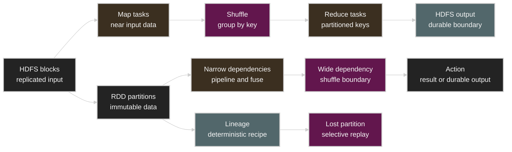
```mermaid
%%{init: {"theme": "base", "themeVariables": {"background": "#171717", "primaryColor": "#232323", "primaryTextColor": "#f5f5f5", "primaryBorderColor": "#d0d0d0", "lineColor": "#cfcfcf", "fontFamily": "Inter, Arial, sans-serif"}}}%%
flowchart LR
    H[HDFS blocks<br/>replicated input] --> M[Map tasks<br/>near input data]
    M --> S[Shuffle<br/>group by key]
    S --> R[Reduce tasks<br/>partitioned keys]
    R --> F[HDFS output<br/>durable boundary]

    H --> D[RDD partitions<br/>immutable data]
    D --> N[Narrow dependencies<br/>pipeline and fuse]
    N --> W[Wide dependency<br/>shuffle boundary]
    W --> A[Action<br/>result or durable output]

    D --> L[Lineage<br/>deterministic recipe]
    L --> X[Lost partition<br/>selective replay]

    classDef primary fill:#232323,stroke:#d0d0d0,color:#f5f5f5,stroke-width:2px;
    classDef secondary fill:#3b2f20,stroke:#d0d0d0,color:#f5f5f5,stroke-width:2px;
    classDef note fill:#52676b,stroke:#d0d0d0,color:#f5f5f5,stroke-width:2px;
    classDef accent fill:#62164d,stroke:#d0d0d0,color:#f5f5f5,stroke-width:2px;
    class H,D,A primary
    class M,R,N secondary
    class F,L note
    class S,W,X accent
```

---

## Why a Cluster Changes the Programming Problem

강의의 첫 예시는 하루치 website log 100 TB를 scan하는 작업이다. 한 node가
50 MB/s로 읽으면 약 23일이 걸리지만, 1,000 nodes가 각자 local block을 같은 속도로
읽으면 idealized aggregate scan time은 약 33분으로 줄어든다.

```text
single-node scan time
  = 100 TB / 50 MB/s
  ≈ 2,000,000 s
  ≈ 23 days

1,000-node ideal scan time
  = 100 TB / (1,000 × 50 MB/s)
  ≈ 2,000 s
  ≈ 33 min
```

이 예시에서 cluster를 쓰는 직접적인 이유는 CPU instruction throughput만이 아니다.
각 node가 disk/SSD와 network interface를 추가하므로 aggregate I/O bandwidth가
node 수와 함께 증가한다. Data analytics에서 computation이 간단한 scan/filter라면
input bytes를 공급하는 속도가 performance ceiling이 된다.

그러나 ideal division은 다음 조건을 숨긴다.

* Input block이 node들에 고르게 분포해야 한다.
* 각 task의 처리 시간이 비슷하거나 scheduler가 imbalance를 흡수해야 한다.
* Network와 storage가 shared bottleneck이 되어서는 안 된다.
* Failed node의 work와 data를 다른 node에서 복구할 수 있어야 한다.
* Final aggregation과 coordination overhead가 작아야 한다.

Single-machine parallel program에서는 thread failure를 일반적으로 process failure로
취급한다. Cluster에서는 하나의 node, disk, network link, top-of-rack switch가
독립적으로 실패할 수 있다. System 규모가 커질수록 “failure가 없는 execution”보다
“failure를 포함해 끝나는 execution”이 더 현실적인 design target이 된다.

## Warehouse-Scale Computer Anatomy

Warehouse-scale computer(WSC)는 racks of servers, rack switches, datacenter network,
power, cooling, storage, scheduler를 하나의 computer처럼 함께 설계하는 관점이다.
강의는 Luiz André Barroso의 “The Datacenter as a Computer”를 이 관점의 대표 자료로
소개한다.

강의 슬라이드의 node/rack 수치는 다음 hierarchy를 보여 준다. 이 값들은 ordering을
이해하기 위한 대략적인 lecture-era figures다.

| Level | Lecture example | Main implication |
| ----- | --------------- | ---------------- |
| CPU-DRAM | 16-32 cores, 128 GB-1 TB DRAM, 약 100 GB/s | Active working set을 두기에 가장 빠른 shared path |
| Local SSD | 10-30 TB, 약 1-4 GB/s | Capacity는 크지만 DRAM보다 bandwidth가 낮음 |
| Same-rack network | 약 1-2 GB/s | Remote data라도 topology에 따라 local SSD와 비슷할 수 있음 |
| Cross-rack network | 약 0.1-2 GB/s | 초기 cluster에서는 특히 비싸며 oversubscription/failure domain을 가짐 |
| Rack | 20-40 servers, 약 12-20 kW | Power budget이 server/GPU density를 제한 |

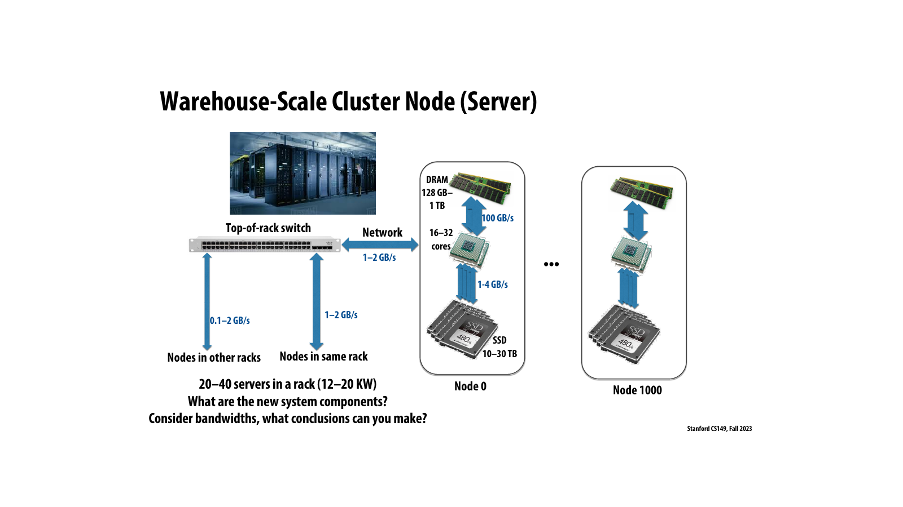

*공식 Lecture 9 슬라이드 PDF 6쪽 — rack network와 한 server의 memory/storage
hierarchy를 한 그림에 배치한 cluster-node 구조.*

| 관점 | 해설 |
| ---- | ---- |
| 슬라이드가 보여 주는 사실 | 20-40대 server가 top-of-rack switch에 연결되고, node 내부에는 16-32 cores, 128 GB-1 TB DRAM, 10-30 TB SSD가 있다. 화살표의 lecture-era bandwidth는 DRAM, local SSD, same-rack, cross-rack path의 속도 차이를 드러낸다. |
| 강의 논리에서의 의미 | Cluster의 병렬성은 node 수만이 아니라 어느 link를 통해 bytes가 이동하는가에 달려 있다. 같은 computation이라도 local DRAM, local SSD, rack network, cross-rack network 중 어느 path를 쓰느냐가 throughput과 tail latency를 바꾼다. |
| 별도 실무/GPU 해설 | 이 행은 슬라이드의 직접 주장과 구분한 적용 해설이다. GPU cluster에서는 CPU-DRAM 경로에 HBM, PCIe/NVLink, accelerator fabric을 추가해 측정해야 하며, data-local placement로 network bytes를 줄이는 이익과 expensive GPU를 기다리게 하는 queueing cost를 함께 비교해야 한다. |

GPU-equipped server는 accelerator power와 cooling demand가 커서 한 rack에 넣을 수 있는
server 수가 줄어든다. 이 관찰은 “node count”만이 physical scale을 나타내지 않으며,
power delivery와 network topology가 usable parallelism을 제한한다는 뜻이다.

Bandwidth hierarchy에서 두 가지를 구분해야 한다.

1. DRAM bandwidth는 local SSD나 network보다 훨씬 높다. Reused intermediate를 memory에
   유지할 가치가 있다.
2. Network가 충분히 빨라지면 remote node의 disk를 읽는 비용과 local disk를 읽는
   비용이 비슷해질 수 있다. 따라서 locality policy는 “remote는 항상 나쁘다”가 아니라
   실제 bottleneck link와 contention을 기준으로 결정해야 한다.

## Separate Address Spaces and Message Passing

각 cluster node는 별도 OS instance와 private virtual address space를 가진다. Node 0의
pointer는 Node 1에서 같은 object를 가리키지 않는다. 따라서 shared-memory program처럼
remote state를 `load`나 `store`할 수 없고, data는 network message로 명시적으로
이동해야 한다.

```text
Thread 1 / Node 0                     Thread 2 / Node 1
private address space                 private address space

x = local value
send(&x, destination=2, tag=t)  --->  recv(&y, source=1, tag=t)
                                      y = received value
```

`send`는 destination, local buffer, optional tag를 지정하고, `receive`는 source, receive
buffer, matching tag를 지정한다. Message가 data movement뿐 아니라 producer가 보냈고
consumer가 받았다는 ordering event를 포함하므로 별도의 shared-memory barrier가 반드시
필요한 것은 아니다. 다만 matching send가 없는데 blocking receive를 기다리거나 두
side가 서로의 message를 기다리면 deadlock은 여전히 가능하다.

강의는 MPI(Message Passing Interface)를 이 model의 대표 API로 언급한다. MPI는
distributed computation을 세밀하게 표현할 수 있지만, programmer가 partitioning,
communication, synchronization, failure behavior를 직접 설계해야 한다. Lecture 9의
관심은 log analytics처럼 regular한 bulk data processing을 더 높은 abstraction으로
표현해 이 책임을 runtime으로 옮기는 데 있다.

## Persistent Data in a Distributed File System

In-memory computation을 복구하려면 먼저 original input이 node failure 뒤에도 남아 있어야
한다. GFS(Google File System)와 HDFS(Hadoop Distributed File System)는 cluster 전체에
global file namespace를 제공하고 large file을 contiguous chunk/block으로 나눈다.

강의가 설명하는 전형적인 사용 pattern은 다음과 같다.

* File size는 수백 GB에서 TB 단위로 크다.
* Existing data를 random in-place update하는 경우는 드물다.
* Read와 append가 주 access mode다.
* Log file처럼 record가 계속 뒤에 추가되는 workload에 적합하다.

File block은 보통 64-256 MB 정도이며 여러 DataNode에 2-3 copies로 replicate된다.
Replica를 서로 다른 rack에 두면 한 server뿐 아니라 top-of-rack switch 또는 rack
failure에도 data를 보존할 수 있다.

Metadata path와 data path는 분리된다.

```text
1. client -> NameNode
   "이 file block의 replicas는 어디에 있는가?"

2. NameNode -> client
   "DataNode 7, 19, 42"

3. client -> selected DataNode
   block bytes를 직접 read/write
```

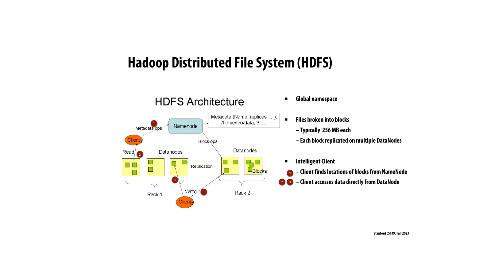

*공식 Lecture 9 슬라이드 PDF 10쪽 — NameNode metadata path, DataNode data path,
block replication을 분리해 보여 주는 HDFS 구조.*

| 관점 | 해설 |
| ---- | ---- |
| 슬라이드가 보여 주는 사실 | Client는 먼저 NameNode에서 file block 위치를 찾고, payload는 DataNode와 직접 교환한다. File은 보통 256 MB blocks로 나뉘며 multiple DataNodes와 racks에 replicate된다. |
| 강의 논리에서의 의미 | Central metadata service가 모든 payload byte를 relay하지 않으면서도 global namespace와 replica placement를 제공한다. Replication은 failed node나 rack 뒤에도 mapper와 lineage recovery가 다시 읽을 durable source를 만든다. |
| 별도 실무/GPU 해설 | 이 행은 강의 밖 시스템 해설이다. Training input/checkpoint shard도 metadata lookup과 bulk data transfer를 분리할 수 있지만, replica 수를 늘리면 availability와 read locality 대신 capacity, write bandwidth, consistency 비용을 지불한다. GPU feeder를 storage replica 가까이에 두더라도 NameNode 같은 control-plane availability는 별도로 검증해야 한다. |

NameNode/master는 filename, block mapping, replica location 같은 metadata를 관리하고,
client는 실제 payload를 DataNode에서 직접 가져온다. 따라서 centralized metadata
service가 모든 data byte를 relay하지 않는다. Master 자체의 availability와 replication은
별도 system problem이지만, 강의의 핵심은 data processing task가 replicated block을
source of truth로 다시 읽을 수 있다는 점이다.

## The CS149 Page-View Example

강의는 `cs149log.txt`를 256 MB blocks로 나누어 네 node의 SSD에 분산한 toy cluster를
사용한다.

```text
Node 0: block 0, block 1
Node 1: block 2, block 3
Node 2: block 4, block 5
Node 3: block 6, block 7
```

목표는 log line에서 mobile client의 user agent를 찾아 browser/device 종류별 page-view
count를 계산하는 것이다. 이 문제에는 두 종류의 parallelism이 있다.

* Block parallelism: 서로 다른 file block의 line은 독립적으로 parse/filter할 수 있다.
* Key parallelism: 서로 다른 user-agent key의 aggregation은 독립적으로 수행할 수 있다.

반면 같은 key의 모든 partial count는 한 logical reduction에 모여야 한다. 따라서
input-side parallelism과 output-side parallelism 사이에는 key redistribution이 필요하다.
이 middle step이 MapReduce의 핵심 communication cost다.

## Functional Data-Parallel Operations

`map`은 collection의 각 element에 side-effect-free unary function을 적용해 같은 길이의
새 collection을 만든다.

```text
map f : Seq[A] -> Seq[B]

[3, 8, 4, 6] -- f(x) = x + 10 --> [13, 18, 14, 16]
```

Element 사이에 dependency가 없으므로 runtime은 iteration order와 worker assignment를
자유롭게 바꿀 수 있다. Input을 mutate하지 않으므로 같은 input에 function을 다시
실행해도 original state가 사라지지 않는다. 이 replayability가 fault recovery의 기반이다.

`reduce`는 element와 accumulator를 binary operation으로 결합해 collection을 하나의
value로 축약한다.

```text
reduce (+) [3, 8, 4, 6, 3, 9, 2, 8] = 43
```

Parallel reduction은 grouping/order를 바꿀 수 있으므로 operation의 algebraic property가
중요하다. 강의 질의응답에서는 parallel split이 같은 결과를 내려면 reducer가 적어도
associative해야 한다는 점을 확인한다. Floating-point addition처럼 수학적으로는
associative하더라도 machine arithmetic에서 order-dependent한 operation은 reproducibility를
별도로 검토해야 한다.

Functional이라는 표현은 implementation 내부에서 local map structure를 갱신하는
instruction이 전혀 없다는 뜻이 아니다. Programming model의 observable input dataset을
mutate하지 않고, 동일 input partition과 deterministic function으로 output을 재생성할
수 있다는 뜻이다.

## MapReduce Is Map-GroupByKey-Reduce

Page-view mapper는 log line 하나에서 user agent를 parse하고 mobile client이면
`(userAgent, 1)`을 emit한다. Reducer는 unique key 하나와 그 key에 속한 values를 받아
합을 계산한다.

```scala
// conceptual pseudocode
mapper(line):
    agent = parseUserAgent(line)
    if isMobileClient(agent):
        emit(agent, 1)

reducer(agent, values):
    return sum(values)
```

Word count도 같은 pattern이다.

```text
input blocks
  -> map: ("the", 1), ("fox", 1), ...
  -> groupByKey/shuffle: "the" -> [1,1,1], "fox" -> [1,1], ...
  -> reduce: "the" -> 3, "fox" -> 2, ...
```

Mapper output을 그대로 reducer에 넘길 수 없는 이유는 같은 key가 모든 mapper에 나타날
수 있기 때문이다. Correct reduction을 위해 같은 key의 value는 같은 logical reducer
partition에 도착해야 한다. 그래서 강의는 MapReduce를 더 정확히
`Map-GroupByKey-Reduce`라고 부른다.

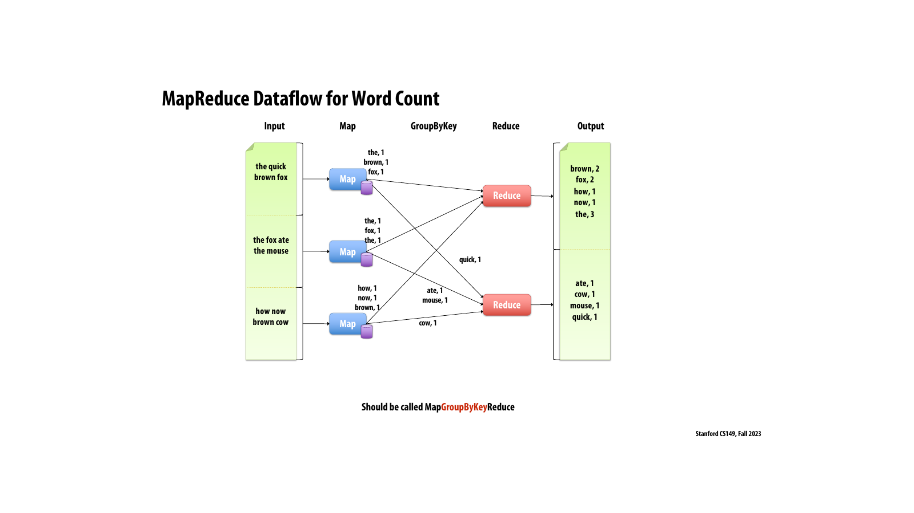

*공식 Lecture 9 슬라이드 PDF 19쪽 — `MapGroupByKeyReduce`라는 더 정확한 이름을
dataflow로 보여 주는 word-count 예제.*

| 관점 | 해설 |
| ---- | ---- |
| 슬라이드가 보여 주는 사실 | 각 input fragment의 mapper는 `(word, 1)` records를 만들고, 같은 word의 records는 mapper 경계를 넘어 같은 reducer로 연결된다. `GroupByKey` column이 map과 reduce 사이의 required redistribution을 시각화한다. |
| 강의 논리에서의 의미 | MapReduce correctness는 mapper와 reducer 함수만이 아니라 same-key values를 같은 logical reduce partition에 모으는 middle phase에 의존한다. 이 때문에 functional source code가 간단해도 physical execution에는 partitioning, network transfer, buffering이 필요하다. |
| 별도 실무/GPU 해설 | 이 행은 슬라이드와 구분한 적용 해설이다. GPU analytics나 distributed training의 key/rank all-to-all도 destination ownership을 맞춰야 correct하지만, raw records를 보내기 전에 associative partial aggregation이 가능하면 network bytes를 줄일 수 있다. 반대로 grouping semantics가 raw values 전체를 요구하면 이 최적화를 적용할 수 없다. |

이 구조의 work unit은 다음과 같다.

| Phase | Task granularity | Natural parallelism | Main data source |
| ----- | ---------------- | ------------------- | ---------------- |
| Map | Input block당 map task | Block 수 | HDFS block |
| Shuffle/group | Mapper output partition | Key partition 수와 network links | Intermediate key-value pairs |
| Reduce | Key range/hash partition당 reduce task | Reducer partition 수 | 모든 mapper가 보낸 matching keys |

Map output에서 reduce input으로 넘어갈 때 global redistribution이 발생한다. 따라서
mapper compute가 가벼워도 intermediate cardinality가 크면 shuffle bytes, serialization,
sort, network, spill이 total time을 지배할 수 있다.

## Producer-Consumer Locality: Move Computation to Data

Map task를 assign하는 첫 번째 방법은 global work queue에서 idle node가 다음 block을
가져가는 dynamic scheduling이다. Load balance에는 유리하지만 block이 remote node에
있으면 network로 input 전체를 이동해야 한다.

두 번째 방법은 block replica를 가진 node에서 mapper를 실행하는 data-local scheduling이다.
강의의 표현대로 “move computation to the data”다.

```text
data-local execution

HDFS block on Node 2
        +
mapper task on Node 2
        ↓
local SSD -> local CPU/DRAM
```

Mapper code와 task descriptor는 대개 input block보다 훨씬 작다. 따라서 computation을
옮기는 편이 data를 옮기는 것보다 싸다. 이 원리는 producer-consumer locality의
distributed version이다. HDFS block이 producer state이고 mapper가 consumer일 때 둘을
같은 node에 배치해 network traffic을 피한다.

하지만 locality와 load balance는 충돌할 수 있다.

| Choice | Benefit | Cost |
| ------ | ------- | ---- |
| Strict local placement | Input network traffic 최소화 | Local node가 busy/slow하면 queueing 증가 |
| Rack-local placement | Cross-rack traffic 회피, 더 많은 candidates | Same-rack network 사용 |
| Any-node placement | 빠른 idle worker 활용 | Remote block transfer 필요 |

좋은 scheduler는 locality wait가 얻는 byte savings와 idle time을 비교한다. Network가
local storage와 비슷하게 빠른 환경에서는 remote scheduling의 penalty가 작아질 수 있고,
oversubscribed cross-rack link에서는 locality가 훨씬 중요해진다.

## Shuffle and Reducer Placement

Reducer parallelism은 key space를 여러 partition으로 나눠 얻는다. Hash partitioning의
개념적 rule은 다음과 같다.

```text
reduce_partition(key) = hash(key) mod R
```

모든 mapper가 같은 rule을 사용하면 같은 key의 records가 같은 reducer partition으로
전송된다. Scheduler는 reducer task를 available node에 assign하고, 가능하면 해당 key
partition의 intermediate data가 많이 있는 node를 골라 movement를 줄일 수 있다.

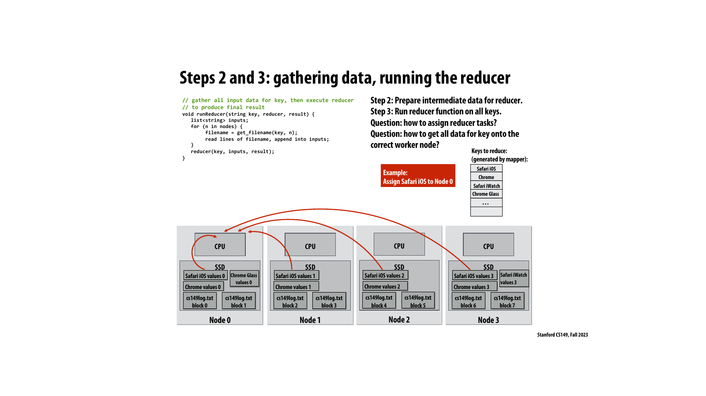

*공식 Lecture 9 슬라이드 PDF 22쪽 — reducer key assignment가 여러 producer node의
intermediate records를 한 worker로 모으는 shuffle을 만드는 장면.*

| 관점 | 해설 |
| ---- | ---- |
| 슬라이드가 보여 주는 사실 | `Safari iOS` key를 Node 0에 assign한 뒤 Node 1-3의 matching values까지 red arrows를 따라 Node 0으로 보낸다. Reducer placement는 compute만 배치하는 결정이 아니라 distributed intermediate data의 destination을 정하는 결정이다. |
| 강의 논리에서의 의미 | Same-key records가 한 logical reducer에 도착해야 aggregation이 correct하다. 그러나 correctness를 위한 grouping은 network fan-in, serialization, buffering을 만들며, hot key 하나가 한 reducer의 memory와 stage tail을 지배할 수 있다. |
| 별도 실무/GPU 해설 | 이 행은 강의 밖 적용 해설이다. Embedding ownership이나 MoE expert routing도 destination rule을 일관되게 적용해야 correct하지만, all-to-one skew가 생기면 GPU compute보다 network와 receive buffer가 병목이 된다. Key histogram과 bytes-per-destination을 보고 repartition/salting 가능 여부를 semantics와 함께 검토해야 한다. |

Map과 reduce 사이에는 conceptual barrier가 있다. 모든 map output이 어느 partition으로
갈지 결정되고 필요한 records가 준비되어야 reducer가 complete result를 낼 수 있다.
강의에서 이 boundary가 중요한 이유는 다음과 같다.

* Producer는 여러 mapper이고 consumer는 key별 reducer다.
* 한 reducer input은 cluster의 여러 node에서 온다.
* Network all-to-all pattern이 생길 수 있다.
* 한 map failure가 downstream reducer input을 불완전하게 만든다.
* 특정 hot key는 한 reducer에 disproportionate work를 준다.

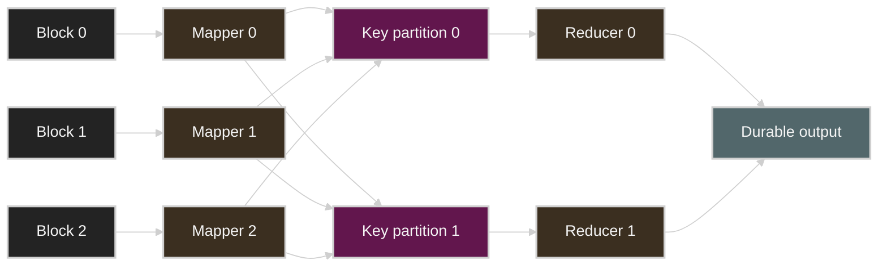
```mermaid
%%{init: {"theme": "base", "themeVariables": {"background": "#171717", "primaryColor": "#232323", "primaryTextColor": "#f5f5f5", "primaryBorderColor": "#d0d0d0", "lineColor": "#cfcfcf", "fontFamily": "Inter, Arial, sans-serif"}}}%%
flowchart LR
    B0[Block 0] --> M0[Mapper 0]
    B1[Block 1] --> M1[Mapper 1]
    B2[Block 2] --> M2[Mapper 2]

    M0 --> K0[Key partition 0]
    M0 --> K1[Key partition 1]
    M1 --> K0
    M1 --> K1
    M2 --> K0
    M2 --> K1

    K0 --> R0[Reducer 0]
    K1 --> R1[Reducer 1]
    R0 --> O[Durable output]
    R1 --> O

    classDef primary fill:#232323,stroke:#d0d0d0,color:#f5f5f5,stroke-width:2px;
    classDef secondary fill:#3b2f20,stroke:#d0d0d0,color:#f5f5f5,stroke-width:2px;
    classDef note fill:#52676b,stroke:#d0d0d0,color:#f5f5f5,stroke-width:2px;
    classDef accent fill:#62164d,stroke:#d0d0d0,color:#f5f5f5,stroke-width:2px;
    class B0,B1,B2 primary
    class M0,M1,M2,R0,R1 secondary
    class O note
    class K0,K1 accent
```

## Scheduling at Cluster Scale

수천 node에서는 “각 task를 한 번 assign한다”는 static plan만으로 부족하다. Node
generation, clock rate, core count, current load, storage state가 다르고, task input
complexity도 균일하지 않다. Job scheduler는 실행 중 상태를 관찰하며 placement와
retry를 조정한다.

강의가 제시한 scheduler responsibilities는 다음과 같다.

| Responsibility | Mechanism | Objective |
| -------------- | --------- | --------- |
| Data locality | Input replica가 있는 node/rack에 map task 배치 | Network bytes와 latency 감소 |
| Reducer locality | Key data가 많이 모인 node를 선호 | Shuffle movement 감소 |
| Load balance | 많은 map/reduce tasks를 available workers에 분배 | Idle resource와 tail 감소 |
| Failure detection | Worker heartbeat를 master가 감시 | 사라진 node/task 식별 |
| Failure recovery | Same task를 다른 node에서 replay | Job completion 보장 |
| Straggler mitigation | Slow task의 duplicate copy 실행 | Long-tail latency 감소 |

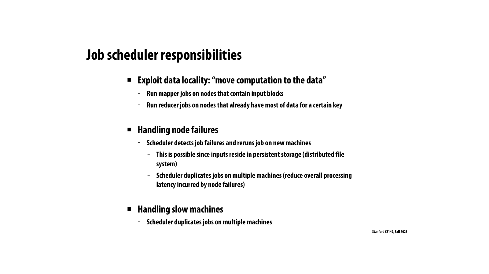

*공식 Lecture 9 슬라이드 PDF 24쪽 — locality, failure recovery, straggler handling을
하나의 scheduler responsibility로 묶은 요약.*

| 관점 | 해설 |
| ---- | ---- |
| 슬라이드가 보여 주는 사실 | Scheduler는 input block이 있는 node에서 mapper를 실행하고, 특정 key의 data가 많은 node를 reducer 후보로 삼는다. Node failure에는 다른 machine에서 job을 rerun하고, slow machine에는 duplicate execution을 사용할 수 있다고 정리한다. |
| 강의 논리에서의 의미 | Data-parallel abstraction의 가치는 work를 나누는 데서 끝나지 않고 runtime이 placement와 replay policy를 계속 바꿀 수 있다는 데 있다. Persistent input과 functional task가 있기 때문에 retry/speculation이 logical result를 보존할 수 있다. |
| 별도 실무/GPU 해설 | 이 행은 슬라이드의 직접 주장과 구분한 시스템 해설이다. GPU task duplication은 tail을 줄일 수 있지만 scarce accelerator, HBM, fabric bandwidth를 중복 소비하므로 늦은 task가 failure인지 skew인지 먼저 구분해야 한다. Collective에 참여하는 task를 독립적으로 duplicate하면 protocol correctness가 깨질 수 있어 MapReduce speculation을 그대로 적용해서는 안 된다. |

Task 수를 worker 수보다 많게 만드는 것은 dynamic balance에 도움이 된다. 한 node가
빨리 끝나면 다음 task를 받을 수 있고, failure가 나도 작은 unit만 재실행한다. 반대로
task가 너무 작으면 scheduling metadata, process startup, serialization, file open,
network handshake가 useful work보다 커진다.

Scheduler는 master/coordinator state도 가진다. 강의 질의응답은 scheduler node failure가
별도의 availability problem임을 지적한다. Data task의 deterministic replay가 scheduler
metadata까지 자동으로 복구하는 것은 아니다. Production system은 master replication,
durable metadata, leader election 같은 control-plane design을 따로 필요로 한다.

## Failure Recovery and Stragglers in MapReduce

Worker는 정기적으로 heartbeat를 보내고 scheduler는 heartbeat가 끊긴 node를 failed로
판단한다. Mapper node가 실패하면 scheduler는 replicated HDFS block이 있는 다른 node에서
같은 mapper를 다시 실행한다.

이 replay가 안전한 이유는 두 가지다.

1. Original input block은 distributed file system에 persistent하고 replicated되어 있다.
2. Mapper는 input을 mutate하지 않는 deterministic functional operation으로 모델링된다.

Reducer가 완료 전에 실패하면 해당 reduce task도 다시 시작하고 필요한 mapper output을
다시 모은다. 완료 결과가 durable output에 commit되었다면 같은 work를 다시 할 필요가
없다. 정확한 commit protocol은 강의의 범위를 벗어나지만, logical task boundary가
recovery unit이 된다는 점이 중요하다.

Straggler는 failure가 아니라 비정상적으로 느린 task다. Heterogeneous machine, noisy
neighbor, unusually large input partition, network congestion이 원인이 될 수 있다.
Scheduler는 늦은 task의 duplicate를 다른 node에 띄워 먼저 끝난 결과를 채택하고 나머지를
취소할 수 있다. 이를 speculative execution이라고 부른다.

```text
original task -----------------------------> finishes late
                    duplicate task -------> finishes first
                                            result accepted
                                            original cancelled
```

Speculation은 tail latency를 낮추지만 free가 아니다. Healthy cluster에서 너무 일찍
duplicate하면 CPU, memory, disk, network를 두 배 사용해 다른 task를 느리게 할 수 있다.
Side effect가 있는 task라면 duplicate execution의 correctness도 어려워진다. Functional
bulk operation은 이 선택을 안전하고 단순하게 만든다.

## Why MapReduce Is Not Enough

MapReduce의 장점은 명확하다.

* Job을 mapper/reducer tasks로 자동 분해한다.
* Scheduler가 locality와 load balance를 관리한다.
* Failed task와 straggler를 runtime이 처리한다.
* Programmer는 explicit send/receive보다 단순한 dataflow를 작성한다.

그러나 abstraction이 `map -> groupByKey -> reduce` 중심이라 general multi-stage DAG를
표현하기 불편하다. 강의는 DAG generalization 연구로 DryadLINQ를 언급한다.

더 큰 문제는 intermediate durability policy다. Classic MapReduce pipeline은 각 stage나
iteration 결과를 distributed file system에 써서 다음 job의 input으로 사용한다.
PageRank를 단순화하면 다음과 같다.

```text
iteration 0: HDFS read -> map/shuffle/reduce -> HDFS write
iteration 1: HDFS read -> map/shuffle/reduce -> HDFS write
iteration 2: HDFS read -> map/shuffle/reduce -> HDFS write
...
```

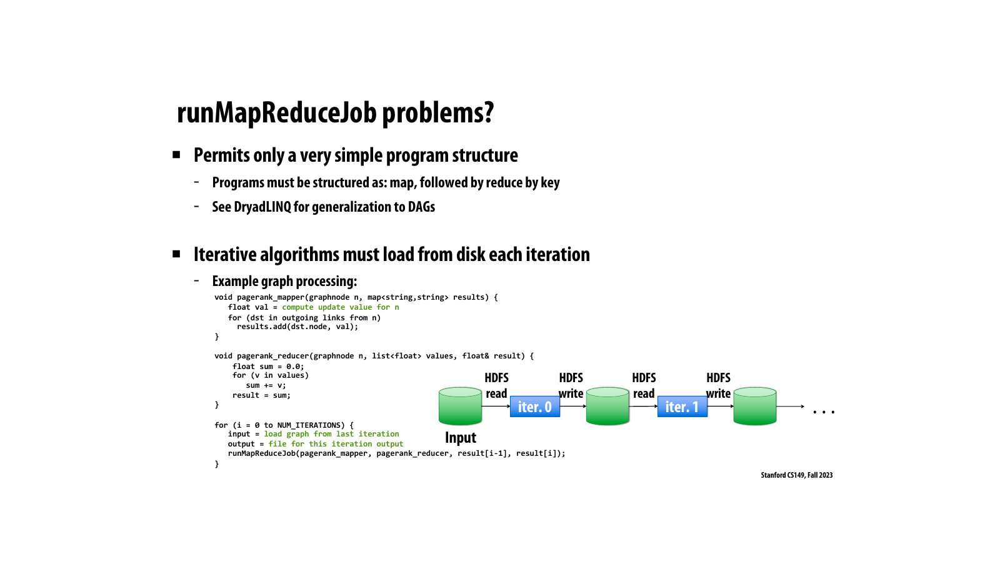

*공식 Lecture 9 슬라이드 PDF 26쪽 — simple map-then-reduce structure와 iterative
PageRank의 per-iteration HDFS materialization 문제.*

| 관점 | 해설 |
| ---- | ---- |
| 슬라이드가 보여 주는 사실 | `runMapReduceJob`은 map 뒤에 reduce-by-key가 오는 단순 structure를 허용하며, graph iteration 결과를 매번 HDFS에 쓰고 다음 iteration에서 다시 읽는다. DryadLINQ는 DAG generalization의 예로 언급된다. |
| 강의 논리에서의 의미 | Durable file boundary는 failure recovery를 단순하게 만들지만 reused intermediate까지 매 iteration serialize, checksum, write, read하게 한다. 복잡한 multi-stage DAG와 in-memory reuse를 동시에 표현하기 어렵다는 점이 Spark로 넘어가는 직접 동기다. |
| 별도 실무/GPU 해설 | 이 행은 강의 밖 적용 해설이다. Iterative GPU pipeline에서 매 step을 object storage/checkpoint로 내리면 correctness와 restart 지점은 명확해지지만 HBM-host-storage 왕복이 compute 이익을 압도할 수 있다. 반대로 checkpoint를 모두 없애면 failure 시 긴 replay가 필요하므로 measured checkpoint time과 expected lost work를 함께 비교해야 한다. |

Graph structure나 model state를 반복해서 재사용해도 매 iteration마다 serialization,
checksum, filesystem copy, storage I/O를 낸다. Interactive data mining도 같은 dataset에
query 1, 2, 3을 실행할 때 매번 HDFS read를 반복한다.

따라서 MapReduce의 fault tolerance 방식은 durable checkpoint를 자주 만드는 대신
normal-case performance를 희생한다. Spark가 묻는 질문은 “intermediate를 memory에
두면서도 failure 때 처음부터 다시 시작하지 않을 수 있는가?”다.

## Why Spark Keeps Intermediate Data in Memory

강의가 인용한 2009년 application study에서는 node당 64 GB memory일 때 working set이
memory에 들어가는 job의 비율이 Facebook 97%, Microsoft 98%, Yahoo 99.5%였다. 이 표는
모든 dataset 전체가 한 node에 들어간다는 뜻이 아니라, cluster node들의 aggregate
memory가 많은 job의 actively reused working set을 담을 수 있다는 뜻이다.

Memory는 storage보다 bandwidth가 높고 access path가 짧다. Intermediate dataset을 DRAM에
유지하면 iterative algorithm과 repeated query가 file system을 왕복하지 않는다. 그러나
DRAM은 volatile하므로 node power loss나 process crash가 곧 partition loss가 된다.

강의는 in-memory fault tolerance의 가능한 방법을 비교한다.

| Approach | Recovery idea | Normal-case cost |
| -------- | ------------- | ---------------- |
| Full replication | 모든 computation/state를 여러 node에서 유지 | Peak throughput과 memory capacity 감소 |
| Checkpoint and rollback | Periodically durable state 저장 후 rollback | Checkpoint I/O와 lost work |
| Fine-grained update log | Command와 data update를 모두 기록 | Logging volume과 coordination overhead 큼 |
| MapReduce-style materialization | 각 step output을 distributed file system에 저장 | 단순하고 durable하지만 매 step I/O |
| Spark lineage | Bulk deterministic transformation recipe 기록 | Metadata는 작고 failure 때 필요한 partition 재계산 |

Spark는 intermediate data 자체를 전부 durable하게 복제하는 대신 그것을 만드는 recipe를
보존한다. 이 design은 normal execution에서 fast memory를 사용하고 failure path에서
compute를 다시 쓰는 trade-off다.

## Resilient Distributed Dataset

RDD(Resilient Distributed Dataset)는 Spark의 핵심 programming abstraction이다. 강의는
이를 “read-only ordered collection of records”로 정의하며 다음 property를 강조한다.

* Immutable: 생성된 RDD의 contents를 in-place update하지 않는다.
* Partitioned: Record collection이 cluster node에 배치 가능한 partitions로 나뉜다.
* Deterministically derived: Persistent storage 또는 기존 RDD에 deterministic
  transformation을 적용해 새 RDD를 만든다.
* Recoverable: 잃어버린 partition의 construction path를 lineage에서 replay할 수 있다.
* Opaque: Application은 logical collection에 operation을 표현하고 runtime은 placement,
  materialization, recomputation을 선택한다.

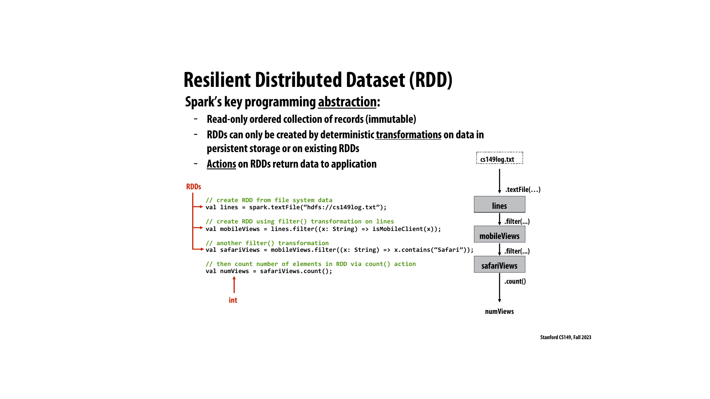

*공식 Lecture 9 슬라이드 PDF 33쪽 — immutable records, deterministic transformations,
actions라는 RDD contract와 page-view lineage 예제.*

| 관점 | 해설 |
| ---- | ---- |
| 슬라이드가 보여 주는 사실 | RDD는 read-only ordered record collection이며 persistent storage 또는 existing RDD에 deterministic transformation을 적용해 만든다. 오른쪽 chain은 `textFile -> filter -> filter -> count`에서 RDD들과 host scalar를 구분한다. |
| 강의 논리에서의 의미 | Immutability와 determinism은 runtime이 partition placement, lazy evaluation, eviction, retry를 바꿔도 같은 logical dataset을 재구성하게 한다. RDD가 resilient하다는 뜻은 모든 bytes를 복제한다는 뜻이 아니라 reconstruction recipe가 있다는 뜻이다. |
| 별도 실무/GPU 해설 | 이 행은 강의 밖 시스템 해설이다. Deterministic decode/feature partitions는 GPU node loss 뒤 재생성하기 쉽지만 random augmentation, wall-clock read, mutable feature store, nondeterministic kernel이 끼면 같은 recipe가 같은 bytes를 보장하지 않는다. RNG seed와 external version을 lineage contract에 포함하거나 durable boundary를 둬야 한다. |

```scala
val lines =
  spark.textFile("hdfs://cs149log.txt")

val mobileViews =
  lines.filter(x => isMobileClient(x))

val safariViews =
  mobileViews.filter(x => x.contains("Safari"))

val numViews =
  safariViews.count()
```

`lines`, `mobileViews`, `safariViews`는 RDD이고 `numViews`는 host application으로 돌아온
scalar value다. RDD의 resilience는 “memory copy가 절대로 사라지지 않는다”는 뜻이
아니다. 사라져도 persistent ancestor와 deterministic transformation으로 다시 만들 수
있다는 뜻이다.

Immutable data는 scheduler freedom도 늘린다. 같은 partition을 여러 consumer가 읽어도
누군가의 update가 다른 consumer의 input을 바꾸지 않는다. Retry, speculative execution,
cache eviction 후 recomputation이 같은 logical result를 낼 수 있다.

## Lineage, Transformations, and Actions

Lineage는 output RDD를 만들기 위해 적용된 transformation sequence와 partition dependency를
나타내는 recipe/log다.

```text
cs149log.txt
    |
    | textFile
    v
lines
    |
    | filter(isMobileClient)
    v
mobileViews
    |
    | map(parseUserAgent)
    v
(agent, 1)
    |
    | reduceByKey(+)
    v
perAgentCounts RDD
    |
    | collect
    v
host Array[(String, Int)]
```

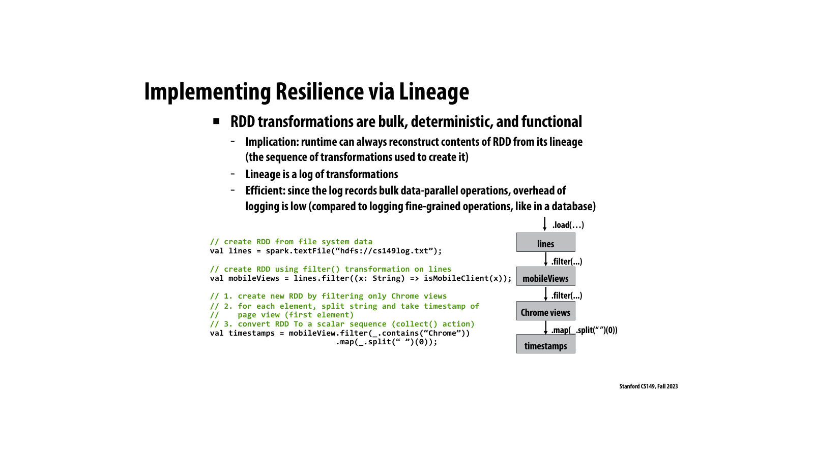

*공식 Lecture 9 슬라이드 PDF 49쪽 — bulk transformation log인 lineage로 RDD를
재구성한다는 resilience의 핵심 정의.*

| 관점 | 해설 |
| ---- | ---- |
| 슬라이드가 보여 주는 사실 | `lines -> mobileViews -> Chrome views -> timestamps` chain 옆에서 lineage를 transformation log라고 정의한다. Fine-grained database update log와 달리 bulk data-parallel operations만 기록하므로 logging overhead가 낮다고 설명한다. |
| 강의 논리에서의 의미 | Runtime은 missing contents 자체를 log에서 복사하는 것이 아니라 persistent ancestor에 deterministic operations를 다시 실행한다. Metadata는 작아지지만 failure path에서 compute와 source I/O를 다시 지불하는 명시적인 storage-versus-recomputation trade-off다. |
| 별도 실무/GPU 해설 | 이 행은 슬라이드와 구분한 적용 해설이다. GPU preprocessing DAG도 operator/version/partition mapping을 기록하면 data copy replication을 줄일 수 있지만, expensive kernel이나 wide exchange가 긴 lineage에 있으면 recovery가 정상 실행보다 훨씬 비싸질 수 있다. Rebuild time을 측정해 checkpoint 위치를 정해야 한다. |

Transformation은 input RDD에서 새 RDD를 만드는 data-parallel operator다.

| Transformation | Shape | Dependency tendency |
| -------------- | ----- | ------------------- |
| `map` | `RDD[T] -> RDD[U]` | 대개 narrow |
| `filter` | `RDD[T] -> RDD[T]` | 대개 narrow |
| `flatMap` | One input에서 zero/many outputs | 대개 narrow |
| `sample` | Input subset | 대개 narrow |
| `reduceByKey` | Key별 aggregation | Shuffle을 포함할 수 있음 |
| `groupByKey` | `(K,V) -> (K,Seq[V])` | Wide |
| `join` | 두 keyed RDD 결합 | Partitioner에 따라 narrow 또는 wide |
| `sort` | Global key/order 재배치 | Wide |
| `partitionBy` | Requested partitioner로 재배치 | 보통 shuffle boundary |

Action은 RDD 밖의 observable result를 application이나 storage에 제공한다.

| Action | Result |
| ------ | ------ |
| `count` | Element 수 scalar |
| `collect` | 전체 records를 host-side sequence로 반환 |
| `reduce` | 전체 collection의 scalar/aggregate |
| `lookup` | 특정 key의 values |
| `save` | RDD contents를 HDFS 같은 storage에 기록 |

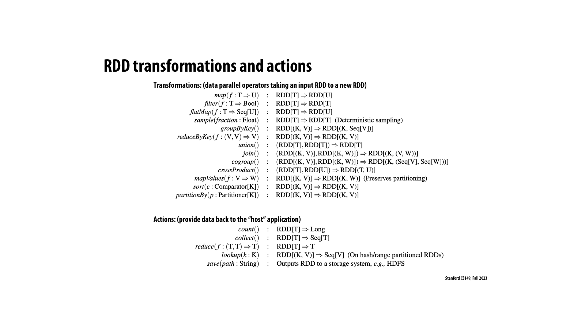

*공식 Lecture 9 슬라이드 PDF 36쪽 — 새 RDD를 만드는 transformations와 host/storage에
observable result를 내는 actions의 구분.*

| 관점 | 해설 |
| ---- | ---- |
| 슬라이드가 보여 주는 사실 | 위쪽은 `map`, `filter`, `groupByKey`, `join`, `partitionBy`처럼 RDD를 RDD로 바꾸는 operators를, 아래쪽은 `count`, `collect`, `reduce`, `lookup`, `save`처럼 application 또는 storage로 data를 내는 actions를 열거한다. |
| 강의 논리에서의 의미 | Transformation/action 구분은 runtime이 action이 요구되기 전까지 lineage 전체를 보고 fusion, shuffle, materialization을 계획할 여지를 준다. 다만 action은 distributed result를 driver로 모으거나 durable output을 commit하는 observable boundary이므로 size와 retry semantics가 중요하다. |
| 별도 실무/GPU 해설 | 이 행은 강의 밖 적용 해설이다. GPU DAG에서도 lazy operator fusion은 intermediate traffic을 줄이지만 `collect`와 같은 centralized action은 driver memory와 network fan-in을 폭발시킬 수 있다. Action 전에는 result cardinality, device-to-host bytes, idempotent output commit 여부를 contract로 둬야 한다. |

Transformation과 action을 구분하면 runtime이 entire lineage를 보고 partition placement,
fusion, shuffle boundary, recovery plan을 결정할 여지가 생긴다. Bulk operator log는
개별 record update를 logging하는 것보다 metadata overhead가 작다.

## Persisting Reused RDDs

RDD는 logical dataset이지 항상 materialized된 in-memory array가 아니다. 한 lineage의
중간 RDD를 두 branch가 재사용한다면 default recomputation 또는 external storage access가
반복될 수 있다. `persist`는 runtime에 해당 RDD의 partition contents를 memory에
유지하도록 요청한다.

```scala
val lines = spark.textFile("hdfs://cs149log.txt")
val mobileViews =
  lines.filter(x => isMobileClient(x))

mobileViews.persist()

val safariCount =
  mobileViews.filter(_.contains("Safari")).count()

val chromeTimestamps =
  mobileViews
    .filter(_.contains("Chrome"))
    .map(_.split(" ")(0))
    .collect()
```

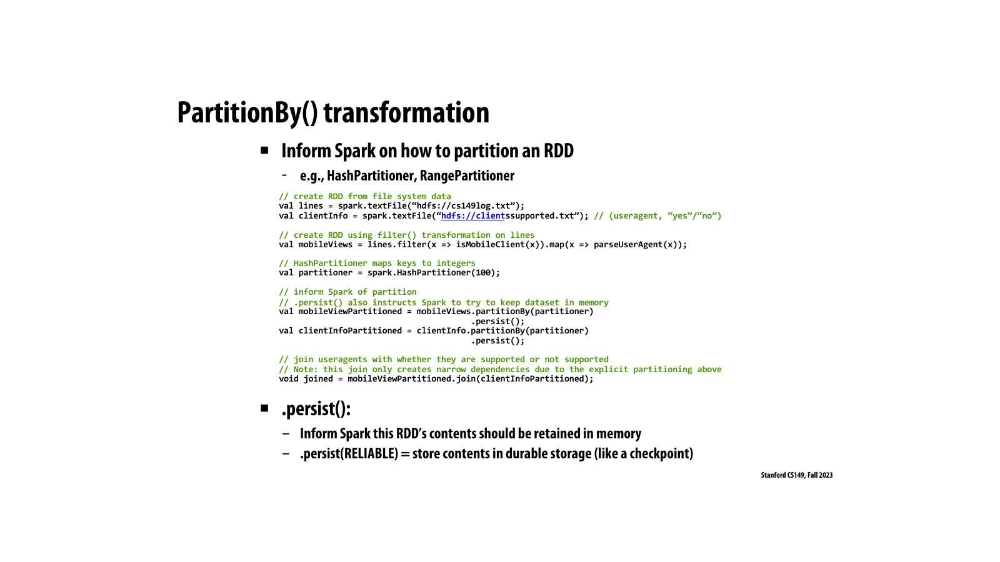

*공식 Lecture 9 슬라이드 PDF 48쪽 — `partitionBy`로 downstream locality를 만들고
`.persist()`로 reused contents를 보존하는 결합 예제.*

| 관점 | 해설 |
| ---- | ---- |
| 슬라이드가 보여 주는 사실 | `mobileViews`와 `clientInfo`에 같은 `HashPartitioner(100)`을 적용하고 각각 persist한 뒤 join한다. 슬라이드는 memory retention과 durable storage checkpoint 성격의 `persist(RELIABLE)`을 구분한다. |
| 강의 논리에서의 의미 | Persist는 lineage를 없애지 않고 normal path에서 repeated parent scan/transform을 피하는 materialization hint다. `partitionBy`가 upfront shuffle을 만들더라도 co-partitioned RDD를 cache해 반복 사용하면 downstream joins를 narrow하게 만들 수 있다. |
| 별도 실무/GPU 해설 | 이 행은 슬라이드의 직접 주장과 구분한 시스템 해설이다. HBM/host memory cache는 reuse latency를 줄이지만 capacity pressure, eviction, serialization을 늘리고, durable checkpoint는 더 큰 write cost 대신 replay 범위를 자른다. GPU cache 대상은 파일 크기가 아니라 serialized/device footprint, reuse count, rebuild time으로 선택해야 한다. |

`mobileViews`를 두 consumer가 공유하므로 cache하면 original file read와 mobile filter를
반복하지 않을 수 있다. 그러나 persist는 모든 intermediate를 자동으로 memory에 고정하는
명령이 아니다. Memory capacity, eviction, runtime policy에 따라 partition이 없어질 수
있고 lineage가 그때의 fallback이다.

강의 슬라이드는 durable checkpoint를 요청하는 표기로 `persist(RELIABLE)`을 사용한다.
핵심 의미는 lineage가 매우 길거나 recomputation cost가 클 때 memory-only recovery
대신 durable cut point를 만들 수 있다는 것이다. API spelling보다 중요한 것은
“어디까지 replay할 것인가?”를 storage I/O와 lost-work risk 사이에서 선택하는 것이다.

Persist decision은 reuse와 rebuild cost를 기준으로 해야 한다.

```text
benefit
  ≈ repeated parent scan + repeated transformations avoided

cost
  ≈ memory footprint + serialization/materialization
     + eviction pressure + possible spill
```

한 번만 소비되는 RDD를 cache하면 memory traffic과 capacity만 늘 수 있다. 반대로 expensive
branch point나 iterative state를 cache하지 않으면 같은 lineage가 반복 실행된다.

## RDD Partitions and Physical Placement

RDD를 하나의 거대한 array로 materialize하면 `lines`, `lower`, `mobileViews`의 모든
version이 동시에 memory를 차지할 수 있다. Filter output이 작더라도 object/serialization
representation 때문에 original file보다 in-memory footprint가 커질 수도 있다.

Spark는 RDD를 partitions로 나누고 각 child partition이 어떤 parent partition을
필요로 하는지 추적한다.

```text
HDFS block 0 -> lines p0 -> lower p0 -> mobileViews p0
HDFS block 1 -> lines p1 -> lower p1 -> mobileViews p1
...
HDFS block 7 -> lines p7 -> lower p7 -> mobileViews p7
```

Partition은 다음 세 역할을 동시에 가진다.

* Scheduling unit: 한 task가 처리할 logical data slice
* Placement unit: 어느 executor/node에서 계산하거나 cache할지 결정
* Recovery unit: Failure 뒤 다시 만들어야 할 최소 data slice

Partition size가 너무 크면 한 straggler가 stage tail을 지배하고 recovery unit이 커진다.
너무 작으면 task launch, metadata, serialization, scheduler overhead가 증가한다.
Lecture의 핵심은 fixed “best size”가 아니라 dependency와 locality를 partition level에서
표현한다는 점이다.

## Producer-Consumer Locality Through Fusion

강의는 이전 image blur와 vector expression의 loop fusion/tiling을 다시 불러온다.

```text
unfused
  A,B -> add -> tmp1
  tmp1,C -> multiply -> tmp2
  tmp2,D -> add -> E

fused
  each element:
    E[i] = D[i] + (A[i] + B[i]) * C[i]
```

Unfused code는 intermediate arrays를 memory에 쓰고 다시 읽는다. Fused code는 producer의
result를 register/cache에서 바로 consumer에게 전달해 arithmetic intensity와
producer-consumer locality를 높인다.

RDD chain에도 같은 원리를 적용할 수 있다.

```scala
val lines = spark.textFile(path)
val lower = lines.map(_.toLowerCase)
val mobileViews = lower.filter(isMobileClient)
val howMany = mobileViews.count()
```

모든 intermediate partition을 array로 저장할 필요 없이 input record 하나를 읽어
`toLowerCase -> filter -> local count`까지 pipeline할 수 있다.

```text
for each local input record:
    line = read()
    lower = toLowerCase(line)
    if isMobileClient(lower):
        localCount += 1

final:
    reduce localCount values
```

이 execution은 input을 한 번 streaming하고, `lower`와 `mobileViews` 전체를 memory에
materialize하지 않는다. Lecture 4의 loop fusion과 같은 optimization이지만, Spark
operator의 semantic information 덕분에 runtime이 partition graph를 보고 자동으로
적용할 수 있다.

High-level operator가 중요한 이유는 arbitrary C code보다 dependency가 명확하기 때문이다.
`map`과 `filter`는 record-local이고 side effect가 제한된다. Runtime은 producer result가
다른 node/partition에도 필요한지 graph에서 판단한 뒤 safe한 fusion 범위를 고를 수 있다.

## Narrow Dependencies

Narrow dependency에서는 한 parent RDD partition의 data가 최대 하나의 child partition에
참조된다. 강의의 `lines -> lower -> mobileViews` chain은 partition number가 유지되므로
`p0 -> p0`, `p1 -> p1`처럼 이어진다.

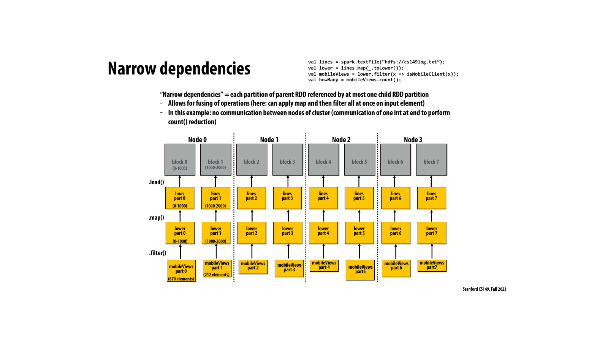

*공식 Lecture 9 슬라이드 PDF 45쪽 — parent partition당 최대 한 child가 참조하는
narrow dependency와 node-local fusion.*

| 관점 | 해설 |
| ---- | ---- |
| 슬라이드가 보여 주는 사실 | 각 node의 block `p`가 `lines p -> lower p -> mobileViews p`로 같은 column 안에서 이어진다. Slide는 map과 filter를 input element 단위로 함께 적용할 수 있고 마지막 count reduction 전에는 cluster-node communication이 없다고 설명한다. |
| 강의 논리에서의 의미 | Narrow edge는 consecutive transformations를 한 partition task와 stage 안에 pipeline할 수 있게 한다. Intermediate 전체를 materialize하지 않아 producer output을 consumer가 즉시 쓰며, placement와 recovery도 partition column 단위로 제한된다. |
| 별도 실무/GPU 해설 | 이 행은 강의 밖 적용 해설이다. Decode-augment-batch 같은 node-local GPU input chain을 fuse하면 host memory traffic과 kernel launch를 줄일 수 있지만, fusion이 register/HBM pressure를 키우거나 parallel task 수를 줄이면 오히려 throughput이 떨어질 수 있다. Fused/unfused end-to-end bytes와 occupancy를 함께 비교해야 한다. |

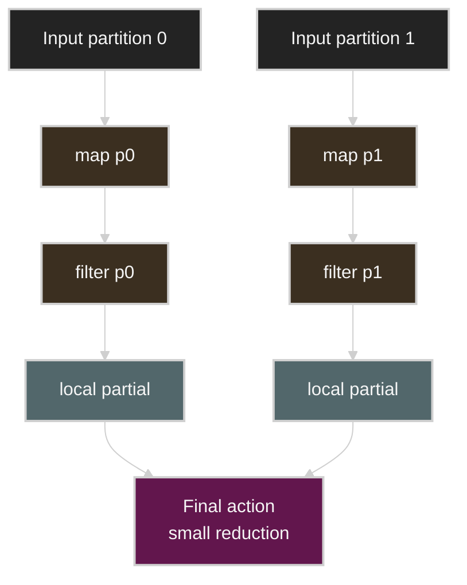
```mermaid
%%{init: {"theme": "base", "themeVariables": {"background": "#171717", "primaryColor": "#232323", "primaryTextColor": "#f5f5f5", "primaryBorderColor": "#d0d0d0", "lineColor": "#cfcfcf", "fontFamily": "Inter, Arial, sans-serif"}}}%%
flowchart TB
    P0[Input partition 0] --> M0[map p0]
    M0 --> F0[filter p0]
    F0 --> C0[local partial]

    P1[Input partition 1] --> M1[map p1]
    M1 --> F1[filter p1]
    F1 --> C1[local partial]

    C0 --> A[Final action<br/>small reduction]
    C1 --> A

    classDef primary fill:#232323,stroke:#d0d0d0,color:#f5f5f5,stroke-width:2px;
    classDef secondary fill:#3b2f20,stroke:#d0d0d0,color:#f5f5f5,stroke-width:2px;
    classDef note fill:#52676b,stroke:#d0d0d0,color:#f5f5f5,stroke-width:2px;
    classDef accent fill:#62164d,stroke:#d0d0d0,color:#f5f5f5,stroke-width:2px;
    class P0,P1 primary
    class M0,M1,F0,F1 secondary
    class C0,C1 note
    class A accent
```

Narrow dependency의 system consequences는 다음과 같다.

* Same partition task 안에서 consecutive transformations를 pipeline/fuse할 수 있다.
* Intermediate 전체를 network나 disk에 materialize할 필요가 없다.
* Input block replica와 같은 node에서 whole chain을 실행할 수 있다.
* Failure 시 lost child partition에 필요한 parent partition만 replay하면 된다.
* `count` 같은 마지막 small reduction 전까지 cluster node 사이 communication이 거의
  없을 수 있다.

Narrow라는 말은 dataset이 작다는 뜻이 아니다. Dependency fan-out이 local이라는 뜻이다.
수 TB RDD도 각 child partition이 특정 parent partition만 필요로 하면 narrow chain을
가질 수 있다.

## Wide Dependencies and Shuffle Boundaries

Wide dependency에서는 한 parent partition의 records가 여러 child partitions로 갈 수
있다. `groupByKey`는 모든 `(K,V)`를 key 기준으로 다시 모으므로 대표적인 wide
transformation이다.

```text
parent p0 --+--> child q0
            +--> child q1
            +--> child q2

parent p1 --+--> child q0
            +--> child q1
            +--> child q2
```

Child partition `q0`는 cluster의 여러 parent partition에서 matching key records를
받는다. Parent와 child를 같은 task 안에서 단순 streaming할 수 없고, partitioner에 따라
intermediate를 bucketize하고 network로 shuffle해야 한다.

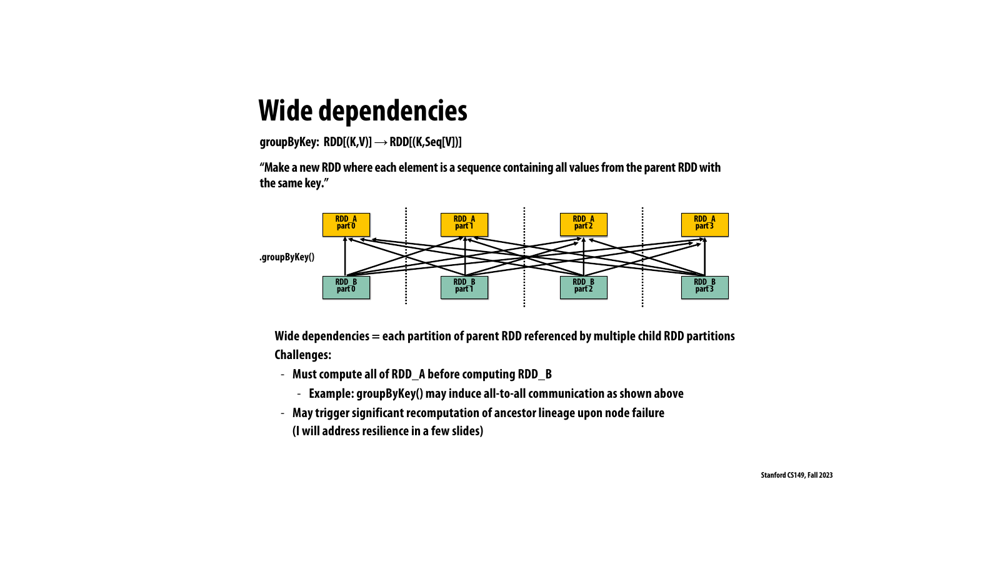

*공식 Lecture 9 슬라이드 PDF 46쪽 — `groupByKey`의 all-to-all redistribution과
wide dependency의 scheduling/recovery consequences.*

| 관점 | 해설 |
| ---- | ---- |
| 슬라이드가 보여 주는 사실 | 모든 RDD A partitions가 여러 RDD B partitions에 arrows로 연결된다. Slide는 RDD A의 required work가 준비되어야 B를 계산하고, `groupByKey`가 all-to-all communication과 failure 시 broader lineage recomputation을 만들 수 있다고 적는다. |
| 강의 논리에서의 의미 | Wide edge는 parent-side partition tasks와 child-side tasks 사이의 shuffle boundary이며 자연스러운 stage cut이다. Scheduler는 output bucket을 materialize/fetch한 뒤 다음 stage를 실행해야 하므로 network, spill, barrier tail이 physical schedule을 지배할 수 있다. |
| 별도 실무/GPU 해설 | 이 행은 슬라이드와 구분한 적용 해설이다. Distributed GPU all-to-all이나 MoE dispatch도 destination별 buffers와 synchronization을 요구하지만 Spark record shuffle과 dense collective의 protocol은 같지 않다. 한 task가 늦는 원인이 compute인지 fabric contention인지 구분하고 bytes/link와 wait time을 측정해야 한다. |

| Property | Narrow dependency | Wide dependency |
| -------- | ----------------- | --------------- |
| Parent-to-child fan-out | Parent partition당 최대 한 child | Parent partition이 여러 children에 기여 |
| Network movement | 없거나 제한적 | Cluster-wide shuffle 가능 |
| Fusion | Consecutive operators를 한 pipeline으로 묶기 쉬움 | Shuffle에서 pipeline이 끊김 |
| Materialization | Record-level streaming 가능 | Map-side output/bucket이 필요 |
| Scheduling boundary | 같은 stage에 들어가기 쉬움 | 새 stage를 만드는 자연스러운 boundary |
| Failure recovery | Lost branch만 local replay | 여러 ancestors/outputs를 다시 요구할 수 있음 |

Wide dependency는 “operation이 나쁘다”는 뜻이 아니다. Same-key aggregation, join, global
sort에는 필요한 communication이다. 핵심은 wide edge를 application의 semantic requirement로
인식하고, byte volume과 partition shape를 제어하는 것이다.

강의는 wide dependency가 두 비용을 만든다고 강조한다.

1. `RDD_A`의 필요한 partitions와 shuffle outputs가 준비되어야 `RDD_B`의 complete
   partition을 계산할 수 있다.
2. Failure가 shuffle boundary 뒤에서 발생하면 ancestor lineage의 더 넓은 부분을
   재계산할 수 있다.

이 구분은 scheduling과 resilience를 같은 graph property로 설명한다. Dependency edge는
“어떤 data가 먼저 필요한가?”뿐 아니라 “어디서 실행할 수 있는가?”, “무엇을 잃으면
얼마나 replay해야 하는가?”도 결정한다.

## Partitioning Determines Join Cost

`join`의 logical operation은 같아도 two input RDDs의 partitioner가 다르면 physical
cost가 달라진다.

```text
RDD_A: (K,V)
RDD_B: (K,W)
join : (K,(V,W))
```

`RDD_A`와 `RDD_B`가 서로 다른 hash rule이나 partition count를 사용하면 같은 key의
records가 다른 nodes에 있을 수 있다. Join output partition을 만들기 위해 양쪽 input을
새 partitioner로 shuffle해야 하므로 wide dependencies가 생긴다.

반대로 두 RDD가 같은 key partitioner를 사용해 co-partitioned되어 있으면 partition `i`의
join을 같은 node의 `A_i`와 `B_i`만으로 수행할 수 있다. 이때 join edge는 narrow해지고
network redistribution을 피할 수 있다.

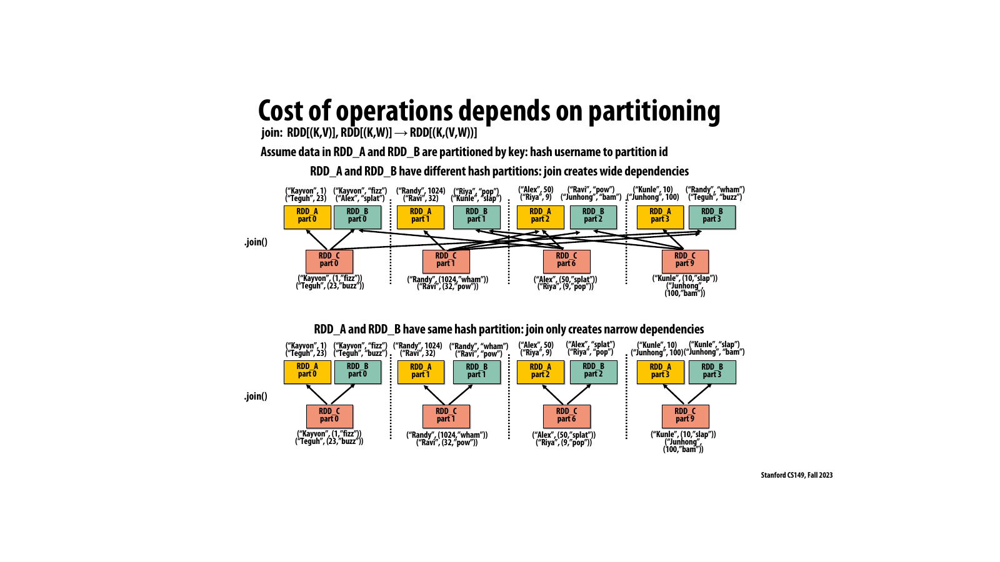

*공식 Lecture 9 슬라이드 PDF 47쪽 — 같은 logical `join`도 input partitioning이
다르면 wide, 같으면 narrow가 되는 비교.*

| 관점 | 해설 |
| ---- | ---- |
| 슬라이드가 보여 주는 사실 | 위쪽은 RDD A와 B의 key가 서로 다른 partition에 있어 RDD C를 만들 때 cross-partition arrows가 생긴다. 아래쪽은 같은 hash partition을 사용해 `A_i`와 `B_i`가 partition-local하게 RDD C `i`를 만든다. |
| 강의 논리에서의 의미 | Operator name만으로 communication cost를 정할 수 없고 upstream partitioner가 dependency shape를 결정한다. Co-partitioning은 join을 independent partition tasks로 바꿔 shuffle stage를 제거하지만, 그 상태를 만들기 위한 earlier repartition cost는 남는다. |
| 별도 실무/GPU 해설 | 이 행은 강의 밖 시스템 해설이다. Feature/embedding ownership을 repeated joins와 같은 rank에 맞추면 cross-rank traffic을 줄일 수 있지만, skewed keys는 local HBM imbalance와 hot rank를 만든다. Upfront repartition bytes, reuse count, max/median partition size로 break-even과 balance를 함께 검증해야 한다. |

```text
different partitioners
  A partitions --\
                  > all-to-all repartition -> join
  B partitions --/

same partitioner
  A_i + B_i -> join_i     for each i independently
```

강의의 `partitionBy` example은 이 optimization을 명시한다.

```scala
val partitioner = new HashPartitioner(100)

val mobileViewPartitioned =
  mobileViews
    .partitionBy(partitioner)
    .persist()

val clientInfoPartitioned =
  clientInfo
    .partitionBy(partitioner)
    .persist()

val joined =
  mobileViewPartitioned.join(clientInfoPartitioned)
```

`partitionBy` 자체는 records를 재배치하는 shuffle을 일으킬 수 있다. 하지만 partitioned
RDD를 persist하고 반복 join/query에 재사용하면 한 번의 upfront shuffle로 여러 downstream
shuffle을 제거할 수 있다.

```text
pay once:
  repartition A + repartition B

reuse many times:
  local join 1
  local join 2
  local keyed lookup
  local aggregation
```

따라서 operator 이름만 보고 cost를 판단하면 안 된다. `join` cost는 input partitioning,
partitioner compatibility, key distribution, record size, reuse count에 달려 있다.

## From Lineage to a Schedule

Lineage graph는 runtime이 execution plan을 만들 때 사용하는 semantic structure다. 강의의
설명을 scheduling 관점으로 정리하면 다음 흐름이 된다.

```text
1. action이 요구한 output partitions를 찾는다
2. lineage를 거슬러 필요한 ancestors를 찾는다
3. narrow edges를 같은 pipeline/stage로 묶는다
4. wide edge에서 shuffle/stage boundary를 만든다
5. source replicas와 cached partitions를 고려해 task placement를 정한다
6. partition tasks를 workers에 배치한다
7. failure/straggler 상태에 따라 task를 replay 또는 duplicate한다
```

예를 들어 다음 chain을 생각하자.

```scala
spark.textFile(path)
  .map(parse)
  .filter(valid)
  .map(x => (x.key, x.value))
  .reduceByKey(combine)
  .map(format)
  .saveAsTextFile(out)
```

첫 세 record-local transformations는 input partition별 pipeline으로 실행할 수 있다.
`reduceByKey`의 key repartition이 shuffle boundary를 만들고, 그 이후 `map(format)`은
reduce output partition에 붙일 수 있다. 그래서 logical operator가 여섯 개여도 physical
stage 수와 materialization point는 여섯 개일 필요가 없다.

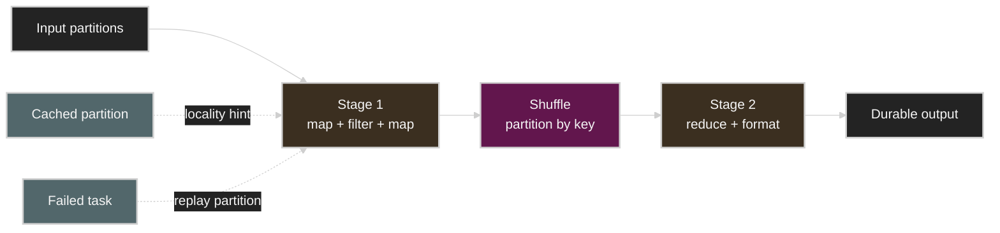
```mermaid
%%{init: {"theme": "base", "themeVariables": {"background": "#171717", "primaryColor": "#232323", "primaryTextColor": "#f5f5f5", "primaryBorderColor": "#d0d0d0", "lineColor": "#cfcfcf", "fontFamily": "Inter, Arial, sans-serif"}}}%%
flowchart LR
    I[Input partitions] --> S1[Stage 1<br/>map + filter + map]
    S1 --> Q[Shuffle<br/>partition by key]
    Q --> S2[Stage 2<br/>reduce + format]
    S2 --> O[Durable output]

    C[Cached partition] -. locality hint .-> S1
    F[Failed task] -. replay partition .-> S1

    classDef primary fill:#232323,stroke:#d0d0d0,color:#f5f5f5,stroke-width:2px;
    classDef secondary fill:#3b2f20,stroke:#d0d0d0,color:#f5f5f5,stroke-width:2px;
    classDef note fill:#52676b,stroke:#d0d0d0,color:#f5f5f5,stroke-width:2px;
    classDef accent fill:#62164d,stroke:#d0d0d0,color:#f5f5f5,stroke-width:2px;
    class I,O primary
    class S1,S2 secondary
    class C,F note
    class Q accent
```

이 schedule은 두 종류의 locality를 결합한다.

* Placement locality: Input/cached partition이 있는 node에서 task 실행
* Temporal producer-consumer locality: Intermediate를 memory/disk에 내렸다가 다시 읽지
  않고 같은 pipeline에서 즉시 소비

Partition lineage가 없으면 runtime은 functional code의 logical dependency만 알고 physical
data movement를 최적화하기 어렵다. Spark의 abstraction은 operator semantics와 partition
dependency를 함께 노출해 scheduling space를 넓힌다.

## Fault Recovery by Recomputing Lost Partitions

강의 슬라이드의 recovery example에는 네 node에 `timestamps` RDD partitions 0-7이 있다.
한 node가 crash해 partitions 2와 3을 잃었다고 하자. Original `cs149log.txt` blocks는 HDFS에
replicate되어 있으므로 접근 가능하다고 가정한다.

```text
lost:
  timestamps p2
  timestamps p3

lineage:
  HDFS block p
    -> lines p
    -> filter mobile p
    -> filter Chrome p
    -> map timestamp p
```

Runtime은 전체 `timestamps` RDD나 whole job을 다시 계산할 필요가 없다. 다른 available
node에서 source blocks 2와 3을 읽고 해당 narrow lineage만 replay해 lost partitions를
regenerate한다.

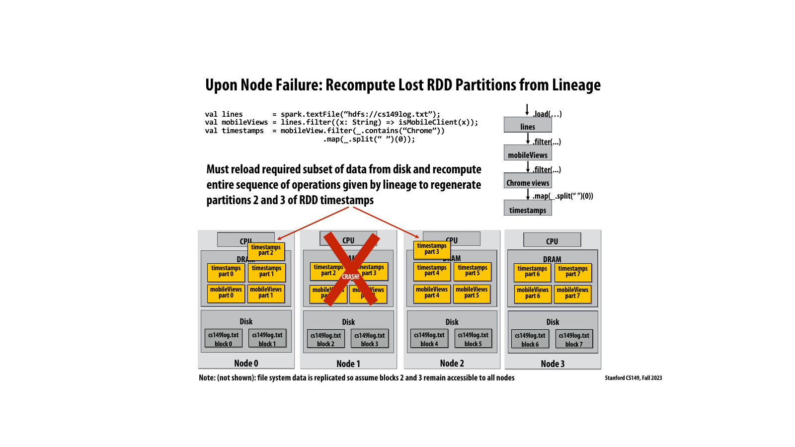

*공식 Lecture 9 슬라이드 PDF 51쪽 — failed Node 1의 lost partitions 2와 3만 다른
nodes에서 lineage로 재생성하는 selective recovery.*

| 관점 | 해설 |
| ---- | ---- |
| 슬라이드가 보여 주는 사실 | Node 1의 DRAM-cached `mobileViews`와 `timestamps` partitions 2, 3이 사라졌고, replicated file blocks는 accessible하다고 가정한다. Red arrows는 blocks 2와 3의 lineage를 Node 0과 Node 2에서 replay해 두 output partitions만 복구하는 placement를 보여 준다. |
| 강의 논리에서의 의미 | Recovery unit이 whole dataset가 아니라 partition이므로 unaffected partitions 0, 1, 4-7은 다시 계산하지 않는다. Correct selective replay는 deterministic transformations, accessible durable ancestor, dependency metadata에 의존하며 wide ancestors가 있으면 필요한 scope가 넓어진다. |
| 별도 실무/GPU 해설 | 이 행은 슬라이드의 직접 주장과 구분한 시스템 해설이다. GPU worker loss 뒤 preprocessing shard는 비슷하게 replay할 수 있지만 optimizer state나 nondeterministic training step은 exact reconstruction이 어려워 model checkpoint와 RNG state가 필요하다. Recovery success뿐 아니라 output checksum, extra network bytes, time-to-recover를 baseline과 비교해야 한다. |

Recovery의 논리는 다음과 같다.

1. Scheduler가 heartbeat/task failure로 missing partitions를 식별한다.
2. Lineage에서 각 partition의 required ancestors를 찾는다.
3. Cached parent partition 또는 replicated persistent input 중 가장 가까운 available
   source를 고른다.
4. Deterministic transformations를 같은 logical input에 다시 적용한다.
5. Regenerated partition을 waiting consumer에 공급하거나 다시 cache한다.

이 방식이 가능한 조건은 중요하다.

* Transformation이 deterministic해야 한다.
* External side effect가 replay를 오염시키지 않아야 한다.
* Source 또는 durable ancestor가 accessible해야 한다.
* Partition dependency를 runtime이 알고 있어야 한다.

Random number, wall-clock time, external mutable database read, non-idempotent output을
transformation 안에 숨기면 replay가 original과 다른 result나 duplicate side effect를 만들
수 있다. Lecture의 functional restriction은 style preference가 아니라 recovery correctness
contract다.

## Recovery Cost and Checkpoint Trade-offs

Lineage recovery는 data replication 대신 compute를 사용하지만 recomputation cost가 항상
작은 것은 아니다. Narrow chain이 짧고 source replica가 가까우면 lost partition 하나를
cheap하게 복구한다. Wide dependency가 여러 번 있고 lineage가 길면 one lost output이
많은 ancestor partitions와 shuffle data를 요구할 수 있다.

| Lineage shape | Likely recovery scope | Design response |
| ------------- | --------------------- | --------------- |
| Short narrow chain | Lost partition의 local ancestors | Lineage replay가 효율적 |
| Long narrow chain | 한 partition path지만 compute가 큼 | Reused cut point persist 고려 |
| Wide shuffle ancestor | 여러 parent partitions/output buckets | Shuffle output 보존 또는 checkpoint 고려 |
| Repeated iterative chain | Iteration 수만큼 replay path 증가 | Periodic durable checkpoint 고려 |
| Expensive external source | Input reload가 비쌈/불안정 | Durable normalized source 마련 |

Checkpoint interval의 conceptual trade-off는 다음과 같다.

```text
checkpoint too often
  -> normal-case storage write + serialization cost 증가

checkpoint too rarely
  -> failure 시 lineage replay와 lost work 증가
```

Lecture slide의 `persist(RELIABLE)` 표기는 long-lineage situation에서 durable storage에
RDD contents를 보관하는 선택을 나타낸다. Lineage와 checkpoint는 경쟁 관계가 아니라
계층적 recovery strategy다. 최근 checkpoint 이후는 lineage로 replay하고, 그 이전
history는 durable cut point로 잘라 낼 수 있다.

Recovery locality도 고려해야 한다. Lost partition을 rebuild할 worker가 source replica와
같은 node/rack에 있으면 network cost가 작다. 그러나 failure domain이 rack 전체라면 local
replicas도 함께 사라질 수 있으므로 durable source placement와 compute placement를 함께
설계해야 한다.

## Performance Evidence and Its Limits

공식 슬라이드는 100-node cluster에서 100 GB data를 사용한 logistic regression과
k-means iteration time을 비교한다. 그래프가 전달하는 핵심은 Spark의 later iteration이
in-memory reused state 덕분에 Hadoop/HadoopBM보다 훨씬 빨라진다는 것이다.

Logistic regression graph의 slide values는 다음과 같다.

| System | First iteration | Later iterations |
| ------ | --------------- | ---------------- |
| Hadoop | 약 80 s | 약 76 s |
| HadoopBM | 약 139 s | 약 62 s |
| Spark | 약 46 s | 약 3 s |

K-means에서도 같은 pattern이 나타난다. Spark는 first iteration 약 82 s, later iteration
약 33 s이고, Hadoop/HadoopBM은 later iteration도 약 106 s/87 s 수준이다. 이 수치는
강의 슬라이드의 특정 benchmark/configuration을 옮긴 것이며 현재 version 간 ranking이나
모든 application의 expected speedup이 아니다.

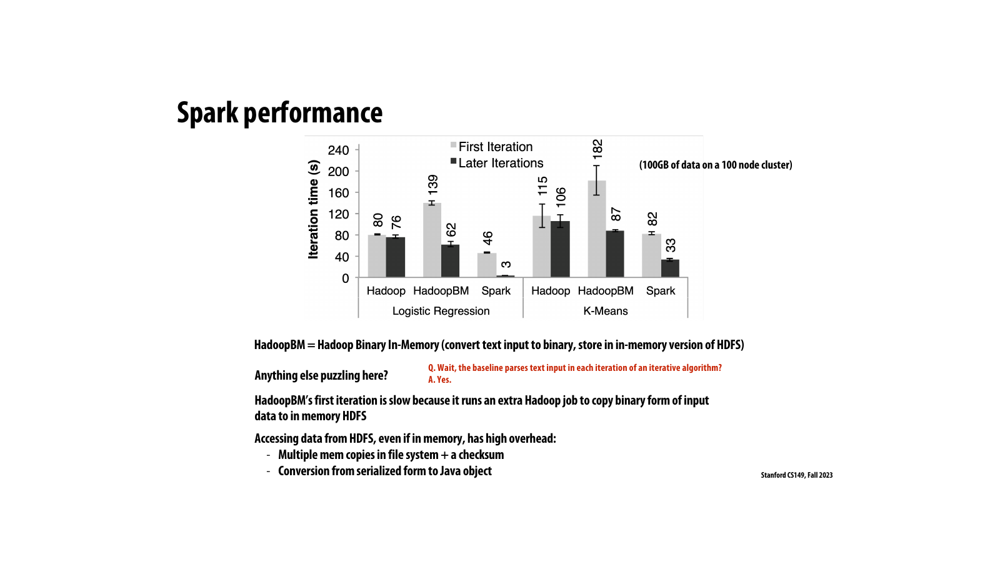

*공식 Lecture 9 슬라이드 PDF 52쪽 — 100 GB/100-node iterative benchmark에서
first iteration과 reused-state later iterations을 분리한 Spark performance 근거.*

| 관점 | 해설 |
| ---- | ---- |
| 슬라이드가 보여 주는 사실 | Logistic regression의 first/later iteration은 Hadoop 80/76 s, HadoopBM 139/62 s, Spark 46/3 s이고, k-means는 각각 115/106 s, 182/87 s, 82/33 s다. HadoopBM의 initial binary-copy job과 in-memory HDFS의 memory copy, checksum, Java-object conversion cost도 명시한다. |
| 강의 논리에서의 의미 | Spark의 가장 큰 차이가 later iteration에서 나타난다는 것은 reused working set을 execution engine 안에 유지하는 경로가 iterative workload의 repeated file-system materialization을 줄인다는 강의의 주장을 뒷받침한다. |
| 한계와 trade-off | Cache warm-up과 initial load를 포함한 first-result latency는 여전히 크고, memory retention은 capacity·serialization·eviction cost를 만든다. 따라서 이 graph는 특정 2023 lecture benchmark의 reuse 효과이지 현재 Spark의 보편적 speedup 보증이 아니다. |

HadoopBM은 text input을 binary로 바꾸어 in-memory HDFS에 두지만 first iteration에 extra
Hadoop copy job이 필요하다. HDFS data가 DRAM에 있더라도 filesystem stack의 multiple
memory copies, checksum, serialized form에서 Java object로의 conversion overhead가 남는다.
“Media가 memory인가?”와 “Access path가 cheap한가?”는 다른 질문이다.

이 benchmark에서 얻어야 할 일반 원칙은 다음과 같다.

* Reuse가 없는 first pass는 parsing, input load, setup cost를 그대로 낸다.
* Iterative workload에서는 same working set의 later pass가 in-memory design의 이익을
  보여 준다.
* Binary/in-memory filesystem만으로 execution engine의 object/serialization overhead가
  사라지지 않는다.
* First iteration과 steady-state iteration을 분리해 보고해야 원인을 설명할 수 있다.

## Scale Out Is Not the Entire Story

많은 node에서 잘 scale한다는 사실만으로 implementation이 빠르다는 결론을 낼 수 없다.
Distributed framework 자체의 scheduling, serialization, communication, generic object
layout overhead를 더 많은 machines로 병렬화하고 있을 수도 있다.

강의는 McSherry 등의 “Scalability! But at what COST?”를 인용하며 COST를
“Configuration that Outperforms a Single Thread”로 정의한다. 즉 optimized single-threaded
baseline보다 빨라지는 데 몇 cores/machines가 필요한지를 묻는다. 어떤 system은 논문에
사용된 어느 configuration에서도 best single-thread implementation을 이기지 못해
unbounded COST를 가질 수 있다.

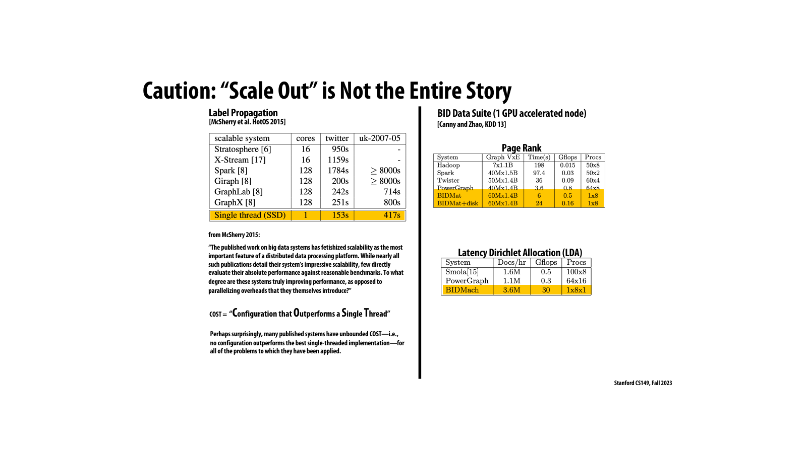

*공식 Lecture 9 슬라이드 PDF 54쪽 — scale-out curve와 absolute baseline을
같이 보라는 COST 비판과 single-GPU comparison 증거.*

| 관점 | 해설 |
| ---- | ---- |
| 슬라이드가 보여 주는 사실 | Label Propagation table에서 single-thread SSD는 Twitter 153 s와 uk-2007-05 417 s를 보이며, 여러 16/128-core systems의 절대 시간보다 빠르다. 오른쪽 BID Data Suite는 one-GPU-accelerated node와 Hadoop, Spark, Twister, PowerGraph 등의 PageRank/LDA 결과를 병치한다. |
| 강의 논리에서의 의미 | More resources에서 throughput이 증가하는 scalability와 optimized baseline보다 빠른 absolute performance는 별개 질문이다. COST는 framework가 만든 overhead를 병렬화한 것인지, 실제 problem time을 줄인 것인지 드러내는 baseline discipline이다. |
| 한계와 trade-off | COST는 workload, implementation quality, hardware, dataset size에 민감하고, single-node result만으로 elasticity·capacity·fault tolerance·multi-tenancy의 가치를 평가할 수는 없다. Absolute time과 resource-seconds, data capacity, recovery requirement를 함께 비교해야 한다. |

```text
weak evaluation
  framework on 1 node -> framework on 10 -> 100 -> 1000 nodes
  conclusion: scales well

stronger evaluation
  best practical single-thread baseline
  best single-node parallel baseline
  distributed framework at increasing scale
  conclusion: absolute time + resource efficiency + scale behavior
```

공식 슬라이드는 PageRank baseline을 추가 optimization했을 때 110초까지 낮아졌다는 예와,
single GPU-accelerated node가 distributed graph/ML workload에서 강력한 baseline이 될 수
있다는 사례를 함께 보여 준다. 메시지는 distributed system이 불필요하다는 것이 아니다.
Elasticity, data capacity, failure handling, multi-tenant operation 같은 어려운 문제를 해결하지만,
scale-out과 single-node efficiency를 둘 다 측정해야 한다는 것이다.

Spark performance improvement 방향으로 슬라이드는 다음을 든다.

* Efficient code generation과 SIMD kernels
* GPU/accelerator target
* Array-of-structs 대신 struct-of-arrays 같은 vector-friendly storage layout
* Spark Project Tungsten, Weld, SparkGPU 같은 system effort
* Distributed systems의 elasticity와 HPC의 low-overhead execution을 결합하는 방향

High-level RDD abstraction이 scheduling semantic을 제공해도 data representation과 generated
code가 CPU/GPU에 비효율적이면 single-node COST가 커질 수 있다. Parallelism과 locality에
더해 instruction efficiency와 layout이 필요하다.

## The Spark Ecosystem as a Shared Substrate

공식 슬라이드의 마지막은 Spark abstraction 위에 domain-specific frameworks를 구성하는
ecosystem을 보여 준다. SQL query output, machine learning library, graph processing
library가 공통 collection representation과 scheduler를 사용하면 서로의 결과를 한
application에서 compose할 수 있다.

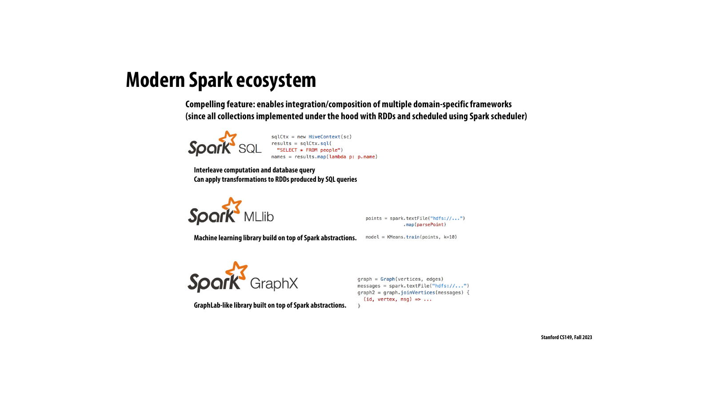

*공식 Lecture 9 슬라이드 PDF 57쪽 — Spark SQL, MLlib, GraphX가 RDD
collection model과 Spark scheduler를 공유하는 ecosystem composition.*

| 관점 | 해설 |
| ---- | ---- |
| 슬라이드가 보여 주는 사실 | Spark SQL이 만든 query result에 일반 transformation을 적용하고, MLlib의 `KMeans.train` input과 GraphX의 vertex/edge graph 또한 Spark collection과 scheduler 위에 올라간다. |
| 강의 논리에서의 의미 | Domain library별로 별도 storage/runtime boundary를 만들지 않고 SQL → application transform → ML/graph processing을 한 distributed collection dataflow에서 구성할 수 있다. 공통 partition, scheduling, lineage semantics가 interoperation의 substrate가 된다. |
| 한계와 trade-off | Shared substrate는 composition과 operations를 단순화하지만 domain-specific layout, accelerator kernel, optimizer의 최적 효율을 자동으로 보장하지 않는다. Common scheduler의 편의와 specialized execution path의 효율을 end-to-end data movement로 비교해야 한다. |

```text
SQL query -> distributed collection
                 |
                 +-> ML transformations
                 |
                 +-> graph transformations
                 |
                 +-> general RDD operations
```

Compelling feature는 각 domain library가 별도 storage format과 cluster runtime 사이를 매번
왕복하지 않아도 된다는 점이다. SQL에서 만든 distributed collection에 application
transformation을 붙이고, 그 결과를 ML/graph processing에 전달할 수 있다.

이 ecosystem view에서도 RDD의 역할은 “모든 high-level API가 직접 노출해야 하는 유일한
user interface”가 아니라, partitioned data와 scheduling/recovery를 공유하는 substrate다.
강의의 역사적 framing을 읽을 때 현재 Spark API surface와 2023 lecture slide의 RDD 중심
설명을 구분해야 한다.

## GPU Systems Lens

이 절과 이어지는 Practical Tips는 강의 내용을 GPU/AI data center 관점에 적용한 추가
노트다. 공식 영상이나 슬라이드의 직접 주장으로 간주하지 않는다.

| Lecture 9 concept | GPU/AI systems interpretation |
| ----------------- | ----------------------------- |
| HDFS block | Sharded dataset, object-store object, checkpoint shard |
| Data-local mapper | GPU가 붙은 node 가까이 data decode/preprocess 배치 |
| RDD partition | Batch shard, table partition, tensor/model shard의 scheduling unit |
| Narrow dependency | Decode -> augment -> batch처럼 node-local pipeline 가능 |
| Wide dependency | All-to-all, repartition, embedding exchange, MoE token dispatch |
| `partitionBy` | Rank/expert/feature ownership을 미리 정해 repeated redistribution 제거 |
| `persist` | Reused features, embeddings, graph state를 host/device memory에 cache |
| Lineage recovery | Lost preprocessing/output shard를 deterministic pipeline으로 재생성 |
| Speculative execution | Straggling data task duplicate; collective task에는 신중히 적용 |
| COST | Multi-GPU scale curve 전에 optimized single-GPU baseline 요구 |

GPU cluster에는 locality hierarchy가 더 깊다.

```text
GPU registers/shared memory/HBM
  -> intra-node GPU fabric
  -> host DRAM and PCIe
  -> same-rack network
  -> cross-rack fabric
  -> local NVMe / distributed object storage
```

Spark의 “move computation to data”를 그대로 적용하면 GPU가 있는 node에서 decode와 feature
transform을 실행하고, host-to-device transfer 전에 narrow preprocessing chain을 fuse하는
방향이 된다. 하지만 GPU는 scarce/expensive resource이므로 data locality만 기다리다가
accelerator가 idle하면 손해가 더 클 수 있다. CPU preprocessing placement, GPU queueing,
network transfer를 end-to-end로 봐야 한다.

Wide dependency는 distributed training의 collective와 닮았다. 둘 다 partition ownership이
바뀌며 network가 critical path가 된다. 다만 Spark shuffle은 record/key redistribution이고
NCCL collective는 dense tensor operation이라는 차이가 있다. 같은 용어로 뭉뚱그리지 말고
message size distribution, synchronization semantics, topology algorithm을 따로 측정해야 한다.

RDD lineage와 ML checkpoint도 유사점과 차이가 있다. Deterministic preprocessing shard는
lineage로 재생성하기 쉽지만, optimizer state와 random sampling, nondeterministic GPU
kernels가 포함된 training step은 exact replay가 어렵다. AI system에서는 dataset lineage,
model checkpoint, RNG state, external side effect를 별도 recovery layer로 다루어야 한다.

## Practical Tips and Notes

### 먼저 byte-flow를 그리기

Logical DAG만 보면 `map`, `filter`, `join`이 모두 한 node처럼 보인다. Physical review에서는
각 edge에 다음 값을 붙인다.

```text
records
bytes before compression
bytes on wire
serialization/deserialization bytes
spill bytes
reuse count
producer and consumer placement
```

Stage time이 길 때 CPU utilization만 보면 shuffle bottleneck을 놓칠 수 있다. Input,
shuffle read/write, local spill, output bytes를 함께 봐야 한다.

### Data locality와 producer-consumer locality를 분리하기

두 locality는 관련 있지만 같은 것이 아니다.

* Data placement locality: Task가 input block/cache가 있는 node에서 실행되는가?
* Producer-consumer locality: 앞 operator의 output이 register/cache/DRAM에 있을 때 다음
  operator가 소비하는가?

Input-local mapper라도 매 transformation을 disk에 materialize하면 temporal locality를
잃는다. 반대로 narrow operator를 fuse해도 source가 remote이면 initial network read는
남는다. 두 항목을 별도로 측정한다.

### Partition count보다 partition distribution 보기

Average partition size가 적절해도 one hot partition이 stage tail을 지배할 수 있다.
다음을 percentile로 기록한다.

* Records와 bytes per partition
* Task duration
* Shuffle fetch time과 spill bytes
* Peak execution memory
* Retry count

Median만 보지 말고 `p95`, `p99`, maximum을 본다. Max/median ratio가 크면 worker 수를
늘리기 전에 key skew와 partitioner를 의심한다.

### Repartition 비용을 downstream reuse와 함께 계산하기

`partitionBy`는 future join을 싸게 만들지만 upfront shuffle이다. 다음 break-even을
estimate한다.

```text
upfront repartition cost
  < avoided shuffle cost per downstream operation × reuse count
```

One-shot join이면 repartition/persist가 더 비쌀 수 있다. 같은 keyed datasets를 반복 join,
lookup, aggregation한다면 co-partitioning의 이익이 커진다.

### Cache는 reuse와 rebuild cost에만 쓰기

모든 intermediate를 persist하면 memory pressure로 useful partitions가 evict되고 spill과
garbage collection이 늘 수 있다. Candidate마다 다음을 적는다.

| Question | Why it matters |
| -------- | -------------- |
| 몇 actions/branches가 재사용하는가? | One-use data면 cache benefit가 작음 |
| Parent scan/transform이 얼마나 비싼가? | Cheap lineage는 recompute가 나을 수 있음 |
| Serialized size와 object size가 얼마인가? | File size만으로 memory footprint를 예측하기 어려움 |
| Failure 시 rebuild 범위는 얼마인가? | Long/wide lineage면 durable cut point 가치가 큼 |
| Cache가 다른 working set을 밀어내는가? | Local benefit가 global slowdown이 될 수 있음 |

### `collect`를 dataset-size contract로 다루기

`collect`는 distributed RDD 전체를 host/driver-side collection으로 가져오는 action이다.
Result cardinality가 unbounded이면 executor memory가 충분해도 driver memory와 network fan-in이
실패할 수 있다. `collect` 전에 size estimate, limit/sample, aggregate output인지 확인한다.

> [!WARNING]
> “Cluster memory에 들어간다”와 “한 driver process에 들어간다”를 혼동하면 안 된다.
> Distributed capacity는 `collect`가 만드는 centralized result의 capacity를 보장하지 않는다.

### Key skew를 average load로 숨기지 않기

Hash partitioner는 keys 수를 균등하게 보낼 수 있어도 record frequency를 균등하게 만들지
못한다. 한 user-agent, customer, expert가 대부분 records를 가지면 한 reducer가 hot spot이
된다. Heavy hitter sampling, key salting, two-level aggregation, custom partitioner를 검토하되
aggregation semantics가 보존되는지 확인한다.

### `reduceByKey`와 raw grouping의 communication 의미 확인하기

Sum/count처럼 associative combine이 가능하면 producer side에서 local partial을 먼저 만들고
작은 aggregate만 shuffle하는 구조가 유리하다. 모든 raw values가 꼭 필요한 operation에서만
full grouping을 유지한다. 중요한 것은 API 이름 암기가 아니라 “network를 건너야 하는
value가 raw records인가 partial aggregate인가?”를 묻는 것이다.

### Failure drill로 lineage assumption 검증하기

Fault tolerance는 정상 run success만으로 검증되지 않는다. Staging environment에서 다음을
관찰한다.

1. Cached partition을 가진 worker를 중단한다.
2. Scheduler가 lost partition을 정확히 식별하는지 본다.
3. Recomputed task가 persistent input/cached ancestor 중 무엇을 읽는지 확인한다.
4. Retry 뒤 output checksum/count가 baseline과 같은지 확인한다.
5. Recovery 동안 extra network, spill, stage delay를 기록한다.

Non-deterministic UDF나 external side effect가 있으면 이 drill에서 duplicate/mismatched result가
드러날 수 있다.

### Checkpoint interval을 failure rate와 replay time으로 정하기

“Lineage가 N operators면 checkpoint” 같은 고정 rule보다 다음을 측정한다.

```text
expected recovery cost
  ≈ failure probability during interval × replay time

steady-state checkpoint cost
  ≈ checkpoint frequency × durable write time
```

Wide shuffle, expensive source parse, long iteration chain 뒤에는 replay time이 급증할 수 있다.
Operator count보다 measured rebuild time을 기준으로 cut point를 정한다.

### First iteration과 steady state를 분리하기

Spark slide의 benchmark처럼 first pass에는 input load, parsing, code generation, cache warm-up,
partition materialization이 포함될 수 있다. Later iteration만 보고 startup을 숨기거나 first
iteration만 보고 reuse benefit를 무시하지 않는다. 다음 세 시간을 함께 보고한다.

* Time to first result
* Steady-state iteration/query time
* End-to-end total time including materialization and output

### Scale curve에 resource efficiency를 붙이기

Node count가 늘며 wall time이 줄어도 total resource-seconds와 cost가 더 빠르게 늘 수 있다.

```text
resource-seconds = nodes × elapsed seconds
```

Best single-thread, best single-node parallel, best single-GPU baseline을 포함하고, node/GPU를
두 배로 늘렸을 때 throughput, latency, resource-seconds, network bytes가 어떻게 변하는지
기록한다.

> [!TIP]
> 새 distributed optimization의 첫 질문은 “몇 배 scale했는가?”가 아니라 “어떤 byte
> movement 또는 repeated materialization을 제거했는가?”로 두면 원인과 재현 조건이
> 훨씬 선명해진다.

### GPU path에서는 host와 device materialization을 모두 보기

Columnar/contiguous layout은 SIMD와 GPU processing에 유리하지만, row object를 columnar
buffer로 바꾸고 다시 device buffer로 copy하는 cost가 생길 수 있다. CPU parse, host
layout conversion, PCIe/NVLink transfer, kernel, result serialization을 end-to-end timeline에
놓는다. GPU kernel만 빨라도 surrounding Spark stage가 느리면 COST가 개선되지 않는다.

### Quick Reference: Symptom to First Check

| Symptom | First check | Likely concept |
| ------- | ----------- | -------------- |
| CPU가 낮고 stage가 오래 걸림 | Shuffle/network/spill bytes | Wide dependency |
| 대부분 task는 빠르고 마지막 하나만 느림 | Max partition bytes, hot keys | Skew/straggler |
| 두 번째 action도 source를 다시 읽음 | Reused branch의 persist/materialization | Cache policy |
| Join마다 큰 shuffle 발생 | 두 inputs의 partitioner/count | Co-partitioning |
| Node failure 뒤 거의 whole job replay | Wide ancestors와 checkpoint 위치 | Lineage recovery scope |
| Memory cache를 늘렸는데 느려짐 | Eviction, spill, object size, GC | Capacity vs useful reuse |
| `collect`에서 driver crash | Output cardinality와 driver heap | Centralized action |
| Node 수를 늘려도 absolute time이 나쁨 | Optimized single-node baseline, resource-seconds | COST |
| GPU utilization이 낮음 | Decode/serialization/H2D timeline | Producer-consumer locality |

## Lecture Summary

Lecture 9는 data-parallel model이 single chip과 GPU를 넘어 warehouse-scale computer를
program하는 핵심 abstraction이 될 수 있음을 보여 준다. Cluster는 aggregate compute와
I/O bandwidth를 제공하지만 separate address spaces, heterogeneous nodes, network hierarchy,
routine failure라는 새로운 조건을 가져온다.

Distributed file system은 large input을 blocks로 나누고 rack-aware replication으로 durable
source를 만든다. MapReduce는 block당 mapper와 key partition당 reducer를 만들고,
data-local scheduling, hash partitioning, shuffle, retry, speculation을 runtime이 맡는다.
Functional input immutability 덕분에 task replay와 duplicate execution이 가능하다.

MapReduce의 약점은 complex DAG와 reused intermediate에 있다. Iterative PageRank나 repeated
query가 매 step HDFS read/write를 거치면 aggregate DRAM의 bandwidth와 capacity를 활용하지
못한다. Spark는 intermediate를 RDD로 표현하고, data 자체의 durable copy 대신 deterministic
transformation lineage를 기록한다.

RDD의 partition dependency는 performance와 resilience를 동시에 결정한다. Narrow edge는
producer-consumer fusion, streaming, local placement, selective recovery를 가능하게 한다.
Wide edge는 required shuffle와 stage boundary를 나타내며 communication과 recomputation
scope를 넓힌다. Compatible partitioner로 repeated join을 narrow하게 만들거나 expensive
branch를 persist하는 것은 graph structure를 physical cost에 맞추는 작업이다.

마지막 교훈은 scale-out을 speed와 동일시하지 말라는 것이다. Distributed framework는
elasticity, capacity, resilience, usability를 제공하지만 generic scheduling과 representation
overhead도 갖는다. Absolute runtime, optimized single-node/GPU baseline, resource efficiency,
failure recovery를 함께 측정해야 “많이 병렬화된 system”과 “실제로 효율적인 system”을
구분할 수 있다.

## Key Terms

| Term | Meaning in this lecture |
| ---- | ----------------------- |
| Warehouse-scale computer (WSC) | 수천 server, network, power, cooling, storage를 하나의 computer처럼 설계하는 system |
| Node | 별도 OS와 private address space를 실행하는 cluster computer |
| Rack / top-of-rack switch | Server group과 그 group을 datacenter network에 연결하는 topology/failure domain |
| Message passing | Separate address spaces 사이에서 `send`/`receive`로 data와 ordering을 전달하는 model |
| MPI | Explicit message-passing program을 위한 interface; 강의에서는 lower-level alternative로 소개 |
| Distributed file system | Global namespace와 replicated blocks로 cluster data를 durable하게 저장하는 system |
| GFS | Google File System; distributed file system design의 대표 사례 |
| HDFS | Hadoop Distributed File System; NameNode/DataNode와 replicated blocks를 사용하는 system |
| NameNode | Filename/block/replica location metadata를 관리하는 HDFS master |
| DataNode | 실제 replicated file blocks를 저장하고 client에 제공하는 worker storage node |
| Map | Independent input records에 side-effect-free unary function을 적용하는 data-parallel operation |
| Reduce | Collection elements를 associative combine으로 aggregate하는 operation |
| MapReduce | Map, key grouping/shuffle, reduce로 구성된 cluster programming model |
| Shuffle | Key/partition rule에 맞춰 records를 nodes/partitions 사이에 재분배하는 communication phase |
| Data locality | Task를 input block 또는 cached partition과 가까운 node/rack에 배치하는 property |
| Producer-consumer locality | Intermediate를 멀리 materialize하지 않고 producer output을 consumer가 곧바로 쓰는 property |
| Job scheduler | Task placement, load balance, heartbeat, retry, straggler handling을 관리하는 runtime component |
| Heartbeat | Worker가 살아 있음을 scheduler에 주기적으로 알리는 liveness message |
| Straggler | Fail하지 않았지만 다른 task보다 비정상적으로 늦어 stage tail을 늘리는 task |
| Speculative execution | Slow task의 duplicate를 실행해 먼저 끝난 result를 채택하는 technique |
| Working set | Execution interval에 actively accessed/reused되는 data subset |
| RDD | Immutable, partitioned, deterministically derived, lineage-recoverable record collection |
| Partition | RDD의 scheduling, placement, recovery unit |
| Transformation | Input RDD에서 새 RDD와 dependency를 만드는 bulk data-parallel operator |
| Action | RDD computation의 result를 host application이나 external storage에 제공하는 operation |
| Lineage | RDD partition을 만들기 위한 deterministic transformations와 dependencies의 log/recipe |
| Persist | Reused RDD partitions를 memory 등에 유지하도록 runtime에 주는 request |
| Checkpoint | Long lineage를 자르기 위해 RDD state를 durable storage에 materialize하는 recovery cut point |
| Narrow dependency | 한 parent partition이 최대 하나 child partition에 공급되어 local pipeline이 가능한 dependency |
| Wide dependency | 한 parent partition이 여러 child partitions에 공급되어 shuffle이 필요한 dependency |
| Partitioner | Key를 output partition ID에 mapping하는 rule |
| Co-partitioning | 여러 keyed datasets가 같은 partitioner를 사용해 local join/aggregation이 가능한 상태 |
| Fusion | Consecutive operators를 한 pass/pipeline으로 실행해 intermediate traffic을 줄이는 transform |
| Materialization | Logical intermediate의 contents를 memory, local disk, durable storage에 실제로 생성하는 것 |
| COST | Optimized single-thread execution을 처음 이기는 distributed configuration을 묻는 평가 관점 |

## Questions

1. 100 TB scan example에서 cluster의 직접적인 performance benefit은 무엇인가?
2. Cluster node 사이에서 shared-memory load/store를 사용할 수 없는 이유는 무엇인가?
3. Message passing은 communication과 synchronization을 어떻게 함께 표현하는가?
4. HDFS가 block replicas를 서로 다른 rack에 두는 이유는 무엇인가?
5. NameNode와 DataNode의 역할은 어떻게 다른가?
6. Map operation의 side-effect freedom이 failure recovery에 왜 중요한가?
7. MapReduce를 `MapGroupByKeyReduce`라고 부르는 이유는 무엇인가?
8. Map task를 input block이 있는 node에서 실행하면 어떤 traffic을 줄일 수 있는가?
9. Hash partitioner는 reducer input correctness를 어떻게 보장하는가?
10. Scheduler는 failed task와 straggler를 각각 어떻게 처리하는가?
11. PageRank에서 classic MapReduce가 비효율적인 이유는 무엇인가?
12. RDD가 resilient하다는 것은 모든 partition이 replicated된다는 뜻인가?
13. Transformation과 action은 어떤 차이가 있는가?
14. `persist`가 유리한 RDD와 불리한 RDD는 각각 어떤 특성을 가지는가?
15. RDD partition이 scheduling, placement, recovery unit이라는 말은 무엇을 뜻하는가?
16. Narrow dependency가 operation fusion을 가능하게 하는 이유는 무엇인가?
17. `groupByKey`가 wide dependency를 만드는 이유는 무엇인가?
18. 같은 two RDD join이 partitioner에 따라 narrow 또는 wide가 되는 과정을 설명하라.
19. Node failure로 두 output partitions를 잃었을 때 lineage recovery는 무엇을 다시 계산하는가?
20. Long/wide lineage에서 checkpoint가 필요한 이유는 무엇인가?
21. Spark benchmark에서 first iteration과 later iteration을 분리해야 하는 이유는 무엇인가?
22. COST가 단순 strong/weak scaling graph보다 더 묻는 질문은 무엇인가?
23. GPU cluster에서 Spark의 narrow/wide dependency와 비슷한 dataflow는 무엇인가?
24. Distributed pipeline의 correctness와 performance를 검증할 때 어떤 failure experiment를 할 수 있는가?

## Answers

1. **Aggregate I/O bandwidth가 증가한다.** 1,000 nodes가 각 local block을 읽으면 single
   node보다 input scan bandwidth를 크게 늘릴 수 있다. Ideal speedup은 balance, network,
   coordination overhead가 작다는 가정 아래의 값이다.

2. **각 node가 별도 OS와 private address space를 가지기 때문이다.** Node 0의 pointer는
   Node 1의 memory object를 직접 지칭하지 않으므로 bytes를 network message로 옮겨야 한다.

3. **Receive가 matching send의 data 도착을 기다리는 ordering event가 된다.** 별도의
   shared-memory barrier 없이 producer-consumer dependency를 표현할 수 있지만 mismatched
   blocking operations는 deadlock을 만들 수 있다.

4. **Rack-level failure에도 data를 남기기 위해서다.** Replica가 모두 같은 rack에 있으면
   top-of-rack switch나 rack power failure가 모든 copies를 동시에 unreachable하게 만든다.

5. **NameNode는 metadata, DataNode는 payload를 맡는다.** Client는 NameNode에서 block
   locations를 얻고 실제 bytes는 선택한 DataNode에서 직접 읽는다.

6. **같은 input partition에 mapper를 다시 적용해 같은 logical output을 만들 수 있기
   때문이다.** Input mutation이나 non-idempotent side effect가 있으면 retry/speculation이
   result를 바꿀 수 있다.

7. **Map과 reduce 사이에 same-key records를 모으는 grouping/shuffle이 반드시 있기
   때문이다.** 이 middle phase가 reducer correctness를 보장하고 주요 network cost를 만든다.

8. **Input block 전체의 network transfer를 줄인다.** 작은 task/code를 data가 있는 node로
   보내 local SSD/DRAM path에서 처리하는 “move computation to data” 전략이다.

9. **모든 mapper가 같은 `hash(key) mod R` rule을 사용한다.** 따라서 어느 mapper가 key를
   만들었든 same key records는 같은 logical reduce partition으로 간다.

10. **Failure는 heartbeat로 탐지해 task를 다른 node에서 replay하고, straggler는 duplicate
    copy를 실행해 먼저 끝난 result를 채택할 수 있다.** 후자는 resource overhead가 있으므로
    늦은 tail에 선택적으로 써야 한다.

11. **매 iteration이 HDFS read와 HDFS write를 거치기 때문이다.** Reused graph/model state가
    memory에 들어가도 filesystem copy, checksum, serialization, storage path를 반복한다.

12. **아니다.** RDD resilience의 핵심은 lost partition을 persistent ancestor와 deterministic
    lineage로 재계산할 수 있다는 것이다. Replication은 별도의 storage/recovery choice다.

13. **Transformation은 새 RDD와 dependency를 만들고, action은 host value나 durable output을
    요구한다.** 이 구분을 통해 runtime은 action이 요구한 lineage를 plan하고 materialization
    boundary를 결정할 수 있다.

14. **여러 branches/actions가 재사용하고 rebuild가 비싼 RDD는 persist 가치가 크다.** 한 번만
    소비되거나 parent chain이 cheap한 RDD는 cache materialization과 memory pressure가 더
    비쌀 수 있다.

15. **Partition 하나가 task의 input slice이며 특정 worker/node에 놓이고, loss 시 그 slice를
    다시 만드는 단위라는 뜻이다.** Partition granularity가 parallelism, overhead, tail,
    recovery cost를 함께 결정한다.

16. **Child partition이 특정 parent partition만 필요로 하기 때문이다.** 같은 worker가 record를
    `map -> filter`로 바로 흘려 intermediate full partition을 저장하거나 network로 보낼 필요가
    없다.

17. **한 output key partition이 여러 parent partitions의 records를 요구하기 때문이다.** 각
    parent도 여러 output buckets에 records를 보낼 수 있어 all-to-all shuffle이 생긴다.

18. **Partitioner가 다르면 same key를 collocate하기 위해 양쪽 records를 재분배해야 하므로
    wide하다.** 같은 partitioner로 co-partitioned되어 있으면 `A_i`와 `B_i`만 local join해
    narrow하게 실행할 수 있다.

19. **Lost output partitions에 필요한 source block/parent partitions와 그 branch의 transformations만
    다시 계산한다.** Unaffected output partitions 전체를 재실행할 필요는 없다. Wide ancestors가
    있으면 required scope는 더 넓어질 수 있다.

20. **Failure 시 replay해야 할 work와 shuffle dependency가 너무 커질 수 있기 때문이다.** Durable
    checkpoint는 lineage의 recovery path를 잘라 normal-case write cost와 worst-case replay
    cost를 trade한다.

21. **First iteration에는 load, parse, setup, materialization이 있고 later iteration은 reuse
    benefit를 반영하기 때문이다.** 둘 중 하나만 보고하면 time-to-first-result 또는 steady-state
    efficiency를 숨긴다.

22. **Optimized single-thread baseline을 실제로 언제 이기는지를 묻는다.** More nodes에서 같은
    framework가 scale하는 것뿐 아니라 absolute performance와 framework overhead를 평가한다.

23. **Node-local decode/augment pipeline은 narrow dependency와, repartition/all-to-all/MoE token
    dispatch는 wide dependency와 비슷하다.** 다만 Spark record shuffle과 dense tensor collective의
    semantics와 transport pattern은 구분해야 한다.

24. **Cached partitions를 가진 worker를 의도적으로 중단하고 selective replay를 관찰한다.** Output
    checksum, recomputation scope, extra network/spill, recovery latency를 baseline과 비교하면
    determinism과 lineage assumption을 함께 검증할 수 있다.

---

## References and Further Reading

강의의 주 근거는 위의 official video와 slides다. 다음 자료는 슬라이드가 직접 인용하거나
후속 탐구 대상으로 언급한 original/official references다.

* [Resilient Distributed Datasets: A Fault-Tolerant Abstraction for In-Memory Cluster Computing](https://www.usenix.org/system/files/conference/nsdi12/nsdi12-final138.pdf)
* [The Google File System](https://static.googleusercontent.com/media/research.google.com/en//archive/gfs-sosp2003.pdf)
* [Disk Locality in Datacenter Computing Considered Irrelevant](https://www.usenix.org/legacy/events/hotos11/tech/final_files/Ananthanarayanan.pdf)
* [Scalability! But at what COST?](https://www.usenix.org/system/files/conference/hotos15/hotos15-paper-mcsherry.pdf)
* [Apache Spark documentation](https://spark.apache.org/docs/latest/)
