# Lecture 10: Efficiently Evaluating DNNs on GPUs

Source: [Stanford CS149 Fall 2023 Lecture 10 video](https://www.youtube.com/watch?v=qbKtU0X6-WU)

Course materials:

* [Official lecture page](https://gfxcourses.stanford.edu/cs149/fall23/lecture/dnneval/)
* [Lecture 10 slides PDF](https://gfxcourses.stanford.edu/cs149/fall23content/media/dnneval/10_dnneval.pdf)
* [CS149 Fall 2023 course page](https://gfxcourses.stanford.edu/cs149/fall23)

Additional primary references used to clarify the systems mechanisms shown in the slides:

* [NVIDIA CUTLASS: Implicit GEMM Convolution](https://github.com/NVIDIA/cutlass/blob/main/media/docs/cpp/implicit_gemm_convolution.md)
* [NVIDIA cuDNN Graph API](https://docs.nvidia.com/deeplearning/cudnn/latest/developer/graph-api.html)
* [FlashAttention paper](https://arxiv.org/abs/2205.14135)

> 영상의 `00:05–05:57`은 Assignment 3의 circle renderer와 ordering constraint를
> 설명한다. Lecture 10의 본론은 `06:07`부터 시작한다. 아래 노트는 공식 영상의
> timestamped transcript와 68-page 공식 슬라이드를 대조해 재구성했다. 영상의
> auto-caption에서 불명확한 수치와 수식은 슬라이드를 기준으로 정리했다.

## Table of Contents

* [Goal](#goal)
* [Lecture Overview](#lecture-overview)
* [Visual Map](#visual-map)
* [DNN Evaluation as a Systems Problem](#dnn-evaluation-as-a-systems-problem)
* [A Minimal Computational View of DNNs](#a-minimal-computational-view-of-dnns)
* [Fully Connected Layers as Linear Algebra](#fully-connected-layers-as-linear-algebra)
* [Convolutional Layers and Tensor Shapes](#convolutional-layers-and-tensor-shapes)
* [Four Levers for DNN Efficiency](#four-levers-for-dnn-efficiency)
* [Topology Innovation Changes the Workload](#topology-innovation-changes-the-workload)
* [Layer Scheduling Starts from the Loop Nest](#layer-scheduling-starts-from-the-loop-nest)
* [Convolution-to-GEMM Mapping](#convolution-to-gemm-mapping)
* [Explicit GEMM and im2col](#explicit-gemm-and-im2col)
* [Why Naive GEMM Is Memory-Bound](#why-naive-gemm-is-memory-bound)
* [Blocked and Hierarchical GEMM](#blocked-and-hierarchical-gemm)
* [SIMD and Register-Level Scheduling](#simd-and-register-level-scheduling)
* [One Network Needs Many Schedules](#one-network-needs-many-schedules)
* [Implicit GEMM](#implicit-gemm)
* [Parallel Slack, Batch Size, and GPU Utilization](#parallel-slack-batch-size-and-gpu-utilization)
* [Alternative Convolution Algorithms](#alternative-convolution-algorithms)
* [Libraries as Collections of Specialized Kernels](#libraries-as-collections-of-specialized-kernels)
* [Memory Traffic Between Layers](#memory-traffic-between-layers)
* [Operator Fusion](#operator-fusion)
* [Transformers and the Attention Workload](#transformers-and-the-attention-workload)
* [Stable Softmax and Chunk Composition](#stable-softmax-and-chunk-composition)
* [Fused Attention](#fused-attention)
* [Fusion in DNN Frameworks and Compilers](#fusion-in-dnn-frameworks-and-compilers)
* [Low Precision and Specialized Instructions](#low-precision-and-specialized-instructions)
* [Why GPUs Fit DNNs and Where They Do Not](#why-gpus-fit-dnns-and-where-they-do-not)
* [Tensor Cores and Amortized Control](#tensor-cores-and-amortized-control)
* [GPU Systems Lens](#gpu-systems-lens)
* [Practical Tips and Notes](#practical-tips-and-notes)
* [Lecture Summary](#lecture-summary)
* [Key Terms](#key-terms)
* [Questions](#questions)
* [Answers](#answers)

---

## Goal

이번 강의의 목표는 deep neural network(DNN)를 하나의 거대한 수학식으로 보지 않고,
서로 다른 shape와 dependency를 가진 tensor operation들의 dataflow graph로 본 뒤 GPU의
compute와 memory hierarchy에 맞게 schedule하는 사고를 익히는 것이다.

핵심 메시지는 다음과 같다.

> DNN evaluation의 성능은 FLOP 수만으로 결정되지 않는다. Convolution이나 matrix
> multiplication의 loop order를 바꾸어 data reuse를 만들고, intermediate tensor가
> off-chip memory로 왕복하지 않도록 operation을 fuse하며, shape마다 다른 kernel과
> precision을 선택해야 한다. 좋은 topology, 좋은 schedule, approximation, specialized
> hardware는 서로 대체하는 선택지가 아니라 함께 작동하는 optimization layer다.

이 강의가 답하려는 질문은 다음과 같다.

* DNN layer는 실제로 어떤 loop nest와 tensor shape를 가지는가?
* Convolution을 GEMM으로 바꾸면 무엇을 얻고 무엇을 잃는가?
* Matrix multiplication의 arithmetic intensity를 blocking으로 어떻게 높이는가?
* Explicit `im2col`의 storage와 DRAM traffic을 implicit GEMM이 어떻게 제거하는가?
* 같은 network의 layer마다 왜 다른 schedule이 필요한가?
* Conv, scale/bias, pooling을 fuse하면 왜 큰 이득이 생기는가?
* Attention의 `N x N` intermediate를 materialize하지 않고 exact result를 계산할 수 있는가?
* GPU가 DNN에 잘 맞는 이유와 general-purpose GPU의 비효율은 무엇인가?
* Tensor Core 같은 matrix instruction이 왜 높은 throughput과 energy efficiency를 제공하는가?

## Lecture Overview

강의는 먼저 Assignment 3 renderer를 짧게 설명한다. Circle을 input order대로 blend해야
하지만 서로 겹치지 않는 circle은 순서와 무관하다. Pixel별로 영향을 주는 circle list를
만들 수 있다면 pixel parallelism을 안전하게 얻을 수 있다는 예시는 이후 DNN에서도
반복되는 원칙을 미리 보여 준다. Correct dependency를 보존하면서 work를 재배치해야 한다.

본론은 DNN을 neuron의 의미가 아니라 computation graph로 단순화한다. Neuron은 weighted
sum, bias, nonlinearity로 구성된 작은 circuit이고, fully connected layer는 matrix-vector
product다. Image convolution은 spatially local한 input window와 shared weights의 dot
product이며, 여러 filter와 input channel, batch를 추가하면 7-deep loop nest가 된다.

첫 번째 optimization 축은 model topology다. 강의는 VGG, GoogLeNet, ResNet, MobileNet의
발전을 통해 비슷한 accuracy에서도 parameter와 multiply-add cost가 크게 달라질 수 있음을
보여 준다. Systems engineer가 고정된 workload만 최적화하면 algorithm innovation이 만든
변화를 놓친다.

두 번째 축은 주어진 layer를 hardware에 맞게 schedule하는 것이다. Convolution은 input
window를 row로 펴는 `im2col`을 통해 GEMM으로 표현할 수 있다. 그러나 explicit matrix는
activation을 filter area만큼 duplicate한다. GEMM 자체도 naive loop order로 실행하면
reuse를 놓쳐 bandwidth-bound가 된다. Blocking은 A, B, C tile을 cache/shared memory에
resident하게 두어 한 번 가져온 data로 많은 multiply-add를 수행한다.

Implicit GEMM은 전체 convolution matrix를 DRAM에 만들지 않는다. 필요한 tile만 tensor에서
gather해 on-chip shared memory에 구성한 뒤 tuned GEMM microkernel을 적용한다. 이 접근은
주소 계산과 irregular gather를 추가하지만 off-chip auxiliary storage와 expansion traffic을
없앤다. CUTLASS 같은 library는 tensor iterator, shared-memory GEMM, warp-level primitive를
조합할 수 있게 한다.

후반부는 layer boundary의 memory traffic으로 시선을 옮긴다. Conv output을 DRAM에 쓰고,
scale/bias가 다시 읽고 쓰며, pooling이 다시 읽는 식의 unfused execution은 낮은 arithmetic
intensity의 operator 때문에 전체 network를 늦춘다. Producer의 output tile이 on-chip에 있을
때 consumer를 실행하면 intermediate round trip을 제거할 수 있다.

Attention은 fusion의 더 어려운 사례다. Naive attention은 `S = QK^T`와
`P = softmax(S)`라는 `N x N` matrix를 materialize한다. Stable softmax의 max와 sum은 chunk
별 통계를 결합할 수 있으므로, query tile과 key/value tile을 순회하면서 output accumulator를
rescale할 수 있다. 이렇게 하면 exact attention을 유지하면서 quadratic intermediate를
만들지 않는다. 강의는 이를 producer-consumer locality와 loop reordering의 강력한 사례로
설명한다.

마지막으로 low precision과 specialized matrix instruction을 다룬다. DNN은 큰 dense
matrix operation, 많은 data parallelism, 높은 reuse potential 때문에 GPU에 잘 맞는다.
동시에 general-purpose instruction processing의 overhead가 남기 때문에 GPU도 dot-product와
matrix-multiply-accumulate(MMA) instruction을 추가한다. A100 slide의 Tensor Core 수치가 이
hardware/software co-design의 예다.

영상 기준 주요 구간은 다음과 같다.

| Time | Topic |
| ---- | ----- |
| `00:05–05:57` | Assignment 3 renderer: transparency ordering, overlap, correct-first parallelization |
| `06:07–08:18` | Lecture motivation, DNN evaluation on GPU/CPU, systems viewpoint |
| `08:19–12:28` | Neuron as circuit, ReLU, topology, fully connected layer as matrix-vector product |
| `12:29–18:57` | 2D convolution, learned filters, channels, ReLU, pooling, common CNN topologies |
| `18:58–25:51` | Optimization avenues, topology innovation, accuracy/cost and changing workloads |
| `25:52–27:44` | Batched convolution as a seven-loop nest |
| `27:45–34:18` | `im2col`, multiple filters/channels, convolution-to-GEMM mapping |
| `34:19–41:30` | Naive GEMM, arithmetic intensity, blocking and cache capacity |
| `41:31–47:59` | CPU cache vs. GPU shared memory, hierarchical blocking, SIMD schedules |
| `48:00–53:08` | Explicit GEMM footprint, implicit GEMM, address generation, CUTLASS |
| `53:09–55:03` | Batch size, output size, and enough parallel work to fill a GPU |
| `55:04–57:47` | Direct convolution, compiler scheduling, Winograd and FFT alternatives |
| `57:48–01:00:12` | Vendor DNN libraries and cuDNN convolution algorithm choices |
| `01:00:13–01:03:55` | Inter-operator memory traffic, conv/scale/bias/pool fusion |
| `01:03:56–01:12:25` | Transformer attention, chunked softmax, fused attention |
| `01:12:26–01:14:08` | Hardcoded fused ops, graph/compiler-based fusion, scheduling automation |
| `01:14:09–01:15:07` | Low precision and the combined optimization stack |
| `01:15:08–01:20:19` | Why GPUs fit DNNs, specialization, Tensor Cores, accelerator landscape |

## Visual Map

Lecture 10의 optimization stack은 network graph에서 instruction까지 내려가는 흐름이다.

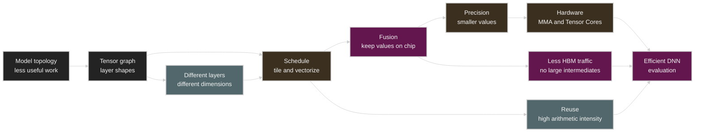
```mermaid
%%{init: {"theme": "base", "themeVariables": {"background": "#171717", "primaryColor": "#232323", "primaryTextColor": "#f5f5f5", "primaryBorderColor": "#d0d0d0", "lineColor": "#cfcfcf", "fontFamily": "Inter, Arial, sans-serif"}}}%%
flowchart LR
    T[Model topology<br/>less useful work] --> G[Tensor graph<br/>layer shapes]
    G --> S[Schedule<br/>tile and vectorize]
    S --> F[Fusion<br/>keep values on chip]
    F --> P[Precision<br/>smaller values]
    P --> H[Hardware<br/>MMA and Tensor Cores]

    G --> D[Different layers<br/>different dimensions]
    S --> R[Reuse<br/>high arithmetic intensity]
    F --> M[Less HBM traffic<br/>no large intermediates]
    H --> E[Efficient DNN<br/>evaluation]
    R --> E
    M --> E
    D --> S

    classDef primary fill:#232323,stroke:#d0d0d0,color:#f5f5f5,stroke-width:2px;
    classDef secondary fill:#3b2f20,stroke:#d0d0d0,color:#f5f5f5,stroke-width:2px;
    classDef note fill:#52676b,stroke:#d0d0d0,color:#f5f5f5,stroke-width:2px;
    classDef accent fill:#62164d,stroke:#d0d0d0,color:#f5f5f5,stroke-width:2px;
    class T,G primary
    class S,P,H secondary
    class D,R note
    class F,M,E accent
```

핵심은 각 level이 아래 level의 workload를 바꾼다는 점이다. Topology가 layer shape와 FLOP
수를 바꾸고, schedule이 reuse와 parallelism을 바꾸며, fusion이 memory traffic을 바꾼다.
Precision은 같은 operation의 byte/FLOP 비율과 사용할 수 있는 hardware instruction을
바꾼다.

---

## DNN Evaluation as a Systems Problem

DNN evaluation은 학습된 weight와 input activation이 주어졌을 때 forward pass를 실행하는
문제다. 이 강의는 training algorithm이나 neuron의 의미보다 computation을 어떻게 빠르게
실행하는지에 집중한다.

일반적인 graph는 다음 세 요소를 가진다.

| Element | Systems interpretation | Performance question |
| ------- | ---------------------- | -------------------- |
| Tensor | Shape와 layout을 가진 dense/sparse data | 어디에 저장되고 몇 번 이동하는가? |
| Operator | Conv, GEMM, ReLU, normalization, pool, softmax | Compute-bound인가 memory-bound인가? |
| Edge | Producer output이 consumer input이 되는 dependency | Intermediate를 materialize해야 하는가? |

Network 전체 latency는 가장 큰 GEMM 하나만 빠르게 만든다고 해결되지 않는다. Small
pointwise op, layout conversion, kernel launch, intermediate write/read가 critical path에
남을 수 있다. 반대로 individual operator만 보면 적어 보이는 fusion 이득도 수백 layer에
반복되면 end-to-end 성능을 결정한다.

## A Minimal Computational View of DNNs

입력 `x_i`, weight `w_i`, bias `b`, nonlinearity `f`를 가진 unit은 다음과 같다.

```text
z = sum_i (x_i * w_i) + b
y = f(z)
```

강의에서 예로 든 ReLU(rectified linear unit)는 복잡한 primitive가 아니다.

```text
ReLU(z) = max(0, z)
```

Systems 관점에서는 이것이 multiply-add reduction 뒤의 pointwise max다. 같은 structure가
많은 output unit에 반복되므로 data parallelism이 있고, weight/activation을 여러 output에서
재사용할 가능성이 있다. DNN은 결국 이런 작은 circuit을 regular하게 연결한 computation
graph다.

## Fully Connected Layers as Linear Algebra

Input vector `x`, weight matrix `W`, bias vector `b`에 대해 fully connected layer는 다음과
같이 쓸 수 있다.

```text
y = f(Wx + b)
```

한 input만 처리하면 matrix-vector multiplication(GEMV)이지만 batch의 input vector를
matrix `X`로 묶으면 다음과 같은 GEMM이 된다.

```text
Y = f(XW^T + b)
```

Batching은 같은 weight matrix를 여러 input에 재사용하게 하고 더 큰 parallel work를 만든다.
그러나 latency-sensitive inference에서는 batch를 마음대로 키울 수 없으므로, throughput과
queueing latency 사이의 trade-off가 생긴다.

## Convolutional Layers and Tensor Shapes

강의는 blur filter에서 시작한다. `3 x 3` filter의 모든 weight가 `1/9`이면 각 output pixel은
주변 input의 평균이 되어 image가 흐려진다. Weight의 부호를 달리하면 horizontal/vertical
gradient detector가 된다. DNN에서는 이런 filter weight를 사람이 지정하지 않고 학습한다.

Forward convolution의 tensor를 다음과 같이 두자.

| Symbol | Shape | Meaning |
| ------ | ----- | ------- |
| `X` | `N x H x W x C` | Batch `N`, input height/width, input channels `C` |
| `W_f` | `K x R x S x C` | `K` filters, spatial support `R x S`, input channels |
| `b` | `K` | Filter별 bias |
| `Y` | `N x P x Q x K` | Output activation |

Stride 1의 단순한 표기에서는 다음과 같다.

```text
Y[n,p,q,k] = b[k]
             + sum_c sum_r sum_s
               X[n, p+r, q+s, c] * W_f[k,r,s,c]
```

실제 padding, stride, dilation은 `X`의 address function을 바꾼다. 중요한 점은 output element
하나가 길이 `R*S*C`인 activation window와 filter의 dot product라는 사실이다.

Conv 뒤에는 흔히 ReLU와 pooling이 이어진다. `2 x 2` max pool은 네 activation 중 최대값
하나만 남기므로 spatial output을 `H/2 x W/2`로 줄인다. 이 reduction은 이후 fusion에서
store volume까지 줄이는 기회가 된다.

## Four Levers for DNN Efficiency

강의가 제시한 optimization 공간을 네 층으로 정리할 수 있다.

| Lever | Example | What changes | Main constraint |
| ----- | ------- | ------------ | --------------- |
| Better model/algorithm | ResNet, MobileNet, topology search | FLOP, parameter, layer shape 자체 | Accuracy와 training behavior |
| Software scheduling | Blocking, vectorization, implicit GEMM | Execution order와 locality | Cache/shared memory, registers, parallelism |
| Graph transformation | Fusion, layout planning | Kernel boundary와 intermediate traffic | Dependency와 resource pressure |
| Approximation/specialization | FP16/INT8, pruning, Tensor Core | Bytes, operations, hardware datapath | Numerical accuracy와 hardware support |

첫째는 필요 없는 work를 없애고, 둘째는 남은 work를 hardware에 잘 배치한다. 셋째는 operator
사이의 data movement를 줄이고, 넷째는 한 value 또는 instruction이 차지하는 비용을 낮춘다.

## Topology Innovation Changes the Workload

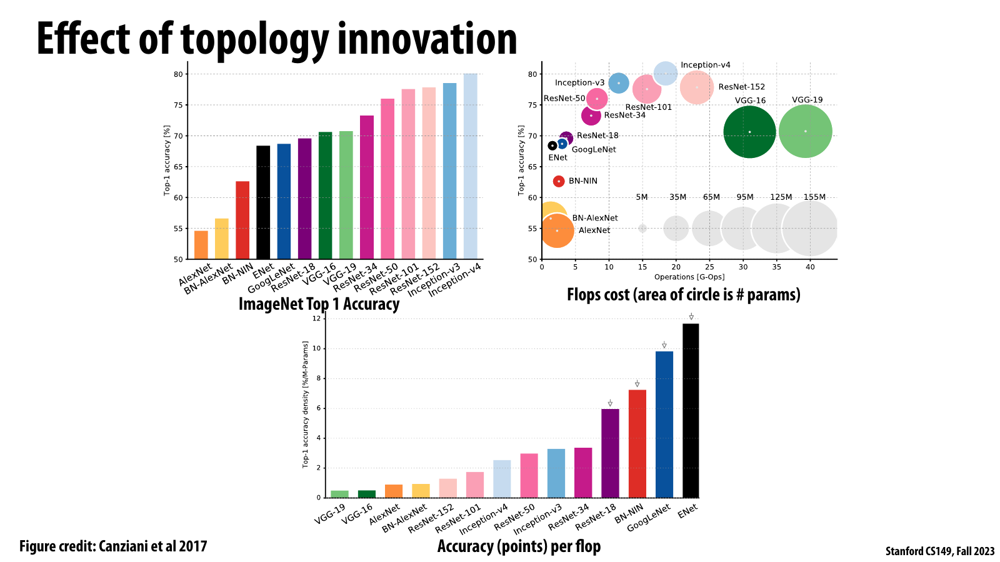

*공식 Lecture 10 slide p. 20 — topology 변화가 accuracy, FLOP cost, parameter 수를 함께
바꾼다는 비교다.*

슬라이드가 보여 주는 사실은 accuracy가 높은 model이 반드시 FLOP나 parameter가 많은
model은 아니라는 점이다. 오른쪽 bubble chart는 x축을 operation 수, y축을 top-1 accuracy,
bubble area를 parameter 수로 놓아 VGG, ResNet, Inception 계열의 서로 다른 cost profile을
한 화면에서 비교한다.

강의 논리에서 이 그림은 kernel tuning보다 먼저 **어떤 computation graph를 실행할지**가
workload를 결정한다는 출발점이다. Topology가 바뀌면 총 연산량뿐 아니라 convolution의
filter shape, channel 수, activation size, reuse opportunity가 함께 바뀌므로 같은 GPU
schedule을 그대로 적용할 수 없다.

실무 해설: 이 slide의 역사적 ImageNet 점을 현재 model의 절대 순위로 해석해서는 안 된다.
실제 배포에서는 target accuracy뿐 아니라 end-to-end latency, batch 조건, memory footprint,
power를 같은 hardware와 software stack에서 측정해야 한다. 아래 값은 이어지는 공식 slide의
비교 표를 요약한 역사적 예시다.

| Model | Year on slide | Top-1 accuracy | Parameters | Cost/image |
| ----- | ------------- | -------------- | ---------- | ---------- |
| VGG-16 | 2014 | 71.5% | 138M | 15B MADDs |
| GoogLeNet | 2015 | 70% | 6.8M | 1.5B MADDs |
| ResNet-18 | 2016 | 73% | 11.7M | 1.8B MADDs |
| MobileNet-224 | 2017 | 70.5% | 4.2M | 0.6B MADDs |

Slide는 2014년에서 2017년 사이 비슷한 accuracy 수준에서 cost가 약 25배 개선되었다고
요약한다. 이 숫자의 목적은 현재 model 순위를 말하는 것이 아니라 algorithmic improvement가
hardware generation의 속도 향상보다 workload를 더 크게 바꿀 수 있음을 보여 주는 것이다.

MobileNet의 depthwise separable convolution은 standard convolution을 channel별 depthwise
`3 x 3`과 channel을 결합하는 pointwise `1 x 1`로 factor한다. Slide의 MobileNet 예에서는
연산의 대부분이 dense `1 x 1` convolution으로 이동해 GEMM-friendly한 workload가 된다.
즉 topology design과 kernel efficiency는 서로 독립적이지 않다.

## Layer Scheduling Starts from the Loop Nest

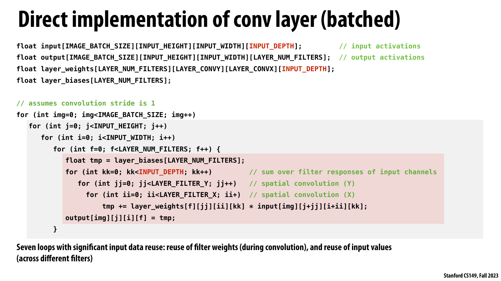

*공식 Lecture 10 slide p. 23 — batched direct convolution의 tensor 선언과 seven-deep loop
nest다.*

슬라이드는 바깥의 batch·output height·output width·filter loop가 서로 다른 output element를
만들고, 안쪽의 input channel·filter height·filter width loop가 한 output의 reduction을
수행한다는 사실을 보여 준다. 같은 filter weight는 여러 spatial position에서, 같은 input
activation은 여러 filter와 겹치는 window에서 다시 쓰인다.

강의 논리에서 loop nest는 optimization의 기준 좌표다. Loop interchange, tiling,
vectorization은 수식을 바꾸는 것이 아니라 어느 reuse를 어느 memory level에서 실현할지를
정한다. 따라서 thread 수만 늘리는 것보다 reuse를 보존하는 mapping이 먼저다.

실무 해설: padding, stride, dilation, boundary predication을 address function에 정확히 반영하고
reduction 순서 변화에 따른 floating-point 차이를 허용 범위 안에서 검증해야 한다. Tile을
키우면 traffic은 줄 수 있지만 shared memory와 register pressure가 올라가 occupancy와 tail
efficiency가 나빠질 수 있다.

Batched direct convolution은 다음 일곱 iteration dimension을 가진다.

```text
for n in batch:
  for p in output_height:
    for q in output_width:
      for k in output_filters:
        acc = bias[k]
        for c in input_channels:
          for r in filter_height:
            for s in filter_width:
              acc += X[n,p+r,q+s,c] * W_f[k,r,s,c]
        Y[n,p,q,k] = acc
```

Mathematically equivalent한 schedule은 많다. Loop interchange, tiling, unrolling,
vectorization, parallel mapping을 조합할 수 있다. 하지만 아무 순서나 같은 성능을 내지는
않는다.

| Reuse opportunity | Reused object | Useful schedule direction |
| ----------------- | ------------- | ------------------------- |
| 여러 output filter | 같은 input activation window | `k` tile을 함께 계산 |
| 여러 output position | 같은 filter weight | `p,q` tile을 함께 계산 |
| Neighbor output | 겹치는 input window | Spatial tile을 on-chip에 유지 |
| Batch | 같은 model weights | `n`을 함께 처리 |

Layer schedule은 어떤 dimension을 GPU block, warp, lane에 mapping하고 어떤 tensor tile을
shared memory/register에 둘지 결정한다. 이것이 단순히 “GPU thread를 많이 만든다”보다 더
중요한 이유다.

## Convolution-to-GEMM Mapping

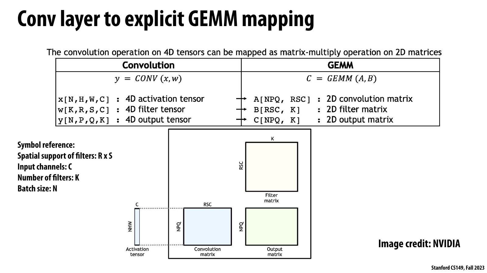

*공식 Lecture 10 slide p. 27 — convolution의 `N,H,W,C`, `K,R,S,C`, `N,P,Q,K`
tensor를 GEMM의 `M=NPQ`, `K=RSC`, `N=K` 차원으로 대응한다.*

슬라이드가 보여 주는 핵심 사실은 output position 하나가 activation window 한 row가 되고,
filter 하나가 filter matrix 한 column이 된다는 것이다. 그러면 모든 output은
`[NPQ,RSC] x [RSC,K] = [NPQ,K]`의 한 dense matrix multiplication으로 표현된다.

강의 논리에서 이 mapping은 convolution을 이미 잘 연구된 GEMM tiling 문제로 바꾸고,
spatial·batch·filter dimension의 병렬성을 큰 matrix에 모은다. 동시에 왼쪽 4D tensor의
overlapping window를 오른쪽 2D activation matrix로 어떻게 표현할지가 새로운 systems
문제가 된다.

실무 해설: 수학적 mapping만 맞아도 physical layout이 다르면 transpose, pack, alignment
비용이 생긴다. Framework layout과 kernel이 기대하는 leading dimension을 함께 정하고,
변환 시간을 포함한 end-to-end latency와 workspace를 비교해야 한다.

이 dimension mapping을 text notation으로 다시 쓰면 다음과 같다.

```text
A: (N*P*Q) x (C*R*S)   activation windows
B: (C*R*S) x K         filters
C: (N*P*Q) x K         output activations

C = A * B
```

아래 hand-editable SVG는 같은 dimension mapping에서 explicit materialization과 implicit tile
generation의 차이를 이어서 비교하기 위한 editorial 보조 그림이다.

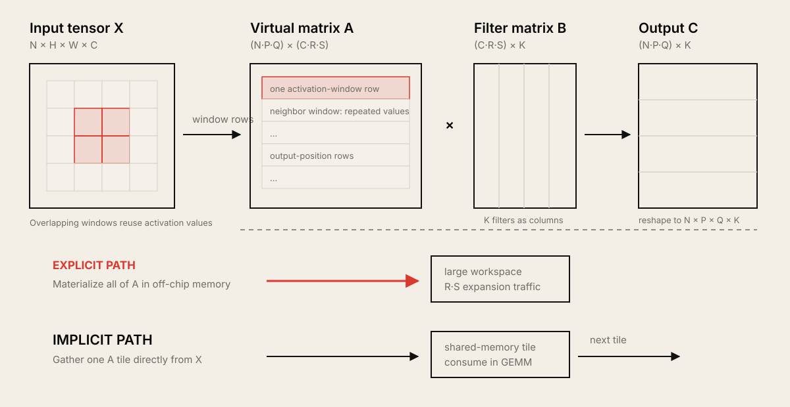

이 mapping은 두 장점을 준다.

1. Conv를 잘 알려진 dense GEMM schedule 문제로 바꾼다.
2. 여러 output position과 filter를 하나의 큰 matrix product로 묶어 높은 parallelism과
   weight reuse를 얻는다.

그러나 `A`는 원래 존재하던 tensor가 아니다. Overlapping spatial window 때문에 같은
activation이 여러 row에 반복된다. `A`를 언제 어디에 만드는지가 explicit와 implicit
GEMM의 차이다.

## Explicit GEMM and im2col

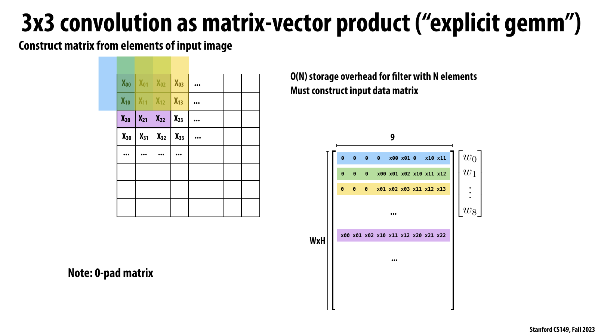

*공식 Lecture 10 slide p. 24 — `3 x 3` convolution window를 길이 9의 row로 펴는 explicit
GEMM, 즉 `im2col` 구성이다.*

슬라이드는 인접 output의 receptive field가 겹치기 때문에 `x00`, `x01` 같은 activation이
여러 matrix row에 복제되는 모습을 색으로 연결한다. Filter가 9개 element인 예에서 matrix
폭은 9이고, slide는 input matrix 구성과 `O(N)` storage overhead를 명시한다.

강의 논리에서 이 복제는 convolution을 regular GEMM으로 바꾸는 대가다. GEMM kernel은
연속적인 matrix를 빠르게 소비할 수 있지만 그 전에 별도 kernel이 expanded matrix를 만들고
그 결과를 DRAM에 저장해야 한다.

실무 해설: explicit GEMM이 항상 느린 것은 아니다. 매우 잘 tuned된 GEMM의 이득이 packing
비용을 상쇄할 수 있으므로 kernel time만 보지 말고 `im2col + workspace traffic + GEMM`을
함께 측정해야 한다. Workspace capacity와 memory bandwidth가 제한된 inference에서는 같은
shape라도 implicit GEMM이 더 안정적인 선택일 수 있다.

`im2col` dataflow를 text notation으로 쓰면 다음과 같다.

```text
tensor X --im2col--> expanded matrix A
filter W ----------> matrix B
A * B -------------> matrix C --reshape--> tensor Y
```

Filter의 spatial area가 `R*S`이면 activation element는 경계 효과를 제외하고 대략 그만큼
중복된다. Slide는 explicit GEMM의 단점을 다음과 같이 적는다.

* Input matrix를 materialize해야 한다.
* Auxiliary storage가 필요하다.
* DRAM traffic이 최대 `R*S` factor만큼 증가할 수 있다.
* Training에서는 backward를 위한 다른 activation도 보존해야 해 footprint 문제가 더 커진다.

그럼에도 초기 구현에서 유용한 이유는 data transformation 뒤에 매우 잘 최적화된 GEMM을
재사용할 수 있기 때문이다. End-to-end cost는 `im2col time + workspace traffic + GEMM time`으로
평가해야 한다.

## Why Naive GEMM Is Memory-Bound

`C += A*B`의 naive loop를 생각하자.

```text
for j in M:
  for i in N:
    for k in K:
      C[j,i] += A[j,k] * B[k,i]
```

Square `n x n` matrix라면 전체 unique data는 `Theta(n^2)`, work는 `Theta(n^3)`이므로
algorithmic arithmetic intensity는 `Theta(n)`까지 가능하다. 그러나 위 schedule은 큰
matrix가 cache에 들어가지 않을 때 innermost iteration마다 A/B element를 다시 가져오고,
특히 row-major B의 column access에서 poor spatial locality를 보인다.

한 multiply-add를 위해 두 input을 memory에서 읽는 상태라면 realized arithmetic intensity는
`O(1)`에 머문다. 즉 algorithm은 compute-rich한데 schedule이 reuse를 실현하지 못해
bandwidth-bound가 된다.

## Blocked and Hierarchical GEMM

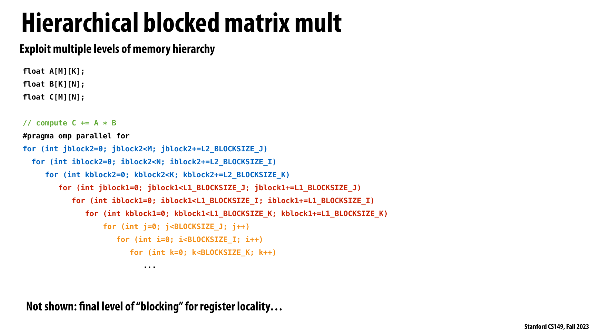

*공식 Lecture 10 slide p. 31 — GEMM blocking을 한 번만 적용하지 않고 memory hierarchy의
여러 level에 맞춰 중첩한다.*

슬라이드는 바깥쪽 L2-sized block loop, 안쪽 L1-sized block loop, 마지막 microkernel로
이어지는 nested schedule을 보여 준다. Register locality를 위한 최종 blocking은 그림에서
생략되었다고 명시해, blocking이 cache 한 단계만의 기법이 아님을 강조한다.

강의 논리에서 각 level은 더 느린 memory에서 가져온 A/B tile을 여러 C update에 재사용해
realized arithmetic intensity를 높인다. GPU에서는 이 구조가 대략 HBM → L2 → shared
memory → register accumulator → MMA/SIMD의 cooperative hierarchy로 대응된다.

실무 해설: 큰 tile은 reuse를 늘리지만 capacity miss, shared-memory bank conflict, register
spill, 낮은 occupancy를 만들 수 있다. Correctness 측면에서는 edge tile과 K-tail의 mask,
동기화, accumulation precision을 별도로 검증해야 하며, peak FLOP보다 achieved bandwidth와
occupancy를 함께 보아야 한다.

GEMM을 `b x b` submatrix operation으로 다시 표현한다.

```text
C_tile += A_tile * B_tile
```

한 tile step에서 대략 `O(b^2)` data를 가져와 `O(b^3)` multiply-add work를 수행하므로
arithmetic intensity는 `O(b)`로 증가한다.

```text
AI_tile ~= work / bytes
        ~= 2*b^3 FLOPs / (3*b^2*s bytes)
        ~= 2*b / (3*s) FLOPs/byte
```

여기서 `s`는 element size다. 더 큰 `b`가 더 많은 reuse를 주지만 A, B, C tile과 buffering이
target memory에 들어가야 한다. “가능한 가장 큰 block”은 capacity만이 아니라 register 수,
occupancy, bank conflict, edge waste까지 고려한 값이다.

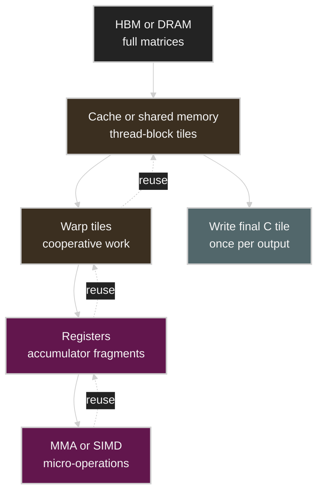
```mermaid
%%{init: {"theme": "base", "themeVariables": {"background": "#171717", "primaryColor": "#232323", "primaryTextColor": "#f5f5f5", "primaryBorderColor": "#d0d0d0", "lineColor": "#cfcfcf", "fontFamily": "Inter, Arial, sans-serif"}}}%%
flowchart TB
    D[HBM or DRAM<br/>full matrices] --> L[Cache or shared memory<br/>thread-block tiles]
    L --> W[Warp tiles<br/>cooperative work]
    W --> R[Registers<br/>accumulator fragments]
    R --> I[MMA or SIMD<br/>micro-operations]

    I -. reuse .-> R
    R -. reuse .-> W
    W -. reuse .-> L
    L --> O[Write final C tile<br/>once per output]

    classDef primary fill:#232323,stroke:#d0d0d0,color:#f5f5f5,stroke-width:2px;
    classDef secondary fill:#3b2f20,stroke:#d0d0d0,color:#f5f5f5,stroke-width:2px;
    classDef note fill:#52676b,stroke:#d0d0d0,color:#f5f5f5,stroke-width:2px;
    classDef accent fill:#62164d,stroke:#d0d0d0,color:#f5f5f5,stroke-width:2px;
    class D primary
    class L,W secondary
    class R,I accent
    class O note
```

CPU는 동일 address space의 line을 hardware-managed cache에 자동으로 저장한다. CUDA shared
memory는 programmer가 global memory에서 명시적으로 copy하는 scratchpad다. 둘 다 tile을
가깝게 두는 목적은 같지만 placement와 synchronization 책임이 다르다.

## SIMD and Register-Level Scheduling

강의는 block 내부 GEMM에도 여러 schedule이 있음을 보여 준다.

| Schedule | Core idea | Advantage | Cost/risk |
| -------- | --------- | --------- | --------- |
| Vectorize `i` | A scalar를 splat하고 B vector와 FMA | C의 여러 column을 동시에 계산 | Splat, B working set, dependency chain |
| Transpose B tile | A row와 transposed B row를 vector dot | Contiguous vector load, small `i`에도 대응 | Pack/transpose overhead |
| Transpose A/C tile | 여러 independent C accumulator를 register에 유지 | ILP와 reuse 증가 | Register pressure와 final reorder |
| MMA microtile | Matrix fragment 단위 instruction | Control amortization과 high throughput | Shape/alignment/precision constraint |

Register blocking은 C tile의 partial sum을 register에 오래 유지해 repeated load/store를 없앤다.
동시에 너무 많은 accumulator는 occupancy를 낮춘다. 따라서 best schedule은 vector width,
register file, matrix dimensions에 따라 달라진다.

## One Network Needs Many Schedules

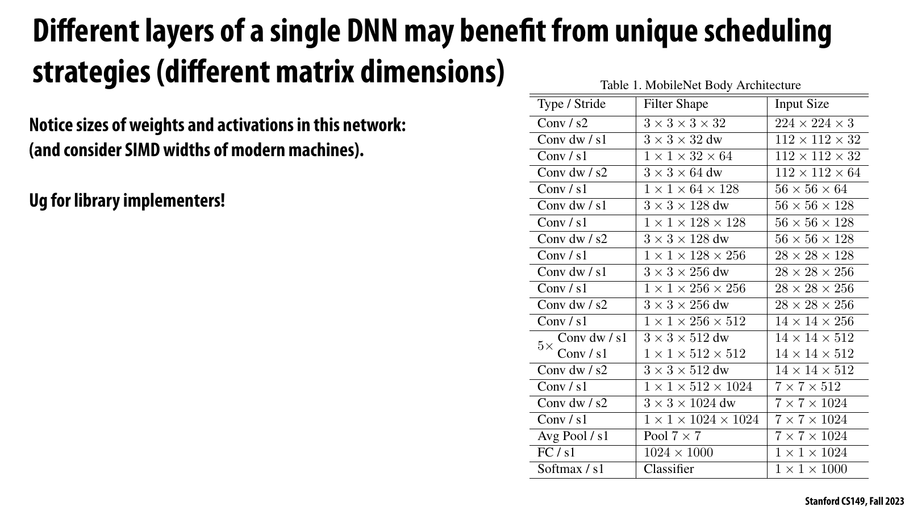

*공식 Lecture 10 slide p. 35 — 한 MobileNet 안에서도 standard `1 x 1`, depthwise `3 x 3`,
stride-2 layer가 서로 다른 matrix dimension을 만든다.*

슬라이드의 표는 early layer의 큰 spatial input과 작은 channel 수가 network를 지나며 작은
spatial input과 큰 channel 수로 변하는 양상을 보여 준다. Depthwise layer와 pointwise layer가
교차하므로 reduction 크기와 activation/weight 비율도 layer마다 달라진다.

강의 논리에서 이 변화는 single universal convolution schedule이 최적일 수 없다는 증거다.
어떤 layer는 spatial parallelism이 풍부하고, 어떤 layer는 channel reuse가 크며, depthwise
convolution은 dense GEMM에 필요한 reduction 폭이 부족하다.

실무 해설: library autotuning cache의 key에는 shape, stride, layout, dtype, workspace limit,
target GPU가 모두 포함되어야 한다. Dynamic shape에서는 tuning overhead 자체가 latency가 될
수 있고, 작은 dimension의 tail waste 때문에 이론상 FLOP가 적은 layer가 더 낮은 utilization을
보일 수 있다.

위 layer-shape 변화를 scheduling 관점에서 요약하면 다음과 같다.

| Layer shape | Likely limiting factor | Scheduling implication |
| ----------- | ---------------------- | ---------------------- |
| Large `P*Q`, moderate `C,K` | 많은 output parallelism | Spatial tiles, input-window reuse |
| Small `P*Q`, large `C,K` | Reduction/weight reuse | Channel/filter tiles, MMA utilization |
| `1 x 1` conv | No spatial window expansion | GEMM-like direct mapping |
| Depthwise conv | Small per-channel reduction | GEMM utilization이 낮을 수 있음; direct specialized kernel |
| Batch size 1 | Parallel slack 부족 가능 | Spatial/filter parallelism과 low-overhead kernel 중요 |
| Odd/small dimensions | Tile tail와 SIMD underfill | Smaller tile or alternate kernel |

따라서 “최고의 convolution kernel 하나”는 없다. Library와 compiler는 operation descriptor,
shape, dtype, layout, workspace budget, target GPU를 보고 algorithm과 parameters를 선택한다.

## Implicit GEMM

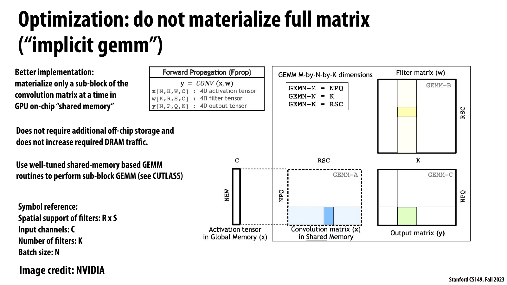

*공식 Lecture 10 slide p. 37 — full convolution matrix 대신 현재 GEMM-A sub-block만 GPU
shared memory에 materialize하는 implicit GEMM이다.*

슬라이드는 activation tensor가 global memory에 그대로 있고, 현재 output tile에 필요한
virtual convolution matrix 조각만 shared memory에 생기는 구조를 보여 준다. Filter tile과
output tile을 함께 처리하므로 off-chip auxiliary storage와 expanded-matrix DRAM traffic이
필요하지 않다.

강의 논리에서 implicit GEMM은 GEMM의 tuned microkernel을 유지하면서 explicit `im2col`의
가장 큰 비용을 제거하는 절충이다. Logical matrix는 존재하지만 physical full matrix는
존재하지 않는다는 구분이 핵심이다.

실무 해설: 절약한 DRAM traffic 대신 stride·padding·dilation을 해석하는 integer address
계산, predication, gather/packing 비용을 지불한다. Iterator가 틀리면 border에서 조용한
correctness bug가 생길 수 있으므로 reference convolution과 다양한 odd shape를 대조하고,
global-load coalescing과 shared-memory layout을 profile해야 한다.

Implicit GEMM의 실행 pipeline을 text로 풀면 다음과 같다.

```text
global tensor X
  -> address iterator computes source coordinates
  -> one virtual A tile is gathered into shared memory
  -> warp/register GEMM consumes the tile
  -> next reduction tile repeats
```

Trade-off는 분명하다.

| Explicit GEMM | Implicit GEMM |
| ------------- | ------------- |
| 전체 `im2col` matrix를 DRAM에 생성 | 필요한 tile만 on-chip에 생성 |
| Simple regular GEMM input | More complex address generation/predication |
| Large workspace와 expansion traffic | 추가 off-chip workspace 없음 |
| GEMM library를 직접 재사용하기 쉬움 | Convolution-aware iterator/microkernel 필요 |

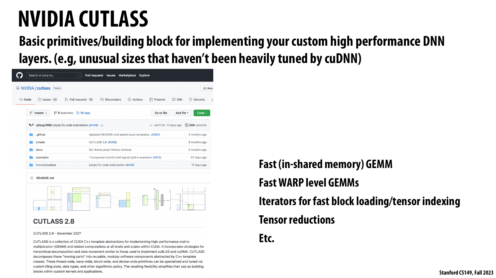

*공식 Lecture 10 slide p. 38 — CUTLASS를 unusual shape의 custom high-performance DNN
layer를 만드는 primitive collection으로 소개한다.*

슬라이드가 열거한 구성 요소는 fast in-shared-memory GEMM, warp-level GEMM, fast block
loading/tensor indexing iterator, tensor reduction이다. 즉 high-performance kernel은 단일
matrix instruction이 아니라 data movement와 indexing까지 포함한 계층적 building block의
조합이다.

강의 논리에서 CUTLASS는 implicit GEMM의 아이디어를 실제 kernel engineering으로 연결한다.
Vendor library가 충분히 tuning하지 않은 unusual shape에서도 iterator와 GEMM microkernel을
조합해 specialization할 수 있다는 의미다.

실무 해설: custom kernel은 shape coverage와 maintenance cost를 늘린다. 먼저 vendor library의
candidate와 workspace를 benchmark하고, 반복 호출되는 병목 shape에서만 specialize하며,
reference output·alignment·dtype accumulation·architecture별 code path를 CI에서 검증하는 편이
안전하다. 주소 계산은 stride, padding, dilation, tensor layout을 모두 반영해야 한다.

## Parallel Slack, Batch Size, and GPU Utilization

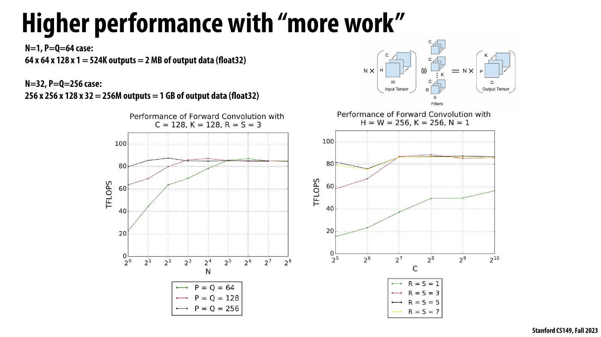

*공식 Lecture 10 slide p. 40 — batch·spatial·channel/filter shape가 forward convolution의
achieved TFLOPS를 바꾸는 두 실험이다.*

왼쪽 그래프에서 작은 `P=Q=64` case는 batch `N`이 작을 때 throughput이 낮고 work가
늘수록 약 80 TFLOPS대로 올라간다. 오른쪽 그래프에서는 `R=S=1`인 작은 reduction이 channel
수가 커져도 다른 filter size보다 낮은 throughput을 보여, output 수만이 아니라 per-tile
work와 reuse도 utilization을 좌우함을 드러낸다.

강의 논리에서 GPU peak는 kernel 하나의 효율과 machine 전체를 채울 parallel slack이 모두
있을 때만 나온다. Batch, output spatial size, filter/channel dimension은 schedulable tile 수와
각 tile의 arithmetic intensity를 동시에 바꾼다.

실무 해설: throughput을 위해 batch를 키우면 queueing latency와 activation memory가 증가한다.
Latency-sensitive inference에서는 p50/p99 제한 아래 microbatch를 정하고, achieved occupancy,
active warps, Tensor Core utilization, HBM throughput을 shape별로 측정해야 한다. Slide의
TFLOPS 곡선은 해당 V100-era 조건의 사례이지 다른 GPU의 보장치가 아니다.

앞 slide의 V100 예가 강조하듯 전체 GPU를 채우려면 충분한 tile 수가 필요하다. Slide p. 40이
대조한 두 output-size 예는 다음과 같다.

| Case | Output elements | FP32 output size |
| ---- | --------------- | ---------------- |
| `N=1, P=Q=64, K=128` | `64*64*128*1 = 524K` | 약 2 MB |
| `N=32, P=Q=256, K=128` | `256*256*128*32 = 256M` | 약 1 GB |

Batch와 spatial/filter dimension이 커지면 tile 수가 늘어 GPU를 채우기 쉽다. 반대로 큰 model
때문에 memory capacity가 batch size를 제한하면 available parallelism과 throughput도 낮아질
수 있다. 작은 batch는 단지 weight reuse만의 문제가 아니라 launch당 schedulable tile 수의
문제다.

## Alternative Convolution Algorithms

Convolution은 한 가지 algorithm으로만 실행되지 않는다.

| Algorithm | Main idea | Benefit | Cost/fit |
| --------- | --------- | ------- | -------- |
| Direct | Original 7-loop convolution을 직접 tile | No im2col workspace | Complex schedule search |
| Explicit GEMM | `im2col` 후 general GEMM | Mature GEMM 활용 | Expansion storage/traffic |
| Implicit GEMM | Virtual matrix tile을 on demand 생성 | GEMM reuse without full workspace | Addressing and packing overhead |
| Winograd | Common subexpression으로 multiplication 수 감소 | Small filter에서 fewer multiplies | More additions/transforms, numerical concerns |
| FFT | Convolution을 transform-domain pointwise product로 변경 | Large filter에서 유리할 수 있음 | Forward/inverse transform overhead |

Slide의 1D Winograd 예는 3-tap filter로 output 두 개를 만들 때 direct 방식의 6 multiply,
4 add를 4 multiply, 8 add로 바꾼다. 2D `3 x 3` filter로 `2 x 2` output block을 만들 때는
multiply 수를 2.25배 줄일 수 있다고 설명한다. 이것이 실제로 빠른지는 multiply/add cost,
transform overhead, precision, tile size에 달려 있다.

## Libraries as Collections of Specialized Kernels

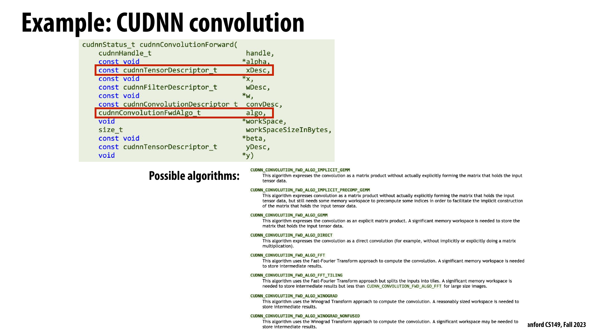

*공식 Lecture 10 slide p. 46 — cuDNN convolution API가 tensor descriptor, algorithm,
workspace를 받아 여러 implementation 중 하나를 실행하는 예다.*

슬라이드는 implicit/precomputed GEMM, explicit GEMM, direct, FFT/FFT tiling,
Winograd/Winograd non-fused를 possible algorithm으로 나열한다. 설명에는 algorithm마다 input
matrix materialization과 intermediate workspace 요구가 다르다는 점도 포함된다.

강의 논리에서 high-level `Conv2D`는 하나의 kernel 이름이 아니라 shape와 constraint에 따라
선택되는 kernel family다. Algorithmic FLOP 감소, regular GEMM reuse, transform overhead,
workspace traffic 사이의 우선순위가 layer마다 달라진다.

실무 해설: heuristic 선택은 빠르지만 특정 shape에서 오판할 수 있고 exhaustive benchmark는
startup 비용과 재현성 문제가 있다. Production에서는 workspace ceiling과 deterministic
requirement를 먼저 고정하고, warm-up 뒤 representative shape를 측정해 선택 결과를 cache하며,
library/GPU upgrade 때 cache를 무효화하고 numerical tolerance를 재검증해야 한다.

Operation descriptor에는 input/output tensor shape와 layout, convolution parameters, dtype
등이 들어간다. Algorithm마다 workspace와 supported shape가 다르므로 heuristic 또는
benchmark-based selection이 필요하다. Library performance는 kernel quality뿐 아니라
correct candidate를 고르는 dispatch logic에도 달려 있다.

## Memory Traffic Between Layers

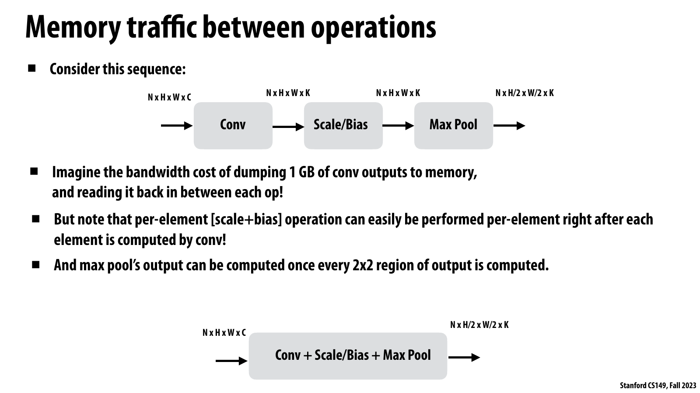

*공식 Lecture 10 slide p. 47 — `Conv → Scale/Bias → Max Pool`을 별도 실행할 때의 full-size
intermediate traffic과 하나의 fused node를 대비한다.*

슬라이드는 conv output 1 GB를 operation 사이마다 memory에 쓰고 다시 읽는 bandwidth cost를
문제로 제시한다. Scale/bias는 conv가 element를 만든 직후 적용할 수 있고, max pool도 `2 x 2`
output region이 준비되면 계산할 수 있으므로 full intermediate를 기다릴 dependency가 없다.

강의 논리에서 이 예는 layer별 FLOP 최적화만으로 network 성능을 설명할 수 없음을 보여 준다.
Producer tile이 on-chip에 있을 때 consumer를 실행하면 두 개의 low-arithmetic-intensity pass와
큰 HBM round trip을 제거할 수 있다.

실무 해설: fusion은 live range와 register/shared-memory 사용량을 늘려 occupancy를 낮출 수
있고, pooling에 좋은 spatial tile이 convolution GEMM tile과 충돌할 수 있다. Multiple
consumer, aliasing, quantization boundary가 있으면 materialization이 correctness에 필요할 수
있으므로 graph dependency와 end-to-end traffic을 함께 확인해야 한다.

Conv 뒤에 scale/bias와 max pool이 이어지는 sequence를 보자.

```text
X[N,H,W,C]
  -> Conv -> T[N,H,W,K]
  -> Scale/Bias -> U[N,H,W,K]
  -> 2x2 MaxPool -> Y[N,H/2,W/2,K]
```

각 op가 별도 kernel이면 large tensor `T`와 `U`가 HBM에 쓰이고 다시 읽힌다. Conv는 잘
blocked되어 compute-bound일 수 있지만 scale/bias는 element당 작은 연산만 수행하고,
pool도 네 value를 읽어 max 하나를 만든다. 이 두 op는 bandwidth-bound가 되기 쉽다.

`E = N*H*W*K`, element size를 `s` bytes라 하자. Input/weight traffic을 제외하고
intermediate/output traffic만 단순 계산하면 다음과 같다.

```text
unfused bytes ~= (conv write E
                  + scale read E + scale write E
                  + pool read E + pool write E/4) * s
              = 4.25 * E * s

ideal fused final write ~= (E/4) * s
```

이 식은 cache effect와 mandatory input/weight read를 제외한 upper-level intuition이다. 핵심은
FLOP를 조금 줄이는 것이 아니라 full-size intermediate의 off-chip round trip을 없애는 데
있다.

## Operator Fusion

Conv output tile이 register/shared memory/cache에 있을 때 scale과 bias를 즉시 적용할 수 있다.
또한 `2 x 2` spatial output을 함께 계산하는 tile이라면 max pool도 그 자리에서 수행하고
네 값 대신 pooled value 하나만 store할 수 있다.

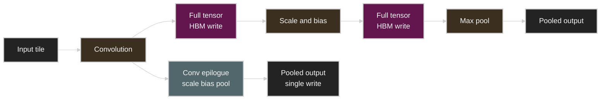
```mermaid
%%{init: {"theme": "base", "themeVariables": {"background": "#171717", "primaryColor": "#232323", "primaryTextColor": "#f5f5f5", "primaryBorderColor": "#d0d0d0", "lineColor": "#cfcfcf", "fontFamily": "Inter, Arial, sans-serif"}}}%%
flowchart LR
    X[Input tile] --> C[Convolution]
    C --> T[Full tensor<br/>HBM write]
    T --> B[Scale and bias]
    B --> U[Full tensor<br/>HBM write]
    U --> P[Max pool]
    P --> Y[Pooled output]

    C --> F[Conv epilogue<br/>scale bias pool]
    F --> Z[Pooled output<br/>single write]

    classDef primary fill:#232323,stroke:#d0d0d0,color:#f5f5f5,stroke-width:2px;
    classDef secondary fill:#3b2f20,stroke:#d0d0d0,color:#f5f5f5,stroke-width:2px;
    classDef note fill:#52676b,stroke:#d0d0d0,color:#f5f5f5,stroke-width:2px;
    classDef accent fill:#62164d,stroke:#d0d0d0,color:#f5f5f5,stroke-width:2px;
    class X,Y,Z primary
    class C,B,P secondary
    class T,U accent
    class F note
```

Fusion은 공짜가 아니다. 더 많은 live value가 register를 차지해 occupancy를 낮출 수 있고,
pooling에 맞는 spatial tile이 GEMM에 최적인 tile과 다를 수 있다. 또한 여러 consumer가 같은
intermediate를 필요로 하면 recomputation 또는 materialization을 선택해야 한다.

## Transformers and the Attention Workload

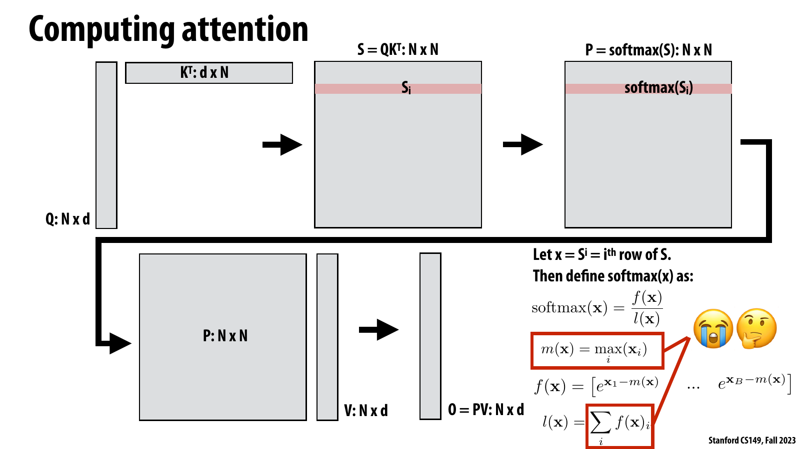

*공식 Lecture 10 slide p. 52 — `S=QK^T`, `P=softmax(S)`, `O=PV`의 naive attention
dataflow와 두 `N x N` intermediate를 보여 준다.*

슬라이드가 보여 주는 사실은 input/output `Q,V,O`가 `N x d`인 반면 score와 probability
matrix `S,P`는 `N x N`이라는 점이다. Softmax는 S의 각 row에서 max와 exponential sum을
구해야 하므로 row 전체 dependency가 있는 것처럼 보인다.

강의 논리에서 두 GEMM이 각각 빠르더라도 사이의 `S` write, softmax read/write, `P` read가
sequence length에 대해 quadratic traffic을 만든다. Attention optimization의 target은 GEMM
FLOP 자체보다 이 operator boundary와 intermediate materialization이다.

실무 해설: 실제 transformer에는 scale, causal/padding mask, head와 batch dimension이 추가된다.
Fusion은 이 semantics를 그대로 보존해야 하며, long sequence에서는 HBM footprint가 먼저
병목이 되고 small sequence에서는 launch와 tile underfill이 더 큰 비중을 가질 수 있다.

강의는 CNN에서 Transformer의 attention으로 이동한다. 한 attention head의 simplified
computation을 다음처럼 쓴다. Slide는 scaling과 masking을 생략하고 core dataflow에
집중한다.

```text
Q, K, V in R^(N x d)
S = Q * K^T          # N x N
P = softmax_rows(S)  # N x N
O = P * V            # N x d
```

Sequence length `N`이 수천 이상이면 `S`와 `P`의 `N^2` storage가 문제가 된다. GEMM 자체는
tile로 효율적으로 계산할 수 있어도, `S`를 HBM에 쓰고 softmax를 위해 읽고 `P`를 다시 쓰며
두 번째 GEMM이 읽는 traffic은 사라지지 않는다.

Naive operator boundary는 다음과 같다.

```text
Q,K --GEMM--> S --row max/sum/normalize--> P --GEMM with V--> O
               N^2 materialized            N^2 materialized
```

Fusion의 장애물은 softmax가 row 전체의 maximum과 normalization sum을 필요로 보인다는
점이다. 한 score tile만 계산한 시점에는 final denominator를 아직 모른다.

## Stable Softmax and Chunk Composition

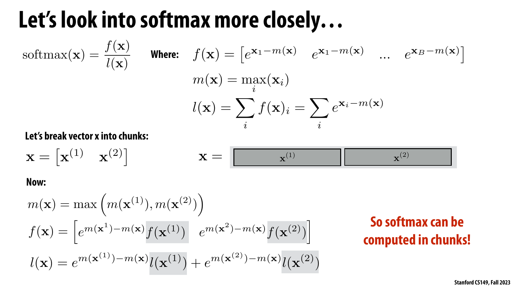

*공식 Lecture 10 slide p. 53 — stable softmax의 `m(x)`와 `l(x)`를 chunk별 값에서 정확히
합성하는 식이다.*

슬라이드는 vector를 `x^(1)`, `x^(2)`로 나눈 뒤 global max를 두 local max의 max로 구하고,
각 chunk의 exponential sum을 새 global max 기준으로 rescale해 더할 수 있음을 보인다. 이
통계만 있으면 raw score row 전체를 저장하지 않아도 stable normalization을 이어 갈 수 있다.

강의 논리에서 이 algebraic decomposition이 apparent all-row dependency를 streaming reduction으로
바꾼다. 따라서 score tile을 만든 즉시 softmax statistic과 value-weighted accumulator에
소비하고 버릴 수 있어 fused attention의 loop reordering이 가능해진다.

실무 해설: 이것은 naive `exp(x)`가 아니라 max subtraction을 유지하는 exact 재배열이다.
다만 floating-point reduction order가 달라 bitwise identity는 보장되지 않으며, FP16/BF16
input에서도 max, sum, output accumulator의 precision과 extreme-logit test를 확인해야 한다.

Vector `x`의 numerically stable softmax를 다음처럼 정의한다.

```text
m(x) = max_i x_i
l(x) = sum_i exp(x_i - m(x))
softmax(x)_i = exp(x_i - m(x)) / l(x)
```

`x`를 두 chunk `x^(1)`, `x^(2)`로 나누고 각 chunk의 `(m_1, l_1)`, `(m_2, l_2)`를 알고
있다고 하자. 전체 통계는 다음처럼 결합할 수 있다.

```text
m = max(m_1, m_2)
l = exp(m_1 - m) * l_1 + exp(m_2 - m) * l_2
```

Value-weighted numerator accumulator도 같은 방식으로 합성된다.

```text
o_t = sum_j exp(s_j - m_t) * v_j

o = exp(m_1 - m) * o_1 + exp(m_2 - m) * o_2
final output = o / l
```

새 chunk에서 더 큰 maximum이 나오면 이전 `l`과 `o`를 `exp(m_old-m_new)`로 rescale한다.
즉 전체 row를 저장하지 않고도 running max, running normalizer, output accumulator만 유지해
exact stable softmax와 `PV`를 계산할 수 있다.

이 associatively composable summary가 attention fusion의 algorithmic key다. 단순한 compiler
pattern matching만으로는 softmax dependency를 넘어서는 이 수학적 변환을 자동으로 찾기
어렵다는 점도 강의가 강조한다.

## Fused Attention

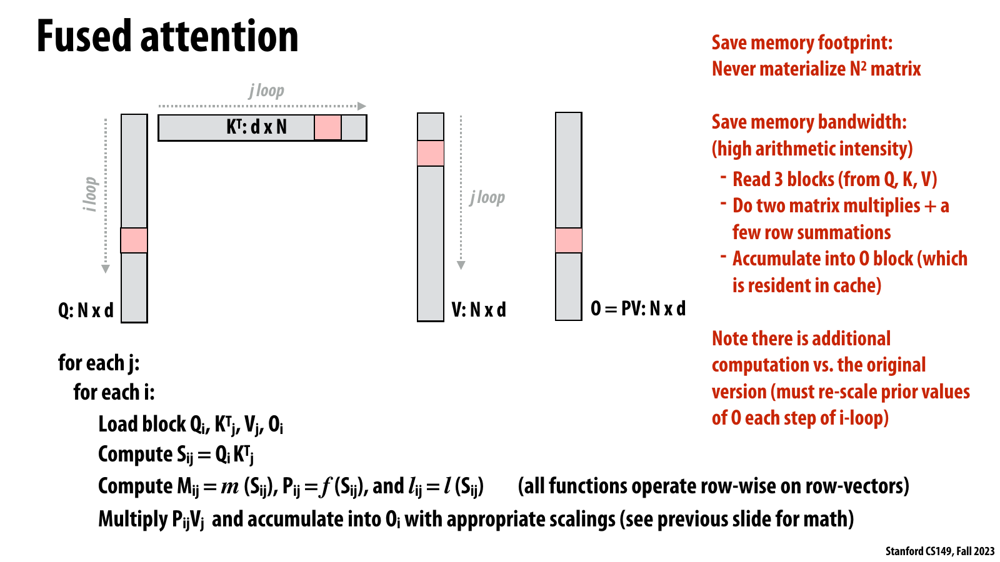

*공식 Lecture 10 slide p. 54 — query block을 고정하고 key/value block을 순회하면서 online
softmax와 `PV` accumulation을 한 kernel 안에서 수행한다.*

슬라이드는 각 `(i,j)` tile에서 `S_ij=Q_iK_j^T`를 계산하고 row-wise max·exponential sum을
갱신한 뒤 `P_ijV_j`를 resident한 `O_i` block에 누적하는 순서를 제시한다. 결과적으로
`N^2` matrix를 만들지 않고 Q, K, V block read당 두 matrix multiply와 reduction을 수행한다.

강의 논리에서 fused attention은 convolution fusion과 같은 producer-consumer locality를 더
강한 수학적 변환으로 확장한다. 이전 O와 normalizer를 새 maximum에 맞춰 rescale하는 추가
compute를 지불해 memory footprint와 HBM bandwidth를 줄이는 IO-aware trade-off다.

실무 해설: FlashAttention 계열 구현은 이 exact idea를 SRAM capacity에 맞춘 tile과 GPU
kernel로 구체화한다. Tile이 너무 크면 register/shared-memory pressure가 occupancy를 낮추고,
너무 작으면 K/V reread와 loop overhead가 커진다. Mask, dropout, backward pass를 포함한
correctness와 baseline 대비 error tolerance를 shape·dtype별로 검증해야 한다.

Query tile `Q_i`를 고정하고 key/value tile `(K_j, V_j)`를 차례로 순회한다.

```text
for each query block i:
  keep O_i, m_i, l_i on chip
  for each key/value block j:
    load Q_i, K_j, V_j
    S_ij = Q_i * K_j^T
    compute block row max and exponential sums
    rescale old O_i and accumulate softmax(S_ij) * V_j
  normalize and write O_i
```

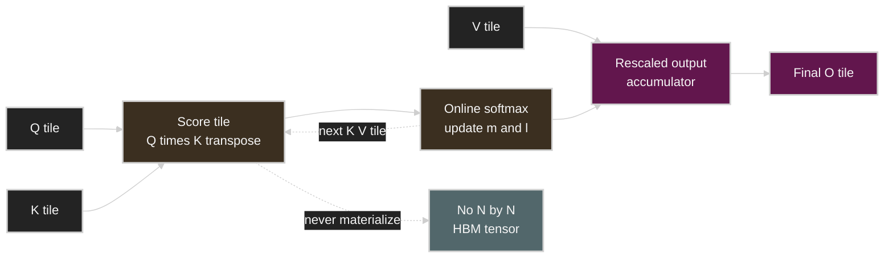
```mermaid
%%{init: {"theme": "base", "themeVariables": {"background": "#171717", "primaryColor": "#232323", "primaryTextColor": "#f5f5f5", "primaryBorderColor": "#d0d0d0", "lineColor": "#cfcfcf", "fontFamily": "Inter, Arial, sans-serif"}}}%%
flowchart LR
    Q[Q tile] --> S[Score tile<br/>Q times K transpose]
    K[K tile] --> S
    S --> R[Online softmax<br/>update m and l]
    V[V tile] --> A[Rescaled output<br/>accumulator]
    R --> A
    A --> O[Final O tile]

    S -. never materialize .-> N[No N by N<br/>HBM tensor]
    R -. next K V tile .-> S

    classDef primary fill:#232323,stroke:#d0d0d0,color:#f5f5f5,stroke-width:2px;
    classDef secondary fill:#3b2f20,stroke:#d0d0d0,color:#f5f5f5,stroke-width:2px;
    classDef note fill:#52676b,stroke:#d0d0d0,color:#f5f5f5,stroke-width:2px;
    classDef accent fill:#62164d,stroke:#d0d0d0,color:#f5f5f5,stroke-width:2px;
    class Q,K,V primary
    class S,R secondary
    class A,O accent
    class N note
```

Lecture slide가 정리한 효과는 다음과 같다.

* `N x N` score/probability matrix를 HBM에 materialize하지 않는다.
* Q, K, V block을 읽고 두 matrix multiply와 row reduction을 수행하므로 loaded byte당 work가
  많아진다.
* O block은 on-chip accumulator에 resident하다.
* 이전 O와 normalizer를 rescale하는 추가 computation을 지불한다.

이것은 approximation이 아니다. Standard attention의 수학을 IO-aware하게 reorder한 exact
algorithm이다. FlashAttention paper는 이 원리를 GPU SRAM/HBM IO complexity 관점에서
정식화한다. 강의가 소개한 “memory footprint의 큰 감소와 modest constant-factor speedup”은
hardware, shape, framework에 따라 달라지는 사례 수치로 이해해야 한다.

## Fusion in DNN Frameworks and Compilers

초기 framework는 자주 쓰는 조합마다 별도 API를 만들었다. 예를 들어 conv와 bias, batch
normalization, activation 조합을 library author가 hand-written fused kernel로 제공했다.
조합 수가 늘면 API와 implementation이 폭발한다.

더 유연한 접근은 tensor operation graph를 compiler/backend에 전달하는 것이다. Backend는
legal한 subgraph를 하나의 engine/kernel로 compile하고 intermediate를 register/shared
memory에 둔다. 강의는 이를 Halide의 `compute_at`와 연결하고, XLA/JAX/Triton 같은 compiler
effort를 언급한다.

그러나 자동 fusion은 다음 두 능력을 모두 필요로 한다.

1. GEMM/conv 자체의 훌륭한 low-level implementation
2. 주변 pointwise/reduction op를 어디에 계산할지 정하는 graph/schedule intelligence

Fusion legality만 확인해서는 부족하다. Register pressure, tile compatibility, duplicated work,
multiple consumers, numerical order, dynamic shape를 함께 평가해야 한다.

## Low Precision and Specialized Instructions

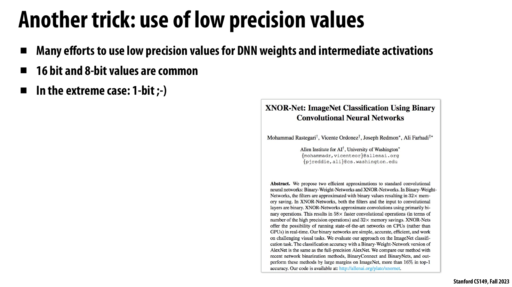

*공식 Lecture 10 slide p. 59 — 16-bit와 8-bit value는 흔한 선택이며, binary
convolution network의 1-bit 표현은 극단적인 approximation 사례로 제시된다.*

Slide는 DNN weight와 intermediate activation에 16-bit, 8-bit, 극단적으로 1-bit까지 사용하는
effort를 소개한다. 영상은 당시 4-bit 방향도 언급한다. Lower precision은 다음을 동시에
바꾼다.

* 같은 capacity에 더 많은 parameter/activation을 저장한다.
* 같은 bandwidth로 더 많은 element를 이동한다.
* Vector/MMA instruction 하나가 더 많은 operation을 처리한다.
* Accumulator precision, overflow, quantization error 검증이 필요해진다.

강의 논리에서 이 slide는 fusion으로 memory traffic을 줄인 다음, value 하나의 byte 수와
instruction 하나가 처리하는 element 수까지 줄이는 단계다. 다만 bit 수를 줄이는 일은
lossless scheduling transformation이 아니라 model accuracy와 numerical range를 교환하는
approximation이므로, throughput과 memory 절감은 반드시 task-level quality 검증과 함께
평가해야 한다.

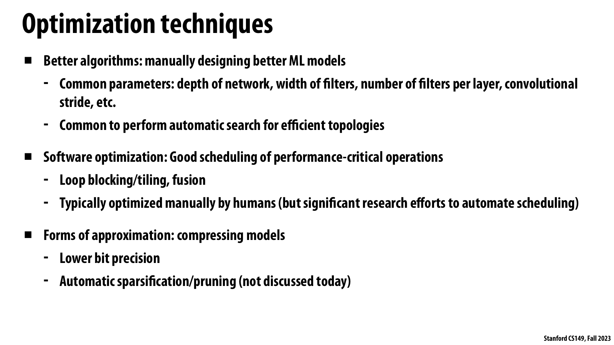

*공식 Lecture 10 slide p. 60 — model topology, loop blocking·tiling·fusion, lower precision과
pruning을 서로 다른 optimization layer로 구분한다. Pruning은 이 강의의 상세 범위가 아니다.*

슬라이드는 better algorithm에 사람이 설계한 model과 efficient topology search를, software
optimization에 performance-critical operation의 scheduling을, approximation에 low precision과
sparsification/pruning을 배치한다. 이는 앞에서 다룬 topology, tiling, fusion, precision이
서로 대체재가 아니라 위에서 아래로 workload와 실행 비용을 차례로 바꾸는 stack이라는
강의 전체 논리를 한 장에 모은다.

실무에서 이 stack의 portability는 균일하지 않다. Model topology는 여러 platform에서 같은
graph로 실행할 수 있어도 best schedule은 cache, shared memory, warp와 vector width에 따라
달라지고, low-precision speedup은 target이 해당 dtype과 MMA path를 실제 지원해야 얻어진다.
Backend capability check, FP32/reference fallback, shape별 autotuning을 유지하면 portability는
높아지지만, 특정 accelerator에 맞춘 packing과 fusion을 포기한 만큼 peak performance가
낮아질 수 있다.

FP16 input과 FP32 accumulation처럼 storage/compute precision과 accumulation precision을
분리할 수 있다. 정확도 요구와 supported hardware path를 고려하지 않고 dtype만 낮추면
conversion overhead나 fallback kernel 때문에 오히려 느려질 수 있다.

## Why GPUs Fit DNNs and Where They Do Not

GPU가 DNN에 잘 맞는 이유는 다음과 같다.

| Property | DNN workload connection |
| -------- | ----------------------- |
| Massive parallelism | Output element/tile/filter/batch가 독립적으로 계산 가능 |
| SIMD/SIMT execution | 같은 multiply-add와 activation을 많은 data에 반복 |
| High FLOP throughput | GEMM-like dense computation이 많음 |
| High memory bandwidth | Large weight와 activation stream을 공급 |
| On-chip shared memory/registers | Blocking과 producer-consumer locality 구현 |
| Tuned libraries | cuDNN, GEMM, reduction kernel을 framework가 재사용 |

반대로 GPU가 sub-optimal할 수 있는 이유도 있다.

* Batch/shape가 작으면 SM을 채울 parallel work가 부족하다.
* Pointwise op와 materialized intermediate는 bandwidth-bound다.
* Irregular sparsity와 control divergence는 regular dense hardware utilization을 낮춘다.
* Instruction fetch/decode, scheduling, general-purpose control은 fixed DNN operation에는 overhead다.
* Peak Tensor Core throughput은 dtype, alignment, tile shape가 맞을 때만 사용할 수 있다.

따라서 “GPU가 빠르다”는 workload-independent property가 아니다. DNN graph를 large regular
tile과 high reuse operation으로 바꿀 수 있을 때 GPU의 장점이 드러난다.

## Tensor Cores and Amortized Control

SIMD의 목적은 하나의 instruction/control overhead를 여러 arithmetic operation에 나누는
것이다. Specialization은 그 단위를 더 키운다.

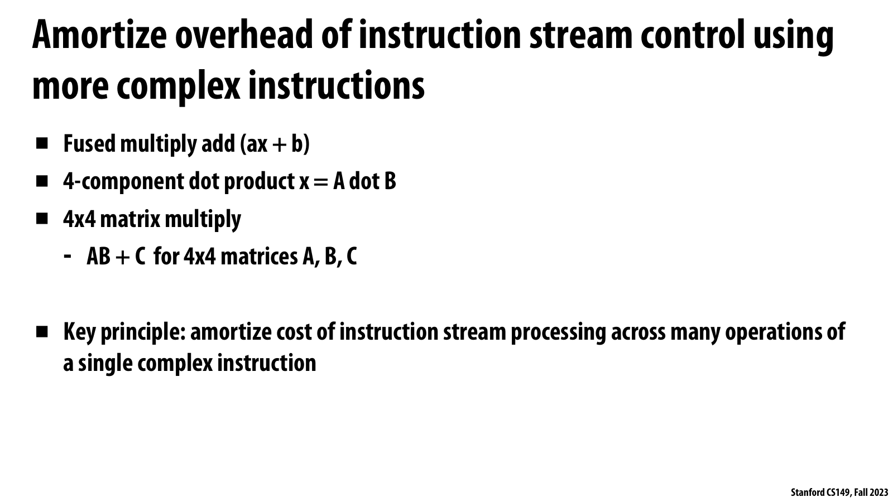

*공식 Lecture 10 slide p. 65 — `ax+b`, four-component dot product, `AB+C` 형태의 `4 x 4`
matrix multiply로 갈수록 한 complex instruction이 더 많은 arithmetic operation을 맡는다.*

슬라이드의 핵심 문장은 한 complex instruction의 여러 operation에 instruction-stream
processing cost를 나누라는 것이다. Fetch, decode, issue 같은 control work를 arithmetic마다
반복하지 않으므로 regular한 dot product와 matrix tile에서는 control 대비 useful work의
비율을 높일 수 있다.

```text
scalar FMA -> vector dot product -> matrix multiply-accumulate tile
```

이 granularity 증가는 software가 정확한 tile shape와 data layout을 공급할 때만 이득이다.
작거나 홀수인 matrix의 padding·tail, packing, unsupported target의 scalar/vector fallback은
절약한 control cost를 상쇄할 수 있다. 따라서 portable implementation은 reference path와
backend dispatch를 남기되, accelerator-specific kernel은 충분히 큰 eligible tile에만
선택하는 성능/이식성 trade-off를 갖는다.

Lecture slide는 Bill Dally의 2018 estimate를 인용해 half-precision FMA, four-component dot
product, `4 x 4` MMA에서 programmability overhead를 각각 `2000%`, `500%`, `27%`로 제시한다.
이는 특정 academic estimate이지 모든 chip의 측정값이 아니다. Transcript의 자동 자막처럼
`2000 times`로 읽지 않고 slide의 percent 단위를 보존해야 한다.

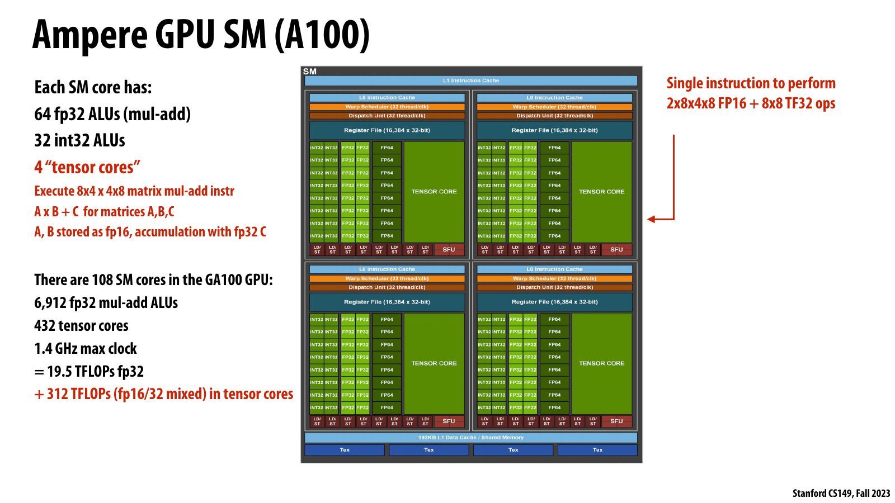

*공식 Lecture 10 slide p. 67 — GA100의 108개 SM, 총 6,912개 FP32 mul-add ALU와 432개
Tensor Core, 19.5 FP32 TFLOPs와 312 mixed FP16/FP32 Tensor Core TFLOPs를 비교한다.*

각 SM에 64개 FP32 ALU, 32개 INT32 ALU, 4개 Tensor Core가 있다는 slide의 배치는 p. 65의
amortization 원리가 실제 hardware specialization으로 이어지는 지점을 보여 준다. 표시된
Tensor Core instruction은 FP16 A·B와 FP32 C를 사용하는 `8 x 4` by `4 x 8` matrix
multiply-accumulate이며, 한 instruction이 여러 matrix operation을 묶어 처리한다.

A100 slide의 역사적 hardware snapshot은 다음과 같다.

| Item | Slide value |
| ---- | ----------- |
| SM count | 108 |
| FP32 ALUs | 6,912 total |
| Tensor Cores | 432 total |
| Clock used in estimate | 1.4 GHz max |
| FP32 throughput | 19.5 TFLOPs |
| Mixed FP16/FP32 Tensor Core throughput | 312 TFLOPs |

Tensor Core는 marketing abstraction 이전에 small matrix multiply-accumulate를 수행하는
specialized instruction/datapath다. Software가 convolution과 attention을 MMA-friendly tile로
표현하고 supported precision을 사용해야 이 throughput에 접근할 수 있다. 312 TFLOPs라는
slide의 peak와 portable end-to-end code 사이에는 dtype conversion, tile tail, non-MMA
operator, memory traffic이 남는다. Library dispatch와 fallback은 더 넓은 GPU 세대를
지원하지만, hardware-specific layout·pipeline을 쓰는 tuned path보다 성능이 낮을 수 있으므로
지원 범위와 actual model goodput을 함께 측정해야 한다.

## GPU Systems Lens

이 절과 이어지는 Practical Tips는 강의 개념을 AI data center와 modern GPU serving/training에
적용한 추가 해석이다. 강의 영상이나 슬라이드의 직접 주장으로 간주하지 않는다.

| Lecture 10 concept | GPU/AI systems interpretation |
| ------------------ | ----------------------------- |
| Different layer shapes | Kernel catalog, autotuning, shape bucket, compilation cache가 필요 |
| Blocking | HBM → L2 → shared memory → register hierarchy에서 reuse 설계 |
| Batch size and slack | Continuous batching, microbatch size, latency SLO와 utilization의 trade-off |
| Explicit workspace | Capacity pressure, allocator fragmentation, concurrent request 수 감소 |
| Fusion | HBM traffic와 launch 수 감소, register pressure 증가 |
| Fused attention | Context length의 quadratic intermediate를 제거해 capacity와 bandwidth 절약 |
| Low precision | Model capacity, network byte, HBM byte, collective byte를 함께 감소 |
| Specialized MMA | Peak FLOPs보다 실제 eligible-op 비율과 tile utilization이 중요 |
| Topology innovation | Hardware sizing assumption이 model generation마다 빠르게 바뀜 |

Node 하나의 kernel optimization과 cluster-level goodput은 다르다. Faster kernel이 peak memory를
줄이면 같은 GPU에 더 많은 request를 batch하거나 KV cache를 더 오래 유지할 수 있다. 반대로
aggressive fusion이 compilation variant를 폭증시키면 cold-start latency와 cache miss가
service tail latency에 나타날 수 있다.

## Practical Tips and Notes

아래 내용은 field-oriented 추가 지침이다. 공식 강의의 직접 요약과 구분한다.

### End-to-end profile에서 시작하기

먼저 wall-clock trace에서 operator time, launch gap, memcpy, synchronization, layout conversion을
본다. 가장 FLOP가 큰 op와 가장 긴 op가 같다고 가정하지 않는다. Nsight Systems로 graph
timeline을 보고 Nsight Compute로 선택한 kernel의 memory/compute behavior를 파고드는 식으로
scope를 좁힌다.

> [!TIP]
> Optimization 전후에 동일한 input, batch policy, warm-up, precision, correctness tolerance를
> 고정하고 end-to-end latency와 kernel-only latency를 둘 다 기록한다.

### Arithmetic intensity를 realized traffic으로 계산하기

Source code의 unique tensor size만 세지 말고 profiler의 DRAM/L2 byte와 executed FLOP를 사용한다.

```text
realized AI = executed FLOPs / measured DRAM bytes
```

Theoretical reuse가 높아도 poor tiling, cache eviction, layout conversion, partial writeback 때문에
실제 AI는 낮을 수 있다. Roofline에서 compute ceiling과 bandwidth ceiling 중 어느 쪽에 가까운지
확인한다.

### Shape별 성능 분포를 보존하기

한 representative shape만 benchmark하지 않는다. Production trace에서 batch, sequence length,
channel, spatial size의 histogram을 만들고 traffic-weighted top shape와 tail shape를 모두
측정한다. Autotuner가 선택한 kernel ID와 workspace도 함께 기록하면 regression 원인을 찾기
쉽다.

### Workspace는 capacity와 concurrency 비용이다

Explicit GEMM이나 transform-based algorithm의 workspace가 kernel latency를 줄여도 concurrent
request 수를 낮출 수 있다. Algorithm selection 시 다음을 같이 비교한다.

* Kernel latency와 end-to-end latency
* Peak allocated/reserved memory
* Workspace reuse 가능성
* Concurrent streams/requests에서의 throughput
* Allocator fragmentation과 OOM margin

### Fusion의 이득과 resource pressure를 함께 측정하기

Fusion 후 DRAM byte와 kernel launch가 줄었는지 확인하는 동시에 registers/thread, shared
memory/block, occupancy, spill load/store를 확인한다. Consumer가 여러 개면 모든 branch를
fuse하려다가 code size와 recomputation이 커질 수 있다.

> [!WARNING]
> Kernel 수가 줄었다는 사실만으로 fusion 성공을 판단하지 않는다. Register spill이나 낮은
> occupancy가 생기면 HBM traffic을 줄이고도 latency가 악화될 수 있다.

### Batch size는 throughput knob이자 queueing policy다

Batch를 키우면 weight reuse와 tile 수가 늘지만 request가 모일 때까지 기다리는 queueing delay가
생긴다. Offline throughput benchmark와 online latency SLO를 분리한다. Serving에서는
`tokens/s`, `requests/s`, time-to-first-token, inter-token latency, p99를 함께 본다.

### Attention memory를 항목별로 분해하기

Sequence length를 늘릴 때 score/probability intermediate, Q/K/V, output, saved activation, KV
cache를 따로 계산한다. Fused attention은 `N^2` score materialization을 없애지만 KV cache나
other activation까지 없애는 것은 아니다. Training과 autoregressive inference의 memory
breakdown도 다르다.

### Numerical validation을 performance gate에 포함하기

Low precision, Winograd, fusion, reduction reordering은 rounding path를 바꾼다. Bitwise equality
대신 layer별/error distribution과 task-level acceptance criterion을 정한다.

* Absolute/relative error와 worst-case outlier
* NaN/Inf 발생 여부
* Reference FP32 output과의 cosine similarity 또는 task metric
* 여러 shape와 seed에서의 stability
* Calibration dataset 밖의 edge case

### Layout conversion을 숨은 operator로 취급하기

Kernel 하나가 NHWC에서 빠르더라도 producer/consumer가 NCHW를 요구하면 conversion traffic이
fusion 이득을 상쇄할 수 있다. Graph 전체에서 layout을 계획하고, profiler에서 transpose,
contiguous copy, pack/unpack을 별도 op로 찾는다.

### Quick Reference

| Symptom | First check |
| ------- | ----------- |
| GEMM FLOPs는 많은데 utilization이 낮음 | Matrix/tile shape, batch slack, Tensor Core eligibility |
| Conv workspace가 크게 증가 | Explicit im2col 또는 transform algorithm 선택 여부 |
| Small batch에서 throughput 급락 | Active blocks/SM, launch count, dimension tail |
| Pointwise op가 timeline을 지배 | Intermediate HBM traffic과 fusion 가능성 |
| Fusion 후 오히려 느림 | Register spill, shared-memory use, occupancy, recomputation |
| Sequence length에서 OOM | `N^2` attention intermediate, saved activation, KV cache 분리 |
| Low precision이 빨라지지 않음 | Conversion/fallback, alignment, supported MMA path |
| Shape마다 성능 편차가 큼 | Autotuning coverage와 compilation/kernel cache hit |
| Peak FLOPs는 높지만 end-to-end가 낮음 | Non-MMA op 비율, launch gap, memory traffic, synchronization |
| 결과가 조금씩 달라짐 | Reduction order, accumulator precision, fused math semantics |

## Lecture Summary

DNN evaluation은 tensor graph를 memory hierarchy에 맞게 실행하는 문제다. Neuron은 weighted
sum과 nonlinearity의 circuit이고, fully connected layer는 matrix product로, convolution은
`N,P,Q,K,C,R,S` dimension의 loop nest로 표현된다. 이 representation이 parallelism과 reuse를
찾는 출발점이다.

Model topology는 system이 처리해야 할 work 자체를 바꾼다. 강의의 VGG-to-MobileNet 사례는
비슷한 accuracy에서 parameter와 operation cost가 크게 줄 수 있음을 보여 준다. 그 위에서
software는 각 layer의 shape에 맞는 schedule을 선택해야 한다.

Convolution-to-GEMM mapping은 mature matrix multiplication techniques를 재사용하게 한다.
하지만 explicit `im2col`은 activation window를 duplicate해 storage와 traffic을 증가시킨다.
Implicit GEMM은 virtual convolution matrix의 tile만 shared memory에 만들고 tuned GEMM
microkernel을 적용한다.

GEMM의 높은 theoretical arithmetic intensity는 blocking으로 실현된다. A/B/C tile을 on-chip에
유지하면 `O(b^2)` data movement로 `O(b^3)` work를 수행할 수 있다. CPU cache, GPU shared
memory, register, SIMD/MMA에 맞춘 hierarchical tiling이 필요하며 layer shape마다 best schedule은
달라진다.

Network level에서는 intermediate tensor traffic이 중요하다. Conv, scale/bias, pool을 각각
실행하면 full activation이 HBM을 반복 왕복한다. Fusion은 producer tile이 on-chip에 있을 때
consumer를 계산해 traffic과 launch를 줄인다.

Attention은 softmax를 가로지르는 algorithmic fusion 사례다. Chunk별 max, normalization sum,
value-weighted accumulator를 rescale하며 합성하면 `N x N` score/probability matrix를 만들지
않고 exact output을 계산할 수 있다. 추가 rescale computation을 지불하고 HBM traffic과
quadratic intermediate storage를 크게 줄인다.

Low precision과 Tensor Core는 memory byte를 줄이고 instruction control을 많은 matrix operation에
amortize한다. 그러나 peak number는 eligible shape, precision, layout, parallel slack이 있을 때만
의미가 있다. 최종 성능은 topology, schedule, fusion, precision, hardware가 함께 결정한다.

최종적으로 기억할 문장은 다음과 같다.

* FLOP count만이 아니라 data movement와 reuse를 최적화한다.
* Convolution을 GEMM으로 보는 것과 full `im2col` matrix를 만드는 것은 같은 말이 아니다.
* Blocking은 algorithmic reuse를 실제 cache/shared-memory reuse로 바꾼다.
* Layer shape가 다르면 best schedule도 달라진다.
* Fusion의 목적은 large intermediate를 on-chip에서 소비하는 것이다.
* Online softmax는 exact attention에서 `N^2` materialization을 제거한다.
* Tensor Core peak throughput은 software가 MMA-friendly work를 공급할 때만 실현된다.

## Key Terms

| Term | Meaning |
| ---- | ------- |
| DNN evaluation | 학습된 weight로 forward computation을 실행하는 과정 |
| Activation | Layer의 input/output intermediate tensor value |
| Weight | 학습되어 convolution/GEMM에 사용되는 parameter |
| ReLU | `max(0,x)`인 element-wise nonlinearity |
| Convolution | Local spatial window와 shared filter weight의 dot product |
| Filter/channel | Output feature detector와 input feature dimension |
| Pooling | Spatial region을 max/average 등으로 축약하는 reduction |
| GEMM | General matrix-matrix multiplication |
| `im2col` | Convolution window를 matrix row/column으로 펼치는 data transformation |
| Explicit GEMM | Convolution matrix 전체를 materialize한 뒤 GEMM 실행 |
| Implicit GEMM | 필요한 convolution matrix tile을 on demand 구성하며 GEMM 실행 |
| Arithmetic intensity | 이동한 byte당 수행한 arithmetic operation 수 |
| Blocking/tiling | Working set을 on-chip memory에 맞는 subproblem으로 나누는 schedule |
| Hierarchical tiling | 여러 cache/shared-memory/register level에 각각 tile을 대응시키는 방식 |
| Scratchpad | Software가 명시적으로 관리하는 on-chip memory, 예: CUDA shared memory |
| Register blocking | Partial output을 register에 유지해 reuse하는 microkernel 기법 |
| SIMD/SIMT | 하나의 control flow/instruction을 여러 data element/thread에 적용하는 방식 |
| Winograd convolution | Addition/transform을 늘려 convolution multiplication 수를 줄이는 algorithm |
| FFT convolution | Transform domain의 pointwise multiplication으로 convolution을 수행 |
| Operator fusion | 여러 graph operation을 한 kernel/schedule에 결합하는 변환 |
| Materialization | Intermediate logical value를 실제 memory tensor로 쓰는 것 |
| Pointwise operation | 각 element에 독립적으로 적용되는 map-style operation |
| Transformer | Attention을 주요 building block으로 사용하는 sequence model architecture |
| Attention | Query-key score, softmax, value aggregation으로 구성된 operation |
| Online softmax | Chunk별 max/sum을 rescale하며 stable softmax를 streaming 계산하는 방식 |
| FlashAttention | Tiling과 online softmax로 exact attention의 HBM IO를 줄이는 algorithm |
| Workspace | Kernel/algorithm이 output 외에 요구하는 temporary storage |
| Autotuning | Shape/hardware별 candidate schedule을 측정해 선택하는 과정 |
| Low precision | FP16, INT8 등 더 적은 bit로 weight/activation/compute를 표현하는 방식 |
| MMA | Matrix multiply-accumulate instruction |
| Tensor Core | Small matrix MMA를 높은 throughput으로 수행하는 specialized GPU unit |
| Parallel slack | Hardware worker를 채울 수 있는 independent work의 여유 |

## Questions

1. 이 강의에서 DNN을 computation graph로 보는 이유는 무엇인가?
2. Fully connected layer가 batch 처리에서 GEMM으로 바뀌는 과정을 설명하라.
3. Forward convolution의 일곱 loop dimension은 무엇인가?
4. `X[N,H,W,C]`, filter `W[K,R,S,C]`에서 output element 하나의 reduction length는 얼마인가?
5. Convolution-to-GEMM에서 A, B, C matrix shape은 각각 무엇인가?
6. Explicit `im2col`이 activation storage와 DRAM traffic을 늘리는 이유는 무엇인가?
7. Square GEMM의 work가 `O(n^3)`인데 naive implementation이 `O(1)` arithmetic intensity처럼
   동작할 수 있는 이유는 무엇인가?
8. `b x b` blocked GEMM tile의 work, data, arithmetic intensity order는 각각 무엇인가?
9. Block size를 무조건 크게 할 수 없는 이유를 세 가지 이상 설명하라.
10. CPU cache와 CUDA shared memory의 programmer-visible 차이는 무엇인가?
11. GEMM microkernel에서 B transpose/packing이 도움이 되는 이유는 무엇인가?
12. 같은 DNN 안에서 layer마다 다른 schedule이 필요한 이유는 무엇인가?
13. Implicit GEMM은 full convolution matrix를 만들지 않고 어떻게 GEMM primitive를 사용하는가?
14. Batch size 1에서 large GPU throughput이 낮아질 수 있는 이유는 무엇인가?
15. Direct, explicit GEMM, implicit GEMM, Winograd, FFT convolution의 주요 trade-off를 비교하라.
16. Conv, scale/bias, max pool을 별도 kernel로 실행할 때 어떤 memory traffic이 발생하는가?
17. Max pool을 conv에 fuse하려면 conv schedule이 어떤 output을 함께 만들면 좋은가?
18. Fusion이 항상 빠르지 않은 이유는 무엇인가?
19. Naive attention이 `O(N^2)` intermediate storage를 요구하는 지점을 설명하라.
20. Stable softmax에서 maximum을 먼저 빼는 이유는 무엇인가?
21. 두 softmax chunk의 `(m,l)`을 결합하는 식은 무엇인가?
22. Fused attention에서 이전 output accumulator를 rescale해야 하는 이유는 무엇인가?
23. Fused attention이 approximation이 아닌 이유는 무엇인가?
24. Automatic fusion compiler에 fast GEMM kernel만으로 충분하지 않은 이유는 무엇인가?
25. Low precision이 memory와 compute에 주는 이점과 검증 위험은 무엇인가?
26. GPU가 DNN에 잘 맞는 workload property를 네 가지 제시하라.
27. General-purpose GPU가 fixed DNN operation에서 비효율적일 수 있는 이유는 무엇인가?
28. Tensor Core가 control overhead를 amortize하는 방식을 설명하라.
29. Peak Tensor Core TFLOPs와 end-to-end model throughput이 크게 다를 수 있는 이유는 무엇인가?
30. Topology, scheduling, fusion, precision, hardware optimization은 어떤 순서와 관계로 보아야
    하는가?

## Answers

1. Tensor shape, operator dependency, parallelism, reuse, intermediate traffic을 명시적으로 볼 수
   있어 hardware schedule과 memory cost를 분석할 수 있기 때문이다.
2. Input vector 여러 개를 batch matrix `X`의 row로 묶으면 같은 weight matrix에 대한 여러
   matrix-vector product가 `XW^T`라는 matrix-matrix product가 된다.
3. Batch `N`, output height `P`, output width `Q`, output filter `K`, input channel `C`, filter
   height `R`, filter width `S`다.
4. `C*R*S`다.
5. `A=(N*P*Q) x (C*R*S)`, `B=(C*R*S) x K`, `C=(N*P*Q) x K`다.
6. Neighbor output window가 input activation을 공유하므로 같은 element가 여러 matrix row에
   복사된다. 이 expanded matrix를 쓰고 GEMM이 다시 읽기 때문에 workspace와 traffic이 늘어난다.
7. Naive loop가 cache에 맞는 tile을 만들지 않아 A/B를 반복 load하고 row-major B를 poor
   locality로 접근하기 때문이다. Algorithmic reuse potential을 schedule이 실현하지 못한다.
8. Data는 `O(b^2)`, work는 `O(b^3)`, arithmetic intensity는 `O(b)`다.
9. Tile이 cache/shared memory에 들어가야 하고, register pressure가 occupancy를 낮출 수 있으며,
   odd dimension의 tail waste와 shared-memory bank conflict도 커질 수 있다.
10. Cache는 같은 address space의 line을 hardware가 자동 관리한다. Shared memory는 별도
    scratchpad address space로 programmer가 copy, placement, synchronization을 관리한다.
11. Reduction operand를 contiguous vector load로 만들고 column stride access를 없애 SIMD dot
    product와 spatial locality를 개선할 수 있기 때문이다. Packing overhead는 따로 든다.
12. Spatial, channel, filter, batch dimension과 dtype이 layer마다 달라 parallel slack, reuse,
    vector tail, tile fit이 달라지기 때문이다.
13. Output tile에 필요한 input coordinate를 iterator가 계산해 virtual A tile만 shared memory에
    gather하고, 그 tile에 tuned warp/register GEMM을 적용한다.
14. Schedulable output tile 수가 SM 수를 채우지 못하고 weight reuse 기회도 줄어 fixed launch와
    scheduling overhead를 충분한 work에 amortize하지 못할 수 있기 때문이다.
15. Direct는 workspace가 없지만 schedule이 복잡하다. Explicit GEMM은 mature GEMM을 쓰지만
    expansion 비용이 있다. Implicit GEMM은 expansion을 on-chip tile로 제한하지만 addressing이
    복잡하다. Winograd는 multiply를 add/transform과 교환하고 FFT는 large convolution을
    transform overhead와 교환한다.
16. Conv output write, scale read/write, pool read와 smaller pooled output write가 발생한다. Large
    intermediate가 HBM을 여러 번 왕복한다.
17. 한 `2 x 2` spatial output region을 동시에 on-chip에 만들면 네 값을 바로 reduce해 하나만
    store할 수 있다.
18. Register/shared-memory pressure, occupancy 감소, spill, incompatible tile, code size,
    recomputation, multiple consumer 때문에 이득이 상쇄될 수 있다.
19. `S=QK^T`와 `P=softmax(S)`가 각각 `N x N`이고 separate operator가 이를 HBM에
    materialize하기 때문이다.
20. 큰 `x_i`의 exponential overflow를 막고 numerical stability를 높이기 위해서다. Softmax는
    모든 element에서 같은 constant를 빼도 결과가 같다.
21. `m=max(m1,m2)`, `l=exp(m1-m)l1 + exp(m2-m)l2`다.
22. 새 chunk의 maximum이 더 크면 이전 accumulator가 다른 exponential reference scale로
    계산되어 있으므로 `exp(m_old-m_new)` factor로 scale을 맞춰야 한다.
23. Stable softmax의 algebraic identity를 사용해 operation order와 storage만 바꾸며 standard
    attention의 수학적 result를 계산하기 때문이다. Floating-point rounding order는 달라질 수 있다.
24. 주변 reduction/pointwise op의 dependency를 변환하고 legal/profitable fusion schedule을
    찾아야 한다. Resource pressure와 layout, shape까지 함께 고려해야 한다.
25. Value당 byte와 memory traffic을 줄이고 vector/MMA throughput을 높일 수 있다. 대신
    quantization, overflow, rounding, accumulator precision과 fallback/conversion을 검증해야 한다.
26. Massive data parallelism, regular SIMD/SIMT work, high arithmetic intensity potential, dense
    GEMM-like computation, high-bandwidth demand 중 네 가지를 들 수 있다.
27. Instruction/control hardware의 energy와 area가 들고, irregular/small work는 wide parallel
    resources를 채우지 못하며, fixed matrix operation에는 범용 기능이 불필요할 수 있기 때문이다.
28. Scalar operation 여러 개 대신 작은 matrix tile의 multiply-accumulate를 한 instruction으로
    표현해 fetch/decode/control cost를 많은 arithmetic operation에 나눈다.
29. Model의 일부 op만 MMA-eligible하고, small/odd shape, low batch, memory-bound op, launch gap,
    layout conversion, synchronization이 end-to-end critical path에 남기 때문이다.
30. 먼저 topology가 필요한 work와 accuracy를 정하고, schedule이 reuse/parallelism을 만들며,
    fusion이 graph boundary traffic을 줄이고, precision과 specialized hardware가 operation당 비용을
    낮춘다. 네 층은 함께 co-design하고 end-to-end로 검증해야 한다.
