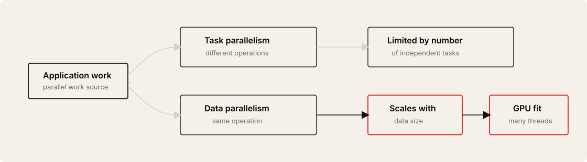
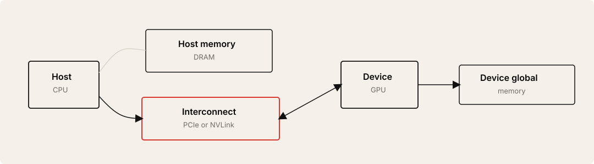
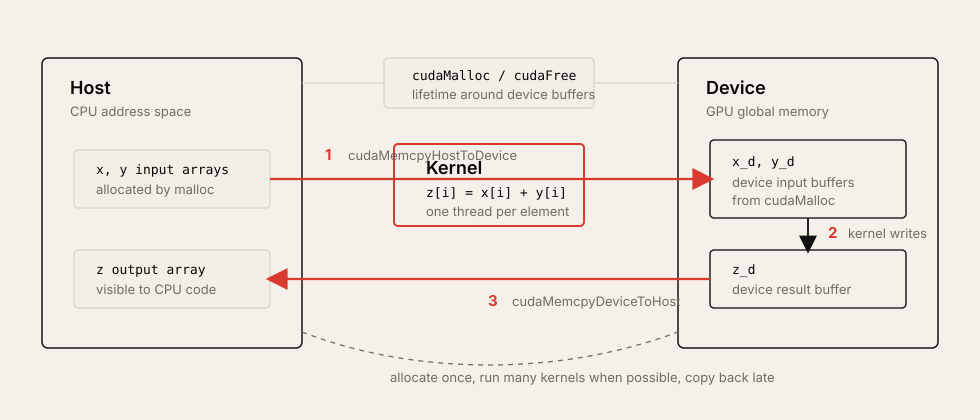
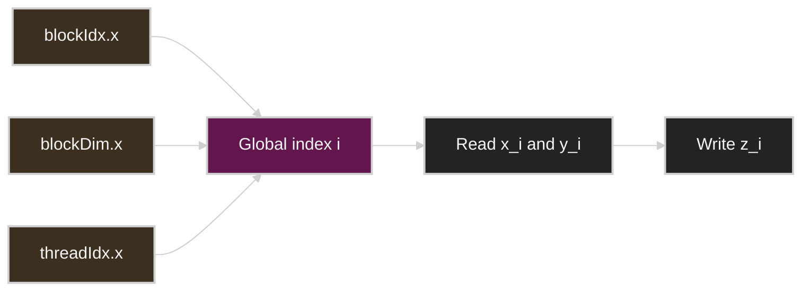
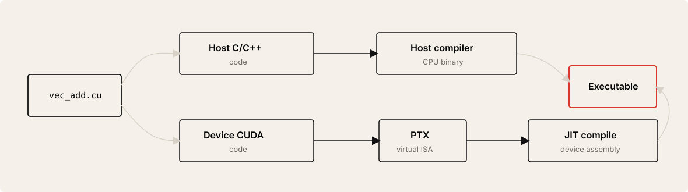

# Lecture 2: Data Parallel Programming and the CUDA Programming Model

Source: [PMPP 2021 Lecture 2](https://www.youtube.com/watch?v=iE-xGWBQtH0&list=PLRRuQYjFhpmubuwx-w8X964ofVkW1T8O4&index=2)

## Table of Contents

* [Goal](#goal)
* [Lecture Overview](#lecture-overview)
* [Task Parallelism and Data Parallelism](#task-parallelism-and-data-parallelism)
* [Vector Addition as Hello World](#vector-addition-as-hello-world)
* [Host, Device, and Global Memory](#host-device-and-global-memory)
* [GPU Offload Workflow](#gpu-offload-workflow)
* [CUDA Memory Management](#cuda-memory-management)
* [Kernel Launches](#kernel-launches)
* [Grid, Block, and Thread Indexing](#grid-block-and-thread-indexing)
* [Boundary Conditions](#boundary-conditions)
* [Compiling CUDA with nvcc](#compiling-cuda-with-nvcc)
* [CUDA Function Qualifiers](#cuda-function-qualifiers)
* [Timing, Synchronization, and Error Checking](#timing-synchronization-and-error-checking)
* [Practical Tips and Notes](#practical-tips-and-notes)
* [Lecture Summary](#lecture-summary)
* [Key Terms](#key-terms)
* [Questions](#questions)
* [Answers](#answers)

---

## Goal

이번 강의의 목표는 GPU에서 data parallel program을 어떻게 표현하는지 이해하고, 가장 작은 CUDA 프로그램인 vector addition을 끝까지 작성할 수 있게 되는 것이다.

핵심 메시지는 다음과 같다.

> GPU programming의 기본은 host memory에 있는 데이터를 device global memory로 복사하고, 많은 thread가 같은 kernel을 서로 다른 data element에 적용하게 한 뒤, 결과를 다시 host로 가져오는 것이다. CUDA는 이 흐름을 `cudaMalloc`, `cudaMemcpy`, `kernel<<<grid, block>>>`, thread indexing, `cudaFree`로 표현한다.

이 강의는 다음을 다룬다.

* task parallelism과 data parallelism의 차이
* vector addition을 sequential loop에서 GPU kernel로 바꾸는 방법
* CPU를 host, GPU를 device라고 부르는 CUDA terminology
* host memory와 device global memory가 분리되어 있다는 기본 가정
* GPU offload의 allocate, copy, compute, copy back, deallocate 흐름
* `cudaMalloc`, `cudaMemcpy`, `cudaFree`
* kernel launch syntax와 execution configuration
* grid, block, thread hierarchy
* `blockIdx.x`, `blockDim.x`, `threadIdx.x`로 global index를 계산하는 방법
* block 크기로 딱 나누어지지 않는 입력을 처리하는 boundary condition
* `nvcc`가 host code와 device code를 분리해 컴파일하는 방식
* `__global__`, `__host__`, `__device__`
* asynchronous kernel launch, `cudaDeviceSynchronize`, CUDA error checking

---

## Lecture Overview

강의 초반부는 1강의 GPU architecture motivation을 복습한다. 2005년 전후 frequency scaling이 power wall에 막히면서 더 높은 성능을 얻기 위해 core 수를 늘리는 방향으로 산업이 이동했고, GPU는 이 흐름에서 massively parallel processor로 부상했다. CPU는 single task latency를 줄이는 latency-oriented design이고, GPU는 단위 시간당 많은 task를 처리하는 throughput-oriented design이다.

이번 강의의 본론은 data parallel programming이다. Task parallelism은 서로 다른 작업을 병렬로 실행하는 방식이고, data parallelism은 같은 연산을 많은 데이터 조각에 반복 적용하는 방식이다. GPU는 대량의 thread를 실행하는 장치이므로, data parallelism이 가장 자연스럽게 맞는다.

강의의 예제는 vector addition이다. CPU에서는 `for` loop 하나로 `z[i] = x[i] + y[i]`를 수행하지만, GPU에서는 element마다 thread 하나를 배정한다. 이를 위해 먼저 host memory에 있는 입력 배열을 device global memory로 복사하고, GPU kernel을 실행한 뒤, 결과 배열을 host memory로 다시 복사한다.

후반부는 CUDA programming model의 핵심 문법을 정리한다. Kernel은 `__global__` function으로 선언하고, host code에서 `kernel<<<numBlocks, numThreadsPerBlock>>>(...)` 형식으로 launch한다. 각 thread는 `blockIdx.x * blockDim.x + threadIdx.x`로 자신의 global index를 계산하고, 그 index에 해당하는 array element를 처리한다. 입력 크기가 block 크기의 배수가 아닐 때는 ceiling division으로 충분한 thread를 만들고, kernel 안에서 `if (i < n)` boundary check를 둔다.

마지막으로 compilation과 runtime behavior를 본다. `nvcc`는 `.cu` file에서 host code와 device code를 분리한다. Host code는 C/C++ compiler로, device code는 PTX와 GPU assembly 경로로 컴파일된다. Kernel launch는 기본적으로 asynchronous이므로 timing을 정확히 하려면 `cudaDeviceSynchronize()`가 필요하고, CUDA runtime API는 `cudaError_t`를 반환하므로 error checking을 습관화해야 한다.

---

## Task Parallelism and Data Parallelism

Parallelism을 뽑아내는 대표적인 방식은 task parallelism과 data parallelism이다.

| Type | Meaning | Example | Typical scale |
| ---- | ------- | ------- | ------------- |
| Task parallelism | 서로 다른 operation을 같은 데이터 또는 다른 데이터에 병렬 적용 | text editor와 spell checker가 동시에 동작 | 보통 modest |
| Data parallelism | 같은 operation을 많은 data element에 병렬 적용 | 화면의 각 pixel 값 계산, vector addition | 매우 큼 |

Task parallelism은 application 안에 독립적인 task가 몇 개나 있느냐에 의해 제한된다. 대부분의 프로그램은 서로 다른 종류의 task를 수천 개, 수백만 개씩 갖고 있지 않다.

Data parallelism은 데이터 크기가 커질수록 자연스럽게 커진다. 예를 들어 화면 해상도가 높아지면 pixel 수가 늘고, 같은 pixel shader나 연산을 적용할 독립 element가 많아진다. 코드를 새로 많이 작성하지 않아도 parallel work가 증가한다는 점이 GPU와 잘 맞는다.



---

## Vector Addition as Hello World

Vector addition은 data parallel programming의 hello world다.

```text
input:  x[0..n-1], y[0..n-1]
output: z[0..n-1]
rule:   z[i] = x[i] + y[i]
```

CPU version은 sequential loop다.

```c
void vecAddCPU(float *x, float *y, float *z, unsigned int n) {
    for (unsigned int i = 0; i < n; ++i) {
        z[i] = x[i] + y[i];
    }
}
```

이 loop의 각 iteration은 서로 독립이다. `z[0]`을 계산하는 일은 `z[1]`을 계산하는 일과 충돌하지 않는다. 따라서 가장 단순한 GPU parallelization은 thread 하나가 element 하나를 맡는 방식이다.

| CPU view | GPU view |
| -------- | -------- |
| One thread loops over all elements | Many threads each handle one element |
| Loop index `i` comes from `for` loop | Index `i` comes from CUDA thread/block ids |
| Data is already in host memory | Data must be available in device memory |

---

## Host, Device, and Global Memory

CUDA programming model에서는 CPU를 **host**, GPU를 **device**라고 부른다. CPU가 접근하는 DRAM은 host memory이고, GPU가 접근하는 memory는 device memory 또는 global memory라고 부른다.

강의에서는 초반부 단순화를 위해 host memory와 device global memory가 분리되어 있고 서로 직접 접근할 수 없다고 가정한다. Unified virtual memory 같은 기능은 나중에 다룰 advanced topic이다.



이 분리 때문에 CPU에서 `malloc`한 `x`, `y`, `z` 배열을 GPU kernel이 바로 읽을 수 없다. GPU에서 계산하려면 device memory를 따로 할당하고, host에서 device로 입력을 복사해야 한다.

---

## GPU Offload Workflow

CPU에서 GPU로 computation을 offload하는 기본 순서는 다음과 같다.

1. GPU memory를 allocate한다.
2. 입력 데이터를 host memory에서 GPU memory로 copy한다.
3. GPU에서 computation을 수행한다.
4. 결과 데이터를 GPU memory에서 host memory로 copy back한다.
5. GPU memory를 deallocate한다.



이 workflow는 개념적으로 표준적인 출발점이지만, 항상 가장 효율적인 방식은 아니다. 실제 long-running GPU program에서는 매 함수 호출마다 copy를 반복하기보다, 데이터를 GPU에 올려둔 뒤 여러 kernel을 실행하고 마지막에 필요한 결과만 가져오는 편이 일반적이다.

---

## CUDA Memory Management

Device memory allocation은 `cudaMalloc`으로 한다.

```c
float *x_d;
cudaMalloc((void **)&x_d, n * sizeof(float));
```

여기서 `_d` suffix는 강의에서 사용하는 convention이다. CUDA 문법이 요구하는 이름은 아니지만, pointer가 device memory를 가리킨다는 것을 코드에서 쉽게 구분하게 해준다.

`cudaMalloc`은 return value를 pointer로 쓰지 않는다. 대신 첫 번째 argument로 "수정할 pointer의 주소"를 받고, return value는 `cudaError_t` error code로 사용한다.

Device memory 해제는 `cudaFree`로 한다.

```c
cudaFree(x_d);
```

강의의 실무 습관은 `malloc`을 쓰면 대응되는 `free`를 바로 적고, `cudaMalloc`을 쓰면 대응되는 `cudaFree`를 바로 적는 것이다. CUDA에서도 manual memory management를 하므로 leak을 만들기 쉽다.

Host/device 사이의 data movement는 `cudaMemcpy`로 한다.

```c
cudaMemcpy(x_d, x, n * sizeof(float), cudaMemcpyHostToDevice);
cudaMemcpy(y_d, y, n * sizeof(float), cudaMemcpyHostToDevice);

/* run GPU kernel */

cudaMemcpy(z, z_d, n * sizeof(float), cudaMemcpyDeviceToHost);
```

`cudaMemcpy`의 argument 순서는 `destination`, `source`, `size`, `direction`이다.

| Direction | Meaning |
| --------- | ------- |
| `cudaMemcpyHostToDevice` | CPU memory에서 GPU memory로 복사 |
| `cudaMemcpyDeviceToHost` | GPU memory에서 CPU memory로 복사 |
| `cudaMemcpyDeviceToDevice` | GPU memory 안에서 복사 |
| `cudaMemcpyHostToHost` | CPU memory 안에서 복사 |

---

## Kernel Launches

GPU에서 실행되는 function을 kernel이라고 부른다. Host code는 kernel을 호출하면서 몇 개의 block과 block당 몇 개의 thread를 만들지 지정한다.

```c
const unsigned int numThreadsPerBlock = 512;
const unsigned int numBlocks = n / numThreadsPerBlock;

vecAddKernel<<<numBlocks, numThreadsPerBlock>>>(x_d, y_d, z_d, n);
```

`<<<...>>>` 안의 값을 execution configuration이라고 볼 수 있다.

| Field | Meaning |
| ----- | ------- |
| `numBlocks` | grid 안의 block 개수 |
| `numThreadsPerBlock` | block 하나 안의 thread 개수 |
| function arguments | kernel이 device에서 사용할 data pointer와 scalar 값 |

강의에서는 처음에 설명을 단순하게 하기 위해 `n`이 `512`의 배수라고 가정한다. 이후 boundary condition에서 이 가정을 제거한다.

---

## Grid, Block, and Thread Indexing

CUDA thread는 grid와 block의 2-level hierarchy로 조직된다.

* Grid는 kernel launch로 만들어지는 전체 thread 집합이다.
* Grid 안의 thread들은 thread block으로 묶인다.
* 같은 block 안의 thread들은 나중에 배울 방식으로 협력할 수 있다.
* 서로 다른 block의 thread들은 같은 방식으로 직접 협력할 수 없다.

각 thread는 CUDA가 제공하는 built-in variable을 사용해 자신의 위치를 알 수 있다.

| Variable | Meaning in 1D launch |
| -------- | -------------------- |
| `gridDim.x` | grid 안의 block 개수 |
| `blockIdx.x` | 현재 block의 index |
| `blockDim.x` | block 하나 안의 thread 개수 |
| `threadIdx.x` | 현재 thread의 block 내부 index |

Vector addition에서는 thread의 global index를 array index로 사용한다.

```c
unsigned int i = blockIdx.x * blockDim.x + threadIdx.x;
z[i] = x[i] + y[i];
```

이 방식은 **single program multiple data**, 즉 SPMD programming style이다. 모든 thread가 같은 kernel program을 실행하지만, 각자 다른 `i`를 계산하므로 서로 다른 data element를 처리한다.



---

## Boundary Conditions

`n / numThreadsPerBlock`는 integer division이므로, `n`이 block size의 배수가 아니면 floor가 된다. 예를 들어 `1023 / 512`는 `1`이므로 thread가 512개만 생기고, 나머지 element는 처리되지 않는다.

해결책은 block 개수를 ceiling division으로 계산하는 것이다.

```c
const unsigned int numThreadsPerBlock = 512;
const unsigned int numBlocks =
    (n + numThreadsPerBlock - 1) / numThreadsPerBlock;
```

이렇게 하면 필요한 것보다 약간 많은 thread가 생길 수 있다. 따라서 kernel 안에서 array bound를 확인해야 한다.

```c
__global__ void vecAddKernel(float *x, float *y, float *z, unsigned int n) {
    unsigned int i = blockIdx.x * blockDim.x + threadIdx.x;

    if (i < n) {
        z[i] = x[i] + y[i];
    }
}
```

이 `if (i < n)`이 boundary condition이다. 강의에서 나온 질문처럼 모든 thread가 branch를 실행하는 비용은 있다. 하지만 마지막 partial block을 위해 kernel launch를 따로 한 번 더 하는 비용과 비교하면, 보통 이 boundary check가 훨씬 단순하고 적절한 선택이다.

Thread block size는 반드시 2의 거듭제곱일 필요는 없다. 다만 이후 강의에서 다루듯이 warp size 때문에 32의 배수로 잡는 것이 좋은 경우가 많다.

---

## Compiling CUDA with nvcc

CUDA source file은 보통 `.cu` 확장자를 사용하고, NVIDIA CUDA compiler인 `nvcc`로 컴파일한다.

```bash
nvcc vec_add.cu -o vec_add
```

`nvcc`는 한 파일 안에 섞여 있는 host code와 device code를 나누어 처리한다.



강의의 요지는 사용자가 이 내부 과정을 매번 직접 관리할 필요는 없다는 것이다. `nvcc`가 host code가 GPU kernel을 launch할 수 있도록 필요한 glue를 만든다.

---

## CUDA Function Qualifiers

CUDA는 function이 어디에서 호출되고 어디에서 실행되는지 나타내기 위해 qualifier를 사용한다.

| Qualifier | Called from | Executes on | Use |
| --------- | ----------- | ----------- | --- |
| default or `__host__` | Host | CPU | 일반 C/C++ function |
| `__global__` | Host | GPU | Kernel function |
| `__device__` | GPU | GPU | GPU code에서 호출하는 helper function |
| `__host__ __device__` | Host and GPU | CPU and GPU versions | CPU/GPU 양쪽에서 같은 helper logic 재사용 |

예를 들어 addition logic이 단순한 `+`가 아니라 복잡한 함수라면, CPU version과 GPU version에 같은 코드를 복사하고 싶지 않을 수 있다. 이때 helper function을 `__host__ __device__`로 선언하면 compiler가 CPU용과 GPU용 version을 각각 만든다.

```c
__host__ __device__
float f(float a, float b) {
    return a + b;
}
```

이 방식은 같은 numerical logic을 CPU fallback과 GPU path에서 함께 유지해야 할 때 유용하다.

---

## Timing, Synchronization, and Error Checking

강의에서 전체 GPU time은 CPU version보다 빠르지만 기대만큼 압도적이지 않았다. 이유는 측정 범위에 allocation, host-to-device copy, kernel execution, device-to-host copy, deallocation이 모두 포함되어 있었기 때문이다.

Kernel execution만 따로 보면 훨씬 빠르다. 다만 kernel launch는 기본적으로 asynchronous다. Host code가 kernel을 launch한 뒤 GPU가 끝날 때까지 기다리지 않고 다음 줄로 진행할 수 있다.

따라서 CPU timer로 kernel time을 재려면 kernel launch 뒤에 synchronize가 필요하다.

```c
startTimer();
vecAddKernel<<<numBlocks, numThreadsPerBlock>>>(x_d, y_d, z_d, n);
cudaDeviceSynchronize();
stopTimer();
```

`cudaDeviceSynchronize()`는 host가 device 작업 완료를 기다리게 한다. 이것은 timing에는 필요하지만, 모든 kernel 뒤에 무조건 넣으면 CPU/GPU overlap을 막아 성능을 해칠 수 있다.

CUDA runtime API는 보통 `cudaError_t`를 반환한다. 예제 코드가 작을 때는 생략하기 쉽지만, 실제 프로그램에서는 allocation, copy, kernel launch, synchronization 이후 error checking을 넣어야 한다.

```c
cudaError_t err = cudaGetLastError();
if (err != cudaSuccess) {
    /* handle error */
}
```

---

## Practical Tips and Notes

### Measure Computation Separately from Movement

GPU speedup을 볼 때는 전체 wall time과 kernel-only time을 분리해서 봐야 한다. Vector addition처럼 arithmetic intensity가 낮은 kernel은 PCIe/NVLink transfer와 allocation overhead가 전체 시간을 쉽게 지배한다.

| Measurement | Includes | Use |
| ----------- | -------- | --- |
| End-to-end GPU time | allocation, copies, kernel, free | application-level cost 판단 |
| Kernel-only time | device computation 중심 | kernel optimization 효과 확인 |
| Copy time | host/device transfer | offload가 적절한지 판단 |

### Keep Data Resident on the GPU

실제 GPU program은 데이터를 한 번 올리고 여러 kernel을 연속으로 실행하는 구조가 많다. 매 kernel마다 host/device copy를 반복하면 GPU ALU가 빠르더라도 전체 program이 transfer-bound가 된다.

> [!TIP]
> 처음 CUDA 코드를 작성할 때도 "이 데이터가 다음 kernel에서도 필요한가?"를 확인하라. 필요하다면 host로 즉시 가져오지 말고 device memory에 남겨두는 구조를 먼저 생각한다.

### Name Device Pointers Explicitly

`x_d`, `y_d`, `z_d` 같은 suffix는 성능과 무관하지만 실수를 줄인다. Host code에서 device pointer를 dereference하거나, kernel에 host pointer를 넘기는 오류를 눈으로 발견하기 쉬워진다.

### Boundary Checks Are Normal

대부분의 real input size는 block size로 딱 나누어떨어지지 않는다. Ceiling division과 `if (i < n)` boundary check는 CUDA kernel의 기본 패턴이다.

> [!WARNING]
> Boundary check를 빼면 마지막 partial block의 extra thread가 out-of-bounds memory access를 만들 수 있다. 작은 예제에서는 조용히 지나가도, 큰 프로그램에서는 잘못된 결과나 runtime error로 이어진다.

### Do Not Overinterpret First Speedup Numbers

Vector addition은 GPU programming model을 배우기 위한 예제이지, GPU의 최대 성능을 보여주는 benchmark가 아니다. Add 하나당 global memory load 두 번과 store 한 번을 수행하므로 compute보다 memory movement가 더 중요하다.

### Synchronize Only When You Mean It

`cudaDeviceSynchronize()`는 timing과 debugging에는 유용하지만, production path에서 과하게 쓰면 host/device concurrency를 잃는다. 정확한 측정에는 CUDA event timing도 함께 배워야 한다.

### Quick Reference

| Symptom | First check |
| ------- | ----------- |
| Result array has wrong tail values | `numBlocks` ceiling division and `if (i < n)` |
| Kernel time appears almost zero | Missing synchronization before stopping CPU timer |
| GPU version barely faster | Copy/allocation included in timing, or kernel is memory-bound |
| Compile error in helper called from kernel | Helper lacks `__device__` or `__host__ __device__` |
| Segfault-like behavior or illegal access | Host pointer passed to kernel, device pointer used on host, missing boundary check |

---

## Lecture Summary

이번 강의는 CUDA programming model의 최소 단위를 vector addition으로 설명했다.

CPU sequential code는 `for` loop가 모든 element를 순서대로 처리한다. GPU code는 같은 작업을 많은 thread에 나누어 맡긴다. 이를 위해 host는 device memory를 할당하고, input을 복사하고, kernel을 launch하고, output을 다시 복사하고, device memory를 해제한다.

핵심 indexing 공식은 다음이다.

```c
unsigned int i = blockIdx.x * blockDim.x + threadIdx.x;
```

이 값이 thread의 global index이고, vector addition에서는 array index가 된다. 입력 크기가 block size의 배수가 아닐 수 있으므로 block 수는 ceiling division으로 계산하고, kernel 내부에서 `if (i < n)`으로 boundary를 지킨다.

CUDA file은 `nvcc`가 host code와 device code로 나누어 컴파일한다. Kernel은 `__global__`로 표시하고, GPU에서 호출되는 helper는 `__device__`, CPU/GPU 양쪽에서 쓰는 helper는 `__host__ __device__`로 표시한다. Kernel launch는 asynchronous이므로, timing이나 순서 보장이 필요할 때는 synchronization을 명시해야 한다.

---

## Key Terms

| Term | Meaning |
| ---- | ------- |
| Host | CUDA에서 CPU를 부르는 이름 |
| Device | CUDA에서 GPU를 부르는 이름 |
| Host memory | CPU가 접근하는 main memory, 보통 DRAM |
| Device global memory | GPU가 접근하는 global memory |
| Data parallelism | 같은 operation을 많은 data element에 병렬 적용하는 방식 |
| Kernel | GPU thread들이 실행하는 function |
| Grid | Kernel launch로 생성되는 전체 thread 집합 |
| Thread block | Grid 안에서 thread를 묶는 단위 |
| `blockIdx.x` | 현재 block의 x-dimension index |
| `blockDim.x` | block 하나 안의 x-dimension thread 수 |
| `threadIdx.x` | 현재 thread의 block 내부 x-dimension index |
| SPMD | Single Program Multiple Data; 같은 program을 여러 thread가 다른 data에 적용 |
| `cudaMalloc` | Device memory allocation API |
| `cudaMemcpy` | Host/device/device 간 memory copy API |
| `cudaFree` | Device memory deallocation API |
| `nvcc` | NVIDIA CUDA compiler |
| PTX | NVIDIA GPU를 위한 virtual ISA |
| `cudaDeviceSynchronize` | Host가 device 작업 완료를 기다리게 하는 synchronization API |

---

## Questions

1. Task parallelism과 data parallelism은 어떻게 다른가?
2. Vector addition이 data parallel programming의 hello world로 적합한 이유는 무엇인가?
3. CUDA에서 CPU와 GPU를 각각 무엇이라고 부르는가?
4. Host memory에 있는 pointer를 GPU kernel이 바로 사용할 수 없는 이유는 무엇인가?
5. GPU offload의 기본 5단계는 무엇인가?
6. `cudaMalloc`이 pointer를 return value로 돌려주지 않는 이유는 무엇인가?
7. `cudaMemcpy`에서 `cudaMemcpyHostToDevice`와 `cudaMemcpyDeviceToHost`는 각각 언제 쓰는가?
8. Kernel launch syntax에서 `<<<numBlocks, numThreadsPerBlock>>>`는 무엇을 의미하는가?
9. `blockIdx.x * blockDim.x + threadIdx.x`는 무엇을 계산하는가?
10. `n`이 block size의 배수가 아닐 때 `n / blockSize`만 쓰면 어떤 문제가 생기는가?
11. Boundary condition `if (i < n)`은 왜 필요한가?
12. `nvcc`는 `.cu` file을 어떻게 처리하는가?
13. `__global__`, `__device__`, `__host__ __device__`는 어떻게 다른가?
14. Kernel launch가 asynchronous라는 말은 무엇을 뜻하는가?
15. Kernel time을 CPU timer로 측정할 때 `cudaDeviceSynchronize()`가 필요한 이유는 무엇인가?

---

## Answers

1. Task parallelism은 서로 다른 operation을 병렬 실행하는 것이고, data parallelism은 같은 operation을 많은 data element에 병렬 적용하는 것이다.
2. 각 output element가 독립적으로 `x[i] + y[i]`만 계산하면 되므로 element별 thread mapping을 설명하기 좋다.
3. CPU는 host, GPU는 device라고 부른다.
4. 기본 모델에서는 host memory와 device memory가 분리되어 있고, GPU는 host memory pointer를 자신의 global memory pointer처럼 dereference할 수 없다.
5. Allocate device memory, copy inputs to device, run GPU computation, copy result back to host, free device memory.
6. Return value를 `cudaError_t` error code로 사용하기 때문에, 할당된 pointer는 첫 번째 argument로 넘긴 pointer 변수의 주소를 통해 기록한다.
7. Host input을 device로 올릴 때 `cudaMemcpyHostToDevice`, device output을 host로 가져올 때 `cudaMemcpyDeviceToHost`를 쓴다.
8. Launch할 grid의 block 개수와 block당 thread 개수를 지정한다.
9. 현재 thread가 grid 전체에서 몇 번째 thread인지 나타내는 global thread index를 계산한다.
10. Integer division이 floor를 만들기 때문에 마지막 partial block에 해당하는 element들이 처리되지 않을 수 있다.
11. Ceiling division으로 extra thread가 생길 수 있으므로, array 범위를 벗어난 thread가 memory access를 하지 못하게 막는다.
12. Host C/C++ code와 CUDA device code를 분리하고, host code는 host compiler로, device code는 PTX와 device assembly 경로로 컴파일한다.
13. `__global__`은 host에서 호출되어 GPU에서 실행되는 kernel, `__device__`는 GPU에서 호출되어 GPU에서 실행되는 helper, `__host__ __device__`는 CPU와 GPU 양쪽 version을 생성하는 helper다.
14. Host가 kernel을 launch한 뒤 GPU 완료를 기다리지 않고 다음 host instruction을 계속 실행할 수 있다는 뜻이다.
15. Synchronization이 없으면 CPU timer가 kernel 완료 전에 멈출 수 있어 실제 device execution time을 측정하지 못한다.
