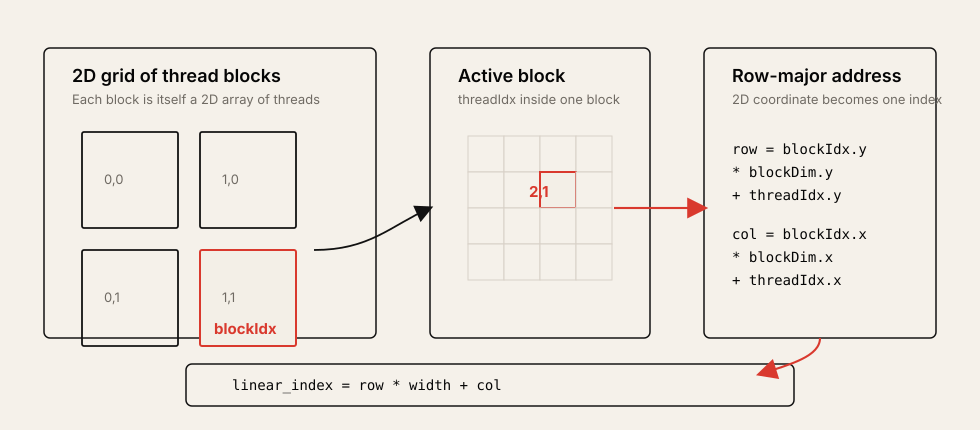

# Lecture 3: Multidimensional Grids and Data

Source: [PMPP 2021 Lecture 3](https://www.youtube.com/watch?v=c8dehGOB8mQ&list=PLRRuQYjFhpmubuwx-w8X964ofVkW1T8O4&index=3)

## Table of Contents

* [Goal](#goal)
* [Lecture Overview](#lecture-overview)
* [From 1D Vectors to 2D Data](#from-1d-vectors-to-2d-data)
* [Launching Multidimensional Grids](#launching-multidimensional-grids)
* [2D Thread Indexing](#2d-thread-indexing)
* [Row-Major Data Layout](#row-major-data-layout)
* [RGB to Grayscale](#rgb-to-grayscale)
* [Image Blur](#image-blur)
* [Boundary Conditions](#boundary-conditions)
* [Matrix-Matrix Multiplication](#matrix-matrix-multiplication)
* [Loop Parallelization View](#loop-parallelization-view)
* [Practical Tips and Notes](#practical-tips-and-notes)
* [Lecture Summary](#lecture-summary)
* [Key Terms](#key-terms)
* [Questions](#questions)
* [Answers](#answers)

---

## Goal

이번 강의의 목표는 CUDA에서 2D/3D grid와 block을 사용하는 방법을 배우고, image와 matrix처럼 multidimensional data를 1D memory layout 위에서 올바르게 index하는 법을 익히는 것이다.

핵심 메시지는 다음과 같다.

> CUDA는 `dim3`와 `.x/.y/.z` index를 제공해 multidimensional thread hierarchy를 직접 표현할 수 있다. 하지만 C/CUDA memory는 여전히 linear address space이므로, thread가 계산한 `(row, col)`을 `row * width + col` 같은 row-major index로 변환해야 한다. Parallel CUDA code의 상당 부분은 정확한 index 계산과 boundary condition이다.

이 강의는 다음을 다룬다.

* 2강 vector addition 복습
* 2D image와 matrix를 GPU thread grid에 mapping하는 방법
* `dim3`로 block size와 grid size를 표현하는 방법
* `blockIdx.y`, `blockDim.y`, `threadIdx.y`를 사용한 row 계산
* C의 row-major layout과 `row * width + column`
* RGB image를 grayscale image로 변환하는 kernel
* image blur에서 한 output pixel이 여러 input pixel을 읽는 패턴
* output boundary와 input boundary를 분리해서 검사해야 하는 이유
* square matrix multiplication kernel
* 일반 `M x K` by `K x N` matrix multiplication으로 확장할 때의 고려사항

---

## Lecture Overview

강의 초반부는 2강을 빠르게 복습한다. GPU offload는 device memory allocation, host-to-device copy, kernel execution, device-to-host copy, device memory free의 순서로 진행된다. Vector addition에서는 1D grid를 사용했고, 각 thread는 `blockIdx.x * blockDim.x + threadIdx.x`로 global index를 계산했다.

이번 강의의 본론은 multidimensional grid와 multidimensional data다. 많은 실제 데이터는 1D vector가 아니라 image, matrix, volume처럼 2D 또는 3D 구조를 갖는다. CUDA는 `dim3` 타입과 `x/y/z` component를 통해 grid와 block을 여러 차원으로 구성할 수 있다. 이 기능이 없어도 1D index를 2D coordinate로 변환할 수는 있지만, CUDA의 multidimensional indexing을 쓰면 image와 matrix code가 더 직접적으로 읽힌다.

강의의 첫 번째 예제는 RGB image를 grayscale image로 바꾸는 것이다. Thread 하나가 pixel 하나를 맡고, red/green/blue component를 weighted average로 합쳐 gray intensity를 만든다. 두 번째 예제는 image blur다. 여기서는 output pixel 하나를 thread 하나가 맡지만, 그 thread는 주변 input pixel 여러 개를 읽어 average를 계산한다. 세 번째 예제는 matrix-matrix multiplication이다. Output matrix `C`의 element 하나를 thread 하나가 맡고, `A`의 row와 `B`의 column dot product를 계산한다.

강의 전체를 관통하는 실무 메시지는 boundary condition이다. RGB grayscale에서는 output pixel이 image bounds 안에 있는지만 확인하면 충분하다. Blur에서는 output pixel이 bounds 안에 있어도 주변 input pixel이 image 밖으로 나갈 수 있으므로 input access마다 별도의 guard가 필요하다. Matrix multiplication에서도 grid가 output dimension보다 크게 launch될 수 있으므로 output write guard가 필요하다.

---

## From 1D Vectors to 2D Data

Vector addition은 1D data parallelism이다.

```c
unsigned int i = blockIdx.x * blockDim.x + threadIdx.x;
z[i] = x[i] + y[i];
```

Image와 matrix는 논리적으로 2D다. 예를 들어 RGB image는 `height x width` pixel grid이고, 각 pixel은 red, green, blue component를 가진다. Matrix multiplication의 output `C`도 row와 column으로 식별된다.

| Data | Logical coordinate | Natural thread mapping |
| ---- | ------------------ | ---------------------- |
| Vector | `i` | one thread per element |
| Image | `(row, col)` | one thread per pixel |
| Matrix output | `(row, col)` | one thread per output element |
| Blur output | `(outRow, outCol)` | one thread per output pixel, multiple input reads |

CUDA의 2D grid를 쓰면 thread가 자신의 row와 column을 직접 계산할 수 있다.

---

## Launching Multidimensional Grids

CUDA의 execution configuration은 scalar integer만 받을 필요가 없다. `dim3`를 사용하면 grid와 block의 x/y/z dimension을 지정할 수 있다.

```c
dim3 numThreadsPerBlock(32, 32);

dim3 numBlocks(
    (width + numThreadsPerBlock.x - 1) / numThreadsPerBlock.x,
    (height + numThreadsPerBlock.y - 1) / numThreadsPerBlock.y
);

rgbToGrayKernel<<<numBlocks, numThreadsPerBlock>>>(
    red_d, green_d, blue_d, gray_d, width, height
);
```

`dim3`는 세 개의 integer component `x`, `y`, `z`를 가진다. 세 번째 argument를 생략하면 `z = 1`이다. 2D image processing에서는 보통 `x`를 column 또는 width 방향, `y`를 row 또는 height 방향에 대응시킨다.

| Configuration | Meaning |
| ------------- | ------- |
| `dim3(32, 32)` | block 하나가 32 columns by 32 rows의 thread를 가짐 |
| `numBlocks.x` | image width 방향 block 개수 |
| `numBlocks.y` | image height 방향 block 개수 |
| ceiling division | image 크기가 block 크기의 배수가 아니어도 전체 pixel을 덮음 |

강의에서는 처음 32 by 32 block을 사용한다. 이 값은 강의 흐름상 임의로 고른 출발점이며, 좋은 block size를 고르는 문제는 이후 강의에서 더 자세히 다룬다.

---

## 2D Thread Indexing

2D grid에서는 built-in variable도 `x`, `y`, `z` component를 가진다.

| Variable | x component | y component |
| -------- | ----------- | ----------- |
| `gridDim` | grid width in blocks | grid height in blocks |
| `blockIdx` | block column index | block row index |
| `blockDim` | block width in threads | block height in threads |
| `threadIdx` | thread column inside block | thread row inside block |

Thread가 담당할 image coordinate는 다음처럼 계산한다.

```c
int row = blockIdx.y * blockDim.y + threadIdx.y;
int col = blockIdx.x * blockDim.x + threadIdx.x;
```



이 패턴은 RGB grayscale, blur, matrix multiplication 예제에서 반복된다. 강의에서도 `row`를 계산하면서 습관적으로 `.x`를 쓰는 실수를 언급한다. 2D indexing bug는 컴파일러가 잡아주지 않으므로, row는 y 방향, column은 x 방향이라는 convention을 일관되게 유지해야 한다.

---

## Row-Major Data Layout

CUDA thread가 `(row, col)`을 계산해도, 실제 dynamically allocated C array는 대부분 1D pointer다. 2D image를 `unsigned char *red` 같은 pointer로 저장하면 memory에는 row-major order로 놓는 것이 일반적이다.

```text
logical 2D view:
row 0: a00 a01 a02 a03
row 1: a10 a11 a12 a13
row 2: a20 a21 a22 a23

linear memory:
a00 a01 a02 a03 a10 a11 a12 a13 a20 a21 a22 a23
```

Row-major layout에서 `(row, col)`의 linear index는 다음이다.

```c
int i = row * width + col;
```

Array-of-pointers 방식으로 2D array처럼 만들 수도 있지만, GPU programming에서는 보통 contiguous 1D allocation이 더 낫다. Array-of-pointers는 allocation이 복잡하고, access할 때 pointer load와 data load가 분리되어 memory traffic과 indirection이 늘어난다.

---

## RGB to Grayscale

RGB to grayscale은 color image를 intensity image로 바꾸는 작업이다. 입력 image의 각 pixel은 red, green, blue component를 가지고, 출력 grayscale image의 각 pixel은 하나의 intensity 값만 가진다.

Parallelization은 단순하다.

```text
one CUDA thread -> one output pixel
```

Thread가 row/column을 계산하고, bounds 안에 있으면 red/green/blue component를 읽어 weighted average를 쓴다.

```c
__global__ void rgbToGrayKernel(
    unsigned char *red,
    unsigned char *green,
    unsigned char *blue,
    unsigned char *gray,
    int width,
    int height
) {
    int row = blockIdx.y * blockDim.y + threadIdx.y;
    int col = blockIdx.x * blockDim.x + threadIdx.x;

    if (row < height && col < width) {
        int i = row * width + col;
        gray[i] = 0.3f * red[i] + 0.6f * green[i] + 0.1f * blue[i];
    }
}
```

강의에서는 green에 더 높은 weight를 주는 이유를 사람 눈이 green에 더 민감하다는 직관으로 설명한다. 실제 grayscale conversion weight는 구현과 표준에 따라 조금씩 다를 수 있지만, 이 강의에서 중요한 점은 weight 자체보다 one-thread-per-pixel mapping과 2D-to-1D index 변환이다.

---

## Image Blur

Image blur는 output pixel을 주변 input pixel의 average로 계산한다. RGB grayscale과 달리 thread 하나가 input pixel 하나만 읽지 않는다. Output pixel 하나를 맡은 thread가 주변 window를 순회한다.

```text
one CUDA thread -> one output pixel
one output pixel -> many input pixel reads
```

단순한 blur radius가 `BLUR_SIZE`라면, thread는 다음 범위를 돈다.

```c
for (int inRow = outRow - BLUR_SIZE;
     inRow < outRow + BLUR_SIZE + 1;
     ++inRow) {
    for (int inCol = outCol - BLUR_SIZE;
         inCol < outCol + BLUR_SIZE + 1;
         ++inCol) {
        /* read input pixel if in bounds */
    }
}
```

강의에서는 sum을 `unsigned char`가 아니라 `int`로 누적해야 한다는 점도 나온다. Pixel 값은 0에서 255 사이여도 여러 pixel을 더한 sum은 255를 넘을 수 있다. 평균을 낸 뒤 다시 `unsigned char`로 cast해 output image에 저장한다.

```c
int sum = 0;
/* accumulate input pixels */
blurred[outRow * width + outCol] = (unsigned char)(sum / windowArea);
```

이 예제는 indexing뿐 아니라 boundary condition이 왜 어려운지를 보여준다.

---

## Boundary Conditions

2D kernel에서는 두 종류의 boundary를 구분해야 한다.

| Boundary | Example | Required guard |
| -------- | ------- | -------------- |
| Output boundary | `gray[i]` 또는 `blurred[outIdx]` write | `row < height && col < width` |
| Input boundary | blur window의 `image[inIdx]` read | `0 <= inRow < height && 0 <= inCol < width` |

RGB grayscale은 output pixel과 input pixel이 1:1로 대응하므로 output boundary check가 곧 input boundary check이기도 하다. Blur는 다르다. Output pixel이 image 안에 있어도, 그 주변 window 일부는 image 밖으로 나갈 수 있다. Corner나 edge pixel에서 특히 그렇다.

강의의 rule of thumb은 다음이다.

> Every memory access must have a corresponding guard that compares its index to the array dimensions.

Blur kernel에서는 `inRow`와 `inCol`이 negative가 될 수 있다. 따라서 loop variable과 coordinate를 `unsigned int`로 두면 subtraction에서 underflow가 발생할 수 있다. 강의 중 실제 bug도 이 지점에서 발생했고, 해결은 signed `int`를 사용하는 것이다.

```c
if (inRow >= 0 && inRow < height &&
    inCol >= 0 && inCol < width) {
    sum += image[inRow * width + inCol];
}
```

> [!WARNING]
> Boundary condition은 output write만 보면 부족하다. Kernel 안의 모든 read/write access를 하나씩 따라가며 해당 access의 index가 guard로 보호되는지 확인해야 한다.

---

## Matrix-Matrix Multiplication

Matrix multiplication은 `C = A x B`를 계산한다. 강의에서는 먼저 세 matrix가 모두 `N x N`인 square matrix case를 다룬다.

Output element `C[row, col]`은 `A`의 `row`번째 row와 `B`의 `col`번째 column의 dot product다.

```text
C[row, col] = sum_i A[row, i] * B[i, col]
```

Parallelization은 output element 하나를 thread 하나에 맡기는 방식이다.

```c
__global__ void matMulKernel(float *A, float *B, float *C, int n) {
    int row = blockIdx.y * blockDim.y + threadIdx.y;
    int col = blockIdx.x * blockDim.x + threadIdx.x;

    if (row < n && col < n) {
        float sum = 0.0f;

        for (int i = 0; i < n; ++i) {
            sum += A[row * n + i] * B[i * n + col];
        }

        C[row * n + col] = sum;
    }
}
```

강의 중에는 `A[row * n + col]`처럼 잘못 쓰기 쉬운 실수가 나온다. Dot product loop의 inner index는 `i`이므로 `A`는 `A[row * n + i]`, `B`는 `B[i * n + col]`이어야 한다.

이 naive matrix multiplication도 RGB grayscale보다 훨씬 큰 speedup을 보인다. 이유는 output element 하나를 계산할 때 많은 multiply-add를 수행하므로, 단순 pixel conversion보다 computation amount가 크기 때문이다. 이후 강의에서는 shared memory tiling 같은 최적화로 matrix multiplication을 더 빠르게 만드는 방법을 다룬다.

일반 matrix multiplication은 다음 형태다.

```text
A: M x K
B: K x N
C: M x N
```

이때 output boundary는 `row < M && col < N`이고, dot product loop는 `i < K`가 된다.

---

## Loop Parallelization View

강의 후반 질문에서 "3중 loop인 matrix multiplication이면 3D grid가 필요한가?"라는 주제가 나온다. 답은 반드시 그렇지는 않다는 것이다.

Sequential matrix multiplication을 loop 관점으로 보면 다음과 같다.

```c
for (int row = 0; row < n; ++row) {
    for (int col = 0; col < n; ++col) {
        for (int i = 0; i < n; ++i) {
            C[row][col] += A[row][i] * B[i][col];
        }
    }
}
```

Naive CUDA kernel은 바깥 두 loop, 즉 output row와 output column을 parallelize한다. Inner loop는 thread 내부에서 sequential하게 dot product를 계산한다.

| Loop | Naive CUDA mapping |
| ---- | ------------------ |
| `row` | `blockIdx.y`, `threadIdx.y` |
| `col` | `blockIdx.x`, `threadIdx.x` |
| `i` | thread-local sequential loop |

Inner `i` loop도 parallelize할 수는 있다. 하지만 그 경우 여러 thread가 partial sum을 합쳐야 하므로 reduction이 필요하고, loop-carried dependence가 생긴다. 이 강의에서는 가장 단순한 one-thread-per-output-element mapping에 집중한다.

---

## Practical Tips and Notes

### Treat Indexing as Core Logic

CUDA 초반부에서는 kernel body보다 index 계산이 더 중요할 때가 많다. `row`, `col`, `i`, `outRow`, `inRow` 같은 이름을 명확히 구분하면 bug를 크게 줄일 수 있다.

> [!TIP]
> 2D kernel을 작성할 때는 먼저 `row`, `col`, `linear index`, boundary check만 작성하고 작은 input에서 검증한 뒤 실제 computation을 넣어라.

### Prefer Contiguous Layout

Image나 matrix를 GPU에 올릴 때는 contiguous 1D allocation을 기본으로 생각한다. Row-major layout은 index 계산을 명시해야 하지만, allocation과 memory access가 단순하고 GPU에서 다루기 쉽다.

### Audit Every Memory Access

Boundary check는 "kernel 위에 하나"가 아니라 "memory access마다 하나"라는 관점이 안전하다.

| Access | Check |
| ------ | ----- |
| `gray[row * width + col]` | `row < height && col < width` |
| `image[inRow * width + inCol]` | `0 <= inRow < height && 0 <= inCol < width` |
| `C[row * n + col]` | `row < n && col < n` |
| `A[row * n + i]` | `row < n && i < n` |
| `B[i * n + col]` | `i < n && col < n` |

### Use Signed Coordinates Near Negative Offsets

Blur, convolution, stencil처럼 중심점 주변을 읽는 kernel은 `row - radius`, `col - radius` 형태의 계산을 한다. 이런 좌표는 음수가 될 수 있으므로 signed integer를 사용하는 편이 안전하다.

### Separate Correctness from Speedup

강의 중 blur 예제처럼 빠르게 실행되어도 boundary bug가 있으면 결과가 틀릴 수 있다. GPU speedup을 보기 전에 CPU reference와 결과를 비교하는 check를 먼저 통과시켜야 한다.

### Quick Reference

| Symptom | First check |
| ------- | ----------- |
| Image edge pixels are wrong | input boundary guard in blur/convolution |
| Very large unexpected index | unsigned underflow after `row - radius` |
| Matrix multiplication mismatch | `A[row * n + i]` vs `A[row * n + col]` |
| Only part of image processed | missing ceiling division in `numBlocks` |
| Row/column transposed output | swapped `.x` and `.y` in row/column calculation |

---

## Lecture Summary

이번 강의는 CUDA의 1D vector programming model을 2D image와 matrix로 확장했다. CUDA는 `dim3`를 통해 block과 grid를 multidimensional하게 launch할 수 있고, thread는 `blockIdx`, `blockDim`, `threadIdx`의 `x/y/z` component를 사용해 자신의 logical coordinate를 계산한다.

2D data를 다룰 때 핵심 공식은 두 가지다.

```c
int row = blockIdx.y * blockDim.y + threadIdx.y;
int col = blockIdx.x * blockDim.x + threadIdx.x;
int i = row * width + col;
```

RGB grayscale은 one thread per pixel의 가장 단순한 2D example이다. Blur는 output 하나가 여러 input을 읽는 pattern이라 input boundary guard가 별도로 필요하다. Matrix multiplication은 output element 하나를 thread 하나가 맡고, dot product loop는 thread 내부에서 수행한다.

강의의 가장 중요한 실무 문장은 "parallel programming의 절반은 index computation과 boundary condition"이라는 것이다. GPU code가 빠르기 전에 먼저 각 memory access가 정확한 index와 guard를 갖고 있는지 확인해야 한다.

---

## Key Terms

| Term | Meaning |
| ---- | ------- |
| `dim3` | CUDA에서 x/y/z dimension을 담는 integer vector type |
| Multidimensional grid | x/y/z dimension을 가진 CUDA grid |
| Multidimensional block | x/y/z dimension을 가진 CUDA thread block |
| `blockIdx.y` | 현재 block의 y direction index |
| `threadIdx.y` | 현재 thread의 block 내부 y direction index |
| Row-major order | row를 연속으로 배치하는 2D-to-1D memory layout |
| Linear index | multidimensional coordinate를 1D memory offset으로 바꾼 값 |
| RGB to grayscale | red/green/blue component를 하나의 intensity로 변환하는 작업 |
| Blur radius | output pixel 주변에서 평균에 포함할 input pixel 거리 |
| Boundary condition | out-of-bounds memory access를 막는 guard |
| Dot product | 두 vector의 elementwise product를 합산하는 연산 |
| Matrix multiplication | output element마다 row-column dot product를 계산하는 연산 |
| Loop-carried dependence | loop iteration 사이에 누적값 같은 dependency가 있는 상태 |

---

## Questions

1. CUDA에서 `dim3`는 무엇을 표현하는가?
2. 2D image kernel에서 row와 column은 보통 어떤 CUDA built-in variable로 계산하는가?
3. Row-major layout에서 `(row, col)`의 linear index는 어떻게 계산하는가?
4. RGB to grayscale에서 thread 하나는 무엇을 담당하는가?
5. RGB component 하나마다 thread를 배정하는 방식이 이 예제에서 적절하지 않은 이유는 무엇인가?
6. Image blur에서 output boundary check만으로 부족한 이유는 무엇인가?
7. Blur kernel에서 `inRow`와 `inCol`을 signed integer로 두는 것이 안전한 이유는 무엇인가?
8. "Every memory access must have a corresponding guard"는 어떤 의미인가?
9. Matrix multiplication에서 `C[row, col]`은 무엇으로 계산되는가?
10. Naive matrix multiplication kernel에서 thread 내부에 남는 sequential loop는 무엇인가?
11. `A[row * n + i]` 대신 `A[row * n + col]`을 쓰면 왜 틀리는가?
12. `M x K` matrix와 `K x N` matrix를 곱할 때 output dimension은 무엇인가?
13. 3중 loop가 있다고 해서 항상 3D grid가 필요한 것은 아닌 이유는 무엇인가?
14. Array-of-pointers 방식의 2D allocation이 GPU에서 불리할 수 있는 이유는 무엇인가?
15. 2D CUDA kernel에서 `.x`와 `.y`를 섞어 쓰는 bug를 줄이려면 어떤 naming convention이 도움이 되는가?

---

## Answers

1. `dim3`는 CUDA grid나 block의 x/y/z dimension을 담는 type이다.
2. Row는 `blockIdx.y * blockDim.y + threadIdx.y`, column은 `blockIdx.x * blockDim.x + threadIdx.x`로 계산한다.
3. `row * width + col`이다.
4. Output grayscale image의 pixel 하나를 담당한다.
5. R/G/B 세 값은 결국 weighted average로 합쳐야 하므로 thread 간 communication overhead가 생기며, 세 component 정도의 작은 작업에는 과하다.
6. Output pixel이 image 안에 있어도 주변 input window는 image 밖으로 나갈 수 있기 때문이다.
7. `outRow - BLUR_SIZE`처럼 음수가 될 수 있는 계산이 있으므로 unsigned underflow를 피해야 한다.
8. Kernel의 각 read/write index가 array dimension 안에 있는지 확인하는 guard가 있어야 한다는 뜻이다.
9. `A`의 `row`번째 row와 `B`의 `col`번째 column의 dot product로 계산된다.
10. Dot product를 누적하는 inner `i` loop다.
11. `A`에서는 output row는 고정하고 dot product index `i`를 따라 column을 이동해야 하므로 `col`이 아니라 `i`를 써야 한다.
12. `M x N`이다.
13. 일부 loop는 thread mapping으로 parallelize하고, dependency가 있는 inner loop는 thread 내부 sequential loop로 남길 수 있기 때문이다.
14. 많은 작은 allocation이 필요하고, access할 때 pointer load 후 data load를 해야 해서 memory indirection과 traffic이 늘 수 있다.
15. `row/outRow/inRow`는 y 방향, `col/outCol/inCol`은 x 방향으로 이름을 고정해 쓰는 것이 좋다.
