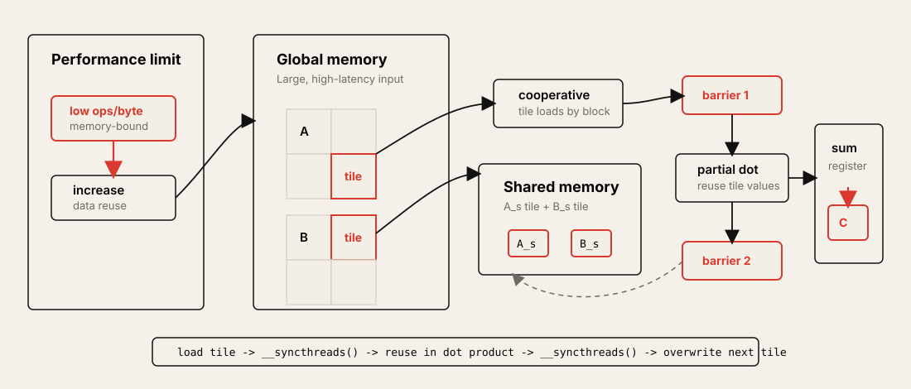

# Lecture 5: Memory Architecture and Tiling

Source: [PMPP 2021 Lecture 5](https://www.youtube.com/watch?v=31ZyYkoClT4&list=PLRRuQYjFhpmubuwx-w8X964ofVkW1T8O4&index=5)

## Table of Contents

* [Goal](#goal)
* [Lecture Overview](#lecture-overview)
* [Memory and Tiling Map](#memory-and-tiling-map)
* [Peak Performance Metrics](#peak-performance-metrics)
* [Compute-Bound vs Memory-Bound](#compute-bound-vs-memory-bound)
* [Compute-to-Memory Ratio](#compute-to-memory-ratio)
* [Vector Addition as a Memory-Bound Kernel](#vector-addition-as-a-memory-bound-kernel)
* [Matrix Multiplication and Data Reuse](#matrix-multiplication-and-data-reuse)
* [GPU Memory Hierarchy](#gpu-memory-hierarchy)
* [CUDA Memory Model](#cuda-memory-model)
* [CUDA Memory Qualifiers](#cuda-memory-qualifiers)
* [Why Shared Memory Helps](#why-shared-memory-helps)
* [Tiled Matrix Multiplication](#tiled-matrix-multiplication)
* [Shared Memory Kernel Structure](#shared-memory-kernel-structure)
* [Synchronization Requirements](#synchronization-requirements)
* [Boundary Conditions in Tiled Kernels](#boundary-conditions-in-tiled-kernels)
* [CPU Tiling Analogy](#cpu-tiling-analogy)
* [Shared Memory and Occupancy](#shared-memory-and-occupancy)
* [Dynamic Shared Memory](#dynamic-shared-memory)
* [Practical Tips and Notes](#practical-tips-and-notes)
* [Lecture Summary](#lecture-summary)
* [Key Terms](#key-terms)
* [Questions](#questions)
* [Answers](#answers)

---

## Goal

이번 강의의 목표는 CUDA memory hierarchy를 이해하고, global memory access를 줄이기 위해 shared memory를 어떻게 사용하는지 배우는 것이다. 4강에서는 GPU가 SM, warp, occupancy를 통해 많은 thread를 실행하고 latency를 숨기는 방식을 다뤘다. 5강은 그 실행 구조 위에서 memory가 병목이 되는 이유와, matrix multiplication에서 tiling으로 data reuse를 끌어올리는 방법을 설명한다.

핵심 메시지는 다음과 같다.

> GPU 성능은 core 수만으로 결정되지 않는다. Global memory에서 byte를 가져오는 속도는 floating-point operation을 수행하는 속도보다 훨씬 낮기 때문에, 높은 성능을 내려면 한 번 가져온 data를 여러 번 재사용해야 한다. Shared memory tiling은 programmer가 직접 관리하는 on-chip scratchpad를 사용해 global memory traffic을 줄이는 대표적인 방법이다.

이 강의는 다음을 다룬다.

* Peak FLOPS와 peak memory bandwidth의 의미
* Compute-bound kernel과 memory-bound kernel의 차이
* Compute-to-global-memory-access ratio, 또는 operational intensity
* Vector addition이 memory-bound인 이유
* Matrix multiplication이 data reuse potential을 갖는 이유
* GPU memory hierarchy: register, L1 cache, shared memory, constant cache, L2 cache, global memory
* CUDA memory model: per-thread register, per-block shared memory, grid-wide global memory
* `__device__`, `__constant__`, `__shared__`, local variable, local array의 scope와 lifetime
* Shared memory를 사용한 tiled matrix multiplication
* `__syncthreads()`가 필요한 두 지점
* Tiled kernel에서 boundary condition이 더 복잡해지는 이유
* CPU cache tiling과 GPU shared-memory tiling의 관계
* Shared memory 사용량이 occupancy에 미치는 영향
* Dynamic shared memory allocation

---

## Lecture Overview

강의는 4강 복습으로 시작한다. GPU는 여러 SM으로 구성되고, thread block은 block 단위로 SM에 배치된다. 같은 block의 thread는 같은 SM에 있기 때문에 shared memory와 barrier synchronization으로 협력할 수 있다. SM 내부에서는 block의 thread가 warp로 나뉘고, warp는 SIMD/SIMT 방식으로 실행된다. Control divergence는 같은 warp 안의 thread가 서로 다른 path를 타면서 일부 lane을 inactive로 만든다. Latency hiding은 한 warp가 long-latency operation을 기다릴 때 다른 ready warp를 실행해 pipeline stall을 줄이는 방식이다.

5강의 본론은 memory다. GPU는 매우 높은 peak FLOPS를 제공하지만, global memory bandwidth는 그에 비해 제한적이다. 따라서 application이 얼마나 많은 floating-point operation을 global memory에서 가져온 byte당 수행하는지가 중요하다. 이 비율이 낮으면 core가 충분히 많아도 memory가 data를 공급하지 못해 성능이 memory-bound가 된다.

Vector addition은 대표적인 memory-bound kernel이다. `z[i] = x[i] + y[i]`는 float 두 개를 load해서 floating-point add 하나를 수행한다. Store를 무시해도 8 bytes load당 1 operation, 즉 0.125 ops/byte에 불과하다. V100의 peak compute-to-memory ratio가 약 15.6 ops/byte라는 점을 생각하면, vector addition은 global memory bandwidth에 묶일 수밖에 없다.

반대로 matrix multiplication은 naive kernel 자체의 ratio는 낮지만, algorithm 차원에서는 data reuse potential이 높다. `N x N` matrix multiplication은 약 `2N^3` floating-point operations를 수행하고, 이상적으로는 두 input matrix의 `8N^2` bytes를 한 번씩만 load하면 된다. 따라서 potential ratio는 `0.25N` ops/byte까지 올라갈 수 있다. 문제는 naive kernel이 같은 input element를 여러 thread가 반복해서 global memory에서 읽는다는 점이다.

이 강의의 핵심 optimization은 tiling이다. Thread block이 output tile 하나를 맡고, block 안의 thread들이 협력해 `A`와 `B`의 input tile을 shared memory로 가져온다. 그 다음 각 thread는 shared memory에 있는 tile을 여러 번 읽어 partial dot product를 계산한다. Tile 하나를 다 쓴 뒤 다음 tile을 load하고, 이 과정을 dot product dimension 끝까지 반복한다.

---

## Memory and Tiling Map



이 그림은 shared memory tiling의 phase를 보여준다. Global memory에서 tile을 한 번 가져온 뒤 block 내부 thread가 shared memory에서 반복해서 읽고, 두 barrier가 각각 "tile load 완료"와 "tile overwrite 가능"을 보장한다.

---

## Peak Performance Metrics

Processor vendor는 보통 두 가지 peak metric을 제공한다.

| Metric | Meaning |
| ------ | ------- |
| Peak FLOPS rate | Processor가 초당 수행할 수 있는 최대 floating-point operations 수 |
| Peak memory bandwidth | Memory system이 core에 초당 공급할 수 있는 최대 bytes 수 |

둘 다 보장값이 아니라 upper bound다. Kernel을 실행한다고 해서 자동으로 peak FLOPS나 peak bandwidth를 얻는 것은 아니다. 이 값들은 모든 execution unit 또는 memory interface가 이상적으로 활용될 때 가능한 최대치다.

강의에서는 Volta V100을 예로 든다.

| V100 metric in lecture | Approximate value |
| ---------------------- | ----------------- |
| Peak FP32 throughput | 14,028 GFLOP/s, about 14 TFLOP/s |
| Peak global memory bandwidth | 900 GB/s |
| Desired compute-to-memory ratio | `14028 / 900 ~= 15.6` ops/byte |

이 수치의 의미는 간단하다. V100의 FP32 cores를 peak에 가깝게 활용하려면 global memory에서 가져오는 byte 하나당 평균적으로 약 15.6 floating-point operations를 수행해야 한다. Float 하나는 4 bytes이므로, float value 하나를 global memory에서 가져올 때 대략 60 operations 정도를 해야 peak compute throughput에 가까워질 수 있다.

이 값은 현실의 모든 kernel이 달성해야 하는 목표라기보다 성능 해석의 기준점이다. Kernel의 operational intensity가 이 값보다 훨씬 낮으면 memory-bound일 가능성이 크다.

---

## Compute-Bound vs Memory-Bound

Application 성능 병목은 크게 compute-bound와 memory-bound로 나눌 수 있다.

| Bound type | Bottleneck | Observable behavior |
| ---------- | ---------- | ------------------- |
| Compute-bound | Core가 floating-point operations를 수행하는 속도 | Cores가 계속 바쁘고 memory system은 상대적으로 여유가 있음 |
| Memory-bound | Global memory가 data를 공급하는 속도 | Cores가 memory를 기다리며 idle cycle이 많아짐 |

Compute-bound kernel은 더 많은 ALU, 더 높은 clock, 더 좋은 instruction throughput이 직접적으로 성능을 올릴 수 있다. Memory-bound kernel은 core가 많아져도 memory bandwidth가 data를 충분히 공급하지 못하면 성능이 크게 늘지 않는다.

GPU programming에서 중요한 질문은 다음이다.

```text
내 kernel은 global memory에서 가져온 byte당 충분히 많은 일을 하는가?
```

그렇지 않다면 GPU의 많은 ALU가 대부분 기다리는 상태가 된다. 이때 필요한 optimization은 computation을 더 빠르게 만드는 것이 아니라, global memory access를 줄이거나 한 번 load한 data를 더 많이 재사용하는 것이다.

---

## Compute-to-Memory Ratio

강의에서는 compute-to-global-memory-access ratio를 다음처럼 사용한다.

```text
compute-to-memory ratio = floating-point operations / bytes loaded from global memory
```

다른 문맥에서는 operational intensity 또는 arithmetic intensity라고도 부른다. 이 강의에서는 store를 잠시 무시하고 load 중심으로 계산한다. 실제 performance model에서는 store, cache behavior, instruction mix, memory coalescing도 함께 봐야 하지만, 첫 번째 근사로는 이 ratio가 매우 유용하다.

V100 예시에서 peak FLOPS와 peak bandwidth의 ratio는 다음이다.

```text
14028 GFLOP/s / 900 GB/s ~= 15.6 operations/byte
```

이 값보다 kernel의 actual ratio가 낮으면 memory bandwidth가 먼저 한계에 도달한다. 반대로 ratio가 충분히 높으면 compute-bound에 가까워질 수 있다.

> [!TIP]
> CUDA kernel을 최적화하기 전에 먼저 "byte당 operation 수"를 손으로 계산해보면 어디를 봐야 하는지 빠르게 판단할 수 있다. Ratio가 낮으면 instruction-level trick보다 memory traffic reduction이 우선이다.

---

## Vector Addition as a Memory-Bound Kernel

Vector addition kernel은 다음과 같다.

```c
z[i] = x[i] + y[i];
```

Store를 무시하고 load만 보면 thread 하나는 float 두 개를 읽고 floating-point add 하나를 수행한다.

| Work per output element | Amount |
| ----------------------- | ------ |
| Loads | `x[i]`, `y[i]` |
| Loaded bytes | `2 * 4 = 8` bytes |
| Floating-point operations | 1 add |
| Compute-to-memory ratio | `1 / 8 = 0.125` ops/byte |

0.125 ops/byte는 V100의 desired ratio인 약 15.6 ops/byte와 매우 멀다. 따라서 vector addition은 highly memory-bound다. GPU에 많은 ALU가 있어도 대부분 memory load를 기다릴 가능성이 높다.

이 예제는 왜 단순 vector addition에서 GPU speedup이 기대보다 작을 수 있는지 설명한다. 더 많은 core를 투입해도 application 자체가 byte당 수행하는 일이 너무 적으면 global memory bandwidth가 병목이 된다. 더 나쁜 점은 vector addition은 algorithm 자체가 단순해서 data reuse를 크게 늘릴 방법도 많지 않다는 것이다.

---

## Matrix Multiplication and Data Reuse

Naive matrix multiplication kernel은 output element 하나를 thread 하나가 맡고, dot product를 thread 내부 loop로 계산한다.

```c
float sum = 0.0f;

for (int i = 0; i < n; ++i) {
    sum += A[row * n + i] * B[i * n + col];
}

C[row * n + col] = sum;
```

Loop iteration 하나만 보면 `A` float 하나와 `B` float 하나를 load하고, multiply와 add를 수행한다.

| Work per loop iteration | Amount |
| ----------------------- | ------ |
| Loaded bytes | `2 * 4 = 8` bytes |
| Floating-point operations | 1 multiply + 1 add = 2 |
| Naive ratio | `2 / 8 = 0.25` ops/byte |

Naive code만 보면 vector addition보다 조금 낫지만 여전히 낮다. 그러나 matrix multiplication은 algorithm 전체로 보면 reuse potential이 높다.

`N x N` matrix multiplication의 전체 work와 input data는 다음과 같다.

| Quantity | Value |
| -------- | ----- |
| Output elements | `N^2` |
| Dot product length | `N` |
| Floating-point operations | about `2N^3` |
| Input bytes if loaded once | `2 * N^2 * 4 = 8N^2` |
| Potential ratio | `2N^3 / 8N^2 = 0.25N` ops/byte |

즉, matrix multiplication은 충분히 큰 `N`에서 byte당 많은 operations를 수행할 잠재력이 있다. 문제는 naive kernel이 그 potential을 실현하지 못한다는 것이다.

왜 reuse가 가능한가?

* `A[row, i]`는 output matrix `C`의 같은 row에 있는 여러 columns 계산에 사용된다.
* `B[i, col]`는 output matrix `C`의 같은 column에 있는 여러 rows 계산에 사용된다.
* Naive thread mapping에서는 이 같은 input value를 여러 thread가 각자 global memory에서 다시 읽는다.

Tiling은 이 중복 load를 줄이기 위한 방법이다.

---

## GPU Memory Hierarchy

GPU memory hierarchy는 latency, scope, programmer control 여부가 다르다.

| Memory | Location / scope | Typical role in lecture |
| ------ | ---------------- | ----------------------- |
| Register | Per thread, on SM | Thread-local scalar variables |
| L1 cache | Per SM, hardware-managed | Recently loaded global memory data |
| Shared memory | Per block, programmer-managed | Explicit data sharing and reuse inside a block |
| Constant cache | Device-level constant data path | Constant memory access acceleration, discussed later |
| L2 cache | Shared by all SMs, on chip | Global memory cache shared across SMs |
| Global memory | Device DRAM | Large device memory, high latency |

강의에서는 global memory access가 대략 수백 cycle 수준으로 비싸고, register와 on-chip memory는 훨씬 빠르다고 설명한다. 중요한 차이는 L1 cache는 hardware-managed이고 shared memory는 programmer-managed라는 점이다.

L1 cache는 thread가 global memory를 load하면 hardware가 자동으로 data를 cache한다. Programmer가 직접 어떤 data를 언제 넣고 뺄지 제어하지 않는다. Shared memory는 반대로 programmer가 명시적으로 global memory에서 값을 읽어 shared memory array에 저장하고, block 내부 thread들이 그 값을 사용한다.

GPU에서 L1 cache에만 의존하기 어려운 이유도 나온다. GPU는 동시에 resident한 thread가 매우 많고, L1 cache는 상대적으로 작다. 두 thread가 같은 data를 공유할 temporal locality가 있어도, 그 사이에 많은 다른 thread의 memory access가 cache line을 밀어낼 수 있다. Data reuse가 매우 명확한 경우에는 shared memory로 직접 caching하는 편이 더 예측 가능하다.

---

## CUDA Memory Model

CUDA programming model에서 memory scope는 thread hierarchy와 맞물려 있다.

| CUDA hierarchy | Memory visible at that level |
| -------------- | ---------------------------- |
| Thread | Private registers and local variables |
| Thread block | Shared memory visible to threads in the same block |
| Grid / device | Global memory and constant memory visible to all threads |

핵심 규칙은 다음이다.

```text
registers -> private to one thread
shared memory -> shared by threads in one block
global memory -> visible to all threads in the grid
constant memory -> visible to all threads, optimized for constant data
```

L1 cache와 L2 cache는 hardware architecture에는 있지만 CUDA programming model에서 programmer가 직접 allocation하는 대상은 아니다. Programmer는 shared memory, global memory, constant memory 같은 explicit memory space를 다룬다.

---

## CUDA Memory Qualifiers

CUDA는 variable이 어느 memory space에 놓일지 지정하는 qualifier를 제공한다.

| Declaration style | Memory space | Scope | Lifetime |
| ----------------- | ------------ | ----- | -------- |
| `cudaMalloc(...)` | Global memory | All threads that receive the pointer | Until `cudaFree` |
| `__device__ T x;` | Global memory | All grids / device code | Application lifetime |
| `__constant__ T x;` | Constant memory | All threads | Application lifetime |
| `__shared__ T x;` | Shared memory | Threads in the same block | Block lifetime |
| Local scalar variable | Register, usually | One thread | Thread lifetime |
| Local array | Often local memory backed by global memory | One thread | Thread lifetime |

`__device__` global variable은 kernel 밖에서 선언하며, 모든 thread가 같은 copy를 본다. Lifetime은 application 전체다. 한 kernel이 값을 쓰고 뒤의 kernel이 그 값을 읽을 수 있다.

`__shared__` variable은 block마다 별도의 copy가 생긴다. 같은 block의 thread는 같은 shared memory variable을 보지만, 다른 block은 다른 copy를 본다. Block이 끝나면 그 shared memory content도 사라진다.

Local scalar variable은 보통 register에 들어간다. 반면 local array는 compiler가 register에 넣기 어렵거나 indexing이 dynamic이면 local memory로 내려갈 수 있다. CUDA의 local memory는 이름과 달리 off-chip global memory path를 사용할 수 있으므로 자주 쓰는 큰 local array는 성능에 주의해야 한다.

---

## Why Shared Memory Helps

Matrix multiplication에서 output tile 하나를 thread block 하나가 맡는다고 하자. 같은 block의 thread들은 output tile의 여러 elements를 계산한다. 이 thread들은 dot product를 수행하면서 `A`의 같은 input tile과 `B`의 같은 input tile을 반복해서 필요로 한다.

Naive 방식에서는 각 thread가 필요한 값을 global memory에서 직접 읽는다.

```text
thread 0 loads A tile values from global memory
thread 1 loads many of the same A tile values from global memory
thread 2 loads many of the same A tile values from global memory
...
```

Shared-memory tiled 방식에서는 block 안의 thread가 협력한다.

```text
1. Threads cooperatively load an A tile and a B tile from global memory.
2. The tiles are stored in shared memory.
3. All threads in the block reuse those shared-memory tiles.
4. Threads synchronize.
5. The block loads the next pair of tiles.
```

이 구조의 이점은 global memory load 수를 줄인다는 것이다. Tile width가 `TILE_DIM`이면, 각 thread는 global memory에서 같은 tile data를 매번 직접 읽는 대신 tile마다 일부만 load하고, 나머지는 shared memory에서 읽는다. 강의에서는 tile width만큼 global memory accesses를 줄이는 효과로 설명한다.

---

## Tiled Matrix Multiplication

Tiled matrix multiplication은 output matrix `C`를 tile로 나누고, output tile 하나를 thread block 하나에 맡긴다. 예를 들어 `TILE_DIM = 32`이면 block은 보통 `32 x 32` threads로 구성되고, 각 thread는 output tile의 element 하나를 담당한다.

```text
C tile handled by one thread block
  thread (ty, tx) -> C[row, col]

For each tile along the dot-product dimension:
  load A tile into shared memory
  load B tile into shared memory
  compute partial dot product using shared memory
  move to next tile
```

Thread가 담당하는 output coordinate는 이전 강의와 같다.

```c
int row = blockIdx.y * TILE_DIM + threadIdx.y;
int col = blockIdx.x * TILE_DIM + threadIdx.x;
```

Dot product dimension을 tile 단위로 순회한다.

```c
for (int tile = 0; tile < n / TILE_DIM; ++tile) {
    /* load A and B tiles */
    /* synchronize */
    /* compute partial dot product */
    /* synchronize */
}
```

강의의 단순한 설명에서는 `n`이 `TILE_DIM`으로 나누어떨어진다고 가정한다. 실제 assignment나 production code에서는 `M x K` by `K x N`처럼 dimension이 다를 수 있고, tile boundary가 matrix boundary를 넘어갈 수 있으므로 별도 boundary handling이 필요하다.

---

## Shared Memory Kernel Structure

Shared memory tile은 `__shared__` qualifier로 선언한다.

```c
#define TILE_DIM 32

__global__ void matMulTiled(float *A, float *B, float *C, int n) {
    __shared__ float A_s[TILE_DIM][TILE_DIM];
    __shared__ float B_s[TILE_DIM][TILE_DIM];

    int row = blockIdx.y * TILE_DIM + threadIdx.y;
    int col = blockIdx.x * TILE_DIM + threadIdx.x;

    float sum = 0.0f;

    for (int tile = 0; tile < n / TILE_DIM; ++tile) {
        A_s[threadIdx.y][threadIdx.x] =
            A[row * n + tile * TILE_DIM + threadIdx.x];

        B_s[threadIdx.y][threadIdx.x] =
            B[(tile * TILE_DIM + threadIdx.y) * n + col];

        __syncthreads();

        for (int i = 0; i < TILE_DIM; ++i) {
            sum += A_s[threadIdx.y][i] * B_s[i][threadIdx.x];
        }

        __syncthreads();
    }

    C[row * n + col] = sum;
}
```

Indexing의 의미는 다음과 같다.

| Expression | Meaning |
| ---------- | ------- |
| `A_s[threadIdx.y][threadIdx.x]` | 현재 thread가 shared memory A tile 안에 채울 위치 |
| `A[row * n + tile * TILE_DIM + threadIdx.x]` | Global A에서 현재 output row와 현재 input tile column에 해당하는 element |
| `B_s[threadIdx.y][threadIdx.x]` | 현재 thread가 shared memory B tile 안에 채울 위치 |
| `B[(tile * TILE_DIM + threadIdx.y) * n + col]` | Global B에서 현재 input tile row와 현재 output column에 해당하는 element |
| `A_s[threadIdx.y][i]` | 현재 output row에 필요한 A tile row |
| `B_s[i][threadIdx.x]` | 현재 output column에 필요한 B tile column |

`sum`은 thread-private accumulator이므로 보통 register에 들어간다. Shared memory는 input tile을 block 안의 thread들이 같이 쓰기 위한 staging area다.

---

## Synchronization Requirements

Tiled shared memory kernel에는 `__syncthreads()`가 보통 두 번 필요하다.

첫 번째 synchronization은 tile load 직후에 필요하다.

```c
A_s[ty][tx] = ...;
B_s[ty][tx] = ...;

__syncthreads();

/* now every thread can safely read A_s and B_s */
```

이 barrier가 없으면 어떤 thread가 shared memory tile을 다 채우기 전에 다른 thread가 그 값을 읽을 수 있다. 예를 들어 thread A는 자기 element를 load하고 곧바로 compute loop에 들어갔지만, thread B가 아직 `A_s`의 다른 element를 쓰지 않았다면 thread A는 stale 또는 uninitialized value를 읽을 수 있다.

두 번째 synchronization은 tile compute 직후, 다음 tile load 직전에 필요하다.

```c
for (int i = 0; i < TILE_DIM; ++i) {
    sum += A_s[ty][i] * B_s[i][tx];
}

__syncthreads();

/* now it is safe to overwrite A_s and B_s with the next tile */
```

이 barrier가 없으면 빠른 thread가 다음 tile을 shared memory에 덮어쓰기 시작하는 동안, 느린 thread가 아직 이전 tile을 읽고 있을 수 있다. Shared memory는 block 안에서 shared state이므로 read-after-write와 write-after-read ordering을 명확히 해야 한다.

> [!WARNING]
> Warp 안의 thread가 보통 함께 issue된다는 성능 모델을 correctness 근거로 사용하지 마라. Shared memory를 thread들이 협력해서 쓰고 읽는다면 `__syncthreads()`로 필요한 ordering을 명시해야 한다.

---

## Boundary Conditions in Tiled Kernels

Naive matrix multiplication에서는 보통 다음처럼 output write만 guard하면 충분해 보인다.

```c
if (row < n && col < n) {
    /* compute C[row, col] */
}
```

하지만 tiled shared memory kernel에서는 boundary condition이 더 복잡하다. 어떤 thread는 output element를 계산하지 않더라도 input tile load에는 필요할 수 있다. 반대로 output은 valid하지만 특정 input tile의 일부 element는 matrix 밖일 수 있다.

따라서 세 가지 boundary를 따로 생각해야 한다.

| Operation | Boundary to check |
| --------- | ----------------- |
| Load A tile | A matrix row/column bounds |
| Load B tile | B matrix row/column bounds |
| Store C output | C matrix row/column bounds |

일반 `A: M x K`, `B: K x N`, `C: M x N` matrix multiplication에서는 다음처럼 dimension이 분리된다.

| Matrix | Valid coordinates |
| ------ | ----------------- |
| `A` | `0 <= row < M`, `0 <= k < K` |
| `B` | `0 <= k < K`, `0 <= col < N` |
| `C` | `0 <= row < M`, `0 <= col < N` |

Tile boundary가 matrix boundary를 넘어가면 out-of-bounds load를 하지 않도록 guard하고, 보통 shared memory에는 0을 채워 partial tile computation이 자연스럽게 동작하도록 만든다.

```c
if (row < M && aCol < K) {
    A_s[ty][tx] = A[row * K + aCol];
} else {
    A_s[ty][tx] = 0.0f;
}

if (bRow < K && col < N) {
    B_s[ty][tx] = B[bRow * N + col];
} else {
    B_s[ty][tx] = 0.0f;
}
```

> [!WARNING]
> Tiled kernel 전체를 `if (row < M && col < N)`으로 감싸면 안 된다. Output을 쓰지 않는 thread도 shared memory tile load에 필요할 수 있고, 일부 thread가 barrier에 도달하지 않으면 block이 deadlock될 수 있다.

---

## CPU Tiling Analogy

강의 후반부는 CPU에서도 tiling이 가능하다는 점을 보여준다. CPU에는 CUDA shared memory 같은 programmer-managed scratchpad가 없지만, cache를 활용하기 위해 loop order를 tile 단위로 바꿀 수 있다.

Naive CPU matrix multiplication은 row, column, dot-product loop를 단순히 돈다. Tiled CPU version은 row tile, column tile, input tile을 먼저 순회하고, 그 안에서 tile 내부 row/column과 dot-product segment를 돈다.

```c
for (int rowTile = 0; rowTile < n / TILE_DIM; ++rowTile) {
    for (int colTile = 0; colTile < n / TILE_DIM; ++colTile) {
        for (int iTile = 0; iTile < n / TILE_DIM; ++iTile) {
            for (int row = rowTile * TILE_DIM;
                 row < (rowTile + 1) * TILE_DIM;
                 ++row) {
                for (int col = colTile * TILE_DIM;
                     col < (colTile + 1) * TILE_DIM;
                     ++col) {
                    for (int i = iTile * TILE_DIM;
                         i < (iTile + 1) * TILE_DIM;
                         ++i) {
                        C[row * n + col] += A[row * n + i] * B[i * n + col];
                    }
                }
            }
        }
    }
}
```

CPU tiling은 cache locality를 높이는 데 목적이 있다. GPU tiling은 programmer-managed shared memory를 사용한다는 차이가 있지만, "작은 tile을 가까운 memory에 머무르게 해서 여러 번 재사용한다"는 원리는 같다.

GPU에서 L1 cache에만 의존하기 어려운 이유는 resident thread 수가 많고 cache가 작기 때문이다. CPU는 실행 thread 수가 상대적으로 적고 cache가 크기 때문에 tiling을 잘 하면 cache가 data reuse를 비교적 안정적으로 받아준다.

---

## Shared Memory and Occupancy

Shared memory는 빠르지만 공짜는 아니다. SM당 shared memory 용량은 제한되어 있고, block당 shared memory 사용량이 커지면 동시에 resident할 수 있는 block 수가 줄어든다. 이는 occupancy를 낮출 수 있다.

강의에서는 V100이 SM당 약 96 KB shared memory를 가질 수 있다고 언급한다. 예를 들어 tiled matrix multiplication에서 block 하나가 `A_s`와 `B_s` 두 개의 `32 x 32` float tile을 사용하면 shared memory 사용량은 다음과 같다.

```text
2 tiles * 32 * 32 floats * 4 bytes = 8192 bytes = 8 KB
```

이 사용량 자체는 크지 않아 보이지만, 더 큰 tile을 쓰거나 여러 shared arrays를 쓰는 kernel에서는 shared memory가 occupancy limit이 될 수 있다. Register pressure도 같은 방식으로 occupancy를 제한한다. Thread당 register가 많으면 SM의 register file이 먼저 소진되어 더 많은 thread를 resident 상태로 둘 수 없다.

좋은 shared memory optimization은 다음 trade-off를 본다.

| Benefit | Cost |
| ------- | ---- |
| Global memory traffic 감소 | Shared memory capacity 사용 |
| Data reuse 증가 | `__syncthreads()` overhead |
| More predictable locality | Occupancy 감소 가능 |
| Higher arithmetic intensity | More complex boundary handling |

---

## Dynamic Shared Memory

지금까지의 shared memory tile은 compile-time constant size로 선언했다.

```c
__shared__ float A_s[TILE_DIM][TILE_DIM];
```

CUDA는 dynamic shared memory도 지원한다. Kernel 안에서는 `extern __shared__`로 선언하고, kernel launch configuration의 세 번째 parameter로 byte size를 전달한다.

```c
__global__ void kernel(...) {
    extern __shared__ float tile[];
    /* tile is backed by dynamically allocated shared memory */
}

size_t sharedBytes = 2 * TILE_DIM * TILE_DIM * sizeof(float);
kernel<<<gridDim, blockDim, sharedBytes>>>(...);
```

Dynamic shared memory는 tile size나 temporary buffer 크기를 runtime에 정하고 싶을 때 유용하다. 다만 static shared memory와 마찬가지로 SM당 shared memory capacity를 소비하므로 occupancy 계산에 포함된다.

---

## Practical Tips and Notes

### Start with the Ratio

Kernel optimization을 시작하기 전에 global memory에서 가져오는 byte와 floating-point operations를 대략 계산해라. Ratio가 낮으면 compute optimization보다 data movement optimization이 먼저다.

| Kernel | Rough ratio | Likely bottleneck |
| ------ | ----------- | ----------------- |
| Vector addition | 0.125 ops/byte | Global memory bandwidth |
| Naive matrix multiplication loop | 0.25 ops/byte at code level | Global memory traffic without reuse |
| Ideal matrix multiplication | `0.25N` ops/byte | Potentially compute-bound for large `N` if reuse is realized |

### Do Not Trust Cache for Obvious Reuse

L1 cache는 도움이 될 수 있지만, GPU에서는 많은 resident threads가 cache를 공유한다. Reuse pattern이 명확하고 block-local이면 shared memory로 직접 tile을 stage하는 것이 더 예측 가능하다.

### Place Barriers Around Shared State Transitions

Shared memory tile을 사용하는 code는 phase로 나눠 생각하면 안전하다.

```text
phase 1: load tile
barrier
phase 2: consume tile
barrier
phase 3: overwrite tile with next tile
```

Barrier가 빠지면 일부 thread가 아직 쓰지 않은 값을 읽거나, 일부 thread가 아직 읽는 중인 값을 다른 thread가 덮어쓸 수 있다.

### Boundary Checks Must Match the Access

Tiled kernel에서는 output boundary, A input boundary, B input boundary가 서로 다르다. 각 memory access의 index를 기준으로 guard를 작성해야 한다.

| Access | Guard concept |
| ------ | ------------- |
| `A[row, aCol]` | `row < M && aCol < K` |
| `B[bRow, col]` | `bRow < K && col < N` |
| `C[row, col]` | `row < M && col < N` |

### Occupancy Is Part of the Cost Model

Shared memory tiling은 global memory access를 줄이지만 shared memory capacity와 barrier를 사용한다. Tile size를 키우면 reuse는 늘 수 있지만 occupancy가 줄거나 block size limit에 걸릴 수 있다. 성능은 반드시 benchmark로 확인해야 한다.

### Quick Reference

| Symptom | First check |
| ------- | ----------- |
| Vector add speedup is small | Operational intensity is too low |
| Tiled matmul gives wrong result | Missing barrier or incorrect tile indexing |
| Kernel hangs | Some threads skip `__syncthreads()` due to outer boundary guard |
| Edge tiles are wrong | Separate A/B/C boundary checks missing |
| Occupancy drops after tiling | Shared memory per block or register usage too high |
| Cache reuse is unstable | Too many resident threads evicting useful data |

---

## Lecture Summary

이번 강의는 GPU 성능을 memory 관점에서 해석했다. Peak FLOPS와 peak memory bandwidth는 hardware의 상한이며, 실제 kernel이 이 상한에 가까워지려면 충분한 compute-to-memory ratio가 필요하다. V100 예시에서 peak ratio는 약 15.6 ops/byte다. Vector addition은 0.125 ops/byte 수준이라 memory-bound가 될 수밖에 없고, 많은 ALU를 가진 GPU에서도 speedup이 제한된다.

Matrix multiplication은 naive code만 보면 0.25 ops/byte로 낮지만, algorithm 전체로 보면 input element가 여러 output element에 재사용되므로 높은 data reuse potential을 갖는다. `N x N` matrix multiplication의 ideal ratio는 `0.25N` ops/byte까지 올라갈 수 있다. 이 potential을 실현하기 위해 shared memory tiling을 사용한다.

Shared memory는 programmer-managed on-chip memory다. Thread block 안의 thread들이 협력해 `A`와 `B`의 tile을 global memory에서 shared memory로 load하고, barrier로 load completion을 보장한 뒤, shared memory tile을 반복해서 읽어 partial dot product를 계산한다. Tile을 다 사용한 후에는 다시 barrier를 두어 모든 thread가 읽기를 끝낸 뒤 다음 tile로 덮어쓰게 해야 한다.

Tiled kernel은 성능상 강력하지만 correctness가 더 어렵다. Boundary condition은 output write만이 아니라 `A` tile load, `B` tile load, `C` store 각각에 맞춰 작성해야 한다. Shared memory 사용량과 register usage는 occupancy를 제한할 수 있으므로 tile size는 data reuse, occupancy, barrier overhead, boundary complexity를 함께 고려해 선택해야 한다.

---

## Key Terms

| Term | Meaning |
| ---- | ------- |
| Peak FLOPS | Processor가 이상적으로 수행할 수 있는 최대 floating-point operations per second |
| Peak memory bandwidth | Memory system이 이상적으로 공급할 수 있는 최대 bytes per second |
| Compute-bound | Core execution throughput이 성능 병목인 상태 |
| Memory-bound | Memory bandwidth 또는 memory latency가 성능 병목인 상태 |
| Compute-to-memory ratio | Global memory에서 load한 byte당 수행하는 floating-point operations |
| Operational intensity | Compute-to-memory ratio와 같은 의미로 쓰이는 성능 분석 지표 |
| Data reuse | 한 번 load한 data를 여러 operation에서 다시 사용하는 것 |
| Global memory | GPU device DRAM, 모든 SM이 접근 가능하지만 latency가 큼 |
| Register | Thread-private fast storage |
| L1 cache | SM-local hardware-managed cache |
| L2 cache | 모든 SM이 공유하는 on-chip cache |
| Shared memory | Block-local programmer-managed on-chip memory |
| Constant memory | 모든 thread가 읽을 수 있는 constant data memory space |
| `__device__` | Device global memory variable qualifier |
| `__constant__` | Constant memory variable qualifier |
| `__shared__` | Shared memory variable qualifier |
| Tiling | Data를 작은 tile로 나눠 가까운 memory에서 재사용하는 optimization |
| Scratchpad | Programmer-managed fast memory, 여기서는 shared memory |
| `__syncthreads()` | Block-level barrier synchronization |
| Dynamic shared memory | Kernel launch 시 byte size를 지정하는 shared memory allocation |

---

## Questions

1. Peak FLOPS와 peak memory bandwidth는 각각 무엇을 의미하는가?
2. Peak metric이 실제 kernel 성능을 보장하지 않는 이유는 무엇인가?
3. Compute-bound kernel과 memory-bound kernel의 차이는 무엇인가?
4. Compute-to-memory ratio는 어떻게 계산하는가?
5. V100 예시에서 desired compute-to-memory ratio는 대략 얼마인가?
6. Vector addition의 ratio가 0.125 ops/byte인 이유는 무엇인가?
7. Vector addition이 memory-bound인 이유는 무엇인가?
8. Naive matrix multiplication loop의 code-level ratio는 얼마인가?
9. `N x N` matrix multiplication의 ideal reuse ratio가 `0.25N` ops/byte가 되는 이유는 무엇인가?
10. Matrix multiplication에서 `A`와 `B` element는 각각 어떤 방향으로 재사용되는가?
11. L1 cache와 shared memory의 가장 중요한 차이는 무엇인가?
12. CUDA memory model에서 register, shared memory, global memory의 scope는 각각 무엇인가?
13. `__shared__` variable의 scope와 lifetime은 무엇인가?
14. Shared memory tiled matrix multiplication에서 thread 하나는 tile load에서 무엇을 담당하는가?
15. Tiled matrix multiplication에서 첫 번째 `__syncthreads()`는 왜 필요한가?
16. 두 번째 `__syncthreads()`는 왜 필요한가?
17. Tiled kernel 전체를 `if (row < M && col < N)`로 감싸면 위험한 이유는 무엇인가?
18. Edge tile에서 out-of-bounds input load는 보통 어떻게 처리하는가?
19. CPU tiling과 GPU shared-memory tiling의 공통점과 차이는 무엇인가?
20. Shared memory 사용량이 occupancy를 낮출 수 있는 이유는 무엇인가?
21. Dynamic shared memory는 어떻게 선언하고 launch 시 어떻게 크기를 전달하는가?

---

## Answers

1. Peak FLOPS는 초당 수행 가능한 최대 floating-point operation 수이고, peak memory bandwidth는 memory system이 초당 공급 가능한 최대 byte 수다.
2. Peak metric은 모든 core나 memory interface가 이상적으로 활용될 때의 upper bound일 뿐이며, 실제 kernel은 memory access pattern, divergence, occupancy, instruction mix 등에 의해 제한되기 때문이다.
3. Compute-bound는 core throughput이 병목인 상태이고, memory-bound는 memory가 data를 공급하는 속도가 병목인 상태다.
4. Floating-point operations 수를 global memory에서 load한 byte 수로 나눈다.
5. `14028 GFLOP/s / 900 GB/s ~= 15.6` ops/byte다.
6. Float 두 개, 즉 8 bytes를 load해서 floating-point add 하나를 수행하기 때문이다.
7. 0.125 ops/byte는 GPU가 compute units를 peak로 활용하기에 너무 낮아 core가 memory load를 기다리는 시간이 많기 때문이다.
8. Loop iteration마다 8 bytes를 load하고 multiply/add 2 operations를 수행하므로 0.25 ops/byte다.
9. 전체 work는 약 `2N^3` operations이고, input matrix 두 개를 한 번씩만 load하면 `8N^2` bytes이므로 `2N^3 / 8N^2 = 0.25N`이다.
10. `A` element는 같은 output row의 여러 columns 계산에, `B` element는 같은 output column의 여러 rows 계산에 재사용된다.
11. L1 cache는 hardware-managed이고 shared memory는 programmer-managed다.
12. Register는 thread-private, shared memory는 block-local, global memory는 grid/device-wide로 접근 가능하다.
13. `__shared__` variable은 block 안의 thread들이 공유하며, block마다 별도 copy가 있고 lifetime은 block execution 동안이다.
14. 보통 각 thread가 `A` tile element 하나와 `B` tile element 하나를 global memory에서 shared memory로 load한다.
15. 모든 thread가 shared memory tile load를 끝내기 전에 다른 thread가 tile을 읽는 것을 막기 위해 필요하다.
16. 일부 thread가 이전 tile을 아직 읽고 있는데 다른 thread가 다음 tile로 shared memory를 덮어쓰는 것을 막기 위해 필요하다.
17. Output을 쓰지 않는 thread도 input tile load와 barrier 참여에 필요할 수 있다. 일부 thread가 barrier를 건너뛰면 deadlock이나 잘못된 shared memory 값이 생길 수 있다.
18. Access별 boundary를 검사하고 out-of-bounds인 shared memory element에는 보통 0을 채운다.
19. 둘 다 tile 단위로 locality와 reuse를 높인다. CPU는 hardware cache에 의존하고, GPU는 programmer-managed shared memory를 명시적으로 사용한다.
20. SM당 shared memory 용량은 제한되어 있어 block당 shared memory 사용량이 크면 동시에 resident할 수 있는 block 수가 줄기 때문이다.
21. Kernel 안에서 `extern __shared__ float tile[];`처럼 선언하고, launch의 세 번째 configuration parameter에 byte size를 전달한다.
