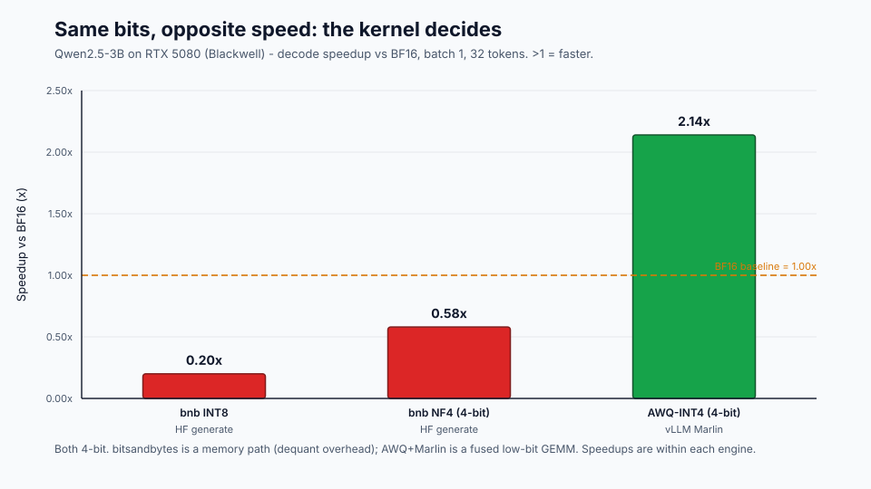
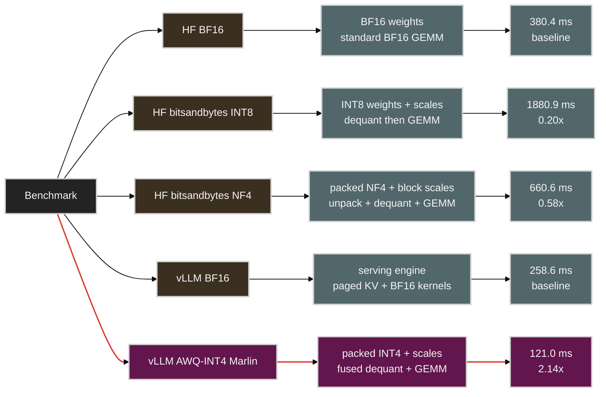
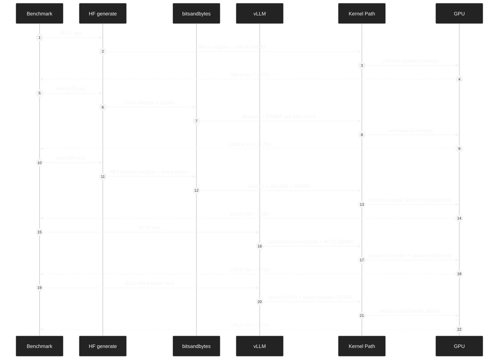
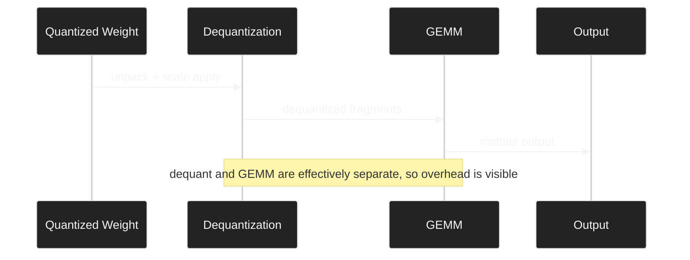
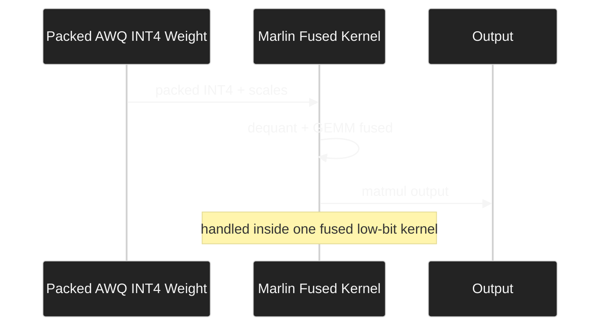

# Week 4 — Quantization

These notes expand Chapter 4 of the book. The source chapter is short and interview-oriented; this version keeps the same core topics while connecting them to the Week 1-3 measurements, especially FFN GEMV as the decode hot path and AGX Orin as an edge inference target.

## 4.1 Learning Goals

By the end of this week, you should be able to:

1. Explain the differences between FP32 / BF16 / FP8 / INT8 / INT4 / INT2 along four axes: representable range, value distribution, hardware support, and quantization method.
2. Connect the trade-off between weight-only quantization (W4A16, W8A16) and weight+activation quantization (W8A8, FP8) to **your NCU measurement result, where FFN GEMV was the hot path**.
3. Explain the core algorithms behind GPTQ / AWQ / SmoothQuant and describe practical selection criteria.
4. Explain where QuIP# and AQLM fit in the extreme 2-bit compression landscape.
5. Explain why activation outliers make INT8 quantization difficult, and how LLM.int8(), SmoothQuant, and FP8 each address the problem.
6. Choose a quantization strategy for edge inference under memory and latency constraints.

## 4.2 Prerequisite Check

You should already know:

- The fact from the Week 2 NCU measurement: **decode latency was dominated by FFN weight reads (GEMV), not attention**.
- The fact from the Week 3 Orin measurement: **BF16 7B model prefill took 13s**. Bandwidth bottlenecks create latency.
- Basic IEEE 754 floating point concepts: mantissa and exponent.

This week explains the direct motivation behind those two measurements. **If we reduce weight bytes, exactly what becomes faster, and how do we preserve quality?**

Related reading: [Hardware Architectures for LLM Inference](../appendix/hardware-architectures/README.md) connects quantization to memory movement, scratchpads, GPU/TPU execution models, and scale-out communication.

---

## 4.3 Core Concept: Why Quantization?

### 4.3.1 Memory Accounting: 70B Model

```
Llama-3-70B model weight memory:
- FP32: 280 GB  -> impossible on a single GPU
- BF16/FP16: 140 GB  -> H100 80GB x 2 barely, or x 4 comfortably
- FP8: 70 GB   -> fits on a single H100 80GB, barely
- INT8: 70 GB  -> same
- INT4: 35 GB  -> comfortably fits on one H100
- INT2: 17.5 GB -> effectively possible even on an RTX 4090 24GB
```

**Quantization is not just an "optimization." It is a technique that decides whether deployment is possible at all.** If you want to place a 70B model on a single H100, INT8 or lower quantization is mandatory.

### 4.3.2 Bandwidth Accounting: Direct Connection to Your Measurements

Let's interpret the Week 3 AGX Orin BF16 7B prefill result, 13s, through quantization.

```
Orin LPDDR5 bandwidth: ~200 GB/s
7B model weights:
  BF16: 14 GB  -> 14 GB read per decode step = 70 ms theoretical
  INT8: 7 GB   -> 35 ms theoretical (2x faster)
  INT4: 3.5 GB -> 17.5 ms theoretical (4x faster)
```

**INT4 quantization gives you 4x bandwidth savings, not merely 4x memory savings.** In the decode-bound regime, which is memory-bound as seen in Weeks 1 and 2, this directly becomes a latency reduction.

For prefill, the effect is more complicated. Weight loading decreases, but actual compute changes depending on the precision path, such as INT4 versus FP16 Tensor Core execution.

### 4.3.3 Compute Accounting: Tensor Core Throughput

The table from Week 2:

| Format | H100 TFLOPS | RTX 5080 dense TFLOPS |
|---|---|---|
| FP16/BF16 | 1,979 | ~113 |
| FP8 | 3,958 | ~225 |
| INT8 | 3,958 | ~225 |
| INT4 (not on Hopper) | — | — |
| FP4 (B200/Blackwell) | 9,000 (sparse 18,000) | available |

**INT8/FP8 provide exactly 2x compute throughput over BF16.** This matters in the prefill stage, which is compute-bound. It does not matter much in decode, because decode is usually compute-idle.

Hopper (H100) does not have native INT4 Tensor Cores, so W4A16 usually follows a dequantize-then-FP16-compute pattern. Blackwell (B200/RTX 5080) introduces native FP4 support. This is why quantization becomes even more important on next-generation hardware.

---

## 4.4 Number Formats: Precision and Representable Range

### 4.4.1 Distribution of Representable Values

```
FP32:  S(1) | E(8)  | M(23)    range: +/-3.4e38, precision 7-9 digits
BF16:  S(1) | E(8)  | M(7)     range: same as FP32, precision 2-3 digits
FP16:  S(1) | E(5)  | M(10)    range: +/-65,504, precision 3-4 digits
FP8 E4M3: S(1) | E(4) | M(3)   range: +/-448, precision ~2 digits
FP8 E5M2: S(1) | E(5) | M(2)   range: +/-57,344, precision ~1.5 digits
INT8:  -128 to 127             narrow range, uniform distribution
INT4:  -8 to 7                 very narrow range
```

### 4.4.2 LLM Weight Distribution vs. Format Choice

LLM weights usually follow a **bell-shaped distribution centered near zero**, similar to a Gaussian:

```
   ***
  *   *
 *     *
*       *
*         *
values: -3   0   +3
```

This fits the exponential distribution of FP8 better than uniform INT8/INT4. FP8 E4M3 places more representable values near zero, so it can express small weight values more accurately.

| Format | Precision near zero | Tail precision | Recommended use case |
|---|---|---|---|
| BF16 | Excellent | Excellent | Default for training |
| FP8 E4M3 | Good | Medium | Inference, weight + activation |
| FP8 E5M2 | Medium | Good | Gradient accumulation |
| INT8 | Uniform; needs per-channel scale | Uniform | Inference, strong hardware compatibility |
| INT4 | Very coarse uniform | High loss | Weight-only quantization |

### 4.4.3 INT Scale: Mapping Real Values onto an Integer Grid

INT quantization is not just "store the same number with fewer bits." It maps real-valued weights or activations onto a small, uniformly spaced integer grid. The scale decides the spacing of that grid:

```
real_value ~= int_value * scale
int_value = clamp(round(real_value / scale), qmin, qmax)
```

For symmetric INT8, `qmin=-128` and `qmax=127`. For signed INT4, the grid is only `-8..7`. This means the scale must solve two competing problems:

- If `scale` is small, values near zero get fine resolution, but large values overflow the grid and are clipped.
- If `scale` is large, large values fit, but small values collapse into the same few integer buckets.

Example:

```
INT4 signed grid: -8 -7 -6 -5 -4 -3 -2 -1 0 1 2 3 4 5 6 7

scale = 0.05  -> representable range ~= [-0.40, +0.35]
scale = 0.50  -> representable range ~= [-4.00, +3.50]
```

The first scale preserves tiny weights well, but clips any weight larger than about `0.35`. The second scale preserves the tail, but many small weights around zero round to `0` or `+/-1`. This is why outliers are so damaging for INT quantization: one large channel can force the scale to become large, reducing effective precision for the ordinary values that carry most of the distribution.

The scale granularity also matters:

| Scale granularity | How it works | Trade-off |
|---|---|---|
| Per-tensor | One scale for the whole tensor | Simple and fast, but very sensitive to outliers |
| Per-channel | One scale per output/input channel | Better quality, common for INT8 weights |
| Per-group | One scale per small group of weights | Stronger INT4 quality, with moderate metadata overhead |

For LLMs, the practical rule is:

- INT8: scale design is important.
- INT4: scale design is critical.
- Per-channel or per-group scale is usually better than per-tensor scale.
- Outliers create either clipping error, if the scale is too small, or rounding error for normal values, if the scale is too large.

This is also why FP8 is easier to use than INT8 in many H100-era inference paths. INT formats use uniformly spaced buckets after scaling. FP8 has a floating-point exponent, so its representable values are naturally denser near zero and sparser in the tails. FP8 still needs scaling in real kernels, but it does not force the whole tensor into one uniformly spaced integer lattice in the same way INT quantization does.

### 4.4.4 Symmetric vs. Asymmetric Quantization

**Symmetric:** zero point is fixed at 0, only scale is learned or computed.

```
q = round(x / scale)
x ~= q * scale
```

**Asymmetric:** zero point is also learned.

```
q = round((x - zero_point) / scale)
x ~= q * scale + zero_point
```

| Item | Symmetric quantization | Asymmetric quantization |
|---|---|---|
| Zero point | Fixed at `0` | Can shift |
| Formula | `q = round(x / scale)` | `q = round((x - zero_point) / scale)` |
| Distribution assumption | Centered around zero | Does not need to be centered around zero |
| Common use | Weights | Activations |
| Advantage | Simple and fast | Uses the integer range more efficiently |
| Disadvantage | Inefficient for one-sided or shifted values | Adds zero-point correction overhead |

Weights usually use symmetric quantization because weight distributions are often roughly centered around zero. Activations often need asymmetric quantization because activation ranges can be shifted or one-sided, so a movable zero point can use the available INT8 range more efficiently.

In real LLM kernels, activations are not always asymmetric. Hardware support, kernel implementation, calibration method, and model structure can make symmetric activation quantization preferable. The conceptual shortcut is: **weights are naturally symmetric; activations are more likely to need asymmetric handling.**

---

## 4.5 Post-Training Quantization (PTQ) Methods

### 4.5.1 GPTQ: Hessian-Based Layer-Wise Quantization

Core idea: **when one weight is quantized, slightly adjust the other weights to compensate for the quantization error**.

```
1. Process each layer independently.
2. Use calibration data to compute Hessian H = X^T X, where X is the input activation.
3. Quantize column by column:
   - quantize column c
   - apply an update to the remaining columns to compensate for the quantization error
   - use the Hessian so this update minimizes output change
```

**Advantages:**

- Can produce nearly lossless W4 quantization on large models, especially 30B and above.
- Has a theoretical basis in second-order optimization.
- Well supported by AutoGPTQ, ExLlamaV2, and related tools.

**Disadvantages:**

- Often loses to AWQ on smaller models, such as 7B and below.
- Calibration can take hours.
- Per-column processing has low GPU utilization during calibration.

### 4.5.2 AWQ: Activation-Aware Weight Quantization

Core idea: **not all weights are equally important. Weights that receive large activation magnitudes are more important.**

```
1. Use calibration data to measure the activation magnitude received by each weight column.
2. Protect the top 1% salient weight channels by scaling them before quantization.
3. Apply standard INT4 quantization to the rest.
4. Apply the inverse scale during inference.
```

As a formula:

```
Q(W * diag(s)^-1) * diag(s) ~= W
```

`diag(s)` reduces the magnitude of salient channels so they fit inside the quantization range, then multiplies them back during inference to preserve mathematical equivalence.

**Advantages:**

- Tends to produce better quality than GPTQ at 4-bit precision.
- Calibration only requires forward passes, so it is fast, usually tens of minutes.
- Well supported by AutoAWQ.
- Broadly supported by vLLM and TensorRT-LLM.

**Disadvantages:**

- Salient channel selection is heuristic and task-sensitive.
- Requires domain-specific calibration data for best results.

### 4.5.3 QuIP# and AQLM: Extreme 2-Bit Compression

QuIP# and AQLM target a more aggressive regime than GPTQ or AWQ. The goal is not simply 4-bit deployment; it is **near-2-bit compression while keeping quality closer to 4-bit methods**.

**QuIP#** uses incoherence processing. In practical terms, it applies randomized rotations so that weight and activation values become more evenly distributed before quantization. A flatter distribution is easier to quantize because fewer channels dominate the scale.

**AQLM** uses additive quantization. Instead of storing each weight directly as a low-bit integer, it represents weight vectors as sums of learned codebook entries. This can reach an effective 2-bit footprint while preserving more structure than naive INT2.

**Practical stance:**

- For production 4-bit deployment, start with AWQ or GPTQ.
- For edge hardware where 4-bit still does not fit, evaluate QuIP# or AQLM.
- Treat 2-bit methods as model- and task-sensitive. They need stricter quality validation than AWQ INT4.

For edge inference in this course, 2-bit is a fallback only after INT4 fails the memory or latency target. INT4 has better ecosystem support, simpler runtime integration, and a more predictable quality profile.

### 4.5.4 SmoothQuant: Solving Activation Outliers

SmoothQuant solves a **different problem** from GPTQ and AWQ. It targets **W8A8 weight+activation quantization**, not W4A16 weight-only quantization.

**Problem:** activations have outliers. Some channels can have values 100x larger than normal activations.

```
Normal activation: [-1, +1]
Outlier channel:  [-100, +100]

When quantizing to INT8, the scale must cover 100.
Then normal values in [-1, +1] map to only a tiny region of INT8.
This is effectively close to 1-bit representation for normal values.
```

**Solution:** move the quantization difficulty from activations to weights.

```
Y = X * W
  = (X * diag(s)^-1) * (diag(s) * W)
  = X_smooth * W_scaled
```

`diag(s)` reduces activation outlier magnitude and increases weight magnitude by the same amount. Activations can now be quantized to INT8 because the outliers are smoothed. Weights originally have fewer outliers, so the increased magnitude remains manageable under INT8.

**Selection criteria:**

- W8A8, where you need 2x compute throughput: SmoothQuant
- W4A16, where you need 4x memory bandwidth reduction for decode-bound workloads: AWQ or GPTQ
- Both: SmoothQuant + GPTQ can be combined

### 4.5.5 One-Line Decision Table

| Situation | Choice |
|---|---|
| New 4-bit production deployment | **AWQ**: proven sweet spot |
| Very large model, 70B and above, in 4-bit | GPTQ is also competitive |
| 8-bit prefill acceleration on H100+ | **FP8**, because native Tensor Core support exists |
| 8-bit on pre-Hopper hardware, such as A100 or RTX 4090 | SmoothQuant + INT8 |
| Extreme compression, 2-bit | QuIP#, AQLM; experimental |
| Quality-critical and enough time available | **QAT**, Quantization-Aware Training |

---

## 4.6 QAT: Quantization-Aware Training

PTQ applies quantization after training. It works well, but it still loses information. QAT **simulates quantization during training**:

```python
# Pseudo-code
def forward(x, W):
    W_fake_quant = round(W / scale) * scale  # simulation
    return x @ W_fake_quant
```

Because `round` is not differentiable, gradients are passed through using a **Straight-Through Estimator (STE)**:

```
forward: y = round(x / s) * s
backward: dy/dx ~= 1  (identity approximation)
```

**Advantage:** much better quality than PTQ for extreme quantization, such as 2-bit or 3-bit.

**Disadvantage:** training cost, either a full training run or a shorter fine-tuning run.

In practice, use **PTQ first, and use QAT as the fallback when quality is insufficient**. If a 70B model quantized to 4-bit with PTQ keeps 95% of quality, stop there. For edge scenarios that require 2-bit, consider QAT.

---

## 4.7 KV Cache Quantization

Week 3 showed that KV cache can become a large part of memory usage. KV can also be quantized.

**Why KV quantization differs from weight quantization:**

| Item | Weight quantization | KV quantization |
|---|---|---|
| Static/Dynamic | Static; computed offline | Dynamic; different per request |
| Error accumulation | Layer-wise and cumulative | Per-step, not cumulative |
| Calibration | Possible offline | Difficult at runtime |
| Effect | Bandwidth + memory | Memory, improves concurrency |

**INT8 KV is almost lossless.** INT4 KV requires careful per-head scaling.

Connection to your Week 3 measurement:

```
7B GQA model on AGX Orin 64GB
- BF16 weights: 14 GB
- BF16 KV/token: 56 KiB
- BF16, 1K context, batch 16: KV ~900 MiB, small

With W4 + KV-INT8:
- INT4 weights: 3.5 GB, 4x reduction and 4x bandwidth savings
- INT8 KV/token: 28 KiB
- Same batch/context setup KV: ~450 MiB

Total memory: 18 GB -> about 4 GB
Batch concurrency can expand by about 4x.
```

**In edge scenarios such as Orin, W4 + KV-INT8 is mandatory.** The real value of Week 4 quantization is not only latency. It expands the batch range where the model can operate on that hardware.

---

## 4.8 Reading

### Required

- Full Chapter 4 of the source book

### Recommended Papers

1. **Dettmers et al. 2022, ["LLM.int8(): 8-bit Matrix Multiplication for Transformers at Scale"](https://arxiv.org/abs/2208.07339)**: the first systematic study of the outlier feature phenomenon. Short and clear.
2. **Frantar et al. 2022, ["GPTQ: Accurate Post-Training Quantization for Generative Pre-trained Transformers"](https://arxiv.org/abs/2210.17323)**: the original GPTQ paper.
3. **Lin et al. 2023, ["AWQ: Activation-aware Weight Quantization for LLM Compression and Acceleration"](https://arxiv.org/abs/2306.00978)**: the original AWQ paper, with many experiments.
4. **Xiao et al. 2022, ["SmoothQuant: Accurate and Efficient Post-Training Quantization for Large Language Models"](https://arxiv.org/abs/2211.10438)**: activation outlier problem and solution.
5. **Tseng et al. 2024, ["QuIP#: Even Better LLM Quantization with Hadamard Incoherence and Lattice Codebooks"](https://arxiv.org/abs/2402.04396)**: useful for understanding the 2-bit frontier.
6. **Egiazarian et al. 2024, ["Extreme Compression of Large Language Models via Additive Quantization"](https://arxiv.org/abs/2401.06118)**: AQLM and codebook-based compression.
7. **NVIDIA Hopper FP8 Training and Inference whitepaper**: guide to native H100 FP8 usage.

The AWQ paper is the most directly practical one. Reading it once gives you material you can apply directly to 4-bit deployment decisions.

---

## 4.9 Labs

### Lab 1: Measure the Same Model with Different Quantization

Compare the Qwen2.5-3B model used in Week 3 across BF16, W8A16, and W4A16:

```python
# week04/quant_compare.py
import torch
import time
from transformers import AutoModelForCausalLM, AutoTokenizer

model_id = "Qwen/Qwen2.5-3B-Instruct"
tok = AutoTokenizer.from_pretrained(model_id)

prompt = "Explain memory bandwidth bottleneck in LLM decoding."
inputs = tok(prompt, return_tensors="pt").to("cuda")

def benchmark(model, n_warmup=5, n_iter=20):
    # warmup
    with torch.no_grad():
        for _ in range(n_warmup):
            _ = model.generate(**inputs, max_new_tokens=32, do_sample=False)

    torch.cuda.synchronize()
    t = time.perf_counter()

    with torch.no_grad():
        for _ in range(n_iter):
            out = model.generate(**inputs, max_new_tokens=32, do_sample=False)

    torch.cuda.synchronize()
    elapsed = (time.perf_counter() - t) / n_iter
    return elapsed, torch.cuda.max_memory_allocated() / 1024**3

# BF16 baseline
torch.cuda.empty_cache()
torch.cuda.reset_peak_memory_stats()
model_bf16 = AutoModelForCausalLM.from_pretrained(
    model_id, dtype=torch.bfloat16, device_map="cuda"
)
t_bf16, mem_bf16 = benchmark(model_bf16)
print(f"BF16: {t_bf16*1000:.1f}ms, {mem_bf16:.2f}GB")
del model_bf16; torch.cuda.empty_cache()

# AWQ INT4; requires an AWQ-quantized model in advance.
# Example: search for variants such as TheBloke/Qwen2.5-3B-Instruct-AWQ.
# pip install autoawq
from awq import AutoAWQForCausalLM
torch.cuda.reset_peak_memory_stats()
model_awq = AutoAWQForCausalLM.from_quantized(
    "Qwen/Qwen2.5-3B-Instruct-AWQ",  # replace with the actual quantized model ID
    fuse_layers=True,
)
t_awq, mem_awq = benchmark(model_awq)
print(f"AWQ INT4: {t_awq*1000:.1f}ms, {mem_awq:.2f}GB")

# bitsandbytes INT8, a simple alternative
from transformers import BitsAndBytesConfig
torch.cuda.reset_peak_memory_stats()
bnb_config = BitsAndBytesConfig(load_in_8bit=True)
model_int8 = AutoModelForCausalLM.from_pretrained(
    model_id, quantization_config=bnb_config, device_map="cuda"
)
t_int8, mem_int8 = benchmark(model_int8)
print(f"bnb INT8: {t_int8*1000:.1f}ms, {mem_int8:.2f}GB")
```

Expected result:

| Format | Memory | Time for 32 tokens | Quality |
|---|---|---|---|
| BF16 | 6 GB | baseline | 100% |
| INT8 (bnb) | 3.5 GB | similar or slightly slower | ~99% |
| INT4 (AWQ) | 2 GB | **40-70% faster** | ~98% |

**Important observation:** INT4 has a large latency effect by itself. This is direct evidence that your NCU interpretation, "FFN GEMV is the hot path" and the workload is bandwidth-bound, was correct.

### Lab 2: Quality Measurement with Perplexity

Measure perplexity for each quantization variant of the same model:

```python
# week04/perplexity_eval.py
import torch
from transformers import AutoModelForCausalLM, AutoTokenizer
from datasets import load_dataset

def compute_perplexity(model, tok, texts, max_length=512):
    model.eval()
    nll_sum = 0
    n_tokens = 0

    for text in texts:
        encodings = tok(text, return_tensors="pt",
                        truncation=True, max_length=max_length)
        input_ids = encodings.input_ids.to("cuda")

        with torch.no_grad():
            outputs = model(input_ids, labels=input_ids)
            nll = outputs.loss.item() * input_ids.shape[1]

        nll_sum += nll
        n_tokens += input_ids.shape[1]

    return float(torch.exp(torch.tensor(nll_sum / n_tokens)))

# WikiText-2 sample
dataset = load_dataset("wikitext", "wikitext-2-raw-v1", split="test")
texts = [t for t in dataset["text"] if len(t.strip()) > 100][:100]

# Run for each quantization variant.
# Expected: BF16 ~7-8, INT8 ~7-8, INT4 ~7.5-8.5
```

If INT4 perplexity stays within 5% of BF16, it is generally production-viable.

### Lab 3: Edge Simulation — Manual Calculation for Orin

Predict what happens when the Week 3 Orin measurement, BF16 prefill at 13s, is quantized to W4:

```python
# week04/orin_quant_projection.py

# Measured values from the Week 3 Orin result
orin_bandwidth_gbs = 200  # AGX Orin LPDDR5
weight_bf16_gb = 14
weight_int8_gb = 7
weight_int4_gb = 3.5

# Prefill reads weights across sequence length.
# Simplification: prefill_time ~= batch * seq_len * weight_size / bandwidth
# In reality GEMM compute also matters, but on Orin bandwidth dominates.

batch = 16
seq_len = 1024

for precision, weight_gb in [("BF16", weight_bf16_gb),
                              ("INT8", weight_int8_gb),
                              ("INT4", weight_int4_gb)]:
    # bandwidth-bound assumption
    weight_reads_per_token = 1  # decode step
    prefill_reads = batch * seq_len  # rough approximation

    # Decode time: weight load per step
    decode_step_ms = weight_gb / orin_bandwidth_gbs * 1000

    # Calibrate with measured BF16 result
    if precision == "BF16":
        # 13.38s prefill, 1.51s decode (16 tokens, batch 1)
        # = about 94 ms/token decode at batch=1
        bf16_decode_ms = 94
        scale_factor = bf16_decode_ms / decode_step_ms
        print(f"Calibration scale: {scale_factor:.2f}")

    scaled_decode_ms = decode_step_ms * scale_factor
    print(f"{precision}: weight {weight_gb}GB -> "
          f"decode {scaled_decode_ms:.0f} ms/token, "
          f"16 token decode {scaled_decode_ms*16/1000:.1f}s")
```

Expected result:

```
BF16: weight 14GB  -> decode 94 ms/token, 16 token decode 1.5s  (matches measurement)
INT8: weight 7GB   -> decode 47 ms/token, 16 token decode 0.75s (prediction)
INT4: weight 3.5GB -> decode 24 ms/token, 16 token decode 0.4s  (prediction)
```

**INT4 meaningfully improves edge serving feasibility.** But the compute part of prefill still needs separate analysis, because W4A16 uses dequantize-then-FP16-compute, so compute itself does not become faster.

If you download an INT4 model and measure it directly, you can validate the prediction. Week 3 data + Week 4 prediction + measured comparison is a good test of your modeling ability.

### Lab Results (RTX 5080 16GB, Blackwell sm_120)

These labs were run on an RTX 5080. On Blackwell the prebuilt AWQ kernels for the plain `transformers` path are unreliable, so the Lab 1 low-bit variants use **bitsandbytes** (INT8 / NF4), and a separate vLLM run (`vllm_quant_bench.py`) tests the **fused AWQ-INT4 Marlin** kernel. The full write-up is in [results/RESULTS.md](results/RESULTS.md).

#### The headline: same bits, opposite speed



The README's "INT4 40-70% faster" expectation assumed a *fused* INT4 kernel. The measurements split sharply by kernel, not by bit-width:

| Variant | Engine | ms / 32-tok gen | Speedup vs BF16 |
|---|---|---|---|
| BF16 | HF generate | 380.4 | 1.00x |
| INT8 (bnb) | HF generate | 1880.9 | **0.20x (5x slower)** |
| NF4 (bnb) | HF generate | 660.6 | **0.58x (1.7x slower)** |
| BF16 | vLLM | 258.6 | 1.00x |
| **AWQ-INT4 (Marlin)** | vLLM | 121.0 | **2.14x faster** |

Both bitsandbytes paths are *slower* than BF16, while the fused AWQ-INT4 path is **2.14x faster** — even exceeding the README's expectation. **Kernel quality matters as much as bit-width:** fewer bits always saves memory, but only a fused low-bit kernel turns the saved bytes into lower latency.

#### Why the kernel path dominates

The key difference is where dequantization happens. HF + bitsandbytes stores fewer weight bytes, but unpacking, scale application, and dequantization are still visible costs in the forward path. vLLM + AWQ Marlin turns packed INT4 loading, scale application, dequantization, and GEMM into one fused low-bit kernel.



The same result can also be read as a sequence of runtime paths:



In short: bitsandbytes lowered storage precision, but dequant overhead consumed the latency benefit; AWQ Marlin fused dequantization with GEMM, so the lower bit-width became an actual speedup.

The most important structural difference is:

| Path | Execution shape | Why it matters |
|---|---|---|
| bitsandbytes NF4 / INT8 | Quantized weight read -> unpack or scale apply -> dequantized fragments -> GEMM | Weight memory falls, but dequant work remains visible as extra kernel work or extra memory movement. |
| AWQ Marlin | Packed INT4 weight read -> fused dequant + GEMM inside one optimized kernel | Weight memory falls and the dequant cost is hidden inside the matmul kernel, so the saved bytes can become lower latency. |

```text
bitsandbytes path:
quantized storage -> unpack / scale apply -> dequant -> GEMM

AWQ Marlin path:
packed INT4 + scales -> fused low-bit GEMM
```

bitsandbytes separates dequantization from GEMM:



AWQ Marlin fuses dequantization into the low-bit GEMM kernel:



This is why "4-bit" alone is not the performance guarantee. The deployment question is whether the runtime has a fused kernel path for that quantized format on that GPU.

#### Lab 1 — memory falls, latency rises (bitsandbytes)


Memory shrank exactly as predicted (5.76 → 3.25 → 1.98 GB), but on a desktop GPU where the 3B model already fits with bandwidth to spare, the dequant overhead of bitsandbytes dominates and latency moves the wrong way.

#### Lab 2 — quality (WikiText-2 perplexity, 100 samples)

| Variant | Perplexity | Δ vs BF16 |
|---|---|---|
| BF16 | 11.942 | — |
| INT8 (bnb) | 12.017 | +0.63% (near-lossless) |
| NF4 (bnb) | 12.898 | **+8.00% (exceeds 5% threshold)** |

INT8 is near-lossless; 4-bit NF4 without AWQ-style salient-channel protection visibly costs quality on this small model — consistent with the §4.5 note that ≤7B models need the stronger PTQ algorithms.

#### Lab 3 — Orin decode projection


Calibrated to the Week 3 BF16 measurement (94 ms/token), the bandwidth-bound model projects 2x / 4x decode speedup for INT8 / INT4 on Orin — the memory-bound, memory-tight regime where quantization genuinely pays off, in contrast to the desktop RTX 5080 in Lab 1.

> **Reproduce the figures:** `python week04/make_figures.py` regenerates all three SVGs from the result CSVs in `results/`.

---

## 4.10 Self-Assessment Questions

Answer Q4.1 through Q4.5 at the end of Chapter 4 of the source book, plus the following:

1. **Tensor Core path effect:** In the Week 2 measurement, you saw the transition from batch=1 GEMV to batch=32 GEMM. W4A16 weight-only quantization accelerates batch=1 decode. How does the effect differ for batch=32 prefill, and why?

2. **Outliers vs. quality:** AWQ protects only the top 1% salient channels. SmoothQuant migrates all outlier channels into weights. Both address outlier problems, so why are the approaches different? Which one is more suitable for W4A16?

3. **Quantization validation strategy:** Which metrics should be monitored before deciding on production deployment? Is perplexity sufficient? Is domain-specific evaluation mandatory?

4. **Next-generation hardware response:** B200/RTX 5080 provide native FP4 support. What does this mean for the quantization landscape? Are GPTQ and AWQ still relevant?

### Expected Answer Sketch

1. W4A16 only reduces weight load bytes. In batch=1 decode, which is memory-bound, 4x bandwidth savings can produce close to 4x speedup. In batch=32 prefill, GEMM compute starts to dominate, so bandwidth savings matter less. Compute still runs in FP16 after dequantization, so compute throughput itself does not improve. Therefore, W4A16 is **a decode optimization, not a prefill optimization**. To accelerate prefill, use W8A8 or FP8 for 2x compute throughput.

2. AWQ is for weight-only quantization. Activations remain FP16, so activation outliers are not directly quantized. You only need to know which weight channels receive large activations. SmoothQuant is for W8A8. Activations are also quantized, so outliers are the direct problem. That is why outlier magnitude must be moved into weights. For W4A16, SmoothQuant gives little benefit because activations are already FP16. AWQ is the better fit.

3. Perplexity is generic quality. It is useful, but domain-task verification is mandatory. For summarization, instruction following, code, math, or domain-specific extraction, use task-specific benchmarks or human review. Monitor inference cost, memory, latency, and quality together. Choose the quantization that maximizes quality inside the latency budget.

4. Native FP4 makes 4-bit quantization faster even in compute-bound regimes. New combinations such as W4A4 become possible. AWQ is still relevant because it is a 4-bit weight quantization algorithm independent of hardware generation. The calibration target may need adjustment for FP4 distribution. GPTQ is similar. **The algorithms survive; the target format changes.**

---

## 4.11 Deliverables

By the end of this week, keep the following in your notes:

1. **Quantization comparison table:** measured BF16 vs. INT8 vs. INT4 for the same model, including memory, latency, and quality.
2. **Perplexity comparison:** quantify quality degradation.
3. **Orin INT4 projection:** predict INT4 behavior from the Week 3 measurement, and validate with real measurement if possible.
4. **Deployment decision table:** choose BF16, FP8, INT8, or INT4 for several model/hardware pairs and justify the choice with memory, bandwidth, compute path, and quality risk.

---

## 4.12 Week 5 Preview

Speculative Decoding. A small draft model generates K tokens in advance, and the larger target model verifies them in one pass. If the acceptance rate is high, throughput improves. Next week focuses on when this helps, when it fails, and how to account for the extra model memory.
