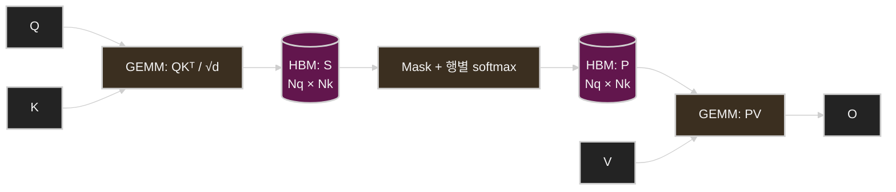
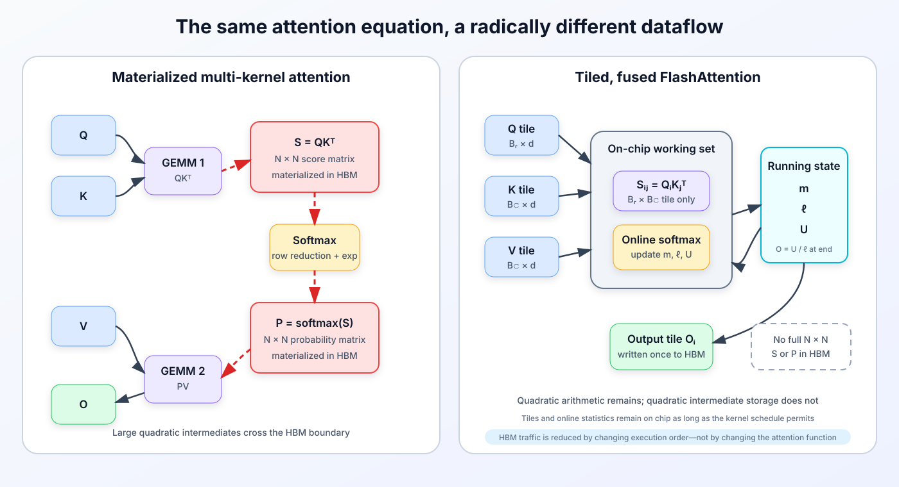
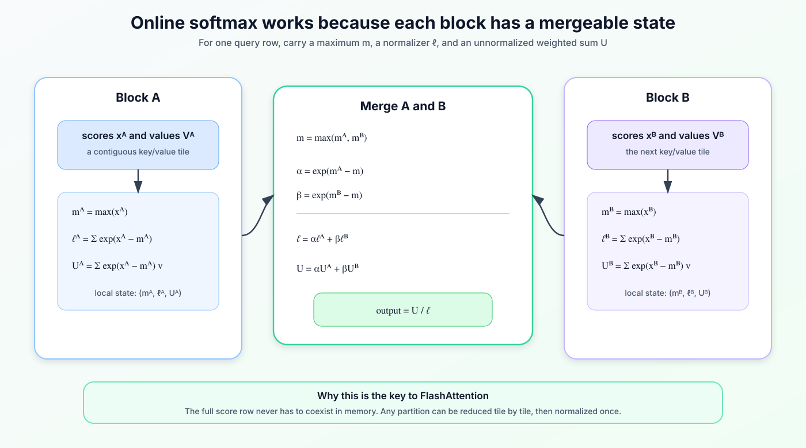
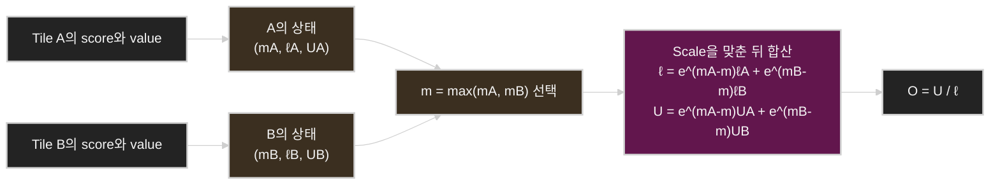
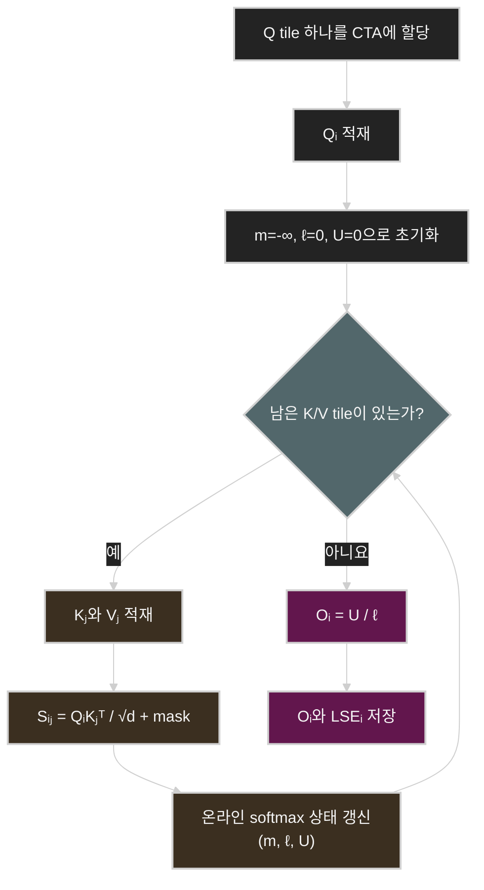
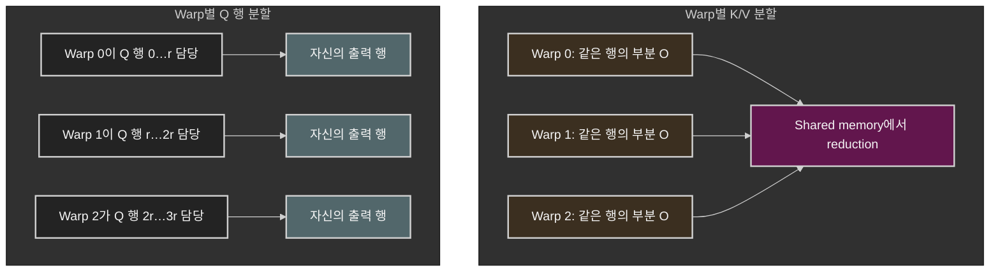
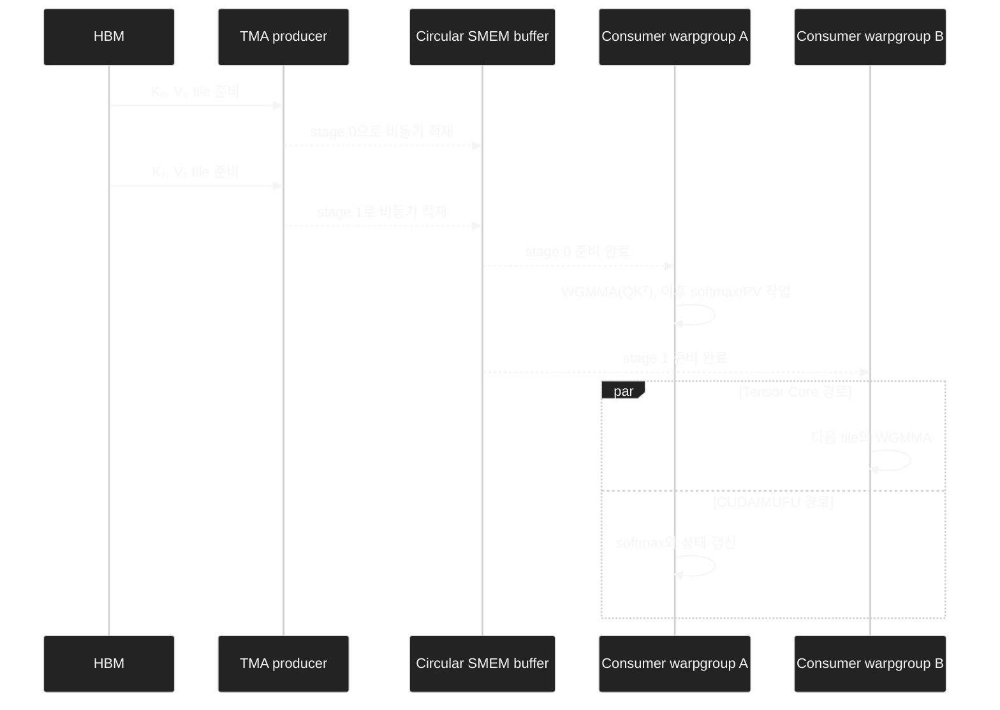
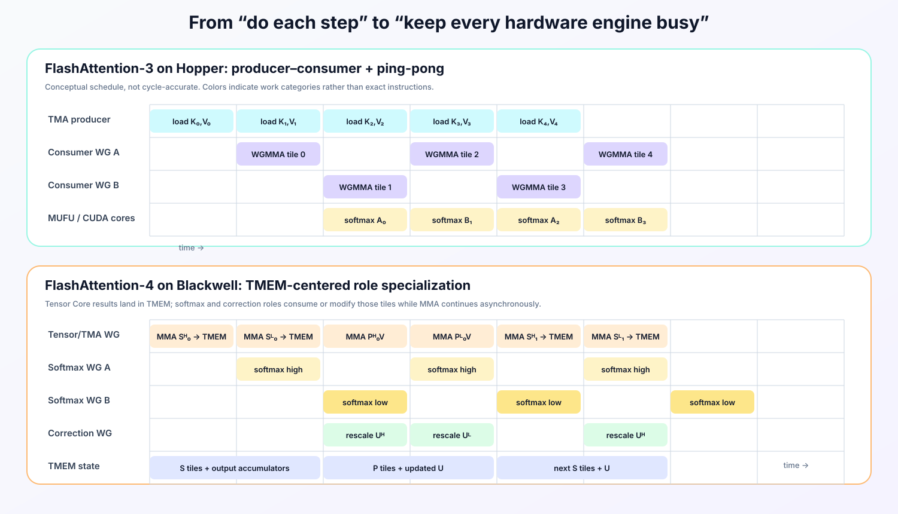
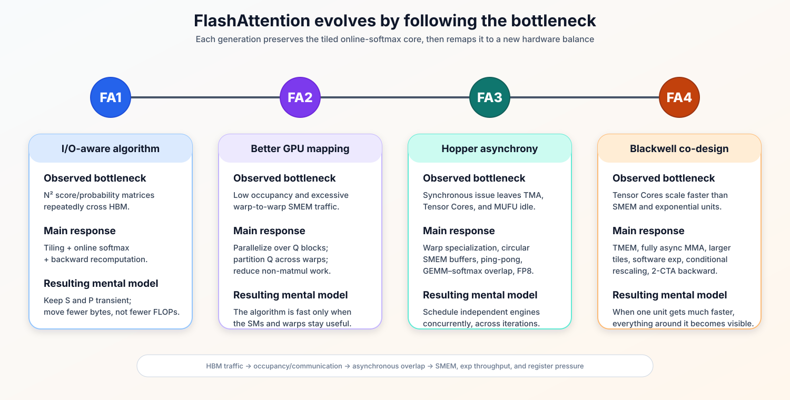
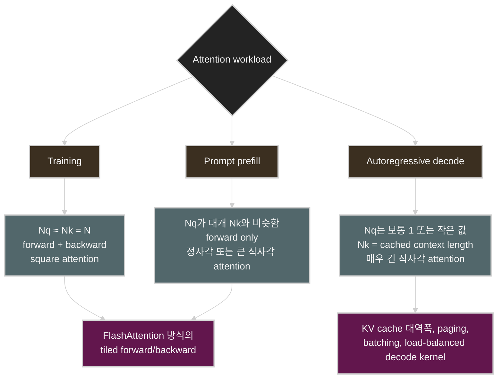

# 원리로 이해하는 FlashAttention

[English](README.md) | **한국어**

> **Exact attention 최적화가 Ampere에서 Blackwell에 이르기까지 I/O·병렬성·파이프라인 설계 문제로 확장된 과정**

FlashAttention은 흔히 "attention을 더 빠르게 계산하는 알고리즘"으로 요약됩니다. 틀린 말은 아니지만 핵심을 모두 담지는 못합니다. FlashAttention은 새로운 attention 메커니즘이 아니며, dense softmax attention을 sparse 또는 low-rank 근사로 대체하지도 않습니다. 더 근본적인 기여는 다음과 같은 시스템 질문을 던졌다는 데 있습니다.

> 수학적으로 같은 연산을 수행하면서 GPU가 중간 데이터를 옮기는 시간은 줄이고 연산 장치를 활용하는 시간은 늘리려면, 작업을 어떻게 스케줄링해야 하는가?

그 답은 네 세대에 걸쳐 달라졌습니다.

- **FlashAttention-1**은 attention을 *I/O-aware*하게 만들었습니다. 연산을 tile로 나누고 여러 단계를 하나의 커널로 fusion해, 전체 score 또는 확률 행렬을 high-bandwidth memory(HBM)에 구체화하지 않습니다.
- **FlashAttention-2**는 병렬성을 높이고 행렬 곱셈 외 연산과 warp 간 통신을 줄여 같은 알고리즘을 더 효율적으로 구성했습니다.
- **FlashAttention-3**는 Hopper의 비동기 Tensor Memory Accelerator(TMA), warpgroup matrix multiply-accumulate(WGMMA), warp specialization에 맞춰 커널을 다시 설계했습니다.
- **FlashAttention-4**는 Tensor Core 처리량이 shared memory 대역폭과 지수 함수 처리량보다 더 빠르게 증가한 Blackwell에 맞춰 파이프라인의 균형을 다시 잡았습니다. Tensor Memory(TMEM), 더 큰 비동기 행렬 연산, 소프트웨어 보조 지수 함수, 조건부 재스케일링, 2-CTA 협력을 활용합니다.

이 발전 과정을 단순히 "새 버전일수록 더 빠르다"로 이해해서는 안 됩니다. 핵심은 **병목의 이동**입니다. 한 병목을 줄이면 그동안 가려져 있던 다음 병목이 드러납니다.

이 글은 수학에서 출발해 그 과정을 단계별로 설명합니다. Transformer와 기본적인 GPU 용어를 안다고 가정하되, 핵심 온라인 softmax 방정식은 직접 유도하고 이를 구체적인 커널 설계와 연결합니다.

---

## 읽기 순서

1. [Attention 연산](#1-the-attention-operator)
2. [직관적인 구현이 비싼 이유](#2-why-the-obvious-implementation-is-expensive)
3. [수학적 열쇠: 병합 가능한 온라인 softmax](#3-the-mathematical-key-mergeable-online-softmax)
4. [Tile 기반 exact-attention 알고리즘](#4-a-tiled-exact-attention-algorithm)
5. [FlashAttention-1: HBM 트래픽을 핵심 문제로 다루다](#5-flashattention-1-make-hbm-traffic-a-first-class-concern)
6. [FlashAttention-2: 병렬성과 작업 분할 개선](#6-flashattention-2-improve-parallelism-and-work-partitioning)
7. [재계산으로 backward pass 비용을 줄이는 원리](#7-why-recomputation-makes-the-backward-pass-cheaper)
8. [FlashAttention-3: Hopper용 커널 파이프라인](#8-flashattention-3-pipeline-the-kernel-for-hopper)
9. [FlashAttention-4: Blackwell에 맞춘 파이프라인 재균형](#9-flashattention-4-rebalance-the-pipeline-for-blackwell)
10. [한눈에 보는 발전 과정](#10-the-evolution-in-one-view)
11. ["Exact attention"의 정확한 의미](#11-what-exact-attention-actually-means)
12. [Training, prefill, decode의 workload는 서로 다르다](#12-training-prefill-and-decode-are-different-workloads)
13. [FlashAttention은 언제 효과가 크고 언제 작아지는가](#13-when-flashattention-helpsand-when-it-may-not)
14. [Attention benchmark를 제대로 하는 법](#14-how-to-benchmark-attention-without-fooling-yourself)
15. [흔한 오해](#15-common-misconceptions)
16. [변하지 않는 핵심 관점](#16-a-durable-mental-model)

---

<a id="1-the-attention-operator"></a>

## 1. Attention 연산

Attention head 하나를 다음과 같이 정의합니다.

- $Q \in \mathbb{R}^{N_q \times d}$: query 행렬
- $K \in \mathbb{R}^{N_k \times d}$: key 행렬
- $V \in \mathbb{R}^{N_k \times d_v}$: value 행렬

Scaled dot-product attention은 다음과 같습니다.

$$
S = \frac{QK^\top}{\sqrt{d}} + \mathcal{M},
$$

$$
P = \operatorname{softmax}_{\text{row}}(S),
$$

$$
O = PV.
$$

$\mathcal{M}$은 선택적으로 적용하는 mask입니다. Causal attention에서는 softmax를 계산하기 전에 참조할 수 없는 미래 위치에 $-\infty$를 더합니다.

$d_v=d$라면 두 번의 행렬 곱셈에 필요한 부동소수점 연산량은 head 하나당 대략 다음과 같습니다.

$$
2N_qN_kd + 2N_qN_kd = 4N_qN_kd
$$

Training이나 prompt prefill의 self-attention에서는 $N_q \approx N_k = N$이므로 연산량이 여전히 $N$의 제곱에 비례합니다.

$$
\Theta(N^2d).
$$

FlashAttention은 dense attention의 제곱 연산량을 없애지 **않습니다**. 대신 중간 상태를 어디에 두고, 언제 만들며, 얼마나 오래 유지할지를 바꿉니다.

### 기존 데이터 흐름

직관적인 구현은 서로 분리된 커널을 실행합니다.

1. $QK^\top$ 계산을 위한 GEMM,
2. 결과 행에 대한 softmax,
3. $PV$ 계산을 위한 GEMM.



방정식은 단순하지만 이 데이터 흐름은 비쌉니다.

---

<a id="2-why-the-obvious-implementation-is-expensive"></a>

## 2. 직관적인 구현이 비싼 이유

### 2.1 크기가 제곱에 비례하는 텐서는 출력이 아니라 중간 결과다

Score 행렬 $S$와 확률 행렬 $P$는 각각 $N_qN_k$개의 원소를 가집니다. 두 GEMM을 연결하는 중간 결과일 뿐이지만, 기존의 multi-kernel 구현은 두 행렬을 HBM에 쓴 뒤 다시 읽습니다.

$N=8192$인 이상적인 BF16 예를 보면 다음과 같습니다.

$$
8192^2 \times 2\ \text{bytes} = 128\ \text{MiB}
$$

이는 head **하나**에서 $N\times N$ 행렬 **하나**가 차지하는 크기입니다. $S$와 $P$를 한 번씩 쓰기만 해도 다음만큼의 트래픽이 발생합니다.

$$
256\ \text{MiB per head}.
$$

Head가 32개라면 layer 하나의 쓰기 트래픽만 8 GiB에 이릅니다. 읽기, masking, softmax 통계, 임시 FP32 값, backward-pass 상태, batch size는 아직 계산에 넣지도 않았습니다. 실제 구현마다 세부 수치는 다르지만, 피할 수 있는 트래픽이 얼마나 큰지는 분명합니다.



### 2.2 FLOPs만으로 실행 시간을 예측할 수 없다

GPU는 여러 계층의 메모리와 실행 장치로 이루어져 있습니다.

- **HBM / global memory:** 용량이 크고 device 전체가 공유하지만 chip 밖에 있습니다.
- **L2 cache:** chip 안에 있으며 여러 SM이 공유합니다.
- **Shared memory / L1:** chip 안에서 SM별로 제공됩니다. 고성능 커널은 이를 명시적으로 관리합니다.
- **Register:** thread마다 전용으로 할당되고 매우 빠르지만 수가 제한적입니다.
- **Blackwell의 TMEM:** Tensor Core accumulator를 저장하는 전용 on-chip memory입니다.

CUDA는 thread block을 SM에 매핑합니다. 이때 각 SM의 register file과 shared memory 용량이 동시에 상주할 수 있는 block 수와 통신 방식을 제한합니다 [10].

성능은 연산량과 데이터 이동량에 모두 좌우됩니다. 이를 이해할 때는 arithmetic intensity(연산 집약도)가 유용합니다.

$$
I = \frac{\text{FLOPs}}{\text{병목이 되는 memory 계층을 오간 bytes}}.
$$

단순화한 roofline 상한은 다음과 같습니다.

$$
P_{\text{attainable}}
\leq
\min\left(P_{\text{peak}},\ B_{\text{memory}}\, I\right),
$$

여기서 $P_{\text{peak}}$는 최대 연산 처리량이고, $B_{\text{memory}}$는 해당 메모리 계층의 대역폭입니다 [9].

이 식은 얼핏 직관에 어긋나는 결과를 설명해 줍니다. 메모리 트래픽을 충분히 줄일 수 있다면 부동소수점 연산을 **더 많이** 수행하는 커널이 오히려 더 빨리 끝날 수 있습니다. FlashAttention의 backward pass가 대표적인 예입니다. 제곱 크기의 전체 행렬을 읽는 대신 로컬 score와 확률 tile을 다시 계산합니다.

### 2.3 Fusion은 필요하지만 그것만으로 충분하지 않다

"세 커널을 하나로 fusion하면 되지 않을까?"라고 생각할 수 있습니다. Fusion은 연산자 사이의 global memory 쓰기·읽기 경계를 없애 줍니다. 하지만 fused kernel이 score tile을 한 번에 하나씩만 보면서 행 전체의 softmax를 계산하려면 별도의 방법이 필요합니다.

Softmax는 전체 행에 의존하는 것처럼 보입니다.

$$
\operatorname{softmax}(s)_j
=
\frac{e^{s_j}}{\sum_t e^{s_t}}.
$$

분모를 구하려면 행의 모든 key 위치를 알아야 합니다. 수치 안정성을 확보하려면 행의 최댓값도 필요합니다.

$$
\operatorname{softmax}(s)_j
=
\frac{e^{s_j-m}}{\sum_t e^{s_t-m}},
\qquad
m=\max_t s_t.
$$

핵심은 이 계산에 필요한 상태를 점진적으로 갱신하고 서로 병합할 수 있다는 점입니다.

---

<a id="3-the-mathematical-key-mergeable-online-softmax"></a>

## 3. 수학적 열쇠: 병합 가능한 온라인 softmax

### 3.1 Score 구간 하나를 요약하는 최소 상태

Query 행 하나와 그 행이 참조하는 key 위치의 부분집합 $A$를 생각해 봅시다. $s_j$는 score, $v_j\in\mathbb{R}^{d_v}$는 여기에 대응하는 value vector입니다. 다음 세 값을 정의합니다.

$$
m_A = \max_{j\in A}s_j,
$$

$$
\ell_A = \sum_{j\in A} e^{s_j-m_A},
$$

$$
U_A = \sum_{j\in A} e^{s_j-m_A}v_j.
$$

$A$에 대한 정규화된 attention 출력은 다음과 같습니다.

$$
O_A = \frac{U_A}{\ell_A}.
$$

$(m_A,\ell_A,U_A)$만 유지하면 충분합니다. 개별 확률값은 남겨 둘 필요가 없습니다.

### 3.2 독립적으로 처리한 두 구간 병합하기

행을 서로 겹치지 않는 구간 $A$와 $B$로 나눴다고 합시다. 두 구간은 최댓값의 기준점이 서로 다르므로 먼저 공통 최댓값을 선택합니다.

$$
m = \max(m_A,m_B).
$$

그런 다음 각 구간 상태의 scale을 공통 기준에 맞춥니다.

$$
\ell
=
 e^{m_A-m}\ell_A
+
 e^{m_B-m}\ell_B,
$$

$$
U
=
 e^{m_A-m}U_A
+
 e^{m_B-m}U_B.
$$

마지막으로 둘을 나눕니다.

$$
O = \frac{U}{\ell}.
$$

이 항등식이 tile 기반 exact attention의 핵심입니다. 각 tile을 작은 상태로 요약하고, 전체 확률 행을 저장하지 않은 채 상태끼리 병합할 수 있습니다. 이는 softmax의 online normalizer와 밀접한 관련이 있습니다 [2].





### 3.3 병합이 올바른 이유

$A$에 대해 다음이 성립합니다.

$$
e^{m_A-m}\ell_A
=
\sum_{j\in A}e^{m_A-m}e^{s_j-m_A}
=
\sum_{j\in A}e^{s_j-m}.
$$

$B$에도 같은 관계가 성립합니다. 따라서 다음과 같습니다.

$$
\ell
=
\sum_{j\in A\cup B}e^{s_j-m}.
$$

마찬가지로 다음이 성립합니다.

$$
U
=
\sum_{j\in A\cup B}e^{s_j-m}v_j.
$$

둘을 나누면 합집합 전체에 대한 수치적으로 안정적인 softmax-weighted value sum을 얻습니다. 무한 정밀도 연산에서는 분할 방식과 병합 순서가 수학적 결과를 바꾸지 않습니다. 그러나 부동소수점 덧셈은 결합법칙을 완벽히 만족하지 않으므로, 스케줄이 다르면 비트 단위 결과가 달라질 수 있습니다. 이 차이는 뒤에서 다시 다룹니다.

### 3.4 Log-sum-exp 형태

마지막 tile까지 처리한 뒤 행의 로그 정규화 상수는 다음과 같습니다.

$$
L = m + \log \ell.
$$

나중에 확률 tile을 재구성할 때는 이 값 하나만 있으면 됩니다.

$$
P_{ij}
=
\exp(S_{ij}-L_i).
$$

이 관찰은 backward pass에서 특히 유용하며 FlashAttention-2가 명시적으로 활용합니다 [4].

---

<a id="4-a-tiled-exact-attention-algorithm"></a>

## 4. Tile 기반 exact-attention 알고리즘

다음 pseudocode는 설명을 단순하게 하기 위해 현대 FlashAttention 구현에서 사용하는 query-outer 구성을 따릅니다. Layout 변환, vectorization, pipeline stage, dropout, 저수준 synchronization은 생략했습니다.

```text
각 batch, head, query tile Qi를 병렬로 처리:
    Qi를 on-chip memory에 적재

    m = -∞                     # query 행마다 유지하는 running maximum
    l = 0                      # query 행마다 유지하는 running denominator
    U = 0                      # query 행마다 유지하는 정규화 전 출력 vector

    각 key/value tile (Kj, Vj)에 대해:
        Kj와 Vj를 on-chip memory에 적재

        S = Qi @ Kjᵀ / sqrt(d)
        S에 mask 적용

        tile_max = rowmax(S)
        m_new = max(m, tile_max)

        alpha = exp(m - m_new)
        P_tilde = exp(S - m_new)

        l = alpha * l + rowsum(P_tilde)
        U = alpha[:, None] * U + P_tilde @ Vj
        m = m_new

    Oi = U / l[:, None]
    Li = m + log(l)

    Oi와 Li를 저장
```



### 4.1 한 시점에 on-chip memory에 머무는 데이터

실제 커널은 다음 데이터의 일부를 SM 가까이에 유지합니다.

- $Q$ tile,
- 미리 적재한 하나 이상의 $K$와 $V$ tile,
- score 또는 확률 tile,
- 누적 출력 accumulator,
- row-wise maximum과 normalizer,
- pipeline metadata와 barrier.

구체적인 배치는 GPU 세대마다 다릅니다. Register는 연산하기에 가장 빠르지만 thread마다 너무 많이 사용하면 occupancy가 낮아집니다. Shared memory에는 재사용할 operand를 미리 적재할 수 있지만 용량과 bank 대역폭에 제약이 있습니다. Blackwell에는 TMEM이 추가되면서 Tensor Core accumulator를 둘 수 있는 위치가 달라졌습니다.

### 4.2 Causal masking은 tile 단위로 처리할 수 있다

Causal self-attention에서는 다음과 같이 처리할 수 있습니다.

- causal diagonal보다 완전히 위에 있는 tile은 통째로 건너뜁니다.
- causal diagonal보다 완전히 아래에 있는 tile에는 원소별 조건 검사가 필요 없습니다.
- 대각선을 가로지르는 tile에만 원소 단위 masking을 적용합니다.

이렇게 하면 연산량과 불필요한 제어 작업을 모두 줄일 수 있습니다. 실제 이득은 tile shape, sequence length, scheduler, load balance에 따라 달라집니다. "행렬의 절반이 masking된다"고 해서 end-to-end 성능이 정확히 $2\times$ 향상되는 것은 아닙니다.

---

<a id="5-flashattention-1-make-hbm-traffic-a-first-class-concern"></a>

## 5. FlashAttention-1: HBM 트래픽을 핵심 문제로 다루다

최초의 FlashAttention 논문은 attention을 단순한 연산 문제가 아니라 I/O 문제로 정식화했습니다 [3]. 핵심 아이디어는 다음 네 가지입니다.

1. **Tiling:** on-chip SRAM에 들어갈 크기의 block으로 나눠 계산합니다.
2. **Kernel fusion:** score 계산, masking, softmax, value 누적을 하나의 커널로 결합합니다.
3. **온라인 softmax:** key/value tile을 차례로 읽으면서 행별 통계를 유지합니다.
4. **재계산:** 전체 행렬을 저장하지 않고 backward에서 로컬 $S$와 $P$ tile을 다시 계산합니다.

### 5.1 초기 loop 구성

FlashAttention-1의 forward 알고리즘은 key/value block을 outer loop에, query block을 inner loop에 둡니다. $K_j,V_j$ tile을 한 번 적재한 뒤 여러 $Q_i$ tile에 재사용합니다.

$K,V$ tile이 바뀔 때마다 각 query block을 다시 방문하므로, iteration 사이에 누적 출력과 softmax 상태를 HBM에서 읽고 다시 써야 할 수 있습니다. 그래도 전체 $N\times N$ score와 확률 행렬을 구체화하는 것보다는 훨씬 저렴하며 논문의 I/O model에도 잘 맞습니다.

개념적으로는 다음과 같습니다.

```text
각 KV tile j에 대해:
    Kj, Vj 적재
    각 Q tile i에 대해:
        Qi와 row block i의 누적 상태 적재
        현재 tile의 기여분 계산 및 갱신
        갱신한 누적 상태 저장
```

### 5.2 줄어드는 것은 점근 연산량이 아니라 I/O 복잡도다

논문의 추상적인 memory model에서 sequence length를 $N$, head dimension을 $d$, on-chip SRAM 용량을 $M$개 원소라고 합시다. 전체 중간 행렬을 구체화하는 기존 attention은 HBM에 다음 횟수만큼 접근합니다.

$$
\Theta(Nd+N^2)
$$

반면 $d\leq M\leq Nd$일 때 FlashAttention의 HBM 접근 횟수는 다음과 같습니다 [3].

$$
\Theta\left(\frac{N^2d^2}{M}\right)
$$

이는 이론적인 model이지 모든 구현에 그대로 적용할 수 있는 byte 수는 아닙니다. 다만 핵심 효과는 분명하게 보여 줍니다. 재사용할 수 있는 tile이 클수록 반복되는 트래픽이 줄어듭니다.

연산량은 여전히 다음과 같습니다.

$$
\Theta(N^2d).
$$

이 차이를 정확히 이해해야 합니다.

> FlashAttention이 없애는 것은 크기가 제곱에 비례하는 **구체화된 중간 결과**이지, dense attention의 제곱 **연산량**이 아닙니다.

### 5.3 재계산이 더 빠를 수 있는 이유

Backward에는 $S$와 $P$에서 파생한 값이 필요합니다. 기존 방식은 이 값을 forward에서 저장해 둡니다. 반면 FlashAttention은 행별 통계만 간결하게 저장하고, $Q$, $K$, $V$가 이미 on-chip에 올라온 시점에 각 로컬 tile을 다시 계산합니다.

즉, 저렴한 Tensor Core 연산을 조금 더 수행하는 대신 비싼 global memory 트래픽을 크게 줄입니다. 현대 GPU에서는 이 선택이 메모리 사용량과 실행 시간을 모두 줄일 수 있습니다.

### 5.4 FA1이 아직 해결하지 못한 문제

전체 $S$와 $P$ 행렬이 HBM을 오가는 문제를 없애면, 이전에는 가려져 있던 비효율의 비중이 커집니다.

- softmax 상태 갱신에 필요한 non-matmul FP32 연산
- batch와 head 수가 적을 때 부족해지는 grid 병렬성
- warp 간 통신과 reduction
- 누적 상태의 반복적인 이동
- register와 shared memory 사용 압박

FlashAttention-2는 이 문제들을 해결합니다.

---

<a id="6-flashattention-2-improve-parallelism-and-work-partitioning"></a>

## 6. FlashAttention-2: 병렬성과 작업 분할 개선

FlashAttention-2는 상위 수준의 tile 기반 attention 연산은 그대로 유지하면서 세 가지 수준에서 작업 구성을 바꿨습니다 [4].

### 6.1 행렬 곱셈 외 연산 줄이기

행렬 곱셈은 Tensor Core에서 효율적으로 실행됩니다. 반면 maximum, exponential, scaling, division, address calculation, reduction 같은 scalar FP32 연산은 다른 실행 장치를 사용하므로 상대적으로 큰 비용을 차지할 수 있습니다.

FA2는 **정규화 전 출력의 분자(unnormalized output numerator)**를 유지하다가 모든 key/value tile을 처리한 뒤 마지막에 한 번만 나눕니다. 이렇게 온라인 softmax 갱신을 단순화합니다. 또한 backward를 위해 $m_i$와 $\ell_i$를 따로 저장하지 않고 행별 log-sum-exp 값 하나만 저장합니다.

$$
L_i=m_i+\log \ell_i
$$

Forward 중에는 여전히 $(m,\ell)$ 상태가 존재합니다. 달라진 것은 forward가 끝난 뒤에도 남겨 둘 상태의 양과 형태입니다.

### 6.2 Query block 단위로 병렬화하기

커널이 batch와 head 축으로만 작업을 launch하면 batch와 head 수가 적을 때 독립적인 CTA 수가 GPU의 SM 수보다 적어질 수 있습니다. FA2는 grid에 query-block 축을 추가합니다.

$$
\text{parallel work}
\sim
B \times H \times \left\lceil \frac{N_q}{B_r}\right\rceil.
$$

이 방식은 긴 sequence에서 특히 중요합니다. $B\times H$가 작아도 많은 query tile을 서로 독립적으로 실행할 수 있기 때문입니다.

Query-outer loop 구성은 개념적으로 다음과 같습니다.

```text
각 Q tile i를 병렬로 처리:
    Qi를 한 번 적재
    누적 상태를 on-chip에 유지
    모든 KV tile j에 대해:
        상태 갱신
    Oi를 한 번 저장
```

On-chip에 유지할 수 있는 데이터의 양은 tile shape과 구현에 따라 달라집니다. 이 구성은 sequence 축의 병렬성을 높이고 같은 query tile의 상태가 HBM을 반복해서 오가는 것을 막습니다.

### 6.3 Warp가 tile을 나누는 방식 바꾸기

CTA 하나에는 여러 warp가 있습니다. 기존의 작업 분할 방식에서는 warp마다 $K/V$ 축의 일부를 맡아 같은 출력 행에 대한 부분 결과를 만듭니다. 이후 이 결과를 shared memory와 synchronization을 거쳐 합쳐야 합니다. 이 방식이 split-K reduction입니다.

FA2는 각 warp에 서로 다른 query 행을 할당하고 $K$와 $V$만 공유합니다. 각 warp가 자신의 출력 행을 온전히 담당하므로 forward 경로에서 부분 출력값을 합치는 inter-warp reduction이 필요 없습니다.



그렇다고 커널에서 synchronization이 모두 사라진 것은 **아닙니다**. Forward 작업 분할에서 특정 통신 패턴 하나를 없앤 것입니다. 데이터 적재, pipeline handoff, 그 밖의 collective operation에는 여전히 실행 순서 제어와 synchronization이 필요합니다.

### 6.4 Tile 크기의 trade-off

큰 tile에는 다음 장점이 있습니다.

- data reuse 증가
- loop overhead 감소
- 더 큰 Tensor Core 연산 사용
- 반복되는 HBM transaction 감소

하지만 다음 자원도 더 많이 소비합니다.

- register
- shared memory
- accumulator 저장 공간
- CTA별 자원

CTA 하나가 너무 많은 자원을 사용하면 SM에 동시에 상주할 수 있는 CTA 수가 줄어듭니다. Occupancy가 낮아지고 latency hiding이 약해져 성능이 떨어질 수 있습니다. 따라서 kernel tuning은 "tile은 클수록 좋다"는 단순한 규칙이 아니라 여러 제약을 함께 푸는 최적화 문제입니다.

### 6.5 성능 수치에는 맥락이 필요하다

FA2는 FA1보다 상당한 성능 향상을 보고했고, 일부 attention benchmark에서는 A100 최대 처리량의 상당 부분을 달성했습니다 [4]. 중요한 결과지만 모든 환경에 그대로 적용할 수 있는 상수는 아닙니다. 처리량은 다음 조건에 따라 달라집니다.

- GPU architecture
- sequence와 head dimension
- data type
- causal 또는 non-causal attention
- dropout
- batch와 head 수
- forward 또는 backward
- library와 compiler version

수치보다 오래 남는 것은 그 원리입니다. HBM에 중간 행렬을 구체화하는 문제를 해결하자 **병렬성과 작업 분할**이 다음의 큰 최적화 대상이 되었습니다.

---

<a id="7-why-recomputation-makes-the-backward-pass-cheaper"></a>

## 7. 재계산으로 backward pass 비용을 줄이는 원리

$G=dO$를 upstream gradient라고 하고, 잠시 masking 표기는 생략하겠습니다.

$$
dV = P^\top G,
$$

$$
dP = GV^\top.
$$

Softmax 행 하나의 Jacobian-vector product는 다음과 같이 쓸 수 있습니다.

$$
dS_i
=
P_i \odot \left(dP_i-D_i\mathbf{1}\right),
$$

여기서 다음이 성립합니다.

$$
D_i
=
\sum_j P_{ij}dP_{ij}.
$$

$dP_{ij}=G_i^\top V_j$이고 $O_i=\sum_j P_{ij}V_j$이므로 다음과 같습니다.

$$
D_i
=
G_i^\top O_i
=
\sum_k G_{ik}O_{ik}.
$$

따라서 gradient는 다음과 같습니다.

$$
dQ = \frac{dS\,K}{\sqrt d},
\qquad
 dK = \frac{dS^\top Q}{\sqrt d}.
$$

### 7.1 간결한 상태에서 확률 재구성하기

저장해 둔 행별 log-sum-exp $L_i$를 사용하면 확률을 다음과 같이 복원할 수 있습니다.

$$
P_{ij}=\exp\left(S_{ij}-L_i\right).
$$

Backward kernel은 다음 순서로 동작합니다.

1. $Q_i$, $K_j$, $V_j$ tile을 적재합니다.
2. $S_{ij}$를 재계산합니다.
3. $P_{ij}$를 로컬에서 재구성합니다.
4. $dV$, $dQ$, $dK$에 대한 로컬 기여분을 계산합니다.
5. tile을 버립니다.

따라서 forward에서 $N_q\times N_k$ 확률 행렬을 저장해 둘 필요가 없습니다.

### 7.2 재계산은 공짜가 아니지만 HBM 트래픽이 더 비싼 경우가 많다

Backward는 $S$와 $P$를 다시 만들기 위해 행렬 곱셈을 추가로 수행합니다. Dense attention의 경우 FA4 논문은 재계산까지 포함해 tile마다 forward에서 matmul 두 번, backward에서 다섯 번을 수행한다고 계산합니다 [6]. 추가 연산은 구조가 규칙적이어서 Tensor Core에서 효율적으로 실행되는 반면, 거대한 확률 tensor를 읽으면 HBM 용량과 대역폭을 크게 소모합니다.

이 trade-off는 현대 accelerator programming의 핵심을 잘 보여 줍니다.

> FLOPs만 따로 최소화해서는 안 됩니다. 실제 연산 성능, 대역폭, 용량, synchronization의 균형 안에서 실행 시간을 최소화해야 합니다.

### 7.3 병렬 reduction은 여전히 까다롭다

$dQ$, $dK$, $dV$는 같은 방식으로 분할할 수 없습니다. 작업을 query tile과 key tile 중 어느 축으로 나누느냐에 따라 여러 CTA가 같은 gradient block에 기여할 수 있습니다. 구현할 때는 다음 방법 가운데 하나를 선택해야 합니다.

- atomic 연산
- 별도의 reduction kernel
- cluster/distributed shared memory
- 고정된 CTA pairing
- deterministic accumulation schedule

이 문제는 FA4의 2-CTA backward 설계에서 핵심적인 Blackwell 최적화 대상이 됩니다.

---

<a id="8-flashattention-3-pipeline-the-kernel-for-hopper"></a>

## 8. FlashAttention-3: Hopper용 커널 파이프라인

Hopper는 커널 설계의 전제를 바꿉니다. H100은 데이터 이동과 행렬 곱셈을 비동기로 진행할 수 있는 하드웨어 기능을 제공합니다.

- **TMA**는 producer thread의 overhead를 줄이면서 global memory와 shared memory 사이에서 다차원 tile을 옮깁니다.
- **WGMMA**는 연속된 warp 네 개, 즉 thread 128개로 이루어진 warpgroup이 비동기 matrix multiply-accumulate 연산을 issue할 수 있게 합니다.
- **Warp specialization**은 warp 또는 warpgroup마다 producer와 consumer 같은 별도 역할을 부여합니다.

FA3는 GPU를 모두 같은 일을 하는 thread의 집합으로 다루지 않고, 이러한 기능을 활용하도록 attention을 재구성합니다 [5,11].

### 8.1 Producer-consumer warp 분업

FA3 CTA의 개념적인 구성은 다음과 같습니다.

- circular shared-memory buffer로 비동기 TMA 적재를 시작하는 **producer**
- WGMMA를 issue하고 softmax와 출력을 갱신하는 하나 이상의 **consumer warpgroup**



Circular buffer는 데이터를 적재하는 주기와 소비하는 주기를 분리합니다. 정확성을 보장하려면 여전히 barrier가 필요합니다. 핵심은 모든 stage를 직렬화하지 않고 synchronization으로 각 작업의 중첩 실행을 조율하는 것입니다.

### 8.2 GEMM과 softmax 사이의 ping-pong

Attention은 서로 다른 하드웨어 자원을 사용하는 연산을 번갈아 수행합니다.

- Tensor Core에서 수행하는 행렬 곱셈
- CUDA core와 special-function unit에서 수행하는 max/reduction/exponential/scaling

모든 단계를 직렬로 실행할 때 tile 하나의 시간은 다음과 같이 단순화할 수 있습니다.

$$
T_{\text{serial}}
\approx
T_{\text{load}}+T_{QK}+T_{\text{softmax}}+T_{PV}.
$$

효과적으로 pipelining하면 steady state의 하한은 중첩 실행되는 자원 경로 가운데 가장 느린 쪽에 가까워집니다.

$$
T_{\text{steady}}
\gtrsim
\max\left(
T_{\text{memory}},
T_{\text{Tensor Core}},
T_{\text{softmax}}
\right),
$$

실제로는 여기에 시작과 종료, dependency, synchronization overhead가 더해집니다.

FA3는 consumer warpgroup 두 개를 ping-pong 방식으로 스케줄링합니다. 한 group이 한 출력 tile의 softmax를 처리하는 동안 다른 group은 다음 tile의 비동기 행렬 연산을 진행합니다. 더 깊은 intra-warpgroup pipelining도 활용합니다. Stage를 늘리면 더 긴 latency를 숨길 수 있지만 register 사용량도 늘어나므로 pipeline depth와 tile size를 함께 tuning해야 합니다.

### 8.3 Hopper의 register 사용 압박

Hopper의 WGMMA accumulator는 register에 저장됩니다. Score와 출력 tile이 크면 register file의 상당 부분을 차지할 수 있습니다. Register 사용량이 너무 많으면 다음 문제가 생깁니다.

- 동시에 상주할 수 있는 warpgroup 수 감소
- occupancy 감소
- spill 발생
- pipeline depth 제한

이는 단순한 구현상의 불편이 아닙니다. 실제 하드웨어에서 어떤 중첩 스케줄을 구현할 수 있는지를 좌우합니다.

### 8.4 FP8: 속도와 수치 특성

FA3에는 FP8 경로도 추가되었습니다. FP8이 정확성을 아무 대가 없이 제공하는 것은 아닙니다. $Q$, $K$, $V$를 quantize하면 오차와 layout 제약이 생깁니다. FA3는 다음 기법으로 이 문제를 완화합니다.

- **Block quantization:** tensor 전체에 scale 하나를 적용하지 않고 block마다 더 세밀한 scale을 사용합니다.
- **Incoherent processing:** randomized Hadamard transform 같은 norm-preserving transform으로 quantization 전에 outlier를 여러 좌표로 분산합니다.

직교 변환 $R$에 대해서는 다음이 성립합니다.

$$
(QR)(KR)^\top
=
QRR^\top K^\top
=
QK^\top.
$$

무한 정밀도 연산에서 이 변환은 dot product를 보존하면서 좌표별 크기를 재분배합니다. Quantization 오차는 여전히 생기지만 변환한 값은 제한된 수치 범위로 표현하기가 더 쉬워질 수 있습니다.

FA3는 일부 benchmark에서 H100의 FP16 경로가 최대 약 740 TFLOP/s, FP8 경로가 약 1.2 PFLOP/s에 가까운 성능을 냈다고 보고했습니다. 수치 오차도 per-tensor FP8 baseline보다 작았습니다 [5]. 다만 이는 특정 shape에서 측정한 커널 성능이지, 전체 모델에서 항상 같은 speedup을 보장한다는 뜻은 아닙니다.



---

<a id="9-flashattention-4-rebalance-the-pipeline-for-blackwell"></a>

## 9. FlashAttention-4: Blackwell에 맞춘 파이프라인 재균형

FlashAttention-4는 Blackwell 데이터센터 GPU를 대상으로 한 2026년 preprint입니다 [6]. 논문의 출발점은 하드웨어 자원이 서로 다른 속도로 발전한다는 관찰입니다.

> Tensor Core 처리량은 이를 둘러싼 여러 자원보다 더 빠르게 증가했습니다.

논문이 분석한 B200 구성에서는 BF16 Tensor Core 처리량이 H100보다 약 두 배 높아졌지만, shared memory 읽기 대역폭과 지수 함수 장치의 처리량은 같은 비율로 늘지 않았습니다. 그 결과 Hopper에서 잘 동작하던 커널도 이전에는 부차적으로 보였던 연산에서 병목을 겪을 수 있습니다.

### 9.1 Blackwell의 새로운 실행 기반

Blackwell의 주요 기능은 다음과 같습니다.

- **5세대 Tensor Core 연산(`tcgen05`)**
- **완전한 비동기 MMA issue**
- **더 큰 MMA tile**
- Tensor Core accumulator 전용 on-chip memory인 **TMEM**
- CTA 두 개가 하나의 더 큰 행렬 연산에 협력하는 **2-CTA MMA** [12]

TMEM은 register를 사용하는 방식 자체를 바꿉니다. 큰 accumulator를 thread별 register에 나눠 담지 않고 Tensor Core가 전용 memory에서 직접 읽고 쓸 수 있습니다. FA4가 설명하는 B200/GB200 architecture에서는 SM마다 256 KB의 TMEM을 제공합니다 [6]. 그만큼 softmax 행과 파이프라인 상태 관리에 쓸 register가 늘어나고 더 큰 tile schedule도 가능해집니다.

### 9.2 Forward 역할을 새로 나누다

FA4 forward kernel은 네 warpgroup에 서로 다른 역할을 맡깁니다.

1. 서로 다른 query tile의 행을 처리하는 **softmax warpgroup 두 개**
2. softmax critical path 밖에서 출력 재스케일링을 처리하는 **correction warpgroup 하나**
3. Tensor Core 연산과 TMA 전송을 모두 구동하는 **control warpgroup 하나**

Tensor Core driver와 TMA producer를 별도 group으로 세면 안 됩니다. 하나의 warpgroup이 두 작업을 모두 구동합니다.

Blackwell의 더 큰 accumulator tile은 행을 나누는 방식도 바꿉니다. Softmax thread 하나가 행 전체를 처리할 수 있어 Hopper의 accumulator layout에서 필요했던 일부 cross-warp 행 reduction을 피할 수 있습니다.

### 9.3 지수 함수가 새 병목으로 드러나다

Softmax는 유효한 score마다 지수 함수를 계산합니다. FA4의 분석에 따르면 B200/GB200의 multifunction unit(MUFU)이 cycle마다 처리할 수 있는 지수 함수 수는 Tensor Core의 multiply-accumulate 처리량에 비해 훨씬 적습니다. Matmul이 충분히 빨라지면 `exp`가 critical path에 놓입니다.

FA4는 하드웨어 지수 함수와 함께 $2^x$의 소프트웨어 근사를 사용합니다. 먼저 다음과 같이 range reduction을 적용합니다.

$$
2^x
=
2^{\lfloor x\rfloor}
2^{x-\lfloor x\rfloor}.
$$

정수 부분은 지수 bit를 조작해 만들고, $[0,1)$ 범위의 소수 부분은 integer와 FMA pipeline에서 계산하는 다항식으로 근사합니다.

$$
2^f
\approx
p_0+p_1f+p_2f^2+\cdots+p_nf^n.
$$

이 근사가 correctly rounded 지수 함수와 수학적으로 같은 것은 아닙니다. 논문에 따르면 3차 다항식의 raw FP32 상대 오차는 MUFU보다 큽니다. 그러나 BF16으로 반올림하면 시험한 입력 범위에서는 BF16 quantization 오차가 전체 오차를 지배합니다 [6].

특정 다항식 자체보다 더 중요한 것은 시스템 설계 원리입니다. 한 종류의 전용 장치에 묶여 있던 연산을 덜 사용되는 다른 실행 장치에도 나눠 실효 처리량을 높입니다.

### 9.4 조건부 온라인 softmax 재스케일링

일반적인 온라인 softmax는 누적 최댓값이 커질 때마다 누적 분모와 출력을 다시 scaling합니다. 새 최댓값이 아주 조금만 커지면 다음 보정 계수는 1에 가깝지만, 이를 적용하려면 많은 값을 다시 계산해야 합니다.

$$
\alpha=e^{m_{\text{old}}-m_{\text{new}}}
$$

FA4는 최댓값의 변화가 threshold를 넘을 때만 기준 scale을 갱신합니다. 변화가 작으면 기존 기준에 맞춰 새 항을 누적하되, 마지막 normalization에 필요한 scale 정보는 계속 추적합니다. 이렇게 target precision의 수치 정확도를 유지하면서 재스케일링 횟수를 줄입니다 [6].

이를 "잘못된 최댓값을 무시했다가 나중에 오차를 고친다"고 이해해서는 안 됩니다. 여전히 유효한 이전 좌표계를 더 오래 유지하고 마지막에 같은 기준으로 정규화하는 방식입니다.

### 9.5 2-CTA 협력이 backward에 도움이 되는 이유

Backward pass는 score와 확률 재계산을 포함해 tile마다 matmul을 다섯 번 수행합니다. Blackwell에서는 Tensor Core 연산보다 shared memory 트래픽이 실행 시간에서 더 큰 비중을 차지할 수 있습니다.

2-CTA MMA mode에서는 서로 짝을 이룬 CTA가 operand와 accumulator를 나눠 맡습니다. 그러면 각 CTA는 공유 operand의 일부만 shared memory에 올리면 됩니다. FA4는 이 기능을 다음과 같이 활용합니다.

- 중복되는 shared memory 트래픽 감소
- 더 큰 effective MMA tile 지원
- gradient 누적 방식 재구성
- $dQ$에 필요한 일부 global atomic reduction 감소

이는 하드웨어 특성에 맞춰 알고리즘을 바꾼 사례입니다. CTA pair의 협력과 분산 on-chip 통신을 활용할 수 있도록 gradient schedule을 재구성합니다.

### 9.6 스케줄링도 알고리즘의 일부다

Causal workload와 variable-length workload는 tile마다 처리 비용이 다릅니다. 단순히 왼쪽에서 오른쪽 순서로 launch하면 대부분의 SM이 idle 상태가 된 뒤에도 실행 시간이 긴 tile 몇 개가 tail로 남을 수 있습니다.

FA4는 longest-processing-time-first에서 착안한 스케줄링을 적용하면서 KV-head locality 같은 data reuse도 함께 고려합니다. Preprint는 H200에서 BF16, head dimension 128을 사용한 한 실험에서 LPT ordering으로 MHA는 4~8%, MQA-8은 7~14% 빨라졌다고 보고합니다 [6]. 수치는 platform과 shape에 따라 달라지지만 교훈은 분명합니다.

> 커널 내부를 충분히 최적화한 뒤에는 전체 작업 순서와 tail balance도 처리량을 크게 좌우합니다.

### 9.7 CuTe DSL은 Python으로 작성해도 hot path에서는 Python을 해석하지 않는다

FA4는 Python에 내장된 CuTe DSL로 작성되었습니다. 실행 경로를 개념적으로 표현하면 다음과 같습니다.


Python은 커널을 기술하고 specialize하는 데만 쓰입니다. GPU가 attention inner loop에서 Python을 해석하는 것은 아닙니다 [13]. FA4는 비교 대상인 이전 C++ template 구현보다 forward와 backward kernel의 compile time이 훨씬 짧았다고 보고합니다 [6].

### 9.8 성능 수치에는 적용 범위를 밝혀야 한다

FA4는 최대 1613 TFLOP/s, 즉 이론적인 B200 BF16 최대 성능의 약 71%를 달성했다고 보고합니다. 논문의 benchmark 조건에서는 cuDNN 9.13과 Triton baseline보다 빨랐습니다 [6]. 한편 같은 논문은 더 최신 cuDNN version에 관련 기법이 다수 통합되어 비슷한 성능에 도달했다고 설명합니다.

이 결과는 설계가 효과적이라는 근거이지, 모든 shape와 library version, GPU, end-to-end model에서 항상 유지되는 순위가 아닙니다.

---

<a id="10-the-evolution-in-one-view"></a>

## 10. 한눈에 보는 발전 과정



| 세대 | 주요 하드웨어 | 새로 부각된 병목 | 핵심 대응 |
| --- | --- | --- | --- |
| **FA1** | Ampere 세대 GPU | 제곱 크기 중간 결과의 HBM 이동 | Tiling, fusion, 온라인 softmax, backward 재계산 |
| **FA2** | Ampere/Ada/Hopper 호환 설계 | Non-matmul overhead, 부족한 sequence 병렬성, warp 간 통신 | Query-block 병렬화, 단순한 상태 갱신, split-Q 방식의 warp ownership |
| **FA3** | Hopper H100 | 데이터 적재, Tensor Core, softmax의 중첩 실행 부족 | TMA, WGMMA, warp specialization, circular buffer, ping-pong scheduling, FP8 경로 |
| **FA4** | Blackwell B200/GB200 | Tensor Core보다 느리게 발전한 지수 함수와 shared memory 경로 | TMEM, 더 큰 async MMA, 소프트웨어 보조 지수 함수, 조건부 재스케일링, 2-CTA backward, 스케줄링 개선 |

이를 다음과 같이 추상화할 수 있습니다.

$$
\text{Optimization target}
:
\text{HBM}
\rightarrow
\text{parallelism/communication}
\rightarrow
\text{pipeline overlap}
\rightarrow
\text{non-MMA and on-chip bandwidth}.
$$

이 화살표가 이전 병목이 사라졌다는 뜻은 아닙니다. 모든 병목은 여전히 존재하며 하드웨어, shape, 구현에 따라 **상대적인 비중**이 달라질 뿐입니다.

---

<a id="11-what-exact-attention-actually-means"></a>

## 11. "Exact attention"의 정확한 의미

*Exact*라는 표현은 실제보다 더 강한 의미로 받아들이기 쉽습니다.

### 11.1 알고리즘 차원의 exactness

FA1과 FA2에서 "exact attention"은 연산 자체가 여전히 다음과 같다는 뜻입니다.

$$
O=\operatorname{softmax}\left(\frac{QK^\top}{\sqrt d}+\mathcal{M}\right)V,
$$

즉, sparse, low-rank, kernelized 방식이나 다른 구조적 근사로 대체하지 않습니다 [3,4]. Tiling과 online reduction은 같은 dense computation을 대수적으로 재구성할 뿐입니다.

### 11.2 비트 단위 일치를 뜻하지 않는다

부동소수점 덧셈의 결과는 연산 순서에 따라 달라집니다.

$$
(a+b)+c \neq a+(b+c)
$$

유한 정밀도에서는 일반적으로 두 식이 같지 않습니다. Tile size, reduction tree, instruction, accumulation order가 달라지면 하위 bit도 조금씩 달라질 수 있습니다. 따라서 커널은 bit pattern의 완전한 일치가 아니라 dtype에 맞는 tolerance 안에서 reference와 일치하는지 검증합니다.

### 11.3 Low precision과 함수 근사는 별도의 오차를 더한다

- FA3의 FP8 경로는 값을 quantize하므로 attention 구조가 그대로여도 quantization 오차가 생깁니다.
- FA4의 소프트웨어 지수 함수는 workload 일부에서 다항식 근사를 사용하므로 raw FP32 결과가 hardware 지수 함수와 같지 않습니다.
- 실제로 확인해야 할 것은 누적과 target precision 반올림을 거친 뒤의 오차가 허용 범위 안에 있는지입니다.

이를 정확히 표현하면 다음과 같습니다.

> FlashAttention은 알고리즘 차원에서 exact dense attention입니다. 다만 특정 low-precision 또는 함수 근사 구현은 측정된 오차 범위 안에서 수치적으로 가까운 것이지, 모든 구성에서 수학적으로나 비트 단위로 같은 것은 아닙니다.

---

<a id="12-training-prefill-and-decode-are-different-workloads"></a>

## 12. Training, prefill, decode의 workload는 서로 다르다

흔한 오해 중 하나는 $N\times N$인 training의 그림을 token 하나씩 처리하는 autoregressive decoding에도 그대로 적용하는 것입니다.



### 12.1 Training

Training에는 대개 query와 key가 많고 흔히 $N_q=N_k=N$이며 backward도 필요합니다. $N^2$ 크기의 중간 결과를 저장하지 않으면 메모리와 속도 모두에서 큰 이점을 얻습니다.

### 12.2 Prompt prefill

Prefill에서는 모델이 많은 prompt token을 한꺼번에 처리합니다. Attention shape는 정사각형이거나 큰 직사각형이 되므로 FlashAttention의 fused tiled dataflow가 매우 유용합니다. 일반적인 inference에는 backward가 없지만 score 영역이 커서 중간 행렬을 구체화하는 비용은 여전히 큽니다.

### 12.3 Decode

Decode step 하나에서 새 query는 cache에 저장된 key와 value를 참조합니다.

$$
Q\in\mathbb{R}^{1\times d},
\qquad
K,V\in\mathbb{R}^{N_k\times d}.
$$

Head별 score tensor는 $N_k\times N_k$가 아니라 $1\times N_k$입니다. 이때는 긴 KV cache를 읽는 비용이 병목인 경우가 많고, 읽어 온 데이터를 충분히 재사용할 만큼 query 연산도 많지 않습니다. Serving 성능에는 다음 요소도 영향을 줍니다.

- paged KV-cache allocation
- fragmentation과 memory utilization
- continuous batching
- grouped-query 또는 multi-query attention
- split-KV/load-balanced kernel
- request length의 편차
- prefix caching
- 분산 통신

PagedAttention [7]과 FlashInfer [8]는 이처럼 serving에 특화된 문제를 다룹니다. Square attention 최적화와 관련은 있지만 같은 문제는 아닙니다.

생성 sequence 전체로 보면 context length가 길어질수록 decode 연산량도 증가합니다. 다만 **token 하나를 생성할 때 $N\times N$ 행렬을 구체화하지는 않습니다.**

---

<a id="13-when-flashattention-helpsand-when-it-may-not"></a>

## 13. FlashAttention은 언제 효과가 크고 언제 작아지는가

### 효과가 큰 경우

FlashAttention은 대체로 다음 조건에서 효과가 큽니다.

- sequence length가 중간 이상으로 긴 경우
- training에 backward가 필요하고 activation memory가 중요한 경우
- prefill에 query token이 많은 경우
- head dimension과 dtype이 tuning된 kernel path에 맞는 경우
- causal/block mask를 이용해 tile 전체를 건너뛸 수 있는 경우
- 사용 중인 framework가 큰 중간 결과를 구체화하는 경우

### 이득이 줄어들 수 있는 경우

반대로 다음 조건에서는 이점이 줄어들 수 있습니다.

- sequence가 너무 짧아 launch와 setup overhead가 지배적인 경우
- $N_q=1$인 decode에서 KV cache 읽기가 병목인 경우
- tensor shape가 잘 tuning된 tile configuration에서 벗어나는 경우
- 특수한 mask나 bias 때문에 추가 control flow가 필요한 경우
- deterministic accumulation이 추가 제약을 만드는 경우
- Transformer layer의 다른 부분이 end-to-end latency를 지배하는 경우
- GPU 간 통신이 병목인 경우
- 최신 vendor library에 비슷한 기법이 이미 포함된 경우

### Version number만으로 커널을 선택할 수는 없다

"FA4"가 "모든 곳에서 FA3나 FA2 대신 이것을 사용하라"는 뜻은 아닙니다. 커널은 특정 architecture에 맞춰 설계됩니다.

- Hopper WGMMA와 Blackwell `tcgen05`는 서로 다른 instruction family입니다.
- TMEM은 Blackwell에는 있지만 Ampere에는 없습니다.
- B200에서 효과적인 tile shape가 H100에서는 불가능하거나 비효율적일 수 있습니다.
- Library dispatcher는 architecture, dtype, head dimension, mask, sequence shape, 지원 기능을 보고 구현을 선택합니다.

따라서 "가장 최신 FlashAttention version은 무엇인가?"보다 다음 질문을 해야 합니다.

> 이 연산 shape와 GPU의 자원 균형에 가장 잘 맞는 커널 스케줄은 무엇인가?

---

<a id="14-how-to-benchmark-attention-without-fooling-yourself"></a>

## 14. Attention benchmark를 제대로 하는 법

### 14.1 Shape를 빠짐없이 기록한다

적어도 다음 정보가 필요합니다.

- batch size
- query length $N_q$
- key/value length $N_k$
- query head 수
- KV head 수
- query/key head dimension
- value head dimension
- causal 또는 non-causal
- fixed 또는 variable length
- dtype과 accumulation dtype
- dropout과 bias 기능

이 정보 없이 제시한 TFLOP/s 수치는 재현할 수 없습니다.

### 14.2 커널 시간과 end-to-end 모델 시간을 구분한다

Attention kernel이 $1.5\times$ 빨라졌다고 모델 전체도 $1.5\times$ 빨라지는 것은 아닙니다. 기존 실행 시간에서 attention이 차지하는 비율을 $f$, attention의 speedup을 $s$라고 하면 Amdahl's law는 다음과 같습니다.

$$
S_{\text{model}}
=
\frac{1}{(1-f)+f/s}.
$$

$f=0.4$, $s=1.5$이면 다음 결과를 얻습니다.

$$
S_{\text{model}}
=
\frac{1}{0.6+0.4/1.5}
\approx 1.15.
$$

모델 전체는 50%가 아니라 약 15% 빨라집니다.

### 14.3 시간뿐 아니라 메모리도 측정한다

Training에서는 activation memory 감소가 kernel latency 개선만큼 중요할 수 있습니다. 메모리를 줄이면 다음이 가능해집니다.

- 더 긴 context
- 더 큰 batch size
- 더 적은 activation checkpoint
- 더 적은 OOM 발생
- 다른 parallelism 구성

### 14.4 Warm-up과 compilation을 분리한다

JIT 기반 system은 처음 실행할 때 compile하거나 autotune할 수 있습니다. 다음 시간을 따로 측정해야 합니다.

- first-call latency
- compilation/autotuning time
- warm steady-state kernel latency
- 반복 실행 시 end-to-end latency

### 14.5 처리량의 분모를 확인한다

Attention 논문은 이론적인 연산 횟수를 이용해 "effective TFLOP/s"를 보고하는 경우가 많습니다. $d_v=d$인 non-causal forward의 연산량은 다음과 같습니다.

$$
\text{FLOPs}\approx 4N_qN_kdBH.
$$

Causal square attention의 경우 일부 benchmark는 삼각형에 가까운 유효 영역만 연산량에 포함합니다. Backward는 matmul 횟수를 기준으로 forward의 몇 배인지 추정하기도 합니다. 그래프를 비교하기 전에 어떤 방식으로 연산량을 셌는지 확인해야 합니다.

### 14.6 실제 병목 자원을 찾는다

Profiling할 때는 다음을 확인해야 합니다.

- 커널이 HBM 또는 L2 트래픽의 제한을 받는가?
- Tensor Core가 활발히 동작하는가?
- Shared memory 대역폭이 포화되었는가?
- Special-function unit이 critical path를 차지하는가?
- Register 사용 압박이 occupancy를 낮추는가?
- 긴 barrier stall이 있는가?
- CTA의 마지막 wave가 불균형한가?
- Atomic 연산이나 cross-CTA reduction이 지배적인가?

하나의 utilization 수치만으로 전체 상황을 설명할 수 있는 경우는 드뭅니다.

---

<a id="15-common-misconceptions"></a>

## 15. 흔한 오해

### "FlashAttention은 dense attention을 선형 시간으로 만든다."

아닙니다. Dense attention의 $\Theta(N^2d)$ 연산량은 그대로 두면서 구체화되는 중간 결과와 HBM 트래픽을 줄입니다.

### "단지 fused kernel일 뿐이다."

Fusion은 일부일 뿐입니다. Streaming fusion을 가능하게 하는 수치적으로 안정적이고 병합 가능한 온라인 softmax 상태가 더 중요한 핵심입니다.

### "Attention 관련 상태를 전혀 저장하지 않는다."

간결한 행별 통계와 출력 상태는 저장합니다. 저장하지 않는 것은 전체 $N_q\times N_k$ score와 확률 행렬입니다.

### "재계산은 항상 낭비다."

재계산 비용이 훨씬 큰 tensor를 HBM에서 읽는 비용보다 작다면 오히려 이득입니다.

### "FA2는 모든 synchronization을 없앴다."

Forward 작업 분할에서 비용이 큰 특정 inter-warp reduction pattern을 제거했을 뿐입니다. 현대의 비동기 파이프라인은 여전히 명시적인 synchronization과 barrier에 의존합니다.

### "Exact는 bit 단위로 같다는 뜻이다."

Dense attention 연산을 구조적으로 근사하지 않는다는 뜻입니다. 부동소수점 연산 순서, FP8 quantization, 다항식 지수 함수는 하위 bit의 결과를 바꿀 수 있습니다.

### "Token 하나를 생성할 때 $N\times N$ attention을 수행한다."

일반적인 decode는 길이가 대개 1인 짧은 query를 $N$ token의 KV cache와 비교합니다. 이는 memory access가 지배하는 전혀 다른 shape입니다.

### "최신 version이 언제나 가장 빠르다."

Architecture, shape, dtype, 지원 기능, library version에 따라 가장 빠른 커널은 달라집니다.

### "Peak TFLOP/s만큼 애플리케이션도 빨라진다."

커널 처리량은 end-to-end training 또는 serving 시간의 한 요소일 뿐입니다.

---

<a id="16-a-durable-mental-model"></a>

## 16. 변하지 않는 핵심 관점

FlashAttention의 발전 과정은 다음 질문에 대해 갈수록 하드웨어에 특화된 답을 찾아온 역사로 볼 수 있습니다.

> 전체 attention 결과를 완성하는 동안 반드시 유지해야 할 최소 상태는 무엇인가?

수학 차원의 답은 병합 가능한 온라인 softmax 상태입니다.

$$
(m,\ell,U).
$$

메모리 시스템 차원의 목표는 score와 확률 **tile**을 on-chip에 유지하고 제곱 크기의 전체 행렬을 HBM에 구체화하지 않는 것입니다.

병렬 프로그래밍 차원의 과제는 불필요한 reduction이나 idle SM이 생기지 않도록 tile을 CTA에, 행을 warp에 배분하는 것입니다.

파이프라인 차원의 과제는 다음 작업을 중첩해 실행하는 것입니다.

- global-to-shared 데이터 이동
- Tensor Core 행렬 곱셈
- softmax reduction과 지수 함수
- 출력 보정
- shared-to-global epilogue

아키텍처 차원에서는 GPU 세대가 바뀔 때마다 구현할 수 있는 schedule도 달라집니다.

- Ampere에서는 HBM 트래픽을 피하는 것이 핵심이었습니다.
- 작업 분할을 개선하자 더 많은 병렬성을 활용할 수 있었습니다.
- Hopper에서는 비동기 producer-consumer pipeline이 실용화되었습니다.
- Blackwell은 accumulator를 TMEM으로 옮겼고, 그 결과 지수 함수와 shared memory 트래픽의 상대적인 비용이 커졌습니다.

이 과정에서 얻은 가장 보편적인 교훈은 attention 밖에도 적용됩니다.

> 고성능 ML 시스템은 수학적 변형, 메모리 이동, 병렬 작업 분할, 하드웨어 파이프라인을 함께 설계해야 합니다. Big-O 복잡도는 이야기의 일부일 뿐입니다. 실제 하드웨어가 그 수학을 얼마나 효율적으로 실행할지는 실행 스케줄이 결정합니다.

---

## 참고 문헌

1. Vaswani, A. et al. **Attention Is All You Need.** NeurIPS, 2017. [arXiv:1706.03762](https://arxiv.org/abs/1706.03762)
2. Milakov, M. and Gimelshein, N. **Online Normalizer Calculation for Softmax.** arXiv, 2018. [arXiv:1805.02867](https://arxiv.org/abs/1805.02867)
3. Dao, T. et al. **FlashAttention: Fast and Memory-Efficient Exact Attention with IO-Awareness.** NeurIPS, 2022. [arXiv:2205.14135](https://arxiv.org/abs/2205.14135)
4. Dao, T. **FlashAttention-2: Faster Attention with Better Parallelism and Work Partitioning.** ICLR, 2024. [arXiv:2307.08691](https://arxiv.org/abs/2307.08691)
5. Shah, J. et al. **FlashAttention-3: Fast and Accurate Attention with Asynchrony and Low-Precision.** NeurIPS, 2024. [arXiv:2407.08608](https://arxiv.org/abs/2407.08608)
6. Zadouri, T. et al. **FlashAttention-4: Algorithm and Kernel Pipelining Co-Design for Asymmetric Hardware Scaling.** arXiv preprint, 2026. [arXiv:2603.05451](https://arxiv.org/abs/2603.05451)
7. Kwon, W. et al. **Efficient Memory Management for Large Language Model Serving with PagedAttention.** SOSP, 2023. [arXiv:2309.06180](https://arxiv.org/abs/2309.06180)
8. Ye, Z. et al. **FlashInfer: Efficient and Customizable Attention Engine for LLM Inference Serving.** MLSys, 2025. [arXiv:2501.01005](https://arxiv.org/abs/2501.01005)
9. Williams, S., Waterman, A., and Patterson, D. **Roofline: An Insightful Visual Performance Model for Multicore Architectures.** Communications of the ACM, 2009. [DOI:10.1145/1498765.1498785](https://doi.org/10.1145/1498765.1498785)
10. NVIDIA. **CUDA Programming Guide: Programming Model.** [공식 문서](https://docs.nvidia.com/cuda/cuda-programming-guide/01-introduction/programming-model.html)
11. NVIDIA. **Warpgroup MMA Programming Guide.** [CUTLASS 문서](https://docs.nvidia.com/cutlass/latest/media/docs/pythonDSL/mma_docs/wgmma_programming.html)
12. NVIDIA. **tcgen05 MMA Programming Guide.** [CUTLASS 문서](https://docs.nvidia.com/cutlass/latest/media/docs/pythonDSL/guides/mma/tcgen05_programming.html)
13. NVIDIA. **CuTe DSL Introduction.** [CUTLASS 문서](https://docs.nvidia.com/cutlass/latest/media/docs/pythonDSL/cute_dsl_general/dsl_introduction.html)

---

### 권장 인용 형식

```bibtex
@article{flashattention_from_first_principles_2026,
  title   = {FlashAttention from First Principles: How Exact Attention Became an I/O, Parallelism, and Pipeline-Design Problem},
  year    = {2026},
  note    = {Technical tutorial}
}
```
