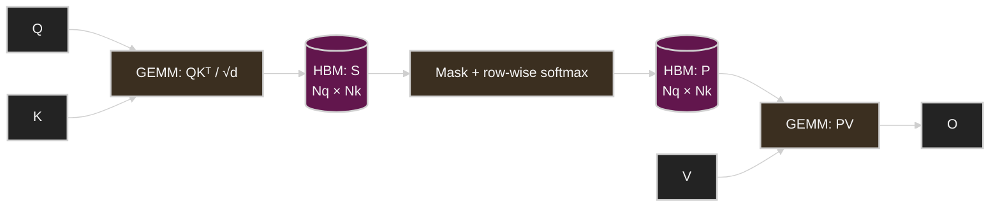
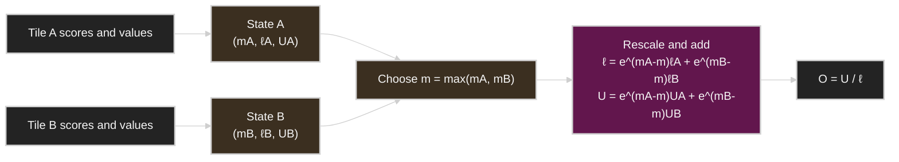
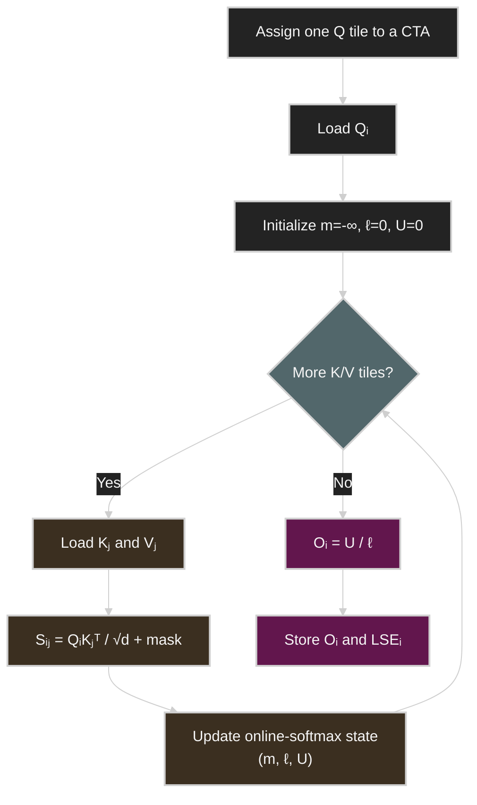
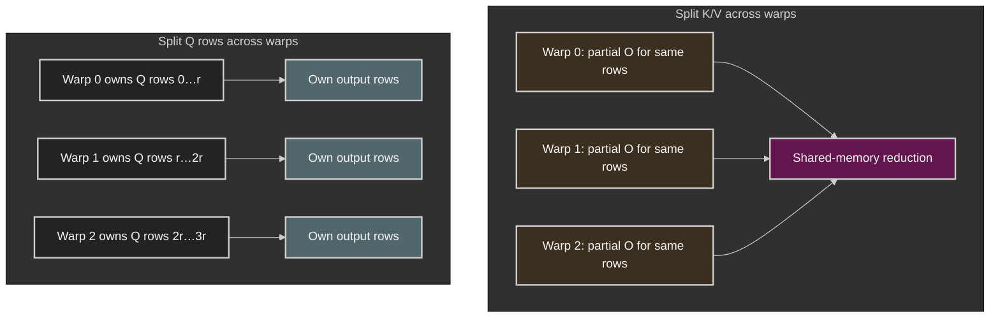
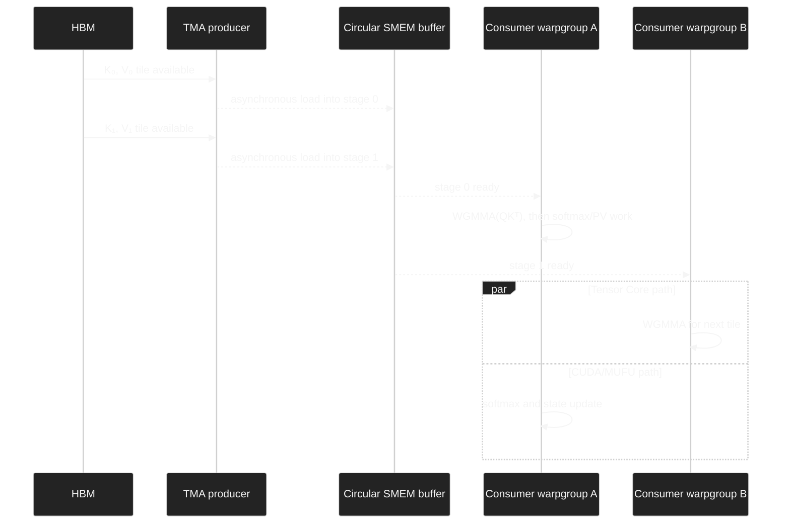
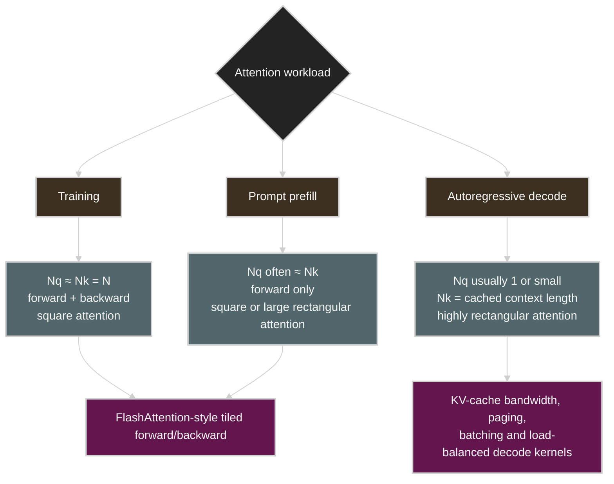

# FlashAttention from First Principles

> **How exact attention became an I/O, parallelism, and pipeline-design problem—from Ampere to Blackwell**

FlashAttention is often summarized as “a faster attention algorithm.” That is true, but incomplete. It is not a new attention mechanism, and it does not replace dense softmax attention with a sparse or low-rank approximation. Its deeper contribution is to ask a systems question:

> Given the same mathematical operator, how should we schedule its work so that the GPU spends less time moving intermediate data and more time using its compute units?

The answer evolved across four generations:

- **FlashAttention-1** made attention *I/O-aware*: tile the computation, fuse its stages, and never materialize the full score or probability matrix in high-bandwidth memory (HBM).
- **FlashAttention-2** improved the same algorithmic idea through better parallelism, less non-matrix arithmetic, and less communication between warps.
- **FlashAttention-3** redesigned the kernel around Hopper’s asynchronous Tensor Memory Accelerator (TMA), warpgroup matrix multiply-accumulate (WGMMA), and warp specialization.
- **FlashAttention-4** adapted the design to Blackwell, where Tensor Core throughput grew faster than shared-memory bandwidth and exponential-function throughput. It uses Tensor Memory (TMEM), larger asynchronous matrix operations, software-assisted exponentials, conditional rescaling, and 2-CTA cooperation.

The through-line is not merely “each version is faster.” It is **bottleneck migration**. Once one resource stops dominating, another becomes visible.

This chapter develops that story from the mathematics upward. It assumes familiarity with Transformers and basic GPU terminology, but derives the key online-softmax equations and connects them to concrete kernel-design choices.

---

## Reading map

1. [The attention operator](#1-the-attention-operator)
2. [Why the obvious implementation is expensive](#2-why-the-obvious-implementation-is-expensive)
3. [The mathematical key: mergeable online softmax](#3-the-mathematical-key-mergeable-online-softmax)
4. [A tiled exact-attention algorithm](#4-a-tiled-exact-attention-algorithm)
5. [FlashAttention-1: make HBM traffic a first-class concern](#5-flashattention-1-make-hbm-traffic-a-first-class-concern)
6. [FlashAttention-2: improve parallelism and work partitioning](#6-flashattention-2-improve-parallelism-and-work-partitioning)
7. [Why recomputation makes the backward pass cheaper](#7-why-recomputation-makes-the-backward-pass-cheaper)
8. [FlashAttention-3: pipeline the kernel for Hopper](#8-flashattention-3-pipeline-the-kernel-for-hopper)
9. [FlashAttention-4: rebalance the pipeline for Blackwell](#9-flashattention-4-rebalance-the-pipeline-for-blackwell)
10. [The evolution in one view](#10-the-evolution-in-one-view)
11. [What “exact attention” actually means](#11-what-exact-attention-actually-means)
12. [Training, prefill, and decode are different workloads](#12-training-prefill-and-decode-are-different-workloads)
13. [When FlashAttention helps—and when it may not](#13-when-flashattention-helpsand-when-it-may-not)
14. [How to benchmark attention without fooling yourself](#14-how-to-benchmark-attention-without-fooling-yourself)
15. [Common misconceptions](#15-common-misconceptions)
16. [A durable mental model](#16-a-durable-mental-model)

---

## 1. The attention operator

For one attention head, let

- $Q \in \mathbb{R}^{N_q \times d}$ be the query matrix,
- $K \in \mathbb{R}^{N_k \times d}$ be the key matrix,
- $V \in \mathbb{R}^{N_k \times d_v}$ be the value matrix.

Scaled dot-product attention is

$$
S = \frac{QK^\top}{\sqrt{d}} + \mathcal{M},
$$

$$
P = \operatorname{softmax}_{\text{row}}(S),
$$

$$
O = PV.
$$

$\mathcal{M}$ is an optional mask. For causal attention, invalid future positions receive $-\infty$ before the softmax.

If $d_v=d$, the two matrix multiplications require approximately

$$
2N_qN_kd + 2N_qN_kd = 4N_qN_kd
$$

floating-point operations per head. For self-attention during training or prompt prefill, $N_q \approx N_k = N$, so the arithmetic remains quadratic:

$$
\Theta(N^2d).
$$

FlashAttention does **not** remove this quadratic arithmetic for dense attention. Instead, it changes where the intermediate state lives, when it is produced, and how long it survives.

### The conventional dataflow

A straightforward implementation launches separate kernels:

1. GEMM for $QK^\top$,
2. softmax over the resulting rows,
3. GEMM for $PV$.



The equations are simple. The dataflow is not cheap.

---

## 2. Why the obvious implementation is expensive

### 2.1 The quadratic tensors are intermediates, not outputs

The score matrix $S$ and probability matrix $P$ both contain $N_qN_k$ elements. They are needed only as a bridge between the two GEMMs, yet a conventional multi-kernel implementation writes them to and reads them from HBM.

For an idealized BF16 example with $N=8192$:

$$
8192^2 \times 2\ \text{bytes} = 128\ \text{MiB}
$$

for **one** $N\times N$ matrix for **one** head. Merely writing both $S$ and $P$ once costs

$$
256\ \text{MiB per head}.
$$

With 32 heads, that becomes 8 GiB of writes per layer—before counting reads, masking, softmax statistics, temporary FP32 values, backward-pass state, or batch size. Real implementations vary, but the scale of the avoidable traffic is the point.


### 2.2 FLOPs alone do not predict time

A GPU has multiple memory and execution layers:

- **HBM / global memory:** large and shared by the device, but off-chip.
- **L2 cache:** on-chip and shared across SMs.
- **Shared memory / L1:** on-chip and local to an SM; explicitly managed in high-performance kernels.
- **Registers:** private to threads and extremely fast, but scarce.
- **TMEM on Blackwell:** a specialized on-chip store for Tensor Core accumulators.

CUDA maps thread blocks to SMs whose register files and shared-memory resources constrain residency and communication [10].

Performance depends on both arithmetic and data movement. A useful abstraction is arithmetic intensity:

$$
I = \frac{\text{FLOPs}}{\text{bytes moved through a limiting memory level}}.
$$

A simplified roofline bound is

$$
P_{\text{attainable}}
\leq
\min\left(P_{\text{peak}},\ B_{\text{memory}}\, I\right),
$$

where $P_{\text{peak}}$ is peak compute throughput and $B_{\text{memory}}$ is bandwidth at the memory level under consideration [9].

This explains an initially counterintuitive result: a kernel may execute **more** floating-point operations yet finish sooner if it avoids enough memory traffic. FlashAttention’s backward pass is a canonical example because it recomputes local score and probability tiles instead of loading a saved quadratic matrix.

### 2.3 Fusion is necessary, but fusion alone is not sufficient

One might say: “Just fuse the three kernels.” Fusion prevents the global write/read boundary between operators, but the fused kernel still needs a way to compute a row-wise softmax while seeing only one score tile at a time.

Softmax appears globally dependent:

$$
\operatorname{softmax}(s)_j
=
\frac{e^{s_j}}{\sum_t e^{s_t}}.
$$

The denominator depends on every key position in the row. Numerical stability also requires the row maximum:

$$
\operatorname{softmax}(s)_j
=
\frac{e^{s_j-m}}{\sum_t e^{s_t-m}},
\qquad
m=\max_t s_t.
$$

The crucial observation is that the required state can be updated and merged incrementally.

---

## 3. The mathematical key: mergeable online softmax

### 3.1 A sufficient state for one score segment

Consider one query row and a subset $A$ of its key positions. Let $s_j$ be the score and $v_j\in\mathbb{R}^{d_v}$ the corresponding value vector. Define three quantities:

$$
m_A = \max_{j\in A}s_j,
$$

$$
\ell_A = \sum_{j\in A} e^{s_j-m_A},
$$

$$
U_A = \sum_{j\in A} e^{s_j-m_A}v_j.
$$

The normalized attention output over $A$ is simply

$$
O_A = \frac{U_A}{\ell_A}.
$$

The state $(m_A,\ell_A,U_A)$ is sufficient: the individual probabilities do not have to survive.

### 3.2 Merging two independently processed segments

Suppose the row is split into disjoint segments $A$ and $B$. Their local maxima use different reference points, so first choose a common maximum:

$$
m = \max(m_A,m_B).
$$

Then rescale each local state into the common frame:

$$
\ell
=
 e^{m_A-m}\ell_A
+
 e^{m_B-m}\ell_B,
$$

$$
U
=
 e^{m_A-m}U_A
+
 e^{m_B-m}U_B.
$$

Finally,

$$
O = \frac{U}{\ell}.
$$

This is the core identity behind tiled exact attention. Every tile can be summarized by a small state, and states can be merged without storing the full probability row. It is closely related to the online normalizer for softmax [2].




### 3.3 Why the merge is correct

For $A$,

$$
e^{m_A-m}\ell_A
=
\sum_{j\in A}e^{m_A-m}e^{s_j-m_A}
=
\sum_{j\in A}e^{s_j-m}.
$$

The same holds for $B$. Therefore

$$
\ell
=
\sum_{j\in A\cup B}e^{s_j-m}.
$$

Likewise,

$$
U
=
\sum_{j\in A\cup B}e^{s_j-m}v_j.
$$

Dividing the two gives the stable softmax-weighted value sum over the union. In exact arithmetic, the partition and merge order do not change the mathematical result. Floating-point addition is not perfectly associative, so different schedules need not be bitwise identical; that distinction matters later.

### 3.4 A log-sum-exp form

After the final tile, the row’s log normalizer is

$$
L = m + \log \ell.
$$

This single value is enough to reconstruct a probability tile later:

$$
P_{ij}
=
\exp(S_{ij}-L_i).
$$

That observation becomes particularly useful in the backward pass and is explicitly exploited by FlashAttention-2 [4].

---

## 4. A tiled exact-attention algorithm

For clarity, the following pseudocode uses the query-outer organization associated with modern FlashAttention implementations. It omits layout transforms, vectorization, pipeline stages, dropout, and low-level synchronization.

```text
parallel for each batch, head, and query tile Qi:
    load Qi into on-chip memory

    m = -∞                     # one running maximum per query row
    l = 0                      # one running denominator per query row
    U = 0                      # one unnormalized output vector per query row

    for each key/value tile (Kj, Vj):
        load Kj and Vj into on-chip memory

        S = Qi @ Kjᵀ / sqrt(d)
        apply mask to S

        tile_max = rowmax(S)
        m_new = max(m, tile_max)

        alpha = exp(m - m_new)
        P_tilde = exp(S - m_new)

        l = alpha * l + rowsum(P_tilde)
        U = alpha[:, None] * U + P_tilde @ Vj
        m = m_new

    Oi = U / l[:, None]
    Li = m + log(l)

    store Oi and Li
```



### 4.1 What is on-chip at one moment?

A practical kernel tries to keep some combination of the following close to the SM:

- a tile of $Q$,
- one or more staged tiles of $K$ and $V$,
- a tile of scores or probabilities,
- the running output accumulator,
- row-wise maxima and normalizers,
- pipeline metadata and barriers.

The precise allocation differs by GPU generation. Registers may be ideal for arithmetic but can limit occupancy when each thread needs too many. Shared memory can stage reusable operands but has finite capacity and bank/bandwidth constraints. Blackwell adds TMEM, changing the feasible placement of Tensor Core accumulators.

### 4.2 Causal masking works at tile granularity

For causal self-attention:

- tiles entirely above the causal diagonal can be skipped,
- tiles entirely below it require no element-wise causal predicate,
- only tiles crossing the diagonal require fine-grained masking.

This both reduces arithmetic and avoids unnecessary control work. The exact gain depends on tile shape, sequence length, scheduler, and load balance; “half the matrix is masked” does not automatically mean a perfect $2\times$ end-to-end speedup.

---

## 5. FlashAttention-1: make HBM traffic a first-class concern

The original FlashAttention paper formalized attention as an I/O problem rather than only an arithmetic problem [3]. Its main ingredients were:

1. **Tiling:** operate on blocks that fit in on-chip SRAM.
2. **Kernel fusion:** combine score computation, masking, softmax, and value accumulation.
3. **Online softmax:** maintain row statistics while streaming over key/value tiles.
4. **Recomputation:** recreate local $S$ and $P$ tiles during backward instead of saving full matrices.

### 5.1 The original loop organization

FlashAttention-1’s forward algorithm places key/value blocks in the outer loop and query blocks in the inner loop. A $K_j,V_j$ tile is loaded once and used against many $Q_i$ tiles.

Because the algorithm revisits each query block for successive $K,V$ tiles, its running output and softmax state may be read from and written to HBM between iterations. This is still far cheaper than materializing full $N\times N$ score and probability matrices, and it matches the paper’s I/O model well.

Conceptually:

```text
for each KV tile j:
    load Kj, Vj
    for each Q tile i:
        load Qi and the running state for row block i
        compute/update the tile contribution
        store the updated running state
```

### 5.2 I/O complexity, not lower asymptotic arithmetic

Under the paper’s abstract memory model, with sequence length $N$, head dimension $d$, and on-chip SRAM capacity $M$ elements, standard materialized attention uses

$$
\Theta(Nd+N^2)
$$

HBM accesses, whereas FlashAttention uses

$$
\Theta\left(\frac{N^2d^2}{M}\right)
$$

for $d\leq M\leq Nd$ [3]. This is a theoretical model, not a direct byte count for every implementation, but it captures the central effect: larger useful tiles reduce repeated traffic.

The arithmetic remains

$$
\Theta(N^2d).
$$

This distinction is essential:

> FlashAttention removes quadratic **materialized intermediates**, not quadratic dense-attention **arithmetic**.

### 5.3 Why recomputation can be faster

Backward needs quantities derived from $S$ and $P$. The conventional response is to save them during forward. FlashAttention instead saves compact row statistics and recomputes each local tile after $Q$, $K$, and $V$ are already on-chip.

That trades inexpensive Tensor Core work for expensive global-memory traffic. On modern GPUs, this trade can improve both memory footprint and elapsed time.

### 5.4 What FA1 did not yet solve

Once the full $S$ and $P$ matrices stop crossing HBM, new inefficiencies become proportionally more important:

- non-matmul FP32 work for softmax state updates,
- insufficient grid parallelism for small batch/head counts,
- communication and reduction between warps,
- repeated movement of running state,
- register and shared-memory pressure.

These are the targets of FlashAttention-2.

---

## 6. FlashAttention-2: improve parallelism and work partitioning

FlashAttention-2 retained the same high-level tiled attention operator but reorganized work at three levels [4].

### 6.1 Reduce non-matmul work

Matrix multiplications map efficiently to Tensor Cores. Scalar FP32 operations—maxima, exponentials, scaling, divisions, address calculations, and reductions—run on other resources and can be disproportionately expensive.

FA2 simplifies the online-softmax update by maintaining an **unnormalized output numerator** and delaying the final division until all key/value tiles have been processed. It also stores one row-wise log-sum-exp value

$$
L_i=m_i+\log \ell_i
$$

for backward rather than separately storing both $m_i$ and $\ell_i$.

The state $(m,\ell)$ still exists during forward. What changes is the amount and form of state that must be persisted.

### 6.2 Parallelize over query blocks

If a kernel launches work only across batch and heads, a small batch with few heads may expose fewer independent CTAs than the GPU has SMs. FA2 adds the query-block dimension to the grid:

$$
\text{parallel work}
\sim
B \times H \times \left\lceil \frac{N_q}{B_r}\right\rceil.
$$

This matters especially for long sequences: even when $B\times H$ is small, many query tiles can execute independently.

The query-outer loop organization is conceptually:

```text
parallel for each Q tile i:
    load Qi once
    keep its running state on-chip
    for every KV tile j:
        update the state
    write Oi once
```

The exact amount retained on-chip depends on tile shape and implementation, but the organization enables better sequence-dimension parallelism and avoids repeatedly exchanging the same query-tile state with HBM.

### 6.3 Change how warps divide the tile

A CTA contains multiple warps. In the original work partition, warps could split the $K/V$ dimension and produce partial contributions to the same output rows. Those partial results then had to be combined through shared memory and synchronization—a split-K-style reduction.

FA2 instead gives different warps different query rows while allowing them to share $K$ and $V$. Each warp owns its output rows, so the forward path avoids the inter-warp reduction of partial output values.



This does **not** mean the entire kernel is synchronization-free. It removes a specific communication pattern in the forward work partition. Loads, pipeline handoffs, and other collective operations still require ordering and synchronization.

### 6.4 The tile-size tension

Larger tiles can:

- increase data reuse,
- reduce loop overhead,
- create larger Tensor Core operations,
- reduce repeated HBM transactions.

But they also consume more:

- registers,
- shared memory,
- accumulator storage,
- per-CTA resources.

If one CTA becomes too resource-heavy, fewer CTAs can reside on an SM. Occupancy falls, latency hiding weakens, and performance may decline. Kernel tuning is therefore a constrained optimization problem, not a rule that “larger tiles are always better.”

### 6.5 Reported throughput needs context

FA2 reported substantial gains over FA1 and reached a large fraction of A100 peak throughput in selected attention benchmarks [4]. Those numbers are valuable evidence, but they are not universal constants. Throughput depends on:

- GPU architecture,
- sequence and head dimensions,
- data type,
- causal versus non-causal attention,
- dropout,
- batch and head count,
- forward versus backward,
- library and compiler versions.

The durable lesson is the mechanism: after fixing HBM materialization, **parallelism and work partitioning** became the next major opportunity.

---

## 7. Why recomputation makes the backward pass cheaper

Let $G=dO$ be the upstream gradient. Ignoring masking notation for a moment:

$$
dV = P^\top G,
$$

$$
dP = GV^\top.
$$

For one softmax row, the Jacobian-vector product can be written as

$$
dS_i
=
P_i \odot \left(dP_i-D_i\mathbf{1}\right),
$$

where

$$
D_i
=
\sum_j P_{ij}dP_{ij}.
$$

Because $dP_{ij}=G_i^\top V_j$ and $O_i=\sum_j P_{ij}V_j$,

$$
D_i
=
G_i^\top O_i
=
\sum_k G_{ik}O_{ik}.
$$

Then

$$
dQ = \frac{dS\,K}{\sqrt d},
\qquad
 dK = \frac{dS^\top Q}{\sqrt d}.
$$

### 7.1 Reconstruct probabilities from compact state

With the saved row log-sum-exp $L_i$,

$$
P_{ij}=\exp\left(S_{ij}-L_i\right).
$$

Therefore a backward kernel can:

1. load $Q_i$, $K_j$, and $V_j$ tiles,
2. recompute $S_{ij}$,
3. reconstruct $P_{ij}$ locally,
4. compute local contributions to $dV$, $dQ$, and $dK$,
5. discard the tile.

There is no need to save an $N_q\times N_k$ probability matrix from forward.

### 7.2 Recomputation is not free—but HBM traffic is often more expensive

Backward performs additional matrix multiplication because $S$ and $P$ are recreated. For dense attention, the FA4 paper counts two forward matmuls and five backward matmuls per tile when recomputation is included [6]. Yet the extra compute is highly structured and maps well to Tensor Cores, while reading a giant saved probability tensor would stress HBM capacity and bandwidth.

The trade is characteristic of modern accelerator programming:

> Do not minimize FLOPs in isolation. Minimize time under the actual balance of compute, bandwidth, capacity, and synchronization.

### 7.3 Parallel reductions remain difficult

$dQ$, $dK$, and $dV$ do not all decompose identically. Depending on whether work is partitioned over query or key tiles, multiple CTAs may contribute to the same gradient block. Implementations must choose among:

- atomics,
- separate reduction kernels,
- cluster/distributed shared memory,
- fixed CTA pairing,
- deterministic accumulation schedules.

This becomes a central Blackwell optimization in FA4’s 2-CTA backward design.

---

## 8. FlashAttention-3: pipeline the kernel for Hopper

Hopper changes the kernel-design problem. H100 exposes hardware features that let data movement and matrix multiplication proceed asynchronously:

- **TMA** can move multidimensional tiles between global and shared memory with reduced producer-thread overhead.
- **WGMMA** lets a warpgroup—four contiguous warps, 128 threads—issue asynchronous matrix multiply-accumulate operations.
- **Warp specialization** assigns different warps or warpgroups distinct producer and consumer roles.

FA3 reorganizes attention to exploit these features rather than treating the GPU as a collection of symmetric threads [5,11].

### 8.1 Producer-consumer warp specialization

A conceptual FA3 CTA contains:

- a **producer** that initiates asynchronous TMA loads into a circular shared-memory buffer,
- one or more **consumer warpgroups** that issue WGMMA and perform softmax/output updates.



The circular buffer decouples the cadence of loading from the cadence of consuming. Correctness still requires barriers: the point is to make synchronization coordinate useful overlap rather than serialize every stage.

### 8.2 Ping-pong between GEMM and softmax

Attention alternates between operations that use different hardware resources:

- matrix multiplication on Tensor Cores,
- max/reduction/exponential/scaling on CUDA cores and special-function units.

If executed serially, a simplified tile time is

$$
T_{\text{serial}}
\approx
T_{\text{load}}+T_{QK}+T_{\text{softmax}}+T_{PV}.
$$

With effective pipelining, the steady-state bound moves toward the slowest overlapping resource path:

$$
T_{\text{steady}}
\gtrsim
\max\left(
T_{\text{memory}},
T_{\text{Tensor Core}},
T_{\text{softmax}}
\right),
$$

plus startup, drain, dependency, and synchronization overheads.

FA3 uses two consumer warpgroups in a ping-pong schedule: while one group performs softmax-related work for one output tile, another can drive asynchronous matrix operations for another. It also explores deeper intra-warpgroup pipelining. More stages can hide more latency but require more registers, so pipeline depth and tile size must be co-tuned.

### 8.3 Hopper’s register pressure

Hopper WGMMA accumulators live in registers. Large score and output tiles can therefore consume a substantial fraction of the register file. High register use can:

- limit resident warpgroups,
- reduce occupancy,
- cause spills,
- constrain pipeline depth.

This is not merely an implementation inconvenience. It shapes which overlapping schedules are physically possible.

### 8.4 FP8: speed and numerical behavior

FA3 also adds an FP8 path. FP8 is not “free exactness”: quantizing $Q$, $K$, and $V$ introduces error and layout constraints. FA3 addresses this with techniques including:

- **block quantization**, which uses finer-grained scales than one scale for an entire tensor,
- **incoherent processing**, which applies a norm-preserving transform such as a randomized Hadamard transform to spread outliers before quantization.

For an orthogonal transform $R$,

$$
(QR)(KR)^\top
=
QRR^\top K^\top
=
QK^\top.
$$

In exact arithmetic, the transform preserves the dot products while redistributing coordinate magnitudes. Quantization still introduces error, but the transformed values can be easier to represent with limited range.

FA3 reported up to roughly 740 TFLOP/s for FP16 on H100 and close to 1.2 PFLOP/s for its FP8 path in selected benchmarks, with lower numerical error than a per-tensor FP8 baseline [5]. These are kernel measurements under specific shapes, not guaranteed whole-model speedups.


---

## 9. FlashAttention-4: rebalance the pipeline for Blackwell

FlashAttention-4 is a 2026 preprint targeting Blackwell datacenter GPUs [6]. Its central observation is architectural asymmetry:

> Tensor Core throughput increased faster than several resources surrounding it.

On the B200 configuration analyzed in the paper, BF16 Tensor Core throughput roughly doubles relative to H100, while shared-memory read bandwidth and exponential-unit throughput do not increase at the same rate. A Hopper-optimized kernel can therefore become bottlenecked by operations that previously looked secondary.

### 9.1 Blackwell’s new execution substrate

Relevant Blackwell features include:

- **fifth-generation Tensor Core operations (`tcgen05`)**,
- **fully asynchronous MMA issue**,
- **larger MMA tiles**,
- **TMEM**, a dedicated on-chip memory for Tensor Core accumulators,
- **2-CTA MMA**, where a pair of CTAs cooperates on one larger matrix operation [12].

TMEM changes register economics. Instead of forcing large accumulators to occupy per-thread registers, Tensor Cores can read and write accumulator state in a specialized 256 KB-per-SM memory on the B200/GB200 architecture described by FA4 [6]. Registers are freed for softmax rows and pipeline bookkeeping, and larger tile schedules become feasible.

### 9.2 A new forward role decomposition

The FA4 forward kernel described in the paper uses four warpgroups with distinct responsibilities:

1. **two softmax warpgroups**, each processing rows from a different query tile,
2. **one correction warpgroup**, which handles output rescaling outside the softmax critical path,
3. **one control warpgroup**, which drives both Tensor Core operations and TMA transfers.

It is important not to count the Tensor Core driver and TMA producer as two separate groups in this design; one warpgroup drives both.

The larger Blackwell accumulator tile also changes row ownership. Each softmax thread can process an entire row, avoiding some cross-warp row reductions that were necessary under Hopper’s accumulator layout.

### 9.3 The exponential function becomes visible as a bottleneck

Softmax needs an exponential for every valid score. On B200/GB200 in the FA4 analysis, the multifunction unit (MUFU) provides far fewer exponential operations per cycle than Tensor Cores provide multiply-accumulate operations. Once matmul becomes sufficiently fast, `exp` can lie on the critical path.

FA4 supplements hardware exponentials with a software approximation of $2^x$. Range reduction writes

$$
2^x
=
2^{\lfloor x\rfloor}
2^{x-\lfloor x\rfloor}.
$$

The integer component can be constructed through exponent-bit manipulation, while the fractional component on $[0,1)$ is approximated by a polynomial evaluated with integer and FMA pipelines:

$$
2^f
\approx
p_0+p_1f+p_2f^2+\cdots+p_nf^n.
$$

This does not make the approximation mathematically identical to a correctly rounded exponential. The paper reports a larger raw FP32 relative error for its degree-3 polynomial than for the hardware MUFU, but after rounding to BF16, BF16 quantization dominates the observed error for the tested input range [6].

The systems idea is broader than this particular polynomial: use otherwise underutilized execution resources to raise effective throughput of an operation constrained by one specialized unit.

### 9.4 Conditional online-softmax rescaling

Ordinary online softmax rescales the accumulated denominator and output whenever the running maximum increases. If the new maximum is only slightly larger, the correction factor

$$
\alpha=e^{m_{\text{old}}-m_{\text{new}}}
$$

is close to one, yet applying it touches many values.

FA4 conditionally updates the reference scale only when the maximum change exceeds a threshold. When it does not, new terms are accumulated relative to the existing reference, while sufficient scale information is tracked for final normalization. This reduces rescaling work while preserving numerical accuracy at the target precision [6].

The right mental model is not “ignore an incorrect maximum and repair arbitrary error later.” It is “retain a valid older coordinate system for longer, then normalize consistently.”

### 9.5 Why 2-CTA cooperation helps backward

The backward pass contains five matmuls per tile when score/probability recomputation is included. On Blackwell, shared-memory traffic can become a larger fraction of time than Tensor Core arithmetic.

In 2-CTA MMA mode, a paired CTA arrangement can partition operands and accumulators so that each CTA stages only part of a shared operand. FA4 uses this capability to:

- reduce duplicated shared-memory traffic,
- support larger effective MMA tiles,
- restructure gradient accumulation,
- reduce some global atomic reductions for $dQ$.

This is a hardware-aware algorithmic change: the gradient schedule is reorganized because the architecture exposes CTA-pair cooperation and distributed on-chip communication.

### 9.6 Scheduling becomes part of the algorithm

Causal and variable-length workloads have unequal tile costs. A naive left-to-right launch order can leave a tail of long-running tiles after many SMs have gone idle.

FA4 applies longest-processing-time-first-inspired scheduling while also accounting for data reuse such as KV-head locality. For one BF16, head-dimension-128 experiment on H200, the preprint reports 4–8% gains for MHA and 7–14% for MQA-8 from its LPT ordering [6]. These values are platform- and shape-specific, but the lesson is general:

> Once a kernel is highly optimized internally, global work ordering and tail balance can materially affect throughput.

### 9.7 CuTe DSL is Python-authored, not Python-interpreted on the hot path

FA4 is written in CuTe DSL embedded in Python. The execution path is conceptually:


Python describes and specializes the kernel; the GPU does not interpret Python in the attention inner loop [13]. FA4 reports much shorter per-kernel compilation times than the previous C++ template implementation for the compared forward and backward kernels [6].

### 9.8 Performance claims must be scoped

FA4 reports up to 1613 TFLOP/s, about 71% of the theoretical B200 BF16 peak, and gains over cuDNN 9.13 and a Triton baseline under the paper’s benchmark configurations [6]. The same paper notes that newer cuDNN versions incorporated many related techniques and reached similar performance.

Treat such results as evidence that the design works—not as a timeless ranking across every shape, library version, GPU, or end-to-end model.

---

## 10. The evolution in one view


| Generation | Primary hardware context | Newly dominant problem | Main response |
|---|---|---|---|
| **FA1** | Ampere-era GPUs | Quadratic intermediates crossing HBM | Tiling, fusion, online softmax, backward recomputation |
| **FA2** | Ampere/Ada/Hopper-compatible design | Non-matmul overhead, weak sequence parallelism, inter-warp communication | Query-block parallelism, simpler state updates, split-Q-style warp ownership |
| **FA3** | Hopper H100 | Inability to overlap loads, Tensor Cores, and softmax effectively | TMA, WGMMA, warp specialization, circular buffers, ping-pong scheduling, FP8 path |
| **FA4** | Blackwell B200/GB200 | Tensor Cores outpace exponentials and shared-memory movement | TMEM, larger async MMA, software-assisted exp, conditional rescaling, 2-CTA backward, improved scheduling |

A useful abstraction is:

$$
\text{Optimization target}
:
\text{HBM}
\rightarrow
\text{parallelism/communication}
\rightarrow
\text{pipeline overlap}
\rightarrow
\text{non-MMA and on-chip bandwidth}.
$$

This arrow is not a claim that old bottlenecks disappear. All of them still exist. Their **relative weight** changes with architecture, shape, and implementation.

---

## 11. What “exact attention” actually means

The word *exact* is easy to overinterpret.

### 11.1 Algorithmic exactness

For FA1 and FA2, “exact attention” means the operator is still

$$
O=\operatorname{softmax}\left(\frac{QK^\top}{\sqrt d}+\mathcal{M}\right)V,
$$

not a sparse, low-rank, kernelized, or otherwise structurally approximated substitute [3,4]. Tiling and online reduction are algebraic reorganizations of the same dense computation.

### 11.2 Not bitwise identity

Floating-point addition is order-dependent:

$$
(a+b)+c \neq a+(b+c)
$$

in general at finite precision. Different tile sizes, reduction trees, instruction choices, and accumulation orders can produce slightly different low-order bits. A correct kernel is normally validated against a reference within dtype-appropriate tolerances, not by demanding identical bit patterns.

### 11.3 Low precision and function approximation add another layer

- FA3’s FP8 path quantizes values and therefore introduces quantization error, even though the underlying attention structure is unchanged.
- FA4’s software exponential uses a polynomial approximation on part of the workload and therefore is not identical to the hardware exponential in raw FP32.
- The relevant engineering question is whether the resulting error is acceptable after accumulation and rounding at the target precision.

A precise formulation is:

> FlashAttention is algorithmically exact dense attention; particular low-precision or approximate-function implementations are numerically close within a measured error regime, not mathematically or bitwise identical in every configuration.

---

## 12. Training, prefill, and decode are different workloads

A frequent conceptual mistake is to apply the $N\times N$ training picture to one-token autoregressive decoding.



### 12.1 Training

Training typically has many queries and keys, often $N_q=N_k=N$, and requires backward. Avoiding $N^2$ saved intermediates is enormously valuable for both memory and speed.

### 12.2 Prompt prefill

During prefill, a model processes many prompt tokens together. Attention is again square or substantially rectangular, so FlashAttention’s fused tiled dataflow is highly relevant. There is no backward in ordinary inference, but the large score domain still makes materialization expensive.

### 12.3 Decode

At one decode step, a new query attends to cached keys and values:

$$
Q\in\mathbb{R}^{1\times d},
\qquad
K,V\in\mathbb{R}^{N_k\times d}.
$$

The score tensor per head is $1\times N_k$, not $N_k\times N_k$. The dominant cost is often reading a long KV cache with too little query work to fully reuse those bytes. Serving performance also depends on:

- paged KV-cache allocation,
- fragmentation and memory utilization,
- continuous batching,
- grouped-query or multi-query attention,
- split-KV/load-balanced kernels,
- request-length variability,
- prefix caching,
- distributed communication.

PagedAttention [7] and FlashInfer [8] address this serving-centered problem space. They are related to, but not interchangeable with, the square-attention optimization story.

Across an entire generated sequence, decode work still grows as the context length grows. The correction is narrower: **one token does not materialize an $N\times N$ matrix.**

---

## 13. When FlashAttention helps—and when it may not

### Strong-fit cases

FlashAttention is usually compelling when:

- sequence lengths are medium or long,
- training needs backward and activation memory matters,
- prefill contains many query tokens,
- head dimensions and dtypes match tuned kernel paths,
- causal/block masks allow whole tiles to be skipped,
- the framework would otherwise materialize large intermediates.

### Cases where gains can shrink

The advantage may be smaller when:

- sequences are so short that launch and setup overhead dominate,
- decode has $N_q=1$ and KV-cache reads dominate,
- tensor shapes fall outside well-tuned tile configurations,
- unusual masks or biases require extra control flow,
- deterministic accumulation imposes additional constraints,
- the rest of the Transformer layer dominates end-to-end latency,
- communication across GPUs is the limiting resource,
- a newer vendor library already includes comparable techniques.

### Version numbers are not a universal dispatch policy

“FA4” does not simply mean “use this everywhere instead of FA3 or FA2.” Kernels are architecture-specific:

- Hopper WGMMA and Blackwell `tcgen05` are different instruction families.
- TMEM exists on Blackwell, not Ampere.
- tile shapes that work on B200 may be impossible or suboptimal on H100.
- library dispatchers select implementations based on architecture, dtype, head dimension, mask, sequence shape, and feature support.

The correct question is not “Which FlashAttention version is newest?” but:

> Which kernel schedule best matches this operator shape and this GPU’s resource balance?

---

## 14. How to benchmark attention without fooling yourself

### 14.1 Record the complete shape

At minimum:

- batch size,
- query length $N_q$,
- key/value length $N_k$,
- number of query heads,
- number of KV heads,
- query/key head dimension,
- value head dimension,
- causal or non-causal,
- fixed or variable length,
- dtype and accumulation dtype,
- dropout and bias features.

A headline TFLOP/s value without these details is not reproducible.

### 14.2 Distinguish kernel time from end-to-end model time

A $1.5\times$ faster attention kernel does not imply a $1.5\times$ faster model. If attention is fraction $f$ of the original runtime and is sped up by factor $s$, Amdahl’s law gives

$$
S_{\text{model}}
=
\frac{1}{(1-f)+f/s}.
$$

For $f=0.4$ and $s=1.5$,

$$
S_{\text{model}}
=
\frac{1}{0.6+0.4/1.5}
\approx 1.15.
$$

The model improves by about 15%, not 50%.

### 14.3 Report memory as well as time

For training, reduced activation memory may be as important as kernel latency. It can enable:

- longer context,
- larger batch size,
- fewer activation checkpoints,
- fewer out-of-memory failures,
- different parallelism choices.

### 14.4 Warm up and separate compilation

JIT-based systems may compile or autotune on first use. Measure separately:

- first-call latency,
- compilation/autotuning time,
- warm steady-state kernel latency,
- repeated end-to-end latency.

### 14.5 Use the right throughput denominator

Attention papers often report “effective TFLOP/s” using analytical operation counts. For non-causal forward with $d_v=d$:

$$
\text{FLOPs}\approx 4N_qN_kdBH.
$$

For causal square attention, some benchmarks count only the approximately triangular valid region. Backward may be estimated as a multiple of forward based on the number of matmuls. Verify the counting convention before comparing charts.

### 14.6 Inspect the resource bottleneck

Useful profiling questions include:

- Is the kernel limited by HBM or L2 traffic?
- Are Tensor Cores busy?
- Is shared-memory bandwidth saturated?
- Are special-function units on the critical path?
- Is register pressure reducing occupancy?
- Are there long barrier stalls?
- Is the final wave of CTAs poorly balanced?
- Are atomics or cross-CTA reductions dominant?

A single utilization percentage rarely tells the whole story.

---

## 15. Common misconceptions

### “FlashAttention makes dense attention linear-time.”

No. It keeps dense attention’s $\Theta(N^2d)$ arithmetic while reducing materialized intermediates and HBM traffic.

### “It is just a fused kernel.”

Fusion is part of it. The harder ingredient is a numerically stable, mergeable online-softmax state that makes streaming fusion possible.

### “It stores no attention-related state.”

It stores compact row statistics and output state. It avoids storing the full $N_q\times N_k$ score/probability matrices.

### “Recomputation is always wasteful.”

Not when recomputed operations are cheap relative to loading a much larger saved tensor from HBM.

### “FA2 eliminated all synchronization.”

It removed a costly inter-warp reduction pattern in the forward work partition. Modern asynchronous pipelines still rely on explicit synchronization and barriers.

### “Exact means bitwise identical.”

It means no structural approximation to the dense attention operator. Floating-point scheduling, FP8 quantization, and polynomial exponentials can change low-order numerical results.

### “One generated token performs an $N\times N$ attention.”

Ordinary decode uses a small query length—often one—against an $N$-token KV cache. It is a different, memory-dominated shape.

### “The newest version is always fastest.”

Architecture, shape, dtype, feature support, and library version determine which kernel wins.

### “Peak TFLOP/s equals application speedup.”

Kernel throughput is only one component of end-to-end training or serving time.

---

## 16. A durable mental model

FlashAttention can be understood as a sequence of increasingly hardware-specific answers to one question:

> What is the smallest state that must survive while the full attention result is constructed?

At the mathematical level, the answer is a mergeable online-softmax state:

$$
(m,\ell,U).
$$

At the memory-system level, the goal is to keep score and probability **tiles** on-chip and avoid materializing their full quadratic matrices in HBM.

At the parallel-programming level, the challenge is to assign tiles to CTAs and rows to warps without unnecessary reductions or idle SMs.

At the pipeline level, the challenge is to overlap:

- global-to-shared movement,
- Tensor Core matrix multiplication,
- softmax reductions and exponentials,
- output correction,
- shared-to-global epilogues.

At the architecture level, every GPU generation changes the feasible schedule:

- Ampere made HBM avoidance the headline.
- Better work partitioning exposed more parallelism.
- Hopper made asynchronous producer-consumer pipelines practical.
- Blackwell moved accumulators into TMEM and made exponentials and shared-memory traffic comparatively more expensive.

The most reusable lesson extends beyond attention:

> High-performance ML systems are built by co-designing algebra, memory movement, parallel decomposition, and hardware pipelines. Big-O complexity tells only part of the story; the execution schedule determines whether the silicon can realize the mathematics efficiently.

---

## References

1. Vaswani, A. et al. **Attention Is All You Need.** NeurIPS, 2017. [arXiv:1706.03762](https://arxiv.org/abs/1706.03762)
2. Milakov, M. and Gimelshein, N. **Online Normalizer Calculation for Softmax.** arXiv, 2018. [arXiv:1805.02867](https://arxiv.org/abs/1805.02867)
3. Dao, T. et al. **FlashAttention: Fast and Memory-Efficient Exact Attention with IO-Awareness.** NeurIPS, 2022. [arXiv:2205.14135](https://arxiv.org/abs/2205.14135)
4. Dao, T. **FlashAttention-2: Faster Attention with Better Parallelism and Work Partitioning.** ICLR, 2024. [arXiv:2307.08691](https://arxiv.org/abs/2307.08691)
5. Shah, J. et al. **FlashAttention-3: Fast and Accurate Attention with Asynchrony and Low-Precision.** NeurIPS, 2024. [arXiv:2407.08608](https://arxiv.org/abs/2407.08608)
6. Zadouri, T. et al. **FlashAttention-4: Algorithm and Kernel Pipelining Co-Design for Asymmetric Hardware Scaling.** arXiv preprint, 2026. [arXiv:2603.05451](https://arxiv.org/abs/2603.05451)
7. Kwon, W. et al. **Efficient Memory Management for Large Language Model Serving with PagedAttention.** SOSP, 2023. [arXiv:2309.06180](https://arxiv.org/abs/2309.06180)
8. Ye, Z. et al. **FlashInfer: Efficient and Customizable Attention Engine for LLM Inference Serving.** MLSys, 2025. [arXiv:2501.01005](https://arxiv.org/abs/2501.01005)
9. Williams, S., Waterman, A., and Patterson, D. **Roofline: An Insightful Visual Performance Model for Multicore Architectures.** Communications of the ACM, 2009. [DOI:10.1145/1498765.1498785](https://doi.org/10.1145/1498765.1498785)
10. NVIDIA. **CUDA Programming Guide: Programming Model.** [Official documentation](https://docs.nvidia.com/cuda/cuda-programming-guide/01-introduction/programming-model.html)
11. NVIDIA. **Warpgroup MMA Programming Guide.** [CUTLASS documentation](https://docs.nvidia.com/cutlass/latest/media/docs/pythonDSL/mma_docs/wgmma_programming.html)
12. NVIDIA. **tcgen05 MMA Programming Guide.** [CUTLASS documentation](https://docs.nvidia.com/cutlass/latest/media/docs/pythonDSL/guides/mma/tcgen05_programming.html)
13. NVIDIA. **CuTe DSL Introduction.** [CUTLASS documentation](https://docs.nvidia.com/cutlass/latest/media/docs/pythonDSL/cute_dsl_general/dsl_introduction.html)

---

### Suggested citation

```bibtex
@article{flashattention_from_first_principles_2026,
  title   = {FlashAttention from First Principles: How Exact Attention Became an I/O, Parallelism, and Pipeline-Design Problem},
  year    = {2026},
  note    = {Technical tutorial}
}
```
