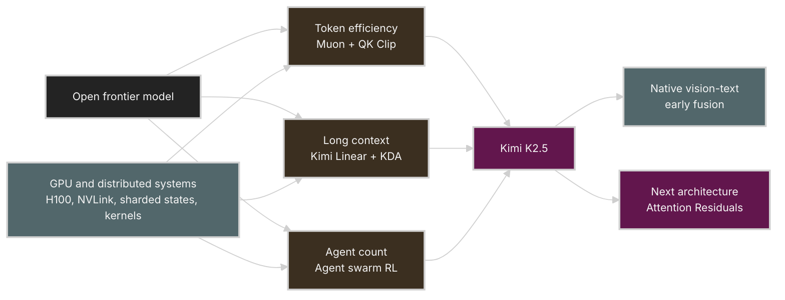
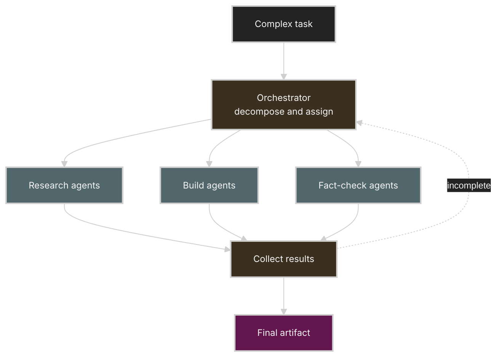

# How We Scaled Kimi K2.5: 토큰 효율, 장문 컨텍스트, 에이전트 스웜

Source: [How We Scaled Kimi K2.5 | Zhilin Yang's full GTC 2026 Keynote](https://www.youtube.com/watch?v=CwePo4847ho)

* Speaker: Zhilin Yang, Kimi 공동창업자 겸 CEO
* Channel: Kimi AI
* Duration: 39분 32초

Related note:

* [Kimi K3 기술 해부: 2.8T MoE, KDA, Attention Residuals, 그리고 64-GPU 서빙](kimi-k3.md)

> 이 문서는 발표 영상의 영어 자동 자막을 바탕으로 재구성한 강의 노트다. 자동 자막의 `Meow`, `Neon` 표기는 발표 맥락에 맞춰 `Muon`, `MuonClip`으로 정규화했다. Kimi Linear의 attention 혼합 비율처럼 자막만으로 확정하기 어려운 값은 숫자를 단정하지 않았다.

## Table of Contents

* [Goal](#goal)
* [Lecture Overview](#lecture-overview)
* [Visual Map](#visual-map)
* [Why Three Scaling Dimensions](#why-three-scaling-dimensions)
* [Scaling Dimension 1: Token Efficiency](#scaling-dimension-1-token-efficiency)
* [Scaling Muon to Trillion-Parameter Training](#scaling-muon-to-trillion-parameter-training)
* [Scaling Dimension 2: Long Context](#scaling-dimension-2-long-context)
* [Kimi Linear and Kimi Delta Attention](#kimi-linear-and-kimi-delta-attention)
* [GPU-Efficient KDA Implementation](#gpu-efficient-kda-implementation)
* [Scaling Dimension 3: Agent Swarms](#scaling-dimension-3-agent-swarms)
* [Learning to Orchestrate Agent Swarms](#learning-to-orchestrate-agent-swarms)
* [Kimi K2.5 as an Integrated System](#kimi-k25-as-an-integrated-system)
* [Native Vision-Text Early Fusion](#native-vision-text-early-fusion)
* [Attention Residuals](#attention-residuals)
* [GPU and AI Systems Lens](#gpu-and-ai-systems-lens)
* [Practical Tips and Notes](#practical-tips-and-notes)
* [Lecture Summary](#lecture-summary)
* [Key Terms](#key-terms)
* [Questions](#questions)
* [Answers](#answers)

---

## Goal

이 발표의 목표는 Kimi K2.5를 단순히 parameter와 training token을 늘린 모델이 아니라, 서로 다른 세 축을 함께 확장한 결과로 이해하는 것이다.

핵심 메시지는 다음과 같다.

> Frontier model의 발전은 계산량을 늘리는 한 가지 축만으로 설명되지 않는다. 같은 data에서 더 많이 학습하는 token efficiency, 더 오래 기억하고 작업하는 context length, 복잡한 일을 병렬로 분해하는 agent count를 함께 확장해야 한다. 이 세 축을 실제 모델로 연결하려면 optimizer, architecture, GPU kernel, distributed training, reinforcement learning infrastructure를 공동 설계해야 한다.

발표는 다음을 다룬다.

* Open model과 intelligence democratization
* Scaling law와 token efficiency의 관계
* Muon optimizer의 장점과 distributed implementation
* Trillion-parameter 학습에서 발생한 logit explosion과 QK Clip
* Transformer가 long context에서 갖는 이점
* Kimi Linear와 Kimi Delta Attention
* Chunk-wise KDA의 GPU 구현
* Orchestrator와 sub-agent로 구성된 agent swarm
* Agent swarm RL을 위한 세 가지 reward
* Kimi K2.5의 안정적인 pre-training과 H100 cluster
* Vision-text early fusion과 emergent vision-to-code
* Residual connection을 depth attention으로 확장한 Attention Residuals

## Lecture Overview

발표는 open model의 의미에서 출발한다. Open model은 local server나 cloud 어디에나 배포할 수 있고, 사용자는 black box API에만 의존하지 않고 model weight 전체를 다룰 수 있다. 그러나 발표자가 강조하는 것은 “open”만으로 충분하지 않다는 점이다. Open model이 실제로 intelligence를 더 널리 보급하려면 frontier 수준의 capability도 갖춰야 한다. (`00:26`–`01:24`)

이를 위해 발표는 scaling을 세 차원으로 나눈다.

| Scaling dimension | 핵심 질문 | Kimi의 접근 |
| --- | --- | --- |
| Token efficiency | 같은 training token으로 더 낮은 loss를 얻을 수 있는가? | Muon/MuonClip, QK Clip |
| Context length | 더 긴 문맥을 효율적으로 사용하며 token loss를 낮출 수 있는가? | Kimi Linear, Kimi Delta Attention |
| Number of agents | 복잡한 task를 병렬 subtask로 분해할 수 있는가? | Agent swarm, orchestration RL |

첫 번째 축에서 중요한 것은 token efficiency가 단순한 비용 절감 수단이 아니라 intelligence의 상한을 높이는 방법이라는 주장이다. 고품질 data가 유한하다면, 같은 token에서 두 배 더 효율적으로 학습하는 optimizer는 제한된 data로부터 더 많은 capability를 추출한다.

두 번째 축은 long context다. 발표자는 context가 길어질수록 더 복잡하고 오래 실행되는 agent task를 처리할 수 있다고 본다. Kimi Delta Attention은 recurrent memory의 decay를 channel별로 제어해 오래 보존할 정보와 빠르게 갱신할 정보를 분리하고, chunk-wise formulation으로 이를 GPU에서 병렬 실행한다.

세 번째 축은 agent swarm이다. 하나의 agent가 모든 일을 직렬로 처리하는 대신, orchestrator가 여러 sub-agent를 만들고 task를 분배한 뒤 결과를 수집한다. 이 구조는 input reading, output writing, action execution을 병렬화하지만, 의미 없는 subtask를 남발하거나 완료하지 않는 문제도 만든다. 발표는 이를 다루기 위해 instantiation, finished, outcome reward를 함께 사용한다.

후반부에서는 이 기술들이 Kimi K2.5에 어떻게 합쳐졌는지를 설명한다. 발표자는 안정적인 large-scale pre-training, vision과 text의 day-one early fusion, vision-to-code capability를 주요 결과로 제시한다. 마지막에는 residual connection을 depth 방향의 recurrent relation으로 보고, 이전 모든 layer representation을 attention으로 조합하는 Attention Residuals를 차세대 architecture로 소개한다.

## Visual Map

발표의 전체 구조는 세 scaling dimension과 이를 뒷받침하는 systems layer의 결합으로 볼 수 있다.



이 그림에서 중요한 점은 optimizer와 architecture만 따로 존재하지 않는다는 것이다. Muon state sharding, KDA의 exact chunk-wise reformulation, parallel agent execution infrastructure처럼 각 algorithmic idea는 실제 GPU cluster에서 효율적으로 실행할 수 있는 systems work를 필요로 한다.

## Why Three Scaling Dimensions

### Open model은 접근성과 성능을 모두 요구한다

발표자는 open model이 다음 세 가지 접근 방식을 가능하게 한다고 설명한다.

* Local server에 직접 배포
* Cloud infrastructure에 배포
* Model weight 전체에 접근하여 분석·수정·최적화

이러한 접근성은 proprietary black-box model과 구별되는 장점이다. 하지만 성능 격차가 크면 실제 선택지가 되기 어렵다. 따라서 open model의 목표는 weight 공개 자체가 아니라, frontier와의 capability gap을 좁히면서 intelligence를 더 많은 사용자와 환경에 배포할 수 있게 하는 것이다.

### Scaling law를 왼쪽으로 이동시킨다

일반적인 scaling law 관점에서는 training token, parameter, compute를 함께 늘리면 loss가 감소한다. Kimi가 관심을 두는 것은 같은 token 수에서 loss를 더 낮추는 것이다.

```text
standard scaling
more tokens + more parameters + more compute
  -> lower loss

token-efficient scaling
same number of tokens
  -> better optimizer and architecture
  -> lower loss
```

Loss 대 training token curve로 표현하면, token efficiency 향상은 curve 자체를 왼쪽으로 옮기는 효과다. 같은 목표 loss에 더 적은 token이 필요하거나, 같은 token budget에서 더 낮은 loss를 얻는다. (`01:45`–`02:31`)

### Agent 관점에서 다시 해석하기

발표자는 세 scaling dimension을 agent system의 언어로 다시 설명한다.

| Model scaling | Agent-system interpretation |
| --- | --- |
| Token efficiency | Agent RL이 더 좋은 solution을 찾기 전에 더 강한 prior를 제공한다 |
| Long context | Agent가 days, weeks, months 수준의 더 긴 trajectory를 유지할 가능성을 연다 |
| Agent swarm | 여러 agent가 subtask를 병렬로 처리해 task complexity를 확장한다 |

최종적으로 지향하는 것은 강한 prior와 긴 context를 가진 agent 여러 개가 협업하는 구조다. 즉 single-model scaling에서 long-running multi-agent system scaling으로 관점이 확장된다. (`03:08`–`04:13`)

## Scaling Dimension 1: Token Efficiency

### Token efficiency는 data wall에 대한 대응이다

발표자는 50T개의 high-quality token이 있고, 새로운 optimizer가 2배의 token efficiency를 제공한다고 가정한다. 이 경우 물리적으로 data가 늘어난 것은 아니지만, 학습 효과는 100T개의 token을 사용한 것과 비슷하게 해석할 수 있다는 예를 든다.

이 비유의 핵심은 다음과 같다.

* 고품질 data는 무한히 만들 수 없다.
* Data가 고정되어 있다면 compute만 늘려 같은 data를 반복하는 데 한계가 있다.
* 같은 data로 더 낮은 loss를 얻는 방법은 infrastructure cost뿐 아니라 achievable intelligence에도 영향을 준다.

따라서 token efficiency는 “같은 모델을 싸게 학습한다”는 의미에 그치지 않고, 제한된 data로 도달 가능한 성능을 높이는 문제다. (`04:19`–`06:09`)

### Muon optimizer

발표에서는 Muon을 Adam 계열과 다른 update geometry를 사용하는 optimizer로 소개한다. Gradient로부터 만든 update matrix에 orthogonalization을 적용하는 것이 핵심 아이디어다.

발표자가 제시한 효과와 구현 조건은 다음과 같다.

| 항목 | 발표 내용 |
| --- | --- |
| 목표 | AdamW보다 높은 token efficiency |
| 보고된 개선 | 올바르게 구현했을 때 약 2배 token efficiency |
| Scaling에 중요한 요소 | Weight decay |
| Update calibration | Adam과 비교 가능한 RMS update를 유지하도록 coefficient 조정 |
| Distributed memory | Optimizer state를 data-parallel group에 partition |

동일한 parameter 수와 training token 수에서 AdamW를 Muon으로 교체한 실험이 여러 benchmark의 성능을 개선했다고 발표자는 설명한다. 중요한 비교 조건은 model과 data budget을 그대로 두고 optimizer만 바꿨다는 점이다. (`06:18`–`08:01`)

### Distributed Muon

Large model optimizer는 update rule만 좋아서는 충분하지 않다. Optimizer state가 GPU마다 중복되면 parameter가 커질수록 memory overhead가 빠르게 증가한다. Kimi 팀은 Muon state를 data-parallel group 전체에 나누어 보관하는 distributed implementation을 개발했다.

```text
unsharded optimizer state
GPU 0: all states
GPU 1: all states
GPU 2: all states
...

distributed Muon state
GPU 0: state shard 0
GPU 1: state shard 1
GPU 2: state shard 2
...
```

이 설계는 optimizer innovation이 distributed systems 문제와 직접 연결된다는 사례다. Token efficiency가 좋아도 optimizer state 때문에 원하는 model scale에 도달하지 못하면 실제 frontier training에는 사용할 수 없다.

## Scaling Muon to Trillion-Parameter Training

### 새로운 scale에서 나타난 instability

Muon을 약 1T-parameter model로 확장하자 작은 실험에서는 보이지 않던 training instability가 발생했다. 발표에서는 attention max logit이 빠르게 증가해 1,000을 넘고, training loss가 잠시 감소하다가 폭발하는 현상을 보여준다.

| 관찰값 | 정상적으로 기대한 범위 | Instability에서 관찰한 값 |
| --- | --- | --- |
| Attention max logit | 약 50, 또는 100 미만 | 빠르게 1,000 초과 |
| Training loss | 지속적으로 감소 | 감소 후 발산 |

이는 small-scale optimizer result를 그대로 large-scale training에 적용할 수 없다는 점을 보여준다. 평균 loss만 관찰하면 이상을 늦게 발견할 수 있고, attention 내부의 extreme statistic을 함께 추적해야 한다. (`08:04`–`08:58`)

### QK Clip

Kimi 팀의 해결책은 QK Clip이다. Forward pass에서 attention head별 max logit을 계산하고, 이를 바탕으로 query와 key projection에 적용할 scaling factor를 구한다. Max logit이 정해진 범위를 벗어나지 않도록 Q와 K를 함께 조절하는 방식이다.

```text
Q, K projections
  -> attention logits
  -> per-head max logit
  -> derive scaling factor
  -> rescale Q and K
  -> constrain extreme logit
```

발표의 실험에서는 clip 적용 전후 training loss curve가 거의 겹쳤다. 즉 loss 감소 속도는 유지하면서 max logit만 제한했다. Max logit은 초기에 threshold 100 부근에서 제한되다가, 일정 step 이후 model이 안정적인 영역을 찾아 자연스럽게 감소했다. (`09:02`–`10:39`)

여기서 중요한 해석은 단순히 output을 잘라내는 것이 아니다. Q와 K projection을 조절해 attention logit이 폭발하는 내부 dynamics를 제한하면서도 optimization trajectory의 유용한 부분은 보존하려는 안정화 장치다.

### Kimi K2 training에 적용

발표자는 이 기법을 Kimi K2 학습에 적용하여 Muon 기반 training을 약 1T parameter 규모로 확장했다고 설명한다. 이 성과는 발표자의 주장으로 이해해야 하며, 실무적으로는 다음 교훈이 더 중요하다.

* Optimizer의 효율 향상은 scale-dependent instability를 동반할 수 있다.
* Loss 외에도 max logit 같은 내부 statistic이 early warning signal이 된다.
* Stability fix는 convergence를 훼손하지 않는지 controlled experiment로 확인해야 한다.
* Optimizer state partitioning과 numerical stabilization은 함께 해결해야 한다.

## Scaling Dimension 2: Long Context

### Context length는 단순한 input limit이 아니다

발표는 Transformer와 LSTM의 차이를 두 관점에서 설명한다.

1. 같은 parameter와 training token에서 Transformer가 더 낮은 전체 loss를 보인다.
2. Context 안의 token index가 뒤로 갈수록 Transformer의 loss가 계속 감소하지만, LSTM은 일정 지점 이후 개선이 포화된다.

두 번째 관찰이 특히 중요하다. Transformer는 더 긴 앞 문맥을 실제 prediction에 활용하는 능력이 있고, 이것이 translation보다 훨씬 긴 dependency를 요구하는 codebase understanding이나 long-running agent trajectory에 필요하다는 주장이다. (`10:58`–`12:58`)

```text
short task
  sentence or local sequence

long-context task
  repository-wide code understanding
  long agent trajectory
  complex artifact built over many steps
```

발표자는 미래 agent가 days, weeks, months 동안 실행될 가능성을 언급한다. Context scaling의 목표는 단순히 더 많은 token을 window 안에 넣는 것이 아니라, 뒤쪽 token에서도 과거 정보를 활용해 per-token loss를 계속 낮추는 것이다.

### Full attention의 효율 문제

Full attention은 긴 과거에 직접 접근할 수 있지만 context가 늘어날수록 computation과 memory 부담이 커진다. Long context model이 실제 agent system에서 사용되려면 다음 조건을 함께 만족해야 한다.

* 긴 거리의 정보를 유지할 수 있어야 한다.
* 불필요한 과거 정보는 잊고 새로운 정보를 기록할 수 있어야 한다.
* GPU에서 training을 병렬화할 수 있어야 한다.
* Short-context capability를 희생하지 않아야 한다.

Kimi Linear는 이 요구를 해결하기 위해 Kimi Delta Attention과 full attention을 혼합한다.

## Kimi Linear and Kimi Delta Attention

### Linear attention의 recurrent memory

Linear attention은 과거 token 전체의 K/V를 매번 직접 조회하는 대신, 과거 정보를 recurrent state에 압축한다. 새 token이 들어오면 state를 갱신하고 query로 현재 output을 읽는다.

단순화하면 다음과 같이 볼 수 있다.

$$
S_t =
\left(I-\beta_t k_tk_t^\top\right)
\operatorname{Diag}(\alpha_t)S_{t-1}
+\beta_t k_tv_t^\top
$$

$$
o_t=S_t^\top q_t
$$

여기서 $\alpha_t$는 과거 state를 얼마나 유지할지를 제어하고, $\beta_t$는 현재 key-value 관계로 memory를 얼마나 갱신할지를 제어한다.

### Scalar decay의 한계

발표에서 기존 linear attention의 문제로 강조하는 것은 global decay factor다. 하나의 scalar가 memory 전체에 적용되면 model의 선택지는 거칠어진다.

| Decay behavior | 결과 |
| --- | --- |
| 빠른 global decay | 오래된 정보 대부분을 잊는다 |
| 느린 global decay | 필요 없는 정보까지 계속 유지한다 |

Long context에는 서로 다른 time scale의 memory가 필요하다. 어떤 feature는 아주 오래 유지해야 하고, 다른 feature는 새로운 정보가 들어올 때 빠르게 갱신해야 한다.

### Channel-wise decay

KDA는 scalar decay를 diagonal matrix로 바꾼다.

$$
\alpha_t
\quad\rightarrow\quad
\operatorname{Diag}(\alpha_t)
$$

각 channel이 서로 다른 decay rate를 학습할 수 있으므로 다음과 같은 역할 분담이 가능해진다.

```text
slow-decay channels
  -> preserve long-range information

fast-decay channels
  -> forget stale information
  -> refresh with recent observations
```

발표자는 이 fine-grained decay가 recurrent memory의 expressivity를 높인다고 설명한다. 하나의 memory가 모든 정보를 같은 속도로 잊는 대신, feature마다 다른 시간 범위를 갖게 된다. (`13:58`–`15:23`)

### Hybrid attention

Kimi Linear는 모든 layer를 linear attention으로 바꾸지 않고 KDA와 full attention을 혼합한다. KDA는 long-context efficiency를 제공하고, full attention은 압축된 recurrent state만으로 처리하기 어려운 direct retrieval 경로를 보완한다.

발표 자동 자막에는 혼합 비율이 불명확하게 기록되어 있어 이 노트에서는 숫자를 확정하지 않는다. 핵심은 “linear attention만 사용”하는 architecture가 아니라, 효율과 표현력을 위해 두 종류의 attention을 주기적으로 결합한다는 점이다.

### 발표에서 제시한 결과

발표자는 Kimi Linear가 다음 조건에서 비교 architecture보다 우수했다고 설명한다.

* MMLU와 같은 short-context task
* RULER와 같은 long-context task
* Long-input task
* Long-output task
* 1M token 이상으로 context를 확장할 때의 efficiency

발표의 핵심 주장은 Kimi Linear가 단순히 full attention보다 저렴한 대안이 아니라, short context와 long context 모두에서 경쟁력 있는 결과를 보였다는 것이다. 다만 benchmark 결과는 발표 슬라이드의 실험 조건 안에서 해석해야 한다. (`16:50`–`17:47`)

## GPU-Efficient KDA Implementation

### Recurrent form만으로는 GPU를 충분히 활용하기 어렵다

Token을 한 개씩 순서대로 state에 반영하는 recurrent formulation은 conceptually 간단하지만 GPU의 대규모 parallelism을 활용하기 어렵다. 따라서 sequence를 chunk로 나누고 chunk 내부 계산을 병렬화해야 한다.

```text
token-wise recurrence
t0 -> t1 -> t2 -> t3 -> ...

chunk-wise execution
[t0 ... tN]  [tN+1 ... t2N]  ...
   parallel       parallel
```

### Diagonal decay가 만든 systems challenge

Scalar decay는 식 밖으로 분리하거나 prefix product 형태로 처리하기 쉽다. KDA의 channel-wise decay는 matrix이므로 같은 방법을 그대로 적용하기 어렵다. 표현력 향상을 위해 추가한 $\operatorname{Diag}(\alpha_t)$가 GPU implementation의 병목이 된 것이다.

발표에서는 이를 해결하기 위해 다음 요소를 포함한 동치 변환을 사용했다고 설명한다.

* Matrix inversion
* Cumulative decay factor
* Chunk 단위 parallel computation

이 변환은 approximation이 아니라 원래 formulation과 수학적으로 정확히 동등하다. 따라서 model quality를 희생하지 않으면서 기존 linear attention variant와 유사한 효율을 목표로 한다. (`15:27`–`16:48`)

이 사례는 AI systems에서 자주 나타나는 설계 순환을 보여준다.

```text
more expressive recurrence
  -> harder parallelization
  -> exact algebraic reformulation
  -> GPU-efficient kernel
  -> architecture becomes usable at scale
```

## Scaling Dimension 3: Agent Swarms

### Single agent에서 orchestrated parallelism으로

Agent swarm은 main agent 또는 orchestrator가 전체 task를 관리하고, 여러 sub-agent에 subtask를 할당하는 구조다. Orchestrator는 다음 과정을 반복한다.

1. 전체 task를 분해한다.
2. 필요한 역할과 subtask를 정의한다.
3. Sub-agent를 생성하고 task를 배정한다.
4. Sub-agent의 결과를 수집한다.
5. 부족한 부분을 보완할 새 subtask를 만든다.
6. 결과를 검증하고 하나의 output으로 통합한다.



발표는 이를 회사 조직에 비유한다. CEO가 목표를 역할별로 분해하고, researcher, developer, fact-checker 같은 서로 다른 전문 역할이 결과를 만들며, 조직 전체가 같은 goal을 향해 움직인다. (`17:56`–`19:29`)

### Agent 수는 새로운 scaling axis다

하나의 agent를 더 오래 실행하는 것과 여러 agent를 병렬 실행하는 것은 서로 다른 scaling 방식이다. Agent swarm은 task complexity가 높아질수록 single-agent serial execution의 elapsed time을 줄이는 것을 목표로 한다.

발표자는 100개 또는 1,000개의 sub-agent를 실행하는 미래를 예로 든다. 병렬화할 수 있는 대상은 네 종류로 나뉜다.

| Scaling target | 예시 |
| --- | --- |
| Input | 수백·수천 개 source를 병렬로 읽기 |
| Output | 100-page literature review의 section을 병렬 작성 |
| Action | 여러 data-analysis task를 동시에 실행 |
| Orchestration | Subtask 설계, dependency 관리, 결과 통합 |

여기서 agent 수를 늘리는 것만으로 자동 speedup이 생기는 것은 아니다. Task가 독립적으로 나뉠 수 있어야 하고, 결과를 합치는 비용과 오류를 관리해야 한다.

## Learning to Orchestrate Agent Swarms

### Serial collapse

Agent swarm을 학습시키더라도 model이 익숙한 single-agent 실행으로 돌아갈 수 있다. 발표는 이를 serial collapse라고 부른다. Parallel execution을 배우기 전에 최종 outcome만 reward로 주면, model은 sub-agent를 만들지 않고 모든 일을 직접 처리할 수 있다.

### Reward 1: Instantiation reward

Instantiation reward는 sub-agent 생성을 장려한다. Training 초기에는 높은 weight를 주어 parallel behavior를 탐색하게 하고, model이 orchestration을 학습하면 점차 decay한다.

```text
early training
high instantiation reward
  -> encourage spawning and parallel exploration

later training
lower instantiation reward
  -> rely more on task outcome
```

하지만 이 reward만 사용하면 또 다른 reward hacking이 발생한다. Model이 의미 없는 sub-agent를 많이 만들기만 하고 task를 끝내지 않을 수 있다.

### Reward 2: Finished reward

Finished reward는 생성된 subtask가 실제로 완료되었는지를 평가한다. 너무 어렵거나 의미 없는 pseudo-task를 남발하는 것을 막고, 완료 가능한 단위로 task를 분해하도록 유도한다.

발표에서는 instantiation reward와 마찬가지로 training 초기에 높은 weight를 주고, orchestration 능력이 자리 잡으면 낮추는 decay strategy를 사용한다.

### Reward 3: Outcome reward

Outcome reward는 conventional agent RL과 마찬가지로 전체 task가 성공했는지를 측정한다. 세 reward는 서로 다른 failure mode를 담당한다.

| Reward | 장려하는 행동 | 방지하려는 failure mode |
| --- | --- | --- |
| Instantiation | Sub-agent 생성과 병렬 실행 | Serial collapse |
| Finished | 생성한 subtask의 완료 | 의미 없는 task 남발, unfinished task |
| Outcome | 전체 목표 달성 | 국소적 orchestration만 최적화 |

세 항을 함께 사용해야 “많이 만들기”, “각자 끝내기”, “전체로 성공하기”가 같은 방향으로 정렬된다. 이를 지원하려면 parallel execution, lifecycle tracking, reward collection을 처리하는 agent swarm RL infrastructure가 필요하다. (`21:06`–`23:36`)

## Kimi K2.5 as an Integrated System

발표자는 앞의 세 scaling dimension을 다음과 같이 요약한다.

| Dimension | Main technique |
| --- | --- |
| Token efficiency | MuonClip |
| Long context | Kimi Linear와 Kimi Delta Attention |
| Agent count | Agent swarm paradigm |

이 기술들을 결합한 결과가 Kimi K2.5다. 발표 중 capability demo에서는 vision input을 이해하고 front-end code나 website를 생성하는 사례가 소개된다. 발표자는 이를 안정적인 pre-training과 native vision-text training에서 나타난 capability로 해석한다. (`23:38`–`25:49`)

### Stable pre-training

발표에 나온 K2.5 base model의 training curve는 15T token 이상의 긴 구간에서도 눈에 띄는 loss spike 없이 매끄럽게 감소한다. 발표자는 Muon optimizer를 사용하면서도 안정적인 training을 유지한 점을 강조한다.

Stable base model은 그 자체로 끝이 아니라 post-training의 출발점이다.

```text
stable large-scale pre-training
  -> strong base model
  -> reliable fine-tuning / reinforcement learning
  -> new multimodal and agent capabilities
```

Training infrastructure로는 NVIDIA H100 cluster가 사용되었다. 발표에 따르면 node 하나는 다음과 같이 구성된다.

| Node resource | Configuration |
| --- | --- |
| Host memory | 2 TB RAM |
| Accelerators | 8 × NVIDIA H100 |
| Intra-node fabric | NVLink |

이 정보는 전체 cluster size나 parallelism topology를 설명하지는 않지만, large-model training이 GPU compute뿐 아니라 충분한 host memory와 high-bandwidth intra-node interconnect를 필요로 한다는 점을 보여준다. (`25:49`–`26:49`)

## Native Vision-Text Early Fusion

### Late fusion과 early fusion

발표자는 기존 multimodal open model의 일반적인 방식을 late fusion으로 설명한다. 먼저 text model을 대규모 token으로 학습한 뒤, 별도의 단계에서 vision capability를 추가하는 방식이다.

Kimi K2.5는 vision token과 text token을 training day one부터 함께 학습하는 early fusion을 사용한다.

| Approach | Training sequence |
| --- | --- |
| Late fusion | Text base pre-training → vision capability 추가 |
| Early fusion | 처음부터 vision token + text token 공동 pre-training |

발표의 preliminary experiment에서는 early fusion이 late fusion보다 우수했다고 설명한다. Vision-to-code 같은 task는 두 modality가 shared embedding 또는 representation space에서 정렬되어야 나타나며, 서로 분리된 branch로는 같은 capability를 얻기 어렵다는 주장이다. (`26:52`–`28:15`)

### Vision improves text

발표에서 흥미로운 결과 중 하나는 vision-only RL이 text-heavy task도 개선했다는 점이다. Vision RL 단계에는 counting과 visual question answering 같은 vision task만 포함되고 math나 coding text task는 포함되지 않았지만, 일부 text benchmark 성능이 함께 향상되었다고 설명한다.

이는 modality를 독립 module로 붙인 것이 아니라 shared representation 안에서 공동 학습했기 때문에 한 modality의 reasoning update가 다른 modality로 전이될 수 있다는 해석으로 이어진다.

### Text improves vision

반대 방향의 transfer도 관찰되었다. 강한 text base가 있으면 vision SFT data 없이도 joint vision-text RL을 통해 높은 vision task 성능을 얻을 수 있다는 것이다. 발표자는 이를 zero vision SFT라고 부른다.

```text
shared pre-training space

vision RL
  -> vision capability
  -> some transfer to text-heavy tasks

strong text SFT base
  -> joint vision-text RL
  -> vision capability without vision SFT
```

여기서 `zero vision SFT`와 `zero vision data`는 다르다. 발표의 의미는 supervised fine-tuning 단계에 vision SFT example을 사용하지 않았다는 것이며, pre-training과 RL에는 vision signal이 존재한다. (`28:17`–`30:16`)

### Emergent vision-to-code

발표 demo의 대표 사례는 video나 visual design을 읽고 그 style을 반영한 website 또는 front-end code를 생성하는 것이다. 발표자는 visual design과 coding capability가 별도의 기능으로 존재하는 것이 아니라, early-fused representation에서 결합되어 나타난 결과로 본다.

## Attention Residuals

### Residual connection을 depth recurrence로 보기

발표 마지막 부분은 Kimi K2.5에서 차세대 architecture로 넘어가는 preview다. 출발점은 residual connection이다.

일반적인 residual layer는 다음처럼 쓸 수 있다.

$$
h_l=h_{l-1}+f_l(h_{l-1})
$$

발표자는 residual network를 “LSTM을 90도 회전한 것”이라는 관점으로 설명한다.

* LSTM은 time dimension에서 이전 state를 받아 현재 state를 만든다.
* Residual network는 depth dimension에서 이전 layer state를 받아 현재 layer state를 만든다.
* 두 구조 모두 이전 state를 전달하는 recurrence로 볼 수 있다.

ResNet은 deep network의 gradient vanishing과 explosion 문제를 완화하여 많은 layer를 안정적으로 쌓을 수 있게 했다. 하지만 standard residual은 직전 state와 현재 transformation을 고정된 addition으로 결합한다. (`30:38`–`33:25`)

### Attention rotated by 90 degrees

Attention Residuals는 직전 layer output만 받지 않고 이전의 여러 hidden state를 모아 attention으로 현재 layer input을 구성한다.

$$
h_l=\sum_{i=0}^{l-1}\alpha_{i\rightarrow l}v_i
$$

즉 token sequence 방향에 사용하던 attention을 model depth 방향으로 적용한다.

```text
standard residual
h0 -> h1 -> h2 -> h3
       +     +     +

attention residual
h0 ----┐
h1 ----+----> depth attention -> h3
h2 ----┘
```

현재 layer는 모든 이전 representation을 같은 비율로 누적하지 않고, 필요한 depth의 정보를 선택적으로 조합할 수 있다. 발표자는 이를 residual connection의 자연스러운 generalization으로 본다.

### Block Attention Residual

모든 layer output에 attention을 적용하면 memory와 communication overhead가 커진다. Block Attention Residual은 layer를 여러 block으로 나누고 block output 사이에만 attention residual을 적용한다.

| 위치 | Connection |
| --- | --- |
| Block 내부 | Standard residual |
| Block 사이 | Attention residual |

예를 들어 block당 4개 또는 16개 layer를 묶을 수 있다. 이 방식은 full attention residual보다 infrastructure overhead를 크게 줄이면서 training accuracy 손실을 작게 유지하는 것을 목표로 한다. (`34:21`–`35:30`)

### 발표에서 제시한 효과

발표에서는 Attention Residuals의 주요 결과로 다음을 제시한다.

* Scaling law 기준 약 24% token efficiency 개선
* Baseline보다 일관되게 낮은 validation loss
* GPQA, math, HumanEval처럼 coding·math·reasoning 비중이 높은 task에서 큰 개선

50T high-quality token의 예로 환산하면 24% 향상은 60T 이상을 학습한 것과 유사한 효과라는 설명이다. 이는 발표 슬라이드의 scaling-law 해석이며, 실제 wall-clock cost나 모든 downstream task가 정확히 24% 개선된다는 뜻은 아니다. (`35:32`–`36:22`)

## GPU and AI Systems Lens

이 발표는 model algorithm과 AI infrastructure를 분리해서 볼 수 없다는 점을 반복해서 보여준다.

| Algorithmic idea | Systems requirement | 관찰할 병목 |
| --- | --- | --- |
| Muon optimizer | Distributed optimizer-state partitioning | State memory, collective communication |
| QK Clip | Head별 max-logit 관찰과 stable scaling | Numerical range, reduction overhead |
| KDA | Exact chunk-wise GPU formulation | Sequential dependency, kernel efficiency |
| Hybrid attention | 서로 다른 attention kernel의 조합 | Dispatch, layout, cache behavior |
| Agent swarm | Parallel execution과 lifecycle 관리 | Queueing, synchronization, result aggregation |
| Early fusion | Vision-text token의 공동 data pipeline | Sequence packing, modality balance |
| Attention Residuals | 이전 layer/block state 접근 | Activation memory, inter-stage communication |

### Architecture gain은 kernel이 구현해야 현실이 된다

KDA의 channel-wise decay는 표현력을 높이지만 바로 구현하면 recurrent dependency 때문에 GPU utilization이 낮을 수 있다. Exact chunk-wise reformulation은 architecture의 수학적 아이디어를 parallel hardware에서 실행 가능한 형태로 바꾼다.

이처럼 benchmark accuracy와 system throughput은 따로 최적화되는 값이 아니다.

```text
model formulation
  -> tensor shapes and dependencies
  -> kernel parallelism
  -> memory traffic and communication
  -> train/inference throughput
  -> feasible model scale
```

### Stability는 throughput의 일부다

Training loss spike로 run을 되돌리거나 재시작하면 theoretical FLOPS utilization이 높아도 실제 goodput은 낮다. QK Clip이 convergence curve를 유지하면서 divergence를 막았다면, 그 가치는 numerical stability뿐 아니라 실패한 training compute를 줄이는 데도 있다.

### Agent parallelism도 distributed systems 문제다

Agent swarm은 GPU kernel처럼 작은 단위의 parallelism은 아니지만 구조적으로 비슷한 질문을 만든다.

* Task를 독립적인 subtask로 나눌 수 있는가?
* Critical path가 한 agent에 몰리지는 않는가?
* 느린 sub-agent가 전체 completion을 지연시키는가?
* 중복 work가 useful throughput을 부풀리지는 않는가?
* Result aggregation과 verification 비용이 speedup을 상쇄하지 않는가?

따라서 agent count는 실제 task goodput과 함께 측정해야 한다.

## Practical Tips and Notes

이 절은 발표 내용을 실제 model training과 agent system에 적용하기 위한 별도의 운영 관점이다. 아래 항목은 발표자의 직접적인 주장과 구분해서 봐야 한다.

### Token efficiency 실험은 비교 조건을 고정한다

Optimizer나 architecture가 token efficiency를 개선했다고 평가하려면 최소한 다음 조건을 통제해야 한다.

| Control | 확인 이유 |
| --- | --- |
| Model parameter와 shape | Capacity 차이가 optimizer gain으로 섞이는 것을 방지 |
| Training token과 data order | Data quality와 curriculum 차이를 분리 |
| Compute budget | 추가 연산을 숨긴 “효율 개선”을 방지 |
| Hyperparameter tuning budget | 한쪽 optimizer만 더 많이 튜닝한 편향을 방지 |
| Evaluation suite | Short/long context와 downstream transfer를 함께 확인 |

Loss curve의 수평 이동, 동일 token에서의 loss, target loss까지 필요한 token 수를 함께 보고해야 한다.

### Loss 외에 internal stability metric을 추적한다

Trillion-scale instability 사례처럼 loss는 마지막에 폭발할 수 있다. 다음 값을 layer와 head dimension으로 추적하면 이상을 더 빨리 발견할 수 있다.

* Attention max logit과 percentile
* Q/K norm
* Gradient norm
* Update RMS
* Activation RMS
* NaN/Inf count
* Loss-scale adjustment와 overflow count

> [!WARNING]
> Global average만 보면 일부 attention head에서 시작된 폭발을 놓칠 수 있다. Max, high percentile, layer별 distribution을 함께 저장해야 한다.

### Linear attention은 quality와 kernel을 함께 검증한다

새 recurrent rule이 수학적으로 효율적이어도 실제 GPU kernel이 sequential하거나 memory traffic이 많으면 full attention보다 느릴 수 있다.

확인할 항목은 다음과 같다.

* Prefill과 decode를 분리한 latency
* Context length별 peak memory
* Chunk size별 throughput
* Exact formulation과 reference recurrence의 numerical equivalence
* Short-context regression
* Long-input retrieval와 long-output generation

### Agent swarm은 생성 수보다 완료된 useful work를 측정한다

Instantiation reward는 parallel behavior를 만들지만, agent 수 자체를 KPI로 삼으면 pseudo-task와 중복 실행이 늘 수 있다.

| Symptom | First check |
| --- | --- |
| Agent 수는 많은데 느리다 | Critical path, aggregation overhead |
| Subtask가 계속 남는다 | Finished ratio, timeout, task granularity |
| 결과가 서로 충돌한다 | Shared assumptions, merge policy, verifier |
| 비용만 증가한다 | Duplicate work, cache reuse, early cancellation |
| Single agent보다 품질이 낮다 | Decomposition quality, context 전달 손실 |

최종 outcome뿐 아니라 subtask completion ratio, useful-result ratio, wall-clock speedup, total token·tool cost를 같이 측정해야 한다.

### Early fusion의 transfer를 과장하지 않는다

Vision RL이 text benchmark를 개선한 결과가 있더라도 모든 modality 조합에서 positive transfer가 보장되는 것은 아니다. Data mixture, tokenizer, shared representation capacity, training schedule에 따라 한 modality가 다른 modality를 방해할 수도 있다.

다음 ablation이 유용하다.

* Text-only baseline
* Late-fusion baseline
* Early-fusion baseline
* Vision SFT 포함/제외
* Vision-only RL 전/후
* Text와 vision 각각의 capability 및 safety regression

### Token efficiency와 wall-clock efficiency를 구분한다

Muon이나 Attention Residuals가 더 적은 token으로 target loss에 도달해도, step당 연산과 communication이 더 비싸면 wall-clock speedup은 작을 수 있다.

```text
time to target quality
= tokens to target
× time per token
```

Algorithmic efficiency, hardware utilization, communication overhead를 함께 측정해야 실제 training cost를 판단할 수 있다.

## Lecture Summary

이 발표는 Kimi K2.5의 발전을 세 가지 scaling dimension으로 설명했다.

첫째, token efficiency는 같은 data에서 더 낮은 loss를 얻는 능력이다. Muon은 AdamW보다 효율적인 update를 목표로 하지만 trillion-parameter scale에서 attention logit explosion을 일으켰다. Kimi 팀은 head별 max logit을 제한하는 QK Clip과 distributed optimizer-state partitioning을 결합해 이를 large-scale training에 적용했다.

둘째, long context는 단순히 input window를 늘리는 문제가 아니다. 뒤쪽 token에서도 더 긴 과거를 활용해 prediction을 개선해야 한다. Kimi Delta Attention은 recurrent memory의 decay를 channel별로 제어하고, exact chunk-wise formulation으로 GPU 병렬 실행을 가능하게 한다. Kimi Linear는 KDA와 full attention을 혼합해 efficiency와 direct retrieval capability의 균형을 잡는다.

셋째, agent swarm은 agent 수를 새로운 scaling axis로 사용한다. Orchestrator가 subtask를 분해하고 여러 sub-agent를 병렬 실행한다. Instantiation reward는 serial collapse를 막고, finished reward는 의미 없이 agent만 늘리는 행동을 억제하며, outcome reward는 전체 task 성공을 최적화한다.

Kimi K2.5는 이 세 축을 안정적인 large-scale pre-training과 native vision-text early fusion에 결합한다. 발표자는 vision과 text가 shared representation 안에서 서로의 능력을 높이고 vision-to-code 같은 capability가 나타났다고 설명한다.

마지막으로 Attention Residuals는 residual connection을 depth dimension의 recurrence로 보고, 이전 layer representation을 attention으로 선택하는 architecture를 제안한다. 발표 전체를 관통하는 결론은 오래된 기본 요소도 충분한 scale, rigorous experiment, hardware-aware implementation을 통해 다시 설계할 수 있다는 것이다.

## Key Terms

| Term | Meaning |
| --- | --- |
| Open model | Weight에 접근하고 다양한 infrastructure에 직접 배포할 수 있는 model |
| Scaling law | Data, parameter, compute 증가와 loss 감소 사이의 경험적 관계 |
| Token efficiency | 같은 training token으로 더 낮은 loss나 높은 capability를 얻는 정도 |
| Data wall | 고품질 training data를 계속 늘리기 어려워지는 제약 |
| Muon | Gradient update의 geometry를 변환해 높은 token efficiency를 목표로 하는 optimizer |
| Update RMS | Optimizer update 크기를 root mean square로 측정한 값 |
| Distributed optimizer | Optimizer state를 여러 device에 나누어 memory overhead를 줄이는 구현 |
| Max logit | Attention score 중 가장 큰 값으로, numerical instability의 신호가 될 수 있다 |
| QK Clip | Query와 key projection을 조절해 attention max logit을 제한하는 기법 |
| Long context | 긴 token history를 보유하는 것뿐 아니라 실제 prediction에 활용하는 능력 |
| Linear attention | 과거 K/V 전체 대신 recurrent state로 context를 압축하는 attention 계열 |
| Kimi Delta Attention | Channel-wise decay를 사용해 recurrent memory를 세밀하게 갱신하는 linear attention |
| Chunk-wise formulation | Sequence를 chunk로 나눠 recurrent computation을 GPU에서 병렬화하는 형태 |
| Hybrid attention | Linear attention과 full attention을 같은 model 안에 혼합하는 구조 |
| Agent swarm | Orchestrator가 여러 sub-agent를 만들고 병렬 작업시키는 agent system |
| Serial collapse | Multi-agent 학습 중 model이 single-agent 직렬 실행으로 되돌아가는 현상 |
| Instantiation reward | Sub-agent 생성을 장려하는 reward |
| Finished reward | 생성한 subtask의 완료를 장려하는 reward |
| Outcome reward | 전체 task의 성공 여부를 평가하는 reward |
| Early fusion | Pre-training 시작부터 여러 modality를 공동 학습하는 방식 |
| Zero vision SFT | Vision supervised fine-tuning data 없이 multimodal capability를 학습하는 설정 |
| Attention Residuals | 이전 layer representation을 depth attention으로 조합하는 residual architecture |
| Block Attention Residual | Block 내부는 standard residual, block 사이는 attention residual을 쓰는 효율적 변형 |

## Questions

1. 발표가 제시한 세 가지 scaling dimension은 무엇인가?
2. Token efficiency가 infrastructure cost뿐 아니라 intelligence의 상한과 관련된 이유는 무엇인가?
3. Muon을 large-scale training에 적용하기 위해 어떤 두 종류의 systems 문제가 해결되어야 했는가?
4. Trillion-parameter scale에서 관찰된 training instability의 신호는 무엇이었는가?
5. QK Clip은 attention logit explosion을 어떻게 제한하는가?
6. 발표에서 Transformer와 LSTM의 long-context capability는 어떻게 비교되는가?
7. KDA의 channel-wise decay가 scalar decay보다 표현력이 높은 이유는 무엇인가?
8. KDA가 chunk-wise formulation을 필요로 하는 이유는 무엇인가?
9. Kimi Linear가 KDA와 full attention을 혼합하는 이유는 무엇인가?
10. Agent swarm에서 orchestrator의 역할은 무엇인가?
11. Serial collapse란 무엇이며 어떤 reward가 이를 직접 다루는가?
12. Finished reward가 없을 때 발생할 수 있는 reward hacking은 무엇인가?
13. Early fusion과 late fusion은 training sequence에서 어떻게 다른가?
14. `Zero vision SFT`가 `zero vision data`를 의미하지 않는 이유는 무엇인가?
15. Residual connection을 “LSTM rotated by 90 degrees”라고 설명하는 이유는 무엇인가?
16. Block Attention Residual은 full Attention Residual의 어떤 비용을 줄이는가?
17. Token efficiency와 wall-clock efficiency가 항상 같지 않은 이유는 무엇인가?
18. Agent swarm의 실제 speedup을 평가할 때 agent 수 외에 어떤 지표가 필요한가?

## Answers

1. Token efficiency, context length, number of agents다.
2. 고품질 data가 유한한 상황에서 같은 token으로 더 낮은 loss를 얻으면, 고정된 data budget으로 더 높은 capability에 도달할 수 있기 때문이다.
3. Optimizer state의 distributed partitioning으로 memory를 관리하는 문제와, attention logit explosion을 막아 numerical stability를 유지하는 문제다.
4. Attention max logit이 일반적인 범위를 벗어나 1,000 이상으로 빠르게 증가했고, training loss가 감소하다가 폭발했다.
5. Head별 max logit으로 scaling factor를 계산하고 query와 key projection을 조절해 extreme logit을 정해진 범위 안에 유지한다.
6. Transformer는 context 안의 token index가 증가해도 더 긴 과거를 활용하면서 loss가 계속 낮아지는 반면, LSTM은 일정 길이 뒤에 개선이 포화되는 것으로 설명된다.
7. Channel마다 서로 다른 decay rate를 학습하여 일부 정보는 오래 보존하고, 다른 정보는 빠르게 잊고 갱신할 수 있기 때문이다.
8. Token-wise recurrent execution은 sequential dependency가 강해 GPU parallelism을 충분히 활용하기 어렵기 때문이다.
9. KDA의 long-context efficiency와 full attention의 직접적인 과거 정보 접근 능력을 함께 얻기 위해서다.
10. 전체 task를 subtask로 분해하고, 적합한 sub-agent를 생성·배정하며, 결과를 수집·검증·통합한다.
11. Multi-agent 학습 중 model이 sub-agent를 사용하지 않고 single-agent 직렬 실행으로 돌아가는 현상이며, instantiation reward가 이를 직접 다룬다.
12. 의미 없거나 완료 불가능한 subtask를 많이 생성하여 instantiation reward만 얻을 수 있다.
13. Late fusion은 text base를 먼저 학습한 뒤 vision을 추가하고, early fusion은 pre-training 시작부터 vision과 text token을 함께 학습한다.
14. Vision SFT example을 사용하지 않았다는 뜻일 뿐, vision-text pre-training과 vision RL signal까지 없다는 뜻은 아니기 때문이다.
15. LSTM이 time 방향으로 이전 state를 전달하듯 residual network는 depth 방향으로 이전 layer state를 전달하는 recurrence로 볼 수 있기 때문이다.
16. 모든 이전 layer activation에 접근할 때 생기는 activation memory와 communication overhead를 줄인다.
17. 더 적은 token으로 target loss에 도달해도 step당 compute나 communication 비용이 증가하면 time per token이 길어질 수 있기 때문이다.
18. Subtask completion ratio, useful-result ratio, wall-clock speedup, total token·tool cost, aggregation overhead, final outcome quality가 필요하다.
