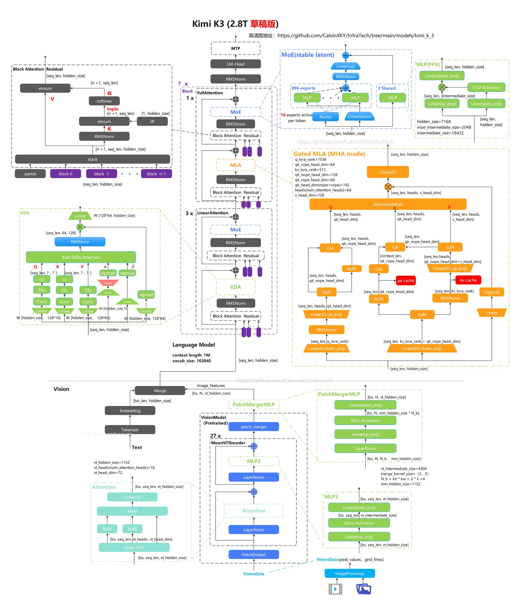
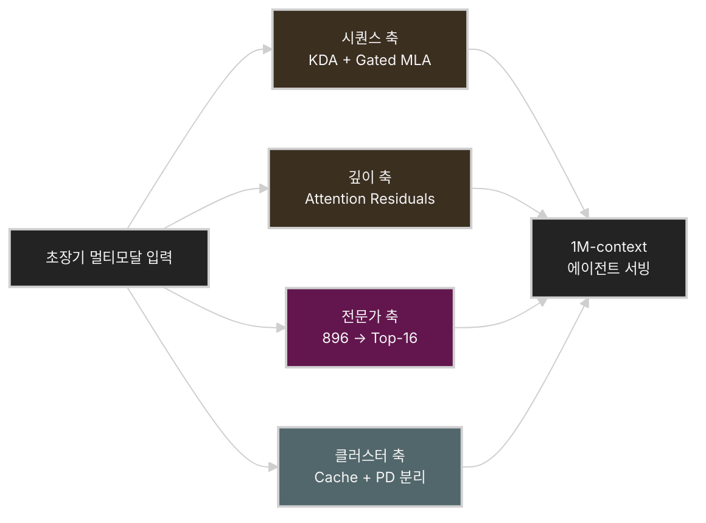
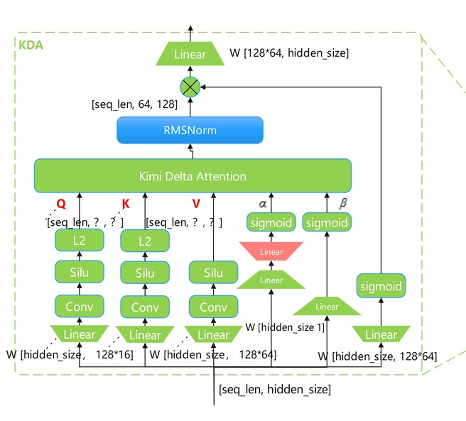
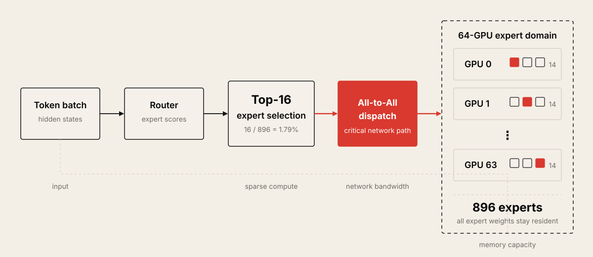
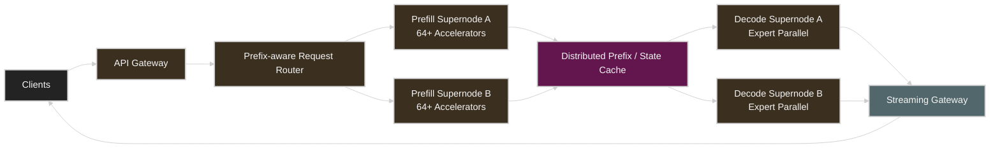

# Kimi K3 기술 해부: 2.8T MoE, KDA, Attention Residuals, 그리고 64-GPU 서빙

> **작성 기준: 2026년 7월 26일**
> Kimi K3 API는 이미 제공되고 있지만, 오픈 웨이트와 전체 기술 보고서는 7월 27일까지 공개될 예정이다. 따라서 이 글은 공식 블로그·API 문서·선행 논문을 기반으로 작성한 **공개 전 사전 분석판**이다. ([Kimi][1])

## 먼저 짚고 넘어갈 점: 첨부된 아키텍처 그림은 확정본이 아니다

첨부된 전체 아키텍처 그림은 `CalvinXKY/InfraTech`에 올라온 수동 재구성 초안이다. 공식 자료에 공개된 KDA, AttnRes, Stable LatentMoE 등의 정보를 Kimi Linear와 기존 Kimi 모델 구조에 대입해 만든 것으로 보인다. 저장소 자체도 레이어 수, hidden dimension, vision encoder 등의 세부 값은 기술 보고서 공개 후 갱신할 예정이라고 밝히고 있다. ([GitHub][2])

특히 그림에 표시된 다음 값은 Kimi K2 공식 스펙과 정확히 일치한다.

* `hidden_size = 7168`
* MoE expert `intermediate_size = 2048`
* attention heads `= 64`

하지만 K3 공식 자료는 아직 이 값을 공개하지 않았다. 따라서 K2의 설정을 임시로 계승해 그린 것으로 보는 편이 안전하다. 그림의 FFN에는 `SiLU`가 표시되어 있지만 K3 공식 블로그는 새로운 활성화 함수로 `SiTU`를 언급하는 등 일부 불일치도 존재한다. ([GitHub][3])



*그림: Kimi K3 전체 아키텍처 수동 재구성 초안. 출처: [CalvinXKY/InfraTech README][2]*

---

## Kimi K3를 한 문장으로 정의하면

**Kimi K3는 2.8조 개의 전체 파라미터를 갖지만 토큰마다 896개 전문가 중 16개만 사용하는 초대형 희소 MoE 모델로, KDA 기반 선형 어텐션과 Gated MLA, Attention Residuals를 결합해 1M 토큰 문맥과 장시간 에이전트 작업을 처리하도록 설계된 네이티브 멀티모달 모델이다.**

현재 공식적으로 확인된 사양은 다음과 같다.

| 항목          | Kimi K3                        |
| ----------- | ------------------------------ |
| 전체 파라미터     | 2.8T                           |
| 활성 파라미터     | 미공개                            |
| 전문가 수       | 896                            |
| 토큰당 활성 전문가  | 16                             |
| 컨텍스트 길이     | 1M tokens                      |
| 어텐션         | KDA와 Gated MLA의 하이브리드          |
| 깊이 방향 연결    | Attention Residuals            |
| MoE         | Stable LatentMoE               |
| 활성화         | SiTU                           |
| 입력 모달리티     | 텍스트, 이미지, 비디오                  |
| 학습 양자화      | MXFP4 weight, MXFP8 activation |
| 권장 자체 배포 환경 | 64개 이상 가속기로 구성된 supernode      |
| Thinking    | 항상 활성화                         |

Moonshot AI는 이러한 구조와 학습 방법을 통해 K2 대비 약 2.5배 높은 scaling efficiency를 달성했다고 주장한다. 이는 동일한 학습 연산량에서 정확히 2.5배 높은 성능이라는 의미라기보다, 모델 크기·데이터·연산량 증가를 실제 능력 향상으로 전환하는 효율이 개선되었다는 의미에 가깝다. ([Kimi][1])

---

# 1. Kimi K3의 핵심은 단순히 “2.8T”가 아니다

K3에서 가장 눈에 띄는 숫자는 2.8T이지만, 실제 추론 성능과 비용을 결정하는 것은 다음 네 요소다.

1. 시퀀스 방향의 **Kimi Delta Attention**
2. 깊이 방향의 **Attention Residuals**
3. 896개 전문가를 사용하는 **Stable LatentMoE**
4. 긴 문맥을 실제 서비스로 연결하는 **prefix cache 및 분리형 추론 인프라**

즉 K3는 단순히 K2의 파라미터를 2.8배 늘린 모델이 아니다. 토큰 축, 레이어 축, 전문가 축, 클러스터 축을 각각 다른 방식으로 희소화하거나 압축한 모델에 가깝다.



## 발표 영상: Kimi K2.5에서 K3로 이어지는 스케일링 경로

아래 발표는 K3 자체의 기술 보고서는 아니지만, Kimi 공동창업자 겸 CEO Zhilin Yang이 K2.5를 확장하며 적용한 Muon optimizer, Day 0 인프라 공동 설계, Kimi Linear, 장시간 에이전트 시스템을 직접 설명한다. K3의 KDA와 Attention Residuals가 등장한 기술적 배경을 이해하는 데 유용하다. ([NVIDIA GTC][11])

발표의 전체 내용은 [Kimi K2.5 스케일링 강의 노트](kimi-k2-5-scaling.md)에서 토큰 효율, 장문 컨텍스트, 에이전트 스웜의 세 축으로 자세히 정리했다.

<iframe
  src="https://www.youtube-nocookie.com/embed/CwePo4847ho"
  title="How We Scaled Kimi K2.5 | Zhilin Yang's full GTC 2026 Keynote"
  style="width: 100%; aspect-ratio: 16 / 9; border: 0;"
  loading="lazy"
  allow="accelerometer; autoplay; clipboard-write; encrypted-media; gyroscope; picture-in-picture; web-share"
  referrerpolicy="strict-origin-when-cross-origin"
  allowfullscreen>
</iframe>

*영상: [How We Scaled Kimi K2.5 | Zhilin Yang's full GTC 2026 Keynote][10] — Kimi AI 공식 YouTube 채널.*

---

# 2. Kimi Delta Attention: KV Cache를 계속 늘리지 않는 어텐션

## 기존 Softmax Attention의 문제

일반적인 Transformer의 self-attention은 새로운 토큰을 생성할 때 과거 모든 토큰의 Key와 Value를 KV cache에 보관한다.

컨텍스트가 길어질수록 다음 비용이 증가한다.

* KV cache 메모리: 시퀀스 길이에 비례
* prefill 계산량: 일반적으로 시퀀스 길이에 대해 제곱 수준
* decode 시 메모리 읽기량
* 여러 턴에 걸친 에이전트 작업의 상태 유지 비용

1M 토큰 문맥에서 기존 full attention만 사용하면 모델 가중치보다 KV cache와 메모리 대역폭이 더 심각한 병목이 될 수 있다.

## KDA는 문맥을 고정 크기의 상태로 압축한다

KDA는 과거의 모든 K/V를 그대로 유지하기보다, 각 attention head가 행렬 형태의 recurrent state를 관리한다. 단순화한 상태 업데이트는 다음과 같다.

$$
S_t =
\left(I-\beta_t k_tk_t^\top\right)
\operatorname{Diag}(\alpha_t)S_{t-1}
+\beta_t k_t v_t^\top
$$

$$
o_t=S_t^\top q_t
$$

여기서 중요한 요소는 두 가지다.

* $\operatorname{Diag}(\alpha_t)$: 기존 기억을 feature dimension별로 서로 다른 속도로 감쇠시킨다.
* $\beta_t$: 기존 key-value 대응 관계를 수정하고 새로운 관계를 기록하는 정도를 결정한다.

일반 Gated DeltaNet이 head 단위의 하나의 forget gate를 사용한다면, KDA는 채널별 gate를 사용한다. 어떤 정보는 오래 유지하고 어떤 정보는 빠르게 잊도록 더 세밀하게 조절할 수 있는 셈이다. KDA 레이어의 recurrent state 크기는 시퀀스 길이에 관계없이 고정된다. ([arXiv][4])



*그림: Kimi Delta Attention(KDA) 세부 구조. 출처: [CalvinXKY/InfraTech README][2]*

이를 직관적으로 표현하면 다음과 같다.


*그림: Softmax Attention의 선형 KV cache 증가와 KDA의 고정 크기 recurrent state 비교. [Kimi Linear 기술 보고서][4]를 바탕으로 재구성.*

## 그렇다면 왜 MLA가 여전히 필요한가

선형 어텐션은 효율적이지만 제한된 크기의 상태에 문맥을 압축하기 때문에 다음 작업에는 상대적으로 불리할 수 있다.

* 긴 문장에서 특정 문자열을 정확히 복사
* 멀리 떨어진 토큰을 그대로 검색
* 여러 개의 유사한 key를 구분
* 코드 저장소에서 정확한 심볼이나 라인을 재탐색

그래서 Kimi Linear는 KDA 레이어 세 개마다 global MLA 레이어 하나를 넣는 3:1 하이브리드 구조를 사용했다. KDA가 대부분의 문맥을 효율적으로 압축하고, 주기적인 MLA가 전체 문맥에 대한 정확한 검색 경로를 보완한다. 이 선행 모델에서는 1M 토큰 조건에서 KV cache를 최대 75% 줄이고, 실험 설정에 따라 최대 6.3배 높은 decode throughput을 보고했다. 다만 이 수치는 Kimi Linear 48B-A3B 연구 모델의 결과이며 K3 전체 모델의 실제 성능으로 그대로 해석하면 안 된다. K3의 정확한 KDA 대 MLA 비율 역시 아직 공식적으로 확정되지 않았다. ([arXiv][4])

---

# 3. Attention Residuals: 레이어도 필요한 과거만 찾아본다

Transformer의 일반 residual connection은 이전 레이어 출력을 계속 더한다.

$$
h_l=h_{l-1}+f_l(h_{l-1})
$$

레이어가 깊어질수록 초기 레이어의 정보와 최근 레이어의 정보가 모두 균일하게 누적된다. 이는 학습을 안정화하는 데 도움이 되지만, 매우 깊은 모델에서는 각 레이어의 기여가 희석되고 hidden state 크기가 계속 증가할 수 있다.

AttnRes는 모든 이전 표현을 단순히 더하지 않고, 현재 레이어가 필요한 과거 표현에 attention을 수행한다.

$$
h_l=\sum_{i=0}^{l-1}\alpha_{i\rightarrow l}v_i
$$

즉 attention이 토큰 방향뿐 아니라 **모델 깊이 방향**에도 적용된다.

```text
기존 Residual

Layer 0 ── + ── Layer 1 ── + ── Layer 2 ── + ── Layer 3
          모두 동일한 가중치로 누적


Attention Residual

Layer 0 ───────────┐
Layer 1 ────────┐  │
Layer 2 ─────┐  │  │
             ▼  ▼  ▼
        Depth Attention
             │
          Layer 3
```

## Block AttnRes

모든 레이어 출력을 저장하는 Full AttnRes는 깊이가 커지면 메모리 비용이 증가한다. K3 그림에 나타나는 `block 0`, `block 1`, `block n-1` 구조는 레이어를 여러 block으로 묶고 block 대표 표현에만 attention을 수행하는 Block AttnRes를 표현한 것이다.

* block 내부: 기존 residual 누적
* block 사이: 학습된 attention으로 필요한 block 선택
* 현재 미완성 block: `partial` representation으로 포함


*그림: Block Attention Residual의 block 표현 집계 구조. 출처: [CalvinXKY/InfraTech README][2]*

AttnRes 연구에서는 약 8개 block만으로 Full AttnRes의 이점을 대부분 유지하면서 메모리 오버헤드를 크게 낮출 수 있다고 보고했다. ([GitHub][5])

따라서 K3는 두 방향에서 정보를 검색한다.

* **Sequence 방향:** KDA와 MLA가 과거 토큰을 검색
* **Depth 방향:** AttnRes가 과거 레이어 표현을 검색

이 조합이 K3 아키텍처의 가장 흥미로운 부분이다.

---

# 4. Stable LatentMoE: 896개 중 16개 전문가만 실행한다

K3에는 896개의 routed expert가 있으며, 토큰마다 16개 전문가를 선택한다. 단순 비율로 보면 각 토큰은 routed expert의 약 1.79%만 사용한다.

이 구조는 전체 파라미터를 크게 늘리면서도 토큰당 계산량은 제한할 수 있게 한다. 다만 **계산량이 줄어드는 것과 배포가 쉬워지는 것은 전혀 다른 문제**다.

전체 2.8T 파라미터는 기본적으로 클러스터 메모리에 올라가 있어야 한다. MXFP4를 정확히 4비트로만 계산하면 가중치 원본 크기는 약 1.4TB다.

```text
2.8 × 10¹² params × 4 bits ÷ 8
≈ 1.4 TB
```

실제 메모리는 block scale, metadata, embedding, router, 일부 고정밀 레이어, vision encoder 및 런타임 버퍼 때문에 이보다 커진다.

## 전문가 수가 많아질수록 네트워크가 중요해진다

64개 가속기에 전문가를 균등하게 배치하면 가속기당 평균 약 14개의 expert를 보유하게 된다.

```text
896 experts ÷ 64 accelerators = 14 experts/accelerator
```

각 토큰은 16개 expert로 전달돼야 하므로, expert parallelism에서는 다음 흐름이 반복된다.



*그림: 토큰당 Top-16 계산, 896개 expert의 메모리 상주, All-to-All 통신 비용을 분리한 개념도.*

단순한 PCIe 기반 멀티노드나 일반 Ethernet 환경에서는 계산보다 All-to-All 통신이 병목이 될 가능성이 높다. Moonshot AI가 64개 이상의 가속기를 하나의 고대역폭 통신 도메인으로 묶은 supernode를 권장하는 이유도 이 때문이다. ([Kimi][1])

## Quantile Balancing

MoE router가 특정 expert에 토큰을 몰아주면 해당 GPU만 늦어져 전체 배치가 기다리는 straggler 문제가 발생한다.

K3는 router score의 분위수에서 expert allocation을 직접 유도하는 Quantile Balancing을 사용한다고 설명한다. 기존 auxiliary loss나 경험적 보정값에 의존하는 방식보다 routing 균형을 안정적으로 맞추려는 접근이다.

또한 Moonshot AI는 학습 단계에서 다음 방식을 사용했다고 밝혔다.

* fully balanced expert parallelism
* static tensor shape
* critical path의 host synchronization 제거
* Per-Head Muon optimizer

다만 Stable LatentMoE의 latent representation, 공유 expert 수, capacity factor, token dropping 정책 등은 기술 보고서가 공개돼야 정확히 알 수 있다. ([Kimi][1])

---

# 5. Gated MLA와 SiTU

K3는 KDA만 사용하는 순수 선형 어텐션 모델이 아니다. 일부 레이어에서 Gated MLA를 사용해 전역 검색 능력과 선택성을 보완한다.

MLA는 K/V를 낮은 차원의 latent representation으로 압축해 KV cache를 줄이는 방식이다. KDA가 고정 크기의 recurrent state로 문맥을 압축한다면, MLA는 KV 표현 자체의 차원을 압축한다.

따라서 두 방식의 역할은 조금 다르다.

| 방식        | 주요 목적                                  |
| --------- | -------------------------------------- |
| KDA       | 시퀀스 길이에 따라 증가하는 KV 상태를 고정 크기에 가깝게 압축   |
| MLA       | K/V의 feature dimension을 latent 공간으로 압축 |
| Gated MLA | 필요한 attention 정보를 선택적으로 통과             |
| AttnRes   | 깊이 방향의 과거 레이어를 선택적으로 검색                |

공식 블로그는 FFN activation으로 Sigmoid Tanh Unit, 즉 SiTU를 사용한다고 밝히고 있다. 그러나 수식과 실제 kernel 구성은 아직 공개되지 않았다. 첨부 그림의 `SiLU Activation` 표시는 잠정적인 것으로 봐야 한다. ([Kimi][1])

---

# 6. 네이티브 멀티모달 구조

K3는 텍스트뿐 아니라 이미지와 비디오를 동일 모델에서 처리하는 네이티브 멀티모달 모델이다. 다만 현재 공식 자료는 vision encoder 이름, 파라미터 수, patch merge 방식, projector 구조를 공개하지 않았다.

첨부 그림에는 다음과 같은 구성이 표시되어 있다.

* MoonViT encoder
* 27개의 vision block
* patch merger
* visual token과 text token의 merge
* `vt_hidden_size=1152`

이 값들은 현재 공식적으로 검증되지 않았다. 따라서 기술 보고서가 나오기 전에는 K3의 실제 vision backbone으로 인용하지 않는 편이 좋다.

API에서 지원하는 입력 방식은 명확하다.

* 이미지는 base64 또는 `ms://<file-id>`
* 비디오는 파일 업로드 후 `ms://<file-id>` 사용 가능
* 일반 인터넷 이미지 URL은 지원하지 않음
* 이미지 권장 해상도는 최대 4K
* 비디오 권장 해상도는 최대 FHD
* 전체 요청 본문은 100MB 이내

이미지와 비디오 토큰 수는 해상도와 추출된 프레임 수에 따라 동적으로 계산된다. 프로덕션에서는 요청 전 token estimation을 수행하는 편이 안전하다. ([Kimi API Platform][6])

---

# 7. MXFP4와 MXFP8: 배포를 염두에 둔 QAT

K3는 SFT 단계부터 Quantization-Aware Training을 적용했다.

* Weight: MXFP4
* Activation: MXFP8

이는 BF16 모델을 완성한 뒤 PTQ로 4비트 변환하는 방식과 다르다. 학습 과정에서 양자화 오차를 미리 노출해 저정밀 추론 시 정확도 손실을 줄이려는 접근이다.

MLOps 관점에서 중요한 점은 **체크포인트가 MXFP4라고 해서 어떤 GPU에서도 자동으로 빠르게 실행되는 것은 아니라는 것**이다. 실제 성능은 다음 요소에 달려 있다.

* 가속기의 MXFP4/MXFP8 지원 수준
* dequantization fusion
* expert GEMM kernel
* KDA kernel 지원
* runtime의 expert parallel 구현
* collective communication과 compute overlap

Moonshot AI는 FlashKDA라는 전용 CUDA kernel을 공개했다. 현재 구현은 Hopper 계열과 Blackwell 계열 architecture target을 지원하며, `flash-linear-attention`의 KDA backend로 자동 dispatch될 수 있다. 다만 K3 전체 모델 runtime과 vLLM 통합 상태는 웨이트 공개 후 다시 확인해야 한다. ([GitHub][7])

---

# 8. 1M 토큰 컨텍스트가 의미하는 것

1M 토큰을 지원한다고 해서 매 요청에 1M 토큰을 넣는 것이 효율적이라는 뜻은 아니다.

K3 역시 일부 Gated MLA 레이어를 사용하므로 모든 attention 상태가 완전히 고정 크기로 바뀌는 것은 아니다. 긴 입력은 여전히 다음 비용을 발생시킨다.

* prefill latency
* activation memory
* MLA KV cache
* 멀티노드 cache 전송
* 입력 토큰 비용
* 첫 토큰까지의 시간, TTFT

따라서 실제 시스템에서는 다음 조합이 필요하다.

```text
1M context capability
        +
문서 검색 / context selection
        +
prefix cache
        +
conversation summarization
        +
prefill-decode 분리
```

Kimi API의 context caching은 자동으로 동작한다. 앞선 요청의 prompt가 256토큰을 초과하고, 다음 요청에서 긴 prefix가 그대로 유지되면 cache hit를 시도한다. 별도의 cache ID나 TTL 설정은 필요하지 않다. ([Kimi API Platform][8])

공식 API 가격도 cache locality를 매우 중요하게 만든다.

| 토큰 종류            |      공식 출시 가격 |
| ---------------- | ------------: |
| Cache-hit input  |  \$0.30 / MTok |
| Cache-miss input |  \$3.00 / MTok |
| Output           | \$15.00 / MTok |

cache-hit input이 cache-miss보다 10배 저렴하다. Moonshot AI는 자사 coding workload에서 90% 이상의 cache hit rate를 달성했다고 주장한다. 이는 공식 서비스 환경의 수치이므로 일반적인 자체 배포에서도 그대로 달성된다고 보기는 어렵다. ([Kimi][1])

---

# 9. MLOps 엔지니어를 위한 Kimi K3 서빙 전략

## 현재 시점의 현실적인 선택: API First

웨이트와 공식 runtime이 아직 공개되지 않은 현재는 Kimi API를 이용해 품질과 workload 특성을 검증하는 것이 합리적이다.

K3 API는 OpenAI Python SDK 형식으로 호출할 수 있다.

```python
import os

from openai import OpenAI

client = OpenAI(
    api_key=os.environ["MOONSHOT_API_KEY"],
    base_url="https://api.moonshot.ai/v1",
)

response = client.chat.completions.create(
    model="kimi-k3",
    reasoning_effort="low",
    max_completion_tokens=8192,
    messages=[
        {
            "role": "system",
            "content": "You are a senior software architecture reviewer.",
        },
        {
            "role": "user",
            "content": "Review the following system design.",
        },
    ],
)

print(response.choices[0].message.content)
```

K3는 thinking을 완전히 끌 수 없다. `reasoning_effort`의 `low`, `high`, `max`로 추론량을 조절하며 기본값은 `max`다. 또한 temperature, top-p, n과 같은 sampling parameter가 고정되어 있어 운영 시 주요 latency·비용 제어 레버는 `reasoning_effort`, 입력 길이, 출력 제한이 된다. ([Kimi API Platform][8])

프로덕션에서는 workload별로 기본값을 나누는 것이 좋다.

| 워크로드         | 권장 시작값                               |
| ------------ | ------------------------------------ |
| 단순 분류·추출     | `low`                                |
| 코드 리뷰·일반 분석  | `high`                               |
| 장기 계획·복잡한 추론 | `max`                                |
| JSON 추출      | `low` 또는 `high` + strict JSON Schema |
| 장시간 에이전트     | 단계별 동적 조절                            |

## Prefix가 변하지 않도록 요청을 구성해야 한다

캐시 효율을 높이려면 요청을 다음 순서로 배치하는 것이 좋다.

```text
[고정 System Prompt]
[고정 도구 정의]
[고정 코드베이스 또는 문서]
[세션별 대화]
[현재 사용자 질문]
```

매 요청마다 timestamp, request ID, 사용자별 동적 정보를 system prompt 앞부분에 삽입하면 prefix hash가 달라져 cache locality가 깨질 수 있다. 동적 metadata는 가능한 한 뒤쪽에 배치해야 한다.

## 멀티턴 메시지는 원본을 보존해야 한다

Kimi API는 tool call이나 멀티턴 요청에서 이전 assistant message의 `content`만 저장하지 말고 전체 message를 다음 요청에 그대로 포함하도록 요구한다. `reasoning_content`, `tool_calls` 등의 필드가 누락되면 대화 상태가 깨질 수 있다. ([Kimi API Platform][8])

운영 DB에서는 다음과 같이 분리하는 편이 좋다.

```text
user-visible content
reasoning content
tool calls
tool results
token usage
cache status
model configuration
```

`reasoning_content`는 사용자 출력과 별도로 취급하고, 로그 보존 및 접근 통제를 분리하는 것이 안전하다.

---

# 10. 자체 호스팅 아키텍처

공식 웨이트와 vLLM 지원이 공개된다는 전제에서, K3를 자체 서빙한다면 단일 Kubernetes Deployment 수준으로 접근하기 어렵다.

Moonshot AI의 권장 조건을 반영한 논리 구조는 다음과 같다.



이 구성은 Moonshot AI의 Mooncake 계열과 유사한 prefill-decode disaggregation 형태다. Mooncake는 prefill과 decode cluster를 분리하고, CPU DRAM과 SSD까지 활용해 분산 KV cache를 구성한다. 현재 Mooncake는 vLLM과 SGLang 생태계에 통합되어 있으며, K2도 128개의 H200에서 대규모 expert parallelism과 PD 분리를 이용해 배포된 사례가 있다. ([GitHub][9])

다만 KDA는 일반 KV cache와 다른 recurrent state를 사용하므로, K3에서는 KDA state와 MLA KV cache를 함께 이동·저장하는 새로운 cache protocol이 필요할 수 있다. Moonshot AI는 KDA용 prefill cache 구현을 vLLM 커뮤니티에 제공할 예정이라고 밝혔지만, 실제 API와 운영 제약은 공개 후 확인해야 한다. ([Kimi][1])

## 병렬화 구성

K3 배포에서는 다음 병렬화가 함께 사용될 가능성이 높다.

### Expert Parallelism

896개의 expert를 여러 가속기에 분산한다. 가장 중요한 병렬화 축이다.

### Tensor Parallelism

attention projection, shared layer 및 개별 expert의 큰 matrix multiplication을 여러 가속기로 분할한다.

### Pipeline Parallelism

전체 레이어를 여러 stage로 나눈다. 다만 pipeline bubble과 긴 에이전트 요청의 비균질한 출력 길이를 고려해야 한다.

### Data Parallelism

완전한 supernode replica를 여러 개 운영해 요청을 분산한다. K3에서는 개별 GPU가 아니라 **supernode 전체가 최소 scale unit**이 될 가능성이 높다.

---

# 11. Kubernetes와 클러스터 운영 시 주의점

## Autoscaling 단위

일반 inference pod처럼 GPU 한두 개를 추가하는 방식은 의미가 없다.

```text
잘못된 접근:
GPU 사용률 80% → GPU Pod 하나 추가

권장 접근:
Queue latency / Goodput 저하
    → 완전한 64-GPU supernode replica 추가
```

따라서 scale-out이 느리고 비용이 크다. 트래픽 급증에 대응하려면 warm standby, admission control, reasoning effort downgrade 정책이 필요하다.

## Topology-aware scheduling

같은 64개 가속기라도 서로 다른 rack이나 느린 network fabric에 걸쳐 배치되면 expert parallel 성능이 급격히 떨어질 수 있다.

스케줄러는 최소한 다음 topology를 알아야 한다.

* NVLink/NVSwitch 또는 동등한 내부 fabric
* rack 및 supernode 경계
* RDMA NIC와 NUMA affinity
* storage/cache node 근접성
* prefill-decode 간 전송 경로

## Readiness Probe

HTTP 포트가 열렸다고 readiness가 완료된 것이 아니다. 최소한 다음 조건을 확인해야 한다.

```text
모든 weight shard 로드 완료
모든 rank collective 초기화 완료
896 expert placement 검증
FlashKDA kernel 정상 dispatch
prefix cache backend 연결
all-to-all bandwidth 테스트 통과
샘플 inference 결과 검증
```

---

# 12. 반드시 수집해야 할 관측 지표

## 사용자 경험

| 지표            | 의미              |
| ------------- | --------------- |
| TTFT          | 첫 토큰까지 걸린 시간    |
| TPOT          | 출력 토큰 사이의 평균 시간 |
| E2E latency   | 요청부터 완료까지 전체 시간 |
| Goodput       | SLO를 만족한 처리량    |
| Queue latency | 모델 실행 전 대기 시간   |

## 캐시

| 지표                     | 의미                |
| ---------------------- | ----------------- |
| Prefix cache hit rate  | 재사용된 prefix 비율    |
| Cache-hit tokens       | 캐시에서 재사용된 입력 토큰   |
| Cache transfer latency | cache/state 전송 시간 |
| Eviction rate          | cache 제거 빈도       |
| Recompute rate         | 캐시 실패로 재계산한 비율    |

## MoE

| 지표                 | 의미                   |
| ------------------ | -------------------- |
| Tokens per expert  | expert별 토큰 분포        |
| Expert imbalance   | 가장 바쁜 expert와 평균의 차이 |
| All-to-All latency | token dispatch 통신 시간 |
| Straggler rank     | 전체 step을 지연시키는 rank  |
| Router entropy     | routing 선택의 편중 정도    |

## 가속기와 네트워크

* HBM 사용량 및 bandwidth
* SM utilization
* expert GEMM utilization
* NCCL/RDMA throughput
* retransmission 및 link error
* KDA kernel fallback 여부
* prefill과 decode pool의 독립 utilization

## 애플리케이션

* `reasoning_effort`별 latency와 비용
* tool call 성공률
* JSON Schema validation 실패율
* output truncation 비율
* 이미지·비디오 preprocessing 시간
* 입력 modality별 token usage
* 사용자 취소 및 timeout 비율

---

# 13. 권장 도입 순서

## 1단계: API 기반 품질 검증

* 실제 코드베이스와 문서로 평가
* `low`, `high`, `max` 품질·지연 비교
* prefix cache hit rate 확인
* output token 분포 수집
* tool calling과 structured output 검증

## 2단계: Shadow Traffic

현재 운영 모델과 동시에 호출하되 K3 결과는 사용자에게 노출하지 않는다.

* 결과 품질 비교
* 장시간 agent trajectory 안정성
* 비용과 tail latency 확인
* 멀티모달 입력 처리 검증

## 3단계: 제한적 라우팅

K3가 강점을 보이는 workload만 전달한다.

```text
긴 코드베이스 분석        → K3
스크린샷 기반 프론트엔드 수정 → K3
대규모 문서 합성          → K3
간단한 분류               → 소형 모델
짧은 RAG 질의             → 중형 모델
```

## 4단계: 자체 호스팅 PoC

웨이트, 라이선스, vLLM/SGLang 지원이 확인된 뒤 진행한다.

우선 검증할 항목은 다음과 같다.

* 실제 checkpoint 크기
* 최소 가속기 개수
* 지원 GPU와 NPU
* MXFP4 kernel compatibility
* expert parallel topology
* KDA prefix cache
* vision encoder 메모리
* 단일 supernode throughput
* 장애 복구 시간

---

# 14. K3를 평가할 때 벤치마크보다 중요한 것

Moonshot AI는 K3가 coding, knowledge work, visual reasoning 및 장시간 agent 작업에서 frontier 수준이라고 발표했다. 그러나 공식 벤치마크에는 KimiCode, Claude Code, Codex 등 서로 다른 agent harness가 혼합되어 있고, 대부분 `reasoning_effort=max` 조건에서 수행되었다. 일부 비교 모델은 fallback이나 safety guard의 영향을 받기도 했다. 따라서 단일 점수만으로 모델 우열을 판단하기보다 동일한 harness와 동일한 tool environment에서 재평가해야 한다. ([Kimi][1])

MLOps 엔지니어가 확인해야 하는 질문은 오히려 다음과 같다.

* 30분 이상 실행되는 agent task가 끝까지 안정적인가?
* 반복되는 코드 prefix에서 cache hit가 유지되는가?
* reasoning effort를 낮춰도 품질이 유지되는가?
* 1M context에서 TTFT가 실제 SLO를 만족하는가?
* tool call 실패 후 스스로 복구하는가?
* expert imbalance가 tail latency를 만들지 않는가?
* 멀티모달 입력에서 token cost가 예측 가능한가?

---

# 결론

Kimi K3의 의미는 “세계 최초의 2.8T 오픈 모델”이라는 숫자보다, 초대형 모델을 실제 에이전트 서비스로 만들기 위해 여러 축의 병목을 동시에 다뤘다는 점에 있다.

* KDA는 시퀀스 방향의 메모리 증가를 억제한다.
* Gated MLA는 선형 어텐션의 정확한 검색 한계를 보완한다.
* AttnRes는 깊이 방향의 정보 희석을 줄인다.
* Stable LatentMoE는 전체 모델 크기와 토큰당 계산량을 분리한다.
* MXFP4/MXFP8 QAT는 초대형 웨이트의 저장과 연산 비용을 낮춘다.
* Mooncake와 prefix cache는 1M context를 서비스 가능한 인프라 문제로 전환한다.

반면 자체 서빙 관점에서는 매우 까다로운 모델이다. 896-expert routing, 64개 이상의 가속기, 고대역폭 All-to-All, KDA 전용 kernel과 cache, 멀티모달 preprocessing을 모두 함께 운영해야 한다.

따라서 대부분의 팀에는 **API로 workload 적합성과 cache economics를 먼저 검증하고, 자체 호스팅은 웨이트·라이선스·runtime 지원이 충분히 안정화된 이후 검토하는 전략**이 현실적이다.

## 주요 자료

* Kimi K3 공식 기술 블로그 및 출시 정보 ([Kimi][1])
* Kimi K3 API 가이드 ([Kimi API Platform][8])
* Kimi Linear 기술 보고서 ([arXiv][4])
* Attention Residuals 기술 보고서와 구현 ([GitHub][5])
* FlashKDA 구현 ([GitHub][7])
* Mooncake 분리형 추론 아키텍처 ([GitHub][9])
* 첨부 아키텍처 초안 출처 ([GitHub][2])
* Zhilin Yang의 GTC 2026 발표 영상 ([YouTube][10], [NVIDIA GTC][11])

[1]: https://www.kimi.com/blog/kimi-k3 "Kimi K3 Tech Blog: Open Frontier Intelligence"
[2]: https://github.com/CalvinXKY/InfraTech/blob/main/models/kimi_k_3/README.md "InfraTech/models/kimi_k_3/README.md at main · CalvinXKY/InfraTech · GitHub"
[3]: https://github.com/moonshotai/kimi-k2 "GitHub - MoonshotAI/Kimi-K2: Kimi K2 is the large language model series developed by Moonshot AI team · GitHub"
[4]: https://arxiv.org/pdf/2510.26692 "Kimi Linear: An Expressive, Efficient Attention Architecture"
[5]: https://github.com/MoonshotAI/Attention-Residuals/blob/master/README.md "Attention-Residuals/README.md at master · MoonshotAI/Attention-Residuals · GitHub"
[6]: https://platform.kimi.ai/docs/api/chat "Create Chat Completion - Kimi API Platform"
[7]: https://github.com/MoonshotAI/FlashKDA?utm_source=chatgpt.com "FlashKDA: high-performance Kimi Delta Attention kernels"
[8]: https://platform.kimi.ai/docs/guide/kimi-k3-quickstart "Kimi K3 - Kimi API Platform"
[9]: https://github.com/kvcache-ai/Mooncake "GitHub - kvcache-ai/Mooncake: Mooncake is the serving platform for Kimi, a leading LLM service provided by Moonshot AI. · GitHub"
[10]: https://www.youtube.com/watch?v=CwePo4847ho "How We Scaled Kimi K2.5 | Zhilin Yang's full GTC 2026 Keynote"
[11]: https://www.nvidia.com/en-us/on-demand/session/gtc26-s81695/ "How We Scaled Kimi K2.5 | GTC San Jose 2026"
