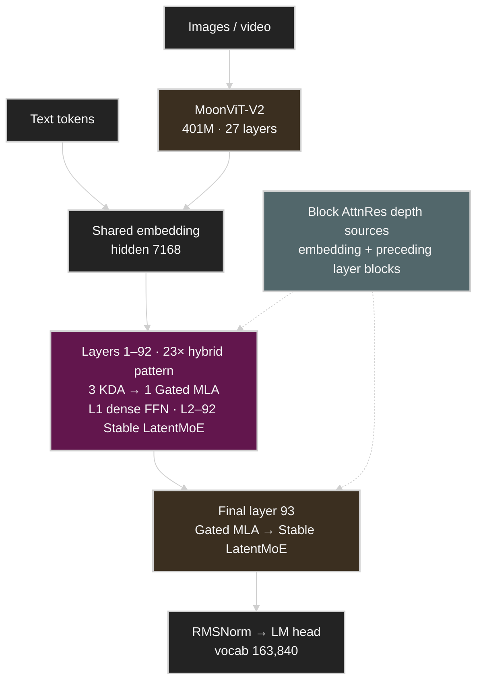
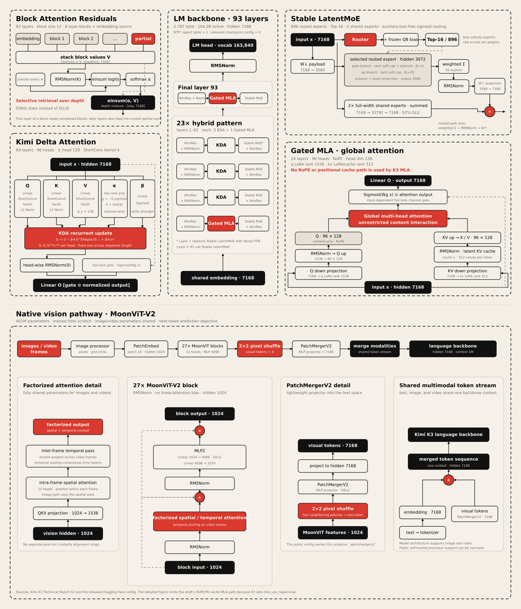
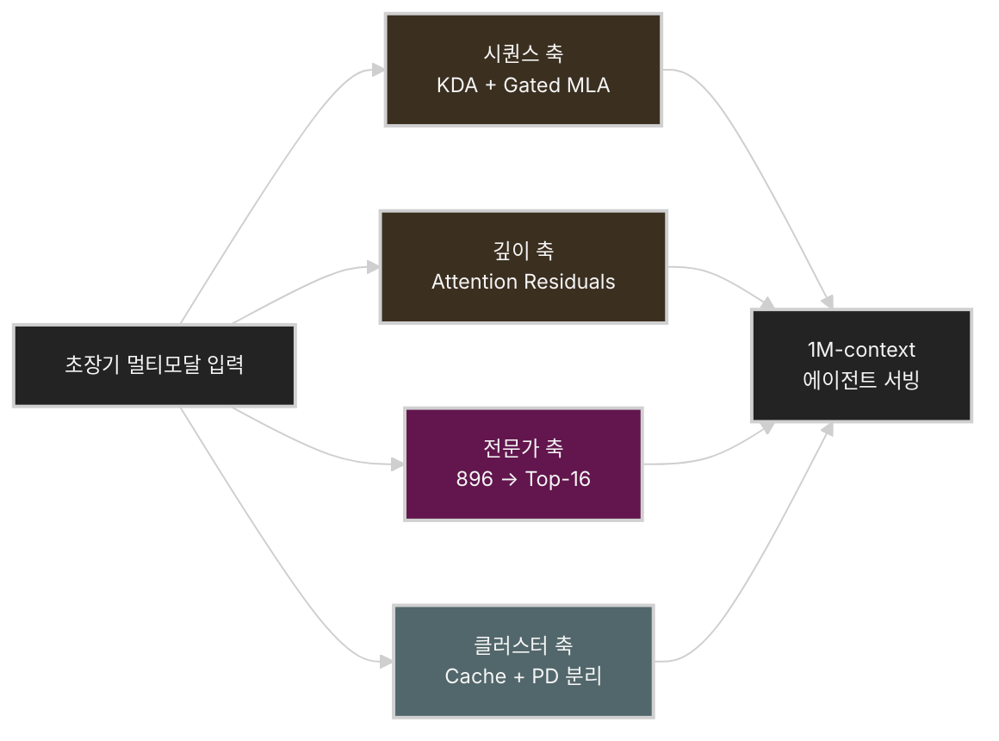
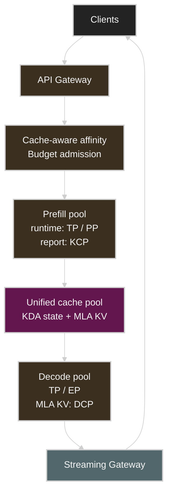

# Kimi K3 기술 해부: 2.8T MoE, KDA, Attention Residuals, 그리고 64-GPU 서빙

> **갱신 기준: 2026년 7월 28일**
> Kimi K3 오픈 웨이트와 전체 기술 보고서가 7월 27일 공개되었다. 이 글은 공식 기술 보고서, Hugging Face 모델 카드와 실제 `config.json`, API 문서를 기준으로 갱신한 공개판 분석이다. ([Technical Report][12], [Hugging Face][13])

**공식 원문:** [Kimi K3 Technical Report PDF][12]

## 공식 공개로 확인된 전체 구조

공개 전에는 Kimi K2의 수치를 대입한 비공식 아키텍처 초안이 유통되었다. 이 초안은 KDA, Gated MLA, Block AttnRes, LatentMoE와 vision pathway의 연결 구조를 한 장에 보여준다는 점에서 여전히 유용하다. 다만 `hidden_size=7168`만 실제 K3와 일치했고, expert hidden dimension `2048`, attention heads `64`, vision hidden size `1152`, `SiLU` 표기는 각각 공식 값 `3072`, `96`, `1024`, `SiTU-GLU`와 달랐다.

### 빠르게 보는 전체 구조

아래 개요도는 K3의 전체 흐름을 입력 modality, token mixing, depth mixing, channel mixing 순서로 단순화한 것이다. 23개의 hybrid pattern은 각각 KDA 세 레이어와 Gated MLA 한 레이어로 구성되고, 모든 attention layer 뒤에는 channel mixing을 담당하는 feed-forward network가 이어진다. 첫 번째 레이어만 dense FFN을 사용하며 나머지는 Stable LatentMoE를 사용한다.



*그림: Kimi K3 전체 구조 개요. [Kimi K3 공식 기술 보고서 PDF][12]와 공개 `config.json`을 기준으로 재구성.*

### 공식 구조를 반영한 연산 경로 상세도

위 개요를 token mixing(KDA·Gated MLA), depth mixing(Block AttnRes), channel mixing(Stable LatentMoE), modality mixing(MoonViT-V2)의 네 축으로 펼치면 다음 상세도가 된다. [CalvinXKY/InfraTech의 공개 전 초안][2]이 제공하던 연산 단위의 정보량을 유지하면서, 공식 보고서와 공개 checkpoint에서 확인되는 구조만 다시 그렸다. Block AttnRes의 pseudo-query와 depth softmax, KDA의 Q/K/V·α/β 생성 및 recurrent state, Stable LatentMoE의 routed/shared expert 경로와 SiTU-GLU, Gated MLA의 Q/KV LoRA와 latent KV cache, MoonViT-V2의 residual block과 projector 흐름을 포함한다.

[](assets/kimi-k3-architecture-detailed.svg)

*그림: Kimi K3 연산 경로 상세도. 공개 전 초안의 RoPE·PE-cache MLA 경로는 K3의 `mla_use_nope=true`와 맞지 않아 제외했고, MTP는 기술 보고서와 공개 checkpoint 설정의 차이를 주석으로 표시했다. 출처: [Technical Report][12], [Kimi K3 Config][14].*

---

## Kimi K3를 한 문장으로 정의하면

**Kimi K3는 2.8조 개의 전체 파라미터를 갖지만 토큰마다 896개 전문가 중 16개만 사용하는 초대형 희소 MoE 모델로, KDA 기반 선형 어텐션과 Gated MLA, Attention Residuals를 결합해 1M 토큰 문맥과 장시간 에이전트 작업을 처리하도록 설계된 네이티브 멀티모달 모델이다.**

현재 공식적으로 확인된 사양은 다음과 같다.

| 항목 | Kimi K3 |
| --- | --- |
| 전체 파라미터 | 2.78T, 통상 2.8T로 표기 |
| 활성 파라미터 | 104.2B, 통상 104B로 표기 |
| 레이어 | 93, 첫 1개 레이어는 dense |
| hidden dimension | 7168 |
| attention heads | 96 |
| 어텐션 구성 | 69 KDA + 24 Gated MLA |
| AttnRes | block size 12 |
| LatentMoE dimension | 3584 |
| expert hidden dimension | 3072 |
| routed / shared experts | 896 / 2 |
| 토큰당 routed experts | 16 |
| 컨텍스트 길이 | 1,048,576 tokens |
| vocabulary | 163,840 |
| 활성화 | SiTU-GLU |
| vision encoder | MoonViT-V2, 401M, 27 layers |
| 모델 입력 모달리티 | 텍스트, 이미지, 비디오 |
| 학습 양자화 | MXFP4 weight, MXFP8 activation |
| 권장 자체 배포 환경 | 고대역폭 64+ accelerator supernode |
| Thinking | 항상 활성화 |

> [!NOTE]
> 기술 보고서의 K2/K3 비교표는 K3에 MTP layer 1개를 적지만, 공개 checkpoint의 `config.json`은 `num_nextn_predict_layers=0`이다. 따라서 이 문서는 공개 checkpoint에 내장 MTP가 활성화됐다고 단정하지 않는다. speculative decoding을 사용할 때는 runtime이 요구하는 별도 draft checkpoint와 해당 release의 검증 상태를 확인해야 한다. ([Technical Report][12], [Kimi K3 Config][14])

Moonshot AI는 이러한 구조와 학습 방법을 통해 K2 대비 약 2.5배 높은 scaling efficiency를 달성했다고 주장한다. 이는 동일한 학습 연산량에서 정확히 2.5배 높은 성능이라는 의미라기보다, 모델 크기·데이터·연산량 증가를 실제 능력 향상으로 전환하는 효율이 개선되었다는 의미에 가깝다. ([Kimi][1])

---

# 1. Kimi K3의 핵심은 단순히 “2.8T”가 아니다

K3에서 가장 눈에 띄는 숫자는 2.8T이지만, 실제 추론 성능과 비용을 결정하는 것은 다음 네 요소다.

1. 시퀀스 방향의 **Kimi Delta Attention**
2. 깊이 방향의 **Attention Residuals**
3. 896개 전문가를 사용하는 **Stable LatentMoE**
4. 긴 문맥을 실제 서비스로 연결하는 **prefix cache 및 분리형 추론 인프라**

즉 K3는 단순히 K2의 파라미터를 2.8배 늘린 모델이 아니다. 토큰 축, 레이어 축, 전문가 축, 클러스터 축을 각각 다른 방식으로 희소화하거나 압축한 모델에 가깝다.



## 발표 영상: Kimi K2.5에서 K3로 이어지는 스케일링 경로

아래 발표는 K3 자체의 기술 보고서는 아니지만, Kimi 공동창업자 겸 CEO Zhilin Yang이 K2.5를 확장하며 적용한 Muon optimizer, Day 0 인프라 공동 설계, Kimi Linear, 장시간 에이전트 시스템을 직접 설명한다. K3의 KDA와 Attention Residuals가 등장한 기술적 배경을 이해하는 데 유용하다. ([NVIDIA GTC][11])

발표의 전체 내용은 [Kimi K2.5 스케일링 강의 노트](kimi-k2-5-scaling.md)에서 토큰 효율, 장문 컨텍스트, 에이전트 스웜의 세 축으로 자세히 정리했다.

<iframe
  src="https://www.youtube-nocookie.com/embed/CwePo4847ho"
  title="How We Scaled Kimi K2.5 | Zhilin Yang's full GTC 2026 Keynote"
  style="width: 100%; aspect-ratio: 16 / 9; border: 0;"
  loading="lazy"
  allow="accelerometer; autoplay; clipboard-write; encrypted-media; gyroscope; picture-in-picture; web-share"
  referrerpolicy="strict-origin-when-cross-origin"
  allowfullscreen>
</iframe>

*영상: [How We Scaled Kimi K2.5 | Zhilin Yang's full GTC 2026 Keynote][10] — Kimi AI 공식 YouTube 채널.*

---

# 2. Kimi Delta Attention: KV Cache를 계속 늘리지 않는 어텐션

## 기존 Softmax Attention의 문제

일반적인 Transformer의 self-attention은 새로운 토큰을 생성할 때 과거 모든 토큰의 Key와 Value를 KV cache에 보관한다.

컨텍스트가 길어질수록 다음 비용이 증가한다.

* KV cache 메모리: 시퀀스 길이에 비례
* prefill 계산량: 일반적으로 시퀀스 길이에 대해 제곱 수준
* decode 시 메모리 읽기량
* 여러 턴에 걸친 에이전트 작업의 상태 유지 비용

1M 토큰 문맥에서 기존 full attention만 사용하면 모델 가중치보다 KV cache와 메모리 대역폭이 더 심각한 병목이 될 수 있다.

## KDA는 문맥을 고정 크기의 상태로 압축한다

KDA는 과거의 모든 K/V를 그대로 유지하기보다, 각 attention head가 행렬 형태의 recurrent state를 관리한다. 단순화한 상태 업데이트는 다음과 같다.

$$
S_t =
\left(I-\beta_t k_tk_t^\top\right)
\operatorname{Diag}(\alpha_t)S_{t-1}
+\beta_t k_t v_t^\top
$$

$$
o_t=S_t^\top q_t
$$

여기서 중요한 요소는 두 가지다.

* $\operatorname{Diag}(\alpha_t)$: 기존 기억을 feature dimension별로 서로 다른 속도로 감쇠시킨다.
* $\beta_t$: 기존 key-value 대응 관계를 수정하고 새로운 관계를 기록하는 정도를 결정한다.

일반 Gated DeltaNet이 head 단위의 하나의 forget gate를 사용한다면, KDA는 채널별 gate를 사용한다. 어떤 정보는 오래 유지하고 어떤 정보는 빠르게 잊도록 더 세밀하게 조절할 수 있는 셈이다. KDA 레이어의 recurrent state 크기는 시퀀스 길이에 관계없이 고정된다. ([arXiv][4])


*그림: Kimi Delta Attention(KDA) 세부 구조. 출처: [CalvinXKY/InfraTech README][2]*

이를 직관적으로 표현하면 다음과 같다.


*그림: Softmax Attention의 선형 KV cache 증가와 KDA의 고정 크기 recurrent state 비교. [Kimi Linear 기술 보고서][4]를 바탕으로 재구성.*

## 그렇다면 왜 MLA가 여전히 필요한가

선형 어텐션은 효율적이지만 제한된 크기의 상태에 문맥을 압축하기 때문에 다음 작업에는 상대적으로 불리할 수 있다.

* 긴 문장에서 특정 문자열을 정확히 복사
* 멀리 떨어진 토큰을 그대로 검색
* 여러 개의 유사한 key를 구분
* 코드 저장소에서 정확한 심볼이나 라인을 재탐색

Kimi K3도 KDA 레이어 세 개마다 Gated MLA 레이어 하나를 넣는 3:1 구조를 사용한다. 이 패턴을 backbone 전체에서 반복하고 마지막 93번째 레이어를 Gated MLA로 구성해, 총 69개 KDA와 24개 Gated MLA 레이어가 된다. KDA가 대부분의 문맥을 효율적으로 압축하고, 주기적인 MLA가 전체 문맥에 대한 정확한 전역 검색 경로를 보완한다. ([Technical Report][12])

선행 모델 Kimi Linear는 1M 토큰 조건에서 KV cache를 최대 75% 줄이고, 실험 설정에 따라 최대 6.3배 높은 decode throughput을 보고했다. 다만 이 수치는 Kimi Linear 48B-A3B 연구 모델의 결과이며 K3 전체 모델의 실제 성능으로 그대로 해석하면 안 된다. ([arXiv][4])

---

# 3. Attention Residuals: 레이어도 필요한 과거만 찾아본다

Transformer의 일반 residual connection은 이전 레이어 출력을 계속 더한다.

$$
h_l=h_{l-1}+f_l(h_{l-1})
$$

레이어가 깊어질수록 초기 레이어와 최근 레이어의 정보가 고정된 크기의 단일 hidden state에 균일하게 누적된다. 이는 학습을 안정화하는 데 도움이 되지만, 매우 깊은 모델에서는 각 레이어의 기여가 희석되고 단일 표현에 정보가 압축되는 병목이 생길 수 있다.

AttnRes는 모든 이전 표현을 단순히 더하지 않고, 현재 레이어가 필요한 과거 표현에 attention을 수행한다.

$$
h_l=\sum_{i=0}^{l-1}\alpha_{i\rightarrow l}v_i
$$

즉 attention이 토큰 방향뿐 아니라 **모델 깊이 방향**에도 적용된다.

```text
기존 Residual

Layer 0 ── + ── Layer 1 ── + ── Layer 2 ── + ── Layer 3
          모두 동일한 가중치로 누적


Attention Residual

Layer 0 ───────────┐
Layer 1 ────────┐  │
Layer 2 ─────┐  │  │
             ▼  ▼  ▼
        Depth Attention
             │
          Layer 3
```

## Block AttnRes

모든 레이어 출력을 저장하는 Full AttnRes는 깊이가 커지면 메모리 비용이 증가한다. K3 그림에 나타나는 `block 0`, `block 1`, `block n-1` 구조는 레이어를 여러 block으로 묶고 block 대표 표현에만 attention을 수행하는 Block AttnRes를 표현한 것이다.

* block 내부: 기존 residual 누적
* block 사이: 학습된 attention으로 필요한 block 선택
* 현재 미완성 block: `partial` representation으로 포함


*그림: Block Attention Residual의 block 표현 집계 구조. 출처: [CalvinXKY/InfraTech README][2]*

AttnRes 연구에서는 약 8개 block만으로 Full AttnRes의 이점을 대부분 유지하면서 메모리 오버헤드를 크게 낮출 수 있다고 보고했다. K3는 93개 레이어를 block size 12로 나눠 마지막 block이 부분 block이 되며, embedding을 독립적인 source block으로 포함하면 depth attention이 다루는 block-level 표현은 총 9개다. ([Technical Report][12])

따라서 K3는 두 방향에서 정보를 검색한다.

* **Sequence 방향:** KDA와 MLA가 과거 토큰을 검색
* **Depth 방향:** AttnRes가 과거 레이어 표현을 검색

이 조합이 K3 아키텍처의 가장 흥미로운 부분이다.

---

# 4. Stable LatentMoE: 896개 중 16개 전문가만 실행한다

K3에는 896개의 routed expert가 있으며, 토큰마다 16개 전문가를 선택한다. 단순 비율로 보면 각 토큰은 routed expert의 약 1.79%만 사용한다. shared expert와 attention 등을 합친 실제 활성 파라미터는 104.2B로 전체 2.78T의 약 3.7%다.

이 구조는 전체 파라미터를 크게 늘리면서도 토큰당 계산량은 제한할 수 있게 한다. 다만 **계산량이 줄어드는 것과 배포가 쉬워지는 것은 전혀 다른 문제**다.

전체 2.8T 파라미터는 기본적으로 클러스터 메모리에 올라가 있어야 한다. MXFP4를 정확히 4비트로만 계산하면 가중치 원본 크기는 약 1.4TB다.

```text
2.8 × 10¹² params × 4 bits ÷ 8
≈ 1.4 TB
```

공개된 Hugging Face 저장소의 실제 체크포인트는 약 1.56TB이며 96개 `safetensors` shard로 구성된다. 실행 시에는 이 체크포인트 외에도 KDA state, MLA KV cache, collective buffer, graph capture와 런타임 workspace가 필요하다. ([Hugging Face Files][18])

## LatentMoE가 통신량을 줄이는 방법

일반 MoE는 hidden dimension 7168의 표현 전체를 routed expert에 전달한다. K3의 LatentMoE는 routed path를 3584차원 latent space로 먼저 투영하고, expert 계산을 마친 뒤 full-width 공간으로 되돌린다.

$$
z=W_{\downarrow}x\in\mathbb{R}^{3584}
$$

$$
u=\sum_{i\in T_k(x)}p_iE_i^{\text{routed}}(z)
$$

$$
y=\sum_{j=1}^{2}E_j^{\text{shared}}(x)
  +W_{\uparrow}\operatorname{RMSNorm}(u)
$$

두 shared expert는 7168차원 full-width path에서 공통 변환을 담당하고, 896개 routed expert는 3584차원 latent space에서 전문화된다. routed expert의 FFN hidden dimension은 3072다. 원래 LatentMoE와 달리 expert aggregate와 up-projection 사이에 RMSNorm을 넣어 routed branch의 scale 변동과 activation 폭주를 줄인다. ([Technical Report][12], [Kimi K3 Config][14])

## 전문가 수가 많아질수록 네트워크가 중요해진다

64개 가속기에 전문가를 균등하게 배치하면 가속기당 평균 약 14개의 expert를 보유하게 된다.

```text
896 experts ÷ 64 accelerators = 14 experts/accelerator
```

각 토큰은 16개 expert로 전달돼야 하므로, expert parallelism에서는 다음 흐름이 반복된다.


*그림: 토큰당 Top-16 계산, 896개 expert의 메모리 상주, All-to-All 통신 비용을 분리한 개념도.*

단순한 PCIe 기반 멀티노드나 일반 Ethernet 환경에서는 계산보다 All-to-All 통신이 병목이 될 가능성이 높다. Moonshot AI가 64개 이상의 가속기를 하나의 고대역폭 통신 도메인으로 묶은 supernode를 권장하는 이유도 이 때문이다. ([Kimi][1])

## Quantile Balancing

MoE router가 특정 expert에 토큰을 몰아주면 해당 GPU만 늦어져 전체 배치가 기다리는 straggler 문제가 발생한다.

K3는 auxiliary loss 없이 sigmoid router score에 expert별 bias를 더해 Top-k dispatch를 결정한다. Quantile Balancing은 각 expert가 목표 token 수를 받도록 router margin의 분위수에서 다음 step의 bias를 직접 계산한다. 고정 step-size와 경험적 보정값을 쓰는 방식보다 896-expert 규모에서 느린 적응과 load oscillation을 줄이려는 접근이다. 학습이 끝난 뒤 최종 bias는 고정되며 inference 중에는 갱신하지 않는다. ([Technical Report][12])

또한 Moonshot AI는 학습 단계에서 다음 방식을 사용했다고 밝혔다.

* fully balanced expert parallelism
* static tensor shape
* critical path의 host synchronization 제거
* Per-Head Muon optimizer

---

# 5. Gated MLA와 SiTU-GLU

K3는 KDA만 사용하는 순수 선형 어텐션 모델이 아니다. 24개 Gated MLA 레이어를 사용해 전역 검색 능력과 선택성을 보완한다.

MLA는 K/V를 낮은 차원의 latent representation으로 압축해 KV cache를 줄이는 방식이다. KDA가 고정 크기의 recurrent state로 문맥을 압축한다면, MLA는 KV 표현 자체의 차원을 압축한다.

따라서 두 방식의 역할은 조금 다르다.

| 방식        | 주요 목적                                  |
| --------- | -------------------------------------- |
| KDA       | 시퀀스 길이에 따라 증가하는 KV 상태를 고정 크기에 가깝게 압축   |
| MLA       | K/V의 feature dimension을 latent 공간으로 압축 |
| Gated MLA | 필요한 attention 정보를 선택적으로 통과             |
| AttnRes   | 깊이 방향의 과거 레이어를 선택적으로 검색                |

K3의 MLA는 모든 레이어에서 NoPE를 사용한다. 위치와 recency 정보는 사이의 KDA 레이어가 제공하고, MLA는 위치 인코딩 없이 unrestricted global content interaction에 집중한다. KDA와 MLA 출력에는 모두 token별·channel별 full-rank sigmoid gate를 적용한다. ([Technical Report][12])

Stable LatentMoE의 FFN activation은 Sigmoid Tanh Unit GLU, 즉 SiTU-GLU다. 각 branch의 선형 출력을 tanh soft cap으로 제한한다.

$$
\operatorname{softcap}(x,\beta)=\beta\tanh(x/\beta)
$$

$$
\operatorname{SiTU\text{-}GLU}(x)=
\left[
\beta_1\tanh\left(\frac{W_gx}{\beta_1}\right)
\odot\sigma(W_gx)
\right]
\odot
\left[
\beta_2\tanh\left(\frac{W_ux}{\beta_2}\right)
\right]
$$

K3는 gate branch에 $\beta_1=4$, up branch에 $\beta_2=25$를 사용한다. 원점 근처에서는 SwiGLU와 유사하게 동작하지만 큰 양의 activation에서는 두 branch의 곱을 제한해 저정밀 학습과 매우 깊은 expert chain에서 overflow 위험을 낮춘다.

---

# 6. 네이티브 멀티모달 구조

K3는 텍스트뿐 아니라 이미지와 비디오를 동일 backbone과 context에서 처리하는 네이티브 멀티모달 모델이다. visual input은 MoonViT-V2와 lightweight MLP projector를 거쳐 text embedding과 같은 공간으로 들어간다.

MoonViT-V2의 공개 사양은 다음과 같다.

| 항목 | 값 |
| --- | --- |
| 파라미터 | 401M |
| vision layers | 27 |
| hidden dimension | 1024 |
| intermediate dimension | 4096 |
| attention heads | 12 |
| patch size | 14 |
| token merge | 2×2 pixel shuffle / `patchmergerv2` |
| normalization | RMSNorm |

MoonViT-V2는 SigLIP 같은 contrastive pre-trained encoder에서 시작하지 않고 next-token prediction으로 처음부터 공동 학습됐다. 이미지와 비디오는 같은 parameter를 사용하며, intra-frame spatial attention과 inter-frame temporal attention을 분리하고 temporal pooling으로 video token을 압축한다. 2×2 pixel shuffle은 projector에 들어가기 전 visual token 수를 4분의 1로 줄인다. 기술 보고서는 최대 3584×3584 pixel 입력을 1M context 안에서 처리 가능한 설계점으로 제시한다. ([Technical Report][12], [Kimi K3 Config][14])

다만 **모델의 native capability와 현재 공개 serving interface의 지원 범위는 구분해야 한다.**

| 사용 경로 | 지원 입력 |
| --- | --- |
| 모델 아키텍처·공식 기술 보고서 | 텍스트, 이미지, 비디오 |
| Kimi 공식 API | 텍스트, 이미지, 비디오 |
| 공개 Hugging Face processor | 텍스트, 이미지 |
| 현재 SGLang 오픈소스 serving contract | 텍스트, 이미지 |

공개 `KimiK3Processor`는 image 외 media type을 거부하므로, 자체 호스팅에서 API와 동일한 video 입력을 기대하면 안 된다. ([Hugging Face Processor][17], [SGLang][16])

API에서 지원하는 입력 방식은 명확하다.

* 이미지는 base64 또는 `ms://<file-id>`
* 비디오는 파일 업로드 후 `ms://<file-id>` 사용 가능
* 일반 인터넷 이미지 URL은 지원하지 않음
* 이미지 권장 해상도는 최대 4K
* 비디오 권장 해상도는 최대 FHD
* 전체 요청 본문은 100MB 이내

이미지와 비디오 토큰 수는 해상도와 추출된 프레임 수에 따라 동적으로 계산된다. 프로덕션에서는 요청 전 token estimation을 수행하는 편이 안전하다. ([Kimi API Platform][6])

---

# 7. MXFP4와 MXFP8: 배포를 염두에 둔 QAT

K3는 SFT 단계부터 Quantization-Aware Training을 적용했다.

* Weight: MXFP4
* Activation: MXFP8

이는 BF16 모델을 완성한 뒤 PTQ로 4비트 변환하는 방식과 다르다. 학습 과정에서 양자화 오차를 미리 노출해 저정밀 추론 시 정확도 손실을 줄이려는 접근이다.

공개 checkpoint의 `compressed-tensors` 설정은 group size 32의 packed MXFP4를 사용한다. 그러나 모든 파라미터가 균일하게 4비트인 것은 아니다. `self_attn`, shared experts, dense MLP projection, `lm_head`, vision tower와 multimodal projector는 공개 quantization config의 제외 목록에 들어 있다. 이 혼합 정밀도 구성과 scale metadata 때문에 실제 checkpoint가 단순 계산값 1.4TB보다 큰 1.56TB가 된다. ([Kimi K3 Config][14])

MLOps 관점에서 중요한 점은 **체크포인트가 MXFP4라고 해서 어떤 GPU에서도 자동으로 빠르게 실행되는 것은 아니라는 것**이다. 실제 성능은 다음 요소에 달려 있다.

* 가속기의 MXFP4/MXFP8 지원 수준
* dequantization fusion
* expert GEMM kernel
* KDA kernel 지원
* runtime의 expert parallel 구현
* collective communication과 compute overlap

Moonshot AI는 FlashKDA라는 전용 CUDA kernel을 공개했다. 현재 구현은 Hopper 계열과 Blackwell 계열 architecture target을 지원하며, `flash-linear-attention`의 KDA backend로 자동 dispatch될 수 있다. 공식 모델 카드는 K3 inference engine으로 vLLM, SGLang, TokenSpeed를 권장한다. 다만 **권장 engine 목록에 포함되는 것과 특정 hardware recipe가 production workload에서 검증됐다는 것은 다르다.** 엔진별 kernel backend, 지원 가속기, KDA state memory policy와 멀티모달 범위가 다르므로 단순한 공통 실행 명령보다 각 엔진의 K3 recipe와 검증 상태를 함께 확인해야 한다. ([GitHub][7], [Hugging Face][13])

---

# 8. 1M 토큰 컨텍스트가 의미하는 것

1M 토큰을 지원한다고 해서 매 요청에 1M 토큰을 넣는 것이 효율적이라는 뜻은 아니다.

K3 역시 일부 Gated MLA 레이어를 사용하므로 모든 attention 상태가 완전히 고정 크기로 바뀌는 것은 아니다. 긴 입력은 여전히 다음 비용을 발생시킨다.

* prefill latency
* activation memory
* MLA KV cache
* 멀티노드 cache 전송
* 입력 토큰 비용
* 첫 토큰까지의 시간, TTFT

따라서 실제 시스템에서는 다음 조합이 필요하다.

```text
1M context capability
        +
문서 검색 / context selection
        +
prefix cache
        +
conversation summarization
        +
prefill-decode 분리
```

Kimi API의 context caching은 자동으로 동작한다. 앞선 요청의 prompt가 256토큰을 초과하고, 다음 요청에서 긴 prefix가 그대로 유지되면 cache hit를 시도한다. 별도의 cache ID나 TTL 설정은 필요하지 않다. ([Kimi API Platform][8])

공식 API 가격도 cache locality를 매우 중요하게 만든다.

| 토큰 종류            |      공식 출시 가격 |
| ---------------- | ------------: |
| Cache-hit input  |  \$0.30 / MTok |
| Cache-miss input |  \$3.00 / MTok |
| Output           | \$15.00 / MTok |

cache-hit input이 cache-miss보다 10배 저렴하다. Moonshot AI는 자사 coding workload에서 90% 이상의 cache hit rate를 달성했다고 주장한다. 이는 공식 서비스 환경의 수치이므로 일반적인 자체 배포에서도 그대로 달성된다고 보기는 어렵다. ([Kimi][1])

---

# 9. MLOps 엔지니어를 위한 Kimi K3 서빙 전략

## 현실적인 기본값: API First

오픈 웨이트와 지원 runtime은 공개됐지만 1.56TB checkpoint, 특수 kernel, 대규모 병렬화와 cache 운영까지 감안하면 대부분의 팀에는 여전히 API로 품질과 workload 특성을 먼저 검증하는 전략이 합리적이다. 자체 호스팅은 불가능해서가 아니라, 필요한 인프라 규모와 운영 복잡도가 크기 때문에 두 번째 단계로 두는 것이다.

K3 API는 OpenAI Python SDK 형식으로 호출할 수 있다.

```python
import os

from openai import OpenAI

client = OpenAI(
    api_key=os.environ["MOONSHOT_API_KEY"],
    base_url="https://api.moonshot.ai/v1",
)

response = client.chat.completions.create(
    model="kimi-k3",
    reasoning_effort="low",
    max_completion_tokens=8192,
    messages=[
        {
            "role": "system",
            "content": "You are a senior software architecture reviewer.",
        },
        {
            "role": "user",
            "content": "Review the following system design.",
        },
    ],
)

print(response.choices[0].message.content)
```

K3는 thinking을 완전히 끌 수 없다. `reasoning_effort`의 `low`, `high`, `max`로 추론량을 조절하며 기본값은 `max`다. 또한 temperature, top-p, n과 같은 sampling parameter가 고정되어 있어 운영 시 주요 latency·비용 제어 레버는 `reasoning_effort`, 입력 길이, 출력 제한이 된다. ([Kimi API Platform][8])

프로덕션에서는 workload별로 기본값을 나누는 것이 좋다.

| 워크로드         | 권장 시작값                               |
| ------------ | ------------------------------------ |
| 단순 분류·추출     | `low`                                |
| 코드 리뷰·일반 분석  | `high`                               |
| 장기 계획·복잡한 추론 | `max`                                |
| JSON 추출      | `low` 또는 `high` + strict JSON Schema |
| 장시간 에이전트     | 단계별 동적 조절                            |

## Prefix가 변하지 않도록 요청을 구성해야 한다

캐시 효율을 높이려면 요청을 다음 순서로 배치하는 것이 좋다.

```text
[고정 System Prompt]
[고정 도구 정의]
[고정 코드베이스 또는 문서]
[세션별 대화]
[현재 사용자 질문]
```

매 요청마다 timestamp, request ID, 사용자별 동적 정보를 system prompt 앞부분에 삽입하면 prefix hash가 달라져 cache locality가 깨질 수 있다. 동적 metadata는 가능한 한 뒤쪽에 배치해야 한다.

## 멀티턴 메시지는 원본을 보존해야 한다

Kimi API는 tool call이나 멀티턴 요청에서 이전 assistant message의 `content`만 저장하지 말고 전체 message를 다음 요청에 그대로 포함하도록 요구한다. `reasoning_content`, `tool_calls` 등의 필드가 누락되면 대화 상태가 깨질 수 있다. ([Kimi API Platform][8])

공식 limitations는 이 요구를 더 강하게 표현한다. thinking history가 누락되거나 다른 모델로 시작한 진행 중 세션을 K3로 전환하면 generation quality가 매우 불안정해질 수 있다. 따라서 session metadata에 모델과 reasoning protocol version을 고정하고, 중간 model switch가 필요하면 기존 대화를 요약해 새로운 K3 session으로 시작하는 편이 안전하다. ([Kimi][1])

운영 DB에서는 다음과 같이 분리하는 편이 좋다.

```text
user-visible content
reasoning content
tool calls
tool results
token usage
cache status
model configuration
```

`reasoning_content`는 사용자 출력과 별도로 취급하고, 로그 보존 및 접근 통제를 분리하는 것이 안전하다.

## 장시간 agent에는 명시적인 행동 경계가 필요하다

K3는 long-horizon task를 적극적으로 끝까지 수행하도록 학습돼, 모호한 요청이나 작은 장애를 만났을 때 사용자의 의도보다 더 넓은 결정을 스스로 내릴 수 있다. 외부 전송, 삭제, 구매, 배포, 권한 변경 같은 중요 action은 system prompt나 `AGENTS.md`에서 승인 경계를 명시하고 runtime policy로 한 번 더 제한해야 한다. 이는 일반적인 agent 안전 수칙이면서 Moonshot AI가 공개한 K3 고유 limitation이기도 하다. ([Kimi][1])

---

# 10. 자체 호스팅 아키텍처

공식 웨이트와 vLLM·SGLang·TokenSpeed 지원이 공개됐지만, K3 자체 서빙을 단일 Kubernetes Deployment 수준으로 접근하기는 어렵다. 가중치만 1.56TB이고 KDA recurrent state와 MLA KV cache가 서로 다른 memory scaling 특성을 가지며, 896-expert routing을 위한 고대역폭 All-to-All이 필요하기 때문이다.

아래 그림은 하나의 공식 검증 topology가 아니라, 기술 보고서의 cache-aware scheduling·KDA Context Parallelism(KCP)과 공개 runtime의 PP·DCP·prefill-decode 분리를 한눈에 연결한 **논리적 참조 구조**다.



기술 보고서는 KCP, KDA-aware prefix cache, cache-aware affinity와 budget-based admission control을 Moonshot의 production design으로 설명한다. 반면 PP·DCP·HiCache의 구체적인 flag와 조합은 SGLang·vLLM 같은 공개 runtime의 구현 선택이다. 둘을 같은 수준의 공식 K3 배포 사양으로 해석하면 안 된다. ([Technical Report][12], [SGLang][16], [vLLM Recipe][19])

전체 형태는 Moonshot AI의 Mooncake 계열과 유사한 prefill-decode disaggregation 구조다. Mooncake는 prefill과 decode cluster를 분리하고, CPU DRAM과 SSD까지 활용해 분산 KV cache를 구성한다. 현재 Mooncake는 vLLM과 SGLang 생태계에 통합되어 있으며, K2도 128개의 H200에서 대규모 expert parallelism과 PD 분리를 이용해 배포된 사례가 있다. 이는 K3의 특정 공개 recipe를 검증한 사례가 아니라, 분리형 서빙의 선행 운영 사례다. ([GitHub][9])

## 64+ accelerator는 권장 구성이지 절대 최소값은 아니다

Moonshot AI는 inference efficiency를 위해 64개 이상의 accelerator를 하나의 고대역폭 communication domain으로 묶은 supernode를 권장한다. 반면 SGLang cookbook에는 HBM 용량과 backend에 따라 B300·MI350X/MI355X 8개, B200·H200 16개, H100 32개부터 시작하는 구성도 제시돼 있다. 따라서 64+는 production throughput과 communication efficiency를 위한 vendor 권장값이며, 기술적으로 부팅 가능한 절대 최소값과는 구분해야 한다. ([Kimi][1], [SGLang][16])

다만 공개 recipe의 숫자를 곧바로 검증된 production baseline으로 사용해서는 안 된다. 현재 SGLang cookbook은 모든 configuration cell을 `Not Verified`로 표시하고 final weight·current code 조합의 전체 serving round가 없다고 명시한다. vLLM recipe에도 pre-release estimate와 nightly build 관련 문구가 남아 있다. 이 구성들은 **실행 가능한 출발점**으로 보고, 목표 hardware와 workload에서 throughput, 정확도, memory headroom, prefix-cache 동작을 다시 측정해야 한다. ([SGLang][16], [vLLM Recipe][19])

## KDA-aware prefix cache

K3 기술 보고서는 KDA state와 MLA KV cache를 함께 관리하는 cache protocol을 구체적으로 공개했다.

* MLA KV는 token 수에 따라 증가하지만 KDA recurrent state는 request마다 고정 크기다.
* 두 cache type을 같은 byte 크기의 paged block pool에 넣어 allocation, reference counting, eviction을 공유한다.
* MLA의 physical page와 prefix hash granularity를 분리해, 큰 physical block 안에서도 예를 들어 512-token 경계로 prefix hit를 찾을 수 있다.
* KDA state checkpoint는 모든 hash 경계가 아니라 conversation turn 같은 sparse boundary에 보존한다.
* cache hit는 MLA prefix와 모든 KDA cache group의 checkpoint가 동시에 존재하는 가장 긴 경계를 선택한다.
* prefill과 decode의 TP degree가 다르면 전송 경로에서 layout을 변환해 두 상태를 함께 이동한다.

즉 이전에 예상했던 “KDA state와 MLA KV를 함께 이동·저장하는 새로운 protocol”은 실제 serving design으로 확인됐다. 다만 보고서는 Moonshot 내부 production architecture를 설명하므로, 오픈소스 runtime에서 지원되는 세부 기능과 option은 엔진별 recipe를 확인해야 한다. ([Technical Report][12], [SGLang][16])

## 공개 보고서에 추가된 inference kernel 경로

기술 보고서는 FlashKDA prefill 외에도 decode와 MoE의 구현 경로를 공개했다.

* KDA decode의 speculative verification은 draft 위치마다 큰 recurrent state를 복사하지 않고, 작은 projected input만 보존한 뒤 accepted token의 state를 on-chip에서 재생성한다.
* Block AttnRes prefill은 sequence parallelism으로 block representation의 중복 materialization을 줄이고, decode는 inter-block pass를 side stream에서 겹치며 intra-block merge와 RMSNorm을 collective에 fuse한다.
* Stable LatentMoE는 latent down projection과 router를 fuse하고, routed expert의 small-batch decode에는 WarpDecode 계열의 token-centric kernel을 사용한다.

이 최적화들은 K3의 production serving design을 설명하지만, 공개 engine에서 동일한 kernel path가 선택되는지는 backend, 가속기와 runtime version별로 확인해야 한다. ([Technical Report][12])

## 병렬화 구성

K3 배포에서는 다음 병렬화 축을 workload와 hardware topology에 맞게 조합한다. 특히 KCP와 DCP는 이름은 비슷하지만 대상과 공개 범위가 다르다.

### Expert Parallelism

896개의 expert를 여러 가속기에 분산한다. 가장 중요한 병렬화 축이다.

### Tensor Parallelism

attention projection, shared layer 및 개별 expert의 큰 matrix multiplication을 여러 가속기로 분할한다.

### Pipeline Parallelism

전체 레이어를 여러 stage로 나눈다. 다만 pipeline bubble과 긴 에이전트 요청의 비균질한 출력 길이를 고려해야 한다.

### KDA Context Parallelism

기술 보고서의 KCP는 긴 prefill sequence를 여러 rank로 나누고, 각 rank가 계산한 fixed-size KDA transition과 recurrent state fragment를 all-gather한 뒤 prefix scan으로 합성한다. 시퀀스 길이에 비례하는 KV block 대신 고정 크기 state를 교환한다는 것이 핵심이다. 현재 SGLang cookbook의 long-context prefill 기본 recipe는 KCP가 아니라 PP를 사용하므로, 보고서 알고리즘과 공개 runtime flag를 동일시하면 안 된다. ([Technical Report][12], [SGLang][16])

### Decode Context Parallelism

SGLang의 DCP는 TP rank에 복제된 **MLA KV cache**를 나눠 context capacity를 늘리는 runtime 병렬화 축이다. KDA state는 DP·EP·DCP로 분할되지 않으므로 KDA state pool이 동시 request 수의 상한이 된다. KDA state의 가속기당 부담을 바꾸는 주요 수단은 attention TP width, state dtype과 cache strategy다. 따라서 DCP를 KDA state sharding으로 해석하면 안 된다. ([SGLang][16])

### Data Parallelism

검증된 TP/EP group을 replica 단위로 복제해 요청을 분산한다. autoscaling의 최소 단위는 GPU 한 개가 아니라, weight와 collective topology를 완전히 갖춘 **serving replica group 전체**다. 이 group은 hardware에 따라 8, 16, 32 또는 64개 이상의 accelerator로 구성될 수 있다.

## Kimi K3 License 운영 체크

Kimi K3는 사용, 수정, 배포, fine-tuning과 derivative work를 폭넓게 허용하는 독자 라이선스로 공개됐다. 다만 자체 호스팅과 상용화 전에 다음 조건을 확인해야 한다.

* Model as a Service 사업자와 계열사의 12개월 합산 매출이 2천만 달러를 초과하면 상업적 사용 전에 Moonshot AI와 별도 계약이 필요하다.
* K3 또는 derivative를 사용하는 상업 제품이 1억 MAU 또는 월매출 2천만 달러를 초과하면 UI에 `Kimi K3`를 명확히 표시해야 한다.
* 내부 사용과 Moonshot 공식 제품 또는 인증 inference partner를 통한 사용에는 위 두 추가 조건의 예외가 적용된다.

이는 라이선스 원문의 운영상 핵심 조건을 요약한 것이며 법률 자문은 아니다. 실제 상용 배포 전에는 법무 검토가 필요하다. ([Kimi K3 License][15])

---

# 11. Kubernetes와 클러스터 운영 시 주의점

## Autoscaling 단위

일반 inference pod처럼 GPU 한두 개를 추가하는 방식은 의미가 없다.

```text
잘못된 접근:
GPU 사용률 80% → GPU Pod 하나 추가

권장 접근:
Queue latency / Goodput 저하
    → 검증된 TP/EP serving replica group 전체 추가
```

replica group이 8개에서 64개 이상의 accelerator를 함께 요구할 수 있으므로 scale-out이 느리고 비용이 크다. 트래픽 급증에 대응하려면 warm standby, admission control, reasoning effort downgrade 정책이 필요하다. 기술 보고서가 설명하는 budget-based admission control처럼 short request와 ultra-long request에 별도 resource budget을 부여하면 1M-context burst가 전체 TTFT를 악화시키는 것을 막을 수 있다. ([Technical Report][12])

## Topology-aware scheduling

같은 수의 가속기라도 서로 다른 rack이나 느린 network fabric에 걸쳐 배치되면 expert parallel 성능이 급격히 떨어질 수 있다.

스케줄러는 최소한 다음 topology를 알아야 한다.

* NVLink/NVSwitch 또는 동등한 내부 fabric
* rack 및 supernode 경계
* RDMA NIC와 NUMA affinity
* storage/cache node 근접성
* prefill-decode 간 전송 경로

## Readiness Probe

HTTP 포트가 열렸다고 readiness가 완료된 것이 아니다. 최소한 다음 조건을 확인해야 한다.

```text
96개 weight shard 로드 및 checksum 검증
모든 rank collective 초기화 완료
896 expert placement 검증
FlashKDA kernel 정상 dispatch
KDA state / MLA KV cache pool 초기화
reasoning / tool-call parser 검증
all-to-all bandwidth 테스트 통과
텍스트·이미지 샘플 inference 결과 검증
```

---

# 12. 반드시 수집해야 할 관측 지표

## 사용자 경험

| 지표            | 의미              |
| ------------- | --------------- |
| TTFT          | 첫 토큰까지 걸린 시간    |
| TPOT          | 출력 토큰 사이의 평균 시간 |
| E2E latency   | 요청부터 완료까지 전체 시간 |
| Goodput       | SLO를 만족한 처리량    |
| Queue latency | 모델 실행 전 대기 시간   |

## 캐시

| 지표                     | 의미                |
| ---------------------- | ----------------- |
| Prefix cache hit rate  | 재사용된 prefix 비율    |
| Cache-hit tokens       | 캐시에서 재사용된 입력 토큰   |
| Cache transfer latency | cache/state 전송 시간 |
| Eviction rate          | cache 제거 빈도       |
| Recompute rate         | 캐시 실패로 재계산한 비율    |
| KDA state pool occupancy | 동시 request 수를 제한하는 state slot 사용률 |
| MLA KV pool occupancy | token-dependent KV page 사용률 |
| Joint cache hit boundary | MLA KV와 KDA checkpoint가 함께 복원된 prefix 길이 |

## MoE

| 지표                 | 의미                   |
| ------------------ | -------------------- |
| Tokens per expert  | expert별 토큰 분포        |
| Expert imbalance   | 가장 바쁜 expert와 평균의 차이 |
| All-to-All latency | token dispatch 통신 시간 |
| Straggler rank     | 전체 step을 지연시키는 rank  |
| Router entropy     | routing 선택의 편중 정도    |

## 가속기와 네트워크

* HBM 사용량 및 bandwidth
* SM utilization
* expert GEMM utilization
* NCCL/RDMA throughput
* retransmission 및 link error
* KDA kernel fallback 여부
* prefill과 decode pool의 독립 utilization

## 애플리케이션

* `reasoning_effort`별 latency와 비용
* tool call 성공률
* JSON Schema validation 실패율
* output truncation 비율
* 이미지·비디오 preprocessing 시간
* 입력 modality별 token usage
* 사용자 취소 및 timeout 비율

---

# 13. 권장 도입 순서

## 1단계: API 기반 품질 검증

* 실제 코드베이스와 문서로 평가
* `low`, `high`, `max` 품질·지연 비교
* prefix cache hit rate 확인
* output token 분포 수집
* tool calling과 structured output 검증

## 2단계: Shadow Traffic

현재 운영 모델과 동시에 호출하되 K3 결과는 사용자에게 노출하지 않는다.

* 결과 품질 비교
* 장시간 agent trajectory 안정성
* 비용과 tail latency 확인
* 멀티모달 입력 처리 검증

## 3단계: 제한적 라우팅

K3가 강점을 보이는 workload만 전달한다.

```text
긴 코드베이스 분석        → K3
스크린샷 기반 프론트엔드 수정 → K3
대규모 문서 합성          → K3
간단한 분류               → 소형 모델
짧은 RAG 질의             → 중형 모델
```

## 4단계: 자체 호스팅 PoC

공개 웨이트와 라이선스, vLLM·SGLang·TokenSpeed 지원을 바탕으로 실제 hardware와 workload에서 재현성 검증을 진행한다.

우선 검증할 항목은 다음과 같다.

* 1.56TB checkpoint 다운로드·로딩 시간과 storage bandwidth
* 가속기 종류별 최소 replica group
* 지원 GPU와 NPU
* MXFP4 kernel compatibility
* expert parallel topology
* KDA state와 MLA KV의 memory pool 비율
* KDA-aware prefix cache hit와 state checkpoint 비용
* vision encoder 메모리
* 공개 processor의 image-only 제한
* 단일 replica group throughput과 goodput
* 장애 복구 시간
* Kimi K3 License 적용 범위

---

# 14. K3를 평가할 때 벤치마크보다 중요한 것

Moonshot AI는 K3가 coding, knowledge work, visual reasoning 및 장시간 agent 작업에서 frontier 수준이라고 발표했다. 그러나 공식 벤치마크에는 KimiCode, Claude Code, Codex 등 서로 다른 agent harness가 혼합되어 있고, 대부분 `reasoning_effort=max` 조건에서 수행되었다. 일부 비교 모델은 fallback이나 safety guard의 영향을 받기도 했다. 따라서 단일 점수만으로 모델 우열을 판단하기보다 동일한 harness와 동일한 tool environment에서 재평가해야 한다. ([Kimi][1])

MLOps 엔지니어가 확인해야 하는 질문은 오히려 다음과 같다.

* 30분 이상 실행되는 agent task가 끝까지 안정적인가?
* 반복되는 코드 prefix에서 cache hit가 유지되는가?
* reasoning effort를 낮춰도 품질이 유지되는가?
* 1M context에서 TTFT가 실제 SLO를 만족하는가?
* tool call 실패 후 스스로 복구하는가?
* expert imbalance가 tail latency를 만들지 않는가?
* 멀티모달 입력에서 token cost가 예측 가능한가?

---

# 결론

Kimi K3의 의미는 “세계 최초의 2.8T 오픈 모델”이라는 숫자보다, 초대형 모델을 실제 에이전트 서비스로 만들기 위해 여러 축의 병목을 동시에 다뤘다는 점에 있다.

* KDA는 시퀀스 방향의 메모리 증가를 억제한다.
* Gated MLA는 선형 어텐션의 정확한 검색 한계를 보완한다.
* AttnRes는 깊이 방향의 정보 희석을 줄인다.
* Stable LatentMoE는 전체 모델 크기와 토큰당 계산량을 분리한다.
* MXFP4/MXFP8 QAT는 초대형 웨이트의 저장과 연산 비용을 낮춘다.
* Mooncake와 prefix cache는 1M context를 서비스 가능한 인프라 문제로 전환한다.

반면 자체 서빙 관점에서는 매우 까다로운 모델이다. 1.56TB checkpoint, 896-expert routing, hardware별 8~64+ accelerator 구성, 고대역폭 All-to-All, KDA 전용 kernel과 두 종류의 cache, 멀티모달 preprocessing을 함께 운영해야 한다. 특히 Moonshot의 64+ supernode 권장은 절대 최소 사양이라기보다 production inference efficiency를 위한 권장점으로 이해해야 한다.

따라서 대부분의 팀에는 **API로 workload 적합성과 cache economics를 먼저 검증하고, 자체 호스팅은 공개 runtime recipe를 목표 hardware와 실제 workload에서 재검증한 뒤 도입하는 전략**이 현실적이다.

## 주요 자료

* Kimi K3 공식 기술 블로그 및 출시 정보 ([Kimi][1])
* Kimi K3 공식 기술 보고서 ([Technical Report][12])
* Hugging Face 모델 카드와 공개 설정 ([Hugging Face][13], [Kimi K3 Config][14])
* Kimi K3 License ([Kimi K3 License][15])
* SGLang Kimi K3 serving cookbook ([SGLang][16])
* vLLM Kimi K3 serving recipe ([vLLM Recipe][19])
* Kimi K3 API 가이드 ([Kimi API Platform][8])
* Kimi Linear 기술 보고서 ([arXiv][4])
* Attention Residuals 기술 보고서와 구현 ([GitHub][5])
* FlashKDA 구현 ([GitHub][7])
* Mooncake 분리형 추론 아키텍처 ([GitHub][9])
* 비공식 KDA·Block AttnRes 세부 그림 출처 ([GitHub][2])
* Zhilin Yang의 GTC 2026 발표 영상 ([YouTube][10], [NVIDIA GTC][11])

[1]: https://www.kimi.com/blog/kimi-k3 "Kimi K3 Tech Blog: Open Frontier Intelligence"
[2]: https://github.com/CalvinXKY/InfraTech/blob/main/models/kimi_k_3/README.md "InfraTech/models/kimi_k_3/README.md at main · CalvinXKY/InfraTech · GitHub"
[4]: https://arxiv.org/pdf/2510.26692 "Kimi Linear: An Expressive, Efficient Attention Architecture"
[5]: https://github.com/MoonshotAI/Attention-Residuals/blob/master/README.md "Attention-Residuals/README.md at master · MoonshotAI/Attention-Residuals · GitHub"
[6]: https://platform.kimi.ai/docs/api/chat "Create Chat Completion - Kimi API Platform"
[7]: https://github.com/MoonshotAI/FlashKDA "FlashKDA: high-performance Kimi Delta Attention kernels"
[8]: https://platform.kimi.ai/docs/guide/kimi-k3-quickstart "Kimi K3 - Kimi API Platform"
[9]: https://github.com/kvcache-ai/Mooncake "GitHub - kvcache-ai/Mooncake: Mooncake is the serving platform for Kimi, a leading LLM service provided by Moonshot AI. · GitHub"
[10]: https://www.youtube.com/watch?v=CwePo4847ho "How We Scaled Kimi K2.5 | Zhilin Yang's full GTC 2026 Keynote"
[11]: https://www.nvidia.com/en-us/on-demand/session/gtc26-s81695/ "How We Scaled Kimi K2.5 | GTC San Jose 2026"
[12]: https://github.com/MoonshotAI/Kimi-K3/blob/main/k3_tech_report.pdf "Kimi K3 Technical Report"
[13]: https://huggingface.co/moonshotai/Kimi-K3 "moonshotai/Kimi-K3 · Hugging Face"
[14]: https://huggingface.co/moonshotai/Kimi-K3/blob/main/config.json "Kimi K3 config.json"
[15]: https://huggingface.co/moonshotai/Kimi-K3/blob/main/LICENSE "Kimi K3 License"
[16]: https://docs.sglang.io/cookbook/autoregressive/Moonshotai/Kimi-K3 "SGLang Kimi K3 Cookbook"
[17]: https://huggingface.co/moonshotai/Kimi-K3/blob/main/kimi_k3_processor.py "Kimi K3 Hugging Face processor"
[18]: https://huggingface.co/moonshotai/Kimi-K3/tree/main "Kimi K3 Hugging Face files"
[19]: https://recipes.vllm.ai/moonshotai/Kimi-K3 "Kimi K3 vLLM Recipe"
