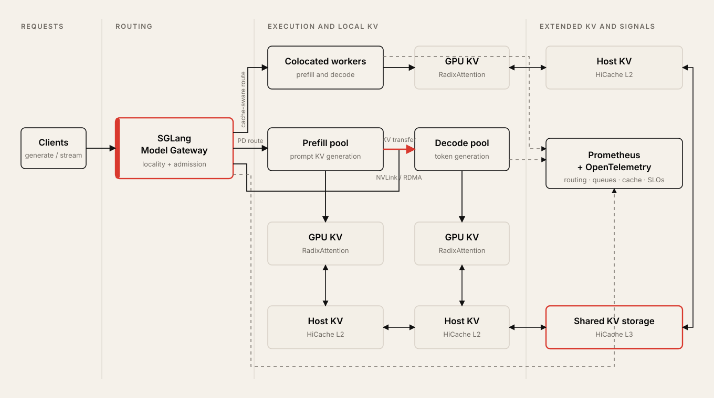
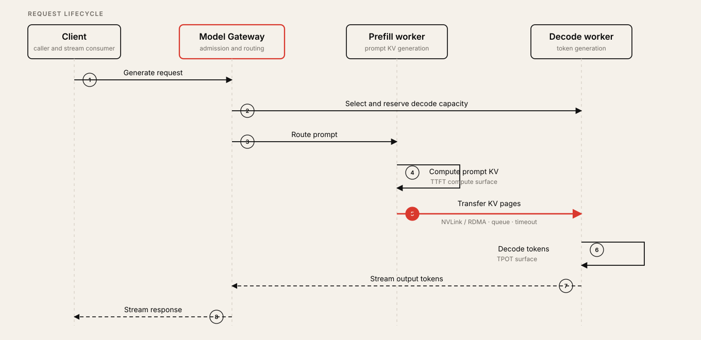
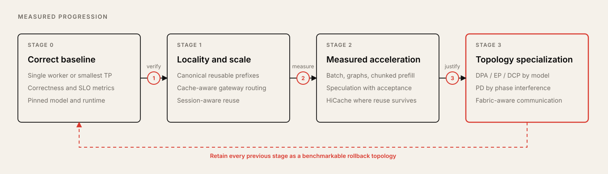

# SGLang in 2026: Engineering a Production-Grade LLM Serving Stack

> From RadixAttention to cache-aware routing, hierarchical KV storage, speculative decoding, prefill-decode disaggregation, and model-aware parallelism

**Version scope:** SGLang v0.5.18, released August 22, 2026. Commands and defaults should be revalidated when upgrading.

SGLang is often introduced as a fast inference engine. That description is correct, but no longer sufficient.

Its original contribution was a co-design of a structured-generation frontend and an inference runtime. The runtime introduced **RadixAttention** for automatic KV-cache reuse and compressed finite-state machines for structured decoding. Since then, the project has expanded into a broader serving stack: an overlapped scheduler, cache-aware routing, speculative decoding, hierarchical KV caching, prefill-decode disaggregation, expert parallelism, data-parallel attention, decode context parallelism, and a Rust-based model gateway.

Lianmin Zheng's presentation, *Efficient LLM Inference with SGLang*, is a strong architectural entry point because it captures the transition from single-engine optimization to distributed inference design. Its main themes—zero-overhead scheduling, speculative decoding, prefill-decode disaggregation, and large-scale expert parallelism—remain central. The 2026 production picture, however, adds another layer: **the serving system must coordinate KV locality, request routing, phase-specific execution, model-specific parallelism, and operational feedback as one system**.

The useful question is therefore not:

> Is SGLang faster than another engine?

It is:

> Which SGLang topology produces the best SLO-compliant goodput for this model, workload, hardware, and failure budget?

This article develops a practical answer.

## Reading map

1. [Latency decomposition and production metrics](#1-start-with-the-latency-decomposition-not-a-leaderboard)
2. [Locality-aware serving architecture](#2-a-modern-sglang-deployment-is-a-locality-aware-pipeline)
3. [RadixAttention and prompt canonicalization](#3-radixattention-makes-prompt-structure-an-infrastructure-concern)
4. [Reproducible single-node baseline](#4-build-a-boring-baseline-before-enabling-advanced-features)
5. [Workload-representative benchmarking](#5-benchmark-the-workload-you-actually-operate)
6. [Model-aware parallelism](#6-choose-parallelism-from-the-model-architecture-outward)
7. [Speculative decoding](#7-speculative-decoding-is-an-acceptance-rate-optimization)
8. [HiCache and hierarchical KV storage](#8-hicache-extends-reuse-beyond-hbm-but-capacity-is-not-locality)
9. [Prefill-decode disaggregation](#9-pd-disaggregation-is-phase-isolation-not-a-free-speedup)
10. [Model Gateway routing and admission](#10-the-model-gateway-is-part-of-the-inference-runtime)
11. [Breakable CUDA Graph](#11-use-breakable-cuda-graph-as-a-targeted-escape-hatch)
12. [Observability](#12-observability-should-explain-the-bottleneck-not-only-report-latency)
13. [Upgrade and startup reliability](#13-upgrade-and-startup-behavior-are-part-of-reliability)
14. [Adoption ladder](#14-a-practical-adoption-ladder)
15. [Production checklist](#15-production-checklist)
16. [Conclusion](#conclusion)
17. [References](#references)

### Related foundations

- [Transformer inference and the KV cache](../efficient-llm-inference-systems/week03/README.md)
- [Speculative decoding](../efficient-llm-inference-systems/week05/README.md)
- [Inference model architecture profiles](../models/README.md)

---

## 1. Start with the latency decomposition, not a leaderboard

An online generation request can be approximated as:

\[
T_{e2e} \approx T_{queue} + T_{prefill} + (N_{out}-1)\,T_{pot} + T_{network}
\]

where:

- \(T_{queue}\) is admission and scheduling delay,
- \(T_{prefill}\) determines most of time to first token,
- \(T_{pot}\) is time per output token after the first token,
- \(N_{out}\) is output length,
- \(T_{network}\) includes client transport and, in disaggregated systems, internal KV transfer.

This decomposition matters because the two transformer inference phases behave differently:

- **Prefill** processes many prompt tokens together and is usually compute-intensive.
- **Decode** produces a small number of tokens per sequence per step and is commonly constrained by memory traffic, KV-cache capacity, collective communication, or host-side launch overhead.

A useful first-order estimate for a conventional attention model's per-sequence KV-cache footprint is:

\[
KV_{bytes} \approx 2 \times L \times S \times H_{kv} \times D_h \times B
\]

where \(L\) is the number of layers, \(S\) is sequence length, \(H_{kv}\) is the number of KV heads, \(D_h\) is head dimension, and \(B\) is bytes per element. The leading 2 represents keys and values. MLA, sliding-window, sparse, compressed, and hybrid-attention architectures require different models, but the operational lesson is the same: **context length and concurrency turn KV memory into a first-class capacity resource**.

Peak tokens per second alone hides the outcomes users feel. A production benchmark should report at least:

- p50, p95, and p99 time to first token (TTFT),
- inter-token latency (ITL) or time per output token (TPOT),
- end-to-end latency,
- request and token throughput,
- error, timeout, cancellation, and OOM rates,
- cache-hit rate and KV-token utilization,
- SLO-compliant **goodput**, not merely admitted load.

One useful definition is:

\[
Goodput = \frac{\#\{requests\ meeting\ all\ SLOs\}}{measurement\ interval}
\]

An optimization that raises aggregate throughput while making p99 TTFT or TPOT unacceptable is not a production win.

---

## 2. A modern SGLang deployment is a locality-aware pipeline

A useful conceptual architecture is:



There are three interacting control loops:

1. **Locality loop** — preserve and reuse KV state with RadixAttention, session awareness, hierarchical storage, and cache-aware routing.
2. **execution loop** — overlap CPU and GPU work, batch requests, choose kernels, capture CUDA graphs, and optionally verify multiple drafted tokens at once.
3. **topology loop** — select TP, replicated DP, data-parallel attention, EP, DCP, or prefill-decode separation according to the model and traffic.

Many disappointing deployments tune only the second loop. They install a fast kernel, increase batch size, and then lose the gain through poor prompt canonicalization, round-robin routing, cache fragmentation, or an inappropriate parallelism topology.

---

## 3. RadixAttention makes prompt structure an infrastructure concern

RadixAttention stores reusable token prefixes and their KV tensors in a radix tree. When a new request arrives, SGLang can match the longest cached prefix, reuse the corresponding KV state, and compute only the uncached suffix. The runtime manages prefix search, insertion, and eviction automatically.

The mechanism changes an application-level concern—how prompts are serialized—into a serving-system concern.

Two prompts that are semantically identical but tokenized differently do not share a cache entry. Common causes include:

- inconsistent whitespace or separators,
- non-deterministic JSON key order in tool definitions,
- timestamps or request IDs inserted near the beginning,
- changing system-prompt versions without explicit versioning,
- RAG passages ordered differently for equivalent results,
- different chat templates or tokenizer revisions across replicas.

### Production practice: make reusable prefixes canonical

Place stable content first and volatile content late. Version system prompts deliberately. Serialize tools and schemas deterministically. Keep the model, tokenizer, chat template, and prompt-building library aligned across every worker expected to share traffic.

For shared-prefix workloads, use cache-aware routing rather than naive round robin. The gateway can route a request toward the worker with the most promising prefix locality while accounting for worker load. The original SGLang v0.4 measurements showed large gains on a deliberately prefix-heavy workload, but the exact multiplier is workload-specific; the durable lesson is that **routing policy and cache policy must be designed together**.

For long-lived agents and multi-turn conversations, current SGLang also provides session-aware radix caching. A stable `session_id` gives active-session KV soft eviction priority. It does not reconstruct the conversation or pin memory permanently: the application must still send the intended full prompt, and referenced KV can still be evicted under pressure. Close the session on normal completion, error, and cancellation paths so stale references do not distort eviction decisions.

```bash
curl -X POST http://localhost:30000/close_session \
  -H 'Content-Type: application/json' \
  -d '{"session_id":"agent-42"}'
```

The central principle is:

> Cache-hit rate is not merely an engine property. It is a contract among prompt construction, routing, session lifecycle, and cache capacity.

---

## 4. Build a boring baseline before enabling advanced features

Do not begin with speculative decoding, HiCache L3, PD disaggregation, and expert parallelism enabled together. That produces an impressive command line and an un-debuggable system.

Start with the smallest topology that fits the model and exposes metrics:

```bash
python -m sglang.launch_server \
  --model-path "$MODEL" \
  --host 0.0.0.0 \
  --port 30000 \
  --enable-metrics
```

Pin the experimental envelope:

- SGLang release and container digest,
- model and tokenizer revisions,
- chat template,
- dtype and quantization format,
- GPU type, interconnect, driver, and runtime,
- request dataset and random seed,
- input/output-length distributions,
- arrival-rate and concurrency model.

Then validate correctness, warm-up behavior, steady-state latency, memory headroom, cancellation, shutdown, and restart. Only one major optimization should change per experiment.

### A practical tuning loop

SGLang's tuning guide exposes useful scheduler and memory signals. Treat its numerical suggestions as starting points rather than universal constants.

| Observed signal | Likely interpretation | First experiment | Main trade-off |
|---|---|---|---|
| Queue repeatedly falls to zero during an intended saturation test | The client is not submitting fast enough | Increase client concurrency or submission rate | May stop representing real traffic |
| Queue is non-empty but KV token usage remains low | Admission is too conservative for actual completion behavior | Reduce `--schedule-conservativeness` gradually | Higher risk of request retraction |
| Frequent “KV cache pool is full; retract requests” warnings | Admission is too aggressive | Increase `--schedule-conservativeness` | Lower peak concurrency |
| Large unused GPU-memory headroom after startup | KV pool may be undersized | Raise `--mem-fraction-static` in small increments | Less activation/CUDA-graph headroom |
| OOM during long-prompt prefill | Prefill activation working set is too large | Reduce `--chunked-prefill-size` | Longer prefill time |
| OOM during decode | Too many active sequences or excessive KV pressure | Reduce `--max-running-requests` | Lower concurrency |
| Decode remains launch/host-overhead sensitive | Graph capture range may be too narrow | Test `--cuda-graph-max-bs-decode` | More reserved memory and startup work |

SGLang defines the high-level memory budget as:

\[
GPU\ memory \approx weights + KV\ pool + CUDA\ graph\ buffers + activations
\]

and:

\[
mem\_fraction\_static = \frac{weights + KV\ pool}{GPU\ capacity}
\]

The documentation suggests checking startup-reported free memory and often retaining roughly 5–8 GB for activations and graph buffers. This is a rule of thumb, not an SLO: multimodal encoders, very large prefill chunks, speculative draft states, unusual kernels, and model-specific workspaces can require a different reserve.

Tune memory under the worst legitimate request shape, not the median request.

---

## 5. Benchmark the workload you actually operate

SGLang includes `bench_serving`, which can measure TTFT, ITL, TPOT, end-to-end latency, throughput, and speculative acceptance. It supports synthetic inputs and datasets for chat, generated shared prefixes, multimodal requests, speculative decoding, and multi-turn agentic traces.

A representative online test may look like:

```bash
python3 -m sglang.bench_serving \
  --backend sglang \
  --host 127.0.0.1 \
  --port 30000 \
  --model "$MODEL" \
  --dataset-name random \
  --random-input-len 1024 \
  --random-output-len 512 \
  --num-prompts 2000 \
  --request-rate 32 \
  --max-concurrency 128 \
  --warmup-requests 16 \
  --output-file results.jsonl \
  --output-details
```

Run a matrix rather than a single benchmark:

| Workload class | What it exposes |
|---|---|
| Short interactive chat | CPU overhead, small-batch decode latency, streaming path |
| Long-context RAG | prefill throughput, chunking, TTFT, KV capacity |
| Repeated system/tool prefix | RadixAttention and cache-aware routing value |
| Multi-turn agent trace | session locality, cache eviction, variable acceptance, cancellation |
| Offline batch | maximum batch efficiency and aggregate throughput |
| Multimodal input | encoder memory, vision-token accounting, graph compatibility |

For each class, test:

- cold cache and warm cache,
- steady open-loop arrivals and bursts,
- realistic and adversarial length distributions,
- low, medium, and saturation concurrency,
- worker restart and cache loss,
- timeout and cancellation storms.

A closed-loop client that waits for each response before sending the next can hide queue collapse and coordinated omission. For online capacity work, an open-loop arrival process is usually more revealing. SGLang's non-infinite `--request-rate` models arrivals with a Poisson process; use a separate burst test for synchronized spikes.

---

## 6. Choose parallelism from the model architecture outward

There is no universally best parallelism mode.

| Mechanism | Use it when | What it solves | Main cost or constraint |
|---|---|---|---|
| **Tensor Parallelism (TP)** | A dense model does not fit, or a single replica needs multiple GPUs | Shards weights and compute within a request | Collective communication on the critical path |
| **Replicated DP through Model Gateway** | One replica fits and throughput needs horizontal scale | Independent request processing and failure domains | Duplicate weights; cache locality must be routed |
| **Data-Parallel Attention (DPA)** | MLA or supported attention layouts make TP duplicate KV state | Reduces per-rank KV duplication and permits larger batches | Topology constraints and redistribution around non-attention layers |
| **Expert Parallelism (EP)** | Large MoE expert weights or routed compute need sharding | Distributes experts and grouped GEMMs | All-to-all traffic and expert imbalance |
| **Decode Context Parallelism (DCP)** | Very long-context MLA decode is KV-capacity constrained | Stripes one request's MLA KV across ranks | Context-independent collectives; narrow compatibility envelope |
| **Prefill-Decode disaggregation (PD)** | Prefill interferes with decode, and phase demand can be scaled independently | Isolates compute-heavy and memory-heavy phases | KV transfer, more failure modes, more routing/state coordination |

### Prefer gateway-based replicated DP when a replica fits

For ordinary dense or GQA models, horizontally replicated workers behind the SGLang Model Gateway are often the cleanest first scale-out step. Current SGLang documentation explicitly discourages treating native in-process DP as the production routing layer; the gateway adds cache-aware policies, health checks, circuit breakers, rate limiting, queuing, observability, and dynamic worker management.

```bash
# Workers
python -m sglang.launch_server \
  --model-path "$MODEL" \
  --host 0.0.0.0 \
  --port 8000 \
  --enable-metrics

# Gateway
python -m sglang_router.launch_router \
  --worker-urls http://worker1:8000 http://worker2:8000 \
  --policy cache_aware \
  --host 0.0.0.0 \
  --port 30000
```

Use cache-aware routing when prefixes are valuable. Use a load-oriented policy such as power-of-two when load balance dominates and cache affinity is weak. Keep round robin as a diagnostic baseline, not an assumed optimum.

### Use DPA for the architecture it was designed to help

DPA is especially valuable for MLA-family models, where conventional TP can replicate a small or shared latent KV representation across ranks. Each attention-DP replica handles separate requests and its own KV cache; other layers can still use suitable model-parallel communication. Do not cargo-cult DPA onto a standard Llama deployment without measuring it.

### Use EP when the model is actually MoE-bound

For MoE models, SGLang separates the all-to-all communication backend from the expert-compute backend. Keep the compute backend on `auto` first. Select the communication backend according to hardware and fabric: DeepEP and related NVIDIA paths, MORI for AMD deployments, or another documented backend that matches the topology.

For DeepEP-style operation, `--deepep-mode auto` lets the runtime select throughput-oriented behavior for prefill and low-latency behavior for decode. Introduce Two-Batch Overlap and Expert Parallel Load Balancing only after profiles show communication bubbles or expert skew. At scale, EP performance is as much a network and load-balancing problem as a GEMM problem.

### Treat DCP as an advanced MLA long-context tool

DCP stripes an MLA request's KV state by token position across ranks and merges partial attention outputs with an exact log-sum-exp reduction. It complements TP and DPA rather than replacing them.

Its topology must be validated explicitly. In a DPA composition:

\[
attention\_tp\_size = \frac{tp\_size}{attention\_dp\_size}
\]

and:

\[
attention\_tp\_size \bmod dcp\_size = 0
\]

The current documentation warns that startup validation may check only a weaker divisibility condition, so the deployment layer should enforce the stronger containment rule itself. DCP also has combination-specific limitations with PD, HiCache, and speculative decoding. It belongs near the end of the adoption ladder, not the beginning.

---

## 7. Speculative decoding is an acceptance-rate optimization

Speculative decoding uses a cheaper draft path to propose multiple tokens, then verifies them with the target model. The benefit depends on three quantities:

\[
Gain \approx verified\ tokens\ saved - draft\ cost - verification\ overhead
\]

A high nominal draft length does not guarantee a speedup. At high batch sizes, rejected draft work is multiplied across many sequences, and an aggressive setting can reduce goodput.

Current SGLang supports multiple paths, including EAGLE-2, EAGLE-3, model-provided multi-token prediction (MTP), DFlash, a standalone smaller draft model, and an N-gram variant. The documentation positions EAGLE-3 as the preferred speed/quality path when a compatible draft model is available and EAGLE-2 as a broad default. Use MTP when the target model exposes suitable prediction heads. N-gram drafting can be useful when no extra model is available, but its support and compatibility differ from the EAGLE path.

A minimal EAGLE-3 experiment is:

```bash
python -m sglang.launch_server \
  --model-path "$TARGET_MODEL" \
  --speculative-algorithm EAGLE3 \
  --speculative-draft-model-path "$DRAFT_MODEL" \
  --enable-metrics
```

Current SGLang uses the V2 speculative workers with the overlap scheduler enabled by default. When that path is intended, set `--speculative-eagle-topk 1` explicitly. A value greater than one is incompatible, and omitting the flag can allow model-specific auto-tuning to choose an incompatible branching factor. Use `--disable-overlap-schedule` only as a controlled synchronous baseline or debugging fallback.

Do not copy a reported tokens-per-second number into a capacity plan. Re-run the exact target/draft pair against your output-entropy and batch-size distribution. Compare:

- accepted draft length,
- draft and verify time,
- TPOT and ITL,
- TTFT,
- maximum concurrency,
- additional model and CUDA-graph memory,
- p99 goodput under the same arrival process.

SGLang's adaptive speculative mode can change the speculative step count according to recent acceptance behavior and batch-size tier. It is useful for traffic that moves between high- and low-acceptance phases. The current implementation is limited to EAGLE/EAGLE-3 with top-k 1. At high batch sizes, narrow candidate ladders are often safer because wasted drafting becomes expensive. If one static configuration is already stable and well tuned, adaptive mode may add little.

The production rule is simple:

> Enable speculative decoding because measured acceptance amortizes its cost—not because a model family is listed as supported.

---

## 8. HiCache extends reuse beyond HBM, but capacity is not locality

RadixAttention's fastest tier is GPU-resident KV. Long contexts and many sessions can evict useful prefixes even when the same data may soon be reused. HiCache extends the hierarchy:

- **L1:** GPU KV cache,
- **L2:** host-memory KV cache private to one SGLang instance,
- **L3:** optional external storage that can be shared across instances when configured with a common namespace.

An important scope detail is easy to miss: L1 and L2 are instance-private. Increasing the host-cache ratio does not create a node-wide or cluster-wide pool. Cross-instance reuse requires an L3 backend such as a supported Mooncake, HF3FS, NIXL, or AIBrix configuration. A local file backend remains node-local unless backed by a genuinely shared namespace.

A sensible adoption sequence is:

1. Measure L1 hit rate, eviction, and recompute cost.
2. Add L2 when useful KV is evicted from HBM but host bandwidth and capacity can recover it profitably.
3. Add L3 only when cross-replica or cross-host reuse is significant enough to justify storage, metadata, and transfer complexity.

The core flags look like:

```bash
python -m sglang.launch_server \
  --model-path "$MODEL" \
  --page-size 64 \
  --enable-hierarchical-cache \
  --hicache-ratio 2 \
  --hicache-mem-layout page_first \
  --hicache-io-backend kernel \
  --hicache-write-policy write_through \
  --enable-metrics
```

Choose prefetch policy according to the SLO:

- `best_effort` favors latency predictability and abandons prefetch when needed,
- `wait_complete` favors maximum reuse but can add waiting time,
- `timeout` places an explicit bound between those behaviors.

Before sharing L3 across fleets, make the cache namespace encode every compatibility dimension that affects KV meaning: model revision, tokenizer and template, KV dtype, attention layout, TP layout, page layout, and relevant runtime format. A cache hit on semantically incompatible state is worse than a miss.

HiCache also composes with PD deployments. A conservative pattern enables shared caching only on prefill nodes. A more advanced pattern asynchronously offloads decode KV so later turns can be recovered by prefill. The second design can help multi-turn traffic, but it adds write bandwidth and lifecycle complexity; validate it with actual session-return intervals.

---

## 9. PD disaggregation is phase isolation, not a free speedup

In a colocated engine, long prefill work can interrupt or distort decode scheduling. The effect appears as TTFT spikes, TPOT or ITL degradation, and uneven attention-DP progress. PD disaggregation assigns prefill and decode to separate worker pools and transfers the generated KV state between them.



SGLang supports Mooncake and NIXL transfer paths. On appropriate systems, KV traffic can use NVLink or RDMA. That does not eliminate the cost; it changes it from recomputation and phase interference into transfer, registration, queueing, and failure-recovery overhead.

Adopt PD only after answering four questions:

1. **Interference:** Do long prefills measurably harm decode p95/p99 latency in the colocated baseline?
2. **Demand ratio:** Does the required prefill capacity scale differently from decode capacity over time?
3. **Transfer budget:** Is KV transfer plus bootstrap delay smaller and more predictable than the interference being removed?
4. **Operational budget:** Can the platform monitor and recover from partial handoffs, worker loss, stale registrations, timeout, and backpressure?

At the gateway, a useful starting policy is cache-aware routing for prefill and load-oriented power-of-two routing for decode:

```bash
python -m sglang_router.launch_router \
  --pd-disaggregation \
  --prefill http://prefill1:30001 9001 \
  --decode http://decode1:30011 \
  --prefill-policy cache_aware \
  --decode-policy power_of_two \
  --host 0.0.0.0 \
  --port 30000
```

Profile the two phases separately. Track at least prefill compute time, decode TPOT, KV bytes, transfer duration, wait duration, timeout, failed handoff, and pool-specific queue depth.

Heterogeneous prefill and decode TP can be valuable when the phases prefer different shapes. It also changes the KV layout. Current SGLang provides a staging-buffer path for supported non-MLA cases, but this is an optimization to validate on a compatible model and topology—not a default design assumption.

---

## 10. The Model Gateway is part of the inference runtime

Treating the gateway as a generic HTTP load balancer throws away information the serving system needs.

The SGLang Model Gateway is designed to manage regular, prefill, and decode workers; route with cache and load awareness; expose OpenAI-compatible and native paths; and add retries, circuit breakers, rate limiting, health checks, metrics, and tracing. It can also coordinate multi-model and Kubernetes-discovered fleets.

Production guidance:

- Put admission control at the gateway before GPU queues become unbounded.
- Bound retries. After a streaming response has emitted tokens, blind replay can duplicate output or tool actions; retry only within a deliberately idempotent protocol.
- Use circuit breakers and readiness that reflect real inference health, not merely an open TCP port.
- Propagate request IDs through gateway, worker, and PD transfer traces.
- Secure client and worker paths separately; use TLS/mTLS where the threat model requires it.
- Test cache locality under gateway high availability. Multiple gateway replicas may observe different routing histories, so HA can dilute cache-aware decisions unless traffic partitioning and state assumptions are explicit.

The correct abstraction is not “load balancer in front of inference.” It is **the distributed scheduler's control plane**.

---

## 11. Use Breakable CUDA Graph as a targeted escape hatch

Standard CUDA Graph capture removes repeated launch overhead, but a monolithic graph is difficult to inspect and cannot contain every dynamic operation. The blunt workaround—disabling graphs for the entire forward pass—can surrender performance far beyond the incompatible operation.

SGLang's Breakable CUDA Graph can split the forward pass into captured segments with selected eager execution between them. This is mainly a model- and backend-development technique, not a flag to enable on every production server.

For debugging, `--debug-cuda-graph` sends the decode forward path through eager execution while retaining the graph capture/replay control path. It intentionally removes the graph's performance benefit. For a production integration that has a small number of known non-capturable operations, set:

```bash
export SGLANG_USE_BREAKABLE_CUDA_GRAPH=1
```

and mark only the relevant functions with SGLang's eager-on-graph mechanism. Each break adds another graph launch and eager call, so profile the segmented path against both the full graph and fully eager baselines. The current implementation supports CUDA and ROCm/HIP, and it is not compatible with SGLang's memory-saver CUDA-graph mode.

The operational rule is:

> Break the graph at the smallest incompatible boundary; do not turn a local dynamic operation into a global eager-mode regression.

---

## 12. Observability should explain the bottleneck, not only report latency

Enable worker metrics with `--enable-metrics` and scrape `/metrics`. SGLang exposes counters and histograms for prompt and generated tokens, TTFT, TPOT, end-to-end latency, queue depth, running requests, token usage, throughput, cache hit rate, and speculative state, among other signals. The Model Gateway adds its own routing and reliability metrics plus OpenTelemetry integration.

A minimal dashboard should connect causes to outcomes:

| Layer | Key signals | Question answered |
|---|---|---|
| Client/Gateway | admitted RPS, rejected RPS, queue delay, rate-limit, route policy, retries, breaker state | Is demand being controlled and routed correctly? |
| User SLO | TTFT, TPOT/ITL, end-to-end p50/p95/p99, stream errors | What does the user experience? |
| Scheduler | waiting/running requests, token usage, retractions, batch size, graph use | Is batching efficient and safe? |
| KV locality | prefix hit rate, reused tokens, eviction, HiCache H2D/D2H/L3 latency | Is cache capacity producing real reuse? |
| Speculation | active steps, draft tokens, accepted length, verify cost | Does drafting pay for itself? |
| PD | prefill/decode queues, handoff time, transfer bytes, timeout/failure | Does phase separation remove more interference than it adds? |
| GPU/fabric | utilization, HBM use/bandwidth, collectives, RDMA/NVLink throughput, errors | Is the bottleneck compute, memory, or communication? |
| Capacity | goodput per GPU, tok/s per GPU, cost per SLO-compliant request | Is the system economically efficient? |

SGLang does not log request content by default. Keep that default unless there is a clear debugging and privacy policy. Request dump/replay and crash dumps are powerful for reproducing failures, but they may contain prompts, generated text, tool payloads, or other sensitive data. Encrypt, restrict, expire, and audit those artifacts like production data.

---

## 13. Upgrade and startup behavior are part of reliability

SGLang evolves quickly. Version-specific performance claims should be treated as release benchmarks, not timeless defaults.

As of August 30, 2026, the latest stable release is v0.5.18. Notable operational changes include:

- an opt-in overlapped checkpoint-staging mode, `--startup-weight-load-mode overlap`, which overlaps storage staging with CUDA-graph capture,
- a unified `SGLANG_CACHE_DIR` for Triton, FlashInfer, Inductor, DeepGEMM, and CUDA-driver compilation caches,
- release-specific kernel and communication improvements for newer NVIDIA and AMD architectures.

The first startup after an upgrade may recompile caches. Do not let that first request define pod readiness.

A safer rollout sequence is:

1. Pin the release, image digest, model revision, and launch arguments.
2. Start a canary on the exact production GPU and fabric.
3. Load weights, compile kernels, and capture graphs before declaring readiness.
4. Run correctness and representative warm/cold benchmarks.
5. Compare SLO goodput, memory, cache behavior, and error rates—not only average tokens per second.
6. Preserve the previous image and cache assumptions for rollback.

For large TP deployments, investigate pre-sharded checkpoint formats, layered loading, streaming loaders, or remote-instance loading only after storage traces identify startup I/O as the bottleneck.

---

## 14. A practical adoption ladder



### Stage 0 — Correct single-worker baseline

- One worker or the smallest TP that fits.
- OpenAI-compatible correctness tests.
- Metrics, representative benchmark, memory/OOM envelope.
- Pinned software, model, template, and hardware.

### Stage 1 — Exploit locality and horizontal scale

- Canonicalize reusable prefixes.
- Add SGLang Model Gateway.
- Compare round-robin, load-oriented, and cache-aware routing.
- Add session-aware cache for real multi-turn workloads.

### Stage 2 — Add measured acceleration

- Tune memory fraction, chunked prefill, admission, and graph range.
- Test EAGLE/MTP speculative decoding with acceptance metrics.
- Add HiCache L2 when GPU eviction destroys valuable reuse.
- Add L3 only for demonstrated cross-instance reuse.

### Stage 3 — Specialize the topology

- DPA for supported MLA-style attention.
- EP for large MoE models with a fabric-appropriate all-to-all backend.
- PD when phase interference and independent scaling justify KV transfer.
- DCP for long-context MLA capacity after validating composition constraints.

At every stage, retain the previous stage as a benchmarkable rollback topology.

---

## 15. Production checklist

Before calling the deployment production-ready, verify that:

- the benchmark reproduces real prompt, output, prefix, and arrival distributions;
- TTFT, TPOT/ITL, end-to-end latency, and goodput have explicit SLOs;
- prompts, tools, templates, tokenizer, and model revisions are canonical and pinned;
- cache-aware routing is justified by measured prefix reuse;
- memory tuning survives worst-case input, concurrency, and multimodal shapes;
- speculative decoding improves goodput at real batch sizes and output entropy;
- PD transfer latency and failure recovery are observable and bounded;
- EP expert imbalance and all-to-all traffic are monitored;
- gateway admission, retries, circuit breaking, and cancellation semantics are tested;
- request dumps, crash dumps, traces, and logs follow the data-security policy;
- upgrades precompile/warm before readiness and have a tested rollback path.

---

## Conclusion

The enduring insight in SGLang is not one kernel or one benchmark. It is the co-design of execution and reuse.

RadixAttention turns token-prefix structure into reusable compute. The overlapped scheduler hides host work. Speculative decoding trades cheap guesses for fewer target-model steps. HiCache extends useful state beyond GPU memory. The Model Gateway preserves locality while controlling distributed load. PD, DPA, EP, and DCP specialize execution around phase and model architecture.

That power also makes configuration-by-checklist dangerous. Each feature moves cost rather than deleting it:

- caching trades memory and state management for recomputation,
- speculation trades draft and verification work for fewer decode rounds,
- PD trades phase interference for KV transfer and distributed coordination,
- EP trades replicated experts for all-to-all communication,
- DCP trades replicated long-context KV for per-layer collectives.

The production method is therefore incremental:

> Establish a correct baseline, measure the dominant bottleneck, introduce the smallest mechanism that targets it, and keep the optimization only when it improves SLO-compliant goodput under realistic traffic.

That is the most useful way to understand SGLang in 2026: not merely as a fast model server, but as a toolkit for building a locality-aware, phase-aware, model-aware inference system.

---

## References

1. Lianmin Zheng et al., [SGLang: Efficient Execution of Structured Language Model Programs](https://arxiv.org/abs/2312.07104), NeurIPS 2024.
2. LMSYS, [Fast and Expressive LLM Inference with RadixAttention and SGLang](https://www.lmsys.org/blog/2024-01-17-sglang/), 2024.
3. LMSYS, [SGLang v0.4: Zero-Overhead Batch Scheduler, Cache-Aware Load Balancer, Faster Structured Outputs](https://www.lmsys.org/blog/2024-12-04-sglang-v0-4/), 2024.
4. LMSYS, [Deploying DeepSeek with PD Disaggregation and Large-Scale Expert Parallelism on 96 H100 GPUs](https://www.lmsys.org/blog/2025-05-05-large-scale-ep/), 2025.
5. AMD, [Efficient LLM Inference with SGLang — Lianmin Zheng](https://www.amd.com/en/corporate/events/advancing-ai/2025/advancing-ai-2025.html), 2025.
6. YouTube, [Efficient LLM Inference with SGLang](https://www.youtube.com/watch?v=G4ZeVP7n0Ik).
7. SGLang, [Learning Materials](https://github.com/sgl-project/sgl-learning-materials).
8. SGLang, [Documentation](https://docs.sglang.io/).
9. SGLang, [Hyperparameter Tuning](https://docs.sglang.io/docs/advanced_features/hyperparameter_tuning).
10. SGLang, [Speculative Decoding](https://docs.sglang.io/docs/advanced_features/speculative_decoding).
11. SGLang, [Adaptive Speculative Decoding](https://docs.sglang.io/docs/advanced_features/adaptive_speculative_decoding).
12. SGLang, [Session-Aware Radix Cache](https://docs.sglang.io/docs/advanced_features/session_radix_cache).
13. SGLang, [HiCache Best Practices](https://docs.sglang.io/docs/advanced_features/hicache_best_practices).
14. SGLang, [DP, DPA, and SGLang Model Gateway](https://docs.sglang.io/docs/advanced_features/dp_dpa_smg_guide).
15. SGLang, [Expert Parallelism](https://docs.sglang.io/docs/advanced_features/expert_parallelism).
16. SGLang, [Decode Context Parallelism](https://docs.sglang.io/docs/advanced_features/dcp).
17. SGLang, [PD Disaggregation](https://docs.sglang.io/docs/advanced_features/pd_disaggregation).
18. SGLang, [SGLang Model Gateway](https://docs.sglang.io/docs/advanced_features/sgl_model_gateway).
19. SGLang, [Breakable CUDA Graph](https://docs.sglang.io/docs/advanced_features/breakable_cuda_graph).
20. SGLang, [Observability and Production Metrics](https://docs.sglang.io/docs/advanced_features/observability).
21. SGLang, [Benchmark Serving Guide](https://docs.sglang.io/docs/developer_guide/bench_serving).
22. SGLang, [v0.5.18 Release Notes](https://github.com/sgl-project/sglang/releases/tag/v0.5.18), 2026.
